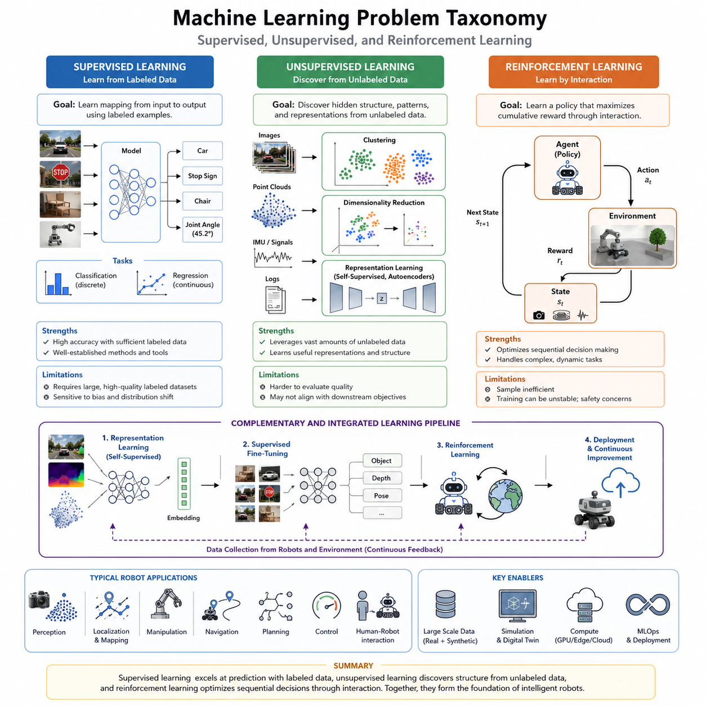
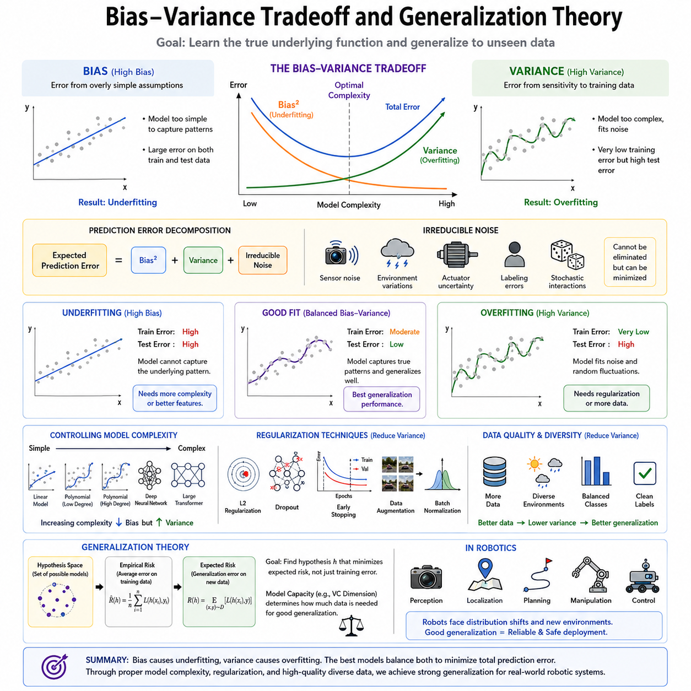
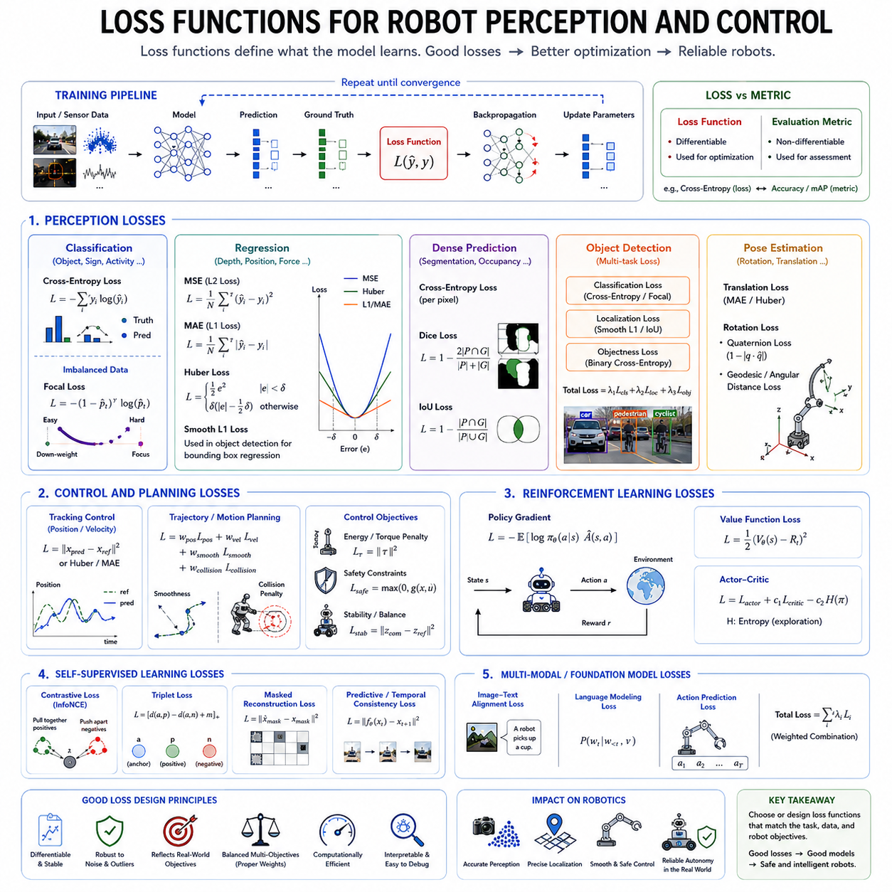
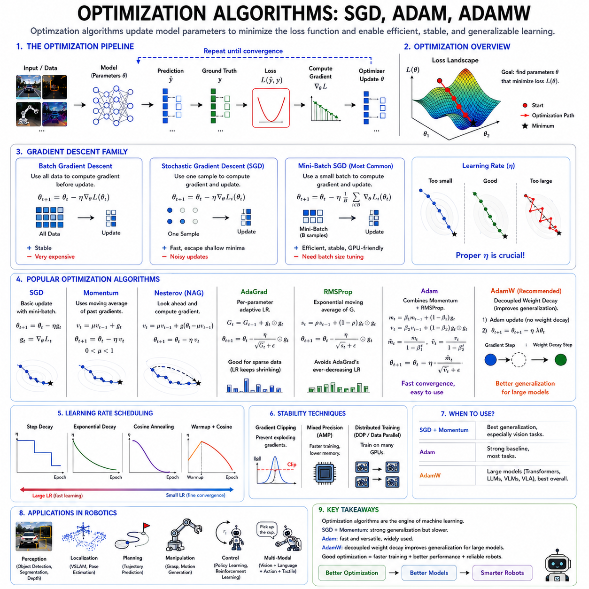
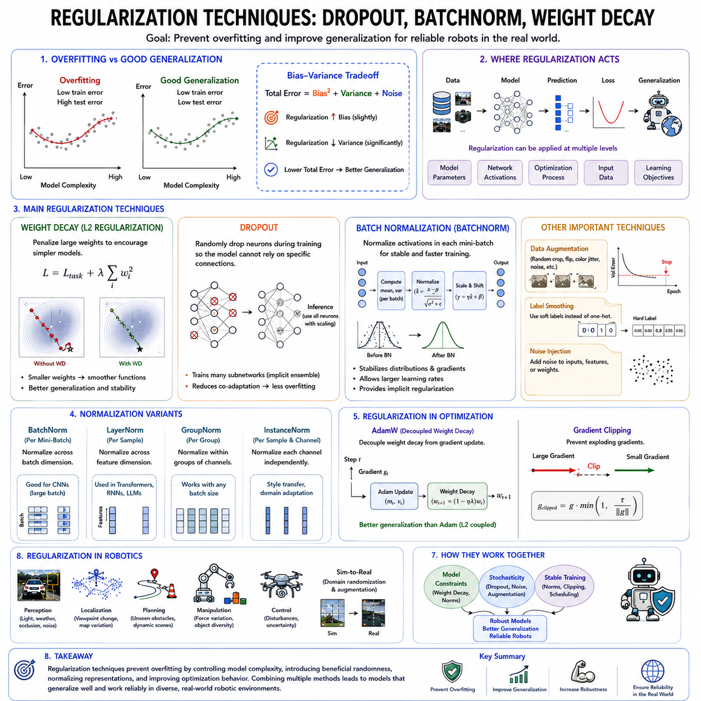
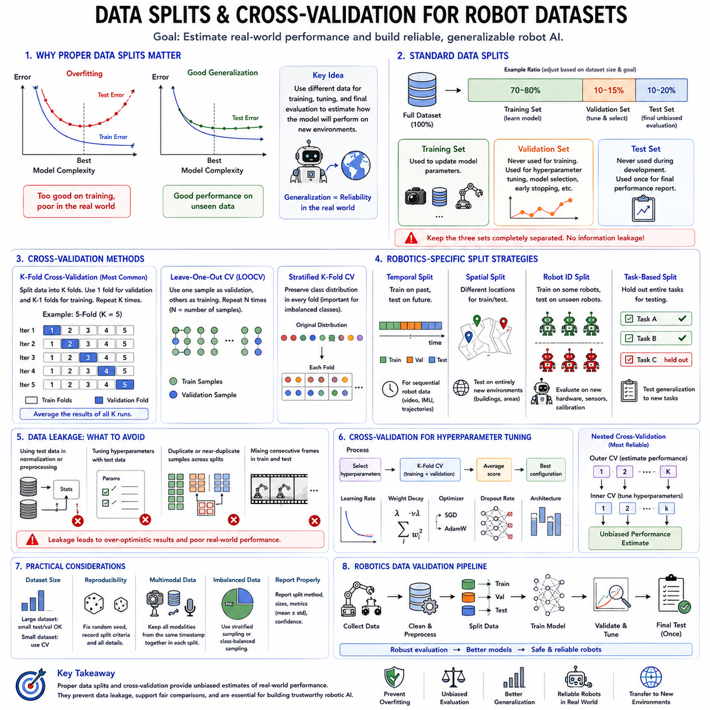
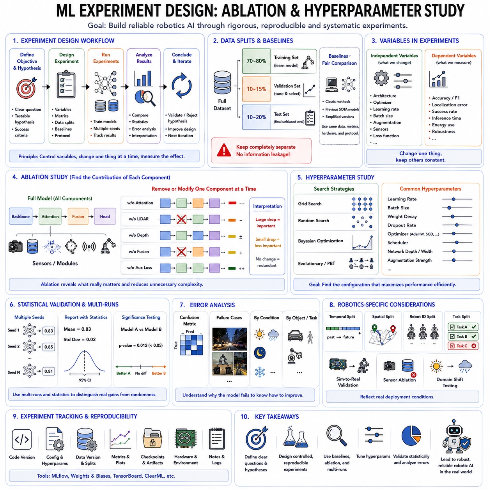
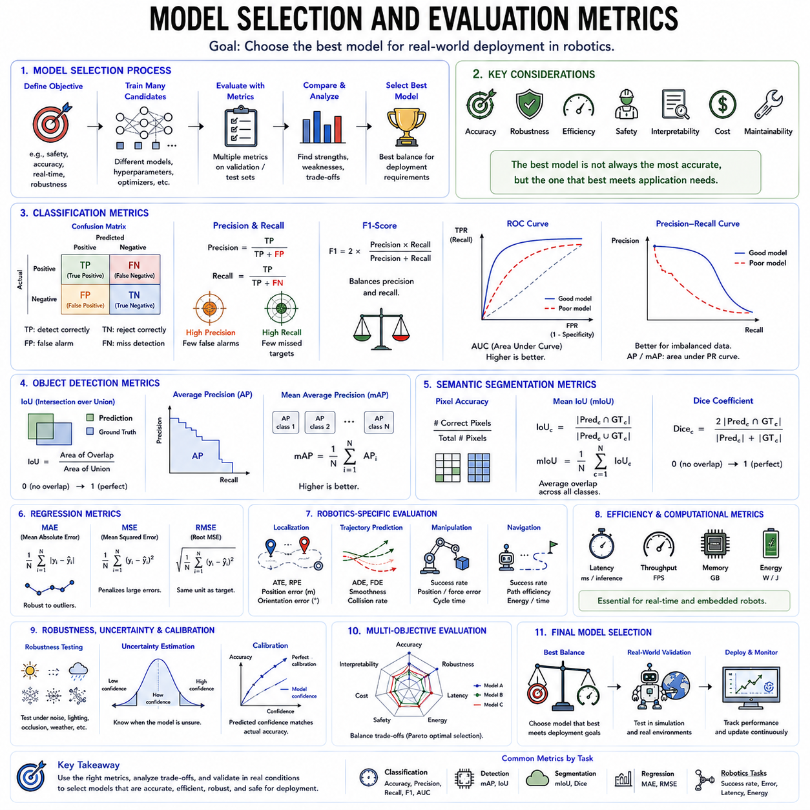
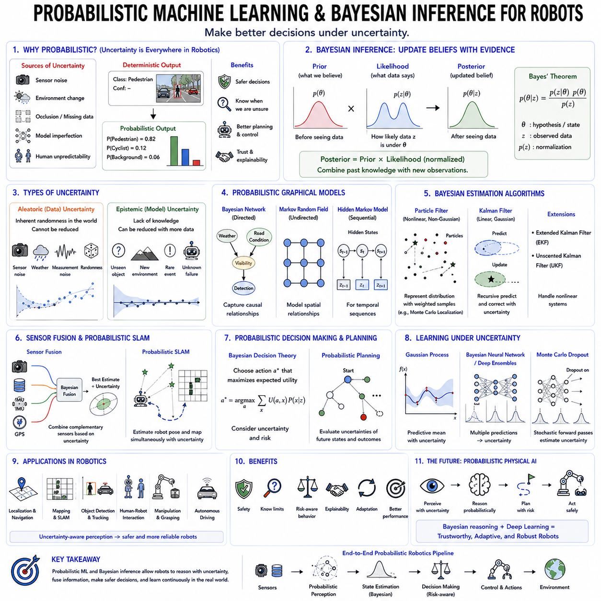
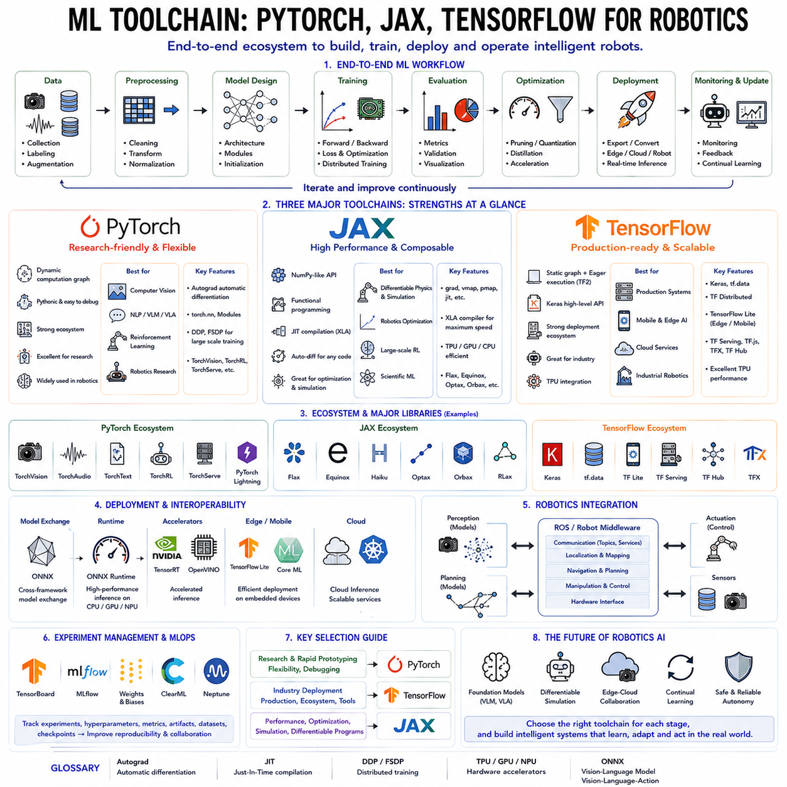

**Volume 19 Robot Machine Learning and AI**

# 01. Machine Learning Fundamentals

## 01.01 ML Problem Taxonomy Supervised Unsupervised RL

{width="7.268055555555556in" height="7.268055555555556in"}

기계학습(머신러닝, Machine Learning)은 현대 인공지능(Artificial Intelligence, AI)의 핵심 기반 기술이다. 기존의 소프트웨어가 사람이 직접 규칙을 작성하여 문제를 해결했다면, 기계학습은 데이터를 통해 규칙과 패턴을 스스로 학습한다. 이러한 특성 덕분에 자율주행 로봇, 산업용 로봇, 의료 로봇, 서비스 로봇과 같은 물리 인공지능(Physical AI) 시스템은 복잡하고 변화하는 환경에서도 스스로 판단하고 행동할 수 있게 되었다. 따라서 기계학습 문제를 올바르게 분류하고 이해하는 것은 AI 시스템 설계의 가장 중요한 출발점이라 할 수 있다.

기계학습은 크게 지도학습(지도 학습, Supervised Learning), 비지도학습(비지도 학습, Unsupervised Learning), 강화학습(강화 학습, Reinforcement Learning)으로 구분된다. 세 가지 방법은 학습 방식과 사용하는 데이터의 형태, 최적화 목표, 적용 분야가 서로 다르다. 실제 로봇 시스템에서는 이들 중 하나만 사용하는 경우보다 여러 방식을 조합하여 사용하는 경우가 점점 증가하고 있으며, 최근의 대규모 AI 모델은 이러한 학습 방식을 통합적으로 활용하는 방향으로 발전하고 있다.

지도학습(Supervised Learning)은 가장 널리 사용되는 기계학습 방법이다. 입력 데이터(Input)와 정답(Label)이 함께 제공된 데이터를 이용하여 입력과 출력 사이의 관계를 학습한다. 학습 과정에서는 모델이 예측한 결과와 실제 정답의 차이를 최소화하도록 반복적으로 파라미터(Parameter)를 조정하며, 충분한 학습이 완료되면 새로운 데이터에 대해서도 높은 정확도로 결과를 예측할 수 있다.

지도학습은 크게 분류(Classification)와 회귀(Regression) 문제로 나뉜다. 분류는 객체의 종류나 상태처럼 이산적인 값을 예측하는 문제이며, 회귀는 거리, 위치, 속도, 온도와 같은 연속적인 수치를 예측하는 문제이다. 로봇에서는 사람 인식, 장애물 분류, 도로 표지판 인식, 제품 불량 판별과 같은 작업은 분류 문제에 해당하고, 물체 위치 추정, 깊이(Depth) 계산, 관절 각도 예측, 힘 추정 등은 회귀 문제에 해당한다.

최근에는 심층신경망(Deep Neural Network)의 발전으로 지도학습의 성능이 크게 향상되었다. 합성곱 신경망(CNN), 트랜스포머(Transformer), 그래프 신경망(Graph Neural Network), 멀티모달(Multimodal) 모델은 RGB 카메라, 깊이 카메라, 라이다(LiDAR), 레이더(Radar), 촉각(Tactile), IMU 등 다양한 센서를 동시에 처리할 수 있으며, 로봇이 주변 환경을 높은 정확도로 이해하도록 지원한다. 과거의 수작업 특징 추출 방식보다 훨씬 우수한 성능을 제공하는 것이 특징이다.

그러나 지도학습은 대규모 라벨(Label) 데이터가 반드시 필요하다는 한계를 가진다. 수백만 장의 이미지나 수천 시간의 주행 데이터를 사람이 직접 라벨링하는 작업은 막대한 시간과 비용이 요구된다. 또한 데이터에 편향(Bias)이 존재하거나 특정 환경만 포함되어 있으면 실제 환경에서 성능이 급격히 저하될 수 있다. 따라서 데이터 품질과 다양성은 지도학습의 성능을 결정하는 가장 중요한 요소이다.

비지도학습(Unsupervised Learning)은 정답(Label)이 없는 데이터만을 이용하여 데이터 내부의 구조와 패턴을 스스로 찾아내는 학습 방법이다. 사람이 정답을 제공하지 않아도 데이터의 분포와 관계를 이해하려고 시도하며, 현실 세계에서 대부분의 데이터가 라벨 없이 존재하기 때문에 매우 중요한 연구 분야로 발전하고 있다. 로봇이 지속적으로 생성하는 영상, 포인트 클라우드(Point Cloud), IMU 데이터, 센서 로그 등은 대부분 비지도학습의 대상이 된다.

비지도학습의 대표적인 예는 군집화(Clustering)이다. 군집화는 서로 비슷한 특성을 가진 데이터를 자동으로 그룹으로 묶는 방법으로, 로봇은 이를 이용하여 유사한 환경을 구분하거나 반복적으로 등장하는 물체를 분류할 수 있다. 또한 차원 축소(Dimensionality Reduction)는 매우 높은 차원의 데이터를 의미 있는 저차원 표현으로 변환하여 계산량을 줄이고, 중요한 특징만 남길 수 있도록 한다.

표현학습(Representation Learning)은 최근 비지도학습에서 가장 중요한 분야 중 하나이다. 입력 데이터를 단순히 압축하는 것이 아니라, 이후 다양한 작업에서 활용 가능한 의미 있는 특징 표현(Feature Representation)을 학습한다. 이러한 표현은 객체 인식, 위치 추정, 조작(Manipulation), 경로 계획(Planning), 강화학습 등 여러 AI 시스템의 성능을 동시에 향상시키는 기반이 된다.

최근에는 자기지도학습(자기 지도 학습, Self-Supervised Learning)이 비지도학습의 중요한 발전 방향으로 자리 잡았다. 자기지도학습은 사람이 라벨을 만들지 않아도 데이터 자체에서 학습 목표를 생성한다. 일부 정보를 가리거나(Masking), 다음 프레임을 예측하거나, 서로 다른 센서 정보를 비교하는 방식으로 스스로 정답을 생성하기 때문에 대규모 데이터 학습이 가능하며, 현재의 기초모델(Foundation Model) 학습에서도 핵심 기술로 활용되고 있다.

생성모델(Generative Model) 역시 비지도학습의 중요한 분야이다. 변분 오토인코더(VAE), 생성적 적대 신경망(GAN), 확산모델(Diffusion Model)은 데이터의 확률 분포를 학습하여 새로운 데이터를 생성할 수 있다. 이러한 기술은 로봇 시뮬레이션, 합성 데이터(Synthetic Data) 생성, 이상 탐지(Anomaly Detection), 환경 복원, 세계모델(World Model) 구축 등 다양한 분야에서 활용되고 있다.

강화학습(Reinforcement Learning)은 지도학습이나 비지도학습과는 전혀 다른 문제를 해결한다. 강화학습에서는 에이전트(Agent)가 환경(Environment)과 직접 상호작용하면서 행동(Action)을 수행하고, 그 결과로 보상(Reward)을 받는다. 학습의 목적은 즉각적인 보상이 아니라 장기적으로 가장 큰 누적 보상(Cumulative Reward)을 얻는 정책(Policy)을 학습하는 것이다. 따라서 연속적인 의사결정이 필요한 문제에 매우 적합하다.

강화학습은 일반적으로 마르코프 결정 과정(Markov Decision Process, MDP)을 기반으로 설명된다. 현재 상태(State), 가능한 행동(Action), 상태 전이(Transition), 보상 함수(Reward Function), 정책(Policy), 가치 함수(Value Function) 등의 요소를 이용하여 최적의 행동 전략을 학습한다. 이러한 수학적 구조는 대부분의 현대 강화학습 알고리즘의 이론적 기반이 된다.

로봇 분야에서 강화학습은 매우 중요한 의미를 가진다. 보행 로봇은 균형을 유지하면서 다양한 지형을 이동해야 하고, 매니퓰레이터(Manipulator)는 여러 관절을 동시에 제어하여 복잡한 작업을 수행해야 한다. 자율주행 차량은 주변 차량과 보행자를 고려하면서 안전한 경로를 지속적으로 계획해야 한다. 이러한 문제들은 모두 현재의 행동이 미래의 결과에 영향을 미치므로 강화학습이 매우 적합한 접근 방식이다.

현대 강화학습 알고리즘은 가치 기반(Value-Based), 정책 기반(Policy-Based), 액터-크리틱(Actor-Critic) 방식으로 구분된다. 최근에는 PPO, SAC, TD3, Dreamer, MBPO와 같은 알고리즘이 높은 안정성과 성능을 제공하면서 로봇 제어에 널리 활용되고 있다. 또한 오프라인 강화학습(Offline Reinforcement Learning)은 기존에 수집된 데이터만으로도 정책을 학습할 수 있어 실제 산업 환경에서 활용성이 더욱 높아지고 있다.

강화학습의 가장 큰 어려움은 데이터 효율성(Sample Efficiency)이다. 실제 로봇은 수백만 번의 시행착오를 반복할 수 없으며, 하드웨어 손상이나 안전사고의 위험도 존재한다. 따라서 최근에는 Isaac Sim, Isaac Gym, MuJoCo와 같은 물리 시뮬레이터에서 대규모 학습을 수행한 뒤, Sim-to-Real 기술을 이용하여 실제 로봇으로 정책을 이전하는 방식이 표준적인 개발 절차로 자리 잡고 있다.

세 가지 학습 방법은 서로 경쟁하는 기술이 아니라 상호 보완적인 기술이다. 지도학습은 충분한 라벨 데이터가 있을 때 가장 높은 예측 정확도를 제공하며, 비지도학습은 방대한 비라벨 데이터를 활용하여 의미 있는 표현을 학습한다. 강화학습은 실제 환경에서 최적의 행동 정책을 학습하는 데 가장 적합하다. 따라서 최신 로봇 AI 시스템은 이 세 가지 학습 방식을 하나의 통합 파이프라인으로 결합하는 구조를 채택하는 경우가 많다.

예를 들어, 먼저 자기지도학습(Self-Supervised Learning)을 이용하여 시각 표현을 학습한 후, 지도학습으로 객체 인식 모델을 미세조정(Fine-Tuning)하고, 마지막으로 강화학습을 이용하여 이동이나 조작 정책을 최적화할 수 있다. 이러한 단계적 접근은 각각의 학습 방식이 가진 장점을 최대한 활용하면서 데이터 효율성과 일반화 성능을 동시에 향상시키는 효과를 제공한다.

미래의 기계학습은 기존처럼 지도학습, 비지도학습, 강화학습을 명확히 구분하기보다 하나의 통합된 학습 체계로 발전하고 있다. 기초모델(Foundation Model), 세계모델(World Model), 비전-언어 모델(Vision-Language Model, VLM), 비전-언어-행동 모델(Vision-Language-Action Model, VLA)은 여러 학습 방식을 동시에 활용하여 더욱 일반적인 지능을 구현하고 있다. 앞으로의 물리 인공지능(Physical AI) 시스템은 다양한 학습 패러다임을 지속적으로 결합하고 발전시키면서, 스스로 환경을 이해하고 학습하며 적응하는 범용 로봇 지능(General Robot Intelligence)의 핵심 기반이 될 것으로 기대된다.

## 01.02 Bias Variance Tradeoff and Generalization Theory

{width="7.268055555555556in" height="7.268055555555556in"}

편향-분산 트레이드오프(편향-분산 절충, Bias-Variance Tradeoff)는 기계학습(머신러닝, Machine Learning)에서 가장 중요한 개념 중 하나이다. 이 개념은 왜 어떤 모델은 새로운 데이터에서도 높은 성능을 유지하는 반면, 어떤 모델은 학습 데이터에서는 매우 높은 정확도를 보이지만 실제 환경에서는 성능이 급격히 저하되는지를 설명한다. 기계학습의 궁극적인 목적은 학습 데이터를 단순히 암기하는 것이 아니라 데이터 생성의 근본적인 규칙을 학습하여 새로운 상황에서도 올바르게 예측하는 것이다. 이러한 능력을 일반화(Generalization)라고 한다.

일반화 이론(Generalization Theory)은 학습된 모델이 보지 못한 데이터에서도 얼마나 안정적으로 동작하는지를 설명하는 이론적 기반이다. 특히 자율주행 로봇, 산업용 로봇, 서비스 로봇과 같은 물리 인공지능(Physical AI)은 끊임없이 변화하는 실제 환경에서 동작해야 하므로 일반화 능력이 매우 중요하다. 따라서 편향(Bias), 분산(Variance), 일반화(Generalization)를 이해하는 것은 인공지능 시스템 설계의 핵심 요소라 할 수 있다.

기계학습은 입력(Input)과 출력(Output) 사이의 미지의 함수를 근사하는 과정으로 볼 수 있다. 그러나 실제 학습에서는 제한된 데이터만 사용할 수 있기 때문에 항상 예측 오차(Prediction Error)가 발생한다. 이러한 오차는 데이터 자체의 잡음(Noise), 데이터 부족, 모델의 구조적 한계, 최적화 과정의 불완전성 등 여러 원인에 의해 발생한다. 통계적 학습 이론에서는 이러한 예측 오차를 여러 요소로 분해하며, 그중 가장 중요한 요소가 편향(Bias)과 분산(Variance)이다.

편향(Bias)은 모델이 지나치게 단순한 가정을 하기 때문에 발생하는 체계적인 오차를 의미한다. 높은 편향을 가진 모델은 실제 데이터가 매우 복잡하더라도 이를 단순한 관계로 표현하려고 하므로 중요한 패턴을 학습하지 못한다. 따라서 학습 데이터와 새로운 데이터 모두에서 오차가 크게 발생하며, 이를 과소적합(Underfitting)이라고 한다. 예를 들어 복잡한 비선형 데이터를 단순한 직선으로 표현하려는 선형 회귀(Linear Regression)는 대표적인 높은 편향 모델이다.

분산(Variance)은 학습 데이터의 작은 변화에도 모델의 결과가 크게 달라지는 정도를 의미한다. 높은 분산을 가진 모델은 표현 능력이 매우 뛰어나 복잡한 함수도 학습할 수 있지만, 데이터에 포함된 우연한 잡음이나 일시적인 패턴까지 함께 학습하는 경향이 있다. 결과적으로 학습 데이터에서는 매우 높은 정확도를 보이지만 새로운 데이터에서는 성능이 크게 떨어지며, 이러한 현상을 과적합(Overfitting)이라고 한다.

편향과 분산은 서로 상반되는 관계를 가진다. 모델을 단순하게 만들면 편향은 증가하지만 분산은 감소한다. 반대로 모델을 지나치게 복잡하게 만들면 편향은 감소하지만 분산이 증가한다. 따라서 실제 기계학습에서는 두 요소를 적절히 균형 있게 조절하는 것이 가장 중요하며, 이를 편향-분산 트레이드오프(Bias-Variance Tradeoff)라고 한다.

예측 오차는 일반적으로 편향, 분산, 그리고 제거할 수 없는 잡음(Irreducible Noise)의 합으로 이해할 수 있다. 제거할 수 없는 잡음은 센서 오차, 환경 변화, 측정 오차, 사람의 라벨링 오류와 같이 데이터 자체에 포함된 불확실성에서 발생한다. 따라서 기계학습은 이 잡음을 완전히 제거할 수는 없으며, 편향과 분산을 최소화하는 방향으로 모델을 설계하는 것이 현실적인 목표가 된다.

과소적합(Underfitting)은 모델의 표현 능력이 부족하여 데이터의 복잡성을 충분히 설명하지 못하는 상태이다. 이 경우 학습 데이터와 테스트 데이터 모두에서 오차가 크게 나타난다. 일반적으로 모델의 구조를 더욱 복잡하게 만들거나, 입력 특징(Feature)을 개선하거나, 더 강력한 신경망을 사용하면 과소적합 문제를 줄일 수 있다.

반대로 과적합(Overfitting)은 모델이 학습 데이터를 거의 완벽하게 기억하는 상태를 의미한다. 학습 오차는 매우 작지만 테스트 데이터에서는 오차가 급격히 증가한다. 예를 들어 특정 공장의 영상만 학습한 로봇이 다른 공장에서는 물체를 제대로 인식하지 못하거나, 특정 조명 환경만 학습한 자율주행 시스템이 다른 날씨에서는 성능이 크게 저하되는 경우가 대표적인 과적합 사례이다.

모델의 복잡도(Model Complexity)는 편향과 분산을 결정하는 중요한 요소이다. 신경망의 층(Layer)을 늘리거나, 파라미터(Parameter)를 증가시키거나, 트랜스포머(Transformer)의 크기를 확대하면 모델의 표현 능력은 향상된다. 초기에는 편향이 감소하면서 성능이 좋아지지만, 일정 수준을 넘어가면 분산이 급격히 증가하여 오히려 일반화 성능이 저하될 수 있다.

일반화 이론(Generalization Theory)은 모델이 학습 데이터뿐 아니라 새로운 데이터에서도 좋은 성능을 유지하는 이유를 설명한다. 통계적 학습 이론에서는 경험 위험 최소화(Empirical Risk Minimization), 기대 위험(Expected Risk), 구조적 위험 최소화(Structural Risk Minimization) 등의 개념을 이용하여 일반화를 설명한다. 중요한 점은 학습 데이터의 정확도가 아니라 미래 데이터에서의 성능을 최소 오차로 만드는 것이 진정한 목표라는 것이다.

모델 용량(Model Capacity)은 모델이 표현할 수 있는 함수의 복잡성을 의미한다. 용량이 작은 모델은 표현 가능한 함수가 제한되어 높은 편향을 가지며, 용량이 큰 모델은 매우 다양한 함수를 표현할 수 있지만 높은 분산을 가질 가능성이 크다. 전통적으로 VC 차원(Vapnik-Chervonenkis Dimension)은 이러한 모델 용량을 설명하는 대표적인 이론으로 사용되었다.

최근의 심층학습(Deep Learning)은 기존 이론으로는 설명하기 어려운 특성을 보인다. 수십억 개의 파라미터를 가진 대규모 트랜스포머 모델은 학습 데이터보다 훨씬 많은 파라미터를 가지고 있음에도 불구하고 뛰어난 일반화 성능을 보이는 경우가 많다. 이러한 현상은 암묵적 정규화(Implicit Regularization), 과매개변수화(Overparameterization), 이중 감소(Double Descent), 신경 접선 커널(Neural Tangent Kernel) 등 새로운 이론 연구를 활발하게 만드는 계기가 되었다.

편향과 분산을 조절하기 위한 대표적인 방법이 정규화(Regularization)이다. L1 정규화(L1 Regularization)와 L2 정규화(L2 Regularization)는 가중치가 지나치게 커지는 것을 방지하며, 드롭아웃(Dropout)은 학습 중 일부 뉴런을 임의로 비활성화하여 과적합을 줄인다. 또한 조기 종료(Early Stopping)는 모델이 잡음을 학습하기 전에 학습을 종료하여 일반화를 향상시킨다.

데이터 증강(Data Augmentation) 역시 일반화를 향상시키는 중요한 기술이다. 영상을 회전하거나 밝기를 변경하고, 크기를 조정하거나 노이즈를 추가하여 다양한 학습 데이터를 인위적으로 생성한다. 또한 Batch Normalization, Weight Decay, Label Smoothing, Mixup과 같은 다양한 기법들도 모델이 특정 데이터에 지나치게 의존하지 않도록 도와준다.

데이터셋(Dataset)의 품질 역시 일반화 성능을 결정하는 핵심 요소이다. 다양한 환경에서 수집된 데이터는 분산을 줄이고 모델의 안정성을 높인다. 균형 잡힌 클래스(Class) 분포는 특정 범주에 치우친 학습을 방지하며, 정확한 라벨(Label)은 최적화의 안정성을 높여준다. 특히 로봇 분야에서는 계절, 날씨, 조명, 센서 종류, 지역 등이 다양하게 포함된 데이터가 매우 중요하다.

교차 검증(Cross Validation)은 일반화 성능을 보다 정확하게 평가하기 위한 대표적인 방법이다. 하나의 학습 데이터와 테스트 데이터로만 평가하지 않고 여러 번 데이터를 나누어 반복적으로 검증함으로써 특정 데이터 분할에 의한 우연한 결과를 줄일 수 있다. 데이터 수집 비용이 높은 로봇 분야에서는 교차 검증이 더욱 중요한 평가 방법으로 활용된다.

로봇 시스템에서는 일반화가 더욱 어려운 문제이다. 실제 환경은 조명, 날씨, 센서 성능, 장애물, 작업 대상 등이 지속적으로 변화하기 때문이다. 한 공장에서 학습한 모델이 다른 공장에서는 제대로 동작하지 않는 경우가 많으며, 이를 분포 변화(Distribution Shift) 문제라고 한다. 따라서 실제 로봇은 단순한 통계적 일반화뿐 아니라 환경 변화에 대한 적응 능력까지 함께 갖추어야 한다.

최근에는 이러한 문제를 해결하기 위해 전이학습(Transfer Learning), 도메인 적응(Domain Adaptation), 지속학습(Continual Learning), 자기지도학습(Self-Supervised Learning), 기초모델(Foundation Model), 합성 데이터(Synthetic Data) 생성 기술이 적극적으로 활용되고 있다. 대규모 사전학습(Pretraining)을 수행한 후 특정 작업에 미세조정(Fine-Tuning)을 적용하면 일반화 성능을 크게 향상시킬 수 있으며, 시뮬레이션(Simulation) 기반의 Sim-to-Real 기법도 실제 환경 적응력을 높이는 중요한 방법으로 자리 잡고 있다.

강화학습(Reinforcement Learning)에서도 편향과 분산은 중요한 영향을 미친다. 높은 편향을 가진 가치 함수(Value Function)는 지나치게 단순한 정책(Policy)을 만들고, 높은 분산을 가진 정책 그래디언트(Policy Gradient)는 학습을 불안정하게 만든다. 따라서 PPO, SAC와 같은 최신 강화학습 알고리즘은 분산 감소 기법과 정규화를 함께 적용하여 안정적인 학습을 수행한다.

물리 인공지능(Physical AI)에서는 일반화가 단순한 예측 정확도를 넘어 안전성과 신뢰성까지 포함하는 개념으로 확장된다. 로봇은 처음 보는 물체를 인식하고, 새로운 환경을 이동하며, 예상하지 못한 상황에서도 안전하게 대응해야 한다. 따라서 일반화 능력은 단순한 성능 향상이 아니라 실제 제품으로 사용할 수 있는 자율 시스템을 구축하기 위한 필수 조건이다.

미래의 기계학습은 기초모델(Foundation Model), 세계모델(World Model), 대규모 멀티모달(Multimodal) 모델을 중심으로 발전하고 있지만, 편향-분산 트레이드오프(Bias-Variance Tradeoff)의 중요성은 여전히 변하지 않는다. 궁극적인 목표는 학습 데이터를 암기하는 모델이 아니라, 데이터 속의 본질적인 규칙을 학습하여 새로운 환경에서도 안정적으로 동작하는 모델을 만드는 것이다. 이러한 일반화 이론은 앞으로도 안전하고 신뢰성 높은 차세대 로봇 인공지능 시스템을 설계하는 핵심 이론으로 계속 활용될 것이다.

## 01.03 Loss Functions for Robot Perception and Control [w/Code]

{width="7.268055555555556in" height="7.268055555555556in"}

손실 함수(손실 함수, Loss Function)는 기계학습(머신러닝, Machine Learning)에서 모델이 무엇을 학습해야 하는지를 정의하는 가장 핵심적인 요소이다. 모든 최적화(Optimization) 알고리즘은 손실 함수를 최소화하는 방향으로 모델의 파라미터(Parameter)를 갱신한다. 따라서 손실 함수는 단순한 계산식이 아니라 학습의 목표 자체를 의미하며, 최종적으로 모델이 어떠한 특성을 갖게 되는지를 결정한다.

로봇 분야에서는 손실 함수의 중요성이 더욱 크다. 로봇은 복잡하고 변화하는 실제 환경에서 동작하며, 인식(Perception), 위치 추정(Localization), 경로 계획(Planning), 제어(Control) 등을 동시에 수행해야 한다. 만약 손실 함수가 실제 목적을 제대로 반영하지 못하면 학습 데이터에서는 높은 성능을 보이더라도 실제 환경에서는 불안정하거나 위험한 동작을 수행할 수 있다. 따라서 손실 함수는 실제 로봇의 목적과 최대한 일치하도록 설계되어야 한다.

손실 함수는 모델의 예측값(Prediction)과 실제 정답(Ground Truth) 사이의 차이를 수치적으로 계산한다. 신경망(Neural Network)은 입력 데이터를 처리하여 결과를 출력한 뒤, 손실 함수를 이용해 오차를 계산하고 역전파(Backpropagation)를 수행하여 가중치(Weight)를 수정한다. 이러한 과정을 수백만 번 반복하면서 점차 오차를 줄이고 원하는 기능을 학습하게 된다.

손실 함수(Loss Function)와 평가 지표(Evaluation Metric)는 서로 다른 개념이다. 손실 함수는 미분(Differentiation)이 가능해야 하므로 경사하강법(Gradient Descent)을 이용한 최적화에 사용할 수 있다. 반면 정확도(Accuracy), 정밀도(Precision), 재현율(Recall), F1 점수(F1 Score), 평균 정밀도(mAP) 등은 모델 성능을 평가하기 위한 지표이며 대부분 미분이 불가능하기 때문에 직접 학습에는 사용할 수 없다. 따라서 실제 학습에서는 손실 함수를 최소화하고, 최종 성능은 별도의 평가 지표로 측정한다.

분류(Classification) 문제에서는 교차 엔트로피 손실(Cross-Entropy Loss)이 가장 널리 사용된다. 객체 인식(Object Recognition), 의미론적 분할(Semantic Segmentation), 사람 인식, 장애물 분류, 도로 표지판 인식 등 대부분의 분류 문제에서 표준 손실 함수로 활용된다. 교차 엔트로피 손실은 모델이 예측한 확률 분포와 실제 정답의 확률 분포 차이를 계산하며, 정답 클래스에 높은 확률을 부여할수록 손실이 작아지고 잘못된 클래스에 높은 확률을 부여할수록 손실이 크게 증가한다.

이진 분류(Binary Classification)에서는 이진 교차 엔트로피(Binary Cross-Entropy Loss)가 사용된다. 예를 들어 장애물과 자유 공간, 정상과 이상 상태, 사람 존재 여부, 충돌 여부 등을 판별하는 문제에서 활용된다. 여러 개의 클래스를 동시에 예측하는 다중 분류(Multi-Class Classification)에서는 일반적인 교차 엔트로피 손실을 사용하며, 여러 개의 라벨을 동시에 예측하는 다중 라벨(Multi-Label) 문제에서는 각 라벨에 대해 독립적인 이진 교차 엔트로피를 적용하는 경우가 많다.

실제 로봇 환경에서는 클래스 불균형(Class Imbalance)이 자주 발생한다. 예를 들어 자율주행에서는 도로는 항상 보이지만 보행자나 응급차량은 매우 드물게 등장한다. 이러한 경우 일반적인 교차 엔트로피 손실은 많은 데이터가 존재하는 클래스에 편향되는 문제가 있다. 초점 손실(Focal Loss)은 쉽게 분류되는 데이터의 영향력을 줄이고 어려운 데이터에 더 큰 가중치를 부여하여 드물게 등장하는 객체도 효과적으로 학습하도록 설계된 손실 함수이다.

회귀(Regression) 문제에서는 연속적인 수치를 예측하기 때문에 평균제곱오차(Mean Squared Error, MSE)가 가장 널리 사용된다. MSE는 예측값과 실제값의 차이를 제곱하여 평균을 계산한다. 오차가 클수록 제곱값이 급격히 증가하므로 큰 오차를 더욱 강하게 줄이도록 학습한다. 깊이 추정(Depth Estimation), 위치 추정(Position Estimation), 관절 각도 예측, 힘 추정, 배터리 수명 예측 등 다양한 로봇 응용에서 사용된다.

평균제곱근오차(Root Mean Squared Error, RMSE)는 MSE와 유사하지만 결과가 원래 데이터와 동일한 단위를 가지므로 해석이 쉽다. RMSE는 주로 평가 지표(Evaluation Metric)로 많이 사용되지만 일부 회귀 문제에서는 학습 손실로도 활용된다. 특히 실제 거리나 위치 오차를 직관적으로 표현해야 하는 응용 분야에서 유용하다.

평균절대오차(Mean Absolute Error, MAE)는 예측 오차의 절댓값 평균을 계산한다. MSE와 달리 큰 오차를 과도하게 확대하지 않기 때문에 이상치(Outlier)에 더욱 강인한 특성을 가진다. 센서 잡음이나 일부 잘못된 라벨이 포함된 데이터에서도 안정적인 학습이 가능하지만, 최적점 근처에서는 MSE보다 수렴 속도가 다소 느릴 수 있다.

허버 손실(Huber Loss)은 MSE와 MAE의 장점을 결합한 손실 함수이다. 작은 오차에서는 MSE처럼 동작하여 빠른 수렴을 제공하고, 큰 오차에서는 MAE처럼 동작하여 이상치의 영향을 줄인다. 이러한 특성 때문에 센서 노이즈가 존재하는 자율주행, 비전 기반 위치 추정(Visual Odometry), IMU 융합(Sensor Fusion), 로봇 위치 추정(Localization) 등에서 매우 널리 사용된다.

Smooth L1 손실(Smooth L1 Loss)은 허버 손실과 매우 유사한 특성을 가지며, 객체 검출(Object Detection)에서 가장 많이 사용되는 손실 함수 중 하나이다. Faster R-CNN과 같은 객체 검출 알고리즘에서는 바운딩 박스(Bounding Box)의 위치를 예측하기 위해 Smooth L1 손실을 사용한다. 이는 라벨 오차나 작은 위치 변화에도 안정적인 그래디언트(Gradient)를 제공하여 높은 검출 성능을 유지할 수 있도록 한다.

영상 기반 인식에서는 모든 픽셀(Pixel)을 동시에 예측하는 의미론적 분할(Semantic Segmentation) 문제가 자주 등장한다. 이러한 경우 교차 엔트로피 손실과 함께 Dice 손실(Dice Loss), IoU 손실(Intersection over Union Loss)을 함께 사용하는 경우가 많다. Dice 손실은 예측 영역과 실제 영역의 겹치는 정도를 직접 최적화하며, IoU 손실 역시 객체 영역의 정확한 일치를 목표로 한다. 특히 차선 인식, 자유 공간 인식, 의료 영상 분석 등에서 매우 효과적이다.

객체 검출(Object Detection)은 여러 종류의 손실 함수를 동시에 사용하는 대표적인 다중 작업(Multi-Task Learning) 문제이다. 객체 종류를 분류하는 손실, 위치를 예측하는 손실, 신뢰도(Confidence)를 예측하는 손실 등을 하나의 최종 손실 함수로 결합하여 학습한다. 이때 각각의 손실에 적절한 가중치(Weight)를 부여하는 것이 매우 중요하며, 특정 손실이 지나치게 크면 다른 성능이 저하될 수 있다.

로봇 자세 추정(Pose Estimation)에서는 위치뿐 아니라 회전(Rotation)도 함께 예측해야 한다. 그러나 회전은 일반적인 유클리드 공간(Euclidean Space)이 아니라 비유클리드 공간(Non-Euclidean Space)이므로 일반적인 MSE만으로는 적절한 학습이 어렵다. 이를 해결하기 위해 Quaternion 손실(Quaternion Loss), Geodesic 손실(Geodesic Loss), Angular Distance 손실 등을 사용하여 회전의 기하학적 특성을 정확하게 반영한다.

경로 예측(Trajectory Prediction)과 운동 계획(Motion Planning)은 시간에 따라 변화하는 연속적인 경로를 예측해야 한다. 따라서 단순한 위치 오차뿐 아니라 경로의 부드러움(Smoothness), 속도 변화, 가속도, 곡률(Curvature), 충돌 회피(Collision Avoidance) 등을 함께 고려하는 복합 손실 함수가 사용된다. 이러한 설계를 통해 실제 로봇이 자연스럽고 안전한 움직임을 수행하도록 유도한다.

로봇 제어(Control)에서는 일반적인 예측 정확도보다 실제 제어 성능이 더욱 중요하다. 위치 제어(Position Control)는 목표 위치와 실제 위치의 차이를 최소화하며, 속도 제어(Velocity Control)는 원하는 속도를 안정적으로 유지하도록 학습한다. 또한 토크 제어(Torque Control), 에너지 절감(Energy Efficiency), 안전 제약(Safety Constraint), 부드러운 움직임(Motion Smoothness) 등을 손실 함수에 함께 포함하여 실제 시스템의 성능을 향상시킨다.

강화학습(Reinforcement Learning)은 지도학습과는 다른 형태의 손실 함수를 사용한다. 강화학습은 정답(Label)이 존재하지 않으며, 대신 장기적인 누적 보상(Cumulative Reward)을 최대화하는 방향으로 정책(Policy)을 학습한다. 정책 그래디언트(Policy Gradient), 가치 함수(Value Function), 액터-크리틱(Actor-Critic), 엔트로피 정규화(Entropy Regularization) 등이 모두 강화학습에서 사용되는 대표적인 최적화 목표이다.

자기지도학습(Self-Supervised Learning)은 사람이 제공한 정답 없이 데이터 자체에서 학습 목표를 생성한다. 대표적으로 대조 손실(Contrastive Loss)은 서로 유사한 데이터는 가까운 특징 공간으로, 서로 다른 데이터는 멀리 떨어지도록 학습한다. 또한 Triplet 손실(Triplet Loss), InfoNCE 손실, 마스킹 복원(Masked Reconstruction) 손실 등은 최근의 기초모델(Foundation Model) 학습에서 핵심적인 역할을 수행한다.

최근의 비전-언어 모델(Vision-Language Model, VLM)과 비전-언어-행동 모델(Vision-Language-Action Model, VLA)은 하나의 손실 함수만 사용하는 것이 아니라 여러 손실을 동시에 최적화한다. 이미지와 문장의 정렬(Image-Text Alignment), 언어 모델(Language Modeling), 행동 예측(Action Prediction), 시간적 일관성(Temporal Consistency), 강화학습 목적 등을 모두 결합하여 하나의 통합 모델을 학습한다.

효과적인 손실 함수를 설계하기 위해서는 수치적 안정성(Numerical Stability), 미분 가능성(Differentiability), 계산 효율성(Computational Efficiency), 노이즈에 대한 강인성(Robustness), 물리적 제약(Physical Constraint) 등을 모두 고려해야 한다. 특히 실제 로봇은 단순히 오차를 줄이는 것이 아니라 안전성(Safety), 신뢰성(Reliability), 에너지 효율(Energy Efficiency)까지 함께 만족해야 하므로 손실 함수 설계는 매우 중요한 공학적 문제이다.

가중 손실 함수(Weighted Loss Function)는 여러 목표를 동시에 만족시키기 위해 사용된다. 예를 들어 자율주행에서는 안전 관련 손실의 가중치를 크게 하고, 조작 로봇에서는 그립 안정성(Grasp Stability)을 더 중요하게 반영할 수 있다. 또한 교육 과정 학습(Curriculum Learning)은 학습 초기에는 쉬운 목표를, 이후에는 어려운 목표를 점진적으로 반영하여 더욱 안정적인 학습을 수행한다.

미래의 물리 인공지능(Physical AI)은 인식, 언어 이해, 경로 계획, 행동 생성, 안전 제약 등을 동시에 수행해야 한다. 따라서 앞으로의 손실 함수는 단일 목적 함수가 아니라 다양한 목표를 통합한 계층적 다중 목적 손실(Hierarchical Multi-Objective Loss) 구조로 발전할 것으로 예상된다. 이러한 통합 손실 함수는 실제 환경에서 더욱 안전하고 지능적인 범용 로봇(General-Purpose Robot Intelligence)을 구현하는 핵심 기술이 될 것이다.

궁극적으로 손실 함수는 모델이 무엇을 배우는지를 결정하는 가장 중요한 요소이다. 아무리 뛰어난 신경망 구조와 대규모 데이터셋, 고성능 GPU를 사용하더라도 손실 함수가 실제 목표를 올바르게 반영하지 못하면 원하는 성능을 얻을 수 없다. 따라서 손실 함수 설계는 로봇 인공지능의 성능, 일반화 능력(Generalization), 안전성, 신뢰성을 결정하는 핵심 기술이며, 앞으로의 기초모델과 물리 인공지능 시대에도 그 중요성은 더욱 커질 것으로 전망된다.

## 01.04 Optimization Algorithms SGD Adam AdamW [w/Code]

{width="7.268055555555556in" height="7.268055555555556in"}

최적화 알고리즘(Optimization Algorithm)은 현대 기계학습(머신러닝, Machine Learning)의 핵심 엔진이라 할 수 있다. 어떤 신경망 구조를 사용하든, 어떤 데이터셋을 학습하든 모델의 성능은 손실 함수(Loss Function)를 얼마나 효율적으로 최소화하느냐에 달려 있다. 최적화 알고리즘은 역전파(Backpropagation)를 통해 계산된 그래디언트(Gradient)를 이용하여 수백만에서 수십억 개에 이르는 파라미터(Parameter)를 반복적으로 갱신하며 모델을 학습시킨다. 따라서 최적화 알고리즘의 선택은 학습 속도뿐 아니라 최종 정확도, 일반화 성능, 안정성까지 결정하는 중요한 요소이다.

로봇 인공지능에서는 최적화 알고리즘의 중요성이 더욱 크다. 자율주행, 객체 인식, 위치 추정(Localization), 경로 계획(Planning), 조작(Manipulation), 제어(Control)와 같은 다양한 기능은 대규모 멀티모달(Multimodal) 데이터를 기반으로 학습된다. 이러한 시스템에서는 빠른 수렴(Convergence), 높은 정확도, 수치적 안정성(Numerical Stability), 일반화 능력(Generalization)을 동시에 만족해야 하므로 적절한 최적화 알고리즘을 선택하는 것이 매우 중요하다.

기계학습의 최적화는 고차원(High-Dimensional) 파라미터 공간(Parameter Space)에서 최적의 해를 찾는 과정으로 볼 수 있다. 각 파라미터는 하나의 차원을 구성하며, 손실 함수는 이 공간 위의 복잡한 표면(Loss Landscape)을 형성한다. 최적화 알고리즘의 목표는 손실이 가장 낮은 지점을 찾아 모델의 예측 오차를 최소화하는 것이다. 그러나 실제 신경망은 수많은 국소 최적해(Local Minima), 안장점(Saddle Point), 평탄한 영역(Plateau)을 포함하므로 효율적인 탐색 전략이 필요하다.

경사하강법(Gradient Descent)은 거의 모든 현대 최적화 알고리즘의 기초가 되는 개념이다. 손실 함수의 그래디언트는 손실이 가장 빠르게 증가하는 방향을 나타내므로, 반대 방향으로 이동하면 손실을 줄일 수 있다. 매 반복마다 각 파라미터에 대한 그래디언트를 계산하고 학습률(Learning Rate)에 비례하여 파라미터를 수정하는 과정을 반복함으로써 모델은 점차 최적의 해에 가까워진다.

배치 경사하강법(Batch Gradient Descent)은 전체 학습 데이터를 모두 사용하여 그래디언트를 계산한 뒤 한 번만 파라미터를 갱신한다. 수학적으로는 매우 안정적이지만 대규모 데이터셋에서는 계산량이 지나치게 많고 업데이트가 느리기 때문에 현대 심층학습에서는 거의 사용되지 않는다. 특히 수백만 개 이상의 데이터를 처리해야 하는 경우에는 실용성이 매우 낮다.

확률적 경사하강법(Stochastic Gradient Descent, SGD)은 이러한 문제를 해결하기 위해 하나의 샘플만 사용하여 즉시 파라미터를 갱신한다. 업데이트 빈도가 매우 높아 학습 속도가 빨라지고 국소 최적해를 벗어날 가능성도 높아진다. 그러나 샘플마다 그래디언트가 크게 달라지므로 학습 경로가 매우 불안정하고 진동(Oscillation)이 심해지는 단점이 있다.

미니배치 확률적 경사하강법(Mini-Batch SGD)은 배치 경사하강법과 SGD의 장점을 결합한 방식이다. 일반적으로 32\~1024개의 샘플을 하나의 미니배치(Mini-Batch)로 구성하여 그래디언트를 계산한다. GPU 병렬 처리가 가능하고 그래디언트의 분산도 줄어들기 때문에 현재 대부분의 딥러닝 시스템에서 기본적인 학습 방식으로 사용되고 있다.

학습률(Learning Rate)은 최적화에서 가장 중요한 하이퍼파라미터(Hyperparameter) 중 하나이다. 학습률이 너무 작으면 손실 감소 속도가 매우 느려지고, 너무 크면 최적점을 지나쳐 발산(Divergence)하거나 학습이 실패할 수 있다. 따라서 적절한 학습률을 선택하는 것은 최적화 알고리즘만큼 중요한 요소이며, 실제 프로젝트에서는 다양한 실험을 통해 최적의 값을 찾는다.

모멘텀(Momentum)은 기존 SGD를 개선한 대표적인 방법이다. 현재의 그래디언트뿐 아니라 이전 그래디언트의 이동 방향을 함께 고려하여 파라미터를 업데이트한다. 이는 물체의 관성(Inertia)처럼 일정한 방향으로 지속적으로 이동하도록 만들어 학습 속도를 높이고 진동을 줄인다. 특히 깊은 신경망에서는 SGD보다 훨씬 빠르고 안정적인 수렴을 제공한다.

네스테로프 가속 그래디언트(Nesterov Accelerated Gradient, NAG)는 모멘텀을 더욱 발전시킨 방법이다. 현재 위치가 아니라 모멘텀을 적용한 미래 위치를 먼저 예측한 후 그 위치에서 그래디언트를 계산한다. 이를 통해 더욱 정확한 업데이트 방향을 얻을 수 있으며, 수렴 속도와 안정성이 모두 향상된다. CNN과 RNN 등 다양한 심층학습 모델에서 효과적으로 사용된다.

적응형 최적화 알고리즘(Adaptive Optimization Algorithm)은 모든 파라미터에 동일한 학습률을 적용하지 않고 각 파라미터마다 서로 다른 학습률을 자동으로 계산한다. 자주 업데이트되는 파라미터는 학습률을 줄이고, 거의 업데이트되지 않는 파라미터는 상대적으로 큰 학습률을 유지함으로써 더욱 효율적인 학습을 수행할 수 있다.

AdaGrad는 최초의 적응형 최적화 알고리즘 중 하나이다. 과거의 그래디언트를 계속 누적하여 많이 학습된 파라미터의 학습률은 감소시키고, 적게 학습된 파라미터는 더 크게 업데이트한다. 자연어 처리(NLP)나 희소 데이터(Sparse Data)에서는 좋은 성능을 보였지만, 학습이 진행될수록 학습률이 지나치게 작아져 더 이상 충분히 학습하지 못하는 문제가 있었다.

RMSProp은 AdaGrad의 문제를 해결하기 위해 오래된 그래디언트의 영향을 점차 줄이고 최근의 그래디언트에 더 큰 가중치를 부여하는 지수 이동 평균(Exponential Moving Average)을 사용한다. 덕분에 학습률이 지나치게 감소하지 않으며, 순환신경망(RNN), 강화학습(Reinforcement Learning), 시계열 데이터 학습 등에서 뛰어난 성능을 보인다.

Adam(Adaptive Moment Estimation)은 현재 가장 널리 사용되는 최적화 알고리즘이다. 모멘텀과 RMSProp을 결합하여 1차 모멘트(First Moment)와 2차 모멘트(Second Moment)를 동시에 추정한다. 또한 초기 학습에서 발생하는 편향(Bias)을 보정(Bias Correction)하여 처음부터 안정적인 학습을 수행할 수 있다. 빠른 수렴 속도와 높은 안정성 덕분에 대부분의 딥러닝 프로젝트에서 기본 최적화 알고리즘으로 사용된다.

Adam은 하이퍼파라미터 튜닝이 비교적 쉽고, 희소 그래디언트(Sparse Gradient)에도 강하며, 매우 깊은 신경망에서도 안정적으로 동작한다. 트랜스포머(Transformer), 비전 모델(Vision Model), 대규모 언어 모델(Large Language Model, LLM), 비전-언어 모델(Vision-Language Model, VLM), 강화학습 정책(Policy), 로봇 인식 및 자율주행 시스템 등 거의 모든 최신 AI 시스템에서 널리 활용되고 있다.

그러나 Adam은 매우 빠르게 학습하는 대신 일반화(Generalization) 성능이 SGD보다 다소 낮을 수 있다는 연구 결과도 존재한다. 적응형 학습률이 학습 데이터를 빠르게 암기(Memorization)하도록 만들 수 있기 때문이다. 따라서 일부 컴퓨터 비전 분야에서는 학습 초기에는 Adam을 사용하고, 후반부에는 SGD로 전환하는 방법을 사용하기도 한다.

가중치 감소(Weight Decay)는 모델의 일반화 성능을 높이기 위한 대표적인 정규화(Regularization) 기법이다. 기존에는 L2 정규화(L2 Regularization)를 그래디언트 계산에 포함시켰지만, Adam과 같은 적응형 최적화 알고리즘에서는 이 방식이 본래의 가중치 감소와 동일하게 동작하지 않는 문제가 발생하였다.

AdamW는 이러한 문제를 해결하기 위해 개발된 알고리즘이다. Adam의 적응형 업데이트와 가중치 감소를 완전히 분리(Decoupled Weight Decay)하여 수행한다. 그 결과 Adam의 빠른 수렴 속도는 그대로 유지하면서도 일반화 성능을 크게 향상시킬 수 있었다. 현재 대부분의 트랜스포머, 비전 트랜스포머(Vision Transformer, ViT), 대규모 언어 모델, 기초모델(Foundation Model)은 AdamW를 표준 최적화 알고리즘으로 사용한다.

로봇 분야에서도 AdamW는 매우 중요한 역할을 한다. 자율주행 로봇의 인식 모델은 다양한 조명과 날씨에서도 안정적으로 동작해야 하며, 조작 로봇이나 비전-언어-행동 모델(Vision-Language-Action, VLA)은 방대한 데이터를 사전학습(Pretraining)한 후 특정 작업에 미세조정(Fine-Tuning)을 수행한다. 이러한 과정에서 AdamW는 빠른 학습과 높은 일반화 성능을 동시에 제공한다.

학습률 스케줄링(Learning Rate Scheduling)은 학습 과정에서 학습률을 자동으로 변경하는 기법이다. 일정 단계마다 감소시키는 Step Decay, 지수적으로 감소시키는 Exponential Decay, 코사인 곡선을 이용하는 Cosine Annealing 등이 대표적이다. 이러한 방법은 학습 초기에는 빠르게 학습하고 후반부에는 세밀하게 최적점을 탐색하도록 도와준다.

최근의 대규모 트랜스포머에서는 워밍업(Warmup)이 거의 필수적으로 사용된다. 학습 초기에는 매우 작은 학습률을 사용하여 불안정한 그래디언트로 인한 발산을 방지하고, 이후 목표 학습률까지 점진적으로 증가시킨다. 이후 다시 학습률을 감소시키면서 안정적으로 최적화한다. 거의 모든 최신 대규모 언어 모델과 기초모델이 이러한 전략을 사용하고 있다.

현대 심층학습에서는 혼합 정밀도 학습(Mixed Precision Training), 그래디언트 클리핑(Gradient Clipping), 분산 학습(Distributed Training) 등 다양한 최적화 기술도 함께 사용된다. 혼합 정밀도는 GPU 연산 속도를 크게 향상시키고, 그래디언트 클리핑은 그래디언트 폭주(Gradient Explosion)를 방지하며, 분산 학습은 수백 개의 GPU를 동시에 사용하여 초거대 모델을 효율적으로 학습할 수 있도록 한다.

로봇 AI에서는 최적화가 더욱 복잡하다. 강화학습은 보상이 희소(Sparse Reward)하고 그래디언트의 분산이 매우 크며, 멀티태스크 학습(Multi-Task Learning)은 서로 다른 목적 함수가 동시에 존재한다. 또한 기초모델은 영상, 언어, 촉각, 힘 센서, 행동 예측 등 다양한 데이터를 함께 학습해야 하므로 복합적인 최적화 전략이 필요하다.

최적화 알고리즘은 단순히 정확도만 높이는 것이 아니라 GPU 사용 시간, 전력 소비, 개발 비용까지 크게 좌우한다. 수개월 동안 수백 대의 GPU를 사용하는 기초모델 학습에서는 수렴 속도가 조금만 향상되어도 막대한 비용을 절감할 수 있다. 따라서 효율적인 최적화 알고리즘은 연구 생산성과 산업 경쟁력을 동시에 높이는 핵심 기술이다.

미래에는 사람이 직접 최적화 알고리즘을 설계하기보다 메타학습(Meta-Learning)을 이용하여 최적화 알고리즘 자체를 학습하거나, 신경망 기반 옵티마이저(Neural Optimizer)가 자동으로 학습률과 하이퍼파라미터를 조정하는 방향으로 발전할 것으로 예상된다. 이러한 기술은 더욱 다양한 AI 모델에 대해 자동으로 최적의 학습 과정을 제공할 것이다.

결국 어떠한 인공지능 모델도 효율적인 최적화 없이는 높은 성능을 달성할 수 없다. 현재까지의 연구를 종합하면 SGD는 뛰어난 일반화 성능을 제공하고, Adam은 빠른 수렴과 범용성을 제공하며, AdamW는 빠른 학습과 높은 일반화 성능을 동시에 만족하는 최신 표준 최적화 알고리즘으로 자리 잡고 있다. 앞으로의 물리 인공지능(Physical AI)과 범용 로봇(General-Purpose Robot) 시대에서도 이러한 최적화 알고리즘은 안전하고 지능적인 로봇을 구현하는 핵심 기반 기술로 계속 활용될 것이다.

## 01.05 Regularization Techniques Dropout BatchNorm WD [w/Code]

{width="7.268055555555556in" height="7.268055555555556in"}

정규화 기법(Regularization Techniques)은 현대 기계학습(머신러닝, Machine Learning)의 핵심 기술 중 하나로, 모델이 학습 데이터를 단순히 암기하는 것이 아니라 데이터의 본질적인 패턴을 학습하도록 만드는 역할을 한다. 최근의 심층신경망(Deep Neural Network)은 수백만에서 수십억 개의 파라미터(Parameter)를 가지므로 매우 복잡한 함수를 표현할 수 있다. 이러한 높은 표현 능력은 복잡한 문제를 해결하는 데 유리하지만, 동시에 학습 데이터의 잡음(Noise)이나 우연한 패턴까지 학습하는 과적합(Overfitting) 문제를 발생시킬 수 있다. 정규화는 이러한 문제를 방지하고 모델의 일반화(Generalization) 성능을 향상시키기 위한 다양한 기법들의 집합이다.

로봇 분야에서는 정규화의 중요성이 더욱 크다. 자율주행 로봇, 산업용 로봇, 서비스 로봇은 학습 당시와 전혀 다른 조명, 날씨, 센서 상태, 장애물, 작업 환경에서 동작해야 한다. 따라서 학습 데이터에만 높은 성능을 보이는 모델은 실제 환경에서 쉽게 실패할 수 있다. 정규화 기법은 모델이 환경 변화에도 안정적으로 동작할 수 있도록 하여 인식(Perception), 위치 추정(Localization), 경로 계획(Planning), 조작(Manipulation), 제어(Control) 등 다양한 기능의 신뢰성을 높여준다.

정규화의 목적은 학습 정확도(Training Accuracy)를 최대화하는 것이 아니라 보지 못한 데이터(Test Data)에서도 높은 성능을 유지하도록 하는 것이다. 이를 위해 모델의 복잡도를 적절히 제한하고, 특정 데이터에 지나치게 의존하지 않도록 학습을 유도한다. 즉, 약간의 편향(Bias)은 증가시키더라도 분산(Variance)을 크게 줄여 전체적인 일반화 성능을 향상시키는 것이 정규화의 핵심 원리이다.

과적합은 모델의 표현 능력이 데이터의 복잡성보다 지나치게 클 때 발생한다. 대규모 신경망은 거의 모든 학습 데이터를 완벽하게 기억할 수 있으며, 심지어 센서 오차나 라벨(Label) 오류까지 학습할 수 있다. 그 결과 학습 오차는 거의 0에 가까워지지만 실제 환경에서는 성능이 급격히 저하된다. 정규화는 이러한 불필요한 학습을 억제하여 모델이 데이터의 핵심적인 특징만 학습하도록 만든다.

정규화는 기계학습의 여러 단계에서 적용될 수 있다. 일부 기법은 파라미터 자체를 제한하고, 일부는 최적화(Optimization)를 수정하며, 일부는 데이터를 다양하게 변형하거나 신경망 내부의 계산을 변경한다. 실제 심층학습에서는 하나의 정규화 기법만 사용하는 경우는 드물며, 여러 기법을 함께 적용하여 최상의 일반화 성능을 얻는다.

가중치 감소(Weight Decay)는 가장 오래되고 널리 사용되는 정규화 방법이다. 기본 개념은 매우 단순하다. 모델의 가중치(Weight)가 지나치게 커지는 것을 방지하기 위해 손실 함수(Loss Function)에 추가적인 패널티(Penalty)를 부여한다. 이렇게 하면 모델은 큰 가중치 대신 여러 개의 작은 가중치를 활용하여 문제를 해결하게 되며, 결과적으로 더욱 부드럽고 일반화가 뛰어난 모델을 학습할 수 있다.

L2 정규화(L2 Regularization)는 전통적인 가중치 감소의 수학적 기반이다. 모든 가중치의 제곱합을 손실 함수에 추가하여 큰 가중치에 더 큰 패널티를 부여한다. 이러한 방식은 특정 파라미터 하나가 지나치게 큰 영향을 미치는 것을 방지하며, 여러 파라미터가 균형 있게 정보를 표현하도록 유도한다. 컴퓨터 비전, 자연어 처리, 로봇 AI 등 거의 모든 분야에서 가장 많이 사용되는 정규화 방법이다.

L1 정규화(L1 Regularization)는 가중치의 절댓값을 이용하여 패널티를 계산한다. L2와 달리 많은 가중치를 정확히 0으로 만드는 특성이 있어 희소성(Sparsity)을 유도한다. 따라서 중요한 특징만 선택하는 효과를 가지며 특징 선택(Feature Selection), 모델 압축(Model Compression), 희소 신경망(Sparse Neural Network) 등에 활용된다. 그러나 대규모 딥러닝에서는 L2보다 사용 빈도가 낮은 편이다.

기존 SGD에서는 L2 정규화와 가중치 감소가 거의 동일하게 동작하지만, Adam과 같은 적응형 최적화 알고리즘에서는 차이가 발생한다. 이를 해결하기 위해 AdamW는 가중치 감소를 그래디언트 계산과 완전히 분리(Decoupled Weight Decay)하였다. 그 결과 일반화 성능이 크게 향상되었으며, 현재 대부분의 트랜스포머(Transformer), 비전 트랜스포머(ViT), 대규모 언어 모델(LLM), 기초모델(Foundation Model)은 AdamW를 표준으로 사용하고 있다.

드롭아웃(Dropout)은 심층학습에서 가장 영향력이 큰 정규화 기법 중 하나이다. 학습 과정에서 일정 비율의 뉴런(Neuron)을 무작위(Random)로 비활성화하여 계산에서 제외한다. 매 반복마다 다른 뉴런이 제거되므로 모델은 특정 뉴런에 의존할 수 없으며, 여러 뉴런이 정보를 분산하여 학습하게 된다. 이러한 방식은 과적합을 효과적으로 줄이고 모델의 강인성(Robustness)을 크게 향상시킨다.

드롭아웃은 여러 개의 서로 다른 신경망을 동시에 학습하는 앙상블(Ensemble) 효과를 가진다. 매 미니배치(Mini-Batch)마다 서로 다른 신경망 구조가 생성되는 것과 유사하며, 추론(Inference) 시에는 전체 네트워크를 사용하여 모든 부분 모델의 지식을 결합한다. 따라서 여러 모델을 따로 학습시키지 않아도 높은 일반화 성능을 얻을 수 있다.

드롭아웃의 비율(Dropout Rate)은 매우 중요한 하이퍼파라미터(Hyperparameter)이다. 너무 낮으면 정규화 효과가 거의 없고, 너무 높으면 중요한 정보까지 제거하여 학습 속도가 느려질 수 있다. 일반적으로 완전연결층(Fully Connected Layer)에서는 약 0.5 정도를 사용하며, CNN에서는 공간적 특성을 고려하여 더 작은 값을 사용하는 경우가 많다.

최근의 잔차 신경망(Residual Network), 트랜스포머, 대규모 기초모델에서는 드롭아웃 사용 빈도가 과거보다 다소 감소하였다. 이는 모델 구조 자체가 안정적으로 발전하고 다양한 정규화 기법이 함께 적용되기 때문이다. 그러나 여전히 완전연결층, 트랜스포머의 어텐션(Attention), 멀티모달 융합(Multimodal Fusion), 강화학습 정책 학습 등에서는 매우 중요한 역할을 수행한다.

배치 정규화(Batch Normalization, BatchNorm)는 심층학습 발전에 큰 영향을 준 기술이다. 신경망이 깊어질수록 각 층의 출력 분포가 계속 변하는 내부 공변량 변화(Internal Covariate Shift)가 발생하는데, BatchNorm은 미니배치 단위로 평균과 분산을 계산하여 출력을 정규화한다. 이후 학습 가능한 스케일(Scale)과 이동(Shift) 파라미터를 적용하여 표현력을 유지하면서도 학습을 훨씬 안정적으로 만든다.

BatchNorm은 최적화를 빠르게 만드는 동시에 정규화 효과도 제공한다. 미니배치마다 평균과 분산이 조금씩 달라지므로 출력값에도 자연스럽게 작은 변동이 발생한다. 이러한 확률적(Stochastic) 특성은 모델이 특정 데이터에 과도하게 의존하지 않도록 하며, 결과적으로 과적합을 줄이는 효과를 가진다. 많은 CNN에서는 BatchNorm만으로도 드롭아웃의 일부 역할을 대신할 수 있다.

학습 과정에서는 매 미니배치의 평균과 분산을 사용하지만, 실제 추론 단계에서는 학습 중 누적한 평균과 분산(Running Mean, Running Variance)을 사용한다. 따라서 학습 모드(Training Mode)와 추론 모드(Inference Mode)를 올바르게 구분하여 사용하는 것이 매우 중요하며, 이를 잘못 처리하면 실제 서비스에서 성능이 크게 저하될 수 있다.

BatchNorm은 매우 효과적이지만 작은 배치 크기(Batch Size)에서는 성능이 떨어질 수 있다. 로봇 AI는 고해상도 영상이나 대규모 트랜스포머를 사용하기 때문에 GPU 메모리 한계로 작은 배치를 사용하는 경우가 많다. 이러한 문제를 해결하기 위해 다양한 정규화 기법이 추가로 개발되었다.

레이어 정규화(Layer Normalization)는 배치 단위가 아니라 하나의 샘플 내부에서 특징 벡터를 정규화한다. 따라서 배치 크기에 영향을 받지 않으며, 트랜스포머와 대규모 언어 모델에서 표준적으로 사용된다. 현재 대부분의 LLM, VLM, VLA 모델은 BatchNorm 대신 LayerNorm을 사용한다.

그룹 정규화(Group Normalization)는 특징 채널을 여러 그룹으로 나누어 각각 독립적으로 정규화한다. 배치 크기와 관계없이 안정적으로 동작하므로 GPU 메모리 제약이 큰 로봇 비전 시스템에서 자주 활용된다. 또한 인스턴스 정규화(Instance Normalization)는 하나의 샘플 내부의 각 채널을 독립적으로 정규화하며, 스타일 변환(Style Transfer), 도메인 적응(Domain Adaptation), Sim-to-Real 응용 등에 활용된다.

데이터 증강(Data Augmentation)은 신경망이 아니라 데이터 자체를 변화시키는 대표적인 정규화 기법이다. 영상을 회전(Rotation), 확대(Scaling), 자르기(Cropping), 밝기 변경, 색상 변화, 노이즈 추가, 기하학적 변형 등을 수행하여 새로운 학습 데이터를 생성한다. 이를 통해 모델은 다양한 환경을 경험하게 되고 실제 환경 변화에도 강인한 특징을 학습할 수 있다.

로봇 비전에서는 데이터 증강의 효과가 특히 크다. 실제 환경에서는 조명, 날씨, 센서 노이즈, 움직임, 가림(Occlusion) 등이 끊임없이 변하기 때문이다. 또한 시뮬레이션에서는 도메인 랜덤화(Domain Randomization)를 적용하여 다양한 환경을 인위적으로 생성함으로써 Sim-to-Real 성능을 크게 향상시킬 수 있다.

조기 종료(Early Stopping)는 매우 간단하면서도 효과적인 정규화 기법이다. 학습 중 검증 데이터(Validation Data)의 성능을 지속적으로 확인하다가 검증 오차가 증가하기 시작하면 즉시 학습을 종료한다. 이를 통해 모델이 학습 데이터를 과도하게 암기하기 전에 최적의 일반화 성능을 유지할 수 있다.

레이블 스무딩(Label Smoothing)은 분류(Classification) 문제에서 정답 확률을 100%가 아닌 약간 낮춘 값으로 설정하는 기법이다. 모델이 특정 클래스에 지나치게 높은 확신을 갖지 않도록 하여 일반화 성능과 확률 보정(Calibration)을 향상시킨다. 최근의 대규모 트랜스포머에서도 매우 널리 사용되는 기법이다.

노이즈 주입(Noise Injection)은 입력 데이터, 특징 맵(Feature Map), 그래디언트, 파라미터 등에 의도적으로 작은 노이즈를 추가하는 방법이다. 모델은 다양한 잡음 환경에서도 안정적으로 동작하는 특징을 학습하게 되며, 실제 센서 노이즈가 존재하는 로봇 시스템에서는 매우 효과적인 정규화 방법이 된다.

최신 기초모델은 여러 정규화 기법을 동시에 사용한다. AdamW 기반의 Weight Decay, Layer Normalization, Dropout, 데이터 증강, Label Smoothing, Gradient Clipping, Early Stopping 등을 함께 적용하여 최적의 일반화 성능을 달성한다. 각 기법은 서로 다른 종류의 과적합을 방지하며 상호 보완적으로 동작한다.

정규화는 지도학습(Supervised Learning)뿐 아니라 강화학습(Reinforcement Learning), 자기지도학습(Self-Supervised Learning), 지속학습(Continual Learning)에도 적용된다. 강화학습에서는 엔트로피 정규화(Entropy Regularization)가 탐험(Exploration)을 촉진하고, 자기지도학습에서는 Contrastive Loss가 표현 공간을 정규화한다. 지속학습에서는 기존 지식을 유지하기 위해 파라미터 정규화를 적용하여 망각(Catastrophic Forgetting)을 줄인다.

로봇 분야에서 정규화는 단순한 정확도 향상 이상의 의미를 가진다. 자율주행 로봇은 새로운 환경, 낯선 물체, 센서 열화, 다양한 날씨와 조명에서도 안전하게 동작해야 한다. 정규화가 부족한 모델은 이러한 환경 변화에 매우 취약하여 실제 서비스에서 심각한 오류를 발생시킬 수 있다. 따라서 정규화는 안전성과 신뢰성을 확보하기 위한 핵심 기술이다.

앞으로의 물리 인공지능(Physical AI) 시대에도 정규화의 중요성은 더욱 커질 것이다. 모델의 규모가 계속 커질수록 과적합의 위험도 함께 증가하기 때문이다. Weight Decay, Dropout, Batch Normalization, Layer Normalization, 데이터 증강, Early Stopping 등 다양한 정규화 기법은 서로 결합되어 대규모 기초모델이 실제 환경에서도 안정적으로 동작하도록 만드는 핵심 기반 기술로 계속 발전할 것으로 기대된다.

## 01.06 Data Splits Cross Validation for Robot Datasets [w/Code]

{width="7.268055555555556in" height="7.268055555555556in"}

데이터 분할(Data Splitting)과 교차 검증(Cross Validation)은 기계학습(머신러닝, Machine Learning)에서 모델의 일반화 성능(Generalization Performance)을 객관적으로 평가하기 위한 가장 기본적인 방법이다. 기계학습의 목적은 학습 데이터에서 높은 정확도를 얻는 것이 아니라, 한 번도 보지 못한 새로운 데이터에서도 안정적으로 동작하는 모델을 만드는 것이다. 따라서 올바른 데이터 분할과 검증 절차 없이 얻은 높은 정확도는 실제 환경에서 거의 의미가 없을 수 있다. 특히 자율주행 로봇과 물리 인공지능(Physical AI)은 다양한 환경에서 안전하게 동작해야 하므로 데이터 분할은 AI 개발 과정의 필수 요소이다.

기계학습 데이터셋(Dataset)은 실제 환경에서 수집된 일부 샘플만 포함하고 있다. 따라서 전체 환경에서의 성능을 직접 측정할 수 없으며, 보유한 데이터를 적절히 나누어 일반화 성능을 추정해야 한다. 일반적으로 데이터는 학습 데이터(Training Data), 검증 데이터(Validation Data), 테스트 데이터(Test Data)로 구분된다. 각각의 데이터는 서로 다른 목적을 가지며, 이 세 가지를 명확하게 분리하는 것은 신뢰할 수 있는 AI 시스템 개발의 가장 중요한 원칙 중 하나이다.

학습 데이터(Training Data)는 모델의 파라미터(Parameter)를 실제로 학습시키는 데 사용된다. 신경망(Neural Network)은 학습 데이터를 반복적으로 입력받아 손실 함수(Loss Function)를 계산하고, 역전파(Backpropagation)와 최적화 알고리즘(SGD, Adam, AdamW 등)을 이용하여 가중치를 수정한다. 여러 번의 반복(Epoch)을 거쳐 손실을 최소화하는 방향으로 모델이 학습되므로, 학습 데이터의 정확도만으로는 실제 성능을 판단할 수 없다.

검증 데이터(Validation Data)는 학습에는 사용하지 않지만 학습 과정에서 모델의 성능을 평가하는 데 사용된다. 하이퍼파라미터(Hyperparameter) 조정, 학습률(Learning Rate) 선택, 모델 구조 비교, 정규화(Regularization) 방법 선택, 조기 종료(Early Stopping) 여부 등을 결정할 때 활용된다. 즉, 검증 데이터는 모델 개발 과정에서 의사결정을 지원하는 역할을 하며, 파라미터를 직접 업데이트하는 데는 절대로 사용되지 않는다.

테스트 데이터(Test Data)는 최종 모델의 성능을 평가하기 위한 데이터이다. 테스트 데이터는 모델 구조 선택, 하이퍼파라미터 조정, 특징 추출(Feature Engineering) 등 어떠한 개발 과정에도 사용되어서는 안 된다. 모든 개발이 완료된 후 단 한 번 평가하여 최종 성능을 측정해야 한다. 이렇게 해야만 실제 운영 환경에서 기대할 수 있는 성능을 객관적으로 추정할 수 있다.

일반적으로 데이터는 학습 데이터 70\~80%, 검증 데이터 10\~15%, 테스트 데이터 10\~20% 정도의 비율로 나누는 경우가 많다. 그러나 데이터셋의 규모와 목적에 따라 비율은 달라질 수 있다. 매우 큰 데이터셋은 상대적으로 작은 검증 및 테스트 비율만으로도 충분하며, 반대로 로봇과 같이 데이터 수집 비용이 높은 분야에서는 보다 신중하게 데이터를 분배해야 한다.

데이터 누수(Data Leakage)는 머신러닝에서 가장 심각한 문제 중 하나이다. 이는 테스트 데이터나 검증 데이터의 정보가 학습 과정에 의도치 않게 사용되는 경우를 의미한다. 예를 들어 전체 데이터의 평균과 분산을 이용하여 정규화를 수행하거나, 테스트 데이터 성능을 보고 하이퍼파라미터를 수정하거나, 거의 동일한 데이터가 학습과 테스트에 동시에 포함되는 경우가 모두 데이터 누수에 해당한다. 데이터 누수가 발생하면 실제보다 훨씬 높은 성능이 측정되며, 실제 환경에서는 성능이 크게 저하된다.

교차 검증(Cross Validation)은 하나의 데이터 분할에 의존하지 않고 여러 번 데이터를 나누어 반복적으로 평가하는 방법이다. 동일한 데이터셋을 다양한 방식으로 학습과 검증에 사용한 후 평균 성능을 계산하기 때문에 특정 데이터 분할에 의한 우연한 결과를 줄일 수 있다. 따라서 모델의 일반화 성능을 더욱 신뢰성 있게 평가할 수 있으며, 데이터 수가 적은 경우 특히 효과적이다.

가장 널리 사용되는 방법은 K-겹 교차 검증(K-Fold Cross Validation)이다. 전체 데이터를 K개의 동일한 크기의 그룹(Fold)으로 나누고, 한 개의 그룹을 검증 데이터로 사용하며 나머지 K-1개의 그룹으로 학습을 수행한다. 이 과정을 K번 반복하여 모든 데이터가 한 번씩 검증 데이터로 사용되도록 한 후 평균 성능을 계산한다. 일반적으로 5-Fold와 10-Fold가 가장 많이 사용된다.

LOOCV(Leave-One-Out Cross Validation)는 K-Fold의 특수한 형태이다. 데이터 하나만 검증 데이터로 사용하고 나머지 모든 데이터를 학습에 사용하는 과정을 데이터 개수만큼 반복한다. 매우 정확한 일반화 성능을 추정할 수 있지만, 데이터 개수만큼 모델을 학습해야 하므로 계산량이 매우 크다. 따라서 대규모 딥러닝에서는 거의 사용되지 않고, 소규모 데이터셋에서 주로 활용된다.

계층화 교차 검증(Stratified Cross Validation)은 클래스(Class)의 비율을 유지하도록 데이터를 분할하는 방법이다. 실제 데이터는 클래스 불균형(Class Imbalance)이 자주 발생하므로 단순한 무작위 분할(Random Split)은 특정 클래스가 거의 없는 Fold를 만들 수도 있다. 계층화 방법은 모든 Fold가 전체 데이터와 유사한 클래스 분포를 가지도록 하여 더욱 신뢰성 있는 평가를 제공한다.

로봇 데이터셋은 일반적인 영상 데이터와 다른 특징을 가진다. 카메라 영상, LiDAR, IMU 데이터는 시간에 따라 연속적으로 수집되므로 서로 매우 높은 상관관계를 가진다. 연속된 프레임을 무작위로 학습과 테스트에 나누면 거의 동일한 데이터가 두 집합에 동시에 존재하게 되어 데이터 누수가 발생한다. 따라서 로봇 데이터에서는 일반적인 무작위 분할보다 더욱 신중한 데이터 분할 방법이 필요하다.

시간 기반 분할(Temporal Split)은 이러한 문제를 해결하기 위한 대표적인 방법이다. 과거에 수집된 데이터를 학습에 사용하고 이후에 수집된 데이터를 검증과 테스트에 사용한다. 이는 실제 운영 환경에서 과거 데이터를 이용하여 미래를 예측하는 상황과 매우 유사하므로 자율주행, 예지보전(Predictive Maintenance), 센서 데이터 분석 등에 적합한 평가 방법이다.

공간 기반 분할(Spatial Split)도 로봇에서는 매우 중요하다. 예를 들어 여러 공장, 병원, 창고, 농장, 도심 지역에서 데이터를 수집하였다면 특정 장소 전체를 테스트 데이터로 분리하는 것이 더욱 현실적인 평가 방법이다. 이렇게 하면 모델이 새로운 장소에서도 안정적으로 동작하는지를 확인할 수 있으며, 실제 배포 환경과 더욱 유사한 일반화 성능을 측정할 수 있다.

로봇 기반 분할(Robot Identity Split)은 여러 대의 로봇으로 데이터를 수집한 경우에 사용된다. 각각의 로봇은 센서 위치, 카메라 보정(Calibration), 구동부 특성 등이 서로 다르다. 따라서 일부 로봇만 학습에 사용하고 다른 로봇을 테스트에 사용하면 새로운 하드웨어에서도 모델이 잘 동작하는지를 평가할 수 있다. 이는 로봇 플릿(Fleet) 운영에서 매우 중요한 검증 방법이다.

작업 기반 분할(Task-Based Split)은 다중 작업(Multi-Task Learning) 로봇에서 활용된다. 예를 들어 다양한 조립 작업이나 운반 작업을 수행하는 로봇에서는 특정 작업 전체를 테스트 데이터로 분리한다. 이를 통해 모델이 단순히 기존 작업을 암기한 것이 아니라 새로운 작업에도 일반화될 수 있는지를 확인할 수 있다.

분포 변화(Distribution Shift)는 실제 로봇 운영에서 가장 큰 문제 중 하나이다. 학습 당시와 다른 조명, 날씨, 계절, 센서 열화, 새로운 장애물 등이 지속적으로 발생하기 때문이다. 따라서 최근에는 의도적으로 학습 데이터와 다른 환경을 테스트 데이터로 구성하여 일반화 성능을 평가하는 경우가 많다. 이러한 평가가 실제 운영 환경을 더욱 잘 반영한다.

교차 검증은 하이퍼파라미터 최적화(Hyperparameter Optimization)에도 매우 유용하다. 서로 다른 학습률, 정규화 계수, 최적화 알고리즘, 데이터 증강(Data Augmentation), 손실 함수(Loss Function)를 여러 Fold에서 반복적으로 평가하여 가장 안정적인 설정을 선택할 수 있다. 하나의 데이터 분할에서 우연히 좋은 결과를 얻는 것을 방지하는 효과가 있다.

중첩 교차 검증(Nested Cross Validation)은 더욱 엄격한 평가 방법이다. 내부 루프(Inner Loop)에서는 하이퍼파라미터를 최적화하고, 외부 루프(Outer Loop)에서는 최종 일반화 성능을 평가한다. 이를 통해 하이퍼파라미터 최적화 과정에서 발생하는 편향을 제거할 수 있으며, 연구 논문과 알고리즘 비교에서 매우 신뢰성 높은 평가 방법으로 인정받고 있다.

최근의 대규모 기초모델(Foundation Model)은 학습 비용이 매우 크기 때문에 K-Fold 교차 검증을 수행하기 어렵다. 대신 하나의 고정된 검증 데이터셋을 사용하고, 서로 다른 랜덤 시드(Random Seed)로 여러 번 학습하여 평균 성능과 분산을 계산하는 방식이 일반적으로 사용된다. 이는 계산 비용을 줄이면서도 통계적으로 신뢰성 있는 결과를 제공한다.

로봇 데이터셋은 RGB 영상, 깊이 영상(Depth), LiDAR, 레이더(Radar), IMU, 촉각(Tactile), 힘 센서(Force Sensor), GPS 등 다양한 센서를 동시에 사용한다. 이러한 멀티모달(Multimodal) 데이터는 동일한 시점의 데이터가 반드시 함께 학습과 테스트에 포함되어야 하며, 센서별로 따로 분리하면 심각한 데이터 누수가 발생할 수 있다.

시뮬레이션(Simulation)은 데이터 검증에도 매우 유용하다. 다양한 날씨, 조명, 센서 노이즈, 환경 변화를 자유롭게 생성할 수 있으므로 실제보다 훨씬 다양한 테스트 환경을 만들 수 있다. 특히 도메인 랜덤화(Domain Randomization)를 이용하면 Sim-to-Real 전이 성능을 사전에 충분히 검증할 수 있다.

신뢰성 있는 연구를 위해서는 데이터 분할 방법을 명확하게 공개해야 한다. 데이터 크기, 분할 기준, 시간 및 공간 분리 방법, 사용한 랜덤 시드, 전처리 과정, 데이터 증강, 검증 방식 등을 모두 문서화해야 한다. 이러한 정보는 다른 연구자가 동일한 실험을 재현하고 객관적으로 비교하는 데 필수적인 요소이다.

최근의 대표적인 로봇 AI 벤치마크(Benchmark)는 공식적인 학습, 검증, 테스트 데이터 분할을 제공한다. 자율주행, 객체 검출, 의미론적 분할, Visual SLAM, 조작 로봇 등의 연구에서는 이러한 공식 프로토콜을 그대로 사용하는 것이 일반적이다. 이는 연구 결과의 공정성과 재현성을 크게 향상시킨다.

앞으로 물리 인공지능(Physical AI)과 기초모델 시대에는 데이터의 양보다 데이터의 품질과 평가 방법이 더욱 중요해질 것이다. 미래의 로봇은 새로운 환경, 새로운 작업, 새로운 센서에서도 안정적으로 동작해야 하므로, 올바른 데이터 분할(Data Splitting), 엄격한 교차 검증(Cross Validation), 데이터 누수 방지(Data Leakage Prevention), 현실적인 평가 프로토콜(Evaluation Protocol)은 신뢰할 수 있는 로봇 인공지능을 개발하기 위한 가장 중요한 기반 기술로 계속 활용될 것이다.

## 01.07 ML Experiment Design Ablation Hyperparameter Study

{width="7.268055555555556in" height="7.268055555555556in"}

기계학습 실험 설계(Machine Learning Experiment Design)는 인공지능 모델을 체계적이고 재현 가능하게 개발하고 평가하며 개선하기 위한 과학적인 방법론이다. 일반적인 소프트웨어는 사람이 직접 규칙을 작성하지만, 기계학습은 데이터를 통해 스스로 규칙을 학습한다. 따라서 최종 성능은 알고리즘뿐 아니라 데이터셋(Dataset), 전처리(Preprocessing), 신경망 구조(Architecture), 최적화 알고리즘(Optimizer), 하이퍼파라미터(Hyperparameter), 정규화(Regularization), 초기화(Initialization), 평가 방법(Evaluation Protocol) 등 다양한 요소의 영향을 받는다. 올바른 실험 설계가 없으면 어떤 요소가 실제 성능 향상에 기여했는지 객관적으로 판단하기 어렵다.

로봇 인공지능에서는 실험 설계의 중요성이 더욱 크다. 자율주행, 객체 인식, 위치 추정(Localization), 조작(Manipulation), 경로 계획(Planning), 제어(Control) 시스템은 다양한 환경에서 안전하게 동작해야 한다. 따라서 실험은 단순히 높은 정확도를 얻는 것이 아니라 실제 환경에서도 동일한 성능을 유지하는지를 검증하는 방향으로 설계되어야 한다. 체계적인 실험 설계는 신뢰할 수 있는 로봇 AI 개발의 핵심 기반이 된다.

우수한 기계학습 실험은 명확한 연구 목표(Research Objective)에서 시작한다. 단순히 벤치마크(Benchmark) 점수를 높이는 것이 아니라, 특정 알고리즘이 성능을 향상시키는 이유를 검증하는 것이 목적이다. 예를 들어 새로운 신경망 구조가 객체 검출(Object Detection)을 향상시키는지, 새로운 센서가 위치 추정 정확도를 높이는지, 새로운 손실 함수(Loss Function)가 악조건에서도 강인성을 향상시키는지 등을 명확하게 정의해야 한다.

연구 가설(Hypothesis)은 이러한 실험의 출발점이다. 연구자는 "RGB 카메라와 LiDAR를 함께 사용하면 야간 환경에서도 인식 성능이 향상될 것이다." 또는 "자기지도학습(Self-Supervised Learning)을 적용하면 새로운 공장 환경에서도 일반화 성능이 향상될 것이다."와 같은 검증 가능한 가설을 설정한다. 이후 실험을 통해 이러한 가설이 참인지 거짓인지를 객관적인 데이터로 판단한다.

실험에서는 독립 변수(Independent Variable)와 종속 변수(Dependent Variable)를 명확히 구분해야 한다. 독립 변수는 연구자가 변경하는 요소로 신경망 구조, 학습률(Learning Rate), 배치 크기(Batch Size), 최적화 알고리즘, 데이터 증강(Data Augmentation) 등이 해당된다. 종속 변수는 정확도(Accuracy), 재현율(Recall), 위치 오차(Localization Error), 성공률(Success Rate), 추론 시간(Inference Latency), 전력 소비(Energy Consumption) 등 실험 결과를 나타내는 성능 지표이다. 다른 모든 조건은 동일하게 유지해야 공정한 비교가 가능하다.

기준 모델(Baseline Model)은 새로운 알고리즘을 평가하기 위한 비교 기준이다. 새로운 방법은 기존의 대표적인 알고리즘과 동일한 조건에서 비교되어야 한다. 동일한 데이터셋, 동일한 평가 지표, 동일한 전처리 과정, 동일한 하드웨어 환경에서 비교해야만 성능 향상이 실제 알고리즘 때문인지 객관적으로 판단할 수 있다. Baseline이 없는 연구는 성능 향상을 명확하게 입증하기 어렵다.

재현성(Reproducibility)은 기계학습 연구에서 가장 중요한 원칙 중 하나이다. 다른 연구자가 동일한 데이터셋과 설정을 사용했을 때 같은 결과를 얻을 수 있어야 한다. 이를 위해 소프트웨어 버전, 랜덤 시드(Random Seed), GPU 환경, 데이터 분할, 전처리 방법, 하이퍼파라미터, 평가 기준 등을 모두 상세하게 기록해야 한다. 재현성이 확보되어야 연구 결과에 대한 신뢰성과 산업 적용 가능성이 높아진다.

딥러닝 실험에는 다양한 무작위성(Randomness)이 존재한다. 가중치 초기화(Weight Initialization), 데이터 셔플(Data Shuffle), 미니배치 구성(Mini-Batch), 드롭아웃(Dropout), GPU 연산 순서 등이 모두 결과에 영향을 미친다. 따라서 한 번의 실험 결과만으로 성능을 판단하는 것은 위험하다. 최근 연구에서는 여러 개의 랜덤 시드로 반복 학습을 수행하고 평균 성능과 표준편차(Standard Deviation)를 함께 보고하는 것이 일반적인 방법이다.

하이퍼파라미터(Hyperparameter)는 모델이 학습하는 파라미터와 달리 사람이 미리 설정하는 값이다. 대표적으로 학습률(Learning Rate), 배치 크기(Batch Size), Weight Decay, Dropout 비율, 네트워크 깊이(Network Depth), 은닉층 크기(Hidden Dimension), 데이터 증강 강도, 학습 Epoch 수 등이 포함된다. 이러한 값은 자동으로 학습되지 않지만 모델의 성능에 매우 큰 영향을 준다.

하이퍼파라미터 최적화(Hyperparameter Tuning)는 가장 적절한 설정을 찾는 과정이다. 과거에는 연구자의 경험에 의존하는 경우가 많았지만 최근에는 체계적인 탐색 기법이 널리 사용된다. 그리드 탐색(Grid Search)은 모든 조합을 평가하지만 계산량이 매우 크고, 랜덤 탐색(Random Search)은 무작위로 조합을 선택하여 훨씬 적은 실험으로도 우수한 결과를 얻을 수 있다.

베이지안 최적화(Bayesian Optimization)는 이전 실험 결과를 이용하여 다음 실험을 지능적으로 선택하는 방법이다. 하이퍼파라미터와 성능의 관계를 확률적으로 모델링하고 가장 가능성이 높은 조합을 우선적으로 탐색하기 때문에 매우 적은 실험 횟수로 좋은 결과를 얻을 수 있다. 학습 시간이 긴 로봇 AI 프로젝트에서 특히 효과적인 방법이다.

진화 기반 최적화(Evolutionary Optimization)는 여러 개의 후보 해를 동시에 학습시키고 성능이 우수한 설정을 선택하여 다음 세대로 전달하는 방식이다. 유전 알고리즘(Genetic Algorithm), 입자 군집 최적화(Particle Swarm Optimization), Population-Based Training 등이 대표적인 방법이며, 복잡한 하이퍼파라미터 공간에서 좋은 성능을 보인다.

학습률(Learning Rate)은 가장 중요한 하이퍼파라미터이다. 너무 크면 학습이 발산(Divergence)하고, 너무 작으면 수렴 속도가 매우 느려진다. 따라서 Learning Rate Scheduler, Warmup, Cosine Annealing 등의 다양한 기법을 함께 실험하여 최적의 학습률을 찾는 것이 일반적이다. 대부분의 하이퍼파라미터 연구는 학습률 최적화부터 시작한다.

배치 크기(Batch Size) 역시 최적화 과정에 큰 영향을 미친다. 작은 배치는 노이즈가 많은 그래디언트를 생성하여 일반화 성능을 향상시키는 경우가 있고, 큰 배치는 GPU 병렬 처리 효율이 높아 학습 속도를 향상시킨다. 최근의 기초모델(Foundation Model)은 GPU 메모리와 성능을 고려하여 적절한 배치 크기를 선택한다.

애블레이션 연구(Ablation Study)는 기계학습 논문에서 가장 중요한 실험 중 하나이다. 완성된 모델만 평가하는 것이 아니라 각 구성 요소를 하나씩 제거하거나 변경하여 해당 요소가 실제로 성능 향상에 얼마나 기여하는지를 분석한다. 이를 통해 복잡한 모델에서 어떤 모듈이 필수적인지 객관적으로 확인할 수 있다.

애블레이션(Ablation)이라는 용어는 생물학에서 특정 기관을 제거하여 기능을 확인하는 실험에서 유래하였다. 기계학습에서는 Attention 모듈, Skip Connection, Normalization Layer, Auxiliary Loss, Sensor 등을 하나씩 제거하면서 성능 변화를 분석한다. 특정 요소를 제거했을 때 성능이 크게 감소하면 해당 요소가 핵심 기술이라는 의미이며, 변화가 거의 없다면 구조를 단순화할 수 있다.

신경망 구조 애블레이션(Architecture Ablation)은 Residual Connection, Transformer Block, Attention Mechanism, Feature Fusion, Activation Function, Positional Encoding 등의 효과를 분석한다. 이를 통해 실제로 도움이 되는 구조와 불필요한 구조를 구분하여 더욱 효율적인 모델을 설계할 수 있다.

손실 함수 애블레이션(Loss Function Ablation)은 Cross-Entropy Loss, Focal Loss, Dice Loss, Huber Loss, Contrastive Loss 등 다양한 손실 함수를 비교하여 어떤 목적 함수가 가장 높은 성능을 제공하는지를 분석한다. 작은 손실 함수의 변화만으로도 강인성(Robustness)이나 일반화 성능이 크게 향상되는 경우가 많다.

로봇에서는 센서 애블레이션(Sensor Ablation)이 매우 중요하다. RGB 카메라, Depth Camera, LiDAR, Radar, IMU, GPS, Force Sensor 등을 하나씩 제거하여 각각의 센서가 전체 시스템에 얼마나 기여하는지를 분석한다. 이를 통해 성능과 비용 사이의 최적 균형을 찾을 수 있으며, 실제 제품 설계에도 매우 중요한 정보를 제공한다.

특징 애블레이션(Feature Ablation)은 센서가 아니라 내부 특징(Feature Representation)의 중요성을 분석한다. 특정 Feature Channel, Embedding, Memory Module, Temporal Context 등을 제거하여 모델이 어떤 정보를 가장 중요하게 사용하는지를 분석한다. 이러한 연구는 모델의 해석 가능성(Interpretability)을 향상시키는 데도 도움이 된다.

하이퍼파라미터 연구와 애블레이션 연구는 목적이 다르다. 하이퍼파라미터 연구는 동일한 모델에서 최적의 설정을 찾는 과정이고, 애블레이션 연구는 모델 내부 구성 요소 자체의 중요성을 평가하는 과정이다. 두 가지 연구를 함께 수행해야 모델의 구조와 학습 방법을 모두 객관적으로 이해할 수 있다.

실험 결과는 통계적 유의성(Statistical Significance)을 함께 고려해야 한다. 평균 정확도만 보고하는 것은 충분하지 않으며, 신뢰구간(Confidence Interval), 가설 검정(Hypothesis Test), Bootstrap, 여러 번의 반복 실험 등을 통해 성능 향상이 우연이 아니라는 점을 입증해야 한다. 특히 최근에는 1% 이하의 성능 차이도 통계적으로 검증하는 것이 일반적이다.

평가 지표(Evaluation Metric)는 실제 로봇의 목적과 일치해야 한다. 자율주행에서는 성공률뿐 아니라 충돌 횟수, 경로의 부드러움, 위치 오차, 추론 속도, 에너지 소비 등을 함께 평가해야 한다. 조작 로봇에서는 그립 성공률, 작업 시간, 위치 정확도, 힘 안정성 등을 동시에 평가해야 실제 활용 가능한 모델을 개발할 수 있다.

오류 분석(Error Analysis)은 평균 성능만으로는 알 수 없는 문제를 발견하는 중요한 과정이다. 혼동 행렬(Confusion Matrix), 실패 사례(Failure Case), 불확실성(Uncertainty), 환경 조건, 센서 오류 등을 분석하여 모델이 어떤 상황에서 실패하는지를 확인한다. 이러한 분석은 이후 모델 개선 방향을 결정하는 핵심 자료가 된다.

로봇 실험은 실제 하드웨어의 특성 때문에 더욱 복잡하다. 센서 보정(Calibration), 배터리 상태, 모터 마모, 환경 변화 등이 모두 결과에 영향을 줄 수 있다. 따라서 실제 로봇에서는 시뮬레이션(Simulation)과 실제 환경(Real World) 실험을 함께 수행하는 것이 일반적이며, Sim-to-Real 성능도 중요한 평가 대상이 된다.

대규모 기초모델은 학습 비용이 매우 크므로 모든 하이퍼파라미터를 직접 탐색하기 어렵다. 따라서 작은 모델에서 먼저 최적의 설정을 찾은 후 이를 대규모 모델에 적용하는 방식이 일반적으로 사용된다. 또한 사전학습(Pretraining)과 미세조정(Fine-Tuning)을 분리하여 각각의 영향을 독립적으로 분석한다.

최근에는 MLflow, Weights & Biases, TensorBoard, ClearML과 같은 실험 관리 도구(Experiment Tracking Platform)가 널리 사용된다. 이러한 도구는 하이퍼파라미터, 손실 함수, 학습 곡선, GPU 사용량, 체크포인트(Checkpoint), 데이터셋 버전 등을 자동으로 기록하여 수백 개 이상의 실험을 효율적으로 관리할 수 있도록 지원한다.

미래의 물리 인공지능(Physical AI)은 알고리즘 자체뿐 아니라 실험 설계의 중요성이 더욱 커질 것이다. 단순히 벤치마크 점수를 높이는 것이 아니라, 체계적인 실험 설계, 재현 가능한 평가, 철저한 애블레이션 연구, 효율적인 하이퍼파라미터 최적화, 통계적 검증, 투명한 결과 공개를 통해 성능 향상의 원인을 과학적으로 입증해야 한다. 이러한 원칙은 실제 환경에서 안전하고 신뢰성 있게 동작하는 차세대 로봇 인공지능을 개발하기 위한 가장 중요한 연구 기반이 될 것이다.

## 01.08 Model Selection and Evaluation Metrics

{width="7.268055555555556in" height="7.268055555555556in"}

모델 선택(Model Selection)과 평가 지표(Evaluation Metrics)는 기계학습(머신러닝, Machine Learning) 개발 과정의 마지막 단계이자 실제 배포 여부를 결정하는 핵심 과정이다. 현대의 인공지능 모델은 학습 데이터에서는 매우 높은 성능을 보일 수 있지만, 실제 환경에서 안정적으로 동작하는지는 별개의 문제이다. 따라서 단순히 학습 정확도가 가장 높은 모델을 선택하는 것이 아니라, 정확도(Accuracy), 일반화 성능(Generalization), 계산 효율성(Computational Efficiency), 안전성(Safety), 해석 가능성(Interpretability), 강인성(Robustness) 등을 종합적으로 고려해야 한다. 특히 로봇 인공지능에서는 변화하는 환경에서도 안정적으로 동작하는 모델을 선택하는 것이 무엇보다 중요하다.

모델 선택은 여러 개의 후보 모델 가운데 실제 환경에 가장 적합한 모델을 결정하는 과정이다. 연구 과정에서는 서로 다른 신경망 구조(Architecture), 최적화 알고리즘(Optimizer), 하이퍼파라미터(Hyperparameter), 정규화(Regularization), 데이터 증강(Data Augmentation) 등을 적용한 다양한 모델을 학습하게 된다. 각각의 모델은 정확도, 학습 속도, 메모리 사용량, 추론 시간 등이 모두 다르므로, 하나의 성능 지표만으로는 최적의 모델을 결정할 수 없다.

모델 선택의 첫 번째 단계는 실제 적용 목적을 명확하게 정의하는 것이다. 자율주행은 안전성과 실시간 추론이 중요하고, 산업용 검사 시스템은 불량 검출 정확도가 우선이며, 협동로봇(Collaborative Robot)은 사람과의 안전한 상호작용과 낮은 지연시간(Latency)이 중요하다. 의료 로봇은 높은 민감도(Sensitivity)와 설명 가능성(Explainability)이 요구된다. 따라서 평가 지표는 실제 사용 목적을 반영하여 선택되어야 한다.

분류(Classification) 문제에서 가장 기본적인 평가 지표는 정확도(Accuracy)이다. 이는 전체 데이터 중에서 올바르게 예측한 데이터의 비율을 의미한다. 클래스(Class)가 균등하게 분포되어 있는 경우에는 매우 직관적인 성능 지표가 된다. 그러나 실제 로봇 데이터는 클래스 불균형(Class Imbalance)이 자주 발생하기 때문에 정확도만으로는 성능을 올바르게 평가하기 어렵다.

예를 들어 자율주행 차량이 대부분의 배경(Background)은 정확하게 분류하지만 보행자를 전혀 인식하지 못하더라도 전체 정확도는 매우 높게 나올 수 있다. 하지만 실제 환경에서는 이러한 모델은 매우 위험하다. 따라서 로봇 분야에서는 정확도 하나만으로 모델을 평가하는 것은 적절하지 않으며, 다양한 평가 지표를 함께 사용해야 한다.

혼동 행렬(Confusion Matrix)은 분류 성능을 더욱 자세하게 분석하는 대표적인 방법이다. 참 양성(True Positive), 참 음성(True Negative), 거짓 양성(False Positive), 거짓 음성(False Negative)의 개수를 모두 표시하여 어떤 클래스에서 오류가 발생하는지를 한눈에 확인할 수 있다. 사람과 장애물을 혼동하는지, 정상과 이상 상태를 혼동하는지 등을 분석하는 데 매우 유용하다.

정밀도(Precision)는 모델이 긍정(Positive)이라고 예측한 것 중 실제로 맞는 비율을 의미한다. 정밀도가 높다는 것은 모델이 객체를 검출했을 때 실제로 해당 객체일 가능성이 높다는 의미이다. 산업용 검사나 위험 경보 시스템에서는 거짓 경보(False Alarm)를 줄이는 것이 중요하므로 높은 정밀도가 요구된다.

재현율(Recall)은 실제 존재하는 객체 중에서 모델이 얼마나 많이 찾아냈는지를 의미한다. 재현율이 높으면 중요한 객체를 놓치는 경우가 적어진다. 자율주행, 의료 AI, 화재 감지, 충돌 방지, 사람 인식과 같은 안전 중심 시스템에서는 거짓 음성(False Negative)이 매우 위험하기 때문에 재현율이 특히 중요하다.

정밀도와 재현율은 서로 상충하는 관계를 가진다. 민감도를 높이면 재현율은 증가하지만 정밀도는 감소할 수 있으며, 반대로 엄격한 판단 기준을 적용하면 정밀도는 높아지지만 중요한 객체를 놓칠 가능성이 증가한다. 따라서 실제 응용 분야에서는 목적에 맞는 적절한 균형점을 선택하는 것이 중요하다.

F1 점수(F1 Score)는 정밀도와 재현율을 하나의 값으로 통합한 평가 지표이다. 조화 평균(Harmonic Mean)을 사용하기 때문에 두 값 중 하나가 낮으면 전체 점수도 크게 감소한다. 따라서 두 성능을 균형 있게 평가할 수 있으며, 객체 검출(Object Detection), 의미론적 분할(Semantic Segmentation), 이상 탐지(Anomaly Detection) 등에서 매우 널리 사용된다.

ROC 곡선(Receiver Operating Characteristic Curve)은 다양한 임계값(Threshold)에서 모델의 성능을 평가하는 방법이다. 참 양성 비율(True Positive Rate)과 거짓 양성 비율(False Positive Rate)의 관계를 나타내며, ROC-AUC(Area Under Curve)는 전체 분류 성능을 하나의 숫자로 표현한다. ROC-AUC가 높을수록 모델의 분류 능력이 우수하다는 의미이다.

그러나 클래스 불균형이 심한 데이터에서는 Precision-Recall(PR) 곡선이 더욱 적합하다. PR 곡선은 양성 클래스에 집중하여 평가하기 때문에 드물게 발생하는 객체를 탐지하는 로봇 시스템에서 더욱 현실적인 성능을 보여준다. 평균 정밀도(Average Precision, AP)와 평균 평균 정밀도(Mean Average Precision, mAP)는 현대 객체 검출 시스템의 대표적인 평가 지표이다.

객체 검출에서는 객체를 올바르게 분류하는 것뿐 아니라 정확한 위치를 예측하는 것도 중요하다. IoU(Intersection over Union)는 예측한 Bounding Box와 실제 Bounding Box가 얼마나 겹치는지를 계산하는 지표이다. 일반적으로 일정 IoU 이상이 되어야 올바른 검출로 인정하며, IoU가 높을수록 위치 예측이 정확하다는 의미이다.

mAP(Mean Average Precision)는 객체 검출 분야에서 가장 널리 사용되는 평가 지표이다. 각 클래스의 Average Precision을 계산한 후 평균을 구하며, 최근에는 여러 IoU 기준을 동시에 적용하여 더욱 엄격한 평가를 수행한다. 자율주행, 산업 검사, 물류 로봇 등 대부분의 객체 검출 연구에서 표준 지표로 사용된다.

의미론적 분할(Semantic Segmentation)은 모든 픽셀(Pixel)에 대해 클래스를 예측해야 하므로 픽셀 단위의 평가가 필요하다. 단순한 Pixel Accuracy는 클래스 불균형 문제를 가지므로 Mean IoU(mIoU)가 가장 널리 사용된다. 또한 Dice Coefficient는 영역의 겹침 정도를 평가하며 자유 공간 인식, 의료 영상, 로봇 그립 영역 예측 등에 많이 활용된다.

회귀(Regression) 문제에서는 연속적인 수치를 예측하기 때문에 다른 평가 지표를 사용한다. 평균 절대 오차(Mean Absolute Error, MAE)는 평균적인 오차를 직관적으로 보여주며, 평균 제곱 오차(Mean Squared Error, MSE)는 큰 오차에 더 큰 패널티를 부여한다. 평균 제곱근 오차(Root Mean Squared Error, RMSE)는 실제 단위와 동일한 값을 제공하여 위치 추정, 거리 예측, 힘 추정 등에 자주 사용된다.

로봇 위치 추정(Localization)에서는 위치(Position)와 자세(Orientation)를 동시에 평가한다. 위치 오차는 미터(m) 또는 센티미터(cm) 단위의 거리 오차를 사용하며, 자세 오차는 도(Degree) 또는 라디안(Radian) 단위의 회전 오차를 사용한다. Visual SLAM에서는 Absolute Trajectory Error(ATE)와 Relative Pose Error(RPE)가 대표적인 평가 지표이다.

경로 예측(Trajectory Prediction)은 시간에 따른 이동 경로를 평가한다. 평균 위치 오차(Average Displacement Error, ADE)는 전체 경로의 평균 오차를 나타내며, 최종 위치 오차(Final Displacement Error, FDE)는 마지막 위치의 오차를 평가한다. 또한 경로의 부드러움(Smoothness), 충돌 여부, 에너지 소비 등도 함께 평가된다.

로봇 제어(Control)는 단순한 예측 정확도가 아니라 실제 작업 성공 여부를 평가해야 한다. 조작 로봇은 그립 성공률(Grasp Success Rate), 작업 완료 시간(Task Completion Time), 위치 정확도, 힘 안정성 등을 평가하며, 이동 로봇은 목적지 도달 성공률, 장애물 회피, 배터리 소비, 위치 정확도 등을 종합적으로 평가한다.

추론 지연시간(Inference Latency)은 실제 로봇 시스템에서 매우 중요한 평가 요소이다. 아무리 정확한 모델이라도 추론 시간이 길면 실시간 제어가 불가능하다. 따라서 초당 프레임(Frame Per Second, FPS), GPU 사용률, CPU 사용률, 메모리 사용량, 전력 소비 등도 함께 평가하여 실제 적용 가능성을 판단한다.

모델의 크기(Model Complexity) 역시 중요한 요소이다. 대규모 기초모델(Foundation Model)은 매우 높은 정확도를 제공하지만 GPU 메모리, 전력 소비, 냉각 성능 등이 많이 필요하다. 반면 Edge AI는 작은 모델이 필요하므로 정확도와 계산 효율성 사이의 균형이 중요하다. 이를 위해 Pruning, Quantization, Knowledge Distillation과 같은 모델 경량화 기술이 함께 사용된다.

강인성(Robustness) 평가는 실제 로봇 AI에서 매우 중요하다. 조명 변화, 날씨, 센서 노이즈, 가림(Occlusion), 하드웨어 열화, 환경 변화 등 다양한 조건에서도 안정적인 성능을 유지해야 한다. 최근에는 의도적으로 환경을 변화시키면서 성능을 평가하는 Robustness Benchmark가 활발히 사용되고 있다.

불확실성 추정(Uncertainty Estimation)은 단순한 정확도를 넘어서는 중요한 평가 요소이다. Bayesian Neural Network, Monte Carlo Dropout, Deep Ensemble 등의 기법은 예측의 신뢰도를 함께 제공한다. 로봇은 자신이 확신하지 못하는 상황을 인식하여 추가 센서를 사용하거나 사람의 개입을 요청할 수 있으므로 안전성을 크게 향상시킬 수 있다.

확률 보정(Calibration)은 모델이 출력하는 확률이 실제 확률과 얼마나 일치하는지를 평가한다. 예를 들어 90%의 확률이라고 예측한 경우 실제로도 약 90% 정도 맞아야 좋은 Calibration을 가진 모델이다. Expected Calibration Error(ECE)와 Reliability Diagram은 대표적인 평가 방법이다.

현대 로봇 AI에서는 하나의 평가 지표만으로 모델을 선택하지 않는다. 정확도, 추론 속도, 에너지 효율, 강인성, 안전성, 일반화 성능, 불확실성, 유지보수성 등을 동시에 고려하는 다목적 평가(Multi-Objective Evaluation)가 일반적이다. 이러한 여러 요소 사이의 균형은 Pareto Optimization을 이용하여 분석하는 경우도 많다.

벤치마크(Benchmark) 데이터셋은 공정한 모델 비교를 위해 매우 중요하다. 자율주행, Visual SLAM, 조작 로봇, 의미론적 분할, 객체 검출 등 대부분의 분야에서는 공식적인 학습·검증·테스트 데이터와 평가 지표가 제공된다. 연구자는 동일한 프로토콜을 사용하여 성능을 비교함으로써 객관적인 연구 결과를 제시할 수 있다.

최종 모델 선택에서는 단순한 정확도보다 전체 시스템의 수명 주기(System Lifecycle)를 고려해야 한다. 학습 비용, 추론 비용, 유지보수, 지속학습(Continual Learning), 보안(Security), 확장성(Scalability), 규제(Regulation), 장기적인 운영 안정성 등을 모두 고려하여 가장 적합한 모델을 선택해야 한다.

앞으로의 물리 인공지능(Physical AI) 시대에는 모델 평가가 더욱 복잡해질 것이다. 미래의 로봇은 환경을 인식하고, 언어를 이해하며, 장기 계획을 수행하고, 사람과 협력하며, 지속적으로 새로운 환경에 적응해야 한다. 따라서 모델 선택은 기존의 정확도 중심 평가를 넘어 강인성, 안전성, 불확실성 추정, 계산 효율성, 실제 환경 검증까지 포함하는 다차원적인 평가 체계로 발전할 것이며, 이는 신뢰할 수 있는 차세대 로봇 인공지능을 구현하기 위한 핵심 기반 기술이 될 것이다.

## 01.09 Probabilistic ML Bayesian Inference for Robots

{width="7.268055555555556in" height="7.268055555555556in"}

확률적 기계학습(Probabilistic Machine Learning)은 하나의 고정된 예측값만 생성하는 기존의 결정론적(Deterministic) 기계학습과 달리, 예측 결과의 불확실성(Uncertainty)까지 함께 모델링하는 학습 방법이다. 즉, 하나의 정답만 제시하는 것이 아니라 여러 가능한 결과와 각각의 확률을 함께 계산한다. 이러한 접근은 센서 노이즈, 환경 변화, 사람의 예측 불가능한 행동 등이 존재하는 실제 로봇 환경에서 매우 중요하다. 특히 자율주행과 물리 인공지능(Physical AI)은 항상 불완전한 정보를 바탕으로 판단해야 하므로 확률적 기계학습은 필수적인 기반 기술이 되고 있다.

기존의 기계학습은 학습 데이터가 실제 환경을 충분히 대표한다고 가정하는 경우가 많다. 그러나 실제 환경에서는 카메라 조명 변화, LiDAR 측정 오차, IMU 드리프트(Drift), GPS 신호 약화, 새로운 객체 등장 등 다양한 불확실성이 존재한다. 아무리 높은 정확도를 가진 신경망이라도 실제 환경에서는 오차를 피할 수 없다. 확률적 기계학습은 이러한 현실을 인정하고, 예측 결과와 함께 신뢰도(Confidence)를 동시에 계산함으로써 더욱 안전한 의사결정을 가능하게 한다.

확률(Probability)은 이러한 불확실성을 수학적으로 표현하는 기본 도구이다. 확률은 어떤 사건이 발생할 가능성을 0에서 1 사이의 값으로 나타낸다. 예를 들어 특정 객체가 사람일 확률, 현재 위치 추정이 정확할 확률, 계획된 경로가 성공할 확률 등을 계산할 수 있다. 로봇은 이러한 확률 정보를 이용하여 위험을 평가하고 더욱 안전한 행동을 선택할 수 있다.

베이지안 추론(Bayesian Inference)은 확률적 기계학습의 핵심 원리이다. 로봇은 새로운 데이터를 관측하기 전에는 기존의 경험을 기반으로 한 사전 확률(Prior Probability)을 가지고 있다. 새로운 센서 정보가 들어오면 이 정보를 이용하여 기존의 믿음을 수정하고 새로운 사후 확률(Posterior Probability)을 계산한다. 즉, 과거의 지식과 현재의 관측을 함께 고려하여 지속적으로 세계에 대한 이해를 갱신하는 방식이다.

베이즈 정리(Bayes\' Theorem)는 이러한 확률 갱신 과정을 수학적으로 표현한 공식이다. 사후 확률은 사전 확률(Prior)과 가능도(Likelihood)를 결합하여 계산된다. 가능도는 현재 관측이 특정 가설과 얼마나 잘 일치하는지를 나타내며, 정규화 상수(Normalization Constant)는 전체 확률의 합이 1이 되도록 조정한다. 이 간단한 공식은 로봇 위치 추정(Localization), 지도 작성(Mapping), 객체 추적(Object Tracking), 센서 융합(Sensor Fusion) 등 거의 모든 확률 기반 로봇 기술의 기반이 된다.

사전 확률(Prior), 가능도(Likelihood), 사후 확률(Posterior)은 베이지안 추론의 핵심 구성 요소이다. Prior는 새로운 데이터를 보기 전의 기존 지식을 의미하고, Likelihood는 현재 관측이 특정 상태에서 발생할 가능성을 나타낸다. Posterior는 이 두 정보를 결합한 최종 결과이며, 시간이 지나면서 새로운 Posterior는 다음 단계의 Prior가 되어 지속적인 학습과 추론이 가능해진다.

로봇에서 발생하는 불확실성은 크게 두 가지로 구분된다. 첫 번째는 우연적 불확실성(Aleatoric Uncertainty)으로, 센서 노이즈, 조명 변화, 환경의 무작위성 등 물리적으로 제거할 수 없는 불확실성이다. 이러한 불확실성은 데이터가 아무리 많아도 완전히 제거되지 않으며, 모델은 이를 확률적으로 표현하여 의사결정에 반영해야 한다.

두 번째는 인식적 불확실성(Epistemic Uncertainty)이다. 이는 데이터 부족이나 경험 부족 때문에 발생하는 불확실성으로, 새로운 환경이나 처음 보는 객체를 만났을 때 크게 증가한다. 충분한 데이터를 추가로 학습하면 감소할 수 있다는 특징이 있다. 로봇은 Epistemic Uncertainty를 인식함으로써 자신이 잘 모르는 상황에서는 더욱 신중하게 행동하거나 사람의 도움을 요청할 수 있다.

베이지안 네트워크(Bayesian Network)는 확률 변수들 사이의 관계를 그래프 형태로 표현하는 대표적인 확률 그래프 모델(Probabilistic Graphical Model)이다. 각 노드는 확률 변수를 나타내고 방향성이 있는 연결은 조건부 의존성(Conditional Dependency)을 의미한다. 로봇에서는 고장 진단(Fault Diagnosis), 사람 행동 인식(Human Activity Recognition), 의사결정 지원, 자율주행 등 다양한 분야에서 활용된다.

마르코프 랜덤 필드(Markov Random Field)는 방향성이 없는 그래프를 이용하여 공간적인 확률 관계를 표현한다. 특히 영상 분할(Image Segmentation), 점유 격자 지도(Occupancy Grid Mapping), 공간 추론 등에 널리 사용된다. 또한 조건부 랜덤 필드(Conditional Random Field, CRF)는 의미론적 분할(Semantic Segmentation)과 시퀀스 예측에서 높은 성능을 보인다.

은닉 마르코프 모델(Hidden Markov Model, HMM)은 시간에 따라 변하는 상태를 확률적으로 표현하는 대표적인 모델이다. 실제 상태는 직접 관측할 수 없고 센서를 통해 간접적으로만 확인할 수 있다고 가정한다. 음성 인식, 제스처 인식, 사람 행동 인식, 로봇 위치 추정 등에서 오랫동안 활용되었으며, 현대의 딥러닝 기반 시계열 모델에도 많은 영향을 주었다.

파티클 필터(Particle Filter)는 비선형(Nonlinear), 비가우시안(Non-Gaussian) 시스템을 위한 대표적인 베이지안 추정 방법이다. 확률 분포를 수학식으로 계산하지 않고 수많은 입자(Particle)로 근사한다. 각각의 입자는 가능한 로봇 상태를 나타내며, 센서 정보를 이용하여 가중치(Weight)를 갱신하고 중요도가 낮은 입자는 제거하며 새로운 입자를 생성한다. 대표적인 응용으로는 몬테카를로 위치 추정(Monte Carlo Localization)이 있다.

칼만 필터(Kalman Filter)는 선형 시스템과 가우시안(Gaussian) 분포를 가정하는 대표적인 상태 추정 알고리즘이다. 예측(Prediction) 단계에서는 로봇의 다음 상태를 계산하고, 보정(Correction) 단계에서는 센서 정보를 이용하여 오차를 수정한다. 이러한 반복적인 베이지안 추정 과정은 자율주행, 위치 추정, 센서 융합, 드론 제어 등에서 매우 널리 사용된다.

실제 로봇은 대부분 비선형 시스템이므로 확장 칼만 필터(Extended Kalman Filter, EKF)와 무향 칼만 필터(Unscented Kalman Filter, UKF)가 많이 사용된다. EKF는 시스템을 국소적으로 선형화하여 계산하며, UKF는 대표 샘플(Sigma Point)을 이용하여 더욱 정확하게 비선형 시스템을 추정한다. 두 방법 모두 자율주행 차량, 드론, 산업용 로봇에서 표준적으로 사용되는 기술이다.

센서 융합(Sensor Fusion)은 베이지안 추론의 대표적인 응용 분야이다. 카메라는 색상과 의미 정보를 제공하지만 조명에 약하고, LiDAR는 거리 측정은 정확하지만 색상 정보를 제공하지 못한다. IMU는 빠른 움직임을 측정하지만 시간이 지나면 드리프트가 발생하며, GPS는 실외에서는 정확하지만 실내에서는 사용할 수 없다. 베이지안 센서 융합은 각 센서의 불확실성을 고려하여 최적의 상태를 추정한다.

확률 기반 동시 위치추정 및 지도작성(Probabilistic SLAM)은 로봇이 자신의 위치와 주변 지도를 동시에 추정하는 기술이다. 센서 측정과 이동 과정 모두에 오차가 존재하므로 지도와 위치를 확률 분포로 표현한다. 그래프 기반 최적화(Graph Optimization), 팩터 그래프(Factor Graph), 점유 격자 지도(Occupancy Grid Mapping) 등도 모두 베이지안 추론에 기반한 기술이다.

베이지안 의사결정(Bayesian Decision Theory)은 결과뿐 아니라 불확실성까지 고려하여 행동을 선택한다. 동일한 성공 확률이라도 불확실성이 큰 행동보다 안정적인 행동을 우선 선택할 수 있으며, 위험도가 높은 작업에서는 더욱 보수적인 전략을 선택한다. 이러한 위험 기반(Risk-Aware) 의사결정은 자율주행, 산업용 로봇, 협동로봇에서 매우 중요한 개념이다.

베이지안 최적화(Bayesian Optimization)는 학습률, 제어기 파라미터, 하이퍼파라미터 등을 효율적으로 찾기 위한 방법이다. 확률 모델을 이용하여 성능이 가장 향상될 가능성이 높은 실험을 우선 수행하기 때문에 적은 횟수의 실험만으로도 좋은 결과를 얻을 수 있다. 실제 로봇 실험은 비용이 높기 때문에 매우 유용한 최적화 기법이다.

가우시안 프로세스(Gaussian Process)는 함수 자체를 확률 분포로 표현하는 베이지안 모델이다. 단순히 예측값만 제공하는 것이 아니라 신뢰구간(Confidence Interval)까지 함께 계산할 수 있다. 지형 모델링(Terrain Modeling), 시스템 식별(System Identification), 물체 조작, 경로 계획, 모델 예측 제어(Model Predictive Control) 등 다양한 로봇 분야에서 활용된다.

딥 베이지안 학습(Deep Bayesian Learning)은 심층신경망과 베이지안 추론을 결합한 기술이다. 베이지안 신경망(Bayesian Neural Network)은 가중치 자체를 확률 분포로 표현하며, 변분 추론(Variational Inference), Monte Carlo Dropout, Laplace Approximation, Deep Ensemble 등을 이용하여 실제 계산을 수행한다. 이를 통해 딥러닝 모델도 자신의 불확실성을 함께 추정할 수 있다.

Monte Carlo Dropout은 가장 실용적인 베이지안 근사 방법 중 하나이다. 추론 단계에서도 Dropout을 활성화한 상태에서 여러 번 예측을 수행하고 결과의 분산을 이용하여 불확실성을 계산한다. 별도의 베이지안 신경망을 만들지 않아도 기존 모델에 쉽게 적용할 수 있어 로봇 비전 분야에서 널리 활용된다.

Deep Ensemble은 여러 개의 독립적인 신경망을 서로 다른 랜덤 시드(Random Seed)로 학습시킨 후 결과를 종합하는 방법이다. 여러 모델이 동일한 예측을 하면 높은 신뢰도를 가지며, 서로 다른 결과를 내면 불확실성이 높다고 판단한다. 계산량은 증가하지만 매우 우수한 불확실성 추정 성능을 제공한다.

최근의 비전-언어 모델(Vision-Language Model, VLM)과 비전-언어-행동 모델(Vision-Language-Action, VLA)도 확률적 추론을 적극적으로 도입하고 있다. 개방형(Open World) 환경에서는 처음 보는 객체나 애매한 명령이 자주 등장하기 때문에 자신의 확신 정도를 계산하고, 필요하면 추가 정보를 수집하거나 사람에게 질문하는 능력이 중요해지고 있다.

강화학습(Reinforcement Learning)에서도 베이지안 추론은 중요한 역할을 한다. 베이지안 강화학습(Bayesian Reinforcement Learning)은 환경 모델과 보상 함수의 불확실성을 함께 학습하며, 탐험(Exploration)과 활용(Exploitation)의 균형을 확률적으로 결정한다. 이를 통해 적은 학습 데이터만으로도 효율적인 정책(Policy)을 학습할 수 있다.

확률적 기계학습은 설명 가능성(Explainability) 측면에서도 장점을 가진다. 일반적인 딥러닝은 결과만 출력하지만, 베이지안 시스템은 각 예측의 신뢰도와 여러 가능한 가설을 함께 제시할 수 있다. 이는 디버깅(Debugging), 안전 인증(Safety Certification), 규제 대응(Regulatory Compliance), 사용자 신뢰 확보에 매우 중요한 요소이다.

미래의 물리 인공지능은 딥러닝과 베이지안 추론이 함께 발전하는 방향으로 나아갈 것이다. 딥러닝은 뛰어난 표현 학습(Representation Learning)을 제공하고, 베이지안 추론은 불확실성 추정, 센서 융합, 위험 기반 계획, 설명 가능한 의사결정을 제공한다. 두 기술이 결합됨으로써 로봇은 불완전한 정보와 지속적으로 변화하는 환경에서도 스스로 신뢰도를 판단하고 더욱 안전하며 적응적인 행동을 수행할 수 있게 된다. 따라서 확률적 기계학습과 베이지안 추론은 차세대 신뢰 가능한 로봇 인공지능을 구현하는 핵심 기반 기술로 자리 잡을 것이다.

## 01.10 ML Toolchain PyTorch JAX TensorFlow for Robotics [w/Code]

{width="7.268055555555556in" height="7.268055555555556in"}

기계학습 툴체인(Machine Learning Toolchain)은 인공지능 모델을 개발하고 학습하며 평가하고 최적화하여 실제 시스템에 배포하기까지 필요한 전체 소프트웨어 생태계를 의미한다. 기계학습 알고리즘이 데이터를 통해 학습하는 원리를 제공한다면, 툴체인은 이러한 알고리즘을 실제 제품으로 구현하기 위한 개발 환경을 제공한다. 일반적으로 데이터 전처리(Data Preprocessing), 모델 설계(Model Definition), 자동 미분(Automatic Differentiation), 최적화(Optimization), 분산 학습(Distributed Training), 실험 관리(Experiment Management), 모델 압축(Model Compression), 추론 최적화(Inference Optimization), 배포(Deployment), 모니터링(Monitoring), 지속학습(Continual Learning)까지 모두 포함한다.

로봇 분야에서는 AI 모델이 센서, 제어기, 임베디드 컴퓨터, 클라우드 서버, 실시간 운영체제(Real-Time Operating System)와 함께 동작해야 한다. 따라서 적절한 기계학습 프레임워크(Framework)를 선택하는 것은 개발 생산성뿐 아니라 계산 성능, 유지보수성, 확장성, 장기적인 프로젝트 성공에도 큰 영향을 미친다. 현재 로봇과 물리 인공지능(Physical AI) 개발에서 가장 많이 사용되는 프레임워크는 PyTorch, JAX, TensorFlow이다.

기계학습 프레임워크는 지난 10여 년 동안 딥러닝의 발전과 함께 크게 진화하였다. 초기의 라이브러리는 통계 기반 기계학습을 구현하는 수준이었지만, 딥러닝의 발전으로 자동 미분, GPU 가속, 분산 학습, 대규모 병렬 연산이 필수 기능이 되었다. 현재의 프레임워크는 수치 계산, 컴파일러 최적화, 자동 미분, 하드웨어 가속, 시각화, 모델 배포, 실험 관리 기능까지 하나의 통합 환경으로 제공한다.

기계학습 프레임워크는 일반적으로 여러 핵심 구성 요소로 이루어진다. 계산 엔진(Computational Backend)은 CPU, GPU, TPU, NPU 등에서 효율적인 연산을 수행하며, 자동 미분은 역전파(Backpropagation)를 위한 그래디언트를 자동으로 계산한다. 또한 신경망 라이브러리는 CNN, Transformer, RNN, Normalization, Attention 등의 기본 모듈을 제공하고, 최적화 모듈은 SGD, Adam, AdamW 등의 알고리즘과 학습률 스케줄러(Learning Rate Scheduler)를 지원한다.

PyTorch는 현재 가장 널리 사용되는 딥러닝 연구용 프레임워크이다. Meta AI에서 개발하였으며, 직관적인 프로그래밍 방식과 높은 유연성이 가장 큰 장점이다. 기존의 정적 계산 그래프(Static Computational Graph) 대신 동적 계산 그래프(Dynamic Computational Graph)를 사용하기 때문에 일반적인 Python 프로그램처럼 디버깅(Debugging)하고 새로운 구조를 자유롭게 실험할 수 있다. 이러한 특성 덕분에 컴퓨터 비전, 자연어 처리, 강화학습, 로보틱스 연구에서 가장 많이 사용되고 있다.

동적 계산 그래프는 PyTorch의 가장 중요한 특징이다. 순전파(Forward Pass)를 수행하는 동시에 자동으로 계산 그래프가 생성되므로, 반복문(Loop), 조건문(Conditional Statement), 재귀 함수(Recursive Function), 가변 길이 입력 등을 일반 Python 코드처럼 자유롭게 작성할 수 있다. 연구자는 복잡한 그래프를 별도로 정의할 필요 없이 자연스럽게 모델을 개발할 수 있다.

PyTorch의 자동 미분 시스템은 Autograd 엔진을 기반으로 한다. Tensor는 계산 과정을 자동으로 기록하며, 역전파 시 모든 그래디언트를 자동으로 계산한다. 따라서 연구자는 복잡한 미분 공식을 직접 계산할 필요 없이 모델 설계에만 집중할 수 있다. 이러한 기능은 신경망뿐 아니라 물리 시뮬레이션, 최적화, 확률 추론, 로봇 제어 알고리즘에도 폭넓게 활용된다.

PyTorch는 torch.nn 모듈을 통해 CNN, Transformer, RNN, MLP, Embedding, Normalization, Activation Function, Attention Layer, Loss Function 등 대부분의 신경망 구성 요소를 제공한다. 또한 사용자가 직접 새로운 Layer를 구현할 수도 있어 최신 연구를 빠르게 구현할 수 있다.

PyTorch 생태계(Ecosystem)는 매우 방대하다. TorchVision은 컴퓨터 비전용 데이터셋과 사전학습 모델(Pretrained Model)을 제공하며, TorchAudio는 음성 처리, TorchText는 자연어 처리, TorchRL은 강화학습, TorchServe는 모델 배포를 지원한다. 이러한 라이브러리들은 AI 개발 속도를 크게 향상시킨다.

최근의 Foundation Model은 수백 개 이상의 GPU를 사용하는 대규모 분산 학습이 필요하다. PyTorch Distributed Data Parallel(DDP), Fully Sharded Data Parallel(FSDP), Model Parallelism 등은 이러한 대규모 학습을 지원한다. 현재 대부분의 Vision-Language Model(VLM), Vision-Language-Action(VLA) 모델도 이러한 분산 학습 기술을 기반으로 개발되고 있다.

PyTorch Lightning과 같은 고수준 프레임워크는 반복적인 학습 코드와 체크포인트(Checkpoint), Mixed Precision, 분산 학습 등을 자동으로 처리해 준다. 연구자는 알고리즘 개발에만 집중할 수 있으며, 코드의 재사용성과 유지보수성도 크게 향상된다.

TensorFlow는 Google이 개발한 대표적인 기계학습 프레임워크이다. 초기에는 정적 계산 그래프를 사용하여 실행 전에 전체 계산 구조를 미리 정의하였다. 이러한 방식은 PyTorch보다 다소 복잡하지만 컴파일 최적화와 대규모 배포에 매우 유리하였다. 따라서 산업용 AI 서비스와 클라우드 기반 시스템에서 오랫동안 표준 프레임워크로 사용되었다.

TensorFlow 2부터는 Eager Execution이 기본적으로 지원되어 일반 Python 코드처럼 즉시 실행할 수 있게 되었다. 또한 필요할 경우 그래프 컴파일(Graph Compilation)을 이용하여 실행 속도를 높일 수 있다. 이로 인해 연구 편의성과 배포 성능을 동시에 확보할 수 있게 되었다.

TensorFlow의 대표적인 고수준 인터페이스는 Keras이다. Keras는 매우 간결한 코드만으로 신경망을 구성할 수 있으며, 다양한 Layer를 조합하여 빠르게 모델을 개발할 수 있다. 복잡한 Tensor 연산을 직접 작성하지 않아도 되므로 생산성이 매우 높다.

TensorFlow는 강력한 배포 생태계를 가지고 있다. TensorFlow Lite는 모바일과 임베디드 장치를 지원하며, TensorFlow Serving은 서버 기반 추론을 제공한다. TensorFlow Extended(TFX)는 전체 머신러닝 파이프라인을 구축할 수 있으며, TensorFlow.js는 웹 브라우저에서 AI 모델을 실행할 수 있도록 지원한다.

Google의 TPU(Tensor Processing Unit)는 TensorFlow와 긴밀하게 통합되어 있다. TPU는 대규모 Transformer와 Foundation Model 학습에서 매우 높은 성능을 제공하며, Google Cloud 기반의 AI 서비스에서 특히 큰 장점을 가진다.

JAX는 최근 가장 빠르게 성장하는 AI 연구용 프레임워크이다. NumPy와 매우 유사한 문법을 제공하면서도 자동 미분, JIT 컴파일(Just-In-Time Compilation), 벡터화(Vectorization), 분산 계산을 모두 지원한다. 특히 함수형 프로그래밍(Function Programming) 철학을 기반으로 하기 때문에 수학적 최적화와 과학 계산에 매우 적합하다.

JAX의 자동 미분은 grad, value_and_grad, jacobian, hessian 등의 다양한 변환 함수를 제공한다. 따라서 신경망뿐 아니라 최적화 알고리즘, 물리 시뮬레이션, 로봇 제어기, 경로 계획기 등 모든 수치 계산에 대해 자동 미분을 수행할 수 있다.

JAX의 가장 큰 장점은 XLA(Accelerated Linear Algebra) 컴파일러이다. XLA는 전체 계산 그래프를 분석하여 연산을 통합하고 메모리를 최적화하며 CPU, GPU, TPU에 최적화된 코드를 생성한다. 따라서 별도의 코드 수정 없이도 매우 높은 계산 성능을 얻을 수 있다.

JIT 컴파일은 Python 코드를 반복적으로 해석하지 않고 최적화된 실행 파일로 변환하여 수행한다. 초기 컴파일에는 시간이 필요하지만 이후 반복 실행에서는 매우 높은 속도를 제공한다. 로봇 시뮬레이션, 강화학습, 경로 최적화, Differentiable Physics에서 특히 큰 효과를 보인다.

JAX는 Vectorization과 Parallel Mapping도 매우 강력하다. 하나의 샘플에 대해 작성한 코드를 자동으로 배치(Batch) 전체에 적용하거나 여러 GPU에 병렬로 분산할 수 있다. 따라서 대규모 시뮬레이션과 Foundation Model 학습에 매우 적합하다.

JAX 생태계도 빠르게 성장하고 있다. Flax는 신경망 개발을 지원하며, Equinox는 객체지향 기반 모델 구성을 제공한다. Haiku는 또 다른 신경망 라이브러리이며, Optax는 다양한 최적화 알고리즘을 제공하고, Orbax는 체크포인트 관리, RLax는 강화학습을 지원한다.

최근 로봇 AI에서는 Differentiable Physics와 머신러닝의 결합이 활발히 이루어지고 있다. Brax, MuJoCo, Isaac Lab 등의 시뮬레이션 환경은 JAX를 적극 활용하여 물리 시뮬레이션 전체를 미분 가능하게 만들고 있다. 이를 통해 로봇의 형태(Morphology), 제어기, 보행 정책 등을 그래디언트 기반으로 직접 최적화할 수 있다.

어떤 프레임워크가 가장 우수한지는 프로젝트의 목적에 따라 달라진다. PyTorch는 연구와 새로운 알고리즘 개발에 가장 적합하며, TensorFlow는 산업용 서비스와 대규모 배포에 강점을 가진다. JAX는 수학적 최적화, Differentiable Programming, 대규모 시뮬레이션과 최신 AI 연구에서 가장 강력한 성능을 제공한다.

최근에는 프레임워크 간의 상호 운용성(Interoperability)도 매우 중요해지고 있다. ONNX(Open Neural Network Exchange)는 서로 다른 프레임워크 간에 모델을 공유할 수 있도록 지원하며, ONNX Runtime은 CPU, GPU, NPU 등 다양한 하드웨어에서 고속 추론을 제공한다. NVIDIA TensorRT는 GPU 추론을 더욱 최적화하며, TensorFlow Lite와 Core ML은 모바일과 Edge AI 장치에 최적화된 배포를 지원한다.

실제 로봇 시스템에서는 기계학습 프레임워크만으로 전체 시스템을 구성하지 않는다. ROS(Robot Operating System)는 센서, 제어기, 통신, 내비게이션, 조작 기능을 담당하고, PyTorch, TensorFlow, JAX는 AI 기능을 담당한다. 이들은 ROS를 통해 서로 연동되어 하나의 완전한 로봇 시스템을 구성한다.

최근에는 실험 관리(Experiment Management)도 매우 중요한 요소가 되었다. TensorBoard, MLflow, Weights & Biases, ClearML, Neptune 등은 하이퍼파라미터, 손실 함수, GPU 사용량, 체크포인트, 데이터셋 버전 등을 자동으로 기록한다. 이러한 시스템은 수백 개 이상의 AI 실험을 효율적으로 관리하고 연구의 재현성을 크게 향상시킨다.

미래의 물리 인공지능 시대에는 기계학습 툴체인도 더욱 통합된 방향으로 발전할 것이다. 대규모 분산 학습, Differentiable Simulation, 멀티모달 학습(Multimodal Learning), Edge-Cloud 협업, 지속학습 등을 하나의 통합 생태계에서 지원하는 방향으로 발전하고 있다. 현재는 PyTorch가 연구와 로보틱스 AI를 주도하고 있으며, TensorFlow는 산업용 서비스와 배포 환경에서 강점을 유지하고, JAX는 최첨단 AI 연구와 대규모 최적화 분야를 빠르게 선도하고 있다. 앞으로는 세 프레임워크가 경쟁 관계를 넘어 서로의 장점을 활용하는 상호 운용 가능한 생태계로 발전하여 차세대 로봇 인공지능 개발의 핵심 기반 기술이 될 것으로 전망된다.
