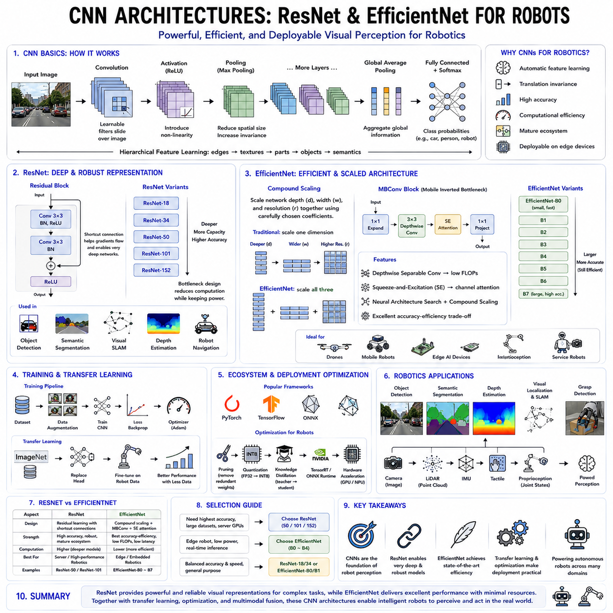
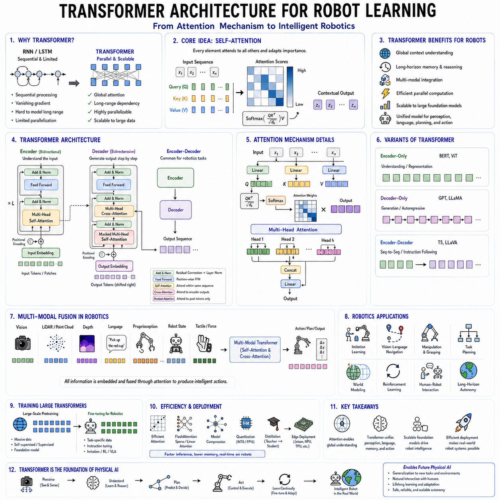
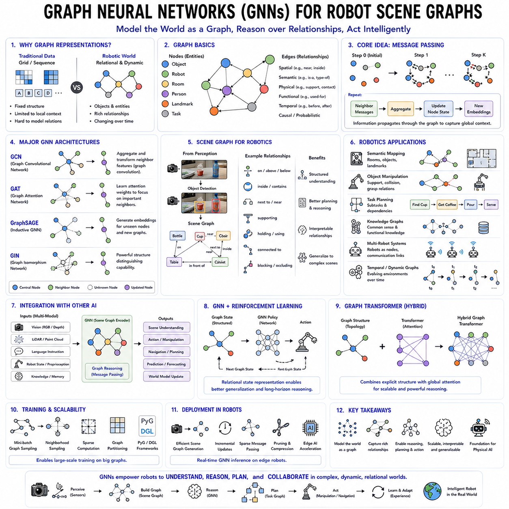
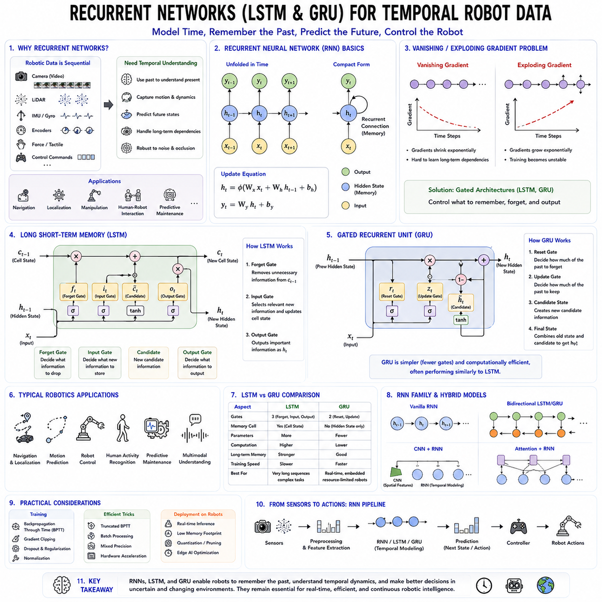
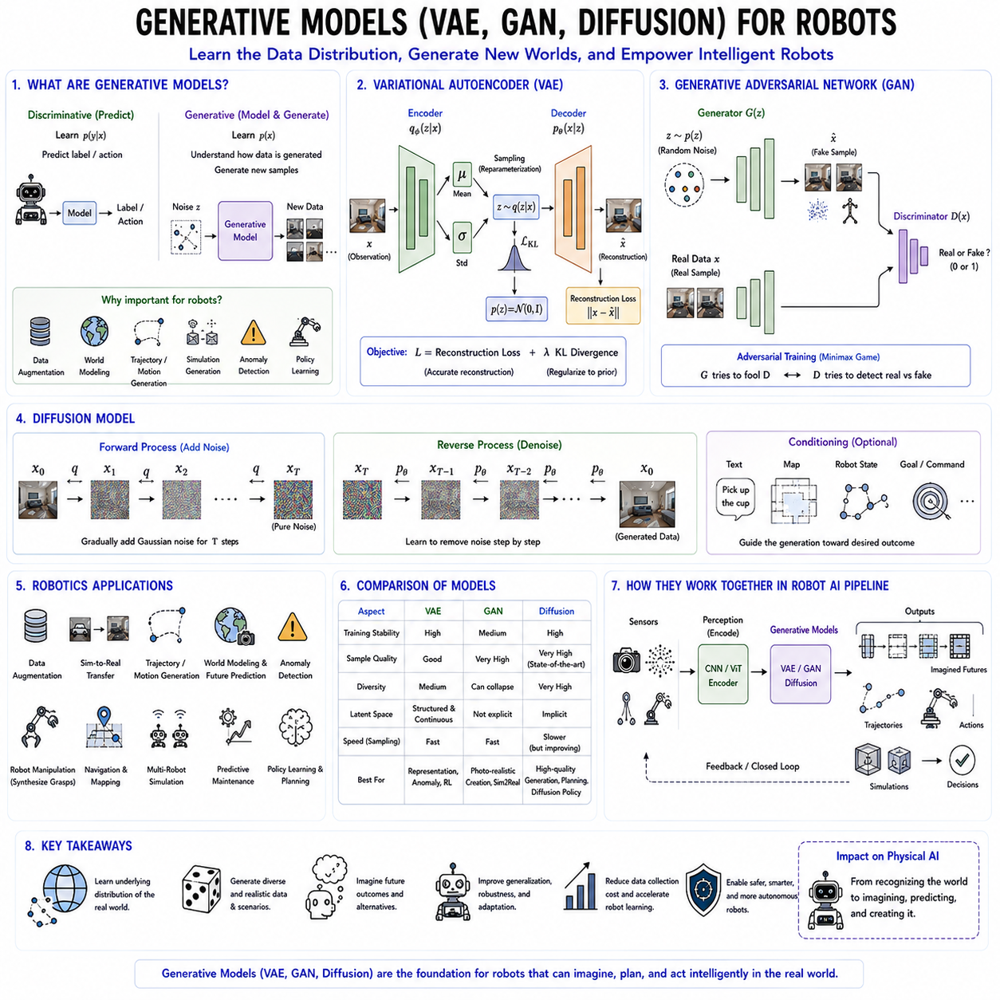
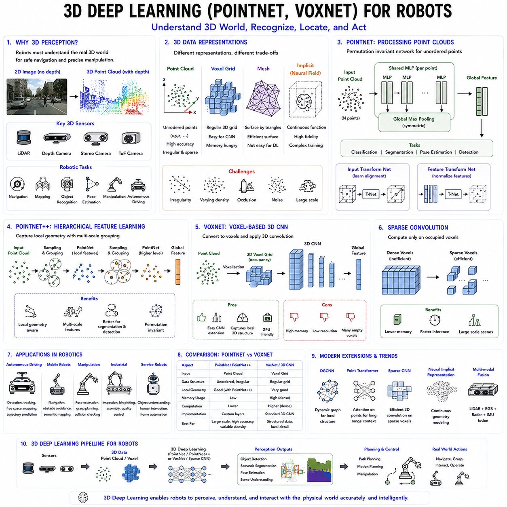
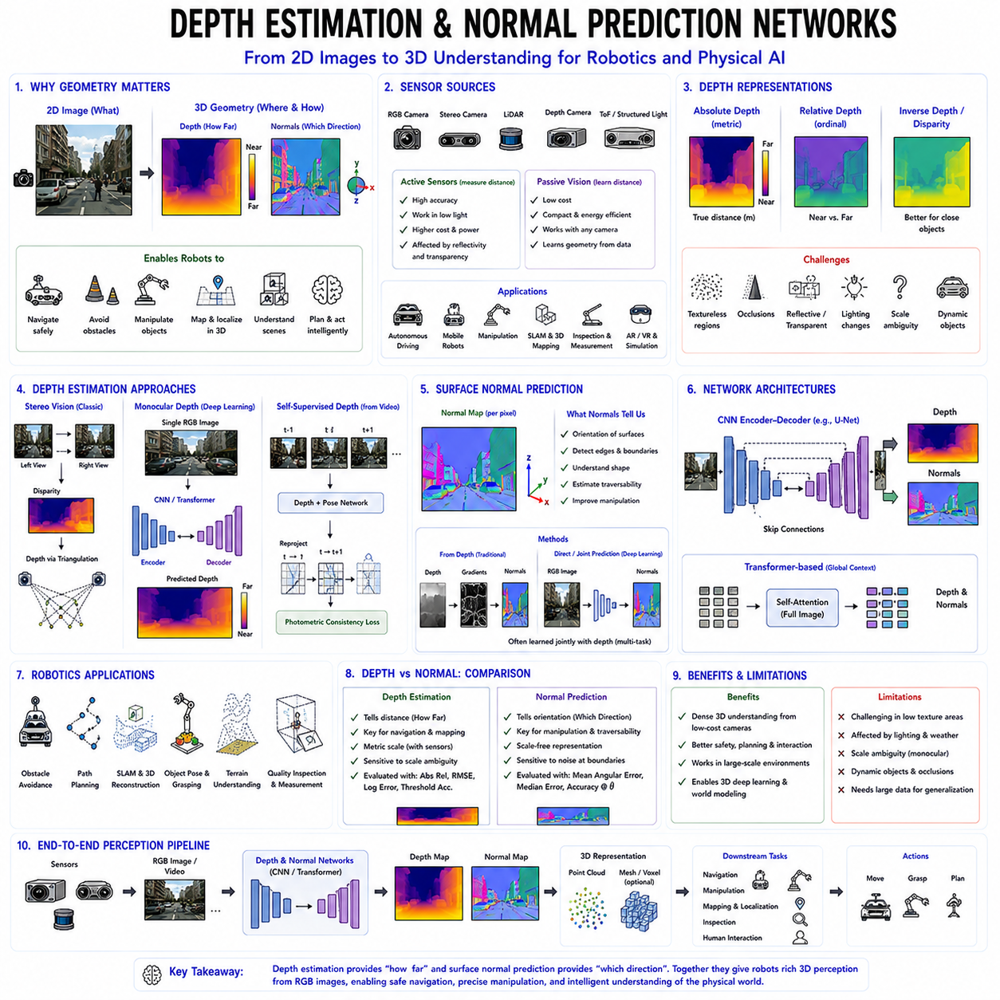
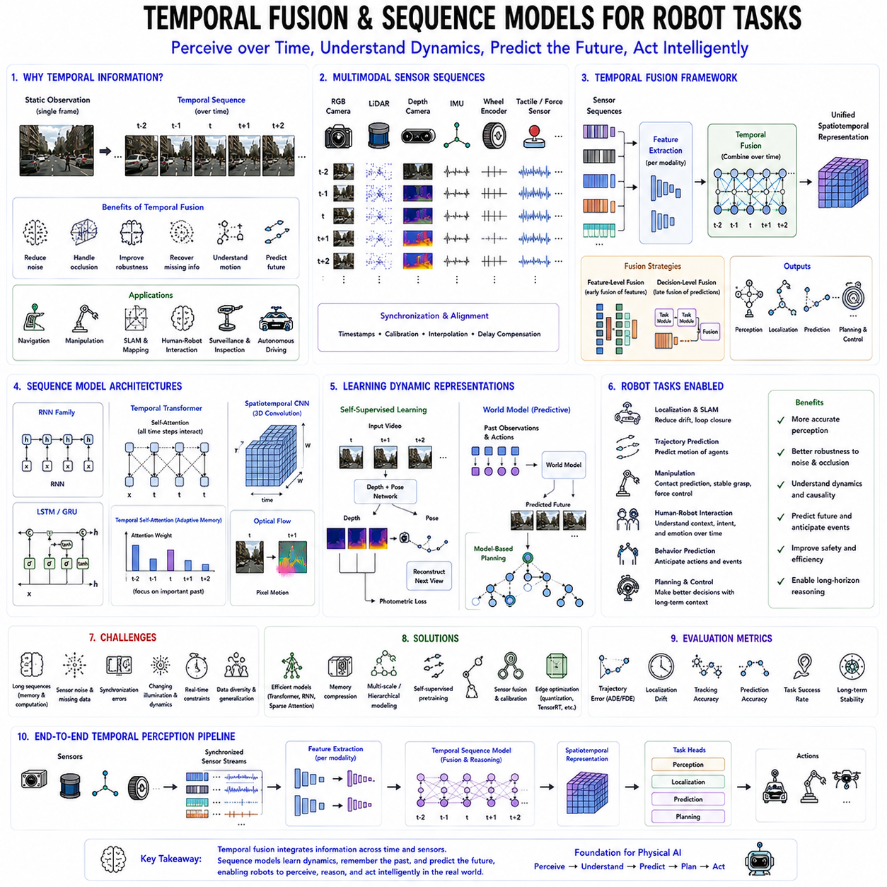
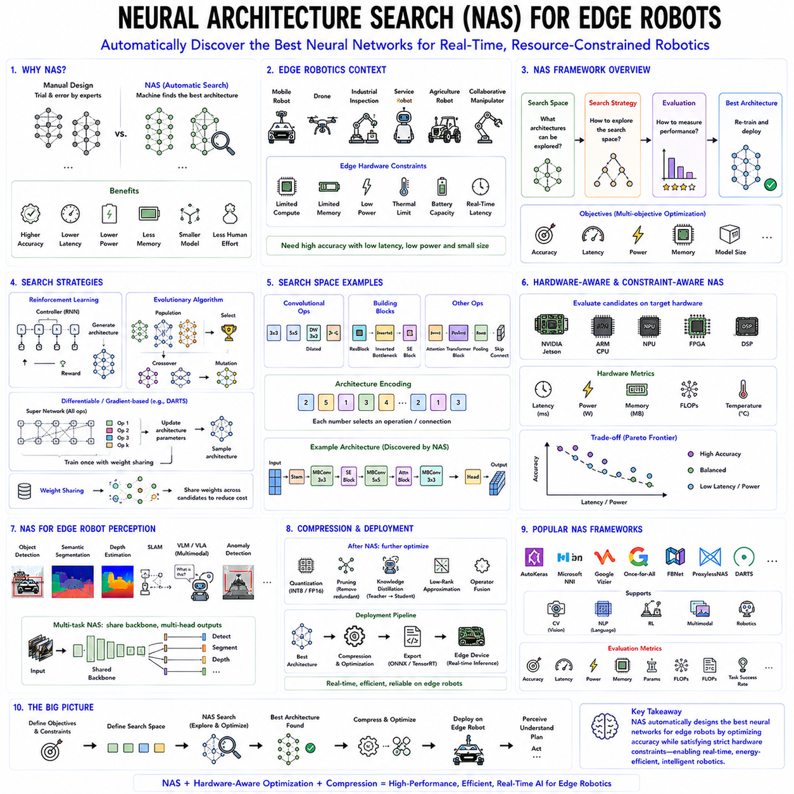
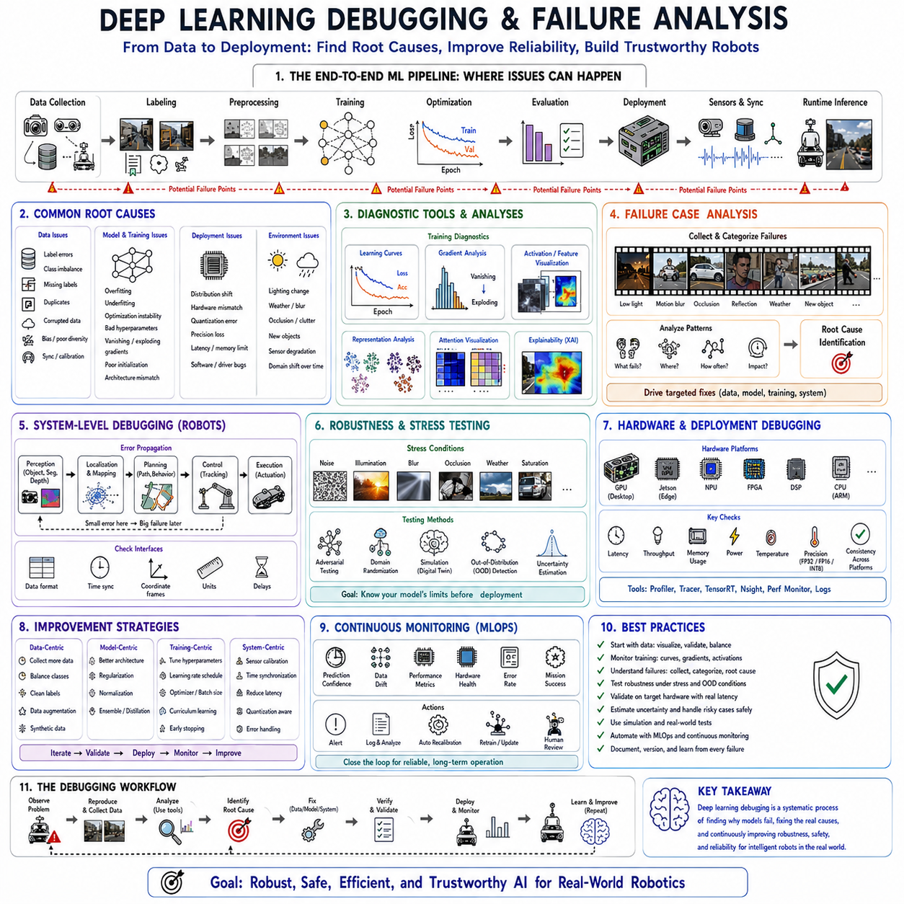

**Volume 19 Robot Machine Learning and AI**

# 02. Deep Learning for Robotics

## 02.01 CNN Architectures ResNet EfficientNet for Robots [w/Code]

{width="7.268055555555556in" height="7.268055555555556in"}

합성곱 신경망(Convolutional Neural Network, CNN)은 현대 인공지능에서 가장 영향력이 큰 신경망 구조 중 하나이며, 특히 컴퓨터 비전(Computer Vision)과 로봇 인식(Robot Perception)의 핵심 기술로 자리 잡고 있다. 비전 트랜스포머(Vision Transformer, ViT)가 등장하기 전까지 CNN은 거의 모든 영상 인식 분야를 주도하였으며, 현재도 많은 로봇 시스템에서 핵심적인 역할을 수행하고 있다. 특히 임베디드(Embedded) 환경에서는 계산 효율성과 높은 정확도를 동시에 제공하기 때문에 이동 로봇, 산업용 검사 로봇, 자율주행 차량, 드론, 서비스 로봇, 휴머노이드 로봇 등에 널리 적용되고 있다.

CNN의 가장 큰 장점은 사람이 특징(Feature)을 직접 설계하지 않아도 영상으로부터 계층적인 특징(Hierarchical Feature)을 자동으로 학습할 수 있다는 점이다. 기존 컴퓨터 비전에서는 SIFT, SURF, HOG, ORB와 같은 수작업 특징(Hancrafted Feature)을 사용했지만, CNN은 입력 영상으로부터 저수준 특징에서 고수준 의미 정보까지 스스로 학습한다. 초기 계층에서는 에지(Edge), 코너(Corner), 선(Line) 등을 학습하고, 중간 계층에서는 질감(Texture)과 물체의 부분을 인식하며, 마지막 계층에서는 사람, 차량, 장애물과 같은 의미적인 객체를 인식하게 된다.

CNN의 핵심 연산은 합성곱(Convolution)이다. 일반적인 완전 연결층(Fully Connected Layer)과 달리 작은 필터(Filter)를 영상 전체에 반복적으로 적용하여 특징을 추출한다. 동일한 필터를 여러 위치에서 공유(Parameter Sharing)하기 때문에 파라미터 수가 크게 감소하며 계산 효율도 높아진다. 또한 동일한 객체가 영상의 어느 위치에 나타나더라도 동일한 특징을 추출할 수 있으므로 이동 불변성(Translation Invariance)을 자연스럽게 확보할 수 있다.

CNN은 지역 수용 영역(Local Receptive Field)을 사용한다. 하나의 뉴런은 영상 전체를 보는 것이 아니라 작은 영역만 관찰하며, 여러 층을 거치면서 점차 넓은 영역을 이해하게 된다. 이러한 계층적인 구조는 인간의 시각 시스템과도 매우 유사하며, 복잡한 물체를 다양한 각도와 크기, 조명 조건에서도 안정적으로 인식할 수 있도록 해준다.

풀링(Pooling)은 CNN의 또 다른 중요한 구성 요소이다. 최대 풀링(Max Pooling)은 가장 큰 값을 선택하고 평균 풀링(Average Pooling)은 평균값을 계산하여 공간 해상도를 줄인다. 이를 통해 계산량을 감소시키고 작은 위치 변화에 대한 강인성(Robustness)을 향상시킨다. 최근에는 Strided Convolution으로 대체되는 경우도 많지만, 공간 정보를 압축하면서 중요한 특징을 유지한다는 기본 개념은 여전히 유지되고 있다.

초기의 대표적인 CNN인 LeNet은 손글씨 숫자 인식에서 CNN의 가능성을 보여주었다. 이후 AlexNet은 GPU 가속, ReLU 활성화 함수, Dropout, 데이터 증강(Data Augmentation)을 적극 활용하여 ImageNet 대회에서 압도적인 성능을 기록하며 딥러닝 시대를 열었다. AlexNet의 성공 이후 CNN은 컴퓨터 비전과 로봇 비전의 표준 기술이 되었다.

VGG 네트워크는 3×3 합성곱만을 반복적으로 사용하는 매우 단순한 구조를 제안하였다. 네트워크의 깊이가 증가할수록 성능이 향상된다는 사실을 보여주었으며, 사전학습(Pretraining)된 VGG 모델은 오랫동안 다양한 로봇 비전 연구에서 기본 특징 추출기(Feature Extractor)로 사용되었다. 다만 계산량과 메모리 사용량이 크다는 단점도 존재하였다.

신경망이 더욱 깊어지면서 기울기 소실(Vanishing Gradient) 문제가 발생하기 시작하였다. 이를 해결하기 위해 등장한 것이 잔차 네트워크(Residual Network, ResNet)이다. ResNet은 Shortcut Connection 또는 Skip Connection을 도입하여 입력 정보를 그대로 다음 계층으로 전달하도록 설계하였다. 이를 통해 매우 깊은 신경망에서도 안정적으로 학습이 가능해졌으며, 수백 개 이상의 Layer를 가진 네트워크도 효과적으로 학습할 수 있게 되었다.

Residual Learning의 핵심은 전체 함수를 학습하는 대신 입력과 출력의 차이(Residual)만 학습하는 것이다. Shortcut Connection은 그래디언트(Gradient)가 초기 계층까지 쉽게 전달되도록 하여 학습을 안정화시키고, 수렴 속도도 크게 향상시킨다. 또한 이전 계층의 특징을 그대로 활용할 수 있어 특징 재사용(Feature Reuse) 효과도 얻을 수 있다.

ResNet은 현재 로봇 비전에서 가장 널리 사용되는 백본 네트워크(Backbone Network)이다. Faster R-CNN, Mask R-CNN, RetinaNet 등 대부분의 객체 검출(Object Detection) 알고리즘과 의미론적 분할(Semantic Segmentation) 모델에서 기본 Feature Extractor로 사용된다. 자율주행, Visual SLAM, 장애물 인식, 사람 인식, 산업 검사 등에서도 매우 높은 일반화 성능을 제공한다.

ResNet은 다양한 크기의 모델을 제공한다. ResNet-18과 ResNet-34는 비교적 가벼운 모델이며, ResNet-50, ResNet-101, ResNet-152는 더욱 깊은 구조를 가진다. 깊은 모델에서는 Bottleneck Block을 사용하여 연산량을 줄이면서도 높은 표현력을 유지한다. 따라서 서버 환경과 Edge 환경 모두에서 다양한 선택이 가능하다.

ResNet은 높은 정확도를 제공하지만 모델이 깊어질수록 계산량과 메모리 사용량이 증가한다. 이러한 문제를 해결하기 위해 등장한 대표적인 구조가 EfficientNet이다. EfficientNet은 정확도와 계산 효율성을 동시에 최적화하기 위해 설계된 CNN 구조로, 특히 Edge AI와 임베디드 로봇에서 매우 큰 장점을 가진다.

기존 CNN은 깊이(Depth), 너비(Width), 입력 해상도(Input Resolution)를 각각 독립적으로 증가시키는 경우가 많았다. 그러나 EfficientNet은 Compound Scaling이라는 새로운 방법을 제안하여 세 요소를 동시에 비례적으로 확장하였다. 이를 통해 동일한 계산량에서도 훨씬 높은 정확도를 달성할 수 있었다.

EfficientNet의 기본 구조는 신경망 구조 탐색(Neural Architecture Search, NAS)을 이용하여 자동으로 설계되었다. 이후 Compound Scaling을 적용하여 EfficientNet-B0부터 EfficientNet-B7까지 다양한 크기의 모델을 생성하였다. 이러한 방식은 사람이 직접 설계한 기존 CNN보다 더욱 높은 정확도와 효율성을 동시에 제공하였다.

EfficientNet은 Mobile Inverted Bottleneck Convolution(MBConv)을 핵심 구조로 사용한다. 먼저 채널을 확장한 후 Depthwise Convolution을 수행하고 다시 채널을 축소한다. 특히 Depthwise Separable Convolution은 기존 합성곱보다 연산량을 크게 줄이면서도 높은 성능을 유지하는 대표적인 경량화 기술이다.

또한 EfficientNet은 Squeeze-and-Excitation(SE) Attention을 사용하여 중요한 채널에 더 큰 가중치를 부여한다. 모든 Feature Channel을 동일하게 처리하지 않고 중요한 특징을 강조함으로써 적은 계산량으로도 더욱 우수한 인식 성능을 제공한다.

EfficientNet은 NVIDIA Jetson Orin, Jetson Xavier, ARM 프로세서, 다양한 NPU 기반 Edge AI 장치에서 매우 높은 효율을 보인다. 드론, 서비스 로봇, 농업 로봇, 산업 검사 장비처럼 전력과 메모리가 제한된 환경에서 특히 적합한 CNN 구조이다.

ResNet과 EfficientNet 중 어느 것이 우수한지는 응용 분야에 따라 달라진다. ResNet은 매우 높은 일반화 성능과 방대한 생태계를 가지고 있으며 대부분의 연구에서 기본 Backbone으로 사용된다. 반면 EfficientNet은 적은 파라미터와 낮은 전력 소비, 빠른 추론 속도를 제공하므로 Edge AI 환경에 더욱 적합하다.

전이학습(Transfer Learning)은 CNN의 가장 큰 장점 중 하나이다. ImageNet과 같은 대규모 데이터셋으로 사전학습한 CNN은 일반적인 시각 특징을 이미 학습하고 있으므로, 소량의 로봇 데이터만으로도 빠르게 새로운 작업에 적응할 수 있다. 이를 통해 데이터 수집 비용을 크게 줄이고 일반화 성능도 향상시킬 수 있다.

현대 로봇에서는 CNN을 단순한 이미지 분류에만 사용하지 않는다. 객체 검출(Object Detection), 의미론적 분할(Semantic Segmentation), 인스턴스 분할(Instance Segmentation), 깊이 추정(Depth Estimation), Optical Flow, Visual SLAM, 장소 인식(Place Recognition), 지형 분류(Terrain Classification), Visual Servoing, 그립 검출(Grasp Detection) 등 거의 모든 비전 기반 기능에서 CNN이 핵심 역할을 수행한다.

CNN은 멀티모달(Multimodal) 로봇 시스템에서도 중요한 역할을 한다. 카메라 영상뿐 아니라 LiDAR, Radar, IMU, 촉각 센서(Tactile Sensor), 힘 센서(Force Sensor), 로봇 상태 정보와 결합되어 더욱 강력한 인식 시스템을 구성한다. 최근의 Vision-Language-Action(VLA) 모델에서도 CNN은 효율적인 시각 특징 추출기로 활용되는 경우가 많다.

로봇에서는 모델 배포 최적화(Deployment Optimization)도 매우 중요하다. Pruning은 불필요한 파라미터를 제거하고, Quantization은 부동소수점(Float)을 정수(Integer)로 변환하여 메모리와 연산량을 줄인다. 또한 Knowledge Distillation은 큰 Teacher 모델의 지식을 작은 Student 모델로 전달하여 Edge 환경에서도 높은 성능을 유지하도록 한다.

실시간 로봇에서는 정확도뿐 아니라 추론 속도(Inference Latency), FPS(Frame Per Second), GPU 사용률, 메모리 사용량, 전력 소비, 발열(Thermal Stability), 장기적인 안정성도 매우 중요한 평가 요소이다. 따라서 실제 시스템에서는 최고 정확도를 가진 모델보다 전체 시스템 성능이 우수한 모델이 선택되는 경우가 많다.

최근에는 Vision Transformer(ViT)가 영상 인식 분야를 빠르게 발전시키고 있지만, CNN은 여전히 많은 장점을 가지고 있다. 적은 데이터에서도 높은 성능을 보이며, 지역적인 공간 특징(Local Spatial Feature)을 효과적으로 학습하고, 계산 효율이 매우 우수하여 임베디드 로봇에 적합하다. 따라서 최근에는 CNN과 Transformer를 결합한 Hybrid Architecture도 활발히 연구되고 있다.

앞으로의 물리 인공지능(Physical AI) 시대에도 CNN은 여전히 중요한 역할을 수행할 것이다. ResNet은 강력한 범용 시각 특징 추출기로, EfficientNet은 Edge AI를 위한 초고효율 Backbone으로 계속 활용될 것이다. 또한 전이학습, 멀티모달 센서 융합, 모델 경량화, Vision-Language-Action 시스템과 결합되면서 자율주행, 산업용 검사, 의료 로봇, 서비스 로봇, 휴머노이드 로봇 등 다양한 분야에서 핵심적인 시각 인식 엔진으로 지속적으로 발전해 나갈 것으로 전망된다.

## 02.02 Transformer Architecture for Robot Learning [w/Code]

{width="7.268055555555556in" height="7.268055555555556in"}

트랜스포머(Transformer) 아키텍처(Architecture)는 기존의 순차 처리(Sequential Processing) 방식을 어텐션(Attention) 기반 구조로 대체하면서 현대 인공지능의 발전을 이끈 핵심 기술이다. 처음에는 자연어 처리(Natural Language Processing)를 위해 개발되었지만, 이후 컴퓨터 비전(Computer Vision), 멀티모달 AI(Multimodal AI), 강화학습(Reinforcement Learning), 로보틱스(Robotics), 물리 인공지능(Physical AI) 등 거의 모든 분야로 확장되었다. 현재 대부분의 대규모 언어 모델(LLM), 비전 트랜스포머(Vision Transformer, ViT), 비전-언어 모델(Vision-Language Model, VLM), 비전-언어-행동 모델(Vision-Language-Action, VLA)은 모두 Transformer 구조를 기반으로 한다.

로봇 분야에서 Transformer는 인식(Perception), 언어 이해(Language Understanding), 계획(Planning), 기억(Memory), 행동(Action Generation)을 하나의 통합된 신경망으로 처리할 수 있도록 해준다. 기존에는 각 기능을 개별 모듈로 구현했지만, Transformer는 모든 정보를 하나의 표현 공간(Embedding Space)에서 함께 학습한다. 따라서 로봇은 카메라 영상, 언어 명령, 과거 행동, 환경 정보를 동시에 이해하고 보다 지능적인 의사결정을 수행할 수 있다.

Transformer 이전에는 순환 신경망(Recurrent Neural Network, RNN), 장단기 기억 신경망(Long Short-Term Memory, LSTM), 게이트 순환 유닛(Gated Recurrent Unit, GRU)이 시계열 데이터를 처리하는 대표적인 방법이었다. 그러나 이러한 모델은 데이터를 순차적으로 처리해야 하므로 병렬 연산이 어렵고, 긴 시퀀스(Long Sequence)에서는 기울기 소실(Vanishing Gradient) 문제가 발생하였다. 또한 긴 영상과 복잡한 센서 데이터를 동시에 처리하기에는 계산 효율이 낮다는 한계가 있었다.

Transformer는 자기 어텐션(Self-Attention) 메커니즘을 도입하여 이러한 문제를 해결하였다. Self-Attention은 입력의 모든 요소가 서로 직접 정보를 주고받을 수 있도록 하며, 순차적인 계산 없이 병렬 처리(Parallel Processing)가 가능하다. 따라서 긴 문장, 긴 영상, 복잡한 센서 데이터에서도 장거리 의존성(Long-Range Dependency)을 효과적으로 학습할 수 있으며, GPU와 AI 가속기의 병렬 연산 성능도 최대한 활용할 수 있다.

Self-Attention의 핵심 개념은 입력 데이터의 각 요소가 다른 모든 요소 중에서 어떤 정보가 중요한지를 스스로 결정하는 것이다. 예를 들어 로봇이 특정 물체를 인식할 때 단순히 주변 픽셀만 참고하는 것이 아니라, 이전 장면, 현재 명령, 환경 정보, 과거 행동까지 함께 고려하여 현재의 판단을 수행한다. 이러한 전역 문맥(Global Context) 이해 능력은 기존 CNN이나 RNN보다 훨씬 뛰어난 표현 능력을 제공한다.

Self-Attention은 Query, Key, Value라는 세 가지 벡터를 사용한다. Query는 필요한 정보를 찾기 위한 질문이며, Key는 각각의 정보가 어떤 의미를 가지는지를 나타내고, Value는 실제 전달되는 정보를 의미한다. Query와 Key의 유사도를 계산하여 Attention Score를 구한 후, 이를 이용해 Value를 가중합(Weighted Sum)하여 새로운 표현을 생성한다. 이 과정을 통해 입력 데이터 전체에서 필요한 정보를 선택적으로 모을 수 있다.

Scaled Dot-Product Attention은 Transformer의 핵심 계산 과정이다. Query와 Key의 내적(Dot Product)을 계산하여 유사도를 구하고, 이를 적절히 스케일링(Scaling)한 후 Softmax를 적용하여 확률 형태의 Attention Weight를 생성한다. 마지막으로 Value를 이러한 가중치로 결합하여 문맥(Context)이 반영된 새로운 Feature를 생성한다. 이 과정 덕분에 각 요소는 전체 입력을 고려한 풍부한 표현을 얻게 된다.

Multi-Head Attention은 여러 개의 Self-Attention을 동시에 수행하는 구조이다. 하나의 Head는 공간적인 관계를 학습하고, 다른 Head는 시간적인 관계를 학습하며, 또 다른 Head는 객체 간의 관계나 언어적 의미를 학습할 수 있다. 다양한 관점을 동시에 학습함으로써 더욱 풍부한 특징 표현을 생성하며, 로봇의 인식과 행동 생성 성능을 크게 향상시킨다.

Transformer는 입력 순서를 자동으로 알 수 없기 때문에 위치 정보(Positional Encoding)가 필요하다. Positional Encoding은 각 입력에 위치 정보를 추가하여 문장의 순서나 영상의 공간적 위치를 인식하도록 한다. 초기에는 사인(Sine)과 코사인(Cosine) 함수를 사용한 Positional Encoding이 사용되었으며, 최근에는 학습 가능한 위치 임베딩(Learned Positional Embedding), Rotary Positional Embedding(RoPE), Relative Position Encoding 등이 널리 사용된다.

Transformer Layer는 Multi-Head Attention, Residual Connection, Layer Normalization, Feed Forward Network로 구성된다. 먼저 Multi-Head Attention이 전체 문맥을 통합하고, Residual Connection은 정보 손실 없이 이전 Feature를 전달한다. Layer Normalization은 학습을 안정화하며, Feed Forward Network는 비선형 변환을 수행한다. 이러한 Layer를 반복적으로 쌓아 매우 깊은 Transformer 모델을 구성한다.

Encoder 기반 Transformer는 입력 데이터를 양방향(Bidirectional)으로 처리하여 풍부한 표현을 생성한다. 대표적인 예가 BERT(Bidirectional Encoder Representations from Transformers)이며, 언어 이해와 특징 추출에 매우 강력한 성능을 보인다. 이러한 구조는 이후 Vision Transformer와 다양한 로봇 인식 모델의 기반이 되었다.

Decoder 기반 Transformer는 이전 토큰(Token)만을 참고하여 다음 토큰을 생성하는 자기회귀(Autoregressive) 구조이다. GPT 계열의 대규모 언어 모델이 대표적인 예이며, 로봇에서는 행동(Action) 생성, 경로 생성(Trajectory Generation), 작업 계획(Task Planning) 등에 활용된다.

Encoder-Decoder Transformer는 입력과 출력을 모두 사용하는 구조이다. Encoder가 입력 정보를 이해하고 Decoder가 이를 바탕으로 결과를 생성한다. 원래는 기계 번역(Machine Translation)을 위해 개발되었지만, 현재는 언어 명령 기반 로봇 제어(Language-Conditioned Control), 작업 계획(Task Planning), 장면 이해(Scene Understanding) 등에 널리 활용되고 있다.

비전 트랜스포머(Vision Transformer, ViT)는 이미지를 작은 패치(Image Patch) 단위로 분할하여 각각을 하나의 Token으로 처리한다. CNN처럼 지역적인 합성곱을 사용하는 대신 이미지 전체에서 Self-Attention을 수행하므로 멀리 떨어진 객체 간의 관계까지 효과적으로 학습할 수 있다. 이러한 전역 정보(Global Context)는 복잡한 로봇 환경을 이해하는 데 매우 유리하다.

초기의 Vision Transformer는 매우 많은 학습 데이터가 필요했지만, 최근에는 Self-Supervised Learning, 대규모 사전학습(Pretraining), 데이터 증강(Data Augmentation), Hybrid CNN 구조 등을 통해 적은 데이터에서도 높은 성능을 얻을 수 있게 되었다. 현재는 객체 검출(Object Detection), 의미론적 분할(Semantic Segmentation), 깊이 추정(Depth Estimation), Visual SLAM 등 다양한 분야에서 활용되고 있다.

로봇은 카메라 영상뿐 아니라 LiDAR, Radar, IMU, 촉각 센서(Tactile Sensor), 힘 센서(Force Sensor), 로봇 상태(Robot State), 언어 명령 등을 동시에 처리해야 한다. Transformer는 이러한 다양한 센서 데이터를 공통 임베딩 공간(Common Embedding Space)으로 변환한 후 Self-Attention을 수행함으로써 매우 자연스러운 멀티모달 융합(Multimodal Fusion)을 구현할 수 있다.

Cross-Attention은 서로 다른 모달리티(Modality) 간의 정보를 연결하는 기술이다. 언어는 영상을 참고하여 객체를 이해하고, 영상은 언어를 참고하여 중요한 영역을 찾는다. 또한 로봇 상태 정보와 센서 정보도 서로 영향을 주면서 행동을 생성한다. 이러한 Cross-Attention은 멀티모달 AI의 핵심 기술이다.

Transformer는 긴 문맥(Long Context)을 기억하는 능력도 뛰어나다. 이전의 관측 정보, 과거 행동, 지도 정보, 작업 이력 등을 모두 함께 고려하여 현재의 행동을 결정할 수 있다. 따라서 장시간 작업(Long-Horizon Task), 장기 자율주행(Long-Term Navigation), 인간과의 지속적인 협업(Human-Robot Collaboration)에서 매우 중요한 역할을 수행한다.

최근의 Transformer는 수십만 개 이상의 Token을 동시에 처리할 수 있는 Long Context Window를 지원한다. FlashAttention, Sparse Attention, Linear Attention과 같은 효율적인 알고리즘 덕분에 긴 영상과 장기간의 로봇 데이터를 현실적인 계산 비용으로 처리할 수 있게 되었다.

Transformer 기반 모방학습(Imitation Learning)은 현재 로봇 AI에서 가장 활발한 연구 분야 중 하나이다. 전문가의 작업 시퀀스를 그대로 학습하여 다음 행동을 예측하며, 대표적으로 Decision Transformer, Behavior Transformer, RT-1, RT-2, OpenVLA 등이 있다. 이러한 모델은 대량의 시연 데이터(Demonstration Data)를 이용하여 다양한 작업을 학습할 수 있다.

비전-언어-행동 모델(Vision-Language-Action, VLA)은 Transformer의 대표적인 응용 사례이다. Vision Encoder는 카메라 영상을 이해하고, Language Encoder는 자연어 명령을 이해하며, Multimodal Attention이 두 정보를 통합한 후 Action Decoder가 로봇의 행동을 생성한다. 이러한 End-to-End 구조는 자연어 명령을 실제 로봇 행동으로 직접 변환할 수 있게 한다.

강화학습(Reinforcement Learning)에서도 Transformer는 매우 중요한 역할을 한다. 기존 정책 네트워크(Policy Network)는 짧은 시간 정보만 활용했지만, Transformer는 긴 시간 동안의 상태(State), 행동(Action), 보상(Reward)을 함께 고려할 수 있다. 따라서 장기 계획(Long-Horizon Planning)과 세계 모델(World Model) 학습에서 뛰어난 성능을 보인다.

Transformer는 Self-Attention 계산량이 입력 길이의 제곱에 비례하므로 대규모 학습에는 많은 GPU 자원이 필요하다. 이를 해결하기 위해 분산 학습(Distributed Training), Mixed Precision, Gradient Checkpointing, FlashAttention 등의 최적화 기술이 함께 사용된다.

실제 로봇에서는 계산 자원이 제한되므로 모델 경량화(Model Compression)가 필수적이다. Quantization, Pruning, Knowledge Distillation, Low-Rank Adaptation(LoRA), Sparse Attention 등을 이용하여 Transformer를 Edge AI 환경에서도 실시간으로 실행할 수 있도록 최적화한다. NVIDIA TensorRT와 Jetson 플랫폼도 이러한 최적화를 적극 지원한다.

Transformer는 내부 동작을 시각화할 수 있다는 장점도 가진다. Attention Map을 분석하면 어떤 객체를 참고하여 의사결정을 수행했는지 확인할 수 있으며, 이는 디버깅(Debugging), 안전성 검증(Safety Validation), 설명 가능한 인공지능(Explainable AI), 사용자 신뢰 확보에 큰 도움이 된다.

앞으로의 물리 인공지능(Physical AI)은 Transformer를 중심으로 더욱 발전할 것이다. 미래의 로봇은 시각, 언어, 기억, 세계 모델(World Model), 계획, 행동, 인간과의 협업을 하나의 통합된 신경망에서 수행해야 한다. Transformer는 이러한 다양한 기능을 하나의 구조 안에서 통합할 수 있는 가장 강력한 기반 기술이며, 대규모 사전학습, 멀티모달 학습, 지속학습(Continual Learning), 확률적 추론(Probabilistic Reasoning)과 결합되어 차세대 지능형 로봇과 Physical AI를 구현하는 핵심 아키텍처로 지속적으로 발전해 나갈 것이다.

## 02.03 Graph Neural Networks for Robot Scene Graphs [w/Code]

{width="7.268055555555556in" height="7.268055555555556in"}

그래프 신경망(Graph Neural Network, GNN)은 기존의 딥러닝이 주로 처리하던 이미지(Image), 음성(Audio), 텍스트(Text)와 같은 규칙적인 데이터 구조를 넘어, 그래프(Graph) 형태의 관계 중심 데이터를 학습하기 위해 개발된 신경망 구조이다. CNN이 격자(Grid) 형태의 이미지를 처리하고, Transformer가 순차 데이터(Sequence)를 처리하는 데 강점을 가진다면, GNN은 객체들 사이의 관계(Relationship)를 직접 학습하는 데 특화되어 있다. 특히 로봇 환경은 단순히 객체들의 집합이 아니라 객체 간의 공간적(Spatial), 의미적(Semantic), 물리적(Physical), 시간적(Temporal) 관계가 매우 중요하므로 GNN은 차세대 물리 인공지능(Physical AI)의 핵심 기술로 주목받고 있다.

그래프(Graph)는 노드(Node)와 엣지(Edge)로 구성되는 가장 기본적인 관계 표현 구조이다. 노드는 사람, 로봇, 물체, 방(Room), 랜드마크(Landmark), 작업(Task) 등을 나타내며, 엣지는 이들 사이의 관계를 표현한다. 예를 들어 "컵은 테이블 위에 있다", "문은 복도와 연결된다", "로봇은 사람과 협업한다"와 같은 관계를 모두 그래프로 표현할 수 있다. 이러한 구조는 이미지처럼 고정된 격자 구조가 아니라 객체 수와 관계가 자유롭게 변하는 실제 환경을 자연스럽게 표현할 수 있다.

실제 로봇 환경은 본질적으로 그래프 구조를 가진다. 창고에서는 선반(Shelf), 팔레트(Pallet), 작업자(Worker), 지게차(Forklift), 충전기(Charging Station), 통로(Path)가 서로 다양한 관계를 가진다. 가정에서는 컵은 테이블 위에 있고, 냉장고는 주방에 있으며, 의자는 식탁 주변에 배치된다. 이러한 관계 정보는 단순히 객체를 인식하는 것보다 로봇의 행동을 결정하는 데 훨씬 중요한 역할을 한다.

기존 CNN이나 Transformer는 이러한 관계를 간접적으로 학습하지만, GNN은 그래프의 연결 구조 자체를 직접 이용한다. 이미지처럼 모든 데이터가 동일한 형태를 가지지 않아도 되며, 객체의 개수와 연결 방식이 달라져도 동일한 알고리즘으로 처리할 수 있다. 따라서 다양한 환경과 복잡한 객체 관계를 표현하는 데 매우 적합하다.

GNN의 핵심 원리는 메시지 전달(Message Passing)이다. 각 노드는 연결된 이웃 노드들과 정보를 주고받으며 자신의 표현(Node Representation)을 반복적으로 업데이트한다. 처음에는 자신의 정보만 가지고 있지만 여러 번의 Message Passing을 수행하면 점차 멀리 있는 노드의 정보까지 반영하게 된다. 결과적으로 각 노드는 주변 환경 전체를 고려한 풍부한 의미 정보를 가지게 된다.

노드 임베딩(Node Embedding)은 GNN에서 학습되는 핵심 표현이다. 처음에는 객체의 종류, 위치, 크기, 색상, 센서 정보와 같은 기본 특징만 포함하지만, Message Passing을 반복하면서 주변 객체들의 정보까지 함께 포함하게 된다. 따라서 최종 Node Embedding은 객체 자체뿐 아니라 주변 환경과의 관계까지 표현하는 고차원 특징이 된다.

엣지 표현(Edge Representation) 역시 매우 중요하다. 엣지는 단순한 연결뿐 아니라 거리(Distance), 방향(Direction), 접촉(Contact), 가시성(Visibility), 조작 가능성(Manipulation Dependency), 시간적 변화 등을 표현할 수 있다. 최신 GNN은 노드뿐 아니라 엣지 자체도 학습하여 관계의 의미를 더욱 정교하게 표현한다.

그래프 합성곱 신경망(Graph Convolutional Network, GCN)은 가장 대표적인 GNN 구조이다. CNN이 주변 픽셀을 이용하여 특징을 계산하는 것처럼 GCN은 연결된 이웃 노드들의 특징을 모아 새로운 Node Embedding을 생성한다. 이를 반복하면 전체 그래프의 의미 정보를 점차 학습하게 되며, 그래프 구조를 그대로 유지하면서 강력한 표현력을 얻을 수 있다.

그래프 어텐션 네트워크(Graph Attention Network, GAT)는 모든 이웃 노드를 동일하게 처리하지 않는다. Attention Mechanism을 이용하여 중요한 이웃 노드에 더 높은 가중치를 부여한다. 예를 들어 로봇이 컵을 집으려면 컵과 직접 접촉하는 테이블이나 주변 장애물은 매우 중요하지만 멀리 있는 의자는 상대적으로 중요하지 않다. GAT는 이러한 중요도를 자동으로 학습한다.

GraphSAGE는 새로운 그래프에도 일반화(Generalization)가 가능한 구조이다. 기존 GNN은 학습된 그래프에서만 잘 동작하는 경우가 많았지만, GraphSAGE는 새로운 노드와 새로운 환경에서도 Node Embedding을 생성할 수 있다. 로봇은 항상 새로운 공간을 방문하기 때문에 이러한 일반화 능력이 매우 중요하다.

그래프 동형성 네트워크(Graph Isomorphism Network, GIN)는 매우 복잡한 그래프 구조도 구분할 수 있도록 설계된 GNN이다. 비슷한 형태의 그래프라도 미세한 차이를 정확하게 구별할 수 있기 때문에 조립(Assembly), 복잡한 조작(Manipulation), 구조 분석 등에 적합하다.

장면 그래프(Scene Graph)는 로봇 비전에서 가장 중요한 GNN 응용 분야 중 하나이다. 객체 검출(Object Detection)은 사람, 의자, 컵 등을 각각 독립적으로 인식하지만 Scene Graph는 객체 간의 관계까지 함께 표현한다. 예를 들어 "컵은 테이블 위에 있다", "사람이 컵을 들고 있다", "의자는 테이블 옆에 있다"와 같은 정보를 하나의 그래프로 표현한다.

Scene Graph를 이용하면 로봇은 단순히 객체를 보는 수준을 넘어 환경의 의미를 이해할 수 있다. 예를 들어 주방에서는 컵은 테이블 위에 있고, 냉장고는 캐비닛 옆에 있으며, 식기는 서랍 안에 있다는 관계를 학습한다. 이러한 관계는 작업 계획(Task Planning), 경로 계획(Path Planning), 물체 조작(Object Manipulation)에 매우 중요한 정보를 제공한다.

의미 지도(Semantic Mapping)도 GNN의 중요한 응용 분야이다. 기존 점유 격자 지도(Occupancy Grid)는 장애물과 빈 공간만 표현하지만, Semantic Map은 방(Room), 복도(Corridor), 문(Door), 책상(Table), 의자(Chair) 등의 의미 정보를 함께 포함한다. GNN은 이러한 Semantic Map 위에서 객체 간의 관계를 학습하여 더욱 지능적인 내비게이션(Navigation)을 가능하게 한다.

물체 조작(Object Manipulation)은 관계 기반 추론이 가장 중요한 분야이다. 컵을 집으려면 컵뿐 아니라 컵을 지지하는 테이블, 주변 장애물, 손이 접근 가능한 공간 등을 함께 고려해야 한다. GNN은 이러한 물리적 관계를 그래프로 표현하여 안정적인 그립(Grasp)과 조작 계획을 생성할 수 있다.

작업 계획(Task Planning)도 그래프 기반으로 표현할 수 있다. 예를 들어 커피를 만드는 작업은 컵 찾기, 커피 머신 찾기, 물 준비, 커피 추출 등의 여러 작업으로 구성된다. 각 작업 사이에는 선행 조건(Prerequisite)이 존재하며, 이러한 관계를 Task Graph로 표현하면 GNN이 작업 순서를 효율적으로 계획할 수 있다.

지식 그래프(Knowledge Graph)는 Scene Graph보다 더욱 높은 수준의 의미 정보를 포함한다. 예를 들어 "컵은 음료를 담는다", "냉장고는 음식을 보관한다", "열쇠는 문을 연다"와 같은 상식(Common Sense)을 그래프로 표현한다. 로봇은 이러한 지식 그래프를 이용하여 관측되지 않은 상황도 추론할 수 있으며, 더욱 자연스러운 행동을 수행할 수 있다.

다중 로봇 시스템(Multi-Robot System)에서도 GNN은 매우 중요한 역할을 한다. 각각의 로봇을 노드로, 통신 링크를 엣지로 표현하면 협업(Cooperation)과 정보 공유를 그래프 형태로 모델링할 수 있다. Swarm Robotics, 공동 탐색(Cooperative Exploration), 공동 운반(Cooperative Transportation), 다중 에이전트 강화학습(Multi-Agent Reinforcement Learning) 등에서 활발히 활용되고 있다.

시간 그래프(Temporal Graph)는 시간이 지남에 따라 변화하는 관계를 표현한다. 사람의 이동, 문 개폐, 차량 이동, 물체 위치 변화 등을 지속적으로 그래프에 반영한다. Dynamic GNN은 이러한 시간에 따른 변화를 학습하여 행동 예측(Behavior Prediction), 이상 탐지(Anomaly Detection), 미래 상태 예측(Future State Prediction)에 활용된다.

강화학습(Reinforcement Learning)과 GNN의 결합도 매우 활발히 연구되고 있다. 기존 강화학습은 상태(State)를 단순한 벡터로 표현했지만, GNN은 객체 간 관계를 포함한 그래프 형태로 상태를 표현한다. 이를 통해 조작, 자율주행, 다중 로봇 협업 등에서 더욱 효율적인 정책(Policy)을 학습할 수 있다.

최근에는 Transformer와 GNN을 결합한 Graph Transformer도 등장하였다. Transformer는 장거리 관계(Long-Range Dependency)를 잘 학습하고, GNN은 그래프 구조를 명확하게 유지한다. 두 구조를 결합하면 관계 정보를 유지하면서도 더욱 강력한 Attention 기반 추론이 가능해진다.

Vision-Language-Action(VLA) 모델에서도 GNN의 활용이 증가하고 있다. Vision Encoder는 객체를 인식하고, Language Model은 명령을 이해하며, GNN은 객체 간의 관계를 Scene Graph 형태로 구성한다. 이후 Action Planner는 이러한 그래프를 이용하여 실제 로봇 행동을 생성한다. 따라서 GNN은 VLA의 세계 모델(World Model)을 구성하는 핵심 요소가 될 수 있다.

대규모 그래프를 학습하는 것은 계산량이 매우 크기 때문에 효율적인 학습 기법이 필요하다. PyTorch Geometric(PyG), Deep Graph Library(DGL)와 같은 프레임워크는 Mini-Batch Graph Sampling, Sparse Computation, Graph Partitioning 등을 지원하여 대규모 GNN 학습을 가능하게 한다.

실제 로봇에서는 그래프 생성 자체도 계산 비용이 크다. 따라서 실시간 Scene Graph 생성, 동적 그래프 업데이트, 희소 메시지 전달(Sparse Message Passing), 그래프 가지치기(Graph Pruning) 등의 최적화 기술이 함께 사용된다. 이를 통해 Edge AI 환경에서도 실시간 GNN 추론이 가능해지고 있다.

GNN은 해석 가능성(Interpretability) 측면에서도 장점을 가진다. 노드와 엣지를 시각화하면 로봇이 어떤 객체와 어떤 관계를 중요하게 판단했는지를 쉽게 확인할 수 있다. 이는 디버깅(Debugging), 설명 가능한 AI(Explainable AI), 안전성 검증(Safety Validation), 사용자 신뢰 확보에 매우 중요한 역할을 한다.

미래의 물리 인공지능은 단순히 객체를 인식하는 수준을 넘어 객체 간의 관계를 이해하는 방향으로 발전할 것이다. Scene Graph, Semantic Graph, Knowledge Graph, Task Graph, Communication Graph 등 다양한 그래프 구조가 하나의 세계 모델(World Model)로 통합될 것이며, GNN은 이러한 관계 중심 추론을 수행하는 핵심 엔진이 될 것이다. Transformer, 멀티모달 AI(Multimodal AI), 강화학습, 확률적 추론(Bayesian Inference)과 결합된 GNN은 차세대 지능형 로봇이 실제 세계를 이해하고 계획하며 협업하는 데 필수적인 기반 기술로 자리매김할 것으로 전망된다.

## 02.04 Recurrent Networks LSTM GRU for Temporal Robot Data [w/Code]

{width="7.268055555555556in" height="7.268055555555556in"}

순환 신경망(Recurrent Neural Network, RNN)은 시간에 따라 연속적으로 변화하는 데이터를 처리하기 위해 개발된 대표적인 딥러닝 구조이다. 일반적인 순방향 신경망(Feedforward Neural Network)은 입력 데이터를 서로 독립적으로 처리하지만, RNN은 이전 시점의 정보를 내부 메모리(Internal Memory)에 저장하여 현재의 예측에 활용한다. 이러한 구조 덕분에 음성 인식(Speech Recognition), 자연어 처리(Natural Language Processing), 자율주행, 인간 행동 인식(Human Activity Recognition), 예측 유지보수(Predictive Maintenance), 로봇 제어(Robot Control) 등 다양한 분야에서 활용되어 왔다. 최근에는 Transformer가 대규모 AI를 주도하고 있지만, 계산 자원이 제한된 임베디드 로봇에서는 여전히 중요한 역할을 수행하고 있다.

로봇은 대부분의 정보를 시간 순서(Time Series)로 수집한다. 카메라 영상, LiDAR, IMU, 엔코더(Encoder), 힘 센서(Force Sensor), 촉각 센서(Tactile Sensor), 제어 명령(Control Command)은 모두 시간에 따라 연속적으로 변화한다. 따라서 하나의 순간만 분석해서는 올바른 판단을 내릴 수 없으며, 과거의 정보와 현재의 정보를 함께 고려해야 한다. 예를 들어 자율주행 로봇은 이전 위치와 이동 방향을 기억해야 안정적인 위치 추정(Localization)과 경로 계획(Path Planning)이 가능하다.

RNN의 가장 큰 특징은 은닉 상태(Hidden State)를 가진다는 점이다. 은닉 상태는 이전 시점의 정보를 저장하는 내부 메모리 역할을 한다. 현재 입력과 이전 Hidden State를 함께 사용하여 새로운 Hidden State와 출력을 생성하며, 이러한 과정이 시간축(Time Axis)을 따라 반복된다. 따라서 과거의 경험이 현재의 판단에 자연스럽게 반영된다.

RNN은 동일한 네트워크 구조와 파라미터(Parameter)를 모든 시간 단계(Time Step)에서 반복적으로 사용한다. 이를 파라미터 공유(Parameter Sharing)라고 하며, 입력 길이가 달라져도 동일한 모델을 사용할 수 있다. 따라서 짧은 시퀀스부터 매우 긴 시퀀스까지 모두 처리할 수 있으며, 로봇의 다양한 작업 시간에도 유연하게 적용할 수 있다.

하지만 기본적인 RNN은 기울기 소실(Vanishing Gradient)과 기울기 폭주(Exploding Gradient)라는 문제를 가진다. 역전파(Backpropagation Through Time)가 반복되면서 그래디언트가 점점 작아지거나 반대로 너무 커져 학습이 어려워진다. 특히 긴 시퀀스에서는 오래전 정보를 거의 기억하지 못하게 되어 장기 의존성(Long-Term Dependency)을 학습하기 어렵다.

이러한 문제는 로봇에서 더욱 심각하게 나타난다. 예를 들어 건물 내부를 탐색하는 로봇은 몇 분 전에 지나간 위치나 사람과의 상호작용을 기억해야 하지만, 일반 RNN은 시간이 지날수록 이러한 정보를 잃어버린다. 따라서 장시간의 작업(Long-Horizon Task)을 수행하기에는 한계가 존재한다.

장단기 기억 신경망(Long Short-Term Memory, LSTM)은 이러한 문제를 해결하기 위해 개발되었다. LSTM은 기존 Hidden State 외에도 셀 상태(Cell State)라는 장기 메모리를 별도로 유지하며, 여러 개의 게이트(Gate)를 이용하여 정보의 저장과 삭제를 제어한다. 이를 통해 중요한 정보는 오래 유지하고 불필요한 정보는 제거하여 장기적인 시간 의존성을 효과적으로 학습할 수 있다.

LSTM의 핵심은 셀 상태(Cell State)이다. Hidden State가 단기 정보를 담당한다면 Cell State는 장기 정보를 저장한다. 여러 시간 단계를 거치면서도 중요한 정보는 지속적으로 유지되므로 긴 시퀀스에서도 안정적인 학습이 가능하다. 이러한 구조는 기존 RNN보다 훨씬 뛰어난 기억 능력을 제공한다.

망각 게이트(Forget Gate)는 기존 메모리 중 어떤 정보를 삭제할지를 결정한다. 현재 입력과 이전 Hidden State를 이용하여 0에서 1 사이의 값을 계산하며, 0에 가까울수록 해당 정보를 제거하고 1에 가까울수록 유지한다. 이를 통해 오래된 정보나 필요 없는 정보를 자동으로 삭제할 수 있다.

입력 게이트(Input Gate)는 새로운 정보를 메모리에 저장할지를 결정한다. 모든 입력을 저장하는 것이 아니라 현재 작업에 필요한 정보만 Cell State에 추가한다. 이러한 선택적인 저장 기능은 센서 노이즈나 일시적인 환경 변화에 대한 강인성(Robustness)을 높여준다.

출력 게이트(Output Gate)는 Cell State에 저장된 정보 중 현재 출력에 사용할 정보를 선택한다. 장기 기억 전체를 사용하는 것이 아니라 현재 상황에 필요한 정보만 Hidden State로 전달하므로 더욱 효율적인 의사결정이 가능하다. 세 개의 게이트가 함께 동작하여 LSTM은 매우 안정적인 장기 기억 구조를 제공한다.

LSTM은 다양한 로봇 분야에서 활용되고 있다. 음성 인식에서는 음성 신호의 시간적 변화를 분석하고, 인간 행동 인식에서는 걷기, 뛰기, 앉기, 낙상 등의 동작을 구분한다. 또한 위치 추정(Localization), Visual SLAM, 예측 유지보수(Predictive Maintenance), 센서 융합(Sensor Fusion) 등에서도 널리 사용된다.

자율주행에서는 연속적인 센서 데이터를 이용하여 위치와 이동 방향을 추정한다. 순간적인 카메라 영상만으로는 정확한 위치를 알기 어렵지만, 이전의 이동 경로와 센서 정보를 함께 활용하면 더욱 안정적인 위치 추정이 가능하다. LSTM은 이러한 시간 정보를 효과적으로 통합하여 내비게이션 성능을 향상시킨다.

로봇 제어(Robot Control)에서도 LSTM은 중요한 역할을 한다. 로봇의 현재 동작은 이전의 제어 명령과 기계의 동적 특성(Dynamics)에 영향을 받는다. LSTM은 이러한 시간적 관계를 학습하여 적응 제어(Adaptive Control), 힘 제어(Force Control), 보행 제어(Locomotion), 경로 추종(Trajectory Tracking) 등의 성능을 향상시킨다.

산업용 로봇에서는 예측 유지보수(Predictive Maintenance)에 LSTM이 많이 활용된다. 진동(Vibration), 전류(Current), 온도(Temperature), 음향(Acoustic Signal) 등의 센서 데이터를 지속적으로 분석하여 고장 발생 가능성을 미리 예측한다. 이를 통해 유지보수 비용을 절감하고 생산 설비의 신뢰성을 높일 수 있다.

인간-로봇 상호작용(Human-Robot Interaction)도 시간 정보가 매우 중요하다. 음성 대화, 제스처(Gesture), 얼굴 표정(Facial Expression), 시선(Gaze), 몸짓(Posture)은 모두 연속적으로 변화한다. LSTM은 이러한 시간 정보를 학습하여 서비스 로봇, 의료 로봇, 협동로봇(Collaborative Robot)에서 자연스러운 상호작용을 가능하게 한다.

양방향 LSTM(Bidirectional LSTM)은 과거뿐 아니라 미래 정보도 함께 이용하여 특징을 생성한다. 하나의 시퀀스를 정방향과 역방향으로 동시에 처리하기 때문에 더 풍부한 정보를 학습할 수 있다. 실시간 제어에는 적합하지 않지만, 음성 인식, 행동 분석, 오프라인 데이터 분석에서는 매우 우수한 성능을 제공한다.

LSTM은 높은 성능을 제공하지만 구조가 복잡하여 계산량이 많다. 이를 개선하기 위해 게이트 순환 유닛(Gated Recurrent Unit, GRU)이 개발되었다. GRU는 Cell State를 별도로 사용하지 않고 Hidden State 하나만 유지하며, Forget Gate와 Input Gate를 하나의 Update Gate로 통합하여 구조를 단순화하였다.

GRU는 업데이트 게이트(Update Gate)와 리셋 게이트(Reset Gate) 두 개만 사용한다. Update Gate는 이전 정보를 얼마나 유지할지를 결정하며, Reset Gate는 과거 정보를 얼마나 반영할지를 조절한다. 구조가 단순하기 때문에 계산량이 적고 학습 속도가 빠르면서도 LSTM과 비슷한 성능을 제공하는 경우가 많다.

GRU는 계산 자원이 제한된 임베디드 로봇에서 특히 유리하다. 서비스 로봇, 드론, 웨어러블 장치, 농업 로봇, IoT 기반 시스템 등에서는 적은 메모리와 낮은 전력으로 동작해야 하므로 GRU가 자주 선택된다.

LSTM과 GRU 중 어느 것이 더 우수한지는 작업에 따라 달라진다. 매우 긴 시퀀스를 처리하거나 장기 기억이 중요한 경우에는 LSTM이 유리하며, 계산 속도와 메모리 효율이 중요한 경우에는 GRU가 적합하다. 실제 로봇에서는 하드웨어 성능과 작업 특성을 고려하여 적절한 구조를 선택한다.

CNN과 RNN을 결합한 CNN-LSTM 구조도 널리 사용된다. CNN이 영상에서 공간적 특징(Spatial Feature)을 추출하고, LSTM이 시간에 따른 변화를 학습한다. 이러한 구조는 행동 인식(Action Recognition), Visual SLAM, 자율주행, 감시 시스템, 동적 장애물 예측 등에 효과적으로 활용된다.

최근에는 RNN에도 Attention Mechanism이 도입되고 있다. 기존 RNN은 모든 과거 정보를 하나의 Hidden State에 압축해야 했지만, Attention은 현재 상황과 관련성이 높은 과거 정보만 선택적으로 참조한다. 이를 통해 긴 시퀀스에서도 정보 손실을 줄이고 성능을 향상시킬 수 있다.

Transformer가 대규모 시퀀스 학습을 주도하고 있지만, RNN은 여전히 중요한 장점을 가진다. RNN은 현재 입력과 이전 Hidden State만 유지하면 되므로 메모리 사용량이 입력 길이에 비례하여 증가하지 않는다. 따라서 장시간 연속적으로 센서 데이터를 처리하는 실시간(Stream Processing) 로봇 시스템에 매우 적합하다.

온라인 학습(Online Learning)에서도 RNN은 강점을 가진다. 새로운 데이터가 들어올 때마다 내부 상태를 즉시 업데이트할 수 있으므로 전체 데이터를 다시 계산할 필요가 없다. 이러한 특성은 지속적으로 환경이 변화하는 자율주행과 서비스 로봇에서 매우 유용하다.

최근에는 Transformer와 RNN을 결합한 Hybrid Architecture도 연구되고 있다. Transformer는 장거리 문맥(Long Context)을 이해하는 데 뛰어나고, RNN은 실시간 스트리밍 데이터 처리에 효율적이다. 두 구조를 함께 사용하면 높은 성능과 계산 효율을 동시에 얻을 수 있다.

미래의 물리 인공지능(Physical AI)에서도 시간 정보는 매우 중요한 요소이다. 로봇은 환경 변화, 사람과의 상호작용, 과거 경험, 미래 예측을 지속적으로 고려해야 한다. LSTM과 GRU는 이러한 시간적 추론의 기반을 마련한 핵심 기술이며, 비록 대규모 Foundation Model에서는 Transformer가 중심이 되었지만, 실시간 제어, 임베디드 AI, 온라인 학습, 스트리밍 센서 처리와 같은 분야에서는 앞으로도 중요한 역할을 수행할 것이다. 따라서 순환 신경망 계열은 차세대 지능형 로봇 시스템에서도 핵심적인 시간 정보 처리 기술로 계속 활용될 것으로 전망된다.

## 02.05 Generative Models VAE GAN Diffusion for Robots [w/Code]

{width="7.268055555555556in" height="7.268055555555556in"}

생성형 모델(Generative Model)은 기존 데이터를 단순히 분류하거나 예측하는 것을 넘어, 학습한 데이터의 분포(Distribution)를 기반으로 새로운 데이터를 생성하는 인공지능 모델이다. 기존의 판별 모델(Discriminative Model)은 입력으로부터 정답(Label)이나 행동(Action)을 예측하는 데 집중하지만, 생성형 모델은 데이터가 어떻게 생성되는지를 학습한다. 따라서 새로운 이미지(Image), 음성(Speech), 로봇 동작(Motion), 센서 데이터(Sensor Data), 환경 지도(Map), 이동 경로(Trajectory) 등을 스스로 생성할 수 있다. 최근 물리 인공지능(Physical AI)에서는 단순한 콘텐츠 생성뿐 아니라 데이터 증강(Data Augmentation), 세계 모델(World Model), 경로 생성(Trajectory Generation), 시뮬레이션 생성(Simulation Generation), 이상 탐지(Anomaly Detection), 정책 학습(Policy Learning) 등 핵심 기술로 활용되고 있다.

생성형 모델의 목표는 실제 데이터가 따르는 확률 분포(Probability Distribution)를 학습하는 것이다. 단순히 특정 객체를 분류하는 것이 아니라 데이터 자체의 생성 원리를 이해하여 새로운 데이터를 만들어낸다. 이는 기존 지도학습(Supervised Learning)과 근본적으로 다른 접근 방식이다. 로봇은 학습하지 않은 새로운 환경을 자주 만나므로 기존 데이터를 그대로 암기하는 것보다 환경의 구조를 이해하는 생성형 학습이 더욱 중요하다.

대표적인 생성형 모델 가운데 하나가 변분 오토인코더(Variational Autoencoder, VAE)이다. VAE는 기존 오토인코더(Autoencoder)를 확장한 모델로, 입력 데이터를 잠재 공간(Latent Space)에 확률 분포 형태로 표현한다. 일반적인 오토인코더는 입력을 압축하고 다시 복원하는 구조이지만 새로운 데이터를 생성하는 능력은 제한적이다. 반면 VAE는 잠재 공간 자체를 확률적으로 모델링하여 새로운 샘플을 자연스럽게 생성할 수 있다.

VAE는 인코더(Encoder)가 입력 데이터로부터 평균(Mean)과 분산(Variance)을 계산하고, 이를 이용하여 잠재 변수(Latent Variable)를 샘플링(Sampling)한다. 이후 디코더(Decoder)가 이 잠재 변수를 이용하여 원래 데이터를 복원한다. 재매개변수화 기법(Reparameterization Trick)을 사용하기 때문에 확률적 샘플링 과정에서도 역전파(Backpropagation)가 가능하며 안정적인 학습이 이루어진다.

VAE의 손실 함수(Loss Function)는 두 가지 요소로 구성된다. 재구성 손실(Reconstruction Loss)은 입력 데이터를 얼마나 정확하게 복원했는지를 평가하며, Kullback-Leibler 발산(KL Divergence)은 잠재 공간이 정규분포(Standard Gaussian Distribution)를 따르도록 규제한다. 이러한 구조 덕분에 잠재 공간은 연속적이고 의미 있는 구조를 가지며, 임의의 위치에서도 새로운 데이터를 생성할 수 있다.

VAE의 잠재 공간은 매우 부드럽고 연속적인 특징을 가진다. 비슷한 자세(Pose), 물체(Object), 환경(Environment), 경로(Trajectory)는 서로 가까운 위치에 배치된다. 따라서 두 동작 사이를 자연스럽게 보간(Interpolation)하거나 새로운 로봇 동작을 생성할 수 있다. 이러한 특성은 경로 계획(Path Planning), 동작 생성(Motion Generation), 세계 모델(World Model) 구축에 매우 유용하다.

로봇에서는 VAE가 이상 탐지(Anomaly Detection)에 널리 활용된다. 정상 데이터를 학습한 후 복원이 어려운 데이터는 이상 상태로 판단할 수 있다. 또한 고차원 센서 데이터를 저차원의 잠재 공간으로 압축하여 위치 추정(Localization), 강화학습(Reinforcement Learning), 환경 표현(Environment Representation) 등에 활용한다. 시뮬레이션 환경 생성과 새로운 조작(Manipulation) 동작 생성에도 VAE가 사용된다.

생성적 적대 신경망(Generative Adversarial Network, GAN)은 또 다른 대표적인 생성형 모델이다. GAN은 생성기(Generator)와 판별기(Discriminator)가 서로 경쟁하면서 학습하는 구조를 가진다. 생성기는 실제와 비슷한 데이터를 생성하려고 하고, 판별기는 입력 데이터가 진짜인지 가짜인지를 구분하려고 한다. 이러한 적대적 학습(Adversarial Learning)을 통해 매우 현실적인 데이터를 생성할 수 있다.

생성기는 무작위 잠재 벡터(Random Latent Vector)를 입력받아 새로운 이미지나 데이터를 생성한다. 초기에는 품질이 매우 낮지만, 판별기의 피드백을 반복적으로 받으면서 점차 실제 데이터와 구분하기 어려운 수준까지 발전한다. 판별기는 실제 데이터와 생성 데이터를 모두 입력받아 진짜와 가짜를 구별하며, 이 과정에서 생성기의 학습을 돕는다.

GAN은 생성기와 판별기가 서로 경쟁하는 최소-최대(Minimax) 최적화 문제를 해결하는 방식으로 학습된다. 생성기는 판별기를 속이는 방향으로 학습하고, 판별기는 이를 구분하는 방향으로 학습한다. 최종적으로 생성 데이터가 실제 데이터와 거의 구별되지 않는 수준까지 발전하면 매우 높은 품질의 결과를 얻을 수 있다.

GAN은 이후 다양한 구조로 발전하였다. 심층 합성곱 GAN(Deep Convolutional GAN, DCGAN)은 이미지 생성 성능을 크게 향상시켰으며, 조건부 GAN(Conditional GAN, cGAN)은 클래스(Class), 센서 정보, 언어 명령 등을 조건으로 원하는 데이터를 생성할 수 있다. CycleGAN은 서로 대응되는 데이터가 없어도 도메인 변환(Domain Translation)을 수행하며, StyleGAN은 매우 사실적인 이미지 생성 기술을 제공한다.

로봇에서는 GAN이 다양한 용도로 활용된다. 자율주행에서는 시뮬레이션 이미지를 실제 환경처럼 변환하는 도메인 적응(Domain Adaptation)에 사용되며, 산업 검사에서는 결함 데이터를 인공적으로 생성하여 학습 데이터를 확대한다. 또한 다양한 조명과 날씨 조건을 생성하여 내비게이션 성능을 향상시키고, 의료 로봇에서는 의료 영상 생성에도 활용된다.

Sim-to-Real Transfer는 GAN의 대표적인 응용 분야이다. 로봇은 대부분 시뮬레이터에서 먼저 학습하지만 실제 환경과는 차이가 존재한다. GAN은 시뮬레이션 이미지를 실제 카메라 영상과 유사하게 변환하여 이러한 현실 차이(Reality Gap)를 줄여준다. 이를 통해 실제 데이터를 많이 수집하지 않아도 높은 성능을 얻을 수 있다.

GAN은 매우 뛰어난 이미지 생성 능력을 가지지만 학습이 불안정하다는 단점도 존재한다. 생성기와 판별기의 균형이 맞지 않으면 학습이 실패하거나, 일부 데이터만 반복적으로 생성하는 모드 붕괴(Mode Collapse)가 발생할 수 있다. 이러한 문제를 해결하기 위해 Wasserstein GAN(WGAN), Spectral Normalization, Gradient Penalty 등 다양한 개선 기법이 개발되었다.

최근 가장 주목받는 생성형 모델은 확산 모델(Diffusion Model)이다. Diffusion Model은 GAN처럼 경쟁 학습을 하지 않고, 깨끗한 데이터에 점진적으로 노이즈(Noise)를 추가한 후 다시 노이즈를 제거하는 과정을 학습한다. 이러한 방식은 학습이 매우 안정적이며 현재 가장 뛰어난 이미지 생성 품질을 제공한다.

확산 모델은 순방향 과정(Forward Process)과 역방향 과정(Reverse Process)으로 구성된다. Forward Process에서는 원본 데이터에 조금씩 가우시안 노이즈(Gaussian Noise)를 추가하여 최종적으로 완전한 랜덤 노이즈를 만든다. Reverse Process에서는 학습된 신경망이 노이즈를 단계적으로 제거하면서 원래 데이터를 복원한다. 새로운 이미지는 순수한 노이즈에서 시작하여 반복적인 복원을 통해 생성된다.

Diffusion Model은 GAN과 달리 일반적인 복원(Reconstruction) 목적 함수를 사용하므로 학습이 매우 안정적이다. 또한 Mode Collapse가 거의 발생하지 않으며 데이터 분포 전체를 잘 학습한다. 초기에는 생성 속도가 느렸지만 최근에는 다양한 가속 기법이 개발되어 실용성이 크게 향상되었다.

조건부 확산 모델(Conditional Diffusion Model)은 텍스트(Text), 이미지(Image), 지도(Map), 로봇 상태(Robot State), 작업 목표(Task Goal) 등을 조건으로 사용하여 원하는 결과를 생성할 수 있다. 이러한 기술은 최근의 멀티모달 생성형 AI(Multimodal Generative AI)의 핵심 기술로 자리 잡고 있다.

로봇에서는 Diffusion Model이 행동 생성(Action Generation)에 매우 효과적이다. 동일한 작업이라도 여러 개의 가능한 경로와 동작이 존재하는데, Diffusion Model은 하나의 정답만 예측하는 것이 아니라 가능한 다양한 행동 분포를 생성한다. 따라서 더욱 자연스럽고 안전한 로봇 동작을 생성할 수 있다.

Diffusion Policy는 최근 로봇 조작 분야에서 가장 주목받는 기술 중 하나이다. 기존 정책(Policy)은 하나의 행동만 예측하지만, Diffusion Policy는 행동 시퀀스를 점진적으로 생성하면서 가장 적절한 행동을 선택한다. 이를 통해 복잡한 조작 작업, 접촉 기반 작업(Contact-Rich Manipulation), 장기 작업(Long-Horizon Task)에서 매우 우수한 성능을 보이고 있다.

경로 생성(Trajectory Generation)에서도 Diffusion Model은 뛰어난 성능을 제공한다. 기존에는 최적화 알고리즘으로 경로를 계산했지만, Diffusion Model은 전문가의 이동 데이터를 학습하여 부드럽고 현실적인 이동 경로를 생성한다. 자율주행 차량, 이동 로봇, 드론, 휴머노이드 보행 등 다양한 분야에서 활용되고 있다.

세계 모델(World Model)도 생성형 모델의 중요한 응용 분야이다. 로봇은 현재 상태만 인식하는 것이 아니라 앞으로의 환경 변화를 예측해야 한다. VAE는 잠재 공간을 생성하고, GAN은 다양한 환경을 생성하며, Diffusion Model은 미래 상태를 매우 정확하게 생성하여 계획(Planning)과 예측(Prediction)을 지원한다.

생성형 모델은 데이터 증강(Data Augmentation)에서도 매우 중요한 역할을 한다. 로봇 데이터는 수집 비용이 매우 높기 때문에 VAE, GAN, Diffusion Model을 이용하여 다양한 환경과 객체, 조명, 날씨, 장애물 등을 인공적으로 생성한다. 이를 통해 적은 실제 데이터만으로도 높은 일반화 성능을 얻을 수 있다.

최근의 Foundation Model과 Vision-Language-Action(VLA) 시스템에서도 생성형 모델은 핵심 기술이다. 단순히 현재 상태를 인식하는 것이 아니라 미래 행동을 생성하고, 환경을 예측하며, 다양한 시나리오를 상상(Imagination)하는 기능을 수행한다. 이러한 생성 능력은 기존의 반응형(Reactive) 로봇을 예측 기반(Predictive) 로봇으로 발전시키는 핵심 요소이다.

VAE, GAN, Diffusion Model은 각각 장단점이 있다. VAE는 잠재 공간이 잘 구성되고 학습이 안정적이어서 표현 학습(Representation Learning)과 이상 탐지에 적합하다. GAN은 매우 사실적인 이미지 생성과 Sim-to-Real에 강점을 가지지만 학습이 어렵다. Diffusion Model은 현재 가장 높은 생성 품질과 안정성을 제공하며, 조건부 생성과 행동 생성 분야에서 빠르게 표준 기술로 자리 잡고 있다.

앞으로의 물리 인공지능은 단순히 세상을 인식하는 수준을 넘어 미래를 예측하고 새로운 행동을 생성하는 방향으로 발전할 것이다. 생성형 모델은 로봇이 미래 환경을 상상하고, 다양한 행동을 시뮬레이션하며, 부족한 데이터를 스스로 생성하고, 새로운 전략을 탐색할 수 있도록 해준다. 따라서 VAE, GAN, Diffusion Model은 차세대 로봇 인공지능과 Physical AI를 구현하는 핵심 생성 기술로 지속적으로 발전해 나갈 것으로 전망된다.

## 02.06 3D Deep Learning PointNet VoxNet for Robots [w/Code]

{width="7.268055555555556in" height="7.268055555555556in"}

3차원 딥러닝(3D Deep Learning)은 로봇이 실제 물리 세계를 이해하기 위한 핵심 기술이다. 일반적인 카메라는 색상(Color)과 질감(Texture)은 제공하지만 깊이(Depth) 정보를 직접 측정하지 못한다. 반면 LiDAR, 깊이 카메라(Depth Camera), 스테레오 비전(Stereo Vision), 구조광 카메라(Structured Light Camera), ToF(Time-of-Flight) 센서는 실제 공간의 3차원 구조를 직접 측정할 수 있다. 이러한 센서는 포인트 클라우드(Point Cloud), 복셀(Voxel), 메시(Mesh) 등의 데이터를 생성하며, 로봇은 이를 이용하여 주변 환경을 더욱 정확하게 인식하고 이해할 수 있다.

물리 인공지능(Physical AI)에서는 3차원 정보가 매우 중요하다. 이동 로봇은 장애물(Obstacle)과 주행 가능 영역(Traversable Area)을 구분해야 하며, 산업용 로봇은 물체의 위치(Pose)와 방향(Orientation)을 정확히 계산해야 한다. 자율주행 차량은 LiDAR를 이용해 주변 차량과 보행자를 인식하고, 서비스 로봇은 가정 환경에서 물체를 집거나 이동하기 위해 공간 구조를 이해해야 한다. 따라서 3D Deep Learning은 자율주행, 조작(Manipulation), 환경 인식(Scene Understanding)의 핵심 기반 기술이 된다.

2차원 이미지와 달리 3차원 데이터는 불규칙한 구조(Irregular Structure)를 가진다. 이미지는 일정한 격자(Grid) 형태의 픽셀(Pixel)로 구성되기 때문에 CNN을 쉽게 적용할 수 있지만, Point Cloud는 점(Point)의 개수와 위치가 일정하지 않다. 또한 센서 거리와 시야에 따라 점의 밀도가 달라지고, 일부 영역은 가려짐(Occlusion) 때문에 측정되지 않을 수도 있다. 따라서 기존 CNN을 그대로 사용할 수 없으며 새로운 신경망 구조가 필요하다.

3차원 데이터는 여러 가지 방식으로 표현된다. Point Cloud는 가장 원시적인 센서 출력으로 각 점의 좌표와 색상, 반사 강도(Intensity) 등을 포함한다. Voxel은 공간을 작은 정육면체(Cell)로 나누어 표현하며, Mesh는 삼각형(Triangle)으로 표면을 연결하여 형상을 표현한다. 최근에는 연속적인 함수를 이용하는 암시적 표현(Implicit Representation)도 활발히 연구되고 있다.

Point Cloud는 LiDAR와 Depth Camera가 직접 생성하는 데이터이기 때문에 가장 자연스러운 3차원 표현이다. Voxel처럼 공간을 강제로 나누지 않으므로 원래의 기하학적 정확도(Geometric Accuracy)를 유지할 수 있다. 그러나 점의 순서가 없고(Point Permutation), 밀도가 일정하지 않으며 노이즈가 존재하기 때문에 처리하기가 쉽지 않다.

이러한 문제를 해결한 대표적인 구조가 PointNet이다. PointNet은 Point Cloud를 Voxel로 변환하지 않고 그대로 입력받아 처리하는 최초의 성공적인 신경망이다. 각 점을 독립적으로 처리한 후 대칭 함수(Symmetric Function)를 이용하여 전체 특징을 통합함으로써 점의 순서가 바뀌어도 동일한 결과를 얻을 수 있다. 이는 Point Cloud를 직접 학습하는 새로운 패러다임을 제시하였다.

PointNet의 핵심 개념은 순열 불변성(Permutation Invariance)이다. Point Cloud는 점의 순서가 의미가 없으므로 입력 순서가 바뀌어도 동일한 결과가 나와야 한다. PointNet은 모든 점에 동일한 다층 퍼셉트론(Multi-Layer Perceptron, MLP)을 적용한 후 Max Pooling을 수행하여 전체 특징(Global Feature)을 생성한다. Max Pooling은 입력 순서와 무관하기 때문에 이러한 성질을 자연스럽게 만족한다.

각 점은 공유된 MLP를 통해 개별적인 특징(Point Feature)으로 변환된다. 이후 Global Max Pooling이 모든 점의 특징을 통합하여 하나의 전역 특징(Global Descriptor)을 생성한다. 이 특징은 객체 분류(Object Classification), 의미론적 분할(Semantic Segmentation), 자세 추정(Pose Estimation) 등 다양한 작업에 활용된다.

PointNet은 입력 변환 네트워크(Input Transformation Network)와 특징 변환 네트워크(Feature Transformation Network)도 함께 사용한다. 이들은 Point Cloud의 회전(Rotation), 이동(Translation), 스케일 변화에 대한 강인성(Robustness)을 높여주며 다양한 자세에서도 안정적인 인식 성능을 제공한다.

하지만 PointNet은 각 점을 독립적으로 처리하기 때문에 점들 사이의 지역적인 관계(Local Geometry)를 충분히 반영하지 못하는 한계가 있다. 실제 물체는 모서리(Edge), 곡면(Surface), 꼭짓점(Corner)과 같은 국부적인 기하 구조가 매우 중요한데, PointNet은 이러한 정보를 효과적으로 학습하지 못한다.

이를 개선한 구조가 PointNet++이다. PointNet++은 Point Cloud를 작은 지역(Local Region)으로 나누고 계층적(Hierarchical)으로 특징을 학습한다. 초기 단계에서는 작은 영역의 기하 구조를 학습하고, 이후 점차 넓은 영역의 특징을 통합하여 최종적으로 전체 객체를 이해한다. 이러한 구조는 CNN의 계층적 특징 추출과 유사한 개념을 가진다.

PointNet++은 국부적인 기하학 구조를 효과적으로 학습할 수 있다. 초기 Layer에서는 모서리와 평면을 인식하고, 중간 Layer에서는 객체의 부분(Object Part)을 학습하며, 마지막 Layer에서는 객체 전체의 의미를 이해한다. 이러한 다중 해상도(Multi-Scale) 특징 추출은 로봇 조작과 Scene Understanding에서 매우 중요한 역할을 한다.

Point Cloud 기반 의미론적 분할(Semantic Segmentation)은 PointNet 계열의 대표적인 응용 분야이다. 각 점마다 바닥(Floor), 벽(Wall), 차량(Car), 사람(Person), 나무(Tree) 등의 의미를 부여한다. 인스턴스 분할(Instance Segmentation)은 같은 종류의 객체도 각각 독립적으로 구분하여 더욱 정교한 환경 인식을 가능하게 한다.

PointNet은 객체 분류(Object Classification)에도 활용된다. 2차원 영상보다 3차원 형상 자체를 이용하여 물체를 인식하기 때문에 조명 변화나 색상 변화에 더욱 강인하다. 산업용 로봇, 물류 로봇, 서비스 로봇 등에서 다양한 물체를 안정적으로 인식하는 데 사용된다.

자세 추정(Pose Estimation)도 중요한 응용 분야이다. 로봇이 물체를 집기 위해서는 위치(Position)뿐 아니라 방향(Orientation)까지 정확히 알아야 한다. PointNet 기반 구조는 부분적으로 가려진 물체나 복잡한 환경에서도 안정적인 6자유도(6-DoF) 자세 추정을 수행할 수 있다.

PointNet이 Point Cloud를 직접 처리하는 방식이라면, VoxNet은 Voxel 기반 접근법을 사용한다. Voxel은 3차원 공간을 작은 정육면체(Cell)로 나눈 것으로, 2차원 이미지의 Pixel을 3차원으로 확장한 개념이다. 이렇게 변환하면 기존 CNN과 유사한 방식으로 3D Convolution을 수행할 수 있다.

VoxNet은 Point Cloud를 Voxel Grid로 변환한 후 3차원 합성곱(3D Convolution)을 수행한다. 각 Voxel이 점을 포함하는지를 나타내는 Occupancy Grid를 생성하고, 이를 이용하여 객체의 형태를 학습한다. 구조가 단순하면서도 높은 성능을 보여 초기 3D Deep Learning 연구를 크게 발전시켰다.

3D Convolution은 이미지 CNN과 동일한 원리를 사용하지만 깊이(Depth) 방향까지 포함하여 연산을 수행한다. 따라서 공간 전체의 형태를 효과적으로 학습할 수 있으며, 물체 내부 구조까지 함께 고려할 수 있다.

Voxel 방식은 GPU에서 효율적으로 연산할 수 있다는 장점이 있다. 규칙적인 Tensor 형태를 가지므로 기존 CNN 라이브러리를 그대로 사용할 수 있으며, 주변 공간 정보도 쉽게 활용할 수 있다. 이러한 이유로 초기 자율주행과 산업용 비전에서는 Voxel 기반 접근이 널리 사용되었다.

그러나 Voxel 방식은 메모리 사용량이 매우 크다는 단점이 있다. 해상도(Resolution)가 높아질수록 메모리 사용량이 세제곱(Cubic)으로 증가하며, 대부분의 공간은 비어 있기 때문에 계산 효율도 낮아진다. 따라서 고해상도 환경에서는 비효율적인 측면이 존재한다.

이를 해결하기 위해 Sparse Convolution이 개발되었다. Sparse Convolution은 실제 데이터가 존재하는 Voxel에서만 연산을 수행하므로 메모리 사용량과 계산량을 크게 줄일 수 있다. 현재 자율주행 차량의 대규모 LiDAR 처리에서 널리 사용되고 있다.

PointNet과 VoxNet은 서로 다른 장점을 가진다. PointNet은 Point Cloud를 직접 처리하여 원래의 기하 정보를 유지하며 메모리 효율도 높다. 반면 VoxNet은 지역적인 공간 구조를 효과적으로 학습할 수 있지만 Voxel 변환 과정에서 해상도가 감소한다. 최근에는 두 방식을 결합한 Hybrid Architecture도 많이 연구되고 있다.

현대 로봇에서는 RGB 카메라, LiDAR, Radar, Thermal Camera, IMU 등을 함께 사용하는 멀티모달(Multimodal) 인식이 일반적이다. PointNet 계열은 이러한 센서 데이터를 기하학적으로 처리하는 Backbone 역할을 수행하며, RGB 기반 특징과 결합하여 더욱 강력한 환경 인식을 제공한다.

자율주행 차량은 3D Deep Learning의 가장 대표적인 응용 분야이다. LiDAR Point Cloud를 이용하여 객체 검출(Object Detection), 차선 인식(Lane Detection), 자유 공간(Free Space) 추정, 의미 지도(Semantic Mapping), 이동 경로 예측(Trajectory Prediction)을 수행한다. 최신 시스템은 PointNet, Sparse CNN, Transformer 기반 Point Cloud 모델을 함께 사용한다.

실내 이동 로봇도 Point Cloud 기반 환경 인식을 적극 활용한다. 바닥과 장애물을 구분하고, 가구와 방을 인식하며, 의미 지도(Semantic Map)를 구축한다. 서비스 로봇은 이를 기반으로 물체를 찾고 집으며 장기적인 자율주행을 수행한다.

산업용 로봇에서는 자동 검사(Inspection), Bin Picking, 조립(Assembly), 품질 검사(Quality Inspection), 치수 측정(Dimensional Measurement)에 3D Deep Learning이 사용된다. Point Cloud 기반 인식은 무작위로 놓인 부품의 자세를 추정하고 최적의 그립(Grasp)을 생성하는 데 매우 효과적이다.

최근에는 Dynamic Graph CNN(DGCNN), Point Transformer, Sparse Attention, Neural Implicit Representation 등 더욱 발전된 구조가 등장하였다. Transformer는 Point 사이의 장거리 관계(Long-Range Dependency)를 학습하고, Graph Neural Network는 지역적인 연결 관계를 효과적으로 표현한다. 이러한 기술은 대규모 환경 인식과 정밀 조작 성능을 지속적으로 향상시키고 있다.

실제 로봇에서는 실시간 처리가 매우 중요하다. Point Cloud 압축(Compression), Quantization, Pruning, Sparse Computation, TensorRT 최적화 등을 이용하여 NVIDIA Jetson과 같은 Edge AI 장치에서도 실시간 추론이 가능하도록 최적화한다.

앞으로의 물리 인공지능에서는 3차원 딥러닝이 핵심 인식 기술로 자리 잡을 것이다. PointNet은 Point Cloud를 직접 학습하는 기반을 마련하였고, VoxNet은 Voxel 기반 공간 추론의 가능성을 제시하였다. 여기에 Point Transformer, Sparse CNN, 멀티모달 센서 융합(Multimodal Sensor Fusion), 세계 모델(World Model)이 결합되면서 미래의 로봇은 단순히 영상을 인식하는 수준을 넘어 실제 공간의 기하학적 구조와 의미를 동시에 이해하고, 이를 기반으로 자율적인 판단과 계획, 조작을 수행하는 고도화된 지능형 시스템으로 발전할 것으로 전망된다.

## 02.07 Depth Estimation and Normal Prediction Networks [w/Code]

{width="7.268055555555556in" height="7.268055555555556in"}

깊이 추정(Depth Estimation)과 표면 법선 예측(Surface Normal Prediction)은 현대 컴퓨터 비전(Computer Vision)과 로보틱스(Robotics)에서 가장 중요한 기하학적 인식(Geometric Perception) 기술이다. 일반적인 영상 인식은 "무엇(What)"이 존재하는지를 판단하지만, 깊이 추정은 "얼마나 멀리(How Far)" 떨어져 있는지를 계산하고, 표면 법선 예측은 "어떤 방향(Which Direction)"을 향하고 있는지를 추정한다. 두 기술을 함께 사용하면 2차원 이미지로부터 실제 3차원 공간 구조를 복원할 수 있으며, 자율주행, 물체 조작, 장애물 회피, 장면 이해(Scene Understanding), 지도 생성(Mapping), 물리 인공지능(Physical AI)의 핵심 기반이 된다.

사람은 양안 시차(Binocular Vision), 움직임(Motion), 명암(Shading), 질감(Texture), 원근감(Perspective), 경험(Prior Knowledge)을 이용하여 자연스럽게 깊이를 인식한다. 로봇도 이러한 능력을 구현하기 위해 카메라(Camera), LiDAR, 깊이 카메라(Depth Camera), 스테레오 비전(Stereo Vision), 구조광(Structured Light), ToF(Time-of-Flight) 센서와 딥러닝을 함께 사용한다. 하지만 능동형 센서는 비용과 소비전력이 높고 반사체나 투명체에서는 오차가 발생하기 때문에, 일반 RGB 카메라만으로 깊이를 추정하는 연구가 매우 활발하게 진행되고 있다.

깊이 추정은 이미지의 모든 픽셀(Pixel)에 대해 카메라와의 거리를 계산하는 기술이다. 결과는 깊이 맵(Depth Map)으로 표현되며, 영상 전체의 거리 정보를 포함한다. 이러한 Dense Depth Map은 로봇이 장애물을 회피하고, 이동 가능한 공간을 판단하며, 물체 크기를 계산하고, 충돌 없는 경로를 생성하는 데 중요한 역할을 한다.

깊이 정보는 여러 형태로 표현된다. 절대 깊이(Absolute Depth)는 실제 거리(m)를 의미하며, 상대 깊이(Relative Depth)는 어느 물체가 더 가까운지만 표현한다. 또한 역깊이(Inverse Depth)는 스테레오 비전에서 사용하는 시차(Disparity)를 기반으로 하며, 가까운 물체를 더욱 안정적으로 표현할 수 있어 최적화 과정에서 자주 사용된다.

스테레오 비전은 가장 오래된 깊이 추정 기술 중 하나이다. 두 대의 카메라가 동일한 장면을 서로 다른 위치에서 촬영하면 동일한 물체가 서로 다른 위치에 나타나는데, 이를 시차(Disparity)라고 한다. 카메라 간 거리(Baseline)와 시차를 이용하여 삼각측량(Triangulation)을 수행하면 실제 깊이를 계산할 수 있다. 현재도 다양한 이동 로봇과 자율주행 시스템에서 널리 활용되고 있다.

그러나 스테레오 비전은 질감이 없는 표면(Textureless Surface), 반복되는 패턴(Repetitive Pattern), 반사체, 투명체, 조명 변화 등의 환경에서는 대응점(Correspondence) 찾기가 어렵다. 또한 카메라 보정(Calibration)과 정확한 동기화(Synchronization)가 필요하며, 카메라 간 거리에 따라 성능이 크게 달라진다. 이러한 한계를 보완하기 위해 딥러닝 기반 깊이 추정 기술이 발전하였다.

단안 깊이 추정(Monocular Depth Estimation)은 하나의 RGB 영상만으로 깊이를 추정하는 기술이다. 하나의 영상만으로는 실제 깊이를 정확히 계산할 수 없지만, 딥러닝은 원근감, 물체 크기, 그림자, 질감, 의미 정보 등을 학습하여 매우 정확한 깊이를 예측할 수 있다. 이는 기하학적 계산이 아니라 대규모 데이터로부터 시각적 패턴을 학습하는 방식이다.

초기의 단안 깊이 추정은 CNN 기반 Encoder-Decoder 구조를 사용하였다. Encoder는 이미지를 압축하여 의미 정보를 추출하고, Decoder는 이를 다시 확장하여 Dense Depth Map을 생성한다. Skip Connection은 저수준 특징을 Decoder에 전달하여 물체 경계를 더욱 선명하게 복원하도록 도와준다.

Residual Network(ResNet)는 더욱 깊은 CNN을 안정적으로 학습할 수 있도록 하여 깊이 추정 성능을 크게 향상시켰다. 깊은 Encoder는 객체 의미와 장면 구조를 더욱 잘 이해하며, Decoder는 이를 기반으로 전체적으로 일관성 있는 깊이 지도를 생성한다. 따라서 실내와 실외 환경 모두에서 높은 성능을 제공한다.

U-Net 구조도 깊이 추정에서 널리 사용된다. Encoder와 Decoder를 대칭적으로 구성하고 Skip Connection을 적극 활용하여 세밀한 공간 정보를 유지한다. 물체 경계와 깊이 변화가 잘 보존되므로, 복잡한 장면에서도 정확한 Depth Map을 생성할 수 있다.

최근에는 Vision Transformer(ViT) 기반 깊이 추정이 빠르게 발전하고 있다. Self-Attention은 이미지 전체를 동시에 고려할 수 있으므로, 멀리 떨어진 영역 간의 관계까지 학습할 수 있다. 이를 통해 넓은 평면이나 반복적인 구조에서도 깊이 일관성(Depth Consistency)을 크게 향상시킬 수 있다.

자기지도학습(Self-Supervised Learning)은 깊이 추정의 중요한 발전 방향이다. 정답 깊이 데이터 없이 연속된 영상(Frame Sequence)만으로 학습할 수 있다. 네트워크는 깊이와 카메라 자세(Camera Pose)를 동시에 예측하고, 이를 이용하여 다음 영상을 재구성(View Synthesis)한다. 재구성 오차를 줄이는 방향으로 학습함으로써 대규모 실제 데이터를 손쉽게 활용할 수 있다.

자기지도학습은 다중 시점 기하학(Multi-View Geometry)을 활용한다. 로봇이 이동하면서 촬영한 연속 영상을 이용해 동일한 장면을 여러 시점에서 관찰하고, 광도 일관성(Photometric Consistency)을 유지하도록 학습한다. 이를 통해 로봇은 실제 환경을 탐색하면서 스스로 깊이 추정 능력을 향상시킬 수 있다.

단안 깊이 추정의 가장 큰 문제는 스케일 모호성(Scale Ambiguity)이다. 하나의 영상만으로는 절대 거리를 알 수 없기 때문에 결과는 상대적인 크기만 정확하다. 이를 해결하기 위해 IMU, Wheel Encoder, Stereo Camera, LiDAR, 알려진 물체 크기 등을 함께 사용하여 실제 거리 정보를 보정하는 경우가 많다.

깊이 추정은 자율주행과 이동 로봇에서 핵심 기술이다. 장애물까지의 거리 계산, 충돌 회피(Collision Avoidance), 경로 계획(Path Planning), Visual SLAM, 3차원 지도 생성(3D Mapping), 서비스 로봇의 물체 조작 등 거의 모든 공간 인식 작업에서 활용된다.

표면 법선 예측(Surface Normal Prediction)은 각 픽셀에서 표면이 향하는 방향을 계산하는 기술이다. 깊이가 "어디에 있는가"를 나타낸다면, 법선은 "어느 방향을 향하고 있는가"를 나타낸다. 두 정보는 서로 보완적인 관계이며 함께 사용하면 매우 정확한 3차원 기하 정보를 얻을 수 있다.

표면 법선은 표면의 기울기(Slope)와 방향을 표현한다. 바닥은 위쪽 방향의 법선을 가지며, 벽은 수평 방향의 법선을 가진다. 곡면은 위치마다 법선 방향이 조금씩 달라진다. 이러한 정보는 로봇이 이동 가능한 지형을 판단하고, 물체의 형태를 이해하며, 조작 가능한 표면을 찾는 데 매우 중요하다.

기존에는 깊이 맵을 미분하여 표면 법선을 계산하였지만, 깊이 오차가 그대로 법선 오차로 이어지는 문제가 있었다. 최근에는 RGB 영상에서 직접 Surface Normal을 예측하거나, Depth와 Surface Normal을 동시에 학습하는 Multi-Task Learning이 주류가 되고 있다.

멀티태스크 학습(Multi-Task Learning)은 하나의 Encoder에서 깊이 추정, 표면 법선, 의미론적 분할(Semantic Segmentation), Edge Detection, Camera Pose 등을 동시에 학습한다. 이들 작업은 모두 동일한 공간 구조를 공유하기 때문에 함께 학습하면 일반화 성능과 계산 효율이 모두 향상된다.

기하학적 일관성(Geometric Consistency)도 매우 중요하다. 예측된 Depth와 Surface Normal은 서로 동일한 표면을 설명해야 하므로, 두 결과가 기하학적으로 일치하도록 추가적인 손실 함수(Loss Function)를 적용한다. 이를 통해 더욱 자연스럽고 안정적인 3차원 구조를 얻을 수 있다.

표면 법선은 로봇 조작(Manipulation)에서 매우 중요한 역할을 한다. 그리퍼(Gripper)는 서로 마주 보는 평면을 찾아야 안정적인 파지가 가능하며, 흡착(Suction) 방식은 평평한 표면이 필요하다. 따라서 Surface Normal은 Grasp Planning과 Contact Planning의 핵심 입력 데이터가 된다.

이동 로봇도 Surface Normal을 활용한다. 평평한 바닥은 이동 가능하지만, 급경사나 벽은 이동이 어렵다. 따라서 Depth와 Surface Normal을 함께 사용하면 지형 분류(Terrain Classification)와 주행 가능 영역 판단이 더욱 정확해진다. 특히 사족 보행 로봇(Legged Robot), 건설 로봇, 농업 로봇에서 매우 중요한 기술이다.

산업용 로봇에서는 표면 법선을 이용하여 미세한 결함을 검출한다. 용접(Welding), 가공(Machining), 품질 검사(Quality Inspection), 치수 측정(Dimensional Measurement)에서는 표면의 작은 방향 변화가 중요한 결함 정보를 포함하므로 Surface Normal 기반 검사가 널리 활용된다.

최근에는 깊이 추정과 3차원 딥러닝(3D Deep Learning)이 긴밀하게 결합되고 있다. 예측된 Depth Map은 Point Cloud로 변환되어 PointNet, Sparse CNN, Point Transformer, Graph Neural Network(GNN) 등의 입력으로 사용된다. 따라서 깊이 추정은 단순한 거리 계산이 아니라 3차원 인식의 출발점 역할을 수행한다.

Foundation Model과 Vision-Language-Action(VLA) 시스템에서도 깊이와 Surface Normal은 중요한 중간 표현(Intermediate Representation)이다. 대규모 멀티모달 모델은 영상, 언어, 공간 구조, 행동을 함께 이해하며 내부적으로 세계 모델(World Model)을 구성한다. Depth와 Normal은 이러한 공간 추론을 위한 핵심 기하학 정보로 활용된다.

실제 로봇에서는 실시간 처리가 매우 중요하다. 따라서 경량 Encoder, Efficient Decoder, Quantization, TensorRT 최적화, Mixed Precision, NVIDIA Jetson과 같은 Edge AI 하드웨어를 이용하여 높은 정확도와 낮은 지연시간(Inference Latency)을 동시에 만족하도록 설계한다.

깊이 추정은 절대 상대 오차(Absolute Relative Error), 평균제곱근 오차(Root Mean Square Error, RMSE), 로그 오차(Log Error), 임계값 정확도(Threshold Accuracy) 등으로 평가한다. Surface Normal은 평균 각도 오차(Mean Angular Error), 중앙 각도 오차(Median Angular Error), 특정 각도 이내 정확도 등을 사용하여 평가한다.

앞으로의 물리 인공지능에서는 깊이 추정과 표면 법선 예측이 공간 인식의 핵심 기술로 자리 잡을 것이다. 깊이 추정은 공간의 거리 정보를 제공하고, Surface Normal은 표면의 방향 정보를 제공한다. 여기에 3차원 딥러닝(3D Deep Learning), 멀티모달 센서 융합(Multimodal Sensor Fusion), 세계 모델(World Model), Foundation Model이 결합되면서 미래의 로봇은 단순히 영상을 보는 수준을 넘어 실제 공간의 기하 구조를 이해하고 예측하며, 이를 기반으로 안전한 이동, 정밀한 조작, 지능적인 계획을 수행하는 고도화된 Physical AI 시스템으로 발전하게 될 것이다.

## 02.08 Temporal Fusion Sequence Models for Robot Tasks [w/Code]

{width="7.268055555555556in" height="7.268055555555556in"}

시간 융합(Temporal Fusion)과 시퀀스 모델(Sequence Model)은 현대 로봇 인공지능에서 매우 중요한 기술이다. 실제 환경은 정지된 이미지의 집합이 아니라 시간에 따라 지속적으로 변화하는 동적인 시스템이다. 따라서 로봇은 현재 한 장의 영상만 이해하는 것이 아니라 과거의 관측, 현재의 상태, 미래의 변화를 함께 고려해야 한다. 사람 역시 이전 경험을 기억하고 미래를 예측하면서 행동하듯이, 로봇도 시간 정보를 통합하여 더 안정적인 판단을 수행해야 한다. 이러한 능력은 자율주행, 물체 조작(Manipulation), 산업 검사(Inspection), 인간-로봇 상호작용(Human-Robot Interaction), 물리 인공지능(Physical AI)의 핵심 기반 기술이다.

로봇은 대부분의 데이터를 연속적인 시퀀스(Sequence) 형태로 수집한다. RGB 영상, 깊이 영상(Depth Map), LiDAR Point Cloud, IMU, Wheel Encoder, GPS, 힘 센서(Force Sensor), 촉각 센서(Tactile Sensor), 액추에이터 상태(Actuator State)는 모두 시간에 따라 지속적으로 변화한다. 따라서 각 데이터를 독립적으로 처리하면 환경의 연속성과 움직임을 제대로 이해할 수 없으며, 시간 정보를 함께 고려해야 더욱 안정적인 인식과 제어가 가능하다.

시간 융합은 여러 시점(Time Step)에서 수집된 정보를 하나의 통합된 표현으로 결합하는 과정이다. 하나의 영상에는 노이즈나 가려짐(Occlusion), 조명 변화(Lighting Variation)가 존재할 수 있지만, 여러 시점의 데이터를 함께 사용하면 이러한 문제를 보완할 수 있다. 따라서 시간 축을 따라 정보를 누적하면 단일 프레임보다 훨씬 안정적이고 신뢰성 높은 환경 표현을 얻을 수 있다.

시간 정보는 센서의 불확실성(Uncertainty)을 줄이는 데도 중요한 역할을 한다. 카메라는 조명과 날씨의 영향을 받고, LiDAR는 반사체와 투명체에서 오차가 발생할 수 있으며, IMU는 장시간 사용 시 Drift가 누적된다. 그러나 시간에 따라 여러 센서 데이터를 통합하면 일시적인 센서 오류를 보완하고 더욱 정확한 환경 인식이 가능해진다.

시간 융합은 여러 관측으로부터 지속적으로 증거(Evidence)를 누적하는 과정이라고 볼 수 있다. 새로운 센서 데이터가 들어올 때마다 기존의 내부 상태(Internal State)를 업데이트하며 환경에 대한 이해를 점진적으로 개선한다. 이러한 개념은 베이지안 필터(Bayesian Filter)와 유사하지만, 딥러닝은 복잡한 비선형 관계까지 학습하여 더욱 강력한 시간 표현을 생성할 수 있다.

초기의 시간 융합은 칼만 필터(Kalman Filter), 확장 칼만 필터(Extended Kalman Filter), 파티클 필터(Particle Filter)와 같은 상태 추정(State Estimation) 알고리즘이 주로 사용되었다. 이전 상태와 현재 센서 정보를 결합하여 더욱 정확한 위치와 자세를 계산하였다. 최근에는 이러한 확률 기반 알고리즘을 딥러닝 기반 시간 모델이 보완하거나 대체하는 경우가 증가하고 있다.

시퀀스 모델은 시간 정보를 학습하기 위한 신경망 구조이다. 단순히 개별 프레임을 분류하는 것이 아니라 시간에 따른 변화와 패턴을 학습한다. 이를 통해 미래 상태를 예측하고, 장기적인 의사결정을 수행하며, 환경의 동적인 특성을 이해할 수 있다. 이러한 능력은 자율주행과 로봇 제어에서 필수적이다.

초기의 시퀀스 모델은 순환 신경망(Recurrent Neural Network, RNN)이었다. Hidden State를 이용하여 이전 정보를 기억하였지만, 긴 시퀀스에서는 기울기 소실(Vanishing Gradient) 문제가 발생하였다. 이를 해결하기 위해 LSTM(Long Short-Term Memory)과 GRU(Gated Recurrent Unit)가 개발되었으며, 장기적인 시간 정보를 안정적으로 유지할 수 있게 되었다.

최근에는 Transformer 기반 시퀀스 모델이 주류가 되었다. Transformer는 모든 시간 정보를 Self-Attention으로 동시에 참조할 수 있으므로 오래전의 정보와 현재 정보를 함께 고려할 수 있다. 따라서 긴 시퀀스(Long Sequence)에서도 뛰어난 성능을 제공하며, 현재 대부분의 Foundation Model과 Vision-Language-Action(VLA) 모델이 이러한 구조를 사용하고 있다.

Temporal Self-Attention은 과거의 모든 데이터를 동일하게 사용하는 것이 아니라 현재 상황에 가장 중요한 시점을 선택한다. 예를 들어 자율주행 중 일시적으로 시야가 가려졌다면, 가려지기 직전의 영상에 높은 Attention을 부여하여 위치 추정을 안정적으로 유지할 수 있다. 이러한 선택적 기억(Selective Memory)은 성능과 해석 가능성을 모두 향상시킨다.

시간 융합은 단일 센서뿐 아니라 멀티모달(Multimodal) 센서에도 적용된다. 카메라는 의미 정보를 제공하고, LiDAR는 거리와 기하 정보를 제공하며, IMU는 움직임을 측정하고, 촉각 센서는 접촉 정보를 제공한다. 이러한 다양한 센서를 시간축에서 동시에 융합하면 훨씬 풍부한 환경 표현을 얻을 수 있다.

센서 동기화(Sensor Synchronization)는 시간 융합에서 매우 중요하다. 카메라, LiDAR, IMU는 서로 다른 주기와 시간 지연을 가지므로 동일한 시점을 정확하게 맞추어야 한다. 이를 위해 Precision Time Protocol(PTP), Hardware Trigger, Timestamp Interpolation 등의 기술이 사용되며, 정확한 시간 정렬은 시퀀스 모델의 성능을 크게 좌우한다.

특징 수준 융합(Feature-Level Fusion)은 각 센서에서 먼저 특징(Feature)을 추출한 후 시간 정보를 통합하는 방식이다. 각 센서는 자신에게 최적화된 네트워크를 사용하며, 이후 시퀀스 모델이 시간 정보를 함께 학습한다. 이러한 구조는 다양한 센서를 유연하게 확장할 수 있다는 장점이 있다.

결정 수준 융합(Decision-Level Fusion)은 각 센서가 독립적으로 결과를 생성한 후 최종 결과를 시간적으로 통합한다. 객체 검출(Object Detection), 의미 분할(Semantic Segmentation), 위치 추정(Localization) 등의 결과를 결합하여 최종 판단을 내리므로 개별 센서의 오류를 서로 보완할 수 있다.

시공간 특징 학습(Spatiotemporal Feature Learning)은 공간 정보와 시간 정보를 동시에 학습하는 기술이다. 대표적으로 3D CNN은 영상의 공간 축뿐 아니라 시간 축까지 함께 Convolution을 수행하여 움직임과 환경 변화를 직접 학습한다. 행동 인식(Action Recognition), 감시 시스템(Surveillance), 산업 검사 등에서 널리 사용된다.

광류(Optical Flow)는 연속된 영상 사이에서 픽셀의 이동을 계산하는 기술이다. 이를 이용하면 물체와 카메라의 움직임을 추정할 수 있으며, Visual Odometry, 드론 안정화, 동적 장애물 인식, 행동 분석 등에 활용된다. 최근에는 딥러닝 기반 Optical Flow가 더욱 높은 정확도를 제공하고 있다.

시간 융합은 SLAM(Simultaneous Localization and Mapping)에서도 매우 중요하다. 하나의 프레임만으로는 위치 추정이 불안정할 수 있지만, 연속된 센서 정보를 누적하면 더욱 정확한 지도와 위치를 계산할 수 있다. 또한 Loop Closure Detection은 과거에 방문했던 장소를 인식하여 누적 오차를 줄이는 데 활용된다.

로봇 조작(Manipulation) 역시 시간 정보를 필요로 한다. 물체를 잡고 이동하는 과정은 지속적인 힘 변화와 접촉 상태를 포함한다. 시퀀스 모델은 이러한 변화를 학습하여 접촉 예측(Contact Prediction), 그립 안정성(Grasp Stability), 미래 동작 예측 등을 수행할 수 있다.

인간-로봇 상호작용(Human-Robot Interaction)도 시간 기반으로 이루어진다. 음성, 표정, 시선, 몸짓은 모두 연속적으로 변화하며, 하나의 순간만으로는 정확한 의미를 이해하기 어렵다. 시퀀스 모델은 대화의 흐름과 감정 변화, 사용자의 의도를 시간적으로 분석하여 보다 자연스러운 상호작용을 제공한다.

행동 예측(Behavior Prediction)은 시간 융합의 대표적인 응용 분야이다. 자율주행 차량은 보행자의 이동 경로를 예측하고, 물류 로봇은 작업자의 움직임을 예측하며, 협동로봇은 작업자의 의도를 추정한다. 이를 통해 로봇은 단순히 현재에 반응하는 것이 아니라 미래를 예측하여 안전하게 행동할 수 있다.

경로 예측(Trajectory Prediction)도 시퀀스 모델의 중요한 응용이다. 차량, 보행자, 드론, 이동 로봇의 이동 패턴을 학습하여 앞으로의 움직임을 예측한다. 이러한 정보는 충돌 회피(Collision Avoidance), 군집 주행(Swarm Navigation), 자율주행 차량의 계획 알고리즘에서 매우 중요한 역할을 한다.

세계 모델(World Model)은 시간 정보를 가장 적극적으로 활용하는 기술이다. 로봇은 단순히 현재 상태를 기억하는 것이 아니라 앞으로의 환경 변화를 예측하고 여러 미래 시나리오를 내부적으로 시뮬레이션한다. 이러한 예측 기반 계획(Predictive Planning)은 모델 기반 강화학습(Model-Based Reinforcement Learning)의 핵심 개념이다.

Foundation Model과 Vision-Language-Action(VLA) 시스템도 시간 정보를 적극 활용한다. 영상, 언어, 로봇 상태, 행동을 시간 순서대로 이해하여 전체 작업(Task)의 흐름을 파악하고 행동을 생성한다. 따라서 단순한 명령 수행이 아니라 작업의 전체 문맥(Context)을 이해할 수 있다.

최근 대규모 로봇 데이터셋은 수백만 개의 연속적인 작업 시연(Demonstration Sequence)을 포함한다. 시퀀스 모델은 이러한 데이터를 이용하여 장기적인 행동 패턴을 학습하며, 다양한 작업과 새로운 환경에도 일반화(Generalization)할 수 있는 Foundation Robot Model의 기반이 되고 있다.

긴 시퀀스를 학습하려면 많은 GPU 메모리와 계산량이 필요하다. 이를 해결하기 위해 Sequence Truncation, Curriculum Learning, Hierarchical Temporal Modeling, Memory Compression, Efficient Transformer 등이 연구되고 있으며, 긴 시간 정보를 유지하면서도 계산량을 줄이는 방향으로 발전하고 있다.

실제 로봇에서는 실시간 처리가 중요하므로 Sliding Window Inference, Streaming Transformer, Recurrent Attention, Quantization, TensorRT 최적화 등을 사용한다. NVIDIA Jetson과 같은 Edge AI 플랫폼에서도 시간 융합 모델이 실시간으로 동작할 수 있도록 다양한 최적화 기술이 적용되고 있다.

시간 모델의 성능은 단순한 프레임 정확도(Frame Accuracy)만으로 평가하지 않는다. 경로 예측 오차(Trajectory Prediction Error), 추적 정확도(Tracking Accuracy), 위치 오차(Localization Drift), 행동 예측 정확도(Behavior Prediction Accuracy), 작업 성공률(Task Success Rate), 장기 안정성(Long-Term Stability) 등을 함께 평가하여 실제 로봇 환경에서의 성능을 검증한다.

앞으로의 물리 인공지능에서는 시간 융합과 시퀀스 모델이 로봇 지능의 핵심 요소가 될 것이다. 미래의 로봇은 여러 센서의 정보를 지속적으로 통합하고, 과거 경험을 기억하며, 미래를 예측하고, 시간적으로 일관된 행동을 생성해야 한다. 시간 융합은 개별 관측을 하나의 지속적인 세계 이해(World Understanding)로 발전시키고, 시퀀스 모델은 이러한 변화의 규칙을 학습하는 핵심 엔진이 된다. 여기에 멀티모달 AI(Multimodal AI), 세계 모델(World Model), 강화학습(Reinforcement Learning), Foundation Model이 결합되면서 미래의 로봇은 변화하는 현실 세계를 능동적으로 이해하고 예측하며 안전하게 행동하는 고도화된 Physical AI 시스템으로 발전할 것이다.

## 02.09 Neural Architecture Search NAS for Edge Robots [w/Code]

{width="7.268055555555556in" height="7.268055555555556in"}

신경망 구조 탐색(Neural Architecture Search, NAS)은 사람이 직접 신경망을 설계하는 대신 인공지능이 자동으로 최적의 신경망 구조를 찾아주는 기술이다. 기존에는 AlexNet, ResNet, MobileNet, EfficientNet, Vision Transformer(ViT)와 같은 구조를 연구자가 경험과 반복적인 실험을 통해 설계하였다. 하지만 이러한 방식은 많은 시간과 비용이 필요하며 특정 하드웨어에 최적화되지 않는 경우가 많다. NAS는 신경망 설계를 하나의 최적화 문제(Optimization Problem)로 정의하여 정확도(Accuracy), 지연시간(Latency), 전력(Power), 메모리(Memory), 모델 크기(Model Size)를 동시에 고려한 최적의 구조를 자동으로 탐색한다. 특히 계산 자원이 제한된 엣지 로봇(Edge Robot)에서는 매우 중요한 핵심 기술로 자리 잡고 있다.

엣지 로봇은 클라우드 서버가 아닌 로봇 내부의 임베디드 컴퓨터에서 인공지능을 실행한다. 이동 로봇(AMR), 서비스 로봇, 드론, 산업 검사 로봇, 농업 로봇, 협동로봇(Collaborative Robot)은 모두 제한된 CPU, GPU, 메모리, 배터리, 냉각 성능 안에서 실시간 추론을 수행해야 한다. 따라서 단순히 높은 정확도만 추구하는 것이 아니라 계산량과 소비전력까지 함께 고려한 모델 설계가 필수적이다.

기존 신경망 설계는 시행착오(Trial-and-Error)에 크게 의존하였다. 연구자는 Layer 수, Kernel 크기, Activation Function, Skip Connection, Channel 수 등을 반복적으로 변경하며 최적의 구조를 찾았다. 하지만 현대 딥러닝에서는 가능한 구조의 조합이 기하급수적으로 증가하기 때문에 사람이 모든 경우를 탐색하는 것은 사실상 불가능하다.

NAS는 이러한 과정을 자동화한다. 신경망 구조를 사람이 설계하는 대신 알고리즘이 수많은 후보 모델을 생성하고 성능을 비교하여 가장 우수한 구조를 선택한다. 결과적으로 특정 하드웨어와 응용 분야에 최적화된 신경망을 자동으로 생성할 수 있으며, 사람보다 더 효율적인 구조를 발견하는 경우도 많다.

NAS는 크게 탐색 공간(Search Space), 탐색 전략(Search Strategy), 성능 평가(Performance Evaluation)의 세 요소로 구성된다. 탐색 공간은 어떤 구조를 탐색할 것인지를 정의하며, 탐색 전략은 어떤 후보를 선택할지를 결정한다. 성능 평가는 각 후보 구조의 정확도, 속도, 전력 소비 등을 계산하여 최종적으로 가장 우수한 구조를 선택한다.

탐색 공간(Search Space)은 NAS의 성능을 결정하는 중요한 요소이다. 어떤 Layer를 사용할 것인지, Convolution 종류, Residual Block, Attention Module, Activation Function, Normalization Layer, Channel Width, Network Depth 등을 모두 탐색 대상에 포함할 수 있다. 탐색 공간이 넓을수록 더 좋은 구조를 찾을 가능성이 높지만 계산 비용도 크게 증가한다.

초기의 NAS는 강화학습(Reinforcement Learning)을 이용하였다. Controller Network가 새로운 신경망 구조를 생성하면 이를 학습시켜 성능을 평가하고, 좋은 구조를 생성할수록 높은 보상(Reward)을 받도록 학습하였다. 하지만 수천 개의 모델을 각각 학습해야 하므로 계산 비용이 매우 컸다.

진화 알고리즘(Evolutionary Algorithm)도 널리 사용된다. 각각의 신경망 구조를 하나의 개체(Individual)로 보고, 성능이 좋은 구조만 살아남아 교배(Crossover)와 돌연변이(Mutation)를 반복한다. 자연선택(Natural Selection)과 유사한 방식으로 최적의 신경망을 탐색하며, 다양한 구조를 폭넓게 탐색할 수 있다는 장점이 있다.

최근에는 미분 가능한 구조 탐색(Differentiable Architecture Search, DARTS)이 가장 많이 사용된다. 구조 선택을 연속적인 변수로 변환하여 일반적인 Gradient Descent로 최적화한다. 수천 개의 모델을 따로 학습하지 않고 하나의 Super Network 안에서 동시에 최적화를 수행하므로 계산량을 크게 줄일 수 있다.

Super Network는 다양한 후보 구조를 하나의 큰 네트워크 안에 포함하는 개념이다. NAS는 이 네트워크 안에서 가장 좋은 경로(Path)를 선택하며, 최종적으로 선택된 구조만 다시 독립적으로 학습한다. 이러한 방식은 탐색 시간을 획기적으로 단축하였다.

Weight Sharing도 NAS에서 매우 중요한 기술이다. 각각의 후보 모델을 독립적으로 학습하지 않고 여러 구조가 동일한 가중치(Weight)를 공유한다. 따라서 모든 모델을 처음부터 다시 학습할 필요가 없어 계산 비용이 수십에서 수백 배까지 감소한다.

성능 평가(Performance Evaluation)는 NAS에서 가장 많은 계산량을 차지한다. 이상적으로는 모든 후보를 충분히 학습한 후 비교해야 하지만 이는 현실적으로 불가능하다. 따라서 일부 Epoch만 학습하거나, 성능 예측기(Surrogate Model), Proxy Metric 등을 이용하여 최종 성능을 빠르게 추정하는 기법들이 널리 사용된다.

엣지 로봇에서는 다목적 최적화(Multi-Objective Optimization)가 매우 중요하다. 정확도만 높다고 좋은 모델이 아니며, 추론 속도, 소비전력, 메모리 사용량, 발열, 배터리 사용시간 등을 함께 고려해야 한다. NAS는 이러한 여러 목표를 동시에 만족하는 Pareto Frontier를 탐색하여 가장 균형 잡힌 구조를 찾는다.

하드웨어 인지 NAS(Hardware-Aware NAS)는 특정 하드웨어를 고려하여 최적화를 수행한다. 동일한 신경망이라도 Desktop GPU에서는 빠르지만 Jetson에서는 느릴 수 있다. 따라서 NAS는 NVIDIA Jetson, ARM CPU, NPU, FPGA 등의 실제 하드웨어에서 추론 시간을 측정하면서 최적의 구조를 탐색한다.

전력 인지 NAS(Energy-Aware NAS)는 배터리 기반 로봇에서 특히 중요하다. 이동 로봇은 수 시간 이상 동작해야 하므로 소비전력을 최소화하면서도 충분한 인공지능 성능을 유지해야 한다. NAS는 정확도뿐 아니라 전력과 발열까지 함께 최적화하여 운용 시간을 크게 향상시킬 수 있다.

메모리 인지 NAS(Memory-Aware NAS)는 제한된 RAM 환경을 고려한다. 대규모 Foundation Model은 뛰어난 성능을 제공하지만 임베디드 장치에서는 실행하기 어렵다. NAS는 Channel 수, Layer 구조, Feature Map 크기를 자동으로 조절하여 제한된 메모리 안에서도 동작 가능한 모델을 생성한다.

NAS는 MobileNet, EfficientNet, EfficientFormer, MobileViT, ShuffleNet, GhostNet, TinyViT와 같은 경량 네트워크(Lightweight Network)의 발전에도 큰 영향을 주었다. 이러한 모델들은 모두 계산 효율을 극대화하여 Edge AI 환경에서 높은 성능을 제공하도록 설계되었다.

최근에는 Transformer 기반 NAS도 활발하게 연구되고 있다. Vision Transformer는 매우 높은 성능을 제공하지만 계산량이 크기 때문에 Edge AI에는 부담이 된다. NAS는 Token 수, Attention 구조, Feed Forward Layer 등을 자동으로 최적화하여 경량 Transformer를 생성할 수 있다.

로봇은 여러 AI 모델을 동시에 실행해야 하는 경우가 많다. 객체 검출(Object Detection), 의미 분할(Semantic Segmentation), 깊이 추정(Depth Estimation), 위치 추정(Localization), 경로 계획(Path Planning), VLM(Vision-Language Model) 등이 동시에 동작한다. 다중 작업 NAS(Multi-Task NAS)는 여러 작업이 하나의 Backbone을 공유하도록 최적화하여 계산량을 크게 줄인다.

최근에는 하드웨어와 소프트웨어를 동시에 설계하는 HW/SW 공동 설계(Hardware-Software Co-Design)가 주목받고 있다. NAS는 신경망뿐 아니라 AI 가속기(Accelerator), 메모리 구조, 데이터 이동까지 함께 고려하여 최적의 시스템을 설계한다. 미래의 Edge AI는 이러한 공동 최적화가 더욱 중요해질 것으로 예상된다.

NAS로 최적의 구조를 찾은 후에는 추가적인 모델 압축(Model Compression)이 수행된다. 양자화(Quantization)는 계산 정밀도를 낮추어 속도를 향상시키고, 가지치기(Pruning)는 불필요한 연결을 제거한다. 또한 지식 증류(Knowledge Distillation)는 대형 Teacher Model의 성능을 작은 Student Model에 전달하며, Low-Rank Approximation은 행렬을 압축하여 메모리 사용량을 줄인다. 최근 NAS는 이러한 압축 과정까지 함께 최적화하는 방향으로 발전하고 있다.

NAS는 로봇 플랫폼이 변경될 때에도 매우 유용하다. 새로운 GPU나 새로운 센서를 사용할 경우 사람이 처음부터 모델을 다시 설계할 필요 없이 새로운 하드웨어 조건만 입력하면 자동으로 최적의 구조를 탐색할 수 있다. 이는 제품 개발 기간을 크게 단축시켜 준다.

Foundation Model과 Physical AI에서도 NAS의 중요성은 더욱 커지고 있다. 대규모 사전학습 모델은 수십억 개의 파라미터를 가지지만 실제 로봇에서는 경량화된 추론 모델이 필요하다. NAS는 Vision-Language-Action(VLA), 멀티모달 AI(Multimodal AI), Graph Neural Network(GNN), Transformer 등을 자동으로 최적화하여 Edge Robot에서도 실행 가능한 구조를 생성한다.

NAS의 성능은 단순한 정확도뿐 아니라 추론 시간(Inference Latency), 소비전력(Power Consumption), 발열(Thermal Stability), 메모리 사용량(Memory Usage), 파라미터 수(Parameter Count), FLOPs, 배터리 지속시간(Battery Life), 실제 작업 성공률(Task Success Rate) 등을 함께 평가한다. 이러한 종합적인 평가가 실제 로봇 환경에서의 활용 가능성을 결정한다.

현재는 AutoKeras, Microsoft NNI, Google Vizier, Once-for-All, FBNet, ProxylessNAS, DARTS 등 다양한 NAS 프레임워크가 제공되고 있으며, PyTorch와 TensorFlow에서도 쉽게 활용할 수 있다. 이를 통해 비전(Vision), 자연어(Language), 강화학습(Reinforcement Learning), 멀티모달 AI, 로보틱스 등 다양한 분야에서 자동 신경망 설계가 가능해지고 있다.

앞으로의 물리 인공지능에서는 NAS가 필수 기술이 될 것으로 전망된다. 미래의 로봇은 제한된 Edge AI 하드웨어에서 더욱 복잡한 인식, 추론, 계획, 제어를 수행해야 한다. NAS는 이러한 문제를 사람이 아닌 인공지능이 자동으로 해결하여 최고의 성능과 최고의 효율을 동시에 제공한다. 하드웨어 인지 최적화(Hardware-Aware Optimization), 모델 압축(Model Compression), Foundation Model, AI 가속기(Accelerator)와 결합된 NAS는 클라우드 수준의 지능을 소형 로봇 내부에서 실시간으로 구현하는 핵심 기술로 발전할 것이며, 차세대 자율주행 로봇과 Physical AI 시스템의 중요한 기반 기술이 될 것이다.

## 02.10 Deep Learning Debugging and Failure Analysis

{width="7.268055555555556in" height="7.268055555555556in"}

딥러닝 디버깅(Deep Learning Debugging)과 실패 분석(Failure Analysis)은 현대 인공지능에서 필수적인 기술이다. 벤치마크(Benchmark)에서 높은 정확도(Accuracy)를 달성했다고 해서 실제 로봇 환경에서도 항상 안정적으로 동작하는 것은 아니다. 실제 환경에서는 조명 변화(Lighting Variation), 센서 노이즈(Sensor Noise), 새로운 물체(Unseen Object), 하드웨어 제약(Hardware Constraint), 환경 변화(Environment Change) 등이 발생하며 예상하지 못한 오류가 나타난다. 기존 소프트웨어는 코드의 논리 오류를 수정하는 것이 핵심이지만, 딥러닝은 데이터(Data), 모델(Model), 최적화(Optimization), 하드웨어(Hardware), 환경(Environment) 등 다양한 요소가 복합적으로 작용하므로 전혀 다른 접근 방식이 필요하다. 특히 자율주행 로봇과 같은 안전 필수(Safety-Critical) 시스템에서는 체계적인 디버깅이 매우 중요하다.

기존 프로그램은 소스 코드(Source Code)의 오류를 찾아 수정하면 대부분의 문제가 해결된다. 하지만 딥러닝은 수백만에서 수십억 개의 파라미터(Parameter)를 데이터로부터 자동으로 학습한다. 따라서 잘못된 결과가 특정 코드 한 줄 때문이 아니라 데이터 품질, 학습 과정, 모델 구조, 하드웨어 환경 등이 복합적으로 영향을 미치는 경우가 대부분이다. 따라서 단순히 모델만 수정하는 것이 아니라 전체 머신러닝 파이프라인(Machine Learning Pipeline)을 함께 분석해야 한다.

효과적인 디버깅은 모델 전체의 개발 과정을 점검하는 것에서 시작한다. 데이터 수집(Data Collection), 데이터 전처리(Preprocessing), 라벨링(Labeling), 모델 구조(Model Architecture), 학습(Training), 최적화(Optimization), 평가(Evaluation), 배포(Deployment), 센서 동기화(Sensor Synchronization), 추론(Inference) 등 모든 단계에서 오류가 발생할 수 있다. 따라서 근본 원인(Root Cause)을 찾기 위해서는 전체 과정을 체계적으로 분석해야 한다.

데이터 품질(Data Quality)은 딥러닝 실패의 가장 흔한 원인이다. 잘못된 라벨(Label), 중복 데이터(Duplicate Data), 손상된 파일(Corrupted File), 클래스 불균형(Class Imbalance), 센서 보정 오류(Calibration Error), 시간 동기화 오류(Timestamp Error)가 존재하면 모델은 이를 그대로 학습하게 된다. 따라서 모델 구조를 변경하기 전에 데이터 자체를 먼저 점검하는 것이 중요하다.

지도학습(Supervised Learning)에서는 라벨의 일관성(Annotation Consistency)이 매우 중요하다. 객체 검출(Object Detection), 의미론적 분할(Semantic Segmentation), 자세 추정(Pose Estimation) 데이터는 사람이 직접 라벨링하는 경우가 많다. Bounding Box 크기나 위치가 작업자마다 다르거나 객체 클래스(Class)가 일관되지 않으면 모델 성능은 크게 저하된다. 따라서 라벨 시각화와 통계 분석을 통해 데이터 품질을 먼저 확인해야 한다.

클래스 불균형(Class Imbalance)도 중요한 문제이다. 자율주행 데이터에는 일반 차량은 매우 많지만 사고 상황이나 희귀한 장애물은 매우 적다. 산업 검사에서는 정상 제품이 대부분이며 불량품은 극히 적다. 이러한 경우 평균 정확도는 높지만 실제 중요한 희귀 상황에서는 성능이 크게 떨어질 수 있다.

분포 변화(Distribution Shift)는 실제 배포 이후 가장 많이 발생하는 문제이다. 학습 데이터와 실제 환경이 다르면 성능이 크게 저하된다. 공장, 병원, 농장, 도로 등 실제 환경은 조명, 계절, 날씨, 카메라 교체, 센서 노후화 등으로 지속적으로 변화한다. 이러한 변화는 학습 시 존재하지 않았던 입력 분포를 만들어 모델의 일반화 성능을 감소시킨다.

분포 변화를 분석하기 위해 특징 공간(Feature Space)을 시각화하는 경우가 많다. t-SNE, PCA(Principal Component Analysis), 임베딩(Embedding) 시각화 등을 이용하여 학습 데이터와 실제 데이터의 특징 분포를 비교한다. 두 분포가 크게 다르면 추가 데이터 수집(Data Collection)이나 도메인 적응(Domain Adaptation)이 필요하다는 의미이다.

학습 불안정성(Training Instability)도 자주 발생한다. Learning Rate, Batch Size, Optimizer, Weight Initialization, Normalization, Regularization 등의 설정이 적절하지 않으면 Gradient Explosion, Gradient Vanishing, 발산(Divergence), 느린 수렴(Slow Convergence) 등이 발생할 수 있다. 따라서 학습 과정 자체를 지속적으로 모니터링해야 한다.

학습 곡선(Learning Curve)은 가장 중요한 디버깅 도구이다. Training Loss, Validation Loss, Accuracy, Learning Rate, Gradient Norm 등을 동시에 관찰하면 모델 상태를 쉽게 판단할 수 있다. Training 성능만 계속 좋아지고 Validation 성능이 떨어지면 과적합(Overfitting)이며, 둘 다 낮으면 과소적합(Underfitting)이다. Loss가 발산하면 최적화 문제나 데이터 오류를 의심해야 한다.

Gradient 분석(Gradient Analysis)은 최적화 문제를 찾는 데 매우 효과적이다. Layer별 Gradient 크기를 확인하면 Gradient Vanishing이나 Gradient Explosion이 발생하는 위치를 쉽게 찾을 수 있다. 또한 Gradient Histogram을 통해 비활성 뉴런(Dead Neuron), Activation Saturation, Initialization 문제도 확인할 수 있다.

Activation Visualization은 신경망 내부를 이해하는 중요한 방법이다. 초기 Layer는 Edge와 Texture를 학습하고, 깊은 Layer는 객체(Object)와 의미(Semantics)를 학습한다. Feature Map을 시각화하면 특정 Layer가 정상적으로 동작하는지, Dead Filter가 존재하는지, Feature Collapse가 발생하는지 확인할 수 있다.

특징 표현 분석(Feature Representation Analysis)은 Latent Feature가 어떻게 형성되는지를 분석한다. t-SNE나 Embedding Visualization을 이용하면 동일한 객체는 서로 가까운 위치에 모이고 다른 객체는 멀리 분리되는 것이 이상적이다. 클러스터링이 잘 이루어지지 않으면 표현 학습(Representation Learning)에 문제가 있다는 의미이다.

설명 가능한 인공지능(Explainable AI, XAI)은 최근 디버깅에서 매우 중요한 역할을 한다. Saliency Map, Grad-CAM, Integrated Gradients, Feature Attribution 등을 이용하면 모델이 어떤 영역을 보고 판단했는지 확인할 수 있다. 이를 통해 배경(Background)에만 의존하거나 의미 없는 특징을 학습하는 문제를 쉽게 발견할 수 있다.

Transformer 기반 모델에서는 Attention Visualization이 중요하다. Multi-Head Self-Attention이 실제 중요한 물체를 바라보는지 확인할 수 있다. 만약 Attention이 배경이나 불필요한 영역에 집중된다면 모델 구조나 학습 방식에 문제가 있을 가능성이 높다.

실패 사례(Failure Case)를 수집하는 것도 매우 효과적인 방법이다. 전체 평균 정확도보다 실제 실패한 사례를 모아 조명 변화, Motion Blur, Occlusion, 반사체, 비정상 자세(Unusual Pose), 날씨 변화 등으로 분류하면 반복적으로 나타나는 약점을 쉽게 찾을 수 있다. 이후 해당 데이터만 추가 학습하여 성능을 개선할 수 있다.

로봇은 연쇄 오류(Cascading Failure)가 자주 발생한다. 위치 추정(Localization) 오차는 경로 계획(Path Planning) 오류를 유발하고, 객체 검출 오류는 Grasp Planning 실패로 이어질 수 있다. 따라서 개별 모듈만 분석하는 것이 아니라 Perception, Localization, Planning, Control까지 전체 시스템 수준(System-Level)의 오류 전파를 함께 분석해야 한다.

센서 동기화(Sensor Synchronization) 오류도 매우 중요하다. 카메라, LiDAR, IMU, GPS는 서로 다른 주기로 데이터를 생성한다. 수 밀리초(ms)의 시간 오차도 고속 주행에서는 큰 위치 오차를 발생시킬 수 있다. 따라서 Precision Time Protocol(PTP), Hardware Trigger, Timestamp Calibration 등을 이용하여 정확한 시간 정렬을 수행해야 한다.

수치 정밀도(Numerical Precision)도 배포 시 중요한 요소이다. 학습은 FP32로 수행하지만 실제 Edge Device에서는 INT8이나 FP16으로 양자화(Quantization)하는 경우가 많다. 이 과정에서 일부 Layer의 출력이 달라질 수 있으므로 양자화 전후의 결과를 반드시 비교해야 한다.

하드웨어 디버깅(Hardware Debugging)도 중요하다. TensorRT, NPU, FPGA, DSP 등은 학습 환경과 다른 연산 방식을 사용한다. Operator Fusion, Kernel Selection, Mixed Precision 등이 출력에 영향을 줄 수 있으므로 Desktop과 Edge Device의 결과가 동일한지 검증해야 한다.

프로파일링(Profiling)은 실행 성능을 분석하는 중요한 도구이다. Latency, Throughput, Memory Usage, GPU Utilization, Bandwidth, Temperature, Power Consumption 등을 측정하여 병목(Bottleneck)을 찾는다. 알고리즘뿐 아니라 하드웨어 효율까지 함께 최적화해야 실시간 로봇 시스템을 구현할 수 있다.

강건성 평가(Robustness Evaluation)는 다양한 환경에서 모델을 시험하는 과정이다. 노이즈, 비, 안개, 조명 변화, Motion Blur, 센서 오류, Occlusion 등을 인위적으로 추가하여 모델의 한계를 분석한다. 이를 통해 실제 환경에서 발생할 수 있는 문제를 사전에 발견할 수 있다.

시뮬레이션(Simulation)은 실패 분석에 매우 유용하다. Digital Twin과 Domain Randomization을 이용하면 실제 환경에서 재현하기 어려운 위험한 상황도 반복적으로 시험할 수 있다. 동일한 조건을 여러 번 재현할 수 있기 때문에 실패 원인을 정확하게 분석하고 개선하기 쉽다.

제거 실험(Ablation Study)은 특정 모듈의 효과를 검증하는 대표적인 방법이다. Loss Function, Attention Module, Data Augmentation, Sensor Modality 등을 하나씩 제거하면서 성능 변화를 확인하면 실제 중요한 구성 요소와 불필요한 요소를 구분할 수 있다.

배포 이후에도 지속적인 모니터링(Continuous Monitoring)이 필요하다. 센서 노후화, 환경 변화, 소프트웨어 업데이트는 시간이 지나면서 모델 성능을 변화시킨다. Prediction Confidence, Uncertainty, Hardware Status, Mission Success Rate 등을 지속적으로 기록하여 이상 현상이 발견되면 재학습(Retraining)이나 재보정(Recalibration)을 수행한다.

불확실성 추정(Uncertainty Estimation)은 안전한 로봇을 위해 매우 중요하다. 항상 높은 Confidence를 출력하는 것이 아니라 언제 확신이 없는지를 함께 예측해야 한다. Bayesian Neural Network, Monte Carlo Dropout, Deep Ensemble 등은 이러한 불확실성을 계산하여 위험한 상황에서는 보수적인 의사결정을 가능하게 한다.

최종적으로 근본 원인 분석(Root Cause Analysis)을 수행해야 한다. 문제가 데이터인지, 모델인지, 최적화인지, 센서인지, 하드웨어인지, 환경인지 정확하게 구분해야 올바른 해결책을 선택할 수 있다. 원인을 잘못 판단하면 증상만 수정하고 실제 문제는 해결되지 않는다.

최근에는 MLOps(Machine Learning Operations)가 디버깅 과정까지 자동화하고 있다. Experiment Tracking, Dataset Versioning, Continuous Integration(CI), 자동 회귀 테스트(Regression Test), 배포 모니터링(Deployment Monitoring)을 이용하여 모델의 변화를 지속적으로 관리한다.

대규모 Foundation Model과 Vision-Language-Action(VLA) 모델은 더욱 복잡한 디버깅을 요구한다. Vision, Language, Action, Memory, Reasoning이 서로 영향을 주기 때문에 단순한 성능 평가만으로는 충분하지 않다. Multimodal Attention Visualization, Activation Probing, Representation Analysis, Behavior Testing 등을 이용한 종합적인 분석이 필요하다.

앞으로의 물리 인공지능(Physical AI)에서는 딥러닝 디버깅과 실패 분석이 모델 설계만큼 중요한 기술이 될 것이다. 높은 정확도를 달성하는 것보다 왜 실패하는지를 이해하고, 불확실성을 추정하며, 강건성(Robustness)을 지속적으로 개선하는 것이 더욱 중요하다. 설명 가능한 인공지능(XAI), 하드웨어 인지 최적화(Hardware-Aware Optimization), 확률적 추론(Probabilistic Reasoning), 평생학습(Lifelong Learning)과 결합된 체계적인 디버깅 기술은 미래의 자율주행 로봇과 Physical AI 시스템의 신뢰성(Reliability), 안전성(Safety), 적응성(Adaptability)을 보장하는 핵심 기반 기술이 될 것이다.
