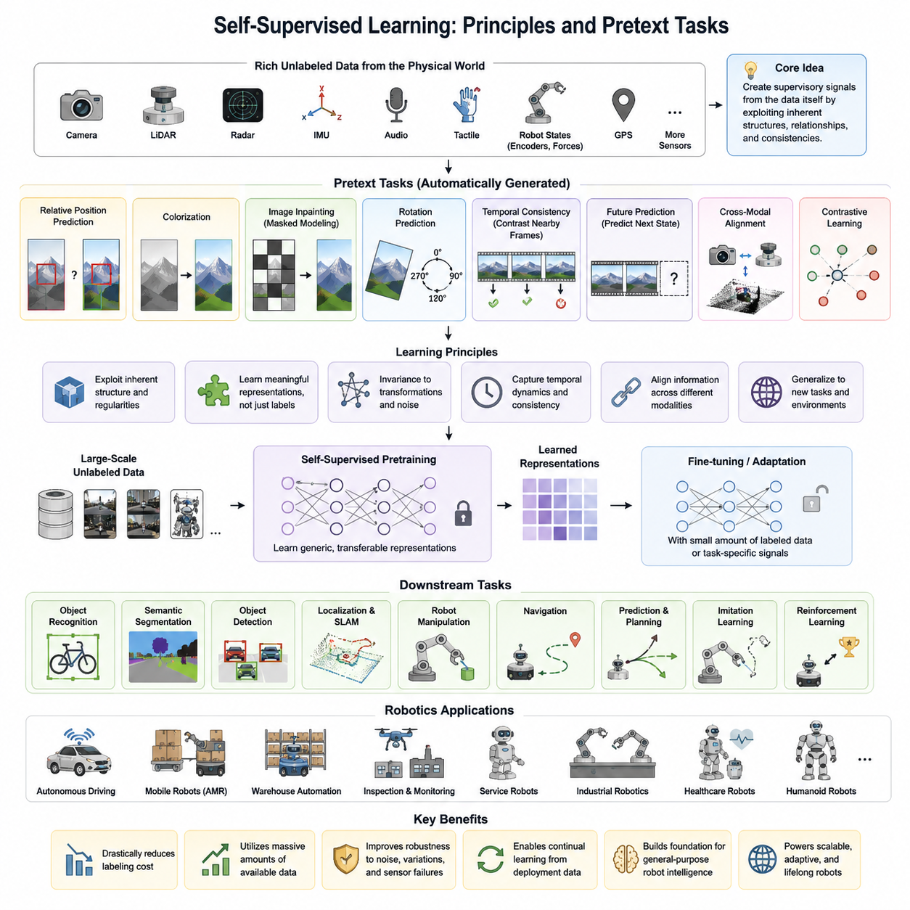
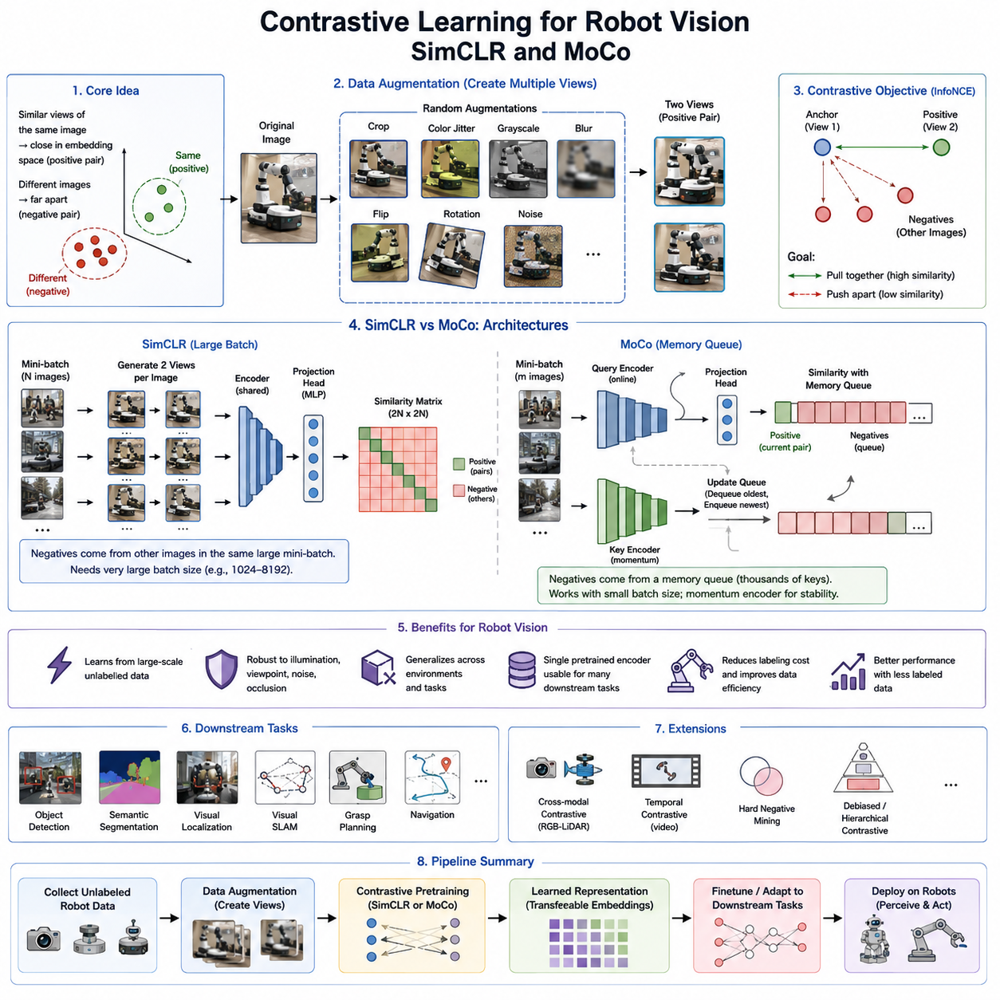
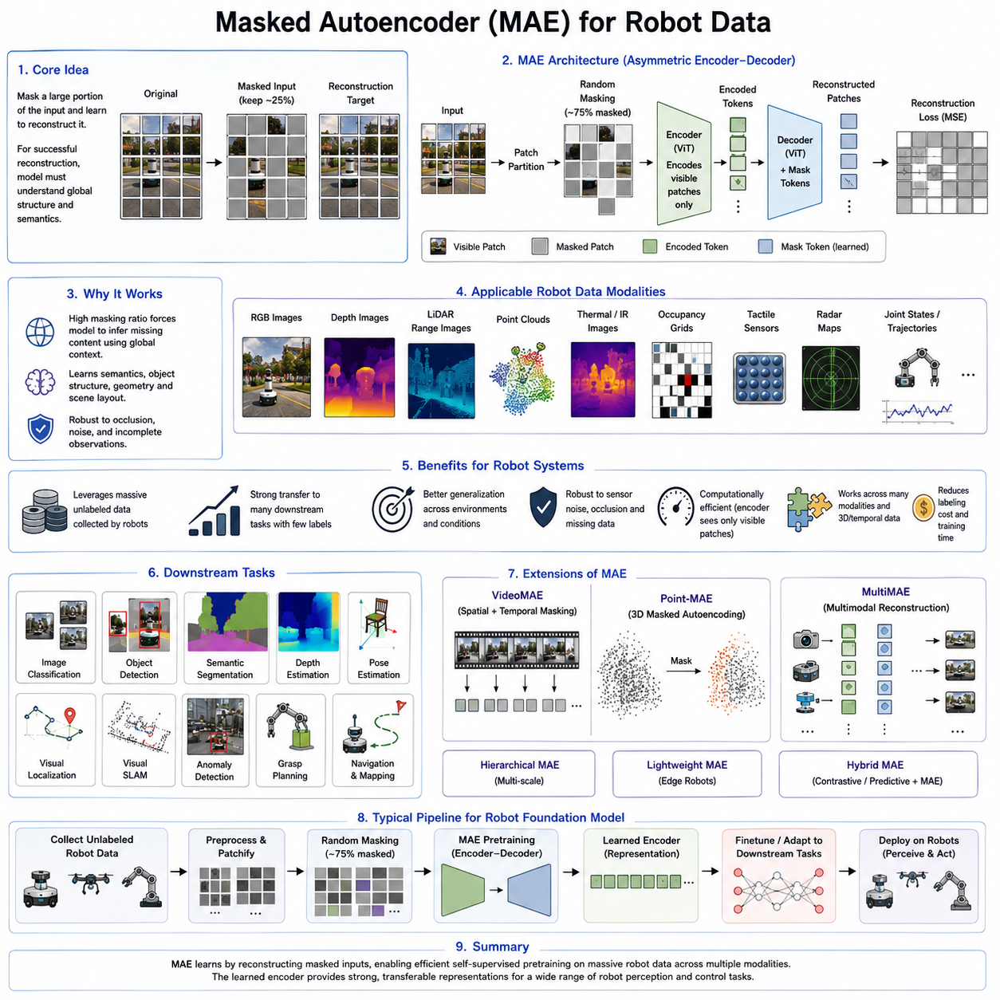
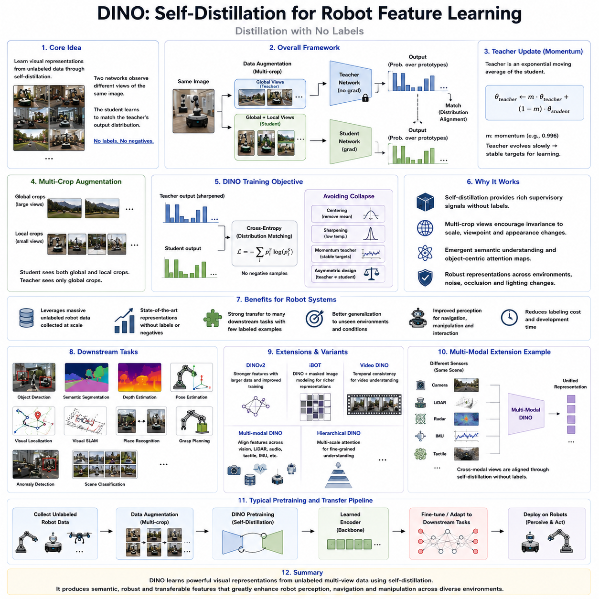
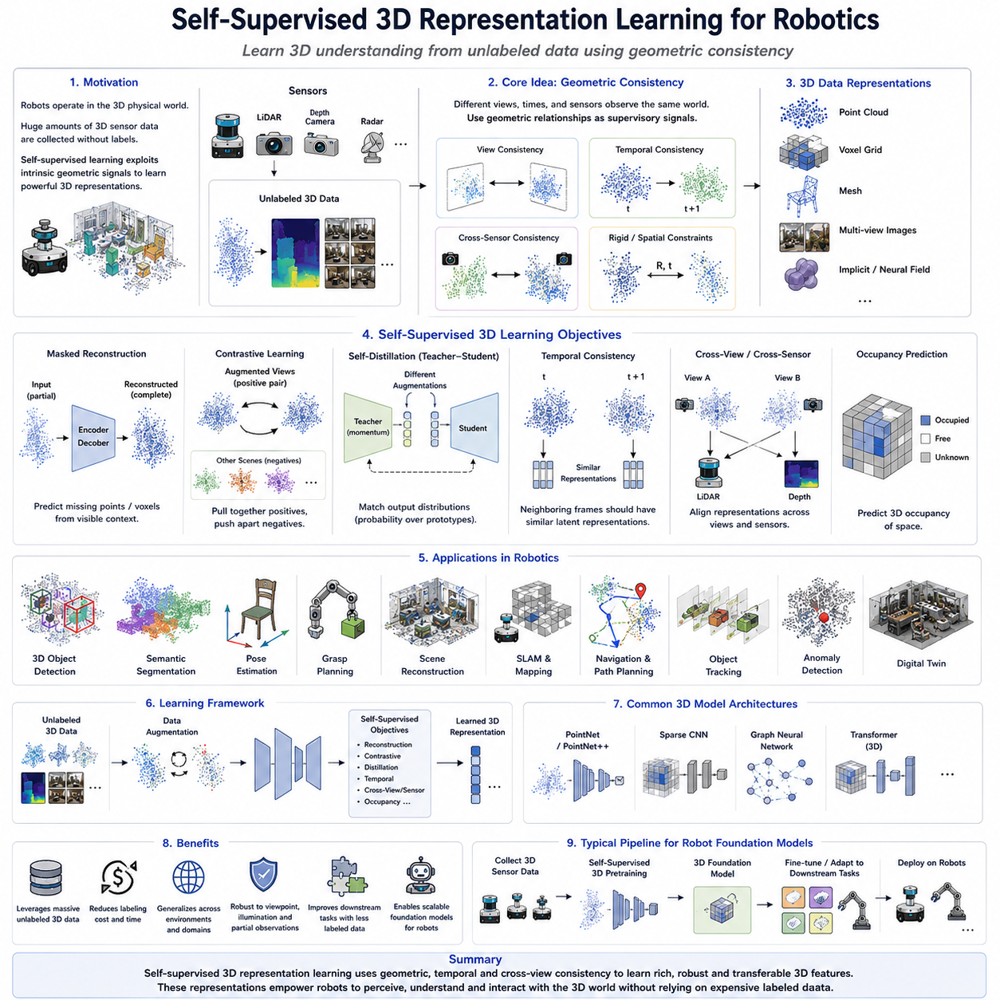
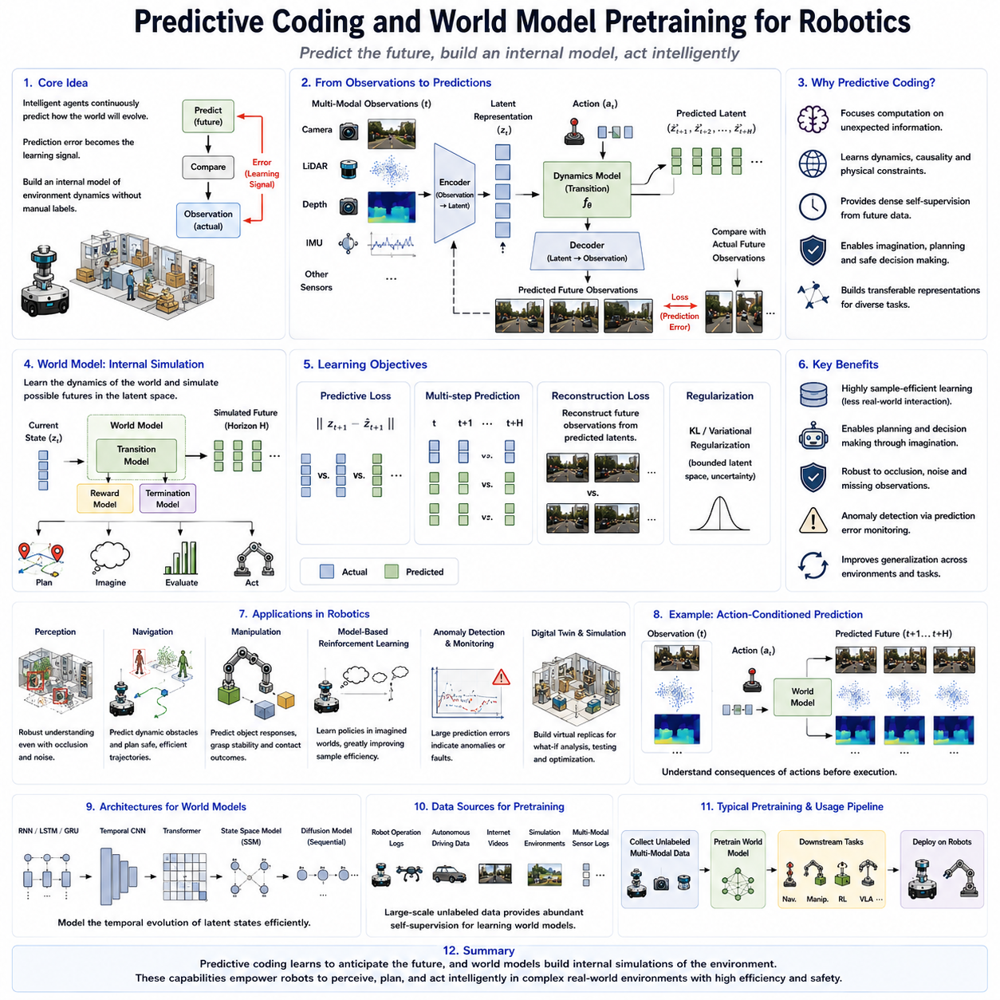
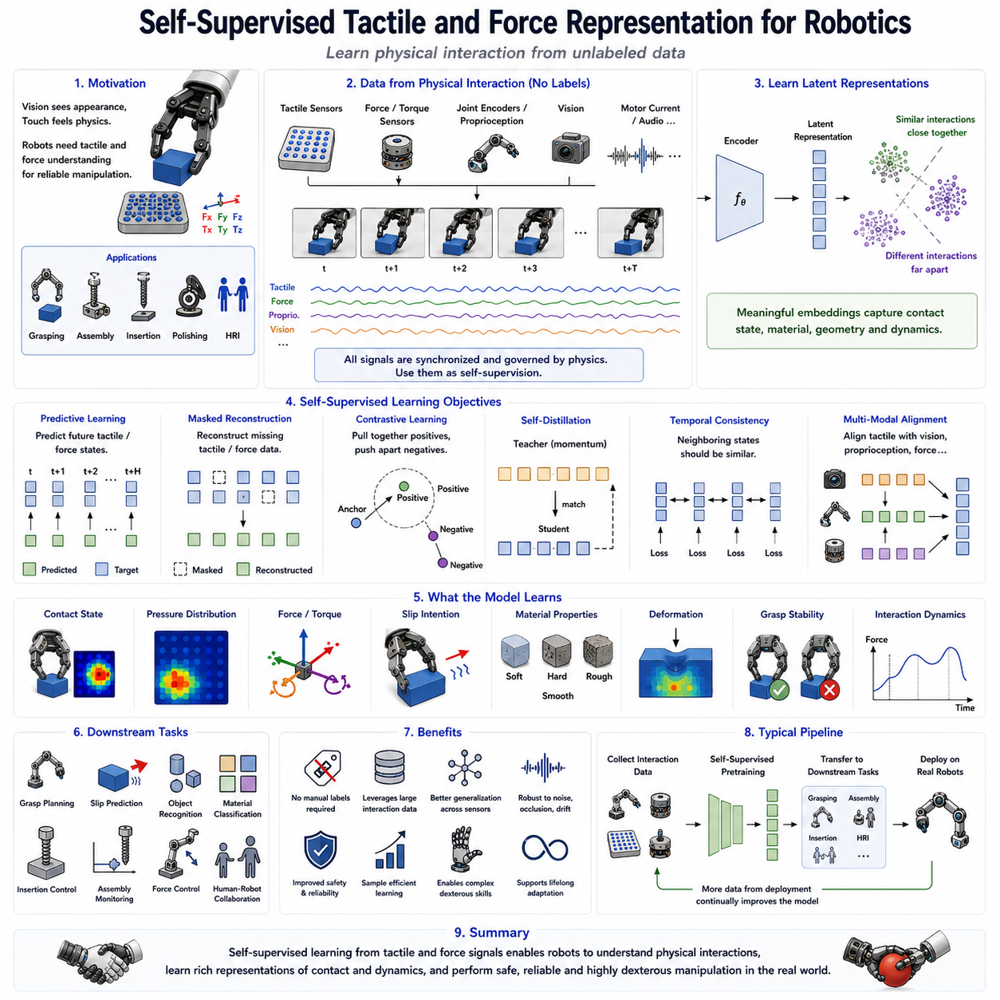
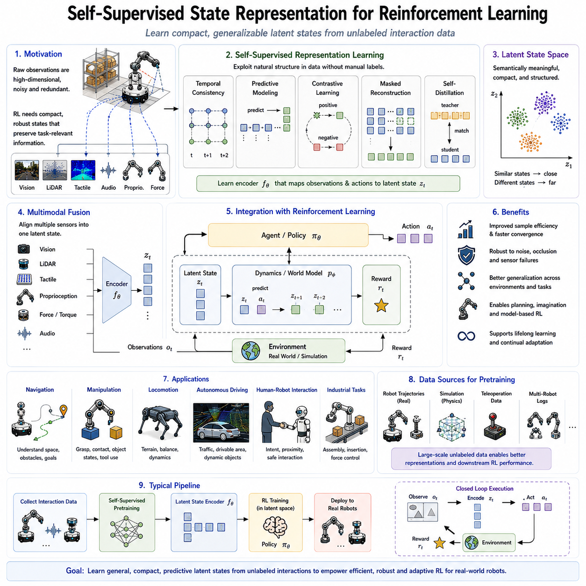
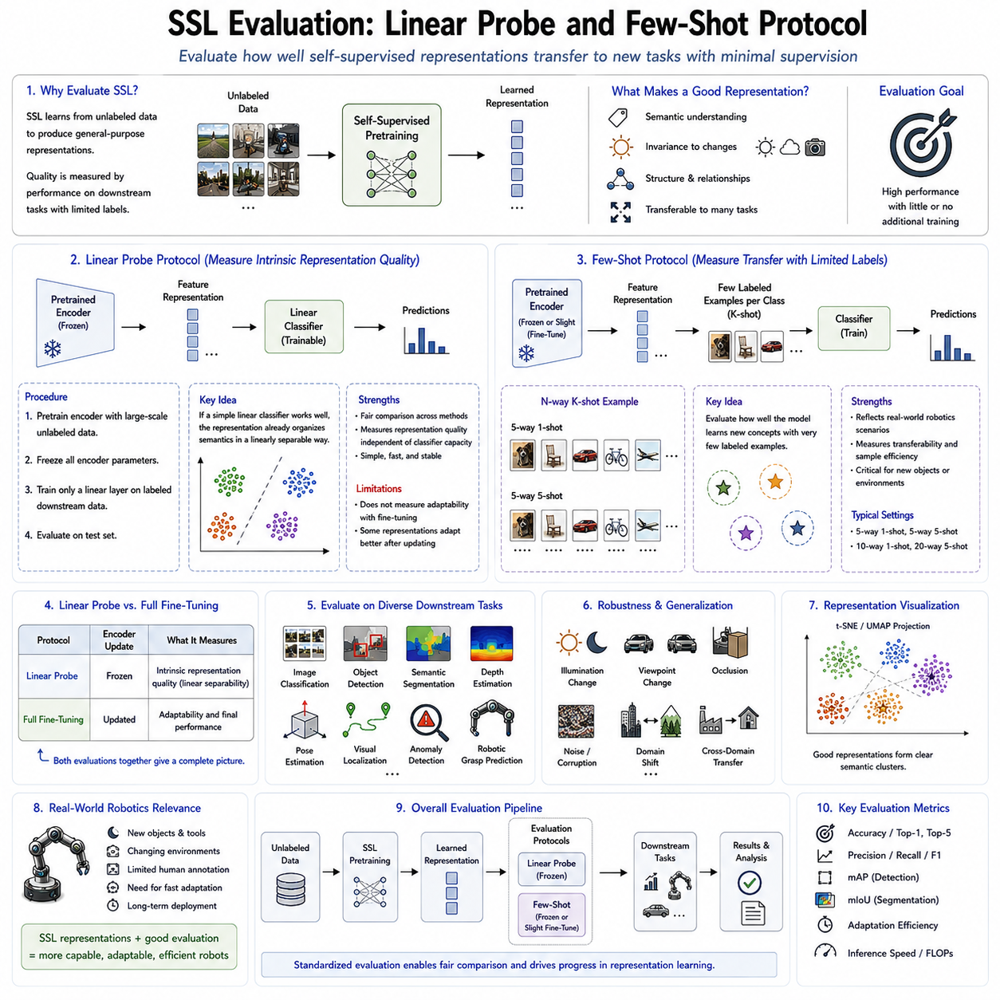
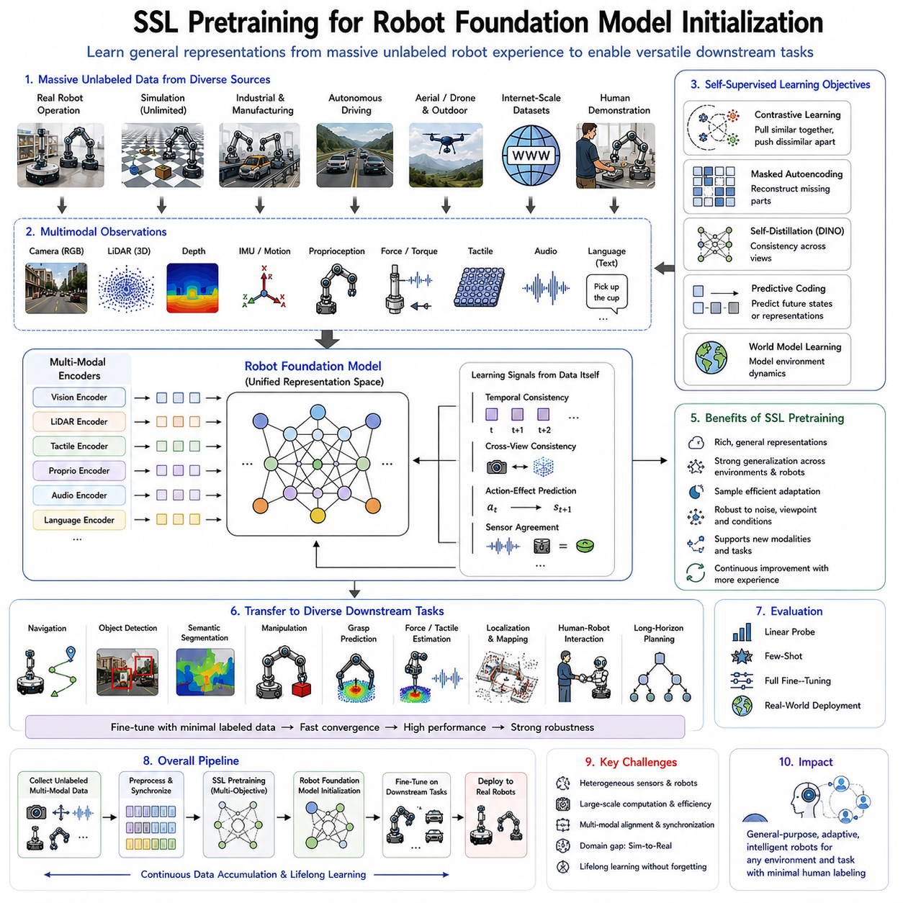

**Volume 19 Robot Machine Learning and AI**

# 03. Self Supervised Learning

## 03.01 Self Supervised Learning Principles and Pretext Tasks

{width="7.268055555555556in" height="7.268055555555556in"}

자기지도학습(SSL, Self-Supervised Learning)은 사람이 직접 정답(Label)을 붙이지 않아도 데이터 자체에서 학습 신호(Supervisory Signal)를 생성하여 의미 있는 표현(Representation)을 학습하는 기계학습(Machine Learning) 방법이다. 최근 인공지능(AI)의 발전을 이끈 핵심 기술 중 하나로 평가되며, 특히 방대한 데이터를 확보할 수 있지만 라벨링(Labeling) 비용이 매우 높은 로보틱스(Robotics) 분야에서 매우 중요한 역할을 수행한다. 기존 지도학습(Supervised Learning)이 사람의 주석 데이터에 의존했다면, 자기지도학습은 데이터 내부에 존재하는 구조와 규칙성을 이용하여 학습 목표를 스스로 생성한다. 따라서 적은 비용으로 대규모 학습이 가능하며, 범용적인 특징 표현을 획득할 수 있다는 장점을 가진다.

기존 지도학습은 특정 문제를 해결하기 위해 클래스(Class)나 회귀값(Regression Target)을 예측하도록 모델을 학습시킨다. 이러한 방식에서는 모델이 해당 문제에 최적화된 특징만 학습하는 경우가 많다. 반면 자기지도학습은 데이터 속에 존재하는 공간적 구조, 시간적 연속성, 물체 간 관계, 센서 간 일관성 등을 이해하도록 유도한다. 그 결과 특정 작업에 한정되지 않는 일반적인 표현을 학습하게 되며, 이후 다양한 다운스트림 작업(Downstream Task)에 쉽게 전이(Transfer)될 수 있다. 이러한 범용 표현 학습은 최근 파운데이션 모델(Foundation Model)과 피지컬 AI(Physical AI)의 핵심 기반이 되고 있다.

자기지도학습의 가장 중요한 개념은 프리텍스트 작업(Pretext Task)이다. 프리텍스트 작업은 사람이 정답을 제공하지 않아도 데이터에서 자동으로 생성할 수 있는 학습 문제를 의미한다. 모델은 이 문제를 해결하는 과정에서 의미 있는 내부 표현을 학습하며, 이후 실제 응용에서는 이 표현을 재사용한다. 다시 말해 프리텍스트 작업 자체가 최종 목적은 아니지만, 이를 해결하기 위해 학습된 특징 벡터(Feature Vector)가 객체 인식(Object Recognition), 의미 분할(Semantic Segmentation), 위치 추정(Localization), 조작(Manipulation), 자율주행(Navigation) 등의 다양한 응용에 활용된다. 따라서 좋은 프리텍스트 작업을 설계하는 것이 자기지도학습의 핵심 연구 분야이다.

초기의 자기지도학습은 영상 처리 분야에서 다양한 프리텍스트 작업을 제안하였다. 대표적인 방법 중 하나는 이미지 패치(Image Patch)의 상대적 위치를 예측하는 것이다. 모델은 서로 다른 두 개의 이미지 조각이 원본 이미지에서 어떤 위치 관계를 가지는지를 추정해야 한다. 이를 위해서는 단순한 픽셀 값이 아니라 물체의 모양, 경계, 구조, 공간적 배치를 이해해야 한다. 이러한 학습은 별도의 라벨 없이도 객체의 형태와 장면(Scene)의 구조를 자연스럽게 학습하도록 만든다.

또 다른 대표적인 프리텍스트 작업은 색상 복원(Colorization)이다. 입력으로 흑백 이미지를 제공하고 모델이 원래의 색상을 예측하도록 학습한다. 대부분의 물체는 고유한 색상 특성을 가지므로 모델은 색상을 예측하기 위해 사물의 종류와 주변 환경을 함께 이해해야 한다. 예를 들어 하늘은 파란색, 나무는 녹색, 도로는 회색이라는 일반적인 지식을 내부적으로 학습하게 된다. 이러한 과정은 객체의 의미를 이해하는 표현 학습으로 이어진다.

이미지 복원(Image Inpainting) 역시 널리 사용되는 프리텍스트 작업이다. 입력 이미지의 일부 영역을 의도적으로 제거하거나 가린 후 모델이 해당 영역을 복원하도록 학습한다. 성공적인 복원을 위해서는 주변 문맥(Context)과 객체의 형태, 장면의 구조를 모두 이해해야 한다. 최근에는 이러한 개념이 마스크드 이미지 모델링(Masked Image Modeling)과 마스크드 오토인코더(Masked Autoencoder, MAE)로 발전하였으며, 비전 트랜스포머(Vision Transformer) 기반의 최신 파운데이션 모델에서도 핵심 기술로 사용되고 있다.

회전 예측(Rotation Prediction)도 매우 단순하면서 효과적인 자기지도학습 방법이다. 이미지를 0도, 90도, 180도, 270도로 회전시킨 후 모델이 회전 각도를 맞히도록 학습한다. 사람에게는 쉬운 문제처럼 보이지만, 모델은 물체의 정상적인 방향과 공간적 구조를 이해해야만 올바르게 예측할 수 있다. 이 과정에서 객체의 형태와 기하학적 특성을 학습하게 되며, 추가적인 라벨 없이도 우수한 특징 표현을 획득할 수 있다.

시간적 일관성(Temporal Consistency)은 비디오(Video)와 로봇 데이터에서 매우 중요한 자기지도학습 신호이다. 연속된 영상 프레임(Frame)은 대부분 동일한 환경을 서로 다른 시점에서 관측한 것이므로 매우 높은 상관관계를 가진다. 자기지도학습은 이러한 특성을 이용하여 인접한 프레임의 특징 표현은 유사하게 만들고, 멀리 떨어진 프레임은 구별하도록 학습한다. 이를 통해 모델은 객체의 지속성(Object Persistence), 움직임(Motion), 환경 변화 등을 자연스럽게 이해하게 되며, 이동 로봇(Mobile Robot)의 자율주행과 환경 인식 성능을 크게 향상시킬 수 있다.

예측 학습(Predictive Learning)은 현재의 관측으로부터 미래 상태를 예측하도록 학습하는 방법이다. 단순히 현재 데이터를 복원하는 것이 아니라 환경이 앞으로 어떻게 변화할 것인지를 예측하면서 물리적 세계의 동적 특성을 학습한다. 예를 들어 자율주행 로봇은 사람이나 차량의 움직임을 예측하고, 이동 경로를 미리 계획할 수 있다. 이러한 예측 능력은 월드 모델(World Model), 모델 기반 강화학습(Model-Based Reinforcement Learning), 장기 계획(Long-Horizon Planning) 등 차세대 피지컬 AI 기술의 핵심 요소가 되고 있다.

로봇은 다양한 센서를 동시에 사용하기 때문에 교차 모달 자기지도학습(Cross-Modal Self-Supervised Learning)의 효과가 매우 크다. 카메라(Camera), 라이다(LiDAR), 레이더(Radar), 관성측정장치(IMU, Inertial Measurement Unit), 힘 센서(Force Sensor), 촉각 센서(Tactile Sensor), GPS, 엔코더(Encoder)는 동일한 물리적 환경을 서로 다른 방식으로 관측한다. 따라서 한 센서의 정보를 다른 센서의 학습 신호로 사용할 수 있다. 예를 들어 카메라 영상과 라이다 포인트 클라우드(Point Cloud)를 정렬하거나, IMU 데이터를 이용해 영상 기반 움직임을 검증하는 방식이 대표적이다. 이러한 접근은 센서 고장이나 악조건 환경에서도 더욱 강인한 표현 학습을 가능하게 한다.

최근 가장 큰 성공을 거둔 자기지도학습 방법은 대조학습(Contrastive Learning)이다. 대조학습은 동일한 데이터에서 생성한 두 개의 증강(Augmentation) 이미지는 서로 가까운 특징 공간으로 학습하고, 다른 데이터는 서로 멀어지도록 최적화한다. 이를 위해 자르기(Cropping), 색상 변화(Color Jitter), 회전(Rotation), 잡음 추가(Noise Injection) 등의 데이터 증강을 사용한다. 이러한 학습을 통해 모델은 외형 변화에는 강인하면서도 의미적으로 동일한 객체를 안정적으로 인식하는 표현을 획득한다. 최근의 SimCLR, MoCo, BYOL, DINO 등의 대표적인 자기지도학습 알고리즘이 모두 이러한 원리를 기반으로 발전하였다.

모든 자기지도학습이 대조학습을 사용하는 것은 아니다. 최근에는 비대조 자기지도학습(Non-Contrastive Self-Supervised Learning)도 활발히 연구되고 있다. 이러한 방법은 대량의 음성 샘플(Negative Sample)을 사용하지 않고도 표현 붕괴(Representation Collapse)를 방지하도록 네트워크 구조와 손실 함수(Loss Function)를 설계한다. 예측기(Predictor), 정지 그래디언트(Stop-Gradient), 중복 감소(Redundancy Reduction) 등의 기법을 활용하여 안정적인 학습을 수행하며, 계산량을 줄이면서도 높은 성능을 달성할 수 있어 엣지 AI(Edge AI) 기반 로봇 시스템에서도 활용도가 높아지고 있다.

마스크드 표현 학습(Masked Representation Learning)은 최근 자기지도학습의 또 다른 중요한 흐름이다. 입력 데이터의 상당 부분을 제거한 후 이를 복원하도록 학습함으로써 전체 문맥을 이해하도록 만든다. RGB 영상뿐 아니라 깊이 영상(Depth Image), 포인트 클라우드(Point Cloud), 점유 격자(Occupancy Grid), 촉각 데이터(Tactile Data) 등 다양한 로봇 센서에도 동일한 개념을 적용할 수 있다. 이러한 방식은 데이터의 전체 구조를 이해하는 능력을 크게 향상시키며, 최근 로봇 파운데이션 모델에서도 핵심 사전학습(Pretraining) 방법으로 사용되고 있다.

효과적인 자기지도학습을 위해서는 프리텍스트 작업의 설계가 매우 중요하다. 지나치게 단순한 학습 목표는 모델이 의미 있는 구조를 학습하지 않고 통계적 편법(Shortcut)만 이용하게 만들 수 있다. 따라서 공간적 구조, 시간적 관계, 물리적 제약, 센서 간 일관성 등을 반드시 활용하는 학습 목표를 설계해야 한다. 데이터 증강 전략, 마스킹 비율(Masking Ratio), 예측 대상, 손실 함수 등의 선택 역시 최종 표현 품질을 크게 좌우한다.

자기지도학습 모델은 일반적으로 사전학습과 다운스트림 평가를 분리하여 평가한다. 먼저 대규모 비라벨 데이터(Unlabeled Data)를 이용하여 사전학습을 수행한 후, 획득한 표현을 다양한 실제 작업에 적용한다. 평가 방법으로는 선형 프로브(Linear Probe), 소량 학습(Few-Shot Learning), 전이학습(Transfer Learning), 전체 미세조정(Full Fine-Tuning) 등이 사용된다. 이러한 평가는 표현 자체의 일반화 능력을 측정하는 중요한 기준이 되며, 다양한 환경과 작업에서 모델의 활용 가능성을 검증한다.

로보틱스에서는 자기지도학습의 가치가 더욱 크다. 자율주행, 물체 조작, 순찰, 검사, 물류, 서비스 로봇은 매일 수많은 RGB 영상, 깊이 영상, 라이다 데이터, IMU 데이터, 제어 명령, 힘 정보 등을 생성한다. 이러한 데이터를 버리지 않고 자기지도학습에 활용하면 시간이 지날수록 더욱 강력한 표현 모델을 구축할 수 있다. 이는 데이터 라벨링 비용을 획기적으로 줄이는 동시에 새로운 환경과 조명, 날씨, 객체 변화에도 지속적으로 적응할 수 있는 기반을 제공한다.

최근의 로봇 파운데이션 모델은 대부분 자기지도학습을 사전학습의 핵심으로 사용한다. 인터넷 규모의 이미지 데이터, 대규모 로봇 주행 데이터, 시뮬레이션(Simulation) 환경, 합성 데이터(Synthetic Data), 멀티모달 데이터(Multimodal Data)를 이용하여 범용 표현을 먼저 학습한 후, 지도학습, 모방학습(Imitation Learning), 강화학습(Reinforcement Learning) 등을 통해 실제 작업에 맞게 미세조정한다. 이러한 접근은 적은 라벨만으로도 높은 성능을 달성할 수 있게 하며, 차세대 범용 로봇 지능의 핵심 학습 전략으로 자리 잡고 있다.

향후 자기지도학습은 마스크드 모델링(Masked Modeling), 월드 모델(World Model), 대조학습, 생성 모델(Generative Model), 멀티모달 표현 학습(Multimodal Representation Learning), 온라인 적응(Online Adaptation), 지속학습(Lifelong Learning)을 하나의 통합 프레임워크로 발전시킬 것으로 전망된다. 미래의 피지컬 AI는 인간의 지속적인 감독 없이도 실제 환경에서 경험을 축적하고, 새로운 지식을 스스로 습득하며, 다양한 작업으로 일반화할 수 있는 능력을 갖추게 될 것이다. 이는 자율적으로 성장하는 차세대 로봇 지능을 실현하는 핵심 기반 기술이 될 것으로 기대된다.

## 03.02 Contrastive Learning SimCLR MoCo for Robot Vision [w/Code]

{width="7.268055555555556in" height="7.268055555555556in"}

대조학습(Contrastive Learning)은 자기지도학습(Self-Supervised Learning) 분야에서 가장 큰 영향을 미친 학습 방법 가운데 하나로, 사람의 라벨(Label) 없이도 의미 있는 특징 표현(Representation)을 학습할 수 있도록 한다. 핵심 아이디어는 동일한 데이터에서 생성된 서로 다른 관측(View)은 특징 공간에서 가깝게 배치하고, 서로 다른 데이터는 멀리 배치하도록 학습하는 것이다. 이러한 방식은 대량의 비라벨(Unlabeled) 데이터를 활용하여 강력한 표현을 학습할 수 있기 때문에 최근 컴퓨터 비전(Computer Vision)과 로봇 비전(Robot Vision)의 핵심 기술로 자리 잡았다. 특히 로봇은 운용 과정에서 지속적으로 방대한 센서 데이터를 생성하므로, 대조학습은 이러한 데이터를 효과적으로 활용하는 대표적인 자기지도학습 방법이다.

대조학습의 기본 철학은 의미적으로 같은 데이터는 유사한 특징 공간으로 모으고, 다른 데이터는 서로 구분되도록 만드는 것이다. 이를 위해 하나의 원본 이미지에서 두 개 이상의 증강(Augmentation) 이미지를 생성한다. 이러한 증강 이미지는 동일한 장면을 표현하므로 양성 쌍(Positive Pair)으로 간주하며, 서로 다른 이미지들은 음성 쌍(Negative Pair)이 된다. 학습 과정에서는 양성 쌍의 특징 벡터는 서로 가까워지도록 하고, 음성 쌍은 서로 멀어지도록 최적화한다. 이 과정에서 모델은 단순한 픽셀 정보가 아니라 객체의 의미와 구조를 이해하는 표현을 학습하게 된다.

대조학습에서 데이터 증강은 단순히 데이터를 늘리는 목적이 아니라 학습해야 하는 불변성(Invariance)을 정의하는 매우 중요한 요소이다. 대표적인 증강 방법으로는 임의 자르기(Random Crop), 색상 변화(Color Jitter), 가우시안 블러(Gaussian Blur), 좌우 반전(Horizontal Flip), 흑백 변환(Random Grayscale), 회전(Rotation) 등이 있다. 이러한 변환은 객체의 의미는 유지하면서 외형만 변화시키므로 모델은 조명, 시점, 크기 변화에 영향을 받지 않는 강인한 특징을 학습하게 된다. 반대로 지나친 증강은 원래 의미를 훼손하여 학습 성능을 떨어뜨릴 수 있으므로 적절한 증강 정책을 선택하는 것이 매우 중요하다.

대조학습에서는 일반적으로 인코더(Encoder)가 이미지를 특징 벡터로 변환한 후, 프로젝션 헤드(Projection Head)를 통해 임베딩 공간(Embedding Space)으로 투영한다. 이후 코사인 유사도(Cosine Similarity)를 계산하여 양성 쌍은 높은 유사도를 가지도록 하고 음성 쌍은 낮은 유사도를 갖도록 최적화한다. 가장 널리 사용되는 손실 함수는 InfoNCE(Information Noise Contrastive Estimation) 손실 함수이며, 온도(Temperature) 파라미터를 이용하여 유사도 분포를 조절한다. 이러한 구조는 현재 대부분의 대조학습 알고리즘에서 공통적으로 사용되는 기본 프레임워크가 되었다.

SimCLR(Simple Framework for Contrastive Learning of Visual Representations)은 구글 리서치(Google Research)에서 제안한 대표적인 대조학습 알고리즘이다. SimCLR은 복잡한 구조 없이도 매우 높은 성능을 달성할 수 있음을 보여주었다. 하나의 이미지에서 두 개의 서로 다른 증강 이미지를 생성하고 동일한 인코더를 통과시킨 후, 두 결과를 양성 쌍으로 학습한다. 나머지 미니배치(Mini-Batch)에 포함된 모든 이미지들은 음성 샘플로 사용된다. 이러한 단순한 구조에도 불구하고 지도학습에 근접하는 표현 학습 성능을 보여주면서 자기지도학습 분야에 큰 변화를 가져왔다.

SimCLR의 중요한 특징 가운데 하나는 매우 큰 배치 크기(Batch Size)를 요구한다는 점이다. 음성 샘플이 동일한 미니배치 안에서만 생성되기 때문에 많은 음성 데이터를 확보하기 위해서는 수천 개 이상의 이미지를 동시에 학습해야 한다. 따라서 대용량 GPU 메모리와 대규모 분산 학습 환경이 필요하다. 이러한 높은 계산 요구사항은 연구 환경에서는 가능하지만 임베디드 로봇 시스템에서는 적용하기 어려운 경우가 많았으며, 이를 해결하기 위한 새로운 접근법이 필요하게 되었다.

MoCo(Momentum Contrast)는 이러한 SimCLR의 계산 부담을 해결하기 위해 페이스북 AI 리서치(Facebook AI Research)에서 제안한 방법이다. MoCo는 대규모 미니배치를 사용하는 대신 메모리 큐(Memory Queue)를 이용하여 이전 학습 과정에서 생성된 특징 벡터를 저장한다. 현재 배치의 데이터는 저장된 수천 개의 특징과 비교되므로 적은 배치 크기만으로도 충분한 음성 샘플을 확보할 수 있다. 그 결과 GPU 메모리 사용량을 크게 줄이면서도 SimCLR과 유사한 성능을 달성할 수 있게 되었다.

MoCo의 가장 큰 특징은 두 개의 인코더를 사용하는 것이다. 하나는 현재 데이터를 처리하는 쿼리 인코더(Query Encoder)이고, 다른 하나는 메모리 큐에 저장될 특징을 생성하는 키 인코더(Key Encoder)이다. 키 인코더는 일반적인 역전파(Backpropagation)로 학습하지 않고 모멘텀 업데이트(Momentum Update)를 사용한다. 이는 이전 가중치를 천천히 반영하여 항상 안정적인 특징 공간을 유지하도록 만들며, 급격한 표현 변화로 인해 학습이 불안정해지는 문제를 방지한다.

메모리 큐는 지속적으로 업데이트되는 음성 샘플 사전(Dictionary) 역할을 수행한다. 새로운 특징 벡터가 들어오면 가장 오래된 벡터가 제거되고 최신 특징이 저장된다. 따라서 모델은 항상 수천 개 이상의 다양한 음성 샘플과 비교하면서 학습을 수행할 수 있다. 이 구조는 적은 메모리와 계산량으로도 매우 우수한 표현을 학습할 수 있게 만들었으며, 현재 산업용 AI와 로봇 비전 분야에서도 널리 활용되고 있다.

SimCLR과 MoCo 모두 객체의 의미를 유지하면서 외형 변화에는 영향을 받지 않는 불변 특징(Invariant Feature)을 학습하는 것을 목표로 한다. 따라서 조명 변화, 시점 변화, 크기 변화, 센서 잡음, 부분 가림(Occlusion) 등 다양한 환경 변화에도 안정적인 특징 표현을 유지할 수 있다. 이러한 특성은 실제 환경에서 운용되는 자율주행 로봇, 물류 로봇, 서비스 로봇, 산업용 검사 로봇과 같이 환경 변화가 심한 시스템에서 매우 중요한 장점이 된다.

로봇 비전에서는 하나의 표현 모델을 다양한 작업에서 공통적으로 사용할 수 있다는 점도 큰 장점이다. 대조학습으로 사전학습된 인코더는 객체 검출(Object Detection), 의미 분할(Semantic Segmentation), 시각 위치추정(Visual Localization), 시각 SLAM(Visual SLAM), 루프 클로저(Loop Closure), 장애물 인식(Obstacle Recognition), 파지 계획(Grasp Planning) 등 다양한 다운스트림 작업(Downstream Task)에 활용될 수 있다. 이후에는 소량의 라벨 데이터만으로 미세조정(Fine-Tuning)을 수행하면 높은 성능을 얻을 수 있으므로 데이터 구축 비용을 크게 줄일 수 있다.

최근에는 멀티모달 대조학습(Multimodal Contrastive Learning)도 활발히 연구되고 있다. 카메라(Camera), 라이다(LiDAR), 레이더(Radar), 깊이 카메라(Depth Camera), IMU(Inertial Measurement Unit), 촉각 센서(Tactile Sensor) 등 서로 다른 센서가 동일한 환경을 관측한다는 특성을 이용하여 서로 다른 센서의 특징 공간을 일치시키는 방식이다. 예를 들어 RGB 영상과 동일한 시점의 라이다 포인트 클라우드(Point Cloud)가 유사한 표현을 갖도록 학습하면 센서 융합(Sensor Fusion) 성능과 환경 인식 능력을 크게 향상시킬 수 있다.

시간 정보를 활용하는 시간 대조학습(Temporal Contrastive Learning)도 로봇 분야에서 매우 중요하다. 연속된 영상 프레임은 대부분 동일한 공간을 서로 다른 시점에서 촬영한 것이므로 특징 공간에서도 가까워야 한다. 반면 시간적으로 멀리 떨어진 프레임은 서로 다른 장소나 상황일 가능성이 높으므로 구별되어야 한다. 이러한 학습을 통해 로봇은 위치 인식(Place Recognition), 시각 주행(Visual Navigation), 시각 오도메트리(Visual Odometry), 장기 자율주행(Long-Term Navigation) 등에 필요한 시간적 표현을 자연스럽게 학습할 수 있다.

대조학습의 성능은 여러 하이퍼파라미터(Hyperparameter)에 크게 영향을 받는다. 배치 크기(Batch Size), 메모리 큐 길이(Queue Length), 모멘텀 계수(Momentum Coefficient), 임베딩 차원(Embedding Dimension), 온도(Temperature), 증강 전략(Augmentation Strategy), 최적화 알고리즘(Optimizer) 등이 모두 최종 표현의 품질을 결정한다. 또한 수행하려는 로봇 작업에 따라 증강 정책을 다르게 설계해야 하며, 지나친 변형은 위치 추정이나 지도 작성과 같은 공간 정보가 중요한 작업에서는 오히려 성능을 저하시킬 수 있다.

대조학습은 매우 뛰어난 성능을 보이지만 몇 가지 한계도 존재한다. 대규모 사전학습에는 많은 계산 자원이 필요하며, 데이터 증강의 품질에 매우 민감하다. 또한 시각적으로 매우 유사한 객체가 많은 환경에서는 음성 샘플(False Negative)이 실제로는 같은 의미를 가지는 경우가 발생하여 학습 성능을 저하시킬 수도 있다. 반복적인 산업 환경이나 창고 환경에서는 이러한 문제가 더욱 두드러질 수 있어 추가적인 개선 기법이 연구되고 있다.

최근 연구에서는 이러한 한계를 해결하기 위해 다양한 발전된 방법들이 제안되고 있다. 하드 네거티브 마이닝(Hard Negative Mining)은 구별하기 어려운 음성 샘플을 적극적으로 활용하여 표현력을 높이고, 디바이어스드 대조학습(Debiased Contrastive Learning)은 잘못된 음성 샘플의 영향을 줄인다. 또한 계층적 대조학습(Hierarchical Contrastive Learning), 영역 기반 대조학습(Region-Level Contrastive Learning), 밀집 대조학습(Dense Contrastive Learning), 멀티뷰 대조학습(Multi-View Contrastive Learning) 등 다양한 확장 기법들이 등장하여 더욱 풍부한 표현 학습을 가능하게 하고 있다.

최신 로봇 파운데이션 모델(Robot Foundation Model)에서는 대조학습이 사전학습의 핵심 기술로 활용된다. 인터넷 규모의 이미지 데이터, 시뮬레이션(Simulation) 데이터, 로봇 주행 데이터, 산업 검사 데이터 등을 이용하여 먼저 범용적인 시각 표현을 학습한 후, 모방학습(Imitation Learning), 강화학습(Reinforcement Learning), 지도학습(Supervised Learning)을 통해 실제 작업에 맞게 미세조정한다. 이러한 접근은 적은 라벨 데이터만으로도 다양한 로봇 작업에서 높은 성능을 달성할 수 있도록 해준다.

향후 대조학습은 마스크드 모델링(Masked Modeling), 월드 모델(World Model), 생성 모델(Generative Model), 멀티모달 파운데이션 모델(Multimodal Foundation Model), 지속학습(Lifelong Learning)과 결합하여 더욱 발전할 것으로 예상된다. 미래의 피지컬 AI(Physical AI)는 실제 환경에서 수집되는 방대한 데이터를 지속적으로 활용하여 스스로 표현을 개선하고 새로운 환경에 적응하는 능력을 갖추게 될 것이며, 대조학습은 이러한 자율 학습 기반의 범용 로봇 지능을 구현하는 핵심 기술 중 하나로 계속 발전해 나갈 것으로 전망된다.

## 03.03 Masked Autoencoder MAE for Robot Data [w/Code]

{width="7.268055555555556in" height="7.268055555555556in"}

마스크드 오토인코더(Masked Autoencoder, MAE)는 최근 자기지도학습(Self-Supervised Learning) 분야에서 가장 큰 주목을 받고 있는 표현 학습(Representation Learning) 기술 가운데 하나이다. 기존의 대조학습(Contrastive Learning)이 양성·음성 샘플을 비교하여 특징을 학습하는 방식이라면, MAE는 입력 데이터의 대부분을 의도적으로 가린 후 이를 복원하도록 학습한다. 즉, 보이지 않는 정보를 스스로 예측하는 과정에서 데이터의 구조와 의미를 이해하게 된다. 이러한 방식은 별도의 라벨(Label) 없이도 강력한 특징 표현을 학습할 수 있어 컴퓨터 비전(Computer Vision)은 물론 로봇 비전(Robot Vision)과 피지컬 AI(Physical AI)의 핵심 사전학습(Pretraining) 기술로 자리 잡고 있다.

MAE의 기본 철학은 지도학습(Supervised Learning)과 크게 다르다. 지도학습은 객체의 종류나 위치와 같은 사람이 만든 정답(Label)을 이용하여 모델을 학습하지만, MAE는 데이터 자체에서 학습 신호를 생성한다. 학습 과정에서는 입력 이미지나 센서 데이터의 상당 부분을 가리고(Masking), 남아 있는 정보만 이용하여 원래 데이터를 복원하도록 한다. 모델은 단순히 픽셀 값을 암기하는 것이 아니라, 숨겨진 부분을 예측하기 위해 객체의 형태, 공간 구조, 장면의 의미를 이해해야 한다. 따라서 대규모 비라벨 데이터(Unlabeled Data)만으로도 범용적인 표현을 학습할 수 있다.

MAE의 아이디어는 자연어 처리(NLP, Natural Language Processing)의 마스크드 언어 모델링(Masked Language Modeling)에서 시작되었다. 대표적으로 BERT(Bidirectional Encoder Representations from Transformers)는 문장의 일부 단어를 가리고 이를 예측하도록 학습하면서 문맥(Context)을 이해하는 능력을 획득하였다. 이러한 개념을 영상 분야에 적용한 것이 MAE이다. 다만 이미지는 텍스트보다 정보의 중복성이 매우 높기 때문에 일부만 가려서는 충분한 학습 효과를 얻기 어렵다. 따라서 MAE는 일반적으로 전체 이미지 패치(Patch)의 약 75%를 가리고 복원하도록 학습하여 훨씬 높은 수준의 의미 이해를 요구한다.

MAE는 비대칭 구조(Asymmetric Architecture)를 사용하는 것이 특징이다. 전체 시스템은 인코더(Encoder)와 디코더(Decoder)로 구성되지만, 인코더는 가려지지 않은 패치만 입력받는다. 즉, 전체 이미지가 아니라 보이는 일부 정보만 처리하기 때문에 계산량이 크게 감소한다. 이후 디코더는 인코더가 생성한 특징과 마스크 토큰(Mask Token)을 함께 사용하여 원래 이미지를 복원한다. 이러한 구조는 계산 효율성을 높이는 동시에 인코더가 더욱 의미 있는 특징 표현을 학습하도록 유도한다.

마스킹 전략(Masking Strategy)은 MAE 성능을 결정하는 핵심 요소이다. 학습마다 서로 다른 위치를 무작위(Random)로 가리기 때문에 모델은 항상 새로운 복원 문제를 해결해야 한다. 입력 데이터의 대부분이 제거되어 있기 때문에 단순히 주변 픽셀을 복사하는 방식으로는 복원이 불가능하다. 대신 객체의 형태, 기하학적 구조, 공간적 관계, 장면 전체의 의미를 이해해야만 성공적으로 복원할 수 있다. 이 과정에서 학습된 표현은 단순한 색상이나 질감이 아니라 객체와 환경의 의미를 포함하는 고수준 특징(High-Level Feature)이 된다.

비전 트랜스포머(Vision Transformer, ViT)는 MAE에서 가장 많이 사용되는 인코더 구조이다. 입력 이미지를 일정한 크기의 패치로 분할한 후 각각을 하나의 토큰(Token)으로 변환하여 처리한다. 가려지지 않은 패치만 셀프 어텐션(Self-Attention)에 참여하므로 계산량이 크게 감소하며, 이후 디코더가 마스크 토큰과 함께 전체 이미지를 복원한다. 이러한 구조는 대규모 데이터셋에서도 효율적인 사전학습을 가능하게 하며, 최신 파운데이션 모델(Foundation Model)의 핵심 구조로 널리 활용되고 있다.

MAE는 RGB 영상뿐 아니라 다양한 로봇 센서 데이터에도 동일한 개념을 적용할 수 있다. 깊이 영상(Depth Image), 열화상(Thermal Image), 적외선 영상(Infrared Image), 다중분광 영상(Multispectral Image), 점유 격자(Occupancy Grid), 라이다 거리 영상(LiDAR Range Image), 레이더 맵(Radar Map), 촉각 센서(Tactile Sensor), 힘 센서(Force Sensor), 로봇 관절 상태(Joint State) 등 다양한 데이터에서 일부 정보를 제거한 뒤 이를 복원하도록 학습할 수 있다. 따라서 MAE는 로봇이 사용하는 거의 모든 센서에 적용 가능한 범용 자기지도학습 프레임워크로 발전하고 있다.

로봇은 실제 환경에서 불완전한 센서 데이터를 자주 경험한다. 카메라는 조명 변화와 부분 가림(Occlusion), 모션 블러(Motion Blur)의 영향을 받고, 라이다(LiDAR)는 일부 영역이 비어 있는 희소 포인트 클라우드(Sparse Point Cloud)를 생성한다. 레이더(Radar)는 잡음이 많고, 촉각 센서는 일부 접촉 정보만 제공한다. MAE는 이러한 불완전한 데이터를 반복적으로 복원하면서 학습하기 때문에 실제 운용 환경에서도 센서 오류와 데이터 손실에 매우 강인한 표현을 학습할 수 있다.

또한 MAE는 로봇이 운용 중 생성하는 대규모 비라벨 데이터를 매우 효율적으로 활용할 수 있다. 자율주행, 물류, 산업 검사, 농업, 순찰, 서비스 로봇은 매일 방대한 RGB 영상, 깊이 영상, 라이다 데이터 등을 생성하지만 대부분은 라벨이 없다. 지도학습에서는 이러한 데이터를 사용하려면 사람이 직접 주석을 달아야 하지만, MAE는 이러한 원시 데이터(Raw Data)를 그대로 학습에 사용할 수 있다. 따라서 시간이 지날수록 로봇이 축적한 데이터를 이용하여 더욱 강력한 파운데이션 모델을 구축할 수 있다.

MAE로 학습된 인코더는 다양한 다운스트림 작업(Downstream Task)에 매우 높은 전이 성능(Transferability)을 보인다. 객체 분류(Image Classification), 객체 검출(Object Detection), 의미 분할(Semantic Segmentation), 깊이 추정(Depth Estimation), 자세 추정(Pose Estimation), 시각 위치추정(Visual Localization), 시각 SLAM(Visual SLAM), 이상 탐지(Anomaly Detection), 장면 이해(Scene Understanding) 등에 쉽게 적용할 수 있다. 이미 풍부한 특징을 학습한 상태이므로 소량의 라벨 데이터만으로도 미세조정(Fine-Tuning)을 수행하면 높은 성능을 달성할 수 있다.

로봇 조작(Manipulation) 분야에서도 MAE는 매우 유용하다. 객체의 형태와 공간 구조를 미리 학습하기 때문에 별도의 파지(Grasp) 라벨 없이도 물체의 기하학적 구조와 배치를 이해할 수 있다. 이러한 표현은 파지 계획(Grasp Planning), 물체 자세 추정(Object Pose Estimation), 접촉 예측(Contact Prediction), 조작 정책(Manipulation Policy) 학습 등 다양한 작업의 성능을 향상시킨다. 이동 로봇 역시 환경 구조와 이동 가능한 영역을 자연스럽게 이해할 수 있어 자율주행 성능 향상에 기여한다.

최근에는 3차원 데이터에 특화된 포인트 MAE(Point-MAE)도 활발히 연구되고 있다. 2차원 이미지 대신 포인트 클라우드(Point Cloud)의 일부를 제거한 후 이를 복원하도록 학습하는 방식이다. 이를 통해 객체의 3차원 기하 구조와 공간 형태를 이해할 수 있으며, 자율주행 자동차, 물류 로봇, 산업 검사, 건설 현장, 서비스 로봇 등 다양한 분야에서 활용되고 있다. 3차원 환경을 이해해야 하는 로봇에게 매우 중요한 자기지도학습 기술로 평가받고 있다.

시간 정보를 활용하는 시간 MAE(Temporal MAE)는 영상이나 센서 시퀀스(Sequence)의 일부 시간 구간을 제거한 후 이를 복원하도록 학습한다. 이를 통해 물체의 움직임, 사람의 행동, 로봇의 이동 경로, 환경 변화와 같은 시간적 관계를 이해할 수 있다. 이러한 표현은 행동 인식(Action Recognition), 미래 예측(Future Prediction), 경로 계획(Trajectory Planning), 장기 작업(Long-Horizon Task) 등 다양한 시계열 기반 로봇 응용에 활용된다.

멀티모달 MAE(Multimodal MAE)는 여러 센서를 동시에 활용하는 자기지도학습 방법이다. 카메라(Camera), 라이다(LiDAR), 레이더(Radar), IMU(Inertial Measurement Unit), 촉각 센서(Tactile Sensor), 힘 센서(Force Sensor), GPS 등을 동시에 입력받아 일부 센서 정보를 제거한 후 다른 센서를 이용하여 이를 복원한다. 이러한 과정은 서로 다른 센서 간의 공통 표현을 학습하게 만들며, 특정 센서가 일시적으로 고장 나거나 성능이 저하되어도 안정적인 환경 인식을 가능하게 한다.

MAE의 가장 큰 장점 가운데 하나는 계산 효율성이다. 인코더는 전체 입력이 아니라 보이는 패치만 처리하므로 일반적인 비전 트랜스포머보다 연산량이 크게 감소한다. 마스킹 비율이 높을수록 계산량은 더욱 줄어들지만 의미 있는 특징 학습은 그대로 유지된다. 따라서 수백만 장 이상의 이미지나 대규모 로봇 데이터를 학습하는 파운데이션 모델 개발에서도 높은 학습 효율성을 제공한다.

물론 MAE에도 한계는 존재한다. 디코더가 지나치게 강력하면 복원 자체에만 집중하여 의미 표현 학습이 약해질 수 있다. 또한 마스킹 비율(Masking Ratio), 패치 크기(Patch Size), 디코더 구조, 복원 대상 등을 적절히 설계하지 않으면 표현 품질이 저하될 수 있다. 최근에는 이러한 한계를 극복하기 위해 대조학습(Contrastive Learning), 예측 학습(Predictive Learning), 멀티모달 정렬(Multimodal Alignment) 등을 함께 사용하는 하이브리드 자기지도학습(Hybrid Self-Supervised Learning)이 활발히 연구되고 있다.

현재는 VideoMAE, Point-MAE, MultiMAE 등 다양한 변형 모델이 개발되고 있으며, 각각 영상(Video), 포인트 클라우드(Point Cloud), 멀티모달 센서(Multimodal Sensor)에 최적화되어 있다. 또한 계층적 MAE(Hierarchical MAE), 경량 MAE(Lightweight MAE) 등도 등장하여 엣지 AI(Edge AI) 기반 로봇에서도 적용이 가능하도록 발전하고 있다. 이러한 연구는 자기지도학습의 적용 범위를 더욱 넓히고 있다.

최신 로봇 파운데이션 모델에서는 MAE가 가장 중요한 사전학습 기술 가운데 하나로 사용된다. 인터넷 이미지, 시뮬레이션(Simulation) 데이터, 로봇 운용 데이터, 산업 검사 데이터 등을 이용하여 먼저 범용 표현을 학습한 후, 이를 자율주행(Navigation), 로봇 조작(Manipulation), 강화학습(Reinforcement Learning), 모방학습(Imitation Learning), 비전·언어·행동 모델(Vision-Language-Action, VLA)에 활용한다. 이러한 단계적 학습은 적은 라벨 데이터만으로도 높은 성능과 우수한 일반화 능력을 달성하게 한다.

향후 MAE는 월드 모델(World Model), 생성 모델(Generative Model), 멀티모달 트랜스포머(Multimodal Transformer), 지속학습(Lifelong Learning), 예측 기반 계획(Predictive Planning), 피지컬 AI(Physical AI)와 더욱 긴밀하게 결합될 것으로 예상된다. 미래의 로봇은 불완전한 센서 정보에서도 환경을 이해하고, 새로운 경험을 지속적으로 학습하며, 다양한 작업에 일반화할 수 있는 능력을 갖추게 될 것이다. MAE는 이러한 차세대 범용 로봇 지능을 구현하는 핵심 자기지도학습 기술로 계속 발전해 나갈 것으로 전망된다.

## 03.04 DINO Self Distillation for Robot Feature Learning [w/Code]

{width="7.268055555555556in" height="7.268055555555556in"}

DINO(Distillation with No Labels)는 최근 자기지도학습(Self-Supervised Learning) 분야에서 가장 큰 주목을 받은 시각 표현 학습(Visual Representation Learning) 기법 가운데 하나이다. 기존 지도학습(Supervised Learning)이 사람이 직접 생성한 라벨(Label)에 의존하는 것과 달리, DINO는 라벨 없이도 의미 있는 특징 표현을 학습할 수 있도록 설계되었다. 특히 대조학습(Contrastive Learning)처럼 양성·음성 샘플을 비교하지 않고, 두 개의 신경망이 서로 지식을 전달하는 자기 증류(Self-Distillation)를 통해 학습한다는 점이 가장 큰 특징이다. 이러한 특성 덕분에 DINO는 로봇 비전(Robot Vision), 자율주행, 로봇 조작(Manipulation), 피지컬 AI(Physical AI) 등 다양한 분야에서 핵심 사전학습(Pretraining) 기술로 활용되고 있다.

DINO의 기본 철학은 기존의 지식 증류(Knowledge Distillation)와는 다르다. 일반적인 지식 증류는 이미 학습된 대형 교사 모델(Teacher Model)이 학생 모델(Student Model)을 지도하는 방식이다. 반면 DINO에서는 외부의 교사 모델이 존재하지 않는다. 학생(Student) 모델이 학습을 진행하면, 그 가중치를 기반으로 모멘텀(Momentum) 방식으로 교사 모델을 지속적으로 생성한다. 즉, 학생 모델이 성장하면서 교사 모델도 함께 발전하는 구조이다. 두 모델은 동일한 이미지의 서로 다른 증강(Augmentation) 버전을 입력받으며, 학생 모델은 교사 모델이 생성한 출력 분포를 따라가도록 학습한다. 이러한 자기 증류 과정만으로도 뛰어난 표현 학습이 가능하다.

DINO의 핵심 구조는 교사-학생(Teacher-Student) 아키텍처이다. 학생 모델은 일반적인 역전파(Backpropagation)를 이용하여 학습하지만, 교사 모델은 역전파를 사용하지 않는다. 대신 학생 모델의 가중치를 지수 이동 평균(Exponential Moving Average, EMA) 방식으로 천천히 반영하여 업데이트한다. 이러한 모멘텀 업데이트(Momentum Update)는 교사 모델이 급격하게 변하지 않도록 만들어 안정적인 학습 목표를 제공한다. 결과적으로 학생 모델은 항상 조금 더 안정적이고 일관성 있는 목표를 학습하게 되며, 표현 공간도 안정적으로 발전하게 된다.

DINO는 대조학습과 달리 음성 샘플(Negative Sample)을 전혀 사용하지 않는다. SimCLR이나 MoCo와 같은 기존 방법들은 동일한 데이터는 가깝게, 서로 다른 데이터는 멀어지도록 학습하기 위해 대량의 음성 샘플을 필요로 한다. 그러나 DINO는 교사 모델의 출력 분포를 학생 모델이 그대로 따라가도록 학습하기 때문에 음성 샘플 관리가 필요하지 않다. 따라서 대규모 미니배치(Mini-Batch)나 메모리 큐(Memory Queue)가 없어도 우수한 표현을 학습할 수 있으며, 학습 구조도 상대적으로 단순해진다.

데이터 증강(Data Augmentation)은 DINO에서도 매우 중요한 역할을 수행한다. 하나의 이미지에서 여러 개의 증강 이미지를 생성하는데, 전체 이미지를 포함하는 글로벌 크롭(Global Crop)과 일부 영역만 포함하는 로컬 크롭(Local Crop)을 동시에 사용한다. 교사 모델은 글로벌 이미지만 입력받고, 학생 모델은 글로벌 이미지와 로컬 이미지를 모두 입력받는다. 이를 통해 학생 모델은 작은 부분만 보더라도 전체 장면의 의미를 이해하도록 학습하게 된다. 이러한 멀티 크롭(Multi-Crop) 전략은 크기 변화, 시점 변화, 부분 가림(Occlusion), 조명 변화 등에 매우 강인한 표현을 형성하도록 도와준다.

DINO의 학습 목표는 특징 벡터를 직접 비교하는 것이 아니라 확률 분포(Probability Distribution)를 일치시키는 것이다. 교사와 학생 모델은 입력 영상을 처리한 후 잠재 프로토타입(Latent Prototype)에 대한 확률 분포를 생성한다. 학생 모델은 교사 모델의 출력 분포를 최대한 정확하게 예측하도록 학습된다. 그러나 단순히 두 출력을 맞추기만 하면 모든 입력이 동일한 결과를 내는 표현 붕괴(Representation Collapse)가 발생할 수 있다. 이를 방지하기 위해 DINO는 센터링(Centering), 샤프닝(Sharpening), 모멘텀 업데이트, 비대칭 학습 구조 등을 함께 사용하여 표현의 다양성과 안정성을 동시에 확보한다.

센터링(Centering)은 표현 붕괴를 방지하는 매우 중요한 기법이다. 교사 모델의 출력에서 이전 예측들의 평균값을 지속적으로 빼 주어 특정 프로토타입(Prototype)에만 출력이 집중되지 않도록 만든다. 샤프닝(Sharpening)은 출력 확률 분포의 엔트로피(Entropy)를 낮추어 더욱 명확한 예측을 생성하도록 만든다. 이러한 두 가지 기법은 서로 균형을 이루면서 다양한 특징 표현을 유지하고 동시에 의미적으로 일관된 표현을 형성하도록 도와준다. 이 덕분에 DINO는 별도의 음성 샘플이나 복원 손실 없이도 매우 높은 품질의 표현을 학습할 수 있다.

DINO의 가장 놀라운 특징 가운데 하나는 별도의 객체 분할(Object Segmentation) 학습 없이도 의미 있는 어텐션 맵(Attention Map)을 자연스럽게 생성한다는 점이다. 특히 비전 트랜스포머(Vision Transformer, ViT) 기반 DINO 모델은 객체 영역과 배경을 자동으로 구분하는 주의 집중 패턴을 형성한다. 즉, 사람이 객체 영역을 직접 표시하지 않아도 모델 스스로 중요한 객체를 찾아내는 것이다. 이러한 객체 중심 표현(Object-Centric Representation)은 로봇 조작, 자율주행, 장면 이해, 사람과의 상호작용 등 다양한 로봇 응용에서 매우 중요한 역할을 수행한다.

DINO는 비전 트랜스포머(ViT)를 가장 많이 사용하는 자기지도학습 방법 가운데 하나이다. 이미지를 작은 패치(Patch) 단위로 나누어 각각을 토큰(Token)으로 처리하고, 셀프 어텐션(Self-Attention)을 이용하여 전체 장면의 관계를 학습한다. 이러한 구조는 장거리(Long-Range) 의존성을 효과적으로 학습할 수 있으며, 자기 증류 과정에서 패치 간 의미 관계가 자연스럽게 형성된다. 그 결과 다양한 다운스트림 작업(Downstream Task)에 매우 높은 전이 성능(Transferability)을 제공한다.

로봇 비전에서는 환경 변화가 매우 심하기 때문에 DINO의 장점이 더욱 크게 나타난다. 동일한 창고라도 조명이 시간에 따라 변하고, 공장에서는 설비가 이동하며, 실외에서는 계절과 날씨가 지속적으로 바뀐다. DINO는 이러한 다양한 증강 환경에서도 동일한 의미를 유지하도록 학습하기 때문에 실제 환경 변화에 매우 강인한 특징 표현을 생성한다. 따라서 자율주행 로봇, 산업용 검사 로봇, 서비스 로봇 등 다양한 시스템에서 안정적인 환경 인식을 수행할 수 있다.

또한 DINO는 로봇이 운용 중 생성하는 대규모 비라벨 데이터를 효과적으로 활용할 수 있다. 자율주행 차량, 물류 로봇, 산업용 로봇, 농업 로봇 등은 하루에도 수십만 장 이상의 영상을 생성하지만 대부분 라벨이 없다. DINO는 이러한 데이터를 그대로 사전학습에 활용할 수 있으므로 데이터 구축 비용을 크게 줄일 수 있으며, 시간이 지날수록 더욱 강력한 파운데이션 모델(Foundation Model)을 구축할 수 있다.

DINO로 사전학습된 인코더(Encoder)는 객체 검출(Object Detection), 의미 분할(Semantic Segmentation), 단안 깊이 추정(Monocular Depth Estimation), 시각 위치추정(Visual Localization), 시각 SLAM(Visual SLAM), 장소 인식(Place Recognition), 파지 계획(Grasp Planning), 자세 추정(Pose Estimation), 이상 탐지(Anomaly Detection), 장면 분류(Scene Classification) 등 매우 다양한 작업에서 뛰어난 성능을 보인다. 이미 의미 있는 표현을 충분히 학습한 상태이므로 적은 양의 라벨 데이터만으로도 높은 성능을 달성할 수 있다.

로봇 조작 분야에서도 DINO는 객체 중심 표현(Object-Centric Representation)을 자연스럽게 형성한다. 별도의 객체 분할 데이터 없이도 중요한 물체를 자동으로 강조하는 어텐션 맵을 생성하기 때문에 파지 계획, 물체 추적(Object Tracking), 자세 추정, 조작 정책 학습 등에 매우 효과적이다. 로봇은 장시간 작업을 수행하면서 주변 환경을 지속적으로 관찰하기만 해도 객체를 이해하는 능력을 점차 향상시킬 수 있으며, 이는 피지컬 AI의 핵심 기반이 된다.

자율주행과 이동 로봇에서도 DINO는 매우 강력한 표현을 제공한다. 이동 로봇은 서로 다른 시점, 계절, 조명, 날씨에서도 동일한 장소를 인식해야 한다. DINO는 외형 변화에는 강인하면서도 공간의 의미는 유지하는 표현을 학습하므로 시각 위치추정, 루프 클로저(Loop Closure), 장소 인식, 장기 지도 작성(Long-Term Mapping)의 성능을 크게 향상시킨다. 따라서 창고, 병원, 공장, 캠퍼스, 도심 환경 등 다양한 장소에서 안정적인 자율주행이 가능해진다.

최근에는 DINO를 멀티모달(Multimodal) 환경으로 확장하는 연구도 활발히 진행되고 있다. 카메라(Camera), 라이다(LiDAR), 레이더(Radar), 깊이 카메라(Depth Camera), 열화상 카메라(Thermal Camera), IMU(Inertial Measurement Unit), 촉각 센서(Tactile Sensor) 등 서로 다른 센서에서 생성된 데이터를 동일한 의미 공간으로 정렬하는 자기 증류(Self-Distillation)가 연구되고 있다. 이러한 접근은 센서 융합(Sensor Fusion) 성능을 향상시키고, 일부 센서가 고장 나더라도 안정적인 환경 인식을 가능하게 한다.

DINO는 이후 DINOv2, iBOT 등 다양한 후속 연구로 발전하였다. DINOv2는 훨씬 더 큰 데이터셋과 개선된 최적화 기법을 적용하여 산업 수준의 표현 품질을 달성하였다. iBOT(Image BERT with Online Tokenizer)는 DINO의 자기 증류와 마스크드 이미지 모델링(Masked Image Modeling)을 결합하여 더욱 풍부한 특징 표현을 학습한다. 이 밖에도 시간 정보를 활용한 비디오 DINO(Video DINO), 멀티모달 DINO(Multimodal DINO), 계층적 DINO(Hierarchical DINO) 등이 활발히 연구되고 있다.

기존 자기지도학습과 비교하면 DINO는 독특한 위치를 차지한다. SimCLR이나 MoCo처럼 음성 샘플을 필요로 하지 않고, MAE(Masked Autoencoder)처럼 입력을 복원하지도 않는다. 대신 교사 모델과 학생 모델 간의 확률 분포를 일치시키는 자기 증류(Self-Distillation)를 통해 의미 있는 표현을 학습한다. 이러한 접근은 의미 구조가 잘 형성된 특징 공간과 직관적인 어텐션 맵을 생성한다는 점에서 매우 높은 평가를 받고 있다.

물론 DINO도 몇 가지 과제를 가지고 있다. 안정적인 학습을 위해서는 모멘텀 계수(Momentum Coefficient), 온도(Temperature), 센터링(Centering), 학습률(Learning Rate), 데이터 증강 정책 등을 세밀하게 조정해야 한다. 또한 대형 비전 트랜스포머를 학습하기 위해서는 상당한 GPU 연산 자원과 대규모 비라벨 데이터셋이 필요하다. 라이다 포인트 클라우드나 촉각 센서와 같은 특수 센서에 적용하기 위해서는 추가적인 모델 구조 개선도 요구된다.

현재의 로봇 파운데이션 모델에서는 DINO가 핵심 사전학습 기술 가운데 하나로 자리 잡고 있다. 인터넷 이미지, 시뮬레이션(Simulation) 데이터, 로봇 주행 데이터, 산업 검사 데이터 등을 이용하여 먼저 범용적인 표현을 학습한 후, 이를 모방학습(Imitation Learning), 강화학습(Reinforcement Learning), 비전-언어 모델(Vision-Language Model), 월드 모델(World Model), 비전-언어-행동(Vision-Language-Action, VLA) 모델 등에 활용한다. 이러한 단계적 학습은 적은 라벨 데이터만으로도 높은 성능과 우수한 일반화 능력을 제공한다.

향후 DINO는 마스크드 모델링(Masked Modeling), 월드 모델(World Model), 생성 모델(Generative Model), 멀티모달 트랜스포머(Multimodal Transformer), 지속학습(Lifelong Learning), 피지컬 AI와 더욱 긴밀하게 결합될 것으로 예상된다. 미래의 로봇은 사람의 지속적인 감독 없이도 실제 환경에서 스스로 경험을 축적하고, 의미 있는 표현을 학습하며, 다양한 작업에 일반화할 수 있는 능력을 갖추게 될 것이다. DINO는 이러한 차세대 범용 로봇 지능을 구현하는 핵심 자기지도학습 기술로 지속적으로 발전할 것으로 전망된다.

## 03.05 Self Supervised 3D Representation Learning [w/Code]

{width="7.268055555555556in" height="7.268055555555556in"}

자기지도 3차원 표현 학습(Self-Supervised 3D Representation Learning)은 사람의 라벨(Label) 없이도 로봇이 3차원 공간을 이해할 수 있도록 하는 자기지도학습(Self-Supervised Learning)의 핵심 기술이다. 기존의 컴퓨터 비전(Computer Vision)이 2차원 영상 중심이었다면, 실제 로봇은 깊이(Depth), 거리(Distance), 형태(Geometry), 방향(Orientation), 공간 관계(Spatial Relationship)를 포함하는 3차원 세계에서 동작한다. 따라서 카메라(Camera), 라이다(LiDAR), 깊이 카메라(Depth Camera), 스테레오 비전(Stereo Vision), 레이더(Radar), 구조광 센서(Structured Light Sensor) 등이 생성하는 대규모 비라벨(Unlabeled) 데이터를 활용하여 의미 있는 표현을 학습하는 것이 매우 중요하다. 이러한 기술은 자율주행, 로봇 조작(Manipulation), 환경 인식(Scene Understanding), 디지털 트윈(Digital Twin), 피지컬 AI(Physical AI)의 핵심 기반이 되고 있다.

자기지도 3차원 표현 학습의 기본 철학은 공간 기하학(Geometry) 자체가 학습 신호(Supervisory Signal)를 제공한다는 점이다. 하나의 환경은 여러 시점(Viewpoint), 여러 센서(Sensor), 여러 시간(Time)에서 반복적으로 관측되며, 이러한 관측 간에는 자연스럽게 공간적 일관성(Spatial Consistency), 시간적 연속성(Temporal Consistency), 물체의 지속성(Object Permanence), 강체 변환(Rigid Transformation) 등의 관계가 존재한다. 자기지도학습은 이러한 관계를 이용하여 별도의 사람이 만든 라벨 없이도 물체의 형태와 공간 구조를 이해하는 표현을 학습한다. 따라서 단순히 객체를 분류하는 것이 아니라 공간 자체를 이해하는 능력을 갖추게 된다.

3차원 데이터는 다양한 형태로 표현될 수 있다. 가장 대표적인 것은 라이다가 생성하는 포인트 클라우드(Point Cloud)이며, 이는 수많은 3차원 좌표(Point)의 집합으로 구성된다. 복셀(Voxel)은 공간을 작은 정육면체(Cell) 단위로 나누어 표현하는 방식이며, 메시(Mesh)는 꼭짓점(Vertex)과 면(Face)을 이용하여 연속적인 표면을 표현한다. 최근에는 암시적 표현(Implicit Representation)과 다중 시점(Multi-View) 영상 표현도 널리 사용되고 있다. 각각의 표현 방식은 메모리 사용량, 계산 효율성, 공간 정확도, 적용 분야에서 서로 다른 장점을 가지므로 로봇의 목적에 따라 적절한 방식을 선택하게 된다.

포인트 클라우드는 현재 자율주행과 이동 로봇에서 가장 널리 사용되는 3차원 표현이다. 하지만 일반적인 영상과 달리 순서가 없는(Unordered) 점들의 집합이므로 기존의 합성곱 신경망(CNN, Convolutional Neural Network)을 그대로 적용하기 어렵다. 따라서 자기지도학습에서는 일부 포인트를 제거한 후 복원하거나, 서로 다른 시점의 포인트 클라우드를 정렬하거나, 공간 변환을 예측하는 방식으로 기하학적 구조를 학습한다. 이러한 과정은 별도의 객체 라벨 없이도 공간 구조를 이해하는 표현을 형성하도록 만든다.

마스크드 복원(Masked Reconstruction)은 포인트 클라우드 자기지도학습에서도 매우 중요한 기법이다. 이미지의 MAE(Masked Autoencoder)와 유사하게 포인트 클라우드의 일부 점(Point)을 제거한 후 남은 정보만 이용하여 원래 형태를 복원하도록 학습한다. 성공적으로 복원하기 위해서는 객체의 전체 형상, 표면의 연속성, 구조적 대칭성, 공간적 관계를 이해해야 한다. 따라서 단순한 좌표 암기가 아니라 물체의 의미 있는 기하학적 표현을 학습하게 되며, 이후 객체 검출(Object Detection), 의미 분할(Semantic Segmentation), 자세 추정(Pose Estimation), 파지 계획(Grasp Planning) 등에 효과적으로 활용된다.

대조학습(Contrastive Learning) 역시 3차원 표현 학습에 널리 사용된다. 하나의 포인트 클라우드에 회전(Rotation), 이동(Translation), 크기 변화(Scaling), 잡음(Jittering), 일부 제거(Point Dropout) 등의 변환을 적용하여 여러 개의 시점을 생성하고, 동일한 객체는 가까운 표현 공간으로, 다른 객체는 먼 공간으로 학습한다. 이러한 방식은 센서 위치나 시점이 달라져도 동일한 객체를 안정적으로 인식할 수 있는 불변 특징(Invariant Feature)을 형성한다. 이동 로봇이나 자율주행 차량처럼 환경을 다양한 각도에서 관측하는 시스템에서 매우 효과적인 학습 방법이다.

최근에는 DINO(Self-Distillation with No Labels)와 유사한 자기 증류(Self-Distillation) 기법도 3차원 데이터에 적용되고 있다. 교사 모델(Teacher Model)과 학생 모델(Student Model)이 서로 다른 증강된 포인트 클라우드를 입력받아 동일한 표현을 학습하도록 만든다. 이러한 방법은 음성 샘플(Negative Sample)이 필요 없으며, 모멘텀(Momentum) 기반 교사 모델을 이용하여 안정적인 특징 표현을 학습할 수 있다. 결과적으로 라벨이 전혀 없는 대규모 3차원 데이터에서도 우수한 기하학적 표현을 획득할 수 있다.

시간적 일관성(Temporal Consistency)은 이동 로봇에서 매우 강력한 자기지도학습 신호가 된다. 로봇이 이동하면서 연속적으로 수집하는 라이다 스캔(LiDAR Scan), 깊이 영상(Depth Image), 다중 시점(Multi-View) 영상은 대부분 동일한 공간을 서로 다른 위치에서 관측한 것이다. 따라서 인접한 시점은 비슷한 표현을 가져야 하고, 실제 환경이 변하지 않았다면 의미 공간에서도 가까워야 한다. 이러한 시간 기반 학습은 위치 추정(Localization), 루프 클로저(Loop Closure), 지도 작성(Mapping), 이동 객체 추적(Dynamic Object Tracking) 등의 성능을 크게 향상시킨다.

교차 시점 일관성(Cross-View Consistency) 역시 중요한 자기지도학습 방법이다. 하나의 물체를 여러 카메라나 여러 라이다가 서로 다른 각도에서 동시에 관측하는 경우, 외형은 다르게 보이지만 실제로는 동일한 물체이다. 자기지도학습은 이러한 여러 시점의 데이터를 동일한 표현 공간으로 정렬하도록 학습한다. 그 결과 시점 변화에 강인한 객체 인식(Object Recognition), 자세 추정(Pose Estimation), 장면 재구성(Scene Reconstruction), 센서 융합(Sensor Fusion)이 가능해진다.

센서 융합(Sensor Fusion)은 자기지도 3차원 표현 학습의 중요한 응용 분야이다. 현대의 자율주행 로봇은 RGB 카메라, 라이다, 레이더, 깊이 카메라, IMU(Inertial Measurement Unit), GPS(Global Positioning System), 촉각 센서(Tactile Sensor), 엔코더(Encoder)를 동시에 사용한다. 이러한 센서들은 서로 다른 물리량을 측정하지만 동일한 환경을 관측한다. 자기지도학습은 서로 다른 센서의 표현을 동일한 잠재 공간(Latent Space)에 정렬하여 통합적인 환경 이해를 가능하게 한다. 일부 센서가 일시적으로 고장 나거나 성능이 저하되어도 다른 센서를 이용하여 안정적인 인식이 가능하다.

장면 재구성(Scene Reconstruction)은 자기지도 3차원 학습의 대표적인 목표이다. 로봇은 부분적으로만 관측한 환경을 이용하여 전체 공간을 복원해야 한다. 희소한 라이다 데이터나 제한된 카메라 시점만으로도 전체 구조를 추정할 수 있어야 한다. 이러한 능력은 자율주행, 장애물 회피(Obstacle Avoidance), 디지털 트윈(Digital Twin), 물류 창고 지도 작성, 산업 설비 검사, 사회기반시설(Infrastructure) 모니터링 등에 폭넓게 활용된다.

점유 예측(Occupancy Prediction)도 매우 중요한 자기지도학습 목표이다. 공간을 점유(Occupied), 빈 공간(Free), 미확인(Unknown)으로 예측하는 방식으로 환경을 이해한다. 이러한 점유 지도(Occupancy Grid)는 경로 계획(Path Planning), 충돌 회피(Collision Avoidance), 자율주행(Navigation), 지도 작성(Mapping)의 핵심 데이터가 된다. 여러 시점에서 얻어진 관측의 공간적 일관성을 활용하여 별도의 라벨 없이도 정확한 점유 지도를 학습할 수 있다.

객체 완성(Object Completion)은 일부만 보이는 물체의 전체 형태를 예측하는 자기지도학습 방법이다. 실제 환경에서는 물체가 다른 물체에 의해 가려지거나 센서의 시야(Field of View)가 제한되어 전체를 볼 수 없는 경우가 많다. 자기지도학습은 보이는 부분만 이용하여 숨겨진 구조를 추론하도록 학습한다. 이러한 능력은 로봇의 파지 계획, 자세 추정, 접촉 예측(Contact Prediction), 객체 추적(Object Tracking)의 정확도를 크게 향상시킨다.

3차원 표현 학습은 단순한 객체 인식보다 물체의 활용 가능성(Affordance)을 이해하는 데에도 중요한 역할을 한다. 손잡이(Handle), 평면(Surface), 모서리(Edge), 홈(Cavity), 지지 구조(Support Structure) 등을 기하학적으로 이해함으로써 로봇은 물체를 어떻게 잡고 사용할 수 있는지를 학습할 수 있다. 이러한 표현은 조립(Assembly), 삽입(Insertion), 도구 사용(Tool Use), 정밀 조작(Dexterous Manipulation) 등 고난도 작업에서 매우 중요한 기반이 된다.

자율주행에서도 자기지도 3차원 표현은 매우 큰 장점을 가진다. 창고, 병원, 공장, 터널, 산림, 도심과 같은 환경은 계절, 조명, 날씨, 이동 장애물 등에 의해 지속적으로 변화한다. 그러나 건물 구조와 지형은 크게 변하지 않는다. 자기지도학습은 이러한 구조적 특징을 안정적으로 학습하여 외형 변화에는 강인하면서도 공간 구조는 유지하는 표현을 형성한다. 그 결과 위치 추정, 장애물 회피, 지형 분석(Terrain Assessment), 경로 생성(Route Planning)의 신뢰성이 크게 향상된다.

시뮬레이션(Simulation)은 자기지도 3차원 학습의 중요한 데이터 공급원이 되고 있다. 최신 시뮬레이터는 무제한의 포인트 클라우드, 깊이 영상, 점유 지도, 로봇 주행 데이터를 생성할 수 있다. 자기지도학습은 라벨이 아니라 공간 구조 자체를 이용하여 학습하기 때문에 실제 환경과 시뮬레이션 간의 차이가 상대적으로 적다. 도메인 적응(Domain Adaptation)과 결합하면 실제 데이터를 많이 수집하지 않아도 강력한 표현 모델을 구축할 수 있다.

최근의 로봇 파운데이션 모델(Robot Foundation Model)은 자기지도 3차원 표현 학습을 핵심 사전학습 기술로 활용한다. 자율주행 데이터, 산업 검사 데이터, 창고 운영 데이터, 드론 매핑 데이터, 시뮬레이션 데이터 등을 이용하여 먼저 범용적인 3차원 표현을 학습한 후, 이를 객체 검출, 의미 분할, 강화학습(Reinforcement Learning), 비전-언어-행동(Vision-Language-Action, VLA), 월드 모델(World Model) 등에 활용한다. 이를 통해 적은 라벨만으로도 높은 성능과 우수한 일반화 능력을 달성할 수 있다.

이를 위해 다양한 신경망 구조도 함께 발전하고 있다. PointNet 계열은 순서가 없는 포인트 클라우드를 직접 처리하고, 복셀 기반 네트워크(Voxel-Based Network)는 3차원 격자를 이용하여 공간을 표현한다. 희소 합성곱(Sparse Convolution)은 점이 존재하는 부분만 계산하여 효율성을 높이며, 그래프 신경망(Graph Neural Network, GNN)은 점들 간의 이웃 관계를 학습한다. 최근에는 트랜스포머(Transformer)가 장거리 공간 관계를 효과적으로 학습하면서 3차원 표현 학습의 핵심 구조로 자리 잡고 있다.

물론 해결해야 할 과제도 존재한다. 3차원 데이터는 이미지보다 훨씬 크기 때문에 메모리와 연산량이 크게 증가한다. 라이다의 밀도는 센서 종류에 따라 다르고, 이동하는 사람이나 차량과 같은 동적 객체(Dynamic Object)가 공간 일관성을 깨뜨릴 수도 있다. 또한 카메라, 라이다, 레이더, 촉각 센서 간의 정확한 멀티모달 정렬(Multimodal Alignment) 역시 지속적인 연구가 필요한 분야이다.

최근 연구에서는 여러 자기지도학습 목표를 동시에 사용하는 통합 학습(Unified Learning)이 활발히 진행되고 있다. 마스크드 복원(Masked Reconstruction), 대조학습(Contrastive Learning), 자기 증류(Self-Distillation), 시간 예측(Temporal Prediction), 점유 예측(Occupancy Prediction), 장면 완성(Scene Completion), 멀티모달 일관성(Multimodal Consistency)을 하나의 트랜스포머 기반 모델에서 함께 최적화하는 방식이다. 이러한 통합 접근은 다양한 기하학적 정보를 동시에 학습하여 훨씬 강력한 3차원 표현을 생성한다.

향후 자기지도 3차원 표현 학습은 피지컬 AI의 핵심 기반 기술로 더욱 발전할 것으로 예상된다. 미래의 로봇은 사람의 지속적인 감독 없이도 스스로 수집한 센서 데이터를 이용하여 3차원 세계를 이해하고, 경험을 축적하며, 새로운 환경에 적응하는 능력을 갖추게 될 것이다. 또한 월드 모델(World Model), 멀티모달 파운데이션 모델(Multimodal Foundation Model), 지속학습(Lifelong Learning), 비전-언어-행동(Vision-Language-Action, VLA) 모델과 긴밀하게 결합되어 범용적인 공간 지능(Spatial Intelligence)을 구현하는 핵심 기술로 자리매김할 것으로 전망된다.

## 03.06 Predictive Coding and World Model Pretraining [w/Code]

{width="7.268055555555556in" height="7.268055555555556in"}

예측 부호화(Predictive Coding)와 월드 모델(World Model) 사전학습(Pretraining)은 미래의 로봇 지능을 구현하기 위한 핵심 자기지도학습(Self-Supervised Learning) 기술이다. 기존의 지도학습(Supervised Learning)이 현재 입력을 분류하거나 인식하는 데 집중했다면, 예측 부호화는 현재 관측을 바탕으로 미래의 상태를 예측하는 능력을 학습한다. 즉, 지능적인 로봇은 현재를 인식하는 것뿐만 아니라 앞으로 환경이 어떻게 변화할지를 지속적으로 예측해야 한다는 개념이다. 실제 관측과 예측의 차이(Prediction Error)는 새로운 학습 신호가 되며, 로봇은 이를 반복적으로 이용하여 환경에 대한 내부 모델을 점차 정교하게 발전시킨다.

예측 부호화의 이론적 기반은 신경과학(Neuroscience)에서 제안된 인간 뇌의 정보 처리 방식에 있다. 인간의 뇌는 외부 자극을 단순히 받아들이는 것이 아니라, 먼저 미래를 예측한 뒤 실제 감각 입력과 비교하여 차이만 처리한다고 알려져 있다. 즉, 대부분의 계산은 예상과 다른 부분에 집중된다. 인공지능에서는 이러한 원리를 모방하여 신경망이 미래의 영상, 센서 데이터, 잠재 표현(Latent Representation)을 예측하도록 학습한다. 이 과정에서 모델은 단순한 데이터 암기가 아니라 세상의 구조와 물리 법칙을 이해하는 표현을 자연스럽게 학습하게 된다.

예측 부호화는 오토인코더(Autoencoder)와 같은 복원(Reconstruction) 기반 자기지도학습과는 본질적으로 다르다. 오토인코더는 현재 입력의 일부를 복원하는 것이 목적이지만, 예측 부호화는 아직 발생하지 않은 미래 상태를 예측한다. 미래를 예측하기 위해서는 객체의 움직임, 물리적 상호작용, 시간적 연속성, 인과관계(Causality) 등을 이해해야 한다. 예를 들어 사람이 걷는 방향, 차량의 이동 경로, 로봇 팔의 움직임, 물체의 변형 등을 예측하려면 단순한 영상 정보만으로는 부족하며, 실제 세계의 동작 원리를 학습해야 한다.

예측 학습은 일반적으로 현재의 센서 데이터를 잠재 표현으로 변환하는 것부터 시작한다. 입력 데이터는 RGB 카메라(Camera), 깊이 센서(Depth Sensor), 라이다(LiDAR), 레이더(Radar), 촉각 센서(Tactile Sensor), 힘 센서(Force Sensor), 관성측정장치(IMU, Inertial Measurement Unit) 등 다양한 센서에서 생성된다. 최근에는 원시 영상(Raw Image)을 직접 예측하기보다는 압축된 잠재 공간에서 미래 표현을 예측하는 방식이 널리 사용된다. 이는 계산량을 크게 줄이면서도 의미적인 정보를 효과적으로 유지할 수 있기 때문이다.

시간적 일관성(Temporal Consistency)은 예측 부호화에서 가장 중요한 학습 신호 가운데 하나이다. 로봇이 연속적으로 획득하는 영상과 센서 데이터는 대부분 자연스럽게 연결되어 있다. 사람이나 차량은 순간이동하지 않으며, 로봇 역시 연속적인 궤적(Trajectory)을 따라 움직인다. 예측 학습은 이러한 시간적 연속성을 이용하여 현재 상태에서 다음 상태를 예측하도록 학습한다. 이를 통해 모델은 이동 경로, 객체 움직임, 환경 변화 등을 이해하는 능력을 갖추게 되며, 자율주행(Navigation), 위치추정(Localization), 경로 예측(Trajectory Prediction)의 성능이 크게 향상된다.

월드 모델(World Model)은 예측 부호화를 한 단계 확장한 개념이다. 단순히 다음 프레임만 예측하는 것이 아니라, 물리 세계가 어떻게 변화하는지를 내부적으로 모델링한다. 즉, 객체의 상태 변화, 로봇의 행동, 환경 변화, 물리적 제약 등을 모두 포함하는 내부 시뮬레이션 모델을 구축하는 것이다. 이러한 월드 모델은 실제 환경을 직접 실행하지 않고도 미래 상황을 내부적으로 시뮬레이션할 수 있도록 하며, 로봇의 계획(Planning), 의사결정(Decision Making), 위험 평가(Risk Assessment)의 핵심 기반이 된다.

월드 모델은 인간의 상상력(Imagination)과 매우 유사한 기능을 수행한다. 사람은 행동하기 전에 머릿속으로 여러 가지 결과를 미리 상상한다. 로봇 역시 월드 모델을 이용하여 실제 행동을 하기 전에 여러 미래 시나리오를 내부적으로 시뮬레이션할 수 있다. 이러한 내부 시뮬레이션(Internal Simulation)은 불필요한 실제 실험을 줄여 학습 효율을 크게 향상시키며, 위험한 환경에서도 안전하게 행동 전략을 수립할 수 있도록 도와준다.

최근의 월드 모델은 대부분 잠재 공간(Latent Space)에서 동작한다. 미래의 모든 픽셀을 예측하는 것은 계산량이 매우 크기 때문에, 먼저 입력을 의미 있는 잠재 벡터로 압축한 후 이 잠재 공간에서 미래 상태를 예측한다. 이러한 잠재 월드 모델(Latent World Model)은 계산 효율성이 높고 의미 정보를 잘 보존하므로 강화학습(Reinforcement Learning), 경로 계획, 행동 생성 등에 매우 적합하다. 최근 대부분의 모델 기반 강화학습(Model-Based Reinforcement Learning)은 이러한 구조를 기반으로 발전하고 있다.

예측 부호화와 월드 모델에는 다양한 신경망 구조가 사용된다. 순환신경망(RNN, Recurrent Neural Network), 장단기 메모리(Long Short-Term Memory, LSTM), 게이트 순환 유닛(GRU, Gated Recurrent Unit), 시간 합성곱 네트워크(TCN, Temporal Convolutional Network), 트랜스포머(Transformer), 상태공간 모델(State Space Model), 확산 기반 시퀀스 모델(Diffusion Sequence Model) 등이 대표적이다. 최근에는 긴 시간 구간의 의존성을 효과적으로 학습할 수 있는 트랜스포머와 상태공간 모델이 가장 활발하게 연구되고 있다.

변분 잠재 모델(Variational Latent Model) 역시 월드 모델의 대표적인 구조이다. 변분 오토인코더(VAE, Variational Autoencoder)를 이용하여 현재 상태를 확률적 잠재 변수로 표현하고, 상태 전이 모델(State Transition Model)이 미래 잠재 상태를 예측한다. 이후 디코더(Decoder)가 이를 실제 관측으로 복원한다. 이러한 확률적 모델은 미래의 불확실성(Uncertainty)까지 함께 표현할 수 있으므로, 로봇이 예측 가능한 상황과 예측이 어려운 상황을 구분하여 더욱 안전하게 행동할 수 있다.

월드 모델에서는 로봇의 행동(Action)이 매우 중요한 요소이다. 미래는 현재 상태뿐 아니라 로봇이 어떤 행동을 수행하는지에 따라 달라진다. 따라서 행동 조건부 월드 모델(Action-Conditioned World Model)은 제어 명령(Control Command)을 함께 입력받아 미래 상태를 예측한다. 예를 들어 이동 로봇은 조향(Steering)과 속도(Velocity)에 따라 미래 영상이 달라지며, 로봇 팔은 관절(Joint) 움직임에 따라 물체의 위치가 변한다. 이러한 인과관계(Causal Relationship)를 학습함으로써 로봇은 자신의 행동 결과를 스스로 이해할 수 있게 된다.

예측 부호화는 자기지도학습의 대표적인 형태이기도 하다. 미래의 센서 데이터 자체가 현재 데이터의 정답(Label) 역할을 하기 때문에 별도의 사람이 만든 라벨이 필요하지 않다. 창고 물류, 산업 검사, 자율주행, 농업 로봇, 병원 서비스 로봇 등에서 수집되는 방대한 운용 데이터는 모두 예측 학습의 학습 데이터가 된다. 로봇이 실제 환경에서 더 오래 활동할수록 더욱 많은 데이터를 축적하게 되고, 예측 모델도 지속적으로 향상된다.

로봇 인식(Perception)에서도 월드 모델은 매우 중요한 역할을 한다. 센서가 일시적으로 가려지거나 데이터 일부가 손실되더라도 월드 모델은 이전 상태와 미래 예측을 이용하여 현재 환경을 안정적으로 추정할 수 있다. 따라서 부분 가림(Occlusion), 센서 잡음(Noise), 데이터 손실이 발생하더라도 보다 강인한 환경 인식이 가능해진다. 이러한 특성은 실제 산업 환경과 실외 자율주행에서 매우 큰 장점이 된다.

자율주행에서는 미래 예측이 필수적이다. 보행자, 차량, 지게차, 협동 로봇(Cobot)은 모두 계속 움직인다. 월드 모델은 이러한 객체들의 미래 이동 경로를 미리 예측하여 충돌을 방지하고 더욱 부드럽고 안전한 경로를 생성한다. 단순히 현재 장애물을 피하는 반응형 제어(Reactive Control)가 아니라 미래까지 고려하는 예측 기반 주행(Predictive Navigation)이 가능해지는 것이다.

로봇 조작(Manipulation)에서도 월드 모델은 매우 중요한 역할을 한다. 로봇은 물체를 잡거나 밀거나 회전시키기 전에 앞으로 어떤 변화가 일어날지를 예측해야 한다. 월드 모델은 접촉(Contact), 마찰(Friction), 무게 중심(Center of Gravity), 안정성(Stability), 물체의 변형(Deformation) 등을 경험을 통해 학습하며, 이를 이용하여 더욱 안정적인 조작 전략을 생성한다. 복잡한 물리 방정식을 직접 계산하지 않아도 실제 경험으로부터 물리 세계를 학습할 수 있다는 점이 큰 장점이다.

모델 기반 강화학습(Model-Based Reinforcement Learning)은 월드 모델의 대표적인 활용 분야이다. 기존 모델 프리(Model-Free) 강화학습은 실제 환경에서 수백만 번의 시행착오가 필요하지만, 월드 모델을 이용하면 내부 시뮬레이션만으로도 정책(Policy)을 학습할 수 있다. 대표적으로 Dreamer, PlaNet 등의 알고리즘은 잠재 월드 모델에서 정책을 학습하여 매우 높은 데이터 효율성을 보여주었다. 이는 실제 로봇 실험 횟수를 크게 줄일 수 있는 중요한 장점이다.

예측 부호화는 이상 탐지(Anomaly Detection)에도 활용된다. 모델은 항상 미래를 예측하고 있으므로 실제 결과가 예상과 크게 다르면 이상 상황으로 판단할 수 있다. 이러한 차이는 센서 고장, 예상하지 못한 장애물, 기계 이상, 새로운 환경 등을 의미할 수 있다. 따라서 예측 오차(Prediction Error)는 실시간 시스템 모니터링(Runtime Monitoring), 고장 진단(Fault Diagnosis), 안전 관리(Safety Monitoring)의 중요한 지표가 된다.

최근에는 멀티모달 월드 모델(Multimodal World Model)도 활발히 연구되고 있다. 카메라, 라이다, 레이더, IMU, 촉각 센서, 힘 센서, GPS 등 다양한 센서를 동시에 입력받아 미래 상태를 함께 예측한다. 서로 다른 센서 정보를 하나의 잠재 공간으로 통합하여 센서 융합(Sensor Fusion)과 환경 이해를 동시에 수행하며, 일부 센서의 정보가 부족하더라도 다른 센서를 이용하여 안정적인 예측을 수행할 수 있다.

최신 로봇 파운데이션 모델(Robot Foundation Model)은 예측 부호화를 핵심 사전학습 방법으로 채택하고 있다. 로봇 주행 데이터, 인터넷 동영상, 산업 검사 데이터, 자율주행 데이터, 시뮬레이션 환경 등을 이용하여 먼저 월드 모델을 학습한 후, 이를 자율주행, 조작, 강화학습, 모방학습(Imitation Learning), 비전-언어-행동(Vision-Language-Action, VLA), 월드 모델 기반 추론 등에 활용한다. 이러한 방식은 적은 라벨 데이터만으로도 높은 성능과 우수한 일반화 능력을 제공한다.

물론 해결해야 할 과제도 남아 있다. 장기(Long-Horizon) 예측에서는 오차가 누적되기 쉽고, 여러 객체가 동시에 상호작용하는 복잡한 환경에서는 정확한 미래 예측이 매우 어렵다. 또한 불확실성(Uncertainty), 인과 추론(Causal Reasoning), 복잡한 물리 상호작용, 희귀 상황(Rare Event)을 정확히 표현하는 것도 중요한 연구 과제이다. 로봇에 탑재하기 위해서는 높은 정확도와 실시간 계산 효율성도 동시에 만족해야 한다.

최근 연구는 예측 부호화를 다른 자기지도학습 기법과 통합하는 방향으로 발전하고 있다. 마스크드 복원(Masked Reconstruction), 대조학습(Contrastive Learning), 자기 증류(Self-Distillation), 멀티모달 정렬(Multimodal Alignment), 확산 모델(Diffusion Model), 계층적 표현 학습(Hierarchical Representation Learning)을 함께 최적화하여 하나의 통합 파운데이션 모델을 구축하고 있다. 이러한 통합 접근은 정적인 시각 정보와 동적인 환경 변화, 물리적 상호작용을 동시에 이해할 수 있는 더욱 강력한 표현을 제공한다.

향후 예측 부호화와 월드 모델은 피지컬 AI의 핵심 인지 구조(Cognitive Architecture)로 발전할 것으로 전망된다. 미래의 로봇은 현재를 인식하는 것을 넘어 미래를 예측하고, 다양한 행동 결과를 내부적으로 시뮬레이션하며, 가장 안전하고 효율적인 행동을 선택하게 될 것이다. 또한 지속학습(Lifelong Learning)을 통해 실제 환경에서 경험을 계속 축적하고 내부 세계 모델을 끊임없이 개선함으로써, 사람의 지속적인 감독 없이도 복잡한 현실 세계에서 자율적으로 판단하고 행동하는 범용 로봇 지능의 핵심 기반 기술로 자리 잡을 것으로 기대된다.

## 03.07 Self Supervised Tactile and Force Representation [w/Code]

{width="7.268055555555556in" height="7.268055555555556in"}

자기지도 촉각 및 힘 표현 학습(Self-Supervised Tactile and Force Representation Learning)은 로봇이 사람처럼 물체를 만지고 조작하기 위해 반드시 필요한 자기지도학습(Self-Supervised Learning) 기술이다. 카메라(Camera)나 라이다(LiDAR)는 물체의 외형과 위치를 인식하는 데 뛰어나지만, 접촉(Contact), 마찰(Friction), 미끄러짐(Slip), 변형(Deformation), 강성(Stiffness), 그립 안정성(Grasp Stability)과 같은 물리적 상호작용은 직접 측정할 수 없다. 사람은 시각과 촉각을 동시에 사용하여 물체를 안정적으로 다루듯이, 로봇 역시 촉각과 힘 정보를 함께 이해해야 정밀한 조작이 가능하다. 그러나 촉각 데이터에 사람이 직접 라벨을 붙이는 것은 매우 어렵기 때문에, 자기지도학습은 실제 작업 과정에서 생성되는 대규모 비라벨 데이터를 활용하는 가장 효과적인 방법으로 주목받고 있다.

자기지도 촉각 학습의 핵심 철학은 모든 물리적 접촉이 자연스럽게 학습 신호를 생성한다는 점이다. 로봇이 물체를 잡거나 누르거나 밀거나 도구를 사용할 때 촉각 센서(Tactile Sensor), 힘-토크 센서(Force-Torque Sensor), 모터 전류(Motor Current), 관절 엔코더(Joint Encoder), 카메라 등 여러 센서가 동시에 동일한 물리 현상을 관측한다. 이러한 데이터는 서로 강한 상관관계를 가지므로 별도의 사람이 만든 라벨 없이도 접촉 상태, 물체 특성, 힘 전달, 조작 과정 등을 학습할 수 있다. 즉, 실제 조작 과정 자체가 자기지도학습의 데이터셋 역할을 수행하게 된다.

촉각 센서는 다양한 방식으로 구현된다. 압력 배열 센서(Pressure Array Sensor)는 접촉면 전체의 압력 분포를 측정하며, 힘-토크 센서(Force-Torque Sensor)는 로봇 손목이나 말단에서 6축 힘과 토크를 측정한다. 정전용량(Capacitive) 방식과 압저항(Piezoresistive) 방식은 높은 공간 해상도로 압력을 측정할 수 있고, 광학 촉각 센서(Optical Tactile Sensor)는 내부 카메라를 이용하여 탄성체의 변형을 관찰한다. 자기(Magnetic) 기반 촉각 센서는 자석과 홀 센서(Hall Sensor)를 이용하여 변위를 측정하며, 전자 피부(Electronic Skin)는 휴머노이드 로봇(Humanoid Robot)의 전신에 분포된 촉각 정보를 제공한다. 이러한 다양한 센서들은 서로 다른 물리량을 측정하지만 모두 접촉 정보를 표현한다.

힘 센싱(Force Sensing)은 국부적인 압력보다 전체적인 상호작용을 이해하는 데 중요한 역할을 한다. 6축 힘-토크 센서는 물체의 무게, 접촉 안정성, 마찰력, 삽입 정렬 상태, 충돌 여부 등을 측정할 수 있다. 특히 조립(Assembly), 연마(Polishing), 삽입(Insertion), 협동 작업(Collaborative Robotics)에서는 힘 정보가 매우 중요하다. 촉각 센서가 접촉 위치와 압력을 알려준다면, 힘 센서는 전체 상호작용의 방향과 크기를 알려주므로 두 정보를 함께 사용하면 훨씬 풍부한 물리적 표현을 얻을 수 있다.

자기지도학습에서는 원시 촉각 데이터와 힘 데이터를 잠재 표현(Latent Representation)으로 변환하는 과정이 먼저 수행된다. 사람의 라벨 대신 물리적 상호작용 자체를 학습 목표로 사용한다. 유사한 접촉 상태는 잠재 공간에서도 가까운 위치에 배치되고, 서로 다른 접촉은 멀리 배치된다. 이렇게 학습된 표현은 이후 파지 안정성(Grasp Stability), 미끄러짐 예측(Slip Prediction), 물체 인식(Object Recognition), 재질 분류(Material Classification), 삽입 제어(Insertion Control), 힘 기반 제어(Force Control) 등 다양한 작업에 활용된다.

시간적 일관성(Temporal Consistency)은 촉각 자기지도학습에서 매우 강력한 학습 신호이다. 로봇이 물체를 잡을 때 압력은 갑자기 변하지 않고 점진적으로 증가하며, 미끄러짐이 발생하기 전에도 압력 분포가 연속적으로 변화한다. 따라서 연속된 촉각 데이터는 매우 높은 상관관계를 가진다. 자기지도학습은 이러한 시간적 관계를 이용하여 인접한 시점의 표현은 유사하게 유지하고, 실제 접촉 상태가 변할 때만 표현이 변화하도록 학습한다. 이를 통해 접촉 상태 추정(Contact State Estimation)과 조작 과정 모니터링 성능이 향상된다.

예측 학습(Predictive Learning)은 촉각 데이터에서도 매우 효과적인 자기지도학습 방법이다. 현재의 촉각과 힘 데이터를 이용하여 미래의 압력 분포나 힘 변화를 예측하도록 학습한다. 미래 접촉을 예측하기 위해서는 마찰, 물체 형상, 강성, 로봇의 움직임을 함께 이해해야 하므로 단순한 데이터 복원이 아니라 물리적 상호작용 자체를 학습하게 된다. 이러한 과정은 더욱 정교한 물리 기반 표현을 형성하며, 조작 안정성을 크게 향상시킨다.

마스크드 복원(Masked Reconstruction)도 촉각 데이터에 적용할 수 있다. 촉각 배열(Tactile Array)의 일부 센서를 의도적으로 가리고 주변 정보만 이용하여 이를 복원하도록 학습한다. 힘 데이터 역시 시간 구간 일부를 제거한 뒤 이를 예측하도록 학습할 수 있다. 이러한 과정은 압력의 공간적 연속성과 힘 전달 구조를 이해하도록 만들며, 실제 운용 중 일부 센서가 고장 나거나 데이터가 손실되어도 안정적으로 동작하는 강인한 표현을 학습할 수 있게 한다.

대조학습(Contrastive Learning)은 반복되는 조작 데이터를 활용하는 대표적인 방법이다. 동일한 물체를 여러 번 잡거나 다양한 힘으로 조작한 데이터는 양성 쌍(Positive Pair)으로 사용하고, 다른 물체나 다른 조작은 음성 쌍(Negative Pair)으로 사용한다. 센서 잡음(Noise), 시간 자르기(Temporal Cropping), 압력 크기 변화 등을 데이터 증강(Augmentation)에 활용하여 센서 특성 변화에도 강인한 표현을 학습한다. 이를 통해 다양한 환경에서도 안정적인 촉각 인식이 가능해진다.

최근에는 DINO(Self-Distillation with No Labels) 기반의 자기 증류(Self-Distillation)도 촉각 데이터에 적용되고 있다. 서로 다른 증강을 거친 동일한 촉각 데이터를 교사 모델(Teacher Model)과 학생 모델(Student Model)이 각각 입력받아 동일한 잠재 표현을 생성하도록 학습한다. 이러한 방식은 음성 샘플(Negative Sample)이 필요 없으며, 다양한 접촉 조건에서도 안정적이고 일반화 성능이 높은 표현을 형성할 수 있다.

멀티모달 자기지도학습(Multimodal Self-Supervised Learning)은 촉각 분야에서 특히 중요한 의미를 가진다. 실제 조작에서는 촉각 정보만 존재하는 것이 아니라 시각(Vision), 힘(Force), 고유감각(Proprioception), 모터 전류(Motor Current), 오디오(Audio)가 동시에 생성된다. 시각은 접촉 전의 물체 상태를 알려주고, 촉각은 접촉 이후의 물리적 상태를 알려준다. 자기지도학습은 이러한 서로 다른 센서의 표현을 하나의 잠재 공간으로 정렬하여 더욱 풍부한 물체 표현을 학습하게 만든다.

비전-촉각 학습(Visual-Tactile Learning)은 현재 가장 활발히 연구되는 분야 중 하나이다. 로봇은 카메라를 이용하여 물체를 인식한 뒤 실제로 접촉하면서 촉각 정보를 획득한다. 자기지도학습은 동일한 물체에 대한 시각 표현과 촉각 표현을 서로 가깝게 정렬한다. 그 결과 로봇은 보기만 해도 예상되는 촉감을 추론할 수 있고, 실제 촉각을 이용하여 시각 인식을 보정할 수도 있다. 이러한 통합 표현은 파지 계획과 조작 성능을 크게 향상시킨다.

재질 인식(Material Recognition)은 촉각 자기지도학습의 대표적인 응용이다. 표면 거칠기(Roughness), 탄성(Elasticity), 경도(Hardness), 마찰 계수(Friction Coefficient), 열전도율(Thermal Conductivity)은 모두 고유한 촉각 패턴을 생성한다. 반복적인 접촉만으로도 로봇은 이러한 재질 특성을 스스로 학습할 수 있으며, 제조 자동화, 식품 처리, 의료 로봇, 농업 로봇, 가정용 서비스 로봇에서 다양한 재질을 안정적으로 다룰 수 있게 된다.

미끄러짐 예측(Slip Prediction)은 예측 기반 촉각 학습의 대표적인 사례이다. 물체가 실제로 떨어지기 전에 촉각 센서는 미세한 압력 변화와 힘의 변화를 먼저 감지한다. 자기지도학습은 이러한 초기 변화를 이용하여 앞으로 미끄러질 가능성을 예측하도록 학습한다. 로봇은 물체가 떨어진 뒤 대응하는 것이 아니라 미리 그립 힘(Grip Force)을 조절하여 안정적으로 물체를 유지할 수 있다.

조립 작업(Assembly)에서는 힘 기반 표현 학습이 매우 중요하다. 핀 삽입(Peg-in-Hole), 커넥터 결합, 나사 체결, 정밀 조립은 매우 작은 힘 변화만으로도 성공 여부가 결정된다. 자기지도학습은 반복적인 조립 경험을 통해 이러한 힘 패턴을 스스로 학습하며, 다양한 부품과 허용 오차(Tolerance)에서도 높은 성공률을 유지할 수 있도록 한다. 이는 복잡한 규칙을 사람이 직접 작성하는 것보다 훨씬 유연한 접근 방법이다.

협동 로봇(Collaborative Robot)에서는 촉각 표현이 안전성과 직결된다. 전신 촉각 센서를 이용하면 사람과의 의도하지 않은 접촉을 즉시 감지할 수 있으며, 사람이 로봇을 밀거나 안내하는 힘도 구분할 수 있다. 자기지도학습은 실제 협업 과정에서 지속적으로 이러한 상호작용을 학습하여 사람과의 협업 능력과 안전성을 동시에 향상시킨다.

최근에는 시뮬레이션(Simulation) 기반 촉각 학습도 빠르게 발전하고 있다. 미분 가능 물리 시뮬레이션(Differentiable Physics), 연성체 모델(Soft Body Model), 접촉 역학(Contact Mechanics), 유한요소해석(Finite Element Method, FEM) 등을 이용하여 현실적인 촉각 데이터를 생성할 수 있게 되었다. 자기지도학습은 물리적 일관성을 기반으로 하기 때문에 시뮬레이션에서 학습한 표현을 실제 로봇으로 전이(Transfer)하기가 점차 쉬워지고 있다.

촉각 표현 학습에는 다양한 신경망 구조가 사용된다. 합성곱 신경망(CNN)은 촉각 압력 맵을 영상처럼 처리하고, 순환신경망(RNN)과 트랜스포머(Transformer)는 시간에 따른 힘 변화를 학습한다. 그래프 신경망(Graph Neural Network, GNN)은 전자 피부처럼 분산된 센서 구조를 표현하는 데 적합하며, 멀티모달 트랜스포머(Multimodal Transformer)는 촉각, 시각, 힘, 고유감각을 하나의 모델에서 통합하여 처리한다.

현재 해결해야 할 과제도 존재한다. 촉각 데이터는 시각 데이터보다 수집 비용이 훨씬 높고, 센서 제조사마다 하드웨어 특성이 달라 일반화가 어렵다. 또한 마찰, 변형, 히스테리시스(Hysteresis), 비선형 접촉 등 복잡한 물리 현상을 모두 학습해야 하므로 모델 설계가 쉽지 않다. 센서의 해상도, 내구성, 드리프트(Drift), 교정(Calibration) 문제도 여전히 중요한 연구 과제로 남아 있다.

최근 연구는 촉각 자기지도학습을 월드 모델(World Model), 강화학습(Reinforcement Learning), 모방학습(Imitation Learning), 확산 정책(Diffusion Policy), 멀티모달 파운데이션 모델(Multimodal Foundation Model), 비전-언어-행동(Vision-Language-Action, VLA) 모델과 통합하는 방향으로 발전하고 있다. 촉각을 독립적인 센서가 아니라 로봇 지능의 핵심 구성 요소로 활용하는 접근이 확대되고 있으며, 미래의 피지컬 AI는 시각뿐 아니라 촉각까지 통합적으로 이해하는 방향으로 발전하고 있다.

향후 자기지도 촉각 및 힘 표현 학습은 인간 수준의 조작 능력을 구현하기 위한 핵심 기술이 될 것으로 전망된다. 미래의 로봇은 반복적인 물리적 상호작용을 통해 접촉 역학(Contact Mechanics), 재질 특성(Material Properties), 물체의 거동(Object Dynamics)을 스스로 학습하고, 시각·촉각·고유감각(Proprioception)·월드 모델(World Model)을 통합하여 더욱 정교한 조작 능력을 갖추게 될 것이다. 이는 산업 자동화, 의료, 서비스 로봇, 가정용 로봇, 휴머노이드 로봇 등 다양한 분야에서 범용 로봇 지능을 실현하는 핵심 기반 기술로 자리 잡을 것으로 기대된다.

## 03.08 Self Supervised State Representation for RL [w/Code]

{width="7.268055555555556in" height="7.268055555555556in"}

자기지도 상태 표현 학습(Self-Supervised State Representation Learning)은 강화학습(Reinforcement Learning, RL)의 성능을 크게 향상시키는 핵심 기술이다. 강화학습에서 에이전트(Agent)가 얼마나 효율적으로 환경을 이해하느냐는 학습 성능을 결정하는 중요한 요소이다. 실제 로봇은 카메라(Camera), 라이다(LiDAR), 촉각 센서(Tactile Sensor), 힘 센서(Force Sensor), 관성측정장치(IMU, Inertial Measurement Unit), 마이크(Microphone), 고유감각(Proprioception) 등 다양한 센서를 사용하지만, 이러한 원시 데이터에는 불필요한 정보와 잡음(Noise)이 매우 많이 포함되어 있다. 자기지도 상태 표현 학습은 이러한 고차원 데이터를 압축하여 강화학습에 필요한 핵심 정보만 포함하는 잠재 상태(Latent State)를 자동으로 생성하며, 사람의 라벨(Label) 없이도 환경을 효과적으로 표현할 수 있도록 한다.

상태 표현(State Representation)의 목적은 의사결정에 필요한 정보만 유지하면서 계산량은 최소화하는 것이다. 예를 들어 이동 로봇은 RGB 영상의 모든 픽셀을 사용할 필요가 없으며, 장애물 위치, 로봇의 자세(Pose), 목표 위치, 이동 가능한 공간과 같은 핵심 정보만 알면 된다. 자기지도학습은 시간적 연속성(Temporal Consistency), 미래 예측(Predictive Learning), 센서 간 상관관계(Sensor Correlation), 행동(Action)의 영향 등을 이용하여 이러한 잠재 상태를 자동으로 학습한다. 결과적으로 강화학습은 훨씬 적은 차원의 표현만으로도 효과적인 정책(Policy)을 학습할 수 있다.

기존의 로봇 시스템은 사람이 직접 상태 벡터(State Vector)를 설계하는 경우가 많았다. 이동 로봇은 위치, 속도, 장애물 거리 등을 사람이 선택하여 입력으로 사용하였고, 조작 로봇은 관절 각도, 물체 위치, 힘 센서 값을 직접 조합하였다. 이러한 특징 공학(Feature Engineering)은 특정 문제에서는 효과적이지만 새로운 환경이나 센서가 추가되면 다시 설계해야 하는 한계가 있었다. 자기지도 상태 표현 학습은 이러한 수작업 설계를 대신하여 데이터 자체로부터 환경의 핵심 상태를 자동으로 추출하므로 일반화 능력이 훨씬 뛰어나다.

시간적 일관성(Temporal Consistency)은 상태 표현 학습의 가장 중요한 원리 가운데 하나이다. 로봇이 이동하거나 조작하는 동안 환경은 갑자기 바뀌지 않고 연속적으로 변화한다. 창고를 이동하는 로봇은 시점(Viewpoint)만 조금씩 변하고 물체 자체는 그대로 유지되며, 로봇 팔 역시 연속적인 움직임을 수행한다. 자기지도학습은 이러한 연속된 관측이 비슷한 잠재 표현을 갖도록 학습하여 센서 잡음을 줄이고 실제 환경 변화만 반영하는 안정적인 상태 표현을 생성한다.

예측 학습(Predictive Learning)은 상태 표현을 더욱 의미 있게 만든다. 단순히 현재 상태를 압축하는 것이 아니라 현재 상태와 행동(Action)을 이용하여 미래 상태를 예측하도록 학습한다. 미래를 정확히 예측하려면 환경의 동역학(Dynamics), 객체 간 상호작용, 인과관계(Causality)를 이해해야 하므로 자연스럽게 의미 있는 잠재 상태가 형성된다. 이러한 표현은 경로 계획(Planning), 정책 생성, 모델 기반 강화학습(Model-Based Reinforcement Learning)에 매우 적합하다.

행동 조건부 학습(Action-Conditioned Learning)은 로봇의 행동까지 상태 표현에 포함한다. 미래 환경은 현재 상태뿐 아니라 로봇이 어떤 행동을 선택하는가에 따라 달라진다. 예를 들어 이동 로봇이 좌회전을 하면 다음 카메라 영상은 직진했을 때와 완전히 달라지고, 로봇 팔이 그리퍼(Gripper)를 닫으면 접촉 상태가 크게 변한다. 자기지도학습은 관측과 행동을 함께 학습하여 행동이 환경에 미치는 영향을 상태 표현에 포함시키며, 이를 통해 더욱 효율적인 정책 학습이 가능해진다.

대조학습(Contrastive Learning)은 강화학습 상태 표현에서도 널리 사용된다. 조명 변화, 시점 변화, 센서 잡음, 부분 가림(Occlusion)이 발생하더라도 실제 환경 상태가 동일하면 잠재 표현도 서로 가깝게 유지하도록 학습한다. 반대로 실제 환경 상태가 다르면 잠재 공간에서도 멀어지도록 만든다. 이러한 방식은 외형 변화에는 강인하면서도 환경의 본질적인 차이는 유지하는 표현을 생성하여 실제 로봇 환경에서 높은 일반화 성능을 제공한다.

오토인코더(Autoencoder) 기반 자기지도학습도 상태 표현 생성에 많이 활용된다. 변분 오토인코더(VAE, Variational Autoencoder), 마스크드 오토인코더(Masked Autoencoder, MAE) 등은 고차원 센서 데이터를 잠재 벡터로 압축한 후 다시 복원하도록 학습한다. 복원이 목적은 아니지만 압축 과정에서 환경의 핵심 정보를 담은 잠재 표현이 생성된다. 강화학습은 이러한 압축된 상태를 사용함으로써 계산량을 크게 줄이고 데이터 효율성을 높일 수 있다.

자기 증류(Self-Distillation) 기반 방법인 DINO(Self-Distillation with No Labels)도 상태 표현 학습에 적용되고 있다. 동일한 환경 상태를 다양한 증강(Augmentation) 형태로 입력한 뒤 교사 모델(Teacher Model)과 학생 모델(Student Model)이 동일한 의미 공간을 형성하도록 학습한다. 이러한 방법은 음성 샘플(Negative Sample)이 필요 없으며, 조명 변화나 배경 변화에도 강인한 의미 기반 상태 표현을 생성한다. 따라서 실제 환경 변화가 심한 로봇 응용에서 매우 효과적이다.

멀티모달 상태 표현(Multimodal State Representation)은 현대 로봇에서 더욱 중요한 개념이 되고 있다. 카메라는 시각 정보를 제공하고, 라이다는 공간 구조를 제공하며, IMU는 움직임을 측정하고, 촉각 센서는 접촉 상태를 알려준다. 자기지도학습은 이러한 서로 다른 센서 데이터를 하나의 잠재 상태 공간으로 통합하여 환경을 더욱 완전하게 표현한다. 그 결과 강화학습 정책은 단일 센서보다 훨씬 풍부한 정보를 기반으로 의사결정을 수행할 수 있다.

자율주행(Navigation)은 상태 표현 학습의 대표적인 응용 분야이다. 이동 로봇은 원시 영상을 직접 사용하는 대신 이동 가능한 공간(Traversable Area), 장애물 위치, 현재 자세(Pose), 랜드마크(Landmark), 목표 위치 등 핵심 정보만 포함하는 잠재 상태를 사용한다. 이러한 표현은 계절 변화, 조명 변화, 날씨 변화, 센서 노이즈에도 강인하여 장기간 운용되는 자율주행 시스템에서 높은 신뢰성을 제공한다.

로봇 조작(Manipulation)에서도 상태 표현은 매우 중요하다. 조작 과정에서는 물체의 형상, 접촉 상태, 그립 안정성(Grasp Stability), 로봇의 관절 상태, 힘 정보 등을 동시에 고려해야 한다. 자기지도 상태 표현은 이러한 다양한 센서 정보를 하나의 잠재 공간으로 통합하여 표현하며, 강화학습 정책은 이 잠재 상태만으로도 다양한 물체와 작업에 대해 효율적인 조작 전략을 학습할 수 있다.

모델 기반 강화학습(Model-Based Reinforcement Learning)은 특히 상태 표현의 품질에 크게 의존한다. 월드 모델(World Model)은 미래의 픽셀을 예측하는 것이 아니라 잠재 상태의 변화를 예측한다. 따라서 상태 표현이 정확할수록 미래 예측도 정확해지고, 내부 시뮬레이션을 이용한 계획(Planning)과 정책 최적화의 성능도 크게 향상된다. 계산량은 줄어들면서도 중요한 환경 정보는 유지되므로 데이터 효율성이 매우 높아진다.

상태 추상화(State Abstraction)는 상태 표현 학습의 중요한 목표이다. 환경에는 강화학습에 불필요한 정보가 매우 많다. 예를 들어 창고 바닥의 색상은 이동 경로에는 거의 영향을 주지 않으며, 힘 제어 작업에서는 물체의 색상이 중요하지 않을 수도 있다. 자기지도학습은 이러한 불필요한 정보를 자동으로 제거하고 보상(Reward)에 영향을 주는 핵심 변수만 유지하도록 학습한다. 그 결과 과적합(Overfitting)이 줄어들고 정책의 일반화 성능이 향상된다.

분리 표현 학습(Disentangled Representation Learning)은 상태 추상화를 더욱 발전시킨 개념이다. 물체의 위치(Position), 방향(Orientation), 종류(Object Identity), 조명(Lighting), 로봇 자세, 힘 분포 등을 서로 독립적인 잠재 변수로 표현한다. 이러한 구조는 전이학습(Transfer Learning), 정책 재사용(Policy Reuse), 계층적 계획(Hierarchical Planning), 인과 추론(Causal Reasoning)을 쉽게 만들어 주며, 로봇의 행동을 사람이 이해하기도 쉬워진다.

호기심 기반 강화학습(Curiosity-Driven Reinforcement Learning)도 자기지도 상태 표현을 적극 활용한다. 외부 보상이 부족한 환경에서는 새로운 상태를 탐험하는 것이 학습의 핵심이 된다. 잠재 공간에서 새로운 상태와 기존 상태 간의 거리를 계산하면 원시 영상보다 훨씬 정확하게 새로운 환경을 판단할 수 있다. 이를 통해 희소 보상(Sparse Reward) 환경에서도 효율적인 탐험(Exploration)이 가능해진다.

오프라인 강화학습(Offline Reinforcement Learning)에서도 자기지도 상태 표현은 매우 중요한 역할을 한다. 이미 수집된 로봇 주행 데이터와 조작 데이터를 이용하여 먼저 상태 표현을 사전학습(Pretraining)한 후, 강화학습 정책을 학습한다. 시간 예측, 대조학습, 복원 학습, 멀티모달 정렬 등을 이용한 잠재 상태는 오프라인 데이터만으로도 높은 품질을 가지며, 실제 로봇 실험 횟수를 크게 줄일 수 있다.

시뮬레이션(Simulation)은 상태 표현 학습을 위한 중요한 데이터 공급원이다. 물리 시뮬레이터는 무제한의 로봇 주행과 조작 데이터를 생성할 수 있으며, 자기지도학습은 이러한 데이터에서 시간적 일관성, 행동 예측, 월드 모델 등을 자연스럽게 학습한다. 이후 도메인 적응(Domain Adaptation)을 통해 실제 로봇으로 전이하면 현실 데이터 수집 비용을 크게 절감할 수 있다.

상태 표현 학습에는 다양한 신경망 구조가 활용된다. 합성곱 신경망(CNN)은 영상 데이터를 처리하고, 순환신경망(RNN)은 시간 정보를 학습하며, 트랜스포머(Transformer)는 장거리 의존성을 모델링한다. 그래프 신경망(Graph Neural Network, GNN)은 객체 간 관계를 표현하고, 상태공간 모델(State Space Model)은 연속적인 시스템 동역학을 효율적으로 표현한다. 최근에는 이러한 구조들을 결합한 멀티모달 파운데이션 모델(Multimodal Foundation Model)이 활발히 연구되고 있다.

물론 해결해야 할 과제도 존재한다. 하나의 상태 표현이 다양한 작업(Task)에 모두 적용될 수 있도록 일반화하는 것은 여전히 어렵다. 부분 관측(Partial Observability), 센서 고장, 동적 환경, 장기 의존성(Long-Horizon Dependency), 멀티모달 불확실성, 인과 추론 등은 현재도 활발한 연구 주제이다. 또한 지나치게 압축하면 중요한 정보를 잃고, 너무 많은 정보를 유지하면 계산 효율이 떨어지는 균형 문제도 해결해야 한다.

최근 연구는 여러 자기지도학습 기법을 통합하는 방향으로 발전하고 있다. 대조학습(Contrastive Learning), 예측 부호화(Predictive Coding), 마스크드 복원(Masked Reconstruction), 자기 증류(Self-Distillation), 월드 모델(World Model), 멀티모달 정렬(Multimodal Alignment), 시간적 일관성, 순방향 동역학(Forward Dynamics), 역방향 동역학(Inverse Dynamics), 계층적 표현(Hierarchical Representation)을 하나의 프레임워크에서 함께 학습한다. 이러한 통합 접근은 환경을 더욱 풍부하게 이해하는 상태 표현을 생성하며, 자율주행, 조작, 보행(Locomotion), 피지컬 AI(Physical AI) 전반에서 강화학습 성능을 크게 향상시키고 있다.

향후 자기지도 상태 표현 학습은 피지컬 AI 시대의 강화학습을 위한 핵심 기반 기술이 될 것으로 전망된다. 미래의 로봇은 시각(Vision), 촉각(Tactile), 힘(Force), 언어(Language), 월드 모델(World Model), 멀티모달 추론(Multimodal Reasoning)을 하나의 잠재 상태 공간으로 통합하여 지속학습(Lifelong Learning)을 수행하게 될 것이다. 사람의 수작업으로 상태를 정의하거나 대규모 라벨 데이터를 구축하지 않아도, 실제 경험만으로 의미 있고 일반화 가능한 상태 표현을 스스로 학습하여 다양한 환경과 작업에 빠르게 적응하는 범용 로봇 지능의 핵심 기술로 발전할 것으로 기대된다.

## 03.09 SSL Evaluation Linear Probe Few Shot Protocol [w/Code]

{width="7.268055555555556in" height="7.268055555555556in"}

자기지도학습 평가(Self-Supervised Learning Evaluation)는 지도학습(Supervised Learning)과는 다른 관점에서 모델의 성능을 측정한다. 자기지도학습은 사람이 만든 라벨(Label) 없이 표현(Representation)을 학습하기 때문에 학습 과정에서의 손실(Loss)만으로는 모델의 성능을 정확히 판단하기 어렵다. 따라서 학습된 표현이 새로운 작업(Downstream Task)에 얼마나 잘 전이(Transfer)되는지를 평가하는 것이 핵심이다. 현재 가장 널리 사용되는 평가 방법은 선형 프로브(Linear Probe)와 퓨샷 학습(Few-Shot Learning) 프로토콜이며, 두 방법은 컴퓨터 비전(Computer Vision), 로봇 비전(Robot Vision), 멀티모달 AI(Multimodal AI), 피지컬 AI(Physical AI)에서 표준 평가 방식으로 자리 잡고 있다.

자기지도학습의 궁극적인 목적은 특정 문제를 해결하는 것이 아니라 범용적인 특징 표현(Feature Representation)을 학습하는 것이다. 우수한 표현은 객체의 의미, 기하학적 구조(Geometry), 공간 관계(Spatial Relationship), 시간적 변화(Temporal Dynamics), 물리적 상호작용(Physical Interaction)을 잘 보존하면서도 조명 변화, 시점 변화(Viewpoint Change), 센서 잡음(Noise), 배경 변화에는 강인해야 한다. 이러한 능력은 학습 과정에서 직접 측정하기 어렵기 때문에 새로운 작업으로 전이했을 때 얼마나 적은 학습으로 높은 성능을 내는지를 통해 평가한다.

선형 프로브(Linear Probe)는 자기지도학습 평가에서 가장 널리 사용되는 방법이다. 먼저 자기지도학습으로 인코더(Encoder)를 충분히 학습한 후, 인코더의 모든 가중치를 완전히 고정(Frozen)한다. 이후 학습된 특징 벡터 위에 단 하나의 선형 분류기(Linear Classifier)만 추가하여 지도학습을 수행한다. 인코더는 전혀 업데이트되지 않기 때문에 분류 성능은 오직 자기지도학습이 얼마나 좋은 특징 표현을 만들었는지를 반영한다. 즉, 간단한 선형 분류기만으로도 높은 정확도가 나온다면 잠재 공간(Latent Space)이 이미 의미적으로 잘 구성되어 있다는 의미이다.

선형 프로브의 핵심 철학은 선형 분리 가능성(Linear Separability)에 있다. 좋은 표현 공간에서는 같은 의미를 가지는 객체들이 서로 가까이 모이고, 다른 객체들은 멀리 떨어져 있어야 한다. 이러한 구조에서는 복잡한 비선형 모델이 아니라 단순한 직선(Linear Boundary)만으로도 객체를 구분할 수 있다. 따라서 선형 프로브는 자기지도학습이 의미 기반 표현(Semantic Representation)을 얼마나 잘 형성했는지를 가장 직접적으로 평가하는 방법으로 사용된다.

일반적인 선형 프로브 평가 절차는 먼저 대규모 비라벨(Unlabeled) 데이터로 자기지도학습을 수행한다. 이후 인코더를 완전히 고정한 상태에서 라벨이 있는 데이터셋(Label Dataset)을 이용하여 마지막 선형 계층만 학습한다. 마지막으로 정확도(Accuracy), 정밀도(Precision), 재현율(Recall), F1 Score 등 다양한 성능 지표를 측정한다. 학습되는 부분이 선형 계층뿐이므로 성능 차이는 거의 전적으로 인코더의 표현 품질에서 발생하게 된다.

선형 프로브의 가장 큰 장점은 다양한 자기지도학습 알고리즘을 공정하게 비교할 수 있다는 점이다. SimCLR, MoCo, BYOL, DINO, MAE, iBOT, VICReg, Barlow Twins 등 여러 알고리즘을 동일한 조건에서 평가할 수 있으므로 표현 학습의 성능을 객관적으로 비교할 수 있다. 이러한 표준화된 평가 방식은 자기지도학습 분야의 발전을 크게 촉진하였으며, 새로운 알고리즘의 성능을 검증하는 기본 절차가 되었다.

그러나 선형 프로브에도 한계는 존재한다. 인코더를 완전히 고정하기 때문에 실제 응용에서 이루어지는 미세조정(Fine-Tuning) 능력을 평가하지 못한다. 어떤 모델은 선형 프로브 성능은 다소 낮지만 미세조정을 수행하면 매우 높은 성능을 보일 수 있으며, 반대로 선형 프로브는 우수하지만 실제 적응 능력은 떨어질 수도 있다. 따라서 선형 프로브는 표현 자체의 품질은 평가하지만 실제 활용 성능을 모두 설명하지는 못한다.

이러한 한계를 보완하기 위해 전체 미세조정(Full Fine-Tuning) 평가가 함께 사용된다. 이 방법에서는 인코더와 분류기를 모두 업데이트하면서 새로운 작업을 학습한다. 전체 미세조정은 표현의 적응성(Adaptability)을 평가하며, 선형 프로브는 표현의 순수한 품질을 평가한다. 두 결과를 함께 비교하면 표현의 일반화 능력과 적응 능력을 모두 분석할 수 있으며, 최신 자기지도학습 연구에서는 두 평가를 동시에 수행하는 것이 일반적이다.

퓨샷 학습(Few-Shot Learning) 평가는 실제 로봇 환경을 더욱 잘 반영하는 평가 방법이다. 실제 산업용 로봇, 의료 로봇, 농업 로봇, 서비스 로봇에서는 새로운 물체나 환경에 대해 수천 장의 라벨 데이터를 확보하는 것이 현실적으로 어렵다. 따라서 클래스(Class)마다 몇 개의 샘플만 제공되는 상황에서 얼마나 빠르게 새로운 작업을 학습할 수 있는지를 평가한다. 이는 자기지도학습이 실제 환경에서 얼마나 실용적인지를 보여주는 매우 중요한 기준이다.

퓨샷 평가는 일반적으로 클래스마다 1개, 5개, 10개 또는 20개의 라벨만 제공한다. 인코더는 그대로 사용하거나 매우 제한적인 미세조정만 수행한 후 새로운 객체를 분류한다. 만약 자기지도학습에서 이미 의미 있는 표현을 충분히 학습하였다면 적은 라벨만으로도 매우 높은 성능을 달성할 수 있다. 따라서 퓨샷 성능은 표현의 전이 능력(Transferability)을 평가하는 대표적인 지표로 사용된다.

로봇 분야에서는 퓨샷 평가가 더욱 중요하다. 자율주행 로봇은 새로운 환경을 만나고, 산업용 로봇은 새로운 부품을 조립하며, 서비스 로봇은 새로운 생활용품을 계속 접하게 된다. 이러한 모든 물체에 대해 사람이 직접 데이터를 구축하는 것은 불가능하다. 따라서 몇 개의 예시만으로 새로운 물체를 학습할 수 있는 자기지도 표현은 실제 로봇 시스템의 운영 비용을 크게 줄여 준다.

대표적인 퓨샷 평가 방식은 N-way K-shot 분류이다. N개의 새로운 클래스가 주어지고, 각 클래스마다 K개의 라벨 데이터만 제공된다. 이후 새로운 질의(Query) 데이터에 대해 얼마나 정확하게 분류하는지를 평가한다. 일반적으로 5-way 1-shot, 5-way 5-shot, 10-way 1-shot, 20-way 5-shot 등이 가장 많이 사용되며, 이러한 표준 프로토콜을 통해 서로 다른 알고리즘을 객관적으로 비교할 수 있다.

메타학습(Meta-Learning)은 퓨샷 평가와 밀접한 관련이 있다. 자기지도학습은 좋은 표현을 학습하는 데 집중하고, 메타학습은 적은 데이터로 빠르게 적응하는 능력을 학습한다. 최근에는 자기지도학습으로 표현을 먼저 학습한 후 메타학습을 적용하는 방식이 활발히 연구되고 있으며, 새로운 작업에 매우 빠르게 적응할 수 있는 로봇 지능 구현에 활용되고 있다.

최근에는 단순한 분류 성능만으로 자기지도학습을 평가하지 않는다. 객체 검출(Object Detection), 의미 분할(Semantic Segmentation), 깊이 추정(Depth Estimation), 자세 추정(Pose Estimation), 위치 추정(Localization), 장소 인식(Place Recognition), 이상 탐지(Anomaly Detection), 파지 예측(Grasp Prediction), 조작 계획(Manipulation Planning), 자율주행(Navigation) 등 다양한 다운스트림 작업을 함께 평가한다. 이는 범용 파운데이션 모델(Foundation Model)의 성능을 더욱 종합적으로 평가하기 위한 방향이다.

표현 시각화(Representation Visualization)도 자주 활용된다. t-SNE나 UMAP과 같은 차원 축소(Dimensionality Reduction) 기법을 이용하여 고차원 잠재 공간을 2차원으로 투영하면 자기지도학습이 의미적으로 유사한 객체들을 얼마나 잘 군집화(Clustering)했는지 확인할 수 있다. 정량적인 평가를 대신할 수는 없지만 표현 공간의 구조를 직관적으로 이해하는 데 매우 유용하다.

강인성(Robustness) 평가도 점점 중요해지고 있다. 실제 로봇은 조명 변화, 날씨 변화, 센서 고장, 모션 블러(Motion Blur), 부분 가림(Occlusion), 압축 노이즈, 환경 변화 등을 지속적으로 경험한다. 따라서 최근에는 이러한 환경에서도 표현이 얼마나 안정적으로 유지되는지를 함께 평가한다. 노이즈 데이터셋, 도메인 변화(Domain Shift), 교란(Perturbation) 등을 이용한 평가가 활발히 연구되고 있다.

도메인 전이(Cross-Domain Transfer) 평가는 표현의 일반화 능력을 확인하는 중요한 방법이다. 인터넷 이미지로 학습한 표현이 산업 검사, 자율주행, 농업, 의료 영상, 서비스 로봇 등 전혀 다른 분야에서도 높은 성능을 유지한다면 범용적인 의미 표현을 학습했다고 볼 수 있다. 이러한 범용성은 대규모 자기지도 사전학습의 가장 중요한 목표 가운데 하나이다.

멀티모달 파운데이션 모델(Multimodal Foundation Model)의 등장으로 평가 방법도 더욱 확장되고 있다. 비전(Vision), 언어(Language), 촉각(Tactile), 힘(Force), 라이다(LiDAR), 레이더(Radar), 오디오(Audio)를 함께 학습한 모델은 단순한 이미지 분류뿐 아니라 멀티모달 정렬(Multimodal Alignment), 센서 융합(Sensor Fusion), 비전-언어 추론(Vision-Language Reasoning), 장기 계획(Long-Horizon Planning) 등 다양한 작업을 동시에 평가해야 한다. 피지컬 AI에서는 이러한 통합 평가가 점점 중요해지고 있다.

계산 효율성(Computational Efficiency)도 중요한 평가 요소가 되고 있다. 실제 로봇은 임베디드 시스템(Embedded System)에서 동작하므로 추론 속도(Inference Latency), 메모리 사용량(Memory Usage), 연산량(FLOPs), 전력 소비(Power Consumption) 등이 매우 중요하다. 따라서 최근 연구에서는 정확도뿐 아니라 이러한 효율성 지표도 함께 보고하여 실제 로봇 적용 가능성을 평가한다.

현재는 다양한 공개 벤치마크(Benchmark)가 자기지도학습 평가에 사용되고 있다. ImageNet의 선형 프로브는 가장 대표적인 기준이며, 자율주행, 산업 검사, 로봇 조작, 의료 영상, 위성 영상 등 다양한 데이터셋도 함께 활용된다. 최근에는 실제 로봇의 멀티모달 데이터를 포함하는 벤치마크도 증가하면서 피지컬 AI에 적합한 평가 환경이 점차 구축되고 있다.

최신 로봇 파운데이션 모델은 계층적인 평가 절차를 사용한다. 먼저 선형 프로브를 통해 표현 자체의 품질을 평가하고, 이후 퓨샷 평가로 적은 데이터에서의 적응 능력을 확인한다. 다음으로 전체 미세조정을 수행하여 최대 성능을 측정하고, 다양한 다운스트림 작업을 통해 범용성을 평가한다. 마지막으로 실제 로봇 환경에서 강인성, 안전성, 실시간성까지 검증함으로써 실제 운용 가능성을 종합적으로 평가한다.

향후 자기지도학습 평가는 단순한 분류 정확도를 넘어 월드 모델(World Model), 예측 계획(Predictive Planning), 멀티모달 추론(Multimodal Reasoning), 지속학습(Lifelong Learning), 시뮬레이션-실세계 전이(Sim-to-Real Transfer), 인간-로봇 협업(Human-Robot Collaboration)까지 포함하는 방향으로 발전할 것으로 예상된다. 선형 프로브와 퓨샷 프로토콜은 앞으로도 표현 품질을 평가하는 핵심 기준으로 유지될 것이며, 여기에 실제 환경에서의 일반화 능력과 적응 능력을 종합적으로 평가하는 새로운 프레임워크가 결합되어 범용 피지컬 AI와 로봇 파운데이션 모델의 발전을 이끄는 핵심 평가 체계가 될 것으로 전망된다.

## 03.10 SSL Pretraining for Robot Foundation Model Init

{width="7.268055555555556in" height="7.268055555555556in"}

자기지도학습 사전학습(Self-Supervised Learning Pretraining)은 로봇 파운데이션 모델(Robot Foundation Model)을 구축하는 가장 중요한 초기 단계 가운데 하나이다. 기존의 로봇은 특정 작업만 수행하도록 소규모 라벨(Label) 데이터로 학습되었기 때문에 새로운 환경이나 물체, 작업이 등장하면 성능이 크게 저하되었다. 반면 로봇 파운데이션 모델은 대규모 비라벨(Unlabeled) 데이터를 이용하여 먼저 범용적인 표현(General Representation)을 학습한 후 다양한 작업으로 전이(Transfer)된다. 이는 대규모 언어 모델(Large Language Model)이 먼저 언어 자체를 학습한 뒤 여러 응용 분야에 활용되는 방식과 유사하다. 자기지도학습은 이러한 범용 로봇 지능을 구축하는 출발점 역할을 수행한다.

자기지도학습 사전학습의 목적은 특정 작업을 해결하는 것이 아니라 물리 세계(Physical World)에 대한 폭넓은 이해를 구축하는 것이다. 로봇은 실제 환경, 시뮬레이션(Simulation), 공장 자동화, 자율주행, 물류 창고, 가정 환경, 사람의 시연(Demonstration) 등에서 방대한 데이터를 수집한다. 이러한 데이터는 대부분 라벨이 없지만 시간적 연속성(Temporal Consistency), 미래 예측(Predictive Learning), 센서 간 일관성(Sensor Consistency), 행동의 결과(Action Consequence) 등을 이용하면 학습 신호를 자동으로 생성할 수 있다. 따라서 사람의 개입 없이도 객체, 공간, 움직임, 물리 법칙, 환경 변화에 대한 표현을 학습할 수 있다.

로봇 파운데이션 모델은 기존의 비전 모델과 달리 다양한 센서를 동시에 이해해야 한다. 카메라(Camera)는 시각 정보를 제공하고, 라이다(LiDAR)는 3차원 공간 구조를 측정하며, 깊이 카메라(Depth Camera)는 거리 정보를 생성한다. 또한 IMU(Inertial Measurement Unit)는 움직임을 측정하고, 힘 센서(Force Sensor)는 상호작용을 감지하며, 촉각 센서(Tactile Sensor)는 접촉 상태를 제공한다. 자기지도학습은 이러한 여러 센서를 하나의 잠재 공간(Latent Space)으로 통합하여 서로 다른 센서가 동일한 환경을 표현하도록 학습한다. 이를 통해 더욱 강인하고 일반화된 환경 인식이 가능해진다.

대규모 로봇 데이터 수집은 자기지도학습 사전학습의 핵심 요소이다. 자율주행 로봇은 이동하면서 지속적으로 센서 데이터를 생성하고, 산업용 로봇은 조립과 검사 과정에서 다양한 작업 데이터를 기록한다. 물류 로봇은 운반 데이터를 축적하고, 드론은 항공 영상을 지속적으로 수집하며, 휴머노이드 로봇(Humanoid Robot)은 사람과의 상호작용 데이터를 저장한다. 이러한 모든 데이터는 사람이 라벨을 붙이지 않아도 자기지도학습에 사용할 수 있으며, 시간이 지날수록 로봇 파운데이션 모델의 표현 능력은 더욱 향상된다.

최근의 로봇 파운데이션 모델은 여러 자기지도학습 목표를 동시에 사용한다. 대조학습(Contrastive Learning)은 의미가 비슷한 데이터를 같은 표현 공간으로 모으고, 마스크드 오토인코더(Masked Autoencoder, MAE)는 가려진 정보를 복원하면서 전체 구조를 이해한다. DINO(Self-Distillation with No Labels)는 자기 증류(Self-Distillation)를 통해 의미적 일관성을 학습하며, 예측 부호화(Predictive Coding)는 미래 상태를 예측한다. 월드 모델(World Model)은 환경 변화 자체를 내부적으로 시뮬레이션한다. 이러한 여러 학습 목표를 함께 최적화하면 하나의 모델이 시각, 공간, 시간, 물리 정보를 동시에 이해할 수 있게 된다.

비전 기반 자기지도학습은 로봇 파운데이션 모델의 가장 기본적인 구성 요소이다. 공장, 창고, 병원, 도심, 농장, 인터넷 이미지 등에서 수집된 수십억 장의 영상은 매우 풍부한 시각 정보를 제공한다. 자기지도학습은 이러한 데이터에서 객체의 의미(Semantics), 형태(Geometry), 시점(Viewpoint), 조명 변화(Illumination Change), 날씨 변화(Weather Variation) 등에 강인한 표현을 학습한다. 이러한 시각 표현은 객체 검출(Object Detection), 의미 분할(Semantic Segmentation), 자세 추정(Pose Estimation), 위치 추정(Localization), 조작 계획(Manipulation Planning) 등 다양한 작업으로 쉽게 전이된다.

3차원 표현 학습(3D Representation Learning)은 로봇 파운데이션 모델을 더욱 강력하게 만든다. 라이다 포인트 클라우드(Point Cloud), 깊이 영상(Depth Image), 점유 지도(Occupancy Grid), 다중 시점(Multi-View) 데이터 등을 이용하여 공간 구조를 이해한다. 마스크드 복원(Masked Reconstruction), 기하학적 대조학습(Geometric Contrastive Learning), 시간적 일관성, 교차 시점 정렬(Cross-View Alignment) 등을 통해 공간 표현을 학습하며, 이러한 표현은 자율주행, 지도 작성(Mapping), 장애물 회피(Obstacle Avoidance), 장면 재구성(Scene Reconstruction), 조작 계획에서 매우 중요한 역할을 수행한다.

시간 표현 학습(Temporal Representation Learning)도 필수적인 요소이다. 실제 환경은 항상 변화하며 사람, 차량, 로봇, 기계가 지속적으로 움직인다. 자기지도학습은 연속된 데이터를 이용하여 객체의 움직임, 환경 변화, 작업 순서를 이해하는 표현을 학습한다. 미래 상태 예측(Future Prediction), 행동 예측(Action Prediction), 시퀀스 모델링(Sequence Modeling), 궤적 예측(Trajectory Prediction) 등을 통해 시간 정보를 학습하며, 이는 장기 계획(Long-Horizon Planning), 행동 이해, 작업 계획(Task Planning)에 중요한 기반이 된다.

행동 조건부 표현(Action-Conditioned Representation)은 로봇의 행동을 함께 학습하는 방법이다. 로봇은 단순히 환경을 관찰하는 것이 아니라 자신의 행동에 따라 환경을 변화시킨다. 이동 로봇의 조향(Steering)은 다음 영상에 영향을 주고, 로봇 팔의 움직임은 물체 위치와 접촉 상태를 변화시킨다. 자기지도학습은 이러한 행동과 결과를 함께 학습하여 인과관계(Causal Relationship)를 이해하도록 만든다. 이는 모델 기반 강화학습(Model-Based Reinforcement Learning), 모방학습(Imitation Learning), 행동 계획(Behavior Planning)의 핵심 기반이 된다.

멀티모달 정렬(Multimodal Alignment)은 차세대 로봇 파운데이션 모델의 핵심 특징이다. 시각(Vision), 촉각(Tactile), 힘(Force), 고유감각(Proprioception), 공간 정보(Geometry), 언어(Language)를 하나의 잠재 공간으로 정렬하여 동일한 의미를 공유하도록 학습한다. 예를 들어 카메라로 본 컵과 실제로 잡았을 때의 촉각 정보는 같은 의미 공간에서 표현된다. 또한 언어 명령과 실제 로봇 행동도 연결된다. 이러한 멀티모달 표현은 비전-언어-행동(Vision-Language-Action, VLA) 모델과 피지컬 AI(Physical AI)의 핵심 기반 기술이다.

시뮬레이션(Simulation)은 자기지도학습 사전학습에서 매우 중요한 역할을 한다. 물리 시뮬레이터는 무한한 양의 영상, 포인트 클라우드, 촉각, 힘 데이터, 이동 경로, 조작 데이터를 생성할 수 있다. 자기지도학습은 이러한 데이터를 그대로 활용할 수 있으며, 도메인 랜덤화(Domain Randomization)와 시뮬레이션-실세계 전이(Sim-to-Real Transfer)를 통해 실제 로봇에도 효과적으로 적용할 수 있다. 따라서 현실 데이터 수집 비용을 크게 절감할 수 있다.

인터넷 규모의 데이터셋(Internet-Scale Dataset)도 중요한 사전학습 자원이다. 인터넷 이미지, 동영상, 3차원 데이터, 사람의 행동 영상, 작업 시연 데이터 등은 매우 다양한 환경을 포함하고 있다. 비록 로봇이 직접 수집한 데이터는 아니지만, 실제 세계의 공통적인 시각 구조와 물리적 특성을 포함하고 있기 때문에 로봇 파운데이션 모델의 일반화 성능을 크게 향상시킨다. 이후 실제 로봇 데이터와 결합하여 더욱 강력한 표현을 형성할 수 있다.

체화 데이터셋(Embodied Dataset)은 로봇이 직접 행동하면서 생성한 데이터를 의미한다. 이러한 데이터에는 로봇의 행동(Action), 센서 관측(Observation), 환경 변화(Environment Response), 작업 결과(Task Outcome)가 모두 포함되어 있다. 단순히 이미지를 보는 것과 달리 실제 물리적 상호작용을 경험하기 때문에 물체의 움직임, 접촉 역학(Contact Mechanics), 조작 가능성(Affordance), 환경의 제약 조건 등을 자연스럽게 학습할 수 있다. 이는 피지컬 AI에서 매우 중요한 데이터 자원이다.

최근에는 언어(Language)도 함께 사전학습된다. 작업 설명(Task Instruction), 유지보수 문서(Maintenance Manual), 작업 절차(Procedure), 시연 설명(Demonstration Caption), 자연어 명령(Natural Language Instruction) 등을 센서 데이터와 함께 학습하여 언어와 행동을 연결한다. 이는 자기지도학습만으로 이루어지는 것은 아니지만, 시각·행동·언어를 통합하는 멀티모달 사전학습의 핵심 요소이며, VLA 모델 구현의 기반이 된다.

사전학습이 완료된 로봇 파운데이션 모델은 다양한 작업의 초기 모델(Initialization)로 활용된다. 무작위(Random Initialization)에서 학습을 시작하는 대신 이미 객체, 공간, 시간, 물리 법칙, 환경 구조를 이해하고 있는 모델을 기반으로 새로운 작업을 학습한다. 따라서 적은 라벨 데이터만으로도 빠르게 수렴(Convergence)하며, 높은 정확도와 우수한 일반화 성능을 달성할 수 있다.

산업용 로봇에서는 자기지도 사전학습의 효과가 매우 크다. 제조 공정, 검사, 물류, 창고, 협동 로봇(Collaborative Robot), 정밀 조립 등은 라벨 데이터를 구축하기 어렵다. 그러나 실제 운용 과정에서는 방대한 데이터가 지속적으로 생성된다. 자기지도학습은 이러한 데이터를 모두 활용하여 표현을 학습하고, 새로운 제품이나 공정이 추가되어도 최소한의 라벨만으로 빠르게 적응할 수 있도록 한다.

자율주행에서도 자기지도 사전학습은 핵심 기술이다. 차량은 카메라, 라이다, 레이더(Radar), GPS(Global Positioning System), IMU 등에서 방대한 데이터를 지속적으로 생성한다. 자기지도학습은 이러한 데이터를 이용하여 객체 인식, 위치 추정, 경로 계획, 위험 예측, 의미 지도(Semantic Map) 등을 위한 범용 표현을 학습한다. 이후 차선 인식(Lane Detection), 객체 검출, 주행 정책 등으로 쉽게 전이할 수 있다.

평가 역시 단순한 이미지 분류를 넘어 다양하게 이루어진다. 객체 검출(Object Detection), 의미 분할, 자율주행, 조작, 파지 예측(Grasp Prediction), 힘 추정(Force Estimation), 촉각 이해(Tactile Understanding), 강화학습, 모방학습, 장기 계획 등을 모두 평가한다. 또한 선형 프로브(Linear Probe), 퓨샷(Few-Shot), 전체 미세조정(Full Fine-Tuning), 실제 로봇 운용을 통해 표현의 품질과 실용성을 종합적으로 검증한다.

물론 해결해야 할 과제도 존재한다. 센서 구성이 로봇마다 다르고, 환경과 작업도 매우 다양하기 때문에 하나의 모델이 모든 상황을 학습하는 것은 쉽지 않다. 멀티모달 동기화(Multimodal Synchronization), 대규모 분산 학습(Distributed Training), 지속학습(Lifelong Learning), 새로운 경험을 학습하면서 기존 지식을 유지하는 망각 방지(Catastrophic Forgetting) 등도 중요한 연구 과제로 남아 있다.

최근 연구는 자기지도학습을 월드 모델(World Model), 예측 부호화(Predictive Coding), 확산 모델(Diffusion Model), 계층적 계획(Hierarchical Planning), 멀티모달 트랜스포머(Multimodal Transformer), 강화학습, 모방학습과 통합하는 방향으로 발전하고 있다. 인식(Perception), 예측(Prediction), 계획(Planning), 제어(Control)를 하나의 통합 파운데이션 모델에서 동시에 학습하는 것이 목표이며, 이를 통해 더욱 범용적이고 확장 가능한 로봇 지능을 구현하려는 연구가 활발히 진행되고 있다.

향후 자기지도학습 사전학습은 로봇 파운데이션 모델의 표준 초기화(Standard Initialization) 방식으로 자리 잡을 것으로 예상된다. 미래의 로봇은 평생 동안 축적한 수십억 개의 멀티모달 데이터를 이용하여 시각, 공간, 시간, 물리, 언어를 통합한 세계 표현(World Representation)을 지속적으로 학습하게 될 것이다. 이러한 범용 표현은 새로운 작업과 환경에 빠르게 적응할 수 있도록 하며, 사람의 라벨 작업에 대한 의존도를 크게 줄이면서 범용 피지컬 AI와 차세대 지능형 로봇 시스템을 구현하는 핵심 기반 기술이 될 것으로 전망된다.
