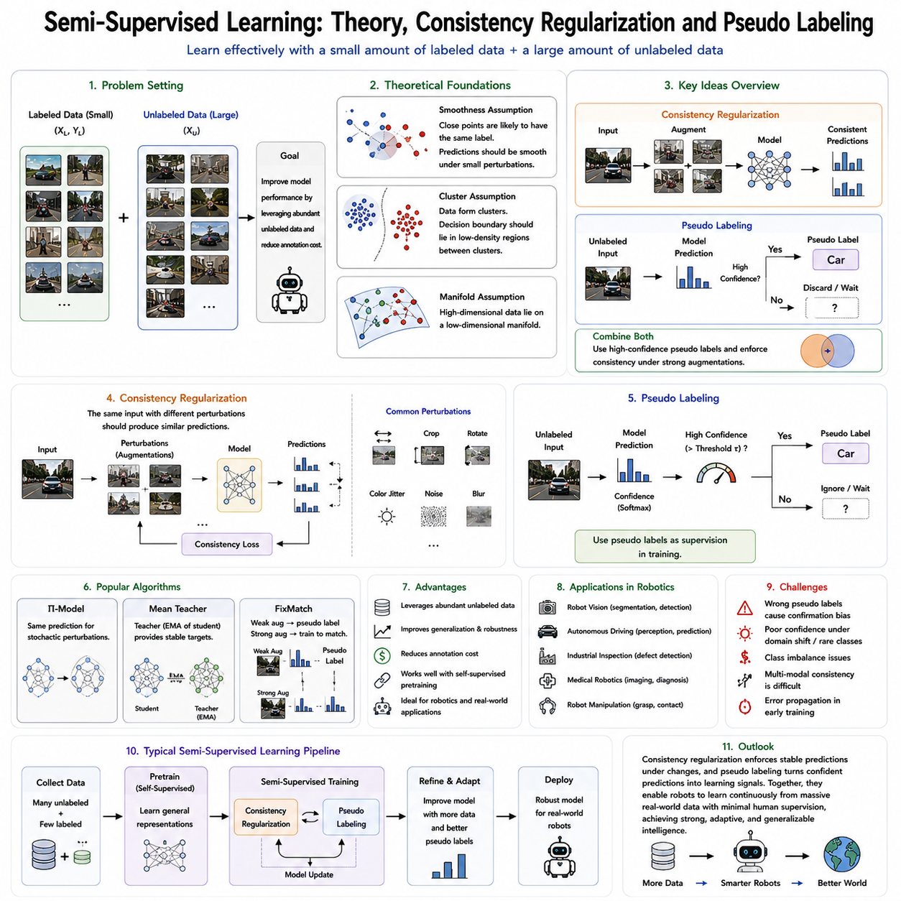
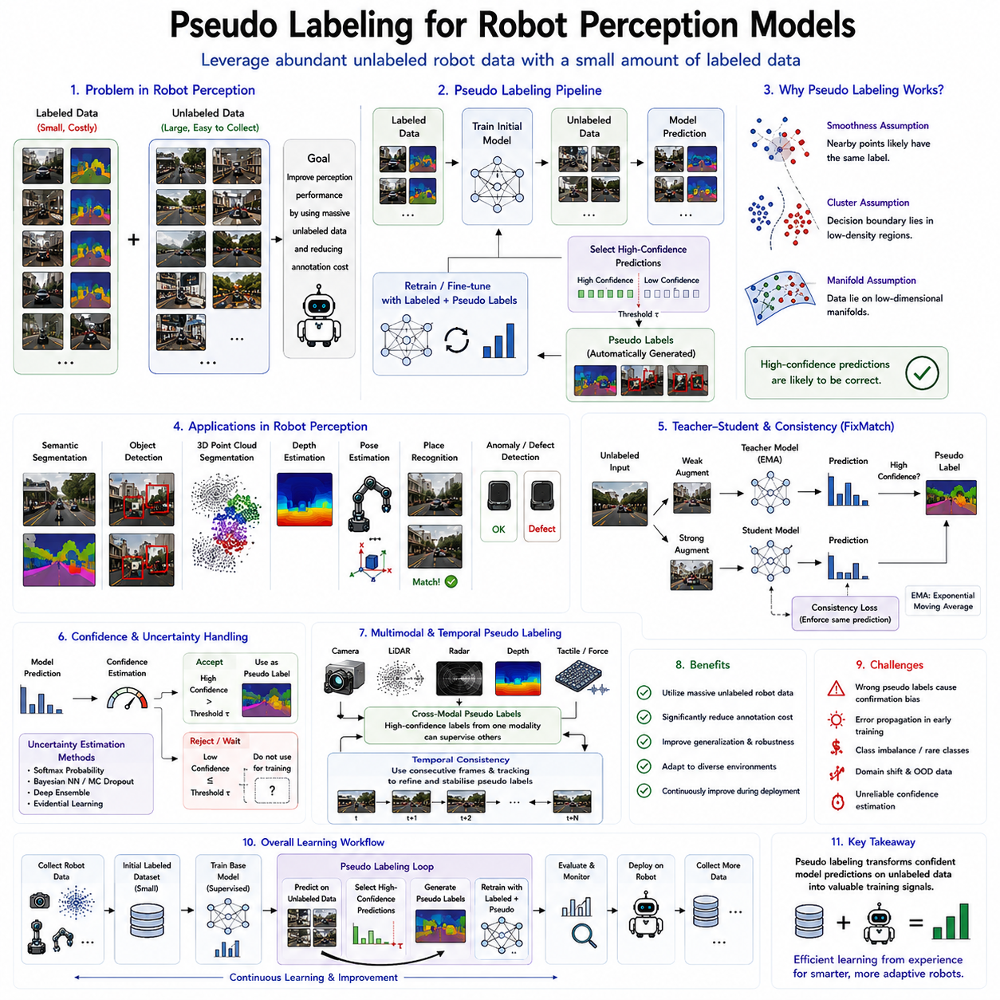
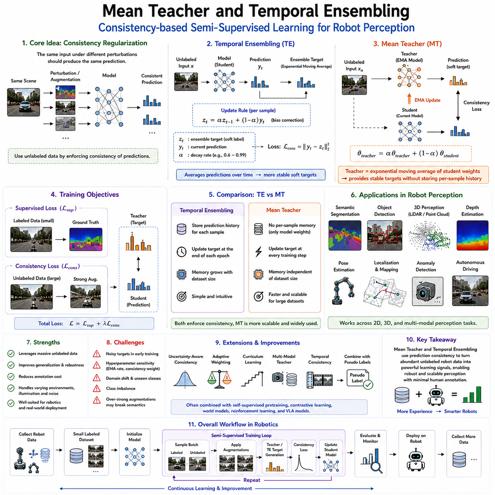
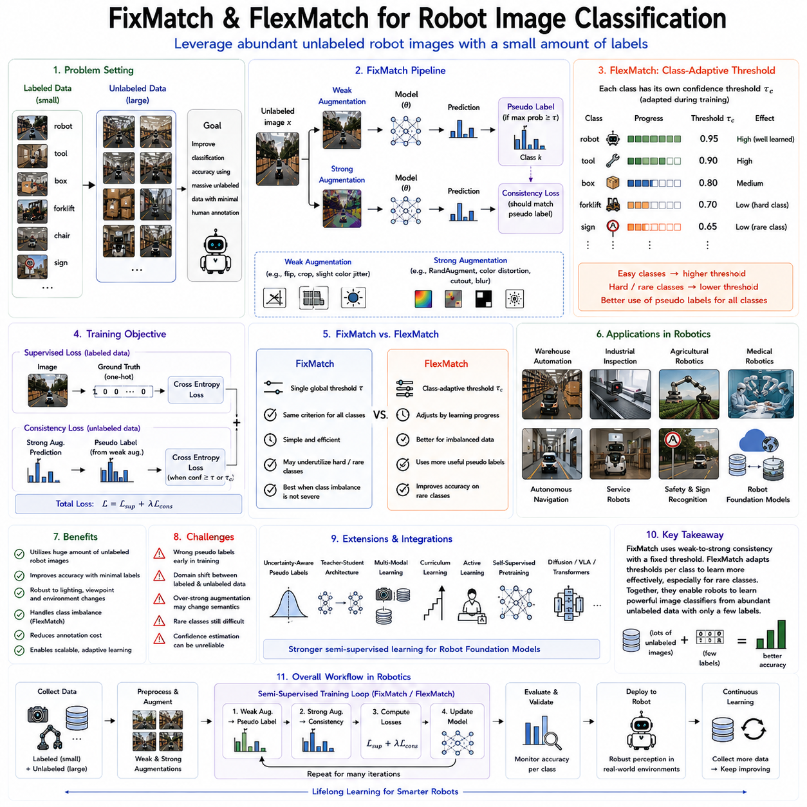
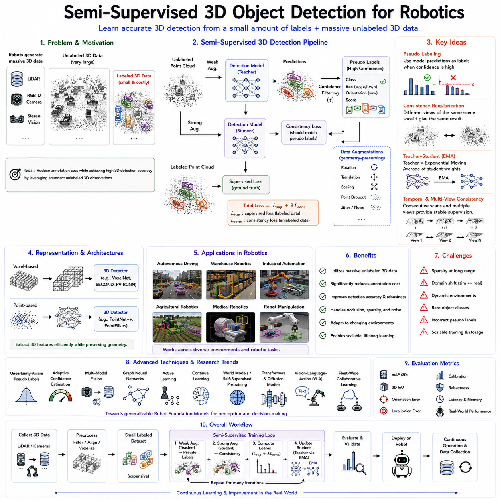
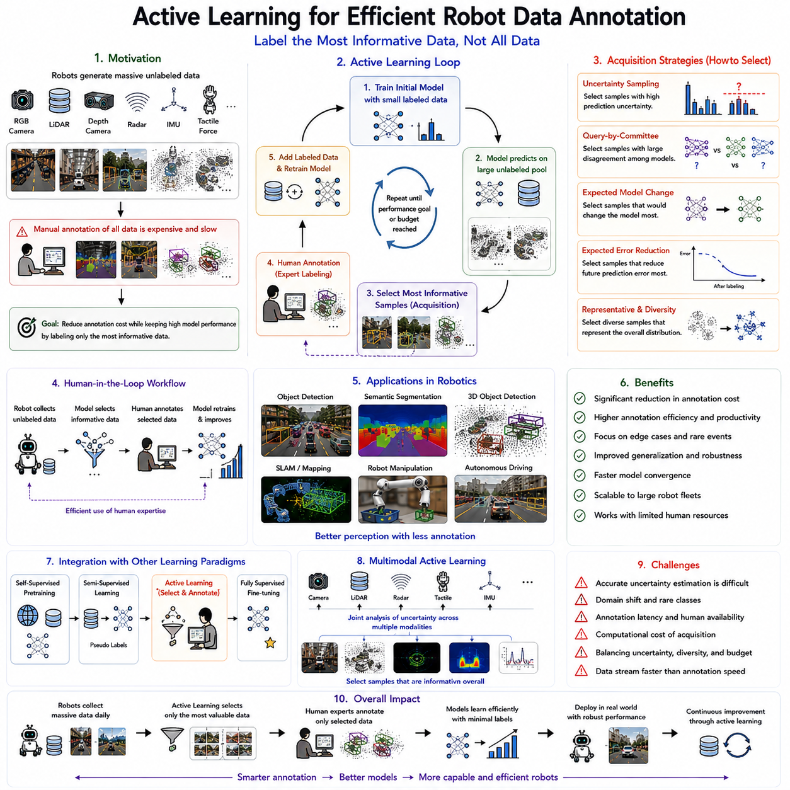
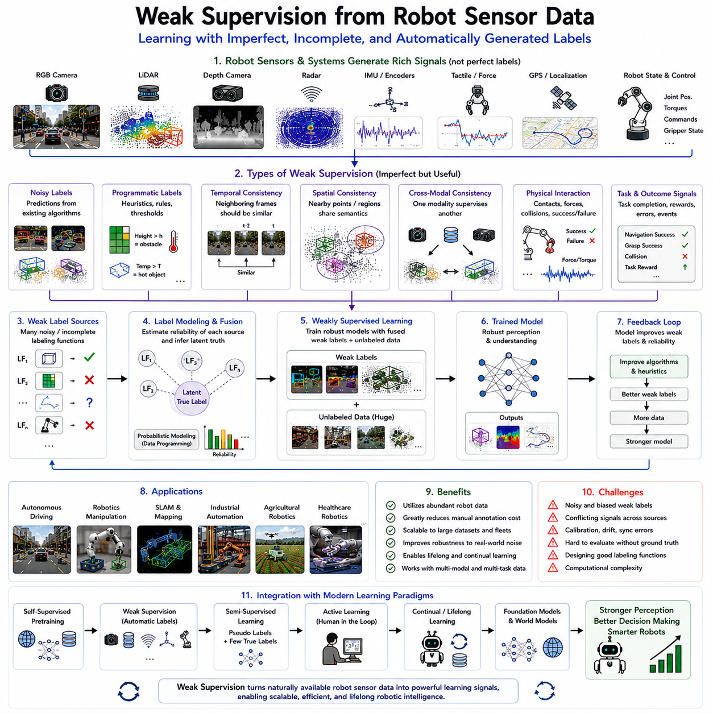
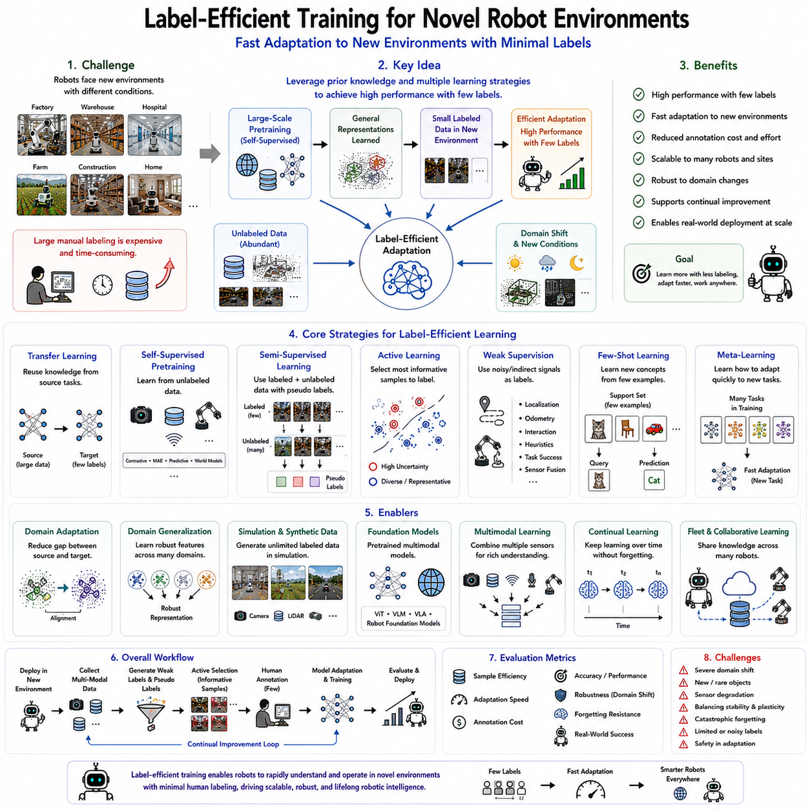
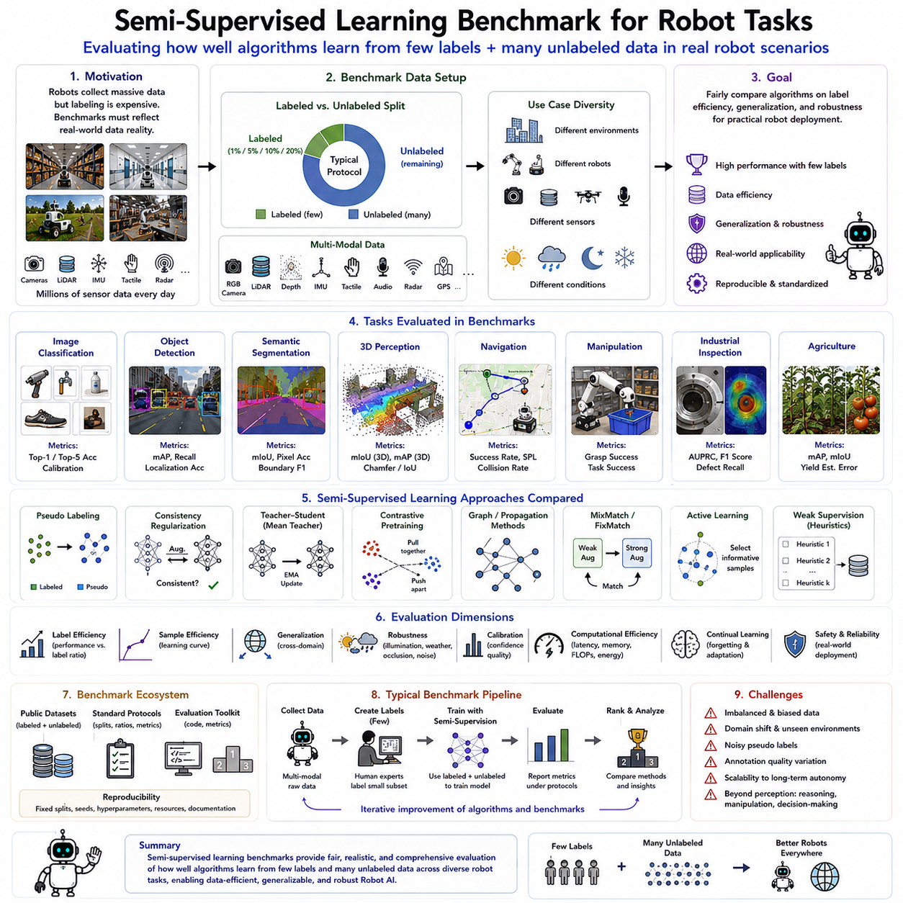
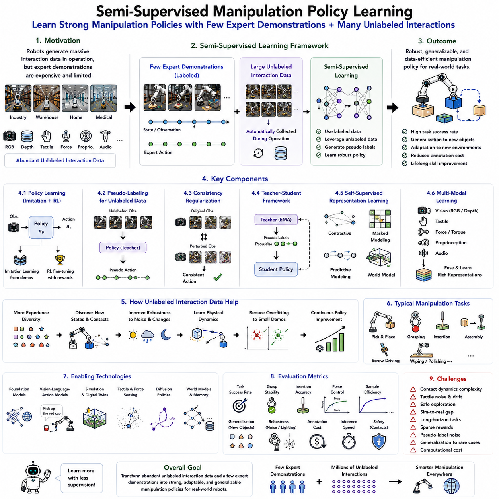

**Volume 19 Robot Machine Learning and AI**

# 04. Semi Supervised Learning

## 04.01 Semi Supervised Learning Theory Consistency Pseudo Label

{width="7.268055555555556in" height="7.268055555555556in"}

Semi-supervised learning has become one of the most influential paradigms in modern artificial intelligence because it effectively bridges the gap between supervised learning and self-supervised learning. In many real-world robotic applications, collecting large quantities of sensor data is relatively inexpensive, while obtaining high-quality human annotations is often costly, time-consuming, and sometimes impossible. Industrial inspection robots continuously generate enormous image datasets, autonomous vehicles collect millions of kilometers of driving experiences, warehouse robots observe countless manipulation sequences, and service robots interact with dynamic human environments every day. However, only a very small fraction of these observations can realistically be labeled by experts. Semi-supervised learning addresses this imbalance by combining a limited amount of labeled data with a much larger collection of unlabeled data. Rather than ignoring unlabeled observations, the learning algorithm actively extracts useful supervisory information from them, significantly improving generalization while reducing annotation costs. As a result, semi-supervised learning has become an essential technology for robot perception, autonomous navigation, industrial automation, medical robotics, and embodied artificial intelligence.

The theoretical foundation of semi-supervised learning is based on the assumption that unlabeled data contain valuable information regarding the underlying structure of the data distribution. Although class labels are unavailable, the observations themselves reveal relationships among samples, cluster formations, geometric structures, and manifold characteristics. If these intrinsic structures can be exploited effectively, the decision boundary learned from a small labeled dataset can be substantially improved using the much larger unlabeled dataset. Instead of treating unlabeled samples as meaningless inputs, semi-supervised learning considers them as additional constraints that guide the learning process toward more robust and generalized representations.

Several fundamental assumptions support semi-supervised learning theory. One of the most important is the smoothness assumption, which states that data points located close to one another in the input space or latent representation space are likely to share identical labels. Consequently, the prediction function should vary smoothly rather than changing abruptly across neighboring observations. If two images differ only by minor lighting variations, slight viewpoint changes, or small amounts of sensor noise, the model should produce nearly identical predictions. This principle forms the basis of consistency regularization methods that encourage prediction stability under small perturbations.

Another essential theoretical principle is the cluster assumption. According to this hypothesis, observations naturally organize into clusters corresponding to semantic categories, while decision boundaries should ideally pass through regions containing relatively few data points. In other words, classification boundaries should avoid splitting dense clusters whenever possible. Unlabeled data reveal these cluster structures even without explicit annotations. By encouraging decision boundaries to remain within low-density regions separating clusters, semi-supervised learning significantly improves classification robustness and generalization.

The manifold assumption extends this concept further by proposing that high-dimensional observations actually lie on lower-dimensional manifolds embedded within the original observation space. Images, point clouds, tactile measurements, and multimodal robot observations contain substantial redundancy because physical environments obey consistent geometric and physical constraints. Learning algorithms should therefore identify these underlying manifolds rather than modeling every dimension independently. Unlabeled observations provide rich information regarding manifold geometry, enabling more meaningful representation learning despite limited annotation availability.

Consistency regularization has emerged as one of the most successful approaches in semi-supervised learning. The fundamental idea is straightforward: a robust machine learning model should produce nearly identical predictions when the same observation undergoes small perturbations that preserve semantic meaning. These perturbations may include image augmentation, random cropping, rotation, color jittering, Gaussian noise, sensor disturbances, viewpoint variation, or temporal fluctuations. Although the input changes slightly, the semantic content remains unchanged. Consequently, prediction consistency becomes an effective supervisory signal derived entirely from unlabeled data.

The mathematical intuition behind consistency regularization is that stable prediction functions typically generalize better than highly sensitive ones. Models that react dramatically to insignificant input changes often overfit training data and perform poorly under real-world conditions. By explicitly minimizing differences between predictions generated from multiple augmented versions of identical observations, consistency regularization encourages smoother decision boundaries and more stable latent representations. This process effectively transforms unlabeled observations into additional training constraints without requiring manual annotation.

Several influential algorithms have been developed around consistency regularization principles. The Π-Model introduces stochastic perturbations during training and encourages identical predictions across repeated evaluations of the same sample. Temporal Ensembling averages historical predictions to produce more stable training targets. Mean Teacher employs a teacher-student architecture in which the teacher network consists of an exponential moving average of student parameters, generating reliable pseudo targets for consistency optimization. More recently, methods such as FixMatch combine consistency regularization with confidence-based pseudo labeling to achieve state-of-the-art semi-supervised performance using remarkably simple learning strategies.

Pseudo labeling represents another foundational technique within semi-supervised learning. Rather than relying exclusively on manually assigned labels, the model predicts labels for unlabeled observations using its current parameters. Predictions exceeding a predefined confidence threshold become temporary supervisory labels known as pseudo labels. These automatically generated labels are subsequently treated similarly to ground-truth annotations during further optimization. As the model gradually improves, pseudo label quality also increases, creating a positive feedback loop that progressively expands the effective labeled dataset.

The effectiveness of pseudo labeling depends strongly upon prediction confidence. Incorrect pseudo labels may reinforce erroneous decision boundaries and degrade overall performance. Consequently, modern pseudo labeling algorithms employ confidence thresholds ensuring that only highly reliable predictions contribute to supervised optimization. Low-confidence observations remain unlabeled until future training iterations improve model certainty. This selective supervision significantly reduces error propagation while maximizing information extracted from unlabeled datasets.

Confidence estimation therefore plays a central role within pseudo labeling frameworks. Softmax probability values frequently serve as confidence measures, although Bayesian uncertainty estimation, ensemble disagreement, Monte Carlo dropout, and evidential neural networks provide more sophisticated uncertainty quantification techniques. Reliable confidence estimation enables learning algorithms to distinguish trustworthy pseudo labels from uncertain predictions, improving both stability and final model accuracy.

FixMatch illustrates the powerful combination of consistency regularization and pseudo labeling. Weakly augmented observations first generate pseudo labels whenever prediction confidence exceeds a predefined threshold. Strongly augmented versions of identical observations are subsequently trained to predict these same pseudo labels. Because weak augmentations preserve semantic structure while strong augmentations introduce substantial appearance variation, successful optimization simultaneously enforces prediction consistency and expands supervisory information through automatically generated labels. Despite conceptual simplicity, this approach has demonstrated outstanding performance across numerous benchmark datasets.

Semi-supervised learning has become particularly valuable for robotic perception because robots naturally generate enormous quantities of unlabeled sensor observations during normal operation. Mobile robots continuously capture camera images, LiDAR scans, inertial measurements, GPS trajectories, and depth maps while navigating complex environments. Only a small subset of these observations requires manual annotation for semantic segmentation, obstacle detection, localization, or object recognition. Semi-supervised learning effectively leverages the remaining unlabeled data, substantially improving perception performance while minimizing annotation effort.

Industrial robotics similarly benefits from semi-supervised methodologies. Automated visual inspection systems continuously observe manufactured products, but labeling every possible defect remains prohibitively expensive. A small collection of annotated defect examples combined with extensive unlabeled production images enables robust quality inspection through consistency regularization and pseudo labeling. As manufacturing environments evolve, newly collected unlabeled observations further improve model generalization without requiring continuous manual labeling.

Medical robotics provides another compelling application scenario. Surgical assistance systems, medical imaging robots, rehabilitation platforms, and diagnostic devices generate large collections of patient data while expert medical annotations remain extremely limited. Semi-supervised learning allows valuable unlabeled medical observations to contribute directly to model optimization, improving segmentation, anomaly detection, disease classification, and procedural guidance while reducing expert annotation requirements.

Autonomous driving systems likewise rely heavily upon semi-supervised learning. Modern vehicles continuously record synchronized camera images, LiDAR measurements, radar observations, GPS trajectories, and inertial data throughout everyday driving. Annotating every object, lane boundary, traffic sign, pedestrian, and environmental condition across millions of driving scenes remains economically impractical. Semi-supervised learning enables autonomous driving perception models to exploit these extensive unlabeled datasets while requiring only modest quantities of expert annotations.

Robot manipulation also benefits significantly from semi-supervised learning. Manipulation datasets often include millions of grasp attempts, contact interactions, force measurements, tactile observations, and object trajectories. Although only a limited number of successful manipulation demonstrations receive manual labeling, consistency regularization and pseudo labeling extract supervisory information from unsuccessful or unlabeled interactions. Consequently, robots acquire stronger manipulation representations while reducing dependence on costly expert demonstrations.

Semi-supervised learning integrates naturally with self-supervised pretraining. Self-supervised learning first develops general feature representations using entirely unlabeled datasets through objectives such as contrastive learning, masked reconstruction, predictive coding, or world model learning. Semi-supervised learning subsequently refines these pretrained representations using limited labeled data together with additional unlabeled observations. This two-stage strategy combines broad representation learning with efficient task-specific adaptation, producing superior performance compared with either approach individually.

Recent robot foundation models increasingly employ hierarchical learning pipelines beginning with large-scale self-supervised pretraining followed by semi-supervised adaptation. Massive multimodal datasets collected from robot operations establish universal visual, geometric, temporal, tactile, and physical representations. Subsequently, consistency regularization and pseudo labeling specialize these representations for downstream applications such as navigation, manipulation, inspection, localization, semantic mapping, and human-robot interaction using only limited annotated datasets. This hierarchical learning strategy significantly improves scalability while reducing annotation requirements across diverse robotic domains.

Despite remarkable progress, semi-supervised learning still faces several important challenges. Incorrect pseudo labels may accumulate during early training, causing confirmation bias in which erroneous predictions reinforce themselves over time. Confidence estimation remains imperfect under domain shifts, novel environments, or rare object categories. Highly imbalanced datasets may generate disproportionately reliable pseudo labels for common classes while neglecting rare but safety-critical observations. Furthermore, maintaining stable consistency objectives across heterogeneous multimodal robot sensors presents substantial optimization challenges.

Current research addresses these limitations through adaptive confidence thresholds, uncertainty-aware pseudo labeling, curriculum learning, teacher-student architectures, diffusion-based semi-supervised learning, graph neural networks, multimodal consistency objectives, and continual learning strategies. Foundation models increasingly integrate semi-supervised learning with reinforcement learning, world models, Vision-Language-Action architectures, and lifelong adaptation, enabling robots to improve continuously throughout deployment using both labeled and unlabeled operational experiences.

As Physical AI continues advancing toward general-purpose robotic intelligence, semi-supervised learning will remain a fundamental technology enabling scalable deployment across diverse real-world environments. Future robots will continuously accumulate multimodal experiences while receiving only occasional human supervision. Consistency regularization will encourage stable, robust predictions under changing environmental conditions, while pseudo labeling will transform confident autonomous predictions into valuable learning signals. Together, these complementary mechanisms will allow robot foundation models to learn efficiently from enormous operational datasets, rapidly adapt to unfamiliar environments, minimize annotation costs, and achieve increasingly human-like learning capabilities through continual interaction with the physical world.

## 04.02 Pseudo Labeling for Robot Perception Models [w/Code]

{width="7.268055555555556in" height="7.268055555555556in"}

Pseudo labeling has become one of the most practical and influential semi-supervised learning techniques for robot perception because it enables robotic systems to leverage enormous quantities of unlabeled sensory data while requiring only a small amount of manually annotated information. Modern robots continuously collect massive streams of multimodal observations through cameras, LiDAR sensors, depth cameras, radar, inertial measurement units, tactile sensors, force sensors, GPS receivers, and proprioceptive sensors. While acquiring these raw observations is relatively inexpensive during daily robot operation, obtaining accurate semantic annotations from human experts remains costly, labor-intensive, and often infeasible at large scales. Every image used for semantic segmentation, every point cloud requiring object labeling, every navigation scene requiring obstacle annotations, and every manipulation sequence requiring action labels introduces significant human effort. Pseudo labeling addresses this challenge by allowing the perception model itself to generate supervisory labels for unlabeled observations, thereby transforming vast quantities of operational robot data into useful training resources. As robot foundation models continue expanding toward large-scale embodied intelligence, pseudo labeling has become an essential mechanism for improving perception performance while minimizing annotation costs.

The fundamental concept of pseudo labeling is remarkably simple yet highly effective. A perception model initially learns from a relatively small collection of manually labeled data using conventional supervised learning. Once the model acquires reasonable prediction capability, it is applied to a much larger collection of unlabeled observations. For each unlabeled sample, the model predicts class probabilities, segmentation masks, object locations, depth values, or other task-specific outputs. Predictions with sufficiently high confidence are accepted as temporary supervisory targets known as pseudo labels. These automatically generated labels are then combined with genuine labeled data during subsequent training iterations. As the model improves, pseudo label quality gradually increases, allowing progressively larger portions of the unlabeled dataset to participate in supervised optimization. This iterative self-improvement process significantly expands the effective training dataset without requiring additional manual annotation.

Pseudo labeling relies upon the assumption that high-confidence predictions are likely to be correct. Neural networks trained on representative datasets frequently assign very high probabilities to observations they understand well while producing uncertain predictions for ambiguous or unfamiliar inputs. Confidence estimation therefore serves as the primary mechanism for distinguishing reliable pseudo labels from potentially incorrect predictions. By accepting only highly confident predictions, pseudo labeling minimizes error propagation while maximizing useful supervisory information extracted from unlabeled robot observations.

Confidence thresholds play a critical role in determining pseudo labeling performance. If the threshold is set too low, incorrect predictions enter the training dataset, reinforcing existing model errors and causing confirmation bias. Conversely, if the threshold is excessively high, too few pseudo labels become available, limiting the benefits of semi-supervised learning. Practical robotic systems therefore carefully balance pseudo label quality against pseudo label quantity. Many modern algorithms employ adaptive confidence thresholds that gradually decrease as model accuracy improves throughout training, allowing increasing portions of the unlabeled dataset to contribute meaningful supervision over time.

Robot perception encompasses multiple computer vision and multimodal perception tasks, each benefiting from pseudo labeling in different ways. Image classification systems generate pseudo class labels for unlabeled robot observations. Semantic segmentation models predict dense pixel-level labels describing roads, obstacles, vegetation, buildings, machinery, humans, and manipulable objects. Object detection systems automatically generate bounding boxes identifying equipment, tools, packages, pallets, vehicles, or pedestrians. Monocular depth estimation predicts geometric scene structure, while pose estimation identifies object orientations and robot-relative positions. Across all these perception tasks, pseudo labeling substantially expands available supervision using naturally collected operational data.

Semantic segmentation represents one of the most important applications of pseudo labeling in robotics. Mobile robots navigating warehouses, hospitals, factories, agricultural fields, and urban environments require accurate understanding of traversable regions, obstacles, equipment, humans, and operational zones. Pixel-level semantic annotation remains extremely expensive because every image requires detailed manual labeling. Pseudo labeling enables segmentation networks trained on limited annotated datasets to automatically generate semantic masks for millions of unlabeled images collected during daily operation. These pseudo masks significantly improve segmentation robustness across diverse lighting conditions, seasonal changes, environmental variations, and robot platforms.

Object detection similarly benefits from pseudo labeling. Autonomous mobile robots, collaborative manipulators, inspection systems, and autonomous vehicles continuously encounter familiar objects under varying viewpoints, illumination, occlusion, and environmental conditions. Rather than manually annotating every observed object, pretrained detectors automatically generate high-confidence bounding boxes for unlabeled images. These pseudo annotations subsequently improve detector performance while expanding recognition capabilities across new operational environments. As deployment continues, robot perception systems gradually adapt to evolving object distributions without extensive manual intervention.

Three-dimensional robot perception presents additional opportunities for pseudo labeling. LiDAR point clouds, RGB-D observations, occupancy maps, and volumetric reconstructions require substantial annotation effort for semantic understanding. Point-level labeling remains considerably more expensive than image annotation because of complex three-dimensional geometry. Pseudo labeling enables geometric perception models to automatically annotate unlabeled point clouds with semantic categories, object identities, traversability estimates, or occupancy predictions. Combined with temporal consistency across sequential scans, pseudo labeling significantly improves three-dimensional environmental understanding for navigation and mapping applications.

Robot localization and simultaneous localization and mapping also benefit indirectly from pseudo labeling. Place recognition systems identify previously visited locations using visual or geometric descriptors. High-confidence place matches generated automatically by pretrained localization models become pseudo labels supporting continual refinement of localization representations. Similarly, loop closure detection, landmark recognition, and semantic mapping systems progressively improve by incorporating reliable pseudo correspondences accumulated throughout long-term robot deployment.

Pseudo labeling has become particularly valuable for autonomous driving perception because modern vehicles continuously collect enormous multimodal datasets. Cameras, LiDAR sensors, radar systems, GPS receivers, and inertial sensors generate synchronized observations throughout millions of kilometers of driving. Annotating every traffic participant, lane marking, traffic sign, pedestrian, cyclist, construction zone, and road boundary remains economically impractical. High-quality perception models therefore generate pseudo labels describing vehicles, infrastructure, road geometry, semantic segmentation, and object trajectories, dramatically reducing annotation requirements while improving driving perception under diverse environmental conditions.

Industrial inspection robots similarly exploit pseudo labeling for automated quality control. Manufacturing facilities continuously produce visual observations of assembled components, electronic devices, automotive parts, pharmaceutical products, and consumer goods. Defect annotations remain relatively scarce because failures occur infrequently compared with normal production. Pseudo labeling enables inspection systems trained on limited defect examples to automatically classify large collections of normal products while gradually expanding defect recognition capabilities through confident autonomous predictions. Such semi-supervised inspection significantly reduces expert labeling effort while improving manufacturing quality assurance.

Agricultural robotics provides another compelling application scenario. Autonomous harvesting robots, crop monitoring systems, weed detection platforms, and precision farming equipment continuously capture images under highly variable lighting, weather, seasonal growth stages, and field conditions. Constructing comprehensive agricultural datasets with manual annotations remains prohibitively expensive. Pseudo labeling allows pretrained perception models to automatically annotate crops, weeds, fruits, disease symptoms, irrigation structures, and terrain conditions across extensive agricultural operations, substantially improving field adaptability.

Medical robotic systems also benefit from pseudo labeling because expert medical annotation requires specialized clinical knowledge. Surgical robots, rehabilitation platforms, medical imaging systems, and diagnostic devices generate enormous quantities of patient-specific observations. Segmentation of anatomical structures, lesion detection, tissue classification, and procedural guidance traditionally require extensive expert annotation. Pseudo labeling enables medical perception systems to utilize abundant unlabeled patient data while preserving high diagnostic accuracy through confidence-aware supervision.

Teacher-student architectures have become one of the most successful frameworks for pseudo labeling. A teacher model generates pseudo labels for unlabeled observations, while a student model learns simultaneously from manually labeled data and teacher-generated pseudo supervision. Teacher parameters frequently update using exponential moving averages of student parameters, producing increasingly stable predictions as training progresses. This Mean Teacher strategy significantly improves pseudo label reliability while reducing oscillatory training behavior commonly observed with naive self-training approaches.

FixMatch further strengthens pseudo labeling through consistency regularization. Weakly augmented observations first generate pseudo labels whenever prediction confidence exceeds a predefined threshold. Strongly augmented versions of identical observations are subsequently optimized to predict identical labels despite significant visual perturbations. This combination encourages robust perception models invariant to environmental variability while simultaneously exploiting large unlabeled datasets. Because robotic environments naturally exhibit changing illumination, weather, viewpoints, and sensor characteristics, consistency-enhanced pseudo labeling has become particularly valuable for robot perception.

Multimodal pseudo labeling extends these concepts beyond conventional visual perception. Cameras, LiDAR sensors, radar systems, depth sensors, thermal cameras, tactile arrays, and force sensors frequently observe identical environmental events from complementary perspectives. High-confidence predictions generated by one sensing modality may provide supervisory signals for another modality. For example, reliable visual object detections may supervise LiDAR semantic segmentation, while geometric localization supports visual place recognition. Such cross-modal pseudo labeling significantly improves sensor fusion and multimodal representation learning within robot foundation models.

Temporal consistency provides another important source of pseudo label refinement. Robot observations typically form continuous sequences where environmental changes occur gradually rather than instantaneously. Predictions generated for consecutive observations should therefore remain temporally coherent unless genuine environmental events occur. Temporal smoothing, trajectory consistency, object tracking, and sequential prediction refinement substantially improve pseudo label quality while reducing isolated prediction errors. This temporal reasoning becomes especially important for autonomous navigation, manipulation, surveillance, and long-duration robot deployment.

Uncertainty estimation has become increasingly important because prediction confidence alone does not always reflect true correctness. Neural networks may occasionally produce highly confident yet incorrect predictions, particularly under domain shifts or previously unseen environmental conditions. Bayesian neural networks, Monte Carlo dropout, deep ensembles, evidential learning, and probabilistic transformers provide improved uncertainty estimation capable of identifying unreliable pseudo labels before they contaminate training. Such uncertainty-aware pseudo labeling significantly enhances safety and robustness for autonomous robotic systems operating in unpredictable environments.

Despite remarkable success, pseudo labeling still faces several challenges. Confirmation bias remains the most significant limitation because incorrect pseudo labels may reinforce existing model errors throughout iterative training. Rare object categories often receive fewer reliable pseudo labels than common classes, producing class imbalance. Dynamic environments containing moving humans, changing illumination, weather variations, or sensor failures may reduce pseudo label reliability. Furthermore, autonomous robots frequently encounter novel objects outside their original training distributions, requiring careful uncertainty handling before accepting pseudo supervision.

Recent research addresses these limitations through adaptive confidence scheduling, curriculum learning, active learning integration, uncertainty-aware filtering, graph-based pseudo label propagation, diffusion-based semi-supervised learning, multimodal teacher-student architectures, and continual learning strategies. Foundation models increasingly combine pseudo labeling with self-supervised pretraining, world model learning, contrastive representation learning, reinforcement learning, Vision-Language-Action architectures, and lifelong adaptation. These integrated learning pipelines allow robot perception systems to improve continuously throughout deployment while minimizing dependence on expensive manual annotation.

As Physical AI progresses toward increasingly autonomous and scalable robot intelligence, pseudo labeling will become one of the primary mechanisms enabling continual perception improvement. Future robots will accumulate billions of multimodal observations throughout lifelong operation across factories, hospitals, warehouses, agricultural fields, urban environments, homes, and collaborative workplaces. Rather than requiring human experts to annotate every observation, robot perception models will autonomously identify reliable predictions, transform them into supervisory signals, and continuously refine their own understanding of the physical world. Combined with consistency regularization, uncertainty estimation, world models, and multimodal foundation architectures, pseudo labeling will play a central role in building adaptive robotic systems capable of learning efficiently from experience while maintaining robust perception across diverse real-world environments.

## 04.03 Mean Teacher and Temporal Ensembling [w/Code]

{width="7.268055555555556in" height="7.268055555555556in"}

Mean Teacher and Temporal Ensembling are two influential semi-supervised learning algorithms that significantly advanced the practical use of unlabeled data in deep learning. Both methods are founded on the principle of consistency regularization, which assumes that a robust learning model should produce stable predictions when an identical observation is presented under different perturbations or at different points during training. Rather than relying solely on manually annotated labels, these algorithms exploit the inherent consistency of unlabeled data to improve representation learning and model generalization. Their impact has been particularly significant in computer vision, medical imaging, autonomous driving, and robot perception, where acquiring large amounts of labeled data is often expensive and time-consuming. In modern robotics, Mean Teacher and Temporal Ensembling provide practical mechanisms for utilizing millions of unlabeled sensor observations collected during normal robot operation while requiring only a relatively small number of expert annotations.

Semi-supervised learning assumes that neighboring observations in the data distribution should produce similar predictions. In robotic perception, consecutive camera frames, LiDAR scans, depth images, and tactile measurements often represent nearly identical physical states despite containing small variations caused by sensor noise, illumination changes, viewpoint shifts, or environmental disturbances. A robust perception model should therefore maintain consistent predictions under these minor perturbations. Mean Teacher and Temporal Ensembling both enforce this consistency but employ different mechanisms for generating stable supervisory signals from unlabeled observations.

Temporal Ensembling was one of the earliest successful consistency-based semi-supervised learning methods. Instead of generating supervision from manually labeled data alone, the algorithm accumulates prediction histories for each training sample across multiple epochs. During training, every time an unlabeled observation is presented, the model produces a prediction. Rather than discarding this prediction after gradient optimization, Temporal Ensembling stores an exponentially weighted moving average of predictions generated throughout previous training iterations. These historical predictions gradually become more stable as training progresses and serve as soft targets during subsequent optimization.

The central intuition behind Temporal Ensembling is that although individual predictions may fluctuate due to stochastic optimization, dropout, mini-batch sampling, or random initialization, the average prediction over many iterations often becomes significantly more reliable than any single prediction. Instead of trusting one uncertain prediction, the algorithm effectively aggregates multiple independent observations of the same sample. As prediction confidence increases over time, these ensemble targets provide increasingly accurate supervisory information for unlabeled data.

Mathematically, Temporal Ensembling maintains a prediction memory for every training sample. After each training epoch, the current prediction is combined with previous historical predictions using exponential moving averaging. Older predictions gradually receive less weight while recent predictions contribute more strongly to the ensemble. Bias correction compensates for the initialization period when few predictions have been accumulated. The resulting ensemble prediction becomes the consistency target that the current network attempts to match during subsequent training.

Consistency loss forms the core optimization objective in Temporal Ensembling. Each unlabeled observation is processed through multiple stochastic perturbations such as random cropping, horizontal flipping, color jittering, Gaussian noise, dropout, or sensor disturbances. Although these perturbations modify the input appearance, they preserve semantic meaning. Consequently, the network minimizes the discrepancy between current predictions and historical ensemble predictions. This consistency objective encourages smooth decision boundaries and robust latent representations while utilizing large collections of unlabeled observations.

Despite its conceptual elegance, Temporal Ensembling possesses several computational limitations. Because prediction histories must be maintained for every individual training sample, memory requirements grow linearly with dataset size. Large-scale robotic datasets containing millions of observations become increasingly difficult to manage using explicit prediction storage. Furthermore, prediction memories require updating only after complete training epochs, limiting responsiveness during optimization. These practical challenges motivated the development of Mean Teacher, which provides a more scalable and computationally efficient alternative.

Mean Teacher introduces a fundamentally different approach by replacing stored prediction histories with a second neural network called the teacher model. Instead of explicitly maintaining historical predictions for every sample, the teacher network itself represents the historical average of the student network parameters. The teacher model generates stable supervisory targets for unlabeled observations, while the student model learns simultaneously from labeled data and teacher-generated consistency targets. This elegant architecture eliminates the need for storing sample-specific prediction histories while providing continuously updated supervision throughout training.

The defining characteristic of Mean Teacher lies in the relationship between teacher and student parameters. The student network updates normally through gradient descent using supervised and consistency losses. Meanwhile, teacher parameters are never optimized directly through backpropagation. Instead, they are updated using an exponential moving average of student parameters. Consequently, the teacher evolves more smoothly than the student because parameter updates accumulate gradually over many optimization steps. This smoothing effect substantially reduces prediction instability while improving pseudo supervisory signal quality.

The exponential moving average update plays a critical role in Mean Teacher performance. At each optimization step, teacher parameters become a weighted combination of previous teacher parameters and current student parameters. Small update coefficients ensure that teacher predictions evolve slowly and remain considerably more stable than student predictions. Because the teacher effectively averages many previous student models, it frequently produces better generalization than any individual student snapshot. This phenomenon resembles ensemble learning but achieves comparable benefits without requiring multiple independently trained networks.

During training, both teacher and student receive differently augmented versions of identical observations. The teacher processes one perturbed observation while the student processes another. Since both observations describe the same underlying semantic content, their predictions should remain consistent despite visual differences introduced by augmentation. The consistency loss therefore minimizes prediction differences between teacher and student outputs while supervised learning simultaneously optimizes labeled observations. This dual-objective optimization effectively combines conventional supervised learning with powerful self-generated supervision from unlabeled data.

Robot perception provides an ideal application domain for Mean Teacher because robotic observations naturally exhibit continuous environmental consistency. Mobile robots repeatedly observe identical corridors, warehouse shelves, factory equipment, and navigation landmarks under varying illumination, viewing angles, weather conditions, and sensor noise. Teacher-generated supervisory signals encourage stable recognition across these variations, substantially improving perception robustness while reducing annotation requirements.

Semantic segmentation represents one of the most successful robotic applications of Mean Teacher. Autonomous robots require accurate pixel-level understanding of roads, traversable terrain, obstacles, machinery, humans, vegetation, and operational zones. Manual pixel annotation remains extremely expensive. Mean Teacher enables segmentation networks trained on relatively small labeled datasets to exploit vast collections of unlabeled operational imagery by enforcing consistent semantic predictions across augmented observations. As a result, segmentation performance improves significantly while annotation costs decrease substantially.

Object detection similarly benefits from Mean Teacher supervision. Warehouse robots identify packages, shelves, pallets, forklifts, and workers under continuously changing operational conditions. Industrial inspection robots detect components, defects, and tools despite variable lighting and viewpoint changes. Teacher-generated object predictions provide reliable consistency targets allowing student detectors to improve recognition accuracy using extensive unlabeled image collections gathered during routine deployment.

Three-dimensional perception further extends Mean Teacher applications. LiDAR point clouds, RGB-D observations, occupancy grids, and volumetric reconstructions provide complementary geometric information unavailable in conventional images. Teacher models generate stable semantic predictions across temporally adjacent scans, multiple viewpoints, and varying sensor noise conditions. Consequently, robot mapping, localization, obstacle detection, and environmental reconstruction become significantly more robust while requiring fewer manually annotated point clouds.

Temporal consistency naturally complements Mean Teacher within robotic perception. Consecutive sensor observations often describe nearly identical physical scenes separated only by minor robot motion or dynamic object movement. Teacher supervision can therefore incorporate temporal information by encouraging stable predictions across sequential observations. This temporal consistency proves particularly valuable for autonomous navigation, long-term mapping, surveillance, industrial monitoring, and human-robot interaction where environmental continuity dominates sensor observations.

Multimodal perception introduces additional opportunities for Mean Teacher learning. Cameras, LiDAR sensors, radar systems, depth sensors, tactile arrays, force sensors, and proprioceptive measurements all describe complementary aspects of identical physical events. Teacher models may generate supervisory signals within one sensing modality while guiding student learning across another modality. Such cross-modal consistency substantially strengthens multimodal representation learning and sensor fusion within robot foundation models.

Autonomous driving has widely adopted Mean Teacher for perception improvement. Vehicles continuously generate synchronized camera images, LiDAR scans, radar measurements, GPS trajectories, and inertial observations during everyday driving. Teacher-generated consistency targets allow perception systems to utilize millions of unlabeled driving scenes while maintaining robust recognition of vehicles, pedestrians, traffic signs, lane markings, road boundaries, and environmental hazards. Similar strategies support agricultural robots, mining vehicles, construction machinery, and autonomous drones operating under highly variable environmental conditions.

Medical robotics similarly benefits from Mean Teacher because clinical annotation requires expert physicians. Medical imaging systems, surgical robots, rehabilitation devices, and diagnostic platforms produce enormous quantities of unlabeled observations. Teacher-guided consistency learning enables segmentation, lesion detection, tissue classification, and anatomical recognition models to exploit these unlabeled datasets while maintaining high diagnostic reliability. Similar advantages extend to industrial inspection, precision manufacturing, warehouse automation, and scientific robotics.

Compared with Temporal Ensembling, Mean Teacher offers several significant practical advantages. Memory consumption becomes independent of dataset size because teacher parameters replace explicit prediction storage. Teacher predictions update continuously during optimization rather than only after complete training epochs. Distributed training becomes simpler because parameter synchronization naturally extends to teacher updates. Furthermore, teacher supervision adapts immediately as student performance improves, accelerating convergence and improving final generalization. These advantages have made Mean Teacher one of the most widely adopted semi-supervised learning algorithms in modern deep learning research.

Nevertheless, several challenges remain. Poor teacher initialization may initially generate unreliable supervisory signals. Excessively rapid teacher updates reduce stability, while overly slow updates delay adaptation. Domain shifts, rare object categories, sensor failures, and highly dynamic environments may reduce teacher prediction reliability. Careful augmentation design also becomes critical because overly aggressive perturbations may alter semantic meaning rather than merely modifying appearance, weakening consistency assumptions.

Recent research extends Mean Teacher through uncertainty-aware supervision, adaptive consistency weighting, curriculum learning, multimodal teacher architectures, transformer-based perception models, diffusion-based semi-supervised learning, graph neural networks, and continual learning frameworks. Teacher supervision increasingly integrates with pseudo labeling, contrastive learning, self-supervised pretraining, world models, reinforcement learning, and Vision-Language-Action architectures to create unified learning pipelines capable of supporting general-purpose robotic intelligence.

As Robot Foundation Models continue evolving toward large-scale Physical AI systems, Mean Teacher and Temporal Ensembling will remain foundational components of semi-supervised perception learning. Future robots will continuously collect billions of multimodal observations while receiving only occasional human supervision. Stable teacher models, historical prediction averaging, temporal consistency, multimodal alignment, and uncertainty-aware supervision will enable robots to transform everyday operational experience into increasingly accurate perception capabilities. Rather than depending primarily on expensive manually labeled datasets, next-generation robotic systems will continuously refine their understanding of the physical world through self-generated supervisory signals derived from consistent interaction with their environments, providing scalable, adaptive, and robust perception across diverse real-world applications.

## 04.04 FixMatch FlexMatch for Robot Image Classification [w/Code]

{width="7.268055555555556in" height="7.268055555555556in"}

FixMatch and FlexMatch represent two of the most influential semi-supervised learning algorithms developed for image classification and have become increasingly important for robot perception systems operating in environments where only limited labeled data are available. Modern robots continuously acquire enormous quantities of visual information through onboard RGB cameras, stereo cameras, depth cameras, panoramic imaging systems, industrial inspection cameras, and multimodal sensing platforms. While collecting these visual observations is relatively inexpensive during normal robot operation, manually labeling every image with semantic categories, object identities, or operational states remains extremely expensive and often impractical. Consequently, robotic systems require learning algorithms capable of utilizing massive collections of unlabeled images while relying on only a small amount of human annotation. FixMatch introduced a remarkably simple yet highly effective framework that combines pseudo labeling with consistency regularization, while FlexMatch further improves this framework by introducing adaptive confidence thresholds that dynamically adjust according to the learning progress of individual classes. Together, these algorithms have significantly advanced semi-supervised learning and have become highly valuable for robotic image classification, industrial inspection, autonomous navigation, warehouse automation, agricultural robotics, medical imaging, and Robot Foundation Model development.

The motivation behind FixMatch originates from a fundamental observation regarding human learning. People often recognize familiar objects confidently even when viewed under different lighting conditions, viewpoints, or image quality variations. A coffee cup remains recognizable whether observed from above, from the side, under bright illumination, or in dim indoor lighting. Similarly, a robot should assign identical semantic labels to an object despite moderate visual perturbations introduced by environmental variability. FixMatch formalizes this intuition through consistency regularization while simultaneously exploiting confident predictions as pseudo labels for unlabeled observations. The resulting algorithm demonstrates that relatively simple learning principles can produce highly competitive semi-supervised performance without requiring complex architectural modifications.

FixMatch consists of two tightly integrated components. The first component is pseudo labeling, in which the current model predicts labels for unlabeled observations. Predictions whose confidence exceeds a predefined threshold become temporary supervisory labels. The second component is consistency regularization, which requires the model to produce identical predictions when strongly augmented versions of identical observations are presented. Weak image augmentations preserve original semantic structure and generate reliable pseudo labels, while strong augmentations significantly modify appearance without altering semantic identity. Successful optimization therefore encourages robustness against environmental variation while simultaneously expanding supervisory information through automatically generated labels.

The distinction between weak and strong augmentation is central to FixMatch. Weak augmentation typically includes simple image transformations such as horizontal flipping, minor translations, slight cropping, or modest brightness adjustments that preserve nearly all semantic information. These minimally perturbed images allow the model to generate stable high-confidence pseudo labels. Strong augmentation introduces substantially larger appearance variations using techniques such as RandAugment, color distortion, geometric transformations, contrast modification, random erasing, or Cutout operations. Although these transformations significantly alter visual appearance, the semantic content remains unchanged. Consequently, the model learns to maintain consistent predictions across extensive visual variability, improving generalization during real-world robot deployment.

Pseudo label generation within FixMatch follows a confidence-driven strategy. For every unlabeled observation, the model first processes the weakly augmented image and computes class probabilities using the softmax output. If the highest predicted probability exceeds a predefined confidence threshold, typically around 0.95, the corresponding class becomes the pseudo label. Otherwise, the observation is temporarily ignored during supervised optimization. This selective learning mechanism minimizes the influence of unreliable predictions while ensuring that only trustworthy supervisory signals contribute to parameter updates.

Consistency regularization subsequently uses the generated pseudo labels to supervise strongly augmented observations. Since both weakly and strongly augmented images originate from the identical underlying observation, they should correspond to identical semantic categories despite substantial visual differences. The student network therefore minimizes classification loss between predictions generated from strongly augmented images and pseudo labels generated from weak augmentations. This consistency objective effectively transforms unlabeled observations into valuable training examples without requiring human annotation.

The total optimization objective in FixMatch combines conventional supervised learning with semi-supervised consistency learning. Labeled observations contribute standard cross-entropy classification loss computed using ground-truth annotations. Unlabeled observations contribute pseudo label classification loss only when confidence exceeds the predefined threshold. A weighting parameter balances supervised and semi-supervised contributions during optimization. As training progresses, increasing numbers of unlabeled observations satisfy the confidence requirement, gradually expanding the effective training dataset while preserving prediction reliability.

FixMatch rapidly became one of the most successful semi-supervised learning algorithms because of its conceptual simplicity and exceptional performance. Unlike earlier approaches requiring teacher-student architectures, prediction memory storage, or complex ensemble mechanisms, FixMatch relies only on standard neural network inference, confidence thresholding, image augmentation, and supervised optimization. This simplicity enables straightforward implementation while achieving state-of-the-art accuracy across numerous benchmark datasets including ImageNet, CIFAR, SVHN, and many domain-specific perception tasks.

Robot image classification provides an ideal application scenario for FixMatch. Mobile service robots continuously observe furniture, appliances, doors, tools, household objects, signs, packages, and human activities throughout daily operation. Industrial robots inspect manufactured components under changing illumination and viewing conditions. Agricultural robots classify crops, weeds, fruits, and disease symptoms across highly variable environmental conditions. Only a small subset of these observations requires manual annotation. FixMatch enables robots to utilize the remaining unlabeled imagery, substantially improving recognition performance while minimizing annotation effort.

Warehouse robotics particularly benefits from FixMatch because warehouse environments generate massive quantities of visual observations while object inventories evolve continuously. Packages, pallets, storage bins, shelving systems, autonomous vehicles, forklifts, workers, and inventory items frequently appear under varying viewpoints and lighting conditions. Weak augmentations produce reliable pseudo labels for familiar objects, while strong augmentations prepare recognition systems for challenging operational scenarios including partial occlusion, illumination variation, motion blur, and camera viewpoint changes. Consequently, warehouse classification systems remain robust despite continuously changing environmental conditions.

Industrial inspection similarly benefits from FixMatch. Manufacturing facilities continuously generate images of electronic components, automotive parts, mechanical assemblies, pharmaceutical products, semiconductor wafers, and consumer goods. Defective examples often remain relatively rare compared with normal production samples. Small annotated defect datasets combined with extensive unlabeled operational imagery enable highly accurate defect classification through confidence-guided pseudo supervision. Such semi-supervised inspection significantly reduces expert annotation requirements while improving production quality assurance.

Medical robotic systems also exploit FixMatch because expert annotation of medical imagery requires substantial clinical expertise. Surgical robots, rehabilitation platforms, diagnostic imaging systems, and robotic pathology devices generate enormous quantities of unlabeled visual observations. FixMatch enables classification models to utilize these observations while requiring only modest collections of physician-labeled examples. Disease classification, tissue recognition, surgical scene understanding, and procedural monitoring all benefit from consistency-based semi-supervised learning.

Although FixMatch demonstrates outstanding performance, its fixed confidence threshold introduces an important limitation. Different semantic classes often learn at substantially different rates throughout optimization. Frequently observed classes rapidly achieve high prediction confidence, whereas rare or visually complex classes require considerably longer training before reaching identical confidence levels. A single global threshold may therefore reject many useful pseudo labels for difficult classes while accepting excessive pseudo labels for easier categories. This imbalance reduces learning efficiency and may slow convergence.

FlexMatch addresses this limitation by introducing curriculum pseudo labeling based on adaptive class-specific confidence thresholds. Rather than applying one identical confidence threshold across every semantic category, FlexMatch estimates learning progress separately for each class. Classes demonstrating rapid learning receive higher confidence requirements because reliable pseudo labels become readily available. Conversely, classes exhibiting slower learning receive lower confidence thresholds, allowing useful supervisory information to contribute earlier during optimization. This adaptive curriculum substantially improves pseudo label utilization while maintaining prediction reliability.

The central concept underlying FlexMatch resembles personalized education. Human teachers rarely expect identical learning speed from every student. Instead, instructional difficulty adjusts according to individual progress. FlexMatch applies the same philosophy to semantic categories. Easy classes naturally satisfy stricter confidence requirements, while difficult classes receive more permissive thresholds until sufficient representation quality develops. Consequently, learning proceeds more uniformly across the entire class distribution rather than favoring already well-learned categories.

FlexMatch automatically estimates class-wise learning status using accumulated pseudo labeling statistics. As increasing numbers of high-confidence predictions appear for a particular category, the corresponding confidence threshold gradually increases. Classes producing relatively few confident predictions retain lower thresholds until additional evidence accumulates. This self-adaptive curriculum requires no manually designed schedules or expert tuning, allowing learning dynamics to emerge naturally from the observed prediction behavior throughout training.

For robotic perception, FlexMatch provides significant advantages because real operational environments frequently exhibit severe class imbalance. Mobile robots may observe thousands of chairs and tables while encountering emergency equipment only occasionally. Industrial inspection systems inspect countless normal products but relatively few defective components. Agricultural robots observe healthy plants far more frequently than diseased specimens. Adaptive confidence thresholds enable FlexMatch to learn effectively across these highly imbalanced operational datasets while improving recognition of rare but operationally important object categories.

Autonomous navigation systems similarly benefit from adaptive pseudo labeling. Urban environments contain abundant road surfaces, buildings, vehicles, and pedestrians but relatively few construction zones, emergency vehicles, unusual traffic signs, or hazardous obstacles. FlexMatch allows perception systems to acquire supervisory information for these infrequent yet safety-critical categories much earlier than fixed-threshold approaches, improving operational robustness across diverse environmental conditions.

Robot Foundation Models increasingly integrate FixMatch and FlexMatch within broader semi-supervised learning pipelines. Large-scale self-supervised pretraining first develops general visual representations using contrastive learning, masked autoencoding, predictive coding, or world model learning. Semi-supervised adaptation subsequently refines these representations through confidence-guided pseudo labeling using relatively small annotated robotic datasets together with extensive unlabeled operational imagery. This hierarchical learning strategy combines strong representation learning with efficient task-specific adaptation, significantly improving sample efficiency and cross-domain transfer.

Modern implementations further integrate FixMatch and FlexMatch with teacher-student architectures, uncertainty estimation, multimodal perception, continual learning, active learning, diffusion models, transformer-based vision architectures, and Vision-Language-Action systems. Rather than treating pseudo labeling as an isolated technique, contemporary Robot Foundation Models increasingly employ adaptive confidence learning as one component within comprehensive multimodal learning frameworks supporting navigation, manipulation, inspection, localization, semantic mapping, human-robot collaboration, and embodied reasoning.

Despite their remarkable success, both algorithms continue facing several practical challenges. Incorrect pseudo labels may occasionally reinforce model errors, particularly during early training. Severe domain shifts between labeled and unlabeled datasets may reduce confidence reliability. Extremely rare object categories remain difficult to learn despite adaptive thresholding. Dynamic environments involving moving humans, changing weather, seasonal variation, sensor degradation, or novel operational conditions may violate consistency assumptions. Furthermore, selecting appropriate augmentation strategies remains essential because excessive perturbation may alter semantic content rather than merely changing appearance.

Current research addresses these challenges through uncertainty-aware pseudo labeling, Bayesian confidence estimation, multimodal consistency learning, graph-based label propagation, adaptive augmentation policies, curriculum optimization, reinforcement learning integration, and continual foundation model adaptation. Researchers increasingly investigate methods allowing robots to evaluate the reliability of their own pseudo labels while continuously improving throughout long-term deployment. Such self-improving perception systems represent a major step toward lifelong autonomous learning.

As Physical AI evolves toward increasingly capable Robot Foundation Models, FixMatch and FlexMatch will continue serving as foundational algorithms for semi-supervised robot perception. Future robots will operate continuously across factories, hospitals, warehouses, agricultural fields, smart cities, homes, and autonomous transportation systems while collecting billions of unlabeled images throughout normal operation. Weak-to-strong consistency learning, adaptive confidence thresholding, curriculum pseudo labeling, multimodal sensor fusion, and continual learning will transform these operational experiences into powerful supervisory signals. Rather than depending primarily on expensive manually annotated datasets, future robotic perception systems will progressively refine their visual understanding through confident interaction with the physical world, enabling scalable, robust, and highly adaptive image classification across an ever-expanding range of real-world applications.

## 04.05 Semi Supervised 3D Object Detection [w/Code]

{width="7.268055555555556in" height="7.268055555555556in"}

Semi-supervised three-dimensional object detection has emerged as one of the most important research directions in modern robotic perception because it addresses the challenge of learning accurate spatial understanding from large collections of unlabeled three-dimensional sensor data while requiring only a relatively small amount of manually annotated information. Robots operating in warehouses, factories, hospitals, construction sites, agricultural fields, autonomous vehicles, and smart cities continuously generate enormous quantities of three-dimensional observations using LiDAR sensors, RGB-D cameras, stereo vision systems, structured-light sensors, time-of-flight cameras, and multi-view reconstruction techniques. Although these sensors provide rich geometric information describing the surrounding environment, annotating three-dimensional bounding boxes, object orientations, object dimensions, and semantic categories remains significantly more difficult and expensive than labeling conventional two-dimensional images. Human annotators must inspect point clouds from multiple viewpoints, estimate object boundaries in three-dimensional space, determine precise object poses, and verify geometric consistency. As robotic systems continue expanding into increasingly diverse environments, semi-supervised three-dimensional object detection has become an essential technology for reducing annotation costs while maintaining high perception accuracy.

Unlike conventional two-dimensional object detection, three-dimensional object detection requires simultaneous estimation of object category, spatial location, orientation, size, and geometric extent within physical space. The perception system must determine not only what object exists but also exactly where it is located relative to the robot. Autonomous mobile robots require accurate three-dimensional localization of shelves, pallets, forklifts, workers, and obstacles. Autonomous vehicles must estimate the position, velocity, orientation, and dimensions of surrounding vehicles, pedestrians, bicycles, traffic infrastructure, and road boundaries. Industrial manipulators require precise object pose estimation for grasp planning and assembly automation. Consequently, three-dimensional object detection demands significantly richer supervision than conventional image classification or two-dimensional detection.

The primary challenge addressed by semi-supervised learning arises from the enormous discrepancy between unlabeled and labeled three-dimensional datasets. Modern LiDAR systems generate hundreds of thousands or even millions of points every second during continuous robot operation. Mobile robots accumulate thousands of navigation trajectories each day, autonomous vehicles record millions of kilometers of driving experiences, and industrial robots continuously capture depth observations throughout production processes. However, constructing accurate three-dimensional annotations requires specialized software, expert knowledge, multiple viewing perspectives, and considerable human effort. Semi-supervised learning exploits the vast quantity of unlabeled observations by automatically generating supervisory information from the data itself, allowing robotic perception systems to improve continuously while minimizing manual annotation requirements.

The theoretical foundation of semi-supervised three-dimensional object detection closely follows the principles established for semi-supervised image learning. Neighboring observations within feature space should produce similar predictions, while small perturbations preserving geometric meaning should not alter semantic interpretation. Dense regions of three-dimensional feature space generally correspond to meaningful object categories, whereas decision boundaries should remain within low-density regions separating distinct object classes. These assumptions enable unlabeled point clouds to provide valuable structural information even without explicit annotations.

Pseudo labeling has become one of the most widely adopted techniques for semi-supervised three-dimensional object detection. Initially, a three-dimensional detection model learns from a relatively small collection of manually annotated point clouds. Once acceptable detection performance is achieved, the model predicts object categories, three-dimensional bounding boxes, object orientations, and confidence scores for unlabeled observations. Predictions whose confidence exceeds predefined thresholds become pseudo labels and subsequently serve as supervisory targets during further optimization. As model quality improves, pseudo label accuracy also increases, allowing progressively larger portions of the unlabeled dataset to contribute to supervised learning.

Confidence estimation plays a particularly critical role within three-dimensional detection because geometric uncertainty often exceeds that encountered in two-dimensional images. Sparse point clouds, partial occlusions, adverse weather conditions, sensor noise, reflective surfaces, and limited viewing angles frequently reduce prediction reliability. Consequently, modern pseudo labeling frameworks evaluate not only object classification confidence but also localization uncertainty, orientation confidence, bounding box quality, and geometric consistency before accepting automatically generated labels. Reliable confidence estimation substantially reduces incorrect supervision while improving overall detection robustness.

Consistency regularization further enhances semi-supervised three-dimensional detection by encouraging prediction stability across multiple geometric transformations. Point clouds may undergo random rotations, translations, scaling, point dropout, coordinate jittering, local deformation, voxel perturbation, or sensor noise augmentation while preserving object identity. Robust detection models should therefore produce identical semantic predictions despite these geometric modifications. Consistency losses minimize discrepancies between predictions generated from multiple augmented versions of identical point clouds, encouraging smooth latent representations and improved generalization.

Teacher-student architectures have become highly successful for semi-supervised three-dimensional perception. A teacher detector generates pseudo labels for unlabeled point clouds, while a student detector learns simultaneously from manually annotated observations and teacher-generated supervision. Teacher parameters are commonly updated using exponential moving averages of student parameters, producing stable predictions that improve progressively throughout optimization. Such Mean Teacher frameworks significantly reduce prediction oscillation while improving pseudo label quality for large-scale three-dimensional datasets.

Temporal consistency represents another powerful source of supervision because robotic sensors naturally observe continuous environmental evolution. Consecutive LiDAR scans frequently capture identical objects from slightly different viewpoints as robots move through their surroundings. Vehicles, buildings, machinery, shelving systems, pallets, and infrastructure generally remain temporally coherent across neighboring observations. Semi-supervised algorithms exploit this continuity by encouraging temporally adjacent detections to remain geometrically consistent, substantially improving object localization and reducing intermittent detection failures.

Multi-view consistency extends temporal reasoning by integrating observations collected from multiple robot positions. Individual point clouds frequently contain partial observations because of self-occlusion, limited sensor field of view, or sparse sampling density. Combining multiple viewpoints provides more complete geometric information regarding object shape, dimensions, and orientation. Semi-supervised learning encourages consistent object predictions across these complementary viewpoints, improving detection accuracy without requiring additional manual annotation.

Voxel-based three-dimensional detection frameworks have become particularly compatible with semi-supervised learning. Raw point clouds are first converted into structured voxel grids that simplify feature extraction while preserving geometric relationships. Pseudo labeling, consistency regularization, and teacher-student supervision subsequently operate within voxel feature representations. Sparse convolutional neural networks efficiently process these voxelized observations, enabling scalable semi-supervised learning for large industrial, automotive, and mobile robotic datasets.

Point-based detection architectures similarly benefit from semi-supervised learning. Networks operating directly upon raw point clouds preserve fine geometric details without voxel quantization. Confidence-aware pseudo labeling, neighborhood consistency objectives, local geometric augmentation, and feature alignment enable point-based detectors to exploit extensive unlabeled observations while maintaining precise spatial localization. Such approaches prove particularly valuable for manipulation robots requiring highly accurate object pose estimation.

Semi-supervised learning has become increasingly important for autonomous driving because modern vehicles continuously generate enormous multimodal datasets. LiDAR sensors capture detailed three-dimensional road geometry, surrounding vehicles, pedestrians, cyclists, traffic signs, roadside infrastructure, and environmental obstacles under diverse weather and lighting conditions. Manual annotation of every three-dimensional object across millions of driving scenes remains prohibitively expensive. Semi-supervised detection systems utilize relatively small annotated driving datasets together with extensive unlabeled operational data, significantly improving perception performance while reducing annotation costs.

Warehouse robotics provides another compelling application scenario. Autonomous mobile robots navigate densely populated storage facilities containing shelves, pallets, packages, forklifts, workers, conveyors, and industrial equipment. Daily operation continuously produces large collections of three-dimensional sensor observations reflecting changing inventory arrangements, lighting conditions, and operational activities. Semi-supervised three-dimensional detection enables warehouse perception systems to adapt automatically to evolving environments while requiring minimal additional annotation.

Industrial automation similarly benefits from semi-supervised three-dimensional object detection. Manufacturing robots inspect assembled components, monitor production lines, identify workpieces, recognize tools, detect anomalies, and support collaborative human-robot interaction. Three-dimensional sensors capture detailed geometric information regarding complex mechanical assemblies that would otherwise require extensive annotation. Semi-supervised learning allows these industrial perception systems to improve continuously through operational experience while reducing expert labeling effort.

Agricultural robotics increasingly relies upon three-dimensional perception for crop monitoring, autonomous harvesting, weed detection, yield estimation, and terrain analysis. Point clouds generated by LiDAR sensors and depth cameras capture complex plant structures, fruit geometry, foliage density, and field topology under highly variable environmental conditions. Semi-supervised detection methods exploit abundant unlabeled agricultural observations collected throughout growing seasons, improving recognition accuracy despite limited manually annotated datasets.

Medical robotics also benefits from semi-supervised three-dimensional perception. Three-dimensional medical imaging modalities such as computed tomography, magnetic resonance imaging, ultrasound reconstruction, and surgical depth sensing generate rich volumetric representations of anatomical structures. Accurate annotation requires specialized medical expertise, making labeled datasets relatively scarce. Semi-supervised learning enables anatomical object detection, surgical instrument localization, organ recognition, and procedural guidance using limited expert supervision combined with abundant unlabeled clinical observations.

Robot manipulation represents another important application domain. Manipulators equipped with RGB-D cameras or three-dimensional vision systems must accurately estimate object pose before grasp execution. Point cloud observations often contain clutter, partial occlusions, overlapping objects, and varying illumination conditions. Semi-supervised three-dimensional detection expands available training datasets through pseudo labeling and consistency learning, enabling robust grasp planning even when manually annotated manipulation datasets remain relatively small.

Multimodal sensor fusion further strengthens semi-supervised three-dimensional detection. Cameras provide rich texture and semantic appearance information, while LiDAR supplies accurate geometric measurements. Radar contributes robust velocity estimation under adverse weather conditions, and inertial sensors provide ego-motion information supporting temporal alignment. Semi-supervised learning jointly exploits these complementary sensing modalities through cross-modal consistency objectives, multimodal pseudo labeling, and unified latent representations. Such integrated perception significantly improves detection robustness across diverse operational environments.

Recent Robot Foundation Models increasingly incorporate semi-supervised three-dimensional detection within comprehensive perception pipelines. Large-scale self-supervised pretraining first develops general geometric representations using unlabeled point clouds, masked reconstruction, contrastive learning, predictive coding, or world model learning. Semi-supervised adaptation subsequently refines these pretrained representations using relatively small annotated three-dimensional datasets together with extensive unlabeled operational observations. This hierarchical strategy combines broad geometric understanding with efficient task-specific optimization, substantially improving transferability across diverse robotic applications.

Evaluation of semi-supervised three-dimensional object detection extends beyond conventional detection accuracy. Researchers measure mean Average Precision, localization accuracy, orientation estimation, three-dimensional Intersection-over-Union, calibration quality, confidence reliability, robustness under adverse environmental conditions, computational efficiency, memory consumption, inference latency, and real-world deployment performance. Transfer learning capability across different sensor configurations, robot platforms, and operational environments also provides important evaluation criteria for practical robotic systems.

Despite substantial progress, several challenges remain. Sparse point clouds generated at long distances reduce detection confidence. Domain shifts between simulation and reality or between different sensor manufacturers may degrade pseudo label reliability. Dynamic environments containing moving humans, vehicles, machinery, or changing weather introduce temporal inconsistencies that complicate supervision. Rare object categories often receive insufficient pseudo labels, while inaccurate teacher predictions may reinforce existing model errors during iterative optimization. Furthermore, efficient distributed learning becomes increasingly important as robot fleets collectively generate enormous three-dimensional datasets.

Current research addresses these limitations through uncertainty-aware pseudo labeling, adaptive confidence estimation, diffusion-based semi-supervised learning, transformer-based geometric reasoning, graph neural networks, active learning, continual learning, multimodal world models, Vision-Language-Action integration, and fleet-wide collaborative learning. Future robotic systems are expected to continuously exchange perception knowledge across distributed robot networks while preserving privacy and minimizing communication requirements through efficient representation sharing.

As Physical AI advances toward increasingly autonomous Robot Foundation Models, semi-supervised three-dimensional object detection will become one of the foundational technologies enabling scalable perception across complex real-world environments. Future robots will continuously accumulate billions of three-dimensional observations from warehouses, factories, hospitals, construction sites, agricultural operations, transportation systems, and smart cities. Rather than depending primarily upon manually annotated datasets, robotic perception systems will autonomously transform confident geometric predictions into supervisory information, refine spatial understanding through consistency learning, and continuously improve object detection throughout lifelong deployment. This capability will enable more adaptable, reliable, and intelligent robotic systems capable of understanding complex three-dimensional environments while dramatically reducing the human effort required for large-scale perception model development.

## 04.06 Active Learning for Efficient Robot Data Annotation [w/Code]

{width="7.268055555555556in" height="7.268055555555556in"}

Active Learning has become one of the most effective machine learning paradigms for reducing annotation costs in robotic perception because it intelligently selects the most informative data samples for human labeling instead of requiring exhaustive annotation of every collected observation. Modern robotic systems continuously generate enormous quantities of multimodal sensor data through RGB cameras, LiDAR sensors, depth cameras, stereo vision systems, radar, inertial measurement units, tactile sensors, force sensors, microphones, and proprioceptive sensors. Autonomous mobile robots operating in warehouses, hospitals, factories, agricultural fields, construction sites, and urban environments may collect millions of images and billions of three-dimensional points every day. While collecting these observations is relatively inexpensive during normal robot operation, manually annotating every image, point cloud, object boundary, semantic label, or manipulation event remains prohibitively expensive. Active Learning addresses this challenge by allowing the robot to determine which observations would provide the greatest improvement if labeled by a human expert. Instead of maximizing the amount of labeled data, Active Learning seeks to maximize the value of every annotation, making it one of the most important technologies for scalable Robot Foundation Model development.

The fundamental principle of Active Learning is based on the observation that not all data samples contribute equally to model improvement. Many observations contain redundant information because they closely resemble previously labeled examples. Labeling additional copies of nearly identical scenes provides relatively little new knowledge. Conversely, rare objects, ambiguous situations, unusual viewpoints, difficult environmental conditions, or uncertain predictions often contain highly valuable information capable of significantly improving model performance. Active Learning therefore attempts to identify these informative observations automatically and requests human annotation only for samples expected to maximize learning efficiency. This selective annotation strategy dramatically reduces labeling effort while maintaining competitive model accuracy.

Traditional supervised learning assumes that training data are randomly sampled and fully labeled before model optimization begins. Active Learning fundamentally changes this workflow by introducing an iterative interaction between the robot, the learning model, and human annotators. Initially, a small labeled dataset is used to train a preliminary perception model. The robot then processes a large pool of unlabeled observations and evaluates their potential value for future learning. Rather than requesting annotation for every observation, the system selects only a carefully chosen subset according to predefined acquisition strategies. Human experts label these selected samples, after which the model is retrained using the expanded labeled dataset. This cycle repeats continuously until satisfactory performance is achieved or the annotation budget is exhausted.

One of the earliest and most widely used acquisition strategies is uncertainty sampling. The central assumption is that the learning model benefits most from observations for which it currently possesses the greatest uncertainty. When the classifier predicts one category with extremely high confidence, additional supervision contributes relatively little information. However, when multiple classes receive similar probabilities, the model lacks confidence regarding the correct prediction. Such uncertain observations frequently lie near decision boundaries and therefore provide valuable information capable of refining classification performance. Uncertainty sampling consequently selects these ambiguous observations for human annotation.

Several uncertainty estimation methods have been developed to support Active Learning. Maximum softmax probability measures prediction confidence directly from classifier outputs. Margin sampling evaluates the probability difference between the two most likely classes, selecting observations where this margin remains small. Entropy-based methods quantify overall prediction uncertainty by measuring probability distribution entropy. Bayesian neural networks, Monte Carlo dropout, evidential learning, and deep ensembles provide more sophisticated uncertainty estimation capable of identifying both epistemic uncertainty arising from insufficient knowledge and aleatoric uncertainty resulting from measurement noise or inherent ambiguity. Accurate uncertainty estimation substantially improves sample selection quality while reducing unnecessary annotation.

Query-by-Committee represents another influential Active Learning strategy. Instead of relying upon a single perception model, multiple independently trained models simultaneously evaluate identical unlabeled observations. Samples generating strong disagreement among committee members indicate regions where existing knowledge remains insufficient. Human annotation resolves these disagreements, allowing all committee members to improve jointly. Diversity among committee models may arise from different random initializations, network architectures, training subsets, or optimization procedures. Committee disagreement therefore provides a robust estimate of sample informativeness beyond simple prediction confidence alone.

Expected Model Change constitutes a more computationally intensive acquisition strategy. Rather than measuring prediction uncertainty directly, this approach estimates how much model parameters would change if a particular unlabeled observation were annotated and incorporated into training. Samples expected to produce larger parameter updates receive higher acquisition priority because they potentially contribute greater learning benefit. Although computationally demanding, Expected Model Change provides a principled framework for maximizing annotation efficiency by directly optimizing learning progress rather than merely measuring uncertainty.

Expected Error Reduction extends this concept further by estimating how much future prediction error would decrease following annotation of individual observations. The acquisition function evaluates the anticipated reduction in generalization error resulting from labeling each candidate sample. Observations expected to produce the largest improvement receive highest priority for annotation. While theoretically attractive, Expected Error Reduction often requires significant computational resources because numerous hypothetical training scenarios must be evaluated before selecting each annotation candidate.

Representative sampling addresses an important limitation of pure uncertainty-based methods. Highly uncertain observations occasionally represent outliers, sensor failures, corrupted measurements, or extremely rare environmental conditions that contribute relatively little to overall model improvement. Representative sampling therefore selects observations reflecting the broader data distribution while maintaining diversity across semantic categories, environmental conditions, sensor viewpoints, and operational scenarios. Combining representativeness with uncertainty produces more balanced annotation strategies capable of improving both generalization and robustness.

Diversity-based sampling further enhances Active Learning by minimizing redundancy among selected observations. Instead of requesting annotation for many nearly identical images captured during continuous robot motion, diversity-aware acquisition selects representative samples covering different objects, environments, weather conditions, illumination levels, robot viewpoints, operational tasks, and sensor modalities. Clustering algorithms, feature-space distance measures, determinantal point processes, and submodular optimization frequently support diversity-aware selection. Such approaches maximize information gain while minimizing duplicate annotation effort.

Active Learning has become particularly valuable for robot perception because robotic environments naturally contain long periods of repetitive observations interrupted by relatively rare but operationally important events. Autonomous warehouse robots repeatedly observe identical shelves, corridors, pallets, and storage locations throughout routine operation. Mobile delivery robots traverse familiar sidewalks while occasionally encountering unusual construction zones, emergency vehicles, or unexpected pedestrian behavior. Rather than annotating redundant observations, Active Learning prioritizes these informative edge cases, significantly improving perception robustness under challenging real-world conditions.

Object detection provides one of the most important robotic applications of Active Learning. Human annotators traditionally draw bounding boxes around every object appearing within training images, creating substantial annotation costs. Active Learning enables detection models to request annotation only for images containing uncertain detections, novel object configurations, partial occlusions, unusual viewpoints, or previously unseen environmental conditions. Consequently, annotation budgets focus on observations providing maximum improvement to detection accuracy.

Semantic segmentation similarly benefits from Active Learning because pixel-level annotation remains one of the most expensive forms of supervised learning. Labeling every pixel within large robotic datasets requires extensive human effort. Active Learning identifies images containing ambiguous object boundaries, complex scene geometry, challenging illumination, or uncertain segmentation predictions. Human experts therefore annotate only highly informative segmentation examples, substantially reducing annotation cost while preserving segmentation quality.

Three-dimensional perception introduces additional opportunities for Active Learning. Annotating LiDAR point clouds with three-dimensional bounding boxes, semantic labels, and object poses requires specialized expertise and sophisticated annotation software. Active Learning selects point clouds containing uncertain geometric structures, sparse observations, occluded objects, novel environments, or difficult localization scenarios. Such targeted annotation dramatically improves three-dimensional object detection, semantic mapping, localization, and autonomous navigation while minimizing expert workload.

Robot manipulation represents another important application domain. Autonomous manipulators continuously observe grasp attempts, contact interactions, object motions, force measurements, and tactile feedback during daily operation. Many manipulation episodes resemble previously observed behaviors, whereas failed grasps, unstable contacts, unexpected object dynamics, or novel manipulation scenarios provide considerably greater learning value. Active Learning prioritizes annotation of these informative manipulation events, accelerating grasp learning while minimizing demonstration requirements.

Human-in-the-loop learning forms the practical foundation of robotic Active Learning systems. Rather than replacing human expertise, Active Learning optimizes collaboration between robots and human annotators. The robot identifies informative observations requiring expert judgment, while human operators provide accurate annotations only when necessary. This collaborative workflow substantially increases annotation productivity because experts spend time exclusively on observations contributing meaningful improvements rather than repeatedly labeling redundant examples. Such human-robot collaboration becomes increasingly important as Robot Foundation Models continue expanding toward billion-sample datasets.

Recent robotic systems increasingly integrate Active Learning with semi-supervised learning and self-supervised learning. Self-supervised pretraining first develops broad multimodal representations using enormous collections of unlabeled observations. Semi-supervised learning subsequently incorporates pseudo labeling and consistency regularization to exploit additional unlabeled data. Active Learning then identifies the relatively small subset of remaining observations requiring human annotation. This hierarchical learning pipeline combines automated representation learning with selective expert supervision, achieving exceptional annotation efficiency while maintaining high model performance.

Foundation Models further strengthen Active Learning because pretrained representations provide substantially improved feature quality before annotation begins. Rich visual, geometric, temporal, tactile, and multimodal representations enable more accurate uncertainty estimation, diversity measurement, clustering, and sample selection. Rather than operating upon low-level sensor measurements, Active Learning increasingly performs acquisition within semantic latent spaces learned by Robot Foundation Models. Consequently, annotation decisions become more meaningful and more closely aligned with downstream robotic tasks.

Multimodal Active Learning extends these ideas across heterogeneous robot sensors. Cameras, LiDAR, radar, tactile arrays, force sensors, thermal cameras, and microphones often observe identical physical events through complementary modalities. Acquisition functions therefore evaluate uncertainty jointly across multiple sensing channels rather than independently. Cross-modal disagreement, multimodal uncertainty, and sensor complementarity provide additional signals identifying observations likely to produce substantial learning benefit following annotation.

Despite remarkable progress, Active Learning still faces several important challenges. Reliable uncertainty estimation remains difficult under distribution shifts, novel environments, rare object categories, or sensor failures. Acquisition strategies optimized for one perception task may perform poorly for another. Annotation latency may interrupt continuous robot operation, while large-scale robot fleets generate data considerably faster than human experts can annotate selected observations. Furthermore, balancing uncertainty, diversity, representativeness, computational cost, and annotation budget requires sophisticated optimization strategies.

Current research increasingly investigates adaptive acquisition functions, reinforcement learning-based sample selection, graph neural network acquisition, diffusion model uncertainty estimation, continual Active Learning, federated annotation, multimodal Foundation Models, Vision-Language-Action architectures, and autonomous annotation assistance. Researchers are also exploring robotic systems capable of proposing preliminary annotations, requesting human verification only when necessary, and continuously refining acquisition strategies throughout lifelong deployment.

As Physical AI evolves toward increasingly autonomous Robot Foundation Models, Active Learning will remain a cornerstone technology for efficient robot data annotation. Future robots will continuously collect enormous multimodal datasets throughout factories, hospitals, warehouses, agricultural operations, transportation systems, construction sites, homes, and smart cities. Rather than attempting to annotate every observation, intelligent acquisition algorithms will identify the most informative experiences requiring expert supervision, allowing robots to learn efficiently from minimal human input. Combined with self-supervised learning, semi-supervised learning, continual learning, multimodal world models, and large-scale Foundation Models, Active Learning will enable robotic systems to achieve scalable, adaptive, and economically sustainable perception development while dramatically reducing the cost of building intelligent autonomous machines.

## 04.07 Weak Supervision from Robot Sensor Data [w/Code]

{width="7.268055555555556in" height="7.268055555555556in"}

Weak supervision has emerged as one of the most practical learning paradigms for developing intelligent robotic perception systems because it enables machine learning models to learn from imperfect, incomplete, noisy, or automatically generated labels rather than relying exclusively on expensive human-annotated datasets. Modern robots continuously acquire enormous volumes of multimodal sensor data through RGB cameras, LiDAR sensors, depth cameras, radar, thermal cameras, inertial measurement units, tactile arrays, force sensors, GPS receivers, wheel encoders, microphones, and proprioceptive sensors. While these observations provide rich information describing the physical world, generating precise annotations for every image, point cloud, trajectory, manipulation event, or environmental condition requires substantial human effort and domain expertise. Weak supervision addresses this challenge by transforming naturally available information from robot sensors into approximate supervisory signals that can guide machine learning without requiring exhaustive manual labeling. Instead of demanding perfect labels, weak supervision accepts that partially correct, noisy, or indirect supervisory information can still provide valuable knowledge when combined appropriately with modern deep learning techniques.

The motivation for weak supervision originates from the observation that robotic systems naturally generate large amounts of auxiliary information during normal operation. Every navigation episode produces localization estimates, odometry measurements, inertial trajectories, wheel encoder data, simultaneous localization and mapping outputs, obstacle detections, control commands, and sensor synchronization information. Manipulation robots record joint positions, actuator torques, force measurements, gripper states, contact events, and task completion signals. Autonomous vehicles continuously estimate vehicle motion, lane positions, object trajectories, and environmental maps. Although these signals are not explicitly designed as training labels, they contain valuable semantic information that can be exploited to supervise learning indirectly. Weak supervision therefore transforms operational sensor data into useful learning signals while dramatically reducing annotation cost.

Unlike fully supervised learning, which assumes every training example possesses an accurate ground-truth label, weak supervision accepts multiple forms of imperfect supervision. Labels may be noisy because they originate from imperfect algorithms. They may be incomplete because only certain aspects of the environment have been annotated. They may be coarse because annotations describe scenes globally rather than individual objects. They may also be indirect, where labels emerge from robot behavior, sensor fusion, physical interactions, or task outcomes rather than explicit human annotation. The objective is not to eliminate label imperfections but to develop learning algorithms sufficiently robust to extract reliable knowledge despite supervisory uncertainty.

Robot sensor data naturally supports several categories of weak supervision. Temporal consistency provides supervision because consecutive observations often describe nearly identical environmental states. Spatial consistency arises because neighboring sensor measurements usually correspond to similar semantic structures. Cross-modal consistency allows one sensing modality to supervise another through sensor fusion. Physical interaction provides implicit feedback regarding object properties, grasp success, collision events, or environmental constraints. Robot control systems generate action sequences that reveal underlying environmental structure, while localization systems estimate robot trajectories that implicitly describe spatial relationships. Together, these diverse information sources create abundant supervisory signals without requiring manual annotation.

Noisy labeling represents one of the most common forms of weak supervision in robotics. Existing perception algorithms frequently generate approximate predictions that are not perfectly accurate but nevertheless remain useful. Object detectors, semantic segmentation models, simultaneous localization and mapping systems, and classical computer vision algorithms often produce labels with varying reliability. Instead of discarding these imperfect predictions, weak supervision incorporates them directly into training while employing robust optimization techniques capable of mitigating label noise. As larger datasets become available, the statistical benefits of abundant noisy supervision often outweigh the disadvantages of imperfect annotations.

Programmatic labeling has become another influential weak supervision strategy. Rather than manually annotating individual observations, domain experts encode heuristic rules, geometric constraints, sensor thresholds, or logical relationships that automatically assign approximate labels to large datasets. For example, LiDAR height measurements may distinguish ground surfaces from elevated obstacles. Thermal cameras may identify warm machinery operating within industrial facilities. Wheel slip combined with inertial acceleration may indicate low-friction terrain. These heuristic labeling functions individually possess limited accuracy but collectively generate valuable supervisory information for large-scale robot learning.

Sensor fusion naturally supports weak supervision because different sensing modalities observe complementary aspects of identical physical events. Cameras provide rich appearance information, LiDAR measures geometric structure, radar estimates relative velocity, tactile sensors detect contact, force sensors measure interaction dynamics, and inertial sensors estimate motion. Predictions generated by one modality frequently provide supervisory signals for another. High-confidence visual object detections may supervise LiDAR semantic segmentation, while geometric localization supports visual place recognition. Cross-modal consistency therefore enables robots to generate supervisory information autonomously by exploiting redundancy among heterogeneous sensor systems.

Robot localization provides another important source of weak supervision. Simultaneous Localization and Mapping systems continuously estimate robot trajectories while constructing environmental maps. Although localization estimates inevitably contain accumulated drift and measurement uncertainty, they nevertheless provide valuable supervisory information describing spatial relationships among observations. Images captured at nearby locations should generate similar semantic representations, whereas observations separated by substantial distances should exhibit greater feature differences. Weak supervision exploits these localization estimates to organize representation learning without requiring explicit semantic annotations.

Odometry measurements similarly generate useful supervisory signals. Wheel encoders, inertial measurement units, visual odometry, and LiDAR odometry continuously estimate robot motion during navigation. These motion estimates describe how consecutive observations relate geometrically over time. Representation learning algorithms exploit such temporal relationships to predict future observations, estimate ego-motion, enforce temporal consistency, or develop invariant visual features. Even though odometry estimates contain cumulative errors, their local accuracy often provides sufficiently reliable supervision for many learning tasks.

Robot manipulation naturally generates abundant weak supervisory information through physical interaction. Grasp success or failure immediately indicates whether predicted grasp configurations were appropriate. Force and torque measurements reveal contact properties, object compliance, friction characteristics, and manipulation stability. Joint trajectories describe successful task execution sequences, while actuator currents reflect interaction dynamics. Rather than requiring explicit human annotation, these operational signals supervise learning directly through robot experience. Such interaction-based supervision has become increasingly important for autonomous manipulation, dexterous grasping, and embodied intelligence.

Task completion signals also provide valuable weak supervision. During autonomous operation, robots repeatedly attempt navigation, inspection, assembly, transportation, cleaning, harvesting, or collaborative tasks. Successful task completion indicates that underlying perception and decision-making were sufficiently accurate, whereas failures highlight potential perception errors or policy deficiencies. Reinforcement learning and imitation learning frequently exploit these sparse task-level outcomes as supervisory signals, enabling robots to improve performance without detailed intermediate annotations.

Weak supervision has become particularly valuable for semantic mapping. Autonomous robots continuously explore buildings, warehouses, hospitals, factories, and outdoor environments while simultaneously constructing geometric maps. Classical mapping algorithms already estimate occupancy grids, traversable regions, obstacle locations, and structural boundaries. Although these representations may not contain complete semantic information, they provide valuable supervisory constraints for modern semantic mapping systems. Weak supervision therefore combines geometric mapping outputs with visual observations to produce richer environmental understanding than either modality alone.

Autonomous driving represents one of the largest application domains for weak supervision. Modern vehicles generate synchronized camera images, LiDAR point clouds, radar observations, GPS trajectories, inertial measurements, vehicle control commands, and high-definition map information throughout millions of kilometers of operation. Existing perception systems already detect lanes, vehicles, traffic signs, road boundaries, and pedestrians with reasonable accuracy. Rather than requiring manual annotation for every driving scene, weak supervision utilizes these existing perception outputs, localization systems, fleet-wide observations, and temporal consistency to construct scalable autonomous driving datasets supporting continual perception improvement.

Industrial robotics similarly benefits from weak supervision because manufacturing environments naturally generate structured operational information. Conveyor systems define expected object trajectories. Production schedules identify product categories. Robotic assembly sequences specify manipulation objectives. Barcode scanners, RFID systems, quality inspection devices, programmable logic controllers, and manufacturing execution systems all provide auxiliary information describing production processes. Although these operational signals were originally designed for manufacturing rather than machine learning, they constitute valuable weak supervision supporting industrial perception, defect detection, object recognition, and predictive maintenance.

Agricultural robotics provides another compelling application scenario. GPS trajectories identify field locations, harvesting equipment records crop yield, environmental sensors measure soil conditions, weather stations monitor climate variables, and irrigation systems document water distribution. Drone imagery, satellite observations, and ground robots jointly observe crop development throughout growing seasons. Weak supervision combines these heterogeneous sensor streams to improve crop classification, weed detection, disease diagnosis, fruit localization, and yield estimation while minimizing expensive agricultural annotation.

Medical robotic systems increasingly exploit weak supervision because expert clinical annotation remains exceptionally expensive. Surgical robots record instrument trajectories, force interactions, tissue deformation, and procedural stages throughout operations. Medical imaging systems generate reports describing diagnostic findings, while electronic health records provide coarse patient outcomes. These naturally occurring clinical data sources provide indirect supervisory signals supporting anatomical segmentation, instrument tracking, surgical workflow recognition, and disease classification despite limited expert annotations.

Modern weak supervision frameworks frequently combine multiple labeling sources simultaneously. Individual supervision sources may possess limited reliability, but collectively they often provide highly accurate supervision after appropriate probabilistic modeling. Data programming frameworks estimate the reliability of each labeling function, resolve conflicting labels, and infer latent ground-truth distributions without requiring manually annotated reference datasets. Such probabilistic label integration has become increasingly important as robotic systems integrate growing numbers of heterogeneous sensor modalities and autonomous perception algorithms.

Foundation Models substantially strengthen weak supervision because large-scale pretrained representations exhibit greater robustness to noisy labels than randomly initialized networks. Self-supervised pretraining first develops rich multimodal representations using unlabeled robot observations. Weak supervision subsequently fine-tunes these representations using approximate labels generated from sensor fusion, heuristic rules, localization systems, or robot interactions. Since pretrained representations already capture fundamental environmental structure, downstream learning becomes considerably less sensitive to supervisory imperfections. Consequently, weak supervision and Foundation Models complement each other naturally within modern robotic learning pipelines.

Weak supervision also integrates closely with semi-supervised learning, active learning, continual learning, and self-supervised learning. Self-supervised learning extracts representations directly from unlabeled sensor observations. Weak supervision introduces approximate labels generated automatically from robot operation. Semi-supervised learning incorporates limited human annotations together with pseudo labels. Active learning identifies observations requiring expert supervision. Continual learning enables lifelong adaptation throughout deployment. Together, these complementary paradigms create highly scalable learning systems capable of exploiting virtually every observation collected during robot operation.

Despite its considerable promise, weak supervision introduces several challenges. Automatically generated labels inevitably contain systematic biases that may propagate into learned models. Different sensor modalities may produce conflicting supervisory signals. Localization drift, calibration errors, synchronization inaccuracies, sensor degradation, environmental dynamics, and hardware failures may reduce label reliability. Designing high-quality heuristic labeling functions requires substantial domain expertise, while probabilistic label integration introduces additional computational complexity. Furthermore, evaluating weak supervision quality without ground-truth annotations remains inherently difficult.

Current research increasingly addresses these challenges through uncertainty-aware weak supervision, probabilistic graphical models, Bayesian label fusion, graph neural networks, transformer-based multimodal reasoning, diffusion models, world models, and Vision-Language-Action architectures. Researchers are also developing methods capable of automatically estimating label quality, correcting systematic biases, learning sensor reliability online, and combining weak supervision with foundation-scale multimodal representations. Fleet learning further enables multiple robots to share weak supervisory information collected across geographically distributed deployments, accelerating collective learning while preserving privacy.

As Physical AI continues advancing toward increasingly autonomous Robot Foundation Models, weak supervision from robot sensor data will become one of the primary mechanisms enabling scalable lifelong learning. Future robotic systems will continuously operate across factories, warehouses, hospitals, construction sites, agricultural fields, transportation networks, smart cities, and domestic environments while generating immense quantities of multimodal sensor observations. Rather than depending primarily on manually labeled datasets, robots will increasingly transform their own localization systems, sensor fusion pipelines, physical interactions, operational experiences, and environmental observations into supervisory signals that support continual improvement. By combining weak supervision with self-supervised learning, semi-supervised learning, active learning, multimodal world models, and large-scale foundation representations, future robotic systems will progressively develop richer understanding of complex physical environments while dramatically reducing the human effort required to build intelligent autonomous machines.

## 04.08 Label Efficient Training for Novel Robot Environments

{width="7.268055555555556in" height="7.268055555555556in"}

Label-efficient training has become one of the most critical research directions in modern robotics because intelligent robots are increasingly expected to operate in environments that differ significantly from the conditions under which they were originally trained. Traditional deep learning systems often require thousands or even millions of manually labeled examples before achieving reliable performance. While such large annotated datasets may exist for common benchmark environments, they are rarely available when robots are deployed in new factories, hospitals, warehouses, agricultural fields, construction sites, disaster zones, or residential buildings. Every new deployment introduces different lighting conditions, sensor characteristics, object appearances, environmental layouts, weather conditions, operational procedures, and human behaviors. Constructing new labeled datasets for every deployment is both economically impractical and operationally inefficient. Label-efficient training addresses this challenge by enabling robots to rapidly adapt to novel environments while requiring only a very small amount of human annotation. Instead of depending entirely on large labeled datasets, modern robotic learning combines prior knowledge, self-supervised learning, semi-supervised learning, transfer learning, foundation models, and active adaptation to maximize learning efficiency from limited supervision.

The motivation for label-efficient learning arises directly from the operational reality of robotic systems. A warehouse robot trained in one logistics center may encounter completely different shelf arrangements, package designs, illumination conditions, and floor materials when deployed to another facility. A hospital service robot moving from one medical center to another must recognize unfamiliar equipment, room layouts, and operational workflows. Agricultural robots experience seasonal changes, varying crop growth stages, soil conditions, and weather patterns. Industrial inspection robots frequently encounter new products, production lines, and manufacturing tolerances. Even though the underlying robotic tasks remain similar, the sensory observations differ substantially. Label-efficient training seeks to preserve previously acquired knowledge while allowing rapid adaptation to these new operational conditions using only minimal additional labeling effort.

One of the fundamental principles supporting label-efficient learning is the reuse of previously learned representations. Rather than training perception models entirely from random initialization, modern robotic systems first develop general-purpose feature representations using large collections of diverse sensor observations. These representations capture common visual patterns, geometric structures, temporal dynamics, physical interactions, and semantic relationships that remain useful across numerous environments. When robots encounter new operating conditions, only a relatively small amount of environment-specific adaptation becomes necessary because much of the required knowledge has already been acquired during large-scale pretraining.

Transfer learning provides one of the most widely adopted approaches for label-efficient adaptation. A neural network trained on a large source dataset serves as the starting point for learning in a target environment containing only limited labeled observations. Lower network layers generally retain fundamental visual and geometric representations, while higher layers gradually adapt to environment-specific characteristics. Fine-tuning only selected network components substantially reduces the amount of required labeled data while preserving previously learned knowledge. Transfer learning has become standard practice across robotic perception, navigation, manipulation, inspection, and human-robot interaction.

Self-supervised pretraining further strengthens label-efficient learning by allowing robots to exploit enormous collections of unlabeled operational data before any manual annotation occurs. Contrastive learning, masked autoencoders, predictive coding, world models, temporal consistency learning, and multimodal representation learning enable robots to develop robust internal representations directly from raw sensor observations. Once these pretrained representations become available, only a small number of labeled examples are required to adapt the model for downstream perception tasks. This dramatically reduces annotation requirements while improving generalization across diverse environments.

Semi-supervised learning complements label-efficient training by utilizing both labeled and unlabeled observations simultaneously. After collecting a small labeled dataset within the new environment, the robot generates pseudo labels for large quantities of unlabeled sensor data. Confidence estimation, consistency regularization, teacher-student learning, and adaptive pseudo labeling gradually improve prediction quality while continuously expanding the effective training dataset. Instead of requiring human supervision for every observation, robots leverage their own predictions to accelerate adaptation while minimizing annotation cost.

Active Learning provides another essential mechanism for label-efficient adaptation by identifying which observations should receive human annotation. Instead of randomly labeling collected sensor data, acquisition algorithms estimate uncertainty, diversity, representativeness, and expected learning benefit. Human experts therefore annotate only the most informative observations, allowing the robot to achieve maximum performance improvement using minimal annotation effort. This targeted annotation strategy becomes particularly valuable during deployment in previously unseen environments where labeling resources remain limited.

Weak supervision further reduces labeling requirements by converting naturally available operational information into approximate supervisory signals. Localization systems, odometry estimates, robot trajectories, physical interactions, task completion signals, production databases, heuristic rules, sensor fusion, and environmental constraints all provide indirect supervision without explicit human annotation. Although these supervisory signals may contain uncertainty, their abundance compensates for limited manual labels, significantly improving adaptation efficiency within novel environments.

Few-shot learning has become increasingly important for label-efficient robotics because many practical deployments involve only a handful of labeled examples. Instead of requiring thousands of annotations, few-shot learning algorithms leverage metric learning, prototypical representations, contrastive embeddings, and meta-learned feature spaces capable of recognizing new object categories from only several demonstrations. Robots therefore acquire new semantic concepts rapidly while minimizing human involvement. Such capabilities become especially valuable for industrial customization, personalized service robotics, and rapidly changing operational environments.

Meta-learning extends this concept by training robotic systems to learn how to learn efficiently. During meta-training, robots experience numerous different tasks, environments, sensor configurations, and object categories. Rather than memorizing individual solutions, the learning algorithm develops optimization strategies that support rapid adaptation whenever new tasks arise. Consequently, robots require only a few gradient updates or a small number of labeled observations to achieve satisfactory performance in previously unseen environments. Model-Agnostic Meta-Learning, optimization-based adaptation, memory-augmented learning, and task-conditioned representation learning all contribute to this objective.

Domain adaptation addresses situations where robots transition between environments exhibiting significant distribution differences. Sensor characteristics, camera calibration, lighting conditions, weather, object appearance, terrain texture, or operational procedures frequently differ between source and target domains. Domain adaptation minimizes these discrepancies through feature alignment, adversarial learning, style transfer, domain-invariant representations, and distribution matching. By reducing environmental differences, robots require substantially fewer target-domain annotations to achieve reliable perception performance.

Domain generalization pursues an even more ambitious objective by developing representations inherently robust across many unseen environments. Rather than adapting after deployment, domain generalization encourages learning algorithms to ignore environment-specific characteristics while preserving fundamental semantic information. Training across diverse simulation environments, multiple robot platforms, varied sensor configurations, and heterogeneous operational conditions enables robots to generalize naturally to future deployments with minimal additional supervision.

Simulation plays a particularly important role in label-efficient robotics because synthetic environments provide unlimited automatically labeled data. Physics simulators, digital twins, photorealistic rendering engines, procedural environment generation, and simulation platforms enable robots to acquire extensive prior knowledge before deployment. Although simulation-to-reality differences inevitably exist, combining simulation pretraining with limited real-world adaptation dramatically reduces labeling requirements. Modern Robot Foundation Models increasingly rely upon large-scale simulation followed by efficient real-world fine-tuning.

Foundation Models have fundamentally transformed label-efficient learning by providing universal multimodal representations trained on enormous datasets collected across many environments and robotic tasks. Vision Transformers, multimodal encoders, Vision-Language Models, Vision-Language-Action Models, and Robot Foundation Models capture broad semantic understanding before deployment. Fine-tuning these pretrained models within new environments often requires only a few labeled examples because most perceptual knowledge already exists within the pretrained representations. This represents a significant shift from environment-specific learning toward general-purpose robotic intelligence.

Multimodal learning further enhances label efficiency by allowing different sensing modalities to compensate for limited annotations. Cameras provide appearance information, LiDAR contributes geometric structure, radar estimates velocity, tactile sensors capture contact properties, force sensors measure physical interaction, microphones detect acoustic events, and inertial sensors estimate robot motion. Joint multimodal representations provide richer contextual understanding than any individual modality alone, allowing robust adaptation even when labeled data remain scarce.

Continual learning ensures that adaptation proceeds throughout long-term deployment rather than ending after initial fine-tuning. As robots encounter new objects, environmental conditions, operational procedures, or user preferences, they continuously incorporate these experiences into existing knowledge while avoiding catastrophic forgetting. Replay strategies, parameter isolation, regularization techniques, expandable architectures, memory systems, and lifelong representation learning all support continual adaptation under limited supervision. Label-efficient learning therefore becomes an ongoing operational capability rather than a one-time training procedure.

Robot fleets provide additional opportunities for label-efficient adaptation through collaborative learning. Multiple robots deployed across geographically distributed facilities collectively observe diverse operational environments. Instead of each robot independently acquiring extensive labeled datasets, fleet learning enables experience sharing through parameter synchronization, knowledge distillation, federated learning, shared world models, and distributed representation learning. Information acquired by one robot accelerates adaptation for all others while preserving data privacy and reducing redundant annotation efforts.

Human-in-the-loop learning remains an essential component of label-efficient robotics despite increasing automation. Rather than labeling large datasets exhaustively, human experts provide occasional corrections, verify uncertain predictions, demonstrate novel manipulation skills, validate semantic concepts, or resolve ambiguous situations. The robot actively determines when human intervention provides maximum learning benefit, allowing limited expert time to produce substantial improvements in model performance. This collaborative relationship balances autonomous learning with reliable human guidance.

Evaluation of label-efficient learning extends beyond conventional accuracy metrics. Researchers measure sample efficiency, annotation cost, adaptation speed, transfer performance, robustness under environmental changes, computational efficiency, inference latency, memory requirements, continual learning capability, catastrophic forgetting resistance, uncertainty calibration, and real-world deployment performance. Practical robotic systems must demonstrate not only high final accuracy but also rapid improvement from extremely limited supervision while maintaining operational safety throughout adaptation.

Despite remarkable progress, several challenges remain. Novel environments may introduce objects never observed during pretraining. Severe domain shifts may reduce transfer effectiveness. Sensor degradation, environmental dynamics, changing operational procedures, seasonal variation, and rare safety-critical events remain difficult to learn from very limited labels. Balancing adaptation speed against stability continues to present optimization challenges, while preventing catastrophic forgetting during continual learning remains an active research topic. Furthermore, determining which knowledge should be transferred versus relearned requires sophisticated adaptive learning strategies.

Current research increasingly integrates label-efficient learning with generative AI, diffusion models, world models, multimodal reasoning, causal representation learning, graph neural networks, reinforcement learning, Vision-Language-Action systems, embodied foundation models, and autonomous scientific discovery. Synthetic data generation, retrieval-augmented learning, knowledge graphs, adaptive curriculum learning, online uncertainty estimation, and collaborative robot fleets further expand learning efficiency. Researchers are moving toward robotic systems capable of autonomously identifying knowledge gaps, collecting informative experiences, generating synthetic training examples, and adapting continuously with minimal human supervision.

As Physical AI continues evolving toward highly autonomous Robot Foundation Models, label-efficient training will become one of the defining capabilities enabling scalable robotic deployment across diverse real-world environments. Future robots will no longer require extensive manual dataset construction whenever entering a new factory, warehouse, hospital, farm, construction site, transportation hub, or domestic setting. Instead, they will leverage pretrained multimodal knowledge, self-supervised representations, active learning, weak supervision, semi-supervised adaptation, continual learning, and collaborative fleet intelligence to rapidly understand new environments from only a handful of labeled observations. This capability will dramatically reduce deployment cost, shorten development cycles, improve operational flexibility, and accelerate the widespread adoption of intelligent robotic systems capable of lifelong adaptation throughout an ever-changing physical world.

## 04.09 Semi Supervised Learning Benchmark for Robot Tasks

{width="7.268055555555556in" height="7.268055555555556in"}

Semi-supervised learning benchmarks have become an essential component of modern robotic artificial intelligence because they provide standardized methodologies for evaluating how effectively learning algorithms utilize both labeled and unlabeled data in practical robotic applications. Unlike conventional supervised learning benchmarks, which assume that all training data possess accurate annotations, semi-supervised learning benchmarks intentionally limit the amount of labeled data while providing abundant unlabeled observations that more closely resemble real-world robotic deployments. Since intelligent robots continuously generate enormous quantities of sensor data but only a small fraction can realistically be annotated by human experts, semi-supervised learning benchmarks measure how efficiently algorithms transform limited supervision into robust perception, navigation, manipulation, and decision-making capabilities. These benchmarks provide objective criteria for comparing algorithms across different robotic domains and guide the development of increasingly data-efficient Robot Foundation Models capable of operating in complex physical environments.

The motivation for developing dedicated semi-supervised benchmarks originates from the operational characteristics of autonomous robotic systems. Mobile robots deployed in warehouses, hospitals, factories, agricultural fields, construction sites, and smart cities collect millions of images, LiDAR point clouds, depth maps, localization trajectories, tactile measurements, and multimodal sensor observations every day. While collecting these data requires little additional effort because sensing naturally occurs during robot operation, producing high-quality annotations remains extremely expensive. Human experts must identify semantic classes, object boundaries, grasp points, navigation hazards, object poses, and environmental structures with considerable precision. Consequently, practical robotic datasets inevitably contain vast amounts of unlabeled observations alongside relatively small labeled subsets. Semi-supervised learning benchmarks therefore reproduce these realistic data distributions to evaluate learning algorithms under conditions that closely match actual deployment scenarios.

A well-designed benchmark must first establish standardized labeled-to-unlabeled data ratios. Different application domains exhibit different annotation constraints, making multiple evaluation protocols necessary. Common benchmark configurations include one percent, five percent, ten percent, and twenty percent labeled data while treating all remaining observations as unlabeled. These standardized annotation budgets enable fair comparisons among competing algorithms while measuring learning efficiency under progressively more challenging supervision levels. Performance improvements achieved with extremely limited labeled data provide particularly valuable insights because they reflect the practical requirements of large-scale robotic deployment.

Benchmark datasets must also represent the diversity of robotic sensing modalities. Modern robots rarely depend upon a single sensor because robust environmental understanding requires complementary information obtained from multiple observation channels. Cameras capture appearance and texture, LiDAR measures three-dimensional geometry, radar estimates relative velocity, inertial measurement units monitor motion, tactile sensors detect physical contact, force sensors characterize interaction dynamics, microphones capture acoustic events, and localization systems estimate spatial trajectories. Comprehensive semi-supervised benchmarks therefore include multimodal datasets allowing algorithms to exploit cross-modal consistency, sensor fusion, and complementary supervision while evaluating robustness across heterogeneous sensing environments.

Image classification remains one of the fundamental benchmark tasks because object recognition forms the basis of many robotic perception systems. Semi-supervised image classification benchmarks evaluate how effectively algorithms recognize tools, products, vehicles, agricultural crops, industrial components, household objects, medical equipment, and environmental landmarks when only a small subset of images possesses semantic labels. These benchmarks frequently evaluate pseudo-labeling methods, consistency regularization, teacher-student learning, contrastive pretraining, and confidence estimation while measuring classification accuracy, calibration quality, and robustness against environmental variation.

Object detection represents another critical benchmark because robots must accurately localize objects before navigation, manipulation, inspection, or human interaction can occur. Semi-supervised object detection benchmarks provide labeled bounding boxes for only a fraction of training images while leaving the majority unlabeled. Algorithms generate pseudo detections, estimate confidence scores, enforce prediction consistency, and refine localization iteratively throughout training. Evaluation typically considers mean Average Precision, localization accuracy, confidence calibration, inference efficiency, and robustness under occlusion, illumination changes, and cluttered environments.

Semantic segmentation benchmarks present even greater challenges because pixel-level annotation requires substantially more human effort than image classification or object detection. Semi-supervised segmentation benchmarks therefore provide an especially realistic evaluation of annotation efficiency. Robots performing autonomous navigation, environmental mapping, precision agriculture, medical imaging, and infrastructure inspection all require dense semantic understanding despite limited labeled data. Benchmark protocols evaluate pixel accuracy, mean Intersection-over-Union, boundary quality, class balance, and generalization across different environmental conditions while encouraging algorithms capable of exploiting unlabeled images effectively.

Three-dimensional perception has become increasingly important as robots rely heavily upon LiDAR, RGB-D cameras, structured light sensors, and stereo vision for spatial understanding. Semi-supervised three-dimensional benchmarks evaluate point cloud segmentation, object detection, scene reconstruction, occupancy prediction, and semantic mapping using limited annotated point clouds combined with large collections of unlabeled geometric observations. Since three-dimensional annotation demands specialized expertise and substantial effort, these benchmarks closely reflect real industrial deployment conditions while encouraging efficient geometric representation learning.

Robot navigation constitutes another major benchmark category because autonomous mobility requires robust perception under continuously changing environmental conditions. Semi-supervised navigation benchmarks evaluate place recognition, traversability estimation, obstacle detection, localization, route planning, and scene understanding using partially labeled environmental observations. Rather than evaluating isolated perception components, navigation benchmarks frequently assess complete operational performance including success rate, path efficiency, collision avoidance, localization accuracy, travel time, and adaptation to unfamiliar environments.

Robot manipulation benchmarks evaluate learning algorithms responsible for grasp planning, object manipulation, contact prediction, dexterous interaction, and assembly operations. Manipulation datasets often contain extensive unlabeled demonstrations because collecting robot trajectories occurs automatically during operation while annotating grasp quality, object pose, contact states, and manipulation success remains labor-intensive. Semi-supervised benchmarks therefore measure how effectively algorithms utilize unlabeled manipulation experiences to improve grasp prediction, object recognition, policy learning, and task execution under limited supervision.

Industrial inspection represents an especially valuable benchmark application because manufacturing systems naturally generate enormous quantities of inspection imagery while defects remain relatively rare. Semi-supervised inspection benchmarks evaluate surface defect detection, anomaly recognition, dimensional verification, assembly inspection, corrosion monitoring, weld analysis, and predictive maintenance using only limited defect annotations. Since production environments continually generate unlabeled inspection images, these benchmarks accurately represent practical industrial deployment while encouraging robust anomaly detection from scarce supervision.

Agricultural robotic benchmarks evaluate crop classification, fruit detection, weed segmentation, disease recognition, yield estimation, and terrain analysis across varying seasons, weather conditions, crop varieties, and environmental characteristics. Because agricultural annotation requires domain experts and seasonal data collection, semi-supervised learning significantly reduces development costs. Benchmarks therefore evaluate adaptation across changing environmental conditions while measuring robustness against illumination variation, plant growth stages, occlusion, and natural biological diversity.

Medical robotic benchmarks similarly benefit from semi-supervised evaluation because expert clinical annotations remain among the most expensive forms of supervised learning. Surgical robotics, medical imaging, anatomical segmentation, instrument tracking, lesion detection, and procedural workflow recognition all require substantial medical expertise during annotation. Semi-supervised benchmarks evaluate how effectively algorithms exploit abundant unlabeled medical observations while minimizing dependence on specialist annotations, thereby supporting safer and more accessible intelligent healthcare systems.

Benchmark protocols must also define standardized evaluation metrics extending beyond conventional prediction accuracy. Label efficiency measures performance relative to annotation cost, emphasizing practical deployment considerations. Sample efficiency evaluates how rapidly performance improves as additional labeled observations become available. Robustness metrics quantify resilience under environmental changes, sensor degradation, illumination variation, weather conditions, and domain shifts. Calibration metrics assess prediction confidence reliability, while computational efficiency measures inference latency, memory consumption, energy requirements, and scalability for real-time robotic applications.

Generalization capability represents one of the most important benchmark objectives. Algorithms should not merely memorize limited labeled observations but instead develop representations transferable across different robots, sensors, environments, and operational tasks. Cross-domain evaluation protocols therefore train algorithms within one environment before testing them under substantially different deployment conditions. Successful generalization demonstrates genuine semantic understanding rather than dataset-specific optimization and provides stronger evidence supporting practical robotic deployment.

Continual learning benchmarks further extend semi-supervised evaluation by introducing sequential environmental changes throughout long-term operation. Robots encounter evolving layouts, novel objects, changing operational procedures, seasonal variation, hardware upgrades, and user preferences over extended deployment periods. Semi-supervised continual benchmarks evaluate adaptation speed, catastrophic forgetting resistance, knowledge retention, and lifelong improvement while maintaining limited annotation budgets. Such protocols increasingly reflect the realities of persistent autonomous robotic systems operating continuously within dynamic environments.

Simulation-based benchmarks provide another valuable evaluation methodology because simulated environments generate unlimited automatically labeled observations while allowing controlled variation of environmental complexity. Physics simulators, digital twins, procedural environment generation, and photorealistic rendering support systematic comparison of semi-supervised algorithms across diverse scenarios before transferring evaluation into real-world deployments. Combined simulation-to-reality benchmarks specifically assess how efficiently algorithms adapt from synthetic supervision to practical robotic environments using limited real annotations.

Robot Foundation Models have fundamentally influenced benchmark design by introducing pretrained multimodal representations into evaluation protocols. Rather than comparing algorithms trained entirely from scratch, modern benchmarks increasingly assess adaptation efficiency from large-scale pretrained encoders. Evaluation therefore emphasizes downstream fine-tuning performance, representation transferability, few-shot adaptation, zero-shot generalization, multimodal reasoning, and efficient specialization for new robotic tasks. Foundation Model benchmarks more accurately reflect emerging industrial development pipelines than traditional supervised evaluation alone.

Benchmark reproducibility remains critically important for scientific progress. Standardized training protocols, fixed annotation subsets, publicly available datasets, evaluation software, random seed specifications, hyperparameter reporting, computational resource documentation, and open-source implementations ensure fair comparison among competing methods. Reproducible benchmarks accelerate algorithmic innovation by allowing researchers to isolate genuine methodological improvements from experimental variation while supporting transparent evaluation across the international robotics community.

Current benchmark research increasingly integrates semi-supervised learning with self-supervised learning, active learning, weak supervision, continual learning, multimodal world models, Vision-Language Models, Vision-Language-Action architectures, diffusion models, graph neural networks, and embodied foundation models. Emerging benchmarks evaluate collaborative robot fleets, federated learning, uncertainty-aware adaptation, synthetic data generation, retrieval-augmented learning, and human-in-the-loop supervision while reflecting increasingly realistic deployment scenarios across diverse physical environments.

Despite substantial progress, several benchmark challenges remain unresolved. Existing datasets frequently fail to represent the enormous diversity of real-world robotic environments. Annotation quality varies among datasets, making cross-benchmark comparison difficult. Many benchmarks emphasize perception while neglecting decision-making, physical interaction, long-term autonomy, safety, and energy efficiency. Furthermore, rapidly evolving Foundation Models require continuously updated evaluation protocols capable of measuring increasingly general robotic intelligence rather than isolated task performance alone.

Future semi-supervised learning benchmarks will likely evolve toward comprehensive embodied intelligence evaluation covering perception, reasoning, planning, manipulation, navigation, language understanding, multimodal interaction, and continual adaptation within unified benchmark ecosystems. Large-scale Robot Foundation Models will be evaluated across numerous robotic platforms operating in realistic physical environments with extremely limited labeled supervision. By emphasizing annotation efficiency, cross-domain generalization, lifelong learning, collaborative adaptation, and multimodal reasoning, these benchmarks will guide the next generation of intelligent robotic systems capable of continuously improving through practical experience while minimizing dependence on expensive human annotation.

## 04.10 Semi Supervised Manipulation Policy Learning [w/Code]

{width="7.268055555555556in" height="7.268055555555556in"}

Semi-supervised manipulation policy learning has emerged as one of the most promising research directions in intelligent robotics because it enables robots to acquire complex manipulation skills while requiring only a limited number of manually labeled demonstrations. Traditional robotic manipulation systems often rely on fully supervised imitation learning or reinforcement learning, both of which demand extensive human demonstrations, carefully designed reward functions, or large quantities of manually annotated interaction data. These requirements significantly increase development time and deployment cost, particularly for industrial, medical, logistics, and household robots operating in diverse and continuously changing environments. Semi-supervised manipulation policy learning addresses this challenge by combining a relatively small collection of expert demonstrations with a much larger volume of unlabeled robot interaction data. Through the integration of supervised learning, self-supervised representation learning, pseudo-label generation, consistency regularization, and foundation model pretraining, robots gradually develop robust manipulation policies capable of adapting to novel tasks while minimizing human supervision.

The motivation for semi-supervised manipulation learning originates from the practical realities of robotic deployment. Industrial manipulators perform millions of repetitive operations every year, warehouse robots execute countless pick-and-place tasks, service robots manipulate household objects under varying environmental conditions, and medical robots continuously interact with surgical instruments and biological tissues. Every manipulation generates valuable sensory information, including camera images, depth maps, joint positions, motor currents, tactile signals, force measurements, gripper states, object trajectories, and task completion results. Although collecting these observations occurs automatically during normal robot operation, obtaining expert demonstrations for every possible manipulation scenario remains prohibitively expensive. Semi-supervised learning transforms this abundant unlabeled operational experience into useful supervisory information, enabling robots to improve manipulation capabilities throughout long-term deployment.

Manipulation policy learning differs fundamentally from conventional visual recognition tasks because the objective extends beyond perception into sequential decision-making. A manipulation policy must determine which action should be executed given the current sensory observations and anticipated future consequences. The robot continuously receives visual inputs, proprioceptive measurements, tactile feedback, force information, and environmental context before selecting motor commands that achieve task objectives. Successful manipulation therefore requires simultaneous understanding of object geometry, physical interaction, motion planning, contact dynamics, grasp stability, and long-term task progression. Semi-supervised learning must preserve this sequential structure while exploiting unlabeled interaction data to improve decision quality.

One of the primary learning paradigms supporting semi-supervised manipulation is imitation learning. Human experts initially demonstrate successful manipulation trajectories using teleoperation, kinesthetic teaching, motion capture, virtual reality interfaces, or direct programming. These demonstrations provide labeled action sequences describing successful task execution. However, only a relatively small number of demonstrations may be available because expert teaching requires considerable time and specialized knowledge. Semi-supervised learning extends these demonstrations by incorporating large collections of unlabeled robot experiences, allowing manipulation policies to generalize far beyond the limited supervised dataset.

Behavior cloning provides the simplest form of supervised manipulation learning by directly mapping observations to demonstrated actions. Semi-supervised extensions enhance behavior cloning by generating pseudo actions for unlabeled interaction trajectories. Initially trained policies predict appropriate actions for unlabeled observations while estimating confidence levels. Highly confident predictions become pseudo labels that supervise further policy optimization. As policy quality improves, increasingly larger portions of operational experience contribute to learning, significantly expanding the effective training dataset without additional human demonstrations.

Consistency regularization has become another important component of semi-supervised manipulation learning. Small perturbations applied to sensory observations should not substantially alter the robot\'s intended manipulation strategy. Images may undergo illumination changes, viewpoint variation, or minor geometric transformations. Joint measurements may contain small sensor noise, while tactile readings fluctuate because of contact uncertainty. A robust manipulation policy should produce similar action predictions despite these minor observation differences. Consistency losses encourage smooth policy behavior, improve generalization, and reduce sensitivity to environmental noise throughout manipulation tasks.

Teacher-student architectures further strengthen semi-supervised policy learning. A teacher policy generates action predictions for unlabeled interaction sequences, while a student policy learns simultaneously from expert demonstrations and teacher-generated pseudo labels. Teacher parameters are commonly updated using exponential moving averages of student parameters, producing stable supervisory signals throughout training. Such architectures reduce pseudo-label instability while gradually improving policy quality as additional operational experiences become incorporated into learning.

Self-supervised representation learning provides the foundation upon which semi-supervised manipulation policies are constructed. Before policy optimization begins, robots learn compact multimodal representations directly from raw sensor observations without requiring explicit action labels. Contrastive learning associates temporally related observations, masked autoencoders reconstruct missing sensory information, predictive coding forecasts future states, and world models capture environment dynamics. These pretrained representations encode object geometry, physical relationships, contact behavior, and environmental structure, allowing subsequent policy learning to require substantially fewer labeled demonstrations.

Temporal prediction represents one particularly valuable self-supervised objective because manipulation inherently involves sequential physical interactions. Given current observations, robots learn to predict future visual appearances, tactile signals, object movements, gripper positions, and contact events. Such predictive representations capture causal relationships governing manipulation dynamics while providing informative latent features for downstream policy learning. Once these representations become available, relatively small numbers of expert demonstrations suffice for efficient task adaptation.

Multimodal learning plays a central role in semi-supervised manipulation because successful physical interaction requires integrating multiple sensing modalities simultaneously. Vision provides object appearance and spatial relationships. Depth sensing estimates three-dimensional geometry. Tactile sensors detect contact initiation, pressure distribution, and slip events. Force sensors measure interaction dynamics, while proprioceptive measurements describe robot configuration. Audio signals occasionally indicate successful insertion, collision, or object movement. Semi-supervised learning jointly exploits labeled and unlabeled multimodal observations to develop richer manipulation representations than any individual modality could provide independently.

Tactile feedback significantly enhances semi-supervised manipulation learning because many successful interactions cannot be inferred reliably from vision alone. Grasp stability, object compliance, friction characteristics, surface texture, contact forces, and incipient slip become directly observable through tactile sensing. During routine operation, robots accumulate enormous quantities of tactile interaction data even without explicit annotations. Self-supervised tactile representation learning combined with semi-supervised policy optimization enables more robust grasping, insertion, assembly, and dexterous manipulation while minimizing demonstration requirements.

Force-controlled manipulation similarly benefits from semi-supervised learning. Precision assembly, polishing, grinding, surgical robotics, connector insertion, peg-in-hole operations, and compliant object handling all require accurate force regulation. During operation, force sensors continuously measure interaction dynamics between robot and environment. Semi-supervised algorithms exploit these unlabeled force trajectories together with limited expert demonstrations to improve contact control, compliance adaptation, and manipulation stability. Such approaches reduce dependence upon manually engineered force-control strategies while increasing robustness across varying task conditions.

Robot exploration naturally generates valuable unlabeled manipulation experiences. During autonomous exploration, robots encounter numerous objects differing in size, shape, weight, texture, material properties, articulation mechanisms, and physical dynamics. Even unsuccessful interactions contribute useful information regarding object affordances, grasp feasibility, collision behavior, and environmental constraints. Semi-supervised manipulation learning transforms these unlabeled exploratory interactions into valuable training data, allowing robots to improve continuously through everyday experience rather than relying exclusively upon curated demonstration datasets.

Pseudo-label generation for manipulation differs from image classification because actions exhibit temporal continuity and physical constraints. Predicted actions must remain dynamically feasible, kinematically consistent, collision free, and compatible with robot hardware limitations. Consequently, pseudo-action generation frequently incorporates trajectory optimization, inverse kinematics, dynamics models, grasp stability estimation, and uncertainty-aware confidence filtering before accepting generated supervision. These additional constraints substantially improve pseudo-label reliability while preserving safe robot behavior.

Reinforcement learning and semi-supervised learning increasingly complement each other within manipulation research. Sparse task rewards indicate successful completion of high-level objectives, while expert demonstrations provide initial behavioral guidance. Large collections of unlabeled interaction trajectories further improve state representations and policy initialization through semi-supervised learning. Combining these complementary information sources accelerates policy optimization while reducing exploration cost and improving sample efficiency. Such hybrid learning frameworks increasingly dominate complex robotic manipulation research.

Foundation Models have profoundly influenced manipulation policy learning by providing general-purpose visual, geometric, and semantic representations before task-specific adaptation begins. Vision Transformers, Vision-Language Models, Vision-Language-Action Models, and Robot Foundation Models capture broad knowledge regarding object categories, spatial relationships, manipulation affordances, and physical interactions through large-scale pretraining. Fine-tuning these pretrained models for specific manipulation tasks requires only limited demonstrations because fundamental manipulation knowledge already exists within the pretrained representations.

Vision-Language-Action architectures further extend semi-supervised manipulation by incorporating natural language instructions into policy learning. Human operators specify task objectives using textual commands such as "pick up the red cup," "assemble the connector," or "place the package on the upper shelf." Language provides high-level semantic supervision while unlabeled interaction data refine low-level motor execution. Semi-supervised learning bridges these information sources, enabling robots to generalize manipulation skills across diverse objects and tasks while requiring minimal task-specific demonstrations.

Simulation has become indispensable for semi-supervised manipulation learning because physics simulators generate unlimited interaction experiences with automatically available supervisory information. Digital twins, photorealistic simulation, procedural object generation, domain randomization, and differentiable physics engines allow robots to pretrain manipulation representations across diverse scenarios before deployment. Limited real-world demonstrations subsequently adapt pretrained policies to actual hardware through semi-supervised learning, substantially reducing real-world data collection requirements.

Collaborative robot fleets introduce additional opportunities for semi-supervised manipulation learning. Multiple robots operating across geographically distributed factories, warehouses, laboratories, and homes collectively accumulate extensive manipulation experiences. Rather than each robot learning independently, fleet learning enables sharing of representations, policy parameters, world models, and manipulation knowledge through federated learning, distributed optimization, and knowledge distillation. Experiences acquired by one robot therefore accelerate learning across the entire robotic fleet while preserving operational privacy.

Evaluation of semi-supervised manipulation policies extends beyond conventional imitation accuracy. Researchers measure task success rate, grasp stability, insertion accuracy, manipulation efficiency, trajectory smoothness, force regulation quality, contact stability, sample efficiency, annotation cost, adaptation speed, generalization across novel objects, robustness under sensor noise, computational efficiency, inference latency, and safety during physical interaction. Since manipulation directly influences real-world hardware, reliability and safety become equally important evaluation criteria alongside learning performance.

Despite remarkable progress, semi-supervised manipulation learning continues to face several significant challenges. Physical interactions are highly nonlinear, contact dynamics remain difficult to model accurately, tactile sensing often exhibits substantial noise, and exploration may produce unsafe behaviors. Domain shifts between simulation and reality complicate policy transfer, while rare failure scenarios remain underrepresented within collected datasets. Furthermore, balancing autonomous exploration with operational safety requires sophisticated uncertainty estimation and risk-aware learning strategies capable of preventing costly physical failures.

Current research increasingly integrates semi-supervised manipulation learning with world models, diffusion policies, transformer architectures, graph neural networks, causal representation learning, multimodal foundation models, reinforcement learning, active learning, continual learning, and embodied artificial intelligence. Diffusion-based action generation, retrieval-augmented manipulation policies, memory-augmented world models, uncertainty-aware pseudo-label generation, adaptive curriculum learning, and autonomous skill composition are rapidly expanding the capabilities of robotic manipulation beyond individual task specialization toward increasingly general-purpose embodied intelligence.

As Physical AI continues evolving toward highly capable Robot Foundation Models, semi-supervised manipulation policy learning will become one of the foundational technologies enabling lifelong robotic skill acquisition. Future robots will continuously accumulate enormous collections of unlabeled interaction experiences throughout factories, hospitals, warehouses, homes, laboratories, farms, and construction sites. Rather than depending primarily upon expensive expert demonstrations, robots will transform everyday operational experience into valuable supervisory information through self-supervised representation learning, pseudo-label generation, multimodal sensor fusion, continual adaptation, and collaborative fleet learning. This capability will dramatically reduce development cost while enabling intelligent robots to acquire increasingly sophisticated manipulation skills throughout long-term autonomous deployment, ultimately bringing robotic dexterity much closer to the flexibility and adaptability demonstrated by human manipulation.
