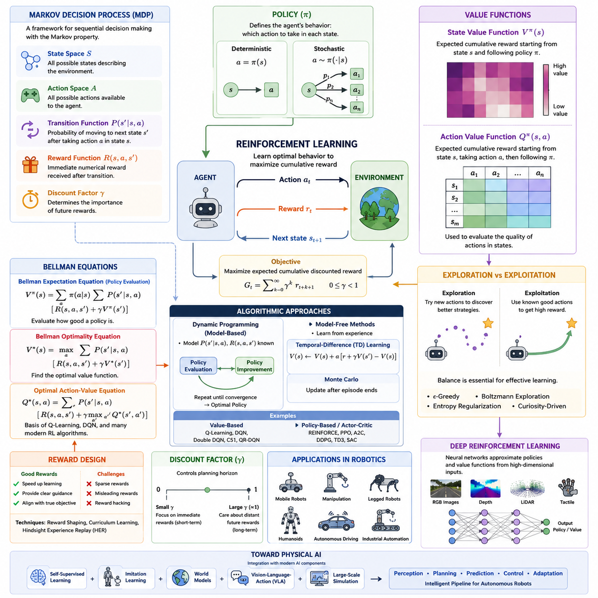
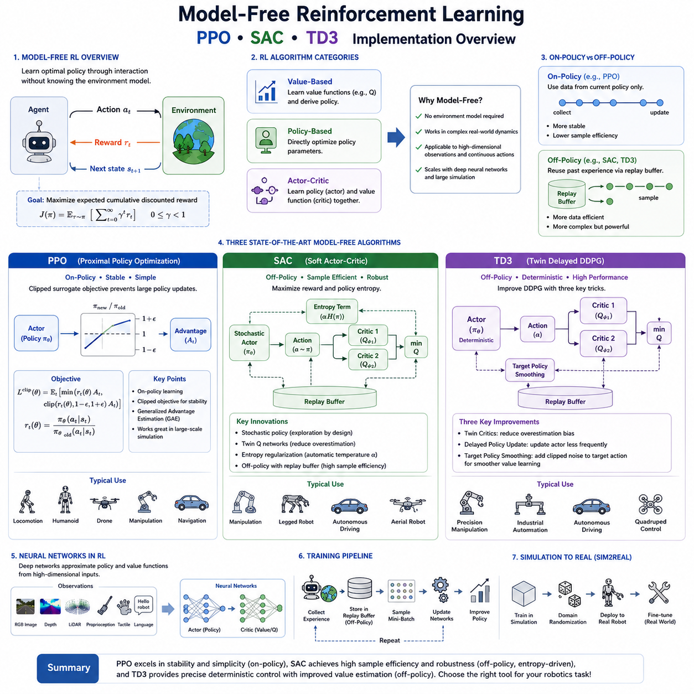
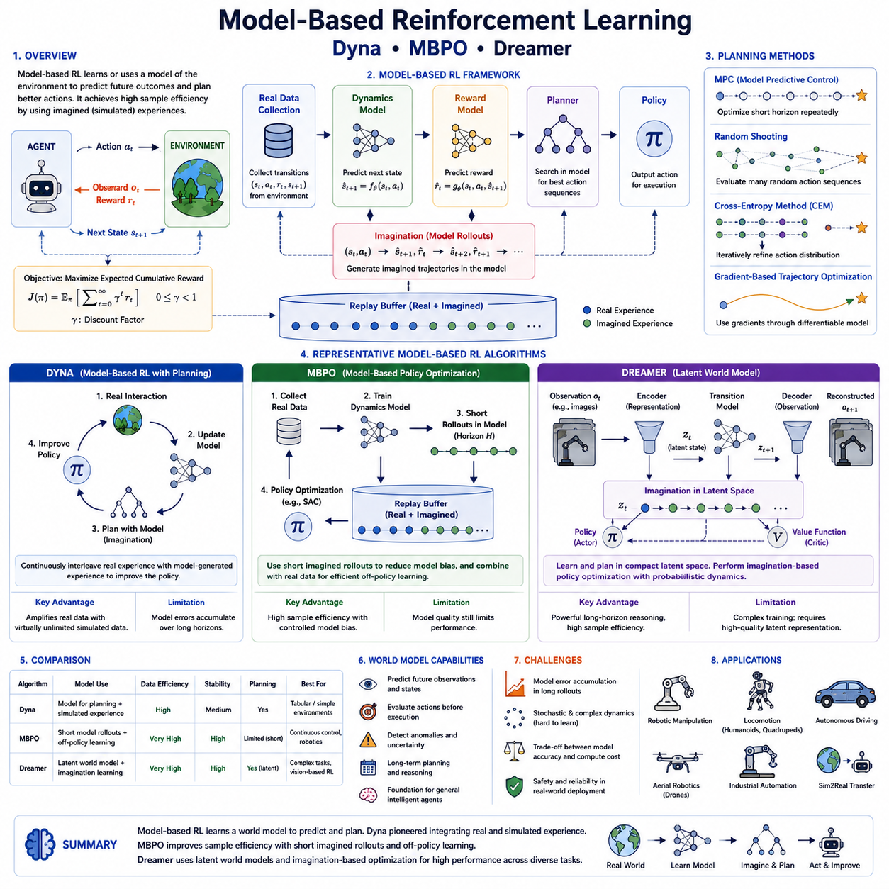
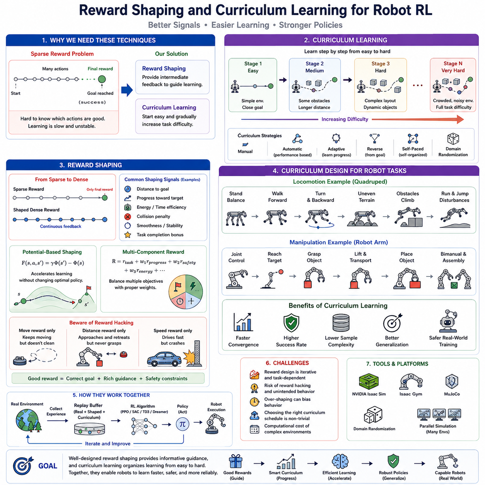
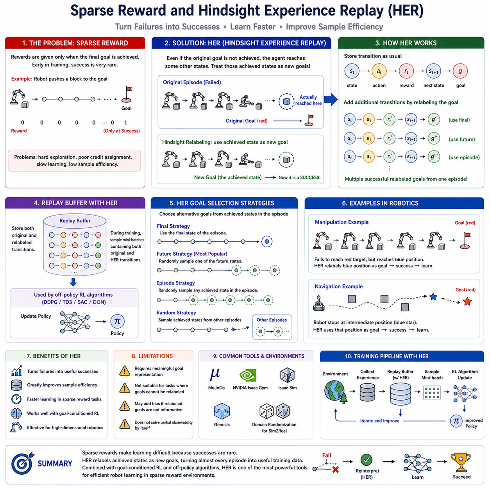
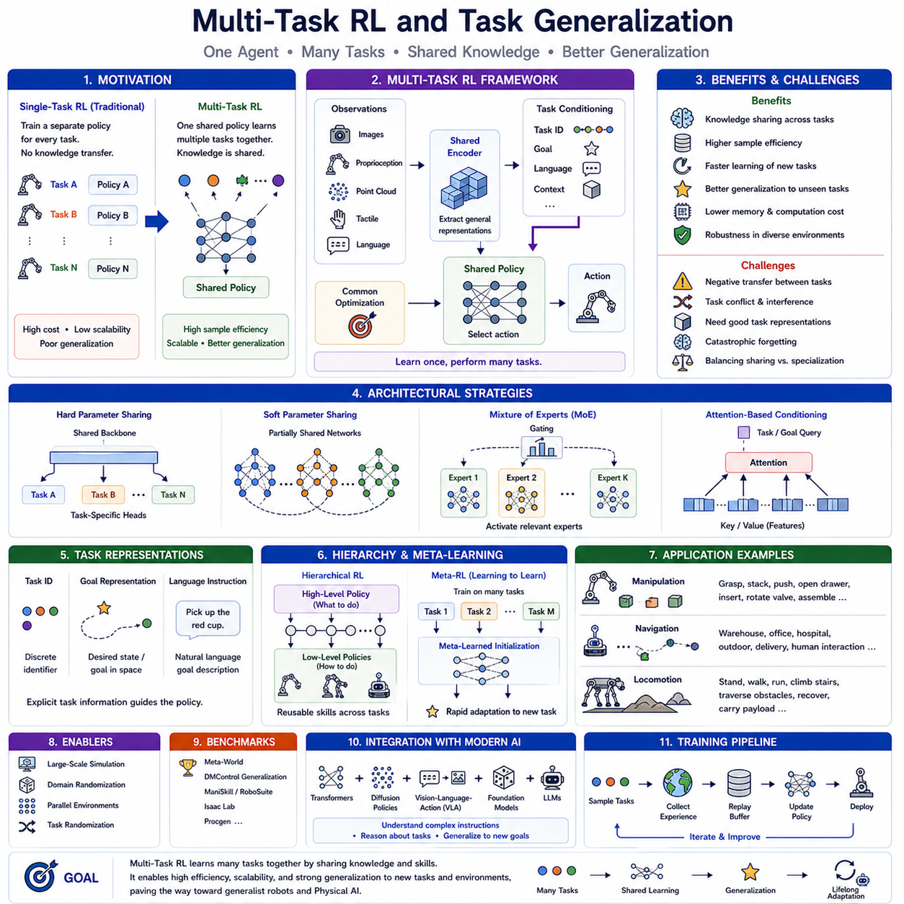
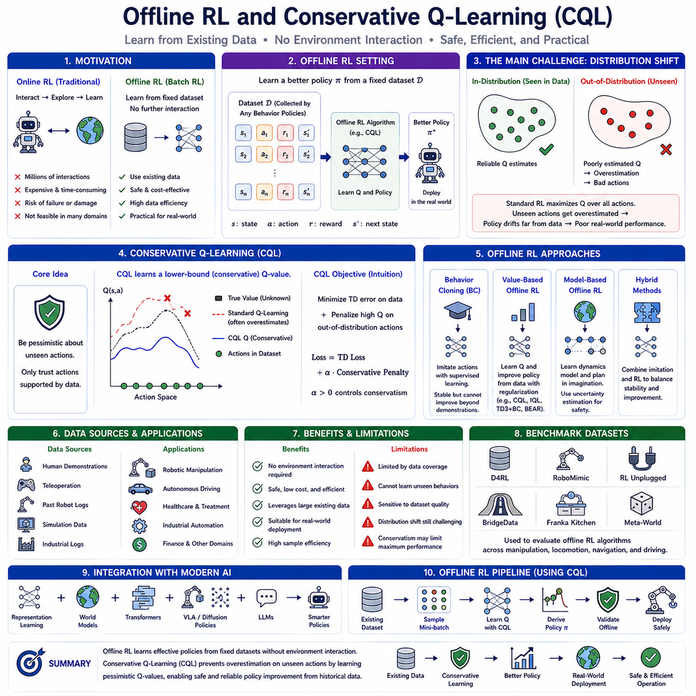
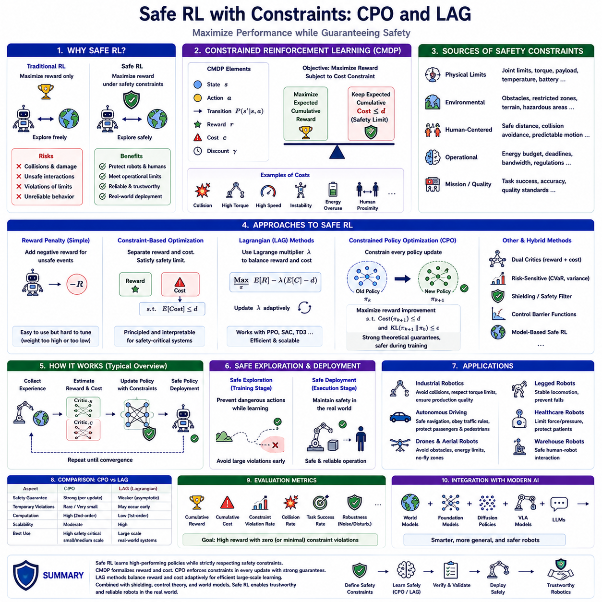
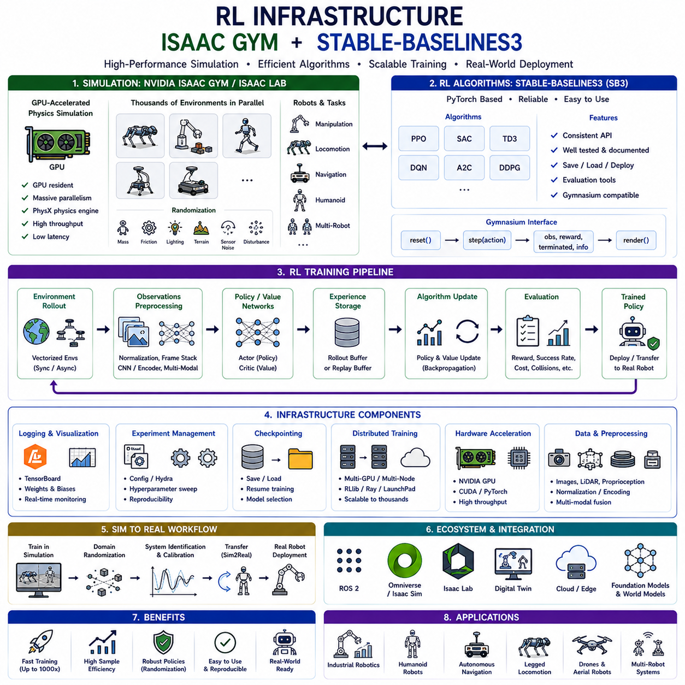
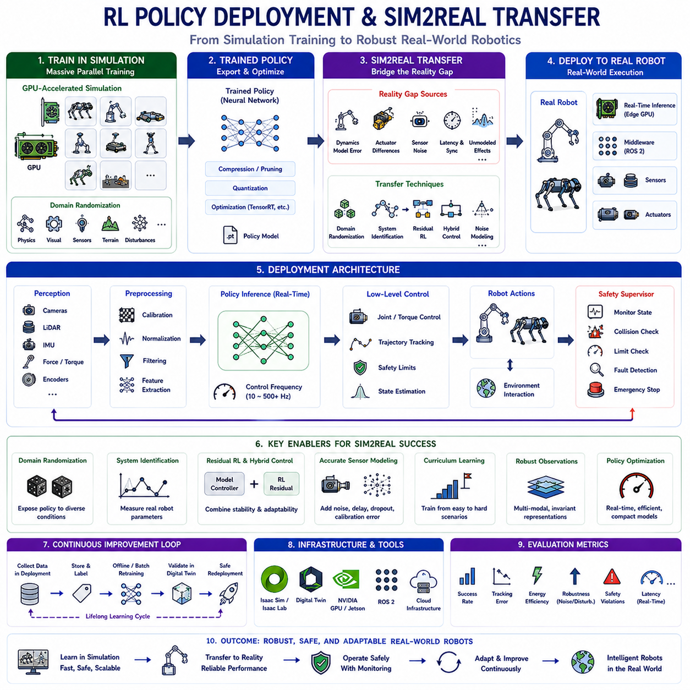

**Volume 19 Robot Machine Learning and AI**


# 05. Reinforcement Learning

##  

## 05.01 RL Fundamentals MDP Bellman Policy Value [w/Code]

{width="7.268055555555556in" height="7.268055555555556in"}

The topic **"41_05_01_RL_Fundamentals_MDP_Bellman_Policy_Value"** belongs to the Reinforcement Learning section of the user\'s engineering library structure under Volume 41, specifically as the foundational chapter introducing Markov Decision Processes, Bellman equations, policies, and value functions.

Reinforcement Learning (RL) is a machine learning paradigm in which an intelligent agent learns how to make sequential decisions by interacting with an environment. Unlike supervised learning, where correct labels are provided for every training sample, reinforcement learning relies on evaluative feedback in the form of rewards. The agent repeatedly observes the current situation, selects an action according to its decision-making strategy, receives a numerical reward, and transitions into a new situation. Through continuous interaction, the agent gradually discovers behaviors that maximize long-term cumulative reward rather than immediate gains. This learning framework closely resembles how humans and animals acquire skills through trial, error, and experience, making reinforcement learning one of the most important foundations for autonomous robotics, game playing, industrial optimization, and Physical AI.

The mathematical foundation of reinforcement learning is the Markov Decision Process (MDP). An MDP provides a formal framework for modeling sequential decision-making problems in uncertain environments. Every reinforcement learning problem can be described as an MDP if the system satisfies the Markov property, which states that the future depends only on the current state and action rather than the complete history of previous observations. This assumption dramatically simplifies the learning problem while still accurately modeling many robotic systems and autonomous control tasks.

An MDP is typically defined by five essential components: the state space, the action space, the transition probability function, the reward function, and the discount factor. The state represents all relevant information describing the environment at a particular moment. For a mobile robot, the state may include position, orientation, velocity, sensor measurements, obstacle locations, battery level, and mission progress. The action represents the control decision selected by the agent, such as steering angle, wheel velocity, manipulator motion, or navigation command. The transition function describes the probability of moving from one state to another after executing an action, capturing both deterministic dynamics and environmental uncertainty. The reward function quantifies the immediate desirability of each transition by assigning positive rewards to desirable outcomes and negative rewards to undesirable events. Finally, the discount factor determines the relative importance of future rewards compared to immediate rewards, enabling the agent to balance short-term success with long-term planning.

The interaction between the agent and the environment follows a repeated decision cycle. At each time step, the agent observes the current state, selects an action according to its policy, executes the action, receives a reward, and transitions to a new state. This interaction continues until a task is completed or a predefined termination condition is reached. During training, the objective is not simply to maximize individual rewards but to maximize the expected cumulative discounted reward over the entire trajectory. This distinction makes reinforcement learning particularly suitable for long-horizon planning problems where early decisions significantly influence future opportunities.

One of the most fundamental concepts in reinforcement learning is the policy. A policy defines the behavior of the agent by specifying which action should be selected in each possible state. Policies may be deterministic, where a single action is always chosen for a given state, or stochastic, where actions are selected according to a probability distribution. Deterministic policies are common in industrial robot control because they produce predictable behavior, whereas stochastic policies are often preferred during exploration and training because they encourage the discovery of better strategies. The policy effectively represents the intelligence of the reinforcement learning agent and becomes the final output after successful training.

Evaluating the quality of a policy requires measuring how beneficial each state or action is over the long term. This leads to the concept of value functions. The state-value function estimates the expected cumulative discounted reward obtained when starting from a particular state and following a given policy thereafter. It measures how promising a state is under the current decision-making strategy. States with higher values indicate that successful future outcomes are more likely if the agent reaches those states.

Closely related to the state-value function is the action-value function, commonly known as the Q-function. Rather than evaluating only the state, the Q-function estimates the expected cumulative reward obtained by executing a particular action in a given state before following the policy. The Q-function therefore evaluates the quality of individual decisions rather than entire situations. Most modern reinforcement learning algorithms, including Q-Learning, Deep Q Networks, Soft Actor-Critic, and many policy optimization methods, either directly or indirectly estimate action-value functions because they provide more detailed guidance for action selection.

The relationship between value functions and optimal decision-making is captured by the Bellman Equation. Richard Bellman\'s principle of optimality states that an optimal solution possesses the property that every remaining decision must itself be optimal regardless of previous decisions. This recursive property allows large sequential decision problems to be decomposed into smaller subproblems. Instead of solving an entire trajectory simultaneously, reinforcement learning algorithms repeatedly solve one-step prediction problems that recursively incorporate future value estimates.

The Bellman Expectation Equation expresses the value of a state as the expected immediate reward plus the discounted value of successor states under the current policy. This recursive formulation provides the theoretical basis for policy evaluation, enabling algorithms to estimate how good a policy is by repeatedly updating value estimates until convergence. Since future values appear on both sides of the equation, iterative numerical methods such as dynamic programming or temporal-difference learning are typically employed to approximate the solution.

The Bellman Optimality Equation extends this concept by replacing the expectation over policy actions with a maximization operator. Rather than evaluating an existing policy, it directly characterizes the optimal value function that would be achieved if the best possible action were always selected. The optimal action-value function satisfies a recursive relationship in which every state-action pair is evaluated according to the maximum achievable future return. Many reinforcement learning algorithms attempt to approximate this optimal Bellman equation through repeated interaction with the environment.

Dynamic Programming provides one of the earliest algorithmic solutions based on Bellman equations. Assuming complete knowledge of the environment\'s transition probabilities and reward function, dynamic programming alternates between policy evaluation and policy improvement until convergence. Policy evaluation computes value functions for the current policy, while policy improvement constructs a better policy by selecting actions with higher estimated values. Repeating these two steps eventually produces the optimal policy. Although exact dynamic programming is computationally expensive and requires a complete environment model, its underlying principles remain central to nearly all modern reinforcement learning methods.

Model-free reinforcement learning removes the requirement for explicit knowledge of transition dynamics. Instead of computing expectations directly from an environment model, the agent estimates value functions from observed experience. Temporal-Difference learning combines ideas from Monte Carlo estimation and dynamic programming by updating value estimates after every interaction using the Bellman equation. This allows learning to proceed continuously while interacting with real or simulated environments. Temporal-Difference learning forms the theoretical basis of algorithms such as SARSA, Q-Learning, Deep Q Networks, and many contemporary deep reinforcement learning approaches.

The exploration-exploitation dilemma represents another central challenge in reinforcement learning. An agent must exploit known high-value actions to obtain rewards while simultaneously exploring uncertain actions that may ultimately produce even greater rewards. Excessive exploitation causes the agent to become trapped in suboptimal behaviors, whereas excessive exploration wastes resources on poor decisions. Practical algorithms employ mechanisms such as epsilon-greedy exploration, Boltzmann sampling, entropy regularization, intrinsic motivation, or curiosity-driven learning to balance these competing objectives.

The discount factor plays a critical role in determining the planning horizon of reinforcement learning agents. A discount factor close to zero emphasizes immediate rewards and produces short-sighted behavior. Conversely, a discount factor close to one encourages long-term planning by assigning significant importance to future rewards. Robotic navigation, manipulation, warehouse logistics, and autonomous driving often require high discount factors because successful task completion depends on sequences of coordinated decisions extending over long periods.

Reward design significantly influences reinforcement learning performance. Carefully designed reward functions accelerate learning by providing informative feedback, whereas poorly designed rewards may produce unintended behaviors or exploit loopholes in the objective function. Dense rewards provide frequent guidance but may bias learning toward intermediate objectives. Sparse rewards more accurately reflect real-world success criteria but create difficult credit assignment problems because successful outcomes occur only after long sequences of actions. Modern reinforcement learning often combines sparse task rewards with auxiliary objectives, curriculum learning, or hindsight experience replay to improve learning efficiency.

In robotics, reinforcement learning provides an attractive framework because robots naturally interact with dynamic environments over time. Mobile robots learn navigation policies that avoid obstacles while minimizing travel time. Manipulators discover dexterous grasping and assembly strategies through repeated practice. Quadruped robots optimize stable locomotion over uneven terrain. Humanoid robots learn coordinated whole-body movements for balancing, walking, and object manipulation. Autonomous vehicles improve driving behavior through continuous interaction with simulated traffic scenarios. In all these applications, the underlying mathematical principles remain rooted in Markov Decision Processes, Bellman equations, policy optimization, and value estimation.

Modern deep reinforcement learning extends classical RL by combining neural networks with value functions or policies. Deep neural networks serve as universal function approximators capable of representing extremely large state and action spaces encountered in robotics. Instead of storing values in lookup tables, neural networks estimate value functions directly from high-dimensional sensory inputs such as RGB images, depth maps, LiDAR point clouds, tactile signals, or multimodal observations. This integration has enabled reinforcement learning to address previously intractable problems involving complex perception and control.

As Physical AI continues to evolve, reinforcement learning remains one of the fundamental technologies for autonomous decision-making. Future systems increasingly combine reinforcement learning with self-supervised representation learning, world models, imitation learning, foundation models, vision-language-action architectures, and large-scale simulation platforms. Rather than operating as an isolated algorithm, reinforcement learning becomes part of a comprehensive intelligent robotics pipeline in which perception, planning, prediction, control, and continuous adaptation work together to produce robust autonomous behavior. Understanding Markov Decision Processes, Bellman equations, policies, and value functions therefore provides the essential theoretical foundation upon which nearly all advanced reinforcement learning algorithms and intelligent robotic systems are built.

강화학습(Reinforcement Learning, RL)은 에이전트(Agent)가 환경(Environment)과 지속적으로 상호작용하면서 최적의 행동(Action)을 스스로 학습하는 기계학습(Machine Learning) 방법이다. 지도학습(Supervised Learning)처럼 정답(Label)이 제공되지 않고, 행동의 결과로 얻는 보상(Reward)을 기반으로 시행착오(Trial and Error)를 반복하며 성능을 향상시킨다. 따라서 단순히 현재의 보상을 최대화하는 것이 아니라 미래까지 고려한 누적 보상(Cumulative Reward)을 극대화하는 것이 목표가 된다. 이러한 특성 때문에 강화학습은 자율주행 로봇, 산업용 로봇, 게임 인공지능(AI), 자율제어 시스템 등에서 핵심적인 학습 방법으로 활용된다.

강화학습의 수학적 기반은 마르코프 결정 과정(Markov Decision Process, MDP)이다. MDP는 불확실한 환경에서 순차적인 의사결정(Sequential Decision Making)을 수행하기 위한 대표적인 수학 모델이다. 대부분의 강화학습 문제는 현재 상태(State)와 현재 행동(Action)만으로 미래를 예측할 수 있다는 마르코프 성질(Markov Property)을 만족한다고 가정한다. 즉, 과거의 모든 기록을 기억하지 않아도 현재 상태만으로 다음 상태를 예측할 수 있다는 가정이며, 이를 통해 매우 복잡한 의사결정 문제를 상대적으로 단순하게 모델링할 수 있다.

MDP는 상태(State), 행동(Action), 상태 전이 함수(State Transition Function), 보상 함수(Reward Function), 할인율(Discount Factor)의 다섯 가지 요소로 구성된다. 상태는 특정 시점에서 환경을 설명하는 모든 정보를 의미하며, 이동로봇에서는 위치, 속도, 자세, 센서 정보, 배터리 상태 등이 포함될 수 있다. 행동은 에이전트가 선택하는 제어 명령이며, 조향각, 바퀴 속도, 로봇팔의 움직임 등이 이에 해당한다. 상태 전이 함수는 특정 행동 이후 환경이 어떻게 변화하는지를 확률적으로 표현하며, 보상 함수는 행동의 결과가 얼마나 바람직한지를 수치로 나타낸다. 할인율은 미래 보상의 중요도를 결정하는 계수로, 현재와 미래의 균형을 조절하는 역할을 수행한다.

강화학습에서는 에이전트와 환경이 반복적으로 상호작용한다. 에이전트는 현재 상태를 관찰하고 정책(Policy)에 따라 행동을 선택한다. 이후 환경은 새로운 상태를 반환하고 즉각적인 보상을 제공한다. 이러한 과정이 반복되면서 에이전트는 어떤 행동이 장기적으로 가장 높은 보상을 가져오는지 학습하게 된다. 결국 강화학습은 단순한 순간의 성공이 아니라 전체 작업(Task) 동안 가장 큰 누적 보상을 얻는 전략을 찾는 과정이라고 볼 수 있다.

정책(Policy)은 강화학습에서 가장 중요한 개념 중 하나이다. 정책은 특정 상태에서 어떤 행동을 선택할 것인지를 정의하는 의사결정 규칙이다. 결정론적 정책(Deterministic Policy)은 하나의 상태에서 항상 동일한 행동을 선택하는 반면, 확률적 정책(Stochastic Policy)은 여러 행동을 일정한 확률로 선택한다. 산업용 로봇은 예측 가능한 동작이 중요하기 때문에 결정론적 정책이 많이 사용되지만, 학습 과정에서는 다양한 행동을 시도하기 위해 확률적 정책이 널리 활용된다. 최종적으로 강화학습이 학습하는 대상은 결국 최적의 정책이라고 할 수 있다.

정책의 성능을 평가하기 위해서는 가치 함수(Value Function)가 필요하다. 상태 가치 함수(State Value Function)는 특정 상태에서 현재 정책을 계속 수행했을 때 기대되는 미래 누적 보상을 의미한다. 즉, 어떤 상태가 얼마나 유망한지를 평가하는 척도이다. 가치가 높은 상태일수록 향후 높은 보상을 얻을 가능성이 크며, 낮은 상태는 위험하거나 비효율적인 상황을 의미한다.

행동 가치 함수(Action Value Function) 또는 Q 함수(Q-Function)는 상태뿐만 아니라 특정 행동까지 함께 평가한다. 즉, 특정 상태에서 특정 행동을 수행한 이후 앞으로 얻을 것으로 기대되는 누적 보상을 계산한다. 상태 가치 함수보다 더욱 세밀하게 행동의 품질을 평가할 수 있기 때문에 Q-Learning, Deep Q Network(DQN), Soft Actor-Critic(SAC), Twin Delayed DDPG(TD3) 등 대부분의 현대 강화학습 알고리즘은 Q 함수를 중심으로 학습을 수행한다.

가치 함수를 계산하는 핵심 원리가 바로 벨만 방정식(Bellman Equation)이다. 벨만 최적성 원리(Bellman Principle of Optimality)는 전체 최적 경로는 이후의 모든 부분 경로 역시 최적이어야 한다는 개념이다. 즉, 긴 문제를 한 번에 해결하는 것이 아니라, 현재의 최적 선택이 미래의 최적 선택과 연결된다는 재귀적(Recursive) 구조를 이용하여 문제를 해결한다. 이러한 아이디어는 강화학습의 거의 모든 알고리즘의 수학적 기반이 된다.

벨만 기대 방정식(Bellman Expectation Equation)은 현재 정책을 기준으로 상태의 가치를 계산한다. 현재 얻는 즉시 보상(Immediate Reward)과 다음 상태의 가치(State Value)를 합산하여 현재 상태의 가치를 반복적으로 갱신한다. 이러한 반복 계산을 정책 평가(Policy Evaluation)라고 하며, 반복할수록 실제 가치 함수에 가까워진다. 실제 계산에서는 동적 계획법(Dynamic Programming)이나 시간차 학습(Temporal Difference Learning)을 이용하여 근사적으로 값을 계산한다.

벨만 최적 방정식(Bellman Optimality Equation)은 현재 정책을 평가하는 것이 아니라 최적 정책(Optimal Policy)을 직접 찾는 방법이다. 미래 상태 중에서 가장 큰 가치를 가지는 행동을 선택하도록 최대(Max) 연산이 추가된다. 이를 반복적으로 수행하면 결국 최적 가치 함수(Optimal Value Function)와 최적 정책을 얻을 수 있다. Q-Learning과 DQN은 이러한 벨만 최적 방정식을 반복적으로 근사하면서 학습을 진행하는 대표적인 알고리즘이다.

동적 계획법(Dynamic Programming)은 벨만 방정식을 이용하는 가장 기본적인 최적화 방법이다. 환경의 상태 전이 확률과 보상 함수가 모두 알려져 있다고 가정하며, 정책 평가와 정책 개선(Policy Improvement)을 반복 수행한다. 정책 평가는 현재 정책의 가치를 계산하고, 정책 개선은 더 높은 가치를 가지는 행동으로 정책을 수정한다. 이 과정을 반복하면 최적 정책에 수렴하게 된다. 비록 실제 로봇에서는 환경 모델을 정확히 알기 어렵지만, 대부분의 강화학습 알고리즘은 이러한 원리를 기반으로 발전하였다.

모델 프리 강화학습(Model-Free Reinforcement Learning)은 환경의 전이 모델을 알지 못하는 경우에도 학습할 수 있다. 시간차 학습(Temporal Difference Learning)은 실제 경험으로부터 벨만 방정식을 이용하여 가치 함수를 지속적으로 갱신하는 방법이다. 이러한 접근은 몬테카를로 방법(Monte Carlo Method)과 동적 계획법의 장점을 결합한 것으로, 실제 로봇과 시뮬레이션 환경 모두에서 널리 사용된다. 대표적인 알고리즘으로 SARSA, Q-Learning, DQN 등이 있으며, 대부분의 심층 강화학습(Deep Reinforcement Learning)의 기반이 된다.

강화학습에서는 탐험과 활용의 균형(Exploration-Exploitation Tradeoff)이 매우 중요하다. 이미 좋은 행동을 반복하면 안정적인 성능을 얻을 수 있지만 더 나은 행동을 발견하지 못할 수 있다. 반대로 새로운 행동만 계속 시도하면 학습 효율이 크게 떨어진다. 따라서 입실론 탐욕(Epsilon-Greedy), 볼츠만 탐색(Boltzmann Exploration), 엔트로피 정규화(Entropy Regularization), 호기심 기반 탐험(Curiosity-Driven Exploration) 등의 다양한 기법을 이용하여 탐험과 활용의 균형을 유지한다.

할인율(Discount Factor)은 미래 보상을 얼마나 중요하게 고려할 것인지를 결정한다. 할인율이 낮으면 현재의 즉각적인 보상에 집중하는 단기 전략이 만들어지고, 할인율이 높으면 미래의 큰 보상을 위해 현재 손해를 감수하는 장기 전략이 형성된다. 자율주행, 창고 물류, 로봇 조작, 산업용 자동화와 같은 응용에서는 긴 작업 과정을 고려해야 하므로 일반적으로 높은 할인율을 사용하는 경우가 많다.

보상 설계(Reward Design)는 강화학습의 성능을 좌우하는 매우 중요한 요소이다. 보상이 적절하게 설계되면 학습 속도가 크게 향상되지만, 잘못 설계되면 의도하지 않은 행동이나 편법을 학습할 수 있다. 밀집 보상(Dense Reward)은 학습을 빠르게 하지만 목표를 왜곡할 가능성이 있으며, 희소 보상(Sparse Reward)은 실제 문제와 유사하지만 학습 난이도가 매우 높다. 최근에는 보상 형성(Reward Shaping), 커리큘럼 학습(Curriculum Learning), 후향 경험 재생(Hindsight Experience Replay, HER) 등을 함께 활용하여 이러한 문제를 해결하고 있다.

강화학습은 다양한 로봇 시스템에서 핵심 기술로 활용되고 있다. 이동로봇(Mobile Robot)은 장애물을 회피하면서 최단 경로를 학습하고, 로봇팔(Manipulator)은 물체를 안정적으로 집는 조작 정책을 학습한다. 사족보행 로봇(Quadruped Robot)은 불규칙한 지형에서 안정적인 보행을 학습하며, 휴머노이드(Humanoid)는 균형 유지와 전신 제어(Whole-Body Control)를 학습한다. 자율주행 차량 역시 다양한 교통 상황에서 안전한 운전 정책을 강화학습을 통해 최적화할 수 있다.

최근의 심층 강화학습(Deep Reinforcement Learning)은 심층신경망(Deep Neural Network)을 이용하여 매우 복잡한 상태 공간(State Space)과 행동 공간(Action Space)을 처리한다. 기존처럼 테이블(Table)에 모든 값을 저장하는 대신 신경망이 RGB 영상, 깊이 영상(Depth Image), LiDAR 포인트 클라우드(Point Cloud), 촉각 센서(Tactile Sensor) 등 고차원 데이터를 입력받아 가치 함수와 정책을 근사한다. 이를 통해 실제 로봇 환경에서도 대규모 문제를 해결할 수 있게 되었으며, 현대 강화학습의 표준적인 접근 방식으로 자리 잡고 있다.

미래의 물리 AI(Physical AI)에서는 강화학습이 단독으로 사용되기보다 자기지도학습(Self-Supervised Learning), 모방학습(Imitation Learning), 월드 모델(World Model), 비전-언어-행동 모델(Vision-Language-Action Model, VLA), 대규모 시뮬레이션(Simulation)과 결합되는 방향으로 발전하고 있다. 이러한 통합 구조에서는 인식(Perception), 계획(Planning), 예측(Prediction), 제어(Control), 적응(Adaptation)이 하나의 지능형 파이프라인으로 연결된다. 따라서 마르코프 결정 과정(MDP), 벨만 방정식(Bellman Equation), 정책(Policy), 가치 함수(Value Function)에 대한 이해는 모든 현대 강화학습 알고리즘과 차세대 자율 로봇 시스템을 이해하기 위한 가장 중요한 이론적 기초라고 할 수 있다.

##  

## 05.02 Model Free RL PPO SAC TD3 Implementation [w/Code]

{width="7.268055555555556in" height="7.268055555555556in"}

Model-Free Reinforcement Learning represents one of the most influential branches of modern reinforcement learning because it enables intelligent agents to learn optimal behaviors without requiring an explicit mathematical model of the environment. Unlike model-based approaches, which first estimate transition dynamics and reward functions before planning, model-free algorithms directly optimize policies or value functions using only observed interactions with the environment. This characteristic makes model-free reinforcement learning particularly attractive for robotics, where accurately modeling complex physical systems, contact dynamics, friction, sensor noise, and unpredictable environmental changes is often impractical. Instead of constructing a complete representation of the world\'s dynamics, the agent continuously collects experience through trial and error and gradually improves its decision-making strategy from accumulated data.

The fundamental objective of model-free reinforcement learning is to maximize the expected cumulative discounted reward through direct interaction with the environment. During training, the agent repeatedly observes its current state, selects an action according to its policy, executes the action, receives a reward, and transitions into a new state. Each interaction contributes additional experience that is used to update the learning algorithm. Over time, the policy converges toward behaviors that consistently produce higher long-term rewards. This direct optimization approach significantly simplifies deployment in environments where physical models are unavailable, incomplete, or computationally expensive to estimate.

Modern model-free reinforcement learning algorithms can generally be categorized into value-based methods, policy-based methods, and actor-critic methods. Value-based algorithms estimate the expected return of actions and derive policies by selecting actions with the highest predicted values. Policy-based algorithms directly optimize the parameters of a policy without explicitly estimating action values. Actor-critic algorithms combine both approaches by simultaneously learning a policy and a value estimator that guides policy improvement. Among today\'s state-of-the-art continuous control algorithms, Proximal Policy Optimization (PPO), Soft Actor-Critic (SAC), and Twin Delayed Deep Deterministic Policy Gradient (TD3) have emerged as the most widely adopted solutions for robotics, autonomous vehicles, manipulation, quadruped locomotion, humanoid control, and industrial automation.

Policy optimization differs fundamentally from classical value iteration. Instead of repeatedly solving the Bellman optimality equation over every possible action, policy optimization treats the policy itself as a parameterized function, usually represented by a deep neural network. The objective becomes finding the set of network parameters that maximize expected cumulative reward. This formulation naturally accommodates continuous action spaces, making policy optimization particularly suitable for robotic control problems involving motor torques, joint velocities, steering angles, and force commands.

Policy Gradient methods provide the mathematical foundation for policy optimization. Rather than estimating value tables, the algorithm computes the gradient of expected cumulative reward with respect to the policy parameters. These gradients indicate how the neural network should be adjusted to increase future returns. The policy is then updated using stochastic gradient ascent, allowing the agent to gradually improve its decision-making strategy. Although theoretically elegant, vanilla policy gradient methods often suffer from high variance and unstable convergence because individual trajectories may produce noisy reward estimates.

Actor-Critic architectures were developed to reduce the variance associated with policy gradient methods. The actor represents the policy responsible for selecting actions, while the critic estimates value functions that evaluate the quality of those actions. The critic provides informative learning signals that significantly stabilize policy updates. Instead of relying solely on delayed cumulative rewards, the actor learns from value estimates generated by the critic, resulting in faster convergence and improved sample efficiency. Nearly all modern policy optimization algorithms employ some variation of the actor-critic framework.

Proximal Policy Optimization (PPO) has become one of the most popular reinforcement learning algorithms because it achieves an excellent balance between simplicity, stability, and performance. PPO was introduced to overcome the instability observed in earlier trust-region optimization methods while avoiding the computational complexity of constrained optimization. The key insight behind PPO is that policy updates should not change the policy too drastically during a single optimization step. Large policy updates may significantly alter the agent\'s behavior, causing catastrophic performance degradation or unstable learning. PPO therefore introduces a clipped surrogate objective that limits the magnitude of policy changes while still allowing continuous improvement.

The clipping mechanism represents the defining innovation of PPO. During optimization, the algorithm compares the probability ratio between the new policy and the previous policy. If the update attempts to increase or decrease action probabilities excessively, the clipping function prevents further improvement beyond a predefined threshold. This simple modification eliminates many of the numerical instabilities associated with unconstrained policy gradients while preserving computational efficiency. As a result, PPO often converges reliably across a wide range of robotic control tasks without requiring extensive hyperparameter tuning.

Another important characteristic of PPO is its on-policy learning strategy. The algorithm collects trajectories using the current policy and immediately uses those trajectories for optimization before discarding them. Because training always relies on fresh experiences generated by the latest policy, learning remains highly stable and theoretically well-founded. However, on-policy learning also reduces sample efficiency because previously collected experiences cannot easily be reused. Consequently, PPO generally requires a relatively large number of environment interactions compared with off-policy algorithms.

PPO has become the default reinforcement learning algorithm for many simulated robotics platforms such as Isaac Gym, MuJoCo, Brax, and Genesis because its robustness often outweighs its lower sample efficiency. Quadruped locomotion, humanoid walking, drone stabilization, robotic manipulation, and autonomous navigation frequently employ PPO during large-scale simulation training before transferring learned policies to physical robots through Sim2Real techniques.

Soft Actor-Critic (SAC) represents a fundamentally different philosophy of reinforcement learning. Instead of maximizing only cumulative reward, SAC maximizes both expected reward and policy entropy. Entropy measures the randomness or uncertainty of the policy. By encouraging higher entropy during training, SAC naturally promotes exploration without relying on manually designed exploration strategies. Rather than immediately converging toward deterministic actions, the agent continues exploring diverse behaviors while gradually increasing expected reward.

Maximum Entropy Reinforcement Learning forms the theoretical basis of SAC. The objective function simultaneously rewards task completion and policy diversity. This prevents premature convergence to locally optimal solutions and encourages more robust behaviors capable of adapting to uncertain environments. Particularly during early training, entropy regularization allows the agent to explore numerous candidate strategies before gradually refining its policy into highly effective behaviors.

SAC employs a stochastic actor that outputs probability distributions over actions instead of deterministic control commands. Actions are sampled from these learned probability distributions, introducing natural exploration throughout training. Simultaneously, SAC learns two independent Q-functions to estimate action values. Using the minimum of these value estimates reduces overestimation bias, significantly improving learning stability. Automatic entropy adjustment further enables SAC to balance exploration and exploitation dynamically without requiring extensive manual tuning.

Unlike PPO, SAC operates as an off-policy reinforcement learning algorithm. Experiences collected during previous interactions are stored inside a replay buffer and reused many times during training. This dramatically increases sample efficiency because every interaction contributes to multiple optimization steps. Replay buffers also improve data diversity by mixing experiences collected under different policies throughout training. Consequently, SAC typically requires substantially fewer environment interactions than PPO while achieving comparable or superior performance in continuous control problems.

Twin Delayed Deep Deterministic Policy Gradient (TD3) builds upon earlier deterministic policy gradient methods by addressing several fundamental limitations observed in Deep Deterministic Policy Gradient (DDPG). Although DDPG demonstrated promising performance for continuous control, it frequently suffered from Q-value overestimation, unstable policy updates, and sensitivity to hyperparameter selection. TD3 introduces three major innovations specifically designed to eliminate these weaknesses while preserving the computational advantages of deterministic policies.

The first innovation is the use of twin critics. Two independent Q-networks simultaneously estimate action values, and the smaller prediction is used during target computation. This conservative estimation significantly reduces overestimation bias, which had previously caused unstable learning and unrealistic value estimates. The second innovation involves delayed policy updates. Instead of updating the actor after every critic update, TD3 updates the policy less frequently. Allowing the critics to converge before modifying the actor produces more reliable learning signals and stabilizes optimization. The third innovation introduces target policy smoothing, where small amounts of clipped random noise are added to target actions during critic training. This prevents the critic from exploiting sharp errors in value estimation and encourages smoother value functions.

TD3 employs deterministic policies, meaning that identical states always produce identical control actions during deployment. Exploration during training is achieved by injecting external noise into selected actions rather than sampling from stochastic policies. This approach often produces highly precise control behaviors suitable for industrial robotic applications requiring repeatable motions and low control variance. Robotic manipulators, precision positioning systems, and autonomous driving controllers frequently benefit from deterministic policy architectures.

Comparing PPO, SAC, and TD3 reveals that each algorithm occupies a distinct position within the reinforcement learning landscape. PPO prioritizes stability, simplicity, and reliable convergence, making it an excellent choice for large-scale simulation training and environments where abundant data can be generated efficiently. SAC emphasizes exploration, robustness, and sample efficiency through entropy maximization and replay buffers, making it particularly suitable for expensive robotic experiments where minimizing physical interactions is essential. TD3 focuses on deterministic continuous control with improved value estimation accuracy, offering excellent performance for precision robotic control and industrial automation tasks.

Replay buffers play a central role in off-policy algorithms such as SAC and TD3. Every interaction between the agent and the environment is stored inside a large memory structure containing states, actions, rewards, subsequent states, and termination indicators. During training, mini-batches are sampled randomly from this buffer rather than relying only on recent experiences. Random sampling breaks temporal correlations between consecutive observations, stabilizes optimization, and dramatically improves data efficiency. Replay buffers also enable continual learning from rare but valuable experiences encountered earlier during training.

Deep neural networks serve as universal function approximators throughout modern model-free reinforcement learning. Policy networks receive high-dimensional observations such as RGB images, depth maps, LiDAR point clouds, proprioceptive measurements, tactile information, and language embeddings before producing continuous control commands. Critic networks estimate state values or action values using similar multimodal inputs. Advanced architectures increasingly incorporate convolutional neural networks, transformers, graph neural networks, recurrent models, and multimodal fusion mechanisms to process increasingly complex robotic observations.

Large-scale simulation has become indispensable for training model-free reinforcement learning algorithms. Platforms such as NVIDIA Isaac Gym, Isaac Sim, MuJoCo, Genesis, and Brax enable thousands of parallel simulated environments to generate millions of interactions every hour. Massive parallelization dramatically accelerates policy optimization while reducing the risks associated with physical experimentation. Domain randomization further improves robustness by varying physical parameters such as mass, friction, lighting, textures, sensor noise, actuator delays, and environmental geometry throughout training. Policies trained under diverse simulated conditions transfer more successfully to real robots.

The Sim2Real pipeline represents one of the most important practical applications of PPO, SAC, and TD3. Policies are initially trained entirely within simulation using large-scale parallel environments. After convergence, the learned neural networks are deployed onto real robotic platforms where additional fine-tuning compensates for remaining discrepancies between simulated and physical environments. This workflow dramatically reduces hardware wear, minimizes safety risks, and lowers development costs while maintaining high control performance.

Model-free reinforcement learning has become a cornerstone of modern Physical AI because it enables robots to acquire sophisticated behaviors directly from experience without requiring manually engineered control strategies. Quadruped locomotion, humanoid balancing, dexterous manipulation, autonomous navigation, aerial robotics, warehouse automation, industrial assembly, and human-robot interaction increasingly rely on model-free reinforcement learning algorithms to optimize behavior in complex, uncertain environments. Among these algorithms, PPO, SAC, and TD3 collectively represent the current industrial standard for continuous robotic control, each offering unique strengths that make them suitable for different classes of autonomous systems. As reinforcement learning continues integrating with world models, foundation models, imitation learning, vision-language-action architectures, and large-scale simulation infrastructures, these model-free optimization algorithms will remain fundamental building blocks for next-generation intelligent robotic systems.

모델 프리 강화학습(Model-Free Reinforcement Learning)은 환경(Environment)의 수학적 모델을 미리 알지 못해도 최적의 행동을 학습할 수 있는 강화학습(Reinforcement Learning)의 대표적인 방법이다. 모델 기반 강화학습(Model-Based Reinforcement Learning)이 상태 전이(State Transition)와 보상 함수(Reward Function)를 먼저 추정한 후 계획(Planning)을 수행하는 것과 달리, 모델 프리 방식은 실제 환경과의 상호작용만으로 정책(Policy)이나 가치 함수(Value Function)를 직접 학습한다. 이러한 특성은 물리 모델을 정확히 구축하기 어려운 실제 로봇 환경에서 매우 큰 장점을 제공한다.

모델 프리 강화학습의 목표는 환경과 반복적으로 상호작용하면서 기대 누적 보상(Expected Cumulative Reward)을 최대화하는 정책을 학습하는 것이다. 에이전트(Agent)는 현재 상태(State)를 관찰하고 행동(Action)을 선택한 후 보상(Reward)과 다음 상태(Next State)를 받는다. 이러한 경험(Experience)이 지속적으로 축적되면서 정책은 점차 개선되고, 결국 장기적으로 가장 높은 성능을 내는 행동 전략을 학습하게 된다. 복잡한 환경 모델을 직접 계산하지 않아도 된다는 점에서 실제 로봇 응용에 매우 적합하다.

현대의 모델 프리 강화학습은 크게 가치 기반(Value-Based), 정책 기반(Policy-Based), 액터-크리틱(Actor-Critic) 방식으로 구분된다. 가치 기반 알고리즘은 행동의 가치를 계산하여 최적 행동을 선택하고, 정책 기반 알고리즘은 정책 자체를 직접 최적화한다. 액터-크리틱은 두 방법을 결합하여 정책과 가치 함수를 동시에 학습한다. 현재 로봇 분야에서는 연속 제어(Continuous Control)에 강점을 가진 PPO(Proximal Policy Optimization), SAC(Soft Actor-Critic), TD3(Twin Delayed Deep Deterministic Policy Gradient)가 가장 널리 활용되고 있다.

정책 최적화(Policy Optimization)는 가치 반복(Value Iteration)과는 다른 접근을 사용한다. 정책 자체를 심층신경망(Deep Neural Network)의 매개변수(Parameter)로 표현하고, 기대 누적 보상을 최대화하는 방향으로 신경망을 학습한다. 이러한 방식은 조인트 토크(Joint Torque), 조향각(Steering Angle), 속도(Velocity)와 같은 연속적인 제어값을 다루기에 매우 적합하다. 따라서 산업용 로봇, 자율주행, 드론, 휴머노이드 등 대부분의 연속 제어 문제에서 널리 사용된다.

정책 그래디언트(Policy Gradient)는 정책 최적화의 수학적 기반이다. 정책의 매개변수를 조금씩 변경했을 때 기대 보상이 얼마나 증가하는지를 계산하여 신경망을 갱신한다. 이 과정은 확률적 그래디언트 상승(Stochastic Gradient Ascent)을 이용하여 수행된다. 그러나 기본적인 정책 그래디언트는 보상의 분산(Variance)이 매우 크기 때문에 학습이 불안정하고 수렴 속도가 느리다는 단점이 존재한다.

이러한 문제를 해결하기 위해 액터-크리틱(Actor-Critic) 구조가 제안되었다. 액터(Actor)는 실제 행동을 결정하는 정책 네트워크이며, 크리틱(Critic)은 선택된 행동이 얼마나 좋은지를 평가하는 가치 네트워크이다. 크리틱이 제공하는 가치 정보를 이용하면 액터는 훨씬 안정적으로 학습할 수 있으며, 보상의 분산도 크게 감소한다. 현재 대부분의 최신 강화학습 알고리즘은 다양한 형태의 액터-크리틱 구조를 기반으로 설계되어 있다.

PPO(Proximal Policy Optimization)는 현재 가장 많이 사용되는 강화학습 알고리즘 중 하나이다. PPO는 기존 정책과 새로운 정책이 한 번의 업데이트에서 너무 크게 달라지는 것을 방지하여 안정적인 학습을 수행한다. 정책이 급격하게 변경되면 성능이 갑자기 나빠질 수 있기 때문에 PPO는 클리핑 목적 함수(Clipped Surrogate Objective)를 이용하여 정책의 변화량을 제한한다. 이 간단한 아이디어 덕분에 높은 안정성과 우수한 성능을 동시에 얻을 수 있다.

PPO의 핵심은 클리핑(Clipping) 기법이다. 새로운 정책이 이전 정책보다 지나치게 큰 확률 변화를 만들려고 하면 업데이트를 제한한다. 이를 통해 수치적인 불안정성을 줄이고 정책이 천천히 개선되도록 만든다. 기존의 복잡한 신뢰 영역 최적화(Trust Region Optimization)보다 구현이 간단하면서도 매우 안정적이기 때문에 현재 산업계와 연구 분야 모두에서 가장 많이 활용되는 강화학습 알고리즘 중 하나가 되었다.

PPO는 온폴리시(On-Policy) 학습 방식이다. 현재 정책으로 수집한 데이터만 학습에 사용하고, 한 번 사용한 경험은 다시 활용하지 않는다. 따라서 항상 최신 정책으로 학습이 이루어져 안정성이 높지만, 동일한 데이터를 여러 번 사용할 수 없기 때문에 샘플 효율성(Sample Efficiency)은 상대적으로 낮다. 대신 시뮬레이션에서 대량의 데이터를 쉽게 생성할 수 있는 환경에서는 매우 뛰어난 성능을 보인다.

현재 NVIDIA Isaac Gym, Isaac Sim, MuJoCo, Brax, Genesis와 같은 대규모 시뮬레이션 환경에서는 PPO가 가장 많이 사용된다. 사족보행 로봇(Quadruped Robot), 휴머노이드(Humanoid), 드론(Drone), 이동로봇(Mobile Robot), 로봇팔(Manipulator)의 정책 학습에 폭넓게 적용되며, 이후 Sim2Real 과정을 통해 실제 로봇으로 이전된다.

SAC(Soft Actor-Critic)는 보상만 최대화하는 것이 아니라 정책 엔트로피(Policy Entropy)도 함께 최대화하는 강화학습 알고리즘이다. 엔트로피는 정책의 다양성과 불확실성을 의미하며, 높은 엔트로피는 다양한 행동을 지속적으로 탐색하도록 만든다. 따라서 SAC는 학습 초기부터 폭넓은 탐험(Exploration)을 수행하며 지역 최적해(Local Optimum)에 빠질 가능성을 줄여준다.

SAC의 이론적 기반은 최대 엔트로피 강화학습(Maximum Entropy Reinforcement Learning)이다. 목표 함수는 작업 성공뿐 아니라 행동의 다양성도 함께 고려한다. 이 덕분에 다양한 환경 변화에 적응할 수 있는 강건한(Robust) 정책을 학습할 수 있다. 특히 불확실성이 높은 실제 로봇 환경에서는 PPO보다 우수한 탐험 성능을 보이는 경우가 많다.

SAC는 확률적 정책(Stochastic Policy)을 사용하며 행동을 확률분포에서 샘플링한다. 또한 두 개의 독립적인 Q 함수(Q-Function)를 동시에 학습하여 과대 추정(Overestimation Bias)을 줄인다. 자동 엔트로피 조정(Automatic Entropy Adjustment) 기능도 포함되어 있어 탐험과 활용(Exploration-Exploitation)의 균형을 자동으로 조절한다. 이러한 특징 덕분에 별도의 복잡한 튜닝 없이도 안정적인 성능을 제공한다.

SAC는 오프폴리시(Off-Policy) 알고리즘이므로 리플레이 버퍼(Replay Buffer)에 저장된 과거 경험을 여러 번 재사용한다. 따라서 동일한 데이터를 반복적으로 학습할 수 있어 샘플 효율성이 매우 높다. 실제 로봇 실험처럼 데이터를 얻는 비용이 큰 환경에서는 PPO보다 훨씬 적은 실험 횟수만으로도 높은 성능을 달성할 수 있다.

TD3(Twin Delayed Deep Deterministic Policy Gradient)는 DDPG(Deep Deterministic Policy Gradient)의 문제점을 개선한 알고리즘이다. 기존 DDPG는 Q 값 과대 추정과 학습 불안정성, 하이퍼파라미터(Hyperparameter)에 대한 높은 민감도가 문제였다. TD3는 세 가지 핵심 개선 기법을 도입하여 이러한 문제를 크게 완화하였다.

첫 번째 개선은 두 개의 크리틱(Twin Critics)을 사용하는 것이다. 두 개의 Q 네트워크가 독립적으로 값을 계산하고, 그중 더 작은 값을 학습에 사용하여 과대 추정을 줄인다. 두 번째는 정책 지연 업데이트(Delayed Policy Update)이다. 크리틱을 여러 번 업데이트한 후 액터를 갱신하여 보다 안정적인 학습 신호를 제공한다. 세 번째는 목표 정책 스무딩(Target Policy Smoothing)으로, 목표 행동(Target Action)에 작은 잡음(Noise)을 추가하여 Q 함수가 지나치게 특정 행동에 과적합되는 것을 방지한다.

TD3는 결정론적 정책(Deterministic Policy)을 사용한다. 동일한 상태에서는 항상 동일한 행동을 출력하며, 학습 시에는 외부 노이즈를 추가하여 탐험을 수행한다. 따라서 매우 정밀하고 반복 가능한 제어가 가능하므로 산업용 로봇, 정밀 위치 제어, 자율주행 차량과 같이 정확성이 중요한 분야에서 높은 성능을 보인다.

PPO, SAC, TD3는 각각 서로 다른 장점을 가진다. PPO는 구현이 간단하고 학습이 안정적이며 대규모 시뮬레이션 환경에서 매우 강력하다. SAC는 높은 탐험 능력과 뛰어난 샘플 효율성을 제공하여 실제 로봇 학습에 적합하다. TD3는 결정론적 제어와 높은 제어 정밀도를 제공하므로 산업 자동화와 정밀 제어 시스템에서 많이 활용된다. 실제 프로젝트에서는 문제의 특성과 데이터 획득 비용에 따라 적절한 알고리즘을 선택하는 것이 중요하다.

리플레이 버퍼(Replay Buffer)는 SAC와 TD3 같은 오프폴리시 알고리즘의 핵심 요소이다. 상태(State), 행동(Action), 보상(Reward), 다음 상태(Next State)를 메모리에 저장한 후 무작위(Mini-Batch)로 샘플링하여 반복 학습한다. 이렇게 하면 연속된 데이터 간의 상관관계가 줄어들어 학습이 안정되고, 하나의 경험을 여러 번 활용할 수 있어 데이터 효율성이 크게 향상된다.

현대의 모델 프리 강화학습은 심층신경망을 이용하여 RGB 영상, 깊이 영상(Depth Image), LiDAR 포인트 클라우드(Point Cloud), 촉각 센서(Tactile Sensor), 관절 상태(Proprioception), 언어 임베딩(Language Embedding) 등 다양한 입력을 처리한다. 정책 네트워크와 가치 네트워크는 컨볼루션 신경망(CNN), 트랜스포머(Transformer), 그래프 신경망(Graph Neural Network), 순환 신경망(RNN) 등을 활용하여 복잡한 환경에서도 최적의 행동을 생성한다.

대규모 시뮬레이션(Large-Scale Simulation)은 모델 프리 강화학습에서 필수적인 요소가 되었다. NVIDIA Isaac Gym, Isaac Sim, MuJoCo, Genesis, Brax 등은 수천 개의 시뮬레이션 환경을 동시에 실행하여 수백만 번의 경험을 빠르게 생성한다. 또한 도메인 랜덤화(Domain Randomization)를 통해 질량, 마찰, 조명, 센서 노이즈, 액추에이터 지연 등을 지속적으로 변화시켜 실제 환경에서도 잘 동작하는 강건한 정책을 학습할 수 있도록 지원한다.

Sim2Real은 대부분의 로봇 강화학습 프로젝트에서 사용하는 표준 개발 절차이다. 먼저 시뮬레이션에서 PPO, SAC, TD3를 이용하여 정책을 충분히 학습한 후, 이를 실제 로봇에 배포하여 미세 조정(Fine-Tuning)을 수행한다. 이러한 과정은 실제 장비의 마모와 위험을 줄이고 개발 비용을 절감하면서도 높은 성능을 유지할 수 있도록 해준다.

모델 프리 강화학습은 별도의 제어 규칙을 사람이 직접 설계하지 않아도 로봇이 스스로 최적의 행동을 학습할 수 있도록 해주는 핵심 기술이다. 사족보행 로봇, 휴머노이드, 이동로봇, 로봇팔, 자율주행 차량, 드론, 물류 자동화, 산업용 조립 시스템 등 다양한 분야에서 이미 표준 기술로 자리 잡고 있다. 앞으로는 월드 모델(World Model), 자기지도학습(Self-Supervised Learning), 모방학습(Imitation Learning), 비전-언어-행동 모델(Vision-Language-Action Model, VLA), 파운데이션 모델(Foundation Model)과 결합되면서 더욱 높은 수준의 자율성과 일반화 능력을 갖춘 차세대 물리 AI(Physical AI)의 핵심 학습 기술로 발전할 것으로 기대된다.

##  

## 05.03 Model Based RL Dyna MBPO Dreamer [w/Code]

{width="7.268055555555556in" height="7.268055555555556in"}

Model-Based Reinforcement Learning (MBRL) is a branch of reinforcement learning that enables an intelligent agent to learn optimal behaviors by explicitly modeling the dynamics of the environment. Unlike model-free reinforcement learning, which learns solely from direct interactions with the environment, model-based methods attempt to learn or exploit a predictive model that estimates how the environment evolves after each action. This predictive capability allows the agent to reason about future outcomes before executing actions, significantly improving learning efficiency while reducing the amount of real-world experience required. For robotics applications, where collecting physical interaction data is often expensive, slow, or potentially unsafe, model-based reinforcement learning provides an attractive alternative by shifting much of the learning process into learned or simulated environments.

The central idea of model-based reinforcement learning is that intelligent decision making becomes substantially easier when the agent possesses an internal model of the world. Instead of repeatedly experimenting with every possible action in the real environment, the agent first predicts future states, rewards, and possible consequences using the learned dynamics model. These imagined experiences can then be used for planning, policy optimization, or value estimation without requiring additional physical interactions. Consequently, model-based reinforcement learning generally achieves much higher sample efficiency than model-free algorithms, making it particularly valuable for robotics, autonomous driving, industrial automation, and other domains where data collection is expensive.

A typical model-based reinforcement learning framework consists of several tightly integrated components. The environment generates observations and rewards through real interactions. A dynamics model learns to predict future states based on current states and selected actions. A reward model estimates the expected reward associated with predicted transitions when the reward function is not explicitly available. A planner searches through possible future trajectories generated by the learned model to identify promising action sequences. Finally, a policy network converts planning results into executable control commands for the robot. These components continuously improve together as additional interaction data becomes available, gradually increasing the accuracy of predictions and the quality of learned behaviors.

The dynamics model represents the most fundamental component of model-based reinforcement learning. It approximates the transition function that governs how the environment evolves over time. Given the current state and an action, the dynamics model predicts the next state that the system is likely to reach. Depending on the application, the dynamics model may be deterministic or probabilistic. Deterministic models always produce a single prediction for each input pair, while probabilistic models estimate distributions over possible future states, thereby representing uncertainty caused by noisy sensors, stochastic environments, or incomplete observations.

Learning an accurate dynamics model is often significantly easier than directly learning an optimal policy because physical systems usually exhibit structured, continuous behavior governed by underlying physical laws. Robot motion, object dynamics, contact interactions, and vehicle kinematics often contain regular patterns that neural networks can efficiently approximate. Once an accurate predictive model has been obtained, planning algorithms can simulate thousands of hypothetical futures internally without requiring expensive interactions with the real environment.

Planning distinguishes model-based reinforcement learning from model-free methods. Instead of immediately executing the action suggested by a learned policy, the agent may first simulate numerous candidate action sequences using the learned dynamics model. Each simulated trajectory is evaluated according to predicted cumulative reward, and the highest-scoring trajectory determines the action selected for execution. This planning capability enables the agent to anticipate long-term consequences before acting, reducing costly mistakes and improving safety in high-risk robotic environments.

Planning algorithms vary considerably depending on computational requirements and model characteristics. Model Predictive Control (MPC) repeatedly optimizes finite planning horizons using the learned dynamics model while continuously updating predictions as new observations become available. Random Shooting methods evaluate randomly generated action sequences and select the highest-performing candidate. The Cross-Entropy Method (CEM) iteratively refines probability distributions over action sequences until high-quality trajectories emerge. Gradient-based trajectory optimization directly adjusts action sequences by differentiating through differentiable dynamics models. These planning strategies provide varying tradeoffs between computational cost, optimization quality, and robustness.

One of the earliest and most influential model-based reinforcement learning algorithms is Dyna, introduced by Richard Sutton. Dyna established the fundamental concept of integrating real experience with simulated experience generated by a learned environment model. Instead of separating model learning and policy learning into independent stages, Dyna continuously alternates among three complementary processes. First, the agent interacts with the real environment to collect experience. Second, the dynamics model is updated using newly acquired transitions. Third, the learned model generates simulated experiences that supplement real experiences during policy improvement. This integrated framework dramatically improves sample efficiency because every real interaction produces numerous additional virtual training examples.

The Dyna architecture illustrates one of the key advantages of model-based reinforcement learning. Real-world interactions remain expensive, but simulated experiences generated by the learned model are nearly free once the dynamics model has been trained. Consequently, policy improvement can continue long after physical data collection has stopped. This ability to amplify limited real experience through internal simulation remains one of the defining characteristics of modern model-based reinforcement learning.

Although Dyna demonstrated the effectiveness of combining planning and learning, early model-based algorithms often struggled when learned models became inaccurate over long prediction horizons. Small prediction errors accumulated over multiple simulated time steps, gradually producing unrealistic trajectories that negatively affected policy learning. Addressing this problem became a major research direction that eventually led to more sophisticated modern algorithms such as Model-Based Policy Optimization (MBPO) and Dreamer.

Model-Based Policy Optimization (MBPO) was developed specifically to combine the strengths of model-free and model-based reinforcement learning while minimizing their respective weaknesses. Rather than relying entirely on imagined rollouts generated by the learned dynamics model, MBPO carefully limits the length of simulated trajectories. Short simulated rollouts reduce the accumulation of prediction errors while still providing substantial improvements in sample efficiency. These simulated experiences are then combined with real experiences inside a replay buffer and used to train a model-free reinforcement learning algorithm such as Soft Actor-Critic.

The key insight behind MBPO is that learned models tend to remain accurate over short prediction horizons but gradually diverge from reality over longer horizons. Instead of generating hundreds of simulated future states, MBPO intentionally produces only brief imagined trajectories. Because short-horizon predictions remain relatively accurate, the resulting synthetic experiences improve policy learning without introducing excessive model bias. This hybrid strategy significantly outperforms both purely model-based and purely model-free methods across numerous continuous control benchmarks.

MBPO continuously alternates among four major processes. The agent first collects real interaction data from the environment. Next, the dynamics model is updated using the newly acquired dataset. Short imagined rollouts are then generated using the learned model. Finally, both real and imagined experiences are jointly used for policy optimization. This cyclical learning procedure enables policies to improve rapidly while maintaining strong consistency with actual environmental dynamics.

The replay buffer plays an essential role within MBPO because it integrates information originating from two distinct sources. Real experiences preserve accurate representations of environmental behavior, while imagined experiences generated by the learned model substantially increase data availability. Sampling mini-batches from both sources enables efficient learning while preventing excessive dependence on potentially imperfect model predictions.

Dreamer represents one of the most advanced model-based reinforcement learning algorithms developed in recent years. Unlike earlier methods that primarily learn transition models over observed states, Dreamer introduces the concept of latent world models. Instead of predicting future observations directly in high-dimensional image space, Dreamer first compresses observations into compact latent representations that capture the essential structure of the environment. Planning and policy learning then occur entirely within this latent space, dramatically reducing computational complexity while improving predictive accuracy.

The world model employed by Dreamer typically consists of three interacting neural networks. The representation model encodes high-dimensional sensory observations into compact latent states. The transition model predicts how latent states evolve following selected actions. The reconstruction or observation model decodes latent representations back into observations when necessary. Together, these networks enable the agent to build an internal representation of the environment that supports efficient imagination-based learning.

Latent space planning offers several significant advantages over direct observation prediction. Images, point clouds, and other sensory inputs contain enormous amounts of redundant information irrelevant to decision making. By compressing observations into meaningful latent variables, Dreamer focuses computational resources on task-relevant information while ignoring unnecessary visual details. This abstraction substantially improves prediction quality and allows long-horizon reasoning to become computationally feasible.

A defining characteristic of Dreamer is imagination-based policy learning. Rather than optimizing policies using only real experiences, the agent performs extensive policy optimization entirely within imagined latent trajectories generated by the learned world model. Because latent simulations execute much faster than real interactions, Dreamer achieves exceptional sample efficiency while maintaining high task performance. Policies gradually improve through millions of internally generated experiences before being evaluated in the physical environment.

Dreamer also addresses uncertainty by learning probabilistic latent dynamics rather than deterministic state transitions. Probabilistic world models capture multiple plausible future outcomes and naturally represent uncertainty associated with noisy observations, ambiguous situations, and stochastic environments. This uncertainty estimation improves robustness during planning and reduces overconfidence in imperfect model predictions.

Subsequent versions such as DreamerV2 and DreamerV3 further extended the architecture by improving latent representation learning, stabilizing optimization, and enabling large-scale multitask reinforcement learning. DreamerV3 demonstrated that a single algorithm could successfully solve diverse control tasks spanning robotic manipulation, locomotion, Atari games, and complex simulated environments without requiring extensive task-specific modifications. These advances illustrate the growing importance of learned world models as a foundation for general-purpose intelligent agents.

World models themselves have become a major research direction extending beyond classical reinforcement learning. A world model can be viewed as an internal simulator that enables intelligent systems to predict future consequences, evaluate hypothetical actions, detect anomalies, estimate uncertainty, and perform long-term planning before executing physical actions. This capability closely resembles human reasoning, where mental simulation often precedes actual behavior. Consequently, world models are increasingly regarded as one of the essential components of future Physical AI systems.

Despite their many advantages, model-based reinforcement learning methods also face important challenges. Learning accurate dynamics models remains difficult for highly stochastic environments, discontinuous contact dynamics, deformable objects, fluid interactions, and complex human behavior. Prediction errors inevitably accumulate over long horizons, potentially leading planners toward unrealistic trajectories. Balancing model accuracy, planning complexity, computational efficiency, and policy optimization therefore remains an active area of research.

Recent advances increasingly combine model-based reinforcement learning with transformer architectures, diffusion models, self-supervised learning, multimodal representation learning, and foundation models. Instead of learning only low-level physical dynamics, future world models are expected to incorporate semantic knowledge, language understanding, object relationships, causal reasoning, and long-term memory. Such integrated world models will enable robots to predict not only physical consequences but also task outcomes, human intentions, and mission-level objectives.

Large-scale simulation platforms such as NVIDIA Isaac Sim, MuJoCo, Genesis, and differentiable physics engines provide ideal environments for training modern model-based reinforcement learning systems. Massive simulation generates abundant interaction data for learning accurate dynamics models while domain randomization improves robustness against discrepancies between simulation and reality. After training, learned world models and optimized policies can be transferred to physical robots using Sim2Real methodologies with significantly reduced real-world experimentation.

Model-based reinforcement learning has become increasingly important for advanced robotics because it offers a practical solution to one of the field\'s greatest challenges: learning efficiently from limited physical experience. Dyna introduced the foundational concept of integrating planning with learning. MBPO demonstrated that carefully combining learned models with model-free optimization dramatically improves sample efficiency while controlling prediction error. Dreamer expanded this paradigm by introducing latent world models capable of imagination-based policy optimization. Together, these algorithms represent successive stages in the evolution of model-based reinforcement learning, progressively moving from simple predictive models toward increasingly sophisticated internal world representations. As future Physical AI systems continue integrating reinforcement learning with foundation models, multimodal perception, large language models, and embodied reasoning, learned world models will likely become one of the central computational mechanisms enabling autonomous robots to reason, plan, adapt, and learn with human-like efficiency.

모델 기반 강화학습(Model-Based Reinforcement Learning, MBRL)은 환경(Environment)의 동작 원리를 나타내는 모델(Model)을 학습하거나 활용하여 최적의 행동을 찾는 강화학습(Reinforcement Learning) 방법이다. 모델 프리 강화학습(Model-Free Reinforcement Learning)이 실제 환경과의 상호작용만으로 정책(Policy)을 학습하는 것과 달리, 모델 기반 강화학습은 상태 전이(State Transition)와 보상(Reward)을 예측하는 내부 모델을 이용하여 미래를 먼저 시뮬레이션한 후 행동을 결정한다. 이러한 접근은 실제 로봇에서 많은 데이터를 수집하기 어려운 상황에서 매우 높은 데이터 효율성(Sample Efficiency)을 제공한다.

모델 기반 강화학습의 핵심 아이디어는 에이전트(Agent)가 환경의 내부 모델(World Model)을 구축하는 것이다. 실제 환경에서 수집한 데이터를 이용하여 현재 상태(State)와 행동(Action)이 주어졌을 때 다음 상태(Next State)가 어떻게 변하는지를 학습한다. 이후 실제 환경에서 반복적으로 실험하지 않고도 내부 모델을 이용해 다양한 행동을 가상으로 시뮬레이션하고, 가장 좋은 결과를 예측하는 행동을 선택한다. 이처럼 미래를 미리 예측하는 능력이 모델 기반 강화학습의 가장 큰 특징이다.

일반적인 모델 기반 강화학습 시스템은 여러 요소로 구성된다. 실제 환경은 관측값(Observation)과 보상을 생성하고, 동역학 모델(Dynamics Model)은 다음 상태를 예측한다. 보상 모델(Reward Model)은 미래 보상을 추정하며, 계획기(Planner)는 예측된 미래 경로(Trajectory)를 탐색하여 가장 좋은 행동 시퀀스를 찾는다. 마지막으로 정책 네트워크(Policy Network)는 계획 결과를 실제 로봇이 수행할 수 있는 제어 명령으로 변환한다. 이러한 구성 요소들은 학습이 진행될수록 함께 성능이 향상된다.

동역학 모델(Dynamics Model)은 모델 기반 강화학습에서 가장 중요한 요소이다. 현재 상태와 행동이 주어졌을 때 다음 상태를 예측하는 역할을 수행한다. 동역학 모델은 결정론적 모델(Deterministic Model)일 수도 있고 확률론적 모델(Probabilistic Model)일 수도 있다. 결정론적 모델은 항상 동일한 결과를 예측하지만, 확률론적 모델은 여러 가능한 미래 상태를 확률분포로 표현하여 센서 노이즈나 환경의 불확실성을 함께 고려할 수 있다.

실제 로봇 시스템에서는 동역학 모델을 학습하는 것이 직접 정책을 학습하는 것보다 더 쉬운 경우가 많다. 로봇의 움직임, 차량의 운동학(Kinematics), 접촉(Contact), 마찰(Friction) 등은 일정한 물리 법칙을 따르기 때문에 신경망이 이러한 규칙을 비교적 쉽게 학습할 수 있다. 동역학 모델이 충분히 정확해지면 실제 실험을 반복하지 않고도 수많은 미래 상황을 내부적으로 시뮬레이션하여 정책을 효율적으로 개선할 수 있다.

계획(Planning)은 모델 기반 강화학습을 모델 프리 강화학습과 구분하는 가장 큰 특징이다. 정책이 바로 행동을 결정하는 것이 아니라 먼저 여러 후보 행동을 동역학 모델을 이용하여 시뮬레이션한다. 각 행동 시퀀스가 만들어낼 미래의 누적 보상을 계산한 후 가장 높은 성능을 보이는 행동을 실제 환경에서 수행한다. 이러한 예측 기반 의사결정은 위험한 상황을 사전에 피할 수 있어 안전성이 중요한 로봇 시스템에서 매우 유용하다.

계획 알고리즘은 다양한 형태로 구현될 수 있다. 모델 예측 제어(Model Predictive Control, MPC)는 일정한 시간 구간만 최적화한 후 다시 계획을 반복하는 방식이다. 랜덤 슈팅(Random Shooting)은 여러 행동 시퀀스를 무작위로 생성하여 가장 좋은 결과를 선택한다. 교차 엔트로피 방법(Cross-Entropy Method, CEM)은 반복적으로 더 좋은 행동 분포를 찾아가며 최적화를 수행한다. 또한 미분 가능한 동역학 모델에서는 그래디언트 기반 최적화(Gradient-Based Optimization)를 이용하여 직접 최적 행동을 계산할 수도 있다.

Dyna는 리처드 서튼(Richard Sutton)이 제안한 최초의 대표적인 모델 기반 강화학습 알고리즘이다. Dyna는 실제 경험과 가상 경험을 동시에 활용하는 구조를 처음으로 제시하였다. 먼저 실제 환경에서 데이터를 수집하고, 이를 이용해 동역학 모델을 학습한다. 이후 학습된 모델을 이용하여 수많은 가상 경험(Simulated Experience)을 생성하고, 이를 실제 경험과 함께 정책 학습에 사용한다. 하나의 실제 경험으로 수많은 추가 학습 데이터를 만들어낼 수 있기 때문에 매우 높은 데이터 효율성을 제공한다.

Dyna의 가장 큰 장점은 실제 데이터를 증폭(Experience Amplification)할 수 있다는 점이다. 실제 환경에서 얻은 경험은 비용이 크지만, 학습된 모델이 생성하는 가상 경험은 거의 비용 없이 무한히 생성할 수 있다. 따라서 실제 실험 횟수를 크게 줄이면서도 정책을 지속적으로 개선할 수 있으며, 이러한 아이디어는 이후 대부분의 모델 기반 강화학습 연구의 출발점이 되었다.

그러나 초기 모델 기반 강화학습은 긴 예측(Long Horizon Prediction)에서 오차가 누적되는 문제가 있었다. 동역학 모델이 조금만 부정확해도 여러 단계를 예측하는 동안 오차가 점점 커져 현실과 전혀 다른 미래를 예측하게 된다. 이러한 모델 편향(Model Bias)은 정책 성능을 크게 떨어뜨릴 수 있으며, 이를 해결하기 위해 이후 MBPO(Model-Based Policy Optimization)와 Dreamer 같은 최신 알고리즘이 개발되었다.

MBPO(Model-Based Policy Optimization)는 모델 기반 강화학습과 모델 프리 강화학습의 장점을 결합한 대표적인 알고리즘이다. MBPO는 학습된 동역학 모델을 이용하여 매우 짧은 길이의 가상 롤아웃(Imagined Rollout)만 생성한다. 짧은 예측에서는 모델 오차가 크게 누적되지 않기 때문에 현실과 매우 유사한 데이터를 생성할 수 있으며, 이러한 데이터를 실제 경험과 함께 리플레이 버퍼(Replay Buffer)에 저장하여 정책을 학습한다.

MBPO의 핵심 아이디어는 짧은 예측은 정확하지만 긴 예측은 부정확하다는 사실을 적극 활용하는 것이다. 따라서 수백 단계의 미래를 예측하지 않고 몇 단계만 시뮬레이션하여 모델 오차를 최소화한다. 이러한 짧은 가상 데이터는 실제 데이터와 함께 SAC(Soft Actor-Critic) 같은 모델 프리 강화학습 알고리즘의 학습에 사용되며, 높은 데이터 효율성과 안정성을 동시에 달성할 수 있다.

MBPO는 네 단계의 반복 구조를 가진다. 먼저 실제 환경에서 데이터를 수집하고, 그 데이터를 이용해 동역학 모델을 학습한다. 이후 학습된 모델을 이용하여 짧은 가상 데이터를 생성하고, 실제 데이터와 가상 데이터를 함께 사용하여 정책을 최적화한다. 이러한 과정을 지속적으로 반복하면서 정책과 모델이 동시에 향상된다.

리플레이 버퍼(Replay Buffer)는 MBPO에서 중요한 역할을 수행한다. 버퍼에는 실제 경험과 모델이 생성한 가상 경험이 함께 저장된다. 학습 시에는 두 종류의 데이터를 무작위로 선택하여 미니배치(Mini-Batch)를 구성한다. 이를 통해 실제 데이터의 정확성과 가상 데이터의 풍부함을 동시에 활용할 수 있으며, 모델 오차에 지나치게 의존하는 문제도 줄일 수 있다.

Dreamer는 최근 가장 발전된 모델 기반 강화학습 알고리즘 중 하나이다. Dreamer는 기존처럼 이미지 자체를 예측하는 것이 아니라 잠재 공간(Latent Space)에 월드 모델(World Model)을 구축한다. 먼저 카메라 영상과 같은 고차원 데이터를 잠재 표현(Latent Representation)으로 압축한 후, 이 잠재 공간에서 미래를 예측하고 정책을 학습한다. 이를 통해 계산량을 크게 줄이면서도 매우 정확한 예측이 가능해진다.

Dreamer의 월드 모델은 세 가지 주요 신경망으로 구성된다. 표현 모델(Representation Model)은 관측 데이터를 잠재 상태로 변환하고, 전이 모델(Transition Model)은 잠재 상태의 변화를 예측한다. 관측 모델(Observation Model)은 필요할 경우 잠재 상태를 다시 원래의 관측 데이터로 복원한다. 이러한 구조는 실제 영상보다 훨씬 압축된 공간에서 학습이 이루어지므로 효율성과 정확성을 동시에 향상시킨다.

잠재 공간 기반 학습은 여러 가지 장점을 제공한다. 실제 영상에는 의사결정과 무관한 많은 정보가 포함되어 있지만, 잠재 표현은 중요한 특징만 유지한다. 따라서 Dreamer는 불필요한 계산을 줄이고 중요한 정보에 집중할 수 있다. 이러한 추상화(Abstraction)는 긴 시간에 걸친 예측에서도 높은 정확도를 유지하도록 도와준다.

Dreamer의 가장 큰 특징은 상상 기반 학습(Imagination-Based Learning)이다. 실제 환경에서 얻은 데이터만 사용하는 것이 아니라 월드 모델이 생성한 잠재 공간의 가상 경험에서 정책을 지속적으로 최적화한다. 잠재 공간 시뮬레이션은 실제 환경보다 훨씬 빠르게 수행되므로 적은 실제 데이터만으로도 매우 높은 성능을 달성할 수 있다.

Dreamer는 확률론적 잠재 동역학(Probabilistic Latent Dynamics)을 학습하여 미래의 불확실성도 함께 모델링한다. 하나의 미래만 예측하는 것이 아니라 여러 가능한 미래를 확률적으로 표현하므로 센서 노이즈나 환경 변화에도 더욱 강건한(Robust) 정책을 생성할 수 있다.

DreamerV2와 DreamerV3는 이러한 구조를 더욱 발전시켜 잠재 표현 학습을 개선하고 다양한 작업(Multi-Task Learning)을 하나의 알고리즘으로 수행할 수 있도록 만들었다. 조작(Manipulation), 보행(Locomotion), 게임, 자율주행 등 서로 다른 환경에서도 동일한 구조를 사용할 수 있으며, 별도의 알고리즘 수정 없이 우수한 성능을 보였다. 이는 월드 모델이 범용 인공지능(General-Purpose AI)의 핵심 기술로 발전하고 있음을 보여준다.

최근 월드 모델(World Model)은 강화학습을 넘어 물리 AI(Physical AI)의 핵심 기술로 주목받고 있다. 월드 모델은 단순한 상태 예측기가 아니라 미래를 예측하고, 행동 결과를 시뮬레이션하며, 이상 상황을 감지하고, 장기 계획(Long-Term Planning)을 수행하는 내부 시뮬레이터(Internal Simulator)의 역할을 한다. 이는 사람이 행동하기 전에 머릿속으로 결과를 예측하는 과정과 매우 유사하다.

모델 기반 강화학습에도 한계는 존재한다. 매우 복잡한 접촉 동역학(Contact Dynamics), 유체(Fluid), 변형체(Deformable Object), 사람의 행동처럼 예측이 어려운 환경에서는 정확한 모델을 학습하기 어렵다. 또한 예측이 길어질수록 모델 오차가 누적되므로 계획의 신뢰성이 낮아질 수 있다. 따라서 모델 정확도와 계획 복잡도, 계산 비용의 균형을 맞추는 것이 현재도 중요한 연구 주제이다.

최근에는 모델 기반 강화학습이 트랜스포머(Transformer), 확산 모델(Diffusion Model), 자기지도학습(Self-Supervised Learning), 파운데이션 모델(Foundation Model)과 결합되고 있다. 미래의 월드 모델은 단순히 물리 법칙만 학습하는 것이 아니라 언어(Language), 의미(Semantics), 객체 관계(Object Relationship), 인과관계(Causality), 장기 기억(Long-Term Memory)까지 포함하는 방향으로 발전하고 있다. 이를 통해 로봇은 단순한 움직임뿐 아니라 작업 목표와 사람의 의도까지 예측하는 수준으로 진화할 것으로 기대된다.

NVIDIA Isaac Sim, MuJoCo, Genesis와 같은 대규모 시뮬레이션 플랫폼은 모델 기반 강화학습 학습에 매우 적합하다. 이러한 환경에서는 방대한 데이터를 빠르게 생성하여 정확한 동역학 모델을 학습할 수 있으며, 도메인 랜덤화(Domain Randomization)를 통해 실제 환경과의 차이를 줄일 수 있다. 이후 Sim2Real 과정을 통해 학습된 월드 모델과 정책을 실제 로봇으로 이전하여 적은 실험만으로도 높은 성능을 달성할 수 있다.

모델 기반 강화학습은 적은 실제 경험만으로도 높은 성능을 달성할 수 있는 차세대 강화학습 기술이다. Dyna는 실제 경험과 가상 경험을 결합하는 개념을 제시하였고, MBPO는 짧은 가상 롤아웃을 활용하여 높은 데이터 효율성과 안정성을 동시에 확보하였다. Dreamer는 잠재 공간 기반 월드 모델을 이용하여 상상 기반 정책 학습을 구현함으로써 모델 기반 강화학습을 한 단계 발전시켰다. 앞으로 물리 AI에서는 월드 모델이 파운데이션 모델, 대규모 언어 모델(Large Language Model, LLM), 멀티모달 인식(Multimodal Perception)과 결합되어 인간처럼 미래를 예측하고 계획하며 학습하는 핵심 기술로 자리 잡을 것으로 전망된다.

##  

## 05.04 Reward Shaping and Curriculum for Robot RL [w/Code]

{width="7.268055555555556in" height="7.268055555555556in"}

Reward shaping and curriculum learning are two of the most influential techniques for improving the efficiency, stability, and success rate of reinforcement learning in robotics. Although modern reinforcement learning algorithms such as PPO, SAC, TD3, and Dreamer have demonstrated remarkable capabilities, their performance often depends heavily on the quality of the reward signal and the structure of the training process. In practical robotic applications, sparse rewards, long-horizon tasks, complex contact dynamics, and safety constraints frequently make learning extremely difficult. Reward shaping provides richer learning signals that guide the agent toward desirable behaviors, while curriculum learning gradually increases task difficulty so that complex skills can be acquired through a sequence of progressively more challenging experiences. Together, these techniques significantly accelerate convergence, improve policy robustness, and reduce the amount of training data required.

One of the fundamental challenges in reinforcement learning is the credit assignment problem. A robot often performs hundreds or even thousands of actions before receiving a meaningful reward. Determining which actions contributed to success or failure becomes increasingly difficult as the time horizon grows. For example, a mobile manipulator may navigate through an environment, identify an object, grasp it, transport it, and finally place it into a designated container. If the robot receives only a single reward after successful completion, the learning algorithm has little information about which intermediate behaviors were beneficial. Sparse feedback dramatically slows policy optimization because successful trajectories become extremely rare during early exploration.

Reward shaping addresses this problem by introducing additional intermediate rewards that provide continuous guidance throughout the learning process. Instead of rewarding only final task completion, the environment supplies informative signals whenever the robot makes measurable progress toward the objective. These shaping rewards encourage productive behaviors while maintaining the overall optimization objective. As a result, the agent receives significantly more feedback during exploration, enabling faster policy improvement and more stable convergence.

The reward function itself represents the mathematical objective that reinforcement learning attempts to optimize. A carefully designed reward function aligns learning behavior with the desired task outcome, whereas an improperly designed reward function may unintentionally encourage undesirable or unsafe behaviors. Consequently, reward engineering has become one of the most important practical aspects of robotic reinforcement learning. Even highly advanced learning algorithms cannot compensate for poorly specified objectives if the reward function fails to capture the true mission requirements.

Robot reward functions often consist of multiple components rather than a single scalar objective. A navigation robot may simultaneously receive positive rewards for approaching its destination, maintaining smooth trajectories, avoiding obstacles, minimizing travel time, reducing energy consumption, and respecting safety margins. Similarly, a robotic manipulator may receive rewards for reducing grasp distance, maintaining stable contact forces, minimizing joint effort, avoiding collisions, and successfully completing manipulation tasks. These individual reward components are combined through weighted sums that balance competing objectives according to application requirements.

Distance-based shaping rewards represent one of the simplest and most widely used techniques. Rather than rewarding only successful task completion, the robot continuously receives rewards proportional to reductions in distance between its current state and the desired goal. This approach provides smooth gradients that encourage steady progress even during early exploration when complete task success remains unlikely. Mobile robots frequently employ Euclidean distance to navigation goals, while manipulators often utilize Cartesian distance between end-effectors and target objects.

Potential-based reward shaping provides a theoretically principled approach that preserves the optimal policy while accelerating learning. Instead of arbitrarily introducing additional rewards, shaping rewards are derived from a potential function defined over the state space. The shaping reward equals the difference between discounted future potential and current potential. Because these additional rewards satisfy specific mathematical properties, they alter learning speed without changing the optimal solution. This important theoretical guarantee makes potential-based shaping particularly attractive for safety-critical robotic applications where preserving optimal behavior is essential.

Despite its benefits, reward shaping introduces significant design challenges. One common problem is reward hacking, in which the agent discovers unintended strategies that maximize reward without accomplishing the intended task. For example, a cleaning robot rewarded solely for movement may learn to drive continuously without collecting any debris. A manipulator rewarded for minimizing distance to an object may repeatedly approach and retreat from the object without ever grasping it. Autonomous vehicles rewarded primarily for speed may develop unsafe driving behaviors if collision penalties are insufficient. These examples demonstrate that reinforcement learning optimizes exactly the specified reward function rather than the designer\'s implicit intentions.

Reward hacking highlights the importance of balancing multiple reward components. Safety penalties, energy costs, stability constraints, task completion bonuses, and progress rewards must collectively define the desired behavior. In practice, reward engineering often requires extensive iterative refinement involving repeated experiments, failure analysis, and weight adjustment before satisfactory robot behavior emerges. Consequently, designing reward functions has become both an engineering discipline and an active research topic.

Dense rewards and sparse rewards represent two opposite extremes in reinforcement learning. Dense reward functions provide continuous feedback after nearly every action, greatly improving learning efficiency but increasing the risk of biasing behavior toward intermediate objectives rather than ultimate task completion. Sparse reward functions provide feedback only when the final objective has been achieved, accurately representing real-world success criteria but making exploration substantially more difficult. Modern robotic reinforcement learning frequently combines sparse terminal rewards with carefully designed dense shaping rewards that guide exploration without fundamentally altering the task objective.

Auxiliary rewards further enhance learning by encouraging useful secondary behaviors that support task completion. A quadruped robot may receive additional rewards for maintaining body balance, minimizing foot slippage, preserving gait symmetry, and reducing energy expenditure. A drone may receive rewards for maintaining stable altitude, smooth angular velocities, and efficient trajectory tracking. Although these auxiliary objectives do not directly define task success, they encourage physically meaningful behaviors that facilitate robust policy learning.

Curriculum learning introduces another powerful mechanism for accelerating reinforcement learning. Inspired by human education, curriculum learning organizes training experiences according to gradually increasing levels of difficulty. Rather than exposing the agent to the most difficult task from the beginning, training starts with simplified scenarios that can be solved relatively easily. Once the agent consistently succeeds, progressively more challenging conditions are introduced. This staged learning process significantly improves convergence while reducing catastrophic failure during early exploration.

The underlying intuition behind curriculum learning is that complex skills are easier to acquire when decomposed into simpler prerequisite abilities. Human students first learn arithmetic before calculus, and children first learn to crawl before walking. Similarly, robots benefit from learning basic navigation before obstacle avoidance, stable locomotion before running, and object reaching before dexterous manipulation. Sequentially mastering increasingly difficult subtasks enables policies to develop robust foundational capabilities that support later complex behaviors.

Curriculum design can follow several different strategies. Manual curricula rely on human expertise to define successive training stages according to increasing task complexity. Automatic curricula dynamically adjust task difficulty based on measured policy performance. Adaptive curricula continuously estimate the agent\'s competence and select training scenarios that maximize expected learning progress. Reverse curricula begin near successful goal states before gradually increasing initial distances. Self-paced curricula automatically identify appropriate difficulty levels according to optimization objectives and learning dynamics.

Environmental complexity frequently serves as a natural curriculum variable in robotic learning. Navigation tasks may initially contain no obstacles before gradually introducing static obstacles, moving obstacles, narrow passages, dynamic crowds, uneven terrain, adverse weather conditions, and sensor noise. Manipulation tasks may begin with isolated objects placed in convenient positions before progressing toward cluttered environments, deformable objects, varying lighting conditions, and dynamic human interactions. Each curriculum stage expands the agent\'s competence while preserving previously acquired skills.

Domain randomization often complements curriculum learning by progressively increasing environmental variability throughout training. Initially, simulated environments may employ fixed physical parameters such as friction, mass, lighting, and textures. As learning progresses, these parameters are gradually randomized across wider ranges. Eventually, robots experience diverse combinations of environmental conditions that closely approximate real-world uncertainty. This gradual expansion of environmental diversity significantly improves generalization during Sim2Real transfer.

Robotic locomotion provides one of the clearest demonstrations of curriculum learning. A quadruped robot typically begins by learning to stand without falling. Once stable balance has been achieved, the curriculum introduces slow forward walking. Subsequent stages include turning, backward motion, uneven terrain, inclined surfaces, obstacle traversal, slippery ground, running, jumping, and recovery from external disturbances. Attempting to learn all these skills simultaneously would greatly complicate exploration and often prevent successful convergence.

Manipulation tasks exhibit similar hierarchical structures. A robotic arm first learns basic joint coordination before reaching toward isolated objects. Once reaching succeeds reliably, grasping motions are introduced. Subsequent curriculum stages involve object lifting, transportation, placement, orientation control, force-sensitive manipulation, bimanual coordination, and assembly operations. By gradually expanding task complexity, reinforcement learning acquires sophisticated manipulation capabilities with substantially greater efficiency than direct end-to-end optimization.

Curriculum learning also improves exploration by reducing the probability of repeated failure during early training. When initial tasks remain achievable, successful trajectories become sufficiently common to provide meaningful learning signals. As policy competence increases, exploration naturally expands toward increasingly complex behaviors. This progressive exploration strategy substantially reduces sample complexity compared with immediately confronting the agent with extremely challenging environments.

Automatic curriculum generation has become an active research area within modern reinforcement learning. Instead of relying on manually designed training schedules, machine learning algorithms estimate the current competence of the agent and automatically select future tasks that maximize expected improvement. Teacher-student frameworks employ separate teacher policies responsible for generating appropriate training scenarios. Population-based methods dynamically adjust curriculum parameters across multiple parallel learners. These adaptive strategies reduce human engineering effort while improving scalability across diverse robotic applications.

Curriculum learning interacts naturally with replay buffers in off-policy reinforcement learning algorithms. Experiences collected from earlier curriculum stages remain valuable because they reinforce fundamental behaviors even after more advanced tasks have been introduced. Prioritized replay further enhances learning by selecting informative experiences according to temporal-difference error, novelty, or learning progress. Combining curriculum learning with intelligent experience replay creates highly efficient training pipelines capable of solving extremely challenging robotic tasks.

Safety considerations are particularly important when designing robotic curricula. Early curriculum stages often restrict robot velocities, actuator torques, workspace boundaries, and environmental hazards. As policy reliability improves, these safety constraints are gradually relaxed, allowing increasingly aggressive behaviors while maintaining acceptable risk levels. Such staged deployment significantly reduces hardware damage, protects expensive equipment, and enables safe reinforcement learning on physical robotic platforms.

Modern simulation environments provide ideal platforms for implementing reward shaping and curriculum learning. NVIDIA Isaac Sim, Isaac Gym, MuJoCo, Genesis, and other physics simulators enable automatic adjustment of terrain complexity, object arrangements, sensor noise, actuator delays, lighting conditions, weather effects, and physical parameters throughout training. Massive parallel simulation further allows multiple curriculum stages to be trained simultaneously across thousands of environments, dramatically accelerating policy development.

Reward shaping and curriculum learning have become indispensable components of successful robotic reinforcement learning systems. Rather than viewing reinforcement learning as a purely algorithmic optimization problem, these techniques recognize that intelligent behavior emerges most efficiently when learning signals and training experiences are carefully structured. Reward shaping provides informative guidance that accelerates policy optimization without sacrificing task objectives, while curriculum learning organizes knowledge acquisition into manageable stages that progressively develop increasingly sophisticated skills.

Future Physical AI systems will likely employ adaptive reward functions, automatically generated curricula, learned world models, foundation models, and large language models to create increasingly autonomous learning processes. Instead of relying on manually engineered rewards and fixed training schedules, future robots may continuously modify their own objectives, generate personalized curricula, estimate task difficulty, and optimize learning strategies based on accumulated experience. In this vision, reward shaping and curriculum learning evolve from manually designed engineering tools into self-improving mechanisms that enable lifelong autonomous learning across diverse robotic tasks and continuously changing environments.

보상 형성(Reward Shaping)과 커리큘럼 학습(Curriculum Learning)은 로봇 강화학습(Reinforcement Learning)의 학습 효율과 안정성, 성공률을 크게 향상시키는 대표적인 기술이다. PPO(Proximal Policy Optimization), SAC(Soft Actor-Critic), TD3(Twin Delayed Deep Deterministic Policy Gradient), Dreamer와 같은 최신 강화학습 알고리즘도 보상 함수(Reward Function)의 설계와 학습 과정의 구성에 따라 성능이 크게 달라진다. 특히 실제 로봇에서는 희소 보상(Sparse Reward), 긴 작업 수행(Long-Horizon Task), 복잡한 접촉 동역학(Contact Dynamics), 안전 제약(Safety Constraint) 등이 존재하기 때문에 단순한 강화학습만으로는 효율적인 학습이 어렵다.

강화학습에서 가장 어려운 문제 중 하나는 공헌도 할당 문제(Credit Assignment Problem)이다. 로봇은 수백에서 수천 번의 행동을 수행한 뒤에야 최종 보상을 받는 경우가 많다. 이때 어떤 행동이 성공에 기여했고 어떤 행동이 실패의 원인이 되었는지를 판단하기가 매우 어렵다. 예를 들어 이동형 매니퓰레이터(Mobile Manipulator)가 이동, 물체 인식, 접근, 집기, 운반, 배치 과정을 모두 수행한 뒤 마지막에만 보상을 받는다면, 중간 과정에서 어떤 행동이 효과적이었는지를 학습하기 어렵다. 이러한 문제는 강화학습의 수렴 속도를 크게 저하시킨다.

보상 형성은 이러한 문제를 해결하기 위해 중간 보상(Intermediate Reward)을 추가하는 방법이다. 최종 성공 시점에서만 보상을 주는 것이 아니라 목표에 가까워질 때마다 지속적으로 보상을 제공하여 학습 방향을 안내한다. 따라서 에이전트(Agent)는 초기 학습 단계에서도 의미 있는 피드백을 자주 받을 수 있으며, 탐험(Exploration)의 효율이 높아지고 정책(Policy)의 수렴 속도도 크게 향상된다.

보상 함수(Reward Function)는 강화학습이 최적화하는 가장 중요한 목표 함수이다. 적절하게 설계된 보상 함수는 원하는 행동을 자연스럽게 학습하도록 유도하지만, 잘못 설계된 보상 함수는 의도하지 않은 행동이나 위험한 행동까지 학습하게 만들 수 있다. 따라서 실제 로봇 시스템에서는 알고리즘 자체만큼이나 보상 함수 설계가 매우 중요한 공학적 요소로 간주된다.

실제 로봇의 보상 함수는 하나의 목표만으로 구성되지 않는 경우가 대부분이다. 이동 로봇은 목표 지점까지의 거리 감소, 장애물 회피, 이동 시간 단축, 에너지 절약, 경로의 부드러움 등을 동시에 고려해야 한다. 매니퓰레이터는 목표 물체와의 거리 감소, 안정적인 그립(Grip), 충돌 방지, 관절 토크 감소, 작업 성공 등을 함께 평가한다. 이러한 여러 요소를 가중치(Weight)를 가진 합으로 구성하여 전체 보상 함수를 설계한다.

거리 기반 보상(Distance-Based Reward)은 가장 널리 사용되는 보상 형성 방법이다. 목표에 도달했을 때만 보상을 주는 대신 목표와의 거리가 줄어들수록 지속적으로 보상을 제공한다. 이동 로봇은 목표 위치까지의 유클리드 거리(Euclidean Distance)를 사용하며, 로봇팔은 엔드 이펙터(End Effector)와 목표 물체 사이의 거리를 이용하는 경우가 많다. 이러한 연속적인 보상은 학습 초기에 매우 효과적인 방향성을 제공한다.

잠재 함수 기반 보상 형성(Potential-Based Reward Shaping)은 이론적으로 가장 많이 연구된 보상 형성 방법이다. 상태 공간(State Space)에 정의된 잠재 함수(Potential Function)를 이용하여 현재 상태와 다음 상태의 잠재값 차이를 보상으로 사용한다. 이러한 방식은 학습 속도는 높이면서도 원래의 최적 정책(Optimal Policy)은 변경하지 않는다는 수학적 특성을 가진다. 따라서 안전성이 중요한 산업용 로봇과 자율주행 시스템에서 많이 활용된다.

보상 형성에는 보상 해킹(Reward Hacking)이라는 위험도 존재한다. 에이전트는 사람이 의도한 행동이 아니라 보상을 최대화하는 행동만 학습하기 때문이다. 예를 들어 이동 거리만 보상으로 주면 청소 로봇은 쓰레기를 치우지 않고 계속 움직이기만 할 수 있다. 목표까지의 거리만 보상으로 주면 로봇팔은 물체를 집지 않고 계속 가까워졌다 멀어졌다를 반복할 수도 있다. 따라서 보상 설계는 실제 목표와 정확히 일치하도록 매우 신중하게 이루어져야 한다.

보상 해킹을 방지하기 위해서는 여러 보상 요소를 균형 있게 설계해야 한다. 작업 성공 보상(Task Completion Reward), 안전 패널티(Safety Penalty), 에너지 소비(Energy Consumption), 충돌 패널티(Collision Penalty), 안정성(Stability), 진행도(Progress Reward) 등을 함께 고려하여 최종 보상 함수를 구성한다. 실제 프로젝트에서는 반복적인 실험과 실패 분석을 통해 보상의 가중치를 지속적으로 수정하는 과정이 필수적이다.

밀집 보상(Dense Reward)과 희소 보상(Sparse Reward)은 서로 다른 장단점을 가진다. 밀집 보상은 거의 모든 행동에 피드백을 제공하므로 학습 속도가 빠르지만, 중간 목표에만 집중하는 문제가 발생할 수 있다. 반대로 희소 보상은 실제 목표를 정확하게 반영하지만 탐험이 매우 어려워져 학습 시간이 크게 증가한다. 따라서 대부분의 실제 로봇 시스템은 두 방식을 적절히 조합하여 사용한다.

보조 보상(Auxiliary Reward)은 작업 성공과 직접적인 관련은 없지만 좋은 행동을 유도하는 추가적인 보상이다. 사족보행 로봇(Quadruped Robot)은 균형 유지(Balance), 발 미끄러짐 감소(Foot Slip), 보행 대칭성(Gait Symmetry), 에너지 절약 등에 대한 보조 보상을 받을 수 있다. 드론은 자세 안정화(Stabilization), 고도 유지(Altitude Control), 부드러운 회전(Motion Smoothness) 등에 대해 추가 보상을 받을 수 있다. 이러한 보조 목표는 최종 정책의 안정성과 일반화 성능을 향상시킨다.

커리큘럼 학습(Curriculum Learning)은 사람의 교육 방식에서 영감을 받은 학습 전략이다. 가장 어려운 문제를 처음부터 학습하는 것이 아니라 쉬운 문제부터 시작하여 점차 난이도를 높여가는 방식이다. 초기에는 쉽게 성공할 수 있는 환경을 제공하고, 성공률이 높아질수록 점점 복잡한 환경을 학습하도록 만든다. 이러한 단계적 학습은 탐험 실패를 줄이고 정책의 수렴을 크게 향상시킨다.

커리큘럼 학습의 핵심 아이디어는 복잡한 기술은 간단한 기술의 조합이라는 점이다. 사람도 산수를 먼저 배우고 미적분을 배우듯이, 로봇도 기본 이동을 먼저 학습한 후 장애물 회피를 배우고, 이후 복잡한 경로 계획을 학습하는 것이 훨씬 효율적이다. 이러한 단계적인 학습은 기초 능력을 안정적으로 구축하여 이후의 어려운 작업을 쉽게 수행하도록 만든다.

커리큘럼은 여러 가지 방식으로 설계될 수 있다. 수동 커리큘럼(Manual Curriculum)은 사람이 난이도를 직접 정의한다. 자동 커리큘럼(Automatic Curriculum)은 학습 성능을 기반으로 난이도를 자동 조절한다. 적응형 커리큘럼(Adaptive Curriculum)은 현재 정책의 능력을 평가하여 가장 적절한 난이도를 선택한다. 역방향 커리큘럼(Reverse Curriculum)은 목표 지점 근처에서 시작하여 점차 초기 위치를 멀리 이동시키는 방식이며, 자기 주도 커리큘럼(Self-Paced Curriculum)은 학습 효율이 가장 높은 문제를 자동 선택한다.

환경의 복잡도를 단계적으로 증가시키는 것은 대표적인 커리큘럼 설계 방법이다. 이동 로봇은 장애물이 없는 환경에서 시작하여 정적 장애물, 움직이는 장애물, 좁은 통로, 군중 환경, 경사면, 비포장 지형, 센서 노이즈 환경으로 점차 난이도를 높인다. 매니퓰레이터는 하나의 물체를 집는 것에서 시작하여 여러 물체, 복잡한 배치, 변형 물체, 사람과 협업하는 환경까지 단계적으로 확장한다.

도메인 랜덤화(Domain Randomization)는 커리큘럼 학습과 함께 많이 사용된다. 초기에는 마찰(Friction), 질량(Mass), 조명(Lighting), 텍스처(Texture), 센서 노이즈(Sensor Noise)를 고정된 값으로 사용하다가 학습이 진행될수록 다양한 값으로 무작위 변경한다. 이러한 과정은 실제 환경의 다양한 조건을 미리 경험하게 하여 Sim2Real 성능을 크게 향상시킨다.

사족보행 로봇은 커리큘럼 학습의 대표적인 성공 사례이다. 처음에는 넘어지지 않고 서 있는 것부터 학습하고, 이후 천천히 걷기, 방향 전환, 후진, 울퉁불퉁한 지형 이동, 경사면 보행, 장애물 통과, 미끄러운 바닥 이동, 달리기와 점프까지 순차적으로 학습한다. 이러한 단계적 접근이 한 번에 모든 기술을 학습하는 것보다 훨씬 높은 성공률을 보인다.

매니퓰레이션(Manipulation) 작업도 동일한 방식으로 학습된다. 로봇팔은 먼저 관절 제어를 배우고, 이후 목표 위치 도달, 물체 접근, 그립 형성, 물체 들기, 운반, 배치, 힘 제어(Force Control), 양팔 협업(Bimanual Manipulation) 등의 순서로 학습한다. 이러한 계층적 학습은 복잡한 작업을 안정적으로 습득하는 데 매우 효과적이다.

커리큘럼 학습은 탐험 과정도 크게 개선한다. 너무 어려운 문제에서는 성공 경험이 거의 발생하지 않지만, 쉬운 문제부터 시작하면 초기 성공 사례가 충분히 생성되어 정책이 빠르게 개선된다. 이후 점진적으로 난이도를 높이면 자연스럽게 더욱 복잡한 행동을 학습할 수 있다. 결과적으로 전체 학습 시간과 데이터 요구량을 크게 줄일 수 있다.

최근에는 자동 커리큘럼 생성(Automatic Curriculum Generation)이 활발히 연구되고 있다. 사람이 직접 난이도를 설계하는 대신 알고리즘이 현재 정책의 능력을 평가하여 가장 학습 효과가 높은 문제를 자동 선택한다. 교사-학생 구조(Teacher-Student Framework)는 교사 정책이 학습 문제를 생성하고 학생 정책이 이를 해결한다. 또한 개체군 기반 학습(Population-Based Learning)도 다양한 난이도의 문제를 동시에 학습하도록 지원한다.

커리큘럼 학습은 오프폴리시(Off-Policy) 강화학습의 리플레이 버퍼(Replay Buffer)와도 자연스럽게 결합된다. 초기 단계에서 수집된 쉬운 경험도 이후의 어려운 문제를 학습할 때 중요한 기초 데이터가 된다. 우선순위 리플레이(Prioritized Replay)는 학습 가치가 높은 경험을 우선적으로 선택하여 전체 학습 효율을 더욱 높여준다.

실제 로봇에서는 안전성도 커리큘럼의 중요한 요소이다. 초기 단계에서는 속도, 토크(Torque), 작업 공간(Workspace), 충돌 위험 등을 엄격하게 제한하고, 정책이 충분히 안정되면 이러한 제약을 점차 완화한다. 이러한 단계적 접근은 실제 장비의 손상을 줄이고 안전한 강화학습을 가능하게 한다.

NVIDIA Isaac Sim, Isaac Gym, MuJoCo, Genesis와 같은 대규모 시뮬레이션 플랫폼은 보상 형성과 커리큘럼 학습을 구현하기에 매우 적합하다. 지형, 장애물, 조명, 센서 노이즈, 물리 파라미터 등을 자동으로 변경할 수 있으며, 수천 개의 병렬 시뮬레이션을 이용해 서로 다른 난이도의 커리큘럼을 동시에 학습할 수 있다. 이를 통해 정책 개발 속도를 크게 향상시킬 수 있다.

보상 형성과 커리큘럼 학습은 현대 로봇 강화학습에서 필수적인 기술로 자리 잡고 있다. 보상 형성은 학습 방향을 명확하게 제시하여 정책 최적화를 가속하고, 커리큘럼 학습은 쉬운 문제에서 어려운 문제로 점진적으로 발전하도록 만들어 안정적인 기술 습득을 가능하게 한다. 두 기술을 함께 활용하면 학습 속도, 일반화 성능, 안정성, Sim2Real 성공률이 모두 크게 향상된다.

미래의 물리 AI(Physical AI)는 고정된 보상 함수와 사람이 설계한 커리큘럼에 의존하지 않을 것으로 예상된다. 대신 적응형 보상 함수(Adaptive Reward Function), 자동 커리큘럼 생성(Automatic Curriculum Generation), 월드 모델(World Model), 파운데이션 모델(Foundation Model), 대규모 언어 모델(Large Language Model, LLM)과 결합하여 스스로 목표를 설정하고 학습 난이도를 조절하는 자율 학습(Self-Directed Learning) 구조로 발전할 것이다. 이러한 기술은 다양한 환경에서 지속적으로 성장하는 차세대 지능형 로봇의 핵심 기반이 될 것으로 전망된다.

##  

## 05.05 Sparse Reward and Hindsight Experience Replay HER [w/Code]

{width="7.268055555555556in" height="7.268055555555556in"}

Sparse rewards represent one of the most fundamental challenges in reinforcement learning, particularly in robotics where successful task completion often occurs only after long sequences of coordinated actions. In many real-world robotic applications, meaningful rewards are received only when an entire task has been completed successfully. For example, a robotic manipulator receives a positive reward only after grasping and placing an object into the correct location, while a mobile robot receives a reward only after reaching its destination without collisions. During early training, however, successful episodes are extremely rare because the agent initially behaves almost randomly. As a result, the reinforcement learning algorithm receives very little useful feedback, making policy optimization slow, unstable, and highly sample inefficient. Sparse reward learning has therefore become one of the central research topics in modern reinforcement learning, leading to numerous techniques that improve exploration, credit assignment, and sample efficiency. Among these approaches, Hindsight Experience Replay (HER) has emerged as one of the most successful methods for robotic manipulation and goal-conditioned reinforcement learning.

A sparse reward function typically provides only binary feedback indicating whether a predefined goal has been achieved. Instead of continuously rewarding incremental progress, the environment returns a reward of one when the objective has been successfully completed and zero or a negative penalty otherwise. Such reward functions closely resemble many real-world engineering tasks because actual industrial objectives are often naturally binary. A robot either successfully inserts a component into an assembly fixture or it does not. A warehouse robot either reaches the correct storage location or fails to arrive. Although sparse rewards accurately represent practical task definitions, they provide very limited information about how the agent should improve its behavior during unsuccessful attempts.

The difficulty associated with sparse rewards is closely related to the exploration problem. During the initial stages of learning, random policies almost never achieve successful outcomes in high-dimensional robotic environments. Consequently, the replay buffer becomes dominated by unsuccessful experiences that provide nearly identical reward values. Since reinforcement learning algorithms rely on differences in observed returns to distinguish good actions from poor ones, uniformly unsuccessful trajectories contain little information for policy improvement. The probability of discovering successful behaviors decreases exponentially as task complexity and planning horizon increase, making naive reinforcement learning impractical for many real robotic applications.

Long-horizon manipulation tasks illustrate this challenge clearly. Consider a robot that must identify an object, approach it, orient its gripper correctly, establish stable contact, lift the object, transport it across the workspace, avoid obstacles, and finally place it precisely into a designated container. Every intermediate action must be executed correctly before the final sparse reward becomes available. If any earlier action fails, the episode terminates without meaningful feedback. Learning such behaviors through purely random exploration would require an enormous number of unsuccessful interactions before even a single successful demonstration is observed.

Traditional approaches attempted to overcome sparse rewards through reward shaping. Intermediate rewards were manually designed to encourage behaviors such as reducing distance to targets, maintaining stable grasps, minimizing energy consumption, or avoiding collisions. Although reward shaping significantly accelerates learning, it introduces several important limitations. Designing informative reward functions requires substantial engineering effort and domain expertise. More importantly, poorly designed shaping rewards may unintentionally alter the optimal policy or encourage undesirable reward-hacking behaviors. These limitations motivated the search for methods capable of learning effectively from sparse rewards without requiring extensive manual reward engineering.

Goal-conditioned reinforcement learning provides one important foundation for solving sparse reward problems. Instead of learning a policy that performs only a single fixed task, the agent learns a universal policy conditioned on both the current observation and a specified goal. The policy therefore answers the question: given my current state and the desired goal, which action should I execute next? By explicitly incorporating goals into policy inputs, a single neural network becomes capable of solving many different goal-reaching tasks simultaneously. This formulation also creates the opportunity to reinterpret unsuccessful experiences as successful attempts toward alternative goals.

Hindsight Experience Replay was introduced precisely to exploit this observation. The central insight behind HER is surprisingly simple yet extremely powerful. Even when the robot fails to achieve its intended goal, it almost always achieves some other outcome. Instead of discarding unsuccessful trajectories, HER retrospectively changes the goal associated with stored experiences so that previously unsuccessful episodes become successful examples for alternative objectives. Consequently, nearly every collected trajectory contributes useful learning information regardless of whether the original task succeeded.

Consider a robotic arm instructed to move a cube into a red target location. During one training episode, the robot accidentally moves the cube into a nearby blue location instead of the intended target. Under conventional sparse reward learning, this episode receives zero reward because the assigned objective was not achieved. HER, however, stores an additional version of exactly the same trajectory but replaces the desired goal with the location where the cube actually ended up. Under this modified goal, the trajectory becomes a successful demonstration with positive reward. Without collecting any additional data, one failed episode has been transformed into a valuable successful training example.

This simple goal relabeling process dramatically increases sample efficiency. Instead of requiring rare successful episodes for learning, the replay buffer becomes populated with numerous successful experiences generated from previously unsuccessful interactions. The agent gradually acquires general knowledge about how actions influence objects under many different goals, eventually allowing successful generalization toward the originally intended objectives.

The replay buffer plays a central role in HER. During normal interaction, every transition consists of the current state, executed action, obtained reward, subsequent state, and intended goal. HER augments this stored experience by generating additional transitions in which the original goal has been replaced by an alternative goal extracted from the same trajectory. Both original and relabeled experiences coexist inside the replay buffer, allowing the learning algorithm to optimize over both intended objectives and retrospectively successful outcomes.

Several different goal selection strategies have been proposed for HER. The final strategy replaces the desired goal with the final state reached during the episode. Since the robot always reaches its final state, every episode becomes successful under this alternative objective. The future strategy samples one of the future states occurring later within the same trajectory as the substituted goal. This approach often produces more informative learning signals because intermediate future states remain closely connected to preceding actions. Episode sampling selects arbitrary achieved goals from anywhere within the current trajectory, while random sampling chooses achieved goals from unrelated episodes. Among these alternatives, future goal sampling has generally demonstrated the strongest empirical performance across numerous robotic benchmarks.

HER integrates naturally with off-policy reinforcement learning algorithms because replay buffers already store historical experiences independently of the current policy. Algorithms such as Deep Deterministic Policy Gradient (DDPG), Twin Delayed Deep Deterministic Policy Gradient (TD3), Soft Actor-Critic (SAC), and Deep Q Networks can incorporate HER with relatively minor modifications. During each optimization step, mini-batches are sampled from replay memory containing both original transitions and relabeled transitions generated through hindsight. Consequently, policy learning benefits simultaneously from actual task objectives and alternative successful experiences.

Continuous robotic control particularly benefits from HER because successful exploration remains difficult in high-dimensional action spaces. Robotic manipulation tasks involving multiple joints, continuous torques, object contacts, and precise positioning rarely achieve success through random exploration alone. HER transforms accidental object movements into informative supervision, dramatically accelerating policy improvement. Numerous benchmark studies have demonstrated order-of-magnitude reductions in required training interactions when HER is combined with modern off-policy algorithms.

Robotic grasping provides an excellent example of HER in practice. During early exploration, a manipulator rarely grasps the intended object correctly. Nevertheless, it frequently contacts, pushes, rotates, or partially lifts objects into alternative positions. Conventional reinforcement learning would treat these interactions as failures because the designated goal remained unmet. HER instead relabels goals according to achieved object configurations, allowing the robot to learn how different actions influence object motion. As manipulation competence improves across numerous alternative goals, successful grasping of intended targets eventually emerges naturally.

Mobile robot navigation exhibits similar advantages. Suppose a navigation policy initially attempts to reach a distant goal but instead consistently stops at intermediate locations because obstacle avoidance remains imperfect. Standard sparse reward learning records repeated failures. HER reinterprets these stopping positions as successful navigation targets, enabling the robot to learn progressively longer navigation behaviors. Over time, competence extends naturally toward increasingly distant destinations without requiring manually engineered intermediate rewards.

HER also complements curriculum learning particularly well. Early curriculum stages often involve relatively nearby goals that naturally generate successful trajectories. Later curriculum stages introduce increasingly distant or difficult objectives. Even when these advanced tasks fail, HER continues extracting successful experiences corresponding to intermediate states achieved during exploration. Consequently, learning remains productive throughout the curriculum despite increasing task complexity.

Despite its remarkable effectiveness, HER possesses several limitations. The algorithm assumes that goals can be meaningfully redefined after an episode has completed. Many robotic manipulation and navigation tasks naturally satisfy this assumption because achieved object positions or robot locations can easily replace intended targets. However, certain sequential decision problems involving irreversible events, temporal constraints, hidden information, or complex logical objectives may not permit straightforward goal relabeling. In such cases, HER becomes less effective or requires task-specific adaptations.

Another important consideration involves goal representation. HER requires goals to be represented explicitly within observations or state descriptions. Simple Cartesian coordinates, object poses, joint configurations, or navigation waypoints satisfy this requirement naturally. More abstract semantic objectives such as "prepare breakfast," "assemble this device," or "clean the entire room" require substantially richer goal representations potentially involving language, symbolic planning, or hierarchical task decomposition. Extending HER toward semantic and language-conditioned goals remains an active research area.

Recent research increasingly combines HER with representation learning, contrastive learning, self-supervised learning, and latent world models. Instead of relabeling goals directly within observation space, learned latent representations encode compact descriptions of achievable outcomes. Goal relabeling then occurs within these latent spaces, enabling more efficient learning from high-dimensional visual observations. Such approaches significantly improve scalability for image-based robotic manipulation and autonomous navigation.

HER also integrates naturally with modern foundation models and vision-language-action architectures. Future robotic systems may generate alternative semantic goals automatically using large language models or multimodal reasoning systems. Rather than manually defining goal substitution strategies, intelligent world models could identify meaningful alternative objectives according to contextual understanding of tasks, object affordances, and environmental semantics. This integration would substantially extend HER beyond simple geometric goal relabeling toward generalized reasoning about alternative successful outcomes.

Simulation environments have played an essential role in the development of HER. Platforms such as MuJoCo, NVIDIA Isaac Gym, Isaac Sim, Genesis, and other robotics simulators enable large-scale evaluation across thousands of parallel environments involving manipulation, locomotion, navigation, and dexterous control. Since HER dramatically increases sample efficiency, combining large-scale simulation with hindsight replay allows sophisticated robotic policies to emerge after relatively modest amounts of real-world experience. Domain randomization further improves Sim2Real transfer by exposing policies to diverse environmental conditions during training.

Sparse reward learning remains one of the defining challenges for autonomous robotics because real-world tasks rarely provide dense instructional feedback. Hindsight Experience Replay fundamentally changes the interpretation of failure by recognizing that unsuccessful attempts frequently contain valuable information when viewed from alternative perspectives. Instead of wasting failed experiences, HER transforms them into successful demonstrations through retrospective goal relabeling, substantially improving data efficiency while preserving the simplicity of sparse reward formulations. As reinforcement learning continues evolving toward world models, multimodal perception, hierarchical planning, and foundation models for Physical AI, HER represents a milestone in demonstrating that intelligent agents can learn not only from success but also by reinterpreting failure as progress toward alternative objectives. This principle of learning from hindsight will likely remain a fundamental component of future autonomous robotic learning systems capable of continuously adapting, reasoning, and improving throughout lifelong interaction with the physical world.

희소 보상(Sparse Reward)은 강화학습(Reinforcement Learning)에서 가장 어려운 문제 가운데 하나이며, 특히 로봇 분야에서는 더욱 심각하게 나타난다. 실제 로봇은 수많은 행동을 수행한 후에야 최종 목표를 달성하는 경우가 많다. 예를 들어 로봇팔은 물체를 정확한 위치에 놓았을 때만 보상을 받고, 이동 로봇은 충돌 없이 목적지에 도착했을 때만 보상을 받는다. 초기 학습에서는 이러한 성공 사례가 거의 발생하지 않기 때문에 강화학습 알고리즘은 의미 있는 피드백을 얻기 어렵다. 그 결과 학습 속도가 매우 느려지고 데이터 효율성(Sample Efficiency)도 크게 떨어진다.

희소 보상 함수(Sparse Reward Function)는 일반적으로 목표 달성 여부만 판단하는 이진(Binary) 형태를 가진다. 목표를 달성하면 1 또는 양의 보상을 받고, 그렇지 않으면 0 또는 음의 보상을 받는다. 이러한 방식은 실제 산업 현장의 목표와 매우 유사하다. 부품 조립에 성공했는지, 창고 로봇이 정확한 위치에 도착했는지처럼 대부분의 실제 작업은 성공 또는 실패로 평가된다. 하지만 이러한 보상 구조는 성공하기 전까지는 학습 방향을 알려주지 않기 때문에 매우 제한적인 정보를 제공한다.

희소 보상의 가장 큰 어려움은 탐험 문제(Exploration Problem)와 밀접하게 연결되어 있다. 초기 정책(Policy)은 거의 무작위 행동을 수행하기 때문에 성공 사례가 극히 드물다. 따라서 리플레이 버퍼(Replay Buffer)는 실패한 경험으로만 가득 차게 되고, 대부분의 경험이 동일한 보상 값을 가지게 된다. 강화학습은 좋은 행동과 나쁜 행동의 차이를 학습해야 하지만, 모든 경험이 실패라면 정책을 개선할 정보가 거의 존재하지 않는다. 작업이 복잡할수록 이러한 문제는 더욱 심각해진다.

긴 작업(Long-Horizon Task)은 이러한 문제를 더욱 어렵게 만든다. 예를 들어 로봇이 물체를 인식하고, 접근하고, 그리퍼(Gripper)의 자세를 맞춘 후 물체를 집어 운반하고 지정된 위치에 놓는 작업을 수행한다고 가정하자. 모든 단계가 성공적으로 수행되어야만 마지막 보상을 받을 수 있다. 중간 어느 단계에서 실패하면 전체 작업은 실패로 기록되며, 어떤 행동이 문제였는지를 학습하기 어렵다. 따라서 순수한 무작위 탐험만으로 이러한 작업을 학습하는 것은 매우 비효율적이다.

기존에는 이러한 문제를 해결하기 위해 보상 형성(Reward Shaping)을 많이 사용하였다. 목표와의 거리 감소, 충돌 회피, 에너지 절약, 안정적인 그립(Grip) 유지 등 중간 보상을 사람이 직접 설계하여 학습을 유도하였다. 이러한 방법은 학습 속도를 크게 높일 수 있지만, 보상 함수를 설계하기 위해 많은 전문가의 경험이 필요하며, 잘못 설계하면 최적 정책이 바뀌거나 보상 해킹(Reward Hacking)이 발생할 수 있다는 한계가 존재한다.

이러한 한계를 해결하기 위해 목표 조건 강화학습(Goal-Conditioned Reinforcement Learning)이 등장하였다. 기존 강화학습이 하나의 목표만 학습하는 것과 달리, 목표 조건 강화학습은 현재 상태(State)와 목표(Goal)를 함께 입력받아 행동을 결정한다. 즉, "현재 상태에서 특정 목표를 달성하기 위해 어떤 행동을 해야 하는가?"를 학습한다. 하나의 정책으로 다양한 목표를 처리할 수 있으며, 이후 소개되는 HER(Hindsight Experience Replay)의 기반이 되는 개념이다.

HER(Hindsight Experience Replay)의 핵심 아이디어는 매우 단순하지만 강력하다. 원래 목표에는 실패했더라도 실제로는 다른 목표를 성공적으로 달성한 경우가 대부분이라는 점에 착안하였다. 따라서 실패한 경험을 버리지 않고, 실제로 도달한 상태를 새로운 목표로 다시 정의하여 성공한 경험처럼 학습한다. 즉, 실패를 새로운 성공 사례로 재해석하여 학습 데이터로 활용하는 것이다.

예를 들어 로봇팔이 빨간 목표 위치에 큐브를 놓으려 했지만 실수로 파란 위치에 큐브를 놓았다고 가정하자. 일반적인 강화학습에서는 원래 목표를 달성하지 못했기 때문에 실패한 경험으로 저장된다. 하지만 HER는 목표를 빨간 위치가 아니라 실제 큐브가 이동한 파란 위치로 변경한다. 그러면 동일한 행동이 새로운 목표에서는 성공 사례가 되며, 별도의 데이터를 추가로 수집하지 않고도 하나의 실패 경험을 성공 경험으로 활용할 수 있다.

이러한 목표 재정의(Goal Relabeling)는 데이터 효율성을 크게 향상시킨다. 실제 성공 사례가 거의 없어도 대부분의 실패 경험을 성공 사례로 변환할 수 있기 때문이다. 결과적으로 에이전트는 다양한 목표에 대해 물체를 어떻게 움직이는지를 빠르게 학습하게 되고, 이러한 경험이 누적되면서 결국 원래 목표도 자연스럽게 성공할 수 있게 된다.

HER에서는 리플레이 버퍼가 매우 중요한 역할을 수행한다. 일반적인 강화학습에서는 상태(State), 행동(Action), 보상(Reward), 다음 상태(Next State), 목표(Goal)를 저장한다. HER는 여기에 목표를 새롭게 변경한 추가 경험을 함께 저장한다. 따라서 하나의 실제 경험이 원래 목표와 새로운 목표 두 가지 버전으로 저장되며, 학습 시에는 두 데이터를 모두 활용하여 정책을 개선한다.

HER에는 여러 가지 목표 선택 전략(Goal Selection Strategy)이 존재한다. Final Strategy는 에피소드(Episode)의 마지막 상태를 목표로 사용한다. Future Strategy는 현재 시점 이후에 실제로 도달한 미래 상태를 목표로 선택한다. Episode Strategy는 동일한 에피소드 안에서 임의의 상태를 목표로 선택하며, Random Strategy는 다른 에피소드에서 목표를 선택한다. 실제 연구에서는 Future Strategy가 가장 우수한 성능을 보이는 경우가 많다.

HER는 오프폴리시(Off-Policy) 강화학습과 매우 잘 결합된다. DDPG(Deep Deterministic Policy Gradient), TD3(Twin Delayed Deep Deterministic Policy Gradient), SAC(Soft Actor-Critic), DQN(Deep Q Network)과 같은 알고리즘은 원래 리플레이 버퍼를 사용하기 때문에 HER를 쉽게 적용할 수 있다. 학습 시에는 원래 경험과 HER가 생성한 목표 재정의 경험을 함께 사용하여 정책을 최적화한다.

연속 제어(Continuous Control) 로봇에서는 HER의 효과가 더욱 크다. 로봇팔처럼 자유도(Degree of Freedom)가 많고 연속적인 토크(Torque)를 제어해야 하는 환경에서는 무작위 탐험만으로 성공 사례를 만드는 것이 거의 불가능하다. HER는 물체를 밀거나 회전시키는 등 우연히 발생한 행동도 모두 의미 있는 성공 사례로 바꾸어 주기 때문에 학습 속도를 획기적으로 향상시킨다.

로봇 물체 집기(Robotic Grasping)는 HER의 대표적인 활용 사례이다. 초기 학습에서는 로봇이 물체를 정확하게 잡지 못하지만, 물체를 밀거나 회전시키거나 조금 이동시키는 경우는 자주 발생한다. 일반적인 강화학습에서는 모두 실패로 처리되지만, HER는 실제 물체가 이동한 위치를 새로운 목표로 사용하여 이러한 행동을 성공 사례로 변환한다. 이를 반복하면서 물체를 원하는 방향으로 움직이는 방법을 먼저 배우고, 이후 자연스럽게 정확한 집기까지 학습하게 된다.

이동 로봇(Mobile Robot)의 내비게이션(Navigation)에서도 HER는 큰 효과를 보인다. 목적지까지 이동하지 못하고 중간 지점에서 멈춘 경우라도, HER는 그 중간 위치를 새로운 목표로 설정한다. 그러면 실패한 이동도 성공적인 짧은 이동 사례가 되며, 점차 더 먼 목표까지 이동하는 능력이 학습된다. 별도의 중간 보상을 설계하지 않아도 단계적으로 긴 경로를 학습할 수 있다는 장점이 있다.

HER는 커리큘럼 학습(Curriculum Learning)과도 매우 잘 결합된다. 초기에는 가까운 목표를 학습하고, 이후 점차 먼 목표를 학습한다. 어려운 목표에서는 실패하더라도 HER가 중간 성공 사례를 지속적으로 생성해 주기 때문에 학습이 중단되지 않는다. 결과적으로 커리큘럼 학습과 HER를 함께 사용하면 복잡한 작업에서도 높은 학습 효율을 얻을 수 있다.

HER에도 한계는 존재한다. 목표를 자유롭게 다시 정의할 수 있는 문제에서만 효과적으로 적용된다. 물체 위치나 로봇 위치처럼 명확한 목표는 쉽게 변경할 수 있지만, "아침 식사 준비하기", "방 전체 청소하기", "복잡한 조립 작업 수행하기"처럼 의미적(Semantic)이고 장기적인 목표는 단순히 상태를 변경하는 것만으로 재정의하기 어렵다. 이러한 작업에서는 HER를 그대로 적용하기 어렵고 추가적인 연구가 필요하다.

또한 HER는 목표를 명확하게 표현할 수 있어야 한다. 좌표(Coordinate), 자세(Pose), 관절 상태(Joint State)처럼 수치적으로 표현되는 목표는 쉽게 사용할 수 있다. 하지만 언어(Language)나 의미(Semantics) 기반의 목표는 보다 복잡한 표현이 필요하다. 최근에는 이러한 문제를 해결하기 위해 잠재 표현(Latent Representation)과 언어 기반 목표를 결합하는 연구가 활발히 진행되고 있다.

최근 연구에서는 HER를 표현 학습(Representation Learning), 자기지도학습(Self-Supervised Learning), 대조 학습(Contrastive Learning), 월드 모델(World Model)과 결합하는 방향으로 발전시키고 있다. 이미지 공간(Image Space) 대신 잠재 공간(Latent Space)에서 목표를 재정의하면 고차원 영상 데이터에서도 HER를 효율적으로 사용할 수 있다. 이는 영상 기반 로봇 조작과 자율주행 분야에서 매우 중요한 발전 방향이다.

HER는 파운데이션 모델(Foundation Model)과 비전-언어-행동 모델(Vision-Language-Action Model, VLA)과도 결합될 가능성이 높다. 미래에는 대규모 언어 모델(Large Language Model, LLM)이 실패한 작업을 분석하여 새로운 의미 기반 목표를 자동으로 생성하고, 월드 모델이 가장 학습 가치가 높은 대체 목표를 선택할 것으로 예상된다. 즉, 단순한 좌표 변경을 넘어 의미적 목표까지 자동으로 재정의하는 HER로 발전할 가능성이 있다.

MuJoCo, NVIDIA Isaac Gym, Isaac Sim, Genesis와 같은 대규모 시뮬레이션 플랫폼은 HER 연구에 매우 적합하다. 수천 개의 병렬 환경에서 다양한 실패 사례를 빠르게 생성할 수 있으며, HER를 이용하여 대부분을 성공 사례로 재활용할 수 있다. 또한 도메인 랜덤화(Domain Randomization)를 함께 적용하면 Sim2Real 성능도 크게 향상된다.

희소 보상 문제는 실제 자율 로봇이 해결해야 하는 가장 중요한 강화학습 과제 중 하나이다. HER는 실패를 단순히 버리는 것이 아니라 다른 관점에서 성공으로 재해석하여 학습에 활용한다는 혁신적인 아이디어를 제시하였다. 이러한 접근은 추가 데이터를 수집하지 않고도 학습 효율을 크게 향상시키며, 현재 로봇 조작과 목표 기반 강화학습의 사실상 표준 기법으로 자리 잡았다. 앞으로 HER는 월드 모델(World Model), 멀티모달 인공지능(Multimodal AI), 파운데이션 모델, 물리 AI(Physical AI)와 결합하여 실패 자체를 새로운 학습 기회로 활용하는 차세대 자율학습(Self-Learning) 기술의 핵심 구성 요소로 발전할 것으로 기대된다.

##  

## 05.06 Multi Task RL and Task Generalization [w/Code]

{width="7.268055555555556in" height="7.268055555555556in"}

Multi-Task Reinforcement Learning (Multi-Task RL) is an advanced reinforcement learning paradigm in which a single intelligent agent learns multiple tasks simultaneously rather than optimizing its behavior for only one specific objective. Traditional reinforcement learning typically trains an independent policy for each individual task, requiring separate datasets, training procedures, and computational resources for every new application. While this approach can produce highly specialized policies, it lacks scalability and generalization because knowledge acquired during one task cannot easily be transferred to another. Multi-Task RL addresses this limitation by enabling a unified policy to solve diverse tasks through shared representations and shared learning experiences. This capability represents a crucial step toward developing general-purpose robotic intelligence capable of operating effectively in complex, dynamic environments.

The motivation for Multi-Task RL originates from the observation that many robotic tasks share common underlying skills. A robotic manipulator that learns to reach an object also acquires knowledge about arm kinematics, collision avoidance, motion smoothness, and object localization. These capabilities remain useful whether the robot subsequently learns grasping, stacking, assembly, or tool manipulation. Instead of relearning these fundamental behaviors independently for every task, Multi-Task RL allows a single policy to reuse common knowledge across multiple objectives. Such knowledge sharing significantly improves sample efficiency, reduces computational cost, and accelerates learning of new tasks.

Task generalization extends this concept even further. While Multi-Task RL focuses on simultaneously solving a predefined collection of tasks, task generalization emphasizes the ability to perform previously unseen tasks without requiring complete retraining. The ultimate objective is to develop reinforcement learning agents that acquire reusable behavioral principles rather than memorizing task-specific solutions. A robot capable of generalization should adapt naturally to new environments, novel object configurations, changing goals, and previously unencountered combinations of known skills.

A Multi-Task RL framework typically consists of a shared policy network, a shared representation encoder, task-specific conditioning information, and a common optimization objective. The representation encoder extracts general features from observations such as images, point clouds, proprioceptive measurements, tactile information, and language instructions. These features capture knowledge useful across many tasks rather than optimizing exclusively for a single objective. The policy network then combines these shared representations with task-specific information to determine appropriate actions. Through joint optimization over multiple tasks, the neural network gradually develops increasingly general internal representations capable of supporting diverse behaviors.

Task representations play an essential role in Multi-Task RL because the agent must distinguish among different objectives while maintaining shared knowledge. One common approach introduces task identifiers as additional inputs to the policy network. Each task receives a unique embedding vector that conditions policy behavior. Alternatively, goal representations specify desired outcomes directly, allowing the policy to interpret goals rather than relying on discrete task labels. More advanced approaches utilize natural language instructions as task descriptions, enabling reinforcement learning agents to respond flexibly to human commands expressed in ordinary language.

Parameter sharing forms the computational foundation of Multi-Task RL. Instead of training completely independent neural networks for each task, most network parameters remain common across all tasks while only limited task-specific components differ. Shared parameters capture broadly applicable knowledge such as perception, object recognition, spatial reasoning, balance control, or motion generation. Task-specific layers specialize this common knowledge for individual objectives without duplicating the entire network. This architecture significantly reduces memory requirements while promoting positive knowledge transfer across related tasks.

Positive transfer represents one of the greatest strengths of Multi-Task RL. Learning one task frequently accelerates learning of another because both tasks depend upon similar underlying capabilities. For example, grasping cylindrical objects facilitates learning to grasp bottles, tools, and containers. Navigation through uncluttered environments supports subsequent navigation through crowded warehouses. Quadruped walking improves later learning of running, stair climbing, and obstacle traversal. By exploiting these shared structures, Multi-Task RL often achieves substantially greater sample efficiency than independently training each task.

However, Multi-Task RL also introduces the challenge of negative transfer. Tasks that require conflicting behaviors may interfere with one another during joint optimization. A manipulation policy optimized for extremely delicate object handling may conflict with another policy requiring aggressive high-speed assembly. Similarly, navigation policies emphasizing maximum speed may conflict with safety-oriented inspection behaviors. If parameter sharing becomes excessive, optimization for one task may degrade performance on another. Balancing knowledge sharing with task specialization therefore remains one of the central research challenges in Multi-Task RL.

Several architectural strategies have been developed to reduce negative transfer. Hard parameter sharing uses a single shared backbone network followed by task-specific output heads. Soft parameter sharing maintains partially independent networks while encouraging similarity through regularization. Mixture-of-Experts architectures dynamically activate specialized subnetworks according to the current task, allowing different tasks to share only the most relevant computational modules. Attention mechanisms further improve flexibility by selectively emphasizing task-relevant features while suppressing irrelevant information during policy execution.

Task-conditioned policies provide another powerful mechanism for supporting multiple objectives within a single reinforcement learning framework. Rather than maintaining separate policies for every task, one universal policy receives both environmental observations and task descriptions as inputs. During deployment, changing the task representation immediately changes policy behavior without modifying network parameters. Goal-conditioned reinforcement learning, language-conditioned policies, and context-conditioned policies all represent important variations of this general idea.

Goal-conditioned reinforcement learning naturally supports Multi-Task RL because different goals effectively define different tasks. Instead of explicitly training separate navigation policies for each destination, one goal-conditioned policy learns to navigate toward arbitrary target locations specified during execution. Similarly, a robotic manipulator may learn to place objects into any requested container by conditioning the policy on desired object positions rather than memorizing individual placement behaviors. This unified formulation greatly simplifies policy deployment across diverse operational scenarios.

Hierarchical reinforcement learning complements Multi-Task RL by decomposing complex behaviors into reusable subtasks. High-level controllers determine which subtask should be executed next, while lower-level controllers specialize in primitive skills such as reaching, grasping, walking, turning, or obstacle avoidance. Because these primitive skills remain useful across many different missions, hierarchical decomposition naturally promotes task reuse and generalization. New tasks can often be solved simply by rearranging existing low-level skills into novel high-level sequences.

Meta-learning provides another important pathway toward task generalization. Rather than optimizing policies for specific tasks, meta-reinforcement learning optimizes the ability to learn new tasks rapidly. During training, the agent experiences many related tasks and gradually discovers initialization parameters that facilitate rapid adaptation. When encountering a previously unseen task, only a small amount of additional experience becomes necessary for successful adaptation. This "learning to learn" paradigm significantly reduces the amount of data required for deployment in unfamiliar environments.

Representation learning plays a crucial role in enabling task generalization. Effective representations capture task-independent features while discarding irrelevant variations. Self-supervised learning, contrastive learning, masked autoencoders, and world models increasingly provide powerful representation learning mechanisms that improve Multi-Task RL performance. Once robust representations have been acquired, downstream reinforcement learning algorithms require substantially fewer task-specific interactions because fundamental perceptual knowledge already exists.

World models further strengthen Multi-Task RL by providing reusable predictive models applicable across many tasks. Instead of learning separate dynamics models for every objective, one shared world model predicts environmental evolution regardless of the current mission. Different policies can then exploit identical predictive knowledge while optimizing distinct reward functions. This separation between environment understanding and task optimization represents an important architectural principle for future Physical AI systems.

Continual learning becomes increasingly important as Multi-Task RL systems expand toward large numbers of tasks. Traditional neural networks often suffer from catastrophic forgetting when sequentially trained on new objectives. Elastic Weight Consolidation, replay buffers, parameter isolation, progressive neural networks, and generative replay have therefore been incorporated into Multi-Task RL systems to preserve previously acquired skills while learning additional capabilities. Lifelong reinforcement learning extends this process indefinitely, enabling robotic systems to accumulate knowledge continuously throughout deployment.

Large-scale simulation has become indispensable for Multi-Task RL research. Modern simulation platforms such as NVIDIA Isaac Sim, Isaac Gym, MuJoCo, Genesis, and Brax can generate thousands of diverse training environments simultaneously. Different robots, terrains, object arrangements, lighting conditions, weather patterns, and task objectives execute in parallel, providing enormous behavioral diversity. This large-scale multitask simulation substantially improves policy robustness while exposing reinforcement learning agents to far more experience than practical physical experimentation could provide.

Task randomization further improves generalization by varying objectives throughout training. Rather than repeatedly solving identical tasks, robots continuously encounter randomized target positions, object shapes, obstacle configurations, payloads, environmental conditions, and mission specifications. This diversity prevents policies from memorizing narrow solutions and instead encourages development of broadly applicable behavioral strategies. Domain randomization extends this concept by varying physical parameters such as friction, mass, sensor noise, actuator delays, and visual appearance, thereby improving Sim2Real transfer.

Benchmark environments have played a significant role in evaluating Multi-Task RL algorithms. Suites such as Meta-World, DMControl Generalization Benchmark, Procgen, ManiSkill, RoboSuite, and Isaac Lab provide standardized collections of robotic manipulation, locomotion, and navigation tasks designed specifically to evaluate multitask performance and generalization. These benchmarks measure not only task success but also transfer efficiency, adaptation speed, robustness, and zero-shot generalization to previously unseen scenarios.

Robotic manipulation provides one of the strongest demonstrations of Multi-Task RL. Instead of independently learning grasping, stacking, pushing, opening drawers, inserting pegs, rotating valves, and assembling components, a single policy gradually acquires reusable manipulation primitives applicable across all tasks. Shared perception, motion planning, contact reasoning, and force control substantially accelerate acquisition of increasingly sophisticated manipulation behaviors.

Mobile robot navigation similarly benefits from multitask learning. One unified policy may simultaneously learn warehouse navigation, office delivery, hospital transportation, outdoor path following, elevator usage, dynamic obstacle avoidance, and human interaction. Because all these tasks depend upon common navigation principles, shared representations naturally emerge, improving both efficiency and robustness.

Quadruped locomotion also illustrates the advantages of task generalization. A single policy may learn standing, walking, running, stair climbing, obstacle traversal, recovery after disturbance, rough terrain locomotion, and payload transportation. Rather than storing independent controllers for every gait, the robot develops flexible locomotion principles capable of adapting continuously to changing environmental conditions.

Recent advances increasingly combine Multi-Task RL with transformer architectures, diffusion policies, vision-language-action models, foundation models, and large language models. Instead of representing tasks using manually defined identifiers, future reinforcement learning agents may interpret complex natural language instructions, semantic scene descriptions, symbolic plans, and multimodal demonstrations. Language therefore becomes a universal task specification interface capable of describing arbitrary objectives without requiring explicit retraining.

Foundation models further expand task generalization by providing broad prior knowledge acquired through large-scale pretraining. Reinforcement learning then fine-tunes these general representations toward physical interaction while preserving semantic understanding learned from diverse multimodal datasets. This integration substantially reduces reinforcement learning sample requirements while improving robustness across previously unseen tasks and environments.

The long-term objective of Multi-Task Reinforcement Learning extends beyond solving collections of predefined tasks. The ultimate vision is to create generalist robotic agents capable of continually acquiring new skills while preserving existing knowledge and transferring previous experience toward future objectives. Such agents would no longer require independent reinforcement learning pipelines for every application but instead maintain a continuously expanding repertoire of reusable capabilities. As Multi-Task RL converges with continual learning, world models, foundation models, language-conditioned reasoning, and Physical AI architectures, task generalization will become one of the defining characteristics distinguishing specialized automation systems from truly intelligent autonomous robots capable of adapting to the diversity and unpredictability of the real world.

다중 작업 강화학습(Multi-Task Reinforcement Learning, Multi-Task RL)은 하나의 지능형 에이전트(Agent)가 하나의 작업(Task)만 학습하는 것이 아니라 여러 작업을 동시에 학습하는 강화학습 기법이다. 기존 강화학습은 작업마다 별도의 정책(Policy)을 학습해야 하므로 새로운 작업이 추가될 때마다 처음부터 다시 학습해야 하는 한계가 있었다. 반면 다중 작업 강화학습은 여러 작업에서 공통적으로 필요한 지식을 하나의 정책 안에 공유하여 학습하므로 학습 효율이 높고 새로운 작업에 대한 적응도 훨씬 빠르다. 이는 범용 로봇(General-Purpose Robot)을 구현하기 위한 중요한 기술로 평가된다.

다중 작업 강화학습이 등장한 이유는 많은 로봇 작업들이 공통적인 기술을 공유하기 때문이다. 예를 들어 로봇팔은 물체에 접근하는 방법을 배우면 이후 물체 잡기, 쌓기(Stacking), 조립(Assembly), 공구 사용(Tool Manipulation)에서도 동일한 움직임을 활용할 수 있다. 이러한 공통 기술을 각각 다시 학습하는 것은 매우 비효율적이다. 다중 작업 강화학습은 이러한 기초 능력을 하나의 신경망에서 공유하여 데이터 효율성(Sample Efficiency)을 높이고 학습 시간을 크게 단축한다.

작업 일반화(Task Generalization)는 다중 작업 강화학습보다 한 단계 더 발전된 개념이다. 다중 작업 강화학습이 여러 개의 미리 정의된 작업을 동시에 수행하는 것을 목표로 한다면, 작업 일반화는 학습하지 않은 새로운 작업까지 수행할 수 있는 능력을 의미한다. 즉, 특정 작업을 암기하는 것이 아니라 다양한 환경과 새로운 목표에서도 기존에 학습한 지식을 활용하여 적응하는 능력을 목표로 한다.

일반적인 다중 작업 강화학습 시스템은 공유 정책 네트워크(Shared Policy Network), 공유 표현 인코더(Shared Representation Encoder), 작업 정보(Task Information), 공통 최적화(Objective Function)로 구성된다. 표현 인코더는 영상(Image), 포인트 클라우드(Point Cloud), 촉각(Tactile), 관절 상태(Proprioception), 언어(Language) 등의 입력에서 여러 작업에 공통적으로 필요한 특징을 추출한다. 이후 정책 네트워크는 이러한 공통 특징과 현재 수행해야 할 작업 정보를 함께 사용하여 적절한 행동을 결정한다.

작업 표현(Task Representation)은 다중 작업 강화학습에서 매우 중요한 요소이다. 에이전트는 현재 어떤 작업을 수행해야 하는지 알아야 하기 때문이다. 가장 단순한 방법은 작업 ID(Task Identifier)를 정책 입력으로 사용하는 것이다. 보다 발전된 방법은 목표 표현(Goal Representation)을 직접 입력하여 목표에 따라 행동을 생성하는 방식이며, 최근에는 자연어(Language Instruction)를 이용하여 사람이 명령한 작업을 직접 수행하는 연구도 활발히 진행되고 있다.

매개변수 공유(Parameter Sharing)는 다중 작업 강화학습의 핵심 구조이다. 여러 작업이 하나의 신경망 대부분을 공유하고 일부 출력 계층(Output Layer)만 작업별로 분리한다. 공통 계층은 객체 인식(Object Recognition), 공간 이해(Spatial Understanding), 균형 유지(Balance), 움직임 생성(Motion Generation)과 같은 일반적인 능력을 학습하며, 작업별 계층은 각 작업의 세부적인 차이만 담당한다. 이러한 구조는 메모리 사용량을 줄이고 학습 효율을 크게 높인다.

다중 작업 강화학습의 가장 큰 장점은 긍정적 전이(Positive Transfer)이다. 하나의 작업을 학습한 경험이 다른 작업의 학습을 빠르게 만들어 준다. 예를 들어 원통형 물체를 잡는 방법을 배우면 병(Bottle), 공구(Tool), 컵(Cup) 등을 잡는 것도 훨씬 쉽게 학습할 수 있다. 또한 평평한 환경에서 이동을 학습한 로봇은 창고나 병원과 같은 복잡한 환경에서도 훨씬 빠르게 적응할 수 있다.

반대로 부정적 전이(Negative Transfer)는 다중 작업 강화학습의 대표적인 문제이다. 서로 다른 작업이 상반된 행동을 요구할 경우 하나의 정책이 두 작업 모두에서 성능이 저하될 수 있다. 예를 들어 매우 부드러운 조작이 필요한 작업과 빠른 속도의 조립 작업은 서로 다른 제어 전략을 요구한다. 이러한 경우 하나의 신경망만 사용하면 두 작업이 서로 간섭하여 성능이 떨어질 수 있다.

부정적 전이를 줄이기 위해 다양한 네트워크 구조가 개발되었다. 하드 매개변수 공유(Hard Parameter Sharing)는 하나의 공통 백본(Backbone)과 작업별 출력 계층을 사용한다. 소프트 매개변수 공유(Soft Parameter Sharing)는 여러 신경망이 일부 정보를 공유하도록 만든다. 전문가 혼합(Mixture-of-Experts, MoE)은 여러 전문가 네트워크 중 현재 작업에 적합한 일부만 선택하여 사용하며, 어텐션(Attention) 메커니즘은 작업에 필요한 특징만 선택적으로 활용하여 간섭을 줄인다.

작업 조건 정책(Task-Conditioned Policy)은 하나의 정책으로 여러 작업을 수행하는 대표적인 방법이다. 정책은 현재 상태뿐 아니라 작업 설명(Task Description)도 함께 입력받는다. 따라서 동일한 신경망이라도 입력되는 작업 정보만 변경하면 서로 다른 행동을 수행할 수 있다. 목표 조건 강화학습(Goal-Conditioned RL), 언어 조건 정책(Language-Conditioned Policy), 상황 조건 정책(Context-Conditioned Policy)이 대표적인 예이다.

목표 조건 강화학습은 다중 작업 강화학습과 매우 자연스럽게 연결된다. 목적지만 바꾸면 서로 다른 내비게이션 작업을 하나의 정책으로 수행할 수 있으며, 로봇팔 역시 목표 위치만 변경하여 다양한 배치 작업을 수행할 수 있다. 각각의 작업마다 별도의 정책을 만드는 대신 하나의 범용 정책을 사용하는 것이 가능해진다.

계층적 강화학습(Hierarchical Reinforcement Learning)은 다중 작업 강화학습을 더욱 효율적으로 만든다. 상위 정책(High-Level Policy)은 어떤 작업을 수행할지 결정하고, 하위 정책(Low-Level Policy)은 이동, 회전, 물체 잡기, 장애물 회피와 같은 기본 기술을 수행한다. 이러한 기본 기술은 여러 작업에서 재사용될 수 있으므로 새로운 작업도 기존 기술을 조합하는 것만으로 쉽게 수행할 수 있다.

메타 강화학습(Meta Reinforcement Learning)은 작업 일반화를 위한 또 다른 접근 방법이다. 특정 작업을 학습하는 것이 아니라 새로운 작업을 빠르게 학습하는 방법 자체를 학습한다. 다양한 작업을 반복적으로 경험하면서 새로운 환경에 빠르게 적응할 수 있는 초기 정책을 학습하며, 새로운 작업에서는 적은 데이터만으로도 높은 성능을 얻을 수 있다. 이러한 방식은 "학습하는 방법을 학습한다(Learning to Learn)"는 개념으로 설명된다.

표현 학습(Representation Learning)은 작업 일반화에서 매우 중요한 역할을 한다. 자기지도학습(Self-Supervised Learning), 대조 학습(Contrastive Learning), 마스크드 오토인코더(Masked Autoencoder), 월드 모델(World Model) 등을 이용하여 작업과 무관한 공통 특징을 먼저 학습한다. 이후 강화학습은 이러한 공통 표현을 이용하므로 훨씬 적은 데이터로도 다양한 작업을 수행할 수 있다.

월드 모델(World Model)은 다중 작업 강화학습에서도 중요한 역할을 한다. 하나의 환경 모델을 여러 작업이 함께 사용하여 미래 상태를 예측한다. 환경에 대한 이해는 공유하고, 각 작업은 서로 다른 보상 함수(Reward Function)만 사용하여 정책을 최적화한다. 이러한 구조는 환경 이해(Environment Understanding)와 작업 수행(Task Execution)을 분리함으로써 보다 효율적인 범용 인공지능 구조를 제공한다.

지속 학습(Continual Learning)은 다중 작업 강화학습이 실제 환경에서 반드시 해결해야 할 문제이다. 새로운 작업을 학습하면 기존 작업을 잊어버리는 재앙적 망각(Catastrophic Forgetting)이 발생할 수 있다. 이를 해결하기 위해 Elastic Weight Consolidation(EWC), 리플레이 버퍼(Replay Buffer), 파라미터 분리(Parameter Isolation), 점진적 신경망(Progressive Neural Network), 생성 리플레이(Generative Replay) 등의 기법이 사용된다. 이러한 기술은 기존 능력을 유지하면서 새로운 작업을 계속 추가할 수 있도록 지원한다.

대규모 시뮬레이션(Large-Scale Simulation)은 다중 작업 강화학습의 핵심 학습 환경이다. NVIDIA Isaac Sim, Isaac Gym, MuJoCo, Genesis, Brax와 같은 플랫폼에서는 수천 개의 환경을 동시에 실행하면서 서로 다른 작업을 병렬 학습할 수 있다. 다양한 로봇, 지형, 장애물, 물체, 조명, 날씨를 동시에 경험하면서 정책은 매우 강건한(Robust) 일반화 능력을 갖추게 된다.

작업 랜덤화(Task Randomization)는 일반화를 높이는 대표적인 방법이다. 목표 위치, 장애물 배치, 물체 크기, 작업 순서 등을 지속적으로 변경하면서 학습하면 특정 환경만 암기하는 것을 방지할 수 있다. 또한 도메인 랜덤화(Domain Randomization)를 함께 적용하여 마찰(Friction), 질량(Mass), 센서 노이즈(Sensor Noise), 액추에이터 지연(Actuator Delay), 조명 등을 변화시키면 Sim2Real 성능도 크게 향상된다.

Meta-World, DMControl Generalization Benchmark, ManiSkill, RoboSuite, Isaac Lab과 같은 벤치마크(Benchmark)는 다중 작업 강화학습의 성능을 평가하기 위해 널리 사용된다. 이러한 벤치마크는 단순한 성공률뿐 아니라 작업 전이(Transfer), 일반화(Generalization), 적응 속도(Adaptation Speed), 새로운 작업에서의 성능 등을 종합적으로 평가한다.

로봇 매니퓰레이션(Robotic Manipulation)은 다중 작업 강화학습의 대표적인 응용 분야이다. 하나의 정책이 물체 집기(Grasping), 밀기(Pushing), 쌓기(Stacking), 서랍 열기(Open Drawer), 밸브 돌리기(Rotate Valve), 부품 조립(Assembly) 등을 모두 수행할 수 있다. 객체 인식, 힘 제어(Force Control), 경로 계획(Path Planning) 등의 기초 능력을 공유하기 때문에 새로운 작업도 빠르게 학습할 수 있다.

이동 로봇(Mobile Robot) 역시 하나의 정책으로 창고(Warehouse), 병원(Hospital), 사무실(Office), 실외(Outdoor) 환경을 모두 이동할 수 있다. 장애물 회피, 엘리베이터 이용, 사람과의 상호작용(Human-Robot Interaction), 배달(Delivery) 등의 다양한 작업을 하나의 정책으로 수행할 수 있으며, 환경이 변경되어도 기존에 학습한 이동 기술을 그대로 활용할 수 있다.

사족보행 로봇(Quadruped Robot)은 서기(Standing), 걷기(Walking), 달리기(Running), 계단 오르기(Stair Climbing), 장애물 넘기(Obstacle Traversal), 외란 회복(Disturbance Recovery), 험지 주행(Rough Terrain Locomotion), 화물 운반(Payload Transportation) 등을 하나의 정책으로 학습할 수 있다. 이러한 일반화 능력은 실제 환경에서 매우 높은 적응성을 제공한다.

최근에는 다중 작업 강화학습이 트랜스포머(Transformer), 확산 정책(Diffusion Policy), 비전-언어-행동 모델(Vision-Language-Action Model, VLA), 파운데이션 모델(Foundation Model), 대규모 언어 모델(Large Language Model, LLM)과 결합되고 있다. 작업 ID 대신 자연어 명령을 입력받아 다양한 작업을 수행할 수 있으며, 사람과 더욱 자연스럽게 협업할 수 있는 방향으로 발전하고 있다.

파운데이션 모델은 대규모 사전학습(Pretraining)을 통해 다양한 일반 지식을 습득한다. 이후 강화학습은 실제 물리 환경에서 필요한 행동만 추가로 학습하므로 필요한 데이터가 크게 감소하고 새로운 작업에 대한 적응력도 향상된다. 이는 차세대 물리 AI(Physical AI)의 핵심 구조로 주목받고 있다.

다중 작업 강화학습의 궁극적인 목표는 단순히 여러 작업을 수행하는 것이 아니라 지속적으로 새로운 기술을 배우고 기존 기술을 유지하며 새로운 작업에도 자연스럽게 적응하는 범용 로봇(Generalist Robot)을 만드는 것이다. 앞으로는 지속 학습, 월드 모델, 파운데이션 모델, 비전-언어-행동 모델, 대규모 언어 모델이 하나의 통합 구조로 결합되면서, 실제 환경의 다양한 작업을 스스로 이해하고 학습하며 적응하는 차세대 자율 로봇의 핵심 기술로 발전할 것으로 기대된다.

##  

## 05.07 Offline RL and Conservative Q Learning CQL [w/Code]

{width="7.268055555555556in" height="7.268055555555556in"}

Offline Reinforcement Learning (Offline RL), also known as Batch Reinforcement Learning, is a reinforcement learning paradigm in which an agent learns entirely from previously collected datasets without requiring additional interaction with the environment during training. Unlike conventional online reinforcement learning, where the agent continuously explores the environment, collects new experiences, and updates its policy simultaneously, Offline RL assumes that all available experience has already been recorded before learning begins. The learning algorithm therefore operates exclusively on static datasets consisting of historical state transitions, actions, rewards, and subsequent observations. This learning paradigm has become increasingly important for robotics, autonomous driving, healthcare, industrial automation, finance, and other safety-critical domains where online exploration is expensive, dangerous, or simply impossible.

The motivation for Offline RL arises from the limitations of traditional online reinforcement learning. Modern reinforcement learning algorithms often require millions of interactions with the environment before achieving acceptable performance. In simulation this requirement is manageable because experiences can be generated rapidly and safely. However, in real robotic systems every interaction consumes physical resources, causes hardware wear, requires operator supervision, and may introduce safety risks. A mobile robot exploring unknown environments may collide with obstacles. A robotic manipulator may damage expensive equipment during random exploration. Autonomous vehicles cannot safely learn through trial and error on public roads. Consequently, many practical applications possess extensive historical datasets but cannot support unrestricted online exploration.

Offline RL provides a practical solution by utilizing existing datasets generated through previous robot operations, human demonstrations, simulation experiments, teleoperation sessions, industrial production logs, or manually designed controllers. Instead of discarding these valuable experiences after data collection, Offline RL extracts optimal policies from historical interactions without requiring further environmental access. This capability enables reinforcement learning to benefit from the enormous quantities of operational data already available in many industrial and commercial systems.

An Offline RL dataset typically contains tuples consisting of states, actions, rewards, subsequent states, and termination indicators. These trajectories may originate from multiple behavior policies exhibiting varying levels of expertise. Some demonstrations may represent highly skilled human operators, while others may come from imperfect autonomous controllers or exploratory robot behaviors. The dataset therefore reflects a diverse distribution of experiences rather than interactions generated by a single evolving policy. The objective of Offline RL is to discover a policy that outperforms the original behavior policies while remaining consistent with the available data.

The primary challenge distinguishing Offline RL from online reinforcement learning is the distribution shift problem. During optimization, the learned policy gradually selects actions that differ from those observed in the historical dataset. Since the environment cannot be queried for additional feedback, the reinforcement learning algorithm must estimate action values for state-action combinations never actually encountered during data collection. These extrapolated estimates often become highly inaccurate because they rely solely on function approximation rather than real observations. Consequently, policy optimization may become increasingly biased toward unrealistic actions that appear valuable according to the learned Q-function but would perform poorly in the actual environment.

Distribution shift creates a dangerous feedback loop. Slight overestimation of previously unseen actions encourages the policy to choose those actions more frequently. Because no new environmental interactions are available to correct these estimation errors, subsequent optimization amplifies the inaccuracies further. Eventually, the learned policy may converge toward actions entirely unsupported by the available dataset, producing catastrophic performance degradation when deployed on physical systems. Preventing this extrapolation error has therefore become the central research problem in Offline RL.

Conservative policy learning addresses this challenge by explicitly discouraging the selection of actions insufficiently represented within the dataset. Rather than assuming that unknown actions might yield superior performance, conservative algorithms assume uncertainty should be interpreted cautiously. Policies are therefore encouraged to remain close to behaviors actually observed during data collection unless strong evidence supports alternative decisions. This conservative philosophy significantly improves deployment safety while maintaining strong learning performance.

Several major research directions have emerged within Offline RL. Behavior Cloning represents the simplest approach by directly imitating demonstrated actions through supervised learning. Although behavior cloning avoids extrapolation entirely, it cannot improve beyond demonstration quality because it merely reproduces observed behavior. Value-based Offline RL attempts to optimize policies using reinforcement learning objectives while introducing regularization mechanisms that control distribution shift. Model-based Offline RL learns predictive environment models from offline datasets before planning entirely within learned simulations. Hybrid methods combine supervised imitation with reinforcement learning objectives to balance stability and policy improvement.

Behavior Cloning remains an important baseline because of its remarkable simplicity and stability. The policy learns to predict demonstrated actions directly from observed states using supervised learning techniques identical to those employed in image classification or language modeling. Since behavior cloning never evaluates unseen actions, extrapolation errors do not occur. However, behavior cloning lacks the ability to identify superior behaviors hidden within imperfect datasets because it optimizes imitation accuracy rather than cumulative reward. Consequently, reinforcement learning methods capable of policy improvement remain highly desirable.

Offline value-based reinforcement learning seeks to improve beyond demonstrated behavior while avoiding distribution shift. Traditional Q-learning repeatedly updates action-value estimates using the Bellman optimality equation. Unfortunately, Bellman optimization naturally maximizes estimated Q-values over all possible actions, including actions absent from the dataset. Because unseen actions possess highly uncertain value estimates, standard Q-learning often develops severe overestimation bias under offline conditions. Addressing this problem requires fundamentally modifying value estimation procedures to discourage unsupported actions.

Conservative Q-Learning (CQL) was developed specifically to solve this challenge. CQL introduces a conservative value estimation principle in which Q-values for out-of-distribution actions are intentionally underestimated unless supported by sufficient evidence from the offline dataset. Rather than maximizing estimated values indiscriminately, CQL learns lower-bound estimates of expected returns. This conservative strategy substantially reduces extrapolation error while preserving the ability to improve beyond demonstrated behaviors when reliable evidence exists.

The central intuition behind Conservative Q-Learning is straightforward. If the algorithm has never observed a particular action within a given state, it should not assume that action possesses high value merely because a neural network predicts so. Instead, uncertain actions should initially receive pessimistic value estimates until supported by observed evidence. This principle aligns naturally with safety-critical robotics, where unknown actions should generally be treated cautiously rather than optimistically.

Mathematically, CQL modifies the standard Bellman objective by introducing an additional conservative regularization term. This regularizer penalizes high Q-values assigned to actions not present within the dataset while simultaneously encouraging accurate value estimation for observed state-action pairs. As optimization proceeds, the algorithm gradually separates reliable value estimates supported by real experience from speculative estimates associated with unsupported actions. The resulting Q-function remains intentionally conservative outside the data distribution while preserving accurate predictions within observed regions.

The conservative objective significantly changes policy optimization dynamics. Standard reinforcement learning aggressively searches for actions with maximal predicted value regardless of estimation uncertainty. CQL instead favors actions well represented within historical data because their value estimates possess substantially greater reliability. Consequently, learned policies remain close to demonstrated behaviors while still identifying opportunities for improvement supported by observed evidence.

One of the most attractive properties of CQL is its ability to outperform behavior cloning despite learning exclusively from offline data. Whereas behavior cloning merely reproduces demonstrations, CQL evaluates long-term cumulative reward using Bellman optimization while controlling extrapolation through conservative regularization. The algorithm therefore identifies superior action sequences already implicitly contained within the dataset without requiring additional environmental interaction. Numerous benchmark studies have demonstrated substantial improvements over both behavior cloning and standard offline Q-learning across robotic manipulation, locomotion, and navigation tasks.

Replay buffers remain essential components of Offline RL even though no new data are collected during optimization. The replay buffer stores the fixed offline dataset from which mini-batches are sampled repeatedly throughout training. Since every optimization step utilizes previously recorded experiences, data efficiency becomes extremely high. Large industrial datasets containing millions of interactions may support extensive policy optimization entirely offline without generating additional environmental samples.

Dataset quality plays a decisive role in Offline RL performance. Expert datasets generated by highly skilled human operators often enable excellent policy learning because they contain successful demonstrations covering relevant state distributions. Mixed datasets containing demonstrations of varying quality provide opportunities for reinforcement learning algorithms such as CQL to identify superior behaviors while avoiding poor decisions. Random exploration datasets generally contain broader environmental coverage but may lack sufficient successful trajectories for complex task learning. Consequently, dataset composition strongly influences achievable policy quality.

Offline RL has become particularly valuable for robotic manipulation because large demonstration datasets can be collected efficiently through teleoperation or kinesthetic teaching. Human operators manually perform grasping, insertion, assembly, tool use, and object manipulation tasks while recording sensory observations and control commands. Offline RL subsequently optimizes robotic policies using these datasets without requiring additional physical experimentation. This workflow significantly reduces robot wear, improves safety, and enables extensive optimization before deployment.

Autonomous driving provides another compelling application of Offline RL. Modern autonomous vehicles continuously generate enormous quantities of driving data through routine operation. These datasets contain diverse traffic situations, weather conditions, road geometries, and human driving behaviors. Offline RL algorithms can optimize driving policies using historical data without requiring risky online experimentation. Conservative algorithms such as CQL are particularly appropriate because safety considerations naturally favor cautious action selection.

Healthcare represents another domain where Offline RL demonstrates exceptional practical value. Treatment recommendation systems can learn from historical patient records without performing unsafe exploratory interventions on actual patients. Offline datasets containing diagnoses, treatments, physiological measurements, and clinical outcomes enable reinforcement learning algorithms to estimate long-term treatment effectiveness while respecting strict ethical constraints. Conservative policy learning further reduces the risk associated with uncertain medical decisions.

Industrial robotics increasingly benefits from Offline RL because manufacturing facilities routinely collect enormous operational datasets. Robot trajectories, sensor measurements, force profiles, quality inspection results, and production statistics accumulate continuously throughout normal operation. Offline RL transforms these historical records into improved control policies capable of enhancing productivity, precision, energy efficiency, and robustness without interrupting manufacturing processes.

Offline RL naturally complements foundation models and representation learning. Large multimodal foundation models first learn general representations from massive datasets containing images, language, video, and sensor observations. Offline reinforcement learning subsequently fine-tunes these representations toward specific physical interaction tasks using historical robotic datasets. This combination substantially reduces reinforcement learning sample requirements while improving generalization across diverse robotic applications.

Model-based Offline RL extends this idea further by learning predictive world models entirely from offline datasets. Instead of directly optimizing policies using historical transitions alone, learned dynamics models generate imagined trajectories supporting additional planning and policy improvement. Conservative model-based algorithms additionally estimate uncertainty to prevent planners from exploiting unrealistic model predictions. Combining world models with conservative optimization represents an increasingly active research direction within Physical AI.

Benchmark datasets have accelerated Offline RL research significantly. Collections such as D4RL, RoboMimic, RL Unplugged, BridgeData, Franka Kitchen, and Meta-World provide standardized offline datasets spanning robotic manipulation, navigation, locomotion, and autonomous driving. These benchmarks enable rigorous comparison of Offline RL algorithms while encouraging reproducible scientific progress across diverse application domains.

Despite its considerable advantages, Offline RL also presents important limitations. Policy quality fundamentally depends upon dataset coverage because the algorithm cannot learn behaviors absent from recorded experience. Severe distribution shift remains difficult whenever deployment environments differ substantially from historical datasets. Conservative algorithms intentionally sacrifice some degree of policy improvement to ensure deployment safety. Consequently, balancing conservatism with performance optimization remains an active area of ongoing research.

Recent advances increasingly integrate Offline RL with world models, diffusion policies, transformer architectures, vision-language-action models, and large language models. Future autonomous systems may continuously accumulate operational experience throughout deployment, periodically retraining improved policies offline before safe verification and deployment. This closed-loop development cycle combines the safety of offline optimization with the adaptability of continual learning while minimizing risks associated with uncontrolled online exploration.

Offline Reinforcement Learning represents a major shift in how intelligent robotic systems acquire decision-making capabilities. Instead of relying exclusively on costly and potentially dangerous online exploration, robots increasingly learn from the vast repositories of operational experience already available across industrial environments. Conservative Q-Learning provides one of the most influential solutions to the central challenge of offline learning by intentionally estimating pessimistic action values outside observed data distributions. This conservative philosophy enables reliable policy improvement while maintaining safety and robustness under limited data conditions. As Physical AI continues integrating reinforcement learning with foundation models, world models, multimodal perception, and large-scale industrial datasets, Offline RL and Conservative Q-Learning will likely become foundational technologies enabling intelligent robots to learn efficiently from accumulated human and robotic experience without exposing physical systems to unnecessary risk.

오프라인 강화학습(Offline Reinforcement Learning, Offline RL)은 배치 강화학습(Batch Reinforcement Learning)이라고도 불리며, 학습 과정에서 환경(Environment)과 추가적으로 상호작용하지 않고 이미 수집된 데이터셋(Dataset)만을 이용하여 정책(Policy)을 학습하는 강화학습 방법이다. 기존의 온라인 강화학습(Online Reinforcement Learning)은 환경을 계속 탐험하면서 데이터를 수집하고 동시에 정책을 개선하지만, 오프라인 강화학습은 모든 데이터가 미리 준비되어 있다고 가정한다. 따라서 상태(State), 행동(Action), 보상(Reward), 다음 상태(Next State)로 구성된 과거의 경험만을 이용하여 최적의 정책을 학습한다.

오프라인 강화학습이 주목받는 이유는 실제 환경에서 온라인 탐험이 매우 비싸거나 위험하기 때문이다. 최신 강화학습 알고리즘은 수백만 번 이상의 상호작용이 필요한 경우가 많다. 시뮬레이션에서는 문제가 없지만 실제 로봇에서는 장비 마모, 에너지 소비, 운영 비용, 안전 문제 등이 발생한다. 이동 로봇은 장애물과 충돌할 수 있고, 산업용 로봇은 설비를 손상시킬 수 있으며, 자율주행 차량은 실제 도로에서 시행착오를 허용할 수 없다. 따라서 이미 축적된 데이터를 활용하는 오프라인 강화학습이 현실적인 대안으로 떠오르고 있다.

오프라인 강화학습은 과거의 로봇 운용 기록, 사람의 시연(Human Demonstration), 원격 조작(Teleoperation), 시뮬레이션 결과, 산업 생산 로그(Log) 등 다양한 데이터를 활용한다. 기존에는 이러한 데이터를 단순히 저장하거나 분석하는 용도로 사용했지만, 오프라인 강화학습은 이러한 데이터를 이용하여 더욱 우수한 정책을 학습한다. 즉, 새로운 데이터를 추가로 수집하지 않고도 기존 데이터만으로 정책을 지속적으로 개선할 수 있다는 것이 가장 큰 장점이다.

오프라인 강화학습 데이터셋은 일반적으로 상태, 행동, 보상, 다음 상태, 종료 여부(Termination Flag)로 구성된다. 데이터는 하나의 정책에서 생성된 것이 아니라 숙련된 사람, 기존 제어기, 자동화 시스템, 탐험 정책 등 다양한 행동 정책(Behavior Policy)에서 수집될 수 있다. 따라서 데이터셋에는 매우 다양한 수준의 경험이 포함되며, 오프라인 강화학습의 목표는 이러한 데이터를 이용하여 기존 행동 정책보다 더 우수한 정책을 찾는 것이다.

오프라인 강화학습의 가장 큰 문제는 분포 이동(Distribution Shift)이다. 학습이 진행되면서 정책은 데이터셋에 존재하지 않는 새로운 행동을 선택하려고 한다. 그러나 오프라인 환경에서는 이러한 행동을 실제 환경에서 시험할 수 없기 때문에 Q 함수(Q-Function)는 한 번도 경험하지 않은 행동의 가치를 추정해야 한다. 이러한 추정은 실제 데이터가 아니라 신경망의 근사(Function Approximation)에 의존하기 때문에 매우 큰 오차가 발생할 수 있다.

분포 이동은 심각한 악순환을 만든다. 신경망이 한 번도 경험하지 않은 행동의 Q 값을 높게 예측하면 정책은 그 행동을 더욱 자주 선택하려 한다. 하지만 실제 환경에서 이를 검증할 수 없기 때문에 잘못된 Q 값이 계속 강화되고 결국 실제 환경에서는 매우 나쁜 성능을 보이는 정책이 만들어질 수 있다. 이러한 외삽 오차(Extrapolation Error)는 오프라인 강화학습에서 가장 중요한 연구 주제이다.

이러한 문제를 해결하기 위해 보수적 정책 학습(Conservative Policy Learning)이 등장하였다. 기본 아이디어는 데이터셋에 충분히 존재하지 않는 행동은 함부로 선택하지 않는 것이다. 즉, 관찰되지 않은 행동이 좋은 행동일 것이라고 낙관적으로 가정하지 않고, 충분한 데이터가 없는 행동은 위험하다고 판단하여 정책이 실제 데이터와 가까운 행동을 선택하도록 유도한다. 이러한 접근은 특히 안전이 중요한 로봇 시스템에서 매우 효과적이다.

오프라인 강화학습에는 여러 가지 접근 방법이 존재한다. 행동 모방(Behavior Cloning)은 가장 단순한 방법으로 사람이나 기존 시스템의 행동을 지도학습(Supervised Learning)처럼 그대로 학습한다. 가치 기반(Value-Based) 오프라인 강화학습은 강화학습을 유지하면서 분포 이동을 줄이는 다양한 규제를 적용한다. 모델 기반(Model-Based) 오프라인 강화학습은 데이터셋으로 월드 모델(World Model)을 학습한 뒤 내부 시뮬레이션에서 정책을 최적화한다. 최근에는 행동 모방과 강화학습을 결합한 하이브리드(Hybrid) 방법도 활발히 연구되고 있다.

행동 모방은 구현이 가장 간단하고 매우 안정적이다. 상태를 입력받아 사람이 수행한 행동을 그대로 예측하도록 학습한다. 새로운 행동을 생성하지 않기 때문에 외삽 오차가 발생하지 않는다. 그러나 행동 모방은 기존 시연 이상의 성능을 얻기 어렵다는 한계가 있다. 즉, 단순히 사람을 따라 하는 것이지 더 나은 정책을 발견하지는 못한다.

가치 기반 오프라인 강화학습은 행동 모방보다 높은 성능을 목표로 한다. 기존 Q-Learning은 벨만 최적 방정식(Bellman Optimality Equation)을 이용하여 가장 높은 Q 값을 갖는 행동을 선택한다. 그러나 오프라인 환경에서는 데이터셋에 없는 행동도 최대(Max) 연산에 포함되기 때문에 잘못된 Q 값이 선택될 가능성이 매우 높다. 따라서 기존 Q-Learning을 그대로 사용하는 것은 매우 위험하다.

보수적 Q 학습(Conservative Q-Learning, CQL)은 이러한 문제를 해결하기 위해 제안된 대표적인 알고리즘이다. CQL은 데이터셋에 존재하지 않는 행동의 Q 값을 의도적으로 낮게 추정한다. 즉, 충분한 데이터가 없는 행동은 가치가 높다고 쉽게 판단하지 않고, 실제 데이터로 충분히 확인된 행동만 높은 Q 값을 갖도록 만든다. 이러한 보수적인 접근은 외삽 오차를 크게 줄이면서도 정책 개선을 가능하게 한다.

CQL의 핵심 아이디어는 매우 직관적이다. 특정 상태에서 한 번도 수행하지 않은 행동이라면 신경망이 높은 Q 값을 예측하더라도 이를 그대로 믿지 않는다. 대신 충분한 데이터가 존재할 때까지 해당 행동의 가치를 낮게 유지한다. 이러한 보수적 추정은 안전이 중요한 로봇 시스템에서 매우 적절한 전략이며, 검증되지 않은 행동을 무리하게 선택하는 것을 방지한다.

수학적으로 CQL은 기존 벨만 손실 함수(Bellman Loss)에 보수적 규제 항(Conservative Regularization Term)을 추가한다. 이 규제는 데이터셋에 없는 행동의 Q 값을 낮추고, 데이터셋에 존재하는 행동의 Q 값은 정확하게 유지하도록 만든다. 결과적으로 실제 데이터가 존재하는 영역에서는 정확한 가치 함수가 유지되고, 데이터가 없는 영역에서는 과도한 낙관적 추정을 방지할 수 있다.

이러한 보수적 목적 함수는 정책 최적화 방식도 변화시킨다. 기존 강화학습은 가장 높은 Q 값을 가진 행동을 무조건 선택하지만, CQL은 충분히 데이터로 검증된 행동을 우선적으로 선택한다. 따라서 정책은 데이터셋과 크게 벗어나지 않으면서도 실제로 성능이 좋은 행동을 찾아낼 수 있다.

CQL의 중요한 장점은 행동 모방보다 더 우수한 정책을 만들 수 있다는 점이다. 행동 모방은 단순히 기존 행동을 재현하지만, CQL은 벨만 최적화를 수행하면서 장기 누적 보상(Cumulative Reward)을 고려한다. 동시에 외삽 오차는 보수적 규제로 억제하기 때문에 기존 데이터 안에서 더 좋은 행동 조합을 발견할 수 있다. 실제 벤치마크에서는 행동 모방보다 높은 성능을 보이는 경우가 많이 보고되었다.

오프라인 강화학습에서도 리플레이 버퍼(Replay Buffer)는 중요한 역할을 한다. 다만 온라인 강화학습처럼 새로운 데이터를 추가하지 않고, 미리 준비된 고정 데이터셋(Fixed Dataset)만 반복적으로 샘플링하여 학습한다. 하나의 데이터를 수천 번 이상 반복 사용할 수 있기 때문에 데이터 활용 효율은 매우 높다.

데이터셋의 품질은 오프라인 강화학습 성능을 결정하는 가장 중요한 요소이다. 전문가(Expert)가 생성한 데이터는 매우 높은 성능의 정책을 만들 수 있다. 숙련도와 비숙련도가 혼합된 데이터는 CQL과 같은 알고리즘이 좋은 행동만 선택하여 더 우수한 정책을 만들 수 있는 기회를 제공한다. 반면 무작위(Random) 탐험 데이터는 다양한 상태를 포함하지만 성공 사례가 적어 복잡한 작업에서는 한계가 존재한다.

로봇 매니퓰레이션(Robotic Manipulation)은 오프라인 강화학습이 가장 활발하게 적용되는 분야 중 하나이다. 사람의 원격 조작이나 직접 시연을 통해 물체 집기(Grasping), 조립(Assembly), 삽입(Insertion), 공구 사용(Tool Use) 등의 데이터를 대량으로 수집한 후, 이를 이용하여 오프라인 정책을 학습한다. 실제 로봇에서 반복 실험을 하지 않아도 되므로 장비 손상을 줄이고 안전성을 크게 높일 수 있다.

자율주행(Autonomous Driving) 역시 오프라인 강화학습의 대표적인 응용 분야이다. 차량은 일상적인 운행 과정에서 방대한 주행 데이터를 생성한다. 다양한 교통 상황, 날씨, 도로 형태, 운전자 행동이 모두 포함된 이러한 데이터를 이용하여 정책을 개선할 수 있다. 특히 CQL과 같은 보수적 알고리즘은 안전을 최우선으로 하는 자율주행 분야에 매우 적합하다.

의료 분야(Healthcare)에서도 오프라인 강화학습은 중요한 역할을 한다. 환자를 대상으로 무작위 실험을 수행할 수 없기 때문에 과거의 진료 기록, 치료 과정, 생체 신호, 치료 결과 등을 이용하여 최적의 치료 정책을 학습한다. CQL과 같은 보수적 접근은 불확실한 치료를 과감하게 추천하지 않기 때문에 의료 분야에서도 높은 안전성을 제공한다.

산업용 로봇은 장기간 운용하면서 방대한 작업 데이터를 생성한다. 로봇의 경로(Trajectory), 힘(Force), 센서 데이터, 품질 검사 결과 등이 모두 데이터셋으로 축적된다. 오프라인 강화학습은 이러한 데이터를 이용하여 생산성, 정밀도, 에너지 효율, 작업 품질을 향상시키는 정책을 학습할 수 있으며, 실제 생산을 중단하지 않고도 지속적인 성능 개선이 가능하다.

오프라인 강화학습은 파운데이션 모델(Foundation Model) 및 표현 학습(Representation Learning)과도 잘 결합된다. 대규모 사전학습을 통해 일반적인 시각, 언어, 센서 표현을 먼저 학습한 뒤, 오프라인 강화학습이 실제 물리 환경에 필요한 행동만 추가로 최적화한다. 이러한 구조는 필요한 데이터 양을 크게 줄이고 다양한 작업으로의 일반화 성능을 향상시킨다.

모델 기반 오프라인 강화학습(Model-Based Offline RL)은 오프라인 데이터만으로 월드 모델을 학습한 후 내부 시뮬레이션에서 정책을 개선한다. 여기에 보수적 추정과 불확실성(Uncertainty) 추정을 함께 적용하여 잘못된 모델 예측을 과도하게 활용하지 않도록 만든다. 월드 모델과 CQL을 결합하는 연구는 현재 물리 AI(Physical AI)의 중요한 연구 방향 중 하나이다.

D4RL, RoboMimic, RL Unplugged, BridgeData, Franka Kitchen, Meta-World 등은 오프라인 강화학습을 위한 대표적인 공개 데이터셋과 벤치마크(Benchmark)이다. 이러한 데이터셋은 로봇 조작, 이동, 자율주행 등 다양한 환경을 포함하고 있으며, 오프라인 강화학습 알고리즘의 성능을 객관적으로 비교하는 기준으로 널리 사용된다.

오프라인 강화학습에도 한계는 존재한다. 데이터셋에 없는 행동은 학습할 수 없기 때문에 데이터의 다양성과 품질이 매우 중요하다. 또한 실제 환경이 데이터셋과 크게 달라지면 성능이 저하될 수 있으며, CQL과 같은 보수적 알고리즘은 안전성을 확보하는 대신 지나치게 보수적인 정책을 선택할 가능성도 있다. 따라서 성능과 안전성의 균형을 맞추는 것이 중요한 연구 과제로 남아 있다.

최근에는 오프라인 강화학습이 월드 모델(World Model), 트랜스포머(Transformer), 확산 정책(Diffusion Policy), 비전-언어-행동 모델(Vision-Language-Action Model, VLA), 대규모 언어 모델(Large Language Model, LLM)과 결합되고 있다. 미래에는 로봇이 운용 중에 데이터를 지속적으로 축적하고, 일정 주기마다 오프라인으로 정책을 재학습한 뒤 충분한 검증을 거쳐 새로운 정책을 배포하는 방식이 일반화될 것으로 예상된다.

오프라인 강화학습은 위험한 온라인 탐험 대신 이미 축적된 경험을 최대한 활용하여 정책을 학습하는 차세대 강화학습 기술이다. 특히 CQL은 데이터 분포 밖의 행동을 보수적으로 평가함으로써 오프라인 강화학습의 가장 큰 문제인 외삽 오차를 효과적으로 해결하였다. 앞으로 물리 AI는 파운데이션 모델, 월드 모델, 멀티모달 인공지능(Multimodal AI), 대규모 산업 데이터와 결합하면서, 실제 환경에서 위험한 시행착오 없이도 지속적으로 학습하고 성능을 향상시키는 안전하고 효율적인 자율 로봇 기술의 핵심 기반으로 발전할 것으로 기대된다.

##  

## 05.08 Safe RL with Constraints CPO LAG [w/Code]

{width="7.268055555555556in" height="7.268055555555556in"}

Safe Reinforcement Learning (Safe RL) is a specialized branch of reinforcement learning that focuses on enabling intelligent agents to maximize long-term performance while simultaneously satisfying predefined safety requirements throughout both training and deployment. Traditional reinforcement learning algorithms primarily optimize cumulative reward without explicitly considering the risks associated with exploration. Although this objective often produces highly capable policies, unrestricted optimization may lead agents to perform dangerous actions that damage hardware, violate operational constraints, or endanger human operators. In many real-world robotic systems, maximizing reward alone is insufficient because safety is not merely a desirable property but an essential operational requirement. Safe Reinforcement Learning addresses this limitation by incorporating explicit safety constraints into the optimization process, allowing autonomous systems to learn effective behaviors without compromising reliability or security.

The importance of Safe RL has increased dramatically as reinforcement learning moves from simulated environments into physical robotic platforms. In simulation, failed exploration simply results in restarting another episode. In contrast, physical robots operate in environments where collisions, excessive actuator torques, unstable locomotion, high-speed impacts, or unsafe human interactions may produce irreversible consequences. Industrial manipulators can damage expensive equipment, autonomous vehicles may create hazardous traffic situations, drones risk crashing into surrounding structures, and medical robots must avoid unsafe interactions with patients. Consequently, learning algorithms must optimize performance while guaranteeing that critical safety conditions remain satisfied throughout operation.

One of the central concepts in Safe RL is the distinction between reward optimization and constraint satisfaction. Conventional reinforcement learning seeks to maximize expected cumulative reward by discovering policies that achieve task objectives as efficiently as possible. Safe RL extends this optimization problem by introducing additional constraint functions representing safety requirements. Instead of searching solely for the highest reward, the learning algorithm must identify policies that simultaneously maximize reward and ensure that cumulative safety costs remain below predefined thresholds. This dual optimization objective transforms reinforcement learning into a constrained decision-making problem.

Constrained Markov Decision Processes (CMDPs) provide the mathematical foundation for Safe RL. While ordinary Markov Decision Processes define states, actions, transition probabilities, rewards, and discount factors, CMDPs introduce one or more additional cost functions representing undesirable events. These cost signals may correspond to collisions, excessive energy consumption, unsafe velocities, unstable body orientations, excessive contact forces, actuator overload, proximity to humans, or regulatory violations. During optimization, the policy seeks to maximize expected reward while ensuring that expected cumulative costs remain below specified constraint limits. CMDPs therefore provide a principled mathematical framework for balancing performance against safety.

Safety constraints can originate from many different sources depending on the application domain. Physical constraints arise from robot hardware limitations such as joint angle limits, actuator torque capacities, battery temperature, mechanical stress, or maximum payload. Environmental constraints include obstacle avoidance, restricted operating zones, hazardous materials, uneven terrain, and dynamic obstacles. Human-centered constraints ensure safe interaction distances, collision avoidance, comfortable motion, and predictable behavior during human-robot collaboration. Operational constraints may include energy budgets, mission deadlines, communication bandwidth, regulatory compliance, or quality assurance requirements. Together, these constraints define the safe operating envelope within which reinforcement learning policies must remain.

Safety considerations can be categorized into two complementary objectives: safe exploration and safe deployment. Safe exploration focuses on preventing dangerous behaviors during training, when policies remain immature and exploration dominates behavior selection. Safe deployment emphasizes maintaining safety after learning has completed, ensuring that optimized policies continue satisfying constraints under realistic operating conditions. Some algorithms prioritize safe exploration by restricting risky actions throughout training, while others primarily enforce safety during policy execution. Ideally, practical robotic systems require both forms of protection simultaneously.

One of the earliest approaches to Safe RL involves reward penalties. Instead of introducing explicit constraints, undesirable behaviors receive negative rewards proportional to their severity. Collisions, excessive energy consumption, unstable locomotion, or unsafe proximity to obstacles increase cumulative penalties, encouraging the policy to avoid such events. Although reward penalties remain simple to implement, they often require extensive manual tuning because balancing task rewards against safety penalties can be difficult. Excessive penalties may discourage productive exploration, while insufficient penalties allow unsafe behaviors to persist.

Constraint-based optimization offers a more principled alternative by treating safety as an explicit optimization requirement rather than merely another reward component. Instead of combining safety and performance into a single scalar objective, constrained optimization maintains separate reward and cost functions. The optimization algorithm then searches for policies satisfying predefined safety thresholds while maximizing reward within the feasible solution space. This formulation preserves a clear distinction between performance objectives and mandatory safety requirements, making it particularly appropriate for industrial and safety-critical robotics.

Lagrangian optimization provides one of the most widely adopted methods for solving constrained reinforcement learning problems. The constrained optimization objective is transformed into an unconstrained optimization problem by introducing Lagrange multipliers that dynamically balance reward maximization against constraint satisfaction. During training, these multipliers automatically increase when safety violations become excessive and decrease when constraints remain comfortably satisfied. Consequently, the learning algorithm continuously adjusts the relative importance of safety according to observed policy behavior without requiring manually tuned penalty coefficients.

Lagrangian methods have become highly popular because they integrate naturally with existing policy optimization algorithms such as PPO, TRPO, and SAC. The policy network continues maximizing expected reward, while an adaptive multiplier penalizes violations of cumulative cost constraints. This framework allows reinforcement learning algorithms originally designed for unconstrained optimization to operate effectively within constrained environments using relatively minor architectural modifications.

Lagrangian-based Safe RL nevertheless possesses important limitations. Because optimization occurs iteratively, temporary safety violations frequently occur before the multiplier converges toward appropriate values. During early training, the policy may significantly exceed allowable safety limits while gradually learning appropriate tradeoffs. For highly safety-critical robotic systems, even temporary violations may prove unacceptable. Consequently, more rigorous constrained optimization algorithms have been developed to provide stronger theoretical safety guarantees.

Constrained Policy Optimization (CPO) represents one of the most influential algorithms specifically designed to address this challenge. CPO extends Trust Region Policy Optimization by explicitly enforcing safety constraints during every policy update rather than relying solely on adaptive penalties. Instead of permitting temporary violations while optimization converges, CPO computes policy updates guaranteed to satisfy local approximations of the specified safety constraints. This trust-region formulation significantly reduces unsafe policy changes while maintaining monotonic policy improvement.

The fundamental principle behind CPO is that policy updates should remain sufficiently small to preserve both performance and safety. During each optimization iteration, the algorithm estimates how policy modifications influence both expected reward and expected cumulative cost. A constrained optimization problem is then solved to identify the largest policy improvement that simultaneously satisfies trust-region restrictions and safety constraints. By restricting optimization to locally reliable updates, CPO substantially improves safety throughout learning.

Trust-region optimization plays a crucial role within CPO. Large policy updates may dramatically alter robot behavior, producing unexpected safety violations. CPO therefore limits the divergence between consecutive policies using measures such as Kullback-Leibler divergence. These trust-region constraints ensure gradual policy evolution while preserving stability. The resulting optimization process exhibits considerably stronger theoretical safety guarantees than unconstrained policy gradient methods.

Although CPO provides impressive theoretical properties, solving constrained optimization problems during every policy update introduces significant computational complexity. The algorithm requires second-order optimization techniques and matrix inversions that increase training cost compared with simpler policy gradient methods. Consequently, subsequent research has explored more computationally efficient alternatives capable of maintaining similar safety performance.

Lagrangian-based algorithms, often abbreviated as LAG methods, represent one such practical alternative. Rather than solving constrained optimization problems exactly, these methods utilize adaptive Lagrange multipliers together with first-order optimization. The policy network optimizes a combined reward-cost objective while the multiplier adjusts automatically according to observed constraint violations. This approach significantly reduces computational overhead while retaining much of the flexibility associated with constrained optimization.

LAG methods have become particularly attractive for large-scale deep reinforcement learning because they integrate seamlessly with stochastic gradient optimization. Modern implementations frequently combine Lagrangian optimization with PPO, SAC, TD3, or other policy optimization algorithms, allowing Safe RL techniques to scale effectively toward high-dimensional robotic control problems. Although formal safety guarantees may be weaker than those provided by CPO, computational efficiency often improves substantially.

Safe RL frequently incorporates safety critics in addition to conventional value critics. While the standard critic estimates expected cumulative reward, the safety critic predicts expected cumulative constraint violations associated with each state or action. The policy simultaneously consults both critics before selecting actions, allowing decision making to consider performance and safety together. Dual-critic architectures provide richer learning signals while improving policy stability under constrained optimization.

Risk-sensitive reinforcement learning represents another closely related research direction. Rather than constraining expected cumulative costs directly, risk-sensitive methods optimize statistical measures of uncertainty such as variance, worst-case outcomes, Conditional Value-at-Risk (CVaR), or probability of catastrophic failure. These formulations become particularly important when rare but severe failures dominate system safety despite relatively low expected costs. Industrial robots, autonomous aircraft, medical devices, and space exploration systems often benefit from explicitly considering low-probability catastrophic events.

Shielding provides an additional safety mechanism complementary to constrained optimization. A safety monitor observes actions proposed by the reinforcement learning policy before execution. If the proposed action violates predefined safety rules or predicted future constraints, the shield replaces it with a safe alternative generated through model predictive control, rule-based reasoning, or formal verification methods. Shielding therefore guarantees action-level safety even when reinforcement learning policies remain imperfect.

Control Barrier Functions have recently emerged as powerful tools for combining classical control theory with Safe RL. Barrier functions mathematically characterize safe regions within state space and generate corrective control actions whenever the policy approaches unsafe boundaries. Reinforcement learning continues optimizing task performance, while barrier functions intervene only when constraint violations become imminent. This hybrid architecture combines learning flexibility with formal safety guarantees derived from control theory.

Model-based Safe RL further improves safety by predicting future constraint violations before executing physical actions. Learned world models estimate future robot trajectories, contact events, energy consumption, or collision probabilities under candidate action sequences. Planning algorithms then select actions expected to satisfy both reward objectives and safety constraints. Anticipating hazards before execution significantly reduces dangerous exploration compared with purely reactive safety mechanisms.

Simulation plays an indispensable role in Safe RL development. Large-scale simulators such as NVIDIA Isaac Sim, Isaac Gym, MuJoCo, Genesis, Gazebo, and differentiable physics engines enable extensive evaluation of safety algorithms without exposing physical robots to unnecessary risk. Domain randomization introduces varying terrain, obstacles, sensor noise, actuator failures, communication delays, and environmental uncertainties to improve policy robustness. Once satisfactory safety performance has been demonstrated within simulation, carefully controlled Sim2Real transfer enables gradual deployment onto physical robotic platforms.

Industrial robotics provides numerous practical applications for Safe RL. Manipulators must avoid collisions with fixtures while respecting joint torque limits and maintaining production quality. Autonomous warehouse robots require safe navigation around workers and equipment while meeting delivery deadlines. Quadruped robots performing infrastructure inspection must avoid falls while traversing uneven terrain. Agricultural robots must protect crops while maximizing harvesting efficiency. Medical robots require strict compliance with force limitations and anatomical constraints. Across all these applications, optimizing productivity without explicit safety mechanisms would prove unacceptable.

Evaluation metrics for Safe RL extend beyond traditional cumulative reward measurements. Researchers additionally measure cumulative constraint violations, safety violation frequency, collision rates, recovery performance, energy consumption, task completion reliability, risk measures, robustness against disturbances, and worst-case behavior under adversarial conditions. These comprehensive evaluation criteria reflect the reality that successful robotic systems must remain both effective and consistently safe under diverse operating conditions.

Recent advances increasingly integrate Safe RL with foundation models, world models, diffusion policies, vision-language-action architectures, and large language models. Future robotic systems may interpret high-level safety instructions expressed in natural language, reason about regulatory constraints, predict long-term consequences through learned world models, and dynamically adapt safety policies according to changing environmental conditions. Instead of relying exclusively on manually engineered safety rules, intelligent agents may gradually learn increasingly sophisticated safety reasoning through multimodal experience and continual interaction.

Safe Reinforcement Learning represents a fundamental transition from reward-centric optimization toward responsible autonomous decision making. Rather than maximizing performance at any cost, modern reinforcement learning recognizes that intelligent behavior requires simultaneously achieving operational objectives while respecting physical, environmental, ethical, and human-centered constraints. Constrained Markov Decision Processes provide the mathematical framework for expressing these requirements, Constrained Policy Optimization offers theoretically grounded constrained optimization with explicit safety guarantees, and Lagrangian methods provide computationally efficient large-scale implementations suitable for deep reinforcement learning. As autonomous robots become increasingly integrated into factories, hospitals, transportation systems, homes, and public environments, Safe RL will become one of the essential technologies ensuring that intelligent machines remain not only capable but also trustworthy, reliable, and safe throughout lifelong operation.

안전 강화학습(Safe Reinforcement Learning, Safe RL)은 강화학습(Reinforcement Learning)이 높은 성능을 달성하는 동시에 학습 과정과 실제 운용 과정 모두에서 미리 정의된 안전 조건(Safety Constraint)을 항상 만족하도록 만드는 강화학습 분야이다. 기존 강화학습은 누적 보상(Cumulative Reward)을 최대화하는 것이 목표이기 때문에 위험한 행동이라도 높은 보상을 얻을 수 있다면 선택할 가능성이 있다. 하지만 실제 로봇에서는 충돌, 장비 손상, 사람과의 사고, 안전 규정 위반 등이 허용되지 않기 때문에 성능뿐 아니라 안전성을 동시에 고려하는 학습이 반드시 필요하다.

안전 강화학습이 중요한 이유는 강화학습이 시뮬레이션을 넘어 실제 물리 로봇(Physical Robot)에 적용되기 시작했기 때문이다. 시뮬레이션에서는 실패하면 다시 시작하면 되지만, 실제 로봇에서는 충돌로 인해 장비가 손상되거나 작업자가 다칠 수 있다. 산업용 로봇은 설비를 파손할 수 있고, 자율주행 차량은 교통사고를 일으킬 수 있으며, 드론은 추락 위험이 존재한다. 따라서 실제 환경에서는 높은 성능보다 먼저 안전한 동작을 보장하는 것이 필수적인 요구사항이 된다.

안전 강화학습의 핵심 개념은 보상 최적화(Reward Optimization)와 제약 조건 만족(Constraint Satisfaction)을 동시에 수행하는 것이다. 기존 강화학습은 누적 보상을 최대화하는 정책을 찾지만, 안전 강화학습은 보상을 최대화하면서도 안전 비용(Safety Cost)이 일정한 한계를 넘지 않도록 정책을 학습한다. 즉, 최대 성능을 추구하면서도 반드시 지켜야 하는 안전 조건을 함께 만족시키는 최적화 문제로 확장된다.

이를 위한 대표적인 수학적 모델이 제약 마르코프 결정 과정(Constrained Markov Decision Process, CMDP)이다. 일반적인 마르코프 결정 과정(Markov Decision Process, MDP)에 안전 비용 함수(Cost Function)를 추가한 형태이다. 보상 함수는 작업 성능을 나타내고, 비용 함수는 충돌, 과도한 토크(Torque), 불안정한 자세, 높은 에너지 소비, 사람과의 근접, 규정 위반과 같은 위험 요소를 표현한다. 정책은 높은 보상을 얻으면서도 누적 비용이 미리 정한 제한값 이하가 되도록 학습된다.

안전 제약(Safety Constraint)은 다양한 원인에서 발생할 수 있다. 물리적 제약은 관절 각도(Joint Limit), 토크 한계, 배터리 온도, 하중(Payload), 기계적 응력 등을 포함한다. 환경적 제약은 장애물 회피, 위험 지역 출입 금지, 미끄러운 지면, 이동 제한 구역 등을 의미한다. 사람 중심 제약(Human-Centered Constraint)은 안전 거리 유지, 충돌 방지, 예측 가능한 움직임 등을 포함하며, 운영 제약(Operation Constraint)은 에너지 예산, 통신 대역폭, 작업 시간 제한, 품질 기준 등을 포함한다.

안전 강화학습은 크게 안전 탐험(Safe Exploration)과 안전 운용(Safe Deployment)으로 나누어진다. 안전 탐험은 학습 과정에서 위험한 행동을 방지하는 것이며, 안전 운용은 학습이 완료된 이후 실제 환경에서도 안전 조건을 계속 만족하도록 만드는 것이다. 실제 산업용 로봇에서는 두 가지 모두가 매우 중요하며, 학습 단계부터 안전성이 확보되어야 실제 장비 손상을 방지할 수 있다.

가장 단순한 안전 강화학습 방법은 보상 패널티(Reward Penalty)를 사용하는 것이다. 충돌, 과도한 속도, 에너지 낭비, 불안정한 자세 등에 음의 보상(Negative Reward)을 부여하여 이러한 행동을 피하도록 만든다. 구현은 간단하지만 패널티의 크기를 적절히 조정하기 어렵다. 패널티가 너무 크면 탐험 자체가 이루어지지 않고, 너무 작으면 위험한 행동이 계속 발생하는 문제가 있다.

보다 체계적인 방법은 제약 기반 최적화(Constraint-Based Optimization)이다. 안전을 단순한 패널티가 아니라 반드시 만족해야 하는 독립적인 조건으로 다룬다. 보상 함수와 안전 비용 함수를 분리하여 정책은 안전 조건을 만족하는 범위 안에서만 최대 보상을 찾는다. 이러한 접근은 산업용 로봇이나 자율주행과 같이 안전 요구사항이 명확한 시스템에서 많이 사용된다.

라그랑지안 최적화(Lagrangian Optimization)는 안전 강화학습에서 가장 널리 사용되는 방법이다. 라그랑주 승수(Lagrange Multiplier)를 이용하여 보상과 안전 비용의 균형을 자동으로 조절한다. 안전 위반이 많아지면 승수가 증가하여 안전을 더 중요하게 고려하고, 안전 조건이 충분히 만족되면 승수가 감소하여 성능 향상을 더 적극적으로 추구한다. 따라서 사람이 패널티를 직접 조정하지 않아도 자동으로 균형을 맞출 수 있다.

라그랑지안 기반 알고리즘은 PPO(Proximal Policy Optimization), TRPO(Trust Region Policy Optimization), SAC(Soft Actor-Critic) 등 기존 강화학습 알고리즘과 쉽게 결합할 수 있다는 장점이 있다. 정책은 보상을 최대화하고, 라그랑주 승수는 안전 위반 정도에 따라 자동으로 조정된다. 따라서 기존 강화학습 구조를 크게 변경하지 않고도 안전 강화학습을 구현할 수 있다.

하지만 라그랑지안 방법에도 한계가 있다. 승수가 적절한 값으로 수렴하기 전까지는 일시적으로 안전 제약을 위반할 수 있다. 학습 초기에 충돌이나 위험한 행동이 발생할 가능성이 존재하므로, 절대적인 안전이 요구되는 로봇에는 충분하지 않을 수 있다. 이러한 문제를 해결하기 위해 보다 엄격한 제약 최적화 알고리즘이 개발되었다.

대표적인 알고리즘이 제약 정책 최적화(Constrained Policy Optimization, CPO)이다. CPO는 정책을 업데이트할 때마다 안전 제약을 직접 만족하도록 최적화를 수행한다. 단순히 패널티를 추가하는 것이 아니라, 정책 변경 자체가 안전 조건을 넘지 않도록 계산하기 때문에 학습 과정에서도 안전성이 크게 향상된다.

CPO의 핵심 원리는 정책을 한 번에 크게 변경하지 않는 것이다. 새로운 정책이 보상과 안전 비용에 미치는 영향을 함께 계산하고, 안전 조건을 만족하는 범위 안에서 가장 큰 성능 향상을 얻는 방향으로만 정책을 수정한다. 이를 통해 급격한 정책 변화로 인한 위험한 행동을 방지할 수 있다.

이를 위해 CPO는 신뢰 영역 최적화(Trust Region Optimization)를 사용한다. 이전 정책과 새로운 정책의 차이를 쿨백-라이블러 발산(Kullback-Leibler Divergence, KL Divergence)과 같은 척도로 제한하여 정책이 조금씩만 변경되도록 만든다. 이러한 방식은 학습 안정성과 안전성을 동시에 향상시키며, 이론적으로도 안전성이 보장되는 특징을 가진다.

반면 CPO는 매 업데이트마다 복잡한 제약 최적화를 수행해야 하기 때문에 계산량이 매우 크다. 2차 최적화(Second-Order Optimization)와 행렬 계산(Matrix Inversion)이 필요하여 대규모 딥러닝 환경에서는 학습 속도가 느려질 수 있다. 이러한 이유로 보다 계산 효율이 높은 라그랑지안 기반 방법들이 실제 시스템에서는 많이 사용된다.

LAG(Lagrangian) 계열 알고리즘은 제약 최적화를 직접 수행하는 대신 적응형 라그랑주 승수를 이용하여 정책을 최적화한다. 계산량은 훨씬 적으며 확률적 경사하강법(Stochastic Gradient Descent) 기반의 딥러닝과도 쉽게 결합된다. 이론적인 안전 보장은 CPO보다 다소 약하지만 실제 대규모 강화학습에서는 매우 높은 효율성을 제공한다.

안전 강화학습에서는 일반적인 가치 함수(Value Function) 외에 안전 크리틱(Safety Critic)을 함께 사용하는 경우가 많다. 가치 크리틱(Value Critic)은 누적 보상을 예측하고, 안전 크리틱은 누적 안전 비용을 예측한다. 정책은 두 크리틱의 정보를 동시에 이용하여 성능과 안전성을 함께 고려한 행동을 선택한다. 이러한 이중 크리틱(Dual-Critic) 구조는 안정적인 학습을 지원한다.

위험 민감 강화학습(Risk-Sensitive Reinforcement Learning)은 안전 강화학습과 밀접한 관련이 있다. 평균 비용만 최소화하는 것이 아니라 분산(Variance), 조건부 위험 가치(Conditional Value-at-Risk, CVaR), 최악의 경우(Worst Case), 치명적 실패 확률(Catastrophic Failure Probability) 등을 함께 고려한다. 드론, 우주 탐사, 의료 로봇처럼 작은 확률의 사고도 허용되지 않는 분야에서 특히 중요하다.

실드(Shielding)는 안전 강화학습의 또 다른 접근 방법이다. 강화학습 정책이 행동을 제안하면 안전 감시기(Safety Monitor)가 이를 검사한다. 위험한 행동으로 판단되면 해당 행동을 차단하고 모델 예측 제어(Model Predictive Control, MPC)나 규칙 기반 제어(Rule-Based Control)가 생성한 안전한 행동으로 교체한다. 따라서 정책이 완벽하지 않더라도 실제 행동은 항상 안전하게 유지할 수 있다.

제어 장벽 함수(Control Barrier Function, CBF)는 제어 이론(Control Theory)과 안전 강화학습을 결합한 기술이다. 장벽 함수는 안전 영역(Safe Region)을 수학적으로 정의하고, 정책이 위험한 영역으로 접근하면 자동으로 보정 제어를 수행한다. 평상시에는 강화학습 정책이 동작하고, 위험한 상황에서만 장벽 함수가 개입하므로 성능과 안전성을 동시에 확보할 수 있다.

모델 기반 안전 강화학습(Model-Based Safe RL)은 행동을 실행하기 전에 미래를 예측한다. 월드 모델(World Model)을 이용하여 향후 충돌 가능성, 에너지 소비, 자세 안정성 등을 미리 계산한 후 안전한 행동만 선택한다. 위험을 사전에 예측하기 때문에 반응형 제어보다 훨씬 높은 안전성을 확보할 수 있다.

NVIDIA Isaac Sim, Isaac Gym, MuJoCo, Genesis, Gazebo와 같은 대규모 시뮬레이션 플랫폼은 안전 강화학습 연구에 매우 적합하다. 다양한 장애물, 센서 노이즈, 액추에이터 고장, 통신 지연, 외란(Disturbance) 등을 반복적으로 생성하여 실제 장비를 손상시키지 않고 안전 알고리즘을 충분히 검증할 수 있다. 이후 Sim2Real 과정을 거쳐 실제 로봇에 점진적으로 적용한다.

산업용 로봇은 안전 강화학습의 대표적인 응용 분야이다. 매니퓰레이터는 충돌을 피하면서 토크 제한을 만족해야 하고, 물류 로봇은 작업자와 안전 거리를 유지하면서 이동해야 한다. 사족보행 로봇은 넘어지지 않으면서 험지를 주행해야 하며, 농업 로봇은 작물을 손상시키지 않고 작업해야 한다. 의료 로봇은 힘과 접촉 압력을 엄격하게 제한해야 한다. 이러한 모든 시스템에서 안전 강화학습은 핵심 기술이 된다.

안전 강화학습은 단순히 누적 보상만 평가하지 않는다. 충돌 횟수(Collision Rate), 제약 위반 빈도(Constraint Violation Frequency), 에너지 소비(Energy Consumption), 작업 성공률(Task Success Rate), 외란에 대한 강건성(Robustness), 최악의 상황에서의 성능(Worst-Case Performance) 등을 함께 평가하여 실제 환경에서 신뢰할 수 있는 정책을 만든다.

최근에는 안전 강화학습이 파운데이션 모델(Foundation Model), 월드 모델(World Model), 확산 정책(Diffusion Policy), 비전-언어-행동 모델(Vision-Language-Action Model, VLA), 대규모 언어 모델(Large Language Model, LLM)과 결합되고 있다. 미래의 로봇은 자연어로 전달된 안전 규칙을 이해하고, 월드 모델을 이용하여 장기적인 위험을 예측하며, 환경 변화에 따라 안전 정책을 스스로 수정하는 방향으로 발전할 것으로 예상된다.

안전 강화학습은 단순히 높은 성능을 추구하는 기존 강화학습에서 벗어나 성능과 안전을 동시에 최적화하는 차세대 강화학습 기술이다. 제약 마르코프 결정 과정(CMDP)은 이러한 문제를 수학적으로 정의하며, 제약 정책 최적화(CPO)는 강한 안전 보장을 제공하고, 라그랑지안(LAG) 기반 방법은 높은 계산 효율성을 제공한다. 앞으로 공장, 병원, 물류, 자율주행, 서비스 로봇 등 실제 환경에서 활동하는 물리 AI(Physical AI) 시스템에서는 안전 강화학습이 신뢰성과 안전성을 보장하는 핵심 기술로 자리 잡을 것으로 전망된다.

##  

## 05.09 RL Infrastructure Isaac Gym Stable Baselines3 [w/Code]

{width="7.268055555555556in" height="7.268055555555556in"}

Reinforcement Learning (RL) infrastructure refers to the complete software and hardware ecosystem required to efficiently train, evaluate, optimize, and deploy reinforcement learning algorithms. While reinforcement learning theory focuses on policy optimization, value estimation, exploration strategies, and decision making, practical reinforcement learning depends heavily on the surrounding infrastructure that manages simulation, parallel data collection, neural network training, experiment management, logging, visualization, evaluation, and deployment. As reinforcement learning has evolved from small academic experiments to large-scale robotics and Physical AI applications, specialized infrastructures such as NVIDIA Isaac Gym, NVIDIA Isaac Lab, Stable-Baselines3, RLlib, CleanRL, and Gymnasium have become indispensable components of modern robotic AI development.

The need for specialized RL infrastructure originates from the enormous amount of interaction data required by reinforcement learning algorithms. Unlike supervised learning, where large labeled datasets already exist, reinforcement learning agents must generate their own experiences through repeated interactions with the environment. Modern policy optimization algorithms frequently require millions or even billions of simulation steps before converging toward satisfactory performance. Training such policies using conventional sequential simulation would require weeks or months of computation. Consequently, scalable RL infrastructure focuses primarily on accelerating data generation through massive parallel simulation while maintaining efficient GPU utilization throughout the training process.

An RL infrastructure typically consists of several tightly integrated components. The simulation environment models robot dynamics, sensors, object interactions, and environmental physics. The reinforcement learning algorithm updates policy and value networks according to collected experiences. Vectorized environment managers execute thousands of simulations simultaneously. Replay buffers or rollout storage organize interaction trajectories for efficient learning. Neural network frameworks perform optimization using GPU acceleration. Logging systems monitor training progress, while evaluation pipelines continuously assess policy quality. Experiment managers coordinate hyperparameter configuration, checkpoint storage, reproducibility, and distributed execution. Together, these components form the computational backbone supporting large-scale reinforcement learning research.

One of the most influential developments in modern RL infrastructure is NVIDIA Isaac Gym. Isaac Gym fundamentally changed robotic reinforcement learning by moving physics simulation directly onto GPUs rather than relying on traditional CPU-based simulators. Conventional simulators execute each environment sequentially or across a limited number of CPU threads, restricting data generation speed. Isaac Gym instead performs rigid-body dynamics, collision detection, contact resolution, sensor simulation, and reinforcement learning entirely on GPU hardware. Thousands of independent robot environments execute simultaneously, dramatically increasing sample generation while eliminating costly CPU-GPU communication bottlenecks.

GPU-resident simulation represents the defining innovation of Isaac Gym. Instead of transferring observations from CPU simulation to GPU neural networks after every simulation step, all computation remains within GPU memory throughout the learning pipeline. Robot states, actions, rewards, observations, physics calculations, and neural network optimization execute without repeated host-device memory transfers. This unified architecture significantly reduces latency while maximizing computational throughput. As a result, reinforcement learning algorithms that previously required days of training can often converge within hours.

Massive parallelization provides another major advantage of Isaac Gym. Instead of training one robot at a time, thousands of independent environments execute concurrently. Every environment begins with different initial conditions, object positions, terrain configurations, sensor noise realizations, and random disturbances. At every simulation step, observations from all environments are collected simultaneously and processed as large GPU tensors. Reinforcement learning algorithms therefore receive enormous batches of diverse experiences during each optimization cycle, substantially improving both convergence speed and policy robustness.

Physics fidelity remains critically important despite the emphasis on computational performance. Isaac Gym incorporates PhysX, NVIDIA\'s high-performance rigid-body physics engine, to accurately model contacts, friction, joint constraints, collisions, actuator dynamics, and articulated robot motion. Although optimized for large-scale reinforcement learning rather than perfect physical realism, the simulator achieves an effective balance between computational efficiency and simulation accuracy suitable for many robotic manipulation, locomotion, and navigation tasks.

Isaac Gym supports a wide variety of robotic platforms. Quadruped robots learn walking, running, jumping, and recovery behaviors across diverse terrains. Robotic manipulators perform reaching, grasping, stacking, insertion, tool use, and dexterous manipulation. Mobile robots optimize navigation, obstacle avoidance, and autonomous exploration. Humanoid robots learn whole-body locomotion, balancing, climbing, and coordinated manipulation. Multi-robot systems investigate cooperative behaviors involving communication, task allocation, and collaborative transportation. This broad applicability has established Isaac Gym as one of the leading infrastructures for robotic reinforcement learning.

Domain randomization plays a central role within Isaac Gym training workflows. Rather than exposing reinforcement learning agents to fixed simulation parameters, physical properties vary continuously throughout training. Mass distributions, friction coefficients, actuator delays, lighting conditions, textures, sensor noise, object dimensions, terrain geometry, and external disturbances are randomized across environments. This variability prevents policies from overfitting to specific simulated conditions while substantially improving Sim2Real transfer to physical robotic platforms.

Although Isaac Gym pioneered GPU-native reinforcement learning simulation, NVIDIA subsequently introduced Isaac Lab as its long-term successor. Isaac Lab extends Isaac Gym by integrating reinforcement learning directly with NVIDIA Omniverse and Isaac Sim. This architecture provides higher-fidelity rendering, richer sensor simulation, improved robotics workflows, scalable task generation, and stronger compatibility with industrial digital twins. Isaac Lab therefore represents the future direction of NVIDIA\'s reinforcement learning ecosystem while preserving many of Isaac Gym\'s high-performance design principles.

Parallel to advances in simulation infrastructure, standardized reinforcement learning software libraries have become equally important. Stable-Baselines3 (SB3) represents one of the most widely adopted open-source reinforcement learning frameworks. Built upon PyTorch, Stable-Baselines3 provides reliable implementations of many state-of-the-art reinforcement learning algorithms together with consistent interfaces, extensive documentation, reproducible benchmarks, and modular software architecture. Rather than implementing algorithms from scratch, researchers can focus on designing environments and experiments while relying on thoroughly tested reference implementations.

Stable-Baselines3 emphasizes software engineering quality as much as algorithmic performance. Every implemented algorithm follows consistent APIs for initialization, training, evaluation, saving, loading, and deployment. Hyperparameters are carefully documented, default configurations have been extensively validated, and continuous integration ensures implementation correctness across software updates. This emphasis on reliability has made Stable-Baselines3 one of the preferred frameworks for both academic research and industrial prototyping.

The algorithm collection within Stable-Baselines3 covers many of the most important modern reinforcement learning methods. PPO remains one of the most popular on-policy policy-gradient algorithms because of its simplicity and robustness. SAC provides highly sample-efficient off-policy learning through entropy regularization. TD3 improves deterministic policy gradients by reducing overestimation bias. DQN supports value-based learning for discrete action spaces. A2C offers efficient synchronous actor-critic optimization, while DDPG addresses continuous control using deterministic policies. These standardized implementations enable direct algorithm comparison under consistent experimental conditions.

Gymnasium, formerly OpenAI Gym, provides the standardized environment interface underlying much of the modern reinforcement learning ecosystem. Every environment exposes consistent reset, step, observation, action, reward, termination, and rendering functions regardless of task complexity. This standardized interface allows reinforcement learning algorithms to operate identically across robotics, games, navigation, locomotion, finance, healthcare, and numerous other application domains. Stable-Baselines3 relies extensively upon Gymnasium compatibility, making environment development significantly simpler.

Vectorized environments further improve training efficiency within Stable-Baselines3. Instead of executing a single environment sequentially, multiple environments operate simultaneously through synchronized or asynchronous execution. Although CPU-based vectorization generally provides lower throughput than GPU-native Isaac Gym simulation, vectorized environments nevertheless substantially accelerate reinforcement learning on conventional hardware. This capability remains particularly valuable for smaller research projects lacking access to large GPU clusters.

Observation preprocessing forms another essential component of RL infrastructure. Raw sensor data often contain high-dimensional images, depth maps, LiDAR measurements, proprioceptive signals, tactile information, force-torque measurements, or language instructions. Feature extraction pipelines normalize observations, stack temporal frames, encode images through convolutional neural networks, compress representations using autoencoders, or integrate multimodal sensor streams before reinforcement learning begins. Effective preprocessing significantly improves learning efficiency while reducing computational requirements.

Experiment management becomes increasingly important as reinforcement learning projects scale. Large robotic experiments frequently involve hundreds of training runs exploring different algorithms, hyperparameters, reward functions, curricula, robot morphologies, sensor configurations, and simulation settings. Tools such as TensorBoard, Weights & Biases, MLflow, Hydra, and experiment configuration managers organize these large experimental campaigns while ensuring reproducibility and systematic comparison across training conditions.

Logging and visualization provide continuous insight into reinforcement learning progress. Typical metrics include cumulative reward, episode length, success rate, policy entropy, value estimation error, constraint violations, energy consumption, collision frequency, learning rate schedules, and gradient statistics. Visualizing these quantities throughout training enables researchers to identify optimization instability, reward design problems, exploration failures, overfitting, and catastrophic forgetting before extensive computational resources are wasted.

Checkpoint management supports long-running reinforcement learning experiments. Policy parameters, optimizer states, replay buffers, normalization statistics, and experiment configurations are periodically saved throughout training. If hardware failures occur or experiments require interruption, learning can resume from previously stored checkpoints without restarting from scratch. Checkpointing also enables later evaluation of intermediate policies, model selection, transfer learning, and deployment onto physical robotic systems.

Distributed reinforcement learning extends RL infrastructure beyond individual workstations. Multiple GPUs, multi-node clusters, and cloud computing platforms coordinate experience generation, neural network optimization, hyperparameter search, and evaluation simultaneously. Frameworks such as RLlib, Ray, LaunchPad, and distributed PyTorch enable scalable reinforcement learning across hundreds or even thousands of parallel workers. Such distributed infrastructure has become essential for training increasingly complex robotic foundation models and large-scale embodied AI systems.

Simulation-to-Real transfer represents one of the most important objectives supported by RL infrastructure. Policies initially learn within simulation where data generation remains inexpensive and safe. Domain randomization, system identification, sensor calibration, actuator modeling, latency compensation, and robustness optimization gradually reduce discrepancies between simulated and physical environments. Once simulation performance reaches acceptable levels, trained policies transfer onto physical robots where only limited fine-tuning becomes necessary. Modern RL infrastructure therefore integrates simulation, optimization, validation, and deployment into one continuous workflow.

Infrastructure for robotic reinforcement learning increasingly incorporates world models, imitation learning, foundation models, diffusion policies, vision-language-action models, and large language models. Rather than training reinforcement learning policies in isolation, modern systems combine supervised pretraining, representation learning, self-supervised learning, offline datasets, online fine-tuning, and multimodal reasoning within unified software ecosystems. Isaac Lab, Stable-Baselines3 extensions, and emerging embodied AI frameworks increasingly support these hybrid learning paradigms.

For Physical AI applications, reinforcement learning infrastructure must additionally support multimodal sensing, real-time control, safety monitoring, digital twins, cloud-edge coordination, and hardware abstraction. Training environments increasingly integrate RGB cameras, depth sensors, LiDAR, tactile arrays, force sensors, inertial measurement units, and language interfaces into unified observation spaces. Policies learned within simulation subsequently execute on heterogeneous robotic hardware through standardized middleware such as ROS 2, allowing seamless transition from research prototypes to industrial deployment.

The future of RL infrastructure is moving toward fully integrated autonomous learning platforms capable of managing the complete robotic development lifecycle. Large-scale simulation, GPU-native physics, standardized reinforcement learning libraries, foundation models, world models, distributed optimization, automated experiment management, and digital twin technology are gradually converging into unified ecosystems. Within this vision, NVIDIA Isaac Gym established the paradigm of massively parallel GPU simulation, while Stable-Baselines3 provided robust standardized algorithm implementations that democratized reinforcement learning research. Together, these infrastructures have transformed reinforcement learning from an algorithmic research topic into a scalable engineering discipline capable of supporting the development of next-generation autonomous robots, embodied intelligence, and Physical AI systems operating safely and efficiently in the real world.

강화학습 인프라(Reinforcement Learning Infrastructure)는 강화학습 알고리즘을 효율적으로 학습하고 평가하며 최적화하고 실제 로봇에 배포하기 위해 필요한 전체 소프트웨어와 하드웨어 생태계를 의미한다. 강화학습 이론은 정책 최적화(Policy Optimization), 가치 함수(Value Function), 탐험(Exploration) 등에 초점을 맞추지만, 실제 시스템에서는 시뮬레이션, 데이터 수집, 신경망 학습, 실험 관리, 시각화, 성능 평가, 배포까지 모두 지원하는 인프라가 필수적이다. 최근에는 NVIDIA Isaac Gym, NVIDIA Isaac Lab, Stable-Baselines3(SB3), RLlib, CleanRL, Gymnasium 등이 대표적인 강화학습 인프라로 자리 잡고 있다.

강화학습 인프라가 중요한 이유는 강화학습이 매우 많은 상호작용 데이터를 필요로 하기 때문이다. 지도학습(Supervised Learning)은 이미 구축된 데이터셋을 사용하지만, 강화학습은 에이전트(Agent)가 직접 환경과 상호작용하며 데이터를 생성해야 한다. 최신 강화학습 알고리즘은 수백만에서 수십억 번의 시뮬레이션이 필요한 경우도 많다. 이러한 학습을 기존의 순차적인 시뮬레이션으로 수행하면 수주에서 수개월이 걸릴 수 있으므로, 대규모 병렬 시뮬레이션과 GPU 기반 학습을 지원하는 인프라가 반드시 필요하다.

일반적인 강화학습 인프라는 여러 구성 요소로 이루어진다. 시뮬레이션 환경(Simulation Environment)은 로봇과 물리 환경을 모델링하고, 강화학습 알고리즘은 정책과 가치 함수를 학습한다. 벡터 환경(Vectorized Environment)은 수천 개의 환경을 동시에 실행하며, 리플레이 버퍼(Replay Buffer)나 롤아웃 저장소(Rollout Storage)는 경험 데이터를 관리한다. 또한 GPU 기반 딥러닝 프레임워크, 실험 관리 시스템, 로그 분석, 성능 평가 도구가 함께 동작하여 전체 강화학습 파이프라인을 구성한다.

NVIDIA Isaac Gym은 현대 로봇 강화학습 인프라의 가장 중요한 발전 중 하나이다. 기존 시뮬레이터는 CPU에서 물리 시뮬레이션을 수행한 후 결과를 GPU로 전달하여 신경망을 학습하였다. 반면 Isaac Gym은 물리 엔진과 강화학습을 모두 GPU에서 수행한다. 물리 계산, 충돌 처리, 센서 시뮬레이션, 정책 학습까지 모두 GPU 메모리 안에서 이루어지므로 CPU와 GPU 사이의 데이터 전송이 거의 발생하지 않는다. 이를 통해 학습 속도가 획기적으로 향상된다.

Isaac Gym의 가장 큰 특징은 GPU 상주 시뮬레이션(GPU-Resident Simulation)이다. 로봇 상태(State), 행동(Action), 관측(Observation), 보상(Reward), 물리 계산(Physics Simulation), 신경망 학습이 모두 GPU 메모리에서 처리된다. CPU-GPU 간 데이터 이동이 제거되므로 지연 시간(Latency)이 크게 감소하며 GPU의 계산 성능을 최대한 활용할 수 있다. 과거에는 며칠이 걸리던 강화학습이 몇 시간 안에 완료되는 사례도 보고되고 있다.

Isaac Gym은 대규모 병렬화(Massive Parallelization)를 지원한다. 하나의 로봇만 학습하는 것이 아니라 수천 개의 독립적인 환경을 동시에 실행한다. 각 환경은 서로 다른 초기 위치, 물체 배치, 센서 노이즈, 외란(Disturbance)을 가지며, 매 시뮬레이션 단계마다 모든 환경의 데이터를 GPU 텐서(Tensor) 형태로 한 번에 처리한다. 따라서 강화학습 알고리즘은 매우 다양한 데이터를 동시에 학습할 수 있으며, 수렴 속도와 일반화 성능이 크게 향상된다.

Isaac Gym은 높은 계산 성능뿐 아니라 충분한 물리 정확도(Physics Fidelity)도 제공한다. NVIDIA PhysX 물리 엔진을 이용하여 강체(Rigid Body), 충돌(Collision), 마찰(Friction), 관절(Joint), 액추에이터(Actuator) 등을 현실적으로 시뮬레이션한다. 완벽한 현실 재현보다는 강화학습에 필요한 수준의 정확도와 계산 효율 사이의 균형을 맞추는 것이 목표이며, 다양한 로봇 작업에서 높은 성능을 보인다.

Isaac Gym은 다양한 로봇 플랫폼을 지원한다. 사족보행 로봇(Quadruped Robot)은 걷기, 달리기, 점프, 균형 회복을 학습할 수 있으며, 로봇팔은 물체 집기(Grasping), 쌓기(Stacking), 삽입(Insertion), 공구 사용(Tool Use) 등을 학습한다. 이동 로봇은 자율주행(Navigation), 장애물 회피(Obstacle Avoidance), 탐험(Exploration)을 수행하며, 휴머노이드(Humanoid)는 전신 보행과 조작을 학습할 수 있다. 또한 다중 로봇(Multi-Robot) 협업도 지원한다.

도메인 랜덤화(Domain Randomization)는 Isaac Gym에서 매우 중요한 학습 기법이다. 학습 과정에서 질량(Mass), 마찰(Friction), 액추에이터 지연(Actuator Delay), 조명(Lighting), 텍스처(Texture), 센서 노이즈(Sensor Noise), 지형(Terrain), 외란 등을 지속적으로 변경한다. 이러한 다양한 환경에서 학습한 정책은 특정 시뮬레이션에 과적합되지 않으며, 실제 로봇으로 이전하는 Sim2Real 성능이 크게 향상된다.

현재 NVIDIA는 Isaac Gym의 후속 플랫폼으로 Isaac Lab을 제공하고 있다. Isaac Lab은 Omniverse와 Isaac Sim 기반으로 구축되었으며, 더욱 높은 물리 정확도, 현실적인 렌더링(Rendering), 다양한 센서 모델, 디지털 트윈(Digital Twin), 산업용 워크플로를 지원한다. Isaac Gym의 GPU 기반 병렬 학습 개념을 유지하면서 차세대 로봇 AI 개발 환경으로 발전하고 있다.

Stable-Baselines3(SB3)는 가장 널리 사용되는 오픈소스 강화학습 라이브러리 중 하나이다. PyTorch 기반으로 구현되었으며, 최신 강화학습 알고리즘을 안정적으로 제공한다. 연구자는 알고리즘을 직접 구현할 필요 없이 검증된 구현을 활용하여 실험과 환경 설계에 집중할 수 있다. 풍부한 문서와 예제, 일관된 인터페이스 덕분에 학계와 산업계 모두에서 널리 사용된다.

Stable-Baselines3는 알고리즘 성능뿐 아니라 소프트웨어 품질도 중요하게 고려한다. 모든 알고리즘은 동일한 API(Application Programming Interface)를 사용하여 초기화, 학습, 평가, 저장, 불러오기, 배포를 수행한다. 기본 하이퍼파라미터(Hyperparameter)는 충분히 검증되었으며, 지속적인 테스트를 통해 구현의 신뢰성을 유지한다. 이러한 일관성은 실험 재현성과 유지보수성을 크게 향상시킨다.

Stable-Baselines3는 다양한 강화학습 알고리즘을 제공한다. PPO(Proximal Policy Optimization)는 안정성과 단순성 때문에 가장 많이 사용되며, SAC(Soft Actor-Critic)는 높은 데이터 효율성을 제공한다. TD3(Twin Delayed Deep Deterministic Policy Gradient)는 과대추정을 줄이며, DQN(Deep Q Network)은 이산 행동 공간을 지원한다. A2C(Advantage Actor-Critic)와 DDPG(Deep Deterministic Policy Gradient)도 함께 제공되어 다양한 문제에 적용할 수 있다.

Gymnasium은 과거 OpenAI Gym의 후속 프로젝트로, 강화학습 환경의 표준 인터페이스를 제공한다. 모든 환경은 Reset, Step, Observation, Action, Reward, Termination, Render 함수를 동일한 방식으로 제공한다. 따라서 동일한 강화학습 알고리즘을 게임, 로봇, 자율주행, 금융 등 다양한 환경에서 그대로 사용할 수 있다. Stable-Baselines3도 Gymnasium 인터페이스를 기반으로 동작한다.

Stable-Baselines3는 벡터 환경(Vectorized Environment)도 지원한다. 여러 개의 환경을 동시에 실행하여 CPU에서도 병렬 학습이 가능하다. Isaac Gym처럼 GPU 기반은 아니지만, 일반적인 연구 환경에서는 충분한 학습 속도 향상을 제공한다. 특히 고가의 GPU 서버가 없는 연구실이나 교육 환경에서 많이 활용된다.

관측 전처리(Observation Preprocessing)는 강화학습 인프라의 중요한 구성 요소이다. RGB 영상, 깊이 영상(Depth Image), LiDAR, 촉각(Tactile), 관절 상태(Proprioception), 힘·토크 센서(Force-Torque Sensor), 언어 명령 등을 그대로 사용하는 대신 정규화(Normalization), 프레임 스택(Frame Stack), 합성곱 신경망(CNN), 오토인코더(Autoencoder) 등을 이용하여 효율적인 표현으로 변환한다. 이러한 전처리는 학습 속도와 성능을 크게 향상시킨다.

강화학습 프로젝트가 커질수록 실험 관리(Experiment Management)가 매우 중요해진다. 하나의 프로젝트에서도 수백 개 이상의 알고리즘, 하이퍼파라미터, 보상 함수, 커리큘럼(Curriculum), 센서 구성 등을 비교해야 하는 경우가 많다. TensorBoard, Weights & Biases, MLflow, Hydra와 같은 도구는 이러한 실험을 체계적으로 관리하고 결과를 비교할 수 있도록 지원한다.

로그(Log)와 시각화(Visualization)는 학습 상태를 지속적으로 모니터링하는 역할을 한다. 누적 보상(Cumulative Reward), 성공률(Success Rate), 정책 엔트로피(Policy Entropy), 가치 함수 오차(Value Error), 충돌 횟수(Collision Count), 에너지 소비(Energy Consumption), 학습률(Learning Rate) 등을 실시간으로 확인하여 학습 실패나 과적합을 조기에 발견할 수 있다.

체크포인트(Checkpoint)는 장시간 학습에서 필수적인 기능이다. 정책 네트워크, 옵티마이저(Optimizer), 리플레이 버퍼, 정규화 정보 등을 주기적으로 저장한다. 서버 장애나 학습 중단이 발생해도 이전 상태에서 다시 시작할 수 있으며, 중간 모델을 평가하거나 전이학습(Transfer Learning)에 활용하는 것도 가능하다.

분산 강화학습(Distributed Reinforcement Learning)은 여러 GPU와 여러 서버를 동시에 사용하는 구조이다. RLlib, Ray, LaunchPad, 분산 PyTorch 등을 이용하여 경험 생성, 정책 학습, 하이퍼파라미터 탐색을 병렬로 수행한다. 이러한 분산 구조는 차세대 대규모 로봇 AI와 파운데이션 모델 학습에서 필수적인 기술이 되고 있다.

Sim2Real은 강화학습 인프라의 가장 중요한 목표 중 하나이다. 정책은 먼저 시뮬레이션에서 안전하게 학습하고, 이후 도메인 랜덤화, 시스템 식별(System Identification), 센서 보정(Sensor Calibration), 액추에이터 모델링 등을 수행하여 실제 로봇으로 이전한다. 이러한 통합 파이프라인은 실제 장비 손상을 최소화하면서도 높은 성능을 달성할 수 있게 한다.

최근의 강화학습 인프라는 월드 모델(World Model), 모방학습(Imitation Learning), 파운데이션 모델(Foundation Model), 확산 정책(Diffusion Policy), 비전-언어-행동 모델(Vision-Language-Action Model, VLA), 대규모 언어 모델(Large Language Model, LLM)과도 결합되고 있다. 지도학습, 자기지도학습(Self-Supervised Learning), 오프라인 강화학습, 온라인 강화학습을 하나의 통합 프레임워크에서 수행하는 방향으로 발전하고 있다.

물리 AI(Physical AI)를 위한 강화학습 인프라는 멀티모달 센서(Multimodal Sensor), 실시간 제어(Real-Time Control), 안전 감시(Safety Monitoring), 디지털 트윈(Digital Twin), 클라우드-엣지 협업(Cloud-Edge Collaboration), 하드웨어 추상화(Hardware Abstraction)까지 지원해야 한다. RGB 카메라, 깊이 카메라, LiDAR, 촉각 센서, IMU, 언어 입력 등을 하나의 통합 관측 공간에서 처리하고, ROS 2와 같은 미들웨어를 이용하여 실제 로봇으로 자연스럽게 연결할 수 있어야 한다.

미래의 강화학습 인프라는 로봇 개발의 전 과정을 하나의 통합 플랫폼에서 수행하는 방향으로 발전하고 있다. 대규모 GPU 시뮬레이션, 월드 모델, 파운데이션 모델, 분산 학습, 디지털 트윈, 자동 실험 관리가 하나의 생태계로 통합될 것이다. NVIDIA Isaac Gym은 GPU 기반 병렬 시뮬레이션이라는 새로운 패러다임을 제시하였고, Stable-Baselines3는 안정적인 알고리즘 구현을 표준화함으로써 강화학습을 연구 중심 기술에서 실제 산업용 로봇과 물리 AI를 개발하는 실용적인 엔지니어링 플랫폼으로 발전시키는 데 중요한 역할을 수행하고 있다.

##  

## 05.10 RL Policy Deployment and Sim2Real Transfer [w/Code]

{width="7.268055555555556in" height="7.268055555555556in"}

Reinforcement Learning (RL) policy deployment represents the final stage of the reinforcement learning pipeline, where a policy trained in simulation or offline environments is transferred to a real robotic system for practical operation. While developing a high-performing policy in simulation is an important milestone, the ultimate objective of reinforcement learning is to enable autonomous robots to operate safely, efficiently, and robustly in the physical world. Policy deployment therefore extends beyond simply exporting a neural network model. It includes system integration, real-time inference, hardware compatibility, sensor synchronization, latency optimization, safety monitoring, fault recovery, online adaptation, and long-term maintenance. Successful deployment transforms reinforcement learning from a research methodology into an engineering discipline capable of supporting reliable autonomous systems.

One of the greatest challenges in reinforcement learning deployment is the Sim2Real transfer problem. Sim2Real, or Simulation-to-Reality Transfer, refers to the process of transferring policies learned in simulation into real-world robotic platforms while maintaining similar performance. Reinforcement learning algorithms often require millions or billions of interactions before converging, making large-scale training directly on physical robots impractical. Simulation provides an inexpensive, safe, and highly parallel environment for collecting experience, but differences between simulated and physical environments frequently degrade policy performance after deployment. Closing this simulation-to-reality gap has therefore become one of the central research topics in modern robotics and Physical AI.

The Sim2Real gap originates from unavoidable discrepancies between simulation and reality. No simulator perfectly models every aspect of the physical world. Robot dynamics, actuator friction, structural flexibility, sensor noise, camera exposure, lighting variation, contact mechanics, communication latency, and environmental disturbances all differ to some extent from their simulated counterparts. Even small inaccuracies may accumulate over long control sequences, causing policies optimized in simulation to fail unexpectedly in real environments. Understanding and minimizing these discrepancies is essential for reliable deployment.

Physics modeling errors constitute one major source of the Sim2Real gap. Simulators typically approximate rigid-body dynamics, friction coefficients, collision response, contact deformation, actuator dynamics, and joint compliance. Real robots, however, exhibit nonlinear behaviors including backlash, gearbox elasticity, cable tension, thermal effects, vibration, wear, and manufacturing tolerances. These phenomena are difficult to model accurately yet significantly influence control performance. Policies overfitted to idealized simulation dynamics often perform poorly when confronted with these real-world imperfections.

Perception discrepancies introduce another important challenge. Cameras in simulation generate perfectly synchronized images with ideal exposure and precisely calibrated geometry. Real cameras suffer from lens distortion, rolling shutter effects, motion blur, varying illumination, shadows, reflections, sensor noise, compression artifacts, and calibration drift. LiDAR sensors experience multipath reflections, occlusions, weather interference, and measurement uncertainty. Depth cameras produce missing pixels and noisy depth estimates. Reinforcement learning policies relying heavily on visual observations must therefore tolerate substantial perceptual variation between simulated and physical environments.

Actuator behavior further complicates policy transfer. Simulated motors often respond instantaneously to control commands with perfectly modeled torque production. Physical actuators exhibit communication delays, bandwidth limitations, saturation, hysteresis, voltage fluctuations, thermal constraints, nonlinear friction, and manufacturing variability. Battery voltage decreases during prolonged operation, changing available torque output. Hydraulic and pneumatic systems introduce additional response delays. Reinforcement learning policies trained under ideal actuator assumptions may become unstable unless these effects are considered during training.

Communication latency also contributes significantly to deployment challenges. Simulation frequently assumes deterministic timing with precisely synchronized observations and actions. Physical robotic systems involve operating system scheduling delays, middleware communication overhead, network latency, sensor synchronization errors, and asynchronous processing pipelines. Even delays of only several milliseconds may substantially influence high-frequency control policies, particularly for agile locomotion, aerial robotics, or high-speed manipulation tasks.

Domain randomization has emerged as one of the most successful techniques for improving Sim2Real transfer. Rather than training policies under fixed simulation parameters, environmental properties are randomized continuously throughout learning. Robot masses, friction coefficients, actuator gains, lighting conditions, object textures, camera positions, sensor noise, terrain geometry, and external disturbances vary across simulation episodes. Instead of memorizing one precise simulation, the policy learns robust behaviors capable of adapting to a broad distribution of environmental conditions. The real world effectively becomes another randomized environment lying within the learned distribution.

Physics randomization forms an important subset of domain randomization. During training, physical parameters such as joint damping, contact friction, object mass, actuator delays, motor strength, spring stiffness, payload, inertia tensors, and collision restitution are varied randomly. These variations prevent the reinforcement learning policy from exploiting precise simulator characteristics while encouraging control strategies robust against modeling uncertainty. Policies trained under diverse dynamics typically transfer significantly better to real robotic platforms.

Visual domain randomization addresses perception differences. Camera viewpoints, illumination, textures, colors, backgrounds, object appearance, weather conditions, shadows, reflections, and image noise are randomized extensively throughout training. Image augmentations such as Gaussian noise, blur, brightness variation, color jitter, occlusions, and compression artifacts further increase robustness. Vision-based policies consequently rely less upon fragile pixel-level features and instead learn higher-level geometric and semantic representations that generalize more effectively to physical environments.

Sensor noise modeling further reduces deployment discrepancies. In simulation, artificial measurement uncertainty is introduced into RGB cameras, depth sensors, LiDAR, IMUs, force-torque sensors, joint encoders, GPS receivers, and tactile arrays. Timing jitter, packet loss, missing measurements, calibration offsets, and synchronization errors may also be simulated. Policies therefore become accustomed to imperfect sensing before deployment, improving resilience against real-world sensor limitations.

System identification complements domain randomization by improving simulator accuracy rather than increasing policy robustness alone. Instead of assuming approximate physical parameters, engineers measure actual robot characteristics including mass distributions, inertia tensors, friction coefficients, actuator dynamics, compliance, battery behavior, and sensor calibration. These measured quantities are then incorporated into simulation, reducing discrepancies between virtual and physical systems. Accurate system identification often combines experimental measurements with optimization algorithms minimizing differences between simulated and observed trajectories.

Residual reinforcement learning provides another effective Sim2Real strategy. Classical controllers such as PID control, model predictive control, inverse dynamics, or trajectory tracking generate stable baseline behavior. Reinforcement learning then learns only residual corrections compensating for unmodeled dynamics, disturbances, and task-specific optimization. Because reinforcement learning modifies rather than replaces established controllers, deployment becomes substantially safer while preserving interpretability and stability.

Hybrid control architectures increasingly dominate practical reinforcement learning deployment. Low-level controllers maintain robot stability, joint regulation, actuator protection, and safety supervision at high frequencies. Reinforcement learning policies operate at higher abstraction levels, selecting desired trajectories, motion commands, manipulation strategies, or navigation goals. This hierarchical decomposition combines the reliability of conventional control theory with the adaptability and optimization capabilities of reinforcement learning.

Policy compression and optimization become important during deployment because many reinforcement learning policies are trained using large neural networks unsuitable for resource-constrained robotic hardware. Knowledge distillation, network pruning, quantization, operator fusion, and TensorRT optimization reduce computational complexity while preserving policy performance. Compact policies execute efficiently on embedded platforms such as NVIDIA Jetson Orin, Jetson Thor, edge GPUs, or industrial embedded computers while maintaining real-time control frequencies.

Real-time inference represents another critical deployment requirement. Reinforcement learning policies controlling dynamic robotic systems often require inference frequencies ranging from tens to hundreds of Hertz. Perception processing, neural network inference, safety verification, trajectory generation, and actuator communication must all complete within strict timing constraints. GPU acceleration, asynchronous processing pipelines, multithreading, and hardware-specific optimizations ensure deterministic low-latency execution compatible with real-time robotic control.

Safety monitoring remains indispensable throughout deployment. Even highly successful simulation-trained policies may occasionally encounter previously unseen situations causing unpredictable behavior. Safety supervisors continuously monitor robot state, actuator commands, battery condition, communication health, obstacle proximity, and system integrity. If abnormal conditions arise, emergency braking, fallback controllers, safe shutdown procedures, or teleoperation modes immediately override reinforcement learning decisions. These supervisory mechanisms significantly reduce deployment risk.

Online adaptation provides additional robustness after deployment. Rather than remaining fixed indefinitely, reinforcement learning policies may continue adapting gradually using carefully controlled online learning, incremental fine-tuning, or parameter adjustment based on newly collected experience. However, unrestricted online reinforcement learning remains risky for safety-critical systems. Consequently, practical deployment often combines offline retraining, periodic validation, and carefully supervised incremental updates rather than unrestricted autonomous exploration.

Offline data collected during deployment becomes increasingly valuable over time. Every operational episode generates trajectories containing observations, actions, rewards, failures, and environmental variations. These datasets support offline reinforcement learning, behavior cloning, supervised representation learning, and continual improvement without exposing robots to unnecessary online exploration. Continuous accumulation of deployment data therefore creates a virtuous cycle in which future policy versions become progressively more robust and capable.

Digital twin technology has become closely associated with Sim2Real deployment workflows. Digital twins maintain continuously synchronized virtual replicas of physical robotic systems using real operational sensor data. Engineers evaluate reinforcement learning policy updates within digital twins before transferring them onto actual robots. This intermediate validation stage substantially reduces deployment risk while supporting predictive maintenance, anomaly detection, performance evaluation, and scenario testing under diverse operating conditions.

Cloud-edge collaboration increasingly supports reinforcement learning deployment at scale. Large foundation models, world models, fleet learning, and extensive retraining execute within cloud computing infrastructure. Individual robots perform low-latency policy inference locally using embedded edge hardware. Operational experiences collected across entire robot fleets synchronize periodically with centralized training servers, allowing continuously improving policies to be redistributed following extensive validation. This architecture enables scalable lifelong learning while preserving real-time responsiveness.

Simulation platforms play an essential role throughout deployment. NVIDIA Isaac Sim, Isaac Lab, MuJoCo, Genesis, Gazebo, and Omniverse provide increasingly realistic sensor simulation, physics modeling, synthetic data generation, and digital twin integration. These environments support progressive validation across increasingly realistic scenarios before deployment onto physical robots. Hardware-in-the-loop simulation further enables direct integration between simulated environments and actual robot controllers during testing.

Evaluation metrics for Sim2Real transfer extend beyond cumulative reward. Researchers measure task success rates, trajectory accuracy, energy efficiency, robustness against disturbances, policy stability, recovery behavior, safety constraint violations, computational latency, hardware utilization, deployment reliability, and long-term operational consistency. Successful Sim2Real transfer requires balancing all these performance indicators rather than maximizing reward alone.

Modern reinforcement learning deployment increasingly integrates with foundation models, world models, vision-language-action architectures, diffusion policies, and large language models. Reinforcement learning policies no longer operate as isolated neural networks but instead become components within broader embodied intelligence systems capable of multimodal reasoning, semantic planning, language understanding, and adaptive physical interaction. High-level reasoning modules generate task objectives, while reinforcement learning provides low-level control optimized for efficient physical execution.

Future Sim2Real systems are expected to become increasingly autonomous through continual adaptation, self-calibration, automatic system identification, online uncertainty estimation, and self-improving world models. Instead of manually tuning simulation parameters and deployment pipelines, robotic systems will progressively refine their own digital twins using operational experience while continuously reducing simulation-reality discrepancies. Foundation models pretrained across diverse robotic platforms will further reduce task-specific data requirements, enabling rapid deployment of reinforcement learning policies across entirely new robotic morphologies and environments.

Reinforcement learning policy deployment and Sim2Real transfer represent the essential bridge connecting theoretical reinforcement learning research with practical autonomous robotics. Successful deployment requires far more than exporting trained neural network parameters; it demands careful integration of simulation fidelity, domain randomization, system identification, real-time optimization, safety supervision, digital twins, hardware acceleration, and continual learning. NVIDIA Isaac Lab, Isaac Sim, GPU-accelerated simulation, and modern reinforcement learning infrastructures provide increasingly sophisticated tools supporting this transition. As Physical AI systems continue evolving toward lifelong autonomous learning, robust Sim2Real transfer will remain one of the foundational technologies enabling intelligent robots to operate reliably, safely, and efficiently within the complexity and uncertainty of the real physical world.

강화학습 정책 배포(Reinforcement Learning Policy Deployment)는 시뮬레이션이나 오프라인 환경에서 학습한 정책(Policy)을 실제 로봇에 적용하여 현실 환경에서 동작하도록 만드는 최종 단계이다. 강화학습에서는 높은 성능의 정책을 학습하는 것만으로는 충분하지 않으며, 실제 로봇에서 안전하고 안정적으로 동작하도록 통합하는 과정이 반드시 필요하다. 정책 배포는 단순히 신경망 모델을 저장하는 것이 아니라, 실시간 추론(Real-Time Inference), 하드웨어 연동, 센서 동기화, 지연 시간(Latency) 최적화, 안전 감시(Safety Monitoring), 장애 복구(Fault Recovery), 온라인 적응(Online Adaptation), 유지보수까지 포함하는 종합적인 엔지니어링 과정이다.

강화학습 정책 배포에서 가장 중요한 문제는 Sim2Real(Simulation-to-Reality Transfer)이다. Sim2Real은 시뮬레이션에서 학습한 정책을 실제 로봇에 이전하면서도 동일한 성능을 유지하는 기술을 의미한다. 강화학습은 수백만에서 수십억 번의 상호작용이 필요한 경우가 많기 때문에 실제 로봇에서 직접 학습하는 것은 시간과 비용, 안전 측면에서 현실적이지 않다. 따라서 대부분의 정책은 시뮬레이션에서 학습되며, 이후 실제 환경으로 이전된다. 하지만 시뮬레이터와 현실 사이에는 항상 차이가 존재하기 때문에 이 간극(Sim2Real Gap)을 줄이는 것이 핵심 과제가 된다.

Sim2Real 간극은 시뮬레이션과 현실의 다양한 차이에서 발생한다. 어떤 시뮬레이터도 실제 물리 세계를 완벽하게 재현할 수는 없다. 로봇의 동역학(Dynamics), 마찰(Friction), 관절 유격(Backlash), 구조물의 탄성, 센서 노이즈, 조명 변화, 충돌(Contact Mechanics), 통신 지연, 외부 환경 변화 등은 현실과 시뮬레이션 사이에 차이를 만든다. 이러한 작은 오차도 긴 제어 과정에서는 누적되어 실제 로봇에서 예상치 못한 실패를 유발할 수 있다.

물리 모델링 오차(Physics Modeling Error)는 Sim2Real 문제의 가장 대표적인 원인이다. 시뮬레이터는 강체(Rigid Body), 마찰 계수, 충돌, 관절 운동 등을 근사적으로 계산한다. 하지만 실제 로봇은 기어 유격, 모터 발열, 구조 진동, 케이블 장력, 제조 오차, 부품 마모와 같은 비선형 특성을 가진다. 이러한 요소는 정확하게 모델링하기 어렵기 때문에 시뮬레이션에서 완벽하게 학습된 정책도 실제 환경에서는 성능이 크게 저하될 수 있다.

인지(Perception) 영역에서도 큰 차이가 존재한다. 시뮬레이션에서는 카메라가 이상적인 영상과 정확한 보정을 제공하지만, 실제 카메라는 렌즈 왜곡, 롤링 셔터(Rolling Shutter), 모션 블러(Motion Blur), 그림자, 반사광, 노이즈, 압축 오류 등이 발생한다. LiDAR 역시 다중 반사, 가림(Occlusion), 날씨 영향 등을 받으며, 깊이 카메라는 결측값(Missing Pixel)과 거리 오차를 포함한다. 따라서 영상 기반 강화학습 정책은 이러한 현실의 변화를 견딜 수 있어야 한다.

액추에이터(Actuator)의 특성도 시뮬레이션과 현실이 다르다. 시뮬레이터에서는 모터가 즉시 명령을 수행하지만 실제 모터는 통신 지연, 토크 제한, 전압 변화, 발열, 마찰, 히스테리시스(Hysteresis) 등의 영향을 받는다. 또한 배터리 잔량이 감소하면 출력 특성도 변화한다. 이러한 차이를 고려하지 않으면 실제 로봇에서는 제어 불안정이 발생할 수 있다.

통신 지연(Communication Latency) 역시 중요한 요소이다. 시뮬레이션에서는 센서와 제어기가 거의 완벽하게 동기화되어 있지만 실제 시스템에서는 운영체제 스케줄링, ROS 2 통신, 네트워크 지연, 센서 동기화 오차 등이 발생한다. 특히 사족보행 로봇이나 드론처럼 빠른 제어가 필요한 시스템에서는 수 밀리초(ms)의 지연도 성능에 큰 영향을 미칠 수 있다.

도메인 랜덤화(Domain Randomization)는 Sim2Real 성능을 높이는 가장 대표적인 방법이다. 하나의 고정된 시뮬레이션 환경에서 학습하는 대신 질량(Mass), 마찰(Friction), 조명(Lighting), 텍스처(Texture), 카메라 위치, 센서 노이즈, 지형(Terrain), 외란(Disturbance) 등을 지속적으로 무작위 변경한다. 정책은 다양한 환경을 경험하면서 특정 시뮬레이션에 과적합되지 않고 일반화 능력을 갖추게 되며, 실제 환경도 이러한 랜덤 환경 중 하나로 인식하게 된다.

물리 랜덤화(Physics Randomization)는 도메인 랜덤화의 핵심이다. 학습 중에 관절 감쇠(Joint Damping), 모터 출력, 하중(Payload), 질량, 관성(Inertia), 충돌 반발계수(Restitution), 액추에이터 지연 등을 무작위로 변경한다. 이를 통해 정책은 특정 물리 파라미터에 의존하지 않고 다양한 조건에서도 안정적으로 동작할 수 있는 강건한(Robust) 제어 전략을 학습한다.

시각적 도메인 랜덤화(Visual Domain Randomization)는 영상 기반 정책을 위해 사용된다. 카메라 위치, 조명, 색상, 배경, 물체의 질감, 그림자, 날씨 등을 지속적으로 변경하며, 영상에는 블러(Blur), 밝기 변화(Brightness), 가우시안 노이즈(Gaussian Noise), 압축 오류 등을 추가한다. 이러한 과정은 실제 카메라 영상에서도 안정적으로 동작하는 정책을 만드는 데 매우 효과적이다.

센서 노이즈 모델링(Sensor Noise Modeling)도 중요한 기술이다. RGB 카메라, 깊이 카메라, LiDAR, IMU(Inertial Measurement Unit), 힘·토크 센서(Force-Torque Sensor), 엔코더(Encoder) 등에 현실적인 노이즈를 추가하고, 패킷 손실(Packet Loss), 시간 지터(Timing Jitter), 보정 오차(Calibration Error)도 함께 모델링한다. 이를 통해 정책은 실제 센서의 불완전성을 미리 경험하게 된다.

시스템 식별(System Identification)은 랜덤화와는 다른 접근 방식이다. 실제 로봇의 질량, 관성, 마찰, 모터 특성, 센서 보정값 등을 직접 측정하여 시뮬레이터에 반영한다. 즉, 현실을 랜덤하게 만드는 것이 아니라 시뮬레이터를 현실에 최대한 가깝게 맞추는 것이다. 정확한 시스템 식별은 Sim2Real 성능을 크게 향상시키는 핵심 기술이다.

잔차 강화학습(Residual Reinforcement Learning)은 기존 제어기와 강화학습을 결합하는 방법이다. PID(Proportional-Integral-Derivative), 모델 예측 제어(Model Predictive Control, MPC), 역동역학(Inverse Dynamics) 등 기존 제어기가 기본적인 움직임을 담당하고, 강화학습은 부족한 부분만 보정한다. 따라서 기존 제어기의 안정성을 유지하면서도 강화학습의 적응성과 성능 향상을 동시에 얻을 수 있다.

실제 산업에서는 하이브리드 제어(Hybrid Control)가 가장 많이 사용된다. 저수준 제어기(Low-Level Controller)는 관절 제어, 토크 제어, 안전 보호를 수행하고, 강화학습 정책은 이동 명령, 경로 계획, 작업 전략과 같은 고수준 의사결정을 담당한다. 이러한 계층 구조(Hierarchical Architecture)는 안정성과 유연성을 동시에 확보할 수 있다.

정책 압축(Policy Compression)은 실제 배포 단계에서 매우 중요하다. 학습에 사용한 대형 신경망은 Jetson Orin, Jetson Thor, 엣지 GPU(Edge GPU)와 같은 임베디드 시스템에서 실행하기 어려울 수 있다. 따라서 지식 증류(Knowledge Distillation), 가지치기(Pruning), 양자화(Quantization), TensorRT 최적화 등을 이용하여 모델 크기를 줄이고 추론 속도를 향상시킨다.

실시간 추론(Real-Time Inference)은 강화학습 정책 배포의 필수 조건이다. 대부분의 로봇은 수십에서 수백 Hz의 제어 주기를 요구한다. 영상 처리, 신경망 추론, 안전 검사, 경로 생성, 액추에이터 명령 전달이 모두 제한된 시간 안에 완료되어야 한다. GPU 가속, 비동기 처리(Asynchronous Processing), 멀티스레딩(Multithreading), 하드웨어 최적화가 이러한 실시간 성능을 지원한다.

정책 배포 과정에서는 안전 감시(Safety Monitoring)가 반드시 필요하다. 아무리 높은 성능의 정책이라도 새로운 환경에서는 예상하지 못한 행동을 할 수 있기 때문이다. 안전 감시기는 로봇 상태, 배터리, 통신, 충돌 위험, 센서 이상 등을 지속적으로 확인하며, 이상이 발생하면 긴급 정지(Emergency Stop), 안전 제어기(Fallback Controller), 원격 조작(Teleoperation) 등으로 즉시 전환한다.

온라인 적응(Online Adaptation)은 배포 이후에도 정책을 지속적으로 개선하는 기술이다. 하지만 실제 환경에서 무제한으로 강화학습을 수행하는 것은 위험하기 때문에 대부분의 시스템은 제한된 온라인 보정과 주기적인 오프라인 재학습(Offline Retraining)을 함께 사용한다. 새로운 데이터를 수집한 뒤 충분히 검증한 후에만 새로운 정책을 실제 로봇에 적용하는 방식이 일반적이다.

실제 운용 과정에서 생성되는 데이터는 매우 중요한 자산이 된다. 로봇은 작업하면서 상태, 행동, 실패 사례, 센서 데이터 등을 지속적으로 기록한다. 이러한 데이터는 오프라인 강화학습(Offline RL), 모방학습(Imitation Learning), 자기지도학습(Self-Supervised Learning)에 활용되며, 시간이 지날수록 정책의 성능을 지속적으로 향상시키는 기반이 된다.

디지털 트윈(Digital Twin)은 Sim2Real 배포 과정에서 중요한 역할을 한다. 실제 로봇과 동일한 가상 모델을 지속적으로 동기화하여 운영 데이터를 반영한다. 새로운 정책은 먼저 디지털 트윈에서 충분히 검증한 후 실제 로봇에 배포되므로 위험을 크게 줄일 수 있으며, 이상 탐지(Anomaly Detection), 유지보수(Predictive Maintenance), 성능 분석에도 활용된다.

클라우드-엣지 협업(Cloud-Edge Collaboration)은 대규모 로봇 시스템에서 필수적인 구조가 되고 있다. 클라우드에서는 파운데이션 모델(Foundation Model), 월드 모델(World Model), 대규모 재학습을 수행하고, 각 로봇은 Jetson Orin, Jetson Thor, 엣지 GPU에서 실시간 추론만 수행한다. 여러 로봇이 수집한 데이터를 클라우드에서 통합 학습한 후 검증된 정책을 다시 전체 로봇에 배포하는 구조가 일반화되고 있다.

NVIDIA Isaac Sim, Isaac Lab, MuJoCo, Genesis, Gazebo와 같은 시뮬레이션 플랫폼은 Sim2Real 과정 전체를 지원한다. 현실적인 센서 모델, 물리 엔진, 합성 데이터(Synthetic Data), 디지털 트윈을 제공하며, 하드웨어 인더루프(Hardware-in-the-Loop, HIL) 테스트를 통해 실제 제어기와 시뮬레이션을 함께 검증할 수도 있다.

Sim2Real의 성능은 단순한 누적 보상만으로 평가하지 않는다. 작업 성공률(Task Success Rate), 위치 오차(Position Error), 에너지 효율(Energy Efficiency), 외란에 대한 강건성(Robustness), 안전 위반 횟수(Safety Violation), 계산 지연(Latency), 장기 운용 안정성(Long-Term Stability) 등을 함께 평가하여 실제 환경에서 사용할 수 있는 수준인지 종합적으로 판단한다.

최근에는 정책 배포와 Sim2Real이 파운데이션 모델, 월드 모델, 비전-언어-행동 모델(Vision-Language-Action, VLA), 확산 정책(Diffusion Policy), 대규모 언어 모델(Large Language Model, LLM)과 통합되고 있다. 강화학습은 저수준 제어를 담당하고, 상위 인공지능은 작업 계획(Task Planning), 의미 이해(Semantic Reasoning), 언어 명령 해석을 담당하는 계층형 물리 AI(Physical AI) 구조가 빠르게 발전하고 있다.

미래의 Sim2Real 시스템은 지속 학습(Continual Learning), 자동 시스템 식별(Auto System Identification), 온라인 불확실성 추정(Online Uncertainty Estimation), 자기 보정(Self-Calibration), 자기 개선(Self-Improvement) 기능을 갖춘 방향으로 발전할 것이다. 또한 대규모 파운데이션 모델이 다양한 로봇 플랫폼에서 사전학습을 수행함으로써 새로운 로봇에도 적은 데이터만으로 강화학습 정책을 빠르게 적용할 수 있는 시대가 열릴 것으로 기대된다.

강화학습 정책 배포와 Sim2Real 전이는 이론적인 강화학습을 실제 자율 로봇으로 연결하는 가장 중요한 단계이다. 성공적인 배포를 위해서는 도메인 랜덤화, 시스템 식별, 정책 압축, 실시간 추론, 안전 감시, 디지털 트윈, 클라우드-엣지 협업, 지속 학습 등이 유기적으로 결합되어야 한다. 앞으로 이러한 기술들은 물리 AI의 핵심 기반이 되어, 실제 공장, 병원, 물류센터, 자율주행 차량, 서비스 로봇 등 다양한 환경에서 안전하고 신뢰성 높은 자율 시스템을 구현하는 핵심 기술로 발전할 것이다.
