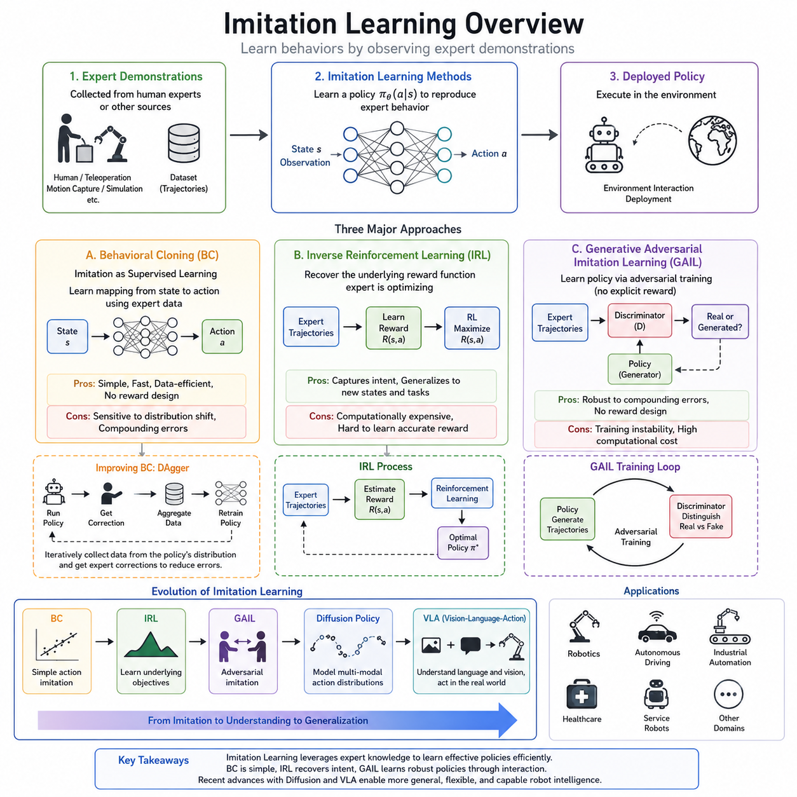
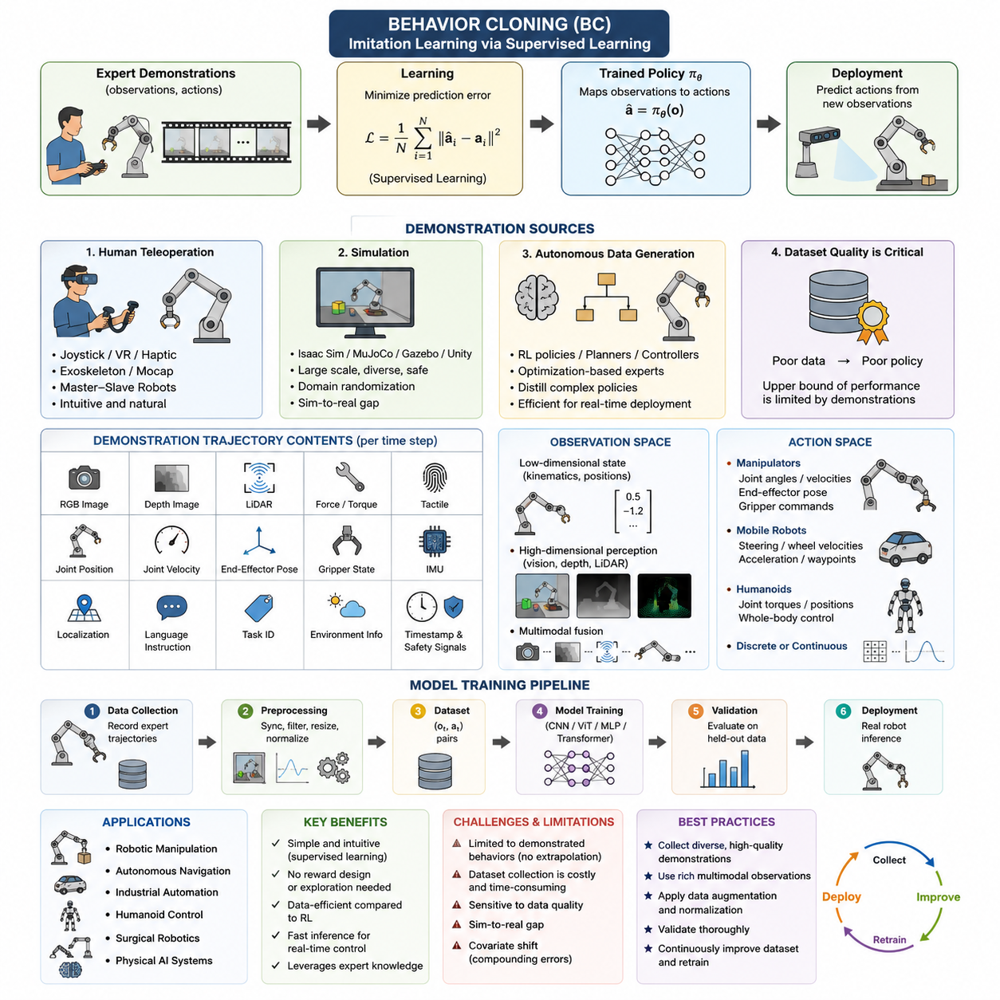
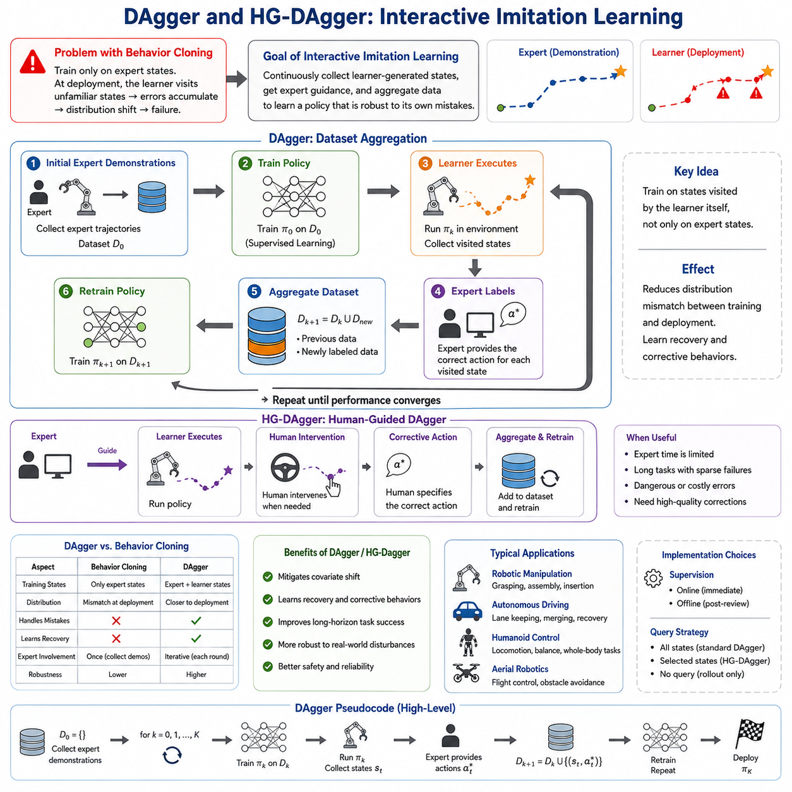
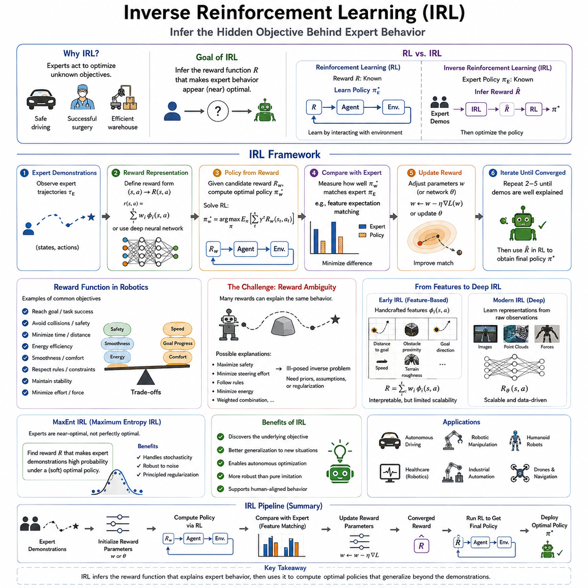
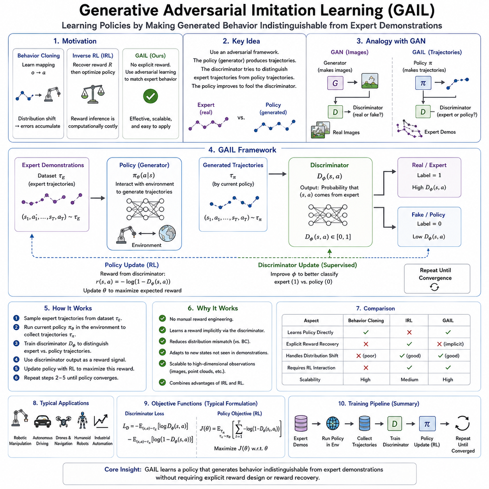
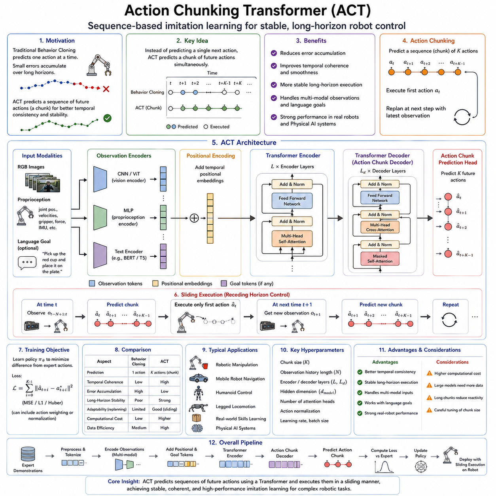
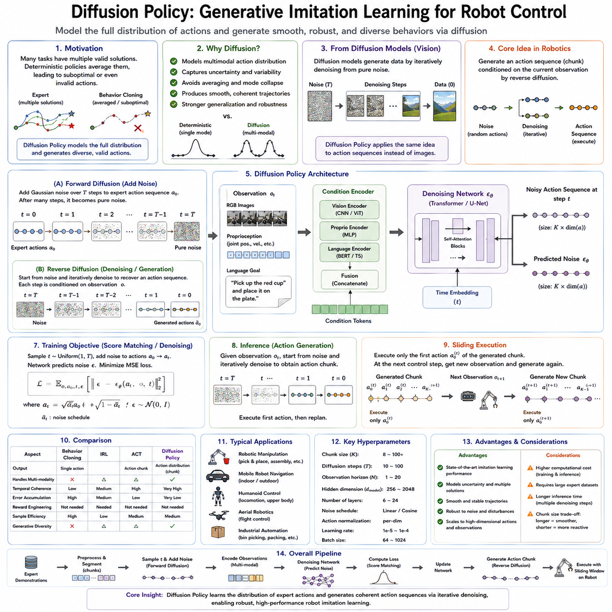
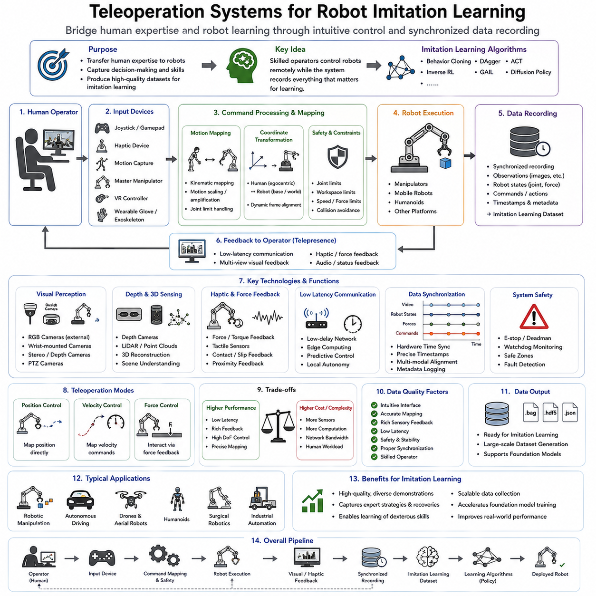
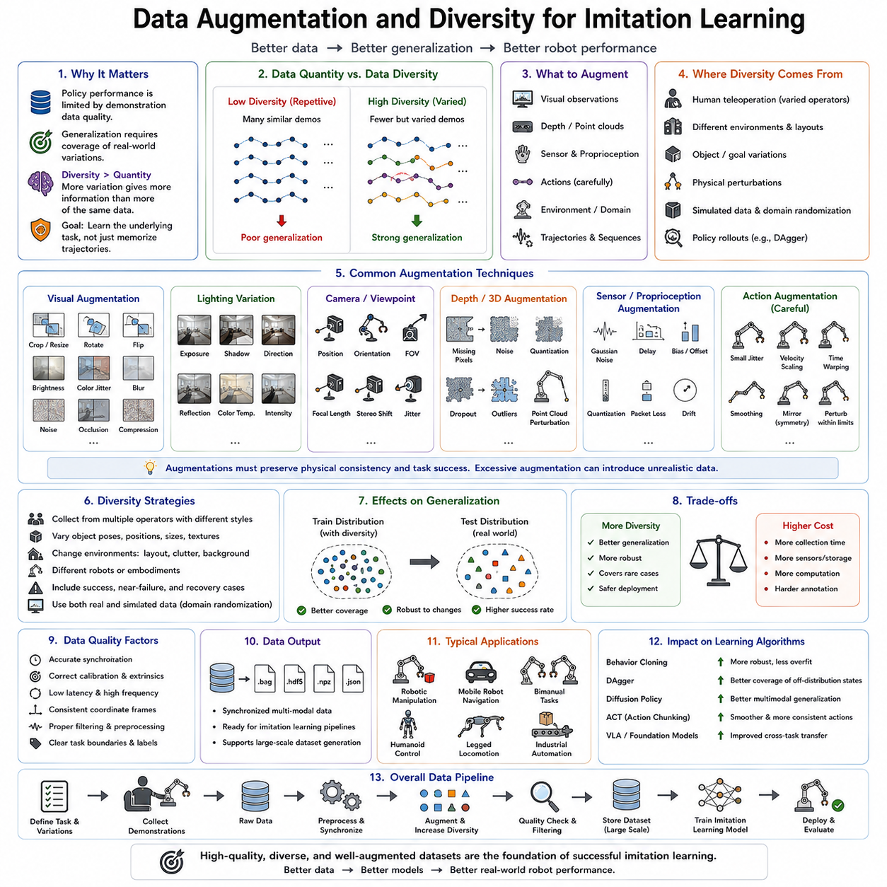
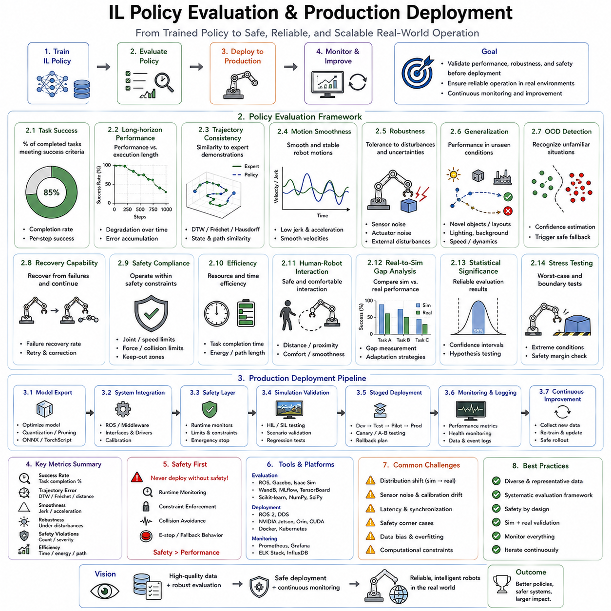

**Volume 19 Robot Machine Learning and AI**

# 06. Imitation Learning

## 06.01 Imitation Learning Overview BC IRL GAIL

{width="7.268055555555556in" height="7.268055555555556in"}

Imitation Learning is a machine learning paradigm that enables an intelligent agent to acquire behaviors by observing demonstrations performed by an expert rather than by discovering policies entirely through trial-and-error interactions with an environment. Instead of relying solely on manually designed reward functions or extensive reinforcement learning exploration, imitation learning transfers knowledge directly from expert trajectories to a learning system. This approach significantly reduces the amount of exploration required and often allows robots or autonomous systems to acquire practical skills much more rapidly. In robotics, autonomous driving, industrial automation, medical robotics, and many other domains where exploration can be expensive, dangerous, or time-consuming, imitation learning has become one of the most important techniques for accelerating policy development.

The fundamental objective of imitation learning is to approximate the decision-making capability of an expert. An expert demonstration typically consists of sequences of observations, states, actions, timestamps, and occasionally additional contextual information such as force measurements, language instructions, or environmental conditions. The learning algorithm attempts to discover a policy that produces actions similar to those selected by the expert when encountering comparable situations. Unlike supervised learning for classification or regression, imitation learning focuses on sequential decision making where each action influences future observations and future decisions.

One of the simplest and most widely used approaches in imitation learning is Behavioral Cloning (BC). Behavioral Cloning formulates imitation learning as a supervised learning problem. The expert demonstrations are treated as labeled datasets in which observations serve as inputs and expert actions become target outputs. A neural network is trained to minimize prediction errors between the predicted actions and expert actions using conventional supervised learning loss functions such as mean squared error for continuous actions or cross-entropy loss for discrete actions. Because of its conceptual simplicity, Behavioral Cloning has become the foundation for many modern robot learning systems.

Behavioral Cloning performs remarkably well when the training data sufficiently covers the operating conditions encountered during deployment. Robots trained through Behavioral Cloning can learn manipulation tasks, navigation policies, object grasping, locomotion, and many repetitive industrial operations. The computational efficiency of Behavioral Cloning also makes it attractive for large-scale training using extensive datasets collected from human operators or teleoperation systems. Since no reward engineering is required, the overall development process becomes significantly simpler than reinforcement learning.

Despite its advantages, Behavioral Cloning suffers from a well-known problem called covariate shift or distribution mismatch. During training, the model observes only expert-generated states. During execution, however, small prediction errors gradually accumulate, causing the robot to enter states that were never present in the expert demonstrations. Since the policy has never learned how to recover from these unfamiliar situations, the errors continue to grow, eventually leading to poor performance or task failure. This phenomenon is often referred to as compounding errors and represents one of the primary limitations of pure Behavioral Cloning.

Several techniques have been proposed to alleviate the distribution mismatch problem. Dataset Aggregation (DAgger) is among the most influential methods. Instead of training only once using an initial dataset, DAgger repeatedly executes the learned policy while requesting corrective actions from the expert whenever necessary. These newly collected recovery trajectories are added to the training dataset, allowing the policy to gradually learn how to operate under its own state distribution. Through iterative data collection and policy refinement, DAgger substantially improves robustness while preserving the simplicity of supervised learning.

Inverse Reinforcement Learning (IRL) approaches imitation learning from an entirely different perspective. Rather than directly copying expert actions, IRL assumes that expert behavior is generated by optimizing an unknown reward function. The objective is therefore to recover this hidden reward function from demonstrations. Once the reward function has been estimated, a reinforcement learning algorithm can optimize a policy that maximizes the recovered reward. This formulation attempts to capture the underlying intentions or objectives of the expert instead of merely reproducing observed actions.

The motivation behind Inverse Reinforcement Learning arises from the observation that expert demonstrations are often only one of many optimal solutions to a task. Human experts may perform slightly different trajectories while pursuing the same underlying objective. Direct action imitation may overfit to these specific trajectories, whereas recovering the latent reward function enables the learning system to generalize more naturally to previously unseen environments. Consequently, IRL is frequently applied when adaptability and generalization are more important than exact trajectory replication.

Many classical Inverse Reinforcement Learning algorithms formulate reward estimation as an optimization problem over feature expectations. The recovered reward function should explain why expert trajectories consistently outperform alternative trajectories. Various optimization methods including maximum margin optimization, Bayesian inference, entropy regularization, and probabilistic graphical models have been introduced to improve reward estimation accuracy. Although these methods often require significantly greater computational resources than Behavioral Cloning, they provide richer representations of task objectives.

Maximum Entropy Inverse Reinforcement Learning introduced an important probabilistic framework that models expert trajectories as distributions maximizing entropy while remaining consistent with observed demonstrations. This formulation avoids overly deterministic reward estimation and allows multiple valid behaviors to coexist. The resulting reward functions often generalize better across diverse environments and provide smoother optimization landscapes for downstream reinforcement learning.

Generative Adversarial Imitation Learning (GAIL) represents another major milestone in imitation learning. Inspired by Generative Adversarial Networks, GAIL eliminates the explicit reward recovery step required in traditional IRL. Instead, GAIL trains two competing neural networks simultaneously: a policy network that generates behaviors and a discriminator that distinguishes expert trajectories from generated trajectories. The policy continuously improves until the discriminator can no longer reliably differentiate between expert behavior and learned behavior.

The adversarial learning process allows GAIL to implicitly learn an effective reward signal without manually specifying one. The discriminator essentially functions as an adaptive reward estimator that encourages the generated policy to produce behaviors increasingly similar to expert demonstrations. Because the reward is learned automatically through adversarial interaction, GAIL has demonstrated strong performance across numerous continuous control benchmarks, robotic locomotion tasks, and manipulation problems.

Compared with Behavioral Cloning, GAIL generally exhibits greater robustness against compounding errors because policy optimization occurs through interactions with the environment. Unlike supervised learning, the policy experiences the consequences of its own actions during training, allowing it to learn recovery behaviors naturally. This interaction often leads to improved long-term decision making, particularly in sequential control tasks where early mistakes significantly influence future states.

However, GAIL also introduces additional computational complexity. Training involves alternating optimization between the discriminator and policy networks while repeatedly interacting with the environment. Stability issues similar to those encountered in Generative Adversarial Networks may arise, including mode collapse, oscillatory training dynamics, or discriminator imbalance. Careful hyperparameter tuning and sufficient computational resources are therefore necessary to achieve reliable convergence.

Behavioral Cloning, Inverse Reinforcement Learning, and GAIL each occupy different positions within the broader imitation learning landscape. Behavioral Cloning emphasizes simplicity, computational efficiency, and direct policy approximation. Inverse Reinforcement Learning focuses on uncovering latent task objectives that explain expert behavior. GAIL combines ideas from adversarial learning and reinforcement learning to learn policies without explicitly recovering reward functions. Each method addresses different assumptions regarding expert demonstrations, environmental interactions, and desired generalization capabilities.

Recent advances increasingly integrate imitation learning with foundation models, Vision-Language Models, Vision-Language-Action models, diffusion policies, and transformer architectures. Large-scale multimodal datasets containing images, videos, language instructions, robot trajectories, and force information enable policies to acquire highly transferable representations before task-specific fine-tuning. Instead of learning isolated tasks independently, modern imitation learning systems seek to develop reusable behavioral priors that support rapid adaptation to new environments with minimal additional demonstrations.

Diffusion-based policy learning has recently emerged as a powerful extension of Behavioral Cloning. Rather than directly predicting deterministic actions, diffusion models generate action sequences through iterative denoising processes that better capture multimodal action distributions. These methods improve trajectory smoothness, increase robustness, and naturally represent multiple valid action strategies for the same task. Such characteristics are particularly valuable for dexterous manipulation and complex robotic assembly operations where numerous successful motion patterns exist.

Vision-Language-Action models further extend imitation learning by incorporating natural language instructions alongside visual observations. Human demonstrations are paired with textual descriptions that specify task intentions, object relationships, or high-level goals. During inference, the robot interprets language commands while simultaneously reasoning about visual inputs and generating action sequences. This multimodal capability significantly expands the flexibility of imitation learning beyond fixed task definitions.

Imitation learning plays an increasingly important role in autonomous robotics because collecting expert demonstrations is often significantly safer and more efficient than designing comprehensive reward functions. Human operators can demonstrate complex manipulation tasks through teleoperation, kinesthetic teaching, virtual reality interfaces, motion capture systems, or digital twin simulations. These demonstrations become valuable datasets that continuously improve robot capabilities through repeated learning and refinement.

Simulation environments have also become essential components of modern imitation learning pipelines. Expert demonstrations generated inside high-fidelity simulators can be combined with real-world data to produce scalable datasets while reducing hardware wear and operational costs. Domain randomization, physics randomization, and sim-to-real adaptation techniques help bridge the reality gap, allowing learned policies to transfer effectively from simulated environments to physical robots.

The future of imitation learning will likely involve increasingly seamless integration with reinforcement learning, world models, foundation models, hierarchical planning, and lifelong learning systems. Rather than treating Behavioral Cloning, Inverse Reinforcement Learning, and GAIL as isolated algorithms, future autonomous systems will combine their complementary strengths. Behavioral Cloning will provide efficient policy initialization, Inverse Reinforcement Learning will infer high-level objectives, and adversarial imitation methods such as GAIL will refine behaviors through continuous interaction. Together, these approaches form a comprehensive framework for enabling robots to learn efficiently from human expertise while progressively improving through autonomous experience, ultimately accelerating the realization of highly capable, adaptable, and trustworthy intelligent robotic systems.

## 06.02 Behavior Cloning Data Collection and Training [w/Code]

{width="7.268055555555556in" height="7.268055555555556in"}

Behavior Cloning (BC) is the most direct and widely adopted approach to imitation learning because it transforms the problem of learning robot behavior into a supervised learning task. Instead of discovering an optimal policy through trial-and-error interactions with an environment, a behavior cloning system learns by observing demonstrations generated by an expert. Every demonstration consists of paired observations and actions, allowing the learning algorithm to approximate the mapping from perceived states to appropriate control commands. Once trained, the policy predicts actions directly from incoming observations without explicitly reasoning about rewards or future returns. This simplicity makes Behavior Cloning an attractive starting point for robotic manipulation, autonomous navigation, industrial automation, humanoid control, surgical robotics, and many modern Physical AI systems.

The central assumption behind Behavior Cloning is that the demonstrations contain sufficient information for reproducing the desired behavior. If an expert consistently performs a task successfully, then learning the statistical relationship between observations and actions should allow a robot to imitate similar behaviors under comparable conditions. The learning objective therefore becomes minimizing the difference between predicted actions and demonstrated actions across the training dataset. This formulation resembles image classification, object detection, or regression problems commonly encountered in supervised machine learning, except that the output represents continuous or discrete control commands rather than semantic labels.

Data collection is the foundation of successful Behavior Cloning. Unlike reinforcement learning, where experience is generated automatically through exploration, imitation learning depends almost entirely on the quality of demonstrations. Poor demonstrations inevitably produce poor policies regardless of model architecture or optimization technique. Consequently, collecting expert trajectories is often the most expensive and time-consuming component of an imitation learning project. The dataset determines the upper bound of policy performance because the model cannot reliably reproduce behaviors that never appear in the demonstrations.

Robot demonstrations may originate from several different sources. Human teleoperation remains the most common approach because it allows experienced operators to perform tasks naturally while the robot records observations, sensor measurements, internal states, and executed actions. Teleoperation may be implemented through joysticks, VR controllers, haptic devices, exoskeletons, motion capture systems, or master-slave robotic manipulators. Each method offers different levels of precision, latency, ergonomics, and operator workload. High-quality teleoperation systems minimize delay and maximize intuitive control, enabling demonstrations that closely resemble expert execution.

Simulation provides another important source of demonstrations. Physics engines such as Isaac Sim, MuJoCo, Gazebo, or Unity allow experts or scripted controllers to generate large quantities of trajectories without risking hardware damage. Simulation enables rapid iteration across diverse environments, object configurations, lighting conditions, and robot dynamics. Synthetic demonstrations are particularly valuable when real-world data collection is expensive or hazardous. However, simulation-generated trajectories often suffer from the sim-to-real gap because simulated physics, sensing, and environmental variability cannot perfectly match reality. Domain randomization and realistic simulation techniques help reduce this discrepancy.

Autonomous data generation also contributes to modern Behavior Cloning datasets. Existing reinforcement learning policies, optimization algorithms, classical planners, or industrial controllers may serve as experts whose trajectories become training data for later supervised learning. This approach is especially useful when highly optimized controllers already exist but are computationally expensive during deployment. Behavior Cloning can distill these sophisticated decision processes into lightweight neural networks suitable for real-time inference on edge computing platforms.

A demonstration trajectory generally contains considerably more information than raw control commands. At every time step, the dataset may include RGB images, depth images, LiDAR scans, force-torque measurements, tactile sensor readings, joint positions, joint velocities, end-effector poses, gripper states, proprioceptive measurements, inertial sensor outputs, localization estimates, language instructions, task identifiers, environmental metadata, timestamps, and safety signals. The richness of multimodal observations allows the learned policy to integrate complementary information during decision making.

The definition of the observation space plays a crucial role in policy performance. Some tasks can be solved entirely from low-dimensional state vectors containing robot kinematics and object positions. Other tasks require high-dimensional visual perception because object geometry, texture, lighting, and occlusion influence decision making. Vision-based Behavior Cloning has therefore become increasingly important with advances in convolutional neural networks, Vision Transformers, and multimodal foundation models. Instead of manually engineering features, modern systems learn hierarchical visual representations directly from raw sensor inputs.

The action space is equally important. Industrial manipulators often predict joint angle commands, joint velocity commands, Cartesian end-effector displacements, or gripper opening values. Mobile robots may predict steering angles, wheel velocities, acceleration commands, or waypoint trajectories. Humanoid robots frequently output coordinated whole-body joint trajectories involving dozens of degrees of freedom. Selecting an appropriate action representation influences both learning stability and deployment robustness. Low-level actions offer precise control but require high-frequency prediction, whereas higher-level actions reduce prediction frequency but rely on downstream controllers for execution.

Synchronization between observations and actions is another essential aspect of data collection. Cameras, LiDAR sensors, IMUs, force sensors, and joint encoders typically operate at different sampling frequencies. Without accurate timestamp synchronization, the learning algorithm may associate outdated observations with future actions, producing inconsistent mappings that degrade policy quality. Modern robotic systems therefore employ synchronized clocks, hardware triggers, or Precision Time Protocol synchronization to align multimodal sensor streams before training.

After demonstrations have been collected, preprocessing prepares the dataset for supervised learning. Sensor calibration removes systematic measurement errors while filtering techniques reduce noise. Missing observations may be interpolated or discarded depending on their frequency and significance. Images are resized, normalized, and optionally compressed for efficient storage. Joint trajectories may be smoothed to eliminate small operator-induced oscillations that do not represent meaningful control behavior. Coordinate frames are standardized to ensure consistency across different recording sessions.

Temporal segmentation further improves dataset quality. Long demonstrations are often divided into shorter task segments representing meaningful behavioral units such as reaching, grasping, lifting, transporting, inserting, or placing. Segment-level training enables more efficient optimization and facilitates curriculum learning, where simpler behaviors are mastered before more complex tasks are introduced. Temporal segmentation also simplifies dataset balancing because overrepresented behaviors can be downsampled while rare behaviors receive additional emphasis.

Data diversity is one of the strongest determinants of generalization performance. If demonstrations only include a narrow range of object positions, lighting conditions, robot speeds, or environmental layouts, the learned policy will likely fail when encountering unseen situations. Effective datasets therefore intentionally introduce variation across initial conditions, object geometries, backgrounds, camera viewpoints, sensor noise, operator styles, and environmental disturbances. Such diversity teaches the neural network to extract invariant task-relevant features rather than memorizing specific trajectories.

The policy network itself may adopt many architectures depending on task complexity. Feedforward multilayer perceptrons remain effective for low-dimensional control problems with structured state vectors. Convolutional neural networks dominate image-based manipulation tasks, while Vision Transformers provide improved global feature extraction for complex visual scenes. Recurrent neural networks, Long Short-Term Memory networks, Gated Recurrent Units, and Transformer sequence models incorporate temporal dependencies, enabling the policy to reason about motion history rather than individual observations alone. Recent Physical AI systems increasingly employ multimodal Transformer architectures capable of jointly processing vision, proprioception, language, and force sensing.

Training Behavior Cloning policies follows the standard supervised learning pipeline. Mini-batches of observation-action pairs are sampled from the dataset, predictions are generated by the neural network, and optimization algorithms such as Stochastic Gradient Descent or Adam minimize the discrepancy between predicted and demonstrated actions. Continuous control problems commonly use Mean Squared Error or Smooth L1 loss, while discrete action spaces employ cross-entropy loss. Some systems combine multiple objectives including action prediction, trajectory smoothness, latent consistency, or auxiliary perception tasks to improve representation learning.

Regularization techniques help prevent overfitting, particularly when demonstration datasets are limited. Weight decay discourages unnecessarily large parameters, dropout improves robustness by randomly disabling neurons during training, and data augmentation artificially increases dataset diversity. Image augmentation techniques include random cropping, color jitter, Gaussian noise, brightness variation, blur, and geometric transformations. For robot state vectors, random perturbations and simulated sensor noise improve robustness against measurement uncertainty encountered during deployment.

Behavior Cloning exhibits remarkable sample efficiency compared with reinforcement learning because every demonstration contributes directly to parameter optimization. The robot does not waste time exploring ineffective behaviors or dangerous actions. This property makes Behavior Cloning particularly attractive for safety-critical applications where random exploration is unacceptable. Medical robots, industrial manipulators, warehouse automation systems, and autonomous inspection robots frequently rely on imitation learning during initial policy development for precisely this reason.

Despite its simplicity, Behavior Cloning suffers from a well-known limitation called covariate shift. During training, the policy observes only expert-generated states. During deployment, however, small prediction errors accumulate and gradually move the robot into unfamiliar states that never appeared in the demonstration dataset. Since the policy has not learned appropriate actions for these new situations, errors continue to compound, often leading to catastrophic task failure. This phenomenon explains why policies exhibiting extremely low training error may nevertheless perform poorly during long-horizon execution.

Numerous techniques have been developed to mitigate covariate shift. Data augmentation broadens the distribution of observations seen during training. Noise injection intentionally perturbs demonstrations so the policy learns recovery behaviors. Interactive imitation learning methods such as DAgger repeatedly collect additional demonstrations from states visited by the learned policy itself, gradually aligning the training distribution with deployment conditions. Hybrid systems further combine Behavior Cloning with reinforcement learning, allowing policies to refine demonstrated behaviors through autonomous experience while preserving expert knowledge.

Evaluation of Behavior Cloning extends beyond prediction accuracy on held-out datasets. Offline metrics such as Mean Squared Error measure agreement with expert actions but often correlate poorly with actual task performance. Real-world evaluation therefore focuses on success rate, task completion time, trajectory smoothness, collision frequency, energy efficiency, robustness under disturbances, and recovery capability. Closed-loop deployment provides the most reliable assessment because policy decisions influence future observations throughout execution.

Industrial deployment introduces additional engineering considerations. Inference latency must satisfy real-time control requirements, particularly for high-speed manipulation or dynamic locomotion. Edge deployment frequently requires model compression through quantization, pruning, or knowledge distillation. Runtime safety monitors supervise policy outputs and intervene whenever predicted actions violate predefined safety constraints. Continuous monitoring detects distribution shifts after deployment, enabling periodic retraining with newly collected demonstrations as environments evolve over time.

Recent developments have significantly expanded the capabilities of Behavior Cloning. Large-scale robot datasets containing millions of demonstrations now enable foundation policies capable of generalizing across many tasks, environments, and robot platforms. Vision-language-action models integrate natural language instructions directly into policy learning, allowing robots to interpret high-level human commands while executing low-level motor behaviors. Diffusion-based action generation, Action Chunking Transformers, and hierarchical policy architectures further improve long-horizon planning, multimodal reasoning, and manipulation dexterity. Rather than replacing Behavior Cloning, these advances extend its original supervised learning framework into increasingly capable and scalable forms.

Behavior Cloning remains one of the most practical learning paradigms for modern robotics because it combines conceptual simplicity, efficient training, and direct utilization of expert knowledge. Although challenges such as covariate shift, demonstration quality, and generalization continue to motivate ongoing research, Behavior Cloning serves as the foundation upon which many advanced imitation learning algorithms are built. As robot foundation models continue to expand through large-scale multimodal datasets, high-quality demonstration collection and carefully designed training pipelines will remain essential for developing reliable, adaptable, and production-ready intelligent robotic systems.

## 06.03 DAgger and HG DAgger Interactive IL [w/Code]

{width="7.268055555555556in" height="7.268055555555556in"}

Behavior Cloning provides one of the simplest pathways to learning robot policies from expert demonstrations, yet its practical deployment reveals a fundamental weakness. The policy is trained exclusively on states visited by the expert, but during autonomous execution it inevitably encounters states generated by its own imperfect decisions. Small prediction errors accumulate over time, causing the robot to drift away from the expert trajectory and enter situations that were never represented in the training dataset. Since the policy has never learned appropriate actions for these unfamiliar states, the errors compound further, eventually leading to task failure. This phenomenon, commonly referred to as covariate shift or distribution mismatch, becomes increasingly severe as task duration and environmental complexity increase. Interactive imitation learning was developed specifically to address this limitation by allowing the learning process to continuously incorporate new experiences generated by the learner itself rather than relying solely on the original demonstration dataset.

Dataset Aggregation, widely known as DAgger, represents one of the most influential algorithms in interactive imitation learning. Instead of treating demonstrations as a fixed dataset, DAgger repeatedly updates the training data by combining expert supervision with the learner\'s own exploration. The central insight is that the policy should not only learn from ideal expert trajectories but also receive expert guidance in situations where its own behavior has deviated from those trajectories. By exposing the learner to its own mistakes during training, DAgger significantly reduces the distribution mismatch between training and deployment, producing policies that remain robust during long-horizon autonomous execution.

The iterative nature of DAgger distinguishes it from traditional Behavior Cloning. The process begins with a conventional demonstration dataset collected entirely from an expert operator. A policy is first trained using standard supervised learning to imitate these demonstrations. Rather than deploying this policy directly, the algorithm allows the learned policy to execute the task autonomously. During execution, the expert observes every state visited by the learner and records the action that should ideally have been taken in that state. These newly labeled state-action pairs are then merged with the original dataset, and the policy is retrained using the expanded collection of demonstrations. This cycle repeats over multiple iterations until policy performance converges.

One of the most important conceptual differences between Behavior Cloning and DAgger lies in the source of training states. Behavior Cloning only observes states generated by an expert, while DAgger intentionally gathers states generated by the learner itself. Because the learner inevitably makes mistakes, these states often include recovery situations, near-failure conditions, unexpected object configurations, unusual viewpoints, and partial task failures. Expert annotations on such states teach the policy how to recover instead of merely how to avoid failure under ideal circumstances. As a result, DAgger learns not only nominal behavior but also corrective behavior.

From a statistical perspective, DAgger transforms the learning distribution. In supervised learning, the training data follows the expert policy distribution. During deployment, however, the robot follows its own policy distribution. If these distributions differ significantly, prediction errors become unavoidable. DAgger gradually shifts the training distribution toward the deployment distribution by repeatedly incorporating learner-generated experiences. As more iterations are completed, the discrepancy between the two distributions decreases, allowing the learned policy to operate reliably in situations that naturally arise during autonomous execution.

Interactive supervision is the defining characteristic of DAgger. Unlike fully autonomous learning, expert involvement continues throughout the training process. The expert may intervene continuously by labeling every visited state, or alternatively review recorded trajectories offline and provide corrective actions afterward. Online supervision offers immediate correction but requires continuous operator attention. Offline annotation reduces operator workload but delays policy improvement until additional training cycles have been completed. The appropriate strategy depends on task complexity, annotation cost, and available human resources.

Robotic manipulation provides an excellent illustration of DAgger\'s advantages. Consider a robot learning to grasp household objects from cluttered environments. Behavior Cloning demonstrations may consistently approach each object from ideal viewing angles with minimal occlusion. During deployment, however, small localization errors may cause the gripper to approach from slightly different positions. These deviations change the camera viewpoint, alter object visibility, and modify the subsequent sequence of observations. Without recovery demonstrations, the robot gradually drifts farther from successful grasp configurations. DAgger captures these off-distribution states during autonomous execution, enabling the expert to demonstrate appropriate corrective actions. After several iterations, the policy learns robust recovery behaviors that substantially improve grasp success rates.

Autonomous driving presents another compelling example. Human demonstrations generally remain near the center of traffic lanes while avoiding dangerous situations. A learned policy, however, may occasionally drift toward lane boundaries due to small steering prediction errors. Rather than terminating the demonstration, DAgger allows the vehicle to experience these slight deviations while an expert records corrective steering commands. Consequently, the policy learns how to recover from realistic driving errors instead of assuming perfect lane following at all times.

The effectiveness of DAgger depends heavily on the quality of expert feedback. Consistent annotations produce stable policy improvement, whereas inconsistent supervision introduces conflicting training signals. Expert fatigue, subjective preferences, delayed reactions, and individual operating styles may all influence demonstration quality. For industrial deployment, standardized operating procedures and carefully designed annotation protocols help ensure that expert corrections remain consistent across multiple operators and data collection sessions.

Another important design consideration involves balancing expert control and learner autonomy. Early iterations typically rely heavily on expert guidance because the initial policy makes frequent mistakes. As training progresses, the learner gradually assumes greater control while expert intervention becomes less frequent. Many implementations use a mixing coefficient that probabilistically selects either the expert policy or the learner policy during execution. This gradual transition prevents catastrophic failures while allowing the learner to generate increasingly diverse experiences.

Despite its advantages, DAgger introduces practical challenges. Continuous expert supervision can become expensive for large datasets or long-duration tasks. Every learner-generated trajectory requires expert annotation, increasing data collection costs relative to standard Behavior Cloning. Furthermore, repeated retraining after each aggregation cycle increases computational requirements. Nevertheless, these additional costs are often justified because DAgger typically requires fewer total demonstrations to achieve robust deployment performance compared with collecting an enormous static demonstration dataset.

Several extensions have been proposed to improve DAgger\'s efficiency. SafeDAgger introduces a safety policy that predicts whether the learner can safely execute the current state or whether expert intervention is required. Instead of requesting expert supervision continuously, the system selectively queries the expert only when confidence is low or potential failure is likely. This selective querying significantly reduces annotation workload while maintaining high policy quality.

Another family of approaches incorporates uncertainty estimation into interactive learning. Bayesian neural networks, ensemble models, Monte Carlo dropout, and probabilistic prediction methods estimate confidence alongside action predictions. States with high uncertainty become candidates for expert annotation, while familiar states require no additional supervision. Active learning strategies built upon uncertainty estimation therefore allocate human effort more efficiently by focusing only on informative samples.

HG-DAgger, commonly known as Human-Gated DAgger, extends the original algorithm by allowing the human expert to decide explicitly when intervention should occur. Rather than continuously labeling every learner state, the human monitors robot behavior and takes control only when necessary. The gate between autonomous execution and expert intervention is controlled directly by human judgment rather than predefined switching rules. This modification substantially improves practicality for real robotic systems because the expert no longer needs to supervise every action continuously.

The concept of human gating recognizes that not all learner errors require immediate correction. Minor deviations may resolve naturally without intervention, while more serious mistakes threaten task completion or safety. Human operators are remarkably skilled at recognizing which situations demand assistance and which situations allow continued autonomous exploration. HG-DAgger leverages this intuitive human decision-making process, reducing unnecessary interventions while preserving safety during learning.

During HG-DAgger training, the robot operates autonomously whenever the expert considers the current behavior acceptable. Once the expert predicts that failure is becoming likely, manual control immediately replaces autonomous execution. The expert guides the robot back toward a safe and successful trajectory while all observations and corrective actions are recorded. These intervention segments become valuable additions to the training dataset because they explicitly represent recovery behavior rather than ideal task execution alone.

One significant advantage of HG-DAgger lies in annotation efficiency. Since expert demonstrations focus primarily on difficult situations, the resulting dataset contains proportionally more informative examples than standard Behavior Cloning datasets. Easy states that the learner already handles correctly require little or no additional supervision. Consequently, human effort is concentrated on precisely those situations where learning remains incomplete.

Safety represents another major motivation for HG-DAgger. Industrial manipulators, autonomous vehicles, mobile robots, surgical systems, and collaborative robots often operate in environments where failures carry significant physical or economic consequences. Allowing unrestricted learner exploration may damage equipment, disrupt production, or endanger nearby humans. Human-gated intervention prevents catastrophic failures while still exposing the learner to challenging situations close to operational boundaries.

The effectiveness of HG-DAgger depends upon the responsiveness of the human supervisor. Low-latency teleoperation interfaces, intuitive control devices, high-quality visual feedback, and reliable communication channels enable rapid intervention before failures become irreversible. Virtual reality interfaces, haptic controllers, wearable devices, and digital twin visualization systems increasingly support efficient human supervision in industrial environments.

Human factors play an important role in interactive imitation learning. Operator workload, cognitive fatigue, reaction time, situational awareness, and interface usability all influence demonstration quality. Long annotation sessions may reduce consistency, while complex robot behaviors increase cognitive demands. Modern data collection platforms therefore incorporate ergonomic interface design, visualization tools, automated logging, replay capabilities, and annotation assistance to reduce operator burden.

Interactive imitation learning integrates naturally with foundation models and modern Physical AI architectures. Large pretrained perception models already provide robust visual representations, allowing DAgger to focus primarily on refining decision-making rather than learning perception from scratch. Vision-language-action models similarly benefit from interactive correction because human supervisors can provide both physical demonstrations and linguistic explanations describing desired behavior. These multimodal corrections enrich policy learning beyond simple action supervision.

Simulation has become an increasingly valuable component of DAgger training. Early aggregation cycles often occur entirely within high-fidelity simulators where mistakes incur no physical cost. As policy performance improves, training gradually transitions toward real hardware. This sim-to-real curriculum reduces expert workload while minimizing risks associated with immature policies. Domain randomization, digital twins, and realistic sensor simulation further enhance transferability between simulated and physical environments.

Interactive imitation learning also complements reinforcement learning. Behavior Cloning or DAgger frequently provides an initial policy capable of solving basic tasks safely and efficiently. Reinforcement learning subsequently fine-tunes the policy through autonomous optimization, discovering behaviors beyond those demonstrated by human experts. Conversely, reinforcement learning policies can generate autonomous experiences that later become candidates for expert correction through DAgger, creating a mutually reinforcing learning cycle.

Evaluating DAgger extends beyond measuring prediction accuracy. Researchers typically assess task completion rate, cumulative reward, intervention frequency, recovery success, trajectory stability, collision avoidance, robustness under disturbances, sample efficiency, and generalization to unseen environments. Human-centered metrics such as annotation time, intervention workload, operator fatigue, and supervision efficiency also become important because interactive learning explicitly incorporates human participation.

Industrial deployment requires careful integration of DAgger within broader MLOps and robotics development pipelines. Demonstration recording systems, annotation interfaces, dataset versioning, automated retraining pipelines, policy validation procedures, simulation environments, and deployment monitoring all contribute to continuous policy improvement. Each DAgger iteration effectively becomes another stage in an ongoing data-centric development cycle rather than a single offline training event.

Recent research increasingly explores autonomous assistance for expert annotation. Foundation models can propose candidate corrections, estimate intervention necessity, summarize failure causes, and organize demonstration datasets before human review. Although final supervision remains under human control, AI-assisted annotation tools significantly reduce manual effort while improving consistency across large-scale robot learning projects.

DAgger and HG-DAgger fundamentally changed the philosophy of imitation learning by recognizing that learning should continue after the initial demonstrations have been collected. Instead of assuming that expert trajectories fully characterize the task, interactive imitation learning embraces the reality that autonomous systems inevitably encounter unforeseen situations during deployment. By repeatedly incorporating learner-generated experiences and expert corrections, these algorithms produce policies that are significantly more robust, adaptable, and reliable than those obtained through static demonstration datasets alone. As robotic systems become increasingly autonomous and operate in more dynamic environments, interactive imitation learning will remain a cornerstone methodology for developing safe, resilient, and continually improving intelligent robots.

## 06.04 Inverse Reinforcement Learning IRL MaxEnt [w/Code]

{width="7.268055555555556in" height="7.268055555555556in"}

Inverse Reinforcement Learning (IRL) extends the idea of imitation learning by addressing a more fundamental question than simply copying expert behavior. Rather than learning a policy that directly maps observations to actions, IRL attempts to infer the hidden objective that motivates expert decisions. In many real-world tasks, experts perform actions because they are implicitly optimizing some unknown reward function. Human drivers maintain safe distances because they value safety, surgeons manipulate instruments because they seek successful operations while minimizing tissue damage, and warehouse robots choose efficient paths because they balance travel time, collision avoidance, and energy consumption. These objectives are rarely stated explicitly. Instead, they are embedded within demonstrations. Inverse Reinforcement Learning seeks to recover these hidden preferences so that an autonomous agent can optimize them independently.

The distinction between Reinforcement Learning and Inverse Reinforcement Learning is fundamental. In conventional Reinforcement Learning, the reward function is assumed to be known, while the optimal policy must be learned through interaction with the environment. In Inverse Reinforcement Learning, the opposite assumption is made. The expert policy is observed, but the reward function remains unknown. The learning system must therefore infer which reward function would make the demonstrated behavior appear optimal or nearly optimal. Once the reward has been estimated, standard reinforcement learning algorithms can compute policies that maximize this inferred objective.

This separation between reward learning and policy optimization provides several important advantages. Behavior Cloning directly imitates demonstrated actions and therefore remains limited to situations similar to those observed during training. IRL, however, attempts to discover the underlying objective itself. Once the objective is known, the resulting policy can adapt to new situations that were never demonstrated while still pursuing the same high-level intent. Consequently, IRL often exhibits superior generalization when environmental conditions differ from those present during data collection.

The reward function occupies a central role in IRL. A reward function assigns numerical values to states, actions, or state-action transitions, representing their desirability. Positive rewards encourage behaviors while negative rewards discourage undesirable outcomes. In robotics, rewards frequently incorporate multiple competing objectives simultaneously. An autonomous mobile robot may seek to minimize travel time while avoiding obstacles, conserving battery power, respecting safety margins, maintaining passenger comfort, and reaching its destination accurately. Human experts naturally balance these objectives without explicitly assigning numerical weights. IRL attempts to reconstruct this hidden tradeoff directly from demonstrations.

One of the fundamental challenges of IRL arises from reward ambiguity. Multiple reward functions may explain exactly the same demonstrated behavior. Consider a robot navigating around an obstacle. The observed trajectory could result from maximizing safety, minimizing collision probability, minimizing steering effort, following traffic rules, or optimizing some weighted combination of all these objectives. Since demonstrations alone cannot uniquely determine the true reward function, IRL faces an inherently ill-posed inverse problem. Additional assumptions, prior knowledge, or regularization techniques become necessary to identify meaningful solutions.

Early formulations of IRL approached this ambiguity by searching for reward functions that made expert demonstrations optimal according to classical reinforcement learning principles. These methods often relied upon handcrafted feature representations describing important aspects of the environment. Features might include distance to obstacles, proximity to the goal, energy consumption, object stability, terrain roughness, or interaction forces. The reward function was then expressed as a weighted combination of these features. Learning reduced to estimating the unknown feature weights that best explained expert behavior.

Feature engineering played a critical role in early IRL systems. Carefully designed features allowed reward functions to remain interpretable while reducing computational complexity. However, manually constructing features required extensive domain expertise and often limited scalability across diverse robotic tasks. Modern deep learning approaches increasingly replace handcrafted features with neural network representations learned directly from raw observations such as images, point clouds, force measurements, and proprioceptive signals. Deep IRL therefore combines representation learning with reward inference, allowing the system to discover task-relevant features automatically.

The optimization process underlying IRL typically alternates between reward estimation and policy computation. Given a candidate reward function, a reinforcement learning algorithm computes the corresponding optimal policy. The predicted policy is then compared with expert demonstrations. If the generated behavior differs significantly from the expert, the reward function is updated. This iterative process continues until the generated policy sufficiently resembles the demonstrated behavior. Although conceptually straightforward, repeated policy optimization makes IRL computationally expensive, particularly for high-dimensional robotic environments.

Maximum Entropy Inverse Reinforcement Learning, commonly known as MaxEnt IRL, was introduced to address one of the most significant weaknesses of classical IRL. Traditional approaches often assumed that experts always behave perfectly optimally. Real humans, however, rarely produce identical trajectories when repeating the same task. Small variations arise naturally due to uncertainty, imperfect sensing, reaction time, individual preferences, fatigue, or stochastic environmental influences. Classical IRL struggled to explain such variability because deterministic optimality assumptions forced all demonstrations toward a single ideal trajectory.

Maximum Entropy IRL introduces a probabilistic interpretation of expert behavior. Instead of assuming that the expert always chooses the single optimal trajectory, MaxEnt assumes that trajectories with higher rewards become exponentially more likely but not absolutely certain. Demonstrations are therefore treated as samples drawn from a probability distribution over trajectories. High-reward trajectories appear frequently, while lower-reward trajectories remain possible but increasingly unlikely. This probabilistic formulation better reflects realistic human decision-making and naturally accommodates demonstration variability.

The principle of maximum entropy originates from information theory. Among all probability distributions consistent with the observed data, the maximum entropy distribution assumes the least additional information beyond the available evidence. In the context of IRL, this principle avoids introducing arbitrary biases toward particular trajectories that are not justified by the demonstrations themselves. Consequently, MaxEnt IRL produces reward functions that explain expert behavior while remaining maximally uncertain about unobserved aspects of the task.

Entropy itself measures uncertainty or diversity within a probability distribution. High entropy indicates that multiple trajectories remain plausible, whereas low entropy concentrates probability on only a few trajectories. MaxEnt IRL intentionally preserves high entropy whenever demonstrations do not strongly favor one particular solution. This characteristic prevents overconfident reward estimation and often improves generalization to previously unseen environments.

The probabilistic framework of MaxEnt IRL offers another significant advantage when demonstrations contain noise. Human operators occasionally make mistakes, hesitate, perform corrective actions, or choose slightly suboptimal trajectories. Rather than treating these behaviors as contradictions, MaxEnt naturally interprets them as lower-probability samples generated from the same underlying reward function. Consequently, reward estimation becomes substantially more robust against imperfect demonstrations than deterministic IRL formulations.

Trajectory probability forms the mathematical foundation of MaxEnt IRL. Each possible trajectory receives a probability proportional to the exponential of its accumulated reward. Higher cumulative reward increases probability exponentially, but no trajectory is assigned absolute certainty. During optimization, the reward function is adjusted so that expert demonstrations become statistically more probable than alternative trajectories. This objective transforms reward learning into a likelihood maximization problem compatible with modern optimization techniques.

Maximum likelihood estimation plays an essential role in training MaxEnt IRL models. The algorithm seeks reward parameters that maximize the likelihood of observing the demonstrated trajectories under the induced probability distribution. Gradient-based optimization methods efficiently estimate these parameters by comparing feature expectations between expert demonstrations and trajectories generated by the current reward model. When the two distributions become sufficiently similar, learning converges.

Expectation matching provides another intuitive interpretation of MaxEnt IRL. Rather than reproducing every individual trajectory exactly, the algorithm attempts to match the expected feature statistics of expert behavior. Average obstacle clearance, average velocity, average energy consumption, average path smoothness, and similar quantities become approximately equal between demonstrations and generated policies. This statistical perspective explains why MaxEnt policies often generalize more effectively than direct trajectory imitation.

Robotic manipulation illustrates the benefits of MaxEnt IRL particularly well. Consider multiple demonstrations of inserting a peg into a hole. Human operators naturally exhibit slight differences in wrist orientation, insertion speed, correction strategy, and contact force. Classical deterministic IRL might struggle to reconcile these variations. MaxEnt instead interprets all demonstrations as reasonable samples generated by a shared reward emphasizing successful insertion, force minimization, stability, and efficiency. The resulting reward function captures the underlying objective rather than memorizing individual trajectories.

Autonomous driving similarly benefits from probabilistic reward learning. Human drivers rarely follow identical steering trajectories even under nearly identical road conditions. Small differences in lane position, acceleration, braking timing, and steering corrections occur naturally across drivers and repeated trials. MaxEnt IRL accommodates these variations while learning reward functions representing safety, comfort, efficiency, legal compliance, and collision avoidance rather than rigid trajectory reproduction.

Healthcare robotics provides another compelling application. Surgical demonstrations inevitably vary across surgeons due to differences in experience, preferred techniques, patient anatomy, and operating conditions. MaxEnt IRL enables robotic surgical assistants to infer underlying surgical objectives despite variability among demonstrations, allowing greater adaptability across clinical situations while preserving expert intent.

Deep Inverse Reinforcement Learning extends MaxEnt IRL by replacing handcrafted reward functions with deep neural networks. Instead of expressing rewards as linear combinations of predefined features, neural networks estimate rewards directly from high-dimensional sensory observations. Convolutional neural networks process visual inputs, graph neural networks capture relational structures, transformers model sequential dependencies, and multimodal architectures integrate vision, language, force sensing, and robot proprioception into unified reward representations. These advances greatly expand IRL\'s applicability to complex Physical AI systems.

Generative models have also influenced modern IRL research. Generative Adversarial Imitation Learning, commonly known as GAIL, reformulates imitation learning as an adversarial game between a policy generator and a discriminator rather than explicitly estimating rewards. Although GAIL differs algorithmically from classical IRL, it remains conceptually related because the discriminator implicitly represents reward information. Many contemporary imitation learning methods therefore combine ideas originating from IRL, reinforcement learning, and generative modeling.

Computational complexity remains one of IRL\'s principal limitations. Every reward update generally requires solving a reinforcement learning problem, which itself may involve substantial computational effort. High-dimensional state spaces, continuous control, long planning horizons, and complex robot dynamics further increase optimization costs. Approximate planning algorithms, parallel simulation, differentiable optimization, and efficient policy learning techniques have therefore become essential components of practical IRL systems.

Evaluation of IRL differs from standard supervised learning because ground-truth reward functions are rarely available. Instead, researchers assess policy performance after reinforcement learning optimization using inferred rewards. Task completion rate, cumulative reward, trajectory similarity, safety metrics, robustness under environmental variation, energy efficiency, recovery capability, and human preference studies all contribute to evaluating learned reward models. Preference-based evaluation has become increasingly important because multiple reward functions may produce comparable task performance while differing substantially in alignment with human expectations.

One persistent challenge involves reward identifiability. Different reward functions may induce identical optimal policies, making unique reward recovery theoretically impossible in many environments. Consequently, modern IRL research increasingly emphasizes learning useful reward representations rather than exact reconstruction of human intentions. Regularization techniques, prior distributions, Bayesian inference, preference learning, language supervision, and multimodal demonstrations help reduce ambiguity while improving interpretability.

Human preferences continue to play an increasingly important role in modern reward learning. Rather than providing complete demonstrations, humans may compare pairs of trajectories and indicate which they prefer. Preference-based IRL combines these comparisons with reinforcement learning to estimate reward functions consistent with human judgments. This paradigm has become particularly valuable for aligning AI systems with human values in situations where explicit demonstrations remain difficult or expensive to obtain.

Foundation models and large-scale robot datasets are transforming the future of IRL. Pretrained multimodal representations provide powerful feature embeddings that simplify reward inference across diverse tasks. Vision-language-action models further enable language-conditioned reward learning, where natural language descriptions complement demonstrations during objective estimation. Instead of inferring rewards solely from physical actions, future systems may integrate verbal explanations, symbolic knowledge, simulation experience, and multimodal observations into unified reward representations.

Industrial robotics increasingly benefits from IRL because manually designing reward functions for complex tasks is both difficult and time-consuming. Assembly operations, warehouse logistics, collaborative manipulation, autonomous inspection, precision agriculture, and service robotics all involve multiple competing objectives that experts naturally balance but rarely quantify explicitly. By learning these objectives directly from demonstrations, IRL reduces engineering effort while producing policies that remain adaptable to changing environments and operational requirements.

Inverse Reinforcement Learning fundamentally shifts the focus of imitation learning from reproducing observed behavior toward understanding the hidden objectives that generate that behavior. Maximum Entropy IRL further strengthens this framework by acknowledging the stochastic nature of expert demonstrations and representing behavior probabilistically rather than deterministically. Together, these methods provide a principled foundation for learning transferable, interpretable, and adaptable reward functions that support robust decision-making across diverse robotic applications. As Physical AI systems continue to evolve toward greater autonomy and generalization, IRL and MaxEnt IRL will remain central methodologies for enabling robots not merely to imitate what experts do, but to understand why experts choose those actions in the first place.

## 06.05 GAIL Generative Adversarial Imitation Learning [w/Code]

{width="7.268055555555556in" height="7.268055555555556in"}

Generative Adversarial Imitation Learning (GAIL) represents one of the most influential advances in modern imitation learning because it combines ideas from reinforcement learning, inverse reinforcement learning, and generative adversarial networks into a unified optimization framework. Unlike Behavior Cloning, which directly learns a mapping from observations to actions, or classical Inverse Reinforcement Learning, which explicitly estimates a reward function before optimizing a policy, GAIL bypasses explicit reward recovery altogether. Instead, it learns a policy by encouraging the generated behavior to become statistically indistinguishable from expert demonstrations. Through an adversarial learning process, the policy gradually acquires the ability to produce trajectories that resemble those generated by skilled human operators or high-performance controllers without requiring manually designed reward functions.

The motivation behind GAIL originates from the limitations of earlier imitation learning methods. Behavior Cloning performs supervised learning on expert demonstrations and often achieves impressive performance when deployment conditions closely resemble the training data. However, even small prediction errors accumulate during execution, producing distribution shifts that eventually lead to failure. Inverse Reinforcement Learning addresses this limitation by recovering the hidden reward function that explains expert behavior, allowing reinforcement learning to optimize policies under new situations. Although this approach improves generalization, reward inference itself is computationally expensive because each reward update typically requires solving a reinforcement learning problem. GAIL was developed to retain the adaptability of IRL while eliminating the need to explicitly estimate the reward function.

The conceptual foundation of GAIL comes from Generative Adversarial Networks (GANs), which introduced adversarial learning for generative modeling. In a conventional GAN, two neural networks compete against each other. The generator produces synthetic samples, while the discriminator attempts to distinguish generated samples from real data. The generator improves by learning to fool the discriminator, and the discriminator improves by becoming increasingly accurate at detecting synthetic examples. Eventually, if training converges successfully, the generated samples become so realistic that the discriminator can no longer reliably distinguish them from genuine data.

GAIL transfers this adversarial principle from image generation to sequential decision making. Instead of generating images, the generator becomes a policy that produces state-action trajectories through interaction with an environment. The discriminator receives trajectories from both the expert demonstrations and the generated policy, attempting to determine which trajectories originate from the expert and which originate from the learner. The policy is then optimized to generate increasingly expert-like trajectories that confuse the discriminator. Through repeated competition between these two components, the generated behavior gradually approaches expert performance.

The policy network serves as the generator within the GAIL framework. Given observations from the environment, the policy predicts actions that determine subsequent robot behavior. Initially, these actions may differ substantially from expert demonstrations because the policy parameters are randomly initialized or only partially trained. As learning progresses, reinforcement learning updates the policy according to feedback provided by the discriminator. Rather than maximizing an externally designed reward function, the policy seeks to maximize the probability that its trajectories will be classified as expert demonstrations.

The discriminator plays an equally important role. It functions as a binary classifier receiving state-action pairs or complete trajectories from two different sources. One source consists of demonstrations generated by human experts or existing controllers, while the other consists of trajectories produced by the current policy. The discriminator estimates the probability that each sample originated from the expert dataset. Early in training, distinguishing expert trajectories from generated trajectories is relatively easy because policy performance remains poor. As the policy improves, however, discrimination becomes increasingly difficult, forcing both networks to continuously improve.

One of the most remarkable properties of GAIL is that the discriminator implicitly learns a reward signal. Although no explicit reward function is estimated, the discriminator naturally assigns higher confidence scores to behaviors resembling expert demonstrations. These confidence values become surrogate rewards for reinforcement learning optimization. Consequently, GAIL effectively replaces handcrafted reward engineering with learned reward estimation emerging from adversarial competition. This characteristic substantially reduces one of the most difficult aspects of reinforcement learning, namely designing appropriate reward functions for complex robotic tasks.

The optimization process alternates between policy improvement and discriminator improvement. During each iteration, the current policy interacts with the environment to generate trajectories. These trajectories are combined with expert demonstrations and presented to the discriminator for supervised classification. The discriminator updates its parameters to improve classification accuracy, while the policy simultaneously updates itself using reinforcement learning to maximize discriminator confusion. This alternating optimization gradually drives the policy toward behaviors that become statistically indistinguishable from expert demonstrations.

Unlike supervised imitation learning, GAIL naturally supports sequential decision making. Because the policy interacts with the environment while generating trajectories, it experiences the consequences of its own actions. This interaction enables recovery behaviors, long-term planning, and adaptation to previously unseen situations. The policy therefore learns not merely isolated actions but coherent behavioral sequences extending across entire task executions. Such properties make GAIL particularly suitable for long-horizon robotic manipulation, navigation, locomotion, and autonomous driving.

The occupancy measure provides an important theoretical perspective on GAIL. Rather than attempting to match individual trajectories exactly, GAIL seeks to match the distribution of state-action visitation frequencies between expert and learner policies. If both policies visit similar states with similar actions at similar frequencies, their occupancy measures become approximately identical. Under this condition, the generated policy effectively reproduces expert behavior without requiring exact trajectory replication. This statistical matching explains why GAIL often generalizes better than methods focused solely on trajectory imitation.

From an optimization standpoint, GAIL can be interpreted as minimizing the divergence between occupancy measures induced by expert demonstrations and learned policies. Instead of estimating hidden rewards explicitly, the adversarial objective directly encourages distribution alignment. This elegant mathematical formulation establishes close theoretical connections among GAIL, inverse reinforcement learning, optimal control, and probabilistic inference.

One significant advantage of GAIL lies in reward engineering elimination. Designing reward functions for robotics often requires substantial domain expertise because multiple objectives must be balanced simultaneously. Autonomous vehicles must combine safety, efficiency, passenger comfort, legal compliance, and obstacle avoidance. Manipulation robots must balance precision, force control, energy consumption, stability, collision avoidance, and task completion. GAIL avoids manually specifying these competing objectives by allowing expert demonstrations to define desirable behavior implicitly.

Robotic manipulation offers numerous examples where GAIL demonstrates substantial advantages. Consider a robot learning to assemble mechanical components. Traditional reinforcement learning requires carefully designed rewards encouraging alignment, insertion, force regulation, and completion success while penalizing collisions or unstable motions. Poorly designed rewards frequently produce unintended behaviors that exploit reward loopholes rather than accomplishing the intended task. GAIL instead learns directly from expert assembly demonstrations, enabling the robot to acquire complex insertion strategies without manually engineering reward functions.

Humanoid robotics similarly benefits from adversarial imitation learning. Human locomotion involves highly coordinated whole-body movements balancing stability, energy efficiency, foot placement, momentum regulation, and terrain adaptation. Constructing reward functions capable of reproducing natural human walking proves extremely difficult. GAIL allows humanoid robots to imitate human motion capture data directly, producing smooth, realistic locomotion while preserving dynamic balance across diverse terrains.

Quadruped locomotion represents another important application domain. Modern quadruped robots frequently learn walking, trotting, galloping, stair climbing, obstacle crossing, and recovery behaviors from expert demonstrations or motion capture datasets. Adversarial imitation learning generates movements that appear more natural than purely reward-driven reinforcement learning because the discriminator encourages statistical similarity with biological locomotion rather than optimizing handcrafted performance metrics alone.

Autonomous driving presents additional opportunities for GAIL. Human driving involves subtle tradeoffs among safety, efficiency, passenger comfort, and compliance with traffic regulations. These objectives interact in highly context-dependent ways that prove difficult to quantify numerically. By learning directly from expert driving trajectories, GAIL enables autonomous vehicles to acquire realistic driving styles reflecting human decision-making without requiring explicitly specified reward weights.

Simulation plays a particularly important role in GAIL training. Because policy optimization relies on reinforcement learning, extensive environment interaction becomes necessary. High-fidelity physics simulators such as Isaac Sim, MuJoCo, Gazebo, and Unity allow millions of interactions without risking hardware damage. Domain randomization further improves generalization by exposing policies to diverse lighting conditions, object appearances, physical parameters, sensor noise, and environmental layouts before deployment on real robots.

Sim-to-real transfer remains an active research topic for GAIL. Policies trained exclusively in simulation may exploit unrealistic simulator characteristics that do not exist in physical environments. Improving simulation realism, incorporating domain adaptation techniques, randomizing environmental parameters, and combining simulated demonstrations with limited real-world demonstrations all contribute to reducing the reality gap. Recent developments increasingly combine adversarial imitation learning with foundation models capable of leveraging large-scale multimodal datasets for improved transferability.

Policy optimization within GAIL typically employs modern reinforcement learning algorithms. Trust Region Policy Optimization (TRPO) originally accompanied the first GAIL implementation because its stable optimization properties proved well suited for adversarial learning. More recent implementations often replace TRPO with Proximal Policy Optimization (PPO), Soft Actor-Critic (SAC), or other contemporary reinforcement learning algorithms that provide improved sample efficiency, easier implementation, and greater scalability across continuous control problems.

Training stability represents one of GAIL\'s principal challenges. Adversarial optimization inherits many difficulties encountered in Generative Adversarial Networks. If the discriminator becomes excessively powerful, the policy receives little meaningful gradient information because generated trajectories are immediately recognized as non-expert. Conversely, if the policy improves too rapidly, discriminator training becomes ineffective. Successful implementations therefore carefully balance discriminator updates, policy updates, learning rates, replay strategies, and regularization techniques to maintain stable competition throughout training.

Mode collapse, another challenge inherited from adversarial learning, may also occur in GAIL. Rather than reproducing the full diversity of expert behaviors, the policy may converge toward only a limited subset of demonstrations that consistently fool the discriminator. Such behavior reduces robustness and generalization because alternative expert strategies disappear from the learned policy. Entropy regularization, diverse demonstrations, stochastic policies, and improved discriminator architectures help alleviate this issue by encouraging behavioral diversity during optimization.

Data quality remains critically important despite GAIL\'s sophisticated optimization procedure. Expert demonstrations define the target distribution that the policy seeks to imitate. Inconsistent demonstrations, suboptimal behaviors, annotation errors, and insufficient diversity all limit final policy performance. Large datasets collected from multiple experts, varying environments, different task conditions, and diverse object configurations generally produce more robust policies capable of adapting to unfamiliar situations.

Several extensions of GAIL have been developed to improve efficiency and applicability. Conditional GAIL incorporates task identifiers, language instructions, or contextual information, allowing a single policy to perform multiple tasks. Multi-agent GAIL extends adversarial imitation learning to cooperative and competitive multi-robot systems. Hierarchical GAIL decomposes complex tasks into multiple levels of abstraction, enabling efficient learning for long-horizon manipulation and navigation problems. Recurrent GAIL incorporates memory mechanisms for partially observable environments where historical information significantly influences decision making.

Recent research increasingly combines GAIL with foundation models, diffusion policies, and Vision-Language-Action architectures. Large pretrained perception models provide robust visual representations that significantly reduce demonstration requirements. Language-conditioned policies allow robots to imitate demonstrations corresponding to high-level natural language instructions. Diffusion-based policy generation further improves action diversity and trajectory smoothness, complementing adversarial imitation objectives with probabilistic sequence generation.

Human feedback also plays an increasingly important role in modern adversarial imitation learning. Rather than relying exclusively on fixed expert demonstrations, interactive correction allows human supervisors to provide additional demonstrations whenever undesirable behaviors emerge. These new demonstrations continuously refine the expert distribution, enabling policies to improve beyond the original dataset. Such interactive learning combines the strengths of GAIL with DAgger-style online supervision, producing increasingly adaptive robotic systems.

Evaluation of GAIL extends beyond discriminator accuracy because a perfectly trained discriminator does not necessarily imply successful task execution. Researchers instead assess policy performance through task success rate, cumulative reward, trajectory similarity, recovery capability, robustness under disturbances, energy efficiency, safety metrics, sample efficiency, and transfer performance across novel environments. Human preference studies frequently complement quantitative metrics because imitation quality often depends upon subjective judgments regarding naturalness and realism.

Industrial deployment introduces additional engineering considerations. Learned policies must satisfy strict latency requirements while operating reliably under sensor uncertainty, actuator imperfections, communication delays, and changing environmental conditions. Runtime monitoring, uncertainty estimation, safety controllers, model compression, and continuous retraining pipelines become essential for maintaining reliable long-term performance in production environments. MLOps infrastructure supporting dataset versioning, automated retraining, simulation validation, and deployment monitoring further enhances practical usability.

Generative Adversarial Imitation Learning fundamentally changes how intelligent robots acquire complex behaviors. Instead of manually specifying every objective or directly copying isolated actions, GAIL allows policies to discover expert-like behavior through adversarial interaction with learned behavioral representations. By integrating reinforcement learning, adversarial optimization, and expert demonstrations into a single framework, GAIL achieves robust sequential decision making without explicit reward engineering. As robotic foundation models, multimodal learning, and large-scale demonstration datasets continue to advance, GAIL and its numerous extensions will remain central methodologies for developing adaptive, scalable, and human-aligned Physical AI systems capable of operating effectively across increasingly diverse real-world environments.

## 06.06 ACT Action Chunking Transformer for Robot IL [w/Code]

{width="7.268055555555556in" height="7.268055555555556in"}

Action Chunking Transformer (ACT) is a modern imitation learning architecture specifically designed to address one of the most fundamental limitations of conventional behavior cloning for robotic control. Traditional behavior cloning predicts a single action at every control step based on the current observation. Although this formulation is conceptually simple, it often produces unstable long-horizon behavior because every prediction error immediately influences the next observation, causing errors to accumulate over time. ACT addresses this problem by predicting an entire sequence of future actions simultaneously rather than generating only the next action. This sequence-based prediction strategy significantly improves temporal consistency, execution stability, and long-horizon manipulation performance, making ACT one of the foundational architectures for modern robot learning and Physical AI systems.

The motivation behind ACT originates from the observation that many robotic tasks naturally consist of coherent motion segments rather than isolated control commands. When a human reaches toward an object, grasps it, lifts it, rotates it, and places it onto another surface, these movements are not planned independently at every millisecond. Instead, humans generate motor plans extending across multiple future actions while continuously adjusting them according to sensory feedback. Biological motor control therefore exhibits hierarchical temporal organization. ACT attempts to capture this principle computationally by learning action chunks instead of individual control commands.

An action chunk is a short sequence of consecutive control commands predicted together as a unified behavioral unit. Instead of predicting only the immediate joint velocity, end-effector displacement, or steering command, ACT predicts multiple future actions covering a finite planning horizon. These action sequences may contain joint trajectories, Cartesian motion commands, gripper states, mobile robot velocities, or other control variables depending on the robotic platform. Predicting actions jointly allows the model to reason about temporal relationships that cannot be captured through independent single-step predictions.

Temporal coherence is one of the most significant advantages of action chunking. Since multiple future actions are optimized simultaneously, neighboring actions naturally become smooth and mutually consistent. Conventional behavior cloning often produces high-frequency oscillations because each prediction is generated independently. Small variations in observations may therefore produce abrupt changes in control outputs. ACT greatly reduces this problem because consecutive actions belong to the same predicted chunk, encouraging continuity throughout execution.

The Transformer architecture forms the computational backbone of ACT. Transformers were originally introduced for natural language processing, where they demonstrated remarkable ability to model long-range dependencies between words within sentences. Robot behavior similarly consists of sequential dependencies extending across observations, actions, and task goals. Self-attention mechanisms allow the Transformer to selectively focus on relevant temporal information when generating future actions. Unlike recurrent neural networks, Transformers process entire sequences in parallel while maintaining strong capability for modeling long-term dependencies.

Within ACT, observations first pass through modality-specific encoders. Visual observations are typically processed using convolutional neural networks or Vision Transformers to produce compact image embeddings. Robot proprioception, including joint positions, joint velocities, gripper states, force measurements, and inertial signals, is projected into latent feature vectors through multilayer perceptrons. Language instructions, when available, are encoded using pretrained language models. These heterogeneous features are then fused into a unified latent representation describing the robot\'s current situation.

Positional encoding plays an important role because the Transformer itself contains no inherent notion of temporal order. Positional embeddings assign unique temporal identities to each observation within the input sequence, allowing the model to distinguish earlier observations from later ones. Without positional information, identical observations appearing at different moments would become indistinguishable. Temporal ordering is therefore explicitly represented before attention computation begins.

The encoder processes the multimodal observation sequence to generate contextual latent representations. Self-attention enables every observation to interact with every other observation, allowing the model to identify long-range dependencies that extend across the demonstration. For example, visual observations collected before grasping an object may remain relevant while predicting subsequent lifting motions. Rather than relying only on recent observations, ACT constructs globally consistent representations spanning the entire observation history.

The decoder generates future action chunks conditioned upon these encoded observations. Rather than producing one action at a time autoregressively, the decoder predicts multiple consecutive actions simultaneously. Depending on implementation, chunk lengths may range from only a few control steps to several dozen actions. Longer chunks provide greater temporal consistency but reduce responsiveness to rapidly changing environments, whereas shorter chunks allow more frequent replanning at the cost of reduced smoothness. Selecting an appropriate chunk size therefore represents an important design tradeoff.

Sliding execution enables ACT to remain responsive despite predicting future action sequences. During deployment, only the first portion of each predicted chunk is executed before a new observation is collected. The model then predicts another overlapping action chunk using updated sensory information. This continual replanning strategy resembles Model Predictive Control, where optimization repeatedly incorporates new environmental observations while maintaining smooth control trajectories.

The overlap between successive chunks further improves execution stability. Since neighboring predictions share substantial temporal regions, abrupt transitions between independently predicted chunks become less likely. Various smoothing strategies combine overlapping predictions by averaging or weighting actions according to temporal position. These techniques reduce discontinuities while preserving rapid adaptation whenever environmental changes require significant behavioral adjustments.

One major advantage of ACT lies in mitigating error accumulation. Conventional behavior cloning predicts only one action before immediately receiving another observation influenced by previous prediction errors. Every mistake therefore propagates directly into subsequent decisions. Because ACT predicts temporally coherent action sequences, the influence of individual prediction errors becomes distributed across multiple future actions rather than concentrated within isolated decisions. Consequently, long-horizon task execution becomes substantially more stable.

Robotic manipulation particularly benefits from action chunking. Tasks such as opening drawers, inserting connectors, folding cloth, assembling mechanical components, tying knots, or operating tools require coordinated sequences of motions extending over several seconds. Individual action predictions often fail because each decision depends upon future intentions not explicitly represented within single-step behavior cloning. ACT instead learns entire manipulation segments, allowing coordinated movement throughout complex interaction sequences.

Bimanual manipulation represents another domain where ACT demonstrates exceptional capability. Coordinating two robotic arms requires predicting synchronized trajectories across multiple joints simultaneously. Small temporal inconsistencies between the two manipulators may cause collisions, unstable grasps, or task failure. Action chunk prediction naturally captures coordinated multi-arm behaviors because both manipulators\' actions appear within the same temporally coherent sequence.

Humanoid robotics introduces even greater complexity due to whole-body coordination. Walking, balancing, reaching, bending, and object manipulation require synchronized control across dozens of joints. Individual action prediction often struggles with maintaining balance because local control decisions ignore future body dynamics. ACT captures coordinated body movements extending over multiple time steps, enabling smoother locomotion and more natural full-body behavior.

Mobile robots similarly benefit from sequence prediction. Navigation trajectories consist of smooth steering adjustments, velocity regulation, and obstacle avoidance behaviors extending over extended distances. Predicting multiple future steering commands simultaneously reduces oscillatory motion frequently observed in conventional reactive controllers. Autonomous vehicles also benefit from temporally consistent trajectory generation that naturally incorporates future curvature and dynamic constraints.

Training ACT follows supervised imitation learning principles but differs substantially from standard behavior cloning in its output structure. Instead of minimizing errors between predicted and demonstrated individual actions, the objective compares entire predicted action chunks against demonstrated sequences. Loss functions generally aggregate prediction errors across all actions within each chunk. Mean Squared Error remains common for continuous control, although additional smoothness penalties, temporal consistency losses, and regularization objectives often improve performance.

Dataset preparation becomes particularly important because demonstrations must be segmented into overlapping action chunks before training. Each training sample consists of an observation sequence paired with a corresponding future action sequence. Sliding windows generate numerous overlapping examples from each demonstration trajectory, substantially increasing effective dataset size while preserving temporal continuity. Proper alignment between observations and future actions remains essential for successful learning.

Demonstration diversity strongly influences ACT performance. Since action chunks encode temporally extended behaviors, datasets should include variations in object configurations, environmental layouts, task execution styles, robot speeds, lighting conditions, and recovery behaviors. Limited diversity may cause the model to memorize specific sequences rather than learning transferable manipulation strategies applicable across novel situations.

ACT naturally integrates multimodal perception. Modern implementations commonly process multiple camera views, wrist-mounted cameras, depth sensors, tactile arrays, force-torque sensors, proprioception, and language instructions simultaneously. Cross-attention mechanisms enable interactions among different sensing modalities, allowing visual information to influence force predictions or language instructions to guide manipulation strategies. Such multimodal integration significantly improves policy robustness for complex Physical AI tasks.

Large-scale robot datasets have greatly accelerated ACT development. Demonstration collections containing millions of trajectories spanning diverse robots and tasks enable Transformer models to learn increasingly general action representations. Instead of specializing in individual manipulation tasks, large ACT models acquire transferable motor primitives that generalize across object categories, manipulation strategies, and robotic platforms. This trend parallels the emergence of foundation models in natural language and computer vision.

ACT shares conceptual similarities with sequence modeling approaches in language generation. Language models predict sequences of future words conditioned upon previous context, while ACT predicts sequences of future actions conditioned upon sensory observations. Both problems require understanding long-range dependencies, maintaining coherence across extended outputs, and generating temporally structured sequences. Consequently, many architectural innovations originally developed for language modeling directly benefit robot action generation.

Diffusion-based action generation has recently emerged as a complementary approach to ACT. Whereas ACT predicts deterministic or probabilistic action chunks directly, diffusion policies iteratively refine action sequences through denoising processes. Hybrid architectures increasingly combine Transformer-based sequence modeling with diffusion refinement, producing smoother trajectories while maintaining long-range temporal consistency. These developments continue expanding the capabilities of imitation learning for dexterous manipulation.

ACT also integrates naturally with Vision-Language-Action models. Instead of conditioning action chunks solely upon visual observations and robot states, language instructions specify task goals such as "pick up the red cup," "stack the blue blocks," or "insert the connector carefully." The Transformer learns relationships among language, perception, and motor behavior within a unified latent space, enabling robots to perform diverse tasks through natural language interaction.

Foundation models further enhance ACT by providing pretrained visual and language representations. Rather than learning perception from scratch using relatively small robot datasets, ACT benefits from large-scale visual pretraining and language understanding acquired from billions of images and text samples. Consequently, robot learning focuses primarily on motor behavior while leveraging highly capable pretrained perception modules.

Simulation provides an efficient environment for collecting the extensive demonstrations required by Transformer-based architectures. High-fidelity simulators generate diverse manipulation trajectories under randomized object appearances, physical properties, lighting conditions, and sensor characteristics. Sim-to-real transfer techniques subsequently adapt these learned policies for deployment on physical robots. Combining simulated demonstrations with smaller quantities of real-world data significantly reduces collection costs while preserving policy robustness.

Computational efficiency remains an important consideration because Transformer architectures typically require greater computational resources than conventional feedforward behavior cloning networks. Memory consumption grows with sequence length, making efficient attention mechanisms increasingly valuable for long-horizon robot learning. Sparse attention, hierarchical Transformers, latent compression, and efficient sequence representations continue to improve scalability while preserving predictive performance.

Evaluation of ACT extends beyond conventional prediction accuracy. Researchers measure task completion rate, trajectory smoothness, cumulative success over long-horizon tasks, robustness under disturbances, recovery capability, manipulation precision, inference latency, and generalization across unseen environments. Temporal consistency metrics additionally quantify continuity between neighboring actions, reflecting one of ACT\'s primary advantages over traditional behavior cloning.

Industrial deployment introduces further engineering considerations. Real-time execution requires sufficiently low inference latency despite Transformer complexity. Model compression techniques including quantization, pruning, knowledge distillation, and optimized inference engines enable deployment on embedded GPU platforms commonly used in autonomous robots. Runtime safety monitoring remains essential because predicted action chunks must satisfy actuator limits, collision constraints, force restrictions, and operational safety requirements before execution.

Recent research increasingly combines ACT with continual learning, reinforcement learning, interactive imitation learning, diffusion policies, and hierarchical planning. Rather than viewing action chunking as an isolated imitation learning algorithm, modern Physical AI systems employ ACT as one component within broader cognitive architectures integrating perception, memory, reasoning, planning, language understanding, and adaptive control. These integrated systems progressively approach the flexibility required for general-purpose robotic intelligence.

Action Chunking Transformer represents a significant evolution in robot imitation learning by replacing isolated action prediction with temporally coherent sequence generation. Through Transformer-based sequence modeling, multimodal representation learning, and chunk-level policy prediction, ACT substantially improves long-horizon manipulation, coordination, and execution stability while reducing cumulative prediction errors. As robot foundation models continue to expand and multimodal datasets grow in scale, ACT is expected to remain a cornerstone architecture for imitation learning, Vision-Language-Action systems, and next-generation Physical AI capable of performing complex real-world tasks with human-like temporal coordination and adaptability.

## 06.07 Diffusion Policy Score Matching for IL [w/Code]

{width="7.268055555555556in" height="7.268055555555556in"}

Diffusion Policy has emerged as one of the most influential paradigms in modern robot imitation learning because it combines the expressive power of diffusion generative models with sequential robot control. Unlike conventional behavior cloning, which predicts a single deterministic action from the current observation, Diffusion Policy models the entire probability distribution over possible actions. Rather than asking what the next action should be, it asks what distribution of actions best explains expert demonstrations under the current observation. By learning this distribution and generating actions through an iterative denoising process, Diffusion Policy produces smooth, robust, and highly expressive robot behaviors that significantly outperform many earlier imitation learning approaches on complex manipulation tasks.

The motivation behind Diffusion Policy originates from a fundamental limitation of deterministic policy learning. Many robotic tasks admit multiple equally valid solutions. A human reaching for a cup may approach from the left or the right, grasp slightly above or below the center, rotate the wrist earlier or later, and still complete the task successfully. Traditional supervised learning often averages these demonstrations, producing intermediate actions that may never appear in expert behavior and can even become physically invalid. Diffusion Policy avoids this averaging problem by learning the entire multimodal distribution of expert actions rather than collapsing multiple solutions into a single prediction.

The development of diffusion models initially occurred in computer vision, where they demonstrated remarkable success in image synthesis. Instead of generating images directly, diffusion models begin with random noise and gradually transform it into realistic images through a sequence of denoising steps. Each denoising operation removes a small amount of uncertainty while preserving consistency with the learned data distribution. This iterative refinement process proved capable of generating highly realistic images that exceeded the quality of many earlier generative models such as Generative Adversarial Networks and Variational Autoencoders.

Diffusion Policy adapts this generative principle to robotic control. Rather than generating pixels, the model generates sequences of robot actions. The initial action sequence consists entirely of random noise. During inference, the neural network repeatedly removes noise while conditioning each refinement step on the robot\'s current observations. After multiple denoising iterations, the noisy action sequence gradually transforms into a coherent control trajectory that resembles expert demonstrations. The resulting action sequence can then be executed by the robot.

One of the key conceptual differences between Behavior Cloning and Diffusion Policy lies in how uncertainty is represented. Behavior Cloning typically predicts one optimal action for each observation, implicitly assuming that only a single correct solution exists. Diffusion Policy instead learns a probability distribution over many possible actions. Consequently, the model naturally captures ambiguity, variability, and multiple successful strategies observed in expert demonstrations. This probabilistic representation greatly improves robustness in tasks involving uncertainty or multiple feasible solutions.

The diffusion process itself consists of two complementary stages known as forward diffusion and reverse diffusion. During training, the forward diffusion process gradually adds Gaussian noise to demonstrated action sequences over many discrete time steps. Initially, the original expert actions remain recognizable, but after sufficient iterations the sequence becomes indistinguishable from random noise. This controlled corruption process establishes the learning objective for the neural network.

The reverse diffusion process forms the core of policy generation. Given a noisy action sequence and the current robot observations, the neural network predicts how to remove a small amount of noise at each diffusion step. Repeating this denoising operation progressively reconstructs an expert-like action sequence from pure noise. Since every refinement considers the current observations, the generated actions remain consistent with both environmental conditions and demonstrated behaviors.

Score matching provides the mathematical foundation underlying diffusion learning. Rather than directly predicting clean actions, the neural network estimates the score function, which represents the gradient of the logarithm of the data probability density. Intuitively, the score indicates the direction in which noisy samples should move to become more likely under the expert demonstration distribution. Learning this gradient field allows the model to iteratively transform random samples toward regions occupied by successful demonstrations.

The concept of score matching originated in statistical estimation and later became central to diffusion generative models. Instead of explicitly modeling complex probability distributions, score matching estimates local probability gradients that are often easier to learn. During reverse diffusion, these gradients guide noisy samples toward increasingly probable actions while avoiding low-probability regions. Consequently, the model generates action trajectories closely aligned with expert demonstrations without requiring explicit density estimation.

The neural network architecture underlying Diffusion Policy commonly incorporates Transformers, convolutional networks, or temporal U-Net architectures. Visual observations are processed through image encoders such as ResNet or Vision Transformers to obtain compact feature representations. Robot proprioceptive states, including joint positions, velocities, gripper states, force measurements, and tactile information, are encoded using multilayer perceptrons. These multimodal representations condition the diffusion model throughout every denoising step, allowing perception and action generation to remain tightly coupled.

Temporal modeling represents another essential capability of Diffusion Policy. Instead of predicting isolated actions independently, the model typically generates entire future action sequences. This sequence generation naturally captures temporal dependencies extending across multiple control steps. Consequently, actions become smoother, more coordinated, and more consistent than independently predicted control commands. Long-horizon manipulation tasks particularly benefit from this temporal coherence because consecutive actions remain jointly optimized throughout the denoising process.

Action sequence generation shares similarities with the Action Chunking Transformer introduced previously, yet important differences remain. ACT predicts future action chunks directly through deterministic sequence modeling, whereas Diffusion Policy generates action sequences iteratively by refining random samples through probabilistic denoising. ACT therefore emphasizes efficient sequence prediction, while Diffusion Policy emphasizes expressive multimodal generation. Recent research increasingly combines both approaches to exploit their complementary strengths.

Robotic manipulation has become one of the primary application domains for Diffusion Policy. Tasks such as opening cabinets, inserting connectors, folding clothing, assembling components, pouring liquids, stacking objects, operating tools, and manipulating deformable materials involve complex contact dynamics and multiple feasible execution strategies. Diffusion Policy naturally captures these diverse manipulation styles while maintaining smooth trajectories throughout task execution.

Dexterous manipulation illustrates another important advantage. Multi-finger robotic hands possess extremely high-dimensional action spaces with many redundant joint configurations capable of achieving identical manipulation goals. Deterministic policies often struggle because averaging multiple grasp configurations produces unrealistic hand poses. Diffusion Policy instead generates coherent grasp strategies sampled from the learned expert distribution, preserving realistic coordination among all fingers.

Deformable object manipulation presents additional challenges due to the large number of valid manipulation trajectories. Folding towels, arranging cables, manipulating ropes, handling fabrics, or packaging flexible materials rarely admit unique optimal solutions. Diffusion Policy effectively represents these multiple possibilities, allowing robots to generate diverse yet successful manipulation strategies depending upon the observed environment.

Bimanual manipulation also benefits significantly from diffusion-based action generation. Coordinating two robot arms requires synchronized trajectories across numerous joints while satisfying collision avoidance, force constraints, and task objectives simultaneously. Since Diffusion Policy generates complete action sequences rather than isolated commands, coordination naturally emerges during sequence refinement, resulting in smooth cooperative behaviors.

Vision plays a particularly important role in Diffusion Policy because visual observations continuously condition the denoising process. Multiple camera views, wrist-mounted cameras, depth sensors, semantic segmentation maps, and point clouds may all contribute to action generation. Cross-attention mechanisms allow the model to integrate information across sensing modalities while maintaining consistency throughout iterative refinement. This multimodal perception substantially improves robustness under partial occlusion, varying lighting, and cluttered environments.

Language conditioning further extends Diffusion Policy toward general-purpose robotic intelligence. Natural language instructions specify high-level task objectives such as "pick up the green bottle," "place the screwdriver into the toolbox," or "fold the towel neatly." Language embeddings condition every denoising step, enabling a single policy to perform numerous tasks without requiring separate task-specific networks. This integration closely aligns Diffusion Policy with modern Vision-Language-Action architectures.

Training Diffusion Policy differs fundamentally from conventional supervised learning. Instead of minimizing prediction errors between actions and demonstrations directly, training randomly selects diffusion time steps, adds corresponding levels of Gaussian noise to demonstrated actions, and optimizes the network to predict the added noise. Mean Squared Error between predicted noise and actual noise typically serves as the optimization objective. Surprisingly, learning to predict noise proves easier and more stable than directly predicting clean actions.

Noise scheduling significantly influences training performance. Early diffusion steps introduce only small perturbations, while later steps produce nearly random samples. Carefully designed noise schedules balance learning across different corruption levels, ensuring accurate denoising throughout the entire diffusion process. Linear schedules, cosine schedules, variance-preserving schedules, and variance-exploding schedules each exhibit different tradeoffs regarding convergence speed and generation quality.

Sampling efficiency remains one of the primary computational challenges associated with Diffusion Policy. Unlike deterministic policies requiring only a single forward network evaluation, diffusion models perform multiple iterative denoising steps before generating actions. This repeated inference increases computational cost and latency, particularly for real-time robotic control. Consequently, substantial research focuses on accelerating diffusion sampling through reduced diffusion steps, consistency models, latent diffusion, progressive distillation, and efficient solvers.

Recent acceleration techniques have dramatically reduced inference latency while preserving action quality. Distillation transfers knowledge from slow multi-step diffusion models into faster student networks requiring significantly fewer denoising iterations. Consistency models learn direct mappings between noisy and clean samples, enabling near single-step generation. These advances increasingly make diffusion-based policies practical for high-frequency robotic control.

Simulation provides an ideal environment for large-scale Diffusion Policy training. High-fidelity simulators generate extensive demonstration datasets covering diverse object geometries, environmental layouts, lighting conditions, contact dynamics, sensor noise, and task variations. Domain randomization further improves robustness by exposing the policy to broad distributions of physical parameters before deployment on real robotic hardware.

Sim-to-real transfer continues to receive considerable research attention. Although diffusion models exhibit strong generalization capabilities, discrepancies between simulated and physical environments remain unavoidable. Fine-tuning using relatively small quantities of real demonstrations, combined with domain adaptation techniques and realistic simulation environments, substantially improves deployment performance while minimizing expensive real-world data collection.

Foundation models increasingly complement Diffusion Policy by providing pretrained perception capabilities. Large visual encoders trained on billions of images produce robust scene representations requiring minimal task-specific adaptation. Language models contribute semantic understanding, while robot foundation models provide transferable motor priors acquired from diverse manipulation datasets. Diffusion Policy therefore focuses primarily on generating action distributions while leveraging powerful pretrained representations for perception and reasoning.

Diffusion Policy also integrates naturally with reinforcement learning. Imitation learning first produces high-quality initial policies capable of reproducing expert demonstrations. Reinforcement learning subsequently fine-tunes these policies to maximize task-specific rewards, improving performance beyond demonstrated behaviors. Conversely, reinforcement learning experience may augment diffusion training datasets, enabling continual policy improvement through autonomous interaction.

Safety considerations remain particularly important because diffusion models generate stochastic action distributions. Although randomness improves exploration and diversity, generated actions must remain physically feasible and operationally safe. Runtime safety monitors, collision avoidance systems, actuator limit verification, force constraints, and uncertainty estimation therefore accompany deployment in industrial environments. Many implementations project generated actions through safety filters before execution to guarantee compliance with operational requirements.

Evaluation of Diffusion Policy extends beyond conventional imitation metrics. Researchers measure task success rate, trajectory smoothness, robustness under disturbances, recovery capability, sample efficiency, multimodal diversity, manipulation precision, execution stability, inference latency, and generalization across unseen environments. Distributional metrics additionally assess whether generated actions accurately reproduce the diversity observed within expert demonstrations rather than merely replicating average behavior.

Comparisons with Behavior Cloning consistently demonstrate Diffusion Policy\'s advantages for multimodal tasks. Whereas deterministic policies often produce unrealistic averaged actions, diffusion models preserve distinct expert strategies while generating smooth trajectories. Comparisons with GAIL reveal complementary strengths. GAIL learns implicitly through adversarial optimization and environment interaction, whereas Diffusion Policy directly models demonstration distributions using score-based generative learning. Each approach excels under different task requirements, and hybrid systems increasingly combine adversarial objectives with diffusion generation.

Industrial robotics increasingly adopts Diffusion Policy for assembly, logistics, warehouse automation, electronics manufacturing, precision insertion, packaging, food handling, laboratory automation, and collaborative manipulation. Many industrial tasks involve multiple acceptable execution strategies rather than unique optimal trajectories. The ability to model these multimodal behaviors while maintaining smooth, coordinated control makes Diffusion Policy particularly attractive for flexible manufacturing systems where products, layouts, and operating conditions frequently change.

Current research continues extending Diffusion Policy toward increasingly capable Physical AI systems. Hierarchical diffusion architectures generate long-horizon plans alongside low-level motor commands. World models provide predictive simulation for action evaluation before execution. Memory mechanisms incorporate historical task information, while online adaptation allows policies to continuously improve from new experiences. Combined with Vision-Language-Action models, robot foundation models, and continual learning, diffusion-based policies are becoming central components of next-generation general-purpose robotic intelligence.

Diffusion Policy represents a major shift in robot imitation learning by replacing deterministic action prediction with probabilistic sequence generation through score-based diffusion modeling. By learning complete action distributions rather than individual control commands, it naturally captures uncertainty, multimodal behavior, and long-term temporal consistency while avoiding many limitations of traditional behavior cloning. As computational efficiency continues improving and multimodal robot datasets expand in scale, Diffusion Policy is expected to become one of the foundational learning architectures for intelligent robotic manipulation, autonomous systems, and future Physical AI platforms capable of generating flexible, robust, and human-like behavior across a wide range of real-world tasks.

## 06.08 Teleoperation System for IL Data Collection [w/Code]

{width="7.268055555555556in" height="7.268055555555556in"}

Teleoperation systems form one of the most important foundations of modern robot imitation learning because the quality of a learned policy depends fundamentally on the quality of the demonstration data used during training. While sophisticated learning algorithms such as Behavior Cloning, DAgger, Diffusion Policy, and Action Chunking Transformer have significantly advanced robot intelligence, none of these methods can outperform the demonstrations from which they learn. A teleoperation system provides the interface through which human expertise is transferred directly into robotic experience. It allows skilled operators to control robots remotely while recording synchronized sensory observations, robot states, and control commands that later become high-quality imitation learning datasets. As robot foundation models and Physical AI systems continue to expand, teleoperation has evolved from a simple remote-control mechanism into a comprehensive data acquisition platform for large-scale robot learning.

The central objective of teleoperation is not merely to execute tasks remotely but to capture the decision-making process of an expert operator. Every movement generated during teleoperation reflects human perception, reasoning, planning, motor coordination, and adaptation to environmental uncertainty. Unlike scripted automation, teleoperation naturally captures subtle behaviors such as hesitation, corrective actions, force modulation, obstacle avoidance, grasp adjustment, and recovery from unexpected situations. These behaviors often determine the success of real-world robotic systems yet remain extremely difficult to specify through manually designed rules.

Imitation learning fundamentally assumes that expert demonstrations contain valuable information describing successful task execution. Consequently, the teleoperation interface becomes the bridge between human intelligence and machine learning. A well-designed teleoperation platform minimizes the gap between the operator\'s intention and the robot\'s executed motion while simultaneously recording every relevant signal required for future policy learning. This combination of intuitive control and comprehensive data recording distinguishes modern teleoperation systems from conventional remote-control interfaces.

A teleoperation system generally consists of several tightly integrated components. The human operator interacts with an input device such as a joystick, haptic controller, motion-tracking system, wearable glove, master manipulator, virtual reality controller, or exoskeleton. These input commands are translated into robot control commands through kinematic mapping, motion scaling, coordinate transformations, and safety constraints. The robot executes the commands while returning sensory feedback including camera images, joint states, force measurements, tactile information, and environmental observations. Simultaneously, a synchronized recording system stores every observation, command, and system state for subsequent imitation learning.

The quality of demonstrations depends strongly upon operator embodiment. An intuitive interface allows the human to control the robot almost as though controlling their own body. Master-slave manipulation systems achieve this by establishing a close correspondence between operator motion and robot motion. For example, moving a master arm directly moves the robot manipulator with proportional scaling. This intuitive mapping reduces cognitive effort and enables operators to perform highly dexterous manipulation tasks with minimal training.

Motion mapping represents one of the most important engineering challenges in teleoperation. Human arms possess different kinematic structures, workspace dimensions, joint limits, and dexterity compared with robotic manipulators. Direct one-to-one mapping is therefore rarely possible. Instead, transformation algorithms convert human motions into feasible robot trajectories while preserving task intent. Motion scaling allows large human arm movements to generate smaller high-precision robot motions, whereas motion amplification may enable fine human finger movements to control larger industrial manipulators efficiently.

Coordinate transformation further complicates teleoperation. Human operators naturally reason within egocentric reference frames, whereas robots often operate using base coordinates, camera coordinates, or world coordinates. Continuous coordinate conversion ensures that operator intentions remain accurately reflected despite these differing spatial representations. Dynamic frame alignment becomes particularly important when mobile robots or humanoids continuously change orientation during task execution.

Latency significantly influences teleoperation performance. Communication delays between operator and robot reduce control precision, increase cognitive workload, and may destabilize closed-loop interaction. High-speed industrial manipulation often requires end-to-end latencies below several tens of milliseconds, while surgical teleoperation demands even lower delays to maintain precise instrument control. Network optimization, predictive control, local autonomy, and edge computing increasingly reduce latency in distributed robotic systems.

Visual feedback serves as the primary information channel for most teleoperation systems. Multiple RGB cameras provide external scene observations, while wrist-mounted cameras offer detailed views of manipulation targets. Stereo vision enables depth perception, allowing operators to estimate distances accurately. Pan-tilt-zoom cameras expand situational awareness by providing adjustable viewpoints during complex manipulation tasks. High-resolution visual feedback substantially improves demonstration quality because operators make more informed control decisions.

Depth perception becomes particularly important during precise assembly and manipulation. RGB images alone may inadequately convey spatial relationships, especially when handling connectors, inserting components, or grasping small objects. Depth cameras, stereo vision systems, structured-light sensors, and LiDAR provide three-dimensional information that improves operator accuracy while simultaneously enriching recorded demonstration datasets for imitation learning.

Force feedback distinguishes advanced teleoperation systems from purely visual interfaces. Haptic devices reproduce interaction forces experienced by the robot, allowing operators to feel contact with objects, surfaces, and environmental constraints. This bidirectional interaction greatly improves delicate manipulation tasks requiring controlled contact forces, including assembly, surgical robotics, laboratory automation, and deformable object manipulation. Demonstrations collected under haptic feedback often exhibit more natural force modulation than purely visual teleoperation.

Tactile sensing further enriches demonstration quality. Fingertip pressure distributions, slip detection, contact timing, and grasp stability measurements provide valuable information regarding successful manipulation strategies. Human operators naturally exploit tactile sensations when grasping fragile or deformable objects. Recording synchronized tactile observations enables imitation learning policies to reproduce similarly adaptive grasp behaviors during autonomous execution.

Master manipulators remain among the most common teleoperation interfaces for robotic manipulation. These mechanical devices resemble robotic arms equipped with position sensors and occasionally force feedback mechanisms. Operators physically move the master manipulator while the slave robot reproduces corresponding motions. High-precision master manipulators are particularly common in surgical robotics, nuclear maintenance, underwater operations, and precision manufacturing because they provide intuitive six-degree-of-freedom control.

Virtual reality has recently transformed teleoperation by providing immersive operator experiences. Head-mounted displays generate stereoscopic visualizations of remote environments while motion-tracked hand controllers enable intuitive manipulation. Virtual reality allows operators to perceive depth naturally while interacting with robots through embodied control. As VR technology continues improving, immersive teleoperation increasingly supports large-scale data collection for robot foundation models.

Augmented reality offers complementary advantages by overlaying virtual information onto physical workspaces. Operators may observe predicted robot trajectories, collision warnings, object labels, grasp candidates, and task guidance directly within their field of view. These contextual visualizations improve demonstration consistency while reducing cognitive load. Future teleoperation systems will likely integrate augmented reality extensively for interactive robot programming and demonstration acquisition.

Motion capture systems provide another important source of demonstrations. Optical tracking systems, inertial motion capture suits, wearable gloves, and markerless vision-based tracking record full-body human movements with high precision. Rather than controlling robots directly, these systems first capture natural human demonstrations that are subsequently retargeted onto robotic embodiments. Such approaches prove particularly valuable for humanoid locomotion, dexterous manipulation, collaborative tasks, and whole-body motion learning.

Data synchronization represents one of the most critical technical requirements for imitation learning datasets. Every observation must align precisely with the corresponding robot action. Camera frames, joint states, force sensors, tactile arrays, IMU measurements, audio signals, and control commands frequently operate at different sampling frequencies. Accurate timestamping using synchronized clocks, Precision Time Protocol, hardware triggering, and deterministic communication ensures temporal consistency throughout recorded demonstrations.

Sensor calibration also plays a fundamental role. Camera intrinsic parameters, camera extrinsic relationships, robot kinematics, force sensor calibration, coordinate transformations, and time synchronization must remain accurate throughout data collection. Small calibration errors propagate directly into learning datasets, reducing policy performance and limiting generalization. Consequently, automated calibration procedures often precede every large-scale demonstration session.

Data quality depends not only upon hardware but also upon demonstration strategy. Expert operators should perform tasks naturally while exposing the robot to sufficient environmental diversity. Demonstrations should include different object positions, lighting conditions, viewpoints, grasp strategies, motion speeds, environmental disturbances, and recovery behaviors. Excessively repetitive demonstrations reduce generalization because policies simply memorize limited trajectories rather than learning transferable manipulation principles.

Failure demonstrations have recently become increasingly valuable. Early imitation learning focused exclusively on successful task completion. Modern approaches recognize that failed attempts often provide equally informative learning signals. Demonstrations containing grasp failures, insertion mistakes, obstacle collisions, recovery motions, and corrective actions help policies understand both successful and unsuccessful behaviors. Such datasets improve robustness by exposing learning algorithms to realistic operating conditions.

Interactive teleoperation further enhances dataset quality by allowing operators to annotate demonstrations during execution. Voice comments, button presses, event markers, task phase labels, and confidence ratings provide semantic information complementing raw sensor observations. These annotations facilitate segmentation, hierarchical learning, language grounding, and error analysis within large robot datasets.

Task segmentation has become increasingly important as datasets continue growing. Rather than treating entire demonstrations as monolithic trajectories, teleoperation systems often record semantic task boundaries such as reaching, grasping, lifting, transporting, aligning, inserting, releasing, and retracting. Hierarchical imitation learning algorithms subsequently exploit these segments to learn reusable motor primitives applicable across multiple tasks.

Large-scale robot datasets increasingly combine demonstrations collected from multiple operators. While this diversity improves generalization, it also introduces stylistic variation. Some operators move rapidly, while others prioritize smoothness or safety. Data normalization, operator identification, skill assessment, and preference modeling therefore become important preprocessing steps before policy training. Future foundation models may explicitly learn operator-invariant representations while preserving valuable behavioral diversity.

Cloud robotics has significantly expanded teleoperation capabilities. Demonstrations collected across geographically distributed robots may be uploaded to centralized cloud repositories where they become available for large-scale model training. Continuous data aggregation from many users enables foundation models to learn increasingly general manipulation capabilities spanning numerous robot platforms, environments, and application domains.

Simulation complements physical teleoperation by generating additional demonstrations under controlled conditions. Human operators may teleoperate simulated robots using identical interfaces before transferring acquired skills to physical hardware. Digital twins further enable synchronized simulation and physical execution, allowing demonstration augmentation, validation, and replay without risking equipment damage. Simulated demonstrations substantially reduce collection costs while increasing environmental diversity.

Shared autonomy represents another major development in teleoperation. Instead of requiring complete manual control, autonomous subsystems assist operators with grasp stabilization, collision avoidance, trajectory smoothing, visual servoing, and force regulation. Human operators remain responsible for high-level decisions, while local autonomy handles low-level execution details. Shared autonomy reduces operator workload while producing demonstrations exhibiting consistent execution quality.

Artificial intelligence increasingly assists teleoperation itself. Foundation models identify objects, estimate grasp candidates, predict operator intent, recommend motion plans, and detect potential failures before they occur. Rather than replacing human expertise, these AI capabilities augment human performance, enabling faster and more consistent demonstration collection. Such human-AI collaboration represents an important direction for future robot data acquisition systems.

Teleoperation datasets increasingly support multimodal robot foundation models. Beyond visual observations and motor commands, modern datasets include language instructions, force sensing, tactile feedback, environmental maps, audio signals, object semantics, task descriptions, and operator annotations. This multimodal richness enables unified Vision-Language-Action architectures capable of integrating perception, reasoning, and motor control within a single learning framework.

Evaluation of teleoperation systems extends beyond measuring task completion alone. Demonstration quality, operator workload, motion smoothness, force consistency, latency, communication reliability, data synchronization accuracy, annotation completeness, and policy performance after imitation learning all contribute to assessing system effectiveness. Ultimately, the most valuable teleoperation system is not necessarily the one enabling fastest manual control but the one producing demonstrations that yield the strongest autonomous policies.

Industrial applications increasingly depend upon high-quality teleoperation datasets. Manufacturing robots learn assembly procedures from expert technicians. Warehouse robots acquire efficient manipulation strategies through operator demonstrations. Surgical robots learn dexterous instrument handling from experienced surgeons. Agricultural robots imitate harvesting techniques developed by skilled workers. Service robots acquire socially appropriate behaviors through human demonstrations. In each application, teleoperation serves as the mechanism through which human expertise becomes machine intelligence.

Future teleoperation systems will likely evolve beyond simple demonstration recording into continuously adaptive learning environments. Operators will collaborate with increasingly capable autonomous assistants, correcting only uncertain behaviors while AI systems perform routine actions independently. Every human intervention will become an additional learning opportunity, enabling robots to improve continuously throughout deployment. Combined with foundation models, continual learning, diffusion policies, world models, and Vision-Language-Action architectures, teleoperation will remain one of the most essential technologies for creating scalable robot datasets and advancing the development of general-purpose Physical AI capable of learning directly from human expertise across diverse real-world environments.

## 06.09 IL Data Augmentation and Diversity Strategy [w/Code]

{width="7.268055555555556in" height="7.268055555555556in"}

The performance of an imitation learning system depends not only on the architecture of the learning algorithm but also on the quality, diversity, and representativeness of the demonstration dataset. Regardless of whether the policy is trained using Behavior Cloning, DAgger, Diffusion Policy, Action Chunking Transformer, or Vision-Language-Action models, the learned behavior cannot exceed the informational content contained within the demonstrations. A policy trained on limited, repetitive, or highly homogeneous demonstrations often performs well only under conditions nearly identical to the training environment while failing to generalize to realistic operating scenarios. Consequently, data augmentation and diversity strategies have become fundamental components of modern robot imitation learning. Their objective is not merely to increase the quantity of demonstrations but to expose learning algorithms to a sufficiently broad distribution of observations, actions, environments, and task variations so that robust policies emerge naturally.

Generalization is the central motivation for data diversity. During deployment, robots inevitably encounter lighting conditions, object positions, sensor noise, environmental layouts, user behaviors, and task variations that differ from those observed during demonstration collection. If these situations are absent from the training dataset, the learned policy may produce unreliable or unsafe behavior. Data diversity therefore attempts to approximate the true distribution of operating conditions rather than simply collecting more demonstrations under identical circumstances. The goal is to ensure that the policy learns the underlying structure of the task instead of memorizing individual trajectories.

One important distinction exists between data quantity and data diversity. Large datasets are not necessarily informative if they contain highly repetitive demonstrations. Thousands of nearly identical grasp trajectories contribute far less information than hundreds of demonstrations spanning different object positions, grasp angles, lighting conditions, and recovery behaviors. Diversity measures the range of situations represented within the dataset rather than the absolute number of samples. Consequently, modern dataset design increasingly emphasizes coverage of state space instead of raw demonstration count.

Data augmentation refers to techniques that artificially increase dataset variability without requiring proportional increases in manual demonstration collection. These techniques originated in computer vision, where simple image transformations such as rotation, translation, cropping, scaling, flipping, brightness adjustment, and color perturbation dramatically improved model generalization. Similar principles have since been adapted for robot imitation learning, although augmentation must preserve the physical consistency between observations and actions.

Visual augmentation remains one of the most widely used strategies. Camera images may be randomly cropped, resized, rotated slightly, blurred, color shifted, or subjected to changes in brightness, contrast, saturation, and hue. Gaussian noise, motion blur, lens distortion, JPEG compression artifacts, and random occlusions further increase visual diversity. Since real robotic environments exhibit significant visual variation, these augmentations encourage perception modules to focus upon task-relevant structures rather than superficial image characteristics.

Lighting variation deserves particular attention because robotic perception often suffers from illumination changes. Demonstrations collected under constant laboratory lighting may fail outdoors or inside industrial facilities with varying illumination. Randomized exposure, directional lighting simulation, shadow generation, reflection modeling, and color temperature variation significantly improve robustness by exposing policies to diverse visual appearances during training.

Camera viewpoint augmentation also enhances generalization. Small perturbations in camera position, orientation, field of view, and focal length simulate realistic mounting errors or mechanical vibrations. Wrist-mounted cameras, stereo systems, overhead cameras, and mobile robot cameras frequently experience slight viewpoint changes during operation. Training under such variations enables policies to tolerate imperfect camera calibration and mechanical disturbances.

Depth sensor augmentation has become increasingly important with the widespread adoption of RGB-D perception. Random missing pixels, depth quantization, sensor noise, reflective surface artifacts, invalid depth regions, and point cloud perturbations simulate realistic depth sensing errors. Since commercial depth sensors exhibit considerable measurement uncertainty, these augmentations substantially improve deployment robustness.

Observation augmentation extends beyond visual information. Joint positions, velocities, force measurements, tactile signals, IMU readings, and proprioceptive observations may all receive controlled perturbations representing realistic sensor uncertainty. Gaussian measurement noise, temporal delays, calibration offsets, quantization errors, packet loss, and communication latency simulate imperfections encountered during physical robot operation. Policies trained under such uncertainty generally become more tolerant of real-world sensing errors.

Action augmentation requires considerably greater care than observation augmentation because arbitrary modifications may invalidate demonstrations. Small perturbations preserving task success can nevertheless improve robustness. For example, slight variations in gripper trajectories, insertion angles, approach velocities, or end-effector orientations often remain physically feasible while increasing behavioral diversity. Action smoothing, temporal interpolation, and trajectory perturbation techniques therefore generate additional demonstrations without requiring complete recollection.

Temporal augmentation represents another powerful strategy. Demonstrations may be replayed at different speeds while preserving their semantic structure. Time warping compresses or expands trajectory duration, exposing policies to variable execution speeds. Random frame dropping, temporal cropping, sequence reversal for reversible tasks, and asynchronous sensor sampling further increase temporal diversity. These methods encourage policies to remain effective across different robot velocities and execution rates.

Trajectory augmentation directly manipulates demonstration sequences. Intermediate trajectories may be generated through interpolation between multiple demonstrations representing similar task objectives. Motion blending combines successful grasp strategies, insertion paths, or navigation trajectories to create additional feasible examples. Careful interpolation preserves task validity while increasing coverage of the action space. More advanced trajectory synthesis methods employ optimal control or generative models to generate realistic intermediate demonstrations.

Environment randomization constitutes one of the most influential diversity strategies for robotic learning. Instead of collecting demonstrations within identical environments, object positions, table heights, workspace layouts, textures, friction coefficients, lighting conditions, background clutter, and obstacle arrangements are systematically varied. This strategy prevents policies from memorizing specific environmental configurations while encouraging task-level reasoning independent of superficial environmental details.

Domain randomization extends environmental diversity even further. Physical parameters including object mass, inertia, friction, elasticity, damping, actuator dynamics, sensor noise, camera intrinsics, and material properties are randomized extensively during simulation. Initially proposed for sim-to-real transfer, domain randomization has become equally valuable for imitation learning because it exposes policies to broad distributions of environmental conditions before deployment on physical robots.

Simulation provides perhaps the most scalable source of diversity. Unlike physical demonstration collection, simulation allows unlimited generation of varied environments without risking equipment damage or requiring extensive human supervision. High-fidelity simulators such as Isaac Sim, MuJoCo, Gazebo, Unity, and NVIDIA Omniverse generate demonstrations spanning enormous combinations of object appearances, physical properties, environmental layouts, and task variations. Simulated diversity substantially complements smaller real-world datasets.

Digital twins further enhance augmentation capabilities by synchronizing simulated environments with physical robotic systems. Recorded demonstrations may be replayed within digital twins under modified environmental conditions, producing augmented trajectories reflecting alternative object placements, lighting conditions, or sensor characteristics. Such replay-based augmentation significantly increases dataset diversity while preserving demonstration consistency.

Task diversity represents another critical dimension often overlooked in early imitation learning. Rather than repeatedly demonstrating a single manipulation task, modern datasets incorporate families of related tasks sharing common motor primitives. Grasping objects of different shapes, stacking various block configurations, opening multiple drawer types, inserting different connectors, or manipulating tools with varying geometries encourages policies to discover transferable manipulation skills rather than task-specific solutions.

Object diversity strongly influences policy robustness. Demonstrations should include variations in object size, weight, texture, geometry, material, color, transparency, deformability, and surface friction. A grasping policy trained exclusively on rigid plastic cubes rarely generalizes to bottles, towels, cables, fruits, or metallic tools. Foundation models increasingly benefit from large object collections encompassing thousands of categories spanning domestic, industrial, agricultural, and laboratory environments.

Human diversity also contributes valuable information. Different operators naturally employ distinct manipulation styles, motion speeds, force profiles, and recovery strategies. Rather than viewing these differences as undesirable noise, modern imitation learning treats them as important sources of behavioral diversity. Policies trained from multiple experts frequently generalize better than those trained from a single highly consistent operator because they learn common task principles instead of individual habits.

Skill diversity introduces additional opportunities for learning. Demonstrations collected from both novice and expert operators reveal not only optimal task execution but also common mistakes and recovery strategies. Learning from mixed expertise enables policies to distinguish successful behaviors from less effective alternatives while improving robustness against execution errors. Such datasets become particularly valuable for interactive learning algorithms incorporating failure recovery.

Failure demonstrations have gained increasing recognition within imitation learning. Traditional datasets typically discarded unsuccessful trajectories, assuming that only successful behavior should be imitated. Modern research instead recognizes that failed attempts provide valuable information regarding undesirable states, ineffective actions, and recovery opportunities. Recording grasp failures, collision events, insertion errors, unstable grasps, and navigation mistakes enables policies to develop stronger error recovery capabilities.

Counterfactual augmentation further expands dataset diversity by modifying demonstrations to represent hypothetical alternatives. Simulation allows exploration of what would have occurred under slightly different actions, object positions, or environmental conditions. Although such trajectories were never physically executed, they remain physically plausible and enrich learning by covering neighboring regions of the state-action space.

Generative artificial intelligence increasingly contributes to dataset augmentation. Diffusion models, variational autoencoders, generative adversarial networks, and autoregressive sequence models synthesize realistic robot trajectories conditioned upon existing demonstrations. Rather than duplicating recorded data, these models generate novel yet physically consistent manipulation strategies. Careful validation remains essential, however, because generated trajectories must preserve task feasibility and safety.

Language augmentation has emerged alongside Vision-Language-Action models. Natural language descriptions accompanying demonstrations may be paraphrased using large language models while preserving semantic meaning. Different phrasings describing identical tasks improve language grounding by teaching policies that multiple linguistic expressions correspond to equivalent motor behaviors. Rich linguistic diversity becomes increasingly important as robots learn from multimodal supervision.

Cross-modal augmentation further enhances multimodal learning. Visual observations may be paired with multiple language descriptions, semantic annotations, symbolic task representations, or human preference labels. Audio cues, tactile events, environmental maps, and object metadata similarly enrich demonstrations. These multimodal associations allow foundation models to learn unified representations connecting perception, language, reasoning, and motor control.

Dataset balancing represents another essential consideration. Real demonstration datasets frequently contain highly imbalanced distributions. Common tasks may dominate while rare but safety-critical situations remain underrepresented. Sampling strategies, weighted losses, oversampling of rare events, and targeted demonstration collection compensate for these imbalances. Balanced datasets encourage policies to perform reliably across both common and infrequent operating conditions.

Curriculum diversity organizes demonstrations according to gradually increasing task complexity. Policies initially learn simple reaching and grasping behaviors before progressing toward manipulation, assembly, deformable object handling, and long-horizon planning. Such structured progression often improves optimization stability while reducing sample complexity compared with learning all task difficulties simultaneously.

Continual data augmentation extends dataset diversity throughout deployment. Rather than treating data collection as a one-time process, deployed robots continuously record novel experiences encountered during operation. Human corrections, DAgger interventions, teleoperation sessions, autonomous exploration, and failure recovery all generate additional demonstrations enriching the training distribution. Continual learning pipelines periodically retrain policies using these expanding datasets, enabling long-term performance improvement.

Data quality control remains indispensable because augmentation can inadvertently introduce unrealistic samples. Automated validation procedures verify trajectory smoothness, collision avoidance, dynamic feasibility, actuator limits, synchronization consistency, and semantic correctness before incorporating augmented demonstrations into training datasets. Human review often remains necessary for particularly safety-critical robotic applications.

Evaluation of diversity strategies extends beyond measuring dataset size. Researchers assess coverage of observation space, action space, environmental variation, object categories, manipulation styles, task families, and sensor conditions. Policy evaluation further measures generalization to unseen environments, robustness under disturbances, sample efficiency, recovery capability, and transfer performance across different robotic platforms. Effective augmentation ultimately manifests as improved autonomous performance rather than increased dataset statistics alone.

Large robot foundation models increasingly rely upon massive, highly diverse datasets collected across many institutions, robot platforms, and application domains. Open datasets such as Open X-Embodiment demonstrate that diversity across robots, environments, operators, sensors, and tasks significantly improves transferable robot intelligence. Rather than optimizing narrowly specialized datasets, modern imitation learning increasingly emphasizes broad behavioral diversity supporting general-purpose manipulation.

Industrial robotics similarly benefits from diversity-oriented dataset design. Manufacturing environments continuously evolve through new products, changing layouts, varying lighting, different materials, and operator turnover. Policies trained on highly diverse demonstrations adapt more effectively to these evolving conditions, reducing expensive retraining and improving long-term deployment reliability. Flexible automation therefore increasingly depends upon diversity-aware data collection strategies rather than solely larger demonstration quantities.

The future of imitation learning will likely become increasingly data-centric. Algorithmic advances remain important, but the greatest improvements may arise from richer datasets capturing broader ranges of human behavior, environmental conditions, multimodal observations, and task variations. Foundation models, diffusion models, teleoperation platforms, simulation environments, world models, and continual learning systems will collectively contribute to expanding dataset diversity at unprecedented scales. As Physical AI progresses toward general-purpose robotic intelligence, data augmentation and diversity strategies will remain indispensable for enabling robots to generalize beyond individual demonstrations and operate robustly across the complexity and uncertainty of real-world environments.

## 06.10 IL Policy Evaluation and Production Deployment [w/Code]

{width="7.268055555555556in" height="7.268055555555556in"}

Training an imitation learning policy is only one stage in the development of an intelligent robotic system. A policy that performs well during offline training or laboratory demonstrations is not automatically suitable for deployment in production environments. Between successful model training and reliable real-world operation lies an extensive process of validation, evaluation, safety verification, optimization, monitoring, and continuous improvement. Policy evaluation determines whether a learned controller satisfies the performance, robustness, efficiency, and safety requirements of practical applications, while production deployment transforms a research prototype into a dependable operational system. As imitation learning evolves from laboratory research toward large-scale Physical AI systems, systematic evaluation and deployment have become as important as the learning algorithms themselves.

One of the fundamental characteristics of imitation learning is that policies are learned from demonstrations rather than explicit reward optimization. Consequently, conventional supervised learning metrics such as prediction accuracy or mean squared error provide only limited insight into actual robot performance. A policy may accurately reproduce demonstrated actions while still failing to complete the intended task due to accumulated prediction errors, environmental variations, sensor uncertainty, or unforeseen operating conditions. Effective evaluation therefore focuses primarily on task execution rather than isolated action prediction.

Task success rate is generally considered the most direct performance metric. It measures the percentage of complete task executions that satisfy predefined success criteria. Depending on the application, success may involve correctly assembling components, accurately inserting connectors, safely transporting objects, completing navigation missions, manipulating deformable materials, or accomplishing entire multi-stage workflows. Unlike action prediction metrics, task success directly reflects whether the learned policy achieves its intended operational objective.

Long-horizon performance receives particular attention in imitation learning because small errors accumulate over extended execution periods. A robotic manipulator may initially follow expert demonstrations closely yet gradually drift from desired trajectories as prediction errors compound. Mobile robots may slowly deviate from planned navigation paths, while humanoid robots may accumulate balance errors during locomotion. Consequently, evaluation frequently measures success over increasingly longer task durations to assess robustness against cumulative prediction errors.

Trajectory consistency provides another important perspective on policy quality. Instead of evaluating only final task completion, researchers compare generated trajectories with expert demonstrations using similarity metrics that account for spatial accuracy, temporal consistency, motion smoothness, and behavioral coherence. Dynamic Time Warping, Fréchet distance, Hausdorff distance, trajectory overlap, and state distribution similarity are commonly employed to quantify how closely autonomous behavior resembles expert execution while allowing for natural variations.

Motion smoothness significantly influences practical deployment because abrupt or oscillatory control commands reduce mechanical reliability and often indicate unstable policy behavior. Smooth trajectories decrease actuator wear, reduce vibration, improve energy efficiency, and produce more predictable interactions with humans. Evaluation therefore frequently measures jerk, acceleration continuity, joint velocity variation, end-effector smoothness, and force stability alongside task success.

Robustness evaluation examines how well policies tolerate disturbances absent from the original demonstration dataset. Physical robots inevitably encounter sensor noise, actuator uncertainty, object displacement, lighting changes, partial occlusions, communication delays, mechanical wear, calibration drift, and unexpected environmental interactions. Robust policies should maintain acceptable performance despite these variations rather than depending upon highly controlled laboratory conditions.

Generalization represents one of the defining objectives of modern imitation learning. Evaluation therefore deliberately introduces novel situations beyond the training distribution. Objects appear in previously unseen locations, lighting conditions change, backgrounds become cluttered, sensors experience noise, robot speeds vary, and environmental layouts differ from demonstration scenarios. Strong generalization indicates that the policy has learned transferable task principles instead of memorizing demonstration trajectories.

Out-of-distribution evaluation has become increasingly important for foundation models and large-scale imitation learning systems. Policies trained on extensive datasets inevitably encounter operating conditions absent even from massive demonstration collections. Distribution shift detection mechanisms estimate confidence, identify unfamiliar situations, and trigger appropriate fallback behaviors when observations differ substantially from prior experience. Such capabilities significantly improve operational safety in open-world environments.

Recovery capability constitutes another essential performance indicator. Real-world robotic systems inevitably experience grasp failures, insertion errors, localization inaccuracies, unexpected collisions, and object slippage. Evaluation therefore measures whether policies recover successfully after disturbances rather than terminating immediately upon failure. Modern imitation learning increasingly emphasizes resilient behavior capable of correcting mistakes autonomously without requiring human intervention.

Sample efficiency measures the amount of demonstration data required to achieve satisfactory performance. Since collecting expert demonstrations often represents the most expensive stage of imitation learning, policies capable of learning effectively from limited demonstrations provide significant practical advantages. Comparative evaluation frequently examines performance as a function of dataset size, enabling objective comparison among different learning architectures.

Inference latency becomes critical during deployment because policies must generate actions within strict real-time constraints. Industrial manipulators often require control frequencies exceeding one hundred hertz, while agile mobile robots, drones, and humanoids may require even faster response times. Evaluation therefore measures forward-pass computation time, memory consumption, communication delay, and end-to-end control latency alongside predictive performance.

Computational efficiency extends beyond inference speed. Deployment platforms frequently possess limited computational resources compared with training infrastructure. Edge computers, embedded GPUs, mobile processors, and robot controllers impose constraints regarding memory, power consumption, thermal management, and energy efficiency. Policy evaluation therefore includes hardware profiling to ensure compatibility with target deployment platforms.

Simulation provides the first stage of deployment validation. High-fidelity simulators enable extensive stress testing without risking physical hardware damage. Policies experience randomized object configurations, sensor failures, environmental disturbances, dynamic obstacles, and adversarial conditions difficult to reproduce consistently using real robots. Simulation therefore functions as an efficient validation environment before physical deployment begins.

Digital twins further strengthen evaluation by maintaining synchronized virtual representations of deployed robotic systems. Real execution logs may be replayed within digital twins to analyze failures, validate software updates, and evaluate alternative policies under identical conditions. This capability enables reproducible experimentation while minimizing operational disruptions.

Hardware-in-the-loop testing bridges simulation and physical deployment. Rather than evaluating entirely within software, selected physical hardware components including cameras, sensors, controllers, communication interfaces, and actuators operate together with simulated environments. Hardware-in-the-loop testing reveals integration issues, timing inconsistencies, communication bottlenecks, and hardware-specific behavior before complete system deployment.

Progressive deployment strategies minimize operational risk by introducing policies gradually. Initial deployment may restrict autonomous operation to limited workspace regions, reduced robot speeds, simplified tasks, or closely supervised environments. As confidence grows through successful operation, autonomy expands incrementally toward full production capability. This staged deployment significantly reduces safety risks while providing valuable operational feedback.

Shadow mode evaluation has become increasingly common for industrial AI systems. During shadow deployment, the learned policy generates decisions without directly controlling the robot. Instead, its recommendations are compared against those produced by existing production controllers or human operators. Discrepancies identify weaknesses before autonomous control authority is granted. Shadow evaluation therefore provides valuable validation without operational risk.

Human-in-the-loop supervision remains important throughout early deployment. Operators monitor robot behavior, intervene when necessary, and provide corrective demonstrations whenever undesirable actions occur. Interactive learning methods such as DAgger naturally extend into production by incorporating operator corrections into continual policy improvement pipelines. Human oversight therefore gradually decreases as policy reliability increases.

Safety verification represents perhaps the most critical requirement for production deployment. Learned policies must satisfy strict constraints regarding collision avoidance, joint limits, velocity limits, force thresholds, workspace boundaries, emergency stop behavior, and human safety regulations. Independent safety controllers typically monitor policy outputs continuously, overriding learned actions whenever safety constraints risk violation.

Runtime monitoring further enhances operational reliability. Health monitoring systems continuously evaluate sensor status, communication quality, inference latency, actuator performance, battery condition, localization confidence, environmental uncertainty, and policy confidence. Deviations from expected operating conditions trigger alarms, autonomous recovery procedures, or transitions into safe operational modes.

Uncertainty estimation has become increasingly valuable for deployment decision making. Modern policies estimate confidence alongside predicted actions using Bayesian neural networks, ensemble methods, Monte Carlo dropout, evidential learning, or diffusion-based uncertainty measures. Low-confidence predictions indicate unfamiliar situations requiring caution, human supervision, or alternative planning strategies. Confidence-aware deployment substantially improves reliability in open-world environments.

Fallback mechanisms ensure graceful degradation under unexpected conditions. Instead of continuing uncertain autonomous execution, policies may switch to predefined recovery controllers, classical motion planners, rule-based safety systems, teleoperation interfaces, or emergency stop procedures. Such hybrid architectures combine learned intelligence with deterministic safety guarantees, providing practical robustness for industrial deployment.

Model compression often becomes necessary before deployment because research models frequently exceed embedded hardware capabilities. Quantization reduces numerical precision while preserving predictive accuracy. Pruning removes redundant parameters. Knowledge distillation transfers capability from large teacher models into smaller student networks. Efficient neural architectures further reduce computational requirements while maintaining acceptable performance.

Edge deployment introduces additional engineering considerations. Communication with cloud infrastructure may become unavailable or undesirable due to latency, privacy, or reliability requirements. Consequently, deployed policies frequently execute entirely on local edge computers such as NVIDIA Jetson platforms, industrial PCs, or embedded AI accelerators. Hardware-specific optimization therefore plays an important role in practical deployment.

Version management becomes increasingly important as deployed policies continue evolving. Every trained model receives version identifiers associated with demonstration datasets, hyperparameters, training configurations, software dependencies, calibration parameters, and validation results. MLOps practices ensure complete traceability, enabling reproducible deployment and reliable rollback whenever newly deployed models exhibit unexpected behavior.

Continuous integration and continuous deployment pipelines increasingly automate policy lifecycle management. New demonstrations collected during deployment trigger periodic retraining. Automated validation evaluates updated policies across simulation benchmarks, regression tests, hardware-in-the-loop experiments, and safety verification procedures before deployment approval. Such automation significantly accelerates iterative policy improvement while maintaining rigorous quality standards.

Data logging remains indispensable throughout deployment. Every observation, action, prediction confidence, sensor reading, environmental condition, intervention event, and system warning is recorded for subsequent analysis. These operational logs provide valuable information for diagnosing failures, identifying distribution shifts, improving datasets, retraining policies, and evaluating long-term system reliability.

Continual learning transforms deployment from a static endpoint into an ongoing learning process. Rather than freezing policy parameters permanently after training, deployed systems continuously incorporate new demonstrations, operator corrections, autonomous experiences, and environmental changes. Carefully designed continual learning algorithms update policies while minimizing catastrophic forgetting of previously acquired skills.

Fleet learning extends continual improvement across multiple robots operating simultaneously. Demonstrations, operational experiences, and failure cases collected by one robot become available for centralized model improvement before redistribution throughout the fleet. Cloud-based aggregation enables collective learning at unprecedented scales, significantly accelerating policy refinement across industrial deployments.

Benchmarking provides objective comparison among imitation learning algorithms. Public benchmark suites evaluate manipulation, navigation, locomotion, dexterous control, assembly, language grounding, and long-horizon planning under standardized conditions. Metrics typically include success rate, robustness, efficiency, trajectory quality, sample efficiency, inference speed, and generalization performance. Benchmarking facilitates reproducible scientific progress while guiding industrial technology selection.

Regulatory compliance becomes increasingly relevant as learned robotic systems enter safety-critical domains. Medical robotics, autonomous vehicles, industrial automation, aviation, agriculture, and collaborative robotics each impose distinct certification requirements concerning reliability, traceability, explainability, cybersecurity, data privacy, and functional safety. Deployment pipelines therefore integrate documentation, validation evidence, and regulatory reporting alongside technical evaluation.

Production deployment also requires consideration of maintainability. Models should remain understandable, diagnosable, updateable, and compatible with evolving hardware platforms. Modular architectures separating perception, planning, control, safety, monitoring, and communication simplify maintenance while reducing risks associated with software evolution over long operational lifetimes.

Large robot foundation models increasingly influence deployment methodology. Instead of training independent policies for every task, organizations deploy shared pretrained models adapted through lightweight fine-tuning, prompting, retrieval augmentation, or parameter-efficient adaptation. This strategy significantly reduces deployment effort while enabling rapid capability expansion across diverse applications.

Future deployment strategies will likely integrate world models, multimodal reasoning, continual learning, teleoperation feedback, diffusion policies, and Vision-Language-Action architectures into unified autonomous systems capable of self-monitoring, self-improvement, and collaborative human interaction. Rather than representing the final stage of robot development, production deployment will become an ongoing cycle of observation, evaluation, adaptation, retraining, validation, and redeployment.

Policy evaluation and production deployment therefore represent far more than operational formalities following imitation learning. They constitute the essential processes through which learned behaviors become reliable, safe, maintainable, and economically valuable robotic capabilities. As Physical AI progresses toward general-purpose robotic intelligence, systematic evaluation, continuous monitoring, adaptive deployment, and lifelong policy improvement will remain indispensable for ensuring that imitation learning systems operate robustly across the complexity, uncertainty, and safety requirements of real-world environments.
