**Volume 19 Robot Machine Learning and AI**


# 07. Online Robot Learning

##  

## 07.01 Online Learning Concepts Incremental Adaptation

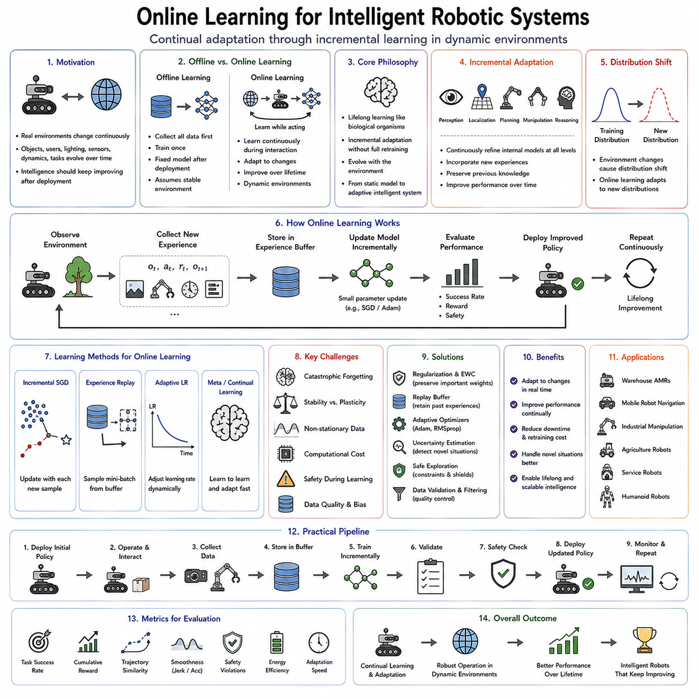{width="7.268055555555556in" height="7.268055555555556in"}

Online learning represents a fundamental shift from the traditional paradigm of machine learning in which models are trained once using a fixed dataset and subsequently deployed without further modification. In conventional offline learning, all available training data are collected before optimization begins, the model parameters are learned through repeated iterations over the complete dataset, and the resulting policy remains unchanged during deployment. While this approach has achieved remarkable success in many domains, it assumes that the environment remains relatively stable after training. Real-world robotic systems, however, operate in continuously changing environments where objects, users, sensors, lighting conditions, physical dynamics, and operational requirements evolve over time. Online learning addresses this challenge by allowing an intelligent system to continue learning while interacting with its environment, enabling continual adaptation without requiring complete retraining from scratch.

The core philosophy of online learning is that intelligence should not stop improving after deployment. Biological organisms continuously acquire new knowledge throughout their lifetime rather than freezing their learning capabilities upon reaching adulthood. Humans adapt to unfamiliar environments, develop new motor skills, recognize novel objects, and improve task performance through ongoing experience. Similarly, an intelligent robotic system should continuously refine its internal representations, policies, and world models while performing real tasks. This lifelong improvement transforms artificial intelligence from a static predictive model into an adaptive cognitive system capable of evolving alongside its operating environment.

Incremental adaptation forms the central mechanism enabling online learning. Instead of replacing the entire model after collecting a new dataset, incremental learning incorporates new experiences gradually into existing knowledge. Each newly observed sample contributes a small update to the learned representation while preserving previously acquired capabilities. This continuous accumulation of knowledge enables the system to respond rapidly to environmental changes without incurring the enormous computational cost associated with complete retraining. Incremental adaptation therefore combines computational efficiency with behavioral flexibility, making it particularly suitable for autonomous robots operating continuously in dynamic environments.

The distinction between offline and online learning extends beyond training schedules. Offline learning assumes access to independent and identically distributed data sampled from a fixed probability distribution. Online learning abandons this assumption because incoming observations often reflect changing environmental conditions. The statistical distribution governing observations may shift gradually or abruptly due to seasonal changes, equipment aging, new user behaviors, sensor recalibration, or unexpected environmental events. Consequently, online learning algorithms must remain effective even when the underlying data distribution evolves continuously.

Distribution shift represents one of the primary motivations for incremental adaptation. A warehouse robot initially trained under controlled lighting conditions may later operate during nighttime shifts with different illumination. An autonomous agricultural robot encounters crops at varying growth stages throughout the season. Medical service robots interact with different patients exhibiting diverse movement patterns and behaviors. Industrial manipulators experience tool wear, mechanical drift, and changing product geometries over extended operation. Each of these scenarios introduces data distributions differing from those present during initial training. Online learning continuously updates internal models to accommodate these evolving conditions.

Incremental adaptation occurs at multiple levels within an intelligent robotic system. The perception subsystem gradually improves visual recognition by incorporating newly observed appearances, lighting conditions, and object categories. Localization algorithms refine environmental maps as infrastructure changes over time. Motion planning adjusts trajectory optimization according to observed terrain conditions and actuator performance. Manipulation policies improve grasping strategies through repeated interaction with diverse objects. Higher-level reasoning modules expand semantic knowledge and task understanding based on accumulated operational experience. Together, these adaptations create an integrated learning architecture that evolves continuously during deployment.

One of the simplest forms of online learning involves incremental parameter updates using stochastic optimization. Rather than processing the complete training dataset repeatedly, new observations immediately contribute gradient updates modifying the model parameters. Stochastic Gradient Descent naturally supports this paradigm because each incoming sample directly influences optimization. Mini-batch variants extend the approach by accumulating small groups of recent observations before parameter updates occur. These incremental optimization strategies maintain computational efficiency while enabling continual learning from streaming data.

Learning rate selection becomes particularly important during incremental adaptation. Excessively large parameter updates may overwrite previously acquired knowledge, causing unstable behavior or catastrophic forgetting. Conversely, extremely small learning rates may prevent meaningful adaptation to changing environments. Adaptive optimization methods dynamically regulate parameter updates according to observed gradients, uncertainty estimates, or environmental change rates, balancing stability with responsiveness throughout continuous learning.

Streaming data distinguishes online learning from conventional dataset-based optimization. Rather than assuming all observations are simultaneously available, streaming algorithms process each sample sequentially as it arrives. Memory constraints frequently prevent storing the complete observation history, requiring algorithms to summarize previous experience efficiently. Consequently, online learning often emphasizes compact representations, recursive estimation, and sufficient statistics capable of preserving essential information without retaining every individual observation.

Recursive estimation provides an elegant mathematical framework for incremental adaptation. Classical recursive least squares, Kalman filtering, Bayesian updating, and particle filtering all demonstrate how estimates may be continuously refined as new observations become available. Modern deep learning extends these recursive principles toward high-dimensional representation learning, allowing neural networks to update complex internal structures through sequential experience accumulation.

Bayesian online learning naturally accommodates uncertainty during adaptation. Rather than representing model parameters as fixed values, Bayesian methods maintain probability distributions reflecting confidence in current estimates. Incoming observations update these distributions through Bayesian inference, gradually reducing uncertainty where evidence accumulates while preserving uncertainty in poorly observed regions. This probabilistic formulation enables intelligent systems to distinguish between well-established knowledge and newly emerging information requiring further experience.

Memory management represents a critical challenge because online learning systems cannot retain unlimited historical data indefinitely. Experience replay buffers address this problem by maintaining representative subsets of previous observations alongside recent experiences. During incremental training, new samples combine with replayed historical data, reducing catastrophic forgetting while allowing continual adaptation. Various sampling strategies prioritize rare events, informative experiences, or high-error observations to maximize learning efficiency.

Experience replay originated within reinforcement learning but has become equally valuable for supervised and imitation-based online adaptation. Random replay approximates stationary training distributions, while prioritized replay emphasizes observations contributing most strongly to prediction error. Reservoir sampling maintains unbiased historical subsets despite unlimited data streams. More sophisticated memory systems organize experiences according to semantic similarity, temporal relevance, or task identity, enabling efficient retrieval during continual learning.

Incremental representation learning extends adaptation beyond task-specific policies. Feature extractors themselves gradually evolve as new sensory experiences accumulate. Visual encoders expand their ability to recognize previously unseen objects, textures, and environmental conditions. Language representations incorporate novel terminology encountered during deployment. Multimodal embeddings strengthen associations among vision, language, tactile sensing, and motor behavior through repeated interaction. Such representation-level adaptation often proves more valuable than merely refining downstream decision policies.

Concept drift represents a particularly challenging form of environmental evolution. Unlike random noise or temporary disturbances, concept drift reflects systematic changes in the relationship between observations and desired outputs. Manufacturing robots encounter new product designs. Service robots adapt to changing user preferences. Autonomous vehicles experience seasonal weather transitions. Online learning systems therefore require drift detection mechanisms capable of identifying when previous knowledge becomes partially obsolete. Statistical monitoring, uncertainty estimation, prediction error analysis, and distribution comparison techniques commonly detect emerging concept drift before significant performance degradation occurs.

Different forms of concept drift require distinct adaptation strategies. Sudden drift occurs abruptly following equipment replacement or environmental reconfiguration. Gradual drift develops slowly through wear, aging, or seasonal variation. Recurring drift repeatedly alternates among previously encountered operating conditions. Incremental drift introduces continuous subtle changes over extended periods. Robust online learning architectures recognize these different temporal patterns and adjust adaptation speed accordingly.

Catastrophic forgetting remains one of the most significant obstacles to effective incremental learning. Neural networks often overwrite previously acquired knowledge while adapting to new data, causing dramatic performance degradation on earlier tasks. Human cognition rarely exhibits such severe forgetting because biological memory systems consolidate important knowledge while integrating new experiences. Artificial systems therefore require explicit mechanisms preserving prior capabilities during continual adaptation.

Regularization-based approaches reduce catastrophic forgetting by restricting parameter changes affecting previously learned knowledge. Elastic Weight Consolidation estimates parameter importance using Fisher information, penalizing modifications to weights critical for earlier tasks. Synaptic Intelligence and Memory Aware Synapses similarly identify essential parameters whose stability should be preserved throughout continual learning. These methods allow adaptation while protecting established competencies.

Architectural approaches provide an alternative solution by allocating new computational resources whenever substantially different knowledge must be acquired. Progressive Neural Networks preserve previous parameters while adding new network components for emerging tasks. Dynamic architectures expand representation capacity incrementally as environmental complexity increases. Such methods eliminate catastrophic forgetting but require careful management of computational growth during long-term deployment.

Replay-based methods remain among the most practical solutions for continual adaptation. Historical experiences stored within replay memories periodically reappear during training alongside recent observations. This joint optimization simultaneously reinforces previous knowledge while incorporating new information. Generative replay further extends this idea by synthesizing representative historical experiences using generative models rather than storing original observations explicitly.

Incremental adaptation becomes particularly important for robotic perception. Camera calibration gradually changes due to mechanical vibration. Lens contamination alters image characteristics. Lighting conditions evolve throughout the day. Objects appear with previously unseen textures or packaging. Online perception systems continuously refine feature representations to accommodate these evolving visual conditions without requiring manual recalibration or complete retraining.

Robotic manipulation similarly benefits from continual adaptation. Grippers experience mechanical wear. Friction coefficients vary among object materials. Force sensors drift gradually over time. Different operators organize workspaces differently. Incremental policy updates allow manipulation strategies to accommodate these subtle physical changes, maintaining precision despite evolving hardware and environmental characteristics.

Navigation systems require continuous adaptation because environments rarely remain static. Furniture moves, shelves relocate, construction modifies pathways, temporary obstacles appear, and human traffic patterns evolve. Simultaneous Localization and Mapping naturally embodies online learning principles by continuously updating environmental representations while preserving accumulated spatial knowledge. Modern world models increasingly integrate mapping, prediction, and semantic understanding into unified adaptive representations.

Online learning also plays a central role within autonomous driving systems. Traffic patterns change according to time of day. Weather influences road appearance and vehicle dynamics. Construction modifies lane geometry. Driver behaviors vary across geographic regions. Fleet learning aggregates experiences from thousands of vehicles, allowing continual improvement through shared online adaptation at unprecedented scale.

Human-robot interaction introduces additional adaptation requirements because individual users exhibit distinct preferences, communication styles, physical capabilities, and task expectations. Personalization algorithms gradually construct user-specific models reflecting these individual differences. Rather than requiring explicit customization before deployment, online learning enables robots to personalize behavior naturally through repeated interaction with each user.

Federated online learning further extends incremental adaptation across distributed robotic systems. Multiple robots learn independently while periodically exchanging model updates instead of raw sensory data. Central aggregation combines these distributed experiences into improved global models subsequently redistributed throughout the robotic fleet. Federated learning preserves privacy, reduces communication bandwidth, and accelerates collective knowledge acquisition across geographically dispersed deployments.

Cloud robotics provides complementary infrastructure supporting large-scale continual learning. Operational data collected across many robots accumulate within centralized repositories where extensive retraining, validation, and knowledge distillation occur. Updated models subsequently deploy back to individual robots. Hybrid architectures increasingly combine local online adaptation with periodic cloud-based consolidation, balancing rapid responsiveness against large-scale knowledge integration.

Safety considerations become especially important because online learning modifies policy behavior during deployment. Unconstrained adaptation may produce unsafe actions before sufficient validation occurs. Safe online learning therefore incorporates constrained optimization, uncertainty estimation, runtime verification, and supervisory controllers preventing dangerous policy updates. Conservative adaptation strategies initially restrict learning to low-risk operating regions before gradually expanding autonomy as confidence increases.

Human supervision often remains integrated throughout incremental adaptation. Operators provide corrective demonstrations whenever undesirable behavior occurs, allowing DAgger-style intervention during real deployment. Human feedback also supplies preference labels, semantic corrections, or natural language explanations guiding continual improvement beyond purely autonomous experience accumulation. Such collaborative learning combines human expertise with autonomous adaptation throughout system operation.

Evaluation of online learning differs fundamentally from static benchmark testing. Performance must remain stable throughout continuous adaptation rather than merely after final convergence. Metrics therefore include adaptation speed, forgetting rate, memory efficiency, computational cost, sample efficiency, robustness under concept drift, cumulative task success, and long-term operational reliability. Lifelong evaluation emphasizes sustained performance across months or years rather than isolated experimental episodes.

Recent advances in foundation models increasingly complement incremental adaptation. Large pretrained visual, language, and multimodal representations provide robust initial knowledge acquired from enormous datasets. Online learning subsequently specializes these general representations toward specific deployment environments through lightweight fine-tuning, parameter-efficient adaptation, retrieval augmentation, or continual representation refinement. This combination dramatically reduces required deployment data while preserving broad generalization capabilities.

World models further enhance online learning by constructing predictive internal simulations continuously refined through real experience. Rather than merely adapting reactive policies, world models update internal representations of environmental dynamics, object interactions, and causal relationships. Improved prediction subsequently enables better planning, safer exploration, and more efficient adaptation using imagined experiences generated within internal simulations.

The convergence of online learning, continual adaptation, world models, diffusion policies, Vision-Language-Action architectures, robot foundation models, and fleet learning represents a major step toward Artificial General Intelligence for embodied systems. Future robots will no longer rely primarily on fixed policies trained before deployment. Instead, they will function as continuously evolving intelligent agents capable of learning throughout their operational lifetime, sharing knowledge across fleets, adapting to individual users, anticipating environmental change, and improving autonomously through ongoing interaction with the physical world.

Online learning and incremental adaptation therefore represent essential foundations for lifelong robotic intelligence. By enabling continuous knowledge acquisition, efficient parameter updating, robust handling of distribution shift, protection against catastrophic forgetting, and safe adaptation during deployment, these techniques transform robots from static automation systems into continuously improving Physical AI platforms. As autonomous systems become increasingly integrated into manufacturing, healthcare, logistics, agriculture, domestic assistance, and scientific exploration, online learning will remain one of the defining capabilities enabling intelligent machines to operate successfully within the dynamic, uncertain, and ever-changing environments of the real world.

온라인 학습(Online Learning)은 기존의 오프라인 학습(Offline Learning)과는 근본적으로 다른 학습 패러다임이다. 기존 머신러닝에서는 모든 데이터를 먼저 수집한 후 모델을 한 번 학습시키고, 이후에는 학습된 모델을 그대로 운영하는 방식이 일반적이었다. 하지만 실제 로봇은 끊임없이 변화하는 환경에서 동작하며, 조명, 물체, 사용자, 센서 상태, 기계적 특성, 작업 요구사항 등이 지속적으로 변한다. 온라인 학습은 이러한 변화에 대응하기 위해 로봇이 실제 환경에서 작업을 수행하는 동안에도 계속 학습하도록 하여, 모델을 처음부터 다시 학습하지 않고도 지속적으로 성능을 향상시키는 방법이다.

온라인 학습의 핵심 철학은 "지능은 배포 이후에도 계속 성장해야 한다"는 것이다. 인간은 학교를 졸업한 뒤에도 새로운 기술을 배우고, 새로운 환경에 적응하며, 경험을 통해 능력을 발전시킨다. 마찬가지로 지능형 로봇도 실제 작업을 수행하면서 새로운 물체를 인식하고, 새로운 작업 방식을 배우며, 정책(Policy)과 세계 모델(World Model)을 지속적으로 개선해야 한다. 이러한 평생학습(Lifelong Learning)은 고정된 모델을 진화하는 지능 시스템으로 변화시키는 핵심 요소이다.

점진적 적응(Incremental Adaptation)은 온라인 학습의 핵심 메커니즘이다. 새로운 데이터를 얻을 때마다 모델 전체를 다시 학습하는 것이 아니라, 기존 지식을 유지한 상태에서 새로운 경험만 조금씩 반영한다. 새로운 샘플은 기존 모델에 작은 업데이트를 수행하며, 이미 학습한 능력은 최대한 유지된다. 이러한 방식은 계산 비용을 크게 줄이면서도 환경 변화에 빠르게 적응할 수 있기 때문에 장시간 운영되는 자율 로봇에 매우 적합하다.

오프라인 학습과 온라인 학습의 차이는 단순히 학습 시점만 다른 것이 아니다. 오프라인 학습은 모든 데이터가 동일한 확률 분포(Independent and Identically Distributed, IID)를 따른다고 가정한다. 그러나 온라인 학습에서는 이러한 가정이 성립하지 않는다. 시간이 지나면서 환경이 변화하면 데이터의 확률 분포 자체가 변하게 된다. 이러한 변화는 계절 변화, 센서 재보정, 장비 노후화, 사용자 행동 변화, 환경 구조 변경 등 다양한 원인으로 발생하며, 온라인 학습은 이러한 분포 변화를 지속적으로 반영해야 한다.

분포 변화(Distribution Shift)는 온라인 학습이 필요한 가장 큰 이유이다. 예를 들어 창고 로봇은 낮과 밤의 조명 차이를 경험하고, 농업 로봇은 작물의 성장 단계에 따라 전혀 다른 환경을 만난다. 의료 서비스 로봇은 서로 다른 환자의 움직임과 행동을 경험하며, 산업용 로봇은 공구 마모와 제품 형상 변화를 겪는다. 이러한 변화는 초기 학습 데이터에는 존재하지 않았던 새로운 분포를 생성하며, 온라인 학습은 이러한 환경에 맞추어 모델을 지속적으로 적응시킨다.

점진적 적응은 로봇 시스템의 여러 계층에서 동시에 이루어진다. 인식(Perception)은 새로운 물체와 조명 조건을 학습하고, 위치 추정(Localization)은 변화된 환경 지도를 갱신한다. 경로 계획(Motion Planning)은 새로운 지형 조건을 반영하며, 조작 정책(Manipulation Policy)은 반복적인 작업을 통해 더 나은 파지 전략을 학습한다. 또한 고수준 추론(Reasoning)은 새로운 작업 지식과 의미 정보를 지속적으로 축적한다. 이러한 적응이 함께 이루어져 전체 시스템이 지속적으로 발전한다.

가장 기본적인 온라인 학습 방법은 확률적 경사하강법(Stochastic Gradient Descent, SGD)을 이용한 점진적 파라미터 업데이트이다. 전체 데이터를 반복해서 학습하는 대신 새로 들어오는 샘플마다 모델의 가중치를 조금씩 수정한다. 또한 미니배치(Mini-Batch)를 이용하면 여러 개의 새로운 데이터를 모아서 한 번에 업데이트할 수도 있다. 이러한 방식은 계산량을 크게 줄이면서도 지속적인 학습을 가능하게 한다.

학습률(Learning Rate)의 선택은 온라인 학습에서 매우 중요하다. 업데이트가 너무 크면 기존 지식을 잃어버리는 재앙적 망각(Catastrophic Forgetting)이 발생할 수 있다. 반대로 너무 작은 학습률은 환경 변화에 충분히 적응하지 못하게 만든다. 따라서 최근에는 환경 변화 정도나 불확실성(Uncertainty)에 따라 학습률을 자동으로 조절하는 적응형 최적화(Adaptive Optimization)가 많이 사용된다.

온라인 학습에서는 데이터가 스트리밍(Stream) 형태로 계속 들어온다. 모든 데이터를 저장하는 것은 현실적으로 불가능하기 때문에 메모리 관리(Memory Management)가 매우 중요하다. 따라서 시스템은 모든 데이터를 저장하는 대신 핵심 정보만 요약하거나 대표 샘플만 유지하는 방식으로 메모리를 효율적으로 관리해야 한다.

재귀 추정(Recursive Estimation)은 점진적 적응을 설명하는 대표적인 수학적 방법이다. 재귀 최소제곱(Recursive Least Squares), 칼만 필터(Kalman Filter), 베이지안 업데이트(Bayesian Updating), 파티클 필터(Particle Filter) 등은 새로운 관측이 들어올 때마다 기존 추정을 조금씩 수정한다. 현대의 딥러닝도 이러한 원리를 확장하여 고차원 특징 표현을 지속적으로 업데이트하는 방향으로 발전하고 있다.

베이지안 온라인 학습(Bayesian Online Learning)은 불확실성을 함께 고려하는 접근법이다. 모델 파라미터를 하나의 값이 아니라 확률 분포로 표현하고, 새로운 데이터가 들어올 때마다 베이지안 추론을 이용하여 이 분포를 갱신한다. 데이터가 충분한 영역에서는 신뢰도가 높아지고, 경험이 부족한 영역에서는 높은 불확실성을 유지하기 때문에 보다 안전한 의사결정이 가능하다.

메모리 관리(Memory Management)는 온라인 학습의 핵심 문제이다. 경험 재생 버퍼(Experience Replay Buffer)는 이전 데이터를 일부 저장한 후 새로운 데이터와 함께 학습에 사용한다. 이렇게 하면 새로운 환경에 적응하면서도 기존 능력을 유지할 수 있다. 최근에는 중요한 데이터만 선택하는 우선순위 재생(Prioritized Replay), 무작위 대표 샘플을 유지하는 저수지 샘플링(Reservoir Sampling) 등 다양한 기법이 사용된다.

경험 재생(Experience Replay)은 원래 강화학습(Reinforcement Learning)에서 개발되었지만 현재는 온라인 지도학습과 모방학습에서도 널리 사용된다. 최근에는 단순히 데이터를 저장하는 것이 아니라 의미적 유사성(Semantic Similarity), 시간적 중요성(Temporal Relevance), 작업 종류(Task Identity)에 따라 데이터를 조직하여 더욱 효율적으로 학습하는 방식도 연구되고 있다.

점진적 표현 학습(Incremental Representation Learning)은 정책뿐 아니라 특징 표현(Feature Representation) 자체를 지속적으로 개선한다. 시각 인코더(Visual Encoder)는 새로운 물체와 환경을 학습하고, 언어 모델(Language Model)은 새로운 단어와 표현을 익히며, 멀티모달 표현(Multimodal Representation)은 시각·언어·촉각·행동 사이의 관계를 지속적으로 강화한다. 이러한 표현 수준의 적응은 단순한 정책 업데이트보다 더 큰 효과를 가져오는 경우가 많다.

개념 변화(Concept Drift)는 온라인 학습에서 가장 어려운 문제 가운데 하나이다. 이는 데이터 자체가 아니라 입력과 출력의 관계가 시간에 따라 변화하는 현상을 의미한다. 제조 로봇은 새로운 제품을 생산하게 되고, 서비스 로봇은 사용자 선호가 바뀌며, 자율주행차는 계절에 따라 도로 환경이 변화한다. 따라서 시스템은 이러한 변화를 스스로 감지하고 적절한 속도로 적응해야 한다.

개념 변화는 여러 형태로 나타난다. 갑작스러운 변화(Sudden Drift)는 장비 교체나 환경 변경 후 즉시 발생한다. 점진적 변화(Gradual Drift)는 마모나 계절 변화처럼 천천히 진행된다. 반복 변화(Recurring Drift)는 낮과 밤처럼 주기적으로 반복되며, 연속 변화(Incremental Drift)는 매우 작은 변화가 오랫동안 누적되는 경우이다. 온라인 학습 시스템은 이러한 다양한 변화 유형에 맞추어 적응 전략을 달리해야 한다.

재앙적 망각(Catastrophic Forgetting)은 온라인 학습의 가장 큰 문제이다. 새로운 데이터를 학습하면서 기존에 학습했던 능력을 잃어버리는 현상이다. 인간은 새로운 지식을 배워도 과거의 지식을 대부분 유지하지만, 신경망은 새로운 정보가 기존 파라미터를 덮어쓰면서 이전 작업의 성능이 크게 저하될 수 있다.

정규화 기반 방법(Regularization-Based Method)은 재앙적 망각을 줄이는 대표적인 방법이다. Elastic Weight Consolidation(EWC)은 중요한 파라미터를 식별하여 큰 변경이 일어나지 않도록 제한한다. Synaptic Intelligence(SI), Memory Aware Synapses(MAS) 등도 유사한 방식으로 기존 지식을 보호하면서 새로운 학습을 수행한다.

구조 기반 접근법(Architectural Approach)은 새로운 작업이 등장할 때마다 새로운 네트워크를 추가하는 방법이다. Progressive Neural Network와 같은 구조는 기존 네트워크를 그대로 유지하고 새로운 모듈을 추가하여 새로운 작업을 학습한다. 기존 지식은 완전히 보존되지만 시간이 지날수록 모델의 크기가 계속 증가하는 단점이 있다.

재생 기반 방법(Replay-Based Method)은 가장 실용적인 접근법 가운데 하나이다. 이전 데이터를 메모리에 저장한 후 새로운 데이터와 함께 학습함으로써 기존 능력을 유지한다. 최근에는 실제 데이터를 저장하지 않고 생성형 모델(Generative Model)이 과거 데이터를 생성하는 생성 재생(Generative Replay)도 활발하게 연구되고 있다.

온라인 학습은 로봇 인식(Robot Perception)에서 매우 중요하다. 카메라 보정(Camera Calibration)은 시간이 지나면서 조금씩 변하고, 렌즈 오염, 조명 변화, 새로운 물체 등이 지속적으로 발생한다. 온라인 인식 시스템은 이러한 새로운 환경을 지속적으로 학습하여 별도의 재학습 없이도 안정적인 인식 성능을 유지할 수 있다.

로봇 조작(Robot Manipulation) 역시 지속적인 적응이 필요하다. 그리퍼는 마모되고, 마찰 계수는 물체마다 달라지며, 힘 센서는 시간이 지나면서 드리프트(Drift)가 발생한다. 온라인 학습은 이러한 변화를 반영하여 파지와 조작 전략을 계속 개선함으로써 장기간 높은 정밀도를 유지할 수 있다.

자율주행과 이동 로봇(Navigation)도 온라인 학습의 대표적인 응용 분야이다. 건물 내부 구조가 변경되거나 가구가 이동하고, 공사로 인해 새로운 장애물이 생기는 경우가 많다. SLAM(Simultaneous Localization and Mapping)은 이러한 환경 변화를 지속적으로 지도(Map)에 반영하며, 최근에는 세계 모델(World Model)과 결합하여 더욱 강력한 환경 이해 능력을 제공하고 있다.

자율주행 자동차(Autonomous Driving)는 온라인 학습이 필수적인 분야이다. 교통량은 시간대마다 달라지고, 날씨는 도로 상태를 변화시키며, 공사 구간은 차선을 변경한다. 최근에는 플릿 학습(Fleet Learning)을 이용하여 수천 대의 차량이 경험한 데이터를 공유하면서 전체 시스템이 지속적으로 발전하고 있다.

인간-로봇 상호작용(Human-Robot Interaction)에서는 개인화(Personalization)가 매우 중요하다. 사람마다 선호도, 말투, 작업 방식, 신체 조건이 모두 다르다. 온라인 학습은 반복적인 상호작용을 통해 각 사용자에 맞는 개인화 모델을 구축하며, 별도의 설정 없이도 자연스럽게 맞춤형 서비스를 제공할 수 있도록 한다.

연합 온라인 학습(Federated Online Learning)은 여러 로봇이 독립적으로 학습한 결과를 중앙 서버에서 통합하는 방식이다. 원본 데이터를 공유하지 않고 모델 업데이트만 교환하기 때문에 개인정보를 보호하면서도 집단 학습(Collective Learning)이 가능하다.

클라우드 로보틱스(Cloud Robotics)는 대규모 온라인 학습을 지원하는 핵심 인프라이다. 여러 로봇이 수집한 데이터를 중앙 서버에서 통합하여 대규모 재학습과 지식 증류(Knowledge Distillation)를 수행한 후 새로운 모델을 다시 각 로봇에 배포한다. 최근에는 로컬 적응(Local Adaptation)과 클라우드 학습을 결합하는 하이브리드 구조가 많이 사용된다.

온라인 학습은 운영 중 모델이 변경되므로 안전성(Safety)이 특히 중요하다. 잘못된 업데이트는 위험한 행동을 생성할 수 있기 때문에 안전 제약(Safety Constraint), 불확실성 추정(Uncertainty Estimation), 런타임 검증(Runtime Verification), 감독 제어기(Supervisory Controller)를 함께 사용하여 위험한 정책 업데이트를 방지한다.

인간 감독(Human Supervision)은 온라인 학습에서도 중요한 역할을 한다. 작업자는 잘못된 행동이 발생하면 새로운 시범을 제공하거나 자연어 설명을 통해 수정 방향을 알려줄 수 있다. 이러한 DAgger 기반의 상호작용 학습은 실제 운영 환경에서도 지속적인 성능 향상을 가능하게 한다.

온라인 학습의 평가는 기존 벤치마크와 다르다. 최종 성능만 평가하는 것이 아니라 적응 속도(Adaptation Speed), 망각률(Forgetting Rate), 메모리 효율성(Memory Efficiency), 계산 비용, 샘플 효율성(Sample Efficiency), 개념 변화 대응 능력, 장기적인 작업 성공률 등을 함께 평가한다.

최근에는 파운데이션 모델(Foundation Model)이 온라인 학습을 더욱 효율적으로 만들고 있다. 대규모 사전학습 모델을 초기 지식으로 사용한 후 실제 환경에서는 미세조정(Fine-Tuning), 파라미터 효율적 학습(Parameter-Efficient Learning), 검색 증강(Retrieval Augmentation) 등을 이용하여 적은 데이터만으로도 환경에 빠르게 적응할 수 있다.

세계 모델(World Model)은 온라인 학습을 더욱 강력하게 만든다. 단순히 정책만 수정하는 것이 아니라 환경의 동역학(Dynamics), 물체 간 상호작용, 인과 관계(Causal Relationship)를 지속적으로 학습한다. 이렇게 개선된 내부 모델은 더 정확한 미래 예측과 안전한 계획(Planning)을 가능하게 한다.

온라인 학습, 지속적 적응(Continual Adaptation), 세계 모델, 확산 정책(Diffusion Policy), 비전-언어-행동(VLA), 로봇 파운데이션 모델, 플릿 학습(Fleet Learning)이 결합되면서 범용 로봇 지능으로의 발전이 가속화되고 있다. 미래의 로봇은 배포 후에도 계속 배우고, 서로 경험을 공유하며, 사용자와 환경에 맞추어 스스로 발전하는 지능형 시스템으로 진화할 것이다.

결국 온라인 학습과 점진적 적응은 평생학습(Lifelong Learning)을 실현하는 핵심 기술이다. 지속적인 지식 축적, 효율적인 파라미터 업데이트, 분포 변화 대응, 재앙적 망각 방지, 안전한 운영 중 학습을 가능하게 함으로써 로봇을 단순한 자동화 장비에서 끊임없이 성장하는 **Physical AI** 플랫폼으로 변화시킨다. 제조, 의료, 물류, 농업, 서비스, 과학 탐사 등 다양한 분야에서 이러한 능력은 범용 인공지능 로봇(General-Purpose Intelligent Robot)의 핵심 기반 기술이 될 것으로 기대된다.

##  

## 07.02 Online Supervised Learning Incremental Update [w/Code]

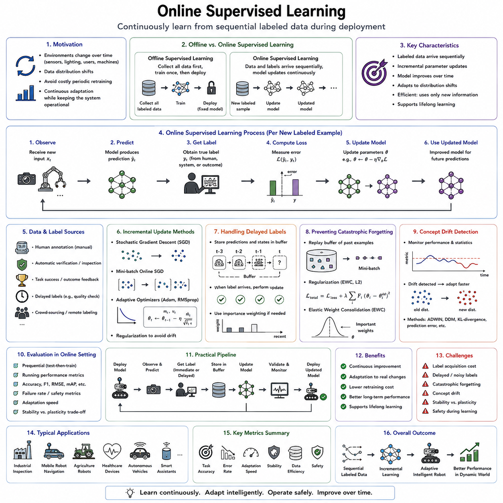{width="7.268055555555556in" height="7.268055555555556in"}

Online Supervised Learning extends the traditional supervised learning paradigm by allowing a model to continue updating its parameters while new labeled data arrive sequentially during deployment. Unlike conventional offline supervised learning, where all labeled examples are collected before training begins and the resulting model remains fixed afterward, online supervised learning assumes that labeled information becomes available continuously over time. Each new observation contributes additional knowledge that incrementally improves the model without requiring complete retraining from the beginning. This capability is particularly valuable for robotic systems, autonomous vehicles, industrial automation, healthcare devices, and intelligent assistants operating in dynamic environments where new experiences constantly emerge. Online supervised learning therefore serves as one of the fundamental building blocks for lifelong machine learning and continuously adaptive Physical AI.

The motivation for online supervised learning arises from the observation that real-world environments rarely remain static. Sensors gradually drift, lighting conditions change throughout the day, machines experience mechanical wear, users adopt new behaviors, products evolve, and operational environments continuously transform. A model trained only once inevitably becomes increasingly outdated as the underlying data distribution changes. Rather than periodically stopping the system for expensive retraining cycles, online supervised learning enables continuous adaptation while maintaining uninterrupted operation. The model gradually incorporates newly labeled examples into its existing knowledge, allowing performance to improve throughout deployment.

The defining characteristic of supervised learning is the availability of labeled data. Every training example consists of an input observation paired with a correct target label. In image recognition, the label identifies the object category. In regression tasks, the label specifies a continuous numerical value. In robotic perception, labels may represent object locations, semantic classes, grasp poses, navigation waypoints, defect categories, or force measurements. Online supervised learning preserves this supervised structure while changing the temporal organization of learning. Labels arrive one sample or one mini-batch at a time rather than as one complete dataset.

Incremental updating forms the computational core of online supervised learning. After receiving a new labeled sample, the model computes its prediction, compares that prediction with the correct label, calculates an error through an appropriate loss function, and updates its parameters using gradient-based optimization. Instead of repeating optimization over millions of historical examples, only the newly acquired information contributes directly to parameter adjustment. The updated model immediately becomes available for future predictions while remaining ready to incorporate subsequent observations.

This sequential learning process closely resembles how humans acquire expertise. A technician does not relearn every engineering principle after encountering one unfamiliar machine. Instead, the new experience modifies existing knowledge while preserving previously acquired skills. Similarly, an experienced physician continually improves diagnostic accuracy through new patient encounters without forgetting earlier medical knowledge. Online supervised learning seeks to reproduce this gradual accumulation of expertise within artificial learning systems.

One of the most significant advantages of incremental updates lies in computational efficiency. Complete retraining requires repeatedly processing the entire historical dataset, demanding substantial computational resources, memory capacity, storage bandwidth, and training time. Online learning instead processes only newly arriving samples, dramatically reducing computational cost. This efficiency becomes especially important for autonomous robots operating continuously over months or years, where frequent complete retraining would be impractical or economically prohibitive.

Streaming data provides the natural input format for online supervised learning. Sensors continuously produce images, depth maps, LiDAR scans, force measurements, tactile signals, inertial observations, temperature readings, audio streams, and other multimodal information. Whenever reliable labels become available through human annotation, automated inspection, downstream verification, or delayed task outcomes, these streaming observations immediately become training examples. The learning process therefore proceeds concurrently with operational deployment.

Different labeling mechanisms support online supervised learning depending on the application domain. Human experts may manually annotate observations through graphical interfaces. Industrial inspection systems generate labels automatically based on downstream quality verification. Warehouse robots receive confirmation after successful package delivery. Medical systems incorporate physician diagnoses after patient evaluation. Autonomous vehicles receive labels through high-definition map updates or human intervention during exceptional situations. These diverse supervision sources continuously expand the training dataset throughout deployment.

Delayed labeling presents an important practical challenge. Many applications cannot immediately determine the correct output associated with a newly observed input. For example, an industrial robot assembling electronic components may not learn whether insertion succeeded until quality inspection occurs several minutes later. Similarly, an agricultural robot may receive confirmation regarding fruit quality only after harvesting and sorting. Online supervised learning therefore frequently separates data acquisition from parameter updates, temporarily storing unlabeled observations until corresponding labels become available.

Mini-batch online learning provides a compromise between purely sequential updates and conventional offline optimization. Rather than updating parameters after every individual observation, small groups of newly collected labeled examples accumulate before optimization occurs. Mini-batch processing reduces gradient variance, improves computational efficiency on modern parallel hardware, and often yields more stable optimization while still preserving rapid adaptation to environmental changes.

Stochastic Gradient Descent naturally supports incremental learning because each optimization step depends upon only one or a few training examples. Every incoming labeled observation generates a gradient describing how the model should change to reduce prediction error. Adaptive optimization methods including Adam, RMSProp, AdaGrad, and AdaDelta further regulate incremental parameter updates by adjusting learning rates according to observed gradient statistics. These optimizers balance adaptation speed against long-term stability throughout continual operation.

Learning rate selection strongly influences online supervised learning performance. Large learning rates allow rapid adaptation to newly emerging conditions but risk overwriting previously acquired knowledge. Extremely small learning rates preserve historical information yet may prevent meaningful adaptation to changing environments. Dynamic learning rate scheduling addresses this tradeoff by adjusting optimization strength according to prediction confidence, detected distribution shifts, uncertainty estimates, or environmental stability.

Distribution shift remains one of the primary motivations for online adaptation. Consider an industrial vision system initially trained to detect manufacturing defects under factory lighting. Seasonal illumination changes, camera aging, lens contamination, new product designs, or sensor recalibration gradually alter the visual appearance of inspected components. Offline models increasingly misclassify these evolving observations. Online supervised learning continuously incorporates newly labeled inspection examples, restoring classification accuracy without interrupting production.

Medical diagnostic systems similarly benefit from incremental supervised updates. New imaging devices introduce different image characteristics, clinical protocols evolve, disease prevalence changes, and novel treatment methods appear over time. Online adaptation enables diagnostic models to incorporate contemporary medical knowledge while maintaining historical expertise. Such continual improvement becomes increasingly valuable as healthcare technologies rapidly evolve.

Autonomous driving provides another compelling application. Traffic signs change, road markings deteriorate, weather conditions vary seasonally, construction modifies infrastructure, and sensor hardware gradually ages. Human interventions during deployment provide valuable labeled examples identifying situations where previous predictions proved inadequate. Incremental supervised updates enable perception systems to adapt continuously to these evolving operating conditions while preserving previously acquired driving knowledge.

Industrial defect detection increasingly relies upon online supervised learning because manufacturing processes evolve continuously. New product variants, material batches, production equipment, tooling configurations, and quality requirements all introduce visual changes absent from initial training datasets. Quality inspectors naturally generate labels during routine production, providing continuous supervision for adaptive defect detection systems. Such online learning substantially reduces manual dataset reconstruction whenever production conditions change.

Incremental supervised learning also plays a central role within warehouse automation. Object appearance changes as packaging evolves, inventory expands, suppliers introduce new products, and environmental conditions vary throughout daily operations. Barcode verification, inventory management systems, and human corrections provide reliable labels supporting continuous adaptation. Warehouse robots therefore improve recognition performance while remaining operational throughout evolving logistics workflows.

Memory management becomes particularly important because indefinitely storing every historical observation is generally impossible. Experience replay buffers preserve representative subsets of earlier labeled examples, allowing joint optimization over historical and recent data. Without replay, models often overfit newly arriving observations while forgetting previous knowledge. Carefully balanced replay strategies therefore stabilize incremental learning while limiting storage requirements.

Replay strategies vary according to application requirements. Random replay approximates stationary data distributions by sampling uniformly from stored experiences. Prioritized replay emphasizes examples exhibiting high prediction error or significant learning potential. Reservoir sampling maintains statistically representative historical subsets despite unbounded data streams. Class-balanced replay preserves rare categories vulnerable to forgetting. These memory management techniques significantly improve long-term learning stability.

Catastrophic forgetting remains one of the central challenges facing online supervised learning. Neural networks frequently overwrite previously learned representations while adapting to new data, causing performance degradation on earlier examples. Biological memory systems largely avoid such severe forgetting through consolidation processes distributed across multiple brain regions. Artificial systems therefore require explicit computational mechanisms preserving historical knowledge throughout continual adaptation.

Regularization-based methods mitigate catastrophic forgetting by identifying parameters essential for previous tasks. Elastic Weight Consolidation estimates parameter importance through Fisher Information, penalizing changes affecting critical weights. Memory Aware Synapses and Synaptic Intelligence similarly constrain modifications to previously important parameters while allowing flexible adaptation elsewhere within the network. These approaches maintain historical competence without preventing meaningful learning.

Knowledge distillation offers another effective strategy for preserving prior knowledge. A previously trained teacher model generates soft target predictions representing historical expertise. During incremental learning, the updated student model simultaneously learns from new labeled data while matching teacher outputs on representative historical examples. This dual optimization preserves established knowledge while incorporating newly acquired information.

Dynamic neural architectures provide structural solutions to continual adaptation. Rather than modifying existing parameters indefinitely, additional network capacity becomes available whenever substantially different knowledge must be acquired. Progressive Neural Networks, dynamically expandable architectures, and modular neural systems preserve historical representations while allocating specialized computational resources for emerging concepts. Although computational complexity gradually increases, catastrophic forgetting becomes significantly reduced.

Representation learning plays a particularly important role because feature extractors themselves evolve during online adaptation. Visual encoders gradually recognize previously unseen textures, lighting conditions, object categories, and environmental structures. Language encoders incorporate newly emerging terminology. Multimodal representations strengthen relationships among vision, language, tactile sensing, force feedback, and proprioception through repeated supervised experience. These continually improving representations often transfer beneficially across multiple downstream tasks.

Concept drift introduces additional complexity because the relationship between inputs and labels changes over time. A medical image previously classified as healthy according to outdated diagnostic criteria may later receive a different label under revised clinical guidelines. Manufacturing defects evolve as production tolerances change. User preferences shift throughout long-term human-robot interaction. Detecting concept drift therefore becomes essential before meaningful adaptation can occur.

Statistical drift detection methods monitor prediction error distributions, feature statistics, uncertainty estimates, confidence calibration, and label frequencies to identify evolving operating conditions. Sudden increases in prediction error often indicate significant environmental change requiring accelerated adaptation. More subtle gradual drift requires long-term statistical monitoring capable of distinguishing systematic evolution from ordinary observational noise.

Confidence estimation further improves incremental supervised learning. Modern neural networks increasingly estimate prediction uncertainty alongside classification outputs. Bayesian neural networks, Monte Carlo Dropout, ensemble methods, evidential deep learning, and probabilistic calibration techniques quantify confidence associated with each prediction. Low-confidence observations become valuable candidates for human annotation because additional labels provide maximal information for future learning.

Active learning naturally complements online supervised adaptation. Rather than requesting labels for every observation, the system selectively queries human experts only for highly informative examples exhibiting uncertainty, novelty, disagreement among ensemble models, or suspected distribution shift. This selective labeling dramatically reduces annotation effort while maximizing incremental learning efficiency. Human expertise therefore focuses upon the observations contributing greatest long-term benefit.

Human-in-the-loop supervision remains indispensable in many safety-critical applications. Industrial operators verify uncertain defect classifications. Medical specialists confirm difficult diagnoses. Autonomous vehicle supervisors intervene during unusual traffic scenarios. Robotic operators correct manipulation failures. These human corrections generate highly informative labeled examples directly addressing current model weaknesses. Online supervised learning therefore creates an ongoing collaborative relationship between artificial intelligence and human expertise.

Cloud infrastructure increasingly supports large-scale online supervised learning across fleets of robots. Individual robots perform local inference while periodically uploading newly labeled experiences to centralized training servers. Global models incorporate aggregated knowledge from thousands of distributed systems before optimized parameters return to individual robots. Fleet learning dramatically accelerates knowledge acquisition because every robot benefits from experiences collected throughout the entire deployment network.

Federated supervised learning extends this concept while preserving privacy. Instead of transmitting raw sensor data, individual devices exchange only parameter updates or compressed gradient information. Central aggregation combines these distributed updates into improved global models without exposing sensitive operational data. Such privacy-preserving collaboration becomes particularly important within healthcare, manufacturing, defense, and consumer robotics.

Evaluation of online supervised learning extends beyond conventional classification accuracy. Researchers measure adaptation speed following environmental change, forgetting rate on historical tasks, computational efficiency, memory utilization, sample efficiency, uncertainty calibration, robustness under distribution shift, annotation efficiency, and long-term cumulative performance. Unlike static benchmarks evaluating final model accuracy, online evaluation emphasizes sustained improvement throughout continuous operation.

Deployment introduces additional engineering considerations. Models must update safely without disrupting ongoing operation. Incremental updates frequently occur during scheduled maintenance intervals, low-activity periods, or dedicated background computation threads. Runtime safety monitors verify updated models before autonomous control resumes. Version management tracks parameter evolution, training data, hyperparameters, and deployment history to ensure reproducibility and reliable rollback if unexpected behavior emerges.

Edge deployment further constrains online supervised learning because embedded processors possess limited computational resources. Efficient optimization algorithms, lightweight architectures, parameter-efficient fine-tuning, quantization-aware learning, and hardware acceleration enable continual adaptation within practical energy and latency constraints. These optimizations allow intelligent robots to learn directly on embedded hardware without depending exclusively on cloud connectivity.

Foundation models increasingly reshape online supervised learning by providing powerful pretrained representations requiring only modest incremental adaptation. Instead of learning entirely from scratch, deployment-specific supervision fine-tunes existing multimodal representations using relatively small quantities of labeled data. Parameter-efficient adaptation techniques such as adapters, low-rank adaptation, prompt tuning, and retrieval augmentation further reduce computational requirements while preserving broad pretrained knowledge.

World models complement supervised incremental learning by continuously refining predictive internal representations of environmental dynamics. Newly labeled observations improve not only immediate prediction tasks but also broader causal understanding, enabling more accurate simulation, planning, and decision-making. Online supervised learning therefore contributes simultaneously to perception, reasoning, and model-based control within increasingly integrated cognitive architectures.

The future of online supervised learning will likely combine continual adaptation, active learning, foundation models, world models, federated optimization, multimodal reasoning, uncertainty estimation, and human collaborative supervision into unified lifelong learning systems. Rather than treating deployment as the endpoint of machine learning, intelligent robots will continue acquiring labeled knowledge throughout their operational lifetime, gradually improving perception, prediction, reasoning, and control through every meaningful interaction with the physical world.

Online supervised learning and incremental updating therefore represent essential technologies for adaptive artificial intelligence operating under continuously changing real-world conditions. By integrating streaming labeled data, efficient optimization, memory management, concept drift detection, catastrophic forgetting prevention, uncertainty-aware learning, and human-guided supervision, these methods transform static supervised models into continuously evolving intelligent systems. As Physical AI expands across manufacturing, healthcare, logistics, agriculture, transportation, and domestic robotics, online supervised learning will remain a foundational capability enabling robots to learn safely, efficiently, and continuously throughout their entire operational lifetime.

온라인 지도학습(Online Supervised Learning)은 새로운 레이블(Label)이 지속적으로 들어올 때 모델을 실시간으로 업데이트하는 학습 방식이다. 기존의 오프라인 지도학습(Offline Supervised Learning)은 모든 데이터를 먼저 수집한 후 한 번 학습을 수행하고 모델을 그대로 사용하는 반면, 온라인 지도학습은 운영 중에도 새로운 데이터를 이용하여 모델을 계속 개선한다. 따라서 자율주행, 산업용 로봇, 의료기기, 서비스 로봇 등과 같이 환경이 지속적으로 변화하는 시스템에서 매우 중요한 학습 방법으로 활용된다.

온라인 지도학습이 필요한 이유는 실제 환경이 항상 변화하기 때문이다. 센서는 시간이 지나면서 성능이 변하고, 조명은 하루에도 여러 번 바뀌며, 기계는 마모되고, 사용자의 행동도 달라진다. 또한 새로운 제품이나 새로운 작업 환경이 계속 등장한다. 이러한 변화는 기존 모델의 성능을 점차 저하시킨다. 온라인 지도학습은 운영을 중단하지 않고 새로운 데이터를 지속적으로 반영하여 모델을 최신 상태로 유지하도록 만든다.

지도학습(Supervised Learning)의 핵심은 입력(Input)과 정답(Label)이 함께 존재한다는 점이다. 영상 분류에서는 입력 이미지와 정답 클래스가 제공되고, 회귀(Regression) 문제에서는 입력과 함께 연속적인 수치값이 제공된다. 로봇에서는 물체 위치(Object Position), 의미 정보(Semantic Class), 파지 자세(Grasp Pose), 경로점(Waypoint), 결함 종류(Defect Category), 힘 센서 값(Force Measurement) 등이 모두 지도학습의 레이블이 될 수 있다. 온라인 지도학습은 이러한 레이블이 시간에 따라 순차적으로 들어오는 환경을 대상으로 한다.

점진적 업데이트(Incremental Update)는 온라인 지도학습의 핵심 과정이다. 새로운 레이블이 도착하면 모델은 먼저 예측(Prediction)을 수행하고, 예측과 실제 정답의 차이를 손실 함수(Loss Function)를 통해 계산한다. 이후 경사하강법(Gradient Descent)을 이용하여 파라미터를 조금씩 수정한다. 이러한 작은 업데이트가 계속 반복되면서 모델은 운영 중에도 지속적으로 성능을 향상시킨다.

이러한 학습 방식은 인간의 학습 과정과 매우 유사하다. 숙련된 기술자는 새로운 장비를 만났다고 해서 처음부터 모든 공학 지식을 다시 배우지 않는다. 기존 지식을 유지한 상태에서 새로운 경험만 추가한다. 의사도 새로운 환자를 진료할 때마다 기존의 의학 지식을 버리지 않고 경험을 조금씩 축적한다. 온라인 지도학습 역시 이러한 점진적인 지식 축적 방식을 인공지능에 적용한 것이다.

점진적 업데이트의 가장 큰 장점은 계산 효율성(Computational Efficiency)이다. 전체 데이터를 다시 학습하는 것은 많은 계산 시간과 메모리를 요구하지만, 온라인 학습은 새롭게 들어온 데이터만 처리하면 된다. 따라서 수개월 또는 수년 동안 연속적으로 운영되는 산업용 로봇이나 자율 시스템에서도 매우 효율적으로 사용할 수 있다.

온라인 지도학습에서는 데이터가 스트리밍(Stream) 형태로 지속적으로 들어온다. 카메라 영상, LiDAR, 깊이 영상(Depth Map), IMU, 촉각(Tactile), 힘 센서, 오디오(Audio) 등 다양한 센서가 실시간으로 데이터를 생성한다. 여기에 사람의 주석(Annotation), 자동 검사 결과, 작업 성공 여부 등이 레이블로 추가되면 즉시 새로운 학습 데이터가 된다.

레이블(Label)은 다양한 방식으로 생성된다. 사람이 직접 화면에서 물체를 표시하거나, 산업용 검사 장비가 자동으로 품질을 판정하거나, 물류 시스템에서 배송 성공 여부를 확인하거나, 의사가 최종 진단을 입력하는 방식 등이 있다. 이러한 다양한 감독 정보(Supervision)는 운영 과정에서 지속적으로 축적되며 모델의 성능을 향상시킨다.

실제 환경에서는 지연 레이블(Delayed Label)이 자주 발생한다. 예를 들어 산업용 조립 로봇은 작업 직후에는 성공 여부를 알 수 없고, 이후 품질 검사에서 비로소 정답을 얻게 된다. 농업 로봇도 수확 후 등급 분류가 끝난 뒤에야 정확한 레이블을 알 수 있다. 따라서 온라인 지도학습은 입력 데이터를 먼저 저장해 두었다가 나중에 레이블이 도착하면 이를 이용해 모델을 업데이트하는 구조를 사용한다.

미니배치(Mini-Batch) 기반 온라인 학습은 순차 학습과 오프라인 학습의 중간 형태이다. 데이터 하나마다 업데이트하는 대신 일정 개수의 데이터를 모아서 한 번에 학습한다. 이렇게 하면 그래디언트(Gradient)의 분산이 줄어들고 GPU 활용률도 높아져 더욱 안정적인 학습이 가능하다.

확률적 경사하강법(Stochastic Gradient Descent, SGD)은 온라인 지도학습에 가장 적합한 최적화 알고리즘이다. 새로운 데이터가 들어올 때마다 그래디언트를 계산하여 모델을 조금씩 수정한다. 최근에는 Adam, RMSProp, AdaGrad, AdaDelta와 같은 적응형 최적화 알고리즘도 많이 사용되며, 환경 변화에 더욱 안정적으로 적응할 수 있도록 도와준다.

학습률(Learning Rate)은 온라인 지도학습에서 매우 중요한 요소이다. 너무 크게 설정하면 기존 지식을 잃어버릴 위험이 있고, 너무 작으면 새로운 환경에 적응하지 못한다. 최근에는 모델의 신뢰도(Confidence), 불확실성(Uncertainty), 분포 변화(Distribution Shift) 등을 이용하여 학습률을 자동으로 조절하는 방법이 널리 사용된다.

분포 변화(Distribution Shift)는 온라인 지도학습의 가장 중요한 활용 분야이다. 예를 들어 공장의 검사 시스템은 계절에 따라 조명이 달라지고, 카메라는 노후화되며, 새로운 제품이 추가된다. 기존 모델은 이러한 변화를 반영하지 못하지만, 온라인 지도학습은 새롭게 라벨링된 검사 데이터를 이용하여 지속적으로 적응함으로써 높은 성능을 유지할 수 있다.

의료 영상 분석(Medical Image Analysis)도 대표적인 적용 분야이다. 새로운 의료 장비가 도입되고, 진단 기준이 변경되며, 질병의 발생 양상도 변화한다. 온라인 지도학습은 최신 진단 결과를 지속적으로 반영하여 의료 AI가 최신 의학 지식을 유지하도록 만든다.

자율주행(Autonomous Driving) 역시 온라인 지도학습의 대표적인 응용 분야이다. 교통 표지판은 변경되고, 도로 공사가 진행되며, 계절에 따라 도로 환경이 달라진다. 또한 사람의 개입(Human Intervention)은 새로운 지도 데이터가 된다. 이러한 정보를 이용하면 자율주행 시스템은 지속적으로 인식 성능을 개선할 수 있다.

산업용 결함 검사(Industrial Defect Detection)에서는 새로운 제품과 재료가 계속 등장한다. 생산 설비도 조금씩 변화하기 때문에 초기 데이터만으로는 높은 정확도를 유지하기 어렵다. 품질 검사자가 생성하는 새로운 레이블은 온라인 지도학습의 핵심 데이터가 되며, 이를 통해 결함 검출 모델은 생산 라인을 멈추지 않고도 지속적으로 개선된다.

물류 창고(Warehouse Automation)에서도 온라인 지도학습은 매우 중요하다. 새로운 상품이 입고되고 포장 디자인이 변경되며 재고 종류가 계속 증가한다. 바코드 시스템과 재고 관리 시스템이 자동으로 생성하는 레이블을 활용하면 물류 로봇은 새로운 상품을 지속적으로 학습할 수 있다.

메모리 관리(Memory Management)는 온라인 지도학습에서 반드시 고려해야 하는 요소이다. 모든 데이터를 무한정 저장하는 것은 불가능하기 때문에 경험 재생 버퍼(Experience Replay Buffer)를 이용하여 대표적인 데이터만 저장한다. 새로운 데이터와 과거 데이터를 함께 학습하면 새로운 환경에 적응하면서도 기존 성능을 유지할 수 있다.

경험 재생(Experience Replay)은 다양한 방식으로 구현된다. 무작위 재생(Random Replay), 우선순위 재생(Prioritized Replay), 저수지 샘플링(Reservoir Sampling), 클래스 균형 재생(Class-Balanced Replay) 등이 있으며, 각각 메모리 효율성과 장기적인 학습 안정성을 높이는 역할을 한다.

재앙적 망각(Catastrophic Forgetting)은 온라인 지도학습의 가장 큰 문제이다. 새로운 데이터를 학습하면서 이전에 학습했던 내용을 잊어버리는 현상이다. 따라서 지속적인 업데이트를 수행하면서도 기존 능력을 유지하는 것이 매우 중요한 연구 주제가 되고 있다.

정규화 기반 방법(Regularization-Based Method)은 이러한 문제를 해결하는 대표적인 접근법이다. Elastic Weight Consolidation(EWC)은 중요한 가중치(Weight)의 변화를 제한하며, Memory Aware Synapses(MAS), Synaptic Intelligence(SI) 등도 중요한 파라미터를 보호하여 기존 성능을 유지한다.

지식 증류(Knowledge Distillation)는 기존 모델의 지식을 새로운 모델에 전달하는 방법이다. 이전 모델(Teacher)의 예측을 새로운 모델(Student)이 함께 학습함으로써 새로운 데이터에 적응하면서도 과거의 지식을 유지할 수 있다.

동적 신경망(Dynamic Neural Network)은 새로운 작업이 등장하면 새로운 네트워크 모듈을 추가하는 방식이다. Progressive Neural Network와 같은 구조는 기존 네트워크를 그대로 유지하면서 새로운 능력을 추가하기 때문에 재앙적 망각을 크게 줄일 수 있다. 다만 시간이 지날수록 모델 크기가 증가하는 단점이 있다.

표현 학습(Representation Learning)도 온라인 환경에서 지속적으로 발전한다. 시각 특징(Visual Feature)은 새로운 물체와 조명 조건을 학습하고, 언어 표현(Language Representation)은 새로운 단어를 익히며, 멀티모달 표현(Multimodal Representation)은 시각, 언어, 촉각, 힘 센서 사이의 관계를 점점 더 풍부하게 학습한다.

개념 변화(Concept Drift)는 입력과 정답(Label)의 관계가 시간이 지나면서 바뀌는 현상이다. 의료 진단 기준이 변경되거나, 생산 공정의 품질 기준이 달라지거나, 사용자의 선호도가 변하는 경우가 대표적이다. 온라인 지도학습은 이러한 변화를 빠르게 감지하고 모델을 적응시켜야 한다.

분포 변화 감지(Drift Detection)는 예측 오차(Prediction Error), 특징 통계(Feature Statistics), 불확실성(Uncertainty), 레이블 분포(Label Distribution) 등을 지속적으로 분석하여 수행한다. 갑작스러운 오차 증가는 환경 변화의 신호가 될 수 있으며, 이를 이용하여 모델 업데이트 속도를 조절한다.

불확실성 추정(Uncertainty Estimation)은 온라인 지도학습에서 점점 중요해지고 있다. 베이지안 신경망(Bayesian Neural Network), 몬테카를로 드롭아웃(Monte Carlo Dropout), 앙상블(Ensemble), 증거 기반 학습(Evidential Learning) 등을 이용하여 예측 신뢰도를 함께 계산한다. 신뢰도가 낮은 데이터는 사람이 우선적으로 라벨링해야 할 중요한 데이터가 된다.

능동학습(Active Learning)은 온라인 지도학습과 매우 잘 결합된다. 모든 데이터에 레이블을 붙이는 대신 모델이 가장 불확실한 데이터만 사람에게 요청한다. 이렇게 하면 적은 비용으로도 높은 학습 효율을 얻을 수 있으며, 전문가의 시간도 효율적으로 활용할 수 있다.

사람 참여 학습(Human-in-the-Loop)은 안전성이 중요한 분야에서 필수적이다. 품질 검사자, 의사, 자율주행 감독자, 로봇 작업자는 모델의 잘못된 예측을 수정하고 새로운 레이블을 제공한다. 이러한 인간의 피드백은 모델이 가장 부족한 부분을 직접 개선하는 매우 가치 있는 학습 데이터가 된다.

클라우드 기반 온라인 학습(Cloud-Based Online Learning)은 여러 대의 로봇이 경험한 데이터를 중앙 서버에서 통합하여 새로운 모델을 만드는 방식이다. 한 대의 로봇이 학습한 경험이 모든 로봇으로 확산되므로 학습 속도가 매우 빨라진다.

연합학습(Federated Learning)은 원본 데이터를 공유하지 않고 모델 업데이트만 공유하는 방식이다. 개인정보를 보호하면서도 여러 시스템이 함께 학습할 수 있기 때문에 의료, 제조, 국방 등 민감한 분야에서 매우 중요한 기술로 활용되고 있다.

온라인 지도학습의 평가는 단순한 정확도만으로 이루어지지 않는다. 적응 속도(Adaptation Speed), 망각률(Forgetting Rate), 메모리 사용량(Memory Utilization), 계산 효율성, 샘플 효율성(Sample Efficiency), 분포 변화 대응 능력, 장기적인 성능 유지 등을 함께 평가한다.

실제 운영에서는 안전한 업데이트(Safe Update)가 중요하다. 모델은 작업 중 즉시 변경되지 않고, 유지보수 시간이나 백그라운드 프로세스에서 업데이트가 수행된다. 또한 버전 관리(Model Version Management)를 통해 문제가 발생하면 언제든 이전 모델로 복원할 수 있도록 한다.

엣지 AI(Edge AI) 환경에서는 계산 자원이 제한적이다. 따라서 경량 네트워크(Lightweight Network), 양자화(Quantization), 파라미터 효율적 미세조정(Parameter-Efficient Fine-Tuning) 등을 이용하여 적은 연산으로도 지속적인 학습이 가능하도록 최적화한다.

최근에는 파운데이션 모델(Foundation Model)이 온라인 지도학습의 효율을 크게 높이고 있다. 거대한 사전학습 모델을 기반으로 적은 수의 새로운 레이블만 이용하여 미세조정(Fine-Tuning)하면 매우 빠르게 새로운 환경에 적응할 수 있다. 어댑터(Adapter), LoRA(Low-Rank Adaptation), 프롬프트 튜닝(Prompt Tuning) 등도 이러한 적응을 더욱 효율적으로 만든다.

세계 모델(World Model)은 온라인 지도학습을 더욱 발전시킨다. 단순히 정답을 예측하는 것이 아니라 환경의 동역학(Dynamics), 인과관계(Causal Relationship), 미래 상태를 함께 학습한다. 새로운 레이블은 세계 모델 전체를 개선하며, 이는 계획(Planning), 추론(Reasoning), 의사결정(Decision Making)의 성능 향상으로 이어진다.

미래의 온라인 지도학습은 지속학습(Continual Learning), 능동학습(Active Learning), 파운데이션 모델, 세계 모델, 연합학습(Federated Learning), 멀티모달 추론(Multimodal Reasoning), 불확실성 추정, 인간 협업(Human-AI Collaboration)을 모두 통합하는 방향으로 발전할 것이다. 로봇은 더 이상 배포 후 멈추는 시스템이 아니라, 평생 동안 새로운 레이블을 받아 지속적으로 성장하는 지능형 시스템으로 진화하게 될 것이다.

결국 온라인 지도학습과 점진적 업데이트는 정적인 지도학습 모델을 지속적으로 발전하는 **Physical AI**로 변화시키는 핵심 기술이다. 스트리밍 데이터(Stream Data), 효율적인 최적화(Optimization), 메모리 관리(Memory Management), 개념 변화 대응(Concept Drift Adaptation), 재앙적 망각 방지(Catastrophic Forgetting Prevention), 불확실성 기반 학습(Uncertainty-Aware Learning), 인간 협업(Human-in-the-Loop)을 통합함으로써 로봇은 제조, 의료, 물류, 농업, 교통, 서비스 등 다양한 분야에서 운영되는 동안에도 계속 학습하고 성능을 향상시키는 진정한 평생학습 시스템(Lifelong Learning System)으로 발전하게 될 것이다.

##  

## 07.03 Online RL Real Time Policy Gradient [w/Code]

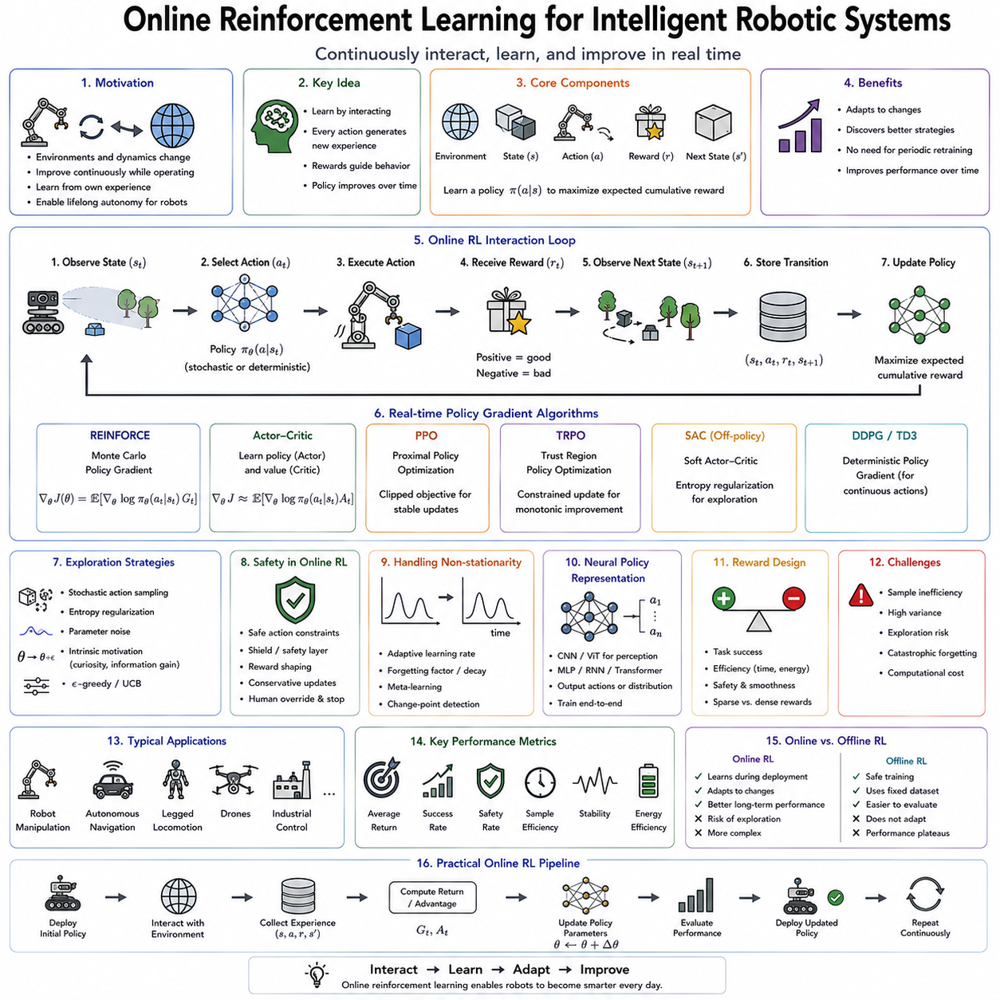{width="7.268055555555556in" height="7.268055555555556in"}

Online Reinforcement Learning extends classical reinforcement learning by allowing an intelligent agent to continuously improve its policy while interacting with the real environment in real time. Unlike offline reinforcement learning, where a policy is trained using previously collected datasets before deployment, online reinforcement learning performs learning and decision making simultaneously. Every action executed by the agent generates new experiences that immediately contribute to future policy improvement. This continuous interaction enables autonomous systems to adapt to changing environments, unknown dynamics, evolving objectives, and unexpected disturbances without requiring repeated offline retraining. As robotics moves toward lifelong autonomy and Physical AI, online reinforcement learning has become one of the fundamental technologies enabling robots to improve continuously throughout deployment.

The fundamental idea behind online reinforcement learning is that experience itself is the primary source of intelligence. Rather than relying exclusively on demonstrations or historical datasets, the agent learns directly from the consequences of its own actions. Every observation, action, reward, and state transition contributes new information regarding the environment. Successful behaviors become increasingly reinforced while unsuccessful behaviors gradually disappear through continual optimization. The robot therefore becomes progressively more competent simply by interacting with the world.

Real-time policy gradient methods represent one of the most important classes of online reinforcement learning algorithms. Instead of estimating action values first and deriving policies indirectly, policy gradient methods optimize the policy itself by directly adjusting the parameters governing action selection. The objective is to maximize the expected cumulative reward obtained through future interactions. Because the policy continuously receives fresh experience during deployment, its parameters evolve incrementally as the robot encounters new situations, allowing behavior to improve while operation continues.

A policy in reinforcement learning defines a probability distribution over actions conditioned on the current state. Given sensory observations including images, force measurements, LiDAR scans, joint positions, language commands, or environmental maps, the policy determines which action should be executed next. In deterministic policies, identical observations always produce identical actions. Stochastic policies instead produce probability distributions, allowing controlled exploration of alternative behaviors. Online policy gradient methods frequently employ stochastic policies because exploration remains essential for discovering improved strategies during continual learning.

The reinforcement learning interaction cycle naturally supports online adaptation. The robot observes the current state of the environment, selects an action according to its policy, executes that action, receives a reward from the environment, and transitions into a new state. This transition immediately becomes additional training data. Unlike supervised learning, where labeled examples must be provided externally, reinforcement learning generates its own supervision through environmental feedback. Consequently, learning proceeds continuously without requiring explicit human annotation.

Policy gradients estimate how policy parameters should change in order to increase future cumulative rewards. Every observed trajectory contributes gradient information indicating whether selected actions improved or reduced long-term performance. Positive outcomes increase the probability of similar actions under comparable future conditions, while negative outcomes reduce their likelihood. Through repeated interaction, the policy gradually converges toward behaviors maximizing expected returns under the current operating conditions.

The policy gradient theorem provides the mathematical foundation underlying these algorithms. Rather than differentiating the unknown environmental dynamics directly, the theorem expresses the policy gradient entirely through observed trajectories and policy probabilities. This property enables optimization even when the environment remains partially unknown, highly nonlinear, or physically impossible to model analytically. As a result, policy gradient methods have become particularly valuable for robotics, where accurate physical models rarely capture the full complexity of real-world interaction.

One of the defining characteristics of online reinforcement learning is continuous exploration. The agent cannot simply repeat previously successful behaviors indefinitely because environmental conditions evolve over time. New objects appear, terrain changes, sensors degrade, and task objectives shift. Controlled exploration enables discovery of improved strategies while maintaining acceptable operational performance. Balancing exploration with exploitation therefore becomes one of the central challenges of real-time reinforcement learning.

Exploration strategies vary considerably depending upon application requirements. Stochastic action sampling naturally introduces behavioral diversity during policy execution. Entropy regularization explicitly encourages broader action distributions, preventing premature convergence toward overly deterministic behaviors. Parameter noise perturbs policy weights directly, producing consistent exploratory behaviors across multiple time steps. Intrinsic motivation methods reward novelty, uncertainty reduction, or information gain, encouraging agents to investigate unfamiliar regions of the environment beyond immediate task rewards.

Safety significantly constrains exploration within real robotic systems. Unlike simulation, physical robots cannot freely execute arbitrary actions because unsafe exploration may damage equipment, harm humans, or interrupt industrial production. Safe reinforcement learning therefore incorporates explicit safety constraints alongside reward optimization. Collision avoidance, joint limits, force thresholds, workspace boundaries, and emergency stop conditions restrict exploration to physically acceptable regions while still permitting meaningful policy improvement.

Constrained policy optimization provides one important framework for safe online learning. Instead of maximizing reward alone, optimization simultaneously satisfies predefined safety constraints throughout learning. The resulting policy remains within acceptable operational limits while gradually improving task performance. Such constrained optimization has become increasingly important for collaborative robotics, autonomous vehicles, healthcare systems, and industrial automation where safety cannot be sacrificed for learning efficiency.

Real-time policy updates require careful computational design because learning occurs concurrently with robot operation. The inference process generating control commands must satisfy strict timing requirements while optimization executes asynchronously in the background. Modern robotic systems frequently separate these two processes using parallel computational pipelines. Fast inference threads maintain deterministic control frequencies while lower-priority optimization threads incorporate newly collected experiences whenever computational resources become available.

On-policy algorithms naturally support online policy gradient learning because optimization depends directly upon trajectories generated by the current policy. REINFORCE introduced the earliest policy gradient formulation using Monte Carlo trajectory returns. Actor-Critic architectures significantly improved efficiency by introducing value function estimation that reduces gradient variance. Advantage Actor-Critic further estimates relative action quality, accelerating convergence through lower-variance policy updates. Proximal Policy Optimization later stabilized online optimization by constraining excessively large policy changes between successive updates.

Actor-Critic methods have become especially influential for real-time robotics because they separate decision making from evaluation. The actor generates actions according to the current policy, while the critic estimates expected future rewards associated with observed states or state-action pairs. This dual architecture provides lower variance gradient estimates, improved sample efficiency, and smoother policy improvement than pure Monte Carlo methods. Continuous interaction continually refines both components simultaneously.

Advantage estimation further improves online learning efficiency by comparing observed returns against expected baseline values. Actions producing better-than-expected outcomes receive positive reinforcement, while less successful actions become less probable. This relative evaluation substantially reduces optimization variance while preserving unbiased policy gradient estimates. Consequently, modern online reinforcement learning frequently combines advantage estimation with actor-critic architectures.

Sample efficiency remains one of the greatest practical challenges facing online reinforcement learning. Collecting physical robot experience is considerably slower, more expensive, and riskier than generating simulated trajectories. Every trial consumes time, mechanical wear, electrical energy, and operational opportunity. Efficient policy gradient methods therefore maximize information extracted from each interaction. Experience replay, model-based prediction, world models, and learned simulators increasingly complement real experience to reduce physical sample requirements.

World models significantly enhance online reinforcement learning by learning predictive internal representations of environmental dynamics. Rather than relying exclusively upon physical interaction, the robot performs imagined rollouts within its learned world model, evaluating hypothetical actions before executing them physically. This combination of real experience and internal simulation dramatically improves sample efficiency while reducing operational risk.

Model-based reinforcement learning extends this principle further by explicitly incorporating learned dynamics models into planning and policy optimization. The agent predicts future state transitions resulting from candidate actions, allowing gradient optimization to consider long-term consequences before actual execution. Hybrid architectures combining policy gradients with learned predictive models increasingly dominate modern robot learning due to their superior efficiency.

Continuous control represents one of the principal application domains for online policy gradients. Robotic manipulators, quadrupeds, humanoids, drones, underwater vehicles, and autonomous cars all operate within continuous action spaces where discrete action-value methods become less suitable. Policy gradient algorithms naturally generate continuous motor commands, enabling smooth trajectories, precise manipulation, stable locomotion, and agile navigation under continuously changing environmental conditions.

Humanoid robotics particularly benefits from online reinforcement learning because locomotion dynamics remain difficult to model precisely. Small differences in terrain, friction, payload, actuator behavior, or mechanical wear significantly influence stability. Online adaptation enables walking policies to refine balance strategies continuously according to observed environmental conditions. Recovery from slips, uneven terrain, or unexpected disturbances gradually improves through repeated real-world experience.

Manipulation tasks likewise require continual adaptation. Grasp success depends upon object geometry, surface friction, compliance, weight distribution, and contact dynamics that often differ from simulation assumptions. Online reinforcement learning continuously refines grasp strategies based upon observed outcomes, improving manipulation reliability without requiring explicit analytical models for every object category encountered during deployment.

Industrial robotics increasingly employs online reinforcement learning for process optimization. Welding parameters, polishing trajectories, assembly forces, machining strategies, and quality inspection procedures may all improve gradually through operational feedback. Production systems continuously adjust policies to maximize product quality, minimize cycle time, reduce energy consumption, and compensate for equipment aging while maintaining uninterrupted manufacturing operations.

Human feedback increasingly complements environmental rewards within online reinforcement learning. Human operators provide preference labels, corrective interventions, natural language instructions, or evaluative feedback whenever undesirable behaviors occur. Reinforcement Learning from Human Feedback extends conventional environmental rewards by incorporating subjective human preferences into policy optimization. Such collaborative learning significantly accelerates adaptation while improving alignment with human expectations.

Reward design remains one of the most influential factors determining online learning performance. Sparse rewards provide feedback only after complete task success, making optimization difficult because intermediate actions receive little guidance. Dense rewards provide continuous evaluation throughout task execution but require careful engineering to avoid unintended behaviors exploiting poorly designed objectives. Reward shaping therefore introduces intermediate incentives encouraging progress toward final goals while preserving optimal policy structure.

Automatic reward learning increasingly reduces reliance on manually engineered reward functions. Inverse Reinforcement Learning infers hidden objectives from expert demonstrations. Preference learning estimates rewards directly from human comparisons. Contrastive representation learning constructs intrinsic objectives supporting self-supervised improvement. These approaches simplify deployment because explicit reward engineering often becomes impractical for complex real-world tasks.

Real-time reinforcement learning also benefits from hierarchical architectures. High-level policies determine long-term goals or task decomposition, while lower-level controllers optimize detailed motor execution. Each layer learns at different temporal scales, improving stability, interpretability, and sample efficiency. Hierarchical reinforcement learning therefore supports increasingly complex long-horizon robotic behaviors including assembly, warehouse logistics, household assistance, and autonomous exploration.

Multi-agent online reinforcement learning introduces additional complexity because multiple adaptive agents learn simultaneously. Warehouse robot fleets coordinate transportation tasks. Autonomous vehicles negotiate traffic interactions. Drone swarms perform collaborative surveillance. Industrial robots cooperate during manufacturing. Every agent continually adapts while influencing the environment experienced by others, creating highly non-stationary learning dynamics. Communication protocols, shared world models, centralized critics, and decentralized execution increasingly address these coordination challenges.

Cloud robotics enables fleet-level online reinforcement learning by aggregating experiences collected across many distributed robots. Individual robots perform local adaptation while periodically sharing compressed policy updates or selected experiences with centralized learning infrastructure. Improved global policies subsequently redistribute throughout the fleet, allowing every robot to benefit from collective operational knowledge accumulated across diverse environments.

Federated reinforcement learning further protects operational privacy by exchanging only policy parameters rather than raw sensor observations. Medical robots, industrial facilities, defense systems, and consumer devices collaboratively improve reinforcement learning policies without revealing sensitive operational data. Federated optimization therefore combines large-scale collective learning with practical privacy preservation.

Monitoring and evaluation remain essential because online policies continue changing throughout deployment. Unlike static models, continuously adapting policies require ongoing performance assessment. Success rate, cumulative reward, sample efficiency, adaptation speed, exploration efficiency, energy consumption, computational latency, safety violations, intervention frequency, robustness, and long-term stability all contribute to evaluating deployment quality. Continuous monitoring detects performance degradation before operational reliability becomes compromised.

Version management becomes increasingly important as policies evolve through continual updates. Every policy version records associated experiences, optimization parameters, software dependencies, hardware configurations, safety validation results, and deployment history. Complete traceability enables reproducible experimentation, safe rollback after unexpected behavior, and rigorous regulatory documentation within industrial applications.

Foundation models increasingly integrate with online reinforcement learning. Large pretrained multimodal models provide rich representations acquired through enormous offline datasets, while online policy gradients specialize these general capabilities toward specific deployment environments. Parameter-efficient adaptation techniques, retrieval augmentation, prompt optimization, and lightweight fine-tuning dramatically reduce the quantity of online interaction required for successful adaptation.

The convergence of online reinforcement learning, world models, policy gradients, foundation models, Vision-Language-Action architectures, continual learning, cloud robotics, and human collaborative supervision represents a major step toward lifelong embodied intelligence. Future autonomous systems will not rely upon fixed policies learned before deployment. Instead, they will continuously refine their behavior through every interaction, accumulate knowledge across years of operation, share experiences across fleets, personalize behavior for individual users, and safely adapt to evolving environments without interrupting ongoing tasks.

Online reinforcement learning and real-time policy gradient methods therefore constitute foundational technologies for continuously improving autonomous systems. By enabling policies to optimize directly through real-world interaction, incorporate new experiences incrementally, balance exploration with exploitation, satisfy safety constraints, leverage predictive world models, and collaborate with human supervisors, these methods transform reinforcement learning from an offline optimization procedure into a lifelong adaptive intelligence framework. As Physical AI expands into manufacturing, logistics, healthcare, agriculture, scientific exploration, domestic robotics, and autonomous transportation, online reinforcement learning will remain one of the essential mechanisms enabling intelligent machines to learn, adapt, and improve continuously throughout their operational lifetime.

온라인 강화학습(Online Reinforcement Learning)은 실제 환경에서 로봇이 작업을 수행하는 동시에 지속적으로 정책(Policy)을 개선하는 강화학습 방식이다. 기존의 오프라인 강화학습(Offline Reinforcement Learning)은 미리 수집된 데이터로 정책을 학습한 후 이를 배포하지만, 온라인 강화학습은 로봇이 실제 환경에서 행동(Action)을 수행하면서 생성되는 새로운 경험(Experience)을 즉시 학습에 반영한다. 이를 통해 변화하는 환경, 새로운 작업, 예기치 않은 상황에 지속적으로 적응할 수 있으며, 장기간 운영되는 **Physical AI** 시스템의 핵심 기술로 자리 잡고 있다.

온라인 강화학습의 핵심 철학은 "경험 자체가 지능의 원천"이라는 것이다. 사람이 반복적인 경험을 통해 능력을 향상시키는 것처럼, 로봇도 자신의 행동 결과를 통해 점차 더 나은 정책을 학습한다. 성공적인 행동은 강화되고 실패한 행동은 점차 감소하면서, 로봇은 시간이 지날수록 더욱 효율적이고 안정적인 행동 전략을 갖추게 된다.

실시간 정책 그래디언트(Real-Time Policy Gradient)는 온라인 강화학습에서 가장 중요한 학습 방법 가운데 하나이다. 가치 함수(Value Function)를 먼저 계산한 후 정책을 결정하는 것이 아니라, 정책 자체를 직접 최적화한다. 로봇이 새로운 경험을 얻을 때마다 정책의 파라미터(Parameter)를 조금씩 수정하여 미래의 누적 보상(Cumulative Reward)이 최대가 되도록 학습한다. 따라서 정책은 실제 운영 중에도 지속적으로 발전한다.

강화학습에서 정책(Policy)은 현재 상태(State)가 주어졌을 때 어떤 행동(Action)을 선택할지를 결정하는 함수이다. 입력은 카메라 영상, LiDAR, 힘 센서, 관절 상태, 지도(Map), 언어 명령(Language Instruction) 등이 될 수 있으며, 출력은 다음에 수행할 행동이다. 결정론적 정책(Deterministic Policy)은 항상 동일한 행동을 선택하지만, 확률적 정책(Stochastic Policy)은 행동의 확률 분포를 출력하여 탐험(Exploration)이 가능하도록 만든다.

온라인 강화학습은 상태(State), 행동(Action), 보상(Reward), 다음 상태(Next State)로 이루어진 반복적인 상호작용 구조를 가진다. 로봇은 현재 상태를 관찰하고 행동을 수행한 뒤 보상을 받고 새로운 상태로 이동한다. 이 과정에서 생성되는 모든 경험은 곧바로 새로운 학습 데이터가 된다. 지도학습과 달리 사람이 직접 정답(Label)을 제공하지 않아도 환경 자체가 학습 신호를 제공한다는 점이 가장 큰 특징이다.

정책 그래디언트(Policy Gradient)는 정책 파라미터를 어떤 방향으로 수정해야 미래의 누적 보상이 증가하는지를 계산한다. 성공적인 행동은 앞으로 더 자주 선택되도록 확률이 증가하고, 실패한 행동은 선택 확률이 감소한다. 이러한 과정이 반복되면서 정책은 점차 최적 정책(Optimal Policy)에 가까워진다.

정책 그래디언트 정리(Policy Gradient Theorem)는 이러한 알고리즘의 수학적 기반을 제공한다. 환경의 정확한 동역학(Dynamics)을 알지 못하더라도 실제로 수집된 경험만으로 그래디언트를 계산할 수 있기 때문에, 복잡한 현실 환경에서도 직접 정책을 최적화할 수 있다. 이러한 특성은 정확한 물리 모델을 만들기 어려운 로봇 분야에서 매우 큰 장점을 가진다.

온라인 강화학습의 가장 큰 특징 가운데 하나는 지속적인 탐험(Continuous Exploration)이다. 로봇은 과거에 성공했던 행동만 반복해서는 새로운 환경에 적응할 수 없다. 따라서 새로운 행동을 일정 확률로 시도하여 더 좋은 전략을 발견해야 한다. 이러한 탐험과 기존 정책을 활용하는 이용(Exploitation)의 균형을 맞추는 것이 매우 중요한 문제이다.

탐험 전략(Exploration Strategy)은 다양한 방법으로 구현된다. 확률적 행동 선택(Stochastic Action Sampling), 엔트로피 정규화(Entropy Regularization), 파라미터 노이즈(Parameter Noise), 내재적 동기(Intrinsic Motivation) 등이 대표적인 방법이다. 특히 내재적 동기는 새로운 환경을 탐험하거나 불확실성을 줄이는 행동 자체에 보상을 부여하여 더욱 적극적인 학습을 유도한다.

실제 로봇에서는 안전(Safety)이 탐험보다 더욱 중요하다. 시뮬레이션에서는 어떤 행동도 자유롭게 수행할 수 있지만, 실제 로봇에서는 잘못된 행동이 장비를 손상시키거나 사람에게 위험을 줄 수 있다. 따라서 안전 강화학습(Safe Reinforcement Learning)은 충돌 회피(Collision Avoidance), 관절 한계(Joint Limit), 힘 제한(Force Limit), 작업 공간 제한(Workspace Boundary) 등을 항상 만족하면서 정책을 학습한다.

제약 정책 최적화(Constrained Policy Optimization)는 보상을 최대화하면서 동시에 안전 제약을 만족시키는 대표적인 방법이다. 협동 로봇(Collaborative Robot), 자율주행차, 의료 로봇 등에서는 이러한 안전 제약이 반드시 함께 고려되어야 한다.

실시간 정책 업데이트(Real-Time Policy Update)는 높은 계산 효율을 요구한다. 로봇은 제어(Control)를 계속 수행하면서 동시에 학습도 진행해야 한다. 따라서 대부분의 시스템은 빠른 제어 스레드(Control Thread)와 백그라운드 학습 스레드(Learning Thread)를 분리하여 운영한다. 제어는 실시간으로 수행되고 학습은 남는 계산 자원을 이용하여 병렬적으로 진행된다.

온-폴리시(On-Policy) 알고리즘은 온라인 정책 그래디언트에서 가장 널리 사용된다. 대표적으로 REINFORCE, 액터-크리틱(Actor-Critic), 어드밴티지 액터-크리틱(Advantage Actor-Critic, A2C), 근접 정책 최적화(Proximal Policy Optimization, PPO) 등이 있다. 이러한 알고리즘은 현재 정책으로 생성한 경험만을 이용하여 정책을 지속적으로 업데이트한다.

액터-크리틱(Actor-Critic)은 행동을 결정하는 액터(Actor)와 행동의 가치를 평가하는 크리틱(Critic)을 분리한 구조이다. 액터는 행동을 생성하고, 크리틱은 미래의 기대 보상을 예측한다. 이러한 구조는 학습의 분산을 줄이고 샘플 효율성(Sample Efficiency)을 크게 향상시키기 때문에 실제 로봇에서 매우 널리 사용된다.

어드밴티지 추정(Advantage Estimation)은 실제 보상이 기대 보상보다 얼마나 더 좋았는지를 계산한다. 기대보다 좋은 행동은 더욱 강화되고, 그렇지 않은 행동은 감소한다. 이러한 상대적 평가 방식은 정책 업데이트의 안정성을 높이고 수렴 속도를 향상시킨다.

샘플 효율성(Sample Efficiency)은 실제 로봇에서 매우 중요한 문제이다. 시뮬레이션에서는 수백만 번의 실험이 가능하지만 실제 로봇은 시간, 비용, 장비 마모 등의 제약이 있다. 따라서 한 번의 경험에서 최대한 많은 정보를 얻는 것이 중요하며, 경험 재생(Experience Replay), 세계 모델(World Model), 시뮬레이션 등을 함께 활용하여 효율을 높인다.

세계 모델(World Model)은 온라인 강화학습의 효율을 크게 향상시킨다. 로봇은 실제 환경에서 얻은 경험을 이용하여 내부 시뮬레이터를 구축하고, 그 안에서 다양한 행동을 미리 시험해 본다. 이러한 상상(Imagination) 기반 학습은 실제 실험 횟수를 크게 줄이면서도 높은 성능을 달성할 수 있도록 만든다.

모델 기반 강화학습(Model-Based Reinforcement Learning)은 환경의 동역학 모델(Dynamics Model)을 함께 학습한다. 행동을 실행하기 전에 미래 상태를 예측하여 가장 좋은 행동을 선택하므로 샘플 효율성이 크게 향상된다. 최근에는 정책 그래디언트와 세계 모델을 결합한 하이브리드(Hybrid) 구조가 매우 활발하게 연구되고 있다.

온라인 정책 그래디언트는 연속 제어(Continuous Control)에 특히 적합하다. 로봇 팔, 휴머노이드(Humanoid), 사족보행 로봇(Quadruped), 드론(Drone), 자율주행차 등은 연속적인 모터 명령을 생성해야 하므로 정책 그래디언트 기반 알고리즘이 매우 효과적이다.

휴머노이드 로봇에서는 온라인 강화학습의 장점이 더욱 크다. 지면의 마찰(Friction), 하중(Payload), 액추에이터 상태가 조금만 달라져도 보행 성능이 크게 달라진다. 온라인 적응을 통해 균형 유지(Balance), 미끄러짐 복구(Slip Recovery), 다양한 지형 적응(Terrain Adaptation)을 지속적으로 개선할 수 있다.

조작(Manipulation) 작업에서도 지속적인 적응이 필요하다. 물체마다 무게, 형태, 마찰 계수가 다르기 때문에 동일한 파지 전략이 항상 성공하는 것은 아니다. 온라인 강화학습은 실제 조작 결과를 이용하여 파지 전략을 계속 수정함으로써 성공률을 점차 높여 간다.

산업용 로봇에서는 온라인 강화학습이 공정 최적화(Process Optimization)에 활용된다. 용접(Welding), 연마(Polishing), 조립(Assembly), 가공(Machining) 등의 작업은 장비가 마모될수록 조건이 변한다. 온라인 정책 업데이트를 통해 품질을 유지하면서 생산성을 지속적으로 향상시킬 수 있다.

최근에는 인간 피드백(Human Feedback)도 온라인 강화학습에 적극 활용되고 있다. 작업자는 자연어 명령, 선호도 비교(Preference Comparison), 수정 행동 등을 통해 로봇에게 추가적인 보상을 제공한다. 인간 피드백 기반 강화학습(Reinforcement Learning from Human Feedback, RLHF)은 환경 보상뿐 아니라 사람의 선호도까지 반영하여 정책을 더욱 빠르게 개선한다.

보상 설계(Reward Design)는 강화학습에서 매우 중요한 요소이다. 희소 보상(Sparse Reward)은 작업이 끝난 후에만 보상을 제공하기 때문에 학습이 어렵다. 반면 밀집 보상(Dense Reward)은 작업 중간에도 지속적으로 피드백을 제공하지만 잘못 설계하면 의도하지 않은 행동을 학습할 수 있다. 따라서 적절한 보상 설계(Reward Shaping)가 매우 중요하다.

최근에는 자동 보상 학습(Automatic Reward Learning)도 활발하게 연구되고 있다. 역강화학습(Inverse Reinforcement Learning, IRL)은 전문가 시범으로부터 숨겨진 보상 함수를 추정하며, 선호도 학습(Preference Learning)은 사람의 비교 결과를 이용하여 보상을 생성한다. 이러한 방법은 사람이 직접 보상 함수를 설계하는 부담을 크게 줄여 준다.

계층형 강화학습(Hierarchical Reinforcement Learning)은 장기 작업(Long-Horizon Task)에 적합하다. 상위 정책은 장기 목표를 결정하고, 하위 정책은 세부적인 모터 제어를 수행한다. 이러한 구조는 복잡한 조립, 물류, 가정 서비스, 탐사 작업 등을 더욱 효율적으로 학습할 수 있도록 만든다.

다중 에이전트 온라인 강화학습(Multi-Agent Online Reinforcement Learning)은 여러 로봇이 동시에 학습하는 환경을 다룬다. 물류 로봇, 드론 군집, 협업 로봇 등에서는 각 로봇이 서로 영향을 주기 때문에 환경 자체가 계속 변한다. 이를 해결하기 위해 중앙 집중형 크리틱(Centralized Critic), 분산 실행(Decentralized Execution), 통신 프로토콜 등이 함께 사용된다.

클라우드 로보틱스(Cloud Robotics)는 여러 로봇이 학습한 경험을 중앙 서버에서 통합한다. 각각의 로봇은 자신의 정책을 조금씩 개선하고, 그 결과를 클라우드에서 통합하여 새로운 글로벌 정책(Global Policy)을 만든 후 다시 모든 로봇에 배포한다. 이를 통해 전체 로봇 집단이 매우 빠르게 발전할 수 있다.

연합 강화학습(Federated Reinforcement Learning)은 원본 데이터를 공유하지 않고 정책 파라미터만 공유하는 방식이다. 의료, 국방, 제조와 같이 민감한 데이터를 다루는 분야에서도 개인정보를 보호하면서 집단 학습이 가능하도록 한다.

온라인 정책은 계속 변하기 때문에 지속적인 모니터링(Monitoring)이 필요하다. 작업 성공률(Task Success Rate), 누적 보상(Cumulative Reward), 샘플 효율성, 에너지 소비(Energy Consumption), 추론 지연(Inference Latency), 안전 위반 횟수(Safety Violation), 사람의 개입 빈도 등을 지속적으로 측정하여 정책의 안정성을 확인한다.

버전 관리(Model Version Management)도 매우 중요하다. 정책이 계속 변경되므로 각 버전의 학습 데이터, 하이퍼파라미터(Hyperparameter), 안전성 검증 결과, 배포 이력 등을 모두 기록해야 한다. 문제가 발생하면 언제든 이전 정책으로 되돌릴 수 있어야 한다.

최근에는 파운데이션 모델(Foundation Model)이 온라인 강화학습과 결합되고 있다. 거대한 사전학습 모델이 일반적인 지식을 제공하고, 온라인 정책 그래디언트는 실제 환경에 맞추어 이를 지속적으로 미세조정(Fine-Tuning)한다. LoRA, 검색 증강(Retrieval Augmentation), 프롬프트 최적화(Prompt Optimization) 등도 이러한 적응을 더욱 효율적으로 만든다.

온라인 강화학습, 세계 모델(World Model), 정책 그래디언트, 파운데이션 모델, 비전-언어-행동(Vision-Language-Action, VLA), 지속학습(Continual Learning), 클라우드 로보틱스, 인간 협업(Human Collaboration)이 결합되면서 평생학습 기반의 범용 로봇 지능이 현실화되고 있다. 미래의 로봇은 배포 이후에도 끊임없이 경험을 축적하고, 서로의 경험을 공유하며, 사용자에게 맞추어 스스로 발전하는 지능형 시스템으로 진화할 것이다.

결국 온라인 강화학습과 실시간 정책 그래디언트는 고정된 정책을 지속적으로 성장하는 **Physical AI**로 변화시키는 핵심 기술이다. 실제 환경에서 얻은 경험을 이용하여 정책을 직접 최적화하고, 탐험과 이용(Exploration & Exploitation)의 균형을 유지하며, 안전 제약(Safety Constraint)을 만족하고, 세계 모델과 인간 피드백을 적극 활용함으로써 로봇은 제조, 물류, 의료, 농업, 자율주행, 서비스 로봇 등 다양한 분야에서 운영되는 동안에도 스스로 학습하고 적응하며 지속적으로 성능을 향상시키는 진정한 평생학습 지능 시스템(Lifelong Intelligent System)으로 발전하게 될 것이다.

##  

## 07.04 Meta Learning MAML for Fast Robot Adaptation [w/Code]

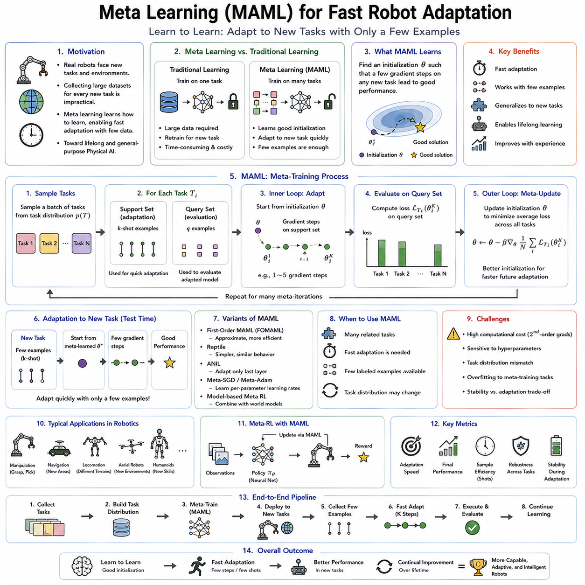{width="7.268055555555556in" height="7.268055555555556in"}

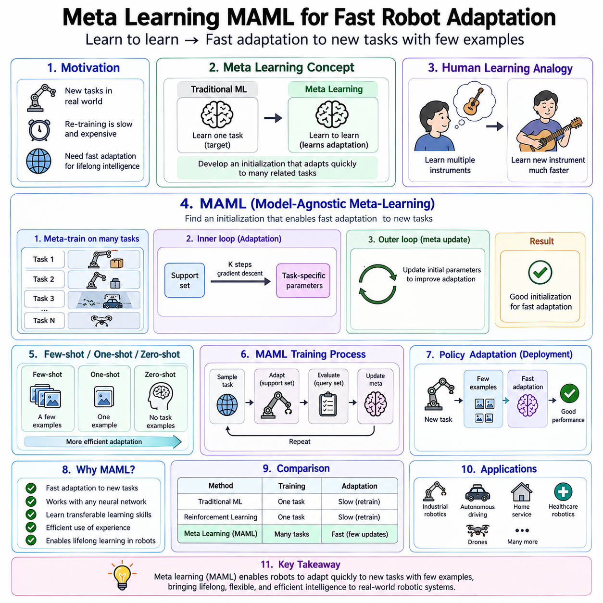{width="7.268055555555556in" height="7.268055555555556in"}

Meta learning, often described as "learning to learn," represents one of the most significant advances toward creating adaptive artificial intelligence capable of acquiring new skills rapidly from limited experience. Traditional machine learning focuses on optimizing a model for a specific task using large amounts of task-specific data. Once training is complete, adapting the model to a new task often requires collecting another extensive dataset and repeating the optimization process. Such retraining is computationally expensive, time-consuming, and impractical for robots operating in dynamic real-world environments. Meta learning addresses this limitation by training models that acquire the ability to adapt efficiently to previously unseen tasks using only a small number of examples. Rather than learning a single solution, the model learns how learning itself should occur. For autonomous robots expected to operate continuously in changing environments, this capability represents a fundamental requirement for lifelong intelligence and constitutes an important step toward general-purpose Physical AI.

The central philosophy of meta learning differs fundamentally from conventional supervised learning or reinforcement learning. Standard learning algorithms optimize parameters to perform one particular task as accurately as possible. Meta learning instead optimizes the learning process itself. During training, the system repeatedly encounters many related tasks rather than one fixed objective. Through this repeated exposure, it discovers parameter initializations, optimization strategies, representations, or adaptation mechanisms that enable rapid improvement whenever a new task appears. Consequently, the model acquires transferable learning capabilities instead of memorizing task-specific knowledge.

Human learning provides a useful analogy for understanding meta learning. A person who has learned multiple musical instruments often acquires a new instrument much more quickly than someone learning music for the first time. Similarly, an experienced engineer adapts more rapidly to unfamiliar equipment because previous experience has taught general principles extending beyond individual machines. Children also demonstrate remarkable meta-learning ability by acquiring entirely new concepts from only a handful of examples. Meta learning seeks to reproduce this remarkable flexibility within artificial learning systems.

Rapid adaptation represents the defining objective of meta learning. Real robotic systems frequently encounter situations unavailable during initial training. New tools appear within manufacturing facilities. Household service robots enter unfamiliar homes. Agricultural robots operate on different crops. Medical robots interact with diverse patients. Search-and-rescue robots navigate previously unseen disaster environments. Rather than requiring thousands of additional training examples, meta learning enables robots to adapt after only a few demonstrations, a few minutes of interaction, or even a handful of reinforcement learning episodes.

Few-shot learning naturally complements meta learning because both address adaptation under limited data availability. Few-shot learning emphasizes achieving acceptable performance from only a small number of labeled examples, while meta learning provides the mechanisms enabling such rapid adaptation. One-shot learning extends this challenge further by requiring successful adaptation from only a single example. Zero-shot learning represents an even more ambitious objective, where general prior knowledge enables competence without observing any task-specific training data. Meta learning provides a common conceptual framework connecting these increasingly efficient forms of adaptation.

Model-Agnostic Meta-Learning, commonly abbreviated as MAML, represents one of the most influential meta-learning algorithms developed for deep neural networks. The term "model-agnostic" reflects one of its greatest strengths: MAML does not depend upon any particular network architecture. Convolutional neural networks, recurrent networks, transformers, graph neural networks, reinforcement learning policies, diffusion policies, and multimodal foundation models may all employ the same underlying optimization principle. This architectural flexibility has made MAML one of the foundational algorithms for fast adaptation across diverse machine learning domains.

The central insight behind MAML is deceptively simple. Instead of learning parameters that solve one particular task optimally, MAML learns parameters that can be rapidly adapted toward many different tasks using only a few gradient updates. During meta-training, optimization searches for an initialization point from which gradient descent quickly reaches good solutions across an entire distribution of related tasks. Consequently, deployment no longer begins from random initialization but from a parameter configuration already optimized for rapid adaptation.

Meta-training differs substantially from conventional optimization. Instead of repeatedly sampling independent training examples, MAML repeatedly samples complete learning tasks. Each task contains a support set used for temporary adaptation and a query set used to evaluate the quality of that adaptation. During each meta-training iteration, the model first performs several gradient updates using the support data, producing task-specific adapted parameters. The resulting model is then evaluated on the query data. Meta-optimization subsequently updates the original initialization so that future adaptation becomes increasingly effective across all sampled tasks.

This nested optimization process produces two interconnected learning loops. The inner loop performs ordinary gradient descent adapting the model toward one specific task. The outer loop optimizes the initial parameters governing how efficiently inner-loop adaptation occurs across many tasks. These nested optimization processes distinguish MAML from conventional machine learning because the objective is no longer task performance alone but adaptation efficiency itself.

Gradient-based meta learning naturally extends familiar optimization algorithms. Standard gradient descent minimizes prediction error for one task. MAML instead differentiates through the adaptation process itself, estimating how modifications to initial parameters influence future adaptation quality after several gradient updates. Although computationally more demanding than ordinary supervised learning, this higher-order optimization enables remarkably rapid adaptation once meta-training has completed.

The support-query separation plays a fundamental conceptual role within MAML. The support set represents the limited information available when encountering a new task during deployment. The query set evaluates how successfully the adapted model generalizes beyond those few examples. Meta-training therefore explicitly simulates future deployment conditions where adaptation must occur under severe data limitations. This realistic optimization objective contributes significantly to MAML\'s practical effectiveness.

Fast robot adaptation represents one of the most compelling applications of MAML. Consider a robotic manipulator trained to grasp hundreds of household objects. Traditional learning may require extensive retraining whenever a new object appears. A meta-trained manipulator instead begins from an initialization specifically optimized for rapid adaptation. After grasping the unfamiliar object only several times, the robot refines its policy sufficiently to manipulate the new object reliably. Such rapid adaptation dramatically reduces operational downtime while increasing deployment flexibility.

Locomotion provides another important application. Walking robots frequently encounter surfaces differing from those experienced during initial training. Grass, gravel, sand, snow, mud, metal flooring, and uneven terrain each exhibit distinct physical characteristics affecting stability. Rather than requiring lengthy retraining whenever terrain changes, meta-learned locomotion policies adapt after only a small number of interactions, allowing continuous mobility across diverse environments.

Industrial robotics similarly benefits from rapid adaptation. Production facilities regularly introduce new products, tooling configurations, assembly procedures, and manufacturing tolerances. Meta-trained assembly policies quickly adjust insertion forces, manipulation trajectories, or grasp configurations using only limited calibration data collected during production setup. Such rapid adaptation significantly reduces commissioning time while increasing manufacturing flexibility.

Robot perception also benefits from meta learning. Camera characteristics, illumination conditions, object appearances, and environmental backgrounds vary substantially across deployment locations. Meta-trained perception systems rapidly adapt feature representations using only a few labeled observations collected after installation. Consequently, visual recognition remains accurate despite changing environmental conditions without requiring complete dataset reconstruction.

Meta reinforcement learning extends these principles beyond supervised learning toward sequential decision making. Rather than learning policies directly, the system learns how reinforcement learning itself should adapt across related tasks. During deployment, only a few episodes of environmental interaction suffice for substantial policy improvement. Meta reinforcement learning therefore significantly reduces exploration requirements compared with conventional reinforcement learning, making real-world robotic deployment considerably more practical.

Context-based meta learning provides an alternative adaptation mechanism. Instead of explicitly updating network parameters through gradient descent, recurrent neural networks, transformers, or latent variable models infer task identity directly from recent observations. Hidden internal states gradually encode task-specific information, allowing rapid behavioral adaptation without modifying model parameters explicitly. Such implicit adaptation often proves computationally more efficient than gradient-based optimization during deployment.

Optimization-based, memory-based, and model-based meta learning represent three major categories of meta-learning algorithms. Optimization-based methods including MAML learn favorable parameter initializations. Memory-based approaches employ external memory structures storing prior experiences available for rapid retrieval during adaptation. Model-based approaches modify internal architectures enabling fast inference of task-specific behavior through learned latent representations. Contemporary research increasingly combines these complementary mechanisms into unified adaptive learning architectures.

Representation learning plays an essential role within meta learning because transferable features often contribute more significantly than task-specific parameters. Visual representations capturing object geometry, texture, physical affordances, and semantic relationships remain useful across numerous robotic tasks. Meta training therefore encourages representations supporting efficient adaptation rather than merely maximizing immediate task accuracy. Large multimodal foundation models increasingly provide such transferable representations before deployment-specific meta adaptation begins.

Task diversity strongly influences meta-learning performance. Meta-training must encompass sufficiently varied tasks to expose common structural regularities without becoming so diverse that meaningful shared knowledge disappears. Robotic manipulation datasets therefore frequently include grasping, pushing, stacking, insertion, opening, tool use, and deformable object interaction. Exposure to broad task distributions enables robust adaptation toward previously unseen combinations encountered during deployment.

Simulation has become indispensable for meta learning because collecting thousands of physical adaptation tasks would prove prohibitively expensive. High-fidelity simulators generate enormous task distributions through domain randomization, procedural environment generation, object variation, and physical parameter sampling. Meta-trained policies subsequently transfer toward physical robots using comparatively limited real-world adaptation. This combination substantially reduces development cost while maintaining strong adaptation capability.

Domain randomization naturally complements meta learning by exposing models to extensive environmental diversity before deployment. Object appearances, lighting conditions, textures, dynamics, sensor noise, friction coefficients, camera positions, and actuator characteristics vary continuously throughout simulation. Meta optimization consequently discovers parameter initializations robust across broad operating conditions, improving sim-to-real transfer significantly.

Catastrophic forgetting remains relevant within meta learning because continual adaptation may overwrite previously acquired knowledge. Memory replay, regularization, parameter isolation, and modular architectures therefore frequently complement MAML during long-term deployment. The resulting systems preserve broad adaptation capabilities while continually incorporating newly encountered experiences throughout operational lifetime.

Online meta learning extends MAML toward lifelong adaptation. Rather than ending meta optimization before deployment, robots continue refining their adaptation mechanisms while interacting with the real world. Every newly encountered task contributes not only task-specific knowledge but also improved understanding of how future adaptation should proceed. Consequently, the robot gradually becomes progressively better at learning itself, not merely at performing individual tasks.

Uncertainty estimation further enhances fast adaptation. Bayesian meta learning maintains probability distributions over parameters, enabling robots to distinguish familiar situations requiring little adaptation from highly uncertain environments demanding additional exploration. Confidence-aware adaptation reduces unnecessary parameter updates while directing learning resources toward genuinely novel operating conditions.

Human guidance significantly accelerates meta adaptation. Demonstrations, corrective interventions, preference feedback, language instructions, and semantic explanations all provide highly informative adaptation signals. Human supervisors therefore function not merely as data annotators but as teachers shaping the robot\'s adaptation process itself. Such collaborative meta learning combines human expertise with autonomous optimization throughout deployment.

Vision-Language-Action models increasingly integrate meta-learning principles. Large pretrained multimodal representations provide broad general knowledge regarding objects, language, physical interactions, and manipulation strategies. MAML-style adaptation subsequently specializes these representations toward individual robots, users, environments, and tasks using remarkably small quantities of task-specific experience. This combination dramatically reduces adaptation time while preserving broad generalization capabilities.

Diffusion policies likewise benefit from meta learning. Rather than training diffusion models separately for every manipulation task, meta optimization produces initial diffusion parameters rapidly adaptable toward novel manipulation objectives. Fine motor behaviors therefore emerge after comparatively few demonstrations, making diffusion-based robot control increasingly practical for real-world deployment.

Cloud robotics extends fast adaptation beyond individual robots toward collective intelligence. Multiple robots independently encounter diverse tasks while periodically sharing adaptation experiences through centralized cloud infrastructure. Meta optimization aggregates these distributed learning episodes into improved global initialization parameters redistributed throughout the fleet. Every robot consequently benefits from adaptation experiences accumulated across the entire deployment network, substantially accelerating collective learning.

Evaluation of meta-learning systems differs from conventional supervised learning benchmarks. Success depends not only upon final task performance but also upon adaptation speed, sample efficiency, computational cost, memory usage, robustness across unseen tasks, transfer capability, and long-term operational stability. Standard evaluation protocols therefore measure performance after one, five, or ten adaptation steps rather than only after complete optimization convergence.

The convergence of meta learning, continual learning, online reinforcement learning, foundation models, world models, diffusion policies, Vision-Language-Action architectures, and cloud robotics represents an important milestone toward Artificial General Intelligence for embodied systems. Future robots will no longer depend upon extensive retraining whenever new tasks emerge. Instead, they will rapidly adapt existing knowledge toward unfamiliar situations, continually improving their own learning strategies through every deployment experience while sharing adaptation knowledge collectively across entire robotic fleets.

Meta learning and MAML therefore represent foundational technologies enabling fast robot adaptation under realistic operational constraints. By optimizing learning itself rather than individual tasks, discovering parameter initializations supporting rapid gradient-based adaptation, leveraging transferable representations, integrating continual online improvement, and combining human guidance with autonomous optimization, these methods transform robotic learning from slow task-specific optimization into a flexible lifelong adaptation framework. As Physical AI advances toward truly general-purpose autonomous intelligence, meta learning will remain one of the essential mechanisms allowing robots to acquire new capabilities quickly, efficiently, and safely throughout their entire operational lifetime.

메타학습(Meta Learning)은 흔히 **\'학습하는 방법을 학습하는 것(Learning to Learn)\'** 이라고 불리는 차세대 머신러닝 패러다임이다. 기존 머신러닝은 하나의 특정 작업(Task)을 해결하기 위해 대량의 데이터를 사용하여 모델을 학습하지만, 새로운 작업이 등장하면 다시 많은 데이터를 수집하고 처음부터 학습해야 한다. 반면 메타학습은 새로운 작업을 매우 적은 데이터만으로도 빠르게 학습할 수 있도록 모델 자체를 훈련한다. 즉, 특정 문제를 푸는 능력이 아니라 새로운 문제를 빠르게 배우는 능력을 학습하는 것이 핵심이다. 이러한 특성은 다양한 환경에서 지속적으로 새로운 작업을 수행해야 하는 **Physical AI**와 범용 로봇(General-Purpose Robot)에 매우 중요한 기술이다.

메타학습의 철학은 기존 지도학습(Supervised Learning)이나 강화학습(Reinforcement Learning)과 근본적으로 다르다. 일반적인 학습은 하나의 작업에서 최고의 성능을 얻는 것을 목표로 하지만, 메타학습은 다양한 작업(Task)을 반복적으로 경험하면서 새로운 작업을 얼마나 빨리 배울 수 있는지를 최적화한다. 따라서 모델은 특정 작업을 암기하는 것이 아니라 여러 작업에서 공통적으로 사용할 수 있는 학습 능력 자체를 습득하게 된다.

인간의 학습 과정은 메타학습을 이해하는 좋은 예이다. 여러 악기를 배운 사람은 새로운 악기를 훨씬 빨리 익히며, 다양한 기계를 다루어 본 엔지니어는 새로운 장비도 쉽게 이해한다. 어린아이도 단 몇 번의 예시만 보고 새로운 개념을 학습하는 능력을 가진다. 메타학습은 이러한 인간의 빠른 적응 능력을 인공지능 시스템에서 구현하려는 연구 분야이다.

빠른 적응(Fast Adaptation)은 메타학습의 가장 중요한 목표이다. 실제 로봇은 공장에서 새로운 공구를 만나거나, 가정에서 새로운 가전제품을 사용하거나, 농업 현장에서 새로운 작물을 다루는 등 학습하지 않았던 환경을 계속 만나게 된다. 메타학습은 이러한 새로운 상황에서도 몇 번의 시연(Demonstration)이나 몇 번의 상호작용만으로 새로운 작업을 수행할 수 있도록 만든다.

소수 샘플 학습(Few-Shot Learning)은 메타학습과 매우 밀접한 관계를 가진다. Few-Shot Learning은 매우 적은 데이터만으로 새로운 작업을 학습하는 문제를 의미하며, 메타학습은 이를 가능하게 하는 핵심 방법론이다. 한 개의 데이터만 사용하는 원샷 학습(One-Shot Learning), 학습 데이터 없이 기존 지식만으로 수행하는 제로샷 학습(Zero-Shot Learning)도 모두 메타학습의 연장선에 있는 개념이다.

모델 불가지론적 메타학습(Model-Agnostic Meta-Learning, MAML)은 가장 대표적인 메타학습 알고리즘이다. \'모델 불가지론적(Model-Agnostic)\'이라는 이름은 특정 신경망 구조에 의존하지 않는다는 의미이다. CNN, RNN, Transformer, 그래프 신경망(Graph Neural Network), 강화학습 정책, 확산 정책(Diffusion Policy), 멀티모달 모델 등 거의 모든 신경망 구조에 동일한 원리를 적용할 수 있기 때문에 매우 널리 사용되고 있다.

MAML의 핵심 아이디어는 매우 단순하면서도 강력하다. 하나의 작업을 가장 잘 해결하는 파라미터를 찾는 것이 아니라, 다양한 작업에 대해 몇 번의 그래디언트 업데이트(Gradient Update)만으로 빠르게 적응할 수 있는 초기 파라미터(Initialization Parameter)를 학습한다. 즉, 완성된 모델을 만드는 것이 아니라 \'빠르게 학습할 수 있는 출발점(Start Point)\'을 찾는 것이 목표이다.

메타학습의 학습 과정(Meta-Training)은 일반적인 머신러닝과 크게 다르다. 하나의 데이터셋을 반복해서 학습하는 대신, 수많은 서로 다른 작업(Task)을 반복적으로 선택한다. 각 작업은 지원 집합(Support Set)과 질의 집합(Query Set)으로 구성된다. Support Set은 빠른 적응을 수행하는 데 사용되고, Query Set은 적응 이후의 성능을 평가하는 데 사용된다. 이러한 구조를 반복하면서 모델은 새로운 작업에 빠르게 적응하는 방법 자체를 배우게 된다.

MAML은 두 개의 학습 루프(Learning Loop)를 가진다. 내부 루프(Inner Loop)는 특정 작업에 대해 일반적인 경사하강법(Gradient Descent)을 수행한다. 외부 루프(Outer Loop)는 이러한 적응 과정이 더욱 효율적으로 이루어지도록 초기 파라미터를 수정한다. 즉, 내부 루프는 작업을 배우고, 외부 루프는 배우는 방법을 배우는 역할을 한다.

그래디언트 기반 메타학습(Gradient-Based Meta Learning)은 기존 최적화 알고리즘을 확장한 형태이다. 일반적인 경사하강법은 하나의 작업에서 오차를 최소화하지만, MAML은 \'몇 번의 학습 후 얼마나 빨리 적응하는가\' 자체를 미분하여 최적화한다. 이러한 고차 미분(Higher-Order Differentiation)은 계산량은 증가하지만 매우 뛰어난 적응 성능을 제공한다.

Support Set과 Query Set의 분리는 메타학습에서 매우 중요한 개념이다. Support Set은 실제 배포 환경에서 사용할 수 있는 제한된 데이터이며, Query Set은 적응된 모델이 얼마나 일반화(Generalization)되었는지를 평가한다. 따라서 메타학습은 실제 환경에서 적은 데이터만으로 적응해야 하는 상황을 학습 과정에서 미리 경험하도록 만든다.

빠른 로봇 적응(Fast Robot Adaptation)은 메타학습의 대표적인 응용 분야이다. 예를 들어 로봇 팔이 수백 개의 물체를 학습한 이후 새로운 물체를 만나더라도 몇 번만 잡아 보면 안정적으로 조작할 수 있다. 기존 방식처럼 새로운 물체마다 수천 개의 데이터를 다시 수집할 필요가 없기 때문에 생산성과 활용성이 크게 향상된다.

보행 로봇(Locomotion Robot)도 메타학습의 큰 혜택을 받는다. 잔디, 자갈, 모래, 눈길, 진흙, 금속 바닥 등은 모두 서로 다른 마찰 특성을 가진다. 메타학습된 보행 정책은 이러한 새로운 지형에서도 몇 번의 걸음만으로 균형을 유지하고 안정적으로 보행할 수 있도록 빠르게 적응한다.

산업용 로봇(Industrial Robot)은 새로운 제품과 조립 공정이 계속 추가된다. 메타학습은 새로운 공정에서도 소량의 보정 데이터만으로 삽입 힘(Insertion Force), 조립 경로(Assembly Trajectory), 파지 자세(Grasp Pose)를 빠르게 최적화할 수 있도록 한다. 따라서 생산 라인의 준비 시간이 크게 단축된다.

로봇 인식(Robot Perception)도 메타학습의 중요한 적용 분야이다. 카메라 특성, 조명, 배경, 물체의 외형은 설치 장소마다 달라진다. 메타학습된 인식 시스템은 몇 장의 새로운 이미지와 소량의 레이블만으로 새로운 환경에 빠르게 적응하여 높은 인식 성능을 유지할 수 있다.

메타 강화학습(Meta Reinforcement Learning)은 강화학습에도 메타학습을 적용한 형태이다. 특정 정책을 학습하는 것이 아니라 강화학습 자체를 빠르게 수행하는 방법을 학습한다. 따라서 새로운 환경에서도 몇 번의 에피소드(Episode)만으로 새로운 정책을 효율적으로 학습할 수 있어 실제 로봇에서 매우 유용하다.

문맥 기반 메타학습(Context-Based Meta Learning)은 파라미터를 직접 수정하지 않고 최근 관측 정보만으로 현재 작업을 추론하는 방법이다. RNN, Transformer, 잠재 변수 모델(Latent Variable Model) 등을 이용하여 내부 상태(Hidden State)가 현재 작업의 특성을 기억하도록 만든다. 이러한 방식은 파라미터 업데이트 없이도 매우 빠른 적응이 가능하다.

메타학습은 크게 최적화 기반(Optimization-Based), 메모리 기반(Memory-Based), 모델 기반(Model-Based) 접근법으로 나눌 수 있다. 최적화 기반은 MAML처럼 빠른 초기 파라미터를 학습하며, 메모리 기반은 과거 경험을 저장하여 활용하고, 모델 기반은 잠재 표현(Latent Representation)을 이용하여 새로운 작업을 빠르게 추론한다. 최근에는 이 세 가지 방식을 함께 사용하는 연구가 증가하고 있다.

표현 학습(Representation Learning)은 메타학습에서 매우 중요한 역할을 한다. 물체의 형태, 질감(Texture), 물리적 특성(Affordance), 의미 정보(Semantic Relationship) 등을 잘 표현하는 특징은 다양한 작업에서 공통적으로 활용될 수 있다. 따라서 메타학습은 특정 작업보다 다양한 작업에 잘 적용되는 표현을 학습하는 데 중점을 둔다.

작업 다양성(Task Diversity)은 메타학습 성능을 결정하는 중요한 요소이다. 조작, 밀기, 쌓기(Stacking), 삽입(Insertion), 문 열기, 도구 사용(Tool Use), 변형 물체 조작 등 다양한 작업을 함께 학습해야 새로운 작업에도 빠르게 적응할 수 있다. 너무 단순한 작업만 학습하면 일반화 능력이 떨어지고, 너무 다양한 작업만 학습하면 공통 패턴을 찾기 어려워진다.

시뮬레이션(Simulation)은 메타학습에서 매우 중요한 역할을 한다. 실제 로봇으로 수천 개의 작업을 수행하는 것은 비용과 시간이 너무 많이 들기 때문에 대부분의 메타학습은 시뮬레이터에서 수행된다. 다양한 물체, 환경, 마찰, 센서 노이즈 등을 무작위로 생성하는 도메인 랜덤화(Domain Randomization)를 함께 사용하면 실제 환경으로의 전이(Sim-to-Real Transfer) 성능도 크게 향상된다.

재앙적 망각(Catastrophic Forgetting)은 메타학습에서도 중요한 문제이다. 새로운 작업에 적응하면서 이전에 학습한 적응 능력을 잃어버릴 수 있기 때문이다. 이를 해결하기 위해 경험 재생(Experience Replay), 정규화(Regularization), 모듈형 구조(Modular Architecture) 등이 함께 사용된다.

온라인 메타학습(Online Meta Learning)은 MAML을 평생학습(Lifelong Learning)으로 확장한 개념이다. 메타학습이 배포 전에 끝나는 것이 아니라 실제 운영 중에도 계속 수행된다. 새로운 작업을 경험할 때마다 단순히 작업만 배우는 것이 아니라 앞으로 더 빠르게 배우는 방법 자체도 함께 개선된다.

불확실성 추정(Uncertainty Estimation)은 빠른 적응을 더욱 효율적으로 만든다. 베이지안 메타학습(Bayesian Meta Learning)은 파라미터를 확률 분포로 표현하여 현재 환경이 익숙한지 새로운지 판단한다. 익숙한 환경에서는 적응을 최소화하고, 새로운 환경에서는 적극적으로 학습을 수행하여 효율적인 적응이 가능하도록 만든다.

인간의 도움(Human Guidance)은 메타학습을 더욱 빠르게 만든다. 전문가 시범(Demonstration), 수정 행동(Corrective Intervention), 선호도 피드백(Preference Feedback), 자연어 설명(Language Instruction) 등은 매우 강력한 학습 신호가 된다. 사람은 단순히 데이터를 제공하는 존재가 아니라 로봇의 학습 능력 자체를 향상시키는 교사 역할을 수행한다.

비전-언어-행동(Vision-Language-Action, VLA) 모델도 메타학습과 결합되고 있다. 대규모 사전학습 모델은 폭넓은 일반 지식을 제공하고, MAML은 이를 특정 로봇, 특정 사용자, 특정 작업에 맞게 매우 적은 데이터만으로 빠르게 적응시킨다. 이러한 구조는 실제 산업 현장에서 매우 높은 활용 가능성을 보여주고 있다.

확산 정책(Diffusion Policy) 역시 메타학습과 결합될 수 있다. 작업마다 새로운 확산 모델을 학습하는 대신, 메타학습을 통해 빠르게 적응 가능한 초기 확산 모델을 구축하면 새로운 조작 작업도 몇 번의 시연만으로 학습할 수 있다.

클라우드 로보틱스(Cloud Robotics)는 메타학습을 여러 로봇으로 확장한다. 각각의 로봇이 다양한 작업에서 적응한 경험을 클라우드에 모으면 전체 로봇 집단을 위한 더욱 우수한 초기 파라미터를 학습할 수 있다. 이후 이 초기 파라미터를 다시 모든 로봇에 배포하면 전체 로봇의 적응 속도가 지속적으로 향상된다.

메타학습의 평가는 일반적인 정확도만으로 이루어지지 않는다. 새로운 작업에 적응하는 속도(Adaptation Speed), 필요한 데이터 수(Sample Efficiency), 계산 비용(Computational Cost), 메모리 사용량(Memory Usage), 일반화 능력(Generalization), 전이 성능(Transfer Learning), 장기적인 안정성(Long-Term Stability) 등을 함께 평가한다. 특히 한 번, 다섯 번, 열 번의 업데이트 후 성능을 비교하는 것이 일반적인 평가 방법이다.

최근에는 메타학습, 지속학습(Continual Learning), 온라인 강화학습(Online Reinforcement Learning), 파운데이션 모델(Foundation Model), 세계 모델(World Model), 확산 정책(Diffusion Policy), 비전-언어-행동(VLA), 클라우드 로보틱스가 하나의 통합 구조로 발전하고 있다. 미래의 로봇은 새로운 작업을 만날 때마다 처음부터 다시 배우는 것이 아니라 기존 지식을 빠르게 수정하여 즉시 적응하고, 그 적응 경험을 다른 로봇들과 공유하는 집단 지능(Collective Intelligence)을 갖게 될 것이다.

결국 메타학습과 MAML은 **\'작업을 학습하는 것이 아니라 학습 자체를 학습하는 기술\'** 이다. 빠른 초기 파라미터를 학습하고, 적은 데이터만으로 새로운 작업에 적응하며, 전이 가능한 표현(Transferable Representation)을 구축하고, 지속적인 온라인 적응과 인간의 지식을 결합함으로써 로봇은 느린 작업별 학습에서 벗어나 평생 동안 새로운 능력을 빠르게 습득하는 **Physical AI** 시스템으로 발전하게 된다. 범용 인공지능 로봇(Artificial General Intelligence for Robotics)을 실현하기 위해 메타학습은 앞으로도 가장 핵심적인 기반 기술 가운데 하나로 자리매김할 것이다.

##  

## 07.05 Few Shot Online Adaptation to New Environments [w/Code]

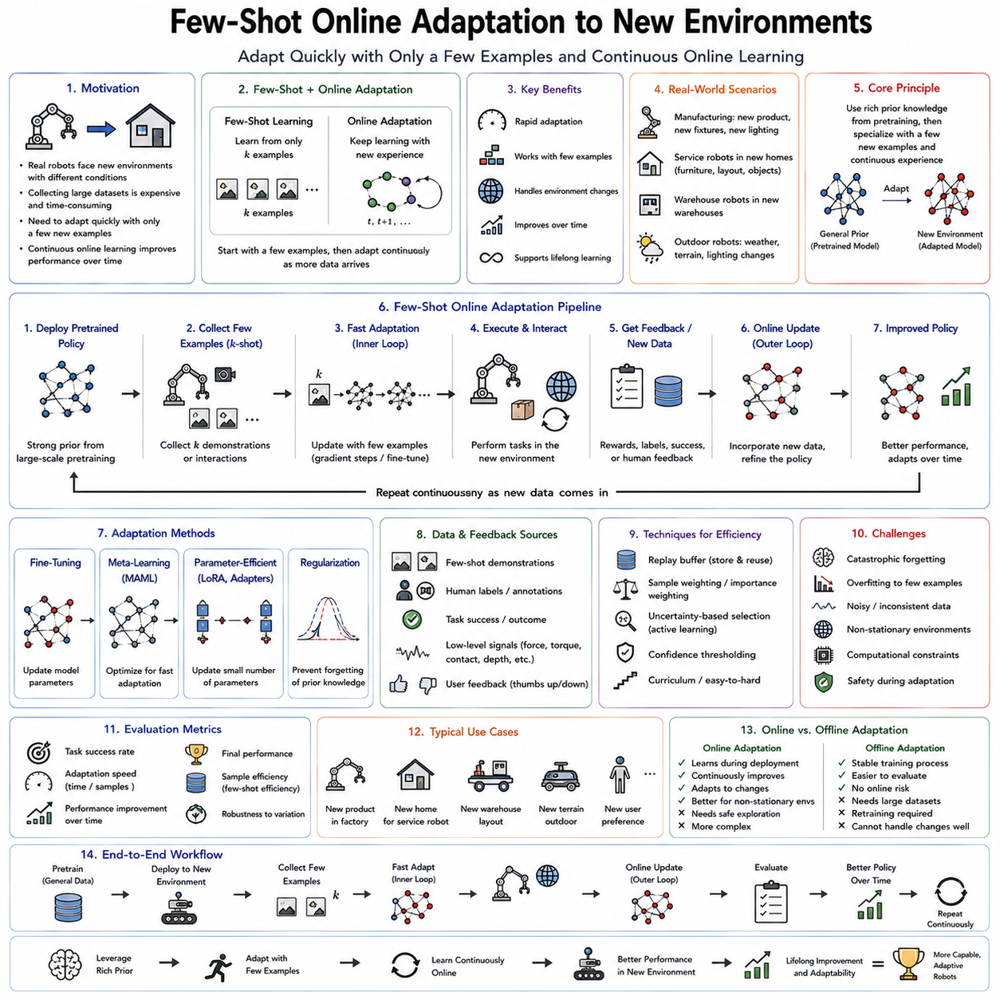{width="7.268055555555556in" height="7.268055555555556in"}

Few-shot online adaptation represents one of the most important capabilities required for intelligent robots operating in dynamic real-world environments. It combines two complementary ideas that have emerged from modern machine learning. Few-shot learning enables a model to acquire new knowledge from only a small number of examples, while online adaptation allows learning to continue during deployment as new experiences become available. Together, these concepts allow robotic systems to enter unfamiliar environments, observe only a handful of demonstrations or interactions, and rapidly adjust their behavior without requiring extensive retraining. As autonomous systems increasingly operate outside carefully controlled laboratory settings, few-shot online adaptation has become a cornerstone technology for lifelong learning, embodied intelligence, and Physical AI.

Traditional machine learning assumes that the training dataset sufficiently represents the deployment environment. After optimization is complete, the learned model is expected to generalize to future situations without significant modification. Although this assumption has been successful for many benchmark problems, it rarely holds in practical robotics. Every deployment environment introduces unique combinations of objects, lighting conditions, surface properties, human behaviors, sensor characteristics, weather conditions, and operational constraints. Collecting large labeled datasets for every new environment is both expensive and time-consuming. Few-shot online adaptation addresses this challenge by enabling continuous learning from a very limited number of new observations collected directly after deployment.

The motivation for few-shot adaptation becomes particularly clear when considering real industrial robots. A robotic manipulator trained in one manufacturing facility may later be installed in another factory producing slightly different products. The camera positions differ, lighting conditions change, conveyor speeds vary, fixtures are modified, and operators organize workstations differently. Although the overall task remains similar, these seemingly minor environmental differences can significantly reduce the performance of a fixed policy. Instead of collecting thousands of additional demonstrations, a few-shot adaptation system requires only a small number of calibration examples before restoring high performance.

The same principle applies to service robotics. A domestic robot trained in one apartment may later enter a completely different home containing unfamiliar furniture layouts, decorations, floor materials, lighting conditions, and household objects. While the robot already understands general manipulation and navigation principles, it must adapt its perception, planning, and control policies to these new surroundings. Few-shot online adaptation allows this adjustment to occur naturally through limited interaction during the first hours of deployment rather than requiring lengthy retraining procedures.

Few-shot online adaptation differs fundamentally from conventional transfer learning. Transfer learning typically assumes that adaptation occurs before deployment using a predefined adaptation dataset collected specifically for the target domain. Online adaptation instead performs learning continuously during operation. New observations immediately contribute to parameter updates while the robot remains actively performing tasks. Consequently, adaptation becomes an ongoing process rather than a separate training stage preceding deployment.

This continuous adaptation capability closely resembles biological learning. Humans rarely require thousands of repeated experiences before functioning effectively within new environments. Upon entering an unfamiliar building, individuals rapidly learn door locations, lighting conditions, room layouts, and navigation paths after only limited exploration. Drivers quickly adapt to different vehicles after several minutes of operation. Musicians adjust to unfamiliar instruments after playing only a few passages. Few-shot online adaptation seeks to reproduce this remarkable efficiency within artificial learning systems.

The success of few-shot adaptation depends heavily upon previously acquired prior knowledge. The robot does not begin learning from random initialization after deployment. Instead, it starts from rich representations developed through extensive pretraining across diverse environments, tasks, and object categories. These pretrained representations capture general principles regarding geometry, physics, semantics, manipulation, navigation, and perception. Few-shot adaptation subsequently specializes these broad capabilities toward the specific deployment environment using only limited additional experience.

Representation quality therefore becomes more important than simply maximizing benchmark accuracy. Highly transferable representations enable rapid adaptation because they separate general environmental structure from deployment-specific details. Visual representations capturing object geometry remain useful despite changing textures. Language representations generalize across different instructions expressing similar intentions. Manipulation representations encode grasp affordances transferable across related object categories. Such reusable abstractions dramatically reduce the amount of adaptation data required.

Foundation models have significantly accelerated progress in few-shot adaptation. Large-scale pretrained vision models, language models, multimodal models, and Vision-Language-Action architectures already possess broad knowledge acquired from enormous datasets. Instead of learning basic concepts during deployment, robots only adjust these existing representations toward local environmental characteristics. Parameter-efficient adaptation techniques such as adapters, low-rank adaptation, prompt tuning, and lightweight fine-tuning further reduce computational requirements while preserving previously acquired knowledge.

Online adaptation occurs at multiple levels within the robotic system. Perception modules gradually improve recognition accuracy under local lighting conditions. Localization systems refine environmental maps as new observations become available. Navigation policies learn local traffic patterns, floor friction, and obstacle configurations. Manipulation controllers adapt grasp forces, insertion trajectories, and contact models according to observed physical interactions. Higher-level reasoning modules acquire semantic knowledge regarding user preferences, workspace organization, and task-specific conventions. Together these adaptations produce an increasingly personalized and efficient robotic system.

Few-shot adaptation may involve supervised, self-supervised, reinforcement, or imitation learning depending upon available feedback. Supervised adaptation incorporates limited labeled examples provided by human operators. Self-supervised adaptation exploits consistency among multimodal observations without requiring explicit labels. Reinforcement learning improves behavior through reward signals generated by successful task completion. Imitation learning adapts policies from only several demonstrations performed by experienced users. Modern robotic systems increasingly integrate all these learning paradigms simultaneously within unified adaptation frameworks.

Self-supervised adaptation has become particularly attractive because obtaining labeled data during deployment is often impractical. Instead of requiring human annotation, robots exploit temporal consistency, geometric constraints, sensor agreement, predictive modeling, or cross-modal correspondence as intrinsic supervisory signals. A robot repeatedly observing the same object from different viewpoints gradually improves its visual representation without receiving explicit category labels. Such autonomous adaptation substantially reduces deployment cost while enabling continual improvement.

Contrastive learning provides another powerful mechanism supporting few-shot adaptation. Representations learned through contrastive objectives naturally organize semantically similar observations nearby within latent space while separating unrelated experiences. During deployment, only a handful of new examples suffice to reorganize local latent structure around unfamiliar environmental features. Consequently, downstream recognition, retrieval, planning, and control modules rapidly benefit from improved representations despite limited adaptation data.

Parameter-efficient adaptation has become increasingly important because updating every parameter within modern foundation models is computationally expensive. Low-Rank Adaptation introduces compact trainable matrices modifying frozen pretrained weights without changing the original parameters directly. Adapters insert lightweight modules throughout pretrained networks, allowing deployment-specific learning while preserving global representations. Prompt tuning modifies only learned prompts guiding existing models rather than retraining complete architectures. These techniques enable online adaptation even on embedded robotic hardware possessing limited computational resources.

Meta learning naturally complements few-shot adaptation because both emphasize rapid learning from limited experience. During meta-training, robots encounter diverse tasks specifically chosen to encourage efficient future adaptation. Algorithms such as Model-Agnostic Meta-Learning optimize parameter initializations supporting fast gradient-based specialization. Consequently, deployment adaptation requires only a few examples because meta-training has already optimized the learning process itself rather than merely solving individual tasks.

Memory systems further improve online adaptation. Instead of immediately overwriting existing knowledge, robots maintain episodic memories containing representative deployment experiences. Similar situations encountered later retrieve relevant historical examples supporting more informed adaptation. Semantic memory gradually accumulates generalized knowledge extracted from repeated experiences, while episodic memory preserves individual deployment events. This hierarchical memory organization closely resembles biological cognition and substantially enhances long-term adaptation.

Experience replay reduces catastrophic forgetting during continual adaptation. Recent observations combine with carefully selected historical examples during optimization, preserving previously acquired competencies while incorporating new environmental information. Prioritized replay emphasizes informative experiences producing large prediction errors or significant uncertainty. Reservoir sampling maintains representative historical subsets despite unlimited data streams. Such memory management strategies stabilize adaptation throughout prolonged deployment.

Environmental variability introduces diverse adaptation challenges. Illumination changes influence visual perception. Temperature affects sensor calibration. Humidity modifies friction coefficients. Dust accumulates on camera lenses. Mechanical wear gradually alters actuator characteristics. Human users reorganize workspaces. Furniture moves. Seasonal weather changes terrain conditions. Successful few-shot adaptation must accommodate all these evolving factors without sacrificing previously acquired capabilities.

Distribution shift provides the theoretical framework describing these changes. The statistical relationship between observations and desired outputs evolves after deployment, violating assumptions underlying conventional supervised learning. Few-shot adaptation estimates how pretrained models should change to accommodate new distributions while preserving broad generalization ability. Detecting distribution shift therefore becomes essential before meaningful adaptation can begin.

Uncertainty estimation plays a central role because robots must distinguish familiar situations from genuinely novel environments. Bayesian neural networks, ensemble models, evidential learning, Monte Carlo dropout, and probabilistic calibration estimate confidence associated with current predictions. Low-confidence observations indicate unfamiliar operating conditions requiring additional adaptation. High-confidence predictions instead suggest existing knowledge remains adequate without unnecessary parameter updates.

Active learning further improves adaptation efficiency by selecting the most informative observations for human annotation. Rather than requesting labels indiscriminately, robots identify uncertain examples, surprising observations, ambiguous object categories, or situations exhibiting substantial disagreement among multiple predictive models. Human supervision therefore focuses upon experiences expected to maximize future adaptation quality while minimizing annotation effort.

Human feedback provides exceptionally valuable adaptation signals. Operators correct grasp failures, demonstrate preferred manipulation strategies, explain task objectives through natural language, or provide preference comparisons among alternative behaviors. Reinforcement Learning from Human Feedback extends this concept by converting human evaluations into reward signals guiding policy optimization. Such collaborative learning dramatically accelerates adaptation while improving alignment with human expectations.

World models significantly enhance few-shot adaptation by maintaining predictive internal simulations of environmental dynamics. Rather than relying exclusively upon physical interaction, robots perform imagined experiments within learned world models before executing adapted policies. Internal simulation predicts consequences of alternative adaptation strategies, reducing physical trial requirements while improving safety. World models therefore increase sample efficiency substantially during deployment adaptation.

Simulation remains essential before real deployment because broad environmental diversity can be generated efficiently through domain randomization. Simulated environments vary lighting, textures, object geometries, physical parameters, sensor noise, weather conditions, and actuator properties across millions of training episodes. Robots consequently acquire highly transferable representations supporting robust few-shot adaptation after transitioning toward physical environments. Sim-to-real transfer therefore benefits significantly from combining simulation diversity with online specialization.

Robotic manipulation provides one of the strongest demonstrations of few-shot adaptation. Grasping unfamiliar objects traditionally required collecting extensive demonstration datasets covering every possible object category. Modern adaptive systems instead leverage pretrained representations combined with online adaptation. After several successful or unsuccessful grasp attempts, manipulation policies rapidly refine contact locations, force profiles, finger coordination, and wrist trajectories appropriate for the new object category.

Navigation systems similarly benefit from rapid environmental adaptation. Indoor service robots entering unfamiliar buildings quickly learn local map corrections, obstacle distributions, elevator behavior, door dynamics, and pedestrian traffic patterns. Outdoor autonomous vehicles adapt to regional driving conventions, road surface characteristics, weather conditions, and construction zones. Rather than rebuilding navigation systems entirely, few-shot adaptation incrementally specializes existing policies toward local operating conditions.

Agricultural robotics illustrates another compelling application. Crops differ across farms, seasons, growth stages, and geographic regions. Fruit appearance changes with maturity, weather, and disease conditions. Soil properties influence vehicle dynamics. Irrigation systems alter terrain accessibility. Few-shot adaptation enables agricultural robots to specialize toward local farming conditions after observing only limited examples, dramatically reducing calibration effort before productive operation begins.

Medical robotics also benefits from rapid adaptation because every patient presents unique anatomical characteristics, physiological responses, and movement patterns. Surgical robots adjust tissue interaction models through limited intraoperative observations. Rehabilitation robots personalize assistance according to individual patient capability after only several therapy sessions. Diagnostic systems adapt imaging representations toward local hospital equipment using relatively few annotated examinations.

Cloud robotics extends adaptation beyond individual robots toward collective intelligence. Every deployed robot encounters different environments, users, and operational conditions. Adaptation experiences collected across the fleet aggregate within centralized learning infrastructure, producing increasingly effective initialization models redistributed to all robots. Consequently, adaptation performed by one robot benefits every future deployment throughout the entire fleet.

Federated adaptation preserves privacy while supporting collaborative learning. Rather than sharing raw sensory observations, robots exchange compressed parameter updates, adaptation statistics, or learned representations. Central aggregation combines these updates into improved global models without exposing sensitive deployment data. Federated few-shot learning therefore enables large-scale collective adaptation across hospitals, factories, homes, and industrial facilities while respecting privacy constraints.

Safety remains a primary concern because adaptation occurs during active deployment. Unconstrained parameter updates may temporarily degrade policy performance before improvement occurs. Conservative adaptation strategies therefore combine uncertainty estimation, safety monitoring, constrained optimization, runtime verification, and fallback controllers. Learning progresses gradually while independent safety mechanisms ensure reliable operation even when adaptation remains incomplete.

Evaluation of few-shot online adaptation differs substantially from conventional machine learning benchmarks. Performance depends not only upon final task accuracy but also upon adaptation speed, sample efficiency, computational cost, robustness under distribution shift, forgetting resistance, uncertainty calibration, energy consumption, and long-term operational reliability. Standard evaluation protocols frequently report performance after one, five, ten, or twenty adaptation examples rather than only after complete convergence.

Recent advances increasingly integrate few-shot adaptation with continual learning, meta learning, online reinforcement learning, imitation learning, world models, diffusion policies, Vision-Language-Action architectures, and multimodal foundation models. Rather than functioning as isolated research areas, these technologies collectively support robots capable of continuously improving throughout deployment while requiring remarkably little new data. Future intelligent systems will simultaneously perceive, reason, adapt, plan, and learn from every meaningful interaction with the physical world.

Few-shot online adaptation to new environments therefore represents a foundational capability for next-generation autonomous robots. By combining transferable representations, parameter-efficient optimization, continual online learning, uncertainty-aware adaptation, human collaborative supervision, predictive world models, and fleet-level knowledge sharing, intelligent systems become capable of entering unfamiliar environments and achieving reliable performance after only minimal experience. As Physical AI continues evolving toward lifelong embodied intelligence, few-shot online adaptation will remain one of the essential mechanisms enabling robots to operate robustly, efficiently, and safely across the enormous diversity of real-world environments without depending upon exhaustive retraining for every new deployment.

소수 샘플 온라인 적응(Few-Shot Online Adaptation)은 적은 수의 새로운 데이터만으로 로봇이 새로운 환경에 빠르게 적응하는 기술이다. 이는 소수 샘플 학습(Few-Shot Learning)과 온라인 적응(Online Adaptation)을 결합한 개념으로, 실제 운영 중 새로운 경험을 즉시 학습하여 성능을 향상시킨다. 실험실에서 충분히 학습된 로봇이라도 실제 환경은 항상 다르기 때문에, 배포 이후에도 지속적으로 적응하는 능력은 **Physical AI**와 범용 로봇(General-Purpose Robot)의 핵심 요소가 된다.

기존 머신러닝은 학습 데이터가 실제 운영 환경을 충분히 대표한다고 가정한다. 하지만 현실에서는 조명, 물체 배치, 작업 공간, 사용자 습관, 센서 특성 등이 모두 달라진다. 새로운 환경마다 대규모 데이터셋을 다시 구축하는 것은 현실적으로 어렵고 비용도 크다. 소수 샘플 온라인 적응은 새로운 환경에서 단 몇 개의 데이터만 이용하여 모델을 빠르게 보정함으로써 이러한 문제를 해결한다.

산업용 로봇은 소수 샘플 적응의 대표적인 활용 사례이다. 동일한 조립 작업이라도 공장이 바뀌면 카메라 위치, 조명, 컨베이어 속도, 작업자 배치 등이 달라진다. 이러한 작은 차이만으로도 기존 정책의 성능은 크게 감소할 수 있다. Few-Shot Online Adaptation은 수천 개의 데이터를 다시 수집하는 대신 소수의 보정 데이터만으로 새로운 생산 환경에 빠르게 적응할 수 있도록 한다.

서비스 로봇(Service Robot) 역시 다양한 환경을 경험한다. 한 가정에서 학습한 로봇이 다른 집으로 이동하면 가구 배치, 바닥 재질, 조명, 생활용품이 모두 달라진다. 로봇은 일반적인 조작 능력과 이동 능력은 이미 갖추고 있지만 새로운 환경에 맞게 인식(Perception), 계획(Planning), 제어(Control)를 조금씩 수정해야 한다. 온라인 적응은 이러한 조정을 운영 초기의 짧은 시간 안에 수행할 수 있도록 한다.

Few-Shot Online Adaptation은 전이학습(Transfer Learning)과도 차이가 있다. 전이학습은 새로운 환경의 데이터를 미리 준비한 뒤 배포 전에 모델을 수정하는 방식이다. 반면 온라인 적응은 로봇이 실제 작업을 수행하면서 지속적으로 데이터를 수집하고 즉시 모델을 업데이트한다. 따라서 적응은 배포 이전의 과정이 아니라 운영 과정 자체에 포함된다.

이러한 적응 방식은 인간의 학습과 매우 유사하다. 사람은 새로운 건물에 들어가면 몇 분만 둘러봐도 출입구와 계단의 위치를 파악하고, 새로운 자동차를 운전해도 짧은 시간 안에 조향감과 브레이크 특성에 적응한다. 음악가도 새로운 악기를 잠시 연주해 보면 금세 익숙해진다. Few-Shot Online Adaptation은 이러한 인간의 빠른 적응 능력을 로봇에서도 구현하려는 기술이다.

빠른 적응이 가능한 이유는 풍부한 사전학습(Prior Knowledge)이 존재하기 때문이다. 로봇은 무작위 상태에서 학습을 시작하는 것이 아니라 다양한 환경에서 사전학습된 표현(Representation)을 이미 보유하고 있다. 이러한 표현은 기하학(Geometry), 물리 법칙(Physics), 물체 의미(Semantics), 조작 방법(Manipulation), 이동 전략(Navigation) 등을 포함하며, 새로운 환경에서는 이러한 일반 지식을 조금만 수정하면 된다.

따라서 표현 학습(Representation Learning)의 품질은 매우 중요하다. 물체의 모양과 구조를 잘 표현하는 특징은 색상이나 질감이 달라져도 그대로 사용할 수 있다. 언어 표현도 표현 방식은 달라도 동일한 의도를 이해할 수 있어야 한다. 이러한 전이 가능한 표현(Transferable Representation)이 우수할수록 새로운 환경에서 필요한 데이터는 더욱 적어진다.

최근에는 파운데이션 모델(Foundation Model)이 Few-Shot Adaptation을 크게 발전시키고 있다. 대규모 비전 모델(Vision Model), 언어 모델(Language Model), 멀티모달 모델(Multimodal Model), 비전-언어-행동(VLA) 모델은 이미 폭넓은 일반 지식을 학습하고 있다. 따라서 실제 환경에서는 전체 모델을 다시 학습하는 대신 현재 환경에 맞게 일부만 수정하면 된다.

이 과정에서는 파라미터 효율적 적응(Parameter-Efficient Adaptation)이 중요하다. 어댑터(Adapter), LoRA(Low-Rank Adaptation), 프롬프트 튜닝(Prompt Tuning)과 같은 기술은 전체 모델을 변경하지 않고 매우 적은 수의 파라미터만 수정한다. 덕분에 계산량이 크게 감소하며 엣지 컴퓨터(Edge Computer)에서도 온라인 적응이 가능해진다.

온라인 적응은 로봇 시스템의 여러 계층에서 동시에 이루어진다. 인식 모듈은 새로운 조명과 물체를 학습하고, 위치 추정(Localization)은 새로운 공간 지도를 갱신한다. 이동 정책은 새로운 바닥 재질과 장애물 패턴을 반영하며, 조작 정책은 새로운 물체의 무게와 마찰 특성에 적응한다. 또한 상위 추론 모듈은 사용자의 선호와 작업 방식을 점차 학습한다.

Few-Shot Adaptation은 다양한 학습 방식과 결합될 수 있다. 지도학습(Supervised Learning)은 소량의 레이블 데이터를 이용하고, 자기지도학습(Self-Supervised Learning)은 레이블 없이 센서 간의 일관성을 이용한다. 강화학습(Reinforcement Learning)은 보상을 통해 적응하며, 모방학습(Imitation Learning)은 몇 번의 시범만으로 새로운 행동을 습득한다. 실제 시스템에서는 이러한 학습 방식들이 함께 사용되는 경우가 많다.

자기지도 적응(Self-Supervised Adaptation)은 특히 중요한 기술이다. 실제 환경에서는 사람이 모든 데이터를 라벨링하기 어렵기 때문에 로봇은 스스로 학습해야 한다. 여러 시점에서 같은 물체를 관찰하거나, 서로 다른 센서의 정보를 비교하거나, 미래를 예측하는 과정 자체를 학습 신호로 사용할 수 있다. 이를 통해 추가적인 레이블 없이도 표현을 지속적으로 개선할 수 있다.

대조학습(Contrastive Learning)은 Few-Shot Adaptation의 또 다른 핵심 기술이다. 유사한 데이터는 가까운 잠재 공간(Latent Space)에 배치하고 서로 다른 데이터는 멀리 배치하도록 학습한다. 새로운 환경에서는 몇 개의 예시만으로도 잠재 공간을 재구성할 수 있으므로 새로운 물체와 환경을 매우 빠르게 구분할 수 있다.

메타학습(Meta Learning)은 Few-Shot Adaptation과 매우 잘 결합된다. 메타학습은 다양한 작업을 미리 학습하여 빠르게 적응하는 능력을 길러 준다. 대표적인 MAML(Model-Agnostic Meta-Learning)은 몇 번의 그래디언트 업데이트만으로 새로운 작업에 적응할 수 있는 초기 파라미터를 학습한다. 따라서 실제 환경에서는 극소량의 데이터만으로도 높은 성능을 달성할 수 있다.

메모리 시스템(Memory System)은 온라인 적응을 더욱 효율적으로 만든다. 로봇은 새로운 경험을 단순히 덮어쓰는 것이 아니라 에피소드 메모리(Episodic Memory)에 저장한다. 이후 비슷한 상황이 다시 발생하면 과거 경험을 검색하여 빠르게 적응할 수 있다. 반복적인 경험은 의미 기억(Semantic Memory)으로 통합되어 장기적인 지식으로 발전한다.

경험 재생(Experience Replay)은 재앙적 망각(Catastrophic Forgetting)을 방지하는 중요한 방법이다. 새로운 데이터와 과거 데이터를 함께 학습하여 새로운 환경에 적응하면서도 기존 능력을 유지한다. 우선순위 재생(Prioritized Replay), 저수지 샘플링(Reservoir Sampling) 등의 기법은 제한된 메모리에서도 높은 적응 성능을 유지하도록 도와준다.

실제 환경은 매우 다양한 변화를 포함한다. 조명 변화, 온도 변화, 습도 변화, 카메라 오염, 센서 드리프트(Sensor Drift), 기계 마모, 작업자 습관 변화, 가구 이동, 계절 변화 등이 모두 발생한다. Few-Shot Online Adaptation은 이러한 다양한 환경 변화에 빠르게 적응하면서도 기존 기능을 유지해야 한다.

이러한 변화는 분포 변화(Distribution Shift)라는 개념으로 설명된다. 운영 환경이 학습 환경과 달라지면 데이터의 통계적 분포가 변하게 된다. Few-Shot Adaptation은 이러한 새로운 분포를 빠르게 추정하고 기존 모델을 새로운 환경에 맞게 수정한다. 따라서 분포 변화를 얼마나 정확하게 감지하는지가 적응의 핵심 요소가 된다.

불확실성 추정(Uncertainty Estimation)은 새로운 환경을 인식하는 중요한 방법이다. 베이지안 신경망(Bayesian Neural Network), 앙상블(Ensemble), 몬테카를로 드롭아웃(Monte Carlo Dropout) 등을 이용하면 현재 입력이 얼마나 익숙한지 판단할 수 있다. 신뢰도가 낮은 데이터는 새로운 환경일 가능성이 높으므로 우선적으로 적응 대상이 된다.

능동학습(Active Learning)은 적응 효율을 더욱 높인다. 모든 데이터를 사람이 라벨링하는 대신, 로봇은 가장 불확실하거나 정보량이 큰 데이터만 선택하여 사람에게 질문한다. 이를 통해 적은 비용으로도 높은 적응 성능을 얻을 수 있으며, 전문가의 시간도 효율적으로 사용할 수 있다.

인간 피드백(Human Feedback)은 Few-Shot Adaptation에서 매우 강력한 학습 신호이다. 작업자는 파지 실패를 수정하거나, 새로운 조작 방법을 시연하거나, 자연어 설명을 제공하거나, 여러 행동 중 더 좋은 행동을 선택해 줄 수 있다. 이러한 피드백은 RLHF(Reinforcement Learning from Human Feedback)와 결합되어 적응 속도를 크게 향상시킨다.

세계 모델(World Model)은 온라인 적응의 효율을 더욱 높인다. 로봇은 실제 환경에서 얻은 데이터를 이용하여 내부 시뮬레이터를 구축하고, 새로운 정책을 실제로 실행하기 전에 가상 환경에서 먼저 시험한다. 이러한 상상 기반 학습(Imagination-Based Learning)은 실제 시행착오를 줄이고 안전한 적응을 가능하게 한다.

시뮬레이션(Simulation)은 Few-Shot Adaptation을 준비하는 중요한 단계이다. 다양한 조명, 질감(Texture), 물체 형태, 센서 노이즈, 날씨 등을 무작위로 생성하는 도메인 랜덤화(Domain Randomization)를 수행하면 매우 일반적인 표현을 학습할 수 있다. 이후 실제 환경에서는 소수의 데이터만으로 빠르게 적응할 수 있으므로 Sim-to-Real 전이 성능도 크게 향상된다.

조작 로봇(Manipulation Robot)은 Few-Shot Adaptation의 대표적인 성공 사례이다. 과거에는 새로운 물체마다 수많은 시범 데이터를 수집해야 했지만, 현재는 사전학습된 표현과 온라인 적응을 이용하여 몇 번의 파지 시도만으로 새로운 물체를 안정적으로 조작할 수 있다.

자율주행과 이동 로봇(Navigation Robot)도 Few-Shot Adaptation을 적극 활용한다. 새로운 건물에서는 지도와 장애물 위치를 빠르게 학습하고, 실외에서는 지역별 교통 규칙과 도로 특성에 적응한다. 기존 시스템을 새로 구축하는 것이 아니라 기존 정책을 조금씩 수정하는 방식이므로 매우 효율적이다.

농업 로봇(Agricultural Robot)은 지역마다 작물 종류, 성장 단계, 토양 특성이 모두 다르다. 과일의 색상과 크기, 토양 상태, 관개 시설도 농장마다 차이가 있다. Few-Shot Adaptation은 소량의 데이터만으로도 지역 환경에 빠르게 적응하여 생산성을 높인다.

의료 로봇(Medical Robot)은 환자마다 해부학적 구조와 생리적 특성이 모두 다르다. 수술 로봇은 환자의 조직 특성에 맞추어 힘 제어를 수정하고, 재활 로봇은 환자의 운동 능력에 맞게 보조 수준을 조정한다. 이러한 개인 맞춤형 적응(Personalized Adaptation)은 의료 AI에서 매우 중요한 기능이다.

클라우드 로보틱스(Cloud Robotics)는 적응 경험을 여러 로봇이 공유하도록 만든다. 각 로봇이 서로 다른 환경에서 적응한 경험을 중앙 서버에 모으면 전체 로봇 집단을 위한 더 우수한 초기 모델을 만들 수 있다. 이후 새로운 모델은 다시 모든 로봇에 배포되어 전체 적응 속도를 지속적으로 향상시킨다.

연합 적응(Federated Adaptation)은 개인정보를 보호하면서도 집단 학습을 가능하게 한다. 원본 데이터를 공유하지 않고 모델의 업데이트 정보만 공유하므로 병원, 공장, 가정과 같이 민감한 환경에서도 안전하게 협업 학습을 수행할 수 있다.

온라인 적응은 실제 운영 중 이루어지므로 안전성(Safety)이 매우 중요하다. 잘못된 업데이트는 일시적으로 성능을 저하시킬 수 있으므로 안전 제약(Safety Constraint), 불확실성 추정, 런타임 검증(Runtime Verification), 폴백 제어기(Fallback Controller)를 함께 사용한다. 이를 통해 적응이 진행되는 동안에도 시스템은 안전하게 동작할 수 있다.

Few-Shot Online Adaptation의 평가는 단순한 정확도만으로 이루어지지 않는다. 적응 속도(Adaptation Speed), 샘플 효율성(Sample Efficiency), 계산 비용(Computational Cost), 분포 변화 대응 능력, 망각 방지(Forgetting Resistance), 불확실성 추정 성능, 에너지 소비, 장기적인 안정성(Long-Term Stability) 등을 함께 평가한다. 일반적으로 1개, 5개, 10개, 20개의 새로운 데이터만 사용했을 때 성능이 얼마나 향상되는지를 측정한다.

최근에는 Few-Shot Adaptation이 지속학습(Continual Learning), 메타학습(Meta Learning), 온라인 강화학습(Online Reinforcement Learning), 모방학습(Imitation Learning), 세계 모델(World Model), 확산 정책(Diffusion Policy), 비전-언어-행동(VLA), 멀티모달 파운데이션 모델(Multimodal Foundation Model)과 하나의 통합 프레임워크로 발전하고 있다. 미래의 로봇은 새로운 환경에 들어갈 때마다 처음부터 다시 학습하는 것이 아니라, 기존 지식을 기반으로 극소량의 경험만으로 빠르게 적응하고 평생 동안 지속적으로 성장하는 지능형 시스템으로 발전하게 될 것이다.

결국 **Few-Shot Online Adaptation**은 차세대 자율 로봇의 핵심 능력이다. 전이 가능한 표현(Transferable Representation), 파라미터 효율적 적응(Parameter-Efficient Adaptation), 지속적 온라인 학습(Continual Online Learning), 불확실성 기반 적응(Uncertainty-Aware Adaptation), 인간 협업(Human-in-the-Loop), 세계 모델(World Model), 클라우드 기반 집단학습(Fleet Learning)을 통합함으로써 로봇은 새로운 환경에서도 극소량의 경험만으로 빠르게 적응할 수 있다. 이는 다양한 실제 환경에서 안정적이고 효율적으로 동작하는 **Physical AI**와 범용 로봇 지능(General-Purpose Robotic Intelligence)을 실현하는 핵심 기반 기술이 될 것이다.

##  

## 07.06 Contextual Bandit for Online Robot Decision [w/Code]

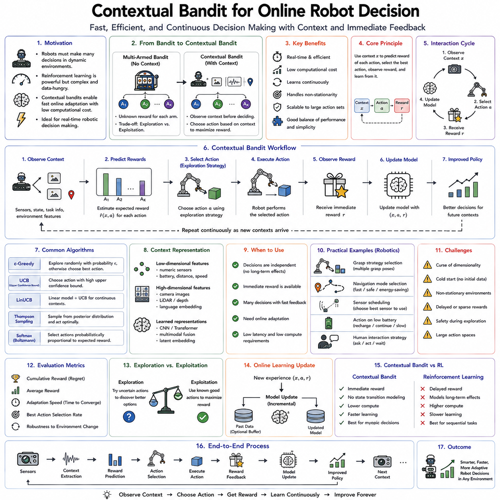{width="7.268055555555556in" height="7.268055555555556in"}

Contextual Bandits represent one of the most practical and computationally efficient online learning frameworks for real-time robotic decision making. They occupy an important position between supervised learning and full reinforcement learning by allowing an intelligent agent to continuously improve its action-selection strategy based on contextual information while avoiding the complexity of long-horizon sequential planning. Unlike conventional supervised learning, where the correct action is explicitly provided, or reinforcement learning, where delayed future rewards must be optimized across multiple time steps, contextual bandits focus on selecting the best immediate action given the current context and learning directly from the observed outcome. This simplified decision-making framework makes contextual bandits particularly attractive for robotic systems that require fast online adaptation, low computational overhead, and continuous improvement during deployment.

The conceptual origin of contextual bandits lies in the classical multi-armed bandit problem. Imagine a gambler standing before several slot machines, each producing uncertain rewards according to unknown probability distributions. The gambler must repeatedly decide which machine to play in order to maximize total reward over time. Choosing only the machine currently believed to be best may prevent discovering even better alternatives, while excessive experimentation wastes opportunities for immediate reward. The central challenge therefore becomes balancing exploration of uncertain options against exploitation of currently successful choices. Contextual bandits extend this classical problem by introducing additional information describing the current situation before each decision.

The context fundamentally changes the decision process. Instead of selecting actions solely according to historical rewards, the agent first observes relevant information describing the current environment. For a robot, context may include camera images, depth maps, LiDAR measurements, force sensor readings, joint positions, battery level, weather conditions, object properties, user preferences, semantic maps, task descriptions, or language instructions. The optimal action depends not only on historical experience but also upon these contextual observations. Consequently, identical actions may produce very different rewards under different environmental conditions.

This contextual dependency closely resembles intelligent human decision making. A person choosing transportation does not always select the same option. Weather, traffic, available time, destination, luggage, and personal preferences all influence the decision. Similarly, a service robot deciding whether to grasp an object, navigate through a hallway, ask for human assistance, or recharge its battery depends upon its current sensory observations rather than following a fixed policy. Contextual bandits formalize this adaptive decision process mathematically while maintaining computational simplicity suitable for real-time applications.

Unlike full reinforcement learning, contextual bandits assume that each decision is independent of future state transitions. After selecting an action and receiving its immediate reward, the interaction ends. The next decision begins with a new independently observed context. This assumption eliminates the need to estimate long-term cumulative rewards, future value functions, or environmental dynamics. Consequently, contextual bandits require substantially less data, lower computational cost, and simpler optimization procedures than general reinforcement learning while remaining highly effective for numerous practical robotic decision problems.

The interaction cycle within a contextual bandit framework consists of several straightforward steps. The robot first observes the current context describing the environment. Based on this context, the decision model predicts expected rewards associated with available actions. One action is selected according to an exploration strategy. The environment subsequently provides an immediate reward reflecting action quality. Finally, the decision model updates its parameters using this newly acquired experience before the next context arrives. This continuous cycle enables lifelong online adaptation without requiring expensive retraining procedures.

Context representation plays a critical role because decision quality depends directly upon the information available before action selection. Low-dimensional contexts may contain numerical sensor measurements, battery voltage, environmental temperature, object distance, or task identifiers. More complex robotic systems employ high-dimensional representations extracted from camera images, multimodal sensor fusion, semantic scene understanding, language embeddings, or learned latent representations generated by deep neural networks. Rich contextual representations enable more informed decisions but simultaneously increase computational complexity and data requirements.

Feature engineering historically dominated contextual bandit applications. Human experts manually designed informative variables describing relevant environmental properties. Modern deep learning increasingly replaces handcrafted features with learned representations optimized directly from raw sensory inputs. Convolutional neural networks process camera images, transformers encode language instructions, graph neural networks represent relational environments, and multimodal encoders combine heterogeneous sensor modalities into unified contextual embeddings supporting efficient decision making.

Expected reward estimation forms the computational core of contextual bandit algorithms. Given the observed context, the model predicts the reward likely to result from each candidate action. Different learning algorithms employ various function approximators including linear regression, kernel methods, decision trees, Gaussian processes, neural networks, Bayesian models, and ensemble techniques. Continuous online updates gradually improve these reward estimates as additional experience accumulates during deployment.

One of the defining characteristics of contextual bandits is the exploration-exploitation dilemma. Exploitation selects actions currently predicted to maximize reward according to existing knowledge. Exploration instead chooses uncertain actions that may reveal superior alternatives. Excessive exploitation prevents discovering better strategies, while excessive exploration sacrifices immediate performance unnecessarily. Effective contextual bandit algorithms therefore balance these competing objectives throughout continual operation.

The epsilon-greedy strategy provides one of the simplest exploration mechanisms. Most decisions exploit the currently best predicted action, while a small probability epsilon selects random alternatives regardless of predicted reward. Although computationally efficient, purely random exploration often wastes opportunities by evaluating actions already known to perform poorly. More sophisticated exploration methods therefore consider prediction uncertainty when selecting exploratory actions.

Upper Confidence Bound algorithms explicitly incorporate uncertainty into decision making. Rather than selecting actions solely according to expected reward, they consider optimistic estimates reflecting both predicted performance and uncertainty regarding those predictions. Actions with limited historical experience therefore receive temporary exploration bonuses encouraging further evaluation. As additional observations reduce uncertainty, exploration naturally shifts toward genuinely promising alternatives without requiring arbitrary random behavior.

Thompson Sampling represents another influential Bayesian exploration strategy. Instead of maintaining single deterministic reward estimates, Bayesian models maintain probability distributions describing uncertainty regarding each action. Before every decision, one possible reward estimate is sampled from these distributions, and the action with highest sampled reward becomes the selected action. Over time, uncertainty gradually decreases as evidence accumulates, producing an elegant balance between exploration and exploitation rooted in Bayesian inference.

Linear contextual bandits assume that expected rewards vary approximately linearly with contextual features. Algorithms such as LinUCB and Linear Thompson Sampling have achieved widespread success because they combine computational efficiency with strong theoretical guarantees. Many industrial robotic applications naturally satisfy these assumptions when contextual representations remain relatively low dimensional or when deep neural networks first generate compact feature embeddings before linear decision layers estimate rewards.

Deep contextual bandits extend these principles toward high-dimensional perception. Deep neural networks transform complex sensory observations into informative latent representations while simultaneously estimating expected rewards for available actions. Online gradient updates continuously refine both representations and reward predictors during deployment. Deep contextual bandits therefore combine the representational power of modern deep learning with the computational simplicity of contextual decision making.

Robotic manipulation illustrates a particularly valuable application. Consider a robot selecting among several possible grasp strategies for unfamiliar objects. Context includes object geometry, estimated weight, surface texture, camera observations, and gripper configuration. Available actions correspond to candidate grasp poses. Successful grasps produce positive rewards while failures receive lower rewards. Online contextual bandit learning gradually identifies which grasp strategies perform best under different object characteristics without requiring explicit physical modeling.

Navigation systems similarly benefit from contextual decision making. Autonomous mobile robots frequently choose among alternative routes differing in travel time, congestion, energy consumption, safety, or terrain difficulty. Context includes obstacle locations, pedestrian density, battery level, weather conditions, floor friction, and task urgency. Immediate rewards reflect navigation efficiency rather than long-term planning objectives. Contextual bandits therefore provide computationally efficient route selection without requiring complete reinforcement learning formulations.

Human-robot interaction provides another compelling application. Service robots continually decide how to communicate with individual users. Context includes user identity, emotional state, previous interactions, environmental conditions, conversation history, and task requirements. Possible actions include different communication styles, assistance levels, dialogue strategies, or recommendation choices. Human responses naturally generate immediate feedback enabling continual personalization through contextual online learning.

Industrial robotics increasingly employs contextual bandits for adaptive process optimization. Manufacturing systems choose among alternative machining parameters, welding settings, polishing trajectories, assembly forces, or inspection configurations according to current production conditions. Context captures material properties, machine status, environmental conditions, tooling wear, and product specifications. Production quality immediately provides reward signals enabling continuous optimization without interrupting manufacturing operations.

Energy management represents another important application. Autonomous robots must balance computational performance against battery consumption throughout extended missions. Context includes remaining battery capacity, terrain difficulty, processing workload, communication quality, and mission urgency. Actions involve selecting computational modes, sensor activation strategies, navigation speeds, or processor frequencies. Immediate rewards combine task performance with energy efficiency, allowing adaptive resource management throughout deployment.

Adaptive sensor selection also naturally fits the contextual bandit framework. Modern robots often possess multiple sensing modalities including RGB cameras, depth sensors, thermal cameras, LiDAR, radar, tactile arrays, microphones, and inertial sensors. Activating every sensor continuously consumes excessive computational resources and electrical power. Contextual bandits dynamically determine which sensor combinations provide the greatest expected benefit under current operating conditions, optimizing perception efficiency without compromising task performance.

Cloud robotics extends contextual decision making across distributed robotic fleets. Individual robots independently accumulate contextual experiences during deployment while periodically transmitting compressed learning updates toward centralized cloud infrastructure. Aggregated experiences improve global contextual decision models subsequently redistributed throughout the fleet. Every robot therefore benefits from operational knowledge collected across diverse environments while retaining local online adaptation capabilities.

Federated contextual learning further preserves privacy by exchanging only model updates instead of raw sensor observations. Hospitals, manufacturing facilities, warehouses, and domestic robots collaboratively improve contextual decision policies without exposing sensitive operational data. This privacy-preserving collaboration becomes increasingly important as robotic systems enter healthcare, defense, industrial automation, and consumer applications.

Contextual bandits integrate naturally with supervised learning. Pretrained perception systems first transform raw sensory observations into semantic representations describing the environment. Contextual decision layers subsequently optimize action selection using online reward feedback. This modular architecture separates representation learning from decision optimization, simplifying continual deployment while reducing computational cost.

Meta learning further enhances contextual adaptation. Instead of learning contextual reward estimation from scratch within every deployment, meta-trained initialization parameters enable rapid adaptation toward new environments after only limited interaction. Consequently, contextual decision systems become increasingly efficient at learning across diverse deployment conditions, reducing exploration requirements while accelerating convergence.

World models provide additional opportunities for contextual optimization. Learned predictive models estimate likely outcomes associated with alternative actions before physical execution. Contextual bandits then combine predicted rewards with observed uncertainty to guide exploration more intelligently. Imagined interactions generated within world models reduce reliance on expensive real-world experimentation while maintaining continual online improvement.

Foundation models increasingly influence contextual decision making by providing powerful multimodal contextual representations. Large vision-language models encode semantic understanding regarding objects, environments, user intentions, and physical interactions. Contextual bandits subsequently optimize immediate action selection using these pretrained representations without requiring complete end-to-end retraining. This combination substantially improves data efficiency during deployment.

Safety considerations remain essential because online exploration occurs during physical robot operation. Unsafe exploratory actions may damage equipment or endanger nearby humans. Safe contextual bandits therefore incorporate action constraints, uncertainty thresholds, supervisory controllers, runtime verification, and fallback policies ensuring exploration remains within acceptable operational limits. Conservative exploration strategies initially prioritize safety before gradually expanding behavioral diversity as confidence increases.

Evaluation of contextual bandit systems differs from conventional classification benchmarks. Cumulative reward measures long-term decision quality across deployment. Regret quantifies performance lost compared with an ideal policy possessing complete knowledge beforehand. Adaptation speed measures how rapidly decision quality improves after environmental changes. Sample efficiency evaluates how much interaction is required before reliable performance emerges. Computational latency, memory usage, uncertainty calibration, energy efficiency, robustness, and operational safety further characterize deployment quality.

The convergence of contextual bandits with continual learning, online supervised learning, reinforcement learning, meta learning, world models, foundation models, Vision-Language-Action architectures, cloud robotics, and human feedback represents an important evolution toward adaptive embodied intelligence. Future robotic systems will continuously interpret complex contextual information, personalize behavior for individual users, optimize immediate decisions through lifelong experience, and share contextual knowledge collectively across robotic fleets while maintaining safe real-time operation.

Contextual bandits therefore provide an elegant balance between computational simplicity and adaptive intelligence. By focusing on immediate contextual decision making rather than long-horizon sequential optimization, they enable efficient online learning under realistic deployment constraints. Their ability to combine rich contextual understanding, continual adaptation, uncertainty-aware exploration, parameter-efficient optimization, and real-time decision making makes contextual bandits one of the most practical frameworks for next-generation Physical AI systems operating across manufacturing, logistics, healthcare, service robotics, autonomous transportation, agriculture, and domestic assistance. As intelligent robots become increasingly integrated into everyday environments, contextual bandits will remain an essential mechanism allowing autonomous systems to learn continuously from experience while making fast, informed, and adaptive decisions in the face of constantly changing real-world conditions.

문맥 기반 밴딧(Contextual Bandit)은 실시간 로봇 의사결정을 위한 가장 실용적이고 계산 효율이 높은 온라인 학습(Online Learning) 방법 가운데 하나이다. 이는 지도학습(Supervised Learning)과 강화학습(Reinforcement Learning)의 중간에 위치하는 프레임워크로, 현재의 상황(Context)을 고려하여 즉시 최적의 행동(Action)을 선택하고 그 결과를 이용하여 지속적으로 정책을 개선한다. 장기적인 미래 보상을 계산하는 복잡한 강화학습보다 계산량이 훨씬 적으면서도 실제 로봇 시스템에서 매우 높은 활용성을 가진다.

문맥 기반 밴딧은 고전적인 다중 슬롯머신 문제(Multi-Armed Bandit)에서 출발하였다. 여러 개의 슬롯머신 가운데 어떤 기계를 선택해야 가장 많은 보상을 얻을 수 있는지를 학습하는 문제이다. 이미 좋은 것으로 알려진 기계만 계속 선택하면 더 좋은 기계를 발견하지 못하고, 반대로 너무 많이 탐험하면 현재 얻을 수 있는 보상을 놓치게 된다. 따라서 탐험(Exploration)과 이용(Exploitation)의 균형을 유지하는 것이 핵심 문제가 된다.

문맥(Context)이 추가되면 의사결정은 더욱 현실적인 형태가 된다. 로봇은 행동을 선택하기 전에 현재 환경에 대한 정보를 먼저 관찰한다. 이 문맥에는 카메라 영상(Camera Image), 깊이 영상(Depth Map), LiDAR, 힘 센서(Force Sensor), 관절 상태(Joint State), 배터리 잔량(Battery Level), 날씨(Weather), 물체 특성(Object Property), 사용자 선호(User Preference), 의미 지도(Semantic Map), 작업 명령(Task Description), 자연어(Language Instruction) 등이 포함될 수 있다. 동일한 행동이라도 문맥이 달라지면 결과도 달라질 수 있기 때문이다.

이러한 방식은 인간의 의사결정과 매우 유사하다. 사람은 이동할 때 항상 같은 교통수단을 선택하지 않는다. 날씨, 교통 상황, 시간, 목적지, 짐의 양 등을 모두 고려하여 가장 적절한 방법을 선택한다. 서비스 로봇도 현재 환경을 분석한 뒤 물체를 집을지, 이동할지, 사람에게 도움을 요청할지, 충전을 먼저 할지를 결정한다. 문맥 기반 밴딧은 이러한 적응적 의사결정을 수학적으로 표현한 모델이다.

문맥 기반 밴딧은 일반적인 강화학습과 달리 각 의사결정을 독립적인 문제로 가정한다. 행동을 수행하고 즉시 보상(Reward)을 받은 후 해당 의사결정은 종료된다. 다음 의사결정은 새로운 문맥에서 다시 시작된다. 따라서 미래 상태(State Transition)나 장기적인 누적 보상(Cumulative Reward)을 계산할 필요가 없으며, 계산량과 데이터 요구량이 크게 감소한다.

문맥 기반 밴딧의 학습 과정은 매우 단순하다. 먼저 로봇은 현재 문맥을 관찰하고, 가능한 행동들의 예상 보상(Expected Reward)을 계산한다. 이후 하나의 행동을 선택하여 수행하고, 환경으로부터 즉시 보상을 받는다. 마지막으로 이 결과를 이용하여 모델을 업데이트한다. 이러한 과정이 반복되면서 로봇은 실제 운영 중에도 지속적으로 의사결정 능력을 향상시킨다.

문맥 표현(Context Representation)은 의사결정 성능을 결정하는 중요한 요소이다. 간단한 시스템에서는 배터리 전압, 물체 거리, 온도와 같은 수치 정보만 사용할 수도 있지만, 최근에는 카메라 영상, 멀티모달 센서(Multimodal Sensor), 언어 임베딩(Language Embedding), 의미 장면 이해(Semantic Scene Understanding), 잠재 표현(Latent Representation) 등을 함께 사용하여 훨씬 풍부한 문맥 정보를 생성한다.

과거에는 사람이 직접 특징(Feature)을 설계하는 특징 공학(Feature Engineering)이 주로 사용되었다. 그러나 최근에는 딥러닝(Deep Learning)이 원시 센서 데이터를 자동으로 의미 있는 표현으로 변환한다. CNN은 영상을 처리하고, Transformer는 언어를 이해하며, 그래프 신경망(Graph Neural Network)은 객체 간 관계를 표현하고, 멀티모달 인코더(Multimodal Encoder)는 다양한 센서 정보를 하나의 문맥 표현으로 통합한다.

예상 보상(Expected Reward)의 추정은 문맥 기반 밴딧의 핵심 계산 과정이다. 현재 문맥이 주어지면 모델은 가능한 행동 각각에 대해 예상 보상을 계산한다. 이를 위해 선형 회귀(Linear Regression), 커널 방법(Kernel Method), 결정 트리(Decision Tree), 가우시안 프로세스(Gaussian Process), 신경망(Neural Network), 베이지안 모델(Bayesian Model), 앙상블(Ensemble) 등 다양한 함수 근사(Function Approximation)가 사용된다.

문맥 기반 밴딧의 가장 중요한 문제는 탐험과 이용(Exploration-Exploitation Dilemma)의 균형이다. 이용은 현재 가장 좋은 행동을 반복하여 높은 보상을 얻는 것이고, 탐험은 새로운 행동을 시도하여 더 좋은 전략을 발견하는 것이다. 탐험이 너무 적으면 새로운 가능성을 찾지 못하고, 너무 많으면 현재 성능이 떨어진다.

엡실론-탐욕(Epsilon-Greedy) 전략은 가장 단순한 탐험 방법이다. 대부분은 현재 가장 좋은 행동을 선택하지만, 일정한 확률(ε)로 무작위 행동을 수행한다. 구현은 쉽지만 이미 나쁜 것으로 알려진 행동도 계속 시도할 수 있다는 단점이 있다.

상한 신뢰구간(Upper Confidence Bound, UCB)은 불확실성(Uncertainty)을 함께 고려하는 방법이다. 단순히 예상 보상이 높은 행동이 아니라 아직 충분히 시도되지 않아 불확실성이 큰 행동에도 추가 점수를 부여한다. 시간이 지나면서 불확실성이 줄어들면 자연스럽게 더 좋은 행동으로 수렴하게 된다.

톰프슨 샘플링(Thompson Sampling)은 베이지안(Bayesian) 접근법을 이용하는 대표적인 알고리즘이다. 하나의 보상값 대신 확률분포를 유지하고, 매번 이 분포에서 샘플을 추출하여 행동을 선택한다. 경험이 많아질수록 분포의 불확실성이 감소하여 탐험과 이용의 균형이 자연스럽게 이루어진다.

선형 문맥 기반 밴딧(Linear Contextual Bandit)은 보상이 문맥 특징과 선형 관계를 가진다고 가정한다. 대표적인 알고리즘으로 LinUCB와 Linear Thompson Sampling이 있으며, 계산량이 적고 이론적 성능 보장이 가능하여 산업 현장에서 널리 활용되고 있다.

딥 문맥 기반 밴딧(Deep Contextual Bandit)은 고차원 데이터를 처리하기 위해 딥러닝을 결합한 방식이다. 심층 신경망(Deep Neural Network)이 카메라 영상과 같은 복잡한 입력을 잠재 표현으로 변환하고, 그 위에서 각 행동의 예상 보상을 계산한다. 따라서 복잡한 환경에서도 온라인 학습이 가능하다.

조작 로봇(Manipulation Robot)은 문맥 기반 밴딧의 대표적인 응용 분야이다. 물체의 크기, 무게, 질감(Texture), 카메라 영상 등이 문맥이 되고, 여러 개의 파지 자세(Grasp Pose)가 행동 후보가 된다. 성공적인 파지는 높은 보상을 받고 실패는 낮은 보상을 받으므로 로봇은 점차 물체에 맞는 최적의 파지 전략을 학습하게 된다.

이동 로봇(Navigation Robot)에서도 문맥 기반 밴딧이 효과적이다. 여러 경로 가운데 이동 시간을 최소화하거나 에너지를 절약하는 경로를 선택해야 한다. 장애물 위치, 사람의 밀도, 배터리 상태, 날씨 등이 문맥이 되고, 각 경로 선택이 행동이 된다. 즉각적인 이동 성능을 기준으로 빠르게 최적 경로를 학습할 수 있다.

인간-로봇 상호작용(Human-Robot Interaction)도 중요한 응용 분야이다. 서비스 로봇은 사용자마다 다른 말투와 선호도를 고려해야 한다. 사용자의 감정 상태, 이전 대화, 현재 작업 등이 문맥이 되며, 서로 다른 대화 방식이나 도움 수준이 행동이 된다. 사용자의 반응은 즉시 보상이 되어 로봇은 점차 개인 맞춤형 서비스를 제공하게 된다.

산업용 로봇(Industrial Robot)은 생산 공정을 지속적으로 최적화한다. 용접(Welding), 연마(Polishing), 조립(Assembly), 검사(Inspection) 과정에서 재료 상태, 기계 마모, 작업 환경 등이 문맥이 된다. 로봇은 이러한 정보를 기반으로 최적의 작업 조건을 선택하여 품질과 생산성을 동시에 향상시킨다.

에너지 관리(Energy Management)도 문맥 기반 밴딧의 중요한 응용 분야이다. 배터리 잔량, 작업 난이도, 연산 부하, 통신 상태 등이 문맥이 되며, 센서 사용 여부, 이동 속도, 프로세서 성능 조절 등이 행동이 된다. 즉각적인 작업 성능과 에너지 소비를 동시에 고려하여 최적의 자원 활용이 가능하다.

센서 선택(Sensor Selection)도 대표적인 활용 사례이다. RGB 카메라, Depth Camera, Thermal Camera, LiDAR, Radar, 마이크, IMU 등 모든 센서를 항상 사용하는 것은 전력과 계산량 측면에서 비효율적이다. 문맥 기반 밴딧은 현재 상황에서 가장 필요한 센서만 선택하여 인식 성능을 유지하면서 에너지 소비를 줄인다.

클라우드 로보틱스(Cloud Robotics)는 여러 로봇이 경험한 문맥 정보를 공유한다. 각 로봇은 다양한 환경에서 얻은 의사결정 경험을 중앙 서버에 전송하고, 서버는 이를 통합하여 더욱 우수한 전역 모델(Global Model)을 생성한다. 이후 모든 로봇은 개선된 모델을 다시 받아 지속적으로 성능을 향상시킨다.

연합 문맥 학습(Federated Contextual Learning)은 개인정보를 보호하면서 집단 학습을 수행하는 방식이다. 원본 센서 데이터를 공유하지 않고 모델 업데이트만 교환하므로 병원, 공장, 가정 등 민감한 환경에서도 안전하게 협업 학습이 가능하다.

문맥 기반 밴딧은 지도학습과도 자연스럽게 결합된다. 사전학습된 인식 모델이 카메라 영상으로부터 의미 정보를 추출하면, 문맥 기반 밴딧은 이 정보를 이용하여 최적의 행동을 선택한다. 표현 학습과 의사결정을 분리함으로써 시스템을 더욱 효율적으로 구성할 수 있다.

메타학습(Meta Learning)은 문맥 기반 밴딧의 적응 속도를 더욱 향상시킨다. 다양한 환경에서 미리 학습된 초기 파라미터를 사용하면 새로운 환경에서도 소수의 경험만으로 빠르게 적응할 수 있다. 따라서 탐험 횟수를 줄이면서도 높은 성능을 달성할 수 있다.

세계 모델(World Model)은 문맥 기반 의사결정을 더욱 발전시킨다. 내부 시뮬레이터를 이용하여 여러 행동의 결과를 미리 예측한 뒤 실제 행동을 선택할 수 있으므로 시행착오를 크게 줄일 수 있다. 이는 실제 환경에서의 탐험 비용과 위험을 감소시킨다.

최근에는 파운데이션 모델(Foundation Model)도 문맥 기반 밴딧과 결합되고 있다. 대규모 비전-언어 모델(Vision-Language Model)은 물체와 환경에 대한 풍부한 의미 정보를 제공하고, 문맥 기반 밴딧은 이를 활용하여 현재 상황에서 가장 적절한 행동을 선택한다. 이 조합은 매우 적은 데이터만으로도 높은 적응 성능을 달성한다.

온라인 탐험은 실제 로봇에서 수행되므로 안전성(Safety)이 반드시 보장되어야 한다. 위험한 행동을 무작위로 시도하면 장비가 손상되거나 사람이 다칠 수 있다. 따라서 안전 제약(Safety Constraint), 런타임 검증(Runtime Verification), 안전 제어기(Safety Controller), 폴백 정책(Fallback Policy)을 함께 사용하여 탐험이 안전한 범위 안에서 이루어지도록 한다.

문맥 기반 밴딧의 평가는 일반적인 분류 정확도와는 다르다. 누적 보상(Cumulative Reward), 후회(Regret), 적응 속도(Adaptation Speed), 샘플 효율성(Sample Efficiency), 계산 지연(Latency), 메모리 사용량, 불확실성 추정 성능, 에너지 효율성(Energy Efficiency), 강건성(Robustness), 안전성(Safety) 등을 함께 평가한다.

최근에는 문맥 기반 밴딧이 지속학습(Continual Learning), 온라인 지도학습(Online Supervised Learning), 강화학습(Reinforcement Learning), 메타학습(Meta Learning), 세계 모델(World Model), 파운데이션 모델, 비전-언어-행동(Vision-Language-Action, VLA), 클라우드 로보틱스, 인간 피드백(Human Feedback)과 통합되고 있다. 미래의 로봇은 풍부한 문맥 정보를 이해하고, 사용자에게 맞추어 행동을 개인화하며, 로봇 집단 전체가 경험을 공유하면서 지속적으로 발전하는 집단 지능(Collective Intelligence)을 갖추게 될 것이다.

결국 **문맥 기반 밴딧(Contextual Bandit)** 은 계산 효율성과 적응성을 동시에 만족하는 매우 실용적인 온라인 의사결정 기술이다. 장기적인 미래 예측 대신 현재 문맥에서 최적의 행동을 선택하는 데 집중함으로써 계산량을 크게 줄이면서도 높은 성능을 제공한다. 풍부한 문맥 이해(Context Understanding), 지속적인 온라인 학습(Online Learning), 불확실성 기반 탐험(Uncertainty-Aware Exploration), 파라미터 효율적 최적화(Parameter-Efficient Optimization), 실시간 의사결정(Real-Time Decision Making)을 결합하여 제조, 물류, 의료, 서비스 로봇, 자율주행, 농업 등 다양한 **Physical AI** 분야에서 핵심적인 온라인 의사결정 기술로 활용될 것이다.

##  

## 07.07 Memory Augmented Networks for Online Learning [w/Code]

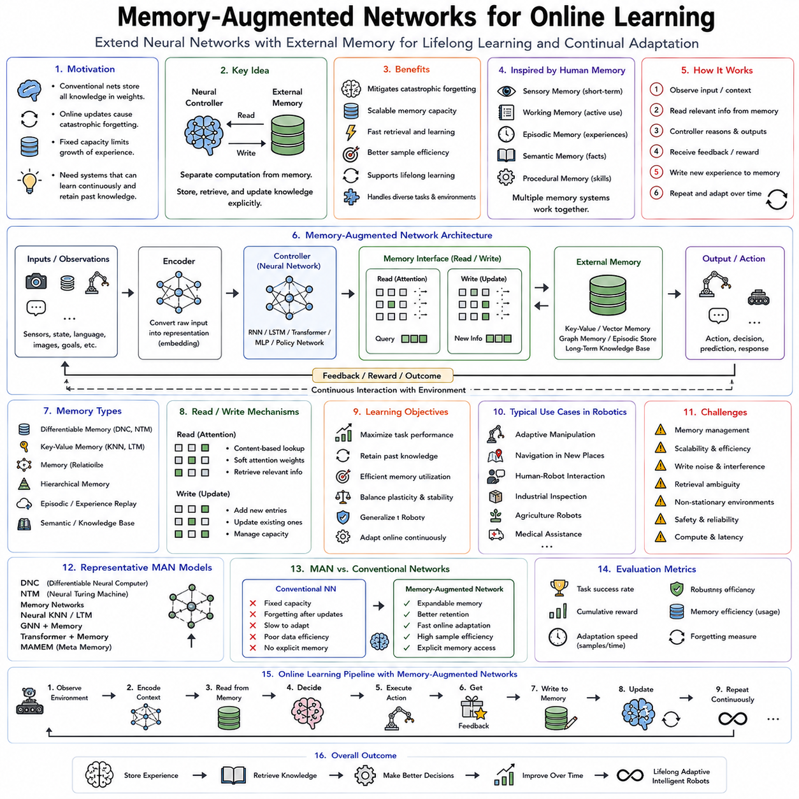{width="7.268055555555556in" height="7.268055555555556in"}

Memory-Augmented Networks (MANs) represent a major advancement in artificial intelligence by extending conventional neural networks with explicit external memory systems that support long-term knowledge retention, rapid information retrieval, and continual adaptation. Traditional deep neural networks encode learned knowledge primarily within their parameters. Although this approach has achieved remarkable success across perception, language understanding, and control, it also introduces significant limitations. Updating model parameters during online learning often causes previously acquired knowledge to be overwritten, leading to catastrophic forgetting. Furthermore, storing every new experience solely within fixed network weights becomes increasingly inefficient as the number of tasks, environments, and observations grows over time. Memory-Augmented Networks address these limitations by separating computation from memory. Neural networks perform reasoning and decision making, while dedicated memory structures store experiences, facts, representations, and task-specific information that can be accessed dynamically during learning and inference. This architectural separation provides one of the fundamental mechanisms enabling lifelong learning, continual adaptation, and increasingly general embodied intelligence.

The motivation for memory augmentation originates from biological cognition. Human intelligence does not rely exclusively on slowly changing neural connections. Instead, the brain combines multiple forms of memory operating over different time scales. Sensory memory briefly stores incoming observations. Working memory maintains information relevant to current reasoning. Episodic memory preserves personal experiences together with temporal context. Semantic memory accumulates general knowledge independent of individual events. Procedural memory encodes motor skills and habitual behaviors. Together, these interacting memory systems enable humans to learn continuously throughout life while retaining knowledge acquired years or even decades earlier. Memory-Augmented Networks seek to reproduce these complementary capabilities within artificial learning systems.

Conventional neural networks compress all learned knowledge into distributed parameter representations. While this implicit memory allows remarkable generalization, modifying network weights during online learning inevitably affects previously learned representations. When new experiences differ significantly from earlier training data, parameter updates may degrade performance on earlier tasks. This phenomenon, known as catastrophic forgetting, remains one of the central challenges in continual learning. Memory-Augmented Networks reduce this problem by storing newly acquired information separately from permanent model parameters, allowing adaptation without immediately overwriting existing knowledge.

The central architectural idea is straightforward. A neural controller performs perception, reasoning, planning, or decision making, while an external memory module stores structured information independently of network weights. During inference, the controller reads relevant information from memory, integrates retrieved knowledge with current observations, generates appropriate outputs, and optionally writes new experiences back into memory. Consequently, knowledge acquisition becomes an explicit operation rather than occurring solely through slow gradient-based parameter optimization.

External memory dramatically increases the effective capacity of learning systems. Instead of requiring increasingly larger neural networks as operational experience grows, robots continuously expand their knowledge base by storing representative observations, successful strategies, environmental maps, language interactions, manipulation trajectories, failure cases, calibration data, and user preferences within dedicated memory structures. The neural controller remains relatively compact while memory grows according to deployment requirements.

Memory organization strongly influences learning performance. Some architectures employ fixed-size differentiable memory matrices optimized jointly with neural networks through gradient descent. Others utilize key-value memories storing representations alongside associated information. Graph memories preserve relational structures among objects, places, and events. Hierarchical memory systems organize information according to temporal scales or semantic abstraction. Hybrid architectures increasingly combine several complementary memory forms supporting different cognitive functions within one integrated framework.

Differentiable Neural Computers represent one of the earliest influential memory-augmented architectures. Building upon Neural Turing Machines, these systems combine recurrent neural controllers with differentiable external memory arrays. Specialized attention mechanisms determine where information should be written and how previously stored content should be retrieved. Because every operation remains differentiable, the entire architecture can be optimized end-to-end through gradient descent. These pioneering models demonstrated that neural networks could learn algorithmic reasoning, graph traversal, sequence manipulation, and relational inference by explicitly interacting with external memory.

Neural Turing Machines introduced the foundational concept of differentiable memory access. Inspired by classical Turing machines, they separated computation from storage while replacing discrete read-write operations with differentiable attention mechanisms. Instead of explicitly programming memory management rules, gradient optimization automatically learned efficient memory utilization strategies. Although practical deployment initially proved challenging due to optimization instability, Neural Turing Machines established many principles underlying modern memory-augmented architectures.

Working memory plays a particularly important role within online robotic systems. During task execution, robots must temporarily retain recently observed information relevant to current reasoning. A manipulation robot assembling furniture remembers recently identified components, current assembly progress, and temporary grasp configurations. Autonomous vehicles maintain nearby traffic participants, predicted trajectories, and recent navigation decisions. Working memory therefore supports coherent reasoning across multiple consecutive observations rather than treating every sensory frame independently.

Episodic memory stores complete experiences together with temporal context. Every episode records observations, actions, rewards, environmental conditions, user interactions, and task outcomes. When robots later encounter similar situations, retrieval mechanisms identify related historical experiences supporting rapid adaptation without extensive retraining. Episodic memory therefore serves as a valuable repository of deployment knowledge accumulated throughout operational lifetime.

Semantic memory differs fundamentally from episodic memory because it captures generalized concepts rather than individual experiences. Repeated interactions gradually transform episodic observations into abstract knowledge describing object categories, physical properties, language meanings, manipulation affordances, environmental regularities, and user preferences. Semantic memory enables robots to reason beyond specific historical events while maintaining broad generalization capability.

Procedural memory encodes motor skills and behavioral routines developed through repeated practice. Walking strategies, grasp controllers, insertion trajectories, balancing behaviors, navigation heuristics, and communication patterns gradually become procedural knowledge requiring little conscious reasoning during execution. Memory-Augmented Networks increasingly distinguish procedural representations from declarative factual knowledge, mirroring biological cognition more closely.

Reading from external memory requires effective retrieval mechanisms. Content-based addressing identifies stored information semantically similar to current observations. Location-based addressing accesses memory according to temporal or spatial organization. Associative retrieval exploits relationships among stored experiences. Attention mechanisms dynamically weight memory entries according to relevance for current reasoning. Modern transformer architectures have significantly advanced memory retrieval by introducing highly efficient attention-based search across large knowledge repositories.

Writing new experiences into memory presents equally important challenges. Every observation cannot remain permanently stored because memory capacity eventually becomes limited. Intelligent memory management therefore decides which experiences deserve long-term preservation. Novel events, rare failures, uncertain observations, highly informative demonstrations, and successful recovery strategies frequently receive higher storage priority than repetitive routine experiences. Such selective storage substantially improves long-term memory efficiency.

Memory consolidation gradually transforms short-term experiences into stable long-term knowledge. Biological sleep provides one well-known mechanism supporting consolidation by replaying neural activity patterns acquired during daily experience. Artificial learning systems similarly employ experience replay, offline optimization, representation compression, and hierarchical abstraction to integrate episodic memories into increasingly generalized semantic knowledge while preserving important historical information.

Experience replay has become one of the most influential memory-based learning techniques. Instead of training exclusively on recent observations, online learning repeatedly revisits representative historical experiences stored within replay buffers. New experiences combine with previously collected examples during optimization, substantially reducing catastrophic forgetting. Replay buffers therefore stabilize continual learning while preserving long-term performance across evolving environments.

Replay strategies vary considerably depending upon application requirements. Uniform replay samples experiences randomly, approximating stationary data distributions. Prioritized replay emphasizes experiences exhibiting large prediction errors or high learning potential. Class-balanced replay preserves rare categories vulnerable to forgetting. Reservoir sampling maintains statistically representative historical subsets despite unbounded data streams. Adaptive replay policies increasingly optimize memory utilization automatically throughout deployment.

Memory retrieval also supports few-shot learning. Upon encountering unfamiliar tasks, robots search memory for similar previous experiences rather than learning entirely from scratch. Retrieved examples provide valuable prior information enabling rapid adaptation using only limited additional data. Consequently, Memory-Augmented Networks naturally complement meta learning, few-shot learning, and continual adaptation frameworks by providing reusable deployment knowledge accumulated across previous tasks.

Robotic manipulation illustrates these principles clearly. Suppose a robot encounters a previously unseen household object requiring grasping. Rather than estimating grasp strategies solely through current perception, the robot retrieves memory entries associated with geometrically similar objects manipulated successfully in the past. Previous grasp poses, force profiles, wrist orientations, tactile feedback, and failure cases guide current decision making. Consequently, adaptation becomes substantially faster and more reliable than relying exclusively on parameterized neural policies.

Navigation systems similarly benefit from explicit memory. Autonomous mobile robots operating repeatedly within large facilities gradually accumulate maps, obstacle locations, traffic patterns, charging station positions, elevator behaviors, restricted zones, and user preferences. Memory retrieval enables efficient route planning using accumulated operational experience while adapting continuously as environments evolve. Dynamic maps therefore complement real-time perception instead of replacing it.

Long-term human-robot interaction particularly depends upon memory. Service robots interacting with families, patients, or industrial operators should remember names, preferences, routines, communication styles, physical limitations, schedules, and previous conversations across weeks or months. Such personalized interaction becomes impossible without persistent memory extending beyond temporary dialogue context. Memory-Augmented Networks therefore play a central role in socially intelligent robotics.

Language models increasingly incorporate external memory to overcome finite context limitations. Conventional transformer architectures process only limited input windows, causing earlier information to disappear from attention. Retrieval-augmented architectures instead store historical conversations, documents, procedural knowledge, and factual information externally, retrieving relevant content whenever needed. Such retrieval augmentation substantially improves factual consistency, personalization, and long-term conversational coherence.

Retrieval-Augmented Generation demonstrates the growing importance of explicit memory within language reasoning. Instead of requiring every factual detail to reside permanently within model parameters, external document collections provide dynamically retrievable knowledge. Language generation consequently combines pretrained linguistic competence with deployment-specific memory, producing more accurate and updatable responses. Similar principles increasingly extend toward embodied robotic reasoning.

World models naturally integrate with memory systems. Predictive models estimate future environmental dynamics while memory stores previous state transitions, environmental configurations, and planning outcomes. When planning future actions, robots retrieve analogous historical situations, compare predicted consequences with previous experiences, and refine decision making accordingly. Memory therefore strengthens model-based reasoning by grounding predictions within accumulated operational history.

Graph memories have emerged as powerful structures for organizing relational knowledge. Objects, locations, tasks, users, tools, and semantic concepts become graph nodes connected through learned relationships. Graph neural networks propagate information across these relational structures, supporting reasoning requiring multiple interconnected facts. Industrial assembly, household assistance, warehouse logistics, and scientific exploration particularly benefit from graph-based memory organization because relational structure strongly influences intelligent decision making.

Memory-Augmented Networks also enhance reinforcement learning. Instead of estimating policies solely from current observations, agents retrieve historical trajectories similar to present situations. Previous rewards, successful actions, environmental transitions, and exploration outcomes guide current policy improvement. Memory-based reinforcement learning therefore significantly improves sample efficiency while reducing redundant exploration.

Online learning particularly benefits because memory enables adaptation without immediately modifying long-term parameters. New experiences first enter temporary memory, where retrieval supports improved behavior almost immediately. Parameter optimization subsequently consolidates frequently useful knowledge gradually into permanent representations. This two-stage learning process separates rapid adaptation from stable long-term learning, reducing catastrophic forgetting while maintaining continual improvement.

Memory also supports uncertainty-aware reasoning. When current observations differ substantially from stored experiences, retrieval confidence decreases, indicating unfamiliar operating conditions. Robots may consequently increase exploration, request human assistance, or initiate additional learning procedures. Conversely, highly similar memory retrieval provides confidence supporting decisive autonomous action. Memory similarity therefore contributes naturally to confidence estimation.

Cloud robotics extends memory beyond individual robots toward collective intelligence. Every robot continuously contributes experiences to centralized cloud memory repositories. Other robots subsequently retrieve relevant experiences accumulated across geographically distributed deployments. A manipulation strategy learned in one factory may later benefit robots deployed elsewhere. Collective memory therefore dramatically accelerates knowledge sharing across entire robotic fleets.

Federated memory architectures preserve privacy while supporting collaborative learning. Instead of exchanging raw observations, robots communicate compressed memory representations, learned embeddings, or encrypted retrieval structures. Central aggregation combines distributed memories into globally useful knowledge without revealing sensitive operational details. Such privacy-preserving memory sharing becomes increasingly important within healthcare, industrial automation, and domestic robotics.

Memory management becomes increasingly challenging as deployment duration extends over months or years. Unlimited memory growth eventually becomes computationally impractical. Compression algorithms, hierarchical abstraction, semantic summarization, redundancy elimination, importance estimation, and selective forgetting therefore maintain efficient long-term operation. Effective memory systems preserve highly informative experiences while discarding redundant observations producing minimal future benefit.

Evaluation of Memory-Augmented Networks extends beyond conventional prediction accuracy. Researchers assess memory retrieval quality, storage efficiency, adaptation speed, catastrophic forgetting resistance, sample efficiency, computational overhead, latency, scalability, long-term retention, semantic organization, personalization capability, and robustness under continual environmental change. Comprehensive evaluation therefore reflects memory performance throughout prolonged deployment rather than isolated benchmark tasks.

Recent advances increasingly integrate Memory-Augmented Networks with foundation models, Vision-Language-Action architectures, world models, continual learning, meta learning, diffusion policies, reinforcement learning, retrieval augmentation, and multimodal reasoning. Instead of functioning as isolated memory modules, external knowledge systems become deeply intertwined with perception, planning, language understanding, manipulation, navigation, and social interaction. Future embodied intelligence will likely rely upon rich memory ecosystems combining episodic experience, semantic abstraction, procedural skills, predictive world models, and collaborative cloud knowledge into unified cognitive architectures.

Memory-Augmented Networks therefore represent a foundational technology for lifelong online learning. By separating computation from explicit knowledge storage, preserving experiences across extended operational lifetimes, enabling rapid retrieval of relevant historical information, supporting continual adaptation without catastrophic forgetting, and facilitating collective knowledge sharing across robotic fleets, these architectures overcome many limitations of conventional parameter-only neural networks. As Physical AI evolves toward increasingly autonomous, personalized, and continuously learning robotic systems, Memory-Augmented Networks will remain one of the essential mechanisms enabling intelligent machines to accumulate experience, remember the past, adapt to the present, and prepare effectively for future challenges.

메모리 증강 네트워크(Memory-Augmented Networks, MAN)는 기존 신경망(Neural Network)에 외부 메모리(External Memory)를 추가하여 장기적인 지식 저장(Long-Term Knowledge Retention), 빠른 정보 검색(Fast Information Retrieval), 지속적인 적응(Continual Adaptation)을 가능하게 하는 인공지능 구조이다. 기존 딥러닝은 모든 지식을 네트워크의 가중치(Weight)에 저장하지만, 새로운 데이터를 계속 학습하면 기존 지식이 사라지는 재앙적 망각(Catastrophic Forgetting)이 발생한다. 메모리 증강 네트워크는 계산(Computation)과 기억(Memory)을 분리하여 이러한 문제를 해결하며, 평생학습(Lifelong Learning)과 **Physical AI**의 핵심 기술로 주목받고 있다.

메모리 증강 네트워크의 개념은 인간의 기억 구조에서 영감을 얻었다. 인간은 하나의 기억만 사용하는 것이 아니라 감각 기억(Sensory Memory), 작업 기억(Working Memory), 일화 기억(Episodic Memory), 의미 기억(Semantic Memory), 절차 기억(Procedural Memory) 등 여러 종류의 기억을 함께 사용한다. 이러한 다양한 기억 시스템이 서로 협력하기 때문에 사람은 평생 동안 새로운 지식을 배우면서도 오래전의 경험을 잊지 않을 수 있다.

기존 신경망은 학습한 모든 지식을 가중치 안에 압축하여 저장한다. 이 방식은 일반화 성능은 뛰어나지만, 새로운 환경에서 온라인 학습을 수행하면 기존 가중치가 수정되면서 이전 지식이 손상될 수 있다. 이러한 현상이 바로 재앙적 망각(Catastrophic Forgetting)이다. 메모리 증강 네트워크는 새로운 경험을 외부 메모리에 저장하여 기존 파라미터를 크게 변경하지 않고도 새로운 지식을 추가할 수 있도록 만든다.

메모리 증강 네트워크의 핵심 구조는 매우 단순하다. 신경망은 인식(Perception), 추론(Reasoning), 계획(Planning), 의사결정(Decision Making)을 담당하고, 외부 메모리는 경험(Experience), 사실(Fact), 표현(Representation), 작업 정보(Task Information)를 저장한다. 추론 과정에서는 필요한 정보를 메모리에서 읽어(Read) 현재 입력과 결합하고, 새로운 경험은 다시 메모리에 기록(Write)된다. 즉, 학습과 기억이 명확하게 분리된다.

외부 메모리는 시스템의 기억 용량을 크게 확장한다. 모든 경험을 신경망 가중치에 저장하는 대신, 로봇은 성공 사례, 실패 사례, 환경 지도(Map), 사용자 정보, 조작 궤적(Trajectory), 센서 보정 정보 등을 메모리에 저장한다. 따라서 신경망 자체는 비교적 작게 유지하면서도 운영 기간이 길어질수록 지식은 지속적으로 축적될 수 있다.

메모리 구조(Memory Organization)는 학습 성능에 큰 영향을 준다. 일부 시스템은 미분 가능한 메모리 행렬(Differentiable Memory Matrix)을 사용하고, 일부는 키-값 메모리(Key-Value Memory)를 사용한다. 그래프 메모리(Graph Memory)는 객체와 장소의 관계를 저장하며, 계층형 메모리(Hierarchical Memory)는 시간이나 의미 수준에 따라 정보를 구분한다. 최근에는 이러한 다양한 메모리를 하나의 시스템에서 함께 사용하는 연구가 활발하다.

차분 가능한 신경 컴퓨터(Differentiable Neural Computer, DNC)는 가장 대표적인 메모리 증강 구조 가운데 하나이다. 순환 신경망(Recurrent Neural Network)과 외부 메모리를 결합하여 정보를 자유롭게 저장하고 검색한다. 모든 읽기(Read)와 쓰기(Write) 과정이 미분 가능(Differentiable)하므로 일반적인 딥러닝처럼 종단 간 학습(End-to-End Learning)이 가능하다.

신경 튜링 머신(Neural Turing Machine, NTM)은 메모리 증강 네트워크의 출발점이 된 구조이다. 계산 장치와 저장 장치를 분리한 튜링 머신(Turing Machine)에서 영감을 얻어, 신경망이 외부 메모리를 자유롭게 사용할 수 있도록 만들었다. 이를 통해 알고리즘 수행, 그래프 탐색(Graph Traversal), 관계 추론(Relational Reasoning)과 같은 복잡한 작업도 학습할 수 있게 되었다.

작업 기억(Working Memory)은 현재 수행 중인 작업에 필요한 정보를 잠시 유지하는 역할을 한다. 예를 들어 조립 로봇은 방금 인식한 부품과 현재 조립 순서를 기억해야 하며, 자율주행차는 주변 차량과 최근 이동 경로를 유지해야 한다. 작업 기억은 현재의 추론 과정이 일관성을 유지하도록 만드는 중요한 기능이다.

일화 기억(Episodic Memory)은 특정 경험을 시간 정보와 함께 저장한다. 하나의 작업에는 당시의 센서 정보, 수행한 행동(Action), 받은 보상(Reward), 환경 상태 등이 모두 함께 저장된다. 이후 비슷한 상황이 발생하면 과거 경험을 검색하여 빠르게 적응할 수 있다.

의미 기억(Semantic Memory)은 반복된 경험을 일반적인 지식으로 추상화한다. 특정 물체를 여러 번 조작하면서 물체의 특성, 물리 법칙, 조작 방법 등이 일반적인 개념으로 저장된다. 일화 기억이 개별 사건을 저장한다면 의미 기억은 여러 경험에서 공통적인 규칙을 학습한다.

절차 기억(Procedural Memory)은 반복적으로 연습한 기술을 저장한다. 걷기(Walking), 파지(Grasping), 균형 유지(Balancing), 조립(Assembly), 대화(Dialogue) 등의 행동은 반복될수록 자동화되어 절차 기억으로 저장된다. 이후에는 복잡한 추론 없이도 빠르게 수행할 수 있다.

메모리 검색(Memory Retrieval)은 메모리 증강 네트워크의 핵심 기능이다. 내용 기반 검색(Content-Based Addressing)은 현재 입력과 가장 유사한 기억을 찾으며, 위치 기반 검색(Location-Based Addressing)은 시간이나 순서에 따라 정보를 검색한다. 최근에는 Transformer의 어텐션(Attention)을 이용한 검색 방식이 매우 널리 활용되고 있다.

메모리에 새로운 정보를 기록하는 과정도 매우 중요하다. 모든 경험을 무한히 저장할 수는 없으므로 어떤 정보를 오래 보관할지를 결정해야 한다. 새로운 환경, 드문 실패 사례, 불확실한 상황, 성공적인 전략, 사람의 시연(Demonstration) 등은 높은 우선순위를 가지며 장기 기억으로 저장된다.

메모리 통합(Memory Consolidation)은 단기 경험을 장기 지식으로 변환하는 과정이다. 인간이 수면(Sleep) 중 기억을 정리하는 것처럼, 인공지능도 경험 재생(Experience Replay), 표현 압축(Representation Compression), 추상화(Abstraction)를 통해 여러 경험을 일반적인 지식으로 통합한다.

경험 재생(Experience Replay)은 가장 널리 사용되는 메모리 기반 학습 기법이다. 온라인 학습 시 최근 데이터만 사용하는 것이 아니라 과거 경험을 함께 학습한다. 이를 통해 새로운 환경에 적응하면서도 기존 지식을 유지할 수 있어 재앙적 망각을 크게 줄일 수 있다.

경험 재생은 여러 방식으로 구현된다. 무작위 재생(Random Replay), 우선순위 재생(Prioritized Replay), 클래스 균형 재생(Class-Balanced Replay), 저수지 샘플링(Reservoir Sampling) 등이 있으며, 각각 메모리를 효율적으로 활용하면서 장기적인 학습 안정성을 높이는 역할을 한다.

메모리 검색은 소수 샘플 학습(Few-Shot Learning)과도 매우 잘 결합된다. 새로운 작업을 만나면 처음부터 학습하는 것이 아니라 과거에 비슷했던 사례를 메모리에서 검색한다. 이를 기반으로 현재 작업에 빠르게 적응할 수 있으므로 적은 데이터만으로도 높은 성능을 얻을 수 있다.

조작 로봇(Manipulation Robot)은 메모리 활용의 대표적인 사례이다. 새로운 물체를 만나면 로봇은 과거에 비슷한 형태의 물체를 어떻게 잡았는지를 검색한다. 이전의 파지 자세(Grasp Pose), 손목 각도(Wrist Orientation), 힘 제어(Force Control), 실패 사례 등을 활용하여 훨씬 빠르게 안정적인 조작 전략을 찾을 수 있다.

이동 로봇(Navigation Robot)도 메모리를 적극 활용한다. 공장이나 창고를 반복적으로 이동하면서 장애물 위치, 충전소, 엘리베이터, 사람의 이동 패턴 등을 메모리에 저장한다. 이후에는 이러한 경험을 검색하여 더욱 효율적인 경로를 계획할 수 있다.

장기적인 인간-로봇 상호작용(Human-Robot Interaction)에서는 메모리가 필수적이다. 서비스 로봇은 사용자의 이름, 선호도, 일정, 대화 내용, 신체적 특징 등을 기억해야 개인 맞춤형 서비스를 제공할 수 있다. 이러한 지속적인 기억이 없으면 자연스러운 상호작용은 불가능하다.

대규모 언어모델(Large Language Model)도 외부 메모리를 적극 활용하기 시작하였다. 기존 Transformer는 입력 길이에 제한이 있었지만, 검색 증강 생성(Retrieval-Augmented Generation, RAG)은 외부 문서를 메모리에 저장한 뒤 필요한 순간에 검색하여 활용한다. 이를 통해 사실 정확성(Factual Accuracy)과 장기 대화 능력이 크게 향상되었다.

세계 모델(World Model)은 메모리와 매우 자연스럽게 결합된다. 미래를 예측하는 세계 모델은 과거 상태 변화(State Transition), 환경 정보, 계획 결과 등을 메모리에 저장한다. 새로운 계획을 세울 때 과거 경험을 검색하여 예측 정확도를 높일 수 있다.

그래프 메모리(Graph Memory)는 객체, 장소, 사람, 작업 등의 관계를 그래프 형태로 저장한다. 그래프 신경망(Graph Neural Network)은 이러한 관계를 따라 정보를 전파하여 복잡한 관계 추론(Relational Reasoning)을 수행한다. 조립, 물류, 서비스 로봇과 같이 관계 정보가 중요한 분야에서 특히 효과적이다.

메모리 증강 네트워크는 강화학습(Reinforcement Learning)의 성능도 향상시킨다. 현재 상태만 이용하는 것이 아니라 과거에 비슷했던 상황을 검색하여 당시의 행동과 보상을 참고한다. 이를 통해 탐험(Exploration)을 줄이고 샘플 효율성(Sample Efficiency)을 크게 높일 수 있다.

온라인 학습에서는 메모리의 장점이 더욱 크다. 새로운 경험은 먼저 메모리에 저장되어 즉시 활용되고, 이후 충분히 반복된 경험만 신경망의 장기 파라미터로 통합된다. 따라서 빠른 적응(Fast Adaptation)과 안정적인 장기 학습(Long-Term Learning)을 동시에 달성할 수 있다.

메모리는 불확실성 추정(Uncertainty Estimation)에도 활용된다. 현재 입력과 유사한 경험이 메모리에 거의 없다면 로봇은 새로운 환경이라고 판단하고 추가적인 탐험이나 사람의 도움을 요청할 수 있다. 반대로 유사한 경험이 많다면 높은 신뢰도를 가지고 행동을 수행할 수 있다.

클라우드 로보틱스(Cloud Robotics)는 메모리를 여러 로봇이 공유하도록 만든다. 각각의 로봇은 자신의 경험을 클라우드 메모리에 저장하고, 다른 로봇은 이를 검색하여 활용한다. 한 공장에서 학습한 조작 전략이 다른 공장의 로봇에게도 즉시 적용될 수 있으므로 집단 지능(Collective Intelligence)이 형성된다.

연합 메모리(Federated Memory)는 개인정보를 보호하면서 집단 학습을 가능하게 한다. 원본 데이터를 공유하지 않고 임베딩(Embedding)이나 압축된 메모리 표현만 교환하므로 의료, 제조, 가정 환경에서도 안전하게 협업할 수 있다.

메모리 관리는 장기간 운영에서 매우 중요한 문제이다. 메모리를 무한히 확장할 수는 없기 때문에 압축(Compression), 계층적 추상화(Hierarchical Abstraction), 의미 요약(Semantic Summarization), 중복 제거(Redundancy Elimination), 중요도 평가(Importance Estimation), 선택적 망각(Selective Forgetting) 등을 통해 중요한 정보만 유지해야 한다.

메모리 증강 네트워크의 평가는 단순한 정확도가 아니라 메모리 검색 성능(Retrieval Quality), 저장 효율(Storage Efficiency), 적응 속도(Adaptation Speed), 재앙적 망각 방지(Catastrophic Forgetting Resistance), 샘플 효율성(Sample Efficiency), 계산량(Computational Overhead), 장기 보존 능력(Long-Term Retention), 개인화(Personalization), 확장성(Scalability) 등을 함께 고려한다.

최근에는 메모리 증강 네트워크가 파운데이션 모델(Foundation Model), 비전-언어-행동(Vision-Language-Action, VLA), 세계 모델(World Model), 지속학습(Continual Learning), 메타학습(Meta Learning), 확산 정책(Diffusion Policy), 강화학습(Reinforcement Learning), 검색 증강(Retrieval Augmentation), 멀티모달 추론(Multimodal Reasoning)과 통합되고 있다. 미래의 로봇은 단순히 현재를 인식하는 것이 아니라 과거의 경험을 기억하고, 현재를 이해하며, 미래를 예측하는 통합 인지 구조를 갖추게 될 것이다.

결국 **메모리 증강 네트워크(Memory-Augmented Networks)** 는 계산과 기억을 분리함으로써 기존 신경망의 한계를 극복하는 핵심 기술이다. 외부 메모리를 통해 장기간 경험을 저장하고, 필요한 순간에 적절한 정보를 검색하며, 재앙적 망각 없이 지속적으로 학습하고, 여러 로봇이 경험을 공유하는 집단 지능까지 구현할 수 있다. **Physical AI**가 평생 동안 경험을 축적하고, 과거를 기억하며, 현재에 적응하고, 미래를 준비하는 진정한 지능 시스템으로 발전하기 위해 메모리 증강 네트워크는 가장 중요한 기반 기술 가운데 하나가 될 것이다.

##  

## 07.08 Online Learning System Architecture on Robot [w/Code]

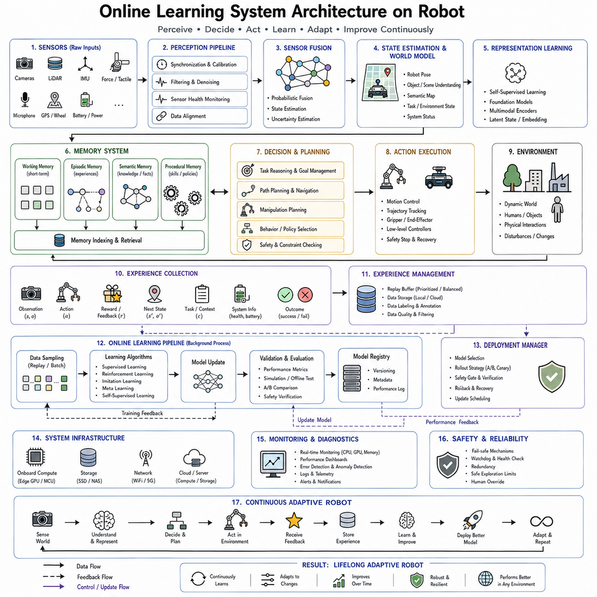{width="7.268055555555556in" height="7.268055555555556in"}

An online learning system architecture for robots is the integrated computational framework that enables a robotic platform to perceive, reason, learn, adapt, and improve continuously while operating in the real world. Unlike traditional robotic systems, where learning occurs offline before deployment and the resulting models remain largely fixed during operation, an online learning architecture allows the robot to update its internal models, policies, memories, and knowledge representations throughout its operational lifetime. This capability transforms robots from static automation systems into continuously evolving intelligent agents capable of adapting to environmental changes, user preferences, hardware degradation, new tasks, and unforeseen situations. As Physical AI advances toward lifelong autonomy and Artificial General Intelligence, online learning architectures become one of the foundational infrastructures supporting adaptive intelligence.

The fundamental design philosophy of an online learning architecture is the separation of real-time operation from continuous improvement. A deployed robot cannot simply stop functioning whenever new information becomes available. It must continue executing tasks safely while simultaneously collecting data, evaluating performance, updating internal knowledge, validating improvements, and deploying new models when appropriate. Consequently, modern architectures consist of multiple interconnected subsystems operating asynchronously yet cooperatively. Fast control loops maintain safe real-time behavior, while slower learning processes continuously optimize future performance in the background.

The architecture begins with the perception layer, which serves as the robot\'s interface with the external world. Cameras, LiDAR, radar, microphones, tactile sensors, force sensors, IMUs, GPS receivers, encoders, environmental sensors, and physiological sensors continuously generate multimodal observations describing the robot\'s surroundings and internal condition. Raw sensor streams undergo synchronization, calibration, filtering, timestamp alignment, and noise reduction before higher-level processing begins. High-quality perception is essential because every subsequent learning component depends upon accurate environmental observations.

Sensor fusion constitutes the second major component of perception. Individual sensors provide incomplete or noisy information, but combining multiple sensing modalities produces significantly more robust environmental understanding. Visual information complements depth sensing. IMU measurements stabilize localization. Force sensors improve manipulation. Language inputs provide semantic context. Probabilistic fusion algorithms, Bayesian estimation, Kalman filtering, graph optimization, and deep multimodal fusion networks integrate heterogeneous sensory streams into coherent state representations suitable for downstream learning and decision making.

The state estimation module transforms fused sensory information into structured representations describing the current situation. Robot pose, object locations, environmental maps, semantic scene understanding, task progress, human intentions, battery condition, actuator health, and environmental uncertainty become unified state variables available throughout the architecture. These state representations provide the common information interface connecting perception with planning, learning, memory, and control.

Representation learning plays an increasingly important role because raw sensor measurements are often too complex for efficient decision making. Deep neural networks, transformers, multimodal encoders, self-supervised learning, contrastive learning, and foundation models compress high-dimensional observations into informative latent representations preserving semantic structure while eliminating irrelevant variation. These learned representations improve sample efficiency, transfer learning, and continual adaptation throughout the robot\'s operational lifetime.

Memory systems form another essential architectural component. Online learning requires preserving information accumulated across thousands or millions of interactions without overwriting previously acquired knowledge. Modern architectures therefore incorporate multiple complementary memory structures. Working memory temporarily stores information required for current reasoning. Episodic memory preserves individual experiences together with temporal context. Semantic memory gradually accumulates generalized knowledge extracted from repeated interactions. Procedural memory stores motor skills and learned behaviors. Together these memory systems enable continual learning while mitigating catastrophic forgetting.

Experience management serves as the gateway connecting operation with learning. Every interaction generates experiences containing observations, actions, rewards, predictions, failures, successes, user feedback, environmental conditions, and system diagnostics. Rather than immediately modifying neural network parameters after every observation, experiences enter structured replay buffers, databases, cloud storage, or memory hierarchies. Experience management organizes these data according to importance, novelty, uncertainty, temporal order, and learning priority.

Replay buffers have become one of the most influential mechanisms supporting online learning. Historical experiences remain available for repeated optimization, preventing catastrophic forgetting during continual adaptation. Uniform replay approximates stationary distributions, prioritized replay emphasizes informative failures, balanced replay preserves rare classes, while reservoir sampling maintains representative historical subsets despite unlimited operational duration. Effective replay management significantly stabilizes continual learning performance.

The world model constitutes one of the central reasoning components within advanced online learning architectures. Rather than reacting only to immediate sensory observations, the robot constructs an internal predictive model describing environmental dynamics, object behavior, human interaction, physical constraints, and future state evolution. World models enable imagination, counterfactual reasoning, planning, anomaly detection, uncertainty estimation, and sample-efficient reinforcement learning. Online learning continuously refines these predictive models as additional operational experience becomes available.

Knowledge representation extends beyond raw memory storage by organizing information into reusable semantic structures. Object ontologies, scene graphs, task graphs, causal models, symbolic knowledge bases, semantic maps, relational graphs, language embeddings, and multimodal representations collectively support reasoning across perception, planning, manipulation, and communication. Structured knowledge allows robots to generalize beyond individual experiences while supporting explainable decision making.

Decision making occupies the architectural center where perception, memory, prediction, and task objectives converge. The decision module receives current state estimates, retrieves relevant memories, queries predictive world models, evaluates uncertainty, considers safety constraints, and selects actions maximizing expected task performance. Depending upon application requirements, decision making may employ supervised learning, contextual bandits, reinforcement learning, model predictive control, diffusion policies, transformer-based planners, or hybrid neuro-symbolic reasoning.

Policy learning continuously improves action selection using accumulated operational experience. Unlike fixed policies deployed once after offline training, online architectures allow policies to evolve throughout deployment. Reinforcement learning updates policies using environmental rewards. Supervised learning incorporates human corrections. Imitation learning integrates demonstrations. Meta learning accelerates future adaptation. Parameter-efficient fine-tuning specializes foundation models toward deployment-specific conditions. Together these mechanisms enable lifelong behavioral improvement.

Online optimization must satisfy strict computational constraints because robots continue operating while learning occurs. Background optimization threads update neural networks asynchronously without interfering with deterministic control loops. Incremental gradient descent, mini-batch optimization, adaptive learning rates, parameter-efficient adaptation, distributed optimization, and mixed-precision computation reduce computational overhead while preserving continuous learning capability.

Model validation forms a critical safety layer separating learning from deployment. Newly updated models cannot immediately replace operational controllers because incorrect updates may degrade performance or compromise safety. Validation modules evaluate updated policies within simulation, historical replay datasets, shadow execution, or sandbox environments before deployment. Performance metrics including task success, uncertainty calibration, energy efficiency, robustness, collision avoidance, and safety compliance determine whether updated models satisfy operational requirements.

Shadow mode deployment provides particularly effective validation. Newly learned policies execute in parallel with active production controllers but do not directly control the robot. Their predicted actions are compared against operational behavior under identical environmental conditions. Once sufficient confidence accumulates demonstrating superior performance, validated policies gradually replace previous controllers through staged deployment strategies.

Safety supervision operates continuously throughout every architectural layer. Independent safety monitors verify action feasibility, enforce joint limits, prevent collisions, monitor thermal conditions, supervise battery health, detect sensor failures, and activate emergency procedures whenever necessary. Online learning never bypasses these fundamental safety mechanisms. Instead, learning operates within explicitly defined safety boundaries ensuring reliable operation despite continual adaptation.

Uncertainty estimation contributes substantially to architectural robustness. Modern learning systems estimate confidence alongside predictions using Bayesian neural networks, ensemble methods, evidential learning, Monte Carlo dropout, conformal prediction, or probabilistic calibration. High uncertainty triggers additional sensing, human intervention, conservative planning, or exploration depending upon operational context. Confidence-aware decision making prevents overconfident behavior in unfamiliar situations.

Human-in-the-loop integration remains indispensable for many real-world deployments. Human operators provide demonstrations, corrective interventions, preference feedback, semantic explanations, natural language instructions, and task verification throughout deployment. Rather than functioning solely during offline data collection, human expertise becomes continuously available whenever uncertainty, failure, novelty, or safety concerns arise. Such collaborative architectures significantly accelerate adaptation while improving reliability.

Learning orchestration coordinates numerous adaptation processes operating simultaneously. Different models update at different temporal frequencies according to computational cost, data availability, safety requirements, and operational urgency. Perception networks may update daily. Calibration models adapt hourly. Contextual bandits update after every interaction. Memory structures evolve continuously. Fleet-level foundation models synchronize weekly through cloud infrastructure. Orchestration ensures these heterogeneous learning processes remain coherent and mutually consistent.

Cloud robotics extends online learning beyond individual robots toward collective intelligence. Local robots perform real-time inference and limited adaptation while periodically uploading experiences, compressed gradients, or learned representations to centralized cloud servers. Global learning aggregates experiences collected across thousands of robots operating in diverse environments. Improved models subsequently return to local robots, allowing every deployment to benefit from fleet-wide operational knowledge.

Federated learning further enhances collaborative architectures while preserving privacy. Rather than transmitting raw sensory observations, robots exchange encrypted parameter updates, compressed gradients, or low-dimensional embeddings. Central aggregation combines distributed learning without exposing sensitive industrial, medical, military, or domestic data. Federated architectures therefore enable large-scale continual learning across geographically distributed deployments while satisfying privacy and regulatory requirements.

Edge computing remains equally important because many robotic decisions require millisecond latency unavailable through cloud communication. High-frequency perception, control, obstacle avoidance, manipulation, localization, and safety monitoring execute entirely on embedded processors including GPUs, NPUs, FPGAs, or dedicated AI accelerators. Cloud resources support computationally expensive retraining, large-scale optimization, fleet analytics, and foundation model updates. Hybrid edge-cloud architectures therefore balance responsiveness with computational scalability.

Communication infrastructure coordinates information exchange among architectural components. High-bandwidth middleware such as ROS 2, DDS, ZeroMQ, gRPC, MQTT, or custom distributed communication frameworks transmit sensor streams, learned representations, model updates, memory synchronization, diagnostics, and cloud coordination messages while maintaining deterministic real-time performance. Time synchronization protocols ensure consistent temporal relationships across distributed sensing and computation.

Monitoring and diagnostics continuously evaluate architectural health. Learning curves, inference latency, memory utilization, processor load, thermal conditions, battery status, network quality, sensor reliability, model drift, prediction uncertainty, reward trends, and task success statistics collectively describe system performance throughout deployment. Automated anomaly detection identifies abnormal behavior before operational reliability deteriorates significantly.

Model lifecycle management governs continuous evolution throughout deployment. Every model version records training datasets, hyperparameters, software dependencies, hardware compatibility, validation metrics, deployment history, rollback procedures, and safety certification status. Version control ensures reproducibility, regulatory compliance, systematic experimentation, and rapid recovery whenever unexpected behavior emerges following online updates.

Continual learning mechanisms prevent catastrophic forgetting while incorporating newly acquired knowledge. Elastic Weight Consolidation, Synaptic Intelligence, Memory Aware Synapses, replay buffers, parameter isolation, modular neural architectures, progressive networks, knowledge distillation, and retrieval augmentation collectively preserve previous competencies during continual adaptation. Such mechanisms remain essential because operational environments evolve continuously throughout long-term deployment.

Foundation models increasingly function as central knowledge engines within online learning architectures. Large pretrained vision-language-action models provide broad semantic understanding, reasoning capabilities, manipulation knowledge, and multimodal representations before deployment begins. Online learning subsequently specializes these models toward deployment-specific environments using parameter-efficient adaptation techniques including LoRA, adapters, prompt tuning, retrieval augmentation, and lightweight fine-tuning. This combination dramatically reduces adaptation time while preserving broad general knowledge.

The emergence of Vision-Language-Action architectures further unifies perception, reasoning, language understanding, and motor control within one integrated online learning framework. Language instructions influence planning. Visual observations update semantic memory. Retrieved knowledge guides manipulation. Online experience continually refines multimodal representations connecting sensory information with physical action. Such integrated architectures increasingly resemble unified cognitive systems rather than collections of independent machine learning modules.

Evaluation of online learning architectures extends beyond isolated algorithmic benchmarks. Comprehensive assessment considers adaptation speed, long-term retention, computational efficiency, energy consumption, scalability, robustness, safety, uncertainty calibration, human collaboration, deployment reliability, maintainability, cloud synchronization efficiency, and operational lifetime performance. Success depends not merely upon learning accuracy but upon sustained autonomous improvement under realistic deployment conditions.

The future evolution of online learning architectures will likely integrate world models, Memory-Augmented Networks, continual learning, reinforcement learning, contextual decision making, foundation models, multimodal reasoning, cloud robotics, federated learning, digital twins, human collaboration, and self-improving cognitive systems into unified lifelong intelligence frameworks. Rather than separating perception, planning, memory, learning, and control into loosely connected modules, future robots will employ tightly integrated cognitive architectures where every interaction simultaneously supports immediate task execution and long-term knowledge acquisition.

An online learning system architecture therefore represents far more than a software framework for updating neural networks. It is the complete cognitive infrastructure enabling robots to perceive continuously, remember experiences, predict future outcomes, reason under uncertainty, collaborate with humans, share knowledge across fleets, validate new capabilities safely, and improve throughout years of deployment. As Physical AI progresses toward increasingly autonomous and general-purpose embodied intelligence, robust online learning architectures will become the foundational operating systems supporting lifelong robotic adaptation across manufacturing, logistics, healthcare, agriculture, scientific exploration, domestic assistance, and countless future applications.

온라인 학습 시스템 아키텍처(Online Learning System Architecture)는 로봇이 실제 환경에서 작업을 수행하면서 동시에 인식(Perception), 추론(Reasoning), 학습(Learning), 적응(Adaptation), 성능 향상(Improvement)을 지속적으로 수행할 수 있도록 구성된 통합 소프트웨어 및 하드웨어 구조이다. 기존 로봇은 오프라인(Offline)에서 학습한 모델을 그대로 사용했지만, 온라인 학습 아키텍처는 운영 중에도 내부 모델과 정책(Policy), 메모리(Memory), 지식(Knowledge)을 계속 업데이트한다. 이를 통해 로봇은 환경 변화, 사용자 요구, 하드웨어 노후화, 새로운 작업 등에 지속적으로 적응하는 **Physical AI** 시스템으로 발전할 수 있다.

온라인 학습 시스템의 가장 중요한 설계 철학은 **실시간 제어(Real-Time Operation)** 와 **지속적 학습(Continuous Learning)** 을 분리하는 것이다. 로봇은 새로운 데이터를 학습하기 위해 작업을 멈출 수 없다. 따라서 작업은 실시간으로 수행하면서, 백그라운드에서는 데이터를 수집하고 성능을 평가하며 모델을 개선해야 한다. 이러한 이유로 현대의 온라인 학습 시스템은 여러 개의 독립적인 모듈이 동시에 동작하는 비동기(Asynchronous) 구조를 사용한다.

시스템의 첫 번째 계층은 인식 계층(Perception Layer)이다. 카메라(Camera), LiDAR, Radar, 마이크(Microphone), 촉각 센서(Tactile Sensor), 힘 센서(Force Sensor), IMU, GPS, 엔코더(Encoder), 환경 센서(Environment Sensor) 등이 지속적으로 데이터를 생성한다. 이러한 원시 데이터(Raw Data)는 시간 동기화(Time Synchronization), 보정(Calibration), 필터링(Filtering), 노이즈 제거(Noise Reduction)를 거친 후 상위 계층으로 전달된다. 정확한 인식은 이후의 모든 학습 과정의 기반이 된다.

센서 융합(Sensor Fusion)은 다양한 센서 정보를 하나의 일관된 환경 정보로 통합하는 과정이다. 카메라는 색상 정보를 제공하고, LiDAR는 거리 정보를 제공하며, IMU는 자세를 추정하고, 힘 센서는 접촉 정보를 제공한다. 칼만 필터(Kalman Filter), 베이지안 추정(Bayesian Estimation), 그래프 최적화(Graph Optimization), 멀티모달 융합(Multimodal Fusion) 등을 이용하여 서로 다른 센서 정보를 통합하면 훨씬 안정적인 환경 인식이 가능해진다.

상태 추정(State Estimation)은 센서 데이터를 로봇이 이해할 수 있는 내부 상태(State)로 변환한다. 여기에는 로봇의 위치(Pose), 물체 위치(Object Position), 의미 장면(Semantic Scene), 작업 진행 상태(Task Progress), 사람의 의도(Human Intention), 배터리 상태(Battery Health), 액추에이터 상태(Actuator Health) 등이 포함된다. 이러한 상태 정보는 계획, 제어, 학습 모듈 모두가 공통적으로 사용하는 핵심 데이터가 된다.

표현 학습(Representation Learning)은 원시 센서 데이터를 의미 있는 잠재 표현(Latent Representation)으로 변환한다. 딥러닝(Deep Learning), Transformer, 자기지도학습(Self-Supervised Learning), 대조학습(Contrastive Learning), 파운데이션 모델(Foundation Model)을 이용하여 중요한 특징만 추출하고 불필요한 정보를 제거한다. 이러한 표현은 이후의 계획과 의사결정을 더욱 효율적으로 만든다.

메모리 시스템(Memory System)은 온라인 학습 아키텍처의 핵심 구성 요소이다. 작업 기억(Working Memory)은 현재 작업에 필요한 정보를 저장하고, 일화 기억(Episodic Memory)은 개별 경험을 저장하며, 의미 기억(Semantic Memory)은 반복된 경험에서 일반적인 지식을 추출한다. 절차 기억(Procedural Memory)은 반복 학습된 운동 기술을 저장한다. 이러한 여러 형태의 메모리는 재앙적 망각(Catastrophic Forgetting)을 줄이고 장기적인 학습을 가능하게 한다.

경험 관리(Experience Management)는 로봇이 생성하는 모든 데이터를 관리한다. 센서 정보, 행동(Action), 보상(Reward), 성공과 실패, 사용자 피드백, 환경 변화, 시스템 상태 등이 모두 경험으로 저장된다. 이러한 경험은 즉시 학습되지 않고 재생 버퍼(Replay Buffer), 데이터베이스(Database), 클라우드 저장소(Cloud Storage) 등에 저장된 후 적절한 시점에 학습에 활용된다.

경험 재생(Experience Replay)은 온라인 학습에서 매우 중요한 역할을 한다. 새로운 데이터만 학습하면 기존 지식을 잊어버릴 수 있으므로 과거 경험도 함께 반복 학습한다. 무작위 재생(Random Replay), 우선순위 재생(Prioritized Replay), 균형 재생(Balanced Replay), 저수지 샘플링(Reservoir Sampling) 등의 기법은 장기적인 학습 안정성과 재앙적 망각 방지에 큰 도움을 준다.

세계 모델(World Model)은 로봇 내부의 환경 시뮬레이터 역할을 한다. 현재 상태를 기반으로 미래 상태를 예측하고, 행동의 결과를 미리 시뮬레이션한다. 이를 통해 실제 환경에서 위험한 실험을 수행하지 않고도 계획(Planning), 상상(Imagination), 이상 탐지(Anomaly Detection), 샘플 효율적인 강화학습(Sample-Efficient Reinforcement Learning)이 가능해진다.

지식 표현(Knowledge Representation)은 경험을 단순히 저장하는 것이 아니라 구조화된 지식으로 관리한다. 객체 온톨로지(Object Ontology), 장면 그래프(Scene Graph), 작업 그래프(Task Graph), 인과 모델(Causal Model), 의미 지도(Semantic Map), 관계 그래프(Relational Graph), 언어 임베딩(Language Embedding) 등이 사용된다. 이러한 구조화된 지식은 설명 가능한 AI(Explainable AI)와 일반화 성능 향상에 중요한 역할을 한다.

의사결정(Decision Making)은 온라인 학습 아키텍처의 중심 모듈이다. 현재 상태, 메모리, 세계 모델, 불확실성, 안전 제약(Safety Constraint), 작업 목표(Task Objective)를 종합적으로 고려하여 최적의 행동을 선택한다. 상황에 따라 지도학습, 강화학습, 문맥 기반 밴딧(Contextual Bandit), 모델 예측 제어(Model Predictive Control), 확산 정책(Diffusion Policy), 신경-기호 추론(Neuro-Symbolic Reasoning) 등이 사용될 수 있다.

정책 학습(Policy Learning)은 로봇의 행동 전략을 지속적으로 개선한다. 강화학습은 환경 보상을 이용하여 정책을 수정하고, 지도학습은 사람의 수정 데이터를 반영하며, 모방학습(Imitation Learning)은 전문가의 시범을 이용한다. 메타학습(Meta Learning)은 새로운 환경에 더욱 빠르게 적응하도록 만들고, 파라미터 효율적 미세조정(Parameter-Efficient Fine-Tuning)은 대규모 모델을 효율적으로 업데이트한다.

온라인 최적화(Online Optimization)는 실시간 제어와 동시에 수행되어야 한다. 제어 루프(Control Loop)는 일정한 주기로 동작하고, 학습 루프(Learning Loop)는 백그라운드에서 점진적으로 모델을 업데이트한다. 미니배치 학습(Mini-Batch Learning), 적응형 학습률(Adaptive Learning Rate), 혼합 정밀도(Mixed Precision), 분산 최적화(Distributed Optimization) 등을 이용하여 계산 부담을 최소화한다.

모델 검증(Model Validation)은 안전한 배포를 위해 반드시 필요한 과정이다. 새롭게 학습된 모델은 즉시 사용되지 않고 시뮬레이션(Simulation), 과거 데이터 재생(Historical Replay), 샌드박스(Sandbox), 그림자 실행(Shadow Execution) 등을 통해 충분히 검증된다. 작업 성공률(Task Success Rate), 강건성(Robustness), 에너지 효율성(Energy Efficiency), 충돌 방지(Collision Avoidance) 등을 평가하여 기존 모델보다 우수한 경우에만 실제 시스템에 적용된다.

그림자 모드(Shadow Mode)는 매우 효과적인 검증 방법이다. 새로운 모델은 기존 제어기와 동시에 실행되지만 실제 로봇을 제어하지 않는다. 동일한 입력에서 두 모델의 출력을 비교하여 충분한 성능 향상이 확인되면 점진적으로 새로운 모델이 실제 제어를 담당하게 된다.

안전 감독(Safety Supervision)은 전체 시스템을 보호하는 핵심 계층이다. 충돌 방지(Collision Avoidance), 관절 제한(Joint Limit), 온도 감시(Thermal Monitoring), 배터리 관리(Battery Management), 센서 이상 탐지(Sensor Failure Detection), 비상 정지(Emergency Stop) 등이 항상 독립적으로 동작한다. 온라인 학습은 이러한 안전 시스템을 절대 우회하지 않으며 항상 안전 범위 안에서만 수행된다.

불확실성 추정(Uncertainty Estimation)은 의사결정의 신뢰도를 평가한다. 베이지안 신경망(Bayesian Neural Network), 앙상블(Ensemble), 몬테카를로 드롭아웃(Monte Carlo Dropout), 증거 기반 학습(Evidential Learning) 등을 이용하여 예측의 신뢰도를 계산한다. 신뢰도가 낮으면 추가 센서 사용, 사람의 개입, 보수적인 계획 등이 자동으로 선택된다.

사람 참여 학습(Human-in-the-Loop)은 실제 운영에서 매우 중요하다. 작업자는 새로운 시범(Demonstration), 수정 행동(Corrective Action), 자연어 설명(Language Instruction), 선호도 피드백(Preference Feedback)을 제공한다. 이러한 인간의 피드백은 새로운 환경에 매우 빠르게 적응할 수 있도록 돕는 중요한 학습 신호가 된다.

학습 오케스트레이션(Learning Orchestration)은 여러 학습 모듈의 업데이트 시점을 조정한다. 인식 모델은 하루에 한 번 업데이트될 수도 있고, 센서 보정은 매시간 수행될 수도 있으며, 문맥 기반 밴딧(Contextual Bandit)은 매 행동마다 업데이트될 수도 있다. 이러한 다양한 학습 주기를 효율적으로 관리하는 것이 온라인 학습 시스템의 중요한 역할이다.

클라우드 로보틱스(Cloud Robotics)는 여러 로봇이 경험을 공유하는 구조이다. 개별 로봇은 실시간 추론과 일부 학습만 수행하고, 경험과 모델 업데이트는 클라우드 서버로 전송된다. 중앙 서버는 수천 대의 로봇 경험을 통합하여 더욱 우수한 모델을 만들고 다시 모든 로봇에게 배포한다.

연합학습(Federated Learning)은 개인정보를 보호하면서 집단 학습을 가능하게 한다. 원본 센서 데이터를 공유하지 않고 파라미터 업데이트나 그래디언트(Gradient)만 교환하므로 병원, 공장, 가정 등 민감한 환경에서도 안전하게 협업 학습이 가능하다.

엣지 컴퓨팅(Edge Computing)은 실시간성을 보장한다. 장애물 회피, 위치 추정, 조작 제어 등은 GPU, NPU, FPGA와 같은 임베디드 AI 하드웨어에서 직접 수행된다. 반면 대규모 모델 재학습과 파운데이션 모델 업데이트는 클라우드에서 수행된다. 이러한 엣지-클라우드(Edge-Cloud) 구조는 응답 속도와 계산 능력을 동시에 확보한다.

통신 인프라(Communication Infrastructure)는 모든 모듈을 연결한다. ROS 2, DDS, MQTT, gRPC 등의 미들웨어(Middleware)를 이용하여 센서 데이터, 메모리 정보, 모델 업데이트, 진단 정보 등을 교환한다. 또한 시간 동기화(Time Synchronization)를 통해 모든 데이터의 시간 일관성을 유지한다.

모니터링과 진단(Monitoring & Diagnostics)은 시스템 상태를 지속적으로 분석한다. 학습 곡선(Learning Curve), 추론 지연(Inference Latency), CPU 및 GPU 사용률, 메모리 사용량, 배터리 상태, 네트워크 품질, 센서 신뢰도, 모델 드리프트(Model Drift), 불확실성 등을 지속적으로 감시하여 이상 상황을 조기에 발견한다.

모델 생명주기 관리(Model Lifecycle Management)는 지속적인 모델 업데이트를 관리한다. 각 모델 버전에는 학습 데이터, 하이퍼파라미터(Hyperparameter), 소프트웨어 버전, 하드웨어 호환성, 검증 결과, 배포 이력이 함께 저장된다. 문제가 발생하면 언제든 이전 버전으로 복원(Rollback)할 수 있다.

지속학습(Continual Learning)은 온라인 학습 시스템의 핵심 기능이다. Elastic Weight Consolidation(EWC), Synaptic Intelligence(SI), Memory Aware Synapses(MAS), 경험 재생, 모듈형 네트워크(Modular Network), 지식 증류(Knowledge Distillation) 등을 이용하여 새로운 지식을 배우면서도 기존 능력을 유지한다.

최근에는 파운데이션 모델(Foundation Model)이 온라인 학습 시스템의 핵심 엔진으로 사용되고 있다. 대규모 비전-언어-행동(Vision-Language-Action, VLA) 모델은 풍부한 일반 지식을 제공하며, 온라인 학습은 LoRA(Low-Rank Adaptation), Adapter, Prompt Tuning 등을 이용하여 실제 환경에 맞게 효율적으로 적응시킨다.

비전-언어-행동(Vision-Language-Action, VLA) 아키텍처는 인식, 언어 이해, 추론, 행동을 하나의 시스템으로 통합한다. 언어 명령은 계획에 영향을 주고, 시각 정보는 의미 기억을 갱신하며, 메모리는 조작 계획을 지원한다. 이러한 통합 구조는 인간과 유사한 인지 시스템(Cognitive System)에 더욱 가까워지고 있다.

온라인 학습 아키텍처의 평가는 단순한 정확도만으로 이루어지지 않는다. 적응 속도(Adaptation Speed), 장기 기억 유지(Long-Term Retention), 계산 효율성(Computational Efficiency), 에너지 소비(Energy Consumption), 확장성(Scalability), 안전성(Safety), 불확실성 추정(Uncertainty Calibration), 인간 협업(Human Collaboration), 유지보수성(Maintainability), 장기 운영 성능(Long-Term Performance) 등을 함께 평가한다.

미래의 온라인 학습 아키텍처는 세계 모델(World Model), 메모리 증강 네트워크(Memory-Augmented Network), 지속학습, 강화학습, 문맥 기반 의사결정(Contextual Decision Making), 파운데이션 모델, 멀티모달 추론(Multimodal Reasoning), 클라우드 로보틱스, 연합학습(Federated Learning), 디지털 트윈(Digital Twin), 인간 협업(Human Collaboration)을 모두 통합하는 방향으로 발전할 것이다. 각각의 모듈이 독립적으로 동작하는 것이 아니라 하나의 통합 인지 구조(Unified Cognitive Architecture)를 형성하게 된다.

결국 **온라인 학습 시스템 아키텍처(Online Learning System Architecture)** 는 단순히 신경망을 업데이트하는 소프트웨어가 아니라 로봇의 전체 지능을 운영하는 인지 운영체제(Cognitive Operating System)라고 할 수 있다. 지속적인 인식, 경험 기억, 미래 예측, 불확실성 기반 추론, 인간 협업, 클라우드 지식 공유, 안전한 모델 검증, 평생학습을 하나의 통합 구조로 연결함으로써 로봇은 제조, 물류, 의료, 농업, 서비스, 자율주행 등 다양한 분야에서 수년 동안 스스로 성장하고 적응하는 진정한 **Physical AI** 시스템으로 발전하게 될 것이다.

##  

## 07.09 Safety Constraints During Online Learning

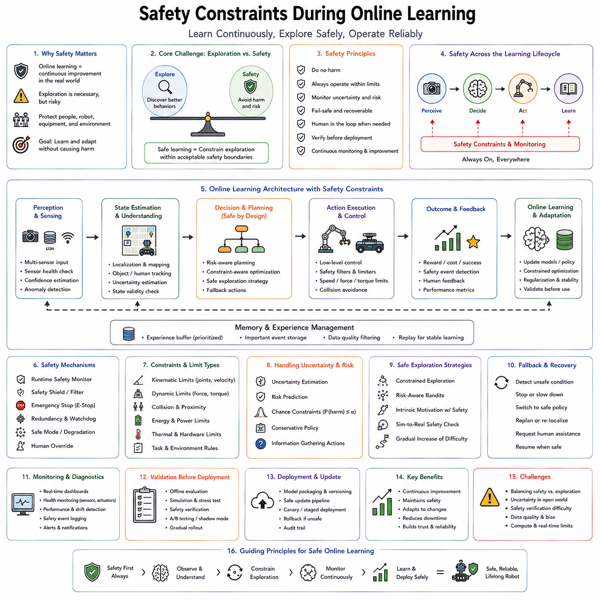{width="7.268055555555556in" height="7.268055555555556in"}

Safety constraints during online learning represent one of the most fundamental challenges in the development of intelligent robotic systems. Online learning allows robots to continuously improve their models, policies, and decision-making capabilities while interacting with the physical world. However, unlike offline learning, every exploratory action performed by a robot has immediate consequences for people, equipment, infrastructure, and the environment. A learning algorithm that behaves safely in simulation may become dangerous when deployed on a physical robot capable of generating significant forces, moving autonomously, manipulating heavy objects, or interacting closely with humans. Consequently, safety cannot be treated as an additional feature layered on top of online learning. Instead, safety constraints must be embedded throughout the entire learning architecture, governing perception, planning, exploration, optimization, execution, memory management, and model deployment. As Physical AI evolves toward increasingly autonomous lifelong learning systems, maintaining safety while enabling continual adaptation becomes one of the defining engineering and scientific problems.

The fundamental conflict arises because learning requires exploration, while safety generally requires predictability. Every intelligent system must occasionally try unfamiliar behaviors to discover improved strategies, adapt to changing environments, or recover from unexpected situations. Excessive caution prevents meaningful learning, causing the robot to repeat conservative behaviors indefinitely. Conversely, unrestricted exploration may lead to collisions, unstable motions, equipment damage, or human injury. The objective of safe online learning is therefore not to eliminate exploration entirely but to constrain exploration within carefully defined safety boundaries where improvement remains possible without unacceptable risk.

This trade-off resembles human learning throughout life. Children learn to walk by repeatedly losing balance, yet responsible caregivers prevent catastrophic falls. Apprentice mechanics gradually gain experience using dangerous tools while supervised by experts. Medical residents perform increasingly complex procedures under careful guidance before practicing independently. In every case, learning progresses through controlled exposure to manageable risk rather than unrestricted experimentation. Safe online learning architectures seek to reproduce this principle computationally by providing protective mechanisms allowing robots to improve continuously without endangering surrounding people or infrastructure.

One of the most important distinctions is between functional safety and learning safety. Functional safety addresses failures caused by hardware malfunctions, electrical faults, communication errors, sensor breakdowns, or software crashes. These problems have long been studied within industrial robotics and autonomous systems. Learning safety introduces a fundamentally different challenge. Here the hardware functions correctly, but the learning algorithm itself intentionally modifies behavior during operation. Even correctly functioning software may temporarily reduce performance while adapting to new experiences. Safe online learning therefore focuses on constraining behavioral evolution rather than merely preventing mechanical failures.

Safety constraints begin with perception. Every subsequent decision depends upon accurate environmental understanding. Sensor failures, calibration errors, synchronization problems, adverse weather, lighting variation, occlusion, electromagnetic interference, dust, vibration, and mechanical degradation may all produce incorrect observations. Before online learning modifies any policy, the architecture must evaluate the reliability of incoming sensory information. Confidence estimation, sensor redundancy, multimodal fusion, anomaly detection, and self-calibration continuously verify whether environmental observations remain trustworthy. Learning based upon corrupted sensory inputs may rapidly produce unsafe behavior even if optimization algorithms themselves function correctly.

State estimation also requires explicit safety monitoring. Robots never observe the true world directly. Instead, internal state estimators reconstruct robot position, object locations, environmental structure, human motion, and system status from noisy sensor measurements. Safety constraints therefore monitor estimation uncertainty alongside estimated values. High uncertainty may indicate poor localization, ambiguous object recognition, or degraded environmental awareness. Under such conditions, robots reduce motion speed, increase sensing frequency, request additional observations, or transfer control to more conservative policies before continuing adaptation.

Uncertainty estimation has become one of the central components of safe online learning. Traditional neural networks frequently produce highly confident predictions even for unfamiliar situations. Such overconfidence creates significant safety risks because robots may execute unreliable actions without recognizing their own uncertainty. Bayesian neural networks, ensemble methods, evidential learning, Monte Carlo dropout, conformal prediction, Gaussian processes, and probabilistic calibration estimate confidence associated with predictions. Whenever uncertainty exceeds predefined thresholds, learning systems activate protective mechanisms including additional sensing, conservative planning, human intervention, or temporary suspension of autonomous adaptation.

Constraint-based optimization provides one of the most widely used mathematical frameworks for safe learning. Instead of maximizing task performance without restriction, optimization algorithms explicitly incorporate safety constraints describing acceptable operating regions. Joint limits, velocity limits, acceleration limits, force limits, torque limits, battery conditions, thermal limits, workspace boundaries, collision margins, visibility constraints, communication quality, and stability requirements become mathematical inequalities that learning algorithms must satisfy throughout optimization. Consequently, even exploratory actions remain confined within physically acceptable operating envelopes.

Control Barrier Functions have emerged as powerful tools for enforcing safety constraints in continuous control systems. Rather than replacing learned controllers entirely, barrier functions mathematically guarantee that system trajectories remain inside predefined safe sets. Whenever learned policies approach dangerous operating conditions, barrier functions minimally modify control outputs to prevent safety violations while preserving as much learning-driven behavior as possible. This architecture allows online adaptation without sacrificing formal safety guarantees.

Control Lyapunov Functions complement barrier functions by ensuring system stability. While barrier functions prevent unsafe states, Lyapunov functions guide robot trajectories toward stable equilibrium conditions. Combining both approaches enables simultaneous optimization of task performance, stability, and safety throughout continual learning. Modern safe control architectures increasingly integrate reinforcement learning policies with control-theoretic safety layers providing mathematical guarantees unavailable through purely data-driven approaches.

Model Predictive Control naturally supports safe online learning because optimization explicitly predicts future system behavior before executing actions. Every candidate action sequence undergoes evaluation according to learned environmental models while simultaneously satisfying physical and safety constraints. If predicted trajectories violate collision avoidance, actuator limits, or stability requirements, optimization rejects those solutions before execution. Online learning subsequently improves predictive models while model predictive control maintains immediate operational safety.

Safe reinforcement learning extends conventional reinforcement learning by optimizing rewards subject to explicit safety requirements. Rather than maximizing cumulative reward alone, constrained reinforcement learning simultaneously minimizes expected constraint violations. Cost functions quantify undesirable events including collisions, excessive forces, unsafe proximity to humans, unstable motions, energy overconsumption, or environmental damage. Policy optimization therefore balances task performance against operational risk throughout learning.

Risk-sensitive optimization further recognizes that average performance alone provides insufficient safety guarantees. Two policies achieving identical expected rewards may differ dramatically in worst-case behavior. Safe online learning therefore increasingly optimizes coherent risk measures such as Conditional Value at Risk, worst-case regret, distributional robustness, or probabilistic safety guarantees rather than average reward alone. Such approaches emphasize consistent reliability across rare but potentially catastrophic situations.

Exploration strategies require particular attention because unsafe exploration remains one of the greatest challenges in continual learning. Random action perturbations commonly employed during reinforcement learning become unacceptable for physical robots operating near humans or valuable equipment. Safe exploration instead employs uncertainty-guided action selection, conservative policy improvement, demonstration-guided exploration, curriculum learning, world model simulation, and constrained policy optimization. Exploration occurs deliberately within regions where safety confidence remains sufficiently high.

Human supervision remains indispensable throughout many online learning scenarios. Human operators intervene whenever uncertainty becomes excessive, unexpected situations arise, or safety boundaries approach violation. Shared autonomy allows humans and autonomous controllers to collaborate dynamically according to confidence estimates. Teleoperation temporarily replaces autonomous control whenever learning systems encounter unfamiliar conditions beyond current competence. Human demonstrations additionally provide safe examples guiding future autonomous behavior while reducing dangerous exploration.

Human preferences also influence safe adaptation. Beyond avoiding physical harm, robots must respect social norms, personal comfort, privacy, cultural expectations, and ethical constraints. Learning purely from task success may inadvertently produce behaviors perceived as unsafe or uncomfortable despite achieving technical objectives. Human feedback therefore increasingly shapes reward functions, policy evaluation, and deployment decisions throughout continual learning.

Simulation serves as one of the most effective mechanisms for reducing physical risk during online adaptation. High-fidelity digital twins replicate robot dynamics, environmental interactions, sensor characteristics, actuator behavior, and operational scenarios. Candidate policy updates first undergo extensive evaluation within simulation before physical deployment. Domain randomization, stochastic disturbances, and adversarial testing expose learned policies to diverse conditions unlikely to appear during ordinary operation. Simulation therefore substantially reduces dangerous real-world experimentation.

World models extend simulation by enabling internal imagination during deployment. Rather than immediately executing exploratory actions physically, robots first predict likely consequences using learned environmental models. Alternative policies, recovery strategies, and adaptation updates undergo virtual evaluation before interacting with the external environment. Although learned world models remain imperfect, combining predictive simulation with uncertainty estimation significantly reduces unnecessary physical risk.

Shadow mode deployment provides another powerful safety mechanism. Newly learned policies receive identical sensory inputs alongside production controllers but do not directly control robot actuators. Instead, predicted actions are logged and compared against operational behavior over extended periods. Performance, safety margins, uncertainty calibration, and robustness undergo comprehensive evaluation before learned policies gradually replace existing controllers. This staged deployment process prevents unsafe policy updates from immediately influencing physical behavior.

Incremental deployment further reduces operational risk. Rather than replacing complete control architectures simultaneously, individual components undergo gradual updates beginning with low-risk subsystems. Parameter-efficient adaptation techniques such as LoRA, adapters, or modular policy updates modify only limited portions of pretrained models. Small behavioral changes become easier to validate, explain, monitor, and reverse than complete end-to-end retraining.

Runtime monitoring continuously evaluates policy behavior after deployment. Safety supervisors independently verify commanded actions before execution, checking collision avoidance, actuator limits, stability conditions, communication integrity, battery status, thermal conditions, localization confidence, and environmental awareness. Runtime verification therefore functions independently from learned controllers, ensuring that learning cannot bypass essential protective mechanisms.

Fallback controllers provide immediate recovery whenever learned policies become unreliable. Classical controllers, rule-based planners, certified safety algorithms, or previously validated policy versions remain available throughout deployment. If anomaly detection identifies abnormal behavior, excessive uncertainty, repeated failures, or unexpected environmental conditions, control immediately transfers toward these verified fallback systems. Learning subsequently continues under supervision until sufficient confidence supports autonomous operation again.

Memory systems contribute significantly to safety by preserving knowledge regarding previous failures and hazardous situations. Instead of forgetting unsuccessful experiences, Memory-Augmented Networks explicitly retain collision cases, unstable trajectories, sensor anomalies, recovery strategies, environmental hazards, and operator interventions. Future decision making retrieves these experiences whenever similar situations arise, reducing repeated mistakes throughout lifelong learning.

Experience replay similarly improves safe adaptation. Rare safety-critical events often occur infrequently during deployment. Without replay, learning algorithms may gradually forget these important experiences while optimizing recent routine behavior. Prioritized replay therefore intentionally revisits safety-related observations more frequently, ensuring hazardous situations remain influential throughout continual optimization.

Anomaly detection identifies unexpected situations beyond normal operating experience. Statistical monitoring, autoencoders, density estimation, one-class classification, reconstruction error analysis, and foundation model embeddings distinguish familiar operating conditions from novel environments. Detected anomalies trigger conservative behaviors including reduced speed, increased sensing, human notification, additional planning, or temporary suspension of online learning until further information becomes available.

Formal verification provides mathematical guarantees regarding specific safety properties. Reachability analysis, temporal logic verification, hybrid system analysis, theorem proving, and certified optimization verify whether learned policies satisfy predefined safety specifications under all admissible operating conditions. Although complete verification remains computationally challenging for large neural networks, hybrid verification approaches increasingly combine formal methods with machine learning to strengthen deployment confidence.

Cybersecurity represents another important safety dimension. Online learning architectures continuously exchange sensor data, model updates, cloud synchronization messages, and software components. Adversarial attacks, malicious model updates, poisoned training data, spoofed sensors, compromised communication channels, or unauthorized memory modification may indirectly produce unsafe physical behavior. Secure communication, authentication, encrypted model updates, trusted execution environments, and anomaly detection therefore become integral components of safe learning architectures.

Fleet learning introduces additional opportunities and challenges. Experiences collected across numerous robots accelerate collective adaptation, but erroneous updates propagated throughout cloud infrastructure may simultaneously affect entire fleets. Robust aggregation algorithms, distributed validation, consensus mechanisms, federated verification, staged rollout procedures, and regional deployment testing reduce this systemic risk while preserving collaborative learning benefits.

Regulatory compliance increasingly shapes safe online learning architectures. Medical robots, autonomous vehicles, industrial manipulators, collaborative robots, aviation systems, and defense platforms operate under strict certification requirements. Learning architectures must therefore maintain detailed audit trails documenting model versions, training data, validation procedures, deployment history, human interventions, safety metrics, and rollback capability. Explainability and traceability become essential not only for engineering but also for legal accountability.

Evaluation of safe online learning extends beyond traditional machine learning benchmarks. Researchers assess collision frequency, intervention rate, constraint satisfaction, recovery capability, uncertainty calibration, adaptation speed, robustness under distribution shift, catastrophic failure probability, formal safety guarantees, human trust, computational overhead, energy efficiency, and long-term operational reliability. Success depends upon sustaining continual improvement while maintaining consistently safe behavior throughout prolonged deployment.

The future of safe online learning will increasingly integrate foundation models, world models, digital twins, Memory-Augmented Networks, continual learning, safe reinforcement learning, formal verification, human feedback, cloud robotics, federated learning, uncertainty-aware reasoning, and neuro-symbolic safety mechanisms within unified cognitive architectures. Rather than viewing safety as an external monitoring system restricting intelligent behavior, future Physical AI will treat safety as an intrinsic property emerging from integrated perception, prediction, reasoning, memory, planning, and continual adaptation.

Safety constraints during online learning therefore represent far more than operational limitations placed upon intelligent robots. They provide the architectural principles allowing autonomous systems to improve continuously without sacrificing reliability, human trust, or physical security. By embedding safety into every layer of perception, memory, optimization, planning, control, validation, deployment, and lifelong learning, future robotic systems will become capable of exploring intelligently, adapting responsibly, and learning continuously while remaining dependable partners within complex human environments. Such architectures will form one of the essential foundations supporting trustworthy Artificial General Intelligence embodied in the physical world.

온라인 학습 중 안전 제약(Safety Constraints)은 지능형 로봇 개발에서 가장 중요한 핵심 기술 가운데 하나이다. 온라인 학습(Online Learning)은 로봇이 실제 환경에서 작업을 수행하면서 모델(Model), 정책(Policy), 의사결정(Decision Making)을 지속적으로 개선하도록 만든다. 그러나 오프라인 학습과 달리 실제 로봇의 모든 행동은 사람, 장비, 시설, 주변 환경에 즉각적인 영향을 미친다. 따라서 안전성(Safety)은 온라인 학습 위에 추가되는 기능이 아니라, 학습 시스템 전체를 구성하는 가장 기본적인 설계 원칙이 되어야 한다.

온라인 학습의 가장 큰 문제는 **학습(Learning)** 과 **안전(Safety)** 사이의 근본적인 충돌이다. 새로운 전략을 배우기 위해서는 탐험(Exploration)이 필요하지만, 탐험은 항상 위험을 동반한다. 지나치게 보수적이면 새로운 지식을 얻지 못하고, 반대로 자유로운 탐험은 충돌(Collision), 장비 손상, 사람의 부상으로 이어질 수 있다. 따라서 안전한 온라인 학습은 탐험을 금지하는 것이 아니라 안전한 범위 안에서만 탐험하도록 제한하는 것이 핵심이다.

이러한 원리는 인간의 학습 과정과도 매우 유사하다. 어린아이는 넘어지면서 걷는 법을 배우지만 부모는 큰 사고가 발생하지 않도록 보호한다. 수련 의사는 숙련된 의사의 감독 아래에서 의료 기술을 배우며, 견습 기술자도 전문가의 지도 아래 위험한 장비를 사용한다. 즉, 인간도 완전히 자유로운 실험이 아니라 관리된 위험(Controlled Risk) 안에서 학습한다. 안전한 온라인 학습도 이러한 원리를 그대로 적용한다.

기능 안전(Functional Safety)과 학습 안전(Learning Safety)은 서로 구분되어야 한다. 기능 안전은 하드웨어 고장, 센서 오류, 통신 장애, 전기적 결함 등 시스템 자체의 문제를 다룬다. 반면 학습 안전은 시스템이 정상적으로 동작하더라도 학습 알고리즘이 정책을 수정하는 과정에서 발생할 수 있는 위험을 의미한다. 즉, 하드웨어는 정상이어도 학습 과정에서 잘못된 행동이 발생할 수 있으므로 별도의 안전 관리가 필요하다.

안전 제약은 인식(Perception) 단계에서부터 시작된다. 카메라, LiDAR, IMU, 힘 센서 등은 조명 변화, 먼지, 진동, 기상 조건, 센서 노화 등으로 인해 잘못된 정보를 생성할 수 있다. 이러한 오류를 기반으로 학습이 이루어지면 매우 위험한 정책이 만들어질 수 있다. 따라서 센서 신뢰도(Sensor Reliability), 이상 탐지(Anomaly Detection), 자기 보정(Self-Calibration), 센서 융합(Sensor Fusion)을 통해 입력 데이터의 품질을 지속적으로 검증해야 한다.

상태 추정(State Estimation) 역시 안전성과 밀접한 관계를 가진다. 로봇은 실제 환경을 직접 아는 것이 아니라 센서를 통해 내부 상태(State)를 추정한다. 위치(Localization), 물체 위치(Object Position), 사람의 움직임(Human Motion), 환경 구조(Environment Structure)는 모두 추정값이다. 따라서 단순한 상태뿐 아니라 그 상태의 불확실성(Uncertainty)도 함께 계산해야 한다. 불확실성이 커질 경우 로봇은 속도를 줄이거나 추가 센서를 사용하거나 더욱 보수적인 정책으로 전환해야 한다.

불확실성 추정(Uncertainty Estimation)은 안전한 온라인 학습의 핵심 요소이다. 일반적인 신경망은 익숙하지 않은 환경에서도 높은 확신을 가지는 경우가 많다. 이러한 과신(Overconfidence)은 실제 로봇에서는 매우 위험하다. 베이지안 신경망(Bayesian Neural Network), 앙상블(Ensemble), 몬테카를로 드롭아웃(Monte Carlo Dropout), 증거 기반 학습(Evidential Learning), 적합 예측(Conformal Prediction) 등을 이용하여 예측의 신뢰도를 계산하고, 신뢰도가 낮을 경우 자동으로 안전 모드(Safe Mode)를 활성화한다.

제약 기반 최적화(Constraint-Based Optimization)는 안전 제약을 수학적으로 표현하는 대표적인 방법이다. 정책은 단순히 성능만 최대화하는 것이 아니라 관절 한계(Joint Limit), 속도 제한(Velocity Limit), 가속도 제한(Acceleration Limit), 힘 제한(Force Limit), 토크 제한(Torque Limit), 작업 공간(Workspace), 충돌 거리(Collision Margin), 배터리 상태(Battery Condition) 등을 항상 만족해야 한다. 따라서 탐험 과정에서도 로봇은 물리적으로 안전한 영역을 벗어나지 않는다.

제어 장벽 함수(Control Barrier Function, CBF)는 안전 영역을 수학적으로 유지하는 대표적인 방법이다. 학습된 정책이 위험한 방향으로 이동하려 하면 장벽 함수가 제어 명령을 최소한으로 수정하여 시스템이 안전 영역을 벗어나지 않도록 만든다. 따라서 학습의 자유는 유지하면서도 안전성은 수학적으로 보장할 수 있다.

제어 리아푸노프 함수(Control Lyapunov Function, CLF)는 시스템의 안정성(Stability)을 보장하는 방법이다. 장벽 함수가 위험한 상태를 막는 역할이라면, 리아푸노프 함수는 시스템이 안정된 상태로 수렴하도록 만든다. 최근에는 CBF와 CLF를 함께 사용하여 안정성과 안전성을 동시에 만족하는 제어 구조가 널리 연구되고 있다.

모델 예측 제어(Model Predictive Control, MPC)는 미래를 예측하여 안전성을 확보한다. 현재 행동을 실행하기 전에 앞으로 발생할 여러 상태를 미리 계산하고, 충돌이나 제약 위반이 예상되는 행동은 제거한다. 온라인 학습은 이러한 예측 모델을 지속적으로 개선하고, MPC는 항상 안전한 행동만 실제로 수행하도록 만든다.

안전 강화학습(Safe Reinforcement Learning)은 보상(Reward)뿐 아니라 안전 비용(Safety Cost)도 함께 최적화한다. 일반 강화학습은 누적 보상만 최대화하지만, 안전 강화학습은 충돌, 과도한 힘, 사람과의 위험한 거리, 에너지 과소비 등도 비용으로 계산하여 정책을 학습한다. 따라서 높은 성능과 높은 안전성을 동시에 추구할 수 있다.

위험 민감 최적화(Risk-Sensitive Optimization)는 평균 성능만으로는 안전을 보장할 수 없다는 점을 고려한다. 평균적으로 좋은 정책이라도 드물게 매우 큰 사고를 일으킬 수 있다. 이를 해결하기 위해 조건부 위험 가치(Conditional Value at Risk, CVaR), 최악의 경우(Worst Case), 분포 기반 강화학습(Distributional Reinforcement Learning) 등을 사용하여 희귀하지만 치명적인 사고까지 고려한 정책을 학습한다.

탐험 전략(Exploration Strategy)은 안전성과 가장 밀접한 관계를 가진다. 시뮬레이션에서는 무작위 행동(Random Exploration)이 가능하지만 실제 로봇에서는 위험하다. 따라서 불확실성 기반 탐험(Uncertainty-Guided Exploration), 전문가 시범(Demonstration), 커리큘럼 학습(Curriculum Learning), 세계 모델(World Model), 보수적 정책 개선(Conservative Policy Improvement)을 이용하여 안전한 범위 안에서만 새로운 행동을 시도한다.

사람 참여(Human-in-the-Loop)는 실제 시스템에서 매우 중요한 역할을 한다. 로봇의 신뢰도가 낮거나 새로운 상황을 만나면 작업자가 직접 제어(Teleoperation)하거나 행동을 수정한다. 또한 사람은 새로운 시범(Demonstration), 선호도 피드백(Preference Feedback), 자연어 설명(Language Instruction)을 제공하여 로봇이 위험한 탐험 없이도 새로운 기술을 습득할 수 있도록 도와준다.

안전성은 단순히 사고를 막는 것만 의미하지 않는다. 사람의 심리적 안정감(Psychological Safety), 개인 정보 보호(Privacy), 사회적 규범(Social Norm), 윤리(Ethics), 문화적 차이(Cultural Difference)도 모두 고려되어야 한다. 기술적으로 성공한 행동이라도 사람이 불편함을 느끼거나 위험하게 인식한다면 안전한 행동이라고 볼 수 없다.

시뮬레이션(Simulation)은 실제 위험을 줄이는 가장 효과적인 방법이다. 디지털 트윈(Digital Twin)을 이용하여 실제 로봇과 동일한 환경을 구축하고 새로운 정책을 먼저 시험한다. 도메인 랜덤화(Domain Randomization), 확률적 환경(Stochastic Environment), 적대적 테스트(Adversarial Testing)를 수행하여 다양한 위험 상황을 미리 검증한 뒤 실제 환경에 적용한다.

세계 모델(World Model)은 내부 시뮬레이터 역할을 수행한다. 새로운 행동을 실제로 실행하기 전에 내부적으로 결과를 예측하여 위험 여부를 판단한다. 이러한 상상 기반 학습(Imagination-Based Learning)은 실제 환경에서의 시행착오를 줄이고 안전성을 크게 향상시킨다.

그림자 실행(Shadow Mode)은 매우 효과적인 안전 검증 방법이다. 새로운 정책은 기존 정책과 동시에 실행되지만 실제 제어에는 참여하지 않는다. 동일한 입력에서 두 정책의 결과를 비교하여 충분한 성능과 안전성이 확인된 이후에만 새로운 정책이 실제 시스템에 적용된다.

점진적 배포(Incremental Deployment)는 시스템 전체를 한 번에 변경하지 않는다. 먼저 위험이 적은 모듈부터 업데이트하고, LoRA(Low-Rank Adaptation), Adapter와 같은 파라미터 효율적 학습(Parameter-Efficient Learning)을 이용하여 일부 파라미터만 수정한다. 이렇게 하면 검증과 복구가 훨씬 쉬워진다.

런타임 모니터링(Runtime Monitoring)은 실제 운영 중에도 계속 동작한다. 충돌 가능성, 관절 제한, 배터리 상태, 센서 이상, 위치 추정 오류, 온도 상승 등을 독립적인 안전 모듈이 지속적으로 감시한다. 학습된 정책이 잘못된 명령을 내리더라도 이러한 안전 계층이 최종적으로 위험한 행동을 차단한다.

폴백 제어기(Fallback Controller)는 문제가 발생했을 때 즉시 사용할 수 있는 안전한 제어기이다. 규칙 기반 제어기(Rule-Based Controller), 기존 검증된 정책, 고전 제어기(Classical Controller) 등이 항상 준비되어 있으며, 이상 탐지나 높은 불확실성이 발생하면 즉시 해당 제어기로 전환된다.

메모리 시스템(Memory System)은 안전성 향상에도 매우 중요하다. 충돌 사례, 실패 사례, 위험 환경, 사람의 개입, 복구 전략 등을 메모리에 저장하면 유사한 상황이 다시 발생했을 때 과거 경험을 활용하여 동일한 실수를 반복하지 않게 된다.

경험 재생(Experience Replay)은 드물게 발생하는 위험 사례를 지속적으로 학습하게 만든다. 실제 사고는 자주 발생하지 않기 때문에 학습 과정에서 쉽게 잊힐 수 있다. 우선순위 경험 재생(Prioritized Experience Replay)은 이러한 안전 관련 경험을 반복적으로 학습하여 위험 상황에 대한 대응 능력을 유지한다.

이상 탐지(Anomaly Detection)는 기존에 경험하지 못한 환경을 발견하는 기능이다. 오토인코더(Autoencoder), 밀도 추정(Density Estimation), 원클래스 분류기(One-Class Classification), 파운데이션 모델 임베딩 등을 이용하여 새로운 환경을 탐지하면 속도를 줄이거나 추가 센서를 사용하거나 사람의 도움을 요청한다.

형식 검증(Formal Verification)은 안전성을 수학적으로 증명하는 방법이다. 도달 가능성 분석(Reachability Analysis), 시간 논리(Temporal Logic), 정리 증명(Theorem Proving), 하이브리드 시스템 분석(Hybrid System Analysis) 등을 이용하여 학습된 정책이 모든 허용 가능한 상황에서 안전 조건을 만족하는지를 검증한다.

사이버 보안(Cybersecurity)도 안전성의 중요한 요소이다. 온라인 학습은 클라우드와 지속적으로 데이터를 주고받기 때문에 악성 데이터(Data Poisoning), 센서 스푸핑(Sensor Spoofing), 모델 변조(Model Manipulation), 통신 공격(Communication Attack)이 발생할 수 있다. 이를 방지하기 위해 암호화(Encryption), 인증(Authentication), 신뢰 실행 환경(Trusted Execution Environment), 이상 탐지 등을 함께 사용한다.

플릿 학습(Fleet Learning)은 여러 로봇이 경험을 공유하여 함께 발전하는 구조이다. 그러나 하나의 잘못된 업데이트가 모든 로봇으로 전파될 위험도 존재한다. 따라서 분산 검증(Distributed Validation), 합의 알고리즘(Consensus Algorithm), 단계적 배포(Staged Rollout), 지역별 테스트 등을 통해 전체 시스템의 안전성을 유지해야 한다.

의료, 자율주행, 산업용 로봇과 같은 분야에서는 규제(Regulation)와 인증(Certification)도 매우 중요하다. 모델 버전(Model Version), 학습 데이터, 검증 결과, 사람의 개입 기록, 배포 이력 등을 모두 저장하여 언제든 추적(Traceability)하고 복원(Rollback)할 수 있어야 한다. 설명 가능성(Explainability)과 감사 가능성(Auditability)은 기술적 요구뿐 아니라 법적 요구사항이기도 하다.

안전한 온라인 학습의 평가는 단순한 정확도보다 훨씬 다양한 요소를 포함한다. 충돌 빈도(Collision Frequency), 사람의 개입 횟수(Intervention Rate), 제약 만족률(Constraint Satisfaction), 복구 능력(Recovery Capability), 불확실성 추정 성능, 적응 속도(Adaptation Speed), 장기적인 안정성(Long-Term Reliability), 계산 비용(Computational Overhead), 인간의 신뢰(Human Trust) 등을 종합적으로 평가한다.

최근에는 파운데이션 모델(Foundation Model), 세계 모델(World Model), 디지털 트윈(Digital Twin), 메모리 증강 네트워크(Memory-Augmented Network), 지속학습(Continual Learning), 안전 강화학습(Safe Reinforcement Learning), 형식 검증(Formal Verification), 인간 피드백(Human Feedback), 클라우드 로보틱스(Cloud Robotics), 연합학습(Federated Learning)이 하나의 통합 안전 프레임워크로 발전하고 있다. 미래의 **Physical AI**는 안전을 단순한 제약 조건이 아니라 인식, 추론, 기억, 계획, 학습 전체에 내재된 기본 특성(Intrinsic Property)으로 가지게 될 것이다.

결국 **온라인 학습 중 안전 제약(Safety Constraints During Online Learning)** 은 단순히 로봇의 행동을 제한하는 기술이 아니라, 로봇이 평생 동안 안전하게 성장하기 위한 핵심 인지 아키텍처이다. 인식 단계부터 메모리, 최적화, 계획, 제어, 검증, 배포, 지속학습에 이르기까지 모든 계층에 안전성을 통합함으로써 로봇은 사람과 함께하는 실제 환경에서도 신뢰할 수 있는 파트너로 지속적으로 학습하고 발전할 수 있다. 이는 범용 로봇 지능(General-Purpose Robotic Intelligence)과 **Physical AI**를 실현하기 위한 가장 중요한 기반 기술 가운데 하나이다.

##  

## 07.10 Online Learning Production Monitoring and Rollback

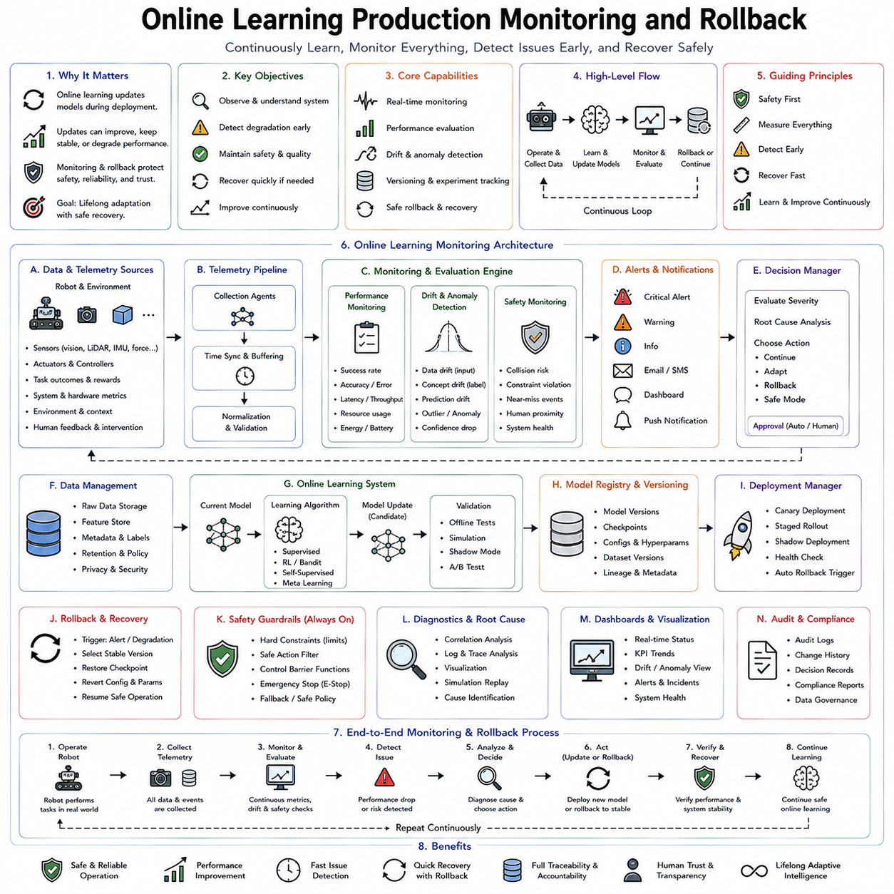{width="7.268055555555556in" height="7.268055555555556in"}

Online learning fundamentally changes the lifecycle of robotic intelligence. Traditional robotic systems are trained offline, validated extensively, deployed into production, and expected to behave consistently until the next scheduled software update. Online learning replaces this static lifecycle with continuous adaptation, where perception models, decision policies, world models, memory structures, and optimization parameters evolve throughout deployment. While this capability enables robots to improve autonomously, it also introduces an entirely new class of operational challenges. Every model update performed during deployment carries the possibility of improving performance, maintaining existing capability, or unintentionally degrading system behavior. Consequently, production monitoring and rollback become essential architectural components rather than optional maintenance features. A truly autonomous robot must not only learn continuously but also detect when learning becomes harmful, diagnose the source of degradation, recover safely, and continue operating without compromising reliability or human trust. Production monitoring and rollback therefore form the operational safety infrastructure supporting lifelong online learning in Physical AI systems.

The central principle behind production monitoring is that every deployed learning system must continuously evaluate its own behavior. Unlike offline evaluation, where fixed benchmark datasets measure model accuracy before deployment, production monitoring observes real-world performance during actual operation. The robot continuously measures task success, prediction confidence, environmental changes, computational performance, hardware status, human feedback, safety indicators, and resource utilization. Instead of assuming that a validated model will remain optimal indefinitely, the architecture treats deployment as an ongoing experiment in which every action contributes evidence regarding system quality.

Monitoring begins with observation rather than intervention. Before modifying any learning algorithm, the system establishes comprehensive visibility into its own operation. Every perception module, planning algorithm, control policy, memory subsystem, communication interface, and hardware component generates telemetry describing its current state. Cameras report image quality, localization modules estimate positional uncertainty, planners record decision latency, controllers measure tracking error, batteries report remaining capacity, processors monitor utilization, and learning modules track parameter updates. Together these observations create a continuously evolving operational picture of the robot\'s internal health.

Telemetry represents the foundation of production monitoring. Modern robotic systems generate enormous volumes of operational data describing both physical behavior and computational processes. Sensor streams, actuator commands, inference latency, GPU utilization, memory consumption, communication bandwidth, battery discharge rates, thermal conditions, navigation trajectories, manipulation outcomes, environmental maps, confidence scores, learning losses, gradient statistics, and policy updates collectively characterize system behavior. Rather than treating these measurements independently, production monitoring integrates them into a unified observability framework capable of identifying subtle interactions among hardware, software, and learning components.

Observability extends beyond traditional logging by emphasizing understanding rather than simply recording events. Logs capture discrete occurrences, metrics summarize numerical trends, and traces reconstruct complete execution paths across distributed components. Together these complementary information sources allow engineers and autonomous monitoring systems to reconstruct why particular decisions occurred, how model updates influenced behavior, and where unexpected performance degradation originated. Comprehensive observability becomes increasingly important as online learning architectures incorporate dozens of interconnected adaptive modules operating simultaneously.

Performance monitoring evaluates whether learning genuinely improves operational capability. Task completion rates provide one obvious measure, but production environments require considerably richer evaluation. Navigation systems monitor path efficiency, obstacle avoidance frequency, localization accuracy, and travel time. Manipulation systems evaluate grasp success, insertion precision, contact stability, force regulation, and recovery performance. Human-robot interaction measures dialogue quality, user satisfaction, response latency, and intervention frequency. Learning systems therefore optimize multidimensional performance rather than single benchmark metrics.

Prediction quality requires continuous assessment because learned models gradually encounter environments differing from previous experience. Classification confidence, regression residuals, trajectory prediction accuracy, object detection reliability, semantic segmentation quality, and language understanding consistency all contribute valuable information regarding model health. Production monitoring identifies situations where prediction confidence decreases despite unchanged environmental complexity, suggesting distribution shift, sensor degradation, or emerging model failure.

Model drift represents one of the most important phenomena requiring continuous monitoring. Distribution drift occurs when environmental observations gradually differ from historical training data. Concept drift arises when relationships between observations and desired outputs change over time. Sensor drift results from gradual calibration changes, hardware aging, or environmental influences. Policy drift reflects evolving behavioral characteristics caused by continual online adaptation. Detecting these subtle changes early prevents gradual performance degradation before catastrophic failures occur.

Data drift detection employs statistical comparison between historical and current operating distributions. Feature distributions, latent representations, semantic embeddings, prediction uncertainty, reconstruction error, clustering structure, and density estimation collectively reveal whether the robot now operates under conditions significantly different from previous experience. Distribution monitoring therefore provides early warning before visible task failures emerge.

Concept drift presents greater challenges because environmental inputs may remain statistically similar while correct decisions gradually change. Manufacturing processes evolve, user preferences shift, traffic regulations change, equipment wears, and organizational workflows adapt over time. Production monitoring therefore evaluates not only sensory distributions but also relationships between observations, actions, and outcomes. Continual validation ensures learned policies remain aligned with current operational requirements rather than outdated historical assumptions.

Behavioral monitoring evaluates the robot itself rather than only internal models. Motion smoothness, acceleration profiles, energy efficiency, trajectory consistency, interaction safety, manipulation stability, and navigation patterns collectively describe external behavior observable within the physical environment. Even if prediction metrics remain acceptable, unusual behavioral patterns may reveal emerging problems requiring investigation. Behavioral monitoring therefore complements internal computational diagnostics.

Safety monitoring operates independently from performance evaluation. A robot may achieve excellent task efficiency while simultaneously violating operational safety constraints. Collision margins, emergency stop frequency, joint limit violations, excessive contact forces, thermal conditions, battery health, communication integrity, localization confidence, obstacle clearance, and human proximity remain continuously supervised regardless of task success. Safety metrics always receive higher priority than productivity measures throughout deployment.

Human feedback provides an additional monitoring channel unavailable through purely autonomous evaluation. Operators report unusual behavior, reduced usability, discomfort, communication failures, preference changes, or task inefficiencies difficult to quantify automatically. Preference learning, reinforcement learning from human feedback, correction demonstrations, and natural language explanations supplement quantitative monitoring with qualitative operational knowledge. Human observations frequently identify subtle problems before automated metrics detect significant degradation.

Anomaly detection serves as the automated early warning system within production monitoring. Statistical models, autoencoders, one-class classifiers, density estimation, Bayesian inference, foundation model embeddings, and reconstruction error analysis distinguish normal operational behavior from unexpected observations. Anomalies may originate from hardware faults, software bugs, cyber attacks, sensor failures, environmental novelty, learning instability, or unforeseen interactions among system components. Early anomaly detection enables preventive intervention before operational failures escalate.

Root cause analysis follows anomaly detection by identifying underlying mechanisms responsible for observed degradation. Distributed robotic architectures contain perception pipelines, localization systems, planners, controllers, memory modules, communication networks, cloud synchronization, and continual learning processes interacting simultaneously. Diagnosing which component initiated observed failures requires causal reasoning supported by comprehensive telemetry, execution traces, dependency graphs, temporal correlation analysis, and probabilistic diagnosis models.

Model versioning provides the structural foundation supporting reliable rollback. Every deployed model receives a unique version identifier associated with training datasets, software dependencies, hardware compatibility, hyperparameters, validation results, deployment timestamps, operational metrics, and safety certification records. Complete version histories ensure that every behavioral change remains traceable throughout the robot\'s operational lifetime. Version management therefore enables reproducibility, regulatory compliance, scientific experimentation, and rapid recovery following unsuccessful updates.

Continuous deployment within online learning differs fundamentally from traditional software release cycles. Instead of infrequent manually supervised updates, learning systems may generate numerous incremental model revisions daily or even hourly. Production architectures therefore require automated deployment pipelines validating each update before release. Candidate models undergo simulation testing, replay evaluation, uncertainty analysis, safety verification, resource profiling, and compatibility checking before reaching production systems.

Shadow deployment provides one of the safest validation mechanisms. Newly trained models receive identical sensory inputs alongside production controllers but never directly command physical actuators. Their predicted actions, confidence estimates, computational latency, and resource consumption are compared continuously against operational models under identical environmental conditions. Extended shadow evaluation reveals subtle weaknesses impossible to detect through offline benchmarks alone. Only after demonstrating consistent superiority does the candidate model progress toward active deployment.

Canary deployment extends this principle across robotic fleets. Rather than updating every robot simultaneously, new models initially deploy to a small subset of carefully selected platforms operating under representative conditions. Production monitoring evaluates fleet-wide metrics comparing updated robots against unchanged control groups. If unexpected degradation emerges, deployment immediately stops while unaffected robots continue operating normally. Canary deployment therefore limits operational risk during continual improvement.

Progressive rollout further reduces deployment risk by gradually increasing the proportion of robots receiving updated models. Monitoring continuously evaluates cumulative evidence supporting or rejecting wider deployment. Statistical significance testing, confidence intervals, Bayesian evaluation, and operational thresholds determine whether rollout proceeds, pauses, or reverses. Progressive deployment therefore transforms model release into a continuously monitored decision process rather than a single irreversible event.

Rollback mechanisms constitute the final protective layer preserving operational reliability. Whenever monitoring identifies unacceptable degradation, the architecture restores previously validated models without requiring manual intervention. Rollback may occur automatically according to predefined safety thresholds or under human supervision depending upon application requirements. The objective is not merely reversing software changes but restoring complete operational capability including policies, memory structures, configuration parameters, calibration information, and supporting metadata.

Rollback strategies vary according to deployment architecture. Immediate rollback replaces entire models with previous versions whenever severe failures occur. Incremental rollback selectively restores only problematic subsystems while preserving beneficial adaptations elsewhere. Parameter rollback reverts recently modified weights without discarding accumulated memory. Feature rollback disables newly introduced representations while maintaining existing controllers. Hybrid rollback increasingly combines these approaches according to diagnosed failure mechanisms.

Memory-aware rollback presents unique challenges because online learning modifies both model parameters and accumulated knowledge. Simply restoring earlier neural network weights may produce inconsistencies with updated episodic memory, semantic knowledge, replay buffers, or world models. Modern rollback architectures therefore coordinate restoration across multiple learning components, ensuring memories remain compatible with restored computational models while preserving valuable operational experience whenever possible.

Checkpointing provides the infrastructure supporting rapid recovery. Throughout deployment, robotic systems periodically preserve complete execution snapshots including neural network parameters, optimizer states, replay buffers, memory contents, configuration files, calibration data, world models, policy versions, and software environments. Checkpoints enable deterministic restoration following unexpected failures, ensuring recovery occurs within seconds rather than requiring complete retraining from historical data.

Digital twins significantly strengthen production monitoring by maintaining continuously synchronized virtual replicas of deployed robots. Operational telemetry updates corresponding simulation models reflecting current hardware conditions, environmental structure, sensor calibration, and learned behavior. Candidate policy updates undergo evaluation within synchronized digital twins before affecting physical systems. Monitoring therefore compares simulated predictions against observed reality, identifying discrepancies indicating model degradation or environmental change.

Cloud robotics enables fleet-level monitoring impossible for isolated robots. Centralized infrastructure aggregates telemetry across thousands of deployments operating under diverse conditions. Statistical analysis identifies emerging failure patterns invisible within individual robots. Successful adaptations propagate throughout the fleet, while problematic updates become isolated before widespread deployment. Fleet intelligence therefore accelerates improvement while simultaneously increasing operational robustness.

Federated monitoring extends collaborative evaluation without compromising privacy. Instead of transmitting raw operational data, robots exchange anonymized metrics, encrypted gradients, compressed embeddings, anomaly statistics, and model performance summaries. Central aggregation identifies global trends while preserving confidential industrial, medical, or domestic information. Federated monitoring therefore supports large-scale continual improvement under strict privacy constraints.

Cybersecurity monitoring becomes increasingly important because online learning systems continuously receive model updates, cloud synchronization messages, and external data. Adversarial attacks, poisoned training samples, unauthorized parameter modification, communication spoofing, malicious firmware, and compromised cloud services may all influence learned behavior. Secure monitoring therefore verifies model integrity, authenticates updates, validates software signatures, detects anomalous communication patterns, and isolates compromised components before physical behavior becomes affected.

Regulatory compliance requires comprehensive operational records throughout continual deployment. Safety-critical industries including healthcare, aviation, manufacturing, autonomous transportation, and defense require detailed audit trails documenting model evolution, validation procedures, deployment history, operational performance, rollback events, human interventions, safety incidents, and software provenance. Production monitoring therefore supports not only engineering reliability but also legal accountability and certification requirements.

Evaluation of production monitoring architectures extends far beyond simple uptime statistics. Detection latency, false positive rates, anomaly localization accuracy, rollback speed, recovery quality, deployment success rate, monitoring overhead, computational efficiency, scalability, fleet coordination, cybersecurity resilience, operator workload, and long-term operational reliability collectively determine architectural effectiveness. Successful monitoring systems identify genuine problems rapidly while avoiding unnecessary rollback triggered by harmless operational variation.

The future of online learning production infrastructure will increasingly integrate foundation models, digital twins, world models, continual learning, Memory-Augmented Networks, federated learning, cloud robotics, autonomous DevOps, explainable AI, uncertainty-aware monitoring, self-healing software systems, and predictive maintenance into unified operational intelligence platforms. Rather than separating development, deployment, monitoring, adaptation, and recovery into independent engineering activities, future robotic systems will manage their own operational lifecycle through continuous self-observation, self-evaluation, self-correction, and safe autonomous evolution.

Online learning production monitoring and rollback therefore represent far more than operational maintenance tools. They constitute the adaptive nervous system governing how intelligent robots evolve throughout years of deployment while preserving reliability, safety, explainability, and human trust. By continuously observing behavior, detecting degradation, validating improvements, coordinating deployment, preserving version history, recovering from failure, and enabling safe continual adaptation, these architectures transform online learning from an experimental capability into a dependable engineering discipline suitable for large-scale deployment of Physical AI across manufacturing, logistics, healthcare, agriculture, service robotics, autonomous transportation, and future general-purpose robotic intelligence.

온라인 학습(Online Learning)은 로봇의 운영 방식을 근본적으로 변화시킨다. 기존 로봇은 오프라인(Offline)에서 충분히 학습한 후 배포되며, 다음 소프트웨어 업데이트까지 동일한 모델을 사용한다. 반면 온라인 학습에서는 인식 모델(Perception Model), 정책(Policy), 세계 모델(World Model), 메모리(Memory), 최적화 파라미터가 실제 운영 중에도 지속적으로 변경된다. 이러한 구조는 로봇의 성능을 계속 향상시키지만, 잘못된 업데이트가 시스템 성능을 저하시킬 위험도 함께 증가시킨다. 따라서 운영 모니터링과 롤백은 단순한 유지보수 기능이 아니라 온라인 학습 시스템의 핵심 인프라가 된다.

온라인 운영 모니터링(Production Monitoring)의 가장 중요한 원칙은 **로봇이 자신의 상태를 스스로 지속적으로 평가(Self-Evaluation)하는 것**이다. 기존의 오프라인 평가가 배포 전 성능을 확인하는 과정이었다면, 운영 모니터링은 실제 환경에서 수행되는 모든 작업을 분석하여 현재 모델이 얼마나 잘 동작하는지를 실시간으로 평가한다. 로봇은 작업 성공률(Task Success Rate), 예측 신뢰도(Prediction Confidence), 환경 변화(Environmental Change), 계산 성능(Computational Performance), 하드웨어 상태(Hardware Status), 사용자 피드백(Human Feedback), 안전 지표(Safety Metrics)를 지속적으로 수집한다.

운영 모니터링은 먼저 개입(Intervention)이 아니라 관찰(Observation)부터 시작한다. 시스템의 모든 구성 요소는 자신의 상태를 지속적으로 보고한다. 카메라는 영상 품질을 기록하고, 위치 추정(Localization)은 오차를 계산하며, 경로 계획기(Planner)는 계산 시간을 기록하고, 제어기(Controller)는 추종 오차(Tracking Error)를 계산한다. 또한 배터리 상태, GPU 사용률, 메모리 사용량, 온도, 네트워크 상태 등도 모두 함께 수집된다. 이러한 데이터는 시스템 전체의 건강 상태(System Health)를 이해하는 기반이 된다.

텔레메트리(Telemetry)는 운영 모니터링의 핵심이다. 센서 데이터, 액추에이터 명령, 추론 시간(Inference Latency), GPU 사용량, 메모리 소비량, 통신 대역폭(Bandwidth), 배터리 소모율, CPU 온도, 이동 궤적(Trajectory), 조작 성공률, 환경 지도(Map), 학습 손실(Learning Loss), 그래디언트(Gradient), 정책 업데이트 정보 등이 모두 텔레메트리 데이터가 된다. 이러한 방대한 데이터를 통합하여 시스템 전체의 동작 상태를 분석한다.

관측 가능성(Observability)은 단순히 로그(Log)를 저장하는 것보다 훨씬 넓은 개념이다. 로그는 개별 이벤트를 기록하고, 메트릭(Metric)은 성능 변화를 수치로 나타내며, 트레이스(Trace)는 여러 모듈을 거치는 실행 과정을 추적한다. 이러한 정보를 함께 분석하면 어떤 이유로 특정 행동이 발생했는지, 새로운 모델이 어떤 영향을 주었는지, 문제가 어디에서 시작되었는지를 정확하게 이해할 수 있다.

성능 모니터링(Performance Monitoring)은 온라인 학습이 실제로 성능을 향상시키는지를 평가한다. 이동 로봇은 이동 시간, 경로 효율(Path Efficiency), 위치 정확도(Localization Accuracy), 장애물 회피 능력을 평가한다. 조작 로봇은 파지 성공률(Grasp Success), 삽입 정확도(Insertion Accuracy), 힘 제어(Force Control)를 평가한다. 인간-로봇 상호작용에서는 사용자 만족도(User Satisfaction), 응답 시간(Response Latency), 사람의 개입 횟수(Intervention Frequency)를 함께 측정한다.

예측 품질(Prediction Quality) 역시 지속적으로 평가되어야 한다. 분류 정확도(Classification Accuracy), 회귀 오차(Regression Error), 물체 검출(Object Detection), 의미 분할(Semantic Segmentation), 언어 이해(Language Understanding) 등이 지속적으로 측정된다. 만약 환경은 크게 변하지 않았는데도 예측 신뢰도가 감소하기 시작하면 모델 성능 저하(Model Degradation)가 발생하고 있다는 신호일 수 있다.

모델 드리프트(Model Drift)는 온라인 학습에서 반드시 감시해야 하는 현상이다. 데이터 분포 드리프트(Data Distribution Drift)는 입력 데이터의 분포가 변하는 것이며, 개념 드리프트(Concept Drift)는 입력과 정답 사이의 관계 자체가 변하는 것이다. 센서 드리프트(Sensor Drift)는 하드웨어 노화나 환경 변화로 센서 특성이 바뀌는 현상이며, 정책 드리프트(Policy Drift)는 온라인 학습으로 인해 행동 특성이 점차 변화하는 현상을 의미한다.

데이터 드리프트(Data Drift)는 과거와 현재 데이터의 통계적 차이를 분석하여 탐지한다. 특징 분포(Feature Distribution), 잠재 표현(Latent Representation), 의미 임베딩(Semantic Embedding), 예측 신뢰도, 밀도 추정(Density Estimation) 등을 비교하여 현재 환경이 기존 학습 환경과 얼마나 달라졌는지를 판단한다. 이를 통해 문제가 발생하기 전에 미리 경고를 제공할 수 있다.

개념 드리프트(Concept Drift)는 더욱 복잡한 문제이다. 입력 데이터는 비슷하지만 정답이 달라지는 경우가 있기 때문이다. 생산 공정 변경, 사용자 선호 변화, 교통 규칙 변경, 기계 마모 등이 이에 해당한다. 따라서 입력 데이터뿐 아니라 입력과 결과의 관계까지 함께 분석해야 현재 정책이 여전히 적절한지를 판단할 수 있다.

행동 모니터링(Behavior Monitoring)은 내부 모델이 아니라 실제 로봇의 움직임을 평가한다. 이동 경로의 부드러움(Motion Smoothness), 가속도 변화, 에너지 소비(Energy Consumption), 조작 안정성(Manipulation Stability), 사람과의 거리 유지 등이 모두 분석 대상이다. 내부 성능은 정상이어도 실제 행동이 비정상적이라면 즉시 문제를 탐지할 수 있어야 한다.

안전 모니터링(Safety Monitoring)은 성능 평가와는 독립적으로 동작한다. 아무리 작업 성능이 뛰어나더라도 충돌 위험(Collision Risk), 관절 한계(Joint Limit), 과도한 힘(Excessive Force), 배터리 이상, 센서 오류, 사람과의 거리 등이 안전 기준을 위반하면 시스템은 즉시 경고를 발생시키거나 안전 모드(Safe Mode)로 전환한다. 안전은 항상 생산성보다 우선한다.

사람의 피드백(Human Feedback)은 매우 중요한 운영 모니터링 정보이다. 사용자는 불편한 동작, 이상 행동, 응답 지연, 사용자 경험(User Experience), 대화 품질(Dialogue Quality) 등을 평가할 수 있다. 이러한 정성적 정보는 자동화된 지표만으로는 발견하기 어려운 문제를 조기에 발견하는 데 큰 도움을 준다.

이상 탐지(Anomaly Detection)는 운영 모니터링의 조기 경보 시스템(Early Warning System)이다. 오토인코더(Autoencoder), 원클래스 분류기(One-Class Classifier), 밀도 추정, 베이지안 추론(Bayesian Inference), 파운데이션 모델 임베딩 등을 이용하여 정상 동작과 다른 패턴을 탐지한다. 이상은 센서 고장, 소프트웨어 버그, 학습 실패, 새로운 환경, 보안 공격 등 다양한 원인으로 발생할 수 있다.

이상이 발견되면 원인 분석(Root Cause Analysis)이 수행된다. 대규모 온라인 학습 시스템은 인식, 위치 추정, 계획, 제어, 메모리, 통신, 클라우드, 학습 모듈이 복잡하게 연결되어 있다. 실행 추적(Execution Trace), 의존성 그래프(Dependency Graph), 시간 상관관계(Temporal Correlation) 등을 분석하여 문제가 어느 모듈에서 시작되었는지를 찾아낸다.

모델 버전 관리(Model Versioning)는 롤백을 위한 가장 중요한 기반이다. 모든 모델에는 고유한 버전 번호가 부여되며, 학습 데이터, 하이퍼파라미터(Hyperparameter), 소프트웨어 버전, 하드웨어 환경, 검증 결과, 배포 이력, 안전 인증 정보가 함께 저장된다. 이러한 기록은 문제 발생 시 정확한 복구를 가능하게 한다.

온라인 학습의 지속적 배포(Continuous Deployment)는 기존 소프트웨어 배포와 크게 다르다. 하루 또는 몇 시간마다 새로운 모델이 생성될 수 있기 때문에 자동화된 배포 파이프라인(Deployment Pipeline)이 필요하다. 새로운 모델은 시뮬레이션, 경험 재생(Replay), 안전 검증(Safety Verification), 자원 사용량(Resource Profiling), 호환성 검사(Compatibility Check)를 모두 통과해야 실제 시스템에 적용된다.

그림자 배포(Shadow Deployment)는 매우 안전한 검증 방법이다. 새로운 모델은 기존 모델과 동일한 입력을 받지만 실제 로봇을 제어하지 않는다. 대신 예측 결과와 실행 시간을 비교하며 충분한 기간 동안 성능을 검증한다. 기존 모델보다 우수하다는 것이 입증된 후에만 실제 제어에 참여한다.

카나리아 배포(Canary Deployment)는 여러 대의 로봇을 운영할 때 사용하는 방법이다. 새로운 모델을 모든 로봇에 동시에 배포하지 않고 일부 로봇에만 먼저 적용한다. 운영 결과를 분석하여 문제가 없을 경우 점차 적용 범위를 확대한다. 문제가 발생하면 나머지 로봇은 영향을 받지 않으므로 운영 위험을 크게 줄일 수 있다.

점진적 배포(Progressive Rollout)는 카나리아 배포를 더욱 세밀하게 확장한 방식이다. 일정 비율의 로봇만 새로운 모델을 사용하고, 통계적으로 충분한 성능 향상이 확인될 때마다 적용 비율을 조금씩 증가시킨다. 이 과정에서 성능이 나빠지면 즉시 배포를 중단하거나 이전 모델로 복귀한다.

롤백(Rollback)은 운영 중 문제가 발생했을 때 이전의 안정적인 모델로 되돌리는 과정이다. 성능 저하나 안전 문제가 발견되면 사람이 개입하기 전에 자동으로 이전 버전으로 복원될 수도 있다. 롤백은 단순히 신경망 파라미터만 되돌리는 것이 아니라 정책, 메모리, 설정(Configuration), 센서 보정(Calibration)까지 함께 복구해야 한다.

롤백 방식은 여러 가지가 존재한다. 전체 롤백(Full Rollback)은 시스템 전체를 이전 버전으로 되돌리고, 부분 롤백(Partial Rollback)은 문제가 있는 모듈만 복구한다. 파라미터 롤백(Parameter Rollback)은 최근 변경된 가중치만 복원하며, 기능 롤백(Feature Rollback)은 새 기능만 비활성화한다. 상황에 따라 이러한 방법을 조합하여 사용한다.

메모리 기반 롤백(Memory-Aware Rollback)은 온라인 학습에서 특히 중요하다. 모델만 이전 버전으로 되돌리면 새롭게 축적된 메모리와 충돌할 수 있다. 따라서 신경망, 경험 메모리(Episodic Memory), 의미 기억(Semantic Memory), 재생 버퍼(Replay Buffer), 세계 모델(World Model)까지 함께 고려하여 일관성 있게 복원해야 한다.

체크포인트(Checkpoint)는 빠른 복구를 위한 핵심 기술이다. 일정한 시간마다 모델 파라미터, 최적화 상태(Optimizer State), 메모리, 설정 파일, 세계 모델 등을 모두 저장한다. 문제가 발생하면 최근의 안정적인 체크포인트를 즉시 복원하여 수 초 내에 정상 운영을 재개할 수 있다.

디지털 트윈(Digital Twin)은 운영 모니터링을 더욱 강화한다. 실제 로봇과 동일한 가상 모델을 유지하면서 새로운 정책을 먼저 테스트한다. 실제 운영 데이터가 디지털 트윈을 지속적으로 갱신하므로 매우 현실적인 검증이 가능하며, 실제 장비의 위험을 크게 줄일 수 있다.

클라우드 로보틱스(Cloud Robotics)는 여러 로봇의 운영 데이터를 중앙 서버에 통합한다. 수천 대의 로봇에서 발생하는 데이터를 분석하면 개별 로봇에서는 발견하기 어려운 패턴을 찾을 수 있다. 성공적인 업데이트는 전체 로봇에 공유하고, 문제가 있는 모델은 즉시 배포를 중단하여 전체 시스템을 보호한다.

연합 모니터링(Federated Monitoring)은 개인정보를 보호하면서 운영 데이터를 분석하는 방식이다. 원본 데이터를 공유하지 않고 익명화된 성능 지표, 임베딩(Embedding), 이상 탐지 결과만 공유하므로 병원, 공장, 가정에서도 안전하게 운영 상태를 분석할 수 있다.

사이버 보안(Cybersecurity Monitoring)도 운영 모니터링의 중요한 요소이다. 온라인 학습은 지속적으로 모델과 데이터를 교환하기 때문에 데이터 오염(Data Poisoning), 악성 모델 업데이트(Malicious Update), 센서 스푸핑(Sensor Spoofing), 통신 공격 등이 발생할 수 있다. 이를 방지하기 위해 모델 무결성(Model Integrity), 디지털 서명(Digital Signature), 인증(Authentication), 이상 통신 탐지 등을 함께 수행한다.

의료, 자율주행, 제조 분야에서는 규제와 인증(Regulation & Certification)이 매우 중요하다. 모델 변경 이력, 검증 결과, 배포 기록, 롤백 이력, 사람의 개입 기록 등을 모두 저장하여 감사(Audit)와 추적(Traceability)이 가능해야 한다. 이는 기술적인 요구뿐 아니라 법적 요구사항이기도 하다.

운영 모니터링의 평가는 단순한 시스템 가동률(Uptime)이 아니다. 이상 탐지 속도(Detection Latency), 오탐률(False Positive Rate), 롤백 속도(Rollback Speed), 복구 품질(Recovery Quality), 배포 성공률(Deployment Success Rate), 시스템 부하(Overhead), 확장성(Scalability), 운영 안정성(Reliability), 보안성(Security), 작업자의 부담(Operator Workload) 등을 함께 평가해야 한다.

최근에는 파운데이션 모델(Foundation Model), 디지털 트윈(Digital Twin), 세계 모델(World Model), 메모리 증강 네트워크(Memory-Augmented Network), 지속학습(Continual Learning), 연합학습(Federated Learning), 클라우드 로보틱스(Cloud Robotics), 설명 가능한 AI(Explainable AI), 예측 유지보수(Predictive Maintenance)를 통합한 운영 플랫폼이 연구되고 있다. 미래의 로봇은 스스로 자신의 상태를 관찰하고, 문제를 진단하며, 필요하면 자동으로 복구하는 자기 관리(Self-Management) 능력을 갖추게 될 것이다.

결국 **온라인 학습의 운영 모니터링과 롤백(Online Learning Production Monitoring and Rollback)** 은 단순한 유지보수 기술이 아니라 **Physical AI**의 지속적인 성장과 신뢰성을 보장하는 핵심 운영 인프라이다. 시스템은 자신의 상태를 실시간으로 관찰하고, 성능 저하와 이상을 조기에 탐지하며, 새로운 모델을 안전하게 검증하고, 필요할 경우 즉시 이전 버전으로 복원할 수 있어야 한다. 이러한 체계적인 운영 관리가 가능할 때 비로소 로봇은 수년 동안 실제 환경에서 안전하고 안정적으로 학습하며 발전하는 진정한 평생학습(Lifelong Learning) 지능 시스템으로 성장할 수 있다.
