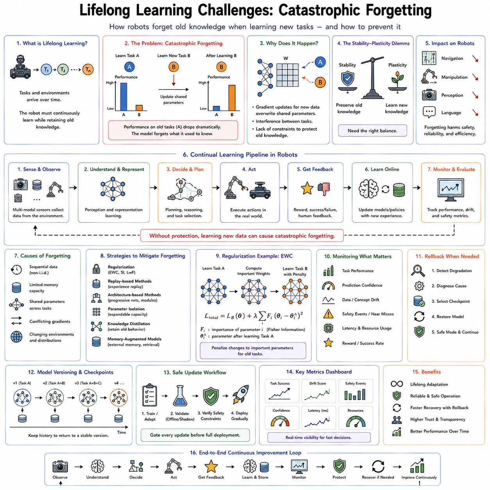
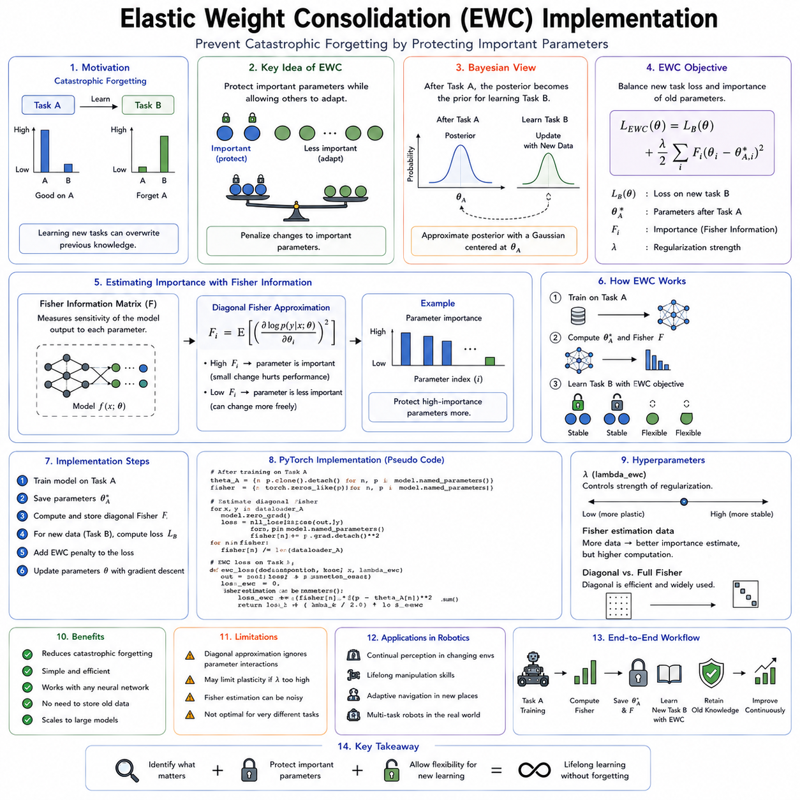
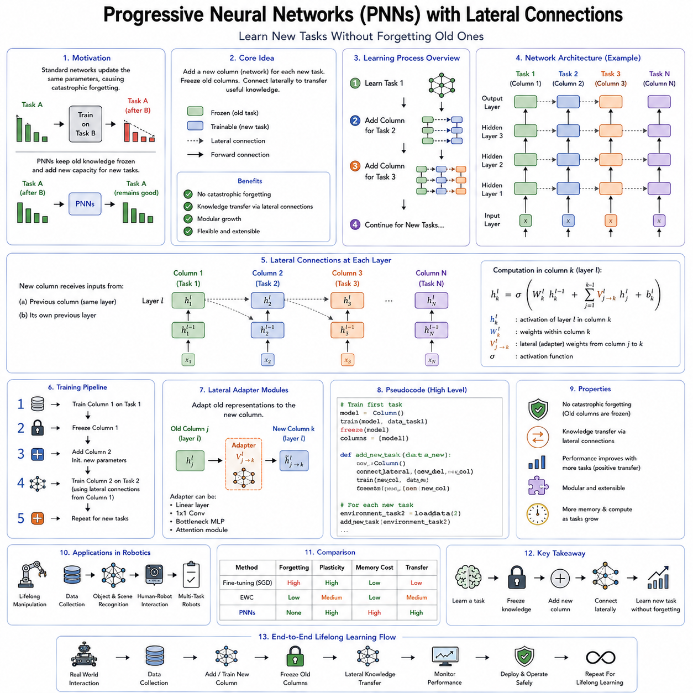
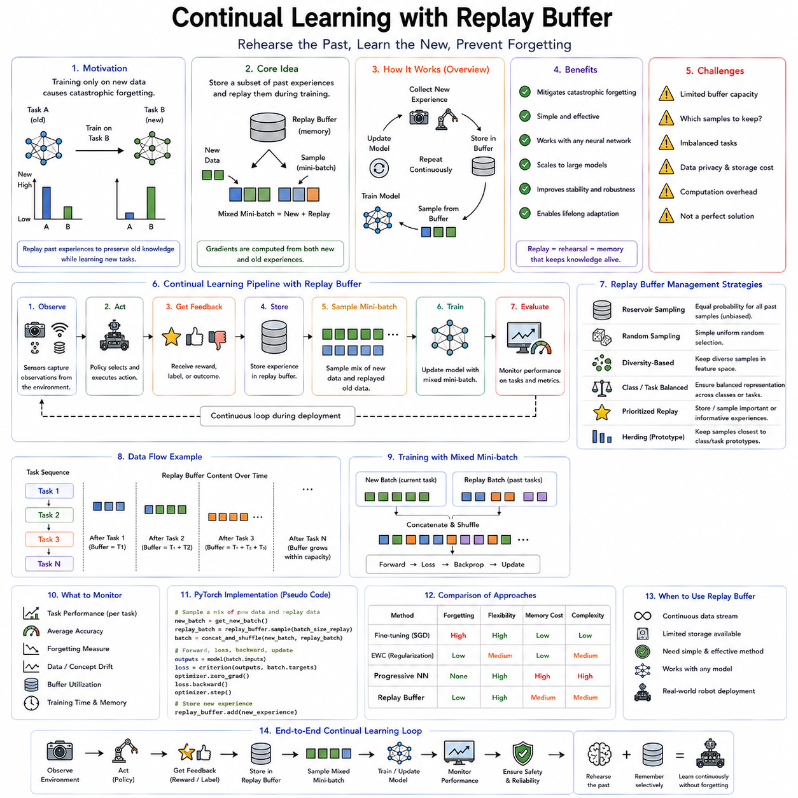
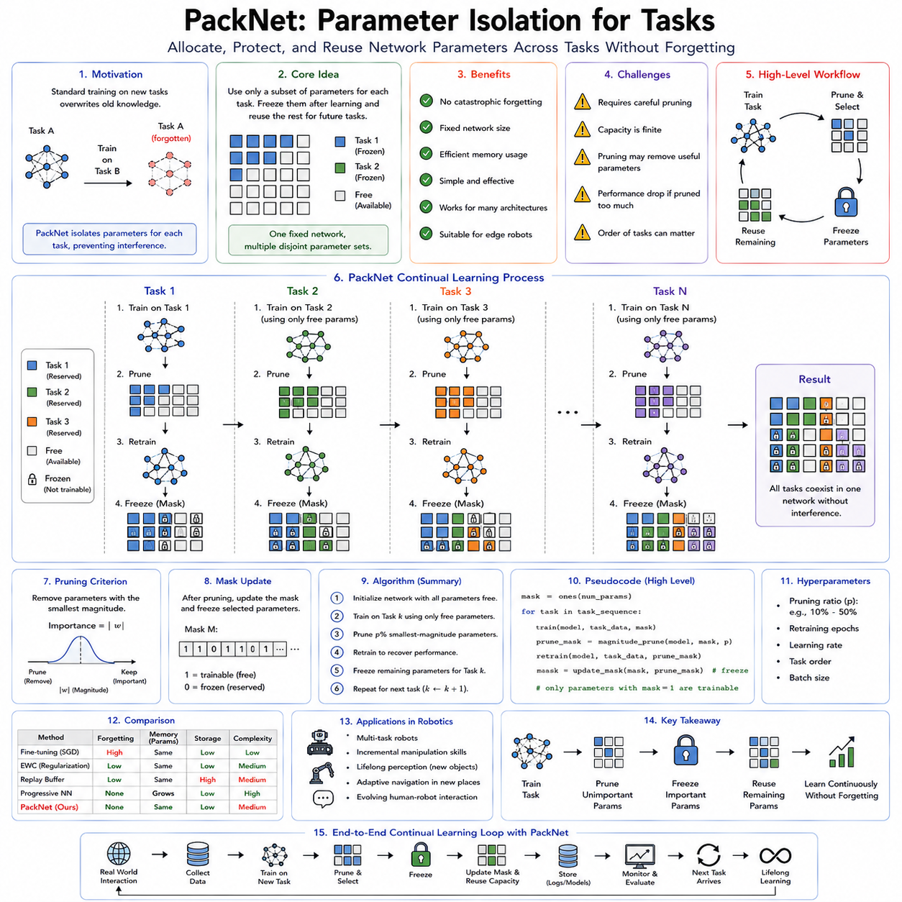
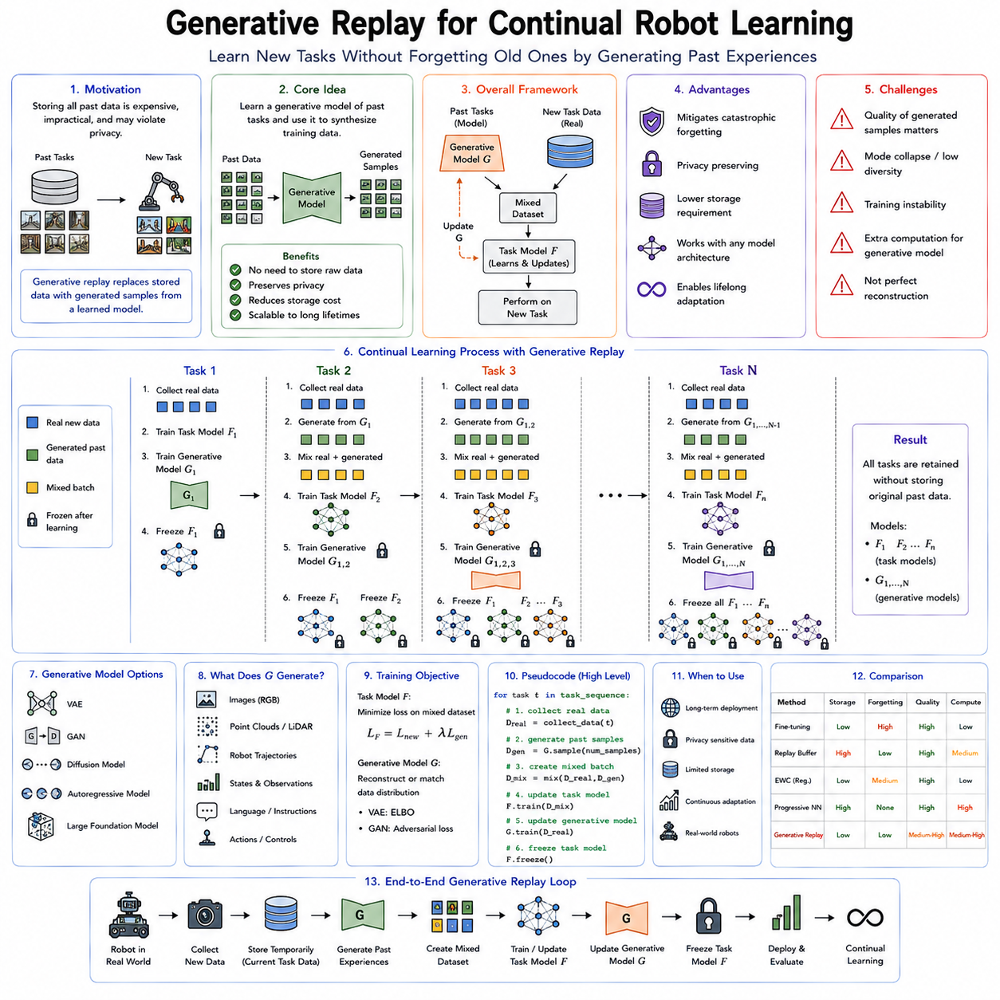
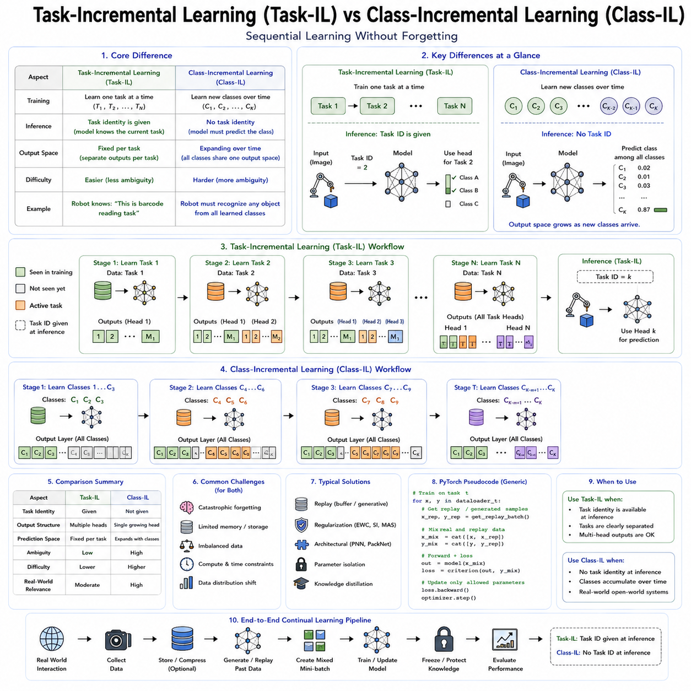
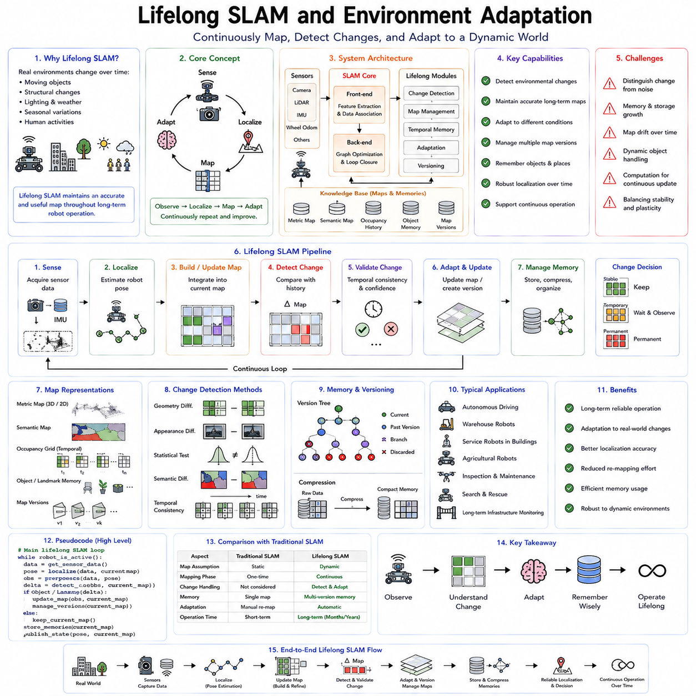
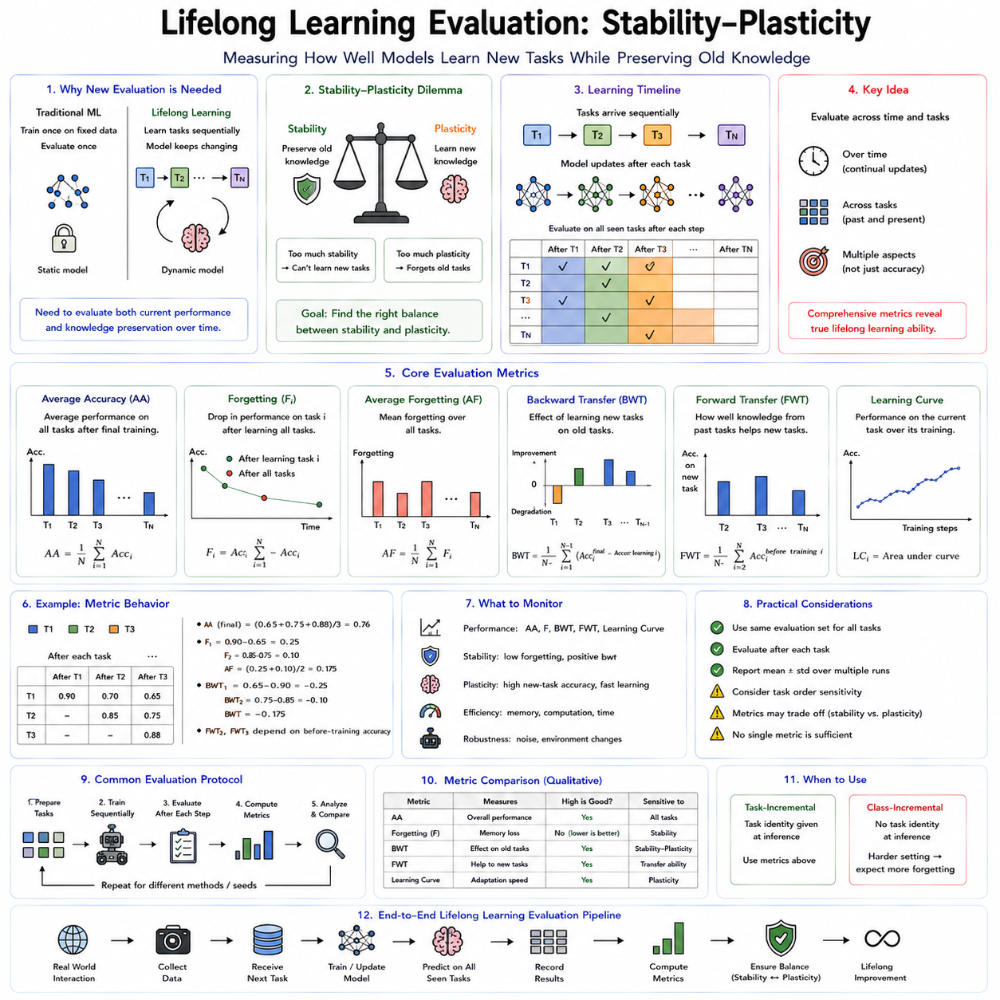
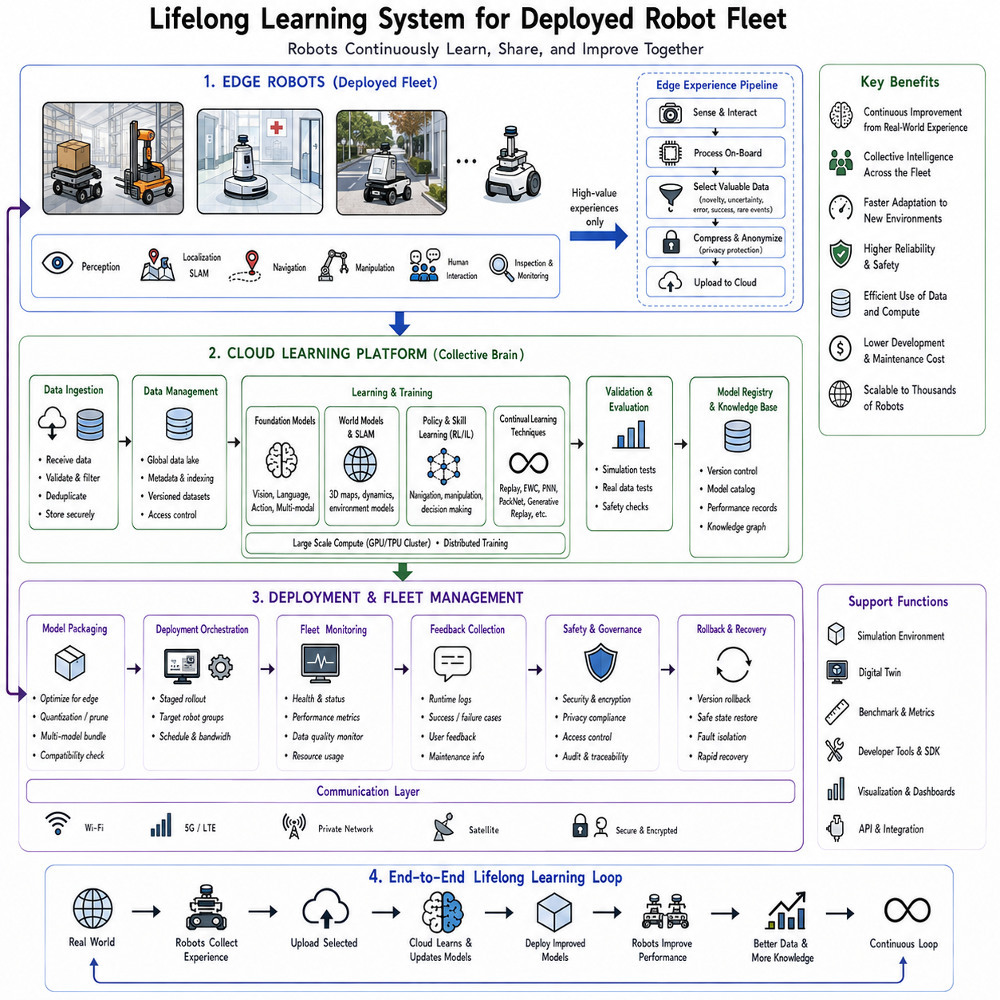

**Volume 19 Robot Machine Learning and AI**

# 08. Lifelong Learning

## 08.01 Lifelong Learning Challenges Catastrophic Forgetting

{width="7.268055555555556in" height="7.268055555555556in"}

---

---

---

---

---

---

---

---

---

---

---

---

---

---

---

---

---

---

---

---

평생 학습( Lifelong Learning )은 진정한 지능형 로봇이 갖추어야 할 가장 중요한 능력 가운데 하나이다. 기존의 기계학습(Machine Learning)은 고정된 데이터셋으로 한 번 학습한 후 배포되는 방식을 가정하지만, 평생 학습은 로봇이 운용되는 전 기간 동안 새로운 경험을 지속적으로 학습하는 것을 목표로 한다. 새로운 환경, 새로운 작업, 인간과의 상호작용, 예상치 못한 사건은 모두 미래 성능을 향상시키기 위한 학습 기회가 된다. 이는 인간이 수십 년 동안 경험을 축적하며 지식을 확장하는 방식과 유사하다.

그러나 이러한 자연스러운 개념은 현대 딥러닝(Deep Learning)의 가장 근본적인 약점인 파국적 망각(Catastrophic Forgetting)을 드러낸다. 인간은 새로운 기술을 배워도 기존 능력을 대부분 유지하지만, 인공신경망(Artificial Neural Network)은 새로운 작업을 학습하는 과정에서 기존 지식을 쉽게 잃어버린다. 예를 들어 새로운 물체를 집는 법을 학습한 로봇이 이전에는 완벽하게 수행하던 물체 집기를 실패하거나, 새로운 창고 환경에 적응한 자율주행 로봇이 기존 건물에서의 주행 능력을 상실하는 현상이 발생할 수 있다.

파국적 망각은 단순한 성능 저하가 아니라 이전에 획득한 지식 자체가 새로운 학습 과정에서 덮어써지는 현상이다. 따라서 로봇이 장기간 운용되면서 지속적으로 성능을 향상시키려면 반드시 해결해야 하는 핵심 문제로 여겨진다.

파국적 망각은 경사하강법(Gradient Descent) 기반의 최적화 과정에서 발생한다. 학습 알고리즘은 현재 데이터셋의 손실 함수(Loss Function)를 최소화하는 방향으로 네트워크의 가중치(Weight)를 수정한다. 그러나 이 과정에서는 어떤 가중치가 과거의 중요한 지식을 저장하고 있는지를 고려하지 않는다. 새로운 데이터가 생성하는 기울기(Gradient)가 기존 학습 방향과 충돌하면, 최적화 과정은 과거의 표현(Representation)을 점차 파괴하게 된다.

결과적으로 모델은 새로운 문제에는 뛰어난 성능을 보일 수 있지만 이전에 학습한 작업에서는 급격한 성능 저하를 보인다. 즉, 새로운 지식을 얻는 과정이 기존 지식을 희생시키는 구조가 되는 것이다.

이 문제는 모델의 규모가 커질수록 더욱 심각해진다. 최근의 로봇 파운데이션 모델(Robot Foundation Model)은 수십억 개의 파라미터(Parameter)를 공유하며 인식(Perception), 언어(Language), 추론(Reasoning), 계획(Planning), 조작(Manipulation), 이동(Navigation)을 동시에 수행한다.

공유 파라미터는 일반화 능력을 높이는 장점이 있지만, 서로 다른 작업들이 동일한 가중치를 사용하기 때문에 간섭(Interference)이 쉽게 발생한다. 예를 들어 조작 능력을 개선하기 위한 업데이트가 시각 특징 표현을 손상시켜 주행 성능을 저하시킬 수 있으며, 언어 이해를 향상시키는 학습이 경로 계획 성능을 떨어뜨릴 수도 있다. 즉, 하나의 작업을 개선하려는 업데이트가 다른 기능을 예상치 못하게 훼손하는 것이다.

기존 지도학습(Supervised Learning)은 이러한 문제를 거의 고려하지 않는다. 일반적으로 모든 데이터가 처음부터 준비되어 있으며 학습 과정 동안 자유롭게 반복 사용할 수 있다고 가정하기 때문이다. 데이터는 무작위로 섞여 있으며 학습과 평가 역시 정적인 데이터셋에서 수행된다.

그러나 실제 로봇 환경은 이러한 가정을 거의 만족하지 않는다. 데이터는 시간 순서대로 지속적으로 들어오고 환경은 계속 변화한다. 센서는 노후화되고 하드웨어 특성도 달라지며 사용자 요구도 변한다. 또한 개인정보 보호나 저장 공간 제한 때문에 과거 데이터를 항상 보관할 수도 없다. 따라서 실제 로봇은 고정된 데이터셋이 아닌 연속적으로 변화하는 환경에서 학습해야 한다.

예를 들어 물류 창고에서 수년간 운용되는 자율주행 로봇을 생각해 보자. 창고 구조는 계속 변경되고 상품 포장은 바뀌며 계절에 따라 조명 조건도 달라진다. 새로운 장애물이 생기고 작업 절차도 지속적으로 수정된다.

이러한 변화에 적응하기 위해서는 새로운 학습이 반드시 필요하지만 동시에 수개월 전에 학습한 수천 개의 상품 정보와 기존 이동 능력도 그대로 유지해야 한다. 만약 파국적 망각이 발생한다면 새로운 상품을 학습할수록 오래된 상품을 인식하지 못하게 되고, 장기간 운용될수록 전체 성능은 오히려 감소하게 된다.

이 문제는 안정성-가소성 딜레마(Stability-Plasticity Dilemma)로 설명할 수 있다. 가소성(Plasticity)은 새로운 정보를 빠르게 학습하는 능력을 의미하며, 안정성(Stability)은 기존 지식을 유지하는 능력을 의미한다.

가소성이 지나치게 높으면 새로운 지식은 빠르게 습득하지만 기존 지식을 쉽게 잃어버린다. 반대로 안정성이 너무 높으면 기존 지식은 유지되지만 새로운 환경에 적응하지 못한다. 평생 학습의 핵심 목표는 이 두 가지 성질을 동시에 만족하는 균형점을 찾는 것이다.

인간의 뇌는 수십 년 동안 지속적으로 학습하면서도 대부분의 기억을 유지하는데, 이는 다양한 기억 시스템이 서로 다른 시간 규모에서 협력하기 때문으로 알려져 있다.

인간의 학습은 파국적 망각이 왜 비자연적인지를 잘 보여준다. 자동차 운전을 배운 사람이 트럭 운전을 익힌다고 해서 자전거 타는 법을 잊어버리지는 않는다. 새로운 외국어를 배워도 모국어를 잃지 않으며, 외과 의사는 새로운 수술 기법을 배우면서도 수십 년간 축적한 의료 지식을 유지한다.

물론 인간도 일부 간섭 현상을 경험할 수 있지만, 기존 기억은 대부분 장기간 유지된다. 이는 생물학적 학습 시스템이 단순히 하나의 기억 공간만 사용하는 것이 아니라 서로 다른 종류의 기억을 분리하여 저장하기 때문이다.

신경과학(Neuroscience)은 이러한 현상을 해마(Hippocampus)와 대뇌피질(Cerebral Cortex)의 역할 분담으로 설명한다. 해마는 새로운 경험을 빠르게 저장하고, 장기적인 지식은 시간이 지나면서 대뇌피질에 천천히 통합된다.

수면(Sleep), 기억 재생(Replay), 시냅스 강화(Synaptic Consolidation), 선택적 가소성(Selective Plasticity)과 같은 과정이 기존 기억을 유지하면서 새로운 정보를 통합하는 역할을 수행한다. 많은 평생 학습 알고리즘 역시 이러한 생물학적 메커니즘에서 영감을 받아 설계되고 있다.

로봇에서는 파국적 망각이 전체 인공지능 파이프라인(Pipeline)에 영향을 미친다. 영상 인식 모델은 이전에 학습한 물체를 잊을 수 있으며, 의미론적 분할(Semantic Segmentation)은 새로운 환경에 적응하면서 기존 환경의 성능을 잃을 수 있다.

위치 추정(Localization)은 이전에 방문했던 공간을 제대로 기억하지 못할 수 있고, 조작 정책(Manipulation Policy)은 새로운 도구를 학습하면서 기존 물체를 잡는 능력을 잃을 수도 있다. 언어 기반 계획(Language-conditioned Planning) 역시 이전에 이해하던 명령을 제대로 수행하지 못할 가능성이 있다.

이처럼 하나의 모듈에서 발생한 망각은 다른 모듈에도 연쇄적으로 영향을 주며 전체 시스템 성능을 저하시킨다.

체화 인공지능(Embodied AI)에서는 이 문제가 더욱 복잡하다. 로봇은 단순히 데이터를 관찰하는 것이 아니라 행동(Action)을 수행하고 그 결과를 다시 학습한다.

만약 로봇이 좁은 통로를 안전하게 통과하는 방법을 잊어버린다면 해당 지역으로 더 이상 진입하지 않게 되고, 결국 그 환경을 다시 학습할 기회 자체를 잃게 된다. 즉, 잘못된 학습이 이후의 데이터 분포까지 변화시키며 파국적 망각을 더욱 심화시키는 피드백 루프(Feedback Loop)가 형성된다.

환경 변화(Distribution Shift)는 파국적 망각을 더욱 악화시킨다. 계절에 따른 조명 변화, 센서 보정 오차, 기계 부품의 마모, 사용자 행동의 변화 등은 모두 입력 데이터 분포를 변화시킨다.

학습 시스템은 이러한 변화 가운데 실제 적응해야 하는 장기적인 변화와 일시적인 잡음(Noise)을 구별해야 한다. 너무 적극적으로 적응하면 기존 지식을 잃고, 반대로 적응하지 않으면 변화된 환경에서 성능이 급격히 떨어진다.

현실의 로봇은 작업(Task)의 경계도 명확하지 않다. 연구용 데이터셋은 새로운 작업이 시작되는 시점을 알려주지만 실제 환경에서는 이러한 정보가 존재하지 않는다.

가정용 로봇은 청소, 물건 운반, 대화, 조작, 이동을 자연스럽게 오가며 작업을 수행한다. 따라서 시스템은 현재 변화가 새로운 작업인지, 기존 작업의 변형인지, 아니면 단순한 예외 상황인지를 스스로 판단해야 한다. 잘못 판단하면 전이 학습(Transfer Learning)의 효과를 잃거나 파국적 망각이 더욱 심해질 수 있다.

이러한 이유로 평생 학습은 여러 시나리오로 구분된다. 작업 증분 학습(Task-Incremental Learning)은 작업 정보를 알고 있는 상황이며, 도메인 증분 학습(Domain-Incremental Learning)은 작업은 동일하지만 데이터 분포만 변화한다.

클래스 증분 학습(Class-Incremental Learning)은 새로운 객체 종류를 지속적으로 추가하는 문제이며, 온라인 연속 학습(Online Continual Learning)은 과거 데이터를 다시 사용할 수 없는 환경에서 실시간으로 학습해야 하는 상황을 의미한다.

실제 서비스 로봇은 이러한 모든 상황이 동시에 발생하는 복합적인 환경에서 동작하는 경우가 대부분이다.

메모리(Memory)와 저장 공간(Storage)의 한계도 중요한 문제이다. 자율주행차나 산업용 검사 로봇은 하루에도 수 테라바이트(TB)의 데이터를 생성한다. 수년 동안 모든 데이터를 저장하는 것은 현실적으로 불가능하다.

따라서 평생 학습 시스템은 어떤 경험을 장기적으로 보존하고 어떤 경험을 삭제할 것인지 선택해야 한다. 이러한 경험 선택 전략 자체가 성능을 결정하는 중요한 요소가 된다.

지식 표현(Knowledge Representation)의 방식 역시 파국적 망각에 큰 영향을 미친다. 분산 표현(Distributed Representation)은 뛰어난 일반화를 제공하지만 작업 간 간섭이 심하다. 희소 표현(Sparse Representation)은 간섭을 줄일 수 있으며, 모듈형 구조(Modular Architecture)는 특정 기능만 선택적으로 수정할 수 있게 한다.

계층적 표현(Hierarchical Representation)은 기본 개념은 유지하면서 상위 기능만 적응하도록 만들어 장기적인 안정성과 적응성을 동시에 확보할 수 있도록 도와준다.

최근의 로봇 파운데이션 모델은 대규모 사전학습(Pretraining)을 수행하기 때문에 비교적 작은 수정만으로도 새로운 작업에 적응할 수 있다. 따라서 처음부터 학습하는 것보다 파국적 망각이 감소하는 장점이 있다.

그러나 장기간의 연속적인 미세조정(Fine-tuning)이 반복되면 결국 기존 표현도 손상될 수 있으므로 이를 방지하기 위한 별도의 보호 메커니즘이 반드시 필요하다.

파국적 망각을 평가하기 위해서는 단순 정확도(Accuracy)만으로는 충분하지 않다. 연구에서는 평균 정확도(Average Accuracy), 역전이(Backward Transfer), 순전이(Forward Transfer), 망각 지수(Forgetting Score), 적응 속도, 메모리 효율성, 계산 비용 등을 함께 평가한다.

실제 로봇에서는 단기적인 성능보다 수개월 또는 수년에 걸쳐 얼마나 안정적으로 학습과 성능을 유지하는지가 더욱 중요한 평가 기준이 된다.

산업 현장에서도 이러한 문제는 매우 현실적이다. 제조 로봇은 새로운 제품을 생산하도록 업데이트되면서도 기존 생산라인을 그대로 유지해야 한다. 물류 로봇은 창고가 확장되어도 기존 경로를 기억해야 하며, 농업 로봇은 계절 변화에 적응하면서 이전 작물에 대한 지식도 유지해야 한다.

의료 로봇은 새로운 기능을 추가하면서도 이미 인증받은 안전한 동작을 절대 잃어서는 안 된다. 결국 모든 산업용 로봇은 새로운 능력을 획득하면서도 기존 능력을 유지해야 하는 동일한 문제를 안고 있다.

안전성(Safety)은 로봇에서 특히 중요하다. 추천 시스템이 사용자의 취향을 잊는 것은 불편함에 그치지만, 로봇이 충돌 회피나 안전 제동을 잊어버리면 인명 사고와 장비 손상이 발생할 수 있다.

따라서 실제 로봇의 평생 학습은 학습 알고리즘뿐 아니라 검증(Verification), 롤백(Rollback), 신뢰도 추정(Uncertainty Estimation), 런타임 모니터링(Runtime Monitoring)까지 포함하는 전체 시스템 관점에서 설계되어야 한다.

최근에는 클라우드 로보틱스(Cloud Robotics)를 이용하여 개별 로봇의 경험을 중앙 서버에서 통합 학습하는 방식도 활용되고 있다. 여러 로봇이 수집한 데이터를 중앙에서 학습하여 새로운 모델을 생성한 뒤 충분한 검증을 거쳐 다시 배포하면 개별 로봇에서 발생하는 망각을 줄일 수 있다.

또한 매개변수 효율적 미세조정(Parameter-Efficient Fine-tuning), 외부 메모리(External Memory), 검색 기반 증강(Retrieval-Augmented Learning)과 같은 기술들도 기존 파라미터를 크게 변경하지 않으면서 새로운 지식을 활용하는 유망한 접근법으로 주목받고 있다.

현재까지 파국적 망각을 완전히 해결하는 방법은 존재하지 않는다. 그러나 최적화 이론(Optimization Theory), 정보 이론(Information Theory), 베이지안 학습(Bayesian Learning), 신경과학(Neuroscience)의 발전을 통해 문제의 원인이 점차 명확해지고 있으며, 보다 체계적인 해결책이 제안되고 있다.

이후 장에서는 탄성 가중치 통합(Elastic Weight Consolidation, EWC), 프로그레시브 신경망(Progressive Neural Networks), 리플레이 버퍼(Replay Buffer), 파라미터 분리(Parameter Isolation), 생성 리플레이(Generative Replay), 평생 SLAM(Lifelong SLAM), 그리고 안정성-가소성(Stability-Plasticity)을 평가하는 다양한 기법들을 차례대로 살펴본다. 이러한 기술들은 장기간 자율적으로 학습하면서도 기존 지식을 유지하는 진정한 평생 학습 로봇을 구현하기 위한 핵심 기반 기술로 자리 잡고 있다.

## 08.02 Elastic Weight Consolidation EWC Implementation [w/Code]

{width="7.268055555555556in" height="7.268055555555556in"}

---

---

---

---

---

---

---

---

---

---

---

---

---

---

---

---

---

---

---

---

---

---

---

---

---

---

탄성 가중치 통합(EWC, Elastic Weight Consolidation)은 평생 학습(Lifelong Learning)과 연속 학습(Continual Learning)에서 발생하는 파국적 망각(Catastrophic Forgetting)을 해결하기 위해 제안된 가장 대표적인 알고리즘 가운데 하나이다. EWC는 새로운 작업(Task)의 학습을 막는 것이 아니라, 기존에 중요한 역할을 했던 지식을 선택적으로 보호하면서 새로운 지식을 계속 학습하도록 만든다. 핵심 아이디어는 신경망의 모든 파라미터(Parameter)가 동일한 중요도를 가지는 것이 아니라는 점이다. 어떤 파라미터는 과거 지식을 유지하는 데 매우 중요하지만, 다른 파라미터는 비교적 자유롭게 수정되어도 기존 성능에 큰 영향을 주지 않는다.

따라서 EWC는 중요한 파라미터만 보호하고 덜 중요한 파라미터는 계속 학습하도록 함으로써 기존 지식을 유지하면서도 새로운 능력을 획득할 수 있도록 한다. 이러한 선택적 보호 전략은 평생 학습의 안정성(Stability)과 적응성(Plasticity)을 동시에 확보하려는 대표적인 접근법이다.

EWC가 제안된 배경은 기존 확률적 경사하강법(Stochastic Gradient Descent, SGD)의 한계에서 출발한다. 일반적인 SGD는 현재 학습 중인 손실 함수(Loss Function)만 고려하여 모든 파라미터를 동일한 방식으로 업데이트한다.

이미 수백만 장의 이미지로 학습된 중요한 시각 특징을 담당하는 가중치와 특정 작업에서만 약간의 역할을 하는 가중치가 동일한 규칙으로 수정되기 때문에, 새로운 작업을 학습할수록 오랫동안 축적된 지식이 쉽게 사라진다. EWC는 이러한 문제를 해결하기 위해 과거 학습에서 중요한 역할을 했던 파라미터를 먼저 식별한 후, 이후 학습에서는 해당 파라미터의 변경을 제한한다.

EWC의 아이디어는 신경과학(Neuroscience)의 시냅스 통합(Synaptic Consolidation) 이론에서 영감을 얻었다. 인간의 기억은 처음에는 비교적 쉽게 변하지만 반복적인 사용과 학습을 통해 장기 기억(Long-Term Memory)으로 점차 고정된다.

이 과정에서 중요한 시냅스(Synapse)는 더욱 강하게 유지되고, 중요하지 않은 연결은 상대적으로 자유롭게 변화한다. 따라서 새로운 학습이 일어나더라도 모든 연결이 동일하게 수정되지 않는다. EWC 역시 이러한 원리를 수학적으로 구현하여 중요한 파라미터는 강하게 보호하고 중요하지 않은 파라미터는 계속 학습하도록 만든다.

EWC는 일반적인 L2 정규화(L2 Regularization)와는 목적이 다르다. L2 정규화는 모든 가중치를 0에 가깝게 유지하려고 하지만, EWC는 가중치를 0으로 만드는 것이 아니라 이전 작업에서 성공적으로 학습했던 값 주변에 유지하려고 한다.

즉, 파라미터의 크기를 줄이는 것이 목적이 아니라, 과거 지식을 표현하던 값 자체를 보존하는 것이 목적이다. 따라서 기존 지식을 유지하면서도 필요한 부분만 선택적으로 수정할 수 있다.

예를 들어 창고 로봇이 기존 상품을 모두 학습한 이후 새로운 상품을 인식하도록 추가 학습한다고 가정해 보자. 일반적인 미세조정(Fine-tuning)은 새로운 상품을 잘 인식하도록 학습하면서 기존 상품을 인식하던 특징도 함께 수정한다.

결국 오래된 상품의 인식 성능은 점차 감소하게 된다. 반면 EWC는 기존 상품 인식에 매우 중요한 파라미터를 먼저 찾아낸 뒤, 새로운 상품을 학습할 때는 해당 파라미터가 거의 변경되지 않도록 제약을 건다. 따라서 기존 상품과 새로운 상품을 동시에 인식할 가능성이 훨씬 높아진다.

EWC의 수학적 기반은 베이지안 추론(Bayesian Inference)에 있다. 일반적인 딥러닝은 새로운 작업마다 독립적으로 최적화를 수행하지만, 베이지안 관점에서는 이전 작업에서 얻은 파라미터가 다음 작업의 사전 확률(Prior)이 된다.

즉, 새로운 작업은 과거의 학습 결과를 기반으로 추가적인 정보를 얻는 과정으로 해석된다. 이상적으로는 이전 데이터와 새로운 데이터를 모두 설명할 수 있는 파라미터를 찾는 것이 목표이며, EWC는 이러한 베이지안 업데이트를 근사적으로 구현한 알고리즘이라고 볼 수 있다.

하지만 수십억 개의 파라미터를 갖는 신경망에서 정확한 베이지안 계산은 현실적으로 불가능하다. 따라서 EWC는 이전 학습 결과를 평균(Mean)이 기존 파라미터 값인 가우시안 분포(Gaussian Distribution)로 근사한다.

각 파라미터는 자신의 분산(Variance)을 가지며, 분산이 작다는 것은 해당 파라미터가 매우 중요한 값을 가진다는 의미이다. 이러한 파라미터는 조금만 변경되어도 전체 모델의 성능에 큰 영향을 주므로 강하게 보호된다.

EWC에서 가장 중요한 단계는 각 파라미터의 중요도를 계산하는 것이다. 이를 위해 피셔 정보 행렬(Fisher Information Matrix)을 사용한다.

피셔 정보는 특정 파라미터가 모델의 예측 확률에 얼마나 큰 영향을 주는지를 나타낸다. 어떤 파라미터를 조금만 수정해도 출력이 크게 달라진다면 그 파라미터는 중요한 것으로 간주된다. 반대로 값을 변경해도 출력이 거의 변하지 않는다면 상대적으로 중요하지 않은 파라미터라고 판단한다.

그러나 실제 피셔 정보 행렬은 모든 파라미터 간의 관계를 저장해야 하므로 매우 거대한 행렬이 된다. 현대의 딥러닝 모델에서는 이를 저장하거나 역행렬을 계산하는 것이 사실상 불가능하다.

따라서 EWC는 대각선 근사(Diagonal Approximation)를 사용한다. 즉, 각 파라미터를 서로 독립이라고 가정하여 대각선 성분만 계산한다. 이 방법은 파라미터 간 상호작용은 무시하지만 계산량과 메모리 사용량을 크게 줄일 수 있으며 실제 성능도 상당히 우수한 것으로 알려져 있다.

초기 작업(Task A)의 학습이 완료되면 대표 데이터셋을 다시 한 번 통과시키면서 로그 가능도(Log-Likelihood)에 대한 기울기(Gradient)를 계산한다.

각 파라미터에 대한 기울기의 제곱값을 평균하면 피셔 정보의 대각 성분을 근사할 수 있다. 기울기가 크다는 것은 해당 파라미터가 예측에 큰 영향을 미친다는 의미이며, 이러한 파라미터는 높은 중요도를 부여받는다. 반대로 기울기가 작으면 비교적 자유롭게 수정할 수 있는 파라미터가 된다.

중요도가 계산되면 이후 학습에서는 기존 손실 함수에 EWC 정규화 항(Regularization Term)을 추가한다.

새로운 작업의 손실뿐 아니라, 중요한 파라미터가 이전 값에서 얼마나 멀어졌는지도 함께 계산한다. 중요한 파라미터일수록 이전 값에서 벗어나면 큰 패널티(Penalty)가 발생하며, 중요하지 않은 파라미터는 거의 제약 없이 수정될 수 있다.

여기서 정규화 강도(Regularization Strength)는 매우 중요한 하이퍼파라미터(Hyperparameter)가 된다.

값이 너무 작으면 기존 학습과 거의 차이가 없어 파국적 망각이 그대로 발생한다. 반대로 너무 크면 중요한 파라미터가 거의 움직이지 못하므로 새로운 환경에 적응하기 어려워진다. 따라서 안정성과 적응성 사이에서 적절한 균형을 찾는 것이 매우 중요하다.

EWC는 스프링(Spring)에 비유하면 이해하기 쉽다. 모든 파라미터는 이전 값과 스프링으로 연결되어 있으며, 스프링의 강성(Stiffness)은 피셔 정보에 비례한다.

중요한 파라미터는 매우 강한 스프링으로 연결되어 있어 쉽게 움직이지 않으며, 덜 중요한 파라미터는 약한 스프링으로 연결되어 자유롭게 변경될 수 있다. 최적화 과정에서는 자연스럽게 이동 비용이 적은 파라미터를 중심으로 새로운 학습이 이루어진다.

이러한 방식은 단순히 네트워크의 일부 계층(Layer)을 완전히 고정(Freeze)하는 방법보다 훨씬 유연하다.

계층 고정은 해당 계층의 모든 파라미터를 동일하게 취급하지만, EWC는 동일한 계층 안에서도 각각의 파라미터마다 다른 중요도를 부여한다. 따라서 꼭 필요한 부분만 보호하면서 나머지 부분은 계속 학습할 수 있어 훨씬 높은 유연성을 제공한다.

실제 구현은 비교적 단순하다. 먼저 일반적인 지도학습(Supervised Learning)으로 첫 번째 작업을 학습한 후, 최종 파라미터를 저장한다.

이후 피셔 정보를 계산하여 각 파라미터의 중요도를 저장한다. 다음 작업을 학습할 때는 기존 손실 함수와 EWC 정규화 항을 동시에 계산하여 역전파(Backpropagation)를 수행한다. 자동 미분(Automatic Differentiation)을 사용하는 현대 딥러닝 프레임워크에서는 이러한 구현이 비교적 간단하게 가능하다.

그러나 실제 구현에서는 피셔 정보를 계산하는 데이터셋의 품질이 매우 중요하다. 대표성이 부족한 데이터만 사용하면 중요도가 정확하게 계산되지 않는다.

너무 적은 데이터는 중요도를 과소평가하고, 지나치게 많은 데이터는 계산 비용만 증가시킨다. 따라서 일반적으로는 원래 데이터셋을 대표할 수 있는 적당한 규모의 샘플만 사용해도 충분한 성능을 얻을 수 있다.

계산 비용 역시 고려해야 한다. 피셔 정보를 계산하기 위해서는 학습이 끝난 뒤 한 번 더 순전파(Forward Pass)와 역전파를 수행해야 한다.

또한 기존 파라미터와 피셔 정보를 모두 저장해야 하므로 메모리 사용량도 증가한다. 특히 수십억 개의 파라미터를 갖는 파운데이션 모델에서는 이러한 저장 공간이 상당한 부담이 될 수 있다. 그럼에도 불구하고 전체 모델을 처음부터 다시 학습하는 것에 비하면 매우 효율적인 방법이다.

로봇 분야에서는 EWC의 장점이 더욱 분명하게 나타난다. 예를 들어 하나의 창고에서 학습한 인식 모델을 다른 창고에서도 사용할 경우 새로운 포장재, 조명, 상품 구성을 계속 학습해야 한다.

EWC를 사용하면 기존의 일반적인 시각 특징은 유지하면서 새로운 상품에만 적응할 수 있다. 따라서 여러 창고를 순차적으로 학습하더라도 이전 창고의 인식 성능을 상당 부분 유지할 수 있다.

조작(Manipulation) 분야에서도 마찬가지이다. 산업용 부품을 집는 방법을 학습한 로봇이 이후 의료기기나 농산물을 다루도록 학습할 때 일반적인 미세조정은 기존 조작 능력을 쉽게 잃어버린다.

반면 EWC는 기본적인 운동 제어와 접촉 모델(Contact Model)은 유지하면서 새로운 물체에 필요한 부분만 수정한다. 결과적으로 다양한 물체를 하나의 정책(Policy)으로 처리할 수 있는 가능성이 높아진다.

자율주행(Navigation) 역시 중요한 응용 분야이다. 사무실에서 학습한 이동 정책을 창고, 병원, 공장으로 확장할 때 기본적인 장애물 회피와 경로 계획은 그대로 유지되어야 한다.

EWC는 이러한 핵심 능력을 보호하면서 환경별 시각 특징과 주행 규칙만 추가 학습할 수 있도록 도와준다.

최근의 로봇 파운데이션 모델에서도 EWC는 중요한 역할을 한다. 대규모 사전학습(Pretraining)을 통해 얻은 일반적인 시각, 언어, 행동 표현을 유지하면서 특정 산업에 맞게 모델을 적응시킬 수 있기 때문이다.

즉, 기존의 범용 지능을 유지하면서 새로운 전문 지식을 단계적으로 축적하는 것이 가능해진다.

그러나 EWC에도 한계는 존재한다. 작업이 계속 증가하면 보호해야 하는 파라미터도 점점 늘어난다.

결국 대부분의 파라미터가 강하게 보호되면 새로운 작업을 학습할 수 있는 자유도가 크게 줄어든다. 시간이 지날수록 새로운 작업의 성능은 감소하며, 모든 작업을 동시에 만족하는 것이 점점 어려워진다.

이를 해결하기 위해 온라인 EWC(Online EWC)가 제안되었다. 온라인 EWC는 모든 작업마다 별도의 피셔 정보를 저장하지 않고, 하나의 통합된 피셔 정보만 유지한다.

오래된 정보는 조금씩 감소시키고 최근 작업의 중요도를 더 크게 반영하여 메모리 사용량을 줄이면서도 장기간 학습이 가능하도록 만든다.

또한 EWC는 리플레이(Replay), 생성 리플레이(Generative Replay), 저랭크 적응(LoRA, Low-Rank Adaptation), 어댑터(Adapter), 프롬프트 튜닝(Prompt Tuning)과도 쉽게 결합할 수 있다.

리플레이는 과거 데이터를 다시 보여 주어 표현의 변화를 줄이고, EWC는 중요한 파라미터 자체를 보호한다. 두 방법은 서로 보완적인 관계에 있으므로 함께 사용하면 더욱 높은 성능을 얻는 경우가 많다.

EWC의 성능은 단순 정확도뿐 아니라 평균 정확도(Average Accuracy), 망각 지수(Forgetting Score), 역전이(Backward Transfer), 순전이(Forward Transfer), 메모리 사용량, 계산 비용, 수렴 속도, 환경 변화에 대한 강건성(Robustness) 등을 함께 평가한다.

실제 산업용 로봇에서는 알고리즘 성능뿐 아니라 검증(Verification), 롤백(Rollback), 지속적인 성능 모니터링(Monitoring)까지 포함하는 운영 체계가 함께 구축되어야 한다.

결국 EWC는 안정성과 적응성의 균형을 파라미터 단위에서 구현한 알고리즘이라고 볼 수 있다. 모든 파라미터를 동일하게 보호하는 것이 아니라, 중요한 지식은 강하게 보호하고 중요하지 않은 부분은 자유롭게 학습하도록 만든다.

물론 매우 큰 환경 변화나 완전히 새로운 작업에서는 파라미터 중요도가 더 이상 유효하지 않을 수 있으며, 대각선 근사 역시 파라미터 간 상호작용을 고려하지 못하는 한계를 가진다. 따라서 최근에는 EWC를 리플레이, 모듈형 네트워크(Modular Network), 동적 네트워크 확장(Dynamic Network Expansion), 외부 메모리(External Memory) 등과 함께 사용하는 연구가 활발히 진행되고 있다.

그럼에도 불구하고 EWC는 **"모든 파라미터는 동일하게 중요하지 않다"**는 개념을 처음으로 체계화한 연속 학습의 대표적인 알고리즘이다. 이후 등장한 대부분의 평생 학습 기법은 EWC를 기반으로 발전하거나 이를 비교 대상으로 삼고 있다. 장기간 운용되는 자율 로봇이 기존 지식을 유지하면서 새로운 환경에 지속적으로 적응하기 위해서는 EWC가 여전히 가장 중요한 핵심 기술 가운데 하나로 평가되고 있다.

## 08.03 Progressive Neural Networks Lateral Connections [w/Code]

{width="7.268055555555556in" height="7.268055555555556in"}

---

---

---

---

---

---

---

---

---

---

---

---

---

---

---

---

---

---

---

---

---

---

---

---

---

---

---

---

---

---

프로그레시브 신경망(Progressive Neural Networks, PNN)은 평생 학습(Lifelong Learning)과 연속 학습(Continual Learning)에서 파국적 망각(Catastrophic Forgetting)을 해결하기 위해 제안된 가장 독창적인 구조적 접근법 가운데 하나이다. 탄성 가중치 통합(EWC, Elastic Weight Consolidation)이 기존 파라미터의 변경을 제한하여 과거 지식을 보호하는 방식이라면, 프로그레시브 신경망은 기존 파라미터를 아예 수정하지 않음으로써 파국적 망각을 원천적으로 방지한다.

즉, 하나의 신경망을 계속 수정하는 대신 새로운 작업(Task)이 등장할 때마다 새로운 신경망을 추가로 생성한다. 이전 네트워크는 완전히 고정(Frozen)된 상태로 유지되고, 새로 추가된 네트워크만 학습을 수행한다. 기존과 새로운 네트워크는 측면 연결(Lateral Connections)을 통해 정보를 교환하므로, 과거 지식을 그대로 유지하면서 새로운 능력을 효율적으로 습득할 수 있다.

PNN의 핵심 아이디어는 파국적 망각의 원인을 근본적으로 분석한 데서 출발한다. 대부분의 망각은 여러 작업이 동일한 파라미터를 공유하면서 발생한다. 하나의 가중치 집합이 모든 작업을 동시에 표현하려다 보니 새로운 학습 과정에서 기존 표현이 덮어쓰여지는 것이다.

PNN은 이러한 경쟁 자체를 제거한다. 새로운 작업마다 독립적인 계산 자원과 파라미터를 할당하므로, 이전 작업과 새로운 작업이 동일한 가중치를 놓고 경쟁하지 않는다. 대신 이전 작업에서 학습한 표현은 새로운 작업이 참고할 수 있도록 제공되기 때문에 지식의 재사용과 파국적 망각 방지를 동시에 달성할 수 있다.

PNN의 구조는 매우 직관적이다. 첫 번째 작업은 일반적인 신경망을 이용하여 학습하며 이를 첫 번째 컬럼(Column)이라고 부른다. 학습이 완료되면 해당 컬럼의 모든 파라미터는 영구적으로 고정된다.

두 번째 작업이 들어오면 새로운 컬럼이 생성되며, 이 컬럼만 학습을 수행한다. 하지만 첫 번째 컬럼에서 계산된 특징들은 측면 연결을 통해 두 번째 컬럼으로 전달된다. 세 번째 작업이 등장하면 또 하나의 컬럼이 추가되고, 이전 두 컬럼은 모두 고정된 상태로 남아 있으면서 새로운 컬럼에 정보를 제공한다.

이러한 과정은 새로운 작업이 추가될 때마다 반복되며, 네트워크는 점차 확장된다.

기존의 전이 학습(Transfer Learning)은 사전학습(Pretraining)된 모델을 불러와 다시 미세조정(Fine-tuning)하기 때문에 기존 지식이 변경될 가능성이 존재한다.

반면 PNN에서는 이전 컬럼이 절대로 수정되지 않는다. 따라서 이전 작업에서 획득한 모든 표현은 학습 당시의 상태 그대로 유지된다. 다시 말해 파국적 망각은 원리적으로 발생할 수 없다. 이전 성능이 감소한다면 그것은 환경 변화나 센서 이상 때문이지, 파라미터 변경 때문은 아니다.

PNN은 마치 도서관(Library)이 계속 확장되는 모습과 비슷하다. 새로운 작업이 완료될 때마다 새로운 책 한 권이 추가된다. 기존 책은 절대 수정되지 않으며, 새로운 책은 이전 책의 내용을 참고하면서 새로운 내용을 기록한다.

시간이 지날수록 도서관은 점점 커지고, 미래의 학습은 이전에 축적된 방대한 지식을 자유롭게 활용할 수 있다. 하지만 어떤 책도 다시 쓰지 않기 때문에 기존 지식은 영구적으로 보존된다.

PNN의 가장 중요한 특징은 측면 연결(Lateral Connections)이다. 만약 단순히 이전 네트워크를 고정하기만 한다면 새로운 작업은 매번 처음부터 다시 학습해야 한다.

측면 연결은 이러한 문제를 해결한다. 이전 컬럼에서 계산된 특징 맵(Feature Map)이나 은닉 표현(Hidden Representation)을 새로운 컬럼의 동일한 계층으로 전달한다. 따라서 새 컬럼은 기존의 풍부한 표현을 그대로 활용하면서 자신만의 새로운 표현을 추가로 학습할 수 있다.

예를 들어 첫 번째 컬럼이 실내 물체 인식을 이미 학습했다고 가정하자. 두 번째 컬럼이 창고 검사 작업을 학습할 경우, 가장 기본적인 에지(Edge), 질감(Texture), 형태(Shape), 객체 경계(Object Boundary)를 다시 학습할 필요가 없다.

첫 번째 컬럼에서 생성된 시각 특징을 그대로 전달받아 사용하고, 두 번째 컬럼은 창고 검사에 필요한 새로운 특징만 추가적으로 학습한다. 결과적으로 일반적인 시각 지식은 재사용되고, 작업 특화 능력만 새롭게 형성된다.

수학적으로 보면 새로운 컬럼의 각 계층은 두 가지 입력을 받는다. 첫 번째는 자신의 이전 계층에서 전달되는 일반적인 피드포워드(Feedforward) 입력이며, 두 번째는 이전 컬럼들에서 측면 연결을 통해 전달되는 활성화 값(Activation)이다.

이러한 활성화는 보통 적응 계층(Adapter Layer)을 거쳐 현재 작업에 적합한 형태로 변환된다. 따라서 새로운 컬럼은 어떤 과거 지식을 얼마나 사용할 것인지를 스스로 학습하게 된다.

적응 계층(Adapter Layer)은 매우 중요한 역할을 수행한다. 서로 다른 작업에서 학습된 특징은 통계적 특성이나 의미가 서로 다를 수 있다.

만약 아무런 변환 없이 그대로 합친다면 특징 분포가 맞지 않아 학습이 어려워질 수 있다. 따라서 적응 계층은 과거 표현을 현재 작업에 적합한 형태로 변환하며, 어떤 특징은 적극적으로 활용하고 어떤 특징은 거의 사용하지 않도록 자동으로 학습한다.

측면 연결은 일반적인 파라미터 공유(Parameter Sharing)와는 본질적으로 다르다. 파라미터 공유는 동일한 가중치를 여러 작업이 함께 사용하는 방식이다.

반면 측면 연결은 파라미터는 완전히 독립적으로 유지하면서 중간 표현(Intermediate Representation)만 전달한다. 따라서 기존 작업과 새로운 작업은 서로 간섭하지 않으면서도 필요한 지식을 자유롭게 공유할 수 있다.

PNN은 해석 가능성(Interpretability)도 높다. 작업마다 독립된 컬럼을 가지므로 어떤 작업이 어떤 표현을 학습했는지를 쉽게 분석할 수 있다.

또한 측면 연결을 분석하면 과거의 어떤 작업이 현재 작업에 가장 큰 도움을 주었는지도 확인할 수 있다. 이는 작업 간 관계를 이해하고 전이 학습의 효과를 분석하는 데 매우 유용하다.

예를 들어 서비스 로봇이 처음에는 사무실에서 주행을 학습했다고 가정하자. 첫 번째 컬럼은 복도, 문, 엘리베이터, 장애물 등의 특징을 학습한다.

이후 병원에서 운용되면 두 번째 컬럼은 병원 환경을 학습하면서 첫 번째 컬럼의 표현을 활용한다. 다시 물류 창고에서 운용되면 세 번째 컬럼이 추가되어 앞선 두 환경의 지식을 모두 활용하게 된다.

이처럼 로봇은 여러 환경을 순차적으로 학습하면서도 이전 환경의 성능을 전혀 잃지 않는다.

조작(Manipulation) 분야에서도 같은 원리가 적용된다. 첫 번째 컬럼은 산업용 부품을 잡는 방법을 학습하고, 이후 의료기기, 생활용품, 농산물 등을 다루는 작업이 추가될 수 있다.

새로운 컬럼은 기존의 힘 제어(Force Control), 접촉 모델(Contact Model), 운동 계획(Motion Planning)을 그대로 활용하면서 새로운 물체에 필요한 기술만 학습한다. 따라서 다양한 물체를 다루는 능력이 점차 축적된다.

강화학습(Reinforcement Learning)에서는 이러한 장점이 더욱 두드러진다. 강화학습은 수많은 시행착오를 거쳐 정책(Policy)을 학습하기 때문에 기존 정책을 잃는 것은 막대한 계산 비용을 낭비하는 것과 같다.

PNN은 이미 학습한 정책을 영구적으로 보존하면서 새로운 정책을 추가한다. 이전 가치 함수(Value Function), 행동 표현(Action Representation), 인식 모델을 그대로 활용할 수 있으므로 새로운 작업의 학습 속도도 크게 향상된다.

전이 학습의 효과는 작업 간 유사성에 따라 달라진다. 비슷한 작업이라면 측면 연결을 통해 전달되는 특징이 매우 큰 도움이 된다.

반대로 전혀 다른 작업이라면 일부 특징만 활용되고 나머지는 거의 사용되지 않는다. 적응 계층은 이러한 선택을 자동으로 수행하므로 불필요한 특징은 자연스럽게 무시된다.

PNN의 가장 큰 장점은 안정성(Stability)과 적응성(Plasticity)의 충돌이 거의 없다는 점이다. EWC와 같은 방법은 기존 지식을 보호할수록 새로운 학습이 어려워지는 문제가 있다.

반면 PNN에서는 이전 컬럼이 완전히 고정되어 있으므로 안정성은 완벽하게 확보된다. 동시에 새로운 컬럼은 아무런 제약 없이 학습할 수 있으므로 적응성도 그대로 유지된다. 즉, 두 특성이 서로 경쟁하지 않는다.

그러나 이러한 구조는 새로운 문제도 만든다. 가장 큰 한계는 네트워크가 계속 커진다는 점이다. 새로운 작업이 생길 때마다 새로운 컬럼을 추가해야 하므로 메모리 사용량과 계산량이 선형적으로 증가한다.

수년 동안 동작하는 로봇이라면 수백 개 이상의 컬럼이 생성될 수 있으며, 결국 저장 공간과 연산량이 현실적인 한계를 넘게 된다.

특히 최근의 파운데이션 모델(Foundation Model)은 수십억 개의 파라미터를 가진다. 이러한 거대한 모델을 작업마다 하나씩 추가하는 것은 현실적으로 불가능하다.

엣지 AI(Edge AI) 환경에서는 GPU 메모리와 저장 공간이 제한되어 있으므로 기존 PNN을 그대로 적용하기 어렵다. 따라서 이를 개선하기 위한 다양한 연구가 진행되고 있다.

추론(Inference) 속도 역시 문제가 된다. 새로운 컬럼은 이전 컬럼들의 출력을 모두 활용하기 때문에 모든 컬럼에 대해 순전파(Forward Pass)를 수행해야 한다.

작업 수가 증가할수록 추론 시간이 길어지므로 실시간 제어가 필요한 로봇에서는 성능 저하가 발생할 수 있다.

이를 해결하기 위해 선택적 측면 연결(Selective Lateral Connections), 희소 연결(Sparse Routing), 공유 백본(Shared Backbone), 경량 어댑터(Lightweight Adapter)와 같은 다양한 확장 기법이 제안되었다.

또한 컬럼 가지치기(Column Pruning), 모델 압축(Model Compression), 지식 증류(Knowledge Distillation)를 이용하여 중복된 컬럼을 제거하거나 여러 컬럼의 지식을 하나로 통합하는 연구도 활발히 진행되고 있다.

로봇 분야에서는 많은 작업이 기존 능력을 기반으로 발전하기 때문에 PNN이 특히 효과적이다. 조작은 시각 인식에 의존하며, 자율주행은 공간 인식과 경로 계획을 기반으로 한다.

따라서 새로운 작업을 배울 때마다 기존 표현을 적극적으로 활용할 수 있으며, 시간이 지날수록 더욱 풍부한 지식 기반을 형성하게 된다.

멀티모달(Multimodal) 로봇에서도 장점이 있다. 시각(Vision), 언어(Language), 촉각(Tactile), 고유감각(Proprioception), 음성(Audio), 힘 센서(Force Sensor)는 서로 다른 속도로 발전한다.

PNN은 이러한 모달리티를 독립적으로 확장하면서도 서로 필요한 정보를 공유할 수 있기 때문에 복잡한 Physical AI 시스템에 적합하다.

시뮬레이션-현실 전이(Sim-to-Real Transfer)에서도 활용된다. 로봇은 시뮬레이터에서 학습한 뒤 실제 환경에서 추가 학습을 수행한다.

기존 미세조정은 시뮬레이션에서 얻은 지식을 손상시킬 위험이 있지만, PNN은 시뮬레이션 컬럼을 그대로 유지하고 현실 환경 전용 컬럼만 추가한다. 따라서 시뮬레이션 지식을 완전히 보존하면서 현실 적응만 수행할 수 있다.

일반적인 전이 학습은 초기화 단계에서만 사전학습 모델을 활용한다. 이후에는 전체 모델이 계속 수정된다.

반면 PNN에서는 모든 이전 컬럼이 항상 존재하므로 과거 지식을 학습과 추론 과정 전체에서 지속적으로 활용할 수 있다. 즉, 전이 학습이 일회성이 아니라 지속적으로 이루어진다.

생물학적으로도 PNN은 흥미로운 의미를 가진다. 인간의 뇌는 새로운 기술을 배운다고 해서 기존 지식을 모두 다시 구성하지 않는다.

오히려 새로운 신경 회로를 형성하면서 기존 회로를 유지하는 것으로 알려져 있으며, PNN 역시 이러한 모듈형(Module-Based) 학습 구조를 어느 정도 모방한 것으로 볼 수 있다.

PNN의 성능 평가는 단순 정확도뿐 아니라 전이 효율(Transfer Efficiency), 지식 재사용률(Knowledge Reuse), 메모리 사용량, 추론 속도, 적응 속도, 장기 확장성(Scalability) 등을 함께 평가한다.

EWC와 비교하면 EWC는 모델 크기가 일정하지만 일부 망각이 발생할 수 있고, PNN은 망각이 발생하지 않지만 모델이 계속 커지는 단점이 있다. 따라서 어느 방법이 더 우수한지는 응용 환경에 따라 달라진다.

리플레이 기반 학습(Replay-Based Learning)과 비교하면 PNN은 과거 데이터를 저장할 필요가 없다는 장점이 있다. 기존 지식이 네트워크 컬럼 자체에 그대로 보존되기 때문이다.

최근에는 LoRA(Low-Rank Adaptation), 어댑터(Adapter), 프롬프트 튜닝(Prompt Tuning)과 결합하여 전체 모델을 복제하지 않고 작은 모듈만 추가하는 경량 PNN 연구가 활발히 진행되고 있다.

산업용 로봇에서도 PNN은 매우 유용하다. 제조 로봇은 새로운 제품을 추가하면서 기존 제품 생산 능력을 유지해야 하고, 물류 로봇은 새로운 창고를 학습하면서 기존 창고의 지도를 기억해야 한다.

의료 로봇은 새로운 수술 절차를 배우면서도 이미 인증받은 안전한 동작을 그대로 유지해야 한다. 검사 로봇 역시 새로운 결함을 학습하면서 기존 결함 인식 성능을 잃어서는 안 된다.

특히 안전이 중요한 분야에서는 기존 정책을 수정하지 않는다는 점이 큰 장점이다. 이미 검증과 인증을 마친 컬럼은 절대 변경되지 않으므로 추가적인 재인증 부담이 줄어든다.

새로운 기능은 새로운 컬럼에서만 개발되므로 독립적인 검증과 시험을 수행한 뒤 안전하게 배포할 수 있다.

물론 PNN이 모든 문제를 해결하는 것은 아니다. 하드웨어 자원이 제한된 환경에서는 네트워크 확장이 부담이 될 수 있으며, 모든 작업이 완전히 독립적으로 분리되는 것도 아니다.

따라서 최근 연구는 PNN, EWC, 리플레이(Replay), 외부 메모리(External Memory), 검색 기반 메모리(Retrieval-Augmented Memory), 동적 라우팅(Dynamic Routing) 등을 결합한 하이브리드(Hybrid) 구조로 발전하고 있다.

프로그레시브 신경망은 **파국적 망각을 단순한 최적화 문제가 아니라 아키텍처(Architecture)의 문제로 해결할 수 있다**는 새로운 관점을 제시하였다. 기존 지식을 영구적으로 보존하면서 새로운 능력을 계속 축적하는 구조는 이후 등장한 다양한 평생 학습 알고리즘에 큰 영향을 주었다. 장기간 자율적으로 동작하는 로봇과 Physical AI 시스템에서는 안정적인 지식 보존과 지속적인 성능 확장을 동시에 실현할 수 있는 대표적인 아키텍처로 평가받고 있다.

## 08.04 Continual Learning with Replay Buffer [w/Code]

{width="7.268055555555556in" height="7.268055555555556in"}

---

---

---

---

---

---

---

---

---

---

---

---

---

---

---

---

---

---

---

---

---

---

---

---

---

---

---

---

---

---

---

리플레이 버퍼(Replay Buffer)를 이용한 연속 학습(Continual Learning)은 평생 학습(Lifelong Learning)에서 발생하는 파국적 망각(Catastrophic Forgetting)을 해결하기 위한 가장 실용적이고 효과적인 방법 가운데 하나이다. 탄성 가중치 통합(EWC)이 중요한 파라미터를 보호하고, 프로그레시브 신경망(PNN)이 새로운 네트워크를 추가하는 방식이라면, 리플레이 기반 학습은 과거의 대표적인 경험을 반복적으로 다시 학습시켜 기존 지식을 유지한다.

핵심 아이디어는 매우 단순하다. 파국적 망각은 신경망이 최근 데이터만 계속 학습하기 때문에 발생한다. 따라서 새로운 데이터를 학습하는 동안 과거 데이터를 일정 비율로 함께 학습시키면, 최적화 과정은 자연스럽게 이전 작업과 새로운 작업을 동시에 고려하게 된다. 즉, 파라미터를 직접 보호하는 것이 아니라 과거 경험을 지속적으로 복습(Rehearsal)함으로써 기존 지식을 유지하는 방식이다.

이러한 개념은 인간의 기억 방식과도 매우 유사하다. 인간은 한 번 배운 내용을 영구적으로 기억하지 않는다. 시험을 준비하는 학생은 이전 내용을 반복해서 복습하고, 음악가는 새로운 곡을 연습하면서도 기존 곡을 계속 연주하며, 운동선수도 새로운 기술을 배우는 동시에 기본 동작을 반복 훈련한다.

리플레이 기반 학습도 같은 철학을 따른다. 한 번 학습했다고 해서 지식이 영원히 유지되는 것이 아니라, 중요한 경험을 지속적으로 다시 학습함으로써 장기 기억(Long-Term Memory)을 유지하는 것이다.

파국적 망각은 경사하강법(Gradient Descent)이 현재 데이터 분포만 최적화하기 때문에 발생한다. 새로운 데이터만 계속 입력되면 특징 공간(Feature Space), 결정 경계(Decision Boundary), 내부 표현(Internal Representation)이 점차 새로운 데이터에 맞게 이동한다.

반면 이전 작업은 더 이상 학습되지 않기 때문에 해당 표현은 점차 사라진다. 리플레이 버퍼는 이러한 표현 이동(Representation Drift)을 막기 위해 과거 데이터를 계속 함께 학습시키며, 최적화 과정이 과거와 현재 데이터를 동시에 고려하도록 만든다.

리플레이 버퍼는 일종의 외부 메모리(External Memory) 역할을 한다. 모델의 파라미터는 지식을 암묵적으로 저장하지만, 리플레이 버퍼는 과거의 실제 경험을 명시적으로 저장한다.

여기에는 이미지, 센서 데이터, 행동(Action), 상태(State), 보상(Reward), 시연(Demonstration), 주행 경로(Trajectory), 라벨(Label) 등 다양한 형태의 데이터가 저장될 수 있다. 이후 새로운 작업을 학습할 때 미니배치(Mini-batch)에 현재 데이터와 과거 데이터를 함께 포함하여 학습을 수행한다.

겉보기에는 매우 단순한 구조이지만 실제 리플레이 시스템을 설계하는 것은 생각보다 복잡하다. 가장 먼저 고려해야 하는 것은 버퍼(Buffer)의 크기이다.

이론적으로는 모든 데이터를 저장하면 파국적 망각은 거의 발생하지 않는다. 그러나 실제 로봇은 수개월 또는 수년 동안 엄청난 양의 데이터를 생성한다. 자율주행 차량은 하루에도 수 테라바이트(TB)의 데이터를 생성하고, 산업용 검사 로봇은 수백만 장의 이미지를 수집하며, 휴머노이드 로봇은 영상, 힘 센서, 음성, 관절 상태 등을 계속 저장하게 된다.

따라서 모든 데이터를 저장하는 것은 현실적으로 불가능하다.

결국 리플레이 버퍼는 과거 경험 전체가 아니라 가장 중요한 일부 경험만 선택하여 저장해야 한다. 목표는 최소한의 메모리로 최대한 다양한 과거 지식을 보존하는 것이다.

잘 설계된 리플레이 버퍼는 전체 데이터의 극히 일부만 저장하면서도 원래 데이터셋의 통계적 특성과 다양한 상황을 충분히 대표할 수 있어야 한다.

가장 기본적인 방법은 리저버 샘플링(Reservoir Sampling)이다. 새로운 데이터가 들어올 때마다 일정한 확률로 버퍼에 저장하며, 버퍼가 가득 차면 기존 데이터를 같은 확률로 교체한다.

이 방법은 전체 데이터가 얼마나 많아지더라도 모든 샘플이 동일한 확률로 버퍼에 남게 된다. 미래에 어떤 작업이 등장할지 모르는 장기 학습에서는 이러한 공정한 샘플링이 상당히 효과적이다.

또 다른 방법은 다양성 기반 샘플링(Diversity-Based Sampling)이다. 무작위 선택만 수행하면 비슷한 이미지가 반복 저장되고 드문 상황은 사라질 수 있다.

따라서 서로 다른 환경, 조명, 장애물, 객체, 작업 조건을 최대한 다양하게 포함하도록 데이터를 선택한다. 희귀하지만 중요한 상황일수록 높은 우선순위를 부여하여 저장하는 것이 일반적이다.

작업 균형 리플레이(Task-Balanced Replay)도 매우 중요하다. 실제 로봇은 특정 작업을 훨씬 자주 수행한다.

예를 들어 창고 로봇은 일반 물류 작업은 하루 종일 수행하지만 비상 상황은 거의 경험하지 않는다. 단순 빈도만 고려하면 안전과 관련된 중요한 경험이 버퍼에서 사라질 수 있다. 따라서 작업별로 일정한 저장 공간을 할당하여 모든 작업이 충분히 유지되도록 한다.

객체 인식에서는 클래스 균형 리플레이(Class-Balanced Replay)가 자주 사용된다. 시간이 지나면서 새로운 객체 종류가 계속 추가되면 오래된 객체는 점점 적게 등장하게 된다.

리플레이 버퍼는 각 객체 클래스별로 비슷한 개수의 샘플을 유지하여 모든 객체가 지속적으로 학습되도록 만든다. 이를 통해 새로운 클래스만 잘 인식하고 오래된 클래스를 잊어버리는 현상을 크게 줄일 수 있다.

로봇에서는 단순한 이미지보다 주행 경로나 행동 시퀀스(Trajectory Replay)를 저장하는 경우가 많다. 자율주행과 조작은 시간적인 연속성이 매우 중요하기 때문이다.

한 장의 이미지보다 상태(State), 행동(Action), 보상(Reward), 다음 상태(Next State)까지 포함된 연속적인 경험이 훨씬 더 많은 정보를 제공한다. 따라서 강화학습과 로봇 제어에서는 에피소드(Episode) 단위로 데이터를 저장하는 경우도 많다.

리플레이는 원래 딥 Q 네트워크(DQN, Deep Q-Network)에서 경험 리플레이(Experience Replay)로 널리 알려졌다.

강화학습에서는 연속적으로 들어오는 데이터가 매우 비슷하기 때문에 그대로 학습하면 최적화가 불안정해진다. 리플레이 버퍼에서 무작위 샘플을 선택하면 데이터의 상관관계가 줄어들어 학습이 훨씬 안정된다. 이후 이러한 아이디어는 파국적 망각을 해결하는 연속 학습으로 확장되었다.

일반적인 강화학습의 경험 리플레이는 하나의 작업 안에서 최근 데이터를 저장하는 것이 목적이다. 반면 연속 학습의 리플레이는 여러 작업에서 얻은 경험을 장기간 보존하는 것이 목적이다.

즉, 최적화를 안정화하는 것이 아니라 과거 지식을 유지하는 것이 핵심 목표라는 점에서 차이가 있다.

샘플링 방식도 성능에 큰 영향을 준다. 가장 단순한 방법은 균등 샘플링(Uniform Sampling)으로 모든 데이터를 같은 확률로 선택한다.

우선순위 리플레이(Prioritized Replay)는 오차(Error)가 크거나 예측이 어려운 데이터, 새로운 정보가 많은 데이터를 더 자주 선택한다. 이렇게 하면 제한된 메모리에서도 중요한 경험을 더 많이 학습할 수 있다.

그러나 우선순위만 지나치게 높이면 어려운 데이터만 반복 학습하고 일반적인 상황은 충분히 학습하지 못하는 문제가 발생한다.

따라서 실제 시스템에서는 중요한 데이터와 일반적인 데이터를 적절히 섞어서 사용하는 균형 전략이 널리 사용된다.

리플레이 비율(Replay Ratio) 역시 중요한 하이퍼파라미터(Hyperparameter)이다. 어떤 시스템은 새로운 데이터 하나마다 과거 데이터 하나를 함께 사용하고, 어떤 시스템은 과거 데이터를 훨씬 더 많이 사용한다.

리플레이가 너무 많으면 새로운 환경에 적응하는 속도가 느려지고, 너무 적으면 파국적 망각이 다시 발생한다. 따라서 환경에 따라 적절한 비율을 선택해야 한다.

데이터 압축(Data Compression)도 중요한 기술이다. 원본 영상을 그대로 저장하면 저장 공간이 너무 커진다.

따라서 이미지 압축(Image Compression), 특징 벡터(Feature Embedding), 포인트클라우드(Point Cloud) 축소, 잠재 표현(Latent Representation) 등을 이용하여 메모리를 줄인다. 물론 압축이 지나치면 중요한 정보도 함께 손실될 수 있으므로 적절한 균형이 필요하다.

현대의 로봇은 멀티모달(Multimodal) 데이터를 사용한다. 카메라, LiDAR, 레이더(Radar), IMU, 힘 센서, 촉각 센서, 언어 명령, 로봇 상태 등이 동시에 입력된다.

따라서 리플레이 버퍼도 이러한 데이터를 시간적으로 정확하게 동기화(Synchronization)하여 저장해야 한다. 영상만 저장하고 행동 정보를 저장하지 않으면 실제 제어 정책을 다시 학습하기 어렵다.

리플레이는 거의 모든 학습 방식과 결합할 수 있다. 지도학습(Supervised Learning)에서는 이전 클래스의 경계를 유지하고, 자기지도학습(Self-Supervised Learning)에서는 특징 공간의 안정성을 유지한다.

강화학습에서는 성공적인 정책을 보존하며, 모방학습(Imitation Learning)에서는 과거 전문가 시연(Expert Demonstration)을 지속적으로 활용할 수 있다.

자율주행 로봇에서는 리플레이의 효과가 매우 크다. 장기간 운용되는 배송 로봇은 계절 변화, 조명 변화, 건물 구조 변경, 공사 구간 등을 계속 경험한다.

리플레이 버퍼는 이전 환경의 대표 데이터를 계속 제공하여 위치 추정(Localization), 객체 인식, 경로 계획이 과거 환경에서도 성능을 유지하도록 만든다.

조작 로봇도 마찬가지이다. 산업용 로봇은 새로운 제품을 계속 생산하지만 기존 제품도 여전히 생산해야 한다.

가정용 로봇은 새로운 가전제품을 배우면서 기존 가구를 계속 사용할 수 있어야 하며, 농업 로봇은 계절이 바뀌어도 이전 작물에 대한 지식을 유지해야 한다. 리플레이는 이러한 다양한 경험을 반복 학습하게 해 준다.

리플레이는 분포 변화(Distribution Shift)에도 효과적이다. 계절 변화, 센서 노후화, 조명 변화, 기계 마모 등은 데이터 분포를 조금씩 변화시킨다.

과거 데이터와 현재 데이터를 함께 학습하면 모델은 특정 시점의 환경에만 과도하게 적응하지 않고 다양한 환경에서 안정적인 성능을 유지할 수 있다.

클라우드 로보틱스(Cloud Robotics)에서는 개별 로봇이 자신의 리플레이 버퍼를 관리하면서 대표 데이터를 중앙 서버로 전송하기도 한다.

중앙 서버는 여러 로봇의 경험을 하나의 거대한 리플레이 버퍼로 통합하여 더욱 일반화된 모델을 학습한 후, 이를 다시 전체 로봇에 배포한다. 이를 통해 하나의 로봇만으로는 얻을 수 없는 다양한 경험을 공유할 수 있다.

개인정보 보호(Privacy)도 중요한 문제이다. 병원이나 공장에서 촬영한 원본 영상을 계속 저장하는 것은 법적 문제가 될 수 있다.

따라서 익명화(Anonymization), 특징 추출(Feature Extraction), 암호화 저장(Encrypted Storage), 연합학습(Federated Learning), 생성 데이터(Synthetic Data) 등을 이용하여 개인정보를 보호하면서 리플레이를 수행하는 연구가 활발히 진행되고 있다.

리플레이 버퍼도 계속 관리되어야 한다. 오래된 데이터가 현재 환경과 너무 달라지면 학습 효율이 떨어질 수 있다.

최근 사용 빈도(Least Recently Used), 중요도 기반 교체, 다양성 유지, 클러스터링(Clustering), 신규성(Novelty) 기반 선택 등 다양한 버퍼 교체 전략이 연구되고 있다.

리플레이는 에피소드 기억(Episodic Replay)과 의미 기억(Semantic Replay)으로도 구분된다.

에피소드 리플레이는 실제 경험을 그대로 저장하며, 의미 리플레이는 객체 모델, 특징 벡터, 환경 지도처럼 여러 경험을 요약한 추상적인 정보를 저장한다. 전자는 정확성이 높지만 메모리를 많이 사용하고, 후자는 효율적이지만 세부 정보가 일부 손실될 수 있다.

최근에는 EWC, PNN과 리플레이를 함께 사용하는 하이브리드(Hybrid) 방법이 많이 사용된다. EWC는 중요한 파라미터를 보호하고, 리플레이는 과거 데이터를 다시 학습시킨다.

PNN은 이전 네트워크를 그대로 유지하고, 리플레이는 새로운 작업과 기존 작업 간의 표현을 더욱 안정적으로 연결한다. 여러 방법을 함께 사용하면 각각의 단점을 보완할 수 있다.

파운데이션 모델(Foundation Model)에서도 리플레이는 중요한 역할을 한다. 대규모 사전학습 모델을 특정 로봇 작업에 맞게 미세조정(Fine-tuning)할 경우 기존의 일반적인 능력이 손상될 수 있다.

리플레이 버퍼는 배포 이후 수집된 대표적인 데이터를 반복 학습시켜 범용 표현을 유지하면서도 새로운 작업 능력을 지속적으로 향상시킬 수 있도록 돕는다.

생성 리플레이(Generative Replay)는 기존 리플레이의 발전된 형태이다. 실제 데이터를 저장하는 대신 생성 모델(Generative Model)이 과거 데이터를 생성하여 학습에 사용한다.

이 방식은 저장 공간을 크게 줄일 수 있으며 개인정보 보호 문제도 완화할 수 있다. 다만 생성 모델 자체를 추가로 학습해야 하므로 구현 복잡성은 증가한다. 다음 장에서는 이러한 생성 리플레이를 보다 자세히 살펴본다.

리플레이는 학습 비용을 증가시키는 단점도 있다. 과거 데이터를 반복 처리해야 하므로 계산량이 늘어나며, 버퍼 관리와 샘플링에도 추가적인 비용이 발생한다.

그럼에도 불구하고 새로운 작업이 생길 때마다 전체 모델을 다시 학습하는 것에 비하면 훨씬 효율적이며, 실제 산업 환경에서도 매우 현실적인 해결책으로 평가받고 있다.

리플레이 기반 연속 학습은 평균 정확도(Average Accuracy), 망각 지수(Forgetting Score), 역전이(Backward Transfer), 순전이(Forward Transfer), 메모리 사용량, 저장 효율, 계산 비용, 리플레이 다양성, 적응 속도 등을 종합적으로 평가한다.

산업 환경에서는 이러한 알고리즘뿐 아니라 데이터 버전 관리(Data Versioning), MLOps, 지속적 배포(Continuous Deployment), 성능 모니터링(Monitoring), 검증(Validation), 롤백(Rollback) 체계까지 함께 구축되어야 한다.

리플레이 기반 학습의 핵심 철학은 **지식은 한 번 저장한다고 영원히 유지되는 것이 아니라, 지속적인 복습을 통해 장기적으로 유지된다**는 것이다. 이는 인간의 학습 과정과도 매우 유사하다. 리플레이 버퍼는 이러한 원리를 기계학습에 적용하여 신경망이 과거의 중요한 경험을 반복적으로 떠올리며 새로운 지식을 함께 학습하도록 만든다.

비록 리플레이만으로 모든 연속 학습 문제를 해결할 수는 없지만, 단순한 구조와 높은 효과, 거의 모든 학습 방식과의 뛰어난 호환성 덕분에 오늘날 평생 학습 시스템에서 가장 널리 사용되는 핵심 기술 가운데 하나로 자리 잡고 있다. 장기간 실제 환경에서 운용되는 자율 로봇에게 리플레이 버퍼는 새로운 능력을 추가하면서도 기존 경험을 잃지 않도록 해 주는 가장 중요한 기억 유지 메커니즘 가운데 하나이다.

## 08.05 PackNet Parameter Isolation for Tasks [w/Code]

{width="7.268055555555556in" height="7.268055555555556in"}

PackNet은 파라미터 정규화(regularization)나 리플레이(replay)가 아닌 파라미터 분리(parameter isolation)를 통해 치명적 망각(catastrophic forgetting) 문제를 해결하는 지속 학습(continual learning) 프레임워크이다. 중요한 파라미터를 보호하면서 제한적인 업데이트를 허용하려 시도하는 대신, PackNet은 신경망 파라미터의 서로 다른 부분집합을 서로 다른 태스크에 명시적으로 할당한다. 하나의 태스크가 학습되고 나면, 그 태스크에 필수적인 파라미터는 영구히 예약되어 이후 최적화 과정에서 제외된다. 새로운 태스크는 이후 남아 있는 미할당 파라미터만을 사용하여 학습된다. 이 단순하면서도 강력한 아이디어 덕분에 여러 태스크가 하나의 신경망 안에서 공존할 수 있으며, 태스크 간의 파괴적 간섭(destructive interference)이 제거된다.

PackNet의 동기는 과대매개변수화(overparameterized)된 심층 신경망에 관한 중요한 관찰에서 비롯되었다. 현대의 딥러닝 모델은 특정 문제를 해결하는 데 엄밀히 필요한 것보다 훨씬 더 많은 파라미터를 포함하는 경우가 흔하다. 수많은 연구에서 대형 신경망이 상당한 중복성(redundancy)을 지닌다는 사실이 밝혀졌다. 많은 파라미터는 최종 성능에 거의 기여하지 않는 반면, 실제로 필수적인 것은 비교적 작은 부분집합에 불과하다. 이러한 중복성은, 완전히 새로운 신경망을 구축하거나 기존 파라미터를 지속적으로 수정하는 대신, 사용되지 않는 네트워크 용량을 점진적으로 회수하여 이후 학습 태스크에 재할당할 수 있음을 시사한다.

기존의 지속 학습 방법론은 대체로 세 가지 전략 중 하나를 따른다. Elastic Weight Consolidation과 같은 정규화 기반 접근법은 파라미터의 중요도를 추정하여 가치 있는 가중치의 수정을 억제하려 한다. 리플레이 기반 방법은 과거 데이터를 보존하고 새로운 경험과 함께 이전 지식을 주기적으로 재학습한다. Progressive Neural Networks와 같은 아키텍처 기반 접근법은 모든 태스크마다 완전히 새로운 네트워크 모듈을 할당한다. PackNet은 근본적으로 다른 관점을 제시한다. 이전에 학습된 모든 파라미터를 보호하거나 네트워크 크기를 무한히 확장하는 대신, PackNet은 기존 파라미터 공간을 서로 다른 태스크에 전용되는 격리된 영역으로 분할함으로써 사용되지 않는 네트워크 용량을 재활용한다.

핵심 아이디어는 반복적인 가지치기(pruning)와 재학습(retraining)에 기반한다. 처음에는 신경망이 첫 번째 태스크에 대해 만족스러운 성능을 얻을 때까지 정상적으로 학습된다. 학습이 끝나면 네트워크는 파라미터 가지치기 과정을 거친다. 성능에 가장 적게 기여하는 파라미터가 사전에 정의된 가지치기 기준에 따라 제거된다. 남은 파라미터는 완료된 태스크에 필요한 압축된 지식을 나타낸다. 이 살아남은 파라미터는 영구히 동결(freeze)되어 첫 번째 태스크에 할당된다. 가지치기 된 파라미터는 이후 초기화되어 다음 태스크를 학습하는 데 사용할 수 있게 된다.

이 과정은 지속 학습 시퀀스 전반에 걸쳐 반복된다. 새로 도입되는 모든 태스크는 이전 가지치기 단계 이후 남아 있는 미할당 파라미터만을 사용한다. 학습이 끝나면 또 다른 가지치기 작업이 새로 습득한 능력을 보존하는 데 필요한 파라미터를 식별한다. 이 파라미터들도 동결되며, 남은 여유 용량은 이후 태스크를 위해 사용할 수 있게 된다. 이런 식으로 네트워크는 점차 태스크별 파라미터 부분집합으로 분할되며, 각 부분집합은 학습의 서로 다른 단계에서 습득된 지식을 영구적으로 보존한다.

Progressive Neural Networks와 달리, PackNet은 아키텍처를 확장하지 않는다. 전체 파라미터 수는 학습 생애 주기 전체에 걸쳐 고정된 채로 유지된다. 새로운 계산 자원을 추가하는 대신, PackNet은 기존 자원을 더 효율적으로 재구성한다. 신경망은 사실상 여러 태스크에 시간에 따라 할당되는 개별 파라미터들을 위한 공유 하드웨어 기반이 된다. 따라서 메모리 소비는 거의 일정하게 유지되며, 이는 PackNet을 자원 제약이 있는 엣지 디바이스나 임베디드 로봇 시스템에 특히 매력적인 방법으로 만든다.

가지치기 단계는 PackNet 알고리즘에서 핵심적인 역할을 한다. 심층 신경망 가지치기는 계산 복잡도를 줄이기 위한 모델 압축 기법으로 오랫동안 연구되어 왔다. PackNet은 배포 최적화가 아니라 지속 학습을 위해 가지치기를 재활용한다. 각 태스크가 완료된 후, 절댓값 크기가 가장 작은 파라미터가 일반적으로 제거 대상으로 선택된다. 이는 크기가 작은 가중치가 큰 가중치보다 예측 정확도에 덜 기여한다는 가정에 기반한다. 크기 기반 가지치기는 가장 단순한 전략이지만, 다른 중요도 측정 방식도 사용될 수 있다.

가지치기 이후에는 재학습이 필수적이다. 파라미터를 제거하면 유용한 정보가 폐기된 가중치와 함께 사라지기 때문에 필연적으로 모델 성능이 저하된다. 재학습은 남은 파라미터들이 학습된 표현을 축소된 파라미터 집합 전반에 재분배함으로써 이러한 손실을 보완할 수 있게 해준다. 재학습이 성능을 복원하면, 압축된 네트워크는 학습된 태스크를 더 효율적으로 인코딩한 형태를 갖게 된다. 이 압축된 표현은 더 적은 파라미터를 필요로 하므로, 이후 학습을 위해 사용 가능한 여유 용량이 더 많이 남게 된다.

동결(freeze) 작업은 PackNet을 일반적인 가지치기와 구별짓는 요소이다. 재학습 이후, 유지된 모든 파라미터는 영구적으로 불변(immutable)해진다. 이후의 최적화 과정은 이 가중치들을 완전히 무시한다. 역전파(backpropagation)는 아직 이전 태스크에 할당되지 않은 파라미터만을 업데이트한다. 그 결과, 이전 지식을 담당하는 파라미터를 어떠한 미래 태스크도 수정할 수 없으므로 치명적 망각이 원천적으로 불가능해진다. 모든 태스크는 자신에게 할당된 파라미터 부분집합에 대해 배타적인 소유권을 가진다.

태스크 마스크(task mask)는 파라미터 소유권을 관리하는 메커니즘을 제공한다. 신경망 내의 모든 파라미터는 특정 태스크에 속하는지 아니면 이후 학습을 위해 사용 가능한 상태로 남아 있는지를 나타내는 마스크를 갖는다. 학습 도중에는 마스크가 사용 가능함을 나타내는 파라미터만 최적화가 업데이트한다. 추론 시에는 해당하는 마스크가 원하는 태스크에 대응하는 파라미터들만 정확히 활성화하고 나머지는 무시한다. 이러한 이진 마스크는 각 파라미터가 소량의 추가 메타데이터만 필요로 하므로 저장 공간 오버헤드가 크지 않다.

직관적인 비유로는 대형 건물 안에 사무실을 배정하는 것을 들 수 있다. 처음에는 건물이 완전히 비어 있다. 첫 번째 조직이 사용 가능한 사무 공간의 일부를 차지하고 나머지는 비워둔다. 첫 번째 조직이 영구적으로 자리를 잡으면, 그 사무실은 예약된 상태가 된다. 다음 조직은 기존 입주자를 방해하지 않고 남아 있는 빈 사무실 중 일부를 차지한다. 결국 이 건물은 완전히 분리된 업무 환경을 유지하면서 하나의 물리적 구조를 공유하는 여러 독립 조직을 수용하게 된다.

태스크 분리는 치명적 망각을 방지하는 것 이상의 중요한 이점을 제공한다. 각 태스크가 독립적인 파라미터 부분집합을 소유하므로, 한 태스크에 대한 최적화가 이전 태스크에 부정적인 영향을 미칠 수 없다. 각 태스크가 명확하게 정의된 계산 자원을 갖기 때문에 검증, 디버깅, 인증, 성능 분석도 더 단순해진다. 안전이 중요한 로봇 응용 분야는 이전에 검증된 행동이 이후 학습 과정에서도 완전히 변경되지 않고 유지된다는 점에서 특히 큰 혜택을 얻는다.

PackNet은 현대 딥러닝 모델에서 발견되는 상당한 중복성을 자연스럽게 활용한다. 이미지 분류 네트워크, 트랜스포머 아키텍처, 강화학습 정책은 정확도의 큰 저하 없이 제거할 수 있는 파라미터를 다수 포함하는 경우가 많다. 학습된 표현을 반복적으로 압축함으로써, PackNet은 이러한 중복성을 장기적인 학습 용량으로 전환한다. 과대매개변수화를 계산상의 낭비로 보는 대신, 이 알고리즘은 사용되지 않는 용량을 지속 학습을 위한 미래의 메모리로 해석한다.

로봇 인지(perception) 분야는 좋은 예시를 제공한다. 처음에 실내 사무실 내비게이션을 위해 학습된 자율 이동 로봇을 생각해 보자. 배치 이후, 이 로봇은 병원, 창고, 쇼핑센터, 공장, 공항으로 활동 범위를 확장한다. 전통적인 미세조정(fine-tuning)은 새로운 환경이 도입될 때마다 이전에 학습된 시각적 표현을 잊어버릴 위험이 있다. 반면 PackNet은 사무실 내비게이션 모델을 압축하고 필수 파라미터를 예약한 뒤, 병원 내비게이션을 위해 사용되지 않는 용량을 할당한다. 이후의 배치 역시 이러한 과정을 반복함으로써, 하나의 신경망이 이전 성능을 희생하지 않고 여러 환경에 걸친 전문화된 시각 능력을 축적할 수 있게 한다.

조작(manipulation) 시스템도 유사한 특성을 보인다. 로봇 매니퓰레이터는 처음에는 산업 부품에 대한 파지(grasping) 전략을 학습할 수 있다. 이후의 배치에서는 가정용 물체, 농산물, 실험실 기구, 수술 도구, 깨지기 쉬운 재료가 도입된다. 각 조작 영역은 전체 네트워크 아키텍처를 공유하면서도 자신만의 격리된 파라미터 부분집합을 갖는다. 이전에 습득한 조작 기술은 이후의 전문화 여부와 무관하게 완전히 그대로 유지된다.

강화학습 역시 파라미터 분리로부터 이득을 얻는다. 광범위한 탐색을 통해 습득된 정책은 종종 막대한 계산 투자를 필요로 한다. 치명적 망각을 통해 이러한 정책을 잃는 것은 상당한 경험을 낭비하는 것이다. PackNet은 학습된 행동을 담당하는 파라미터를 동결함으로써 성공적인 정책을 영구히 보존한다. 이후의 강화학습은 오직 사용되지 않는 네트워크 용량 내에서만 진행되며, 이를 통해 로봇은 오랜 운영 기간에 걸쳐 점점 더 다양한 행동 레퍼토리를 축적할 수 있다.

Elastic Weight Consolidation과 비교했을 때, PackNet은 근본적으로 다른 철학을 채택한다. EWC는 모든 파라미터가 잠재적으로 미래 태스크에 유용할 수 있다고 가정하고, 추정된 중요도에 따라 업데이트를 제약한다. 반면 PackNet은 파라미터를 영구히 보호되는 부분집합과 완전히 사용 가능한 부분집합으로 나눈다. 중간 단계의 보호 수준은 존재하지 않는다. 파라미터는 이전 태스크에 배타적으로 속하거나, 이후 최적화를 위해 완전히 자유로운 상태 중 하나이다. 이러한 이진적 구분 덕분에 학습 도중 파라미터 중요도를 지속적으로 추정할 필요가 없어진다.

리플레이 기반 지속 학습과 비교하면, PackNet은 태스크 완료 이후 과거 학습 데이터를 전혀 필요로 하지 않는다. 파라미터 할당이 끝나면, 보존된 파라미터 자체가 저장된 지식을 구성하기 때문에 이전 데이터셋은 완전히 폐기될 수 있다. 이러한 특성은 개인정보 보호 규정이 과거 관측 데이터의 장기 저장을 금지하거나, 대규모 로봇 데이터셋이 사용 가능한 저장 자원을 초과하는 경우에 특히 유용하다.

Progressive Neural Networks와 비교하면, PackNet은 고정된 아키텍처 크기를 유지한다. Progressive Neural Networks는 새로운 네트워크 열(column)을 추가하여 계산 자원을 지속적으로 확장한다. 반면 PackNet은 압축을 통해 기존 용량을 재사용한다. 결과적으로 PackNet은 무제한적인 아키텍처 확장을 통해 얻는 용량을 희생하는 대신, 메모리 소비 측면에서 더 뛰어난 확장성을 제공한다.

그럼에도 불구하고 PackNet은 몇 가지 중요한 한계를 지닌다. 가장 명백한 제약은 유한한 네트워크 용량과 관련이 있다. 전체 파라미터 수가 일정하게 유지되므로, 더 많은 태스크가 학습될수록 사용 가능한 학습 용량은 점차 줄어든다. 결국에는 추가적인 태스크를 정확하게 표현하기에 충분한 미할당 파라미터가 남지 않게 된다. 이 시점에 이르면 새로운 태스크들이 점점 더 제한된 계산 자원을 두고 경쟁하게 되므로 학습 성능이 저하된다.

가지치기 전략은 장기적인 성능에 상당한 영향을 미친다. 공격적인 가지치기는 이후 태스크를 위한 더 많은 용량을 확보하지만 현재 태스크의 정확도를 저하시킬 위험이 있다. 보수적인 가지치기는 더 높은 즉각적인 성능을 유지하지만 이후 학습 용량을 줄인다. 따라서 적절한 가지치기 비율을 선택하는 것은 현재의 정확도와 미래의 적응 가능성 사이의 균형을 맞추는 중요한 설계 결정이다.

재학습 비용 역시 고려해야 할 사항이다. 완료된 모든 태스크는 최소 두 번의 최적화 단계, 즉 초기 학습과 가지치기 이후의 재학습을 필요로 한다. 재학습이 일반적으로 더 빠르게 수렴하기는 하지만, 전체 계산 비용은 여전히 일반적인 지도학습보다 높다. 수십억 개의 파라미터를 포함하는 대규모 파운데이션 모델의 경우 반복적인 가지치기와 재학습에 상당한 계산 비용이 든다.

마스크 관리는 구현상의 추가적인 복잡성을 초래한다. 추론 시, 시스템은 예측을 생성하기 전에 올바른 태스크 마스크를 식별해야 한다. 일부 지속 학습 벤치마크는 추론 시 태스크 정체성(identity)을 명시적으로 제공하여 마스크 선택을 단순화한다. 실제 로봇 시스템은 태스크 경계가 불분명한 모호한 상황에 자주 직면한다. 어떤 파라미터 부분집합을 활성화해야 하는지를 자동으로 식별하는 것은 추가적인 연구 과제이다.

이러한 한계를 해결하기 위해 여러 확장 방안이 제안되어 왔다. 동적 가지치기 전략은 고정된 비율을 사용하는 대신 태스크의 복잡도에 따라 압축 비율을 조정한다. 구조적 가지치기(structured pruning)는 개별 가중치가 아니라 전체 뉴런, 채널, 어텐션 헤드, 트랜스포머 블록을 제거하여 하드웨어 효율성을 향상시킨다. 적응형 마스크 학습(adaptive mask learning)은 사전에 정해진 가지치기 일정에 의존하는 대신 파라미터 할당을 자동으로 최적화한다. 소프트 마스킹(soft masking) 접근법은 밀접하게 관련된 태스크 간에는 제한적인 파라미터 공유를 허용하면서 다른 영역에서는 강한 분리를 유지한다.

희소 신경망(sparse neural network)은 PackNet의 철학과 자연스럽게 부합한다. 희소 아키텍처는 이미 다수의 비활성 파라미터를 포함하고 있어, 표현력을 유지하면서도 계산 오버헤드를 줄인다. PackNet을 희소 학습과 통합하면, 비활성 연결이 학습과 추론 모두에서 최소한의 계산 자원만을 요구하기 때문에 지속 학습 시스템이 파라미터 부분집합을 더욱 효율적으로 할당할 수 있게 된다.

트랜스포머 아키텍처는 파라미터 분리를 위한 흥미로운 기회를 제공한다. 개별 가중치를 할당하는 대신, 최근의 구현들은 완전한 어텐션 헤드, 피드포워드 모듈, 어댑터 레이어, 저랭크 적응(low-rank adaptation) 행렬을 서로 다른 태스크에 할당하는 경우가 많다. 이러한 구조적 분리는 PackNet의 개념적 이점을 유지하면서도 구현상의 복잡성을 줄여준다. LoRA와 같은 파라미터 효율적 미세조정 방법은 파운데이션 모델 내에서 태스크별 파라미터 할당의 실용성을 한층 더 높인다.

멀티모달 로봇 시스템은 추가적인 가능성을 제시한다. 서로 다른 감지 양식(sensing modality)은 배치 과정에서 독립적으로 진화하는 경우가 많다. 시각 인지, 촉각 감지, 언어 이해, 힘 제어, 고유수용감각(proprioception), 오디오 처리는 각기 다른 적응 속도를 필요로 할 수 있다. PackNet은 다른 감각 채널 내의 기존 전문성을 유지하면서도 양식별(modality-specific) 파라미터 할당을 가능하게 한다. 이러한 선택적 적응은 이질적인 로봇 하위 시스템 전반에 걸친 불필요한 간섭을 줄여준다.

클라우드 로보틱스는 또 다른 실용적인 응용 사례를 제공한다. 엣지 로봇은 제한된 계산 자원을 가지므로 고정된 크기의 지속 학습 아키텍처로부터 이득을 얻는다. PackNet은 메모리 요구량을 지속적으로 늘리지 않고도 장기적인 배치를 가능하게 한다. 클라우드 인프라에서 생성된 함대 전체(fleet-wide) 업데이트는 각 개별 플랫폼 내의 배치별 전문성을 유지하면서도 여러 로봇에 걸쳐 일관되게 파라미터 부분집합을 할당할 수 있다.

산업용 로보틱스는 제조 환경이 배치된 모델의 인증과 검증을 자주 요구하기 때문에 파라미터 분리로부터 특히 큰 이득을 얻는다. 인증된 제조 공정을 지원하는 파라미터 부분집합이 한 번 검증되면, 해당 파라미터를 동결함으로써 이후 학습이 이전에 승인된 행동을 실수로 무효화하지 않도록 보장할 수 있다. 새로운 생산 라인은 서로 다른 파라미터 부분집합을 사용하며, 배치 이전에 독립적인 인증 과정을 거친다.

안전이 중요한 시스템 역시 불변의 파라미터 할당으로부터 유사한 이득을 얻는다. 의료용 로봇, 자율주행 차량, 협동형 산업용 매니퓰레이터, 인프라 점검 로봇은 종종 엄격한 규제 요건 하에서 운영된다. 파라미터 분리는 이전에 검증된 파라미터 부분집합이 이후의 학습과 무관하게 수학적으로 변하지 않는다는 점에서 검증 과정을 단순화한다. 따라서 긴 배치 기간 동안 규제 준수를 유지하기가 더 쉬워진다.

PackNet에 대한 이론적 해석은 로또 티켓 가설(lottery ticket hypothesis)과 밀접하게 관련된다. 이 가설은 대형 신경망이 학습 문제를 독립적으로 해결할 수 있는 다수의 희소 부분망(subnetwork)을 포함한다고 주장한다. PackNet은 사실상 지속 학습 과정에서 이러한 부분망을 순차적으로 발견하고 예약한다. 각 태스크는 대형 네트워크 내에서 자신만의 희소한 계산 경로를 식별하며, 다른 경로들은 이후 태스크를 위해 사용 가능한 상태로 남겨둔다. 이 관계는 여전히 활발한 연구 주제이지만, 두 관점 모두 과대매개변수화된 신경망 내에 숨겨진 계산 용량을 강조한다는 공통점을 지닌다.

PackNet의 평가는 일반적인 예측 정확도를 넘어선다. 연구자들은 평균 지속 학습 성능, 망각 지표, 파라미터 활용 효율성, 가지치기 비율, 남은 네트워크 용량, 계산 비용, 재학습 오버헤드, 메모리 소비, 추론 지연시간, 긴 태스크 시퀀스에 걸친 확장성 등을 측정한다. PackNet이 사용 가능한 네트워크 용량을 평생 학습 능력과 명시적으로 맞바꾸기 때문에 자원 효율성이 특히 중요해진다.

혼합(hybrid) 접근법은 점점 더 PackNet을 보완적인 지속 학습 전략과 결합하고 있다. 리플레이 버퍼는 과거의 표현을 새롭게 갱신하는 한편, 파라미터 분리는 파괴적 간섭을 방지한다. Elastic Weight Consolidation은 여러 태스크에 걸쳐 활성 상태로 남아 있는 공유 파라미터를 보호한다. 동적 아키텍처 확장은 남은 용량이 사전에 정의된 임계값 아래로 떨어진 이후에만 활성화된다. 외부 메모리 시스템은 신경망 표현과는 별개로 일화적(episodic) 경험을 저장함으로써 파라미터 할당을 보완한다. 이러한 혼합 시스템은 여러 지속 학습 패러다임의 강점을 결합하는 동시에 각각의 개별적인 한계를 최소화하고자 한다.

PackNet은 치명적 망각이 신경망 파라미터에 대한 명시적 소유권을 통해 방지될 수 있음을 보임으로써 지속 학습 연구에서 중요한 개념적 전환을 이끌어냈다. 기존 파라미터를 어떻게 안전하게 변화시킬 것인가를 묻는 대신, PackNet은 어떤 파라미터가 각각의 학습된 능력에 영구적으로 속해야 하는가를 묻는다. 이러한 관점은 지속 학습을 최적화 문제에서 지능적인 자원 할당 문제로 전환시킨다. 로봇 시스템이 점점 더 자율적이 되고 수년간의 배치 기간 동안 지식을 축적함에 따라, PackNet과 같은 파라미터 분리 전략은 고정된 계산 예산 내에서 지속적으로 학습하면서도 가치 있는 전문성을 보존할 수 있는 효율적이고 실용적인 메커니즘을 제공한다.

## 08.06 Generative Replay for Continual Robot Learning [w/Code]

{width="7.268055555555556in" height="7.268055555555556in"}

생성적 리플레이(Generative Replay)는 지속 학습(continual learning)에서 치명적 망각(catastrophic forgetting)을 해결하는 가장 우아한 방법 중 하나이다. 과거의 학습 데이터를 저장해야 할 필요성을, 생성 모델을 통해 대표적인 경험을 재현하는 능력으로 대체하기 때문이다. 이전 태스크 동안 수집된 실제 관측치를 담은 리플레이 버퍼를 유지하는 대신, 시스템은 이전 데이터 분포를 근사하는 사실적인 샘플을 합성할 수 있는 모델을 학습한다. 새로운 태스크가 도입될 때마다 이렇게 생성된 샘플이 새로운 학습 데이터와 혼합되어, 학습 알고리즘이 새로운 능력을 습득하면서도 이전 지식을 보존할 수 있게 한다. 이러한 방식으로 생성적 리플레이는 리플레이 기반 지속 학습의 장점을 유지하면서도 저장 요구량을 줄이고 프라이버시 보호를 향상시킨다.

생성적 리플레이의 동기는 기존 리플레이 버퍼가 지닌 주요 한계 중 하나에서 비롯된다. 고전적인 리플레이 방법은 과거의 관측치, 이미지, 궤적, 시연, 센서 측정값 등을 명시적으로 저장해야 한다. 리플레이는 치명적 망각을 방지하는 데 매우 효과적이지만, 장기간의 로봇 배치는 순식간에 엄청난 양의 데이터를 만들어낸다. 자율주행 차량은 매일 테라바이트 단위의 멀티모달 센서 정보를 수집할 수 있다. 창고 로봇은 이미지, LiDAR 스캔, 내비게이션 궤적, 조작 로그를 지속적으로 기록한다. 휴머노이드 로봇은 운영 기간 내내 시각 관측, 언어 상호작용, 촉각 피드백, 고유수용감각 측정치, 행동 시퀀스를 기록한다. 이 모든 데이터를 유지하는 것은 계산적으로 비용이 많이 들고, 종종 현실적으로 불가능해진다.

저장 용량의 한계만이 문제가 아니다. 많은 로봇 응용 분야는 무기한 보존이 법적으로나 윤리적으로 허용되지 않는 민감한 정보를 다룬다. 가정 내에서 작동하는 서비스 로봇은 개인적인 생활 공간을 촬영한다. 병원 로봇은 환자와 의료 절차를 관찰한다. 산업용 점검 로봇은 독점적인 제조 정보를 수집한다. 공공 서비스 로봇은 식별 가능한 개인들과 상호작용한다. 프라이버시, 지적 재산권, 데이터 소유권을 규율하는 규정들은 흔히 원본 관측치의 영구 저장을 금지한다. 저장 용량이 충분한 경우라 하더라도, 완전한 과거 데이터셋을 보유하는 것은 조직의 정책이나 법적 요건을 위반할 수 있다.

생성적 리플레이는 지식을 근본적으로 다른 형태로 저장함으로써 이러한 문제들을 해결한다. 모든 과거 관측치를 보존하는 대신, 시스템은 해당 관측치들이 유래한 확률 분포를 근사할 수 있는 생성 모델을 학습한다. 이후의 학습 과정에서는 이 학습된 분포로부터 샘플링된 합성 예제가 원본 데이터를 대체한다. 따라서 학습 알고리즘은 과거 데이터셋 자체에 직접 접근하지 않고도 이전 태스크를 대표하는 예제들을 경험하게 된다.

이 기본 개념은 인간 기억의 여러 측면과 상당히 유사하다. 인간은 과거 경험의 모든 감각적 세부사항을 기억하는 경우가 드물다. 대신 기억은 관련성이 생겼을 때 이전 사건들에 대한 근사적인 표현을 재구성한다. 회상된 기억은 종종 불완전하고, 일반화되어 있으며, 시간이 지나며 축적된 의미론적 지식의 영향을 받는다. 이러한 불완전함에도 불구하고, 재구성된 경험은 기존 지식을 강화하기에 충분한 정보를 담고 있다. 생성적 리플레이는 이와 유사한 원리를 따른다. 생성된 샘플이 모든 원본 관측치를 완벽하게 재현할 필요는 없다. 단지 이전에 학습된 표현을 유지하는 데 필요한 통계적 구조만 보존하면 된다.

생성적 리플레이의 전체 아키텍처는 일반적으로 상호작용하는 두 개의 모델로 구성된다. 첫 번째는 인지, 제어, 계획, 의사결정을 담당하는 주요 태스크 모델이다. 두 번째는 이전 태스크를 대표하는 합성 학습 예제를 생성하는 생성 모델이다. 새로운 태스크가 도착할 때마다, 생성 모델은 이전 태스크로부터의 인공적인 샘플을 만들어내는 한편, 현재 태스크를 위한 실제 데이터가 수집된다. 그런 다음 태스크 모델은 이 결합된 데이터셋으로 학습되어, 새로 관측된 정보에 적응하면서도 과거의 지식을 보존한다.

다양한 유형의 생성 모델이 이 프레임워크를 지원할 수 있다. 변분 오토인코더(VAE)는 다양한 관측치를 재구성할 수 있는 효율적인 잠재 표현을 제공한다. 생성적 적대 신경망(GAN)은 생성자와 판별자 간의 적대적 목적함수를 학습하여 매우 사실적인 이미지를 생성한다. 확산 모델(Diffusion Model)은 무작위 샘플을 반복적으로 노이즈 제거하여 복잡한 확률 분포를 포착하면서도 고품질의 합성 관측치를 생성한다. 자기회귀 생성 모델은 관측치를 한 번에 하나씩 순차적으로 예측한다. 최근에는 대규모 멀티모달 파운데이션 모델들이 이미지를 넘어 언어, 오디오, 로봇 궤적, 행동 시퀀스에 이르는 인상적인 생성 능력을 보여주고 있다.

변분 오토인코더는 관측치를 잠재 표현으로 압축함과 동시에 비교적 낮은 계산 복잡도로 이를 재구성할 수 있기 때문에, 생성적 리플레이를 위한 가장 초기의 실용적인 선택지 중 하나가 되었다. 지속 학습 과정에서 인코더는 과거 경험을 기술하는 압축된 잠재 변수를 학습한다. 디코더는 리플레이가 필요할 때마다 이 잠재 변수로부터 대표적인 샘플을 재구성한다. 잠재 표현은 원본 관측치보다 훨씬 적은 저장 공간을 필요로 하므로, VAE는 메모리 압축과 합성 데이터 생성을 자연스럽게 결합한다.

생성적 적대 신경망은 초기의 많은 VAE 구현보다 더 높은 시각적 충실도를 제공한다. GAN 기반 리플레이 시스템은 실제 과거 데이터와 구별할 수 없는 사실적인 센서 관측치를 생성하도록 학습된다. 이후의 학습 과정에서 이렇게 생성된 이미지들은 여러 태스크에 걸친 시각 인식 능력을 유지하는 리플레이 샘플 역할을 한다. 그러나 GAN 학습은 종종 불안정성, 모드 붕괴(mode collapse), 하이퍼파라미터 선택에 대한 민감성 등의 문제를 겪기 때문에, 더 단순한 생성 아키텍처에 비해 견고한 지속 학습을 구현하기가 더 어려워진다.

확산 모델은 복잡한 고차원 분포를 모델링하는 뛰어난 능력 덕분에 최근 생성적 리플레이를 위한 특히 유망한 후보로 떠오르고 있다. 확산 기반 리플레이 시스템은 반복적인 노이즈 제거 과정을 통해 무작위 노이즈로부터 합성 관측치를 점진적으로 재구성한다. 이러한 모델들은 일반적으로 많은 기존 생성 방법들보다 더 높은 샘플 품질, 더 큰 다양성, 향상된 학습 안정성을 보인다. 사실적인 로봇 관측치, 조작 장면, 멀티모달 감각 입력을 생성할 수 있는 능력 덕분에 로봇 지속 학습 연구 내에서 점점 더 많은 주목을 받고 있다.

지속 학습 절차는 순차적인 주기를 따른다. 처음에는 태스크 모델과 생성 모델 모두 첫 번째 태스크의 데이터를 사용해 학습된다. 학습이 완료되면, 생성 모델이 이제 그 분포를 근사하므로 원본 데이터셋은 폐기될 수 있다. 두 번째 태스크가 시작되면, 생성 모델은 첫 번째 태스크를 대표하는 샘플을 합성하는 한편, 두 번째 태스크를 위한 실제 관측치가 수집된다. 두 데이터셋은 동시에 태스크 모델을 학습시킨다. 이후 생성 모델 자체도 두 태스크의 결합된 분포를 포착하도록 갱신된다. 이 과정은 학습 기간 동안 추가적인 태스크가 도착할 때마다 반복된다.

정확한 리플레이(exact replay)와 생성적 리플레이 사이에는 중요한 차이가 존재한다. 정확한 리플레이는 저장된 데이터가 그대로 사용 가능하므로 과거 관측치를 수정 없이 재현한다. 반면 생성적 리플레이는 근사치를 재구성한다. 따라서 샘플의 품질이 매우 중요해진다. 생성된 관측치가 원본 분포와 크게 다르다면, 리플레이는 이전 지식을 효과적으로 보존하지 못할 수 있다. 그러므로 생성적 리플레이의 성공 여부는 기반이 되는 생성 모델의 충실도, 다양성, 표현 정확도에 크게 의존한다.

한 가지 과제는 재구성 오류의 누적과 관련이 있다. 모든 지속 학습 주기는 현재 태스크로부터의 실제 관측치와 이전 모델로부터 생성된 합성 관측치를 모두 사용하여 생성 모델을 갱신한다. 한 생성 단계에서 도입된 작은 부정확성은 이후 세대를 거치며 전파되고 증폭될 수 있다. 많은 태스크를 거친 후에는 생성된 샘플이 점차 원본 데이터 분포에서 벗어날 수 있다. 이러한 현상은 때때로 "세대 간 저하(generational degradation)"라고 불리며, 장기적인 생성적 리플레이 시스템의 주요 한계 중 하나를 나타낸다.

연구자들은 이러한 저하를 줄이기 위한 여러 전략을 제안해 왔다. 개선된 생성 아키텍처는 더 정확한 재구성을 만들어낸다. 지식 증류(knowledge distillation)는 과거의 생성적 지식을 연속적인 모델 간에 더 충실하게 전달한다. 혼합 리플레이는 제한된 양의 실제 기억과 생성된 샘플을 결합하여, 진짜 관측치가 주기적으로 합성 분포를 재보정할 수 있게 한다. 정규화 기법은 지속 학습 단계 전반에 걸쳐 잠재 표현을 안정화시킨다. 이러한 방법들은 단순한 생성만 사용하는 경우에 비해 장기적인 리플레이 품질을 상당히 향상시킨다.

로봇 인지는 생성적 리플레이의 여러 실용적인 응용 사례를 제공한다. 여러 해에 걸쳐 여러 공장에 배치된 자율 점검 로봇을 생각해 보자. 서로 다른 시설들은 각기 다른 기계, 조명 조건, 바닥 재질, 제품 유형, 환경적 외관을 지닌다. 수백만 개의 과거 점검 이미지를 저장하는 대신, 생성 모델은 새로운 공장이 도입될 때마다 이전 배치로부터의 대표적인 관측치를 합성한다. 따라서 인지 시스템은 완전한 이미지 아카이브가 아니라 생성 모델만을 필요로 하면서도 모든 환경에 걸친 인식 능력을 유지할 수 있다.

조작 학습도 유사한 기회를 제공한다. 로봇은 처음에 산업용 도구에 대한 파지 전략을 학습한 후 가정용 물체, 실험실 장비, 농산물, 의료 기구로 확장한다. 이전에 마주친 모든 물체에 대한 시연을 무기한 저장하는 대신, 생성 모델은 과거 경험을 근사하는 합성 조작 장면을 만들어낸다. 생성된 시연을 통한 리플레이는 방대한 시연 데이터셋을 유지하지 않고도 다양한 물체 범주에 걸친 조작 능력을 보존하는 데 도움이 된다.

자율 내비게이션 역시 상당한 이점을 얻는다. 이동 로봇은 계절적 변화, 건물 배치 변경, 공사 구역, 조명 차이, 변화하는 교통 패턴 등 지속적인 환경 변화를 경험한다. 생성적 리플레이는 새로운 위치를 학습하는 동안 이전 운영 환경으로부터의 대표적인 내비게이션 관측치를 재구성한다. 이를 통해 위치 추정, 지도 작성, 장애물 감지, 경로 계획 모델은 긴 배치 기간 내내 폭넓은 환경적 능력을 유지할 수 있다.

생성적 리플레이는 멀티모달 로봇 시스템에 특히 매력적이다. 현대의 로봇은 시각 인지, LiDAR, 레이더, 촉각 감지, 힘 측정, 고유수용감각, 언어 지시, 로봇 상태, 행동 궤적을 통합한다. 동기화된 멀티모달 기록을 저장하는 것은 순식간에 실용적인 저장 용량을 초과하게 된다. 일관된 멀티모달 관측치를 재구성할 수 있는 생성 모델은 체화 지능(embodied intelligence)에 필수적인 모달리티 간 관계를 보존하면서도 메모리 요구량을 상당히 줄여준다.

행동 생성은 리플레이를 수동적인 인지를 넘어 확장한다. 로봇 학습은 종종 감각 관측치뿐만 아니라 행동 궤적도 보존해야 한다. 생성적 시퀀스 모델은 상태-행동 궤적, 모터 명령, 조작 시퀀스, 내비게이션 경로, 또는 인간 시연에 대한 분포를 학습한다. 리플레이 도중, 합성 궤적은 원본 실행 기록을 유지하지 않고도 이전에 습득한 정책을 강화한다. 이 능력은 모방 학습과 강화학습 응용 분야에서 특히 유용하다.

언어 조건부 로보틱스(language-conditioned robotics)는 추가적인 기회를 제공한다. 파운데이션 모델은 언어 이해를 인지 및 로봇 제어와 점점 더 밀접하게 연결하고 있다. 과거의 언어 지시, 대화 맥락, 의미론적 계획, 그리고 관련된 행동들은 모두 지속 학습 과정에서 합성적으로 생성될 수 있다. 따라서 로봇은 이전의 모든 인간 상호작용을 명시적으로 저장하지 않고도 변화하는 태스크 영역에 걸친 소통 능력을 보존할 수 있다.

프라이버시 보호는 생성적 리플레이를 뒷받침하는 가장 강력한 실용적 논거 중 하나이다. 원본 관측치를 영구히 저장할 필요가 없으므로, 생성 모델이 대표적인 분포를 학습하고 나면 민감한 정보를 제거할 수 있다. 적절하게 설계된 생성 모델은 정확한 개인 기록이 아니라 통계적 속성을 재구성한다. 프라이버시 보장에는 신중한 평가가 필요하지만, 합성 리플레이는 일반적으로 완전한 과거 데이터셋을 유지하는 것에 비해 노출 위험을 줄여준다.

클라우드 로보틱스는 또 다른 매력적인 배치 시나리오를 제공한다. 개별 로봇들은 운영 경험을 지속적으로 중앙 클라우드 인프라에 업로드하며, 그곳에서 생성적 파운데이션 모델이 점점 더 포괄적인 환경 분포를 학습한다. 방대한 리플레이 버퍼를 모든 로봇에 다시 전송하는 대신, 소형화된 생성 모델이 전체 로봇 함대에 걸쳐 합성 리플레이 능력을 효율적으로 배포한다. 이후 개별 로봇들은 지속적인 평생 학습을 이어가면서도 로컬에서 대표적인 과거 경험을 생성한다.

파운데이션 모델은 생성적 리플레이의 범위를 크게 확장한다. 대규모 멀티모달 생성 모델은 이미 이미지, 텍스트, 비디오, 3차원 장면, 로봇 행동, 세계 모델을 합성하는 놀라운 능력을 보유하고 있다. 모든 배치마다 전용 리플레이 생성기를 처음부터 학습시키는 대신, 미래의 지속 학습 시스템은 범용 파운데이션 모델을 특정 태스크, 환경, 운영 맥락에 맞춰 조건화하여 대표적인 과거 경험을 생성하도록 적응시킬 수 있다.

생성적 리플레이의 평가는 일반적인 지속 학습 지표를 넘어선다. 연구자들은 프레셰 인셉션 거리(Fréchet Inception Distance), 재구성 정확도, 샘플 다양성, 잠재 공간 일관성, 분포 유사성 등의 지표를 사용해 생성 품질을 측정한다. 평균 정확도, 망각 지표, 후방 전이(backward transfer), 전방 전이(forward transfer), 적응 속도, 계산 효율성, 장기적 안정성을 포함한 지속 학습 성능 역시 마찬가지로 중요하다. 성공적인 리플레이는 높은 품질의 생성과 다운스트림 태스크 성능의 효과적인 보존을 모두 필요로 한다.

계산 비용은 또 다른 중요한 고려사항이다. 생성 모델을 학습시키는 것은 주요 태스크 네트워크를 넘어서는 추가적인 최적화를 필요로 한다. 고용량 확산 모델은 학습과 샘플 생성 모두에서 상당한 계산 자원을 요구할 수 있다. 그럼에도 불구하고 이 비용은 여러 해에 걸친 로봇 배치 과정에서 수집된 완전한 과거 데이터셋을 저장하고 처리하는 것에 비하면 훨씬 작은 경우가 많다. 효율적인 생성 아키텍처의 지속적인 발전은 리플레이 생성의 실용성을 더욱 향상시킨다.

명시적 리플레이 버퍼와의 비교는 상호 보완적인 장단점을 드러낸다. 명시적 리플레이는 실제 과거 관측치를 저장하여 완벽한 샘플 충실도를 보장하지만, 저장 용량이 점점 증가해야 하고 프라이버시 제약을 위반할 가능성이 있다. 생성적 리플레이는 저장 요구량을 크게 줄이고 프라이버시를 강화하지만, 합성 생성 과정에서 근사 오류가 발생한다. 어느 접근법도 보편적으로 우월하지는 않다. 실제 배치는 종종 가용 메모리, 계산 자원, 규제 요건, 허용 가능한 근사 수준에 따라 달라진다.

혼합 리플레이 아키텍처는 명시적 기억과 생성적 기억을 점점 더 많이 결합하고 있다. 소규모 리플레이 버퍼는 특히 중요하거나 어려운 예제를 보존하는 한편, 생성 모델은 나머지 과거 분포를 합성한다. 이러한 결합은 저장 요구량을 줄이면서도 반복적인 합성 생성으로 인한 장기적 저하를 제한한다. 적응형 메모리 관리는 어떤 관측치가 명시적 보존을 필요로 하고 어떤 관측치가 생성적 재구성에 안전하게 의존할 수 있는지를 자동으로 결정한다.

생성적 리플레이는 파라미터 정규화 및 파라미터 분리 기법과도 자연스럽게 통합된다. Elastic Weight Consolidation은 중요한 네트워크 파라미터를 보호하는 한편, 합성 리플레이는 과거의 표현을 강화한다. PackNet은 이전 태스크에 전용되는 파라미터 부분집합을 분리하는 한편, 생성된 관측치는 공유된 구성 요소를 강화한다. Progressive Neural Networks는 전문화된 아키텍처를 축적하는 한편, 생성적 리플레이는 동결된 네트워크 열들 간의 지식 전이를 향상시킨다. 이러한 조합들은 치명적 망각의 서로 다른 메커니즘을 다루기 때문에 개별 방법들보다 더 나은 성능을 보이는 경우가 많다.

이론적 해석은 생성적 리플레이를 기억 보존이 아니라 분포 매칭(distribution matching)과 연결짓는다. 목표는 개별 예제를 기억하는 것이 아니라 이전 경험을 지배하는 기저의 확률 분포를 유지하는 것이다. 생성된 샘플이 그러한 분포를 정확하게 근사한다면, 최적화 과정은 원본 데이터가 만들어내는 것과 거의 동일한 그래디언트를 받게 된다. 이러한 확률론적 관점은 불완전한 합성 관측치가 왜 그럼에도 불구하고 태스크 성능을 효과적으로 보존할 수 있는지를 설명해준다.

향후 연구는 일반화된 리플레이 메커니즘으로서 세계 모델(world model)을 점점 더 많이 탐구하고 있다. 고립된 관측치를 생성하는 대신, 미래의 시스템은 로봇이 이전 경험을 동적으로 재방문할 수 있는 완전한 상호작용 환경을 시뮬레이션할 수 있다. 이러한 시뮬레이션된 세계는 정적인 리플레이 예제가 제공할 수 있는 것을 넘어서는 시간적 구조, 인과 관계, 물리적 상호작용, 장기적 행동을 보존한다. 따라서 세계 모델 기반 리플레이는 샘플 생성에서 완전한 경험적 재구성으로 향하는 자연스러운 진화를 나타낸다.

Physical AI 시스템이 장기적인 자율 운영을 향해 계속 발전함에 따라, 생성적 리플레이는 지속 학습 아키텍처의 점점 더 중요한 구성 요소가 될 가능성이 높다. 변화하는 환경에서 지속적으로 작동하는 로봇은 무제한적인 과거 데이터를 저장하지 않으면서도 축적된 지식을 보존하는 메커니즘을 필요로 한다. 명시적 기억을 필요에 따라 대표적인 경험을 재구성할 수 있는 생성 모델로 전환함으로써, 생성적 리플레이는 저장 효율성, 프라이버시 보호, 평생 적응, 치명적 망각 완화 사이에서 우아한 절충안을 제공한다. 생성적 충실도, 계산 비용, 장기적인 분포 이동과 같은 과제들이 여전히 활발한 연구 주제로 남아 있지만, 생성적 리플레이는 로봇이 과거 경험으로부터 축적한 가치 있는 지식을 보존하면서도 수년간의 배치 기간 동안 지속적으로 학습할 수 있게 하는 핵심 기술 중 하나로 자리매김하였다.

## 08.07 Task Incremental and Class Incremental Learning [w/Code]

{width="7.268055555555556in" height="7.268055555555556in"}

태스크 증분 학습(Task-Incremental Learning, Task-IL)과 클래스 증분 학습(Class-Incremental Learning, Class-IL)은 지속 학습(continual learning) 및 평생 학습(lifelong learning) 연구에서 가장 근본적인 두 가지 학습 시나리오이다. 이 두 시나리오는 지능형 시스템이 시간이 지남에 따라 새로운 지식을 어떻게 습득하는지를 정의하며, 학습과 추론 과정에서 사용할 수 있는 가정을 결정한다. 두 설정 모두 치명적 망각(catastrophic forgetting) 없이 순차적으로 학습해야 한다는 점은 동일하지만, 모델이 사용할 수 있는 정보, 예측이 이루어지는 방식, 그리고 학습 문제의 난이도 측면에서 상당한 차이를 보인다. 이 두 패러다임의 차이를 이해하는 것은 실제 로봇 시스템이 장기간 배치되는 동안 마주하게 되는 서로 다른 수준의 자율성을 나타내기 때문에 매우 중요하다.

전통적인 머신러닝은 모든 학습 데이터가 동시에 사용 가능하다고 가정한다. 이미지, 센서 관측치, 시연, 궤적, 레이블, 보상 등은 최적화가 시작되기 전에 하나의 데이터셋으로 수집된다. 학습 알고리즘은 수렴할 때까지 모든 샘플에 반복적으로 접근하며, 평가는 모델의 수명 동안 변하지 않는 고정된 벤치마크에서 이루어진다. 이러한 설정은 연구에는 편리하지만 자율 로봇에게는 비현실적이다. 공장, 병원, 가정, 창고, 농경지, 공공 환경에서 작동하는 로봇들은 배치 이후 새로운 물체, 태스크, 사용자, 환경 조건을 지속적으로 마주한다. 따라서 지식은 동시에가 아니라 순차적으로 도착한다.

지속 학습은 학습 과정을 여러 단계로 나눔으로써 이러한 순차적인 지식 습득을 공식화한다. 하나의 큰 학습 세션 대신, 로봇은 태스크 1을 받은 뒤 태스크 2, 이어서 태스크 3 등을 순서대로 받는다. 각 단계를 완료한 후, 시스템은 새로운 정보를 학습하면서도 이전 지식을 보존해야 한다. 학습과 추론 과정에서 태스크 정체성(task identity)에 관한 구체적인 가정이 문제가 태스크 증분 학습, 클래스 증분 학습, 도메인 증분 학습(Domain-Incremental Learning), 또는 다른 지속 학습 형태 중 어디에 속하는지를 결정한다.

태스크 증분 학습은 가장 구조화된 지속 학습 시나리오를 나타낸다. 학습 과정에서 시스템은 한 번에 하나의 태스크에 속하는 데이터를 받는다. 더 중요한 점은, 추론 과정에서 현재 태스크의 정체성이 명시적으로 제공된다는 것이다. 따라서 모델은 예측을 수행할 때 어떤 태스크별 지식을 적용해야 하는지 알고 있다. 태스크 경계가 사용 가능하므로, 학습 알고리즘은 적절한 경우 하위 수준의 표현을 공유하면서도 각 태스크에 대해 별도의 표현, 전용 출력 헤드, 독립적인 의사결정 모듈을 유지할 수 있다.

처음에 저장 컨테이너를 인식하도록 학습된 창고 로봇을 생각해 보자. 이후 로봇은 패키지 식별, 팔레트 검사, 바코드 판독, 장비 모니터링을 순서대로 학습한다. 태스크 증분 설정에서 로봇은 항상 자신이 어떤 인식 문제를 풀고 있는지 알고 있다. 바코드를 검사하라는 지시를 받으면, 추론 시스템은 바코드 인식 구성 요소를 활성화한다. 팔레트 검사가 할당되면, 해당하는 출력 헤드로 전환한다. 태스크 정체성은 어떤 예측 공간을 고려해야 하는지에 대한 모호함을 제거한다.

태스크 정체성을 사용할 수 있다는 것은 지속 학습을 상당히 단순화한다. 태스크들이 명시적으로 분리된 채 유지되므로, 서로 다른 출력 레이어들이 서로 경쟁하지 않고 공존할 수 있다. 창고 패키지를 담당하는 분류기는 병원 장비를 구별할 필요가 전혀 없는데, 이들이 서로 다른 태스크 맥락에 속하기 때문이다. 공유 파라미터가 부주의하게 수정될 경우 치명적 망각은 여전히 발생할 수 있지만, 더 어려운 지속 학습 설정에 비해 출력 간섭(output interference)은 훨씬 덜 심각해진다.

따라서 태스크 증분 학습은 비교적 유리한 가정 하에서 지속 학습 알고리즘을 평가하는 중요한 벤치마크 역할을 한다. Elastic Weight Consolidation, Progressive Neural Networks, PackNet을 포함한 많은 초기 방법들은 더 어려운 설정으로 확장되기 전에 먼저 태스크 증분 시나리오 내에서 효과성을 입증했다.

태스크 증분 학습을 위한 아키텍처 설계에는 종종 다중 출력 헤드가 포함된다. 공유된 특징 추출기(feature extractor)는 감각 관측치를 일반적인 표현으로 처리하는 한편, 태스크별 분류기나 정책 헤드는 활성화된 태스크에 적합한 예측을 생성한다. 추론 과정에서 알려진 태스크 식별자가 올바른 출력 헤드를 자동으로 선택한다. 이러한 모듈형 아키텍처는 공유된 특징 표현을 통한 전이를 촉진하면서도 관련 없는 예측 공간들 사이의 경쟁을 줄여준다.

이와 대조적으로, 클래스 증분 학습은 훨씬 더 현실적이면서도 상당히 더 어려운 지속 학습 문제를 나타낸다. 태스크 증분 학습과 마찬가지로 학습은 여러 태스크에 걸쳐 순차적으로 이루어진다. 그러나 추론 과정에서 태스크 정체성은 더 이상 사용할 수 없다. 모델은 오직 입력 관측치만을 받으며, 그것이 어떤 물체나 개념을 나타내는지, 그리고 이전에 학습된 어떤 클래스에 속하는지를 동시에 판단해야 한다. 따라서 예측 공간은 학습 기간 내내 지속적으로 확장된다.

물체 인식을 학습하는 가정용 서비스 로봇을 생각해 보자. 처음에는 컵, 접시, 그릇을 인식한다. 이후 병, 책, 리모컨을 학습한다. 그 다음으로는 약통, 청소용품, 전자기기, 식품 포장을 마주하게 된다. 배치 과정에서 로봇은 어떤 학습 단계에서 그 물체가 도입되었는지에 대한 정보 없이 낯선 물체를 관찰한다. 인식 시스템은 그 물체가 자신의 전체 수명 동안 학습한 모든 물체 범주 중 어디에 속하는지 분류해야 한다. 그 물체가 첫 번째, 두 번째, 혹은 다섯 번째 학습 단계에 속하는지를 나타내는 외부 신호는 존재하지 않는다.

이렇게 태스크 정체성이 부재한다는 점은 학습 문제를 근본적으로 변화시킨다. 분류기는 이전에 확립된 클래스 관계를 보존하면서도 자신의 결정 경계를 지속적으로 확장해야 한다. 최종 예측이 태스크별 부분집합이 아니라 누적된 전체 어휘를 고려하기 때문에, 새로 도입되는 모든 범주는 이전의 모든 범주와 직접적으로 경쟁하게 된다. 결과적으로 치명적 망각은 태스크 증분 학습에 비해 훨씬 더 심각해진다.

출력 레이어 설계는 이러한 차이를 명확하게 보여준다. 태스크 증분 학습은 종종 서로 다른 태스크에 대해 각각 자신의 레이블 공간만을 담당하는 별도의 분류기를 할당한다. 반면 클래스 증분 학습은 로봇의 운영 기간 내내 마주친 모든 클래스를 구별할 수 있는, 지속적으로 확장되는 하나의 분류기를 필요로 한다. 새로운 클래스는 독립적인 예측 모듈을 만드는 대신 출력 차원을 확장시킨다.

이렇게 성장하는 분류 공간은 여러 과제를 동시에 발생시킨다. 첫째, 모델은 이전에 학습된 클래스들을 구분하는 결정 경계를 보존해야 한다. 둘째, 최근에 도입된 범주를 포함하는 새로운 경계를 확립해야 한다. 셋째, 표현 학습은 여러 순차적인 학습 단계에 걸친 물체들을 구별할 수 있을 만큼 충분히 일반적이어야 한다. 마지막으로, 리플레이나 다른 지속 학습 메커니즘이 부재한 과거 관측치를 보완하지 않는 한, 최적화는 오직 현재 태스크 데이터만을 사용해 이루어진다.

최근에 학습된 클래스로의 편향은 클래스 증분 학습에서 가장 중요한 문제 중 하나이다. 최적화가 주로 현재 데이터를 처리하기 때문에, 특징 표현은 점차 새로 도입된 범주에 특화된다. 이전 클래스들은 점점 더 적은 갱신을 받게 되어 결정 경계가 저하된다. 그 결과 분류기는 이전 범주를 과소평가하면서 최근 클래스를 예측하는 쪽으로 점점 더 편향된다. 이러한 현상은 정규화나 리플레이를 통해 치명적 망각이 부분적으로 완화된 경우에도 빈번하게 나타난다.

따라서 보정(calibration)이 특히 중요해진다. 출력 확률은 서로 다른 시점에 학습된 클래스들 간에 비교 가능해야 한다. 적절한 보정이 없다면, 실제 관측 품질과 무관하게 최근 범주의 신뢰도 점수가 과거 클래스보다 체계적으로 높게 나타난다. 이러한 문제를 해결하기 위해 균형 잡힌 리플레이, 편향 보정, 지식 증류, 분류기 정규화 등이 제안되어 왔다.

지식 증류(knowledge distillation)는 클래스 증분 학습에서 특히 유용한 것으로 입증되었다. 모델의 이전 버전은 과거 지식을 나타내는 소프트 확률 분포(soft probability distribution)를 생성한다. 지속 학습 과정에서 갱신된 모델은 새로운 데이터를 올바르게 분류할 뿐만 아니라 과거의 예측 분포도 재현하려고 시도한다. 따라서 증류는 원본 학습 데이터를 사용할 수 없는 상황에서도 이전에 학습된 클래스들 간의 상대적 관계를 보존한다.

리플레이 방법 역시 핵심적인 역할을 한다. 대표적인 과거 관측치가 최적화 과정에서 주기적으로 다시 나타나며, 결정 경계가 최근 클래스 쪽으로 지나치게 편향되는 것을 방지한다. 균형 잡힌 리플레이 전략은 순차적인 데이터 수집에도 불구하고 모든 클래스가 적절하게 대표되도록 보장한다. 리플레이와 파라미터 정규화를 결합한 혼합 방법은 어려운 클래스 증분 벤치마크에서 종종 최고 수준의 성능을 달성한다.

태스크 증분 학습과 클래스 증분 학습은 전이 학습(transfer learning) 기회 측면에서도 상당한 차이를 보인다. 태스크 증분 설정은 태스크 경계가 명시적으로 유지되기 때문에 모듈형 전문화를 촉진하는 경우가 많다. 서로 다른 출력 헤드는 하위 수준의 특징을 공유하면서도 독립적으로 최적화된다. 반면 클래스 증분 학습은 모든 범주를 동시에 구별할 수 있는 통합된 표현을 강조한다. 따라서 학습된 클래스의 수가 늘어남에 따라 특징 추출기는 점점 더 일반적이어야 한다.

로봇 인지 분야는 이러한 차이를 보여주는 여러 실용적인 사례를 제공한다. 산업용 점검 로봇은 용접 검사, 표면 결함 감지, 치수 측정, 바코드 검증 사이를 명시적으로 전환할 때 태스크 증분 가정 하에서 작동할 수 있다. 현재의 검사 목표는 추론이 시작되기 전에 이미 알려져 있다. 반대로 창고 재고 관리 로봇은 명시적인 태스크 식별자를 받지 않은 채 여러 학습 단계에서 도입된 제품들을 마주하기 때문에 종종 클래스 증분 조건 하에서 작동한다. 관측된 모든 물체는 누적된 전체 재고 목록 중에서 인식되어야 한다.

조작 시스템도 유사한 구분을 보인다. 파지, 붓기, 조립, 삽입 작업을 명시적으로 수행하도록 지시받은 로봇은 활성화된 조작 태스크가 알려져 있기 때문에 태스크 증분 프레임워크 내에서 작동한다. 반면 조작 이전에 식별이 필요한 임의의 물체를 관찰하는 범용 가정용 로봇은, 학습된 모든 물체 범주가 동시에 경쟁하는 클래스 증분 인식 문제에 직면하게 된다.

자율주행은 추가적인 복잡성을 보여준다. 교통 표지판 인식은 새로운 표지판 범주가 점진적으로 나타나는 한편 추론 과정에서 명시적인 태스크 경계가 없기 때문에 클래스 증분 학습과 유사한 경우가 많다. 한편, 차선 감지, 보행자 감지, 의미론적 분할, 신호등 인식을 위한 별도의 인지 모듈들은 동시에 작동함에도 불구하고 각 하위 시스템이 별개의 예측 목표를 다루기 때문에 태스크 증분 구조와 유사한 경우가 많다.

이러한 학습 시나리오와 로봇의 자율성 사이의 관계는 특히 중요하다. 낮은 수준의 자율성은 종종 인간 조작자가 제공하는 명시적인 태스크 지정에 의존하며, 이 경우 태스크 증분 학습으로 충분하다. 자율성이 높아짐에 따라 로봇은 세부적인 태스크 식별자 대신 점점 더 추상적인 목표를 받게 된다. 범용 체화 에이전트(general-purpose embodied agent)는 태스크 맥락과 물체 정체성을 독립적으로 판단해야 하며, 이는 점차 클래스 증분 또는 심지어 태스크가 없는(task-free) 지속 학습 시나리오로 이동해간다.

평가 프로토콜도 그에 따라 달라진다. 태스크 증분 벤치마크는 일반적으로 테스트 과정에서 태스크 식별자를 제공하고 태스크별 출력 공간 내에서 예측 정확도를 평가한다. 클래스 증분 벤치마크는 태스크 정체성을 완전히 제거하여, 누적된 전체 클래스 집합에 걸쳐 예측을 요구한다. 따라서 동일한 기저 데이터셋에도 불구하고 예측 문제의 난이도가 상당히 높아지기 때문에 평균 정확도는 크게 낮아진다.

여러 벤치마크 데이터셋이 이러한 시나리오를 보여준다. MNIST, CIFAR-100, ImageNet, CORe50의 분할(split) 버전과 다양한 로봇 인지 데이터셋들은 클래스를 순차적인 태스크들에 걸쳐 분할한다. 연구자들은 동일한 지속 학습 알고리즘을 태스크 증분, 클래스 증분, 도메인 증분 프로토콜 하에서 평가하여, 가정이 점점 더 현실적으로 바뀔수록 성능이 어떻게 변화하는지를 이해한다. 결과는 클래스 증분 학습이 태스크 증분 학습보다 훨씬 더 어렵다는 것을 일관되게 보여준다.

출력 확장 메커니즘은 클래스 증분 시스템에서 필수적이다. 새로운 클래스가 나타날 때마다, 기존 예측과의 호환성을 유지하면서 추가적인 출력 뉴런을 도입해야 한다. 가중치 초기화, 정규화, 편향 보정, 분류기 균형 조정은 지속 학습 성능에 상당한 영향을 미친다. 부적절한 초기화는 최적화가 시작되기도 전에 새로운 클래스를 즉시 선호하거나 과거의 결정 경계를 불안정하게 만들 수 있다.

메모리 관리 전략 역시 서로 다르다. 태스크 증분 학습은 태스크 정체성이 사용 가능하기 때문에 종종 태스크별 지식을 별도로 저장한다. 반면 클래스 증분 학습은 학습된 모든 클래스에 걸친 대표적인 샘플을 유지하는 것을 우선시한다. 균형 잡힌 리플레이 버퍼, 프로토타입 메모리, 예제 선택(exemplar selection), 클래스 인식 샘플링은 모든 과거 클래스가 이후의 예측에 직접적으로 관여하기 때문에 특히 중요해진다.

표현 학습(representation learning) 역시 또 다른 주요한 차이점을 이룬다. 태스크 증분 아키텍처는 별도의 출력 헤드가 최종 예측을 독립적으로 처리하기 때문에 부분적으로 태스크별 특징 공간을 허용할 수 있다. 반면 클래스 증분 시스템은 누적된 모든 범주 간의 구별을 동시에 지원하는, 점점 더 보편적인 표현을 필요로 한다. 따라서 자기지도 사전학습(self-supervised pretraining), 파운데이션 모델, 대조 학습(contrastive learning)은 지속적인 적응이 시작되기 전에 높은 전이 가능성을 지닌 표현을 생성함으로써 상당한 이점을 제공하는 경우가 많다.

파운데이션 모델은 두 학습 패러다임 모두에 상당한 영향을 미쳤다. 대규모로 사전학습된 시각 인코더는 이미 수많은 물체 범주에 걸친 폭넓은 표현을 포함하고 있다. 태스크 증분 적응은 종종 경량화된 태스크별 출력 헤드만을 필요로 한다. 클래스 증분 학습은 사전학습된 표현이 지속적인 최적화 과정에서 특징의 이동(feature drift)을 줄여주기 때문에 이득을 얻으며, 이를 통해 새로운 클래스가 더 적은 파괴적 갱신으로 기존의 표현 공간에 통합될 수 있게 한다.

멀티모달 로보틱스는 추가적인 차원을 도입한다. 언어 조건부 로봇은 태스크 증분 추론을 지원하는 명시적인 텍스트 태스크 설명을 받을 수 있다. 또는, 지속적으로 확장되는 어휘로부터 임의의 물체를 인식하면서 환경적 맥락으로부터 암묵적으로 태스크 정체성을 추론할 수도 있다. 시각-언어-행동(vision-language-action) 모델은 언어 자체가 동적인 태스크 지정의 원천이 되기 때문에 전통적인 구분을 점점 더 모호하게 만들고 있다.

산업 현장에서의 배치는 실용적인 함의를 보여준다. 제조 로봇은 일반적으로 활성화된 작업을 명시하는 명시적인 생산 일정을 받으며, 이는 자연스럽게 태스크 증분 구조를 지원한다. 예측할 수 없는 환경과 상호작용하는 소비자 서비스 로봇은 이러한 구조화된 안내를 거의 받지 못한다. 대신, 물체를 식별하고, 사용자의 의도를 추론하고, 환경을 인식하고, 적절한 행동을 자율적으로 결정해야 하며, 이는 클래스 증분 학습 혹은 그보다 더 일반적인 지속 학습 설정과 매우 유사하다.

클라우드 로보틱스는 또 다른 관점을 제공한다. 함대 전체(fleet-wide) 학습은 다양한 환경에서 작동하는 다수의 로봇으로부터 얻은 경험을 통합할 수 있다. 중앙화된 지속 학습 시스템은 모델 개발 과정에서 명시적인 태스크 레이블을 보존하는 경우가 많은 반면, 배치된 로봇들은 불확실한 조건 하에서 클래스 증분 추론을 수행한다. 이러한 서로 다른 운영 가정들 사이의 간극을 메우는 것은 여전히 활발한 연구 분야이다.

이 두 패러다임을 넘어서면 태스크 없는 지속 학습(Task-Free Continual Learning)이 존재하는데, 여기서는 학습 과정에서조차 태스크 경계가 완전히 사라진다. 데이터는 별개의 태스크로 분할되지 않은 채 끊임없는 스트림으로 도착한다. 시스템은 분포 변화를 감지하고, 새로 나타나는 개념을 식별하고, 메모리를 할당하고, 표현을 자율적으로 갱신해야 한다. 태스크 증분 학습과 클래스 증분 학습이 여전히 주요 연구 벤치마크로 남아 있지만, 태스크가 없는 학습은 미래의 장기적인 자율 로봇에게 기대되는 조건을 더 가깝게 근사한다.

현대의 지속 학습 연구는 하나의 벤치마크만을 위해 최적화하는 대신, 모든 증분 학습 시나리오에서 잘 작동하는 알고리즘을 점점 더 많이 개발하고 있다. 리플레이 버퍼, 파라미터 정규화, 파라미터 분리, 동적 아키텍처, 지식 증류, 파운데이션 모델, 검색 메커니즘, 외부 메모리 시스템은 모두 상호 보완적인 강점을 제공한다. 여러 기법을 결합한 혼합 접근법은 순차적 학습의 서로 다른 측면을 동시에 다루기 때문에 일반적으로 더 큰 견고성을 달성한다.

따라서 태스크 증분 학습과 클래스 증분 학습은 서로 경쟁하는 알고리즘이 아니라, 평생 학습의 점진적으로 더 까다로워지는 형태로 보아야 한다. 태스크 증분 학습은 지능형 시스템이 추론 과정에서 명시적인 맥락적 안내를 받는다고 가정하여, 모듈형 조직을 통해 지속적인 적응을 단순화한다. 클래스 증분 학습은 이러한 가정을 제거하여, 외부의 도움 없이 이전에 마주친 모든 범주를 인식할 수 있는 통합된 표현을 요구한다. 이 둘은 함께 지속 학습 알고리즘을 평가하기 위한 개념적 기반을 제공하며, 실제 세계에서 수년간 운영되는 동안 이전에 학습한 모든 것을 보존하면서도 지속적으로 지식을 축적할 수 있는 완전히 자율적인 로봇 지능을 향한 여정에서 중요한 이정표를 나타낸다.

## 08.08 Lifelong SLAM and Environment Adaptation [w/Code]

{width="7.268055555555556in" height="7.268055555555556in"}

동시적 위치 추정 및 지도 작성(Simultaneous Localization and Mapping, SLAM)은 전통적으로 미지의 환경에 대한 지도를 구축하는 동시에 로봇의 위치를 추정하는 로보틱스 문제로 여겨져 왔다. 고전적인 SLAM 알고리즘은 로봇이 낯선 공간에 진입할 때 지도 작성이 시작되어, 정확한 지도가 구축될 때까지 계속되다가, 그 후에는 대체로 종료된다고 가정한다. 그 결과로 만들어진 지도는 종종 환경에 대한 비교적 정적인 표현으로 취급된다. 이러한 가정은 단기적인 임무나 통제된 실험실 실험에는 충분하지만, 몇 달 또는 몇 년 동안 지속적으로 운영될 것으로 기대되는 로봇에게는 부적절해진다. 실제 환경은 변화한다. 건물은 리모델링되고, 가구는 옮겨지며, 창고는 재고를 재배치하고, 도로는 공사를 겪으며, 조명 조건은 변하고, 식생은 자라며, 날씨는 외관을 바꾸고, 사람들은 끊임없이 세상을 변화시킨다. 평생 SLAM(Lifelong SLAM)은 지도 작성을 일회성 추정 문제에서 지속적인 학습 과정으로 전환함으로써 전통적인 SLAM을 확장하며, 이를 통해 로봇이 장기간의 운영 기간 동안 내부의 세계 표현을 적응시킬 수 있게 한다.

평생 SLAM이라는 개념은 지속 학습(continual learning)의 더 넓은 원리로부터 자연스럽게 파생된다. 실제 세계에 배치된 로봇은 초기 지도 작성 단계 이후 자신의 환경이 고정되어 있다고 가정할 수 없다. 대신, 모든 관측은 내부 지도의 일부를 정제하고, 갱신하고, 검증하거나, 심지어 폐기할 수 있는 기회를 제공한다. 이제 과제는 단순히 지도를 구축하는 것이 아니라, 지속적인 환경 변화에도 불구하고 정확하고 유용한 표현을 유지하는 것이다. 이는 서로 경쟁하는 두 가지 목표 사이의 균형을 필요로 한다. 로봇은 신뢰할 수 있는 장기적인 구조적 지식을 보존하면서도 진정한 환경 변화를 수용할 수 있을 만큼 충분히 유연해야 한다. 이러한 균형은 지속 학습 전반에 걸쳐 나타나는 안정성-가소성 딜레마(stability-plasticity dilemma)를 반영한다.

전통적인 SLAM 시스템은 일반적으로 작동을 프론트엔드와 백엔드 구성 요소로 분리한다. 프론트엔드는 특징을 추출하고, 관측치를 매칭하며, 움직임을 추정하고, 루프 클로저(loop closure)를 감지한다. 백엔드는 그래프 최적화나 확률적 추론을 통해 자세(pose), 랜드마크, 지도의 일관성을 최적화한다. 평생 SLAM은 이러한 전반적인 아키텍처를 유지하면서도, 시간적 추론, 환경 변화 감지, 메모리 관리, 지도 버전 관리, 적응형 학습을 위한 메커니즘을 추가한다. 지도 작성 시스템은 단순한 기하학적 추정기를 넘어, 지속적인 구조와 일시적인 변화를 구별할 수 있는 진화하는 기억이 된다.

평생 SLAM이 도전하는 근본적인 가정 중 하나는 환경의 항구성(permanence)에 관한 것이다. 고전적인 알고리즘은 일관되지 않은 관측치를 흔히 센서 노이즈, 위치 추정 오류, 또는 특징 불일치로 해석한다. 그러나 이러한 불일치는 종종 세계 자체가 변했기 때문에 발생한다. 이전에 보관용 선반이 있던 복도가 지금은 비어 있을 수 있다. 공사 현장이 개방된 주차장을 대체할 수 있다. 가구가 하룻밤 사이에 재배치될 수 있다. 계절에 따른 식생 변화는 야외의 시각적 외관을 완전히 바꿔놓을 수 있다. 평생 SLAM은 이러한 차이가 위치 추정의 불확실성에서 비롯된 것인지, 아니면 실제 환경 변화에서 비롯된 것인지를 판단해야 한다.

이러한 구분은 평생 지도 작성에서 핵심적인 연구 과제 중 하나인 변화 감지(change detection) 문제를 제기한다. 로봇은 현재의 관측치를 과거의 지도 표현과 지속적으로 비교한다. 상당한 불일치가 발견되면 가능한 환경 변화에 대한 가설이 촉발된다. 그러나 모든 불일치가 지도의 수정을 정당화하는 것은 아니다. 이동하는 사람, 지나가는 차량, 임시 장애물, 그림자, 조명 변화, 날씨 조건, 센서 아티팩트가 로봇의 세계 모델을 영구적으로 바꾸어서는 안 된다. 따라서 시스템은 일시적인 현상과 지속적인 구조적 변경을 구별해야 한다.

시간적 일관성은 변화를 검증하는 중요한 기준을 제공한다. 새로 관측된 장애물이 잠시 나타났다가 사라진다면, 이는 영구적인 환경 변화라기보다는 일시적인 물체일 가능성이 높다. 반대로, 몇 시간, 며칠, 혹은 몇 주에 걸쳐 수집된 여러 관측치가 일관되게 동일한 구조적 차이를 나타낸다면, 환경 자체가 실제로 변했다는 확신이 커진다. 따라서 평생 SLAM은 고립된 개별 관측치에 의존하는 대신, 장기간의 운영 기록에 걸쳐 축적된 시간적 증거를 통합한다.

메모리 조직화는 일반적인 SLAM에 비해 훨씬 더 정교해진다. 오직 하나의 전역 지도만을 유지하는 대신, 평생 SLAM은 서로 다른 시간적 상태나 환경 조건에 대응하는 여러 표현을 저장하는 경우가 많다. 계절별 지도, 주간 및 야간 지도, 날씨별 지도, 점유 기록(occupancy history), 의미론적 물체 기억, 구조적 레이어가 동시에 공존할 수 있다. 위치 추정 과정에서 로봇은 하나의 보편적인 지도를 가정하는 대신, 현재 관측치와 가장 일치하는 표현을 선택하거나 결합한다.

지도 버전 관리(map versioning)는 또 다른 중요한 기능이다. 소프트웨어 버전 관리 시스템과 유사하게, 평생 SLAM은 이전 정보를 즉시 덮어쓰는 대신 과거의 지도 상태를 보존할 수 있다. 이전 버전은 이후의 관측치가 일시적인 변화가 사라졌음을 나타낼 때마다 사용 가능한 상태로 남아 있다. 예를 들어, 임시 공사 장벽은 결국 사라진다. 명절 장식은 계절에 따라 나타났다가 제거된다. 창고 배치는 생산 일정에 따라 번갈아 바뀔 수 있다. 여러 과거 버전을 유지하는 것은 매번 지도를 다시 구축하지 않고도 빠른 적응을 가능하게 한다.

확률적 점유 지도 작성(probabilistic occupancy mapping)은 시간적 점유 모델을 통해 평생 학습 환경으로 자연스럽게 확장된다. 각 위치에 단일한 점유 확률을 부여하는 대신, 로봇은 시간이 지남에 따라 점유 상태가 어떻게 변화하는지를 추정한다. 베이지안 갱신(Bayesian updating)은 최근의 관측치와 장기적인 과거의 증거를 모두 통합한다. 자주 점유되는 영역은 점차 안정적인 구조적 요소가 된다. 변동성이 큰 영역은 그 역동적인 성질을 반영하는 더 큰 불확실성을 받게 된다. 이러한 확률적 표현은 변화하는 환경 조건 하에서 더 견고한 계획 수립을 가능하게 한다.

의미론적 이해(semantic understanding)는 순수하게 기하학적인 지도 작성을 넘어 평생 SLAM을 극적으로 향상시킨다. 전통적인 SLAM은 종종 환경을 점, 선, 평면, 또는 점유 그리드로 표현하며 그 의미는 이해하지 못한다. 의미론적 SLAM은 의자, 테이블, 문, 차량, 선반, 기계, 나무, 사람과 같은 물체를 식별한다. 평생 학습은 의미론적 지식이 물체의 지속성에 관한 기대치를 제공하기 때문에 이득을 얻는다. 벽은 거의 움직이지 않는다. 의자는 자주 위치가 바뀐다. 차량은 끊임없이 움직인다. 공사 장비는 일시적으로 나타난다. 의미론적 추론을 통합하면 어떤 관측치가 지도를 영구적으로 수정해야 하는지에 관해 더 지능적인 결정을 내릴 수 있다.

물체 항구성(object permanence)은 특히 유용한 개념이 된다. 벽, 바닥, 천장, 지지 기둥, 계단, 건물 형상을 포함한 구조적 요소는 일반적으로 오랜 기간에 걸쳐 안정적으로 유지된다. 가구, 재고, 차량, 로봇, 사람은 서로 다른 수준의 이동성을 보인다. 평생 SLAM은 물체의 의미에 따라 서로 다른 적응 속도를 부여한다. 매우 항구적인 구조는 수정되기 전에 압도적인 증거를 필요로 하는 반면, 동적인 물체는 쉽게 갱신된다. 이러한 선택적 적응은 불필요한 지도의 불안정성을 줄여준다.

위치 추정 자체도 평생 학습을 통한 적응으로부터 이득을 얻는다. 고전적인 위치 추정 알고리즘은 환경의 외관이 원래의 지도 작성 세션과 크게 다를 때 종종 실패한다. 계절 변화, 야간 조명, 날씨 조건, 실내 리모델링은 특징 매칭의 신뢰성을 떨어뜨린다. 평생 SLAM은 환경적 변동성에 대한 표현을 지속적으로 확장한다. 각 위치에 대해 하나의 외관만을 저장하는 대신, 로봇은 서로 다른 조건에 대응하는 여러 시각적, 기하학적, 의미론적 설명을 축적한다. 따라서 위치 추정은 상당한 외관 변화에도 불구하고 견고하게 유지된다.

루프 클로저 감지 역시 평생 학습 환경에서 더 어려워진다. 전통적인 루프 클로저는 이전에 방문한 위치가 본질적으로 변하지 않은 채로 나타난다고 가정한다. 그러나 상당한 환경 변화는 긴 시간 간격에 걸친 특징 매칭을 복잡하게 만든다. 학습된 디스크립터(descriptor), 의미론적 특징, 장소 인식 네트워크, 파운데이션 모델 임베딩이 환경 변화에 대해 더 큰 견고성을 보이기 때문에 수작업으로 설계된 특징 디스크립터를 점점 더 많이 대체하고 있다. 현대의 장소 인식 시스템은 조명, 시점, 계절적 외관, 구조적 변경에 상당한 변화가 있어도 위치를 인식한다.

시각 SLAM(Visual SLAM)은 딥러닝 표현으로부터 특히 큰 이득을 얻는다. SIFT, SURF, ORB, FAST와 같은 고전적인 특징 검출기는 심각한 외관 변화 하에서 종종 성능이 저하된다. 합성곱 신경망이나 비전 트랜스포머로부터 추출된 학습된 시각 디스크립터는 조명, 날씨, 계절 조건에 걸쳐 더 큰 불변성을 제공한다. 다양한 환경에서 사전학습된 파운데이션 비전 모델은 수작업으로 설계된 기하학적 특징을 넘어서는 일반화된 표현을 학습함으로써 장기적인 장소 인식을 더욱 향상시킨다.

LiDAR 기반 평생 SLAM은 상호 보완적인 이점을 제공한다. 기하학적 구조는 일반적으로 시각적 외관보다 더 천천히 변한다. 3차원 포인트 클라우드는 조명 변화, 그림자, 색상 변화에도 불구하고 상대적으로 안정적으로 유지된다. 그럼에도 불구하고, 공사, 식생 성장, 인프라 변경, 축적된 환경적 마모는 기하학적 구조 역시 점진적으로 변화시킨다. 따라서 평생 LiDAR 지도 작성은 정확한 3차원 세계 모델을 보존하기 위해 기하학적 일관성과 시간적 적응을 결합한다.

멀티모달 SLAM은 카메라, LiDAR, 레이더, 관성 측정, GNSS, 바퀴 오도메트리(wheel odometry), 촉각 감지, 의미론적 인지를 점점 더 많이 결합하고 있다. 서로 다른 감지 양식(sensing modality)은 환경 변화에 서로 다르게 반응한다. 카메라는 풍부한 의미론적 정보를 포착하지만 조명에 민감하다. LiDAR는 기하학을 정확하게 측정하지만 반사면에서 어려움을 겪을 수 있다. 레이더는 악천후에도 견고하게 작동하지만 공간 해상도가 낮다. 멀티모달 융합은 여러 감지 채널에 걸친 증거를 비교함으로써, 평생 SLAM이 진정한 환경 변화와 센서별 아티팩트를 구별할 수 있게 한다.

신경 장면 표현(neural scene representation)은 최근 평생 지도 작성을 위한 새로운 기회를 제공하고 있다. 신경 방사 필드(Neural Radiance Fields, NeRF), 가우시안 스플래팅(Gaussian Splatting), 암묵적 신경 표현, 학습된 세계 모델은 환경을 이산적이 아니라 연속적으로 인코딩한다. 평생 학습을 통한 적응은 환경이 변화함에 따라 이러한 신경 표현을 점진적으로 갱신한다. 명시적인 점유 그리드나 랜드마크 데이터베이스를 수정하는 대신, 최적화는 새로운 시점을 생성하고, 미래의 관측치를 예측하며, 고충실도 시뮬레이션을 지원할 수 있는 연속적인 장면 표현을 정제한다.

지속 학습의 원리는 평생 SLAM 내에서 직접적으로 적용 가능하다. 지도 갱신은 증분 학습 태스크와 유사하다. 과거의 환경은 보존이 필요한 이전 지식에 해당한다. 새로 관측된 구조적 변경은 통합이 필요한 새로운 정보를 나타낸다. 공격적인 적응이 신뢰할 수 있는 장기 지도를 파괴하면 치명적 망각이 발생한다. 반대로, 지나치게 보수적인 태도는 진정한 환경 변화에 대한 적응을 방해한다. 따라서 리플레이 메커니즘, 파라미터 정규화, 메모리 통합, 적응형 아키텍처가 현대의 지도 작성 시스템 내에 점점 더 많이 등장하고 있다.

리플레이 기반 지도 작성은 이러한 연결을 명확하게 보여준다. 상당한 환경 변화가 발생할 때마다 주기적인 재최적화를 위해 과거 관측치가 사용 가능한 상태로 남는다. 대표적인 과거 궤적은 최적화가 최근 관측치 쪽으로 지나치게 편향되는 것을 방지한다. 따라서 지도의 일관성은 신경망 지속 학습에서의 리플레이 버퍼와 유사한 지속적인 리허설(rehearsal)로부터 이득을 얻는다. 그러나 완전한 과거 센서 스트림을 저장하는 것은 여전히 계산 비용이 많이 들기 때문에, 압축된 표현과 선택적 메모리 전략이 필요해진다.

생성적 세계 모델(generative world model)은 또 다른 흥미로운 방향을 제시한다. 모든 과거 관측치를 저장하는 대신, 학습된 생성 모델은 다양한 시간적 조건 하에서 대표적인 환경적 외관을 재구성한다. 위치 추정 과정에서 이러한 모델로부터 생성된 예측 관측치는 현재의 센서 측정치를 보완하여, 계절적 또는 구조적 변화 전반에 걸쳐 견고성을 향상시킨다. 이러한 생성적 지도 작성은 세계 모델링과 지속적인 적응을 결합한다.

클라우드 로보틱스는 평생 SLAM의 역량을 크게 확장시킨다. 서로 다른 건물, 도시, 국가에서 작동하는 개별 로봇들은 환경 관측치를 중앙화된 지도 작성 인프라에 지속적으로 업로드한다. 클라우드 시스템은 전체 로봇 함대에 걸친 경험을 통합하여, 집단적 지식을 반영하는 전 지구적으로 일관된 지도를 생성한다. 갱신된 지도는 이후 개별 로봇에게 다시 배포되어, 모든 플랫폼이 다른 로봇들이 관측한 환경 변화로부터 이득을 얻을 수 있게 한다. 따라서 협력적인 평생 지도 작성은 독립적으로 학습하는 고립된 로봇들에 비해 적응 속도를 극적으로 향상시킨다.

함대 학습(fleet learning)은 지도 동기화와 관련된 추가적인 과제를 제기한다. 변화가 비동기적으로 발생하기 때문에 서로 다른 로봇들이 상충하는 환경 상태를 관측할 수 있다. 한 로봇은 임시 공사 장벽을 감지하는 반면, 다른 로봇은 공사가 끝난 후에 그 장소를 방문할 수 있다. 여러 관측치를 일관된 공유 지도로 통합하면서도 불일치를 초래하지 않기 위해서는 버전 관리, 시간적 추론, 신뢰도 추정, 분산 합의 알고리즘이 필수적이다.

자율주행은 평생 SLAM의 가장 큰 규모의 응용 분야 중 하나를 보여준다. 자율주행 차량을 지원하는 고정밀 지도(HD map)는 도로 표시가 변하고, 공사가 교차로를 변경하며, 교통 표지판이 바뀌고, 인프라가 확장됨에 따라 지속적인 갱신을 필요로 한다. 지도 작성 차량은 도로망을 지속적으로 모니터링하는 한편, 클라우드 인프라는 갱신 내용을 전 지구적으로 유지되는 디지털 트윈에 통합한다. 따라서 차량들은 오래된 조사 결과가 아니라 현재의 환경 조건을 반영하는 지도를 사용하여 작동한다.

창고 로보틱스는 또 다른 설득력 있는 사례를 제공한다. 재고 위치, 선반 배치, 임시 보관 구역, 충전소, 작업 셀, 운송 경로는 운영상의 필요에 따라 정기적으로 변화한다. 평생 SLAM은 매번 창고 재배치가 이루어질 때마다 완전한 재지도 작성을 필요로 하지 않으면서도 자율 이동 로봇이 지속적으로 적응할 수 있게 한다. 의미론적 이해는 이동 가능한 재고와 영구적인 구조적 인프라를 더욱 명확하게 구분해준다.

농업 로보틱스는 특히 역동적인 환경에 직면한다. 작물은 자라나고, 들판은 계절에 따라 변하며, 관개는 지형을 바꾸고, 날씨는 외관을 변화시키며, 수확은 경관을 극적으로 변모시킨다. 고전적인 정적 지도는 빠르게 쓸모없어진다. 평생 SLAM은 밭 경계나 관개 인프라와 같은 안정적인 지리적 참조는 보존하면서도, 식물의 위치, 지형의 형상, 장애물의 분포, 이동 가능한 경로를 지속적으로 갱신한다.

가정 내에서 작동하는 서비스 로봇도 유사하게 역동적인 조건에 직면한다. 가구는 자주 이동한다. 가정용 물건은 매일 나타났다 사라진다. 조명은 하루 종일 변한다. 장식은 계절에 따라 달라진다. 사람 거주자들은 예측할 수 없는 환경적 변경을 도입한다. 평생 SLAM은 불필요한 재지도 작성을 피하면서도, 지속적인 가정 환경의 변화에도 불구하고 가정용 로봇이 유용한 공간적 지식을 유지할 수 있게 한다.

인간-로봇 상호작용 역시 적응형 환경 이해로부터 이득을 얻는다. 사용자의 선호도, 자주 사용되는 물체의 위치, 습관적인 이동 패턴, 자주 방문하는 구역을 기억할 수 있는 로봇은 시간이 지남에 따라 더 개인화된 지원을 제공한다. 이러한 개인화된 공간적 기억은 기하학적 지도 작성을 넘어, 지속 학습과 통합된 장기적인 의미론적 이해로 확장된다.

평생 SLAM의 평가는 고전적인 SLAM 벤치마크와 상당히 다르다. 기존의 지표는 비교적 짧은 시퀀스에 걸친 위치 추정 정확도, 궤적 오류, 지도 작성 정밀도, 루프 클로저 성능을 강조한다. 평생 학습에 대한 평가는 이에 더해 장기적인 지도 일관성, 적응 속도, 환경 변화 감지 정확도, 메모리 효율성, 계산 확장성, 의미론적 지속성, 환경 변화 하에서의 위치 추정 견고성, 상당한 구조적 변경 이후의 복구 능력을 측정한다. 벤치마크 데이터셋은 장기적인 적응 능력을 평가하기 위해 여러 계절, 여러 해, 다양한 날씨 조건, 변화하는 환경에 걸쳐 반복적으로 수집된 주행 데이터를 점점 더 많이 포함하고 있다.

계산 효율성은 여전히 중요한 공학적 과제로 남아 있다. 평생 운영은 저장, 색인화, 검색, 최적화, 시간적 추론을 필요로 하는 엄청난 양의 관측치를 생성한다. 계층적 메모리 시스템, 지도 압축, 희소 표현, 선택적 관측치 보존, 적응형 최적화 일정은 지도 작성 품질을 유지하면서도 계산 부담을 줄여준다. 효율적인 메모리 관리는 위치 추정 정확도 자체만큼이나 중요해진다.

디지털 트윈(digital twin)은 평생 SLAM의 새롭게 떠오르는 확장 형태를 나타낸다. 오직 내비게이션 지도만을 유지하는 대신, 로봇은 현재의 물리적 환경을 반영하는 고충실도의 가상 복제본을 지속적으로 구축한다. 이러한 디지털 트윈은 기하학, 의미론, 물체 상태, 운영 기록, 환경적 역학, 예측 모델을 통합한다. 물리적 세계와 디지털 세계 사이의 지속적인 동기화는 고도화된 시뮬레이션, 예측적 유지보수, 계획 수립, 협력적 의사결정을 가능하게 한다. 따라서 평생 SLAM은 지속적인 디지털 세계 모델링의 근본적인 구성 요소가 된다.

평생 SLAM의 미래는 세계 모델, 파운데이션 모델, 지속 학습, 체화 인공지능과 점점 더 수렴하고 있다. 미래의 지도 작성 시스템은 단순히 위치 추정 알고리즘으로만 기능하는 것이 아니라, 기하학, 의미론, 시간적 추론, 예측, 시뮬레이션, 적응형 학습을 통합하는 지속적으로 진화하는 인지적 기억이 될 것이다. 로봇은 물체가 어디에 위치하는지를 단순히 기억하는 것을 넘어, 환경이 어떻게 변화하는지를 이해하고, 미래의 변화를 예측하며, 장기적인 역학에 대해 추론하고, 그에 따라 내부의 세계 모델을 갱신할 것이다.

평생 SLAM은 궁극적으로 지도 작성을 정적인 추정 문제에서 지속적인 인지 과정으로 전환시킨다. 로봇은 더 이상 지도를 한 번 구축한 뒤 그것이 영구적이라고 가정하지 않는다. 대신, 지도 작성은 인지, 기억, 추론, 적응 사이의 지속적인 대화가 된다. 견고한 위치 추정, 의미론적 이해, 시간적 기억, 환경 예측과 지속 학습의 원리를 통합함으로써, 평생 SLAM은 동적이고 끊임없이 변화하는 실제 세계 환경에서 수년간의 배치 기간 동안 신뢰성 있게 작동할 수 있는 자율 로봇을 위한 핵심적인 기반 중 하나를 제공한다.

## 08.09 Lifelong Learning Evaluation Stability Plasticity

{width="7.268055555555556in" height="7.268055555555556in"}

평생 학습(lifelong learning)은 모델이 새로운 지식을 얼마나 잘 학습하는지뿐만 아니라 이전에 습득한 능력을 얼마나 효과적으로 보존하는지에 의해서도 성공 여부가 측정되기 때문에, 전통적인 머신러닝과는 근본적으로 다르다. 전통적인 머신러닝 평가는 모델이 고정된 데이터셋에서 한 번 학습된 후, 동일한 분포에서 추출된 독립적인 평가 데이터셋으로 테스트된다고 가정한다. 학습이 완료되면 모델의 파라미터는 변하지 않고 유지되며, 평가는 단순히 예측 정확도, 정밀도, 재현율, F1 점수, 평균 정밀도(mean average precision), 또는 태스크별 성능 지표를 측정한다. 평생 학습은 완전히 다른 관점을 도입한다. 모델은 운영 기간 내내 지속적으로 변화하며, 태스크를 순차적으로 받고, 변화하는 환경에 적응하며, 계속해서 향상되면서도 축적된 지식을 보존해야 한다. 따라서 평생 학습을 평가하려면 현재의 성능뿐만 아니라, 장기간의 운영 과정에서 학습과 기억 사이에 일어나는 역동적인 상호작용도 측정해야 한다.

평생 학습 평가의 근저에 있는 핵심 과제는 안정성-가소성 딜레마(stability-plasticity dilemma)이다. 안정성(stability)은 이후의 학습에도 불구하고 이전에 습득한 지식을 보존하는 학습 시스템의 능력을 말한다. 가소성(plasticity)은 동일한 시스템이 새로운 경험이 주어졌을 때 새로운 지식을 효율적으로 습득하는 능력을 말한다. 이 두 목표는 자연스럽게 서로 경쟁한다. 극도로 높은 안정성을 보이는 시스템은 파라미터 변화를 너무 강하게 억제하여 새로운 태스크를 학습하는 것이 거의 불가능해질 수 있다. 반대로, 매우 가소적인 시스템은 모든 새로운 태스크를 빠르게 습득할 수 있지만, 이전에 학습한 모든 것을 치명적으로 망각할 수 있다. 따라서 효과적인 평생 학습은 이 두 속성 중 하나만을 최대화하는 것이 아니라, 서로 대립하는 이 두 속성 사이의 균형을 필요로 한다.

안정성-가소성 딜레마는 신경과학, 심리학, 인지과학, 인공지능 분야에서 수십 년 동안 인식되어 왔다. 생물학적 신경계는 이러한 균형을 유지하는 데 놀라울 정도로 성공적인 것으로 보인다. 인간은 몇 년 전에 배운 기술을 보존하면서도 평생에 걸쳐 새로운 지식을 지속적으로 습득한다. 아이들은 걷는 법을 잊지 않으면서 수학을 배운다. 성인들은 모국어를 유지하면서도 새로운 언어를 습득한다. 전문 음악가들은 이전의 연주를 잊지 않으면서 새로운 작품을 익힌다. 따라서 생물학적 뇌는 놀라운 안정성과 뛰어난 적응력을 모두 보여준다. 인공 학습 시스템도 이와 유사한 장기적 행동을 달성하고자 하며, 이 때문에 안정성-가소성 평가는 지속 학습에서 가장 중요한 연구 주제 중 하나가 된다.

이 딜레마를 이해하기 위해서는 먼저 극단적인 경우를 살펴보는 것이 도움이 된다. 첫 번째 태스크를 학습한 직후 파라미터가 영구적으로 동결되는 신경망을 생각해 보자. 이러한 시스템은 이후의 어떠한 최적화도 이전에 학습된 지식을 수정할 수 없기 때문에 완벽한 안정성을 보인다. 그러나 모델이 이후의 어떤 태스크에도 적응할 수 없으므로 가소성은 0이 된다. 반대의 극단에서는, 과거 정보를 보존하지 않고 항상 가장 최신 데이터에만 배타적으로 최적화하는 모델을 상상해 보자. 학습은 빠르게 진행되어 뛰어난 가소성을 보이지만, 치명적 망각이 빠르게 이전의 능력을 파괴한다. 두 극단 모두 유용한 평생 지능을 나타내지 못한다. 실용적인 시스템은 기억의 보존과 지속적인 적응이 공존하는 중간 지점에서 작동해야 한다.

따라서 평가 프로토콜은 단일한 정확도 값에 의존하는 대신 여러 성능 차원을 동시에 측정한다. 평균 태스크 정확도는 로봇이 학습한 모든 태스크에 걸쳐 좋은 성능을 보여야 하기 때문에 여전히 중요하다. 그러나 평균 정확도만으로는 서로 다른 학습 행동을 구별할 수 없다. 두 시스템이 학습 과정 전반에 걸쳐 극적으로 다른 망각 패턴을 보이더라도 동일한 최종 정확도를 달성할 수 있다. 따라서 지속 학습 연구는 지식 보존, 적응 효율성, 전이 학습, 계산 효율성, 메모리 활용, 장기적 견고성을 특징짓는 전문화된 평가 지표들을 사용한다.

평균 정확도(Average Accuracy)는 가장 널리 보고되는 지속 학습 지표 중 하나이다. 여러 태스크를 순차적으로 학습한 후, 학습 기간 동안 마주친 모든 태스크에 대해 성능이 평가된다. 이러한 개별 태스크 정확도들의 평균은 축적된 능력에 대한 전반적인 척도를 제공한다. 높은 평균 정확도는 모델이 최근 경험에만 특화되지 않고 전체 태스크 시퀀스에 걸쳐 폭넓은 능력을 성공적으로 보존하고 있음을 나타낸다. 그럼에도 불구하고 평균 정확도만으로는 학습 과정에서 성능이 어떻게 변화했는지 알 수 없기 때문에 보완적인 지표가 필수적이다.

망각 지표(Forgetting)는 이후의 학습이 일어난 후 이전에 학습한 태스크에 대한 성능이 얼마나 저하되는지를 정량화한다. 일반적인 접근법 중 하나는 각 태스크에 대해 학습 직후 달성된 최고 정확도와 이후의 모든 태스크가 완료된 후의 정확도를 비교하는 것이다. 그 차이가 해당 태스크에서 경험한 망각의 양을 나타낸다. 모든 태스크에 걸쳐 망각을 평균하면 치명적 망각에 대한 전반적인 척도를 얻을 수 있다. 낮은 망각 값은 지속적인 적응에도 불구하고 이전에 습득한 지식이 잘 보존되고 있음을 나타내므로 더 큰 안정성을 의미한다.

후방 전이(Backward Transfer)는 새로운 태스크를 학습하는 것이 이전 태스크에 대한 성능을 향상시키는지 또는 저하시키는지를 평가한다. 이후의 학습이 이전 태스크에 유용한 표현을 강화하여 명시적인 재학습 없이도 과거의 성능을 향상시킬 때 양(positive)의 후방 전이가 발생한다. 음(negative)의 후방 전이는 치명적 망각에 해당하며, 이는 이후의 최적화가 이전의 지식을 손상시키는 경우이다. 따라서 후방 전이를 측정하는 것은 지속 학습이 태스크들 간에 건설적인 상호작용을 만들어내는지, 아니면 경쟁하는 표현들 간의 파괴적인 간섭을 만들어내는지를 드러낸다.

전방 전이(Forward Transfer)는 지식 흐름의 반대 방향을 살펴본다. 이는 이전 태스크를 학습하는 것이 이후 태스크의 습득 속도를 높이는지를 측정한다. 창고 내비게이션을 학습한 로봇은 이전에 습득한 공간적 추론 능력이 효과적으로 전이되기 때문에 이후 병원 내비게이션을 더 빠르게 익힐 수 있다. 양의 전방 전이는 성공적인 지식 재사용을 나타내는 반면, 미미한 전방 전이는 이전 경험이 이후 학습에 거의 기여하지 못함을 시사한다. 따라서 전방 전이는 고립된 태스크 성능이 아니라 평생 경험의 누적된 가치를 평가한다.

학습 효율성(learning efficiency)은 또 다른 중요한 평가 차원이다. 평생 학습 시스템은 축적된 지식이 늘어남에 따라 이상적으로는 더 적은 학습 샘플, 더 적은 계산 노력, 또는 더 짧은 적응 시간을 필요로 해야 한다. 이전의 경험에도 불구하고 모든 새로운 태스크가 처음부터 완전한 재학습을 필요로 한다면, 평생 학습의 실용적인 이점은 제한적이게 된다. 따라서 샘플 효율성, 수렴 속도, 최적화 반복 횟수, 계산 비용을 측정하는 것은 전통적인 정확도 기반 평가를 보완한다.

메모리 효율성(memory efficiency)은 하드웨어 제약 하에서 작동하는 로봇 시스템에서 특히 중요해진다. 리플레이 기반 방법은 과거 관측치의 저장을 필요로 한다. 점진적 아키텍처(progressive architecture)는 네트워크 크기를 지속적으로 확장한다. 파라미터 분리는 사용 가능한 용량을 점진적으로 소모한다. 외부 메모리 시스템은 추가적인 저장 요구량을 도입한다. 예측 성능과 함께 메모리 소비를 평가하는 것은 정확도만으로 평가하는 것보다 배치 가능성에 대한 더 현실적인 평가를 제공한다. 정확도가 다소 낮더라도 훨씬 적은 메모리를 필요로 하는 방법이 임베디드 로봇 플랫폼에는 더 바람직할 수 있다.

계산 효율성 역시 실제 배치에 영향을 미친다. 평생 학습 알고리즘은 종종 추가적인 최적화 단계, 리플레이 연산, 생성적 샘플링, 아키텍처 확장, 파라미터 중요도 추정, 메모리 검색 등을 도입한다. 따라서 평가에는 학습 시간, 추론 지연시간, 에너지 소비, 프로세서 활용도, 장기적인 운영 기간에 걸친 확장성이 포함된다. 자율 로봇은 종종 엄격한 실시간 제약 하에서 작동하며, 이 경우 예측 정확도와 무관하게 과도한 계산 오버헤드는 용납될 수 없다.

태스크 순서에 대한 민감도 역시 중요한 평가 고려사항이다. 지속 학습 알고리즘은 태스크가 나타나는 순서에 따라 종종 다른 성능을 보인다. 조작보다 물체 인식을 먼저 학습하는 것은 조작을 먼저 학습하는 것과 다른 결과를 낳을 수 있다. 따라서 벤치마크 평가는 임의적인 순서에 대한 의존성을 줄이기 위해 무작위화된 여러 태스크 시퀀스에 걸쳐 결과를 평균하는 경우가 많다. 견고한 평생 학습 시스템은 가능한 한 경험의 순서와 무관하게 일관된 성능을 보여야 한다.

분포 변화(distribution shift)는 이산적인 태스크 경계를 넘어서는 추가적인 복잡성을 도입한다. 실제 로봇 환경은 명확하게 정의된 태스크들 사이에서 갑작스럽게 변화하는 경우가 드물다. 대신, 환경적 통계는 계절적 변화, 센서 노화, 조명 변화, 기계적 마모, 사용자 행동, 운영상의 변경을 통해 점진적으로 변화한다. 평가 프로토콜은 이산적인 태스크 전환만이 아니라 연속적인 분포 변화를 점점 더 많이 포함하고 있다. 점진적으로 변화하는 조건 하에서의 적응을 측정하는 것은 인위적인 벤치마크 시퀀스보다 현실적인 로봇 배치를 더 잘 반영한다.

개방형 세계(open-world) 평가는 배치 과정에서 완전히 새로운 개념을 도입함으로써 평생 학습을 한층 더 확장한다. 고전적인 벤치마크는 평가가 시작되기 전에 알려진 사전 정의된 태스크 시퀀스를 가정한다. 개방형 세계 시스템은 이전에 본 적 없는 물체, 환경, 행동, 목표를 예기치 않게 마주하게 된다. 따라서 평가에는 새로움 감지(novelty detection), 불확실성 추정, 자율적인 태스크 발견, 기존 지식 구조에 새로운 개념을 점진적으로 통합하는 능력이 포함된다. 이러한 능력들은 로봇이 예측할 수 없는 환경에서 자율적으로 작동함에 따라 점점 더 중요해지고 있다.

로봇의 평생 학습은 전통적인 머신러닝 지표를 넘어서는 도메인 특화된 평가 기준을 도입한다. 내비게이션 시스템은 환경 변화에도 불구하고 장기적인 위치 추정 정확도를 필요로 한다. 조작 시스템은 새로운 물체 범주에 적응하면서도 파지 능력을 보존해야 한다. 인간-로봇 상호작용은 몇 달 혹은 몇 년에 걸쳐 개인화된 사용자 선호도를 유지할 것을 요구한다. 자율주행 차량은 지속적으로 변화하는 도로 조건에도 불구하고 안전한 운전 행동을 유지해야 한다. 따라서 평가는 전통적인 지속 학습 지표와 응용 특화적인 운영 척도를 통합한다.

안전성(safety)은 물리적 로봇에게 가장 중요한 고려사항 중 하나이다. 뛰어난 평균 정확도를 달성하는 학습 알고리즘이라도, 적응 과정이 일시적으로 안전하지 않은 행동을 만들어낸다면 부적합할 수 있다. 따라서 평가에는 안전 위반, 충돌 빈도, 제약 조건 충족, 운영 신뢰성, 실패 이후의 복구, 예상치 못한 조건 하에서의 견고성이 포함된다. 안정적인 평생 학습은 이전에 검증된 안전 속성을 훼손하지 않으면서도 성능을 향상시켜야 한다.

견고성(robustness) 지표는 불확실성, 센서 노이즈, 적대적 조건, 하드웨어 저하, 관측치 누락, 부분적인 시스템 오작동 하에서의 성능을 평가한다. 평생 학습은 최근 환경에 지나치게 특화되는 대신 다양한 경험을 축적함으로써 이상적으로는 견고성을 높여야 한다. 장기적인 배치는 자연스럽게 로봇을 점점 더 큰 변동성에 노출시키므로, 견고성 평가는 확장된 운영 기간에 걸쳐 점점 더 중요해진다.

일반화(generalization)는 또 다른 필수적인 평가 목표로 남아 있다. 평생 학습은 단순히 순차적인 태스크를 암기하는 것이 아니라, 새로운 상황에 걸쳐 전이 가능한 점점 더 추상적인 표현을 발전시켜야 한다. 따라서 연구자들은 제로샷(zero-shot) 성능, 퓨샷(few-shot) 적응, 전이 학습 효율성, 표현 품질, 분포 외(out-of-distribution) 일반화를 평가한다. 파운데이션 모델은 지속적인 적응이 시작되기 전에 폭넓은 사전학습된 표현을 제공함으로써 이러한 능력을 상당히 향상시켰다.

표현 분석(representation analysis)은 외부적인 성능 지표를 넘어 평생 학습의 역학에 대한 더 깊은 통찰을 제공한다. 시각화 기법은 잠재 특징 공간, 임베딩의 안정성, 뉴런 활성화 패턴, 어텐션 분포, 학습 전반에 걸친 파라미터의 진화를 살펴본다. 안정적인 표현은 지속적인 적응에도 불구하고 의미 있는 조직을 유지하는 반면, 불안정한 표현은 치명적 망각에 해당하는 과도한 이동(drift)을 보인다. 이러한 분석은 예측 정확도만으로는 보이지 않는 내부적인 학습 메커니즘을 드러낸다.

파라미터 역학 역시 유용한 진단 정보를 제공한다. 정규화 방법은 파라미터의 중요도를 추정한다. 파라미터 분리는 태스크들에 걸쳐 소유권을 할당한다. 점진적 아키텍처는 계산 자원을 확장한다. 희소 학습은 중요한 부분망을 식별한다. 파라미터의 진화를 모니터링하는 것은 특정 지속 학습 알고리즘이 서로 다른 조건 하에서 왜 성공하거나 실패하는지를 설명하는 데 도움이 된다. 안정성-가소성 균형은 최종적인 예측 성능만이 아니라 파라미터 갱신의 분포를 통해서도 관찰할 수 있다.

벤치마크 데이터셋은 평생 학습 평가에서 핵심적인 역할을 한다. MNIST, CIFAR-100, Tiny ImageNet, ImageNet, CORe50과 같은 고전적인 이미지 데이터셋들은 클래스나 태스크를 순차적으로 분할함으로써 지속 학습 프로토콜에 맞게 조정되어 왔다. 로봇 벤치마크에는 내비게이션 데이터셋, 조작 시연, 강화학습 환경, 체화 AI 시뮬레이션, 장기적인 시각적 위치 추정 데이터셋이 포함된다. 연구자들은 인공적인 학술 벤치마크가 현실적인 장기간의 로봇 평가를 대체하기보다는 이를 보완해야 한다는 점을 점점 더 인식하고 있다.

시뮬레이션은 완전한 환경적 통제를 통해 많은 알고리즘에 걸쳐 재현 가능한 실험을 가능하게 하기 때문에 평가에 중요한 이점을 제공한다. 시뮬레이션된 로봇은 압축된 계산 시간 내에 수년간의 지속 학습을 경험하면서도 표준화된 벤치마크 비교를 생성할 수 있다. 그러나 시뮬레이션은 실제 세계 배치의 완전한 복잡성을 포착하는 경우가 드물다. 따라서 많은 연구자들은 현실적인 운영 조건 하에서의 장기적인 적응을 검증하기 위해 시뮬레이션과 물리적 로봇 플랫폼에 걸친 결합된 평가를 지지한다.

장기적인 현장 배치는 궁극적인 평가 시나리오를 나타낸다. 병원, 창고, 공항, 사무실, 가정에서 지속적으로 작동하는 서비스 로봇은 실용적인 평생 학습 성능에 관한 귀중한 증거를 제공한다. 이러한 배치는 알고리즘을 실험실 환경 내에서는 완전히 재현할 수 없는 진정한 환경 변화, 인간 상호작용, 하드웨어 노화, 센서 저하, 유지보수 이벤트, 운영상의 불확실성에 노출시킨다. 비용과 시간이 많이 들지만, 장기적인 배치 연구는 평생 학습 시스템에 대한 가장 강력한 검증을 제공한다.

로봇이 사람들과 더 밀접하게 상호작용함에 따라 인간 중심의 평가는 점점 더 중요해지고 있다. 개인화된 지원을 위해서는 변화하는 사용자 행동에 적응하면서도 개별적인 선호도를 기억해야 한다. 따라서 평가에는 사용자 만족도, 상호작용의 일관성, 개인화 품질, 신뢰도, 설명 가능성, 장기적인 수용도가 포함된다. 벤치마크 성능이 뛰어남에도 불구하고 사용자의 선호도를 반복적으로 잊어버리는 로봇은 실제 인간 환경에서 부진한 성능을 보일 것이다.

안정성-가소성 균형은 수학적으로도 분석할 수 있다. 안정성이 이전 태스크의 성능 보존을 나타내고 가소성이 현재 태스크에 대한 적응을 나타낸다고 하자. 파라미터 갱신이 과거의 표현을 동시에 수정하기 때문에, 한 목표를 최대화하는 것은 종종 다른 목표를 감소시킨다. 따라서 다목적 최적화(multi-objective optimization) 프레임워크는 이러한 경쟁하는 목표들 사이에서 균형을 이루는 파레토 최적(Pareto-optimal) 지점을 식별하고자 한다. 하나의 보편적으로 최적인 알고리즘을 찾는 대신, 지속 학습 분야는 서로 다른 응용 분야가 서로 다른 안정성-가소성 절충을 필요로 한다는 점을 점점 더 인식하고 있다.

예를 들어, 의료 진단 시스템은 이전에 검증된 임상 지식이 압도적인 증거 없이는 좀처럼 바뀌어서는 안 되기 때문에 안정성을 우선시한다. 추천 시스템은 사용자 선호도가 빠르게 변화하기 때문에 가소성을 강조한다. 창고 로봇은 핵심적인 내비게이션 원리는 안정적으로 유지되는 반면 인프라는 점진적으로 변화하기 때문에 균형 잡힌 적응을 필요로 한다. 자율주행 차량 역시 지역적인 교통 패턴과 환경 조건에 지속적으로 적응하면서도 기본적인 운전 규칙은 보존한다. 따라서 평가 기준은 모든 도메인에 걸쳐 동일한 목표를 가정하는 대신 응용 분야별 운영상의 우선순위를 반영해야 한다.

파운데이션 모델은 평생 학습 평가에 대한 새로운 관점을 도입한다. 대규모 사전학습 모델은 배치 이전에 이미 방대한 사전 지식을 포함하고 있다. 따라서 지속적인 적응은 순차적인 경험만으로부터 표현을 완전히 구축하는 것이 아니라 기존의 지식 기반을 수정하는 것이다. 평가는 배치별 전문성의 습득과 함께 사전학습된 능력의 유지를 점점 더 많이 측정한다. 파운데이션 모델 내에서의 망각은 개별적인 다운스트림 태스크를 훨씬 넘어서는, 폭넓은 시각적, 언어적, 추론 능력의 저하를 수반할 수 있다.

다중 에이전트 및 함대 로보틱스는 평가의 복잡성을 더욱 확장시킨다. 로봇들 사이의 지식 공유는 단일 에이전트 벤치마크에는 없는 협력적 학습 역학을 도입한다. 평가에는 소통 효율성, 집단적 적응 속도, 분산된 메모리 활용, 공유된 표현의 품질, 여러 로봇에 걸친 일관되지 않은 관측치에 대한 견고성이 포함된다. 함대 전체의 지속 학습은 단순히 개별 로봇을 개선하는 것이 아니라 전체 자율 시스템에 걸친 집단 지능을 최적화하는 것을 목표로 한다.

새롭게 떠오르는 연구는 평생 학습 내에서의 자기 평가(self-evaluation)를 점점 더 많이 탐구하고 있다. 외부적으로 정의된 벤치마크에만 의존하는 대신, 미래의 지능형 로봇은 자신의 지식 품질을 모니터링하고, 불확실성을 감지하며, 망각을 인식하고, 적응 요구사항을 추정하며, 리플레이나 재학습을 자율적으로 계획할 수 있다. 메타 학습, 자기 성찰, 신뢰도 추정, 내재적 동기(intrinsic motivation)는 이러한 목표에 기여한다. 진정한 평생 지능형 시스템은 궁극적으로 지속적인 인간의 감독 없이 자신의 안정성-가소성 균형을 스스로 평가하고 조절할 수 있어야 한다.

평생 학습 평가의 미래는 정적인 벤치마크 점수를 넘어 지속적인 운영상의 평가로 확장된다. 디지털 트윈, 세계 모델, 시뮬레이션 환경, 클라우드 로보틱스, 체화된 파운데이션 모델은 배치 기간 내내 학습 품질에 관한 지속적인 피드백을 제공할 것이다. 학습이 완료된 이후에만 알고리즘을 평가하는 대신, 미래의 시스템은 운영 과정에서 지식 보존, 적응의 성공, 안전성, 계산 효율성, 환경 이해, 사용자 상호작용을 지속적으로 모니터링할 것이다.

따라서 평생 학습 평가는 단순히 예측 정확도를 측정하는 것보다 훨씬 더 많은 것을 의미한다. 이는 지능형 시스템이 확장된 운영 기간 내내 지식을 어떻게 축적하고, 보존하고, 조직하고, 전이하고, 정제하는지에 대한 체계적인 평가이다. 안정성-가소성 딜레마는 모든 적응형 시스템이 가치 있는 경험을 보존하는 것과 새로운 정보를 받아들이는 것 사이의 균형을 맞춰야 하기 때문에, 모든 지속 학습 연구를 연결하는 개념적 프레임워크를 제공한다. 효과적인 평가는 기억 유지, 적응 효율성, 전이 학습, 계산적 실용성, 안전성, 견고성, 장기적인 운영상의 성공을 기술하는 상호 보완적인 지표들을 통해 이러한 균형을 포착한다. 자율 로봇이 수십 년에 걸친 지속적인 실제 세계 배치를 향해 나아감에 따라, 안정성과 가소성에 대한 엄밀한 평가는 경험이 이미 제공한 지식을 잊지 않고 무한히 학습할 수 있는 진정한 평생 인공지능을 개발하기 위한 핵심적인 기반 중 하나로 남을 것이다.

## 08.10 Lifelong Learning System for Deployed Robot Fleet

{width="7.268055555555556in" height="7.268055555555556in"}

배치된 로봇 함대(fleet)를 위한 평생 학습 시스템은, 고립된 지속 학습 알고리즘으로부터 수백, 수천, 심지어 수백만 대의 로봇을 수년간의 배치 기간 동안 지원할 수 있는 완전한 운영 지능 인프라로의 전환을 나타낸다. 앞선 장들에서는 리플레이 버퍼, Elastic Weight Consolidation, Progressive Neural Networks, PackNet, 생성적 리플레이(Generative Replay), 평생 SLAM(Lifelong SLAM)과 같은 개별 기법들을 다루었다. 이러한 각각의 방법은 단일 로봇 내에서의 지속 학습의 특정 측면을 다룬다. 그러나 실제 산업용 및 상업용 로봇 시스템은 고립된 채로 작동하는 경우가 드물다. 현대의 창고, 공장, 병원, 공항, 농장, 물류 센터, 스마트 시티는 다양한 환경으로부터 경험을 지속적으로 수집하는 자율 로봇 함대를 배치한다. 따라서 과제는 한 로봇이 지속적으로 학습할 수 있게 하는 것을 넘어선다. 목표는 배치된 모든 플랫폼에 걸쳐 운영상의 신뢰성을 유지하면서도 함대 전체가 안전하고, 효율적이며, 지속적으로 집단 지식을 축적할 수 있게 하는 것이 된다.

전통적인 로보틱스는 중앙집중식 개발 주기를 따른다. 엔지니어들은 데이터를 수집하고, 알고리즘을 개발하며, 모델을 오프라인으로 학습시키고, 성능을 검증하고, 소프트웨어 업데이트를 배포하며, 개선이 필요할 때마다 이 과정을 반복한다. 이러한 워크플로우는 정적인 환경에서는 효과적이지만, 로봇 함대가 확장됨에 따라 점점 더 비효율적이게 된다. 배치된 모든 로봇은 실험실 개발 과정에서는 결코 나타나지 않았을 수도 있는 독특한 환경적 조건, 예상치 못한 장애물, 사용자 행동, 센서 편차, 하드웨어 노화, 운영상의 시나리오를 마주하게 된다. 이러한 경험들을 다음 소프트웨어 릴리스에 반영하기 전에 몇 달을 기다리는 것은 적응 속도를 상당히 제한한다. 평생 함대 학습 시스템은 배치된 모든 로봇을 집단 지능의 지속적인 개선에 능동적으로 기여하는 존재로 전환시킨다.

함대 평생 학습의 핵심 철학은 집단적인 인간 학습과 결합된 분산형 생물학적 진화와 유사하다. 개별 인간은 평생에 걸쳐 고유한 경험을 얻지만, 사회는 발견을 공유하고, 새로운 세대를 가르치며, 절차를 문서화하고, 이해를 협력적으로 정제함으로써 지식을 축적한다. 마찬가지로, 각 로봇은 서로 다른 운영 조건을 경험하면서도 공유된 학습 인프라에 가치 있는 지식을 기여한다. 모든 로봇이 동일한 문제를 독립적으로 반복해서 해결하는 대신, 성공적인 경험은 함대 전체에 이득을 주는 집단적 자산이 된다.

전체 아키텍처는 일반적으로 서로 상호작용하는 세 개의 계층으로 구성된다. 첫 번째 계층은 물리적 환경 내에서 직접 작동하는 배치된 엣지 로봇들을 포함한다. 이 로봇들은 인지, 위치 추정, 계획, 조작, 내비게이션, 인간 상호작용, 점검, 또는 기타 응용별 태스크를 수행하면서 운영 경험을 지속적으로 수집한다. 두 번째 계층은 대규모 데이터 통합, 모델 학습, 검증, 시뮬레이션, 지식 관리를 담당하는 클라우드 인프라로 구성된다. 세 번째 계층은 전체 로봇 함대에 걸친 배치, 모니터링, 버전 관리, 롤백(rollback), 보안, 수명 주기 관리를 조율한다. 이 계층들이 함께 작동함으로써 독립적인 자율 기계들의 단순한 집합이 아니라 적응형 학습 생태계가 만들어진다.

엣지 로봇은 평생 경험의 주요 원천 역할을 한다. 모든 내비게이션 궤적, 조작 시도, 장애물 마주침, 위치 추정 보정, 인간 상호작용, 센서 측정, 오작동 이벤트, 유지보수 활동, 환경 관측은 잠재적인 학습 정보에 기여한다. 그러나 모든 관측치를 중앙 서버로 직접 전송하는 것은 빠르게 비현실적이게 된다. 고해상도 카메라, LiDAR 센서, 레이더, 힘 센서, 촉각 배열, 관성 측정, 오디오 스트림, 언어 상호작용은 엄청난 양의 데이터를 생성한다. 단일 자율주행 차량이나 산업용 로봇은 매일 테라바이트 단위의 센서 데이터를 생성할 수 있다. 함대 전체의 배치는 이러한 양을 수백 또는 수천 대의 로봇만큼 곱하기 때문에, 제약 없는 전송은 불가능해진다.

따라서 엣지 지능은 지식 선별의 첫 번째 단계를 수행한다. 모든 관측치를 업로드하는 대신, 로봇은 집단적 학습이 필요한 유익한 경험을 식별한다. 새로운 환경적 조건, 예기치 못한 오작동, 희귀한 물체 범주, 위치 추정 이상, 성공적인 복구 전략, 불확실한 예측, 특이한 인간 상호작용, 이전에 본 적 없는 운영 시나리오는 전송에 있어 더 높은 우선순위를 받는다. 전역 지식 기반 내에 이미 잘 대표되어 있는 일상적인 경험은 주로 로컬에 남아 있게 되어, 통신 요구량을 상당히 줄여준다.

따라서 새로움 감지(novelty detection)는 함대 평생 학습의 핵심 구성 요소가 된다. 로봇은 현재의 관측치가 이전에 마주친 상황과 상당히 다른지를 지속적으로 추정한다. 통계적 이상 감지, 불확실성 추정, 분포 외(out-of-distribution) 감지, 임베딩 유사도 분석, 베이지안 신뢰도 추정, 파운데이션 모델 표현은 모두 집단 지능을 향상시킬 가능성이 높은 경험을 식별하는 데 기여한다. 업로드 대역폭은 예상 학습 가치가 높은 정보에 우선적으로 할당된다.

클라우드 인프라는 로봇 함대의 집단적 기억이자 학습 센터 역할을 한다. 지리적으로 분산된 로봇들로부터 도착하는 경험들은 중앙화된 지식 저장소로 통합된다. 제한된 온보드 계산 능력의 제약을 받는 개별 로봇과 달리, 클라우드 시스템은 엄청난 양의 통합 데이터셋을 사용해 파운데이션 모델, 세계 모델, 강화학습 정책, 멀티모달 인지 시스템, 생성 모델을 학습시킬 수 있는 강력한 GPU 클러스터를 활용한다. 따라서 집단적 경험은 어떤 개별 로봇이 독립적으로 습득할 수 있는 것을 뛰어넘는 능력을 만들어낸다.

클라우드 인프라 내의 데이터 관리는 단순한 저장을 훨씬 넘어선다. 원본 관측치는 학습에 적합해지기 전에 검증, 동기화, 익명화, 압축, 의미론적 레이블링, 품질 평가, 버전 관리를 거친다. 중복된 관측치는 제거된다. 손상된 센서 측정치는 걸러진다. 프라이버시에 민감한 정보는 익명화나 암호화를 거친다. 환경 조건, 로봇 하드웨어, 소프트웨어 버전, 지리적 위치, 타임스탬프, 운영 맥락, 태스크 정체성을 기술하는 메타데이터가 보존되는 모든 관측치와 함께 저장된다. 이러한 구조화된 지식 기반은 이후의 지속 학습을 위한 효율적인 검색을 가능하게 한다.

파운데이션 모델은 함대 학습 시스템 내에서 점점 더 중심적인 지식 표현의 역할을 하고 있다. 다양한 시각적, 언어적, 공간적, 로봇 데이터셋으로 사전학습된 대규모 멀티모달 모델은 배치 이전에 범용적인 표현을 제공한다. 이후 함대의 경험은 폭넓은 일반적 능력을 보존하면서도 이러한 표현을 응용별 환경에 맞게 특화시킨다. 모든 배치마다 완전히 새로운 모델을 학습시키는 대신, 지속적인 적응은 로봇 함대 전체에서 수집된 집단적 운영 경험을 사용해 기존의 파운데이션 모델을 정제한다.

세계 모델(world model)은 중앙화된 학습을 한층 더 확장시킨다. 단순히 물체를 인식하거나 행동을 예측하는 것을 넘어, 세계 모델은 환경적 역학, 인과 관계, 물리적 상호작용, 의미론적 구조, 로봇 행동의 장기적 결과를 기술하는 잠재 표현을 학습한다. 수천 대의 로봇이 수집한 경험은 배치 이전에 미래 상황을 시뮬레이션할 수 있는 점점 더 정확한 예측 모델에 기여한다. 이러한 시뮬레이션은 물리적 로봇을 업데이트하기 전에 광범위한 가상 평가를 가능하게 함으로써 지속 학습을 상당히 가속화한다.

시뮬레이션 환경은 함대 평생 학습에서 중심적인 역할을 차지한다. 새로 학습된 모델이 광범위한 검증 없이 직접 운영 로봇에 배치되는 경우는 드물다. 대신, 클라우드 인프라는 디지털 트윈, 물리 시뮬레이터, 과거 리플레이 환경, 합성 시나리오, 적대적 테스트 사례에 걸쳐 후보 모델들을 평가한다. 시뮬레이션 평가는 배치 이전에 성능 저하(regression), 안전 위반, 위치 추정 실패, 내비게이션 오류, 조작 실수, 성능 저하를 식별한다. 따라서 지속 학습은 직접적인 온라인 적응보다 더 안전하고 신뢰할 수 있게 된다.

디지털 트윈은 검증의 품질을 상당히 향상시킨다. 배치된 모든 환경은 점차 기하학, 의미론, 운영 기록, 환경 변화, 인프라 변경, 로봇 상호작용을 반영하는 지속적으로 갱신되는 가상 표현을 획득한다. 후보 학습 알고리즘은 물리적 배치 이전에 이러한 디지털 트윈 내부에서 작동한다. 디지털 트윈이 실제 환경을 밀접하게 근사하기 때문에, 평가 결과는 운영상의 위험을 제거하면서도 예상되는 현장 성능에 관한 강력한 증거를 제공한다.

안전성 검증은 학습 파이프라인에서 가장 중요한 단계 중 하나로 남아 있다. 추천 시스템이나 검색 엔진과 달리, 물리적 로봇은 실제 세계에 직접적인 영향을 미친다. 잘못된 업데이트는 충돌, 장비 손상, 생산 중단, 또는 인명 피해를 초래할 수 있다. 따라서 새로 학습된 모든 모델은 출시 전에 광범위한 검증을 거친다. 자동화된 테스트는 인지 정확도, 위치 추정 견고성, 장애물 회피, 조작 안정성, 인간 상호작용 품질, 계획 신뢰성, 복구 행동, 비상 대응, 운영상의 안전 제약 준수를 평가한다. 사전에 정의된 승인 기준을 충족하는 모델만이 배치 단계로 진행한다.

모델 버전 관리는 또 다른 필수적인 기능을 제공한다. 평생 학습은 배치 기간 내내 수많은 연속적인 모델 업데이트를 생성한다. 출시되는 모든 모델은 고유한 버전 식별자, 관련된 학습 데이터셋, 평가 보고서, 하이퍼파라미터 구성, 시뮬레이션 결과, 안전 인증, 배치 기록을 받는다. 완전한 버전 추적 가능성은 엔지니어들이 관측된 어떠한 행동에 대해서도 정확히 어떤 지식이 그것에 기여했는지 식별할 수 있게 하며, 안전이 중요한 산업 분야에서의 규제 준수를 지원한다.

점진적 배치(incremental deployment) 전략은 운영상의 위험을 더욱 줄여준다. 전체 함대를 동시에 업데이트하는 대신, 새로운 모델은 처음에는 통제된 조건 하에서 작동하는 소수의 로봇 부분집합에 배치된다. 성능 모니터링은 업데이트된 로봇들을 안정적인 기준 시스템과 비교한다. 성공적인 배치는 점차 더 큰 함대 구간으로 확장된다. 예상치 못한 성능 저하는 즉시 이전에 검증된 모델을 복원하는 롤백 절차를 촉발한다. 이러한 단계적 배치는 예상치 못한 학습 실패의 영향을 상당히 줄여준다.

롤백 메커니즘은 실용적인 평생 학습의 필수불가결한 구성 요소이다. 광범위하게 검증된 모델이라 하더라도, 이전에 관측된 적 없는 현장 조건 하에서는 때때로 예상치 못한 방식으로 작동한다. 따라서 함대 관리 인프라는 필요할 때 신속한 복원을 가능하게 하기 위해 배치 기록과 함께 이전 소프트웨어 버전을 유지한다. 롤백 결정은 사전에 정의된 안전 임계값에 따라 자동으로 이루어지거나, 엔지니어링 검토 이후 수동으로 이루어질 수 있다. 평생 학습은 되돌릴 수 없는 적응이 아니라 지속적인 개선을 강조한다.

모니터링 시스템은 모든 업데이트 이후 배치된 모델의 성능을 지속적으로 평가한다. 위치 추정 정확도, 내비게이션 성공률, 조작 완료율, 장애물 회피, 배터리 소비, 계산 지연시간, 센서 상태, 네트워크 연결성, 사용자 만족도, 유지보수 빈도, 안전 사고는 모두 운영상의 건강 상태 평가에 기여한다. 지속적인 모니터링은 점진적인 성능 이동, 새롭게 나타나는 환경 변화, 하드웨어 저하, 또는 이전에 인식되지 않았던, 향후 학습 업데이트가 필요한 오작동 양상을 감지한다.

피드백 루프는 평생 학습 시스템을 전통적인 소프트웨어 배치 파이프라인과 구별짓는다. 운영 모니터링은 개선이 필요한 약점을 식별한다. 관련된 경험들은 중앙화된 학습 인프라로 진입한다. 업데이트된 모델은 재배치 이전에 시뮬레이션과 검증을 거친다. 새로 배치된 로봇은 추가적인 운영 경험을 생성하여 또 다른 개선 주기를 시작한다. 이러한 폐쇄 루프 아키텍처는 배치 기간 내내 운영 지능의 지속적인 축적을 가능하게 한다.

서로 다른 로봇들은 적응형 학습 전략을 필요로 하는 이질적인 하드웨어 구성을 가지는 경우가 많다. 일부 로봇은 스테레오 카메라를 사용하는 반면, 다른 로봇은 LiDAR, 레이더, 이벤트 카메라, 열화상 이미징, 또는 서로 다른 로봇 매니퓰레이터를 사용한다. 계산 자원 역시 임베디드 프로세서부터 고성능 GPU 워크스테이션까지 다양하다. 따라서 함대 평생 학습은 하드웨어와 무관한 지식을 하드웨어별 적응과 분리한다. 공유된 표현은 플랫폼 전반에 폭넓게 전이되는 한편, 경량화된 적응 모듈은 개별 로봇 구성에 맞게 모델을 특화시킨다.

연합 학습(federated learning)은 분산된 평생 학습에 또 다른 차원을 도입한다. 특정 환경은 프라이버시 규정, 상업적 기밀성, 또는 통신 제약으로 인해 원본 운영 데이터의 중앙화된 수집을 금지한다. 관측치를 직접 전송하는 대신, 개별 로봇은 파라미터 업데이트나 압축된 표현만을 중앙화된 통합 서버와 공유하기 전에 로컬 최적화를 수행한다. 따라서 연합 지속 학습은 민감한 로컬 정보를 보존하면서도 분산 최적화와 평생 적응을 결합한다.

로봇이 병원, 가정, 사무실, 학교, 공공장소 내에서 작동함에 따라 프라이버시 보호는 점점 더 중요해지고 있다. 평생 학습 시스템은 학습 생애 주기 전반에 걸쳐 개인 정보를 보호하기 위해 익명화, 암호화된 통신, 안전한 통합, 차등 프라이버시(differential privacy), 접근 제어, 감사 로깅, 합성 데이터 생성을 통합한다. 의료 기록, 산업 지적 재산, 개인 프라이버시를 규율하는 국제 규정 준수는 대규모 배치를 위해 필수적으로 남아 있다.

지식 조직화는 원본 머신러닝 모델을 넘어 확장된다. 현대의 함대 학습 시스템은 물체, 위치, 태스크, 환경, 로봇의 능력, 유지보수 기록, 사용자 선호도, 의미론적 개념, 운영 절차를 연결하는 구조화된 지식 그래프를 점점 더 많이 유지하고 있다. 이러한 구조화된 표현은 단순한 통계적 패턴 인식을 넘어서는 추론, 설명 가능성, 계획, 검색, 지속적인 지식 확장을 지원한다.

대규모 언어 모델은 로봇의 경험과 인간의 지식을 연결하는 의미론적 인터페이스를 제공함으로써 함대 평생 학습을 더욱 향상시킨다. 엔지니어들은 운영상의 실패를 자연어로 기술한다. 유지보수 절차는 검색 가능한 문서가 된다. 사용자 피드백은 지속 학습 목표에 직접 통합된다. 언어에 기반한 추론은 로봇이 숫자 표현에만 배타적으로 의존하지 않고도 새로 마주친 상황을 이전에 문서화된 경험과 연관지을 수 있게 한다.

검색 증강 생성(Retrieval-Augmented Generation, RAG)도 점점 더 중요한 가치를 지니게 된다. 모든 운영 경험을 모델 파라미터 내에 직접 저장하는 대신, 외부 지식 저장소는 유지보수 기록, 운영 절차, 문제 해결 가이드, 환경 설명, 과거 관측치를 보존한다. 추론 과정에서 로봇은 현재의 맥락에 따라 관련 정보를 동적으로 검색한다. 이러한 아키텍처는 해석 가능성을 향상시키고 반복적인 재학습 없이도 지속적인 지식 확장을 가능하게 하면서도 치명적 망각을 줄여준다.

평생 SLAM은 함대 학습과 자연스럽게 통합된다. 로봇들은 여러 시설, 도시, 국가에 걸쳐 변화하는 환경을 반영하는, 지속적으로 진화하는 지도를 집단적으로 구축한다. 공유된 지도 작성 인프라는 시간적 기록과 의미론적 이해를 보존하면서도 많은 플랫폼으로부터의 관측치를 통합된 디지털 세계 모델로 병합한다. 따라서 개별 로봇은 다른 로봇들이 발견한 환경 업데이트로부터 즉시 이득을 얻으며, 중복된 탐색을 줄이면서도 위치 추정의 견고성을 향상시킨다.

강화학습 역시 함대 규모의 경험 공유로부터 이득을 얻는다. 개별 로봇은 다양한 운영 조건 하에서의 성공적이고 성공적이지 않은 행동을 나타내는 궤적을 수집한다. 중앙화된 정책 최적화는 이러한 경험들을 결합하여 점점 더 유능한 제어 정책을 만들어내며, 이후 함대 전체에 재배포된다. 오프-폴리시(off-policy) 강화학습, 모방 학습, 역강화학습, 선호도 학습은 모두 대규모 집단적 경험을 통해 상당히 더 효과적이게 된다.

인간 피드백은 지속 학습의 또 다른 귀중한 원천을 제공한다. 조작자, 유지보수 인력, 고객, 도메인 전문가는 배치된 로봇과 지속적으로 상호작용하며, 수정 사항, 선호도, 시연, 평가, 설명을 생성한다. 휴먼 인 더 루프(human-in-the-loop) 학습은 적절한 안전 감독을 유지하면서도 이러한 피드백을 중앙화된 지식 정제 과정에 통합한다. 시간이 지남에 따라, 로봇은 축적된 인간의 안내를 통해 운영상의 기대치와 점점 더 잘 맞춰지게 된다.

확장성(scalability)은 핵심적인 공학적 요구사항 중 하나가 된다. 10대의 로봇을 지원하는 평생 학습 아키텍처는 전 세계에 분산된 10만 대의 자율 플랫폼을 지원하는 아키텍처와 근본적으로 다르다. 분산 데이터베이스, 클라우드 네이티브 마이크로서비스, 컨테이너 오케스트레이션, 비동기 통신, 계층적 지식 관리, 스트리밍 데이터 파이프라인, 분산 학습, 탄력적인 계산 자원은 모두 확장 가능한 함대 지능에 기여한다. 시스템 아키텍처는 운영 복잡성의 비례적인 증가 없이 지속적인 성장을 지원해야 한다.

함대 평생 학습의 평가는 개별 로봇의 성능을 넘어 확장된다. 연구자들은 집단적 학습 효율성, 함대 전체의 적응 속도, 지식 전이 효과성, 통신 오버헤드, 계산 확장성, 배치 신뢰성, 롤백 빈도, 안전 사고, 운영 가용성, 유지보수 감소, 에너지 효율성, 장기적인 경제적 영향을 측정한다. 개선 사항은 이질적인 배치 환경 전반에 걸쳐 안정적인 운영을 유지하면서도 고립된 개별 로봇이 아니라 함대 전체에 이득을 주어야 한다.

미래의 평생 로봇 함대는 통합된 인지 아키텍처 내에서 자율적인 커리큘럼 학습, 자기지도 표현 학습, 파운데이션 세계 모델, 클라우드-엣지 협업, 생성적 시뮬레이션, 검색 증강 기억, 체화된 추론을 통합할 가능성이 높다. 로봇은 자신만의 학습 기회를 지속적으로 식별하고, 가치 있는 경험의 우선순위를 정하며, 불확실성이 과도해질 때 추가적인 시연을 요청하고, 시뮬레이션을 통해 후보 개선안을 검증하며, 새로 습득한 지식을 전체 함대에 공유되는 집단 지능으로 다시 기여할 것이다.

궁극적으로, 배치된 로봇 함대를 위한 평생 학습 시스템은 머신러닝 모델의 지속적인 최적화보다 훨씬 더 많은 것을 나타낸다. 이는 개별적인 운영 경험을 지속적으로 확장하는 집단 지능으로 전환시키는 포괄적인 인지 인프라이다. 배치된 모든 로봇은 동시에 학습자이자, 교사이자, 데이터 원천이자, 공유된 지식의 수혜자가 된다. 지속적인 경험 수집, 분산된 지식 통합, 안전한 검증, 점진적 배치, 지속적인 모니터링, 협력적인 적응을 통해, 함대는 이전 세대의 경험이 축적한 가치 있는 지식을 잊지 않으면서도 수년간의 실제 세계 운영을 거치며 능력이 향상되는 하나의 통합된 지능형 유기체로 진화한다. 이러한 시스템들은 Physical AI, 대규모 자율 로보틱스, 그리고 동적인 실제 세계 환경 전반에 걸쳐 작동하는 지속적인 체화 지능의 미래를 위한 핵심적인 기술적 기반 중 하나를 제공한다.
