**Volume 19 Robot Machine Learning and AI**

# 09. Physical AI Applications

## 09.01 Physical AI Application Stack End to End Overview

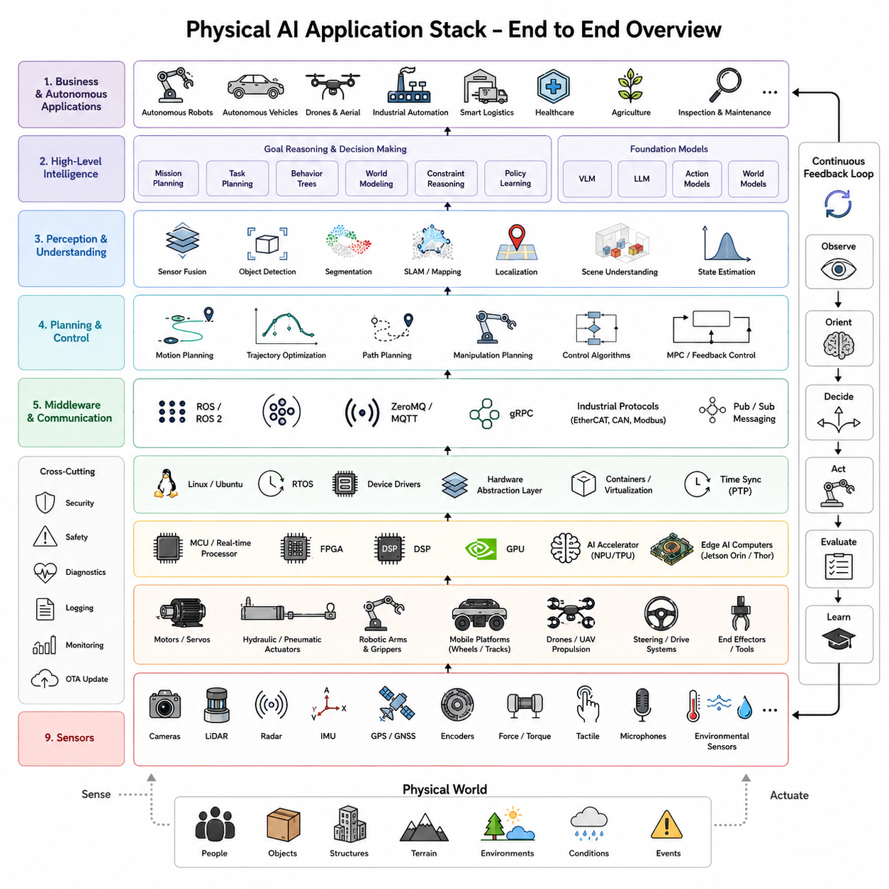{width="7.268055555555556in" height="7.268055555555556in"}

Physical AI represents the convergence of artificial intelligence, robotics, sensing, control, simulation, cloud computing, and autonomous decision-making into a unified system capable of perceiving, reasoning about, and interacting with the physical world. Unlike traditional AI applications that primarily process digital information such as text, images, or structured databases, Physical AI directly influences real-world environments through physical embodiment. A Physical AI system observes the world using sensors, constructs internal representations of its surroundings, reasons about goals and constraints, plans actions, executes those actions through actuators, evaluates outcomes, and continuously learns from experience. The Physical AI application stack provides the architectural framework that organizes these capabilities into a coherent end-to-end system spanning hardware, software, machine learning, cloud infrastructure, and operational management.

An application stack describes how multiple technological layers cooperate to produce intelligent behavior. Each layer performs specialized responsibilities while providing services to higher layers and depending upon lower layers for implementation. This layered organization improves modularity, scalability, maintainability, and interoperability. Individual technologies may evolve independently while preserving stable interfaces between components. In Physical AI, the application stack extends from physical sensors at the lowest level to autonomous reasoning and business applications at the highest level. Understanding these relationships is essential because no individual algorithm alone creates intelligent robots. Intelligence emerges from coordinated interaction among all layers operating simultaneously.

The foundation of the Physical AI stack consists of physical hardware. Every intelligent robot ultimately depends upon sensors, actuators, power systems, embedded processors, communication interfaces, and mechanical structures. Sensors convert physical phenomena into digital information. Cameras capture visual observations. LiDAR measures three-dimensional geometry. Radar estimates object distance and velocity under adverse weather conditions. Inertial Measurement Units provide acceleration and rotational information. Force-torque sensors measure interaction forces. Tactile arrays detect contact distributions. Global Navigation Satellite Systems estimate global position. Encoders measure joint motion. Microphones capture audio. Environmental sensors observe temperature, humidity, vibration, gas concentration, pressure, illumination, and numerous additional physical variables. Together these sensing modalities provide the raw observations upon which every higher-level intelligent capability depends.

Actuation forms the complementary interface between computation and the physical world. Electric motors, hydraulic actuators, pneumatic systems, servo drives, robotic manipulators, mobile platforms, steering mechanisms, grippers, conveyors, robotic hands, drones, and autonomous vehicles transform digital decisions into physical actions. Unlike purely digital AI systems, Physical AI must continuously consider dynamics, inertia, friction, compliance, energy consumption, actuator limitations, safety constraints, and mechanical wear. Consequently, intelligence cannot be separated from embodiment because every decision ultimately affects physical systems operating under real-world physics.

Embedded computing provides the computational foundation supporting sensor processing and low-level control. Modern Physical AI platforms commonly integrate heterogeneous computing architectures including microcontrollers, real-time processors, Field Programmable Gate Arrays, Digital Signal Processors, Graphics Processing Units, and specialized AI accelerators. Systems such as NVIDIA Jetson Orin, Jetson Thor, embedded x86 computers, real-time industrial controllers, and dedicated neural processing units distribute computation according to latency, power, and performance requirements. Low-level motor control executes on deterministic real-time processors, whereas perception, planning, and foundation model inference execute on high-performance AI hardware.

Above the hardware layer lies the device abstraction and operating system layer. Linux, Ubuntu, real-time operating systems, middleware, hardware abstraction layers, and device drivers provide standardized interfaces allowing higher software components to interact with diverse hardware without requiring direct knowledge of sensor-specific implementation details. Hardware abstraction significantly improves portability because algorithms developed for one robotic platform may migrate to different hardware configurations with relatively limited modification.

Robot middleware forms the communication backbone connecting independent software modules into integrated robotic systems. Frameworks such as Robot Operating System, Data Distribution Service, ZeroMQ, MQTT, gRPC, and industrial communication protocols coordinate information exchange among perception modules, localization systems, planners, controllers, diagnostics, cloud interfaces, and user applications. Publish-subscribe communication architectures decouple software components, allowing asynchronous data exchange while supporting distributed computation across multiple processors or networked robots.

Time synchronization represents another essential infrastructure capability. Multi-sensor perception requires precisely aligned observations originating from cameras, LiDAR, radar, inertial sensors, encoders, and external positioning systems. Precision Time Protocol, hardware triggers, synchronized clocks, timestamp management, and deterministic communication networks ensure that observations collected from different sensors correspond to consistent physical moments. Without accurate synchronization, sensor fusion quality deteriorates significantly regardless of algorithmic sophistication.

The perception layer transforms raw sensor measurements into meaningful environmental understanding. Computer vision, point cloud processing, sensor fusion, semantic segmentation, object detection, instance segmentation, pose estimation, optical flow, depth estimation, scene reconstruction, anomaly detection, human recognition, object tracking, and multimodal perception collectively convert low-level observations into structured representations suitable for higher reasoning processes. Foundation vision models increasingly provide general-purpose perception capabilities adaptable across diverse robotic applications without requiring extensive task-specific retraining.

Sensor fusion significantly enhances perception robustness by combining complementary sensing modalities. Cameras provide rich semantic information but remain sensitive to illumination. LiDAR accurately measures geometry while lacking color information. Radar operates reliably during rain, fog, and snow despite lower spatial resolution. Inertial sensors estimate short-term motion but accumulate drift over time. Fusion algorithms integrate these heterogeneous observations into unified environmental representations exhibiting greater robustness than any individual sensing modality alone.

Localization and mapping constitute the next major layer of the application stack. Simultaneous Localization and Mapping enables robots to estimate their own position while constructing maps describing surrounding environments. Modern systems integrate visual SLAM, LiDAR SLAM, GNSS, inertial navigation, wheel odometry, semantic mapping, place recognition, loop closure detection, and lifelong mapping into persistent world models supporting long-term autonomous operation. Rather than simply estimating current position, contemporary localization systems increasingly maintain continuously evolving digital representations reflecting environmental dynamics across months or years of deployment.

World models extend mapping beyond geometric representation toward predictive understanding. Instead of merely storing static maps, world models capture object relationships, physical dynamics, temporal evolution, causal interactions, semantic knowledge, and environmental uncertainty. Such representations enable robots not only to localize themselves but also to predict future environmental states, simulate hypothetical actions, anticipate consequences, and plan under uncertainty. World models therefore bridge perception and reasoning within the Physical AI stack.

The cognition layer transforms environmental understanding into intelligent decision-making. Classical symbolic reasoning, probabilistic inference, knowledge graphs, constraint satisfaction, optimization algorithms, reinforcement learning, foundation language models, multimodal reasoning systems, and causal inference collectively support planning and decision processes. Modern Physical AI increasingly integrates neural and symbolic reasoning rather than treating them as competing paradigms. Foundation models contribute broad semantic understanding while structured reasoning ensures logical consistency, safety, and explainability.

Task planning operates at multiple abstraction levels. High-level planners decompose user goals into executable subtasks. Motion planners generate collision-free trajectories respecting kinematic and dynamic constraints. Behavioral planners coordinate navigation, manipulation, communication, perception, and recovery behaviors. Resource planners allocate computational resources, battery capacity, communication bandwidth, and operational priorities. Scheduling algorithms coordinate multiple robots within shared environments. Together these planning systems transform abstract objectives into executable sequences of physical actions.

Control systems provide the interface between planning and physical execution. Low-level controllers regulate motor torques, joint positions, velocities, and forces. Model Predictive Control optimizes future behavior under dynamic constraints. Adaptive control compensates for changing environmental conditions and mechanical uncertainty. Impedance and admittance controllers regulate physical interaction forces during manipulation. Reinforcement learning increasingly complements classical control by learning policies directly from experience while remaining integrated with analytical controllers providing stability guarantees.

Learning represents one of the defining characteristics distinguishing Physical AI from traditional automation. Conventional industrial automation executes predetermined behaviors developed entirely by engineers. Physical AI systems continually improve through supervised learning, self-supervised learning, reinforcement learning, imitation learning, continual learning, online adaptation, and fleet-wide knowledge sharing. Robots no longer merely execute programmed procedures but accumulate operational experience throughout deployment, improving perception, planning, manipulation, navigation, and interaction capabilities over time.

Foundation models have fundamentally transformed the learning layer. Large pretrained vision, language, multimodal, and action models provide broad general capabilities before deployment. Rather than training every perception or reasoning component independently, Physical AI increasingly adapts foundation models to specific applications through parameter-efficient fine-tuning, retrieval augmentation, reinforcement learning from feedback, continual learning, and domain adaptation. This dramatically reduces data requirements while improving generalization across diverse operational environments.

Memory systems provide persistent knowledge storage supporting long-term intelligence. Short-term working memory maintains current observations and reasoning context. Episodic memory preserves historical experiences including trajectories, interactions, failures, and demonstrations. Semantic memory stores structured knowledge describing objects, environments, procedures, and operational concepts. Procedural memory captures learned skills, policies, and motor behaviors. External memory systems, vector databases, retrieval-augmented generation, and knowledge graphs increasingly complement neural network parameters by storing information explicitly rather than relying exclusively upon distributed representations.

Communication infrastructure connects robots with external computational resources and collaborative agents. Wireless communication through Wi-Fi, private 5G, Ethernet, industrial fieldbuses, satellite communication, and edge computing networks supports cloud connectivity, fleet coordination, remote monitoring, software updates, distributed optimization, and human supervision. Communication architectures balance local autonomy against centralized intelligence according to latency, reliability, bandwidth, and safety requirements.

Edge computing plays an increasingly important role because many Physical AI applications require immediate responses unsuitable for cloud latency. Perception, obstacle avoidance, motor control, emergency reactions, manipulation, and local planning execute directly onboard robots. Cloud infrastructure handles computationally intensive tasks including large-scale model training, simulation, digital twins, fleet analytics, long-term memory management, and foundation model optimization. Hybrid cloud-edge architectures therefore distribute intelligence according to operational requirements rather than relying exclusively upon either local or remote computation.

Cloud infrastructure transforms individual robots into members of collaborative learning ecosystems. Operational experiences collected across entire robot fleets become aggregated into centralized knowledge repositories supporting continual learning, simulation, digital twin synchronization, model validation, reinforcement learning, and fleet-wide optimization. Individual robots contribute local experiences while simultaneously benefiting from knowledge accumulated throughout the global fleet. Collective intelligence therefore grows substantially faster than isolated robot learning.

Digital twins represent another major component of the Physical AI application stack. High-fidelity virtual representations synchronize continuously with physical robots and operational environments. Sensor observations update virtual environments in real time. Candidate algorithms undergo simulation before deployment. Predictive maintenance estimates future hardware degradation. Planning algorithms evaluate hypothetical scenarios safely within simulation before execution in the physical world. Continuous synchronization between physical and virtual systems enables safer, faster, and more efficient development.

Simulation environments support multiple stages of the development lifecycle. Physics simulators accelerate reinforcement learning by generating millions of interactions impossible to collect physically. Domain randomization improves robustness by exposing learning algorithms to diverse environmental variations. Synthetic data generation supplements real observations for perception training. Hardware-in-the-loop simulation validates embedded controllers. Human operators practice supervision within virtual environments before interacting with deployed robots. Simulation therefore becomes an integral component rather than merely a development convenience.

MLOps extends machine learning engineering principles into Physical AI deployment. Data versioning, model version control, automated retraining, continuous integration, continuous deployment, experiment tracking, reproducibility, rollback mechanisms, monitoring, validation, and governance collectively ensure reliable long-term operation. Unlike conventional AI applications, robotic MLOps additionally manages hardware compatibility, safety validation, sensor calibration, simulation testing, and field deployment across heterogeneous robot fleets.

Continuous monitoring forms another essential operational capability. Performance metrics including localization accuracy, navigation efficiency, manipulation success, perception confidence, computational latency, battery health, actuator temperatures, network connectivity, sensor integrity, safety events, maintenance frequency, and environmental changes provide ongoing assessment of system health. Monitoring identifies performance degradation requiring adaptation before failures become operationally significant.

Safety permeates every layer of the Physical AI application stack. Functional safety, collision avoidance, emergency stopping, redundant sensing, fail-safe control, cybersecurity, authentication, encrypted communication, secure boot, software verification, anomaly detection, explainable reasoning, uncertainty estimation, and regulatory compliance collectively ensure trustworthy operation. Unlike digital software systems, failures within Physical AI directly influence physical environments and human safety, making comprehensive safety architecture indispensable.

Human-robot interaction occupies the highest operational layer connecting autonomous systems with human users. Natural language communication, gesture recognition, intention understanding, explainable decision-making, shared autonomy, collaborative manipulation, adaptive interfaces, user modeling, and personalized assistance enable intuitive interaction between robots and people. Foundation language models increasingly provide semantic reasoning supporting flexible communication across diverse operational contexts.

Business applications represent the final layer where technological capabilities create practical value. Manufacturing robots optimize production efficiency. Warehouse systems automate logistics. Agricultural robots increase crop productivity. Medical robots improve patient care. Inspection robots monitor infrastructure. Construction robots support building operations. Domestic service robots assist daily living. Autonomous vehicles transform transportation. Every application instantiates the same underlying Physical AI stack while specializing perception, reasoning, planning, and control according to domain-specific objectives.

Although these layers appear conceptually distinct, real Physical AI systems operate through continuous interaction among all components. Sensor observations influence localization. Localization supports planning. Planning guides control. Control generates new observations. Learning refines perception and planning using accumulated experience. Cloud infrastructure updates foundation models. Digital twins validate new capabilities before deployment. Fleet learning integrates distributed operational knowledge. The resulting closed feedback loops continuously improve system intelligence throughout deployment rather than remaining fixed after initial development.

The Physical AI application stack therefore represents far more than a software architecture. It is a comprehensive cognitive and operational framework integrating embodiment, perception, memory, reasoning, planning, learning, cloud intelligence, simulation, deployment, monitoring, and continual adaptation into a unified end-to-end system. Each layer contributes unique capabilities while cooperating with every other layer to produce intelligent physical behavior. As robotics progresses toward increasingly autonomous, collaborative, and lifelong learning systems, this end-to-end application stack provides the foundational architecture enabling Physical AI to operate safely, efficiently, and continuously across diverse real-world environments while accumulating knowledge throughout years of deployment.

## 09.02 Language Conditioned Robot Control SayCan [w/Code]

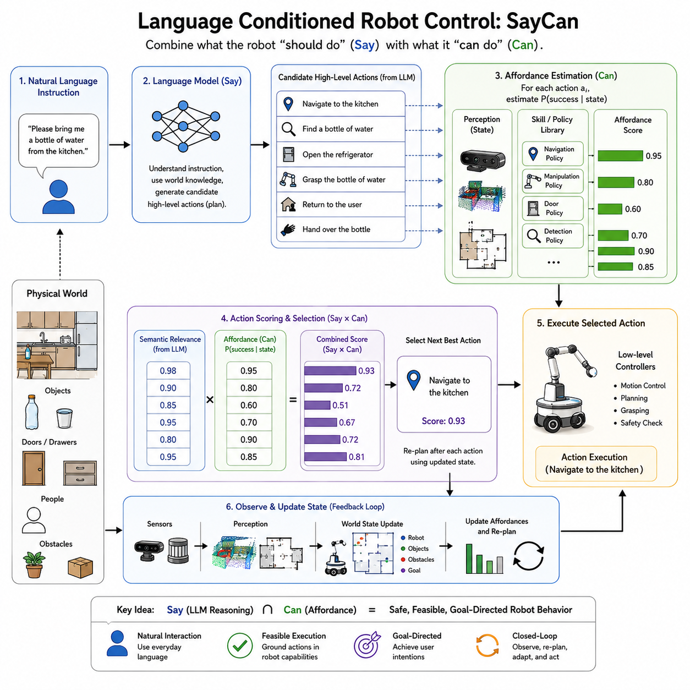{width="7.268055555555556in" height="7.268055555555556in"}

Language-conditioned robot control represents one of the most significant advances in Physical AI because it enables robots to understand natural language instructions and convert them into executable physical behaviors. Traditional robotic systems require engineers to specify every task through predefined state machines, explicit programs, or manually designed behavior trees. Every possible operation must be anticipated before deployment, making robots inflexible when confronted with unfamiliar requests. Language-conditioned control replaces this paradigm with a more human-centered interface in which users communicate through ordinary language while the robot interprets intentions, reasons about feasibility, selects appropriate actions, and executes them within the physical environment. One of the most influential systems demonstrating this capability is SayCan, introduced by Google Research as a framework that combines the reasoning ability of large language models with the real-world affordance knowledge of robotic skill policies.

The motivation behind SayCan arises from a fundamental limitation of large language models. Modern language models possess extensive semantic knowledge acquired from enormous text corpora. They understand concepts such as cooking, cleaning, organizing, navigation, object relationships, and human intentions. They can generate plausible plans for complex household tasks and explain sequences of actions in natural language. However, they do not inherently understand what a specific physical robot is actually capable of doing. A language model may suggest climbing stairs, opening a locked cabinet, carrying heavy furniture, or preparing a complicated meal even if the robot lacks the necessary hardware, sensors, manipulators, or environmental access. Conversely, traditional robotic controllers understand their own capabilities but lack broad semantic reasoning. SayCan bridges these complementary strengths by combining linguistic planning with physical feasibility estimation.

The name SayCan reflects the central principle of the framework. The language model determines what the robot should attempt to do according to the user\'s instruction, represented by the word "Say." The robotic control system evaluates what the robot can realistically accomplish under the current environmental conditions, represented by the word "Can." Only actions receiving high scores from both semantic reasoning and physical affordance estimation become part of the execution plan. Consequently, robot behavior emerges from the intersection of human intention and physical capability rather than either component independently.

Consider a user instructing a household robot, "Please bring me a bottle of water from the kitchen." A language model understands that satisfying this request may involve navigating to the kitchen, locating a bottle, grasping it, returning to the user, and handing it over. Nevertheless, if the kitchen door is closed, the bottle is absent, or the robot cannot manipulate refrigerator doors, blindly following a language-generated plan will fail. SayCan evaluates each candidate action not only according to linguistic plausibility but also according to the probability that the robot can successfully execute it given its current observations, learned skills, and environmental state. The resulting plan therefore remains grounded in physical reality.

The architecture of SayCan consists of several interacting components. The first component is a large language model responsible for interpreting user instructions and proposing candidate high-level actions. The second component is a library of low-level robotic skills representing executable behaviors such as navigation, grasping, opening doors, placing objects, pressing buttons, or inspecting locations. The third component estimates the probability that each available skill will succeed under the robot\'s current circumstances. Finally, a decision mechanism combines semantic relevance with execution feasibility to select the next action.

Natural language serves as the highest level of task specification. Instead of programming detailed motion sequences, users communicate goals through ordinary sentences. The language model interprets these goals by leveraging broad world knowledge acquired during pretraining. It recognizes relationships among objects, understands typical household routines, infers omitted intermediate steps, and generates candidate action sequences. This capability dramatically increases the flexibility of human-robot interaction because robots no longer require specialized programming interfaces for every new task.

Skill libraries represent the robot\'s embodied capabilities. Every skill corresponds to a concrete executable policy trained through classical robotics, imitation learning, reinforcement learning, motion planning, or manually engineered controllers. Skills include actions such as "navigate to location," "pick up object," "open drawer," "close cabinet," "push button," "move object," "dock at charging station," or "inspect shelf." Unlike the language model, which reasons abstractly about tasks, these skills interact directly with sensors, actuators, and controllers capable of producing physical motion.

Each skill possesses an associated affordance function estimating the probability of successful execution. Affordance originally referred to action possibilities available within an environment. In robotics, affordance estimation predicts whether a robot can perform a specific action given current observations. For example, grasping succeeds only if the target object is visible, reachable, and appropriately oriented. Opening a door requires detecting the handle and confirming accessibility. Navigation depends upon traversable paths and obstacle avoidance. Affordance models therefore connect high-level reasoning with low-level physical feasibility.

The central innovation of SayCan lies in combining semantic likelihood with affordance probability. The language model evaluates how appropriate each candidate skill appears relative to the user\'s instruction. Simultaneously, the affordance model estimates how likely the robot is to execute that skill successfully. Multiplying these probabilities produces a combined utility score balancing intention and feasibility. Actions receiving high semantic relevance but low execution probability become unlikely selections because the robot recognizes practical limitations. Likewise, physically easy actions unrelated to the user\'s request receive low overall scores because they contribute little toward accomplishing the intended goal.

This probabilistic combination provides several important advantages. First, it grounds language reasoning in the physical world, reducing unrealistic plans frequently generated by purely language-based systems. Second, it enables dynamic adaptation because affordance estimates depend upon current environmental observations rather than static assumptions. Third, it supports modularity because new robotic skills may be added independently while remaining accessible through the existing language interface. Finally, it improves robustness by encouraging action sequences likely to succeed rather than merely appearing logically plausible.

Sequential planning emerges naturally through iterative decision making. Rather than generating complete task plans in advance, SayCan repeatedly selects the next most appropriate action according to updated environmental observations. After each skill finishes execution, the robot reevaluates the current world state, queries the language model again if necessary, recomputes affordance probabilities, and chooses the following action. This closed-loop architecture provides flexibility when unexpected events occur because planning continuously incorporates newly observed information.

Imagine instructing a service robot to "clean the dining table." Initially, the language model proposes actions including navigating to the dining room, identifying objects on the table, collecting dishes, disposing of trash, wiping surfaces, and organizing remaining items. Upon reaching the table, the robot discovers several unexpected objects absent from its original assumptions. Updated observations modify affordance probabilities, causing the planner to adjust action selection dynamically. Instead of rigidly following a predetermined sequence, the robot continuously adapts according to the evolving physical environment.

SayCan demonstrates an important distinction between symbolic planning and embodied intelligence. Classical symbolic planners often assume deterministic actions operating within perfectly known environments. Language-conditioned control instead reasons probabilistically under uncertainty. Every action possesses uncertain outcomes depending upon perception quality, object accessibility, environmental dynamics, and hardware limitations. The robot therefore continuously evaluates confidence rather than assuming guaranteed success.

Perception remains fundamental throughout the architecture. Cameras, depth sensors, LiDAR, force sensors, tactile arrays, and proprioceptive measurements provide observations describing current environmental conditions. Object detection identifies candidate manipulation targets. Semantic segmentation estimates scene composition. Localization determines robot position. State estimation tracks manipulated objects and environmental changes. Affordance prediction depends heavily upon accurate perception because execution feasibility cannot be estimated without reliable environmental understanding.

Foundation vision models substantially enhance language-conditioned robotics by providing generalized visual representations transferable across diverse environments. Instead of training separate object detectors for every application, robots increasingly employ pretrained vision transformers and multimodal encoders capable of recognizing thousands of object categories while maintaining semantic consistency with language models. Shared representation spaces simplify grounding linguistic concepts within visual observations.

Grounding itself constitutes one of the central challenges addressed by SayCan. Language describes abstract concepts such as "the blue mug near the window" or "the nearest empty chair." Physical robots must associate these descriptions with concrete sensor observations. Vision-language models connect textual descriptions with visual representations, enabling robots to identify objects referenced through natural language. Successful grounding requires integrating perception, semantics, spatial reasoning, and contextual understanding.

Context plays an equally important role. The same instruction may require different actions depending upon environmental conditions. "Bring me my notebook" assumes identifying notebook ownership. "Clean the kitchen" depends upon current cleanliness. "Prepare breakfast" varies according to available ingredients, utensils, and appliances. Language-conditioned control therefore combines general semantic knowledge with situational awareness obtained through perception and memory.

Memory significantly improves task execution across extended interactions. Working memory maintains current conversational context and partially completed task sequences. Episodic memory records previous interactions, successful strategies, and environmental observations. Semantic memory stores knowledge regarding object functions, room layouts, user preferences, and operational procedures. Long-term memory enables robots to personalize behavior by remembering recurring routines and frequently requested tasks.

Robotic skill acquisition complements language reasoning. SayCan assumes the existence of executable skills but does not prescribe how those skills should be learned. In practice, skill libraries originate from multiple sources. Classical motion planning provides reliable navigation and manipulation controllers. Reinforcement learning develops robust behaviors through trial and error. Imitation learning captures expert demonstrations. Self-supervised learning improves perception and representation quality. Foundation action models increasingly learn generalized motor skills transferable across diverse robotic embodiments.

Continual learning naturally extends the SayCan framework. As robots accumulate operational experience, both affordance estimation and skill libraries improve continuously. New manipulation behaviors, navigation capabilities, interaction strategies, and recovery procedures become available for future planning. Language interfaces remain unchanged while underlying physical competence expands throughout deployment. This integration of language-conditioned planning with lifelong learning represents a significant step toward increasingly autonomous Physical AI systems.

Cloud robotics further amplifies these capabilities. Individual robots contribute newly learned skills and operational experiences to centralized cloud infrastructure. Updated affordance models, improved language reasoning, and expanded skill libraries distribute back across the fleet. Consequently, one robot\'s successful experience handling unfamiliar household appliances may eventually benefit thousands of deployed robots operating worldwide. Collective learning therefore accelerates capability development beyond what isolated robots could achieve independently.

Human feedback provides another important learning mechanism. Users naturally correct mistakes, clarify ambiguous instructions, demonstrate preferred behaviors, and provide qualitative evaluations. Reinforcement learning from human feedback, preference learning, and interactive demonstration enable language-conditioned systems to align increasingly with user expectations. Rather than treating human interaction solely as command input, future systems interpret feedback as continual supervision refining semantic reasoning and physical execution simultaneously.

SayCan also illustrates the importance of modular system design. Large language models remain responsible primarily for semantic reasoning rather than direct motor control. Robotic skills remain specialized for reliable physical execution. Perception systems independently estimate environmental state. Affordance models evaluate feasibility. Each component evolves independently while interacting through well-defined interfaces. Such modularity improves scalability because advances within one subsystem immediately benefit the entire architecture without requiring complete redesign.

Safety remains an essential consideration throughout language-conditioned robotics. Language models occasionally generate implausible, unsafe, or inappropriate suggestions reflecting statistical patterns rather than verified operational procedures. Affordance estimation reduces many practical failures but cannot guarantee complete safety. Additional safety layers therefore monitor action execution, verify collision avoidance, enforce operational constraints, detect anomalies, and interrupt behaviors violating predefined safety policies. Human oversight remains particularly important for high-risk applications involving medical procedures, industrial machinery, or collaborative manipulation.

Interpretability represents another significant advantage of language-conditioned planning. Since high-level reasoning occurs through natural language, robots can explain intended actions before execution. Users may inspect proposed plans, request clarification, modify objectives, or reject undesirable behaviors. Such transparent communication increases trust while facilitating debugging and regulatory compliance. Explainable planning becomes especially valuable within safety-critical environments requiring human supervision.

Several limitations nevertheless remain. SayCan depends upon predefined skill libraries. The language model cannot invent entirely new motor capabilities absent from the robot\'s existing repertoire. Ambiguous language, incomplete perception, inaccurate affordance estimation, hardware failures, and rapidly changing environments may still produce unsuccessful task execution. Furthermore, maintaining large collections of specialized robotic skills becomes increasingly complex as applications diversify.

Recent research addresses these limitations through foundation action models capable of generalizing beyond fixed skill libraries. Rather than selecting among discrete predefined actions, emerging systems directly generate continuous robot behaviors conditioned upon language, perception, and environmental context. Models such as RT-1, RT-2, OpenVLA, Pi0, and other Vision-Language-Action architectures increasingly blur traditional distinctions between planning and control by learning unified representations connecting language directly with robot actions.

Despite these advances, the conceptual contribution of SayCan remains highly influential. It demonstrated that language understanding alone is insufficient for physical intelligence and that robotic control alone lacks semantic flexibility. Successful Physical AI requires integrating linguistic reasoning with embodied capability estimation. The distinction between what a robot should do and what it can do continues to influence modern robot foundation models, embodied AI architectures, and autonomous planning systems.

Industrial applications illustrate the practical significance of this approach. Warehouse robots receive natural language inventory requests while evaluating physical accessibility. Hospital service robots interpret medical staff instructions while respecting equipment availability and patient safety. Manufacturing assistants translate production goals into executable workflows constrained by current machine status. Agricultural robots understand harvesting objectives while adapting to crop conditions and weather. Domestic service robots personalize household assistance according to user preferences and available resources. In every case, language reasoning provides semantic flexibility while affordance estimation ensures physical realism.

Language-conditioned robot control therefore represents a fundamental milestone in the evolution of Physical AI. SayCan introduced a practical framework for combining the broad reasoning capabilities of large language models with the grounded execution abilities of robotic skill policies. By evaluating both semantic appropriateness and physical feasibility before every action, the system transforms natural language from a communication interface into an operational planning mechanism capable of guiding embodied intelligence within complex real-world environments. As future Physical AI systems integrate increasingly powerful foundation models, lifelong learning, world models, multimodal perception, and adaptive skill acquisition, the core principle established by SayCan---that intelligent robots must reason simultaneously about human intentions and physical capabilities---will remain one of the foundational concepts underlying autonomous embodied intelligence.

## 09.03 Code as Policies LLM Code Generation for Robots [w/Code]

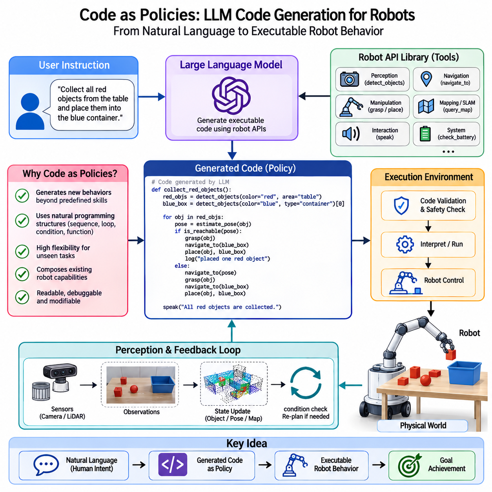{width="7.268055555555556in" height="7.268055555555556in"}

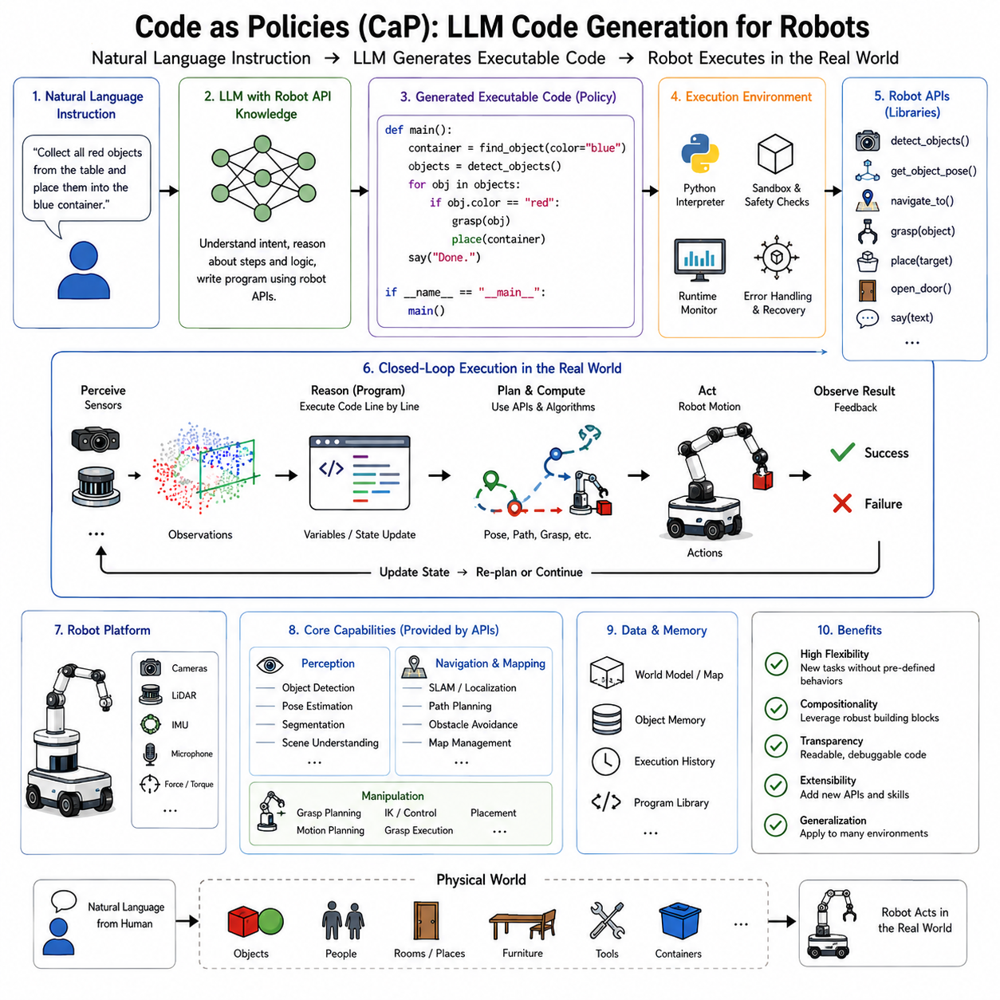{width="7.268055555555556in" height="7.268055555555556in"}

Code as Policies (CaP) represents a major milestone in the evolution of language-conditioned robotics because it redefines the relationship between natural language, programming, and robot control. Traditional robotic systems require engineers to manually design task planners, behavior trees, finite-state machines, and motion sequences before deployment. Language-conditioned systems such as SayCan improved flexibility by allowing large language models to select among predefined robotic skills. Code as Policies extends this concept significantly further. Instead of merely choosing from an existing library of actions, the language model generates executable code that composes perception, reasoning, planning, and control functions into entirely new robot behaviors. In this framework, natural language becomes a high-level programming language, while executable code becomes the intermediate representation connecting human intent with physical robot actions.

The central motivation behind Code as Policies arises from the observation that programming languages possess several properties that make them highly suitable for robotic reasoning. Programming languages naturally express sequential execution, conditional logic, loops, function composition, recursion, variable binding, mathematical computation, exception handling, modularity, and abstraction. Many robotic tasks require exactly these capabilities. A household robot instructed to organize a kitchen must inspect multiple objects, identify categories, make decisions based on object locations, repeat actions until completion, recover from failures, and adapt to changing environmental conditions. Expressing such behavior through generated code provides substantially greater flexibility than selecting individual predefined actions.

Large Language Models have demonstrated remarkable capability in generating syntactically correct computer programs across multiple programming languages. Models trained on large software repositories learn programming patterns, algorithmic structures, software libraries, API usage, debugging strategies, and modular design principles. Code as Policies leverages these capabilities by treating robot control APIs as software libraries available to the language model. Rather than generating arbitrary programs, the model produces executable code calling robot-specific perception, navigation, manipulation, sensing, planning, and communication functions.

The phrase "Code as Policies" reflects an important conceptual shift. In classical robotics, policies usually refer to functions mapping observations directly to actions. Reinforcement learning policies produce control commands from sensor inputs. Behavior trees encode structured decision policies. Finite-state machines describe transitions among predefined behaviors. In Code as Policies, the generated program itself becomes the policy. Instead of representing behavior through fixed neural network parameters or manually designed state transitions, robot intelligence is represented explicitly as executable software generated dynamically from language instructions.

Consider a user requesting, "Collect all red objects from the table and place them into the blue container." Traditional robotics would require engineers to anticipate this task during development by explicitly implementing dedicated behaviors. SayCan might select skills such as "detect object," "pick object," and "place object" in sequence. Code as Policies instead generates an executable program. The generated code iterates over detected objects, evaluates their colors, selects only red items, computes grasp poses, executes manipulation routines, verifies successful placement, and repeats until no qualifying objects remain. The resulting behavior emerges from program synthesis rather than predefined workflows.

The architecture typically consists of several interacting components. A large language model receives the user\'s instruction together with documentation describing available robot APIs. These APIs provide access to perception modules, localization systems, object detection, manipulation controllers, navigation functions, speech interfaces, and motion planners. The language model generates source code calling these APIs appropriately. An execution environment validates, interprets, and executes the generated program while interacting continuously with the physical robot. Sensor observations update program variables, function outputs influence subsequent decisions, and execution continues until the requested objective has been achieved.

Robot APIs play a central role because they define the interface between generated code and physical embodiment. APIs may include functions such as detect_objects(), navigate_to(), grasp(), place(), locate_person(), estimate_pose(), open_door(), read_barcode(), capture_image(), inspect_surface(), query_map(), or check_battery(). The language model does not implement these capabilities internally. Instead, it composes them into new procedural structures according to the user\'s intent. Consequently, improvements to individual robotic skills automatically become available to future generated programs without modifying the language model itself.

This modular separation provides several important advantages. Robotic perception remains implemented through specialized vision models. Motion planning continues using reliable optimization algorithms. Manipulation controllers preserve deterministic safety properties. Localization employs established SLAM systems. Code generation coordinates these components rather than replacing them. Consequently, existing robotics infrastructure remains valuable while benefiting from significantly more flexible task composition.

Programming languages naturally support hierarchical abstraction, making complex robotic tasks easier to express. High-level functions invoke lower-level procedures, which themselves call primitive control routines. For example, a generated function named organize_workspace() may internally invoke classify_objects(), determine_storage_locations(), compute_optimal_sequence(), navigate_to(), pick_object(), verify_grasp(), place_object(), and update_inventory(). Each function remains understandable independently while collectively producing sophisticated autonomous behavior. Hierarchical organization improves readability, maintainability, debugging, and reasoning compared with flat action sequences.

Conditional reasoning becomes particularly important for robotics because physical environments remain inherently uncertain. Generated programs frequently contain decision structures such as "if the object is not visible, search nearby shelves," "if grasping fails, attempt another grasp angle," or "if the battery falls below a threshold, recharge before continuing." Such conditional logic allows robots to adapt dynamically rather than following rigid predetermined action sequences. Since programming languages naturally represent branching behavior, Code as Policies provides significantly richer adaptation than simple action selection frameworks.

Loops further enhance flexibility. Many household and industrial tasks require repeated execution until objectives have been satisfied. Examples include cleaning every table in a room, inspecting every storage shelf, collecting all recyclable materials, checking every machine, or delivering packages sequentially. Generated programs naturally express iteration using for loops, while loops, recursion, or higher-order functions. The robot therefore performs repeated operations without requiring manually programmed repetition for every possible scenario.

Variable binding provides another significant advantage. During execution, generated programs store object identities, locations, measurements, user preferences, sensor observations, environmental states, and intermediate computation results. Variables enable robots to reason consistently throughout long task sequences. A robot may identify a specific cup, remember its location, navigate elsewhere temporarily, and later return to retrieve the same object using previously stored information. Such persistent symbolic references improve long-horizon reasoning substantially.

Mathematical computation also becomes available through generated code. Robots frequently require geometric calculations, coordinate transformations, optimization, statistical estimation, trajectory interpolation, collision checking, and numerical reasoning. Programming languages naturally express these computations using established software libraries. Rather than relying exclusively upon language reasoning, generated programs integrate analytical computation with semantic planning, producing behavior grounded simultaneously in symbolic reasoning and physical geometry.

Perception remains tightly integrated throughout program execution. Generated code continuously invokes visual perception, object detection, segmentation, pose estimation, semantic mapping, localization, and scene understanding functions whenever additional environmental information becomes necessary. The program therefore evolves dynamically according to observations rather than executing independently of sensor feedback. This perception-action loop represents one of the defining characteristics distinguishing robotic program synthesis from conventional software generation.

Foundation vision models significantly improve the effectiveness of Code as Policies by providing generalized perception APIs. Instead of requiring dedicated object detectors for every application, robots increasingly access pretrained vision-language models capable of recognizing thousands of objects, estimating relationships, interpreting scenes, reading text, identifying anomalies, and grounding natural language references. Generated code simply invokes these generalized perception interfaces without requiring task-specific perception engineering.

Language grounding remains fundamental. User instructions frequently reference objects, locations, spatial relationships, colors, quantities, and temporal constraints. Generated code must translate linguistic concepts into concrete perceptual queries. Expressions such as "the nearest chair," "the largest package," "the blue container beside the window," or "the object John was using earlier" require combining language understanding with perception, memory, and spatial reasoning. Code as Policies delegates this grounding process to perception APIs while coordinating higher-level task logic through generated programs.

Memory significantly extends program capability. Generated code may query episodic memories describing previous interactions, semantic knowledge regarding object functions, procedural histories, user preferences, environmental maps, maintenance records, or learned policies. Rather than embedding all information within language model parameters, external memory systems provide persistent knowledge accessible during execution. Retrieval-Augmented Generation further enhances this capability by allowing generated programs to consult documentation, operational manuals, or historical experiences dynamically.

Planning within Code as Policies differs from classical symbolic planners. Instead of searching explicit planning graphs or manually encoded action models, the language model synthesizes executable procedures directly. Nevertheless, planning remains grounded through perception, API constraints, environmental observations, and execution feedback. The resulting behavior combines statistical language reasoning with deterministic software execution, producing a hybrid architecture integrating strengths from both paradigms.

Error handling represents another important programming capability naturally inherited by robotic control. Physical environments inevitably produce failures including unsuccessful grasps, blocked navigation paths, missing objects, sensor uncertainty, communication interruptions, and hardware faults. Generated programs include exception handling, retry mechanisms, alternative strategies, timeout management, and graceful recovery procedures. Such explicit failure handling substantially improves robustness compared with systems assuming perfect execution.

Simulation provides an important development environment for generated robotic programs. Before deployment on physical hardware, synthesized code may execute within physics simulators or digital twins. Simulation identifies syntax errors, logical inconsistencies, unsafe behaviors, infinite loops, unreachable goals, and resource conflicts without risking physical damage. Hardware-in-the-loop validation further ensures compatibility between generated software and actual robotic platforms before operational deployment.

Safety remains one of the most critical challenges for Code as Policies. Unlike ordinary software applications, generated robot programs directly influence physical systems capable of interacting with humans, machinery, and valuable infrastructure. Consequently, execution environments typically impose strict safety constraints. API access remains restricted to verified functions. Motion commands undergo collision checking. Force limits prevent dangerous manipulation. Navigation planners enforce safety boundaries. Generated code executes within sandboxed environments limiting unauthorized operations. Multiple validation layers ensure that language-generated software cannot bypass essential safety mechanisms.

Verification techniques increasingly complement code generation. Static analysis examines generated programs for syntactic correctness, unreachable code, undefined variables, resource conflicts, or potentially unsafe operations. Runtime monitoring observes execution continuously, interrupting behaviors violating predefined safety constraints. Formal verification methods may eventually provide mathematical guarantees regarding critical robotic behaviors generated from natural language instructions.

Code readability offers another practical advantage. Unlike opaque neural policies, generated programs remain understandable by human engineers. Developers inspect synthesized code, identify logical errors, explain robot decisions, modify generated procedures manually if necessary, and integrate domain expertise directly into execution logic. This transparency improves debugging, maintenance, certification, and regulatory compliance while increasing user trust.

Industrial robotics presents numerous compelling applications. Manufacturing engineers describe inspection procedures through natural language rather than conventional programming. Warehouse operators request inventory management workflows dynamically. Laboratory automation systems generate experimental procedures according to textual protocols. Agricultural robots synthesize harvesting routines adapting to crop conditions. Infrastructure inspection robots create customized examination strategies based upon asset descriptions. In each application, generated code provides flexible procedural intelligence while reusing reliable robotic subsystems.

Research robots similarly benefit from rapid experimentation. Investigators frequently modify task specifications while exploring new algorithms. Instead of repeatedly implementing custom software, researchers express experimental objectives through language. Generated code automatically composes perception, planning, and control modules into executable robotic behaviors, substantially accelerating development cycles.

Cloud robotics expands these capabilities further. Generated programs, execution traces, debugging information, performance statistics, and successful procedural patterns become shared knowledge across robot fleets. Frequently successful generated procedures evolve into reusable software libraries accessible during future synthesis. Collective operational experience therefore continuously improves both language prompting strategies and available robotic APIs.

Continual learning naturally complements Code as Policies. Successful generated programs become demonstrations for future learning. Frequently executed procedures evolve into reusable abstractions. New APIs emerge from accumulated operational experience. Foundation models receive continual refinement through deployment data, improving future code generation quality. Consequently, the robot gradually expands both its programming vocabulary and physical competence throughout long-term operation.

The relationship between Code as Policies and reinforcement learning is particularly interesting. Reinforcement learning primarily optimizes low-level control policies through trial and error. Code generation instead operates at much higher semantic and procedural levels. Generated programs often invoke learned policies as primitive building blocks while orchestrating complex task sequences impossible to acquire efficiently through reinforcement learning alone. This hierarchical separation combines data-driven motor learning with language-driven procedural reasoning.

Code as Policies also connects naturally with embodied foundation models. Large multimodal models increasingly integrate language, vision, action, and world knowledge within unified representations. Rather than generating isolated code snippets, future systems may synthesize complete cognitive procedures integrating perception, planning, simulation, memory retrieval, reasoning, and physical execution seamlessly. Generated programs become increasingly adaptive, context-aware, and capable of long-horizon autonomous reasoning.

Several limitations nevertheless remain. Language models occasionally generate syntactically correct but semantically incorrect programs. API documentation must remain sufficiently precise for accurate code synthesis. Long generated programs may accumulate logical inconsistencies. Real-time execution requires careful management of computational latency. Furthermore, robots remain constrained by available hardware capabilities regardless of software flexibility. Generated programs cannot compensate for absent sensors, insufficient manipulation dexterity, inadequate computational resources, or fundamental physical limitations.

Recent developments increasingly integrate Code as Policies with Vision-Language-Action models, world models, retrieval systems, differentiable programming, and autonomous software agents. Instead of generating isolated procedures, future systems may construct entire robotic applications dynamically according to user objectives while validating behavior through simulation before physical execution. Program synthesis becomes one component of a much broader cognitive architecture supporting autonomous Physical AI.

Ultimately, Code as Policies represents a profound shift in robotic intelligence by transforming programming itself into an adaptive reasoning process. Instead of requiring engineers to anticipate every future behavior manually, large language models generate executable software that composes existing robotic capabilities into novel task-specific procedures. Natural language becomes the interface through which humans specify goals, while generated code becomes the operational policy connecting semantic reasoning with embodied execution. By combining the expressive power of programming languages, the reasoning ability of foundation language models, and the reliability of established robotic APIs, Code as Policies establishes one of the foundational paradigms underlying the next generation of flexible, explainable, and continually adaptable Physical AI systems capable of performing an ever-expanding range of real-world tasks.

## 09.04 Inner Monologue LLM Loop for Robot Feedback [w/Code]

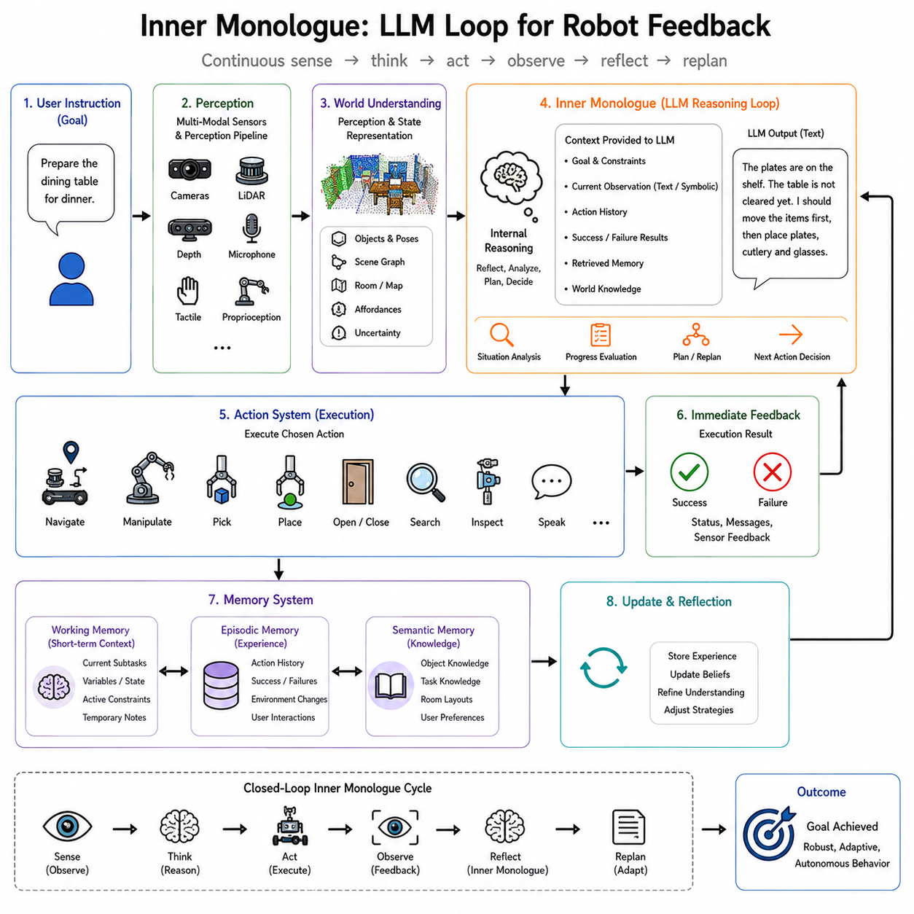{width="7.268055555555556in" height="7.268055555555556in"}

Inner Monologue is an emerging architecture in Physical AI that enables robots to continuously reason about their own actions, observations, failures, and goals through an internal language-based feedback loop. Unlike traditional robotic systems that execute predefined plans until completion or failure, an Inner Monologue system repeatedly observes the environment, interprets new information, reflects on its current progress, updates its understanding of the task, and revises future actions accordingly. This continual reasoning process resembles the internal dialogue humans often experience while solving complex problems. Rather than silently executing a fixed sequence of commands, the robot maintains an evolving internal conversation that helps coordinate perception, planning, memory, and action throughout task execution.

The motivation for Inner Monologue arises from one of the fundamental limitations of classical robotic planning. Conventional planning algorithms typically assume that the world remains sufficiently predictable once a plan has been generated. A planner computes an action sequence, the controller executes it, and only significant failures trigger replanning. This approach performs well in structured industrial environments where uncertainty remains relatively low. However, real-world environments are dynamic, partially observable, and continuously changing. Objects move unexpectedly, humans intervene, sensors become uncertain, doors are closed, tools disappear, lighting changes, and previously valid assumptions become incorrect. Under these conditions, a robot requires not only action execution but continuous self-evaluation during execution.

Large Language Models provide a powerful mechanism for implementing such self-evaluation because they naturally operate through iterative reasoning over textual context. Rather than treating language merely as an interface for human communication, Inner Monologue treats language as an internal cognitive workspace where observations, goals, plans, failures, hypotheses, and environmental changes are continuously integrated. The language model repeatedly receives updated descriptions of the current situation, reasons about progress toward the objective, generates revised plans when necessary, and guides subsequent robot actions.

The term "Inner Monologue" intentionally parallels human cognition. Humans frequently engage in silent internal reasoning while performing everyday activities. A person preparing a meal may think, "The vegetables are already cut. The pan is hot. I still need oil before cooking. The onions are burning, so I should reduce the heat first." This internal dialogue allows continuous monitoring and adjustment without external instruction. Similarly, an autonomous robot can internally reason, "The requested object is not on the table. I should search nearby shelves. The shelf is blocked by a chair. Moving the chair first may increase accessibility." Such reflective reasoning substantially improves adaptability in uncertain environments.

The overall architecture typically consists of a perception system, an action execution system, external memory, and a language-based reasoning loop connecting them. Sensors continuously observe the environment through cameras, LiDAR, depth sensors, force sensors, tactile arrays, microphones, proprioceptive sensors, and localization systems. Perception modules convert raw observations into structured symbolic descriptions. These descriptions, together with the current goal and execution history, become input to the language model. The language model generates an updated internal reasoning state, recommends future actions, evaluates progress, and determines whether replanning or recovery becomes necessary. The resulting decisions are executed physically before the cycle repeats.

Unlike one-time planning, the reasoning loop executes repeatedly throughout task execution. Every completed action generates new observations. Every observation modifies the internal context presented to the language model. Consequently, planning becomes a continuous process rather than a single initial computation. This iterative architecture closely resembles feedback control systems operating at a cognitive rather than purely mechanical level. Instead of regulating motor torques alone, the robot continuously regulates its own understanding of the task.

Context accumulation represents one of the most important characteristics of Inner Monologue. Traditional planners often consider only the current state and desired goal. The language model instead receives a growing history describing previous actions, observed failures, successful recoveries, discovered object locations, user interactions, environmental changes, and intermediate task completion. This accumulated context enables increasingly informed decision-making because future reasoning incorporates the robot\'s entire recent experience rather than isolated observations.

Memory therefore becomes a central component of the architecture. Working memory stores the immediate reasoning context, including current observations, pending subtasks, active constraints, and temporary variables. Episodic memory records completed actions, failures, environmental discoveries, and interaction history. Semantic memory contains knowledge regarding object functions, room layouts, manipulation procedures, user preferences, and world knowledge acquired through prior learning. During every reasoning cycle, relevant memories are retrieved and incorporated into the language model\'s context, enabling decisions informed by both immediate perception and long-term experience.

Consider a household robot instructed to "prepare the dining table for dinner." A traditional planner might generate a fixed sequence involving locating plates, utensils, glasses, napkins, and placing them on the table. During execution, however, the robot discovers that clean plates are unavailable. Rather than simply reporting failure, the Inner Monologue system updates its internal reasoning. It may conclude, "The cabinet contains no clean plates. Dirty plates are in the dishwasher. I should determine whether the dishwasher has completed its cycle." After checking the dishwasher, the reasoning continues: "The plates are clean but still inside. I should unload them before setting the table." The task therefore evolves dynamically through continual internal reasoning rather than static planning.

This adaptive reasoning depends upon language serving as an intermediate cognitive representation rather than merely an external communication medium. Internal reasoning sentences summarize environmental state, action outcomes, confidence estimates, uncertainty, assumptions, and possible recovery strategies. These textual summaries remain understandable to humans while simultaneously providing structured reasoning input for the language model itself. Consequently, the robot\'s internal cognition becomes partially interpretable because reasoning processes are represented explicitly rather than remaining hidden within opaque neural activations.

Observation grounding plays an essential role throughout the feedback loop. Every reasoning cycle begins by incorporating updated sensory information. Visual perception identifies objects, their locations, and their relationships. Localization estimates the robot\'s position within the environment. Manipulation sensors confirm successful grasping or placement. Force feedback indicates unexpected physical contact. Human speech introduces new instructions or corrections. These observations become structured descriptions that modify the reasoning context. The language model therefore reasons not about abstract hypothetical situations but about continuously updated representations of the actual physical environment.

Environmental uncertainty significantly influences Inner Monologue. Physical robots rarely possess complete information regarding the world. Objects may be occluded, sensor measurements noisy, maps incomplete, or human intentions ambiguous. Rather than ignoring uncertainty, the reasoning loop explicitly incorporates confidence estimates and missing information into its internal dialogue. For example, the robot may reason, "The object detector reports an 80 percent probability that the cup is on the counter. I should verify visually before attempting a grasp." Such uncertainty-aware reasoning improves robustness by avoiding premature commitments based on unreliable observations.

Recovery from failure represents another major advantage of the architecture. Classical robotic systems frequently terminate execution when predefined action sequences become invalid. Inner Monologue instead interprets failures as new observations requiring additional reasoning. Suppose a manipulation attempt fails because an object slips during grasping. Rather than repeating the identical motion blindly, the reasoning loop may conclude, "The object appears slippery. I should reduce grasp speed and increase gripping force." If the second attempt also fails, further reasoning might identify an alternative grasp point or suggest using a different manipulation strategy altogether. Failure therefore becomes informative feedback rather than terminal error.

Long-horizon tasks particularly benefit from continual reasoning. Many practical robotic applications require dozens or hundreds of coordinated actions extending across several minutes or even hours. During such extended execution, environmental conditions inevitably change. Human collaborators intervene, objects move, batteries discharge, communication interruptions occur, and priorities evolve. A continuously updated reasoning loop naturally accommodates these changes because every new observation modifies future planning. The robot therefore maintains coherence across extended task sequences despite substantial environmental uncertainty.

Human interaction integrates naturally within the feedback architecture. New instructions, corrections, clarifications, or preferences introduced during task execution become additional reasoning inputs rather than external interruptions. Imagine a user initially requesting, "Bring me a bottle of water," then later adding, "Actually, make it sparkling water if possible." The language model incorporates this updated objective into the ongoing reasoning process, modifying future actions without requiring complete task restart. Such conversational flexibility resembles natural human collaboration rather than rigid command execution.

Foundation language models substantially enhance Inner Monologue because they contribute extensive prior knowledge regarding common-sense reasoning, procedural understanding, causal relationships, and semantic interpretation. The reasoning loop therefore extends beyond immediate sensor observations. A robot observing an empty refrigerator may infer likely alternative storage locations for beverages based upon general household knowledge. Similarly, understanding that wet floors increase slipping risk or that fragile objects require careful handling emerges naturally from broad pretrained knowledge integrated into continual reasoning.

World models further strengthen the architecture by enabling predictive reasoning. Instead of considering only the current environmental state, the robot simulates likely future outcomes of candidate actions. Internal reasoning may include statements such as, "Moving this chair first will create sufficient space for navigation," or "Opening the cabinet before retrieving the bowl reduces unnecessary movement." Such predictions improve decision quality by anticipating consequences before physical execution.

Retrieval-Augmented Generation provides another important enhancement. Rather than relying exclusively upon knowledge stored within model parameters, the reasoning loop retrieves relevant external information from manuals, operational procedures, maintenance documentation, user preferences, semantic maps, previous task histories, or organizational knowledge bases. Retrieved information becomes additional reasoning context, improving factual accuracy while reducing hallucination. For example, when servicing unfamiliar industrial equipment, the robot may retrieve manufacturer documentation before deciding appropriate inspection procedures.

Inner Monologue also complements Code as Policies. Generated code specifies procedural task execution, whereas the reasoning loop evaluates ongoing execution quality and determines when procedural modifications become necessary. If generated software encounters unexpected situations, the language model reasons about recovery strategies before synthesizing revised procedural fragments. Consequently, static code generation evolves into adaptive program execution guided continuously by internal reflection.

Similarly, Inner Monologue naturally extends SayCan. SayCan selects actions according to semantic relevance and physical affordance. Inner Monologue repeatedly reevaluates both relevance and feasibility after every executed action. Instead of selecting one action independently, the robot maintains an evolving cognitive dialogue throughout the complete task. This continual reflection significantly improves performance under changing environmental conditions because planning remains synchronized with reality rather than relying upon outdated assumptions.

Continual learning becomes deeply integrated within the reasoning loop. Every completed task contributes additional experience describing successful strategies, unsuccessful attempts, environmental characteristics, human preferences, and operational procedures. Future reasoning incorporates these accumulated experiences automatically through memory retrieval. Consequently, robots gradually improve not only low-level motor skills but also higher-level reasoning strategies developed through operational history.

Multi-robot systems introduce collaborative reasoning opportunities. Individual robots may exchange summarized reasoning states, environmental observations, discovered object locations, or proposed recovery strategies. Cloud infrastructure aggregates these experiences into collective reasoning knowledge available throughout the fleet. A maintenance robot discovering a blocked corridor informs delivery robots before they encounter the same obstacle. A warehouse robot identifying relocated inventory updates shared semantic maps. Collaborative Inner Monologue therefore transforms isolated reasoning into distributed collective intelligence.

Safety remains a critical concern because language models occasionally produce plausible yet incorrect conclusions. Therefore, reasoning outputs remain subject to multiple validation layers before influencing physical execution. Motion planners verify kinematic feasibility. Collision avoidance systems ensure physical safety. Rule-based constraints enforce operational policies. Human supervisors review uncertain decisions within high-risk environments. Confidence estimation further identifies reasoning requiring additional verification before execution. The language model contributes flexible cognition while specialized robotic subsystems preserve deterministic safety guarantees.

Interpretability represents one of the most valuable properties of the architecture. Since reasoning occurs explicitly through language, engineers, operators, and users may inspect the robot\'s internal thought process. The robot explains why certain actions were selected, why failures occurred, what assumptions guided planning, and how recovery strategies were chosen. Such transparency facilitates debugging, certification, human trust, and regulatory compliance far more effectively than opaque end-to-end neural policies.

Several limitations nevertheless remain. Long reasoning contexts eventually exceed language model context windows, requiring memory compression or selective retrieval. Incorrect observations may propagate through reasoning, producing flawed conclusions despite otherwise capable planning. Hallucinated facts occasionally influence decision-making if external grounding remains insufficient. Real-time robotic control additionally imposes computational latency constraints because repeated language model inference requires substantial processing resources. Efficient context management, hierarchical reasoning, and lightweight foundation models therefore remain active research topics.

Recent research increasingly integrates Inner Monologue with multimodal foundation models, world models, retrieval systems, self-reflection, meta-reasoning, reinforcement learning, and autonomous software agents. Future systems will likely reason simultaneously over language, vision, action, spatial memory, physical simulation, and long-term experience within unified cognitive architectures. Rather than merely describing observations verbally, robots will develop structured internal cognitive workspaces supporting prediction, explanation, planning, learning, and collaborative reasoning across extended operational lifetimes.

The relationship between Inner Monologue and human cognition extends beyond superficial analogy. Humans continuously monitor progress toward goals, revise plans when circumstances change, recall relevant experiences, evaluate alternative strategies, and learn from previous failures through internal reflection. Although current language models do not possess human consciousness, they provide computational mechanisms capable of performing analogous iterative reasoning processes. By externalizing these reasoning steps into interpretable language, Physical AI systems gain flexibility, transparency, and adaptability unavailable through purely reactive control architectures.

Ultimately, Inner Monologue transforms robotic intelligence from one-time decision making into continuous cognitive feedback. The robot no longer plans once and executes blindly. Instead, it repeatedly observes, interprets, reflects, predicts, decides, acts, and learns throughout every stage of task execution. Language becomes the medium through which perception, memory, planning, world knowledge, and action remain continuously synchronized. This closed reasoning loop enables robots to operate robustly within dynamic, uncertain, and collaborative environments where successful autonomy depends not only upon executing actions correctly but upon continually understanding whether those actions remain appropriate as the world evolves around them.

## 09.05 Physical AI for Manipulation Task Completion [w/Code]

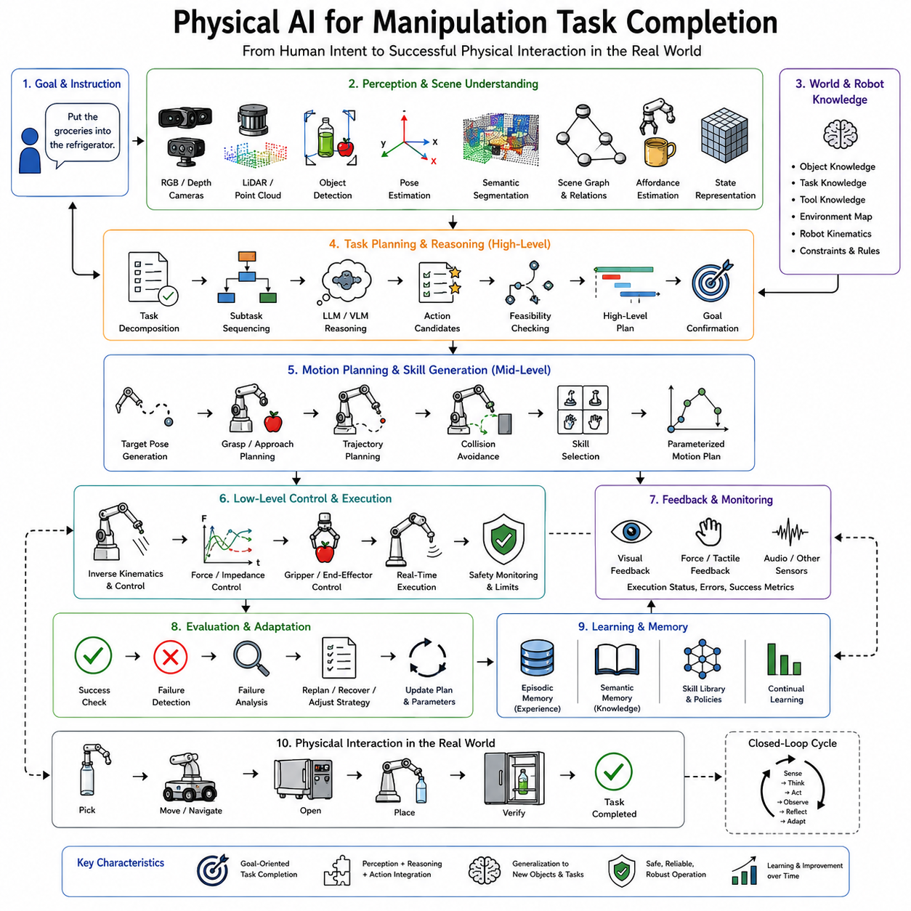{width="7.268055555555556in" height="7.268055555555556in"}

Manipulation is one of the defining capabilities of Physical AI because it transforms perception and reasoning into purposeful interaction with the physical world. While navigation allows a robot to move through an environment and perception enables it to understand its surroundings, manipulation allows the robot to change the state of the environment itself. Picking up an object, opening a cabinet, assembling a product, folding clothes, preparing food, tightening a bolt, inserting a connector, or handing an object to a human are all examples of manipulation tasks. These activities require the integration of sensing, planning, control, learning, memory, and physical interaction. Physical AI for manipulation therefore represents one of the most comprehensive demonstrations of embodied intelligence, where every layer of the robotic architecture must cooperate to accomplish meaningful real-world objectives.

Traditional industrial robotic manipulation has achieved remarkable success in highly structured environments. Assembly-line robots repeatedly perform precisely defined motions within carefully engineered workspaces where object positions, lighting conditions, and task sequences remain almost identical over millions of repetitions. Under such conditions, manually programmed trajectories, fixture-based positioning, and deterministic controllers provide excellent performance. However, this approach does not generalize to open-world environments. Homes, hospitals, warehouses, construction sites, laboratories, agricultural fields, and public spaces present constantly changing conditions where object locations, shapes, orientations, accessibility, and surrounding obstacles vary continuously. Physical AI extends manipulation beyond rigid automation by enabling robots to understand, adapt, and learn throughout task execution.

The objective of manipulation is not merely moving robotic joints. The ultimate objective is task completion. A user requesting, "Put the groceries into the refrigerator," does not care about individual joint trajectories or gripper positions. The desired outcome is that groceries are organized correctly inside the refrigerator without damage or unnecessary delay. This distinction shifts the focus from low-level motion generation toward goal-oriented intelligent behavior. Physical AI therefore treats manipulation as a complete cognitive process beginning with understanding human intent and ending with successful task completion in the physical world.

Task completion begins with goal interpretation. The robot receives objectives through natural language, symbolic commands, mission planners, production schedules, cloud services, or autonomous planning systems. Large Language Models and Vision-Language Models increasingly enable robots to interpret flexible human instructions without requiring predefined command syntax. An instruction such as "Organize the kitchen counter" is transformed into an executable objective containing multiple subtasks including identifying misplaced objects, determining appropriate storage locations, moving items safely, verifying completion, and reporting success. Goal interpretation therefore establishes the semantic foundation for manipulation.

Once the objective has been understood, perception becomes the next essential stage. Manipulation requires significantly richer perception than navigation because the robot must understand not only where objects are located but also how they may be grasped, manipulated, assembled, opened, rotated, pushed, pulled, or inserted. Vision systems identify objects, estimate their poses, segment individual instances, classify materials, estimate physical properties, and recognize affordances. Depth cameras, stereo vision, LiDAR, structured light sensors, tactile arrays, force sensors, and multimodal perception systems collectively construct detailed representations of the manipulation scene.

Object detection alone is insufficient for manipulation. The robot must estimate six-degree-of-freedom object poses, identify graspable surfaces, infer object stability, estimate mass distribution, recognize articulated components such as doors or drawers, and predict potential interactions with surrounding objects. Foundation vision models increasingly provide generalized object understanding that extends beyond fixed training categories, allowing robots to recognize previously unseen objects through semantic reasoning rather than purely supervised classification.

Affordance understanding represents one of the central concepts in intelligent manipulation. An affordance describes the possible interactions between an agent and an object. A handle affords pulling, a button affords pressing, a drawer affords opening, a cup affords grasping by its handle, and a box affords lifting from below. Unlike object recognition, affordance recognition focuses on action possibilities rather than object identity alone. Two visually different objects may possess identical affordances, while identical objects positioned differently may present completely different manipulation opportunities. Physical AI therefore combines semantic object recognition with affordance estimation to determine how manipulation should proceed.

Scene understanding extends perception beyond individual objects toward complete environmental reasoning. Manipulation frequently depends upon spatial relationships among multiple objects. A cup may be inside a cabinet, partially covered by a towel, placed on a fragile plate, or located behind another object. Successful manipulation requires understanding these relationships before selecting actions. Scene graphs, semantic maps, spatial reasoning networks, and world models provide structured representations describing object connectivity, containment, support relationships, accessibility, and potential interaction constraints.

After constructing an environmental representation, the robot begins task decomposition. Most manipulation objectives cannot be accomplished through a single action. Opening a refrigerator, locating the correct shelf, identifying available space, moving obstacles, placing groceries appropriately, and closing the door represent multiple coordinated subtasks contributing toward one overall objective. Hierarchical task planning decomposes high-level goals into executable action sequences while maintaining awareness of task dependencies and resource constraints.

Planning occurs at multiple levels simultaneously. Strategic planning determines the overall task sequence. Behavioral planning selects manipulation strategies such as pushing, grasping, sliding, or dual-arm coordination. Motion planning computes collision-free trajectories respecting robot kinematics, joint limits, dynamic constraints, and environmental obstacles. Grasp planning identifies appropriate contact locations, finger configurations, approach directions, and force distributions. Every planning level contributes toward successful task completion while interacting continuously with perception and execution.

Motion planning has traditionally relied upon analytical optimization algorithms such as Rapidly-exploring Random Trees, Probabilistic Roadmaps, trajectory optimization, and Model Predictive Control. Physical AI increasingly augments these methods with learned policies capable of adapting to uncertainty, incomplete observations, deformable objects, and previously unseen situations. Hybrid planning architectures combine deterministic optimization with learned representations, achieving both reliability and adaptability.

Grasp generation remains one of the most extensively studied manipulation problems. Classical robotic grippers relied upon predefined grasp templates for known objects. Modern Physical AI systems instead predict grasp candidates directly from visual observations using deep neural networks, diffusion models, or foundation manipulation models. These systems estimate grasp quality, stability, force distribution, collision risk, and execution probability while considering object geometry, material properties, and intended downstream tasks. Grasp planning therefore becomes context-dependent rather than object-dependent.

Manipulation execution requires continuous closed-loop control. Unlike open-loop industrial automation, real-world manipulation rarely proceeds exactly as planned. Objects may slip, deform, rotate unexpectedly, or become obstructed during execution. Force sensors detect unexpected contact. Tactile arrays estimate grasp quality. Vision systems monitor object motion. Controllers continuously adjust grip force, finger position, arm trajectory, and manipulation strategy according to incoming feedback. This sensorimotor feedback loop transforms manipulation into an adaptive rather than deterministic process.

Force control plays a particularly important role whenever robots interact physically with the environment. Position control alone cannot safely manipulate fragile, compliant, or uncertain objects. Impedance control regulates the relationship between force and motion. Admittance control adjusts motion according to measured external forces. Hybrid position-force control simultaneously regulates movement along some axes while controlling interaction forces along others. Such techniques allow robots to perform insertion, assembly, polishing, wiping, screwing, opening containers, and collaborative manipulation safely.

Tactile sensing significantly expands manipulation capability. Vision alone cannot determine whether an object has been grasped securely, whether contact forces remain appropriate, or whether slipping has begun. Artificial skin, pressure sensors, force-torque sensors, and high-resolution tactile arrays provide information unavailable through visual perception. Tactile feedback enables robots to adjust grasp force dynamically, detect material properties, estimate friction, identify successful insertion, and perform dexterous in-hand manipulation.

Learning has transformed manipulation from manually engineered behavior into continuously improving embodied intelligence. Supervised learning trains perception systems using annotated demonstrations. Imitation learning captures expert manipulation behavior directly from human demonstrations. Reinforcement learning optimizes manipulation policies through trial and error. Self-supervised learning allows robots to generate their own training signals through autonomous interaction with objects. Foundation manipulation models combine these approaches into generalized representations transferable across diverse tasks.

Imitation learning has proven particularly valuable because many manipulation tasks remain difficult to specify analytically. Human demonstrations naturally encode subtle coordination patterns, force regulation, timing, and recovery behavior. Robots observe demonstrations through teleoperation, kinesthetic teaching, motion capture, virtual reality interfaces, or video recordings. Learned policies subsequently generalize these demonstrations across varying environments and object configurations.

Reinforcement learning complements imitation by enabling autonomous skill refinement. Initial demonstrations provide reasonable starting behavior, while reinforcement learning improves performance through repeated interaction. Reward functions encourage successful task completion, efficiency, safety, energy conservation, precision, or robustness depending upon application requirements. Simulation environments dramatically accelerate this process because millions of interactions become possible without risking physical hardware damage.

Simulation has become indispensable for manipulation learning. Physics simulators model rigid bodies, deformable materials, friction, contact dynamics, fluid interaction, and articulated mechanisms. Domain randomization exposes learning algorithms to varying lighting, textures, masses, friction coefficients, sensor noise, and environmental configurations, improving generalization when transferring policies from simulation to real robots. Sim-to-real transfer remains an active research area because simulation never perfectly reproduces physical reality.

Foundation models have recently transformed robotic manipulation. Vision-Language-Action models jointly represent perception, language understanding, and motor behavior within unified architectures. Rather than learning individual manipulation tasks independently, these models acquire generalized representations spanning thousands of manipulation scenarios. Fine-tuning adapts broad prior knowledge toward specific robotic embodiments and operational environments. Consequently, robots increasingly generalize to novel objects and instructions with substantially fewer demonstrations than previous learning paradigms required.

Language-conditioned manipulation further enhances flexibility. Instead of selecting predefined task identifiers, users describe objectives naturally. Large Language Models interpret instructions, decompose goals into subtasks, reason about object relationships, retrieve procedural knowledge, and coordinate manipulation policies. Systems such as SayCan, Code as Policies, and Inner Monologue integrate language reasoning directly with manipulation execution, enabling robots to adapt continuously according to changing environmental conditions and user preferences.

Memory contributes significantly to long-term manipulation competence. Episodic memory records successful and unsuccessful manipulation attempts. Semantic memory stores object properties, preferred grasp strategies, assembly procedures, and user-specific organizational preferences. Procedural memory preserves learned motor skills. Retrieval-Augmented Generation allows robots to consult external documentation, maintenance manuals, assembly instructions, or previous experiences before attempting unfamiliar manipulation tasks. Memory therefore transforms isolated manipulation episodes into cumulative operational expertise.

World models further enhance manipulation by enabling predictive reasoning. Before executing an action, the robot simulates possible outcomes internally. It predicts object trajectories, contact events, stability, collision risks, and future environmental states. Such prediction reduces trial-and-error execution while improving safety and efficiency. World models also support counterfactual reasoning by evaluating multiple candidate manipulation strategies before selecting the most promising approach.

Manipulation under uncertainty remains one of the defining characteristics of Physical AI. Object poses may be estimated inaccurately. Sensor observations may contain noise. Friction coefficients remain unknown. Human collaborators introduce unpredictable motion. Deformable objects change shape continuously during manipulation. Rather than assuming perfect knowledge, probabilistic planning, Bayesian estimation, particle filtering, uncertainty-aware perception, and confidence estimation guide decision making under incomplete information. Adaptive execution continuously reduces uncertainty through interaction rather than requiring complete certainty before acting.

Collaborative manipulation introduces additional complexity because humans and robots share physical workspaces. The robot must predict human intentions, maintain safe interaction distances, regulate physical forces, communicate planned actions, and adapt continuously according to human behavior. Shared autonomy combines robotic precision with human supervision, allowing each partner to contribute complementary strengths. Natural language, gestures, gaze tracking, and multimodal communication facilitate intuitive collaboration during manipulation tasks.

Multi-robot manipulation further expands capability beyond individual robots. Large objects frequently require coordinated manipulation by multiple robotic arms or mobile manipulators. Distributed planning synchronizes trajectories, force distribution, communication, and task allocation while preventing interference among collaborating robots. Cloud infrastructure enables fleet-wide sharing of manipulation experience, allowing successful strategies developed by one robot to benefit many others.

Industrial applications illustrate the broad impact of Physical AI manipulation. Manufacturing robots perform adaptive assembly, quality inspection, machine tending, packaging, and logistics. Warehouse systems handle heterogeneous inventory rather than standardized containers. Agricultural robots harvest delicate fruits, prune plants, and sort produce. Medical robots assist surgeons, prepare medications, and transport supplies. Construction robots manipulate building materials under changing site conditions. Domestic service robots prepare meals, organize living spaces, fold laundry, and assist elderly individuals. Every application requires integrating perception, planning, control, learning, and reasoning into coherent task completion.

Evaluation of manipulation extends beyond grasp success alone. Researchers measure task completion rate, execution time, path efficiency, grasp stability, force regulation, precision, robustness under uncertainty, recovery from failure, energy consumption, generalization to unseen objects, sample efficiency, human satisfaction, safety, and long-term operational reliability. Ultimately, the quality of a manipulation system depends upon accomplishing meaningful objectives reliably rather than merely producing successful individual motions.

The future of Physical AI manipulation increasingly converges with lifelong learning, foundation models, world models, cloud robotics, and embodied cognition. Robots will accumulate manipulation experience throughout years of deployment, continuously refining perception, grasping strategies, task decomposition, recovery behaviors, and semantic understanding. Collective fleet learning will distribute successful manipulation knowledge across thousands of robots. Digital twins will validate new manipulation policies before deployment. Large multimodal models will unify language, vision, memory, planning, and control within integrated cognitive architectures capable of understanding not only how to manipulate objects but why particular manipulations achieve human goals.

Physical AI for manipulation therefore represents far more than robotic grasping or motion control. It is the complete end-to-end process through which intelligent embodied systems perceive their environment, understand human intent, reason about object interactions, plan adaptive behaviors, execute physical actions, evaluate outcomes, recover from failures, learn from experience, and continuously improve throughout deployment. Manipulation becomes the tangible expression of embodied intelligence because it is through purposeful interaction with the physical world that artificial intelligence demonstrates its ability not merely to understand reality but to transform it in meaningful, useful, and increasingly autonomous ways.

## 09.06 Physical AI for Navigation Goal Directed [w/Code]

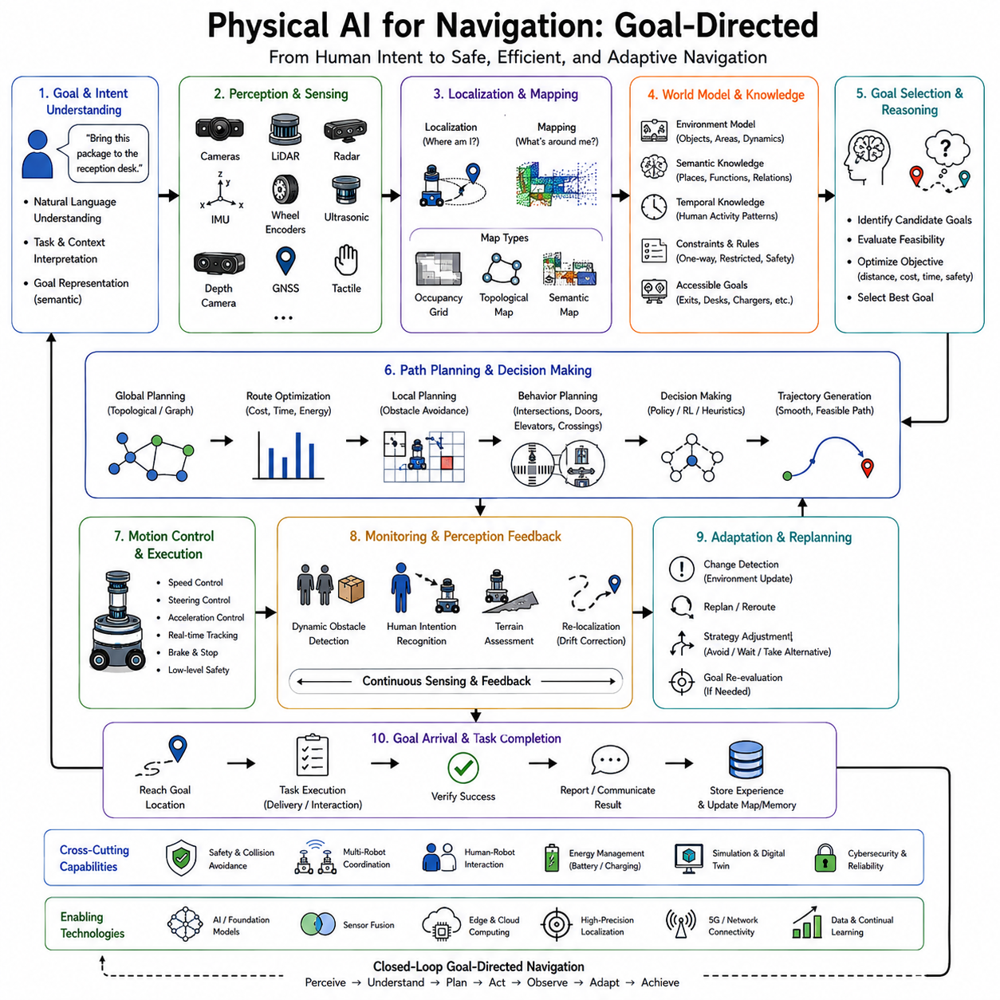{width="7.268055555555556in" height="7.268055555555556in"}

Navigation is one of the most fundamental capabilities of Physical AI because it enables robots to move purposefully through complex environments in order to accomplish meaningful objectives. While perception allows a robot to understand its surroundings and manipulation enables interaction with physical objects, navigation connects these capabilities by transporting the robot to locations where perception, interaction, collaboration, and task execution become possible. A robot that cannot reliably navigate cannot deliver packages, inspect infrastructure, assist humans, manipulate objects, explore unknown environments, or cooperate with other robots. Consequently, goal-directed navigation serves as one of the foundational building blocks of embodied intelligence and autonomous robotic systems.

Traditional robotic navigation has primarily focused on moving safely from one point to another while avoiding obstacles. Classical approaches generally assume that the destination is explicitly specified as a coordinate within a known map. Localization estimates the robot\'s position, path planning computes an optimal route, obstacle avoidance prevents collisions, and low-level controllers follow the planned trajectory. This framework has achieved remarkable success in warehouses, factories, hospitals, and autonomous vehicles operating within relatively structured environments. However, Physical AI extends navigation far beyond geometric path following. The objective is no longer merely reaching coordinates but understanding human goals, reasoning about environmental context, adapting to uncertainty, collaborating with people, and continuously improving through experience.

Goal-directed navigation begins with understanding intent rather than coordinates. Humans rarely communicate destinations using precise Cartesian positions. Instead, they issue instructions such as "Bring this package to the reception desk," "Go to the nearest available charging station," "Find the emergency exit," or "Inspect the third production line." These instructions contain semantic meaning rather than explicit geometric information. Physical AI therefore integrates natural language understanding, semantic mapping, and world knowledge to convert human objectives into navigational goals that can be executed in the physical world.

This shift from coordinate-based navigation to goal-based navigation represents a major conceptual change. Traditional systems assume that navigation begins after the destination has already been determined. Physical AI treats destination selection itself as an intelligent reasoning problem. The robot must identify the appropriate location, interpret contextual constraints, determine accessibility, evaluate environmental conditions, and sometimes negotiate among multiple candidate destinations before movement even begins. Navigation therefore becomes a cognitive process rather than merely a geometric optimization problem.

The navigation pipeline typically begins with perception. Cameras, LiDAR, radar, ultrasonic sensors, depth cameras, inertial measurement units, wheel encoders, Global Navigation Satellite Systems, tactile sensors, and environmental sensors continuously observe the surrounding world. These observations provide information about free space, obstacles, terrain, dynamic objects, environmental semantics, and the robot\'s own motion. Modern Physical AI increasingly combines multiple sensing modalities because no individual sensor performs reliably under every condition. Vision provides rich semantic understanding but depends on illumination. LiDAR offers highly accurate geometry while lacking texture information. Radar remains robust during rain, fog, dust, and snow but provides lower spatial resolution. Sensor fusion integrates these complementary strengths into unified environmental representations.

Localization transforms sensory observations into estimates of the robot\'s current position. Classical localization techniques rely on feature matching, probabilistic filtering, graph optimization, or scan matching within previously constructed maps. Modern Physical AI extends localization by incorporating semantic understanding, learned visual representations, neural place recognition, multimodal foundation models, and lifelong mapping. Rather than simply estimating coordinates, the robot identifies meaningful places such as offices, kitchens, loading docks, hospital wards, production cells, or charging stations. Semantic localization improves robustness because humans naturally organize environments according to functional meaning rather than numerical coordinates.

Mapping provides the spatial memory supporting navigation. Traditional occupancy grids represent free space and obstacles using probabilistic cells. Feature maps store landmarks extracted from visual or geometric observations. Topological maps describe connectivity among important locations. Semantic maps extend these representations by incorporating object categories, room identities, functional areas, and environmental context. Lifelong SLAM further transforms mapping into a continuously evolving memory capable of adapting to changing environments throughout long-term deployment. Rather than constructing one static map, Physical AI maintains dynamic world models reflecting seasonal changes, furniture movement, infrastructure modifications, temporary obstacles, and evolving operational conditions.

World models provide a significantly richer representation than conventional maps. Instead of merely describing where objects are located, world models capture relationships among objects, causal interactions, environmental dynamics, human activity patterns, operational constraints, and future predictions. A world model may know that elevators become crowded during specific hours, that certain corridors are frequently blocked by maintenance equipment, or that warehouse shelves change according to production schedules. Such predictive knowledge enables navigation systems to optimize not only spatial efficiency but also operational effectiveness.

Once the environment has been represented, goal interpretation becomes the next stage. Large Language Models and Vision-Language Models increasingly translate human instructions into semantic navigation objectives. An instruction such as "Go to the room where the meeting is taking place" requires identifying the meeting location from calendars, user interactions, or environmental observations rather than following a predefined coordinate. Language-conditioned navigation therefore combines natural language reasoning with semantic environmental understanding to determine appropriate destinations dynamically.

Path planning transforms goals into executable routes. Classical algorithms such as Dijkstra\'s algorithm, A\*, Rapidly-exploring Random Trees, Probabilistic Roadmaps, and graph optimization compute collision-free paths within known environments. These methods remain highly effective for deterministic planning problems. Physical AI augments classical planning through learned cost functions, semantic reasoning, predictive world models, reinforcement learning, and dynamic optimization. Instead of minimizing only geometric distance, modern planners consider safety, energy consumption, terrain difficulty, human preferences, environmental uncertainty, traffic flow, and future task requirements simultaneously.

Global planning determines the overall route from the current location to the destination. Local planning continuously adjusts this route according to newly observed obstacles, dynamic objects, environmental changes, and sensor updates. The distinction between global and local planning remains important because environments rarely remain static during navigation. A globally optimal path computed initially may become infeasible when pedestrians appear, doors close, vehicles block intersections, or construction activities alter the environment. Continuous replanning therefore enables adaptive navigation under uncertainty.

Obstacle avoidance represents one of the most visible components of autonomous navigation. Traditional reactive controllers detect obstacles and generate avoidance maneuvers while preserving progress toward the goal. Physical AI extends obstacle avoidance by incorporating semantic reasoning. A stationary wall requires permanent avoidance, whereas a person standing temporarily in a corridor may simply require waiting. A moving forklift follows predictable industrial traffic patterns, while children playing in a public environment exhibit more unpredictable behavior. Semantic understanding therefore allows navigation systems to respond appropriately according to obstacle type rather than geometric proximity alone.

Dynamic environments present additional challenges because both the robot and surrounding objects move simultaneously. Human pedestrians continuously change direction, autonomous vehicles interact within traffic, warehouse robots coordinate shared corridors, and collaborative industrial robots operate alongside workers. Predictive models estimate future trajectories of surrounding agents, allowing planners to anticipate interactions before collisions become imminent. Such prediction transforms navigation from reactive avoidance toward proactive coordination.

Social navigation has become an increasingly important research area as robots operate more frequently alongside humans. Human movement follows implicit social conventions regarding personal space, walking direction, group behavior, queue formation, and interaction etiquette. A technically collision-free trajectory may nevertheless appear uncomfortable or disruptive if it violates social expectations. Physical AI therefore incorporates human-aware planning that respects interpersonal distances, predicts pedestrian intentions, yields appropriately, and communicates navigation intentions through motion or multimodal interaction.

Goal-directed navigation also depends heavily upon memory. Working memory maintains the current planning context, active destination, temporary obstacles, and recent observations. Episodic memory records previously successful routes, encountered failures, traffic conditions, and environmental changes. Semantic memory stores knowledge regarding room functions, object locations, user preferences, and operational procedures. Retrieval-Augmented Generation further enables robots to consult external maps, maintenance records, facility documentation, or historical operational data before planning navigation strategies. Memory transforms navigation from repeated computation into cumulative experience.

Learning significantly enhances navigation beyond manually engineered behavior. Supervised learning improves perception and semantic segmentation. Self-supervised learning develops robust visual representations without requiring extensive annotation. Reinforcement learning optimizes navigation policies through trial and error. Imitation learning captures expert driving or walking behavior. Continual learning enables adaptation throughout long-term deployment as environments evolve. Together these learning paradigms allow robots to improve navigation performance continuously rather than relying exclusively on predefined algorithms.

Reinforcement learning has proven especially valuable for navigation because movement naturally involves sequential decision-making under uncertainty. Agents learn policies maximizing long-term reward while balancing efficiency, safety, energy consumption, exploration, and task completion. Simulation environments enable millions of navigation experiences impossible to collect physically. Domain randomization improves transfer from simulation to reality by exposing policies to diverse environmental conditions, sensor characteristics, and dynamic obstacles.

Foundation models increasingly reshape navigation through generalized spatial reasoning. Large Vision-Language Models understand environmental semantics, recognize landmarks, interpret textual instructions, and reason about spatial relationships. Rather than training navigation systems exclusively from robotic datasets, foundation models leverage extensive prior knowledge acquired from internet-scale multimodal data. Fine-tuning subsequently adapts these broad representations toward specific robotic embodiments and operational environments.

World models further extend navigation by enabling internal simulation before physical movement. The robot predicts likely outcomes of candidate routes, estimates congestion, evaluates alternative paths, anticipates dynamic interactions, and selects strategies maximizing expected success. Counterfactual reasoning allows comparison among multiple hypothetical futures without physically exploring each possibility. Such predictive capability significantly improves robustness in uncertain environments where incorrect navigation decisions may prove costly.

Language-conditioned navigation builds directly upon systems such as SayCan, Code as Policies, and Inner Monologue. Large Language Models interpret high-level objectives, decompose navigation goals into subtasks, generate procedural plans, monitor execution progress, and revise strategies according to new observations. The robot continuously reasons about whether it remains on the correct path, whether environmental changes require replanning, and whether user objectives have evolved during execution. Navigation therefore becomes an ongoing cognitive dialogue rather than a static planning problem.

Inner Monologue particularly strengthens goal-directed navigation by providing continuous self-reflection. During movement, the robot internally reasons, "The planned corridor is blocked. I should evaluate an alternative route. The elevator appears occupied. Waiting may be more efficient than taking the stairs. The destination room has changed according to the meeting schedule." Such reasoning integrates perception, planning, memory, and language into a continuously adaptive navigation process capable of responding intelligently to changing circumstances.

Cloud robotics expands navigation capabilities beyond individual robots. Fleet learning aggregates experiences collected across many deployments. Robots share maps, traffic patterns, obstacle observations, localization improvements, semantic annotations, and successful navigation strategies through centralized cloud infrastructure. A newly deployed robot immediately benefits from experiences accumulated by hundreds of other robots operating in similar environments. Collective intelligence therefore accelerates adaptation while reducing redundant exploration.

Digital twins provide another major advantage. High-fidelity virtual representations of physical environments allow extensive navigation testing before deployment. Candidate planning algorithms, localization systems, reinforcement learning policies, and semantic reasoning modules undergo simulation under diverse environmental conditions without risking physical hardware. Continuous synchronization between physical environments and digital twins enables rapid validation of updated navigation strategies while maintaining operational safety.

Energy management increasingly influences navigation decisions. Battery capacity, charging station availability, terrain difficulty, payload weight, environmental temperature, and computational load all affect energy consumption. Goal-directed navigation therefore optimizes not only path length but also overall operational efficiency. A slightly longer route with smoother terrain may consume less energy than a shorter path involving steep inclines or dense pedestrian traffic. Autonomous charging further integrates navigation with long-term mission planning.

Multi-robot coordination introduces additional complexity. Warehouse robots, autonomous delivery systems, agricultural vehicles, and industrial mobile manipulators frequently share operational environments. Navigation therefore includes traffic management, collision avoidance among robots, task allocation, communication, priority scheduling, and cooperative planning. Distributed optimization ensures efficient fleet operation while preventing congestion, deadlocks, or resource conflicts.

Outdoor navigation presents challenges distinct from indoor operation. Global positioning systems provide coarse localization but become unreliable in urban canyons, forests, tunnels, or under dense vegetation. Terrain varies significantly. Weather affects sensing quality. Road conditions change continuously. Pedestrians, cyclists, and vehicles exhibit diverse behaviors. Physical AI integrates GNSS, LiDAR, cameras, inertial navigation, semantic understanding, and world models to maintain robust outdoor navigation across highly variable environments.

Indoor navigation emphasizes different challenges. Corridors, elevators, doors, dynamic furniture, changing room layouts, human traffic, narrow passages, and limited GPS availability require precise localization and semantic understanding. Hospital robots, warehouse systems, office assistants, and domestic service robots rely heavily upon semantic maps, visual localization, and human-aware planning. Lifelong SLAM becomes particularly important because indoor environments evolve continuously through furniture movement, renovation, and changing operational workflows.

Safety remains paramount throughout navigation. Functional safety systems monitor localization confidence, obstacle proximity, actuator health, communication integrity, battery condition, and sensor reliability continuously. Redundant sensing, emergency stopping, fault detection, uncertainty estimation, and safe recovery behaviors ensure that navigation remains trustworthy even under unexpected conditions. Explainable planning further improves operator confidence by allowing robots to justify navigation decisions through natural language.

Evaluation of goal-directed navigation extends far beyond measuring path length. Researchers assess task completion rate, localization accuracy, planning efficiency, obstacle avoidance success, energy consumption, computational latency, robustness under environmental change, adaptation speed, social compliance, safety, human satisfaction, and long-term operational reliability. Ultimately, successful navigation is measured not simply by reaching destinations but by accomplishing meaningful objectives efficiently, safely, and autonomously within complex real-world environments.

The future of Physical AI navigation increasingly converges with lifelong learning, world models, multimodal foundation models, cloud robotics, digital twins, and embodied cognition. Robots will continuously expand semantic understanding of their environments, predict future environmental evolution, personalize navigation according to user preferences, coordinate seamlessly with humans and other robots, and accumulate navigation expertise throughout years of deployment. Rather than repeatedly solving isolated path-planning problems, future Physical AI systems will develop persistent spatial intelligence integrating perception, reasoning, memory, prediction, communication, and continual adaptation into unified cognitive architectures.

Physical AI for goal-directed navigation therefore represents much more than autonomous movement. It is the complete end-to-end process through which an embodied intelligent system understands human intent, interprets semantic goals, perceives dynamic environments, constructs evolving world models, reasons about uncertainty, plans adaptive strategies, executes safe movement, collaborates with humans and other robots, learns continuously from experience, and ultimately reaches meaningful objectives rather than merely geographic locations. Goal-directed navigation transforms mobility into intelligent purpose, providing one of the essential foundations upon which autonomous embodied intelligence operates successfully in the physical world.

## 09.07 Physical AI for Human Instruction Following [w/Code]

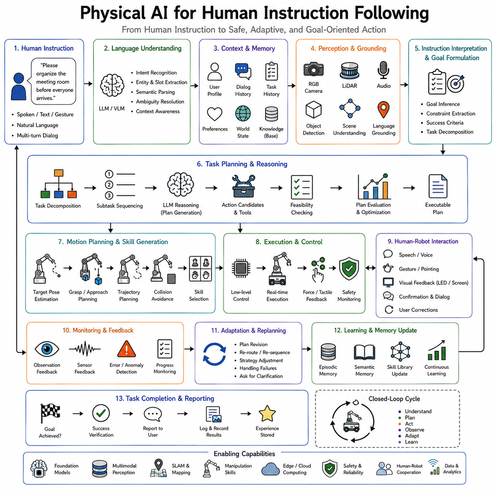{width="7.268055555555556in" height="7.268055555555556in"}

Human instruction following is one of the defining characteristics of Physical AI because it enables robots to transform human intentions into intelligent physical behavior. Unlike traditional automation systems that execute predefined programs, Physical AI systems must understand flexible human requests, interpret context, resolve ambiguity, reason about environmental constraints, generate executable plans, interact safely with people, and adapt continuously as situations evolve. The ultimate objective is not merely recognizing spoken commands but establishing a natural collaboration between humans and embodied intelligent machines. A robot capable of following human instructions effectively behaves less like a programmable machine and more like an intelligent assistant that understands goals, adapts to changing circumstances, and cooperates with people in accomplishing real-world tasks.

Classical robotic control generally assumes that every task has been specified precisely before execution begins. Engineers manually program trajectories, define state transitions, configure parameters, and determine exception handling for every anticipated situation. This approach performs well in highly structured manufacturing environments where tasks rarely change. However, it becomes impractical in homes, hospitals, warehouses, offices, agricultural fields, construction sites, and public environments where human requests are diverse, incomplete, and often expressed through natural language rather than formal programming interfaces. Physical AI addresses this limitation by making human instruction itself the starting point of autonomous reasoning.

The fundamental challenge of instruction following lies in the gap between human communication and robotic execution. Humans naturally communicate at the level of goals rather than implementation details. A person may simply say, "Please organize the meeting room before everyone arrives," without specifying where every object should be placed, how furniture should be arranged, or which cleaning procedure should be followed. Humans assume extensive common-sense knowledge that rarely appears explicitly within the instruction itself. A Physical AI system must therefore infer missing information, identify implicit constraints, understand social expectations, and generate detailed execution plans that satisfy the underlying intention rather than merely responding to literal wording.

This process begins with language understanding. Large Language Models provide the ability to interpret natural language across a wide variety of expressions, dialects, sentence structures, and conversational styles. Rather than relying on predefined command vocabularies, modern robots understand flexible requests such as "Bring me the notebook I was using yesterday," "Make this room ready for visitors," or "Find a quiet place where I can work." Language understanding extends beyond grammatical analysis toward semantic interpretation, contextual reasoning, and goal inference. The robot identifies what the user intends rather than simply matching keywords.

Understanding human instructions requires recognizing multiple levels of meaning simultaneously. The explicit instruction specifies the requested objective, while implicit knowledge provides additional constraints. Consider the instruction, "Please make some coffee." Humans automatically infer that coffee beans, water, filters, cups, and appropriate preparation equipment may be required. They understand that boiling water should precede brewing and that serving follows preparation. The robot must reconstruct these hidden procedural relationships despite their absence from the spoken instruction. Foundation language models contribute broad common-sense knowledge that significantly improves such inference.

Context plays a central role in successful instruction following. The meaning of identical sentences often changes according to the environment, previous interactions, user preferences, and operational conditions. The instruction, "Put it over there," requires identifying both the object referenced by "it" and the destination represented by "there." Similarly, "Bring my usual lunch" depends upon remembering historical user preferences rather than interpreting the words independently. Physical AI therefore integrates language with perception, memory, and environmental understanding to resolve contextual ambiguity before execution begins.

Perception provides the grounding mechanism connecting language with the physical world. Cameras, LiDAR, depth sensors, microphones, tactile sensors, force sensors, inertial measurements, and semantic perception systems identify objects, people, locations, gestures, environmental conditions, and ongoing activities. Grounding occurs when abstract language concepts become associated with concrete observations. The phrase "the blue mug beside the window" must correspond to a specific object detected through perception. Vision-Language Models significantly enhance this process by learning joint representations connecting visual observations and linguistic descriptions within shared embedding spaces.

Object grounding alone is insufficient because many instructions describe activities rather than isolated objects. Commands such as "Help the customer," "Inspect the damaged equipment," or "Prepare the conference room" require recognizing ongoing situations, human intentions, environmental states, and procedural workflows. Scene understanding therefore extends beyond individual object recognition toward comprehensive interpretation of environmental context. Semantic scene graphs, world models, and multimodal representations collectively describe relationships among objects, people, activities, and locations, providing richer information for instruction interpretation.

Human instructions frequently contain ambiguity that cannot be resolved through language alone. Rather than guessing, intelligent robots increasingly engage in interactive clarification. If instructed to "Bring me the screwdriver," the robot may ask, "Do you mean the Phillips screwdriver or the flat-head screwdriver?" Clarification represents intelligent collaboration rather than failure because resolving ambiguity before execution substantially improves task success while reducing operational risk. Large Language Models naturally support such conversational interaction by generating contextually appropriate follow-up questions whenever uncertainty remains excessive.

Task decomposition transforms high-level objectives into executable subtasks. Most human requests require multiple coordinated actions rather than isolated robot behaviors. For example, "Set the dining table" involves locating dishes, retrieving utensils, arranging placements, verifying completeness, and possibly cleaning surfaces beforehand. Hierarchical planning decomposes these complex objectives into manageable components while preserving awareness of dependencies among subtasks. Large Language Models contribute procedural reasoning by identifying likely intermediate steps based upon extensive world knowledge acquired during pretraining.

Planning subsequently converts decomposed tasks into executable robotic behavior. High-level planners determine task sequences. Navigation planners generate routes connecting relevant locations. Manipulation planners compute grasping and placement strategies. Motion planners produce collision-free trajectories satisfying kinematic and dynamic constraints. Throughout planning, semantic reasoning remains integrated with physical feasibility. The robot continuously considers not only what actions logically contribute toward the goal but also whether those actions remain physically executable under current environmental conditions.

The concepts introduced by SayCan naturally extend instruction following. Language models identify actions consistent with the user\'s request, while affordance models estimate whether those actions remain physically feasible. The robot therefore selects behaviors lying at the intersection of semantic appropriateness and physical capability. A request such as "Open the window" will not produce futile attempts if the robot detects that the window remains inaccessible or locked. Instead, planning adapts according to environmental observations while remaining aligned with the original human intention.

Code as Policies further expands flexibility by allowing natural language instructions to generate executable robotic procedures dynamically. Rather than selecting predefined workflows, the language model synthesizes programs coordinating perception, planning, navigation, manipulation, and reasoning APIs. This capability enables robots to perform previously unseen task combinations without requiring explicit programming for every possible scenario. Human language therefore becomes a high-level programming interface through which new robotic behaviors emerge dynamically according to current objectives.

Inner Monologue complements instruction following by introducing continuous reasoning throughout execution. Rather than interpreting the instruction once before beginning the task, the robot repeatedly reflects upon its progress, environmental changes, and remaining objectives. Consider a request to "Organize the warehouse shelf." During execution, the robot may internally reason, "The expected storage bin is already full. I should locate another available position consistent with inventory policy." Such continual reasoning enables adaptation whenever unexpected situations arise. The robot remains focused on achieving the user\'s overall objective even when execution details must change.

Memory significantly enhances instruction following across repeated interactions. Working memory maintains the current conversational context, pending subtasks, temporary variables, and recently observed environmental information. Episodic memory records previous interactions with individual users, successful task executions, encountered failures, and operational experiences. Semantic memory stores knowledge regarding object functions, building layouts, organizational procedures, and user preferences. Long-term memory enables increasingly personalized assistance because the robot gradually learns habitual routines and recurring requests through continual interaction.

User modeling represents another important capability. Different individuals possess distinct preferences, working styles, accessibility requirements, communication patterns, and operational priorities. A robot assisting medical staff behaves differently from one supporting warehouse operators or elderly residents. Human instruction following therefore extends beyond generic language understanding toward personalized collaboration. Learning user-specific preferences allows robots to infer implicit intentions more accurately while reducing unnecessary clarification.

Multimodal communication substantially enriches instruction following. Humans naturally combine speech, gestures, facial expressions, gaze direction, body posture, and environmental references when communicating. A person may point toward an object while saying, "Please put that over there." The spoken words alone remain insufficient. Gesture recognition identifies the referenced object, gaze estimation infers attention, spatial perception determines the destination, and language understanding interprets the procedural request. Physical AI integrates these modalities into unified representations supporting more natural interaction than speech alone.

Vision-Language Models have become particularly influential because they directly connect visual observations with linguistic reasoning. Rather than processing vision and language independently, these models jointly represent both modalities within shared embedding spaces. Consequently, robots understand instructions such as "Pick up the largest red container beside the toolbox" by combining object recognition, spatial reasoning, comparative analysis, and language understanding simultaneously. Multimodal foundation models therefore significantly improve instruction grounding within complex physical environments.

World models further strengthen instruction following through predictive reasoning. Before executing candidate actions, the robot simulates likely consequences internally. If instructed to "Move the heavy crate to the storage area," the world model predicts whether the intended route remains traversable, whether sufficient manipulation capability exists, and whether intermediate obstacles require removal first. Such prediction reduces execution failures while improving planning efficiency and operational safety.

Continual learning allows instruction-following capability to improve throughout deployment. Every successful interaction contributes additional knowledge regarding language usage, user preferences, environmental characteristics, procedural workflows, and recovery strategies. Robots gradually expand their understanding of specialized terminology, organizational conventions, domain-specific procedures, and recurring operational patterns. Fleet learning extends this improvement across multiple robots by sharing newly acquired knowledge through centralized cloud infrastructure. One robot\'s experience interpreting unfamiliar terminology eventually benefits every deployed platform.

Human feedback provides another powerful learning signal. Users naturally correct mistakes, provide demonstrations, refine objectives, and express satisfaction or dissatisfaction regarding task outcomes. Reinforcement Learning from Human Feedback, preference learning, and interactive adaptation enable robots to align increasingly with human expectations over time. Rather than treating corrections as isolated events, Physical AI interprets feedback as valuable supervision improving future instruction following.

Safety remains one of the highest priorities because language instructions occasionally conflict with physical constraints, organizational policies, or ethical principles. A user may unknowingly request unsafe actions or issue ambiguous commands producing hazardous outcomes. Consequently, instruction-following systems incorporate multiple safety layers including collision avoidance, force limits, policy enforcement, uncertainty estimation, human verification, cybersecurity, and regulatory compliance. The robot interprets instructions intelligently rather than obeying blindly. Safe autonomy requires balancing responsiveness with responsible decision-making.

Explainability contributes significantly to user trust. Before executing complex tasks, the robot may summarize its intended plan through natural language. During execution, it explains unexpected delays, identifies encountered obstacles, and justifies replanning decisions. Following task completion, it reports outcomes, remaining issues, and suggested follow-up actions. Such transparent communication transforms the robot into an understandable collaborative partner rather than an opaque autonomous machine.

Cloud robotics further expands instruction-following capability by providing access to centralized knowledge repositories, foundation models, digital twins, procedural documentation, semantic maps, and fleet-wide operational experience. Retrieval-Augmented Generation allows robots to consult manuals, maintenance records, organizational procedures, or previous task histories whenever unfamiliar instructions arise. External knowledge therefore complements onboard reasoning while reducing hallucination and improving factual accuracy.

Digital twins support instruction following through simulation before physical execution. Candidate plans generated from human instructions may first execute within virtual environments to identify potential failures, safety concerns, resource conflicts, or logical inconsistencies. Validated plans subsequently transfer to physical robots with substantially greater confidence. Continuous synchronization between physical environments and digital twins enables rapid adaptation while minimizing operational risk.

Industrial applications demonstrate the practical significance of instruction-following systems. Manufacturing assistants interpret production requests from operators. Warehouse robots understand inventory management instructions expressed through natural language. Hospital service robots respond to nursing staff requests while respecting medical protocols. Agricultural robots execute harvesting instructions according to crop conditions. Construction robots coordinate with human workers through conversational interaction. Domestic service robots assist elderly individuals using intuitive spoken communication. In every application, successful collaboration depends upon transforming human intentions into reliable physical behavior.

Evaluation of instruction following extends beyond language understanding accuracy alone. Researchers assess task completion rate, semantic interpretation accuracy, grounding quality, planning effectiveness, adaptation under uncertainty, human satisfaction, clarification efficiency, recovery from failure, safety, personalization quality, computational latency, robustness under environmental change, and long-term learning performance. Ultimately, success depends upon whether the robot accomplishes the intended human objective safely and efficiently rather than simply recognizing spoken words correctly.

The future of Physical AI instruction following increasingly converges with multimodal foundation models, world models, lifelong learning, cloud robotics, embodied reasoning, and collaborative intelligence. Robots will understand increasingly abstract goals, infer hidden intentions more accurately, personalize assistance through long-term memory, coordinate seamlessly with multiple humans simultaneously, and continuously improve through accumulated operational experience. Rather than functioning as programmable machines awaiting explicit commands, future Physical AI systems will behave as collaborative partners capable of understanding, anticipating, and supporting human objectives across diverse real-world environments.

Physical AI for human instruction following therefore represents far more than speech recognition or command execution. It is the complete cognitive process through which embodied intelligent systems perceive human communication, understand semantic intent, ground language within physical environments, resolve ambiguity, reason about context, plan adaptive behaviors, interact safely with people, learn continuously from experience, and ultimately transform human goals into successful real-world outcomes. By integrating language, perception, memory, reasoning, planning, learning, and physical execution into a unified architecture, instruction following becomes one of the clearest demonstrations of how artificial intelligence evolves into embodied collaborative intelligence capable of working naturally alongside humans.

## 09.08 Physical AI for Multi Step Long Horizon Tasks [w/Code]

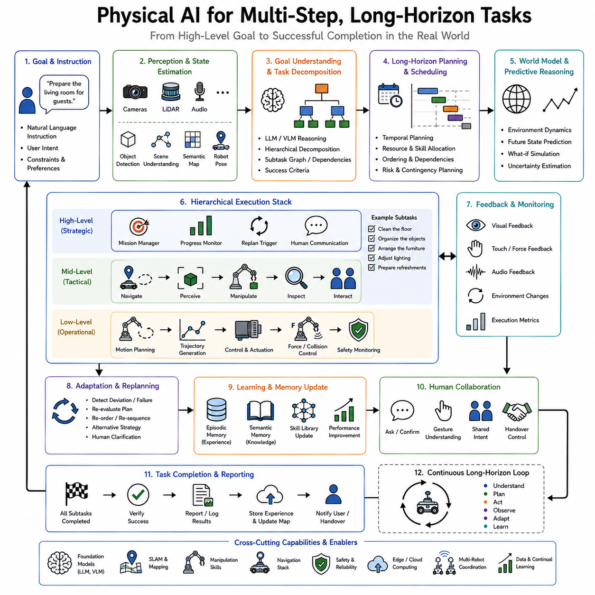{width="7.268055555555556in" height="7.268055555555556in"}

One of the defining characteristics of advanced Physical AI is its ability to accomplish multi-step, long-horizon tasks rather than isolated actions. Traditional robotic systems excel at executing individual motions such as grasping an object, navigating to a waypoint, or pressing a button. However, real-world intelligence rarely consists of isolated actions. Most practical objectives require dozens or hundreds of interconnected decisions extending over minutes, hours, or even days. Preparing a meal, organizing a warehouse, inspecting an industrial facility, assembling a machine, assisting hospital staff, maintaining infrastructure, or performing household chores all involve long sequences of perception, reasoning, planning, manipulation, navigation, communication, and continuous adaptation. Physical AI therefore extends robotics from reactive control toward persistent goal-oriented behavior capable of maintaining coherence across extended periods of execution.

The distinction between short-horizon and long-horizon behavior is fundamental. A short-horizon task generally involves a single objective that can be completed through one or a few actions. Examples include picking up an object, opening a door, moving to a specified location, or recognizing an item. These problems are often addressed using specialized perception models, grasp planners, navigation algorithms, or reinforcement learning policies. Long-horizon tasks, by contrast, require coordinating many individual skills while preserving awareness of the overall objective. Every intermediate action influences future opportunities, making planning, memory, reasoning, and adaptation equally important as motor control.

Consider a domestic robot instructed to "Prepare the living room for guests." This instruction does not specify individual motions. Instead, the robot must infer that the task may involve cleaning the floor, arranging furniture, collecting misplaced objects, organizing books, adjusting lighting, checking room temperature, and possibly preparing refreshments. Furthermore, these subtasks must be executed in an efficient order while responding to unexpected events such as blocked pathways, missing objects, human interruptions, or changing user requests. The robot\'s success depends not only on individual manipulation or navigation capabilities but also on maintaining consistent reasoning throughout the complete task.

Long-horizon behavior begins with goal understanding. Human instructions typically describe desired outcomes rather than execution procedures. Large Language Models provide the semantic reasoning necessary to interpret these goals and infer implicit constraints. A request such as "Prepare the laboratory for tomorrow\'s experiment" requires understanding laboratory organization, equipment preparation, safety procedures, inventory verification, and operational sequencing. The robot transforms a high-level objective into an internal representation suitable for planning while preserving flexibility for future adaptation.

Task decomposition represents the first major stage following goal interpretation. Large objectives are divided into smaller subtasks organized according to logical dependencies. Hierarchical Task Networks, symbolic planners, behavior trees, task graphs, and language-based reasoning systems all contribute to this decomposition process. Rather than attempting to solve an enormous planning problem directly, the robot constructs a hierarchy in which strategic objectives generate intermediate goals, and intermediate goals eventually produce executable motor actions. Hierarchical organization reduces computational complexity while improving explainability and modularity.

The hierarchy typically consists of several abstraction levels. At the highest level, the robot maintains the overall mission objective. The next level contains major subtasks such as navigation, object retrieval, manipulation, inspection, or communication. Below these appear procedural actions including grasp planning, obstacle avoidance, localization updates, force regulation, or visual inspection. Finally, low-level motor controllers generate joint trajectories, actuator commands, and force outputs. Each level communicates with adjacent layers while preserving a consistent representation of the overall mission.

Temporal reasoning becomes increasingly important as task duration grows. Long-horizon tasks frequently contain actions whose consequences appear much later during execution. A robot may need to charge its battery before beginning an extended delivery mission, organize tools before assembly begins, or unlock access points before transporting equipment. Such actions may appear unnecessary when viewed locally but become essential within the broader mission context. Physical AI therefore reasons not only about immediate rewards but also about delayed consequences extending far into the future.

Planning under long horizons differs significantly from conventional path planning. Instead of optimizing trajectories over seconds, the planner coordinates entire sequences of activities spanning multiple operational phases. Classical planning algorithms such as A\*, Dijkstra\'s algorithm, or Rapidly-exploring Random Trees remain valuable for local movement, but they become only one component of a much broader cognitive architecture. Long-horizon planning integrates symbolic reasoning, world models, reinforcement learning, optimization, probabilistic reasoning, and language understanding into unified decision-making processes.

One of the greatest challenges in long-horizon robotics is maintaining consistency across changing environments. During extended task execution, objects move, people intervene, lighting conditions change, equipment becomes unavailable, doors close, batteries discharge, network connections fluctuate, and priorities evolve. A robot cannot assume that its initial plan remains valid indefinitely. Instead, continual replanning becomes necessary whenever new observations contradict previous assumptions. Planning therefore becomes an ongoing process rather than a one-time computation.

Inner Monologue architectures provide an effective solution to this challenge. Rather than generating one static plan before execution, the robot continuously reasons about its progress through an internal language-based feedback loop. After every completed action, updated observations modify the reasoning context. The robot evaluates completed subtasks, identifies remaining objectives, detects unexpected events, and revises future actions accordingly. This continuous self-reflection enables adaptation without abandoning the overall mission objective.

World models further strengthen long-horizon reasoning by enabling internal simulation of future scenarios. Before committing to major decisions, the robot predicts possible consequences using learned environmental dynamics. Suppose a warehouse robot must retrieve products from several storage locations. Instead of greedily visiting the nearest shelf, the world model predicts future traffic congestion, battery consumption, loading constraints, and delivery deadlines. Such prediction enables globally efficient behavior rather than locally optimal but globally inefficient decisions.

Memory plays a central role throughout long-horizon execution. Working memory maintains immediate planning context, pending subtasks, recently observed environmental changes, and temporary variables. Episodic memory records completed actions, encountered failures, successful recovery strategies, and previous interaction history. Semantic memory stores knowledge regarding object functions, room layouts, organizational procedures, and domain-specific concepts. Procedural memory preserves learned motor skills and task execution strategies. Together these memory systems allow the robot to maintain coherent behavior throughout extended missions.

Retrieval-Augmented Generation significantly enhances memory utilization. Instead of relying exclusively upon information encoded within neural network parameters, the robot retrieves relevant knowledge dynamically from external databases. Operational manuals, maintenance procedures, previous mission reports, semantic maps, inventory databases, user preferences, and historical task executions become available whenever required. Long-horizon tasks frequently encounter situations beyond immediate experience, making external retrieval particularly valuable for maintaining accuracy and reducing hallucination.

Language serves as an important cognitive representation throughout long-horizon reasoning. Rather than maintaining only numerical state variables, the robot summarizes progress through structured natural language descriptions. Statements such as "Inspection of Building A is complete. Two damaged valves remain unresolved in Building B. Battery level permits approximately forty additional minutes of operation." provide interpretable intermediate reasoning that can be updated continuously. Language therefore functions as a shared cognitive workspace connecting perception, planning, memory, and communication.

Foundation Language Models contribute broad procedural knowledge supporting task decomposition and planning. They understand common workflows associated with cooking, cleaning, warehouse logistics, laboratory preparation, healthcare assistance, industrial maintenance, and countless other domains. This knowledge allows robots to infer missing intermediate steps even when human instructions remain incomplete. Instead of requiring engineers to specify every procedural detail explicitly, the robot reconstructs likely workflows through semantic reasoning grounded in environmental perception.

Vision-Language Models extend this reasoning into the physical world. During execution, visual observations are interpreted together with linguistic task descriptions. A robot instructed to "Collect all damaged packages" combines object detection, damage assessment, semantic understanding, and natural language reasoning into one integrated representation. Such multimodal grounding significantly improves long-horizon task execution because perception remains continuously aligned with mission objectives.

Reinforcement learning contributes another important capability by optimizing sequential decision making over extended time horizons. Classical reinforcement learning often struggles with sparse rewards because successful completion may occur only after dozens of intermediate actions. Hierarchical reinforcement learning addresses this limitation by assigning rewards to intermediate subtasks while preserving alignment with the final objective. Options, skills, macro-actions, and temporal abstraction all reduce learning complexity by allowing policies to operate over meaningful behavioral units rather than individual motor commands.

Skill libraries provide reusable building blocks supporting long-horizon execution. Navigation, grasping, opening doors, inspecting equipment, reading barcodes, communicating with humans, charging batteries, and operating elevators all become modular capabilities available whenever needed. Systems such as SayCan select appropriate skills according to semantic relevance and physical feasibility. Code as Policies extends this flexibility by generating new procedural combinations dynamically rather than relying exclusively upon predefined workflows.

Execution monitoring remains essential because even well-designed plans encounter unexpected failures. Manipulation attempts may fail due to object slippage. Navigation routes become blocked. Sensors produce uncertain observations. Human collaborators modify priorities unexpectedly. Rather than terminating execution, monitoring systems detect discrepancies between expected and observed outcomes. These discrepancies trigger replanning, alternative strategy selection, or human interaction while preserving the overall mission objective whenever possible.

Failure recovery distinguishes robust long-horizon systems from brittle automation. Consider an industrial inspection robot discovering that one inspection route has become inaccessible due to maintenance work. Instead of reporting failure immediately, the robot evaluates alternative routes, postpones inaccessible subtasks, continues inspecting reachable equipment, and returns later when conditions improve. Such adaptive behavior requires maintaining awareness of unresolved objectives while exploiting remaining operational opportunities.

Multi-agent coordination further expands long-horizon capability. Large tasks frequently exceed the capacity of individual robots. Warehouse operations, construction projects, agricultural harvesting, disaster response, and logistics systems require coordinated behavior among multiple autonomous platforms. Task allocation algorithms distribute subtasks according to robot capabilities, current locations, battery levels, and workload. Communication protocols synchronize progress while preventing duplication or resource conflicts. Collective planning therefore transforms individual robot intelligence into coordinated fleet intelligence.

Cloud robotics provides additional advantages by integrating long-term operational knowledge across robot fleets. Experiences collected during previous missions become available for future planning. Frequently encountered failures produce improved recovery strategies. Updated semantic maps reflect environmental changes observed by other robots. Fleet learning continuously refines task decomposition, planning heuristics, manipulation strategies, navigation policies, and operational procedures. Consequently, every robot benefits from the accumulated experience of the entire deployment rather than learning independently.

Digital twins play an increasingly important role in long-horizon task execution. High-fidelity virtual representations allow candidate plans to be evaluated before physical execution. Resource conflicts, scheduling problems, safety concerns, equipment failures, and environmental constraints become apparent within simulation before affecting real-world operations. Continuous synchronization between physical and digital environments enables predictive planning that remains responsive to changing operational conditions.

Energy management introduces another dimension to long-horizon planning. Extended missions require balancing productivity against available battery capacity, charging opportunities, and operational priorities. Intelligent scheduling may postpone energy-intensive subtasks until charging becomes available or reorder activities to minimize unnecessary travel. Energy-aware planning therefore becomes integrated directly into mission reasoning rather than treated as an independent subsystem.

Human collaboration remains fundamental throughout long-horizon operation. Humans frequently modify objectives, introduce additional constraints, request status updates, or reprioritize ongoing activities. Physical AI systems maintain interactive dialogue throughout execution rather than requiring complete mission restart whenever instructions change. The robot explains current progress, identifies unresolved issues, proposes alternatives, and incorporates updated objectives while preserving completed work whenever possible.

Safety becomes increasingly challenging as task complexity grows. Long missions expose robots to a greater variety of environmental conditions, hardware wear, communication interruptions, and human interactions. Continuous monitoring therefore evaluates localization confidence, obstacle proximity, sensor integrity, actuator health, thermal conditions, cybersecurity status, and policy compliance throughout execution. Safety supervisors may interrupt, modify, or postpone tasks whenever operational risk exceeds acceptable thresholds.

Evaluation of long-horizon task performance extends far beyond measuring individual action success. Researchers assess overall task completion rate, planning efficiency, subtask completion accuracy, adaptation speed, recovery effectiveness, memory utilization, computational efficiency, collaboration quality, human satisfaction, energy consumption, robustness under uncertainty, safety, and long-term operational reliability. A robot capable of completing isolated manipulation actions perfectly but failing to coordinate them toward meaningful objectives remains inadequate for real-world deployment.

Current research increasingly combines foundation models, world models, hierarchical reinforcement learning, lifelong learning, cloud robotics, retrieval-augmented reasoning, multimodal perception, and embodied cognition into unified architectures supporting persistent autonomous behavior. Rather than treating planning, perception, manipulation, navigation, and communication as isolated modules, future Physical AI systems integrate them into coherent cognitive processes capable of maintaining consistent objectives across extended periods of operation.

The ultimate vision of long-horizon Physical AI is an autonomous embodied agent capable of receiving broad human goals, reasoning about their implications, planning adaptive strategies, executing coordinated behaviors, recovering from failures, collaborating naturally with humans and other robots, learning continuously from experience, and maintaining coherent objective-directed behavior throughout hours, days, or even months of deployment. Such systems move beyond executing isolated robotic skills toward performing complete real-world missions requiring intelligence, persistence, flexibility, and continual adaptation.

Physical AI for multi-step long-horizon tasks therefore represents far more than advanced planning or sequential decision making. It is the complete integration of language understanding, perception, world modeling, memory, reasoning, hierarchical planning, navigation, manipulation, execution monitoring, continual learning, and human collaboration into a unified cognitive architecture capable of transforming high-level intentions into successful long-duration real-world outcomes. Long-horizon task completion demonstrates one of the clearest distinctions between narrow automation and truly embodied artificial intelligence because it requires the robot not merely to perform individual actions correctly but to sustain purposeful, adaptive, and intelligent behavior across extended periods while continuously aligning every intermediate decision with the ultimate human objective.

## 09.09 Physical AI Failure Recovery and Replanning [w/Code]

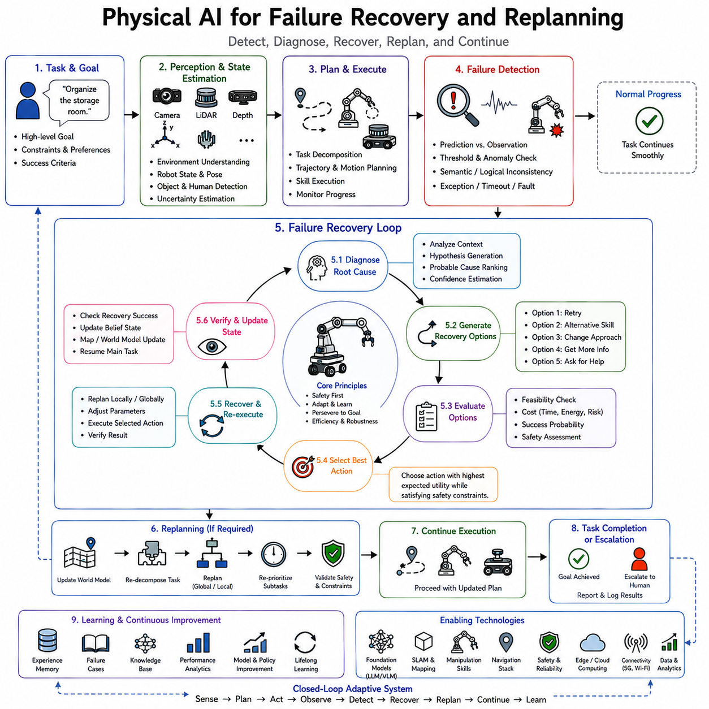{width="7.268055555555556in" height="7.268055555555556in"}

Failure recovery and replanning are among the most important capabilities distinguishing Physical AI from conventional automation. Traditional robotic systems generally assume that plans generated before execution remain valid throughout the task. When unexpected events occur, execution often terminates with an error message, requiring human intervention before work can continue. In carefully engineered industrial environments, such behavior may be acceptable because failures are relatively rare and operators remain nearby. However, autonomous robots operating in homes, hospitals, warehouses, factories, farms, construction sites, and public environments cannot depend upon constant human supervision. Real-world environments are dynamic, uncertain, and continuously changing. Objects move unexpectedly, sensors produce noisy observations, people interrupt workflows, equipment becomes unavailable, communication networks fluctuate, batteries discharge, and physical interactions often differ from predictions. Consequently, Physical AI must treat failures not as exceptional events but as normal components of intelligent behavior. A truly autonomous robot must detect failures, understand their causes, generate alternative strategies, recover safely, and continue pursuing its objectives whenever possible.

The importance of failure recovery becomes evident when considering the complexity of long-horizon robotic tasks. A robot preparing a hospital room, organizing a warehouse, assembling equipment, delivering supplies, or inspecting industrial infrastructure may execute hundreds of individual actions before completing the mission. Even if every action succeeds with a probability of ninety-nine percent, the probability that the entire mission finishes without a single error decreases dramatically as task length increases. Long-duration autonomy therefore depends not upon eliminating every possible failure but upon recovering effectively whenever failures inevitably occur.

Failure itself is a broad concept encompassing many different situations. Some failures originate from perception. The robot may misidentify an object, lose visual tracking, estimate an incorrect pose, or fail to detect an obstacle. Other failures arise from manipulation, including unstable grasps, object slippage, excessive contact forces, failed insertions, or collisions during movement. Navigation failures include localization drift, blocked pathways, inaccurate maps, unexpected environmental changes, or dynamic obstacles preventing planned motion. System failures involve communication interruptions, hardware malfunctions, overheating, battery depletion, memory limitations, or software exceptions. Human-related failures occur when users change objectives, provide ambiguous instructions, interrupt execution, or physically modify the environment during task performance. Physical AI must recognize that different categories of failure require different recovery strategies rather than relying upon a single generic error-handling mechanism.

The first stage of recovery is failure detection. Before correcting a problem, the robot must recognize that something has gone wrong. Traditional robotics often relies on explicit threshold monitoring. Position errors exceeding predefined limits, excessive motor currents, force violations, timeout events, or communication losses trigger alarms. While these methods remain valuable, Physical AI extends failure detection through multimodal reasoning. Instead of monitoring isolated numerical values, the robot evaluates consistency among perception, prediction, execution, and expected outcomes. If the robot believes it has grasped an object but vision indicates that the object remains on the table, the inconsistency itself becomes evidence of failure. Likewise, if navigation predicts arrival at a destination but environmental observations do not match the expected scene, localization errors become likely.

Predictive models play an increasingly important role in failure detection. World models estimate the expected consequences of every action before execution. After the action completes, actual observations are compared against these predictions. Small discrepancies may result from sensor noise or minor environmental variation, whereas large deviations suggest unsuccessful execution or incorrect environmental understanding. This prediction-observation comparison resembles biological cognition, where humans continuously compare expected sensory outcomes with actual experience to detect mistakes rapidly.

Uncertainty estimation significantly improves failure recognition. Modern perception systems increasingly estimate confidence alongside predictions. Object detectors report classification probabilities, localization algorithms estimate covariance, grasp planners evaluate execution likelihood, and language models quantify reasoning uncertainty. Rather than treating every output as equally reliable, Physical AI combines these confidence estimates to determine whether observed inconsistencies likely represent genuine failures or simply uncertain observations requiring additional information. High uncertainty often triggers active perception before more expensive recovery actions begin.

Once a failure has been detected, the robot must diagnose its cause. Simply recognizing that execution failed is insufficient because appropriate recovery depends upon understanding why the failure occurred. Consider a failed grasp. The object may have been incorrectly localized, physically inaccessible, too heavy, slippery, occluded, or already moved by another person. Each explanation suggests different corrective actions. Repeating the identical grasp without diagnosis rarely improves success. Physical AI therefore performs causal reasoning to identify the most plausible explanation underlying observed failure.

Causal reasoning distinguishes modern recovery systems from simple retry mechanisms. Rather than repeatedly executing identical actions, the robot constructs hypotheses explaining observed discrepancies. For example, if navigation repeatedly fails to reach a destination, possible explanations include blocked corridors, inaccurate maps, localization drift, actuator malfunction, or incorrect goal interpretation. Additional observations are collected to discriminate among these competing hypotheses. The resulting diagnosis guides subsequent replanning rather than relying upon blind repetition.

Language-based reasoning has become particularly valuable during diagnosis. Large Language Models integrate operational history, environmental observations, task context, and prior knowledge into coherent explanations. The robot may internally reason, "The requested object was expected on Shelf A, but the shelf is empty. Inventory records indicate recent relocation. Searching neighboring shelves is more likely to succeed than repeating the same inspection." Such reasoning extends beyond statistical pattern recognition by incorporating semantic understanding and procedural knowledge acquired during pretraining.

Inner Monologue architectures naturally support diagnostic reasoning. Instead of treating failure as a terminal condition, the robot continuously reflects upon execution progress through an internal language-based dialogue. Following an unsuccessful manipulation attempt, the reasoning loop may produce statements such as, "The object slipped after lifting. Visual observations suggest insufficient grasp stability. Increasing grip force slightly while reducing lifting speed may improve success." This internal reflection allows the robot to transform failures into informative experiences supporting adaptive behavior rather than simple error reporting.

After diagnosis, replanning becomes the central recovery mechanism. Replanning differs fundamentally from repeating previous actions because it modifies future behavior according to newly acquired information. If the original plan assumed that a door remained open but the door is now closed, continuing along the previous route becomes impossible. Replanning incorporates updated environmental observations, revised constraints, and diagnosed failure causes to generate an alternative strategy consistent with the current situation.

Replanning operates at multiple levels of abstraction. Local replanning modifies immediate motion trajectories while preserving higher-level objectives. For example, obstacle avoidance computes a new path around a temporary obstruction without changing the destination. Task-level replanning reorganizes action sequences, possibly performing subtasks in a different order. Strategic replanning revises the overall mission when fundamental assumptions become invalid. A warehouse robot discovering unavailable inventory may substitute alternative products, postpone deliveries, or request human assistance depending upon operational priorities. The appropriate replanning level depends upon the severity and scope of the detected failure.

Hierarchical planning architectures greatly facilitate recovery because modifications often remain localized within particular abstraction levels. Low-level motion failures rarely require changing strategic mission objectives. Conversely, major mission changes need not alter individual motor controllers. Maintaining clear separation among strategic planning, task decomposition, motion generation, and control allows failures to be corrected efficiently without unnecessarily recomputing unrelated components of the execution pipeline.

World models substantially enhance replanning by supporting internal simulation of alternative strategies. Rather than immediately executing the first available recovery action, the robot predicts likely outcomes for multiple candidate plans before selecting one. Suppose a corridor becomes blocked. The world model evaluates alternative routes according to travel time, battery consumption, predicted congestion, accessibility, and task priorities. Internal simulation therefore reduces unnecessary experimentation while improving recovery quality under uncertainty.

Memory provides another critical resource during recovery. Episodic memory records previous failures together with successful corrective actions. If the robot encounters a familiar situation, historical experience suggests effective recovery strategies immediately. Semantic memory stores operational procedures, troubleshooting knowledge, equipment specifications, and organizational policies relevant to diagnosis. Retrieval-Augmented Generation further extends this capability by consulting maintenance manuals, knowledge bases, inventory systems, historical reports, or cloud-hosted documentation whenever unfamiliar failures occur. Memory therefore transforms isolated incidents into cumulative operational expertise.

Learning from failure represents one of the defining characteristics of Physical AI. Conventional automation often treats failures as isolated anomalies resolved manually before normal operation resumes. Physical AI instead incorporates every failure into continual learning processes. Perception models improve through additional supervision. Manipulation policies refine grasp strategies. Navigation systems update maps. Language models incorporate corrected reasoning patterns. Fleet learning distributes successful recovery experiences across multiple robots. Consequently, repeated exposure to similar situations gradually reduces future failure frequency while improving recovery efficiency.

Reinforcement learning contributes naturally to recovery because unsuccessful outcomes provide informative learning signals. Reward functions penalize repeated failures while encouraging robust recovery strategies. Simulation environments allow millions of failure scenarios to be explored safely before deployment, enabling policies to develop effective corrective behaviors under diverse operational conditions. Domain randomization exposes recovery algorithms to varying environmental configurations, sensor characteristics, and dynamic interactions, improving transfer from simulation to physical robots.

Imitation learning complements reinforcement learning by capturing expert recovery behavior. Human operators frequently demonstrate how to respond when manipulation fails, localization becomes uncertain, or unexpected obstacles appear. Robots observe these demonstrations through teleoperation, kinesthetic teaching, virtual reality, or video datasets. Learned recovery policies subsequently generalize these strategies across novel situations while preserving human expertise within autonomous behavior.

Cloud robotics extends recovery beyond individual robots. Experiences collected by one robot become valuable resources for the entire fleet. Suppose a newly deployed warehouse robot discovers that a particular loading dock frequently becomes inaccessible during afternoon deliveries. This observation is uploaded to centralized cloud infrastructure, where planning models update accordingly. Other robots subsequently avoid the problematic route before encountering the same issue. Fleet-wide knowledge sharing therefore transforms individual recovery experiences into collective intelligence.

Digital twins further improve failure recovery by enabling hypothetical evaluation before physical execution. Candidate recovery strategies are first tested within synchronized virtual environments representing the current physical state. Simulated evaluation identifies unsafe actions, resource conflicts, inefficient plans, or logical inconsistencies without risking equipment damage or operational interruption. Once validated, the selected recovery strategy transfers to the physical robot with substantially greater confidence.

Human collaboration remains important during complex recovery situations. While Physical AI aims for increasing autonomy, some failures involve ambiguity exceeding the robot\'s current reasoning capability. Rather than terminating operation, the robot engages in intelligent dialogue with human supervisors. It explains the detected problem, summarizes attempted recovery strategies, requests clarification when necessary, and incorporates human feedback into subsequent planning. Natural language interaction therefore becomes an integral component of recovery rather than merely an emergency communication channel.

Instruction revision represents a particularly interesting form of recovery. Human objectives frequently evolve during long-horizon execution. A user may initially request one task before introducing additional constraints or changing priorities entirely. Rather than viewing these changes as interruptions, Physical AI treats them as updated planning inputs. Existing progress is preserved whenever possible, while future actions adapt according to revised objectives. Flexible instruction interpretation therefore prevents unnecessary task restarts while improving human-robot collaboration.

Safety remains the highest priority throughout recovery. Some failures indicate conditions requiring immediate operational interruption rather than continued execution. Excessive collision forces, unstable localization, sensor malfunction, hardware overheating, cybersecurity violations, or unexpected human proximity may all trigger safe shutdown procedures. Recovery planning therefore operates within strict safety constraints ensuring that attempts to correct failures never introduce greater risks than the original problem itself.

Explainability significantly improves trust during failure recovery. Since recovery decisions often involve complex reasoning, robots increasingly communicate detected failures, diagnostic conclusions, selected recovery strategies, and expected outcomes through natural language. Operators understand not only what the robot intends to do but why alternative strategies were rejected. Such transparency facilitates debugging, certification, regulatory compliance, and human supervision while strengthening confidence in autonomous decision making.

Evaluation of recovery systems extends beyond measuring task completion alone. Researchers assess failure detection accuracy, diagnostic precision, replanning efficiency, recovery success rate, computational latency, safety preservation, human intervention frequency, robustness under uncertainty, learning improvement across repeated failures, fleet knowledge transfer, and long-term operational reliability. A successful recovery system minimizes both immediate task disruption and future recurrence of similar failures through continual adaptation.

Recent research increasingly combines foundation models, world models, retrieval-augmented reasoning, continual learning, cloud robotics, digital twins, multimodal perception, and embodied cognition into integrated recovery architectures. Rather than implementing isolated error handlers for specific situations, future Physical AI systems develop generalized reasoning capabilities applicable across diverse failure categories. Recovery becomes an intelligent cognitive process integrating perception, prediction, memory, planning, language understanding, and learning within unified embodied architectures.

Ultimately, failure recovery and replanning transform Physical AI from reactive automation into resilient autonomous intelligence. Real-world environments cannot be perfectly predicted, and failures cannot be eliminated completely. The defining characteristic of an intelligent embodied system is therefore not the absence of mistakes but the ability to recognize them, understand their causes, generate effective alternatives, learn from experience, and continue pursuing meaningful objectives despite uncertainty. By integrating continuous monitoring, causal diagnosis, adaptive replanning, world models, lifelong learning, cloud collaboration, and human interaction into a coherent cognitive framework, Physical AI demonstrates the resilience required for long-term autonomous operation in complex, dynamic, and unpredictable physical environments. Failure thus becomes not merely an obstacle to overcome but an essential source of experience driving continual improvement throughout the robot\'s operational lifetime.

## 09.10 Physical AI Application Benchmarking ALFRED [w/Code]

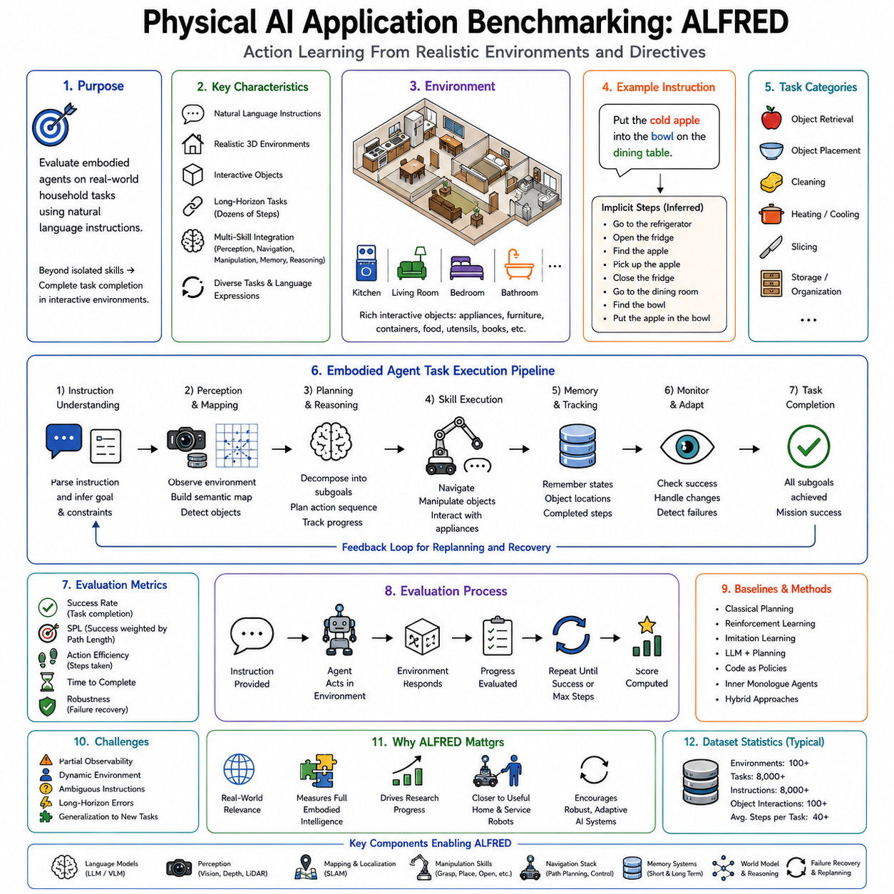{width="7.268055555555556in" height="7.268055555555556in"}

As Physical AI systems become increasingly capable of perception, reasoning, planning, manipulation, navigation, and language understanding, the question naturally arises: how should these systems be evaluated? Traditional robotics benchmarks often measure isolated capabilities such as object recognition accuracy, localization error, navigation efficiency, grasp success rate, or manipulation precision. Although these metrics remain important, they fail to capture the integrated intelligence required for real-world autonomous robots. A robot that excels at recognizing objects may still fail to complete a household task because it cannot remember previous actions, interpret human instructions, recover from unexpected failures, or coordinate multiple skills over extended periods. Consequently, modern Physical AI requires benchmarks that evaluate complete embodied intelligence rather than individual components. One of the most influential benchmarks developed for this purpose is ALFRED, which focuses on language-guided long-horizon embodied task execution within interactive environments.

ALFRED, which stands for **Action Learning From Realistic Environments and Directives**, was introduced to bridge the gap between traditional robotic benchmarks and real-world embodied intelligence. Rather than evaluating isolated perception or manipulation algorithms, ALFRED measures whether an autonomous agent can successfully understand natural language instructions, perceive its surroundings, manipulate objects, navigate through environments, remember intermediate task states, and complete complex household activities requiring many coordinated actions. The benchmark therefore represents one of the earliest comprehensive evaluations of integrated Physical AI rather than narrow robotic competence.

The motivation behind ALFRED reflects an important observation about human intelligence. Everyday household activities appear simple because humans perform them effortlessly, yet they require remarkable coordination among perception, memory, reasoning, language understanding, and motor control. Consider the instruction, "Put the cold apple into the bowl on the dining table." Completing this task requires locating the refrigerator, opening its door, identifying the apple, grasping it, closing the refrigerator, navigating to the dining room, finding the correct bowl, placing the apple inside, and verifying successful completion. Every intermediate action depends upon previous observations and influences future decisions. Such tasks illustrate why integrated embodied intelligence is substantially more difficult than solving individual perception or navigation problems independently.

Unlike many classical robotics benchmarks, ALFRED is task-centered rather than capability-centered. The objective is not maximizing isolated perception accuracy or minimizing navigation error. Instead, the benchmark evaluates complete task completion under realistic environmental conditions. Success depends upon the coordinated interaction of perception, navigation, manipulation, memory, planning, language understanding, and reasoning throughout extended execution. Consequently, ALFRED aligns closely with the long-term goals of Physical AI, where autonomous systems must accomplish meaningful objectives rather than demonstrating isolated technical capabilities.

The benchmark is built upon realistic indoor environments containing kitchens, living rooms, bedrooms, bathrooms, and other household spaces. These environments include furniture, appliances, cabinets, drawers, tables, containers, utensils, food items, books, electronics, cleaning supplies, and numerous other everyday objects. Importantly, these objects are not static decorations. They possess interactive properties allowing robots to open, close, pick up, place, heat, cool, clean, slice, toggle, or otherwise manipulate them according to task requirements. This interactive richness distinguishes ALFRED from passive visual recognition datasets because successful task execution requires meaningful physical interaction with the environment.

Language instructions form the starting point for every task. Instead of receiving symbolic goal specifications or predefined action sequences, the agent receives natural language directives describing desired outcomes. These instructions vary in complexity and often omit procedural details that humans naturally infer through common sense. For example, the instruction "Put a clean mug on the counter" does not explicitly mention locating a dirty mug, finding a sink, washing it, drying it, and transporting it to the counter. The benchmark therefore evaluates whether embodied agents can reconstruct missing procedural knowledge while remaining grounded in physical environmental observations.

Task diversity constitutes another important characteristic of ALFRED. Rather than repeating identical manipulation sequences, the benchmark contains numerous categories of household activities involving navigation, object retrieval, placement, cleaning, heating, cooling, slicing, storage, organization, and appliance interaction. Individual tasks differ in object categories, environmental layouts, interaction sequences, and language expressions. This diversity prevents systems from simply memorizing fixed procedures and instead encourages genuine generalization across novel combinations of environments, objects, and instructions.

Long-horizon reasoning represents one of ALFRED\'s defining challenges. Many benchmark tasks require dozens of sequential actions before completion. Intermediate decisions influence later opportunities, while mistakes propagate throughout execution. Forgetting a previously opened cabinet, leaving an object behind, or failing to close an appliance may eventually prevent successful task completion. Consequently, the benchmark evaluates persistent goal-directed behavior extending across many interaction steps rather than isolated action selection.

Memory therefore becomes indispensable. Agents must remember previously visited locations, object identities, completed subtasks, environmental changes, and intermediate goals. Working memory maintains current execution context, while episodic memory records interaction history throughout the task. Semantic memory contributes common-sense knowledge regarding household objects and procedures. Without effective memory mechanisms, long-horizon task execution deteriorates because earlier observations become unavailable when later decisions require them.

Navigation within ALFRED extends beyond geometric movement. The robot must identify semantically meaningful locations described through natural language rather than explicit coordinates. Instructions such as "Go to the refrigerator," "Find the microwave," or "Locate the sink" require integrating language understanding with visual perception and semantic mapping. Navigation therefore becomes tightly coupled with environmental understanding rather than operating as an independent subsystem.

Manipulation similarly involves far more than grasping. The benchmark requires opening cabinets, closing doors, placing objects into containers, retrieving hidden items, activating appliances, washing objects, heating food, cooling beverages, slicing ingredients, and organizing household spaces. Successful execution demands coordinated interaction among perception, motion planning, grasp generation, force control, object state estimation, and environmental reasoning. Every manipulation action changes the environment, requiring continuous updates to the robot\'s internal world representation.

Object state tracking introduces another important challenge. Household objects frequently change state during task execution. A microwave changes from closed to open. Food becomes heated. A refrigerator cools stored objects. Containers become filled or emptied. Doors change accessibility. The benchmark therefore evaluates whether agents maintain accurate internal models describing dynamic environmental states throughout long task sequences. State tracking is essential because future decisions frequently depend upon previous interactions rather than current visual observations alone.

Partial observability further increases task difficulty. Robots cannot observe the complete environment simultaneously. Objects hidden inside cabinets remain invisible until doors are opened. Containers obscure their contents. Occlusions prevent direct perception of distant areas. Consequently, agents must actively explore their environments while maintaining hypotheses regarding unseen regions. Exploration therefore becomes integrated with task execution rather than functioning as an independent mapping activity.

The benchmark also emphasizes grounded language understanding. Natural language descriptions reference object attributes including color, size, material, function, location, and relational properties. Expressions such as "the mug beside the coffee machine" or "the apple inside the refrigerator" require combining linguistic reasoning with visual grounding. Vision-Language Models have significantly improved performance by learning shared representations connecting textual descriptions with visual observations, enabling more robust object identification under diverse environmental conditions.

Planning plays a central role because tasks frequently contain implicit dependencies. A robot cannot place an object into a closed drawer before opening it. Food cannot be heated without locating the microwave first. Objects hidden inside cabinets require exploration before retrieval. Such dependencies require hierarchical reasoning extending beyond reactive behavior. Modern approaches increasingly combine symbolic planning, Large Language Models, world models, and reinforcement learning to generate coherent long-horizon strategies satisfying these procedural constraints.

Large Language Models have substantially influenced research on ALFRED. Earlier approaches relied primarily on supervised imitation learning trained directly from demonstration trajectories. While effective within limited distributions, these methods often struggled with novel task combinations requiring procedural reasoning. Foundation language models contribute broad common-sense knowledge regarding household activities, allowing agents to infer intermediate actions absent from explicit supervision. Systems such as SayCan, Code as Policies, and Inner Monologue naturally extend toward ALFRED-style tasks by integrating language reasoning with embodied execution.

Inner Monologue architectures prove particularly valuable because ALFRED tasks frequently require continual replanning. During execution, unexpected observations invalidate previous assumptions. A requested object may already have been moved, an expected container may be unavailable, or navigation routes may become blocked. Rather than following static plans blindly, the reasoning loop continuously updates task understanding according to current observations. Such adaptive reasoning significantly improves robustness during long-horizon embodied interaction.

Code as Policies likewise addresses several benchmark challenges. Instead of selecting predefined action sequences, language models generate executable procedures dynamically using perception, navigation, and manipulation APIs. Procedural generation naturally handles loops, conditionals, retries, and recovery strategies required by long household tasks. Consequently, code generation provides greater flexibility than fixed behavior libraries when solving diverse ALFRED scenarios.

Failure recovery remains another major evaluation dimension. Since many benchmark tasks involve extended action sequences, occasional failures become inevitable. Successful agents detect unsuccessful grasps, blocked navigation paths, incorrect object identification, or unsuccessful appliance interactions before replanning accordingly. Recovery behavior distinguishes robust embodied intelligence from brittle automation because real household environments rarely proceed exactly as expected.

World models provide increasingly powerful support for benchmark performance. Rather than reacting solely to current observations, world models maintain predictive representations describing environmental dynamics, object relationships, spatial layouts, and future consequences of candidate actions. Such prediction enables more efficient exploration, proactive planning, and reduced trial-and-error execution throughout long-horizon tasks. Predictive simulation becomes especially valuable whenever multiple alternative strategies appear plausible.

Reinforcement learning contributes another perspective by optimizing sequential decision making over extended horizons. Sparse reward structures characteristic of ALFRED motivate hierarchical reinforcement learning, curriculum learning, auxiliary objectives, and self-supervised representation learning. Simulation environments enable millions of training interactions impossible to collect physically, while domain randomization improves policy generalization across diverse household layouts and object configurations.

Imitation learning remains highly influential because benchmark datasets include expert demonstrations illustrating successful task execution. Agents learn procedural behavior directly from human-generated trajectories before refining policies through additional optimization. Recent approaches increasingly combine imitation learning with foundation models, reinforcement learning, and language reasoning to leverage complementary strengths rather than relying upon any individual learning paradigm exclusively.

Although ALFRED operates primarily within simulated environments, its conceptual significance extends well beyond simulation. The benchmark captures many challenges encountered by real domestic service robots, hospital assistants, warehouse systems, and collaborative mobile manipulators. Long-horizon planning, semantic grounding, multimodal perception, continual memory, adaptive reasoning, failure recovery, and integrated manipulation all remain essential for practical deployment. Consequently, research developed using ALFRED frequently transfers conceptually to broader Physical AI applications despite differences between simulated and physical environments.

Evaluation metrics within ALFRED extend beyond simple action accuracy. Task success measures whether the complete objective has been achieved rather than whether intermediate actions match demonstration trajectories exactly. Goal-condition success evaluates whether the final environmental state satisfies requested objectives. Path efficiency measures unnecessary exploration or redundant movement. Additional metrics consider subgoal completion, execution length, interaction efficiency, and procedural correctness. Such comprehensive evaluation reflects the integrated nature of embodied intelligence rather than isolated algorithmic performance.

The benchmark also highlights the importance of generalization. Training and evaluation environments differ intentionally to prevent memorization of specific layouts or trajectories. Successful agents must transfer learned reasoning strategies across unfamiliar rooms, novel object arrangements, and previously unseen language instructions. Generalization remains one of the defining goals of Physical AI because practical robots cannot rely upon exhaustive prior exposure to every possible deployment environment.

Cloud robotics and fleet learning further extend concepts introduced by ALFRED. Experiences collected by multiple robots operating within diverse households or facilities contribute toward continually improving perception models, planning strategies, semantic representations, and recovery policies. Collective learning transforms isolated benchmark performance into persistent operational intelligence applicable across large-scale deployments. Future benchmarking will likely evaluate not only individual robot performance but also the ability of robot fleets to accumulate and share embodied knowledge over time.

Recent developments increasingly integrate multimodal foundation models, Vision-Language-Action architectures, world models, retrieval-augmented reasoning, lifelong learning, and cloud robotics into systems evaluated using ALFRED-like tasks. Rather than solving navigation, manipulation, perception, and planning separately, modern embodied AI systems seek unified representations supporting complete end-to-end task execution. This trend closely aligns with the broader vision of Physical AI, where intelligence emerges through coordinated interaction among all cognitive and physical subsystems.

Although newer embodied AI benchmarks such as BEHAVIOR, Habitat, CALVIN, LIBERO, Open X-Embodiment, and RoboCasa continue to expand evaluation capabilities, ALFRED remains historically significant because it established one of the first comprehensive frameworks emphasizing language-guided, long-horizon, embodied household intelligence. Many ideas now considered fundamental---including integrated perception, semantic grounding, long-term memory, hierarchical planning, adaptive reasoning, and multi-step task completion---received broad attention through research motivated by ALFRED.

Physical AI application benchmarking through ALFRED therefore represents much more than evaluating robotic task performance. It provides a comprehensive framework for measuring whether embodied intelligent systems can understand human language, perceive dynamic environments, reason over long time horizons, coordinate navigation and manipulation, recover from failures, maintain coherent internal representations, and ultimately transform natural language instructions into successful real-world task completion. By shifting evaluation from isolated technical components toward integrated embodied intelligence, ALFRED helped establish one of the conceptual foundations upon which modern Physical AI research continues to build, guiding the development of increasingly capable autonomous systems designed not merely to execute actions but to accomplish meaningful human-centered objectives within complex physical environments.
