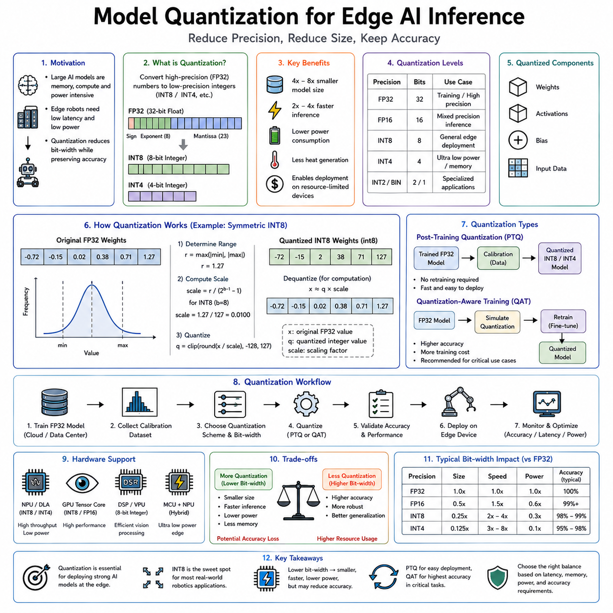
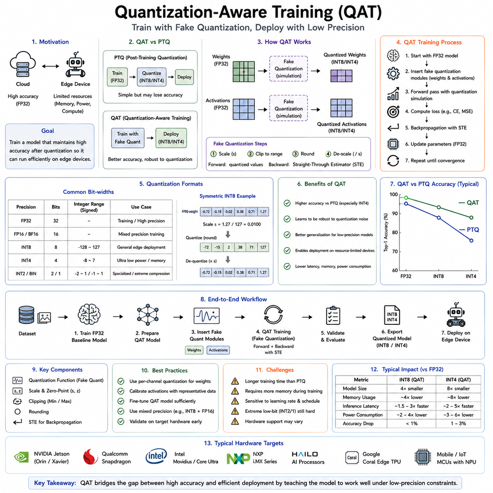
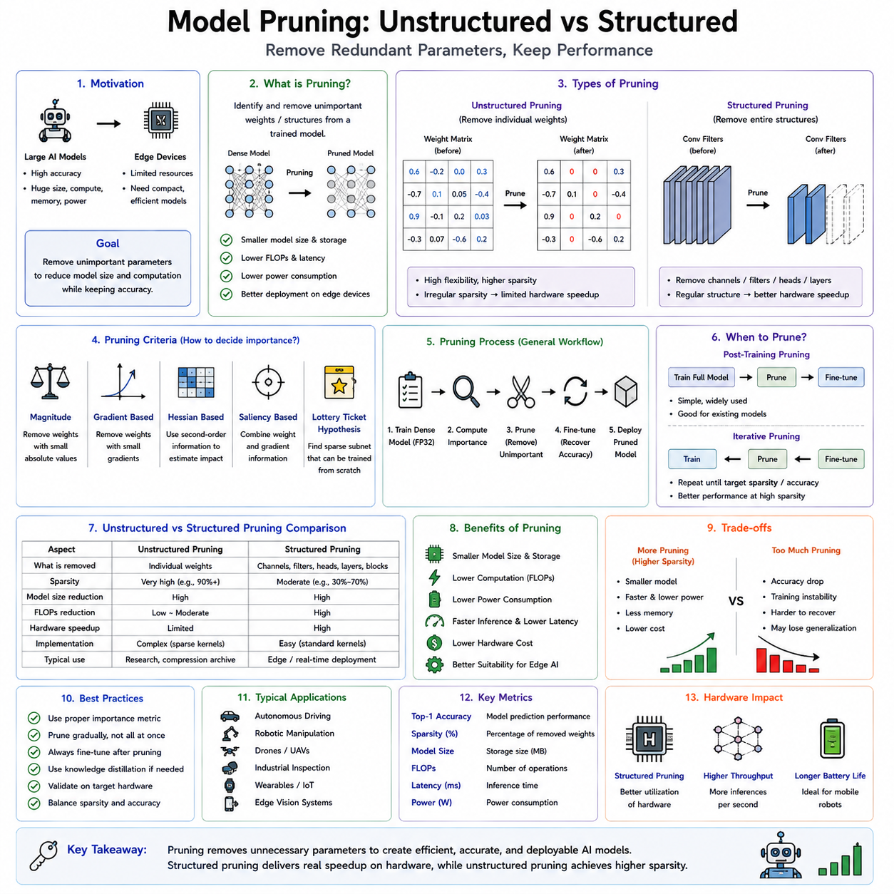
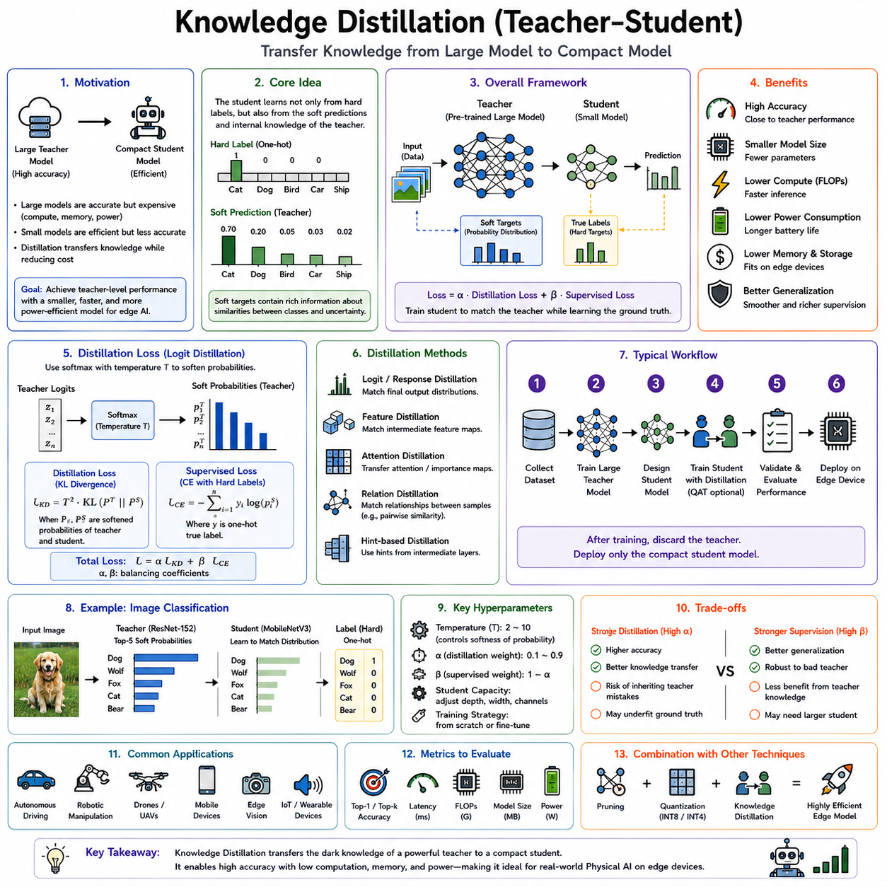
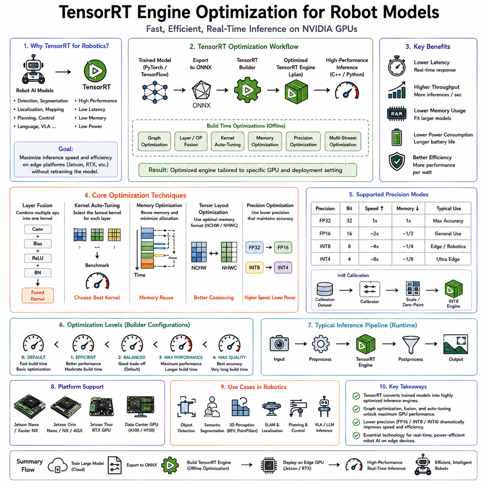
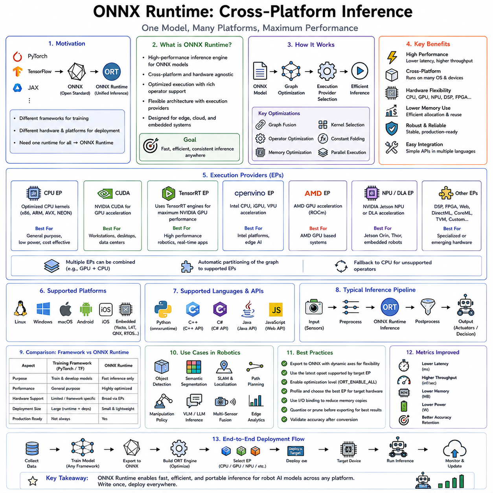
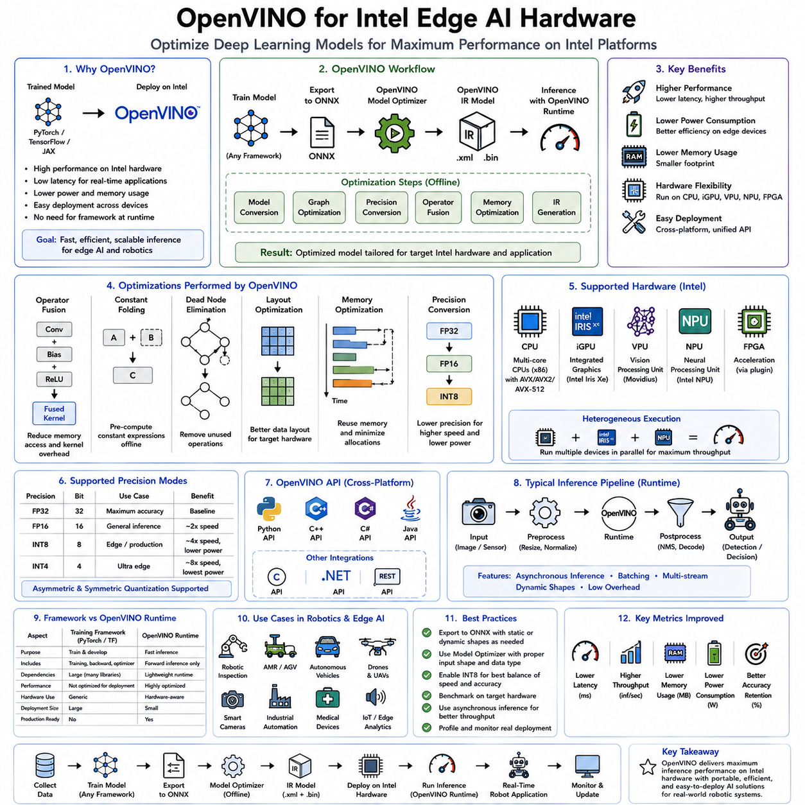
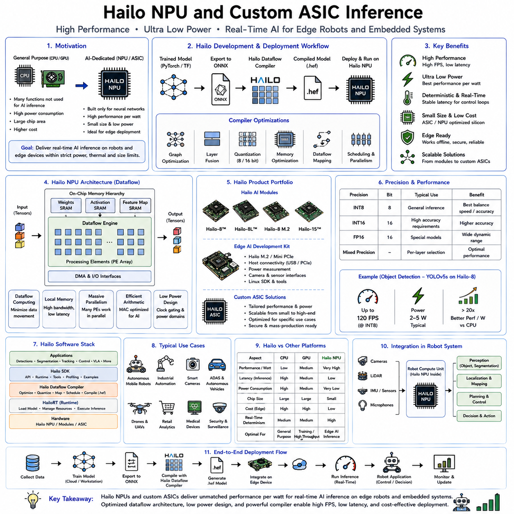
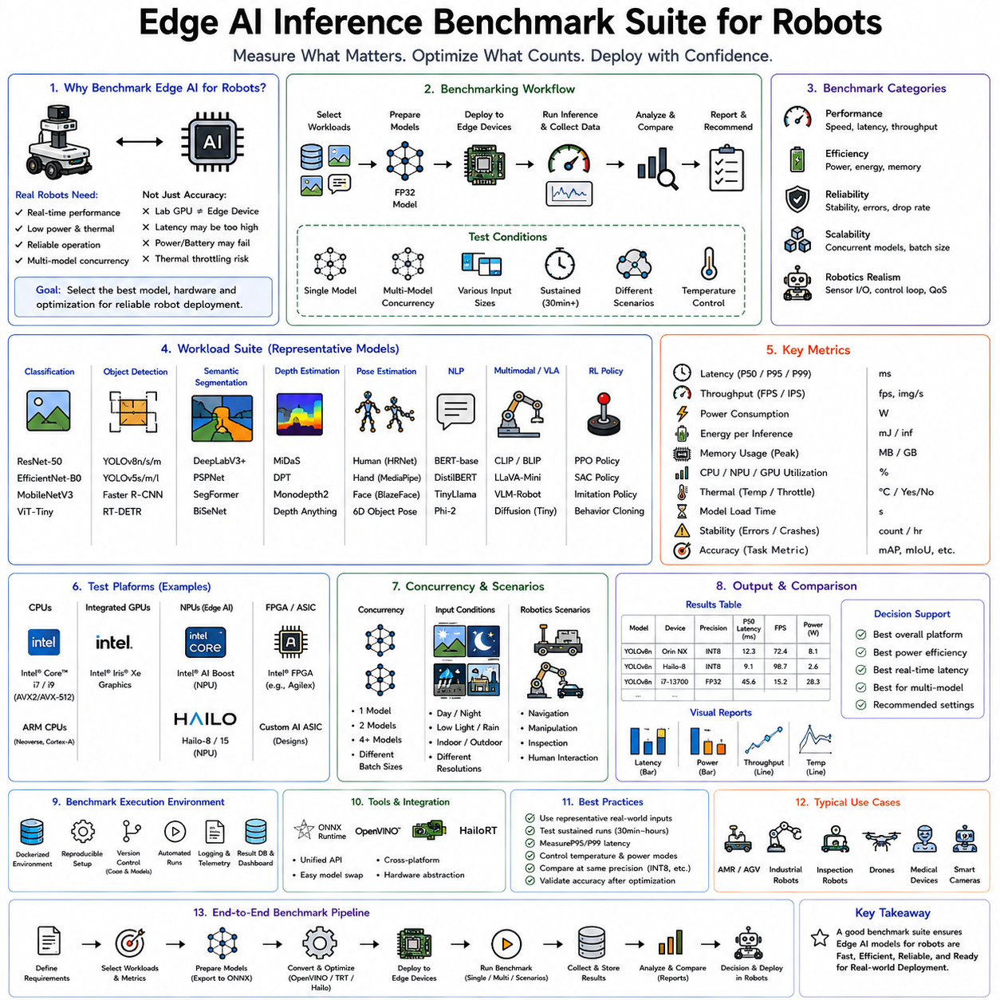

**Volume 19 Robot Machine Learning and AI**

# 10. Edge AI Inference Optimization

## 10.01 Edge AI Inference Requirements Latency Memory Power

{width="7.268055555555556in" height="7.268055555555556in"}

Edge AI has become one of the foundational technologies enabling Physical AI because intelligent robots must make decisions directly within the physical world under strict real-time constraints. While cloud computing provides enormous computational resources for large-scale model training, simulation, digital twins, and fleet learning, many robotic decisions cannot depend on remote servers. A mobile robot navigating through pedestrians, an autonomous vehicle avoiding collisions, a robotic manipulator grasping fragile objects, or a medical robot assisting a surgeon must react within milliseconds. Delays introduced by network communication, cloud processing, or unreliable connectivity may result in degraded performance or even unsafe behavior. Consequently, inference---the process of executing trained AI models---must increasingly occur on edge computing devices located directly on or near the robot. Edge AI therefore represents the operational foundation that allows Physical AI systems to perceive, reason, and act autonomously in real time.

The distinction between AI training and AI inference is fundamental. Training requires enormous computational resources because millions or billions of model parameters are optimized through repeated exposure to massive datasets. This process typically occurs in cloud data centers equipped with powerful GPU clusters or specialized AI accelerators. Inference, by contrast, applies the trained model to new observations in order to generate predictions or decisions. Although inference requires far fewer computations than training, it must satisfy stringent requirements regarding response time, memory usage, reliability, energy consumption, and hardware efficiency. For autonomous robots operating continuously in dynamic environments, inference performance directly determines operational capability.

Unlike cloud servers, edge computing devices operate under significant hardware constraints. Embedded processors provide limited computational throughput, memory capacity, thermal dissipation, electrical power, physical volume, and economic cost. Every additional watt increases battery consumption. Every additional gigabyte of memory increases hardware complexity and expense. Every millisecond of processing delay reduces responsiveness. Consequently, successful Edge AI requires careful balancing of computational accuracy against practical deployment constraints rather than maximizing predictive performance alone.

Latency represents one of the most important design requirements for edge inference. Latency refers to the elapsed time between receiving an input and producing a usable output. In robotics, latency determines how rapidly perception influences action. If a robot observes an approaching obstacle but requires several hundred milliseconds to generate a navigation decision, the obstacle may already have moved substantially before the response becomes available. Similarly, a robotic manipulator attempting to grasp moving objects requires extremely low latency because object positions change continuously during execution. Real-time responsiveness therefore depends directly upon minimizing inference delay.

The acceptable latency depends upon the application domain. High-speed autonomous vehicles require perception and planning updates within tens of milliseconds because travel distances increase rapidly with velocity. Industrial robotic manipulators operating at high speeds similarly require rapid feedback to maintain precision and safety. Warehouse robots moving more slowly tolerate somewhat greater delays while still requiring smooth obstacle avoidance. Medical robots performing delicate procedures often prioritize deterministic latency over raw computational throughput because predictable timing becomes essential for safe human interaction. Every Physical AI application therefore defines latency requirements according to its specific operational dynamics.

Latency arises from several contributing factors rather than model execution alone. Sensor acquisition introduces initial delay while cameras, LiDAR systems, radar, microphones, and inertial sensors capture observations. Data preprocessing performs image resizing, normalization, point cloud filtering, synchronization, coordinate transformations, and sensor fusion. Neural network inference computes predictions using optimized hardware accelerators. Postprocessing interprets outputs, performs non-maximum suppression, estimates object poses, constructs trajectories, or generates control commands. Communication among processing modules introduces additional overhead. Finally, actuator controllers convert digital decisions into physical movement. End-to-end latency therefore represents the cumulative delay across the complete perception-to-action pipeline.

Deterministic latency frequently proves more important than average latency. Cloud computing systems often optimize average throughput by sharing computational resources among many users. Physical robots instead require predictable response times because controllers depend upon consistent feedback intervals. A perception system normally responding within twenty milliseconds but occasionally requiring one hundred milliseconds may destabilize closed-loop control despite exhibiting excellent average performance. Real-time operating systems, dedicated hardware accelerators, deterministic scheduling, and priority-based execution therefore become essential components of edge inference architectures.

Memory constitutes another major constraint shaping Edge AI deployment. Modern foundation models frequently contain billions of parameters requiring tens or hundreds of gigabytes of memory. Such models operate efficiently within cloud data centers but exceed the capabilities of embedded robotic hardware. Edge devices often provide only several gigabytes or tens of gigabytes of memory shared among perception, planning, mapping, localization, operating systems, communication stacks, and application software. Efficient memory utilization therefore becomes critical for practical deployment.

Memory consumption occurs at multiple levels simultaneously. Model parameters occupy persistent storage during inference. Intermediate activation tensors consume additional memory during forward computation. Input data including images, point clouds, audio streams, and sensor histories require buffering before processing. Operating systems, middleware, mapping systems, localization algorithms, communication modules, and application software all compete for limited memory resources. Consequently, selecting an appropriate AI model involves evaluating total system memory rather than neural network size alone.

Model size significantly influences deployment feasibility. Large transformer architectures often achieve superior predictive performance but require substantially greater memory than compact convolutional networks or lightweight transformer variants. Physical AI systems therefore increasingly employ parameter-efficient architectures specifically designed for embedded deployment. EfficientNet, MobileNet, MobileViT, TinyViT, compact Vision Transformers, lightweight diffusion models, and optimized multimodal encoders balance predictive accuracy with practical memory constraints suitable for edge computing.

Memory bandwidth represents another frequently overlooked consideration. High-performance processors may execute billions of arithmetic operations per second while remaining limited by the speed at which data move between memory and computational units. Modern AI accelerators therefore incorporate high-bandwidth memory, on-chip caches, tensor cores, and optimized memory hierarchies reducing unnecessary data movement. Efficient memory access often contributes more to inference speed than increasing computational throughput alone.

Model compression techniques have become indispensable for Edge AI deployment. Quantization reduces numerical precision from thirty-two-bit floating-point representations toward sixteen-bit, eight-bit, four-bit, or even binary representations while preserving acceptable predictive accuracy. Lower numerical precision reduces both memory consumption and computational complexity, enabling larger models to execute efficiently on embedded hardware. Mixed-precision inference dynamically selects appropriate numerical formats according to layer sensitivity, balancing efficiency against accuracy.

Pruning provides another widely adopted optimization strategy. During training, neural networks frequently develop redundant parameters contributing little to final predictions. Structured pruning removes entire channels, layers, attention heads, or neurons, whereas unstructured pruning eliminates individual weights exhibiting minimal importance. The resulting sparse networks require fewer computations and reduced memory while maintaining similar predictive performance. Specialized hardware increasingly exploits structured sparsity to accelerate inference significantly.

Knowledge distillation offers an alternative approach by transferring knowledge from large teacher models into smaller student models. The student learns to reproduce teacher predictions while containing dramatically fewer parameters. Distilled models often retain much of the original predictive capability despite requiring substantially less memory and computational power. For edge deployment, distillation frequently provides more practical benefits than attempting to execute extremely large foundation models directly.

Power consumption forms the third major requirement governing Edge AI. Mobile robots, drones, autonomous vehicles, wearable devices, service robots, agricultural platforms, and industrial inspection systems frequently depend upon battery operation. Every watt consumed by AI inference reduces operational endurance. Excessive power consumption additionally increases thermal output, requiring larger cooling systems that further increase size, weight, and energy usage. Power-efficient inference therefore directly extends mission duration while improving deployment practicality.

The relationship between computational performance and electrical power illustrates one of the central engineering tradeoffs within Physical AI. High-performance desktop GPUs may consume hundreds of watts while providing exceptional inference capability. Embedded AI accelerators consume only tens of watts or even single-digit wattage while delivering reduced computational throughput. Designers must therefore balance predictive accuracy, response speed, battery life, physical size, and hardware cost according to application requirements. A warehouse robot operating continuously for twelve hours prioritizes energy efficiency differently from an autonomous vehicle possessing substantially greater onboard power capacity.

Thermal management closely accompanies power consumption. Electrical power dissipates primarily as heat, and excessive temperatures reduce hardware reliability, computational stability, and component lifespan. Edge computing platforms therefore incorporate passive cooling, heat pipes, vapor chambers, fans, liquid cooling, thermal throttling, and intelligent workload scheduling to maintain acceptable operating temperatures. Thermal constraints frequently limit sustained inference performance more strongly than peak computational specifications published by hardware manufacturers.

Hardware acceleration has become central to Edge AI because general-purpose processors alone cannot satisfy increasingly demanding inference requirements. Modern embedded platforms integrate Graphics Processing Units, Tensor Processing Units, Neural Processing Units, Field Programmable Gate Arrays, Digital Signal Processors, and dedicated AI accelerators optimized specifically for neural network execution. These specialized processors perform tensor operations, convolutions, attention mechanisms, matrix multiplication, and activation functions significantly more efficiently than conventional CPUs while consuming substantially less power.

Heterogeneous computing architectures distribute workloads across multiple specialized processors according to computational characteristics. CPUs manage control logic, middleware, communication, and sequential operations. GPUs accelerate large-scale parallel neural inference. NPUs execute quantized neural networks efficiently at low power. DSPs process audio, radar, or signal-processing workloads. FPGAs implement deterministic custom pipelines for latency-critical applications. Effective workload scheduling across heterogeneous hardware substantially improves overall system efficiency compared with relying upon any single processor type.

Edge AI software frameworks play an equally important role. TensorRT, ONNX Runtime, TensorFlow Lite, OpenVINO, TVM, Core ML, Qualcomm AI Engine, and other optimization frameworks automatically transform trained neural networks into hardware-specific execution graphs. These frameworks perform graph optimization, operator fusion, memory reuse, kernel selection, layer scheduling, and precision optimization tailored to target hardware. Software optimization frequently yields substantial inference improvements without modifying the underlying neural architecture.

Model partitioning provides another strategy balancing edge and cloud computation. Latency-critical perception, obstacle avoidance, localization, and low-level planning execute locally on embedded hardware. Computationally intensive tasks including long-term reasoning, large language model inference, digital twin synchronization, fleet learning, and large-scale optimization execute within cloud infrastructure whenever network conditions permit. Hybrid architectures therefore combine edge responsiveness with cloud intelligence while maintaining graceful degradation during communication interruptions.

Communication latency significantly influences this partitioning decision. Round-trip communication with cloud servers may require tens or hundreds of milliseconds depending upon network quality. Such delays remain unacceptable for collision avoidance, force control, visual servoing, or high-speed manipulation. Consequently, these functions remain entirely local. Less time-critical reasoning including mission planning, semantic retrieval, report generation, or fleet analytics tolerates greater communication latency and therefore benefits from cloud resources unavailable on embedded hardware.

Memory management becomes increasingly important for multimodal Physical AI systems. Modern robots simultaneously process images, point clouds, radar signals, inertial measurements, tactile information, audio streams, language instructions, maps, and historical memories. Efficient buffering, streaming, compression, asynchronous execution, and shared memory architectures reduce unnecessary duplication while supporting real-time multimodal fusion. Zero-copy communication and direct memory access further minimize overhead by avoiding repeated data movement between software components.

Scheduling strategies determine how multiple AI models share limited computational resources. A robot may execute object detection, semantic segmentation, visual localization, obstacle tracking, human pose estimation, language understanding, manipulation planning, and anomaly detection simultaneously. Since computational demand frequently exceeds instantaneous hardware capability, intelligent scheduling prioritizes safety-critical workloads while delaying less urgent processing. Dynamic resource allocation adapts execution according to mission context, battery condition, environmental complexity, and available hardware capacity.

Reliability represents another essential requirement often overlooked when discussing edge inference. Autonomous robots operate continuously within challenging environments characterized by vibration, temperature variation, electromagnetic interference, dust, moisture, and hardware aging. Edge AI platforms therefore require fault tolerance, watchdog mechanisms, redundant computation, memory protection, secure boot, error correction, health monitoring, and graceful degradation strategies. Reliable operation under adverse conditions frequently proves more valuable than maximizing benchmark inference speed.

Security likewise becomes increasingly important because embedded AI systems directly influence physical environments. Attackers targeting inference pipelines may manipulate sensor inputs, modify deployed models, inject adversarial observations, exploit software vulnerabilities, or compromise communication channels. Secure model storage, encrypted inference, trusted execution environments, authentication, firmware verification, and anomaly detection collectively protect Edge AI infrastructure against malicious interference while preserving operational integrity.

Evaluation of Edge AI extends beyond predictive accuracy. Researchers measure inference latency, deterministic timing, memory consumption, computational throughput, energy efficiency, thermal behavior, battery endurance, startup time, reliability, scalability, robustness under varying workloads, and end-to-end system responsiveness. Benchmarking therefore reflects complete deployment requirements rather than isolated neural network performance. An algorithm achieving marginally higher accuracy while doubling power consumption or exceeding memory capacity may prove unsuitable for practical robotics despite impressive laboratory results.

Application requirements vary substantially across different Physical AI domains. Autonomous drones prioritize weight, power efficiency, and low latency because airborne operation depends upon limited battery capacity. Autonomous vehicles emphasize deterministic perception and planning under stringent safety constraints. Industrial manipulators require precise low-latency control integrated with machine vision. Medical robots prioritize predictable timing, reliability, and certification. Warehouse robots balance computational efficiency with extended operational endurance. Edge AI architectures therefore remain highly application-specific despite sharing common underlying principles.

The future of Edge AI increasingly involves compact foundation models, efficient multimodal architectures, adaptive model scaling, dynamic precision selection, on-device continual learning, collaborative cloud-edge intelligence, specialized AI accelerators, and heterogeneous computing platforms optimized specifically for embodied intelligence. Rather than deploying one static model, future systems will adjust computational complexity dynamically according to available resources, environmental difficulty, battery condition, and operational priorities. Such adaptive inference will maximize overall mission performance rather than optimizing isolated hardware metrics.

Edge AI inference requirements therefore extend far beyond executing neural networks efficiently. They define the practical constraints determining whether Physical AI can function safely, reliably, and autonomously within the real world. Latency ensures timely responses supporting closed-loop interaction with dynamic environments. Memory determines whether sophisticated perception, reasoning, and planning models can operate within embedded hardware limitations. Power consumption governs operational endurance, thermal stability, physical size, and deployment feasibility. Together these three requirements---latency, memory, and power---form the engineering foundation enabling advanced Physical AI systems to transform computational intelligence into reliable real-world autonomous behavior at the edge, where perception becomes action and intelligence directly interacts with the physical world.

## 10.02 Model Quantization INT8 INT4 Post Training [w/Code]

{width="7.268055555555556in" height="7.268055555555556in"}

As modern artificial intelligence models continue to increase in size and capability, deploying them efficiently on edge devices has become one of the central challenges in Physical AI. Large Vision Transformers, multimodal foundation models, Large Language Models, diffusion models, and Vision-Language-Action models often contain hundreds of millions or even billions of parameters. While these models demonstrate remarkable performance in cloud data centers equipped with powerful GPU clusters, they are often impractical for embedded robots operating under strict constraints on memory, computation, latency, power consumption, and thermal dissipation. A mobile robot, autonomous vehicle, industrial manipulator, medical assistant, or service robot cannot simply carry the computational resources of a cloud data center. Consequently, efficient model compression techniques have become essential for practical deployment. Among these techniques, model quantization has emerged as one of the most widely adopted and effective approaches because it substantially reduces computational requirements while preserving most of the predictive capability of the original model.

Quantization refers to the process of reducing the numerical precision used to represent neural network parameters and intermediate computations. During training, deep neural networks typically employ thirty-two-bit floating-point arithmetic, commonly referred to as FP32. Floating-point representations provide excellent numerical precision and stable optimization during gradient-based learning. However, inference does not necessarily require such high precision. Many neural networks remain highly accurate even when parameters and activations are represented using significantly fewer bits. Quantization exploits this property by replacing high-precision numerical representations with lower-precision alternatives such as sixteen-bit floating point, eight-bit integers, four-bit integers, or even binary values for specialized applications.

The fundamental motivation for quantization is straightforward. Every numerical value stored within a neural network consumes memory, requires computational resources, and contributes to energy consumption. Reducing the number of bits used for each parameter proportionally decreases storage requirements while enabling faster arithmetic operations on hardware optimized for lower precision. Since modern foundation models may contain billions of parameters, even modest reductions in numerical precision translate into dramatic savings in memory capacity, bandwidth, computational throughput, and power consumption.

To understand quantization, it is useful to examine the relationship between floating-point and integer representations. Floating-point numbers encode values using separate sign, exponent, and mantissa fields, allowing extremely large dynamic ranges with high numerical precision. Integer representations instead allocate all available bits directly toward representing discrete numerical values. Although integers cannot represent arbitrary fractional values directly, carefully designed scaling factors allow integer arithmetic to approximate floating-point computations with surprisingly small accuracy degradation. Quantization therefore transforms continuous floating-point values into discrete integer representations while preserving essential information required for inference.

The transition from FP32 to INT8 illustrates the basic principle. A thirty-two-bit floating-point parameter requires four bytes of memory. The corresponding eight-bit integer representation requires only one byte. Consequently, parameter storage decreases by approximately four times. Memory bandwidth similarly decreases because fewer bits must move between memory and computational units during inference. Hardware supporting efficient integer arithmetic often performs INT8 operations substantially faster than FP32 operations while consuming significantly less energy. These combined advantages explain why INT8 inference has become the dominant deployment format across many commercial edge AI applications.

Model quantization affects several components of neural network computation. Model weights represent learned parameters stored after training. Activation tensors contain intermediate outputs produced during forward propagation. Bias values shift neuron outputs according to learned offsets. Input data itself may also undergo quantization before entering the network. Different deployment strategies choose whether to quantize weights alone, weights and activations simultaneously, or the complete computational pipeline depending upon hardware capabilities and desired performance characteristics.

Weight quantization generally provides the largest memory reduction because parameters occupy most persistent storage within large neural networks. Activation quantization further reduces runtime memory consumption while accelerating intermediate computations. Full integer inference occurs when both weights and activations remain quantized throughout execution, allowing dedicated integer accelerators to maximize computational efficiency without repeatedly converting between numerical formats.

Scaling plays a central role in practical quantization. Since floating-point values span wide numerical ranges while integer representations remain limited, floating-point parameters must first be mapped into appropriate integer intervals. This mapping typically involves a scaling factor and optionally a zero-point offset. During inference, integer values are interpreted according to these scaling parameters, allowing approximate reconstruction of original floating-point magnitudes. Effective scaling minimizes information loss while maximizing utilization of available integer ranges.

Symmetric and asymmetric quantization represent two commonly used scaling strategies. Symmetric quantization assumes numerical values remain centered around zero, using identical positive and negative ranges. This approach simplifies hardware implementation and reduces computational complexity. Asymmetric quantization introduces an adjustable zero-point allowing integer representations to shift relative to floating-point values. Although computationally slightly more complex, asymmetric quantization often provides improved accuracy for distributions not naturally centered around zero.

Per-tensor and per-channel quantization provide another important distinction. Per-tensor quantization applies one scaling factor across an entire tensor, simplifying implementation while reducing storage overhead. However, different channels within convolutional or transformer layers frequently exhibit significantly different numerical distributions. Per-channel quantization assigns independent scaling factors to individual channels, preserving greater numerical fidelity while introducing only modest additional complexity. Modern deployment frameworks frequently adopt per-channel weight quantization because it provides substantially better accuracy than uniform tensor-wide scaling.

Post-Training Quantization, commonly abbreviated PTQ, has become one of the most practical deployment techniques because it requires no retraining of the original neural network. After a model has been fully trained using standard floating-point arithmetic, quantization algorithms analyze representative calibration data to determine appropriate scaling parameters. The resulting quantized model immediately becomes available for inference without repeating computationally expensive training procedures. This simplicity makes PTQ particularly attractive for deploying large foundation models whose original training may have required months of computation across thousands of GPUs.

Calibration represents the critical stage within Post-Training Quantization. A relatively small representative dataset passes through the floating-point model while activation distributions are collected. Statistical analysis estimates appropriate scaling ranges minimizing quantization error across expected operational inputs. Calibration datasets need not equal the original training corpus in size but should accurately represent deployment conditions. Poor calibration frequently produces greater accuracy degradation than the quantization process itself because inappropriate scaling fails to preserve important numerical relationships.

Several calibration algorithms have been developed to improve PTQ performance. Maximum-value calibration determines scaling according to observed activation extremes. Percentile-based methods ignore rare outliers that would otherwise waste available integer precision. Entropy minimization optimizes scaling by preserving information-theoretic properties of activation distributions. Mean squared error optimization minimizes reconstruction error between floating-point and quantized representations. The choice of calibration algorithm often influences final model accuracy substantially.

INT8 Post-Training Quantization has achieved widespread commercial adoption because it generally preserves predictive accuracy remarkably well. For many convolutional neural networks, object detectors, semantic segmentation models, speech recognition systems, and recommendation models, INT8 inference often incurs less than one percent accuracy degradation while providing approximately fourfold memory reduction and significant inference acceleration. Consequently, INT8 has become the standard deployment precision across numerous embedded AI accelerators including NVIDIA TensorRT, Intel OpenVINO, Qualcomm AI Engine, Google Edge TPU, and many mobile AI processors.

Transformer architectures initially proved more challenging to quantize because attention mechanisms, layer normalization, and residual connections exhibit greater sensitivity to numerical precision than traditional convolutional networks. However, recent advances including SmoothQuant, GPTQ, AWQ, ZeroQuant, OmniQuant, and related techniques have substantially improved transformer quantization performance. Large Language Models containing billions of parameters now routinely execute using INT8 precision with minimal degradation in language understanding, reasoning, and text generation quality.

The emergence of INT4 quantization represents the next major advancement in efficient inference. Four-bit integer representations require only half the storage of INT8 models and one-eighth the storage of FP32 models. Such dramatic compression enables increasingly capable foundation models to execute on embedded devices previously incapable of hosting them. Robots equipped with limited onboard memory may therefore deploy significantly larger reasoning models while remaining within hardware constraints.

INT4 quantization introduces greater technical challenges because reducing numerical precision from eight bits to four bits substantially increases quantization error. Careful optimization becomes necessary to preserve acceptable predictive accuracy. Advanced methods selectively assign higher precision to sensitive network components while aggressively compressing less critical layers. Weight-only INT4 quantization often maintains activations at higher precision, balancing computational efficiency against model fidelity.

Group-wise quantization further improves INT4 performance. Instead of assigning one scaling factor to an entire tensor, parameters are divided into smaller groups sharing independent scaling parameters. Smaller groups more accurately capture local parameter distributions, reducing reconstruction error while introducing only moderate additional metadata. Modern Large Language Model quantization frameworks frequently employ group-wise scaling because it significantly improves low-bit performance.

GPTQ, or Generative Pretrained Transformer Quantization, represents one of the most influential algorithms developed specifically for quantizing transformer-based language models. GPTQ approximates second-order optimization during quantization, minimizing accumulated reconstruction error across network layers. Rather than quantizing parameters independently, GPTQ accounts for interactions among parameters, allowing highly compressed models to preserve surprisingly strong reasoning capability.

Activation-aware Weight Quantization, commonly abbreviated AWQ, represents another major development. AWQ observes that not all parameters contribute equally to inference quality. A relatively small subset of highly influential weights significantly affects activation distributions. By preserving greater numerical accuracy for these critical parameters while aggressively compressing less important weights, AWQ achieves superior performance under four-bit quantization compared with uniformly treating every parameter identically.

Mixed-precision inference has emerged as a practical compromise between computational efficiency and predictive accuracy. Rather than forcing every layer to operate at identical precision, different network components utilize numerical formats appropriate to their sensitivity. Computationally demanding but numerically robust layers execute using INT4 or INT8 arithmetic, whereas numerically delicate operations such as normalization, attention score computation, or output projections remain in FP16 or higher precision. Mixed precision therefore maximizes hardware efficiency while minimizing accuracy degradation.

Quantization-Aware Training provides an alternative to Post-Training Quantization when maximum performance becomes necessary. During training, artificial quantization effects are simulated within the optimization process. The network therefore learns parameter distributions naturally robust to reduced numerical precision. After training completes, the resulting model generally quantizes with substantially smaller accuracy loss than conventional PTQ. However, Quantization-Aware Training requires access to original training data and considerable additional computational resources, making PTQ preferable for many deployment scenarios involving pretrained foundation models.

Edge AI platforms benefit enormously from quantization because embedded hardware frequently contains specialized integer accelerators optimized specifically for low-precision arithmetic. Modern AI processors perform thousands of INT8 operations simultaneously using highly parallel tensor units while consuming dramatically less power than equivalent floating-point execution. INT4 hardware acceleration continues expanding as semiconductor manufacturers increasingly optimize architectures specifically for foundation model deployment on edge devices.

Memory bandwidth improvements often contribute as much to inference acceleration as computational savings. Neural network execution frequently becomes limited not by arithmetic throughput but by moving parameters between memory and processing units. Quantized models reduce data movement proportionally with parameter compression, improving effective utilization of computational resources. Consequently, inference acceleration often exceeds what arithmetic reduction alone would predict.

Power efficiency similarly improves because lower-precision arithmetic requires fewer transistor switching events, reduced memory access, and simplified computational circuits. Battery-powered robots therefore achieve longer operational endurance while executing increasingly capable AI models. Reduced power consumption additionally lowers thermal output, simplifying cooling requirements and enabling more compact embedded hardware designs suitable for mobile robotics.

Quantization plays a particularly important role in Physical AI because autonomous robots simultaneously execute numerous AI models including object detection, semantic segmentation, localization, mapping, obstacle avoidance, speech recognition, language understanding, manipulation planning, anomaly detection, and predictive maintenance. Without efficient compression, cumulative memory and computational requirements quickly exceed practical embedded hardware limits. Quantized inference enables multiple sophisticated models to operate concurrently within realistic edge computing platforms.

Robotic perception pipelines provide an illustrative example. Cameras continuously generate high-resolution image streams requiring object detection, semantic understanding, depth estimation, and visual localization at real-time frame rates. INT8 quantization accelerates these perception models sufficiently to maintain low-latency operation while preserving adequate recognition accuracy for safe navigation. Similar advantages extend to multimodal fusion architectures integrating LiDAR, radar, vision, inertial sensing, and language understanding within unified perception systems.

Large Language Models increasingly deployed for robot reasoning also benefit substantially from advanced quantization. Edge-deployed service robots, warehouse assistants, industrial inspectors, and healthcare companions require onboard language understanding even when cloud connectivity becomes unavailable. Four-bit and eight-bit quantization enable deployment of previously cloud-exclusive language models onto embedded GPU platforms such as NVIDIA Jetson Orin, Jetson Thor, Qualcomm robotics processors, and emerging AI accelerators specifically designed for embodied intelligence.

Evaluation of quantized models extends beyond predictive accuracy alone. Researchers measure memory reduction, inference latency, computational throughput, energy efficiency, thermal behavior, hardware utilization, startup time, battery endurance, robustness across diverse inputs, and end-to-end system performance. Practical deployment often favors models exhibiting slightly lower accuracy if they significantly improve responsiveness, operational endurance, or hardware compatibility.

Current research increasingly combines quantization with complementary optimization techniques including pruning, knowledge distillation, low-rank adaptation, structured sparsity, neural architecture search, operator fusion, dynamic computation, and adaptive precision selection. Rather than treating quantization as an isolated optimization, future deployment pipelines integrate multiple compression strategies producing compact yet highly capable foundation models suitable for edge robotics.

The future of quantization continues moving toward increasingly lower numerical precision while preserving sophisticated reasoning capability. Emerging research explores three-bit, two-bit, ternary, binary, logarithmic, and adaptive precision representations together with hardware architectures specifically optimized for these formats. Dynamic quantization strategies may adjust precision automatically according to task difficulty, environmental complexity, available battery capacity, and computational workload. Such adaptive inference will allow Physical AI systems to allocate computational resources intelligently while maximizing overall operational effectiveness.

Model quantization therefore represents far more than a simple compression technique. It is one of the fundamental enabling technologies allowing advanced artificial intelligence to transition from cloud data centers into autonomous robots operating directly within the physical world. By reducing numerical precision through techniques such as INT8 inference, INT4 compression, and Post-Training Quantization, modern AI systems achieve substantial reductions in memory usage, computational demand, latency, power consumption, and hardware cost while preserving most of their original predictive capability. These improvements enable increasingly sophisticated perception, reasoning, planning, and language understanding models to execute efficiently on embedded platforms, providing the practical computational foundation upon which real-world Physical AI systems are built.

## 10.03 Quantization Aware Training QAT [w/Code]

{width="7.268055555555556in" height="7.268055555555556in"}

As artificial intelligence models continue to grow in size and complexity, efficient deployment on embedded and edge computing platforms has become one of the defining challenges of Physical AI. Autonomous robots, industrial manipulators, service robots, autonomous vehicles, drones, medical devices, and intelligent sensors all require powerful neural networks while simultaneously operating under strict limitations in memory capacity, computational throughput, latency, power consumption, thermal dissipation, and hardware cost. Model quantization has emerged as one of the most effective techniques for reducing these resource requirements by representing neural network parameters with lower numerical precision. Post-Training Quantization provides a simple deployment strategy that converts already trained models into lower-precision representations. However, highly compressed models sometimes experience noticeable accuracy degradation, particularly when using four-bit or lower precision. Quantization-Aware Training, commonly abbreviated as QAT, was developed to overcome this limitation by incorporating quantization effects directly into the training process itself. Rather than adapting a completed model after optimization, QAT allows the neural network to learn how to function effectively under reduced numerical precision from the very beginning of deployment preparation.

The central motivation behind Quantization-Aware Training arises from the observation that neural networks trained exclusively using floating-point arithmetic naturally optimize their parameters according to high numerical precision. During inference, quantization introduces unavoidable approximation errors because continuous floating-point values must be represented using discrete integer values. Although these approximations often remain small, they accumulate throughout deep neural networks and may significantly affect prediction quality, particularly in sensitive architectures such as transformers, diffusion models, multimodal foundation models, or complex reinforcement learning policies. Quantization-Aware Training addresses this problem by exposing the network to simulated quantization effects during optimization, enabling parameters to adapt naturally to reduced numerical precision before deployment.

To understand QAT, it is useful to distinguish between training precision and deployment precision. Conventional deep learning training almost always employs high-precision floating-point arithmetic, typically FP32 or increasingly BF16 and FP16 for computational efficiency. These numerical formats provide sufficient dynamic range and stable gradient propagation during optimization. Deployment, however, frequently occurs using INT8, INT4, or other low-precision integer formats optimized for embedded inference. The discrepancy between training precision and deployment precision creates a distribution mismatch because the deployed model behaves differently from the model optimized during training. QAT reduces this mismatch by making training conditions resemble deployment conditions as closely as possible.

Unlike Post-Training Quantization, Quantization-Aware Training introduces artificial quantization operations into the computational graph during optimization. These operations simulate the numerical effects expected after deployment while maintaining differentiability sufficient for gradient-based learning. The network therefore experiences quantized weights and activations during forward propagation while still updating parameters using floating-point optimization. This hybrid approach allows optimization algorithms to compensate automatically for numerical approximation introduced by later deployment.

The basic workflow of Quantization-Aware Training begins with a pretrained floating-point model or, in some cases, training directly from initialization. Quantization simulation modules are inserted throughout the neural network at locations corresponding to eventual deployment quantization. During forward propagation, weights and activations pass through simulated quantization operators before contributing to subsequent computations. During backward propagation, gradients bypass the non-differentiable integer rounding operations using approximation techniques such as the Straight-Through Estimator. Parameter updates therefore continue using standard optimization algorithms while the network continuously adapts to quantization-induced perturbations.

The Straight-Through Estimator, often abbreviated as STE, represents one of the key mathematical techniques enabling Quantization-Aware Training. Integer rounding functions possess zero derivatives almost everywhere, preventing conventional gradient descent from optimizing quantized networks directly. STE approximates these gradients by treating quantization as if it behaved like the identity function during backpropagation. Although mathematically approximate, this approach has proven remarkably effective in practice because it allows optimization algorithms to continue updating parameters while exposing the network to realistic quantization effects during forward execution.

Simulated quantization generally includes several operations. Floating-point values are first scaled into integer ranges according to learned or calibrated scaling factors. Values exceeding representable numerical limits undergo clipping. Integer rounding approximates deployment arithmetic. Finally, quantized values are rescaled back into floating-point representations before continuing subsequent computations. Although internal optimization remains floating-point, the network behaves similarly to its eventual integer deployment throughout training. This repeated exposure encourages naturally robust parameter distributions minimizing quantization error.

Quantization-Aware Training may be applied to both weights and activations. Weight quantization exposes learned parameters to simulated integer representations throughout optimization. Activation quantization similarly constrains intermediate outputs according to deployment precision. Since activation distributions vary substantially throughout execution, accurate simulation of activation quantization significantly improves deployment robustness. Full integer deployment therefore becomes substantially more reliable because every major numerical component has already adapted during optimization.

Scaling factors play a particularly important role within QAT. Unlike static Post-Training Quantization, where scaling factors are determined during calibration, Quantization-Aware Training often treats scaling parameters themselves as learnable variables. Optimization therefore adjusts not only neural network parameters but also quantization ranges minimizing overall inference error. Learned scaling frequently provides significantly better numerical representations than manually calibrated alternatives because optimization directly considers downstream task performance rather than isolated reconstruction accuracy.

Fake quantization constitutes another important concept within QAT. During training, parameters remain stored internally as floating-point values because gradient optimization requires continuous numerical representations. Nevertheless, every forward computation behaves as though values had already been converted into integers. These simulated integer operations are therefore "fake" in the sense that hardware continues performing floating-point arithmetic while reproducing the behavior expected after actual deployment. Fake quantization allows existing deep learning frameworks to support Quantization-Aware Training without requiring specialized integer optimization hardware.

The distinction between fake quantization and real quantization becomes particularly important during deployment. Training concludes using simulated quantization while preserving floating-point parameters internally. After optimization completes, parameters are permanently converted into true integer representations suitable for hardware inference. Since the network has already adapted to quantized behavior throughout training, deployment accuracy generally remains significantly higher than would be achieved through direct Post-Training Quantization alone.

One of the major advantages of Quantization-Aware Training is its ability to preserve predictive accuracy under aggressive compression. INT8 inference often performs well using Post-Training Quantization, but INT4, INT3, or binary quantization frequently introduce substantial degradation when applied directly to pretrained floating-point models. QAT allows networks to reorganize internal parameter distributions specifically to tolerate these lower numerical precisions. Consequently, deployment using highly compressed integer representations becomes considerably more practical for edge computing applications.

Convolutional neural networks were among the earliest architectures benefiting from Quantization-Aware Training. Image classification, object detection, semantic segmentation, facial recognition, medical imaging, and industrial inspection systems demonstrated minimal accuracy degradation after INT8 deployment when trained using QAT. As neural architectures evolved toward transformers and multimodal foundation models, QAT became increasingly important because attention mechanisms often exhibit greater sensitivity to reduced numerical precision than traditional convolutional operations.

Vision Transformers illustrate this increased sensitivity particularly well. Multi-head self-attention, layer normalization, residual connections, and feed-forward networks all depend upon carefully balanced numerical relationships. Direct Post-Training Quantization occasionally disrupts these relationships sufficiently to reduce prediction quality noticeably. Quantization-Aware Training enables transformer parameters to adapt gradually throughout optimization, preserving attention distributions and improving inference robustness under reduced precision. Consequently, QAT has become an important deployment strategy for many modern vision foundation models.

Large Language Models present even greater quantization challenges because billions of parameters interact across hundreds of transformer layers. Language understanding, reasoning, code generation, planning, retrieval, and dialogue all depend upon subtle numerical relationships accumulated throughout extensive pretraining. Although advanced Post-Training Quantization techniques such as GPTQ, AWQ, SmoothQuant, and related methods have achieved impressive results, Quantization-Aware Training often provides superior performance whenever retraining resources remain available. The language model learns parameter distributions inherently tolerant of deployment precision rather than requiring external approximation after optimization.

Physical AI particularly benefits from Quantization-Aware Training because autonomous robots simultaneously execute multiple neural networks performing perception, localization, mapping, navigation, manipulation, speech recognition, language understanding, anomaly detection, predictive maintenance, human interaction, and mission planning. Each model competes for limited memory, computational throughput, battery capacity, and thermal budget. QAT enables aggressive compression without sacrificing operational reliability, allowing significantly more sophisticated AI capabilities to coexist on embedded hardware platforms.

Robotic perception systems illustrate this advantage clearly. Object detection networks continuously analyze camera streams for navigation, manipulation, and obstacle avoidance. Semantic segmentation identifies traversable terrain, object boundaries, and environmental structure. Depth estimation supports localization and manipulation planning. These perception modules often execute simultaneously at real-time frame rates. Quantization-Aware Training enables deployment using compact INT8 inference while preserving detection accuracy critical for safe autonomous behavior.

Navigation systems similarly benefit because localization, mapping, loop closure detection, visual place recognition, and semantic mapping increasingly depend upon deep neural networks. Embedded mobile robots require these capabilities under strict latency constraints while operating from limited battery capacity. QAT reduces computational demand sufficiently to maintain deterministic real-time performance without compromising localization accuracy or navigation reliability.

Manipulation policies also exploit Quantization-Aware Training effectively. Reinforcement learning policies controlling robotic arms often execute under tight feedback requirements where inference latency directly influences manipulation stability. Quantized policies execute more rapidly while consuming less energy, enabling higher control frequencies and smoother interaction with dynamic environments. Since manipulation frequently requires prolonged battery-powered operation, energy savings translate directly into extended operational endurance.

Multimodal foundation models used within Physical AI combine vision, language, proprioception, tactile sensing, audio, and environmental memory into unified representations. These architectures possess enormous computational complexity while providing flexible reasoning capabilities supporting systems such as SayCan, Code as Policies, Inner Monologue, and Vision-Language-Action models. Quantization-Aware Training allows increasingly capable multimodal reasoning systems to operate directly on embedded edge platforms previously limited to cloud-based execution.

Edge computing hardware has evolved specifically to exploit quantized inference. NVIDIA Tensor Cores, Qualcomm Hexagon processors, Google Edge TPU, Intel Neural Processing Units, Apple Neural Engine, and numerous embedded AI accelerators perform integer arithmetic substantially more efficiently than floating-point computation. Quantization-Aware Training therefore complements hardware development by producing models naturally optimized for these specialized execution platforms. Software optimization frameworks including TensorRT, TensorFlow Lite, ONNX Runtime, and OpenVINO further integrate QAT support into deployment pipelines.

Mixed-precision Quantization-Aware Training extends these concepts by allowing different network components to employ different numerical precisions. Computationally intensive convolutional or linear layers may utilize INT4 arithmetic, while attention computations, normalization layers, or output projections remain in INT8 or FP16 formats. Optimization automatically adapts parameter distributions according to these heterogeneous precision assignments, balancing computational efficiency against predictive accuracy more effectively than uniform quantization strategies.

Knowledge distillation frequently complements Quantization-Aware Training. Large teacher models generate supervision guiding smaller quantized student models throughout optimization. The student therefore learns not only deployment robustness but also richer semantic representations transferred from more capable floating-point teachers. Combining distillation with QAT often produces compact models substantially outperforming independently quantized networks of comparable size.

Structured pruning also integrates naturally with QAT. Redundant neurons, attention heads, channels, or convolutional filters are removed before or during quantization-aware optimization. The remaining parameters subsequently adapt both to reduced network structure and reduced numerical precision simultaneously. Such combined optimization frequently achieves greater compression than applying pruning and quantization independently.

Training stability remains an important practical consideration. Simulated quantization introduces additional optimization noise because parameter updates continuously interact with discretized forward propagation. Careful learning rate scheduling, gradual quantization introduction, appropriate initialization, normalization techniques, and optimizer selection all contribute toward stable convergence. Many practical implementations begin training using floating-point execution before gradually enabling fake quantization once basic feature representations have developed.

Evaluation of Quantization-Aware Training extends beyond conventional predictive accuracy. Researchers measure deployment latency, memory consumption, computational throughput, power efficiency, thermal behavior, battery endurance, hardware utilization, robustness across diverse operational conditions, and end-to-end system performance. Since QAT primarily targets deployment rather than benchmark optimization, practical engineering metrics frequently become equally important as conventional machine learning evaluation criteria.

Despite its advantages, Quantization-Aware Training also presents several limitations. Retraining requires access to original datasets, computational resources, and optimization infrastructure that may be unavailable for proprietary or externally acquired foundation models. Large-scale retraining may require days or weeks of computation depending upon model size. Consequently, Post-Training Quantization remains preferable whenever deployment simplicity outweighs maximal predictive performance. QAT therefore complements rather than replaces PTQ within practical deployment pipelines.

Current research increasingly explores adaptive quantization, dynamic precision selection, hardware-aware neural architecture search, learnable quantization functions, differentiable hardware optimization, and joint optimization of quantization with pruning, sparsity, and low-rank adaptation. Rather than treating numerical precision as fixed throughout deployment, future systems will likely adjust precision dynamically according to computational workload, battery condition, environmental complexity, task difficulty, and available hardware resources. Such adaptive inference will maximize overall operational effectiveness while preserving real-time responsiveness.

Within Physical AI, Quantization-Aware Training plays an especially significant role because embodied intelligence requires continuous interaction with the physical world under strict real-time constraints. Autonomous robots cannot sacrifice perception accuracy, navigation reliability, manipulation precision, or language understanding merely to reduce computational requirements. QAT enables highly compressed deployment while preserving the behavioral robustness necessary for safe autonomous operation. As multimodal foundation models become increasingly central to robotics, Quantization-Aware Training will remain one of the essential technologies bridging advanced artificial intelligence and practical embedded deployment.

Quantization-Aware Training therefore represents far more than a numerical optimization technique. It is a deployment-oriented learning methodology that integrates hardware constraints directly into neural network optimization. By exposing models to simulated low-precision arithmetic throughout training, QAT enables neural networks to adapt naturally to deployment environments characterized by limited memory, constrained computational resources, strict latency requirements, and low power availability. Compared with conventional Post-Training Quantization, QAT consistently preserves greater predictive accuracy under aggressive compression, making it particularly valuable for deploying advanced perception, reasoning, language, and multimodal foundation models on embedded edge computing platforms. As Physical AI systems continue expanding toward increasingly capable autonomous robots, Quantization-Aware Training will remain one of the fundamental enabling technologies transforming cloud-scale intelligence into efficient, reliable, and practical real-world embodied computation.

## 10.04 Model Pruning Unstructured Structured [w/Code]

{width="7.268055555555556in" height="7.268055555555556in"}

As artificial intelligence models continue to grow in scale, deploying them efficiently on embedded computing platforms has become one of the most important engineering challenges in Physical AI. Modern Vision Transformers, Large Language Models, Vision-Language Models, diffusion models, reinforcement learning policies, and multimodal foundation models frequently contain hundreds of millions or even billions of parameters. These models demonstrate remarkable reasoning and perception capabilities, but they also demand enormous computational resources, memory capacity, storage bandwidth, electrical power, and cooling infrastructure. Such requirements are readily satisfied by cloud data centers equipped with large GPU clusters, but they present significant obstacles for autonomous robots operating with limited onboard resources. Mobile robots, drones, autonomous vehicles, industrial manipulators, wearable devices, medical robots, and intelligent sensors require compact, energy-efficient models capable of performing real-time inference under strict latency and power constraints. Among the many model compression techniques developed to address this problem, model pruning has become one of the most influential because it reduces computational complexity by removing unnecessary parameters while preserving most of the original model\'s predictive capability.

The central motivation for pruning arises from an important observation regarding deep neural networks. Modern networks are often significantly overparameterized. During training, optimization algorithms allocate millions or billions of parameters to learn complex representations, yet not every parameter contributes equally to final performance. Many neurons, convolutional filters, transformer attention heads, embedding dimensions, or individual weights become only weakly involved in generating predictions. Some parameters contribute almost nothing after training has converged. Others become highly correlated with neighboring parameters, making them effectively redundant. Model pruning attempts to identify and remove these unnecessary components while retaining the essential computational structure responsible for successful inference.

The concept of pruning resembles biological processes observed in the human brain. During early development, biological neural systems create abundant synaptic connections. As learning progresses, frequently used connections become strengthened, while weak or unnecessary connections are gradually eliminated through synaptic pruning. This process increases efficiency without reducing cognitive capability. Artificial neural networks exhibit similar behavior. Initially large networks provide optimization flexibility during learning, while post-training pruning removes redundant structures, producing smaller and more efficient computational models.

Unlike quantization, which reduces numerical precision while preserving network topology, pruning modifies the network architecture itself by eliminating parameters or computational units. Consequently, pruning often provides reductions in both memory usage and computational workload. When combined with appropriate hardware support, pruned models execute more rapidly, consume less energy, require reduced storage capacity, and often produce lower inference latency. These advantages make pruning particularly attractive for embedded Physical AI applications where computational efficiency directly influences operational endurance and deployment feasibility.

Pruning techniques may be categorized according to the structural level at which parameters are removed. The two most important categories are unstructured pruning and structured pruning. Although both approaches pursue the same objective of eliminating unnecessary computation, they differ substantially in implementation, hardware compatibility, optimization methodology, and practical deployment characteristics.

Unstructured pruning represents the most flexible form of parameter removal. Individual weights are evaluated independently according to some importance criterion. Weights judged unimportant are replaced by zero while preserving the overall network architecture. Every layer retains its original dimensions, but many individual numerical values become inactive. The resulting sparse network contains substantially fewer effective parameters despite maintaining the same overall computational graph.

The simplest importance criterion relies upon weight magnitude. Small-magnitude parameters frequently contribute relatively little to network outputs because their numerical influence remains limited. Magnitude-based pruning therefore removes weights whose absolute values fall below predefined thresholds. This approach requires little computational overhead while often producing substantial parameter reduction with surprisingly small accuracy degradation. Magnitude pruning remains one of the most widely used pruning strategies because of its simplicity and effectiveness across many neural architectures.

However, parameter magnitude alone does not always reflect functional importance. Some small weights may contribute significantly through interactions with other parameters, while certain larger weights may become redundant because neighboring neurons perform similar computations. Consequently, more sophisticated pruning criteria have been developed. Gradient-based methods estimate parameter sensitivity according to the effect of removing each weight on overall loss. Hessian-based approaches approximate second-order optimization information, identifying parameters whose removal minimally affects prediction quality. Saliency-based methods combine weight magnitude with gradient information to produce more accurate importance estimates.

Lottery Ticket Hypothesis research introduced another influential perspective on pruning. According to this hypothesis, large neural networks contain relatively small subnetworks that, when trained independently from their original initialization, achieve predictive performance comparable to the full network. These subnetworks are referred to as winning tickets because they represent efficient computational structures hidden within larger overparameterized models. The Lottery Ticket Hypothesis suggests that pruning does not merely compress trained models but also reveals compact architectures inherently capable of learning complex tasks. Although practical deployment often differs from the original theoretical formulation, the hypothesis significantly influenced subsequent pruning research by highlighting redundancy within deep neural networks.

Despite its flexibility, unstructured pruning presents practical deployment challenges. Although many parameters become zero, conventional hardware often continues processing the complete computational graph because tensor dimensions remain unchanged. Standard GPU architectures perform dense matrix multiplication efficiently but derive limited benefit from irregular sparsity patterns. Consequently, theoretical reductions in parameter count do not always translate directly into proportional inference acceleration unless specialized sparse computation libraries or dedicated hardware accelerators become available.

Sparse matrix computation therefore represents an important supporting technology for unstructured pruning. Specialized algorithms store only nonzero values together with their indices, reducing memory consumption significantly. Sparse tensor libraries exploit this representation during inference, skipping computations involving zero-valued parameters. Dedicated hardware increasingly accelerates sparse matrix multiplication, enabling practical speed improvements approaching theoretical compression ratios. NVIDIA\'s structured sparsity support, Intel sparse computation libraries, and custom AI accelerators illustrate ongoing hardware development targeting efficient sparse inference.

Structured pruning addresses many deployment limitations associated with unstructured sparsity. Instead of removing individual weights independently, structured pruning eliminates entire computational units including neurons, convolutional filters, channels, transformer attention heads, embedding dimensions, layers, or complete residual blocks. Since network topology changes directly, the resulting architecture becomes physically smaller rather than merely containing many zero-valued parameters. Standard dense computation libraries therefore execute structured-pruned networks efficiently without requiring specialized sparse hardware.

Channel pruning represents one of the most common structured techniques. Convolutional neural networks organize feature extraction through channels corresponding to learned visual representations. Channels contributing little to prediction quality are removed entirely together with associated convolution kernels. Subsequent layers automatically adjust their dimensions to accommodate reduced channel counts. The resulting network requires fewer arithmetic operations, reduced memory bandwidth, and lower storage while remaining compatible with conventional hardware acceleration.

Filter pruning operates similarly by removing complete convolutional filters rather than individual weights. Since every filter produces one output feature map, eliminating unnecessary filters directly reduces computational complexity throughout subsequent network layers. Filter importance may be estimated using weight magnitude, activation statistics, gradient sensitivity, mutual information, or optimization-based criteria. Structured filter removal often provides substantial inference acceleration because computational graphs become physically smaller.

Transformer architectures introduce additional pruning opportunities unavailable within conventional convolutional networks. Multi-head self-attention mechanisms employ multiple independent attention heads learning complementary relationships among input tokens. Research has demonstrated that many attention heads contribute relatively little to final prediction quality. Head pruning removes these redundant attention mechanisms entirely, reducing computational complexity while preserving overall reasoning capability. Similarly, feed-forward dimensions, embedding channels, transformer blocks, and positional representations may undergo structured pruning according to importance estimates.

Layer pruning provides another important optimization strategy, particularly for extremely deep foundation models. Modern transformer architectures frequently contain dozens or even hundreds of layers. Analysis often reveals that neighboring layers learn highly similar transformations or contribute only marginal improvements. Removing carefully selected layers reduces inference latency substantially while maintaining acceptable predictive accuracy. LayerDrop, early exiting, and dynamic layer selection further extend this concept by allowing inference complexity to adapt according to input difficulty.

Structured pruning generally provides superior hardware efficiency because resulting architectures remain dense despite containing fewer computational units. Standard matrix multiplication libraries operate efficiently without requiring sparse indexing overhead. Embedded AI accelerators, GPUs, Tensor Processing Units, and Neural Processing Units therefore realize substantial inference acceleration directly from reduced model dimensions. Consequently, structured pruning often proves preferable for real-world edge deployment despite occasionally achieving slightly lower compression ratios than highly optimized unstructured sparsity.

Pruning itself may occur at different stages of model development. Post-training pruning begins after standard floating-point optimization has completed. Parameters are evaluated, unnecessary components removed, and the resulting model optionally fine-tuned to recover lost predictive accuracy. This approach resembles Post-Training Quantization because deployment optimization occurs independently of original training. Post-training pruning remains attractive because pretrained foundation models may often be compressed without repeating expensive large-scale optimization.

Iterative pruning represents one of the most successful practical methodologies. Instead of removing large numbers of parameters simultaneously, pruning proceeds gradually across multiple optimization cycles. Small fractions of parameters are removed according to chosen importance criteria. The network subsequently undergoes additional fine-tuning allowing remaining parameters to compensate for removed computation. This process repeats until desired compression levels are achieved. Gradual pruning typically preserves substantially greater predictive accuracy than one-time aggressive parameter elimination.

Training-time pruning integrates compression directly into optimization. Rather than learning a large network before removing redundancy, pruning occurs continuously throughout training. Parameters becoming consistently unimportant are gradually eliminated while optimization proceeds. Dynamic sparsity methods further allow pruned connections to regrow if subsequent optimization determines their usefulness. Such adaptive architectures balance exploration during early learning with efficiency during later optimization stages.

Fine-tuning plays a crucial role following pruning because removing parameters inevitably perturbs learned representations. Remaining weights adapt through additional optimization, redistributing computational responsibility among surviving network components. Fine-tuning often recovers much of the predictive accuracy initially lost through pruning. For large foundation models, even relatively brief fine-tuning phases significantly improve deployment quality compared with immediate inference after parameter removal.

Knowledge distillation frequently complements pruning. Large teacher networks supervise smaller pruned student models during optimization, transferring rich semantic representations despite reduced computational capacity. Distillation encourages compressed networks to approximate teacher behavior rather than relying exclusively upon original task supervision. Combining pruning with distillation consistently improves compressed model performance across image recognition, language modeling, speech processing, reinforcement learning, and multimodal reasoning.

Quantization and pruning naturally reinforce one another. Pruning removes redundant computational units while quantization reduces numerical precision within remaining parameters. Together they provide multiplicative reductions in memory consumption, computational complexity, and energy usage. Many deployment pipelines therefore perform structured pruning followed by Quantization-Aware Training or Post-Training Quantization, producing highly compact models suitable for embedded inference while preserving strong predictive performance.

Neural Architecture Search increasingly incorporates pruning principles directly into automated model design. Rather than manually selecting network structures before optimization, search algorithms identify computational architectures naturally suited for subsequent pruning and compression. Hardware-aware architecture search further optimizes resulting models specifically for target embedded platforms, balancing computational throughput, memory hierarchy, thermal constraints, and energy efficiency simultaneously.

Within Physical AI, pruning provides substantial practical benefits because autonomous robots execute multiple AI models concurrently. Vision systems perform object detection, semantic segmentation, depth estimation, visual localization, human pose estimation, and anomaly detection. Navigation systems execute mapping, localization, obstacle avoidance, and path planning. Manipulation systems perform grasp detection, force estimation, and motion generation. Language models interpret instructions and coordinate high-level reasoning. Without efficient compression, cumulative computational requirements quickly exceed available embedded hardware resources. Pruned models enable these diverse capabilities to coexist within practical edge computing platforms.

Autonomous vehicles similarly benefit from pruning because perception pipelines require real-time processing of camera images, LiDAR point clouds, radar observations, GPS measurements, and inertial sensors simultaneously. Every millisecond of latency influences safety margins during high-speed navigation. Structured pruning reduces inference latency sufficiently to increase control frequency while extending operational range through improved energy efficiency.

Industrial robotics represents another important application domain. Factory automation systems often execute continuously for extended periods under strict reliability requirements. Reduced computational demand decreases thermal output, improving hardware longevity while lowering cooling requirements. Smaller models additionally simplify deployment across large fleets of industrial robots, reducing memory requirements and hardware cost throughout manufacturing environments.

Edge computing platforms such as NVIDIA Jetson Orin, Jetson Thor, Qualcomm Robotics RB series, Intel Neural Processing Units, and custom embedded AI accelerators all benefit directly from structured pruning because reduced model dimensions translate immediately into lower memory usage, faster inference, and improved battery endurance. Hardware-aware pruning increasingly tailors compressed architectures specifically for target deployment platforms, maximizing practical performance rather than theoretical compression alone.

Evaluation of pruning extends well beyond parameter count. Researchers measure predictive accuracy, inference latency, memory consumption, computational throughput, energy efficiency, thermal behavior, hardware utilization, startup time, storage requirements, battery endurance, and robustness under diverse operational conditions. Compression ratios alone provide insufficient evaluation because deployment performance depends equally upon hardware compatibility and execution efficiency.

Current research increasingly explores adaptive pruning, dynamic sparsity, conditional computation, token pruning for transformers, activation pruning, early exiting, neural routing, and hardware-aware optimization. Rather than executing identical computational graphs for every input, future systems will allocate computational resources dynamically according to input complexity, environmental uncertainty, battery condition, and operational priorities. Simple tasks may require only small fractions of complete model capacity, while challenging scenarios activate additional computational pathways automatically.

The future of pruning also intersects closely with foundation models and multimodal embodied intelligence. Extremely large Vision-Language Models and Large Language Models cannot simply shrink through conventional compression alone. Instead, selective activation, modular reasoning, retrieval augmentation, mixture-of-experts architectures, dynamic computation graphs, and adaptive sparsity will increasingly complement traditional pruning strategies. These approaches enable robots to access cloud-scale intelligence while executing only computational components relevant to current tasks.

Model pruning therefore represents far more than removing unnecessary neural network parameters. It is a fundamental optimization methodology transforming overparameterized deep learning models into efficient computational architectures suitable for real-world deployment. Unstructured pruning achieves high compression through fine-grained parameter elimination, revealing sparse computational structures within large networks. Structured pruning modifies network architecture directly by removing channels, filters, neurons, attention heads, or layers, producing hardware-efficient models compatible with standard inference accelerators. Together with quantization, knowledge distillation, neural architecture search, and hardware-aware optimization, pruning forms one of the essential technological foundations enabling advanced Physical AI systems to perform sophisticated perception, reasoning, planning, navigation, manipulation, and language understanding within the strict computational constraints imposed by embedded autonomous robots operating at the edge.

## 10.05 Knowledge Distillation Teacher Student [w/Code]

{width="7.268055555555556in" height="7.268055555555556in"}

Knowledge distillation is a model compression and knowledge transfer technique in which a large, highly capable neural network called the teacher guides the training of a smaller and more efficient neural network called the student. Rather than learning solely from ground-truth labels, the student learns to imitate the predictive behavior, internal representations, or decision patterns of the teacher. The objective is to preserve as much of the teacher\'s intelligence as possible while dramatically reducing computational complexity, memory consumption, inference latency, and power usage. For edge AI systems deployed on robots, autonomous vehicles, drones, embedded controllers, and mobile devices, knowledge distillation provides one of the most practical approaches for achieving high inference quality without requiring large-scale hardware resources.

The motivation for knowledge distillation originates from an important observation regarding neural network predictions. Traditional supervised learning trains a model using one-hot labels that indicate only the correct class. Such labels contain limited information because every incorrect class receives the same target probability of zero. In contrast, a well-trained teacher produces probability distributions that encode much richer information. These distributions reveal similarities between classes, uncertainty in difficult samples, hierarchical semantic relationships, and the confidence structure developed through extensive training. By learning from these soft probability distributions, the student gains access to significantly more informative supervision than conventional labels alone.

The concept was popularized by Geoffrey Hinton and colleagues, who introduced the idea of distilling the knowledge contained in an ensemble or large neural network into a smaller model. Instead of copying parameters directly, the student attempts to approximate the teacher\'s function. The teacher may contain hundreds of millions or even billions of parameters, whereas the student may contain only a few million parameters. Surprisingly, carefully trained students often achieve performance remarkably close to that of the teacher despite being substantially smaller.

Knowledge distillation fits naturally within the broader landscape of edge AI optimization alongside quantization, pruning, operator fusion, compiler optimization, and efficient neural architecture design. Quantization reduces numerical precision, pruning removes unnecessary parameters, while distillation transfers learned intelligence into a compact architecture. These techniques are complementary rather than competitive. In many production systems, pruning is first applied to remove redundancy, knowledge distillation is then used to recover lost accuracy, and finally quantization converts the optimized model into INT8 or INT4 representations for deployment on embedded hardware.

The teacher network is typically trained first using standard supervised or self-supervised methods until it achieves excellent performance on the target task. Since inference efficiency is not a concern during teacher training, the teacher architecture may be extremely large. Examples include Vision Transformers with hundreds of millions of parameters, large convolutional networks, foundation models, multimodal transformers, or language models. The teacher serves purely as an instructor during student training and is usually discarded after deployment.

The student network is designed with deployment constraints in mind. It may contain fewer layers, narrower hidden dimensions, reduced attention heads, fewer channels, or simplified operators. The student architecture may also employ hardware-friendly operations that execute efficiently on GPUs, NPUs, DSPs, or embedded accelerators. The challenge is not simply making the network smaller but ensuring that the reduced capacity captures the essential decision-making capability learned by the teacher.

The central training objective combines conventional supervised loss with a distillation loss. The supervised component ensures that the student predicts the correct labels, while the distillation component encourages agreement between teacher and student outputs. A weighting coefficient balances these two objectives. Excessive reliance on teacher predictions may cause the student to inherit teacher mistakes, whereas relying only on labels loses much of the benefit provided by knowledge transfer.

One of the most important concepts in knowledge distillation is soft targets. Instead of comparing only the highest-probability class, the student attempts to match the complete probability distribution produced by the teacher. Soft targets reveal subtle similarities among categories. For example, an image of a wolf may receive high probability for wolf, moderate probability for dog, and low probability for fox. These relationships communicate semantic knowledge that ordinary one-hot labels cannot provide.

Temperature scaling plays a crucial role in generating informative soft targets. Before the softmax operation, logits are divided by a temperature parameter. Higher temperatures produce smoother probability distributions, making secondary class relationships more visible. During training, both teacher and student predictions are computed using the same temperature, while final inference uses the normal temperature of one. Selecting an appropriate temperature significantly influences the quality of knowledge transfer.

The most common objective is logit distillation, in which the student minimizes the divergence between its output logits and those of the teacher. Kullback-Leibler divergence is frequently used to compare the two probability distributions. Because logits preserve more information than hard labels, this approach often produces substantial improvements over purely supervised training.

Feature distillation extends the idea beyond final predictions. Instead of matching only the output probabilities, the student learns to reproduce intermediate feature representations generated by the teacher. Hidden layers contain progressively richer abstractions describing textures, edges, shapes, semantic concepts, spatial structures, and contextual relationships. Aligning these intermediate representations encourages the student to develop internal reasoning processes similar to those of the teacher.

Since teacher and student architectures often differ substantially, feature dimensions may not match directly. Projection layers, adapters, convolutional transformations, or linear mappings are introduced to align feature spaces before computing similarity losses. Mean squared error, cosine similarity, attention matching, and correlation-based objectives are commonly used for this alignment.

Attention distillation focuses specifically on transferring attention maps rather than raw feature tensors. Attention maps indicate which spatial regions, tokens, or channels influence predictions most strongly. For transformer models, attention matrices encode relationships among input tokens, while convolutional networks may generate spatial attention maps highlighting important image regions. Matching these attention patterns helps the student learn similar reasoning strategies despite architectural differences.

Relation distillation transfers pairwise relationships among samples instead of individual predictions. The teacher defines distances or similarities between different examples within a batch, and the student attempts to preserve those geometric relationships in its own embedding space. This approach encourages the student to learn similar feature organization even when individual activations differ.

Representation distillation extends knowledge transfer into latent embedding spaces. Modern foundation models often produce rich feature embeddings that support multiple downstream tasks. Students trained to reproduce these embeddings inherit much of the teacher\'s generalization capability, making representation distillation particularly valuable for transfer learning and foundation model compression.

Self-distillation introduces an interesting variation in which teacher and student originate from the same architecture. Earlier versions of the model, deeper layers, or exponential moving averages serve as teachers for subsequent training. Self-distillation has been shown to improve robustness and generalization even when no larger external teacher exists.

Born-Again Networks represent another form of self-distillation. After training a network, a second network with identical architecture is trained using the first network as its teacher. Surprisingly, successive generations sometimes outperform their predecessors despite having identical capacity. This phenomenon suggests that teacher-generated supervision provides a richer optimization landscape than direct supervision alone.

Online distillation differs from traditional offline distillation because teacher and student are trained simultaneously. Multiple networks exchange predictions during optimization, allowing mutual learning rather than one-way instruction. This eliminates the need to pretrain a teacher but introduces greater optimization complexity.

Mutual learning extends online distillation by allowing multiple students to teach one another simultaneously. Each network benefits from the predictions of its peers, improving collective performance without requiring a large pretrained teacher.

Cross-modal distillation transfers knowledge between different sensing modalities. A robot equipped with high-resolution LiDAR during training may teach a student relying only on RGB cameras during deployment. Similarly, multimodal foundation models combining vision, language, force sensing, audio, and proprioception may distill their knowledge into lightweight unimodal deployment models.

Cross-architecture distillation transfers intelligence between fundamentally different neural architectures. A transformer teacher may guide a convolutional student, or a graph neural network may teach a multilayer perceptron. Since deployment constraints often dictate different architectures than training environments, cross-architecture transfer is highly valuable for embedded systems.

Task-specific distillation focuses on individual robotics applications such as object detection, semantic segmentation, pose estimation, depth prediction, grasp planning, trajectory generation, localization, mapping, speech recognition, or action prediction. Each task requires carefully designed distillation objectives that capture the essential characteristics of the corresponding prediction problem.

Knowledge distillation has become particularly important for object detection models deployed on autonomous robots. Large detectors based on Vision Transformers or advanced convolutional backbones achieve outstanding accuracy but require substantial computational resources. Distilling these detectors into lightweight models such as MobileNet-based architectures enables real-time inference on embedded processors while maintaining competitive detection performance.

Semantic segmentation benefits similarly from distillation. Dense prediction tasks require pixel-level reasoning, making direct compression challenging. Feature and attention distillation allow compact segmentation models to retain detailed spatial understanding while satisfying strict latency requirements for autonomous navigation.

Pose estimation models also leverage distillation effectively. Large teacher networks capture precise geometric relationships among joints, body parts, or robotic manipulators. Students learn these relationships, improving localization accuracy despite reduced model capacity.

Depth estimation and monocular geometry prediction rely heavily on feature-level supervision because geometric consistency extends beyond simple output probabilities. Distillation of intermediate representations helps preserve structural understanding essential for robot navigation.

Robot manipulation systems increasingly employ knowledge distillation to compress large visuomotor policies. Foundation models trained on extensive robot datasets may require hundreds of gigabytes of memory, making direct deployment impractical. Distillation enables smaller policies capable of performing grasping, assembly, insertion, and tool use with comparable reliability.

Vision-language-action models represent another major application area. Large multimodal transformers integrate language understanding, visual perception, reasoning, and action planning. Distillation compresses these models into edge-compatible policies suitable for deployment on humanoid robots, warehouse AMRs, quadrupeds, and mobile manipulators.

Large language models themselves are frequently distilled into compact versions optimized for embedded inference. Distilled language models preserve conversational ability, instruction following, planning, and reasoning while dramatically reducing inference costs. These compressed models support local robot autonomy without continuous cloud connectivity.

Reinforcement learning also benefits from distillation. A policy trained over millions of simulation episodes may serve as the teacher, while a smaller policy learns to imitate its behavior. This reduces inference cost during deployment while retaining much of the learned control strategy. Policy distillation is especially valuable when multiple task-specific policies are merged into a single generalized controller.

Multi-task distillation combines knowledge from several expert teachers into one student capable of solving multiple tasks simultaneously. Instead of maintaining separate networks for navigation, perception, manipulation, localization, and language understanding, a unified student integrates these capabilities into a single efficient model.

Federated learning environments may employ distillation rather than parameter averaging. Local devices distill their learned knowledge into compact representations that can be aggregated centrally without transmitting complete model parameters. This reduces communication overhead while improving privacy.

Knowledge distillation is particularly attractive for robotics because robots often experience severe computational constraints. Mobile robots must satisfy real-time deadlines while operating under strict battery limitations. Embedded processors have significantly lower memory bandwidth than data-center GPUs. Every millisecond saved during inference translates into faster control loops, improved responsiveness, reduced heat generation, and longer operating time.

Autonomous vehicles similarly benefit from compressed perception models. High-resolution cameras, LiDAR sensors, radar systems, localization pipelines, prediction modules, and planning algorithms compete for computational resources. Distillation allows perception modules to consume fewer resources, leaving additional computation available for safety-critical planning and control.

Humanoid robots represent another important deployment scenario. Whole-body perception, language understanding, manipulation planning, balance control, and environmental reasoning must all execute simultaneously. Large foundation models remain impractical for onboard inference, making distilled policies an essential component of practical humanoid intelligence.

Industrial inspection robots use distillation to deploy defect detection systems on factory edge devices. Instead of transmitting all images to cloud servers, compact models perform real-time inspection locally, reducing latency and protecting sensitive manufacturing data.

Medical robots similarly require efficient inference under strict reliability constraints. Distilled segmentation, detection, and decision-support models allow embedded surgical platforms and diagnostic systems to operate with reduced hardware requirements while preserving clinical performance.

The quality of a distilled student depends strongly on teacher quality. A poorly trained teacher transfers poor knowledge regardless of the sophistication of the distillation algorithm. Consequently, teacher optimization remains one of the most important steps in successful knowledge distillation pipelines.

Student capacity also influences performance. Extremely small students may lack sufficient representational power to absorb teacher knowledge. There exists an inherent tradeoff between compression ratio and achievable accuracy. Practical deployment therefore involves careful architecture search rather than simply minimizing parameter count.

Loss balancing presents another optimization challenge. The relative importance of supervised labels, soft targets, feature matching, and auxiliary objectives varies across datasets and applications. Hyperparameter tuning remains essential for achieving optimal performance.

Dataset diversity significantly affects distillation quality. If teacher predictions are generated only for limited training examples, the transferred knowledge may fail to generalize. Large, diverse datasets expose students to richer decision boundaries and improve robustness.

Knowledge distillation also inherits limitations from the teacher. Systematic biases, calibration errors, or incorrect predictions may propagate into the student. Therefore, teacher evaluation and bias analysis remain critical before large-scale deployment.

Interpretability remains an active research topic. Although distillation improves efficiency, understanding precisely what knowledge transfers between teacher and student remains challenging. Researchers continue investigating theoretical explanations involving function approximation, representation similarity, optimization landscapes, and information theory.

Recent advances integrate knowledge distillation with foundation models, self-supervised pretraining, continual learning, neural architecture search, quantization-aware training, and hardware-aware optimization. Instead of serving merely as a compression technique, distillation increasingly functions as a general framework for transferring intelligence across architectures, modalities, tasks, and deployment environments.

For modern edge AI systems, knowledge distillation has evolved into one of the most powerful methods for bridging the gap between research-scale models and practical deployment. Large teacher models capture extensive semantic understanding, reasoning capability, and robust representations, while compact students deliver fast, efficient, and reliable inference on embedded hardware. Combined with pruning, quantization, compiler optimization, and efficient neural architectures, teacher-student learning enables advanced AI capabilities to operate within the limited computational budgets of real-world robots, autonomous machines, and intelligent edge devices, making knowledge distillation a foundational technology for scalable Physical AI and production-ready robotic intelligence.

## 10.06 TensorRT Engine Optimization for Robot Models [w/Code]

{width="7.268055555555556in" height="7.268055555555556in"}

TensorRT is NVIDIA\'s high-performance deep learning inference optimization framework designed to maximize the execution efficiency of neural networks on NVIDIA GPUs. Rather than functioning as another training framework, TensorRT focuses exclusively on inference, transforming trained neural networks into highly optimized execution engines that exploit the full computational capabilities of GPU hardware. For robotic systems operating under strict real-time constraints, TensorRT has become one of the most important deployment technologies because it significantly reduces inference latency, lowers memory consumption, increases throughput, and improves energy efficiency without requiring major modifications to the original model architecture.

Modern robot AI systems increasingly rely on deep neural networks for perception, localization, mapping, object detection, semantic segmentation, trajectory prediction, manipulation planning, language understanding, and decision making. While these models often achieve remarkable accuracy during research and development, they are frequently too computationally expensive for deployment on embedded computing platforms such as NVIDIA Jetson Orin, Jetson AGX, Jetson Thor, RTX Edge PCs, or autonomous vehicle computing modules. Running large PyTorch or TensorFlow models directly introduces unnecessary computational overhead because these general-purpose frameworks prioritize flexibility during development rather than maximum runtime efficiency. TensorRT addresses this challenge by converting trained models into specialized inference engines optimized specifically for the target GPU architecture.

The fundamental objective of TensorRT is to transform a generic computational graph into an execution graph that minimizes latency while maximizing hardware utilization. Instead of executing neural network layers independently, TensorRT analyzes the complete computation graph, identifies optimization opportunities, fuses compatible operations, reorganizes memory allocation, selects optimal CUDA kernels, and generates an inference engine customized for the specific GPU on which it will execute. This engine contains all optimization decisions determined during the build process, allowing runtime inference to execute with minimal overhead.

The optimization process begins after model training has been completed. Neural networks are typically developed using frameworks such as PyTorch or TensorFlow, where researchers focus on architecture design, loss functions, optimization algorithms, and dataset preparation. Once satisfactory accuracy has been achieved, the trained model is exported into an intermediate representation, most commonly the Open Neural Network Exchange (ONNX) format. ONNX provides a standardized computational graph that can be interpreted by numerous deployment frameworks, including TensorRT. The ONNX graph describes operators, parameters, tensor shapes, and computation dependencies independently of the original training framework.

TensorRT parses the ONNX model and constructs an internal computational graph. During this stage, unsupported operators are identified, graph consistency is verified, tensor dimensions are analyzed, and optimization opportunities are detected. If unsupported layers exist, developers may implement custom plugins that extend TensorRT\'s functionality while preserving the overall optimization pipeline. This extensibility allows specialized robotics operators to be incorporated without sacrificing performance.

Graph optimization forms one of TensorRT\'s most significant advantages. Many neural network operations that appear as separate layers during training can be mathematically combined into a single operation during inference. Convolution, bias addition, activation functions, and normalization layers frequently become fused into one optimized kernel. This eliminates unnecessary memory transfers between intermediate tensors and significantly reduces kernel launch overhead. Since GPU kernel launches themselves incur latency, reducing the total number of kernels often provides substantial performance improvements.

Kernel auto-tuning represents another important optimization mechanism. Most neural network operations can be implemented using multiple CUDA kernels with different computational characteristics. TensorRT benchmarks available implementations during engine construction and selects the fastest kernel for each operation based on tensor dimensions, hardware architecture, precision mode, memory configuration, and execution characteristics. Unlike static implementations, TensorRT adapts these selections specifically to the deployment hardware.

Memory optimization is equally critical. Neural networks generate numerous intermediate tensors during inference, many of which exist only temporarily before being discarded. TensorRT performs lifetime analysis on tensors and intelligently reuses memory regions whenever possible. Instead of allocating separate buffers for every intermediate result, memory is recycled across operations whose execution lifetimes do not overlap. This substantially reduces total GPU memory requirements, allowing larger models to execute within the limited memory budgets of embedded robotics platforms.

Tensor layout optimization further improves execution efficiency. GPUs achieve maximum throughput when tensor data are organized according to memory layouts that maximize cache utilization and memory coalescing. TensorRT automatically reorganizes tensor layouts to reduce memory access latency while preserving computational correctness. These transformations are transparent to the application developer.

Precision optimization constitutes one of TensorRT\'s most powerful capabilities. Deep neural networks are traditionally trained using FP32 floating-point arithmetic to maximize numerical stability. During inference, however, many applications do not require full FP32 precision. TensorRT supports mixed precision execution using FP32, FP16, BF16, TF32, INT8, and increasingly FP8 on newer GPU architectures. Lower precision arithmetic reduces memory bandwidth requirements, increases arithmetic throughput, and improves energy efficiency while often maintaining nearly identical prediction accuracy.

FP16 optimization has become the default deployment mode for many robotic applications. Modern NVIDIA GPUs contain Tensor Cores specifically designed to accelerate half-precision matrix operations. TensorRT automatically converts compatible operations into FP16 execution, producing substantial latency reductions while maintaining excellent numerical accuracy for perception, navigation, localization, and manipulation tasks.

INT8 inference provides even greater acceleration by representing activations and weights using 8-bit integers. Integer arithmetic dramatically increases computational throughput while reducing memory consumption by approximately four times compared with FP32. However, accurate INT8 deployment requires careful calibration or quantization-aware training to preserve model accuracy. TensorRT supports both post-training quantization calibration and models that have already been trained using quantization-aware techniques.

Calibration is performed by supplying representative inference data to TensorRT during engine construction. The calibration process estimates activation ranges throughout the network and determines appropriate scaling factors that map floating-point values into integer representations. Selecting representative calibration datasets is critical because inaccurate calibration may significantly degrade inference quality.

Dynamic range analysis enables TensorRT to identify the optimal quantization parameters for each tensor individually. Different layers exhibit different numerical characteristics, making global quantization insufficient for high-performance deployment. Layer-wise calibration improves both accuracy and computational efficiency.

TensorRT also supports mixed precision execution, where different portions of the same network execute using different numerical precisions. Computationally sensitive layers may remain in FP32, while less sensitive operations execute in FP16 or INT8. This adaptive precision strategy balances computational efficiency with prediction accuracy.

Engine building represents a compilation stage unique to TensorRT. During engine construction, optimization decisions are finalized based on the exact deployment hardware. The generated engine includes optimized kernels, memory allocation strategies, tensor layouts, execution scheduling, precision assignments, and hardware-specific optimizations. Because engines are hardware dependent, an engine generated for one GPU architecture may not achieve optimal performance on another architecture.

Static shape optimization allows TensorRT to aggressively optimize networks whose input dimensions remain fixed. Since tensor sizes are known in advance, memory allocation and kernel selection become highly optimized. Many robotic perception systems process images with fixed camera resolutions, making static optimization particularly effective.

Dynamic shape optimization extends TensorRT to applications with varying input dimensions. Robots often process images of different resolutions, variable-length point clouds, changing sequence lengths, or multiple camera configurations. Optimization profiles define permissible input ranges, allowing TensorRT to maintain high efficiency across multiple operating conditions without rebuilding the engine.

Optimization profiles specify minimum, optimal, and maximum input dimensions for dynamic tensors. During runtime, TensorRT selects execution strategies appropriate for the current input shape while avoiding unnecessary recompilation.

CUDA Graph integration further reduces runtime overhead by capturing inference execution into reusable CUDA execution graphs. Since GPU kernel launch overhead becomes significant for complex neural networks, CUDA Graph execution minimizes CPU intervention and improves determinism, which is particularly valuable in real-time robotics.

Asynchronous execution represents another key performance feature. TensorRT supports CUDA streams that enable concurrent execution of inference, memory transfers, preprocessing, and postprocessing. By overlapping these operations, overall pipeline throughput increases substantially. For autonomous robots processing continuous sensor streams, asynchronous execution allows multiple inference tasks to proceed simultaneously.

Multi-stream inference enables several neural networks to execute concurrently on the same GPU. A mobile robot may simultaneously perform object detection, semantic segmentation, depth estimation, localization, human pose estimation, and language understanding. TensorRT efficiently schedules these concurrent workloads while maximizing GPU utilization.

Batch processing increases computational efficiency by evaluating multiple inputs simultaneously. Although robotics often emphasizes low-latency single-image inference, certain offline processing tasks, cloud robotics applications, and dataset generation workflows benefit significantly from larger batch sizes. TensorRT optimizes execution across a wide range of batch configurations.

Workspace memory determines the temporary GPU memory available during optimization and execution. Larger workspace allocations permit TensorRT to explore more aggressive optimization strategies and faster algorithms, although they require additional GPU memory. Embedded deployments frequently balance workspace size against available system resources.

Plugin architecture provides flexibility for unsupported operations. Robotics frequently employs specialized operators involving point cloud processing, geometric transformations, custom attention mechanisms, voxelization, graph neural networks, or sensor-specific computations. Developers can implement TensorRT plugins that integrate seamlessly into optimized execution graphs while preserving hardware acceleration.

TensorRT integrates closely with CUDA, cuDNN, cuBLAS, and Tensor Cores. Rather than replacing these libraries, TensorRT orchestrates them intelligently, selecting the most appropriate computational primitives for each operation. This integration enables near-peak utilization of modern NVIDIA GPU hardware.

Object detection models such as YOLO, Faster R-CNN, SSD, RetinaNet, RT-DETR, and transformer-based detectors benefit substantially from TensorRT optimization. Detection latency frequently decreases by two to five times while maintaining virtually identical accuracy. This enables robots to detect dynamic obstacles, pedestrians, vehicles, tools, or warehouse inventory at significantly higher frame rates.

Semantic segmentation models similarly benefit from graph optimization and mixed precision execution. Pixel-level predictions require extensive computation because every image pixel contributes to the output. TensorRT reduces inference latency sufficiently for real-time semantic mapping and obstacle understanding on embedded platforms.

Depth estimation models involve numerous convolutional and transformer operations operating on high-resolution feature maps. Efficient kernel fusion and memory optimization substantially improve inference speed, making monocular depth estimation feasible for resource-constrained robots.

Vision Transformers, despite their computational intensity, also benefit from TensorRT optimization. Attention kernels, matrix multiplications, layer normalization, and activation functions are optimized using specialized Tensor Core implementations. Although transformer inference remains demanding, TensorRT significantly narrows the performance gap between transformer architectures and traditional convolutional networks.

Robot manipulation systems frequently combine multiple neural networks for object recognition, pose estimation, grasp prediction, force estimation, and trajectory generation. TensorRT enables these pipelines to execute within the timing constraints required for closed-loop manipulation.

Vision-language models increasingly operate on edge robotics platforms. Efficient deployment of language encoders, visual encoders, multimodal fusion layers, and policy networks depends heavily on inference optimization. TensorRT accelerates many transformer components, enabling onboard multimodal reasoning without relying entirely on cloud computing.

Simultaneous Localization and Mapping systems increasingly incorporate learned components such as feature extraction, loop closure detection, place recognition, depth prediction, and semantic mapping. TensorRT allows these learned modules to coexist efficiently with classical geometric algorithms in real-time navigation pipelines.

Autonomous driving systems represent one of TensorRT\'s largest deployment domains. Modern autonomous vehicles execute dozens of neural networks simultaneously, including perception, prediction, occupancy estimation, lane detection, free-space estimation, traffic sign recognition, driver monitoring, and behavior prediction. TensorRT enables these complex AI workloads to satisfy stringent real-time safety requirements.

Humanoid robots similarly require multiple concurrent inference pipelines supporting locomotion, whole-body perception, hand manipulation, speech interaction, gesture recognition, scene understanding, and task planning. Optimized TensorRT engines reduce computational demand sufficiently to support integrated onboard intelligence.

Industrial inspection robots employ TensorRT for defect detection, anomaly recognition, surface inspection, dimensional measurement, weld quality assessment, and assembly verification. High-speed production environments require inference times measured in only a few milliseconds, making optimization essential.

Medical robotics also relies heavily on optimized inference. Surgical guidance, instrument tracking, anatomical segmentation, and medical image analysis demand low latency and deterministic execution. TensorRT supports these requirements by minimizing computational overhead while maintaining numerical precision.

Benchmarking TensorRT performance requires evaluation across multiple metrics rather than latency alone. Inference time, throughput, GPU utilization, memory consumption, power efficiency, thermal characteristics, startup time, deterministic execution, and accuracy retention all contribute to deployment quality. Robotics applications often prioritize deterministic low-latency execution over maximum throughput because control systems depend on predictable timing.

Engine serialization allows optimized TensorRT engines to be saved and reloaded without repeating the expensive optimization process. During deployment, robots simply load the precompiled engine into memory, minimizing startup time. Separate serialized engines are typically maintained for different hardware configurations or precision modes.

Version compatibility must be managed carefully. TensorRT engines are generally tied to specific TensorRT versions, CUDA versions, GPU architectures, and driver releases. Production deployment therefore requires careful version management to ensure reliable engine execution across deployed robot fleets.

Debugging optimized inference introduces unique challenges because graph transformations alter the original computational structure. Developers commonly validate TensorRT outputs against reference PyTorch or TensorFlow implementations to ensure numerical consistency before deployment. Layer-by-layer comparison tools help identify discrepancies introduced during optimization.

Not every neural network automatically benefits from TensorRT optimization. Unsupported operators, highly dynamic computational graphs, unusual control flow, or custom research architectures may require additional engineering effort. Nevertheless, the vast majority of modern computer vision, transformer, and robotics perception models can now be successfully optimized using TensorRT.

TensorRT is frequently combined with complementary optimization techniques including pruning, structured sparsity, knowledge distillation, quantization-aware training, neural architecture search, operator fusion, ONNX graph simplification, and hardware-aware model design. Rather than acting as an isolated optimization stage, TensorRT often represents the final deployment component within a comprehensive edge AI optimization pipeline.

As robotic intelligence continues evolving toward increasingly capable multimodal foundation models, efficient deployment becomes just as important as model accuracy. Large perception systems, language-conditioned policies, world models, and vision-language-action architectures demand optimization technologies capable of extracting maximum computational performance from embedded hardware. TensorRT fulfills this role by transforming research-oriented neural networks into production-ready inference engines that satisfy the stringent latency, memory, reliability, and energy constraints of autonomous robots. Through graph optimization, precision reduction, kernel auto-tuning, memory optimization, operator fusion, dynamic shape support, asynchronous execution, and hardware-specific compilation, TensorRT has become one of the foundational technologies enabling advanced AI capabilities to operate efficiently in real-world robotic systems, autonomous vehicles, industrial automation platforms, and next-generation Physical AI deployments.

## 10.07 ONNX Runtime Cross Platform Inference [w/Code]

{width="7.268055555555556in" height="7.268055555555556in"}

ONNX Runtime is a high-performance, cross-platform inference engine designed to execute machine learning and deep learning models efficiently across a wide range of hardware architectures, operating systems, and deployment environments. While deep learning frameworks such as PyTorch, TensorFlow, and JAX are primarily optimized for model development and training, ONNX Runtime focuses on executing trained models with minimal latency, reduced memory overhead, and maximum portability. In modern robotics, autonomous systems, industrial automation, embedded AI, and edge computing, ONNX Runtime has become one of the most widely adopted deployment solutions because it allows a single trained model to run consistently on CPUs, GPUs, NPUs, DSPs, FPGAs, cloud servers, mobile devices, and embedded robotics platforms without requiring framework-specific implementations.

The motivation for ONNX Runtime arises from one of the most significant practical challenges in artificial intelligence deployment. Research teams often develop models using different deep learning frameworks according to their expertise and project requirements. One team may build object detection models in PyTorch, another may train language models using TensorFlow, while another develops reinforcement learning policies using JAX. Deploying each framework independently introduces large software dependencies, inconsistent execution behavior, increased maintenance complexity, and inefficient hardware utilization. ONNX Runtime addresses this problem by separating model development from model deployment. Developers train models in their preferred framework, export them into the Open Neural Network Exchange (ONNX) format, and deploy them using a unified inference engine optimized for diverse hardware platforms.

The Open Neural Network Exchange itself serves as the foundation for this portability. ONNX defines a standardized representation for computational graphs, neural network operators, tensors, parameters, and execution semantics. Instead of preserving framework-specific implementation details, ONNX describes the mathematical operations required for inference in a framework-independent manner. This standardized intermediate representation enables interoperability among machine learning ecosystems while preserving numerical correctness and model behavior.

ONNX Runtime acts as the execution engine for ONNX models. Once a model has been exported into ONNX format, ONNX Runtime loads the computational graph, performs graph optimization, selects appropriate hardware execution providers, allocates memory efficiently, schedules computation, and executes inference using optimized kernels. Unlike research frameworks that support automatic differentiation, training, gradient computation, optimizer updates, and experimental flexibility, ONNX Runtime focuses exclusively on efficient forward inference.

One of the most important characteristics of ONNX Runtime is its cross-platform capability. Modern robotics systems rarely operate within homogeneous computing environments. A single autonomous robot may perform offline training on cloud GPU clusters, simulation on workstation GPUs, testing on desktop CPUs, deployment on NVIDIA Jetson devices, fleet management on cloud servers, and maintenance on industrial edge computers. Maintaining separate deployment implementations for every hardware platform would dramatically increase engineering complexity. ONNX Runtime provides a unified inference interface across these heterogeneous environments, significantly simplifying deployment pipelines.

Cross-platform deployment extends beyond operating systems. ONNX Runtime supports Windows, Linux, macOS, Android, iOS, embedded Linux distributions, and numerous real-time operating system environments through appropriate integration layers. This portability allows robotics developers to maintain consistent AI software across development workstations, embedded controllers, production robots, and cloud infrastructure.

Execution Providers represent one of ONNX Runtime\'s most important architectural concepts. Instead of embedding hardware-specific implementations directly into the inference engine, ONNX Runtime delegates computation to specialized execution providers optimized for different hardware architectures. Each execution provider implements the operators supported by a particular hardware backend while maintaining the same application programming interface.

The CPU Execution Provider serves as the default backend. It executes neural networks using highly optimized CPU kernels designed for x86 and ARM architectures. Advanced vector instruction sets such as AVX, AVX2, AVX-512, NEON, and SIMD extensions are exploited automatically to maximize computational efficiency. For robotics applications operating on industrial PCs without discrete GPUs, CPU inference often provides sufficient performance while minimizing system complexity.

The CUDA Execution Provider accelerates inference on NVIDIA GPUs using CUDA libraries. Matrix multiplications, convolutions, attention operations, normalization layers, activation functions, and tensor manipulations execute on GPU hardware while ONNX Runtime manages execution scheduling and memory coordination. This execution provider allows high-performance perception models to operate efficiently on workstation GPUs, autonomous vehicle computers, and edge AI platforms.

TensorRT integration provides an additional execution provider optimized specifically for NVIDIA inference acceleration. Instead of executing individual CUDA kernels directly, compatible portions of the computational graph are delegated to TensorRT, which generates highly optimized inference engines using graph fusion, kernel auto-tuning, precision optimization, and Tensor Core acceleration. This combination provides both the portability of ONNX Runtime and the performance advantages of TensorRT.

The DirectML Execution Provider enables GPU acceleration across a wide range of Windows graphics hardware. Unlike CUDA, which targets NVIDIA GPUs exclusively, DirectML supports GPUs from multiple vendors through Microsoft\'s machine learning acceleration infrastructure. This broadens hardware compatibility while preserving consistent inference interfaces.

OpenVINO serves as another important execution provider for Intel hardware. ONNX Runtime can delegate computation to Intel CPUs, integrated GPUs, VPUs, and AI accelerators using OpenVINO\'s optimized inference libraries. Industrial robotics deployments frequently employ Intel processors, making this execution provider particularly valuable for manufacturing automation.

Mobile deployment benefits from dedicated execution providers targeting Android Neural Networks API (NNAPI), Apple\'s CoreML framework, Qualcomm AI Engine, ARM Compute Library, and other mobile AI accelerators. Robots using embedded mobile processors can therefore execute optimized inference without modifying application logic.

Additional execution providers continue expanding ONNX Runtime\'s hardware ecosystem. ROCm supports AMD GPUs, MIGraphX targets AMD inference optimization, Vitis AI accelerates Xilinx FPGA deployments, and custom execution providers allow hardware manufacturers to integrate proprietary neural processing units. This extensible architecture enables ONNX Runtime to remain hardware independent while taking advantage of specialized accelerators whenever available.

Execution provider selection occurs dynamically during runtime initialization. Developers specify preferred providers according to deployment hardware, and ONNX Runtime automatically partitions the computational graph among compatible providers. Unsupported operations fall back gracefully to alternative execution providers, ensuring functional correctness even when complete hardware acceleration is unavailable.

Graph optimization represents another fundamental capability of ONNX Runtime. Before executing inference, the runtime analyzes the computational graph to eliminate redundant operations, fuse compatible operators, simplify constant expressions, optimize tensor layouts, remove unnecessary memory transfers, and reorganize computation for improved efficiency. These optimizations reduce execution latency without altering prediction accuracy.

Constant folding constitutes one of the simplest graph optimizations. Operations involving only constant parameters are evaluated during model loading rather than during inference. By precomputing these values, runtime computation decreases while model outputs remain identical.

Operator fusion significantly improves performance by combining multiple sequential operations into single optimized kernels. Convolution, bias addition, activation functions, normalization layers, and elementwise operations frequently execute as fused kernels, reducing memory bandwidth requirements and kernel launch overhead.

Dead node elimination removes portions of the computational graph that do not contribute to final outputs. Research models occasionally contain auxiliary outputs or training-specific operations unnecessary for deployment. Eliminating these nodes reduces computational complexity and memory consumption.

Shape inference allows ONNX Runtime to determine tensor dimensions throughout the computational graph before inference begins. Knowledge of tensor shapes enables more aggressive optimization strategies, efficient memory allocation, and improved kernel selection.

Memory optimization plays a crucial role in embedded AI deployment. Neural networks generate numerous temporary tensors during inference, many of which exist only briefly. ONNX Runtime performs lifetime analysis on intermediate tensors and intelligently reuses memory buffers whenever execution dependencies permit. This significantly reduces GPU and CPU memory requirements, allowing larger models to execute within constrained embedded systems.

Memory pattern optimization further improves repeated inference performance. Since many robotics applications process continuous sensor streams with identical tensor dimensions, memory allocation patterns become highly predictable. ONNX Runtime records optimal allocation strategies during initial execution and reuses them in subsequent inference cycles, reducing allocation overhead.

Thread management is another important optimization area. CPU inference performance depends heavily on efficient parallelization across processor cores. ONNX Runtime provides configurable thread pools for both inter-operator and intra-operator parallelism. Inter-operator parallelism executes independent graph branches simultaneously, while intra-operator parallelism accelerates computationally intensive operations using multiple CPU cores.

Proper thread configuration is particularly important for robotic systems. Excessive parallelism may interfere with real-time control loops, sensor processing, localization algorithms, or communication threads. ONNX Runtime therefore allows developers to balance AI inference performance against overall system responsiveness.

Asynchronous execution enables inference to overlap with sensor acquisition, image preprocessing, data transfer, and robot control. Rather than blocking the application until inference completes, ONNX Runtime integrates with asynchronous programming models that maximize hardware utilization while minimizing idle time.

Dynamic input support allows a single ONNX model to process varying input dimensions without requiring multiple compiled versions. Robots frequently encounter images of different resolutions, variable-length point clouds, changing language prompts, or sensor streams with dynamic sequence lengths. Dynamic tensors preserve deployment flexibility while maintaining efficient execution.

Static input optimization remains advantageous whenever tensor dimensions remain fixed. Fixed camera resolutions, standardized occupancy grids, predefined lidar configurations, and constant batch sizes permit more aggressive optimization strategies, resulting in lower inference latency.

Model serialization simplifies deployment across distributed robotics systems. Once exported into ONNX format, models become self-contained files independent of the original training framework. Robot fleets can therefore receive updated AI capabilities through standard deployment mechanisms without installing PyTorch, TensorFlow, or associated development libraries.

Version compatibility represents another important advantage. Research frameworks evolve rapidly, frequently introducing breaking changes between releases. ONNX provides stable operator definitions that reduce deployment instability and simplify long-term maintenance of production robotic systems.

ONNX Runtime also supports model quantization. Floating-point neural networks may be converted into INT8, UINT8, or mixed-precision representations to reduce memory consumption and accelerate inference. Both dynamic quantization and static quantization workflows are supported. Static quantization typically provides higher performance because calibration data determine optimal activation ranges before deployment.

Quantized ONNX models execute efficiently across multiple hardware architectures supporting integer arithmetic. Embedded processors, NPUs, industrial edge devices, and mobile AI accelerators often achieve substantial performance improvements using quantized inference.

Model optimization and quantization may occur as separate preprocessing stages before deployment. ONNX Runtime provides optimization tools capable of simplifying computational graphs, eliminating redundant nodes, fusing operators, inserting quantization parameters, and preparing models for efficient execution.

Transformer optimization has become increasingly important as large language models, vision transformers, multimodal architectures, and foundation models dominate modern AI applications. ONNX Runtime includes specialized graph transformations targeting attention mechanisms, layer normalization, matrix multiplication, positional encoding, and feed-forward networks commonly found in transformer architectures.

Attention optimization significantly reduces the computational cost of transformer inference. Specialized kernels fuse multiple attention-related operations into optimized implementations that exploit hardware acceleration while minimizing memory transfers.

Large language model deployment benefits from ONNX Runtime through optimized transformer execution, efficient memory management, dynamic sequence handling, and support for hardware accelerators. Compact language models deployed onboard robots can execute efficiently without relying on cloud connectivity, improving privacy, reliability, and response latency.

Vision-language models similarly benefit from unified deployment. Visual encoders, language encoders, multimodal fusion networks, and action prediction modules can all be exported into ONNX format and executed consistently across multiple robotics platforms.

Object detection remains one of the most common ONNX Runtime deployment scenarios. Models such as YOLO, Faster R-CNN, RetinaNet, EfficientDet, RT-DETR, and transformer-based detectors execute efficiently across CPUs, GPUs, TensorRT, OpenVINO, and mobile hardware without requiring architecture modifications.

Semantic segmentation, instance segmentation, panoptic segmentation, and occupancy prediction models likewise benefit from hardware-independent deployment. Autonomous robots performing navigation, mapping, obstacle avoidance, and environmental understanding require consistent inference behavior across simulation, development, and production environments.

Depth estimation, monocular geometry prediction, stereo matching, and point cloud processing models increasingly rely on ONNX Runtime for portable deployment. Mobile robots operating across diverse hardware configurations can therefore maintain identical perception pipelines despite differing computational resources.

Reinforcement learning policies also integrate naturally into ONNX Runtime. Once policy networks have been trained using simulation environments, they may be exported into ONNX format for deployment on embedded robotic controllers. This separation of training and deployment simplifies production engineering while reducing runtime dependencies.

Robot manipulation systems frequently execute multiple neural networks simultaneously, including object detection, pose estimation, grasp prediction, force estimation, and trajectory generation. ONNX Runtime provides consistent execution interfaces across these diverse models, simplifying software architecture and maintenance.

Industrial automation benefits substantially from framework-independent deployment. Manufacturing facilities often maintain heterogeneous computing environments spanning industrial PCs, programmable automation controllers, embedded edge devices, cloud servers, and legacy hardware. ONNX Runtime enables AI models to execute consistently across these diverse infrastructures.

Medical robotics similarly requires reliable, reproducible deployment. Surgical assistance, medical imaging, instrument tracking, anatomical segmentation, and diagnostic support systems demand stable software behavior over long operational lifetimes. ONNX Runtime\'s standardized execution environment contributes significantly to regulatory compliance and long-term maintainability.

Autonomous driving systems increasingly employ ONNX Runtime during development and validation. While production deployments may ultimately use TensorRT or hardware-specific accelerators for maximum performance, ONNX Runtime provides an intermediate deployment platform supporting rapid testing across workstation GPUs, cloud servers, simulation clusters, and embedded prototypes.

Debugging cross-platform inference requires careful numerical validation. Different hardware backends may introduce minor floating-point variations resulting from differing arithmetic implementations, optimization strategies, or execution ordering. ONNX Runtime provides consistent operator definitions that minimize these discrepancies while allowing hardware-specific acceleration.

Benchmarking ONNX Runtime involves evaluating inference latency, throughput, memory usage, startup time, power consumption, hardware utilization, numerical consistency, and scalability across execution providers. Different robotics applications prioritize different metrics. Autonomous navigation emphasizes deterministic low latency, cloud robotics favors throughput, while battery-powered robots prioritize energy efficiency.

ONNX Runtime integrates naturally with containerized deployment environments such as Docker and Kubernetes. Robot fleet management systems can therefore deploy AI services consistently across cloud infrastructure, edge gateways, autonomous vehicles, and distributed robotic platforms using standardized software packaging techniques.

Security considerations also benefit from simplified deployment. Eliminating unnecessary training frameworks reduces software complexity, decreases attack surfaces, minimizes dependency vulnerabilities, and simplifies software updates. Production robotics systems often require only ONNX Runtime libraries rather than complete machine learning development environments.

One of the greatest strengths of ONNX Runtime lies in its role as a universal deployment layer rather than a hardware-specific optimizer. Whereas TensorRT focuses primarily on maximizing NVIDIA GPU performance, ONNX Runtime prioritizes portability, interoperability, maintainability, and broad hardware compatibility. Developers can therefore build deployment pipelines that remain flexible as hardware platforms evolve over time.

In practical robotics systems, ONNX Runtime frequently works alongside specialized optimization frameworks rather than replacing them. Models are trained using PyTorch or TensorFlow, exported into ONNX format, optimized through graph transformations, accelerated using TensorRT, OpenVINO, DirectML, CUDA, or other execution providers, and finally deployed through ONNX Runtime\'s unified execution interface. This layered architecture combines development flexibility with production efficiency while minimizing vendor lock-in.

As artificial intelligence continues expanding into autonomous robots, industrial automation, medical devices, warehouse systems, drones, intelligent vehicles, and Physical AI platforms, deployment complexity grows alongside model sophistication. ONNX Runtime addresses this complexity by providing a standardized, hardware-independent inference engine capable of executing optimized neural networks consistently across diverse computing environments. Through portable model representation, execution provider abstraction, graph optimization, memory management, quantization support, transformer acceleration, and cross-platform compatibility, ONNX Runtime has become one of the foundational technologies enabling scalable, maintainable, and production-ready AI deployment throughout the modern robotics ecosystem.

## 10.08 OpenVINO for Intel Edge AI Hardware [w/Code]

{width="7.268055555555556in" height="7.268055555555556in"}

OpenVINO, which stands for Open Visual Inference and Neural Network Optimization, is Intel\'s comprehensive artificial intelligence inference toolkit designed to accelerate deep learning models across Intel hardware platforms. Unlike machine learning frameworks that focus primarily on model development and training, OpenVINO is dedicated to optimizing trained neural networks for deployment on CPUs, integrated GPUs, VPUs, NPUs, FPGAs, and heterogeneous edge computing systems. As industrial robotics, autonomous machines, intelligent manufacturing, medical devices, and edge AI applications increasingly require real-time inference with limited computational resources, OpenVINO has become one of the most important deployment technologies for Intel-based hardware ecosystems.

The rapid expansion of edge artificial intelligence has created new challenges for deploying increasingly sophisticated neural networks. Modern deep learning models often contain hundreds of millions or even billions of parameters, requiring substantial computational resources during inference. While cloud servers equipped with high-end GPUs can execute these models efficiently, many robotic systems must perform inference locally because of latency requirements, unreliable network connectivity, privacy concerns, safety regulations, or energy constraints. Industrial robots, autonomous mobile robots, warehouse automation systems, inspection platforms, collaborative robots, and embedded medical devices frequently rely on Intel processors rather than dedicated GPU accelerators. OpenVINO addresses this deployment challenge by transforming trained neural networks into optimized inference pipelines that maximize the computational capabilities of Intel hardware.

The central philosophy of OpenVINO is hardware-aware optimization. Instead of treating all processors identically, OpenVINO recognizes the unique architectural characteristics of each Intel computing platform and generates execution strategies specifically optimized for those architectures. This includes vectorized CPU instructions, integrated GPU execution, dedicated neural processing units, vision processing units, heterogeneous multi-device scheduling, memory optimization, graph simplification, and precision conversion. As a result, applications achieve significantly lower inference latency, higher throughput, improved power efficiency, and reduced memory consumption without requiring changes to the original neural network architecture.

OpenVINO fits naturally into the modern machine learning deployment pipeline. Deep learning models are typically developed and trained using frameworks such as PyTorch, TensorFlow, JAX, or other research-oriented environments. Once training has converged and satisfactory accuracy has been achieved, the model is exported into an intermediate representation, commonly ONNX. OpenVINO then imports this trained model, performs hardware-specific graph optimization, converts the model into an optimized internal representation, and executes inference using highly optimized runtime libraries tailored to Intel hardware.

The optimization process begins with model conversion. During this stage, OpenVINO analyzes the computational graph, verifies supported operators, simplifies redundant computations, infers tensor shapes, and prepares the model for hardware-specific optimization. Unlike research frameworks that preserve flexibility for experimentation, OpenVINO assumes the network structure is fixed and focuses entirely on maximizing inference efficiency.

One of OpenVINO\'s defining characteristics is its Intermediate Representation, commonly known as IR. Rather than executing the original framework graph directly, OpenVINO converts the network into an optimized representation consisting of graph descriptions and parameter files specifically designed for efficient deployment. The IR format eliminates unnecessary framework dependencies while enabling extensive graph optimization before runtime execution begins.

Graph optimization forms one of the most significant performance advantages of OpenVINO. Neural network computation graphs often contain redundant operations, unnecessary tensor transformations, repeated calculations, or separate operators that can be mathematically combined. OpenVINO analyzes the graph globally and applies transformations such as operator fusion, constant folding, dead node elimination, algebraic simplification, layout optimization, and memory scheduling. These optimizations reduce computational complexity while preserving identical inference results.

Operator fusion combines multiple consecutive operations into single optimized kernels. For example, convolution, bias addition, activation functions, and normalization layers may execute as one operation instead of several independent computations. This reduces memory transfers, minimizes cache misses, lowers kernel invocation overhead, and improves processor utilization. Since memory bandwidth frequently becomes the limiting factor in embedded inference, operator fusion often provides substantial performance improvements.

Constant folding represents another important optimization strategy. During inference, numerous mathematical expressions involve only constant values known before runtime. OpenVINO evaluates these expressions during model optimization rather than during inference, eliminating unnecessary runtime computation and reducing execution latency.

Shape inference enables OpenVINO to determine tensor dimensions throughout the computational graph before execution begins. Knowing tensor dimensions allows more efficient memory allocation, optimized scheduling, and hardware-specific kernel selection. Static tensor dimensions enable especially aggressive optimization for robotics applications using fixed camera resolutions or standardized sensor configurations.

Memory optimization plays a critical role in edge AI deployment. Neural networks create many intermediate tensors that exist only briefly during computation. OpenVINO analyzes tensor lifetimes and intelligently reuses memory regions whenever execution dependencies permit. Instead of allocating new memory for every intermediate tensor, existing buffers are recycled across non-overlapping computations, significantly reducing total memory requirements.

Efficient memory allocation becomes particularly important for embedded robotic systems where available RAM is often limited. Industrial controllers, autonomous mobile robots, medical devices, and factory inspection systems frequently operate with memory budgets far smaller than those available on cloud servers. OpenVINO enables sophisticated neural networks to execute within these constraints by minimizing unnecessary memory consumption.

One of OpenVINO\'s greatest strengths lies in its support for heterogeneous computing. Modern Intel platforms increasingly contain multiple computing engines including CPUs, integrated GPUs, NPUs, VPUs, and specialized accelerators. Rather than assigning the entire neural network to a single device, OpenVINO can distribute different portions of the computational graph across multiple processors simultaneously.

The CPU remains one of the primary execution targets for OpenVINO. Intel Xeon processors, Intel Core processors, Intel Atom processors, and embedded Intel CPUs support advanced vector instruction sets including SSE, AVX, AVX2, AVX-512, and Intel Advanced Matrix Extensions. OpenVINO automatically generates optimized kernels that exploit these instruction sets, enabling highly efficient inference even without dedicated accelerators.

Vectorization is particularly important for convolutional neural networks and transformer architectures. Matrix multiplication, convolution, normalization, attention mechanisms, and activation functions benefit significantly from wide vector instructions that process multiple numerical values simultaneously. OpenVINO\'s CPU backend leverages these capabilities extensively to maximize arithmetic throughput.

Integrated Intel GPUs provide another important execution platform. Although integrated GPUs generally offer lower raw computational performance than high-end discrete GPUs, they deliver excellent energy efficiency and are widely available in industrial computers, embedded systems, edge gateways, and mobile robotics platforms. OpenVINO enables neural network inference on these integrated GPUs without requiring additional hardware.

Intel Vision Processing Units represent specialized AI accelerators optimized for computer vision workloads. Devices such as Intel Movidius VPUs provide dedicated hardware for neural network inference while consuming minimal power. OpenVINO fully supports these accelerators, making them particularly attractive for battery-powered robots, smart cameras, drones, and IoT devices.

Recent Intel Neural Processing Units further expand OpenVINO\'s hardware ecosystem. Modern Intel processors increasingly incorporate dedicated AI acceleration hardware directly into the processor package. OpenVINO automatically recognizes these accelerators and schedules compatible neural network operations to maximize inference efficiency while minimizing CPU utilization.

Field Programmable Gate Arrays provide another supported deployment platform. Intel FPGA accelerators enable customized hardware implementations of neural network operations optimized for latency, throughput, or power efficiency according to application requirements. Although FPGA deployment typically requires additional engineering effort, OpenVINO simplifies integration by providing a unified inference interface across hardware platforms.

Automatic device selection represents one of OpenVINO\'s most practical deployment features. Instead of requiring developers to manually select execution hardware, OpenVINO analyzes available processors, accelerators, memory resources, and workload characteristics before automatically assigning computation to the most appropriate devices. This improves deployment portability while reducing engineering complexity.

Heterogeneous execution extends this concept further by allowing different neural network layers to execute on different hardware simultaneously. Convolution layers may execute on integrated GPUs, transformer attention mechanisms on NPUs, preprocessing on CPUs, and postprocessing on VPUs. This cooperative execution model maximizes utilization of all available computational resources while minimizing inference latency.

Asynchronous inference enables multiple inference requests to execute concurrently. Robotics systems continuously process sensor streams, camera images, lidar scans, radar measurements, localization updates, and control feedback. Instead of processing each input sequentially, OpenVINO overlaps computation across multiple inference requests, increasing overall throughput while preserving responsiveness.

Inference request management provides efficient scheduling for continuous sensor processing. Autonomous robots typically receive images at fixed frame rates while simultaneously performing localization, navigation, obstacle detection, manipulation planning, and communication. OpenVINO coordinates these concurrent inference workloads to maximize hardware utilization.

Model caching improves startup performance by storing optimized model representations after initial compilation. During subsequent application launches, OpenVINO reloads cached optimized models rather than repeating the complete optimization process. This significantly reduces initialization time, particularly for large transformer-based networks.

Precision optimization forms another major capability of OpenVINO. Neural networks are generally trained using FP32 floating-point arithmetic to maximize numerical stability. During deployment, however, lower numerical precision often produces nearly identical prediction accuracy while substantially reducing computational cost. OpenVINO supports FP32, FP16, BF16, INT8, and emerging lower-precision execution modes depending on hardware capabilities.

FP16 execution reduces memory bandwidth requirements while increasing arithmetic throughput. Many Intel accelerators provide native support for half-precision arithmetic, allowing perception models, segmentation networks, and transformer architectures to execute significantly faster than FP32 implementations.

INT8 quantization provides even greater performance improvements by representing weights and activations using 8-bit integer arithmetic. OpenVINO includes comprehensive quantization workflows supporting both post-training quantization and quantization-aware training. Properly quantized models often achieve several-fold performance improvements while maintaining nearly identical prediction accuracy.

Post-training quantization requires representative calibration datasets. OpenVINO analyzes activation distributions across these datasets to determine appropriate scaling factors for integer representation. Layer-specific calibration preserves numerical accuracy while maximizing computational efficiency.

Quantization-aware training integrates quantization effects directly into model optimization. Models trained with quantization awareness generally achieve higher INT8 accuracy because numerical precision limitations become part of the learning process rather than being introduced after training.

Transformer optimization has become increasingly important as attention-based architectures dominate modern artificial intelligence. Large language models, vision transformers, multimodal foundation models, and robot reasoning systems contain computational patterns distinct from traditional convolutional neural networks. OpenVINO includes specialized graph optimizations targeting transformer operators including attention mechanisms, layer normalization, feed-forward networks, positional encoding, and matrix multiplication.

Attention optimization significantly accelerates transformer inference by reducing memory movement and improving cache utilization. Since self-attention operations often dominate transformer computational cost, specialized implementations provide substantial latency improvements for language understanding, multimodal reasoning, and robot decision making.

Computer vision remains one of OpenVINO\'s primary application domains. Object detection, semantic segmentation, instance segmentation, pose estimation, depth estimation, face recognition, gesture understanding, anomaly detection, and optical character recognition all benefit from hardware-aware optimization on Intel processors.

Industrial robots frequently perform visual inspection during manufacturing processes. Products moving along conveyor systems require real-time defect detection, dimensional verification, assembly validation, weld inspection, surface quality assessment, and packaging verification. OpenVINO enables these perception models to execute efficiently on industrial PCs equipped with Intel processors without requiring expensive discrete GPU installations.

Autonomous Mobile Robots rely extensively on computer vision for navigation, localization, obstacle detection, pallet recognition, shelf identification, and warehouse inventory management. Since many commercial AMRs employ Intel-based embedded computers, OpenVINO provides an attractive deployment platform balancing performance, reliability, and cost.

Medical robotics represents another important deployment domain. Surgical assistance systems, diagnostic imaging platforms, patient monitoring devices, rehabilitation robots, and laboratory automation systems require reliable low-latency inference with predictable behavior. OpenVINO\'s optimized execution and long-term platform stability make it well suited for these safety-critical applications.

Smart cameras constitute one of the fastest growing edge AI markets. Instead of transmitting raw video streams to cloud servers, intelligent cameras execute neural networks locally to detect objects, recognize faces, identify anomalies, monitor safety compliance, or perform industrial inspection. Intel VPUs combined with OpenVINO enable efficient onboard inference while minimizing power consumption.

Collaborative robots increasingly employ AI for human detection, gesture recognition, tool identification, object tracking, workspace monitoring, and adaptive manipulation. These systems frequently operate within industrial environments where Intel processors dominate embedded computing infrastructure. OpenVINO allows sophisticated perception capabilities to operate efficiently without excessive hardware complexity.

Natural language processing has also become an important application area. Compact language models deployed through OpenVINO enable local speech recognition, language understanding, command interpretation, dialogue management, and multilingual interaction for service robots, healthcare assistants, warehouse automation systems, and collaborative manufacturing platforms.

Multimodal AI systems combining vision, language, audio, force sensing, and proprioception increasingly benefit from OpenVINO optimization. Rather than accelerating only isolated neural networks, OpenVINO supports complete inference pipelines consisting of multiple interconnected models executing cooperatively across heterogeneous hardware.

Edge computing environments particularly benefit from OpenVINO because cloud connectivity cannot always be guaranteed. Manufacturing facilities, remote inspection sites, agricultural robots, mining equipment, underwater robots, and autonomous vehicles frequently require complete local intelligence. OpenVINO enables advanced AI inference directly on edge hardware while maintaining low latency and high reliability.

Cloud-edge collaboration remains another important deployment model. Large foundation models may execute in cloud data centers, while distilled perception models and task-specific inference execute locally using OpenVINO. This hybrid architecture balances computational capability with communication latency and operational reliability.

Benchmarking OpenVINO deployments requires evaluating multiple performance metrics simultaneously. Inference latency, throughput, memory consumption, processor utilization, power efficiency, thermal behavior, startup time, numerical consistency, scalability, and hardware utilization all contribute to overall deployment quality. Different robotic applications prioritize these metrics differently depending on operational requirements.

Deterministic execution represents a particularly valuable characteristic for robotics. Control systems require predictable inference timing rather than simply maximizing average throughput. OpenVINO emphasizes stable execution behavior suitable for real-time perception, navigation, manipulation, and industrial automation.

OpenVINO integrates naturally with containerized deployment environments including Docker, Kubernetes, edge orchestration frameworks, and industrial software platforms. This simplifies software maintenance across large robot fleets while ensuring consistent AI behavior throughout distributed deployment environments.

Security also benefits from streamlined deployment. Production systems require only optimized inference libraries rather than complete machine learning development environments, reducing software complexity, minimizing dependency vulnerabilities, and simplifying certification for industrial and medical applications.

OpenVINO is frequently combined with complementary optimization technologies including ONNX Runtime, TensorRT, pruning, knowledge distillation, quantization-aware training, neural architecture search, and hardware-aware model design. Rather than replacing these approaches, OpenVINO complements them by providing Intel-specific optimization capabilities integrated into comprehensive deployment pipelines.

As edge artificial intelligence continues advancing toward increasingly capable multimodal foundation models, intelligent robots, autonomous manufacturing systems, and distributed Physical AI platforms, efficient deployment becomes just as important as model accuracy. OpenVINO provides the essential bridge between research-oriented neural network development and practical industrial deployment by transforming trained models into highly optimized inference pipelines tailored specifically for Intel hardware. Through graph optimization, heterogeneous execution, precision reduction, memory management, transformer acceleration, intelligent scheduling, hardware-aware compilation, and cross-platform portability, OpenVINO has become one of the foundational technologies enabling real-time artificial intelligence across modern Intel-powered robotics, industrial automation, embedded vision, medical devices, autonomous machines, and next-generation edge AI systems.

## 10.09 Hailo NPU and Custom ASIC Inference [w/Code]

{width="7.268055555555556in" height="7.268055555555556in"}

Hailo Neural Processing Units (NPUs) and custom Application-Specific Integrated Circuits (ASICs) represent one of the most important directions in the evolution of edge artificial intelligence. While general-purpose CPUs provide flexibility and GPUs deliver massive parallel computation, both architectures consume relatively large amounts of power and include hardware features unnecessary for neural network inference. NPUs and AI-specific ASICs take a fundamentally different approach. Instead of supporting every possible computation, they are designed almost exclusively for deep learning workloads. By eliminating unnecessary hardware complexity and optimizing data movement, matrix multiplication, tensor operations, and memory hierarchy specifically for neural networks, these accelerators achieve dramatically higher performance per watt than conventional processors. For autonomous robots, industrial automation, intelligent cameras, drones, medical devices, autonomous vehicles, and Internet of Things systems, NPUs have become one of the key technologies enabling advanced AI capabilities to operate within strict power, thermal, and size constraints.

The motivation behind dedicated AI accelerators originates from a simple observation. Modern deep neural networks spend the overwhelming majority of their computational time performing a relatively small set of operations. Convolution, matrix multiplication, attention computation, activation functions, normalization, tensor reshaping, pooling, and element-wise arithmetic dominate inference workloads. General-purpose processors must support thousands of instructions for operating systems, graphics, networking, storage, security, virtualization, and application software. Much of this functionality remains unused during AI inference. A dedicated NPU removes this unnecessary functionality and devotes almost the entire silicon area to accelerating neural network computation.

The evolution of AI hardware illustrates this transition clearly. Early machine learning applications relied entirely on CPUs because neural networks were relatively small and computational demands were modest. As deep learning models grew larger, GPUs became the dominant training and inference platform because thousands of parallel arithmetic units dramatically accelerated matrix operations. However, GPUs were originally developed for graphics rendering rather than artificial intelligence. Although modern GPUs incorporate Tensor Cores and specialized AI instructions, they still retain large graphics pipelines that consume chip area and power. NPUs and custom ASICs continue the specialization process by eliminating graphics functionality entirely and focusing exclusively on neural network execution.

Hailo represents one of the leading companies developing edge AI processors specifically optimized for real-time embedded inference. Rather than competing with large data center GPUs, Hailo focuses on intelligent edge devices requiring high inference performance under extremely limited power budgets. Typical deployment targets include smart cameras, industrial robots, autonomous mobile robots, warehouse automation systems, autonomous vehicles, drones, healthcare equipment, retail analytics, traffic monitoring, and intelligent manufacturing platforms. These applications often require continuous AI inference while operating within power budgets measured in only a few watts.

One of Hailo\'s distinguishing architectural principles is the emphasis on dataflow computing rather than traditional instruction-driven execution. Conventional CPUs repeatedly fetch instructions from memory, decode them, execute operations, and write results back to memory. This constant movement of both instructions and data creates significant energy consumption. Hailo\'s architecture instead organizes computation around data movement itself. Processing elements remain closely connected to memory resources, allowing tensors to flow efficiently through the computational graph while minimizing expensive external memory transfers.

Data movement has become one of the largest contributors to energy consumption in modern AI systems. Multiplying two numbers consumes relatively little energy compared with moving those numbers repeatedly between external memory and arithmetic units. Hailo therefore prioritizes efficient on-chip memory organization, intelligent scheduling, and localized computation. Reducing memory bandwidth requirements often produces larger performance gains than simply increasing arithmetic throughput.

The Hailo architecture consists of numerous distributed processing elements operating concurrently across the neural network graph. Instead of relying on a few extremely powerful processors, computation is distributed across many specialized execution units connected through an optimized interconnect. Each processing element performs a portion of the overall inference pipeline while intermediate results remain close to where they are generated.

On-chip memory plays an equally important role. Large neural networks require frequent access to weights, activations, feature maps, and intermediate tensors. Accessing external DRAM introduces latency and consumes significant energy. Hailo minimizes these costs by storing as much working data as possible within high-speed on-chip memory resources. Efficient scheduling ensures that tensors remain locally available throughout computation whenever feasible.

Another important characteristic of Hailo processors is deterministic execution. Robotics systems frequently require predictable inference timing rather than simply maximizing average throughput. Motion planning, obstacle avoidance, industrial control, collaborative robotics, and autonomous driving all depend upon stable control loop timing. Dedicated NPUs achieve greater execution determinism because hardware resources are allocated specifically for inference rather than competing with unrelated operating system activities.

Hailo processors support a broad range of neural network architectures commonly used in edge AI applications. Convolutional neural networks remain central to object detection, image classification, semantic segmentation, pose estimation, and optical inspection. Efficient implementations of convolution, activation functions, pooling, normalization, and tensor operations allow these workloads to execute with exceptionally high throughput.

Transformer architectures have become increasingly important as vision transformers, multimodal foundation models, language models, and attention-based perception systems expand into edge computing. Although transformer inference presents different computational characteristics than convolutional networks, modern Hailo architectures incorporate support for many transformer operators, enabling deployment of increasingly sophisticated AI models within embedded environments.

Object detection represents one of the most common deployment scenarios for Hailo accelerators. Industrial inspection robots continuously identify manufacturing defects, warehouse robots detect pallets and inventory, autonomous vehicles recognize pedestrians and traffic infrastructure, and agricultural robots locate crops and obstacles. These applications often require inference rates exceeding thirty or sixty frames per second while maintaining extremely low power consumption. Dedicated NPUs provide precisely this balance.

Semantic segmentation similarly benefits from specialized acceleration. Pixel-level classification requires substantial computational resources because predictions must be generated for every image pixel. Efficient hardware pipelines allow segmentation models to execute continuously without overwhelming embedded computing resources.

Pose estimation, facial landmark detection, gesture recognition, human activity analysis, and body tracking constitute additional application domains. Service robots, collaborative industrial robots, healthcare assistants, rehabilitation devices, and human-machine interaction systems increasingly depend upon these perception capabilities. NPUs enable continuous operation while preserving battery life and maintaining real-time responsiveness.

Depth estimation and three-dimensional scene understanding have also become common workloads. Autonomous robots navigating indoor and outdoor environments require accurate geometric understanding to avoid obstacles, localize within maps, manipulate objects, and interact safely with humans. Dedicated inference accelerators support these computationally demanding models efficiently.

The software ecosystem surrounding Hailo hardware is equally important as the hardware itself. Training generally occurs using standard machine learning frameworks such as PyTorch or TensorFlow. Researchers develop neural network architectures, optimize hyperparameters, perform dataset preparation, and evaluate model accuracy exactly as they would for GPU deployment. Only after training is complete does the deployment process become hardware specific.

Models are exported into standardized formats, commonly ONNX, before entering the Hailo optimization pipeline. The compiler analyzes the neural network graph, maps operators onto hardware resources, schedules execution, allocates memory, performs quantization, and generates executable binaries specifically optimized for the target Hailo processor. This compilation process resembles hardware synthesis more than conventional software compilation because execution schedules depend directly upon physical hardware resources.

Quantization represents one of the most critical stages of deployment. Most edge AI accelerators operate primarily using INT8 arithmetic because integer computation provides substantially higher throughput and lower energy consumption than floating-point arithmetic. During optimization, floating-point weights and activations are converted into integer representations using calibration datasets or quantization-aware training. Careful calibration preserves inference accuracy while maximizing hardware efficiency.

Layer scheduling determines the execution order of neural network operations while respecting hardware resource limitations. Since processing elements, memory buffers, and communication channels remain finite, the compiler must coordinate execution to avoid resource conflicts while maximizing throughput. Sophisticated scheduling algorithms significantly influence final inference performance.

Memory allocation similarly requires careful optimization. Intermediate tensors must be stored temporarily while subsequent layers execute. Efficient reuse of memory regions minimizes overall memory requirements, allowing larger models to execute within limited on-chip storage capacities.

Hardware-aware optimization extends beyond scheduling and memory management. The compiler analyzes tensor dimensions, operator characteristics, communication costs, and execution dependencies before selecting implementation strategies tailored specifically to the Hailo architecture. These optimizations remain largely invisible to application developers but contribute significantly to final performance.

Power efficiency represents perhaps the greatest advantage of dedicated AI ASICs. Whereas GPUs often consume tens or hundreds of watts during inference, embedded NPUs frequently achieve comparable application performance using only a few watts. This dramatically improves battery life for mobile robots, drones, wearable devices, autonomous vehicles, and field inspection systems.

Thermal management becomes substantially easier as power consumption decreases. Fanless industrial computers, sealed outdoor robotic systems, autonomous agricultural equipment, and medical devices frequently operate within environments where active cooling is undesirable or impossible. Low-power NPUs simplify thermal design while improving overall system reliability.

Latency reduction provides another important benefit. Since dedicated accelerators eliminate unnecessary operating system overhead, graphics processing, and unrelated instruction execution, inference pipelines often execute more predictably and with lower end-to-end latency than equivalent GPU implementations.

Scalability remains another attractive characteristic. Multiple NPUs may operate simultaneously within a single robotic platform, each assigned different perception tasks. One accelerator may perform object detection, another semantic segmentation, and another language understanding or anomaly detection. This distributed architecture enables modular AI pipelines while maintaining deterministic execution.

Industrial robots increasingly employ NPUs for visual inspection, quality assurance, assembly verification, defect detection, dimensional measurement, and safety monitoring. Production lines often operate continuously twenty-four hours per day, making long-term energy efficiency and hardware reliability particularly valuable.

Warehouse automation represents another important deployment domain. Autonomous Mobile Robots continuously recognize shelves, pallets, boxes, workers, floor markings, and navigation landmarks while simultaneously avoiding dynamic obstacles. Dedicated AI accelerators provide sufficient computational capability without requiring expensive workstation-class GPUs.

Healthcare systems also benefit significantly. Medical imaging devices, portable diagnostic systems, rehabilitation robots, patient monitoring equipment, and intelligent surgical assistants require local inference with extremely high reliability. Low-power AI accelerators enable compact medical devices capable of operating independently from cloud infrastructure.

Autonomous drones present especially demanding deployment constraints because every additional gram of hardware reduces flight endurance. NPUs provide sufficient perception capability for obstacle avoidance, object tracking, visual localization, landing assistance, inspection, and surveillance while consuming only a fraction of the power required by GPU-based solutions.

Smart cities increasingly deploy AI-enabled cameras for traffic monitoring, pedestrian detection, parking management, public safety, environmental monitoring, and infrastructure inspection. Edge inference using dedicated ASICs minimizes bandwidth requirements by transmitting only meaningful events rather than continuous video streams.

Agricultural robotics similarly benefits from low-power inference. Crop detection, weed recognition, fruit counting, disease diagnosis, livestock monitoring, and autonomous navigation all require continuous perception across large outdoor environments where battery life remains critical.

While Hailo represents a commercial example of dedicated AI acceleration, the broader concept of custom AI ASICs extends across the semiconductor industry. Companies including Google, Apple, Qualcomm, Tesla, Amazon, Huawei, Samsung, MediaTek, Intel, and numerous startup companies have developed specialized AI processors optimized for their particular deployment scenarios.

Google\'s Tensor Processing Units focus primarily on large-scale machine learning workloads within cloud data centers while increasingly supporting edge devices. Apple\'s Neural Engine accelerates on-device inference for mobile phones, tablets, and wearable devices. Qualcomm integrates AI engines directly into mobile processors for smartphones, robotics, and automotive applications. Tesla develops custom Full Self-Driving chips optimized specifically for autonomous driving perception and planning. Amazon\'s Inferentia processors accelerate cloud inference workloads at hyperscale. Although these architectures differ substantially, they share the common principle of specializing hardware specifically for neural network computation.

Application-Specific Integrated Circuits differ fundamentally from programmable processors. Once fabricated, ASIC hardware cannot be reprogrammed to implement arbitrary computational architectures. This lack of flexibility represents both a limitation and a strength. Because hardware resources are dedicated entirely to intended workloads, ASICs achieve substantially higher efficiency than general-purpose processors.

The design process for custom AI ASICs involves extensive hardware-software co-design. Neural network characteristics, compiler capabilities, memory organization, arithmetic precision, communication architecture, scheduling algorithms, and manufacturing constraints must all be considered simultaneously. Success depends not only on hardware engineering but also on compiler technology, software ecosystems, optimization tools, and developer usability.

Model compatibility remains an important practical consideration. Research architectures evolve rapidly, introducing new operators, attention mechanisms, activation functions, normalization strategies, and multimodal fusion techniques. Hardware accelerators must continuously expand software support to accommodate these innovations while preserving efficient execution.

Compiler technology therefore becomes as important as silicon design. Advanced compilers automatically partition computational graphs, perform operator fusion, optimize memory usage, schedule execution, insert quantization operations, and generate efficient hardware instructions. Continuous compiler improvement often produces significant performance gains without requiring hardware modifications.

Benchmarking AI accelerators requires evaluating numerous metrics simultaneously. Raw operations per second alone provide an incomplete picture of deployment quality. Engineers must consider inference latency, throughput, power efficiency, memory consumption, startup time, thermal behavior, hardware utilization, deterministic execution, software maturity, model compatibility, and ease of integration. Different robotics applications prioritize these metrics differently depending on operational requirements.

Dedicated AI accelerators also present certain limitations. Unlike GPUs, which readily support new experimental architectures through programmable software, ASICs may require compiler updates or hardware revisions to accommodate entirely new computational paradigms. Research environments therefore continue relying heavily on GPUs for experimentation, while production deployments increasingly favor specialized inference hardware.

Future generations of NPUs are expected to incorporate increasing support for transformer architectures, multimodal reasoning, sparse computation, dynamic neural networks, continual learning, and hardware-aware foundation models. As robotics systems become more intelligent, AI accelerators will evolve beyond vision inference toward comprehensive support for language understanding, planning, world modeling, and embodied intelligence.

Emerging chiplet architectures may further improve scalability by allowing multiple specialized AI accelerators to cooperate within unified computing platforms. Such architectures could assign perception, language, manipulation, navigation, and reasoning workloads to dedicated processing units optimized for each computational domain.

The convergence of efficient neural network architectures, advanced quantization methods, knowledge distillation, compiler optimization, and dedicated inference hardware will continue transforming edge artificial intelligence. Rather than relying exclusively on increasingly powerful general-purpose processors, future robotic systems will employ heterogeneous computing platforms in which CPUs coordinate system control, GPUs support training and simulation, while NPUs and custom ASICs execute production AI inference with exceptional efficiency.

For modern edge robotics, Hailo NPUs and custom AI ASICs represent a fundamental shift in computing philosophy. Instead of maximizing computational flexibility, they maximize inference efficiency by aligning hardware architecture directly with the mathematical structure of neural networks. Through specialized dataflow execution, optimized memory hierarchies, low-precision arithmetic, compiler-driven scheduling, hardware-aware optimization, and extremely high performance per watt, these accelerators enable advanced perception, navigation, manipulation, inspection, and multimodal intelligence to operate within the strict power, thermal, latency, and reliability constraints required by autonomous robots, industrial automation systems, medical devices, intelligent infrastructure, and the next generation of Physical AI platforms.

## 10.10 Edge AI Inference Benchmark Suite for Robots [w/Code]

{width="7.268055555555556in" height="7.268055555555556in"}

Edge AI inference benchmarking for robots is the systematic process of evaluating how efficiently artificial intelligence models execute on embedded computing platforms under realistic robotic operating conditions. While conventional machine learning research often focuses primarily on prediction accuracy, practical robotic systems must satisfy a much broader set of performance requirements. An autonomous robot cannot simply produce correct predictions eventually; it must generate reliable decisions within strict real-time deadlines while operating under constraints involving computational resources, memory capacity, power consumption, thermal limits, communication bandwidth, hardware reliability, and long-term operational stability. An Edge AI inference benchmark suite provides a standardized framework for measuring these characteristics so that engineers can compare hardware platforms, optimization techniques, deployment frameworks, and neural network architectures objectively.

The motivation for benchmarking arises from the gap between laboratory research and production deployment. A neural network achieving outstanding benchmark accuracy on a high-end workstation GPU may perform poorly when deployed on an embedded robotic computer. The model may exceed available memory, consume excessive power, generate unacceptable latency, produce thermal throttling, or interfere with other real-time control processes. Conversely, a smaller optimized model may achieve slightly lower prediction accuracy but deliver substantially better overall robotic performance because inference remains deterministic, efficient, and sustainable over extended operating periods. Benchmarking therefore extends beyond measuring intelligence itself and evaluates whether that intelligence can be deployed successfully in practical robotic environments.

Modern robotic systems increasingly integrate multiple neural networks operating simultaneously. Autonomous Mobile Robots perform object detection, semantic segmentation, localization assistance, obstacle recognition, human detection, and navigation planning concurrently. Mobile manipulators combine vision, grasp prediction, force estimation, pose estimation, language understanding, and trajectory generation. Autonomous vehicles execute dozens of perception and planning models simultaneously while maintaining strict real-time safety requirements. Benchmark suites must therefore evaluate complete AI inference pipelines rather than isolated neural network execution.

A comprehensive benchmark begins by defining representative robotic workloads. Artificial intelligence applications differ substantially in computational characteristics. Image classification emphasizes feature extraction and dense matrix multiplication. Object detection introduces region proposal or anchor prediction mechanisms. Semantic segmentation requires dense pixel-level inference. Vision transformers rely heavily on attention operations. Language models involve sequential token processing and autoregressive inference. Reinforcement learning policies emphasize low-latency control loops, while multimodal foundation models combine multiple computational paradigms simultaneously. A useful benchmark suite includes representative workloads from each of these major application categories.

Computer vision remains one of the most important benchmark domains because perception forms the foundation of autonomous robotics. Classification models evaluate feature extraction efficiency and general image understanding. Representative architectures may include ResNet, EfficientNet, MobileNet, ConvNeXt, and Vision Transformer families. These models provide insight into raw inference capability across different architectural styles ranging from traditional convolutional networks to attention-based transformers.

Object detection benchmarks evaluate more complex perception pipelines involving localization as well as recognition. Models such as YOLO, Faster R-CNN, RetinaNet, EfficientDet, RT-DETR, and transformer-based detectors represent increasingly sophisticated computational workloads. Detection benchmarks are particularly relevant because obstacle recognition, inventory identification, pedestrian detection, and industrial inspection depend heavily upon efficient detection performance.

Semantic segmentation provides another essential benchmark category. Autonomous robots require dense environmental understanding to distinguish navigable terrain, obstacles, road boundaries, machinery, warehouse shelves, and workspaces. Segmentation workloads stress memory bandwidth because predictions must be generated for every image pixel rather than only detected objects. Evaluating segmentation performance therefore reveals important characteristics of memory hierarchy, cache utilization, and tensor processing efficiency.

Depth estimation benchmarks measure geometric perception capabilities. Monocular depth estimation, stereo matching, and three-dimensional scene reconstruction have become increasingly common in autonomous navigation, manipulation, inspection, and mapping systems. These models frequently contain encoder-decoder architectures with high-resolution feature maps, making them computationally demanding despite relatively modest parameter counts.

Pose estimation benchmarks evaluate models predicting human body joints, robotic manipulator configurations, hand landmarks, facial keypoints, or object orientations. Human-robot interaction, collaborative robotics, healthcare applications, and manipulation systems depend heavily on accurate and efficient pose estimation.

Natural language processing has become increasingly important within robotic benchmark suites. Modern service robots, warehouse assistants, collaborative manufacturing systems, and embodied AI platforms require local language understanding. Compact transformer models, instruction-following systems, and language encoders therefore represent valuable benchmark workloads for evaluating sequential inference performance.

Vision-language models introduce multimodal computational challenges. Rather than processing images or language independently, these architectures combine visual perception, language understanding, and cross-modal attention mechanisms. Benchmarking multimodal models provides insight into emerging embodied AI deployment scenarios.

Reinforcement learning policy inference represents another specialized benchmark category. Unlike perception models processing high-dimensional sensory inputs, reinforcement learning policies typically produce low-dimensional action outputs with extremely strict latency requirements. Locomotion control, manipulation policies, autonomous driving decisions, and flight control all require deterministic low-latency execution measured in milliseconds or even microseconds.

Foundation models introduce additional benchmarking complexity because they frequently integrate multiple neural network components. Visual encoders, language models, memory systems, reasoning modules, world models, and policy networks cooperate within unified architectures. Benchmark suites increasingly evaluate complete end-to-end inference pipelines rather than isolated components.

Latency represents one of the most fundamental benchmark metrics. Inference latency measures the elapsed time between receiving an input and producing the corresponding prediction. Robotics applications often prioritize latency above all other performance measures because control loops depend directly upon timely decision making. Obstacle avoidance systems, industrial manipulators, autonomous vehicles, drones, and collaborative robots cannot tolerate unpredictable or excessive inference delays regardless of model accuracy.

Average latency alone, however, provides an incomplete description of system behavior. Maximum latency, percentile latency, and latency variance are equally important because occasional inference spikes may destabilize robot control systems. Engineers therefore commonly measure median latency, ninety-fifth percentile latency, ninety-ninth percentile latency, and worst-case execution time alongside arithmetic averages.

Throughput measures the number of inference operations completed per unit time. While latency emphasizes response speed for individual inputs, throughput evaluates overall computational productivity. Cloud robotics, offline dataset generation, video analytics, industrial inspection, and large-scale fleet processing often prioritize throughput over single-request latency.

Batch processing influences throughput substantially. Larger batches generally increase computational efficiency by improving hardware utilization, particularly on GPUs. However, robotics applications frequently process sensor data sequentially as it arrives rather than accumulating large batches. Consequently, benchmark suites typically evaluate multiple batch sizes while emphasizing single-sample inference for real-time robotic deployment.

Frames per second provides another practical benchmark metric for vision systems. Camera-based robots continuously process image streams, making frame rate directly relevant to operational capability. Navigation systems operating below camera acquisition rates may accumulate processing backlogs, increasing effective system latency despite apparently acceptable inference times.

Memory consumption constitutes another critical benchmark dimension. Embedded robotic computers frequently operate within limited memory budgets. Inference memory includes model parameters, intermediate tensors, runtime buffers, execution workspaces, and framework overhead. Efficient memory utilization allows larger models to execute while leaving sufficient resources for localization, mapping, planning, communication, sensor processing, and operating system functions.

Peak memory usage often differs substantially from average memory utilization because intermediate tensors may temporarily require large allocations during computation. Benchmark suites therefore monitor memory continuously throughout inference execution rather than measuring only static allocation sizes.

Power consumption has become increasingly important as robotics shifts toward mobile, battery-powered systems. Every watt consumed by AI inference reduces operating time available for locomotion, sensing, communication, and manipulation. Industrial robots operating continuously also incur significant operational costs associated with electrical power consumption.

Power benchmarking typically measures both average and peak power usage. Some models exhibit relatively stable power consumption throughout inference, while others generate significant transient spikes corresponding to computationally intensive layers. Battery-powered robots particularly benefit from smooth power profiles that simplify energy management.

Energy efficiency combines computational performance with power consumption, often expressed as inferences per watt or frames per second per watt. Dedicated AI accelerators frequently outperform general-purpose processors according to this metric even when raw computational throughput appears similar. Energy efficiency therefore provides a more realistic assessment of deployment suitability for embedded robotics.

Thermal behavior represents another essential benchmark category. Sustained AI inference generates heat, and embedded robotic platforms frequently operate without large cooling systems. Excessive temperature may trigger thermal throttling, reducing processor frequency and increasing inference latency. Benchmark suites therefore include long-duration stress testing to evaluate sustained performance under realistic operating conditions.

Sustained inference differs significantly from short benchmark executions. Many processors initially achieve excellent performance before gradually reducing operating frequency as temperature increases. Production robotic systems often operate continuously for hours or days, making sustained benchmark performance considerably more important than initial peak measurements.

Hardware utilization measures how effectively computational resources are employed during inference. GPU occupancy, CPU utilization, memory bandwidth utilization, cache hit rates, accelerator usage, and tensor core utilization provide insight into optimization quality. Poor utilization often indicates opportunities for compiler optimization, operator fusion, quantization, or architecture refinement.

Real-time determinism constitutes one of the defining requirements distinguishing robotics benchmarks from conventional AI evaluation. Control systems require predictable execution timing. Even highly accurate neural networks become unsuitable if inference latency varies unpredictably. Benchmark suites therefore evaluate timing stability, jitter, scheduling consistency, and operating system interaction alongside conventional computational metrics.

Startup time provides another practical deployment consideration. Autonomous robots frequently reboot following maintenance, battery replacement, software updates, or fault recovery. Large foundation models requiring extended initialization may delay operational readiness. Benchmark suites therefore measure model loading time, graph optimization duration, memory initialization, and first-inference latency.

Warm-up behavior also influences deployment quality. Many inference frameworks perform kernel compilation, memory allocation, cache initialization, or graph optimization during initial execution. Benchmarking distinguishes between cold-start performance and steady-state inference to provide realistic operational expectations.

Accuracy retention remains equally important throughout optimization. Quantization, pruning, compiler transformations, operator fusion, and hardware-specific optimizations must preserve predictive quality while improving computational efficiency. Benchmark suites therefore evaluate optimized models against original reference implementations using standardized datasets.

Numerical consistency measures differences between optimized inference engines and original framework outputs. Minor floating-point variations naturally occur because different hardware architectures implement arithmetic differently. However, substantial prediction divergence may indicate optimization errors requiring investigation.

Scalability benchmarks evaluate how performance changes as workload complexity increases. Image resolution, sequence length, batch size, transformer context length, sensor count, camera number, and concurrent inference requests all influence computational requirements. Benchmark suites characterize these scaling relationships to guide system design decisions.

Multi-model benchmarking reflects modern robotics architectures more accurately than isolated model evaluation. Autonomous systems rarely execute only one neural network. Instead, perception, localization, manipulation, planning, speech recognition, anomaly detection, and navigation models operate simultaneously. Comprehensive benchmark suites therefore evaluate concurrent inference performance under realistic workload combinations.

Sensor pipeline benchmarking extends beyond neural network inference alone. Camera capture, image preprocessing, tensor conversion, normalization, resizing, inference execution, postprocessing, tracking, and visualization all contribute to end-to-end latency. Measuring only isolated inference time may underestimate actual robotic system delays.

Communication overhead similarly influences distributed robotic systems. Cloud robotics, edge servers, fleet management systems, and cooperative multi-robot platforms exchange sensor data, inference requests, and control information across networks. Benchmark suites increasingly include communication latency alongside local inference performance.

Benchmark standardization ensures meaningful comparison across hardware platforms and software frameworks. Standard datasets, consistent preprocessing procedures, identical evaluation protocols, fixed operating conditions, and reproducible software configurations minimize experimental variability. Without such standardization, reported benchmark numbers often become misleading.

Representative datasets constitute another essential benchmark component. General computer vision datasets provide useful baseline comparisons but may not reflect robotic operating environments. Benchmark suites increasingly incorporate warehouse imagery, manufacturing inspection data, outdoor navigation scenes, agricultural environments, construction sites, healthcare settings, and autonomous driving datasets representative of practical deployment.

Hardware diversity strengthens benchmark relevance. Modern robotics employs Intel CPUs, AMD processors, NVIDIA GPUs, Jetson platforms, Qualcomm processors, ARM embedded systems, Hailo NPUs, Intel NPUs, Google Edge TPUs, custom ASICs, and FPGA accelerators. Comprehensive benchmark suites evaluate identical workloads across these heterogeneous computing platforms.

Software framework comparison provides additional insight. ONNX Runtime, TensorRT, OpenVINO, TensorFlow Lite, PyTorch, TVM, vendor-specific SDKs, and custom inference engines each exhibit distinct optimization characteristics. Benchmarking identical models across multiple frameworks helps identify optimal deployment solutions.

Compiler optimization benchmarking evaluates graph optimization, operator fusion, precision reduction, scheduling improvements, and hardware-aware transformations independently of hardware characteristics. This isolates software optimization contributions from processor capabilities.

Robotic benchmark suites increasingly incorporate complete application scenarios rather than isolated models. Autonomous warehouse navigation, industrial inspection, collaborative manipulation, autonomous delivery, agricultural monitoring, healthcare assistance, and search-and-rescue operations each involve integrated AI pipelines combining perception, reasoning, localization, planning, and control. Measuring end-to-end application performance provides stronger guidance for practical deployment than evaluating individual neural networks independently.

Continuous benchmarking has become increasingly important as AI software evolves rapidly. New compiler versions, framework updates, quantization algorithms, neural architectures, and hardware generations continually change inference performance. Automated benchmarking systems integrated into continuous integration pipelines allow engineering teams to detect regressions, validate optimizations, and monitor deployment quality throughout software development.

Benchmark visualization assists engineers in understanding complex performance relationships. Latency distributions, power curves, thermal evolution, memory utilization timelines, processor occupancy, throughput scaling, and energy efficiency plots reveal optimization opportunities difficult to identify using summary statistics alone.

Future benchmark suites will increasingly evaluate multimodal foundation models, world models, embodied reasoning systems, continual learning, cooperative robot intelligence, and adaptive AI architectures. Rather than measuring only isolated inference speed, benchmarking will extend toward evaluating complete intelligent robotic systems operating continuously within realistic environments.

As artificial intelligence becomes a fundamental component of autonomous robotics, benchmark methodology evolves from measuring raw computational speed toward evaluating practical operational effectiveness. Modern Edge AI benchmark suites combine latency, throughput, power efficiency, thermal stability, memory utilization, deterministic execution, scalability, numerical accuracy, hardware utilization, software portability, and application-level performance into unified evaluation frameworks. These comprehensive benchmarks enable objective comparison of processors, accelerators, optimization frameworks, compiler technologies, neural architectures, and deployment strategies, allowing engineers to design robotic systems that satisfy not only theoretical AI capability but also the demanding real-world requirements of reliability, efficiency, responsiveness, safety, and long-term autonomous operation. Consequently, Edge AI inference benchmarking has become an indispensable engineering discipline supporting the successful deployment of production-ready Physical AI across autonomous mobile robots, industrial automation, intelligent manufacturing, medical robotics, warehouse systems, autonomous vehicles, drones, and the next generation of embedded intelligent machines.
