**Volume 19 Robot Machine Learning and AI**


# 11. AI Safety and Robustness

##  

## 11.01 AI Safety in Robotics Failure Modes and Risks

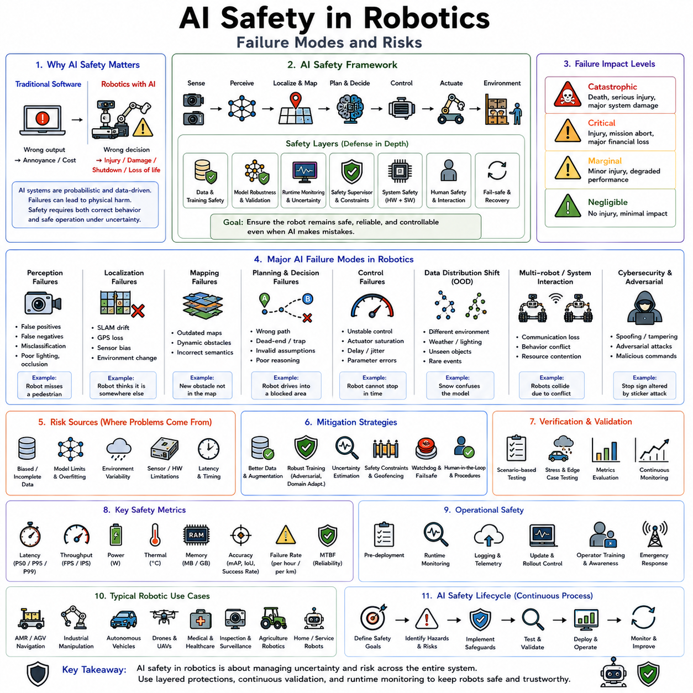{width="7.268055555555556in" height="7.268055555555556in"}

Artificial intelligence safety in robotics is the discipline concerned with ensuring that intelligent robotic systems operate reliably, predictably, and without causing unacceptable harm to humans, property, infrastructure, the environment, or themselves. Unlike conventional software safety, which primarily focuses on deterministic algorithms executing predefined logic, AI safety must address learning systems whose behavior emerges from statistical models trained on large datasets. Neural networks, reinforcement learning policies, vision-language models, foundation models, and autonomous planning systems often produce behaviors that are highly capable yet inherently probabilistic. As robots increasingly leave controlled industrial environments and enter warehouses, hospitals, homes, roads, construction sites, farms, and public spaces, ensuring AI safety becomes one of the central engineering challenges in modern robotics.

The importance of AI safety stems from the unique characteristics of physical robots. A software error in an online recommendation system may produce an incorrect suggestion or reduce user satisfaction. An identical level of error in a robotic system can result in collisions, injuries, damaged equipment, production shutdowns, environmental hazards, or even loss of life. The consequences of incorrect AI decisions are amplified because robots directly influence the physical world through motors, manipulators, mobile platforms, and autonomous actuators. Every perception error, planning mistake, or control failure has the potential to become a physical safety incident.

Traditional robotic safety relied heavily on deterministic control algorithms, carefully validated state machines, fixed safety zones, emergency stop circuits, and certified industrial controllers. These systems behaved predictably because every possible control path was explicitly designed by engineers. Artificial intelligence fundamentally changes this paradigm. Deep neural networks learn decision boundaries from data rather than explicit programming. Their internal reasoning often cannot be completely explained, and their responses may vary significantly when presented with unfamiliar inputs. Consequently, AI safety extends beyond conventional functional safety and requires new approaches to verification, validation, monitoring, uncertainty estimation, and runtime supervision.

One of the foundational concepts in AI safety is the distinction between functional safety and intelligent behavior. Functional safety concerns whether hardware and software operate correctly according to their specifications. Intelligent behavior concerns whether the decisions themselves are appropriate under changing environmental conditions. A perception network may function exactly as designed while still making an incorrect prediction because an object falls outside its training distribution. From the software perspective the system is operating correctly, but from the operational perspective the robot may behave unsafely. AI safety therefore addresses both implementation correctness and decision correctness.

Failure modes describe the various ways intelligent robotic systems may fail during operation. Unlike conventional hardware failures, AI failures often occur gradually, probabilistically, or under rare environmental conditions rather than through obvious component breakdowns. Understanding these failure modes forms the basis for designing robust autonomous systems.

Perception failures represent one of the most common categories of AI risk. Robots rely heavily on cameras, LiDAR, radar, ultrasonic sensors, depth cameras, IMUs, GPS receivers, tactile sensors, microphones, and force sensors to understand their surroundings. AI models interpret these sensor signals to identify objects, estimate distances, classify environments, detect humans, recognize obstacles, and understand semantic context. If perception fails, all downstream planning and control decisions become compromised.

False positive detections occur when the AI system incorrectly identifies an object that does not exist. A warehouse robot may mistakenly detect an obstacle where none exists, unnecessarily stopping production or taking inefficient routes. Although false positives primarily reduce efficiency, excessive false alarms eventually reduce operator trust and may encourage dangerous workarounds.

False negatives generally pose greater safety risks. Here the AI fails to detect an object that actually exists. An autonomous forklift overlooking a pedestrian, a delivery robot failing to recognize a staircase, or a collaborative manipulator missing a human hand can produce severe accidents because the robot continues operating under the false assumption that the environment is safe.

Classification errors constitute another perception failure mode. The robot detects an object correctly but assigns the wrong semantic category. A medical robot may misidentify surgical instruments, an agricultural robot may confuse crops with weeds, or an autonomous vehicle may classify construction equipment as ordinary roadside objects. Incorrect semantic understanding often propagates into unsafe planning decisions.

Localization failures also present significant operational risks. Autonomous robots continuously estimate their position relative to maps, landmarks, or global coordinates. Errors may originate from degraded GPS signals, accumulated SLAM drift, sensor calibration inaccuracies, dynamic environmental changes, or feature-poor surroundings. Localization errors may cause robots to navigate into hazardous areas, collide with infrastructure, or fail to complete assigned tasks safely.

Mapping failures similarly influence navigation reliability. Static maps gradually become outdated as environments change. Construction sites evolve daily, warehouses reorganize inventory, hospitals relocate equipment, and outdoor environments experience seasonal variation. AI systems relying on obsolete environmental representations may generate unsafe navigation plans despite apparently accurate localization.

Prediction failures arise when AI systems incorrectly estimate future environmental states. Autonomous robots increasingly predict pedestrian movement, vehicle trajectories, obstacle behavior, and human intentions. Prediction errors may cause inappropriate collision avoidance, unsafe overtaking maneuvers, or incorrect coordination with nearby agents.

Planning failures occur when decision-making algorithms generate unsafe or suboptimal action sequences despite receiving accurate environmental information. Reinforcement learning policies may exploit unintended strategies, optimization algorithms may converge toward unsafe local optima, or language-based planners may misunderstand task objectives. Planning failures often emerge from complex interactions among multiple decision-making components rather than isolated perception errors.

Control failures involve incorrect execution of planned actions. Motion controllers, trajectory generators, manipulation policies, balance controllers, and whole-body coordination systems translate AI decisions into physical actuator commands. Numerical instability, actuator saturation, communication delays, mechanical limitations, or inaccurate dynamic models may prevent safe execution even when planning remains correct.

Sensor failures represent another major source of AI risk. Cameras may become obscured by dust, rain, fog, snow, or direct sunlight. LiDAR performance deteriorates under heavy precipitation. GPS signals become unreliable near tall buildings or indoors. IMUs accumulate drift over time. AI systems must recognize degraded sensor quality rather than blindly trusting corrupted measurements.

Sensor fusion provides one approach for mitigating individual sensor failures. Multiple sensing modalities complement one another because their failure characteristics differ. Cameras provide rich semantic information but suffer under poor illumination. LiDAR measures geometry accurately but struggles with certain reflective surfaces. Radar penetrates adverse weather yet offers lower spatial resolution. Combining these sensors increases overall robustness while reducing dependence upon any single sensing modality.

Environmental uncertainty further complicates AI safety. Training datasets inevitably capture only a limited subset of real-world conditions. Robots deployed into previously unseen environments may encounter unusual lighting, unfamiliar objects, adverse weather, unexpected human behavior, damaged infrastructure, sensor contamination, or rare combinations of environmental factors. AI models frequently exhibit degraded performance when operating outside their training distribution.

Out-of-distribution inputs represent one of the most extensively studied AI safety challenges. Neural networks generally assume future inputs resemble training data. When presented with unfamiliar situations, prediction confidence may remain artificially high despite increasing error probability. Detecting these out-of-distribution conditions has therefore become a major research area within safe robotics.

Distribution shift occurs gradually over time as operational environments evolve. Manufacturing processes change, new products appear, warehouse layouts evolve, roads undergo maintenance, vegetation grows, lighting conditions vary seasonally, and sensor hardware ages. Continuous monitoring and periodic retraining help maintain model reliability under these changing conditions.

Dataset bias introduces another important source of safety risk. Training data often underrepresent rare events, unusual environments, minority object categories, or extreme operating conditions. Consequently, AI systems may perform exceptionally well under common circumstances while failing during precisely those rare situations requiring maximum reliability. Safety-critical robotics therefore demands intentionally diverse datasets covering both typical and exceptional operating scenarios.

Adversarial inputs represent another unique AI vulnerability. Carefully crafted perturbations may cause neural networks to produce incorrect predictions despite appearing nearly unchanged to humans. Although deliberate adversarial attacks remain relatively uncommon in most industrial robotics, naturally occurring sensor noise, reflections, compression artifacts, or environmental interference may produce similar effects.

Human interaction introduces additional safety complexity. Collaborative robots, service robots, healthcare assistants, delivery systems, and autonomous vehicles operate alongside people whose behavior is inherently unpredictable. Humans may move unexpectedly, violate assumed safety rules, become distracted, intentionally interfere with robot operation, or misunderstand robot intentions. AI systems must therefore anticipate uncertainty in human behavior rather than assuming perfectly cooperative environments.

Human intention prediction remains particularly challenging. Robots increasingly estimate where people intend to move, what objects they will manipulate, or how they may respond to robot actions. These predictions influence navigation, collision avoidance, manipulation planning, and collaborative task execution. Incorrect intention estimation may create dangerous interactions even when perception remains accurate.

Shared autonomy further complicates safety analysis. Many robotic systems combine autonomous AI decisions with human supervision. Operators may override recommendations, intervene during execution, or assume manual control during emergencies. Effective shared autonomy requires carefully designed interfaces that communicate system confidence, uncertainty, limitations, and recommended actions clearly to human supervisors.

Overreliance on automation presents another operational risk. As AI systems become increasingly capable, human operators may become complacent, reducing vigilance and assuming the robot will identify all hazards automatically. This phenomenon, often called automation bias, may delay appropriate human intervention when AI eventually encounters unfamiliar situations.

Explainability contributes significantly to operational safety. Engineers, operators, regulators, and maintenance personnel often require insight into why AI systems reached particular decisions. Complete interpretability remains difficult for deep neural networks, but visualization techniques, attention maps, saliency analysis, confidence estimation, feature attribution, and decision logging improve understanding of system behavior.

Uncertainty estimation has become one of the most important AI safety mechanisms. Rather than producing only predictions, safe AI systems estimate confidence associated with those predictions. High uncertainty may trigger additional sensing, slower robot motion, human intervention, conservative planning, or safe shutdown procedures. Knowing when the AI is uncertain often proves as valuable as the prediction itself.

Runtime monitoring continuously evaluates AI behavior during operation. Instead of assuming neural networks always function correctly, monitoring systems inspect predictions for anomalies, inconsistent outputs, confidence degradation, timing irregularities, sensor failures, and unexpected operating conditions. When abnormalities appear, safety supervisors intervene before hazardous actions occur.

Safety supervisors operate independently from primary AI systems. These deterministic modules enforce hard operational constraints regardless of AI recommendations. Maximum speed limits, collision avoidance boundaries, workspace restrictions, emergency braking, joint torque limits, battery protection, thermal constraints, and communication watchdogs remain under deterministic supervision even when AI components fail.

Redundancy provides another essential safety strategy. Independent perception pipelines, duplicate sensors, alternative localization methods, backup communication channels, redundant power supplies, and secondary control computers increase fault tolerance. Diversity among redundant systems further improves robustness because independent implementations are less likely to fail simultaneously.

Graceful degradation distinguishes robust robotics systems from brittle ones. Rather than experiencing catastrophic failure when one subsystem becomes unavailable, robots progressively reduce functionality while maintaining safe operation. A navigation robot losing GPS may transition to visual SLAM. A failed camera may increase reliance on LiDAR. A degraded perception system may reduce maximum operating speed rather than shutting down immediately.

Emergency stop mechanisms remain indispensable despite increasing AI sophistication. Hardware emergency stop circuits operate independently of AI software, immediately removing actuator power when activated. Functional safety standards require these mechanisms because software failures must never prevent emergency intervention.

Safe state transitions define robot behavior following detected faults. Depending on application requirements, safe states may involve controlled braking, actuator locking, manipulator retraction, power reduction, stationary waiting, return-to-home procedures, or human assistance requests. Selecting appropriate safe states depends upon operational context and hazard analysis.

Hazard analysis provides the systematic foundation for AI safety engineering. Engineers identify potential hazards, estimate likelihood and severity, evaluate risk, design mitigation strategies, verify implementation, and continuously reassess operational safety throughout the system lifecycle. Hazard analysis extends beyond individual AI models to encompass complete robotic systems interacting within realistic environments.

Failure Mode and Effects Analysis remains widely used for systematic risk identification. Each subsystem, including perception, localization, planning, communication, power management, sensing, and control, is analyzed according to possible failure mechanisms, operational consequences, detection methods, and mitigation strategies. AI-specific failure modes increasingly complement traditional hardware reliability analysis.

Fault Tree Analysis examines combinations of failures leading to hazardous events. Rather than considering isolated component failures independently, fault trees analyze interactions among perception errors, sensor degradation, communication failures, software faults, and human actions. This systems-level perspective proves particularly valuable for complex autonomous robots.

Simulation plays a central role in AI safety validation. Rare hazardous scenarios difficult or dangerous to reproduce physically can be evaluated repeatedly within high-fidelity simulation environments. Engineers generate unusual weather conditions, unexpected pedestrian behavior, sensor failures, communication interruptions, and hardware faults to evaluate system robustness before real-world deployment.

Scenario-based testing has become increasingly important for autonomous systems. Rather than relying solely on aggregate accuracy metrics, AI safety validation examines specific operational scenarios representing critical edge cases. These include emergency braking, obstacle emergence, pedestrian crossings, construction zones, equipment failures, adverse weather, sensor degradation, and complex human interactions.

Formal verification remains an active research area. Traditional software verification methods struggle with neural networks because of their high-dimensional nonlinear behavior. Nevertheless, researchers increasingly develop mathematical techniques verifying robustness properties, bounded behavior, collision avoidance guarantees, and safety constraints for specific classes of AI systems.

Regulatory standards increasingly recognize AI-specific safety challenges. Traditional functional safety standards such as IEC 61508 and ISO 13849 provide foundations for deterministic safety engineering. Newer standards including ISO 26262 for automotive systems, ISO 21448 concerning Safety of the Intended Functionality, IEC 61508 extensions, ISO 10218 for industrial robots, ISO/TS 15066 for collaborative robotics, and emerging AI governance frameworks address machine learning components more directly.

Continuous monitoring after deployment has become equally important as predeployment validation. AI performance gradually evolves because environments change, hardware ages, software updates occur, and operational conditions expand beyond original assumptions. Fleet monitoring systems collect operational statistics, identify emerging failure patterns, detect performance degradation, and guide future model improvements.

Incident reporting contributes significantly to long-term safety improvement. Near misses, unexpected behaviors, operator interventions, abnormal sensor conditions, planning anomalies, and unusual environmental situations provide valuable information even when no accident occurs. Systematic analysis of these events strengthens future AI reliability.

Future AI safety research increasingly focuses on foundation models, embodied intelligence, multimodal reasoning, lifelong learning, collaborative autonomy, and adaptive robotic behavior. These systems promise dramatically increased capability but simultaneously introduce new verification challenges because their behavior evolves continuously through interaction with the environment.

Ultimately, AI safety in robotics is not achieved through any single algorithm, sensor, or certification process. It emerges from a comprehensive engineering philosophy integrating reliable perception, robust planning, deterministic control, uncertainty estimation, runtime monitoring, redundancy, formal safety mechanisms, extensive validation, continuous operational monitoring, and disciplined systems engineering. As autonomous robots become increasingly integrated into manufacturing, logistics, healthcare, transportation, infrastructure inspection, agriculture, and public environments, understanding failure modes and systematically mitigating operational risks becomes as important as improving intelligence itself. Safe robotic intelligence therefore depends not only on making AI more capable but also on ensuring that every capability remains predictable, trustworthy, transparent, resilient, and aligned with the fundamental objective of protecting human life, preserving infrastructure, maintaining operational reliability, and enabling responsible deployment of Physical AI throughout society.

로보틱스에서의 인공지능 안전성은 지능형 로봇 시스템이 신뢰성 있고, 예측 가능하며, 인간, 재산, 인프라, 환경, 또는 로봇 자신에게 용납할 수 없는 해를 끼치지 않도록 작동하는 것을 보장하는 것과 관련된 분야이다. 주로 사전에 정의된 논리를 실행하는 결정론적 알고리즘에 초점을 맞추는 전통적인 소프트웨어 안전성과 달리, AI 안전성은 대규모 데이터셋으로 학습된 통계적 모델로부터 행동이 발현되는 학습 시스템을 다루어야 한다. 신경망, 강화학습 정책, 시각-언어 모델, 파운데이션 모델, 자율 계획 시스템은 종종 매우 유능하면서도 본질적으로 확률적인 행동을 만들어낸다. 로봇이 통제된 산업 환경을 점점 더 많이 벗어나 창고, 병원, 가정, 도로, 건설 현장, 농장, 공공장소로 진입함에 따라, AI 안전성을 보장하는 것은 현대 로보틱스의 핵심적인 공학적 과제 중 하나가 되고 있다.

AI 안전성의 중요성은 물리적 로봇의 고유한 특성에서 비롯된다. 온라인 추천 시스템에서의 소프트웨어 오류는 부정확한 제안을 만들어내거나 사용자 만족도를 낮출 수 있다. 로봇 시스템에서의 동일한 수준의 오류는 충돌, 부상, 장비 손상, 생산 중단, 환경적 위험, 심지어 인명 손실로 이어질 수 있다. 로봇이 모터, 매니퓰레이터, 이동 플랫폼, 자율 액추에이터를 통해 물리적 세계에 직접적인 영향을 미치기 때문에 잘못된 AI 결정의 결과는 증폭된다. 모든 인지 오류, 계획 수립 실수, 또는 제어 실패는 물리적 안전 사고가 될 잠재력을 지닌다.

전통적인 로봇의 안전성은 결정론적 제어 알고리즘, 신중하게 검증된 상태 기계, 고정된 안전 구역, 비상 정지 회로, 인증된 산업용 컨트롤러에 크게 의존했다. 가능한 모든 제어 경로가 엔지니어에 의해 명시적으로 설계되었기 때문에 이러한 시스템들은 예측 가능하게 행동했다. 인공지능은 이러한 패러다임을 근본적으로 변화시킨다. 심층 신경망은 명시적인 프로그래밍이 아니라 데이터로부터 결정 경계를 학습한다. 이들의 내부적인 추론은 종종 완전히 설명될 수 없으며, 낯선 입력이 주어졌을 때 그 반응이 상당히 달라질 수 있다. 따라서 AI 안전성은 전통적인 기능 안전성을 넘어 확장되며, 검증, 검증(validation), 모니터링, 불확실성 추정, 런타임 감독에 대한 새로운 접근법을 필요로 한다.

AI 안전성의 근본적인 개념 중 하나는 기능 안전성(functional safety)과 지능형 행동 사이의 구분이다. 기능 안전성은 하드웨어와 소프트웨어가 자신의 명세에 따라 올바르게 작동하는지에 관한 것이다. 지능형 행동은 변화하는 환경 조건 하에서 결정 자체가 적절한지에 관한 것이다. 인지 네트워크는 정확히 설계된 대로 기능하면서도, 물체가 자신의 학습 분포를 벗어나 있기 때문에 여전히 부정확한 예측을 할 수 있다. 소프트웨어의 관점에서 시스템은 올바르게 작동하고 있지만, 운영상의 관점에서 로봇은 안전하지 않게 행동할 수 있다. 따라서 AI 안전성은 구현의 정확성과 결정의 정확성 모두를 다룬다.

실패 양상(failure mode)은 지능형 로봇 시스템이 운영 과정에서 실패할 수 있는 다양한 방식을 기술한다. 전통적인 하드웨어 실패와 달리, AI 실패는 종종 명백한 구성 요소의 고장이 아니라 점진적으로, 확률적으로, 또는 드문 환경 조건 하에서 발생한다. 이러한 실패 양상들을 이해하는 것은 견고한 자율 시스템을 설계하는 데 있어 기초를 이룬다.

인지 실패(perception failure)는 가장 흔한 AI 위험 범주 중 하나를 나타낸다. 로봇은 주변을 이해하기 위해 카메라, LiDAR, 레이더, 초음파 센서, 깊이 카메라, IMU, GPS 수신기, 촉각 센서, 마이크로폰, 힘 센서에 크게 의존한다. AI 모델은 물체를 식별하고, 거리를 추정하며, 환경을 분류하고, 인간을 감지하며, 장애물을 인식하고, 의미론적 맥락을 이해하기 위해 이러한 센서 신호들을 해석한다. 인지가 실패하면, 이후의 모든 계획 수립과 제어 결정이 손상된다.

거짓 양성(false positive) 감지는 AI 시스템이 존재하지 않는 물체를 부정확하게 식별할 때 발생한다. 창고 로봇은 존재하지 않는 곳에서 장애물을 잘못 감지하여, 불필요하게 생산을 중단시키거나 비효율적인 경로를 택할 수 있다. 거짓 양성은 주로 효율성을 떨어뜨리지만, 과도한 오경보는 결국 조작자의 신뢰를 낮추고 위험한 우회 행동을 조장할 수 있다.

거짓 음성(false negative)은 일반적으로 더 큰 안전상의 위험을 제기한다. 이 경우 AI는 실제로 존재하는 물체를 감지하지 못한다. 보행자를 간과한 자율 지게차, 계단을 인식하지 못한 배송 로봇, 또는 인간의 손을 놓친 협동 매니퓰레이터는 로봇이 환경이 안전하다는 잘못된 가정 하에 계속 작동하기 때문에 심각한 사고를 만들어낼 수 있다.

분류 오류(classification error)는 또 다른 인지 실패 양상을 이룬다. 로봇은 물체를 올바르게 감지하지만 잘못된 의미론적 범주를 부여한다. 의료용 로봇은 수술 도구를 잘못 식별할 수 있고, 농업용 로봇은 작물을 잡초와 혼동할 수 있으며, 자율주행 차량은 건설 장비를 일반적인 도로변 물체로 분류할 수 있다. 부정확한 의미론적 이해는 종종 안전하지 않은 계획 수립 결정으로 전파된다.

위치 추정 실패도 상당한 운영상의 위험을 제기한다. 자율 로봇은 지도, 랜드마크, 또는 전역 좌표에 대한 자신의 위치를 지속적으로 추정한다. 오류는 저하된 GPS 신호, 누적된 SLAM 드리프트, 센서 보정의 부정확성, 동적인 환경 변화, 또는 특징이 부족한 주변으로부터 비롯될 수 있다. 위치 추정 오류는 로봇이 위험한 구역으로 내비게이션하거나, 인프라와 충돌하거나, 배정된 태스크를 안전하게 완료하지 못하게 만들 수 있다.

지도 작성 실패도 마찬가지로 내비게이션의 신뢰성에 영향을 미친다. 정적인 지도는 환경이 변화함에 따라 점차 오래된 것이 된다. 건설 현장은 매일 진화하고, 창고는 재고를 재배치하며, 병원은 장비를 이동시키고, 실외 환경은 계절적 변화를 겪는다. 오래된 환경적 표현에 의존하는 AI 시스템은 겉으로는 정확한 위치 추정에도 불구하고 안전하지 않은 내비게이션 계획을 생성할 수 있다.

예측 실패는 AI 시스템이 미래의 환경 상태를 부정확하게 추정할 때 발생한다. 자율 로봇은 보행자의 움직임, 차량의 궤적, 장애물의 행동, 인간의 의도를 점점 더 많이 예측하고 있다. 예측 오류는 부적절한 충돌 회피, 안전하지 않은 추월 동작, 또는 근처 에이전트들과의 부정확한 조율을 초래할 수 있다.

계획 수립 실패는 의사결정 알고리즘이 정확한 환경 정보를 받고도 안전하지 않거나 최적이 아닌 행동 시퀀스를 생성할 때 발생한다. 강화학습 정책은 의도하지 않은 전략을 악용할 수 있고, 최적화 알고리즘은 안전하지 않은 지역 최적값으로 수렴할 수 있으며, 언어 기반 플래너는 태스크 목표를 잘못 이해할 수 있다. 계획 수립 실패는 종종 고립된 인지 오류가 아니라 여러 의사결정 구성 요소들 사이의 복잡한 상호작용으로부터 나타난다.

제어 실패는 계획된 행동의 부정확한 실행을 수반한다. 모션 컨트롤러, 궤적 생성기, 조작 정책, 균형 컨트롤러, 전신 조율 시스템은 AI 결정을 물리적 액추에이터 명령으로 전환한다. 수치적 불안정성, 액추에이터 포화, 통신 지연, 기계적 한계, 또는 부정확한 동적 모델은 계획 수립이 올바른 상태로 남아 있더라도 안전한 실행을 방해할 수 있다.

센서 실패는 AI 위험의 또 다른 주요한 원천을 나타낸다. 카메라는 먼지, 비, 안개, 눈, 또는 직사광선에 의해 가려질 수 있다. LiDAR의 성능은 강한 강수량 하에서 저하된다. GPS 신호는 고층 건물 근처나 실내에서 신뢰할 수 없게 된다. IMU는 시간이 지남에 따라 드리프트를 축적한다. AI 시스템은 손상된 측정치를 맹목적으로 신뢰하는 대신 센서 품질의 저하를 인식해야 한다.

센서 융합은 개별 센서 실패를 완화하는 한 가지 접근법을 제공한다. 여러 감지 양식은 그 실패 특성이 다르기 때문에 서로를 보완한다. 카메라는 풍부한 의미론적 정보를 제공하지만 조명이 나쁠 때 어려움을 겪는다. LiDAR는 기하학을 정확하게 측정하지만 특정한 반사면에서 어려움을 겪는다. 레이더는 낮은 공간 해상도를 제공하지만 악천후를 뚫고 작동한다. 이러한 센서들을 결합하는 것은 어떤 단일한 감지 양식에 대한 의존도를 줄이면서도 전체적인 견고성을 높인다.

환경적 불확실성은 AI 안전성을 더욱 복잡하게 만든다. 학습 데이터셋은 필연적으로 실제 세계 조건의 제한된 부분집합만을 포착한다. 이전에 본 적 없는 환경에 배치된 로봇은 특이한 조명, 낯선 물체, 악천후, 예상치 못한 인간의 행동, 손상된 인프라, 센서 오염, 또는 환경적 요인들의 드문 조합을 마주칠 수 있다. AI 모델은 종종 학습 분포를 벗어나 작동할 때 저하된 성능을 보인다.

분포 외(out-of-distribution) 입력은 가장 광범위하게 연구된 AI 안전성 과제 중 하나를 나타낸다. 신경망은 일반적으로 미래의 입력이 학습 데이터와 유사할 것이라고 가정한다. 낯선 상황이 주어지면, 오류 확률이 증가함에도 불구하고 예측 신뢰도는 인위적으로 높은 채로 남아 있을 수 있다. 따라서 이러한 분포 외 조건을 감지하는 것은 안전한 로보틱스 내의 주요한 연구 영역이 되었다.

분포 변화(distribution shift)는 운영 환경이 진화함에 따라 시간이 지나면서 점진적으로 발생한다. 제조 과정은 변하고, 새로운 제품이 나타나며, 창고의 배치는 진화하고, 도로는 유지보수를 거치며, 식생은 자라고, 조명 조건은 계절에 따라 다양하며, 센서 하드웨어는 노화된다. 지속적인 모니터링과 주기적인 재학습은 이러한 변화하는 조건 하에서 모델의 신뢰성을 유지하는 데 도움이 된다.

데이터셋 편향은 안전상의 위험의 또 다른 중요한 원천을 도입한다. 학습 데이터는 종종 드문 이벤트, 특이한 환경, 소수 물체 범주, 또는 극단적인 운영 조건을 과소 대표한다. 따라서 AI 시스템은 일반적인 상황 하에서는 예외적으로 잘 작동하면서도 정확히 최대의 신뢰성을 필요로 하는 그러한 드문 상황에서 실패할 수 있다. 따라서 안전이 중요한 로보틱스는 일반적인 운영 시나리오와 예외적인 운영 시나리오 모두를 다루는 의도적으로 다양한 데이터셋을 요구한다.

적대적 입력(adversarial input)은 또 다른 고유한 AI 취약성을 나타낸다. 신중하게 조작된 섭동은 인간에게는 거의 변하지 않은 것처럼 보임에도 불구하고 신경망이 부정확한 예측을 만들어내게 할 수 있다. 의도적인 적대적 공격은 대부분의 산업용 로보틱스에서는 비교적 드물게 남아 있지만, 자연적으로 발생하는 센서 노이즈, 반사, 압축 아티팩트, 또는 환경적 간섭은 유사한 효과를 만들어낼 수 있다.

인간과의 상호작용은 추가적인 안전상의 복잡성을 도입한다. 협동 로봇, 서비스 로봇, 헬스케어 어시스턴트, 배송 시스템, 자율주행 차량은 본질적으로 예측할 수 없는 행동을 지닌 사람들과 나란히 작동한다. 인간은 예기치 않게 움직이거나, 가정된 안전 규칙을 위반하거나, 주의가 산만해지거나, 의도적으로 로봇의 작동을 방해하거나, 로봇의 의도를 오해할 수 있다. 따라서 AI 시스템은 완벽하게 협력적인 환경을 가정하는 대신 인간 행동의 불확실성을 예상해야 한다.

인간의 의도 예측은 특히 어려운 과제로 남아 있다. 로봇은 사람들이 어디로 이동하려고 하는지, 어떤 물체를 조작할 것인지, 또는 로봇의 행동에 어떻게 반응할 수 있는지를 점점 더 많이 추정하고 있다. 이러한 예측들은 내비게이션, 충돌 회피, 조작 계획 수립, 협력적 태스크 실행에 영향을 미친다. 인지가 정확하더라도 부정확한 의도 추정은 위험한 상호작용을 만들어낼 수 있다.

공유된 자율성(shared autonomy)은 안전성 분석을 더욱 복잡하게 만든다. 많은 로봇 시스템은 자율적인 AI 결정을 인간의 감독과 결합한다. 조작자는 권고를 무시하거나, 실행 도중 개입하거나, 비상 상황에서 수동 제어를 담당할 수 있다. 효과적인 공유된 자율성은 시스템의 신뢰도, 불확실성, 한계, 권장 행동을 인간 감독자에게 명확하게 전달하는 신중하게 설계된 인터페이스를 필요로 한다.

자동화에 대한 과도한 의존은 또 다른 운영상의 위험을 제기한다. AI 시스템이 점점 더 유능해짐에 따라, 인간 조작자는 안일해질 수 있으며, 경계심을 낮추고 로봇이 모든 위험을 자동으로 식별할 것이라고 가정할 수 있다. 흔히 자동화 편향(automation bias)이라고 불리는 이러한 현상은, AI가 결국 낯선 상황을 마주쳤을 때 적절한 인간의 개입을 지연시킬 수 있다.

설명 가능성은 운영상의 안전성에 상당히 기여한다. 엔지니어, 조작자, 규제 기관, 유지보수 인력은 종종 AI 시스템이 특정한 결정에 도달한 이유에 대한 통찰을 필요로 한다. 완전한 해석 가능성은 심층 신경망에게는 여전히 어려운 채로 남아 있지만, 시각화 기법, 어텐션 맵, 중요도 분석, 신뢰도 추정, 특징 귀속(feature attribution), 결정 로깅은 시스템 행동에 대한 이해를 향상시킨다.

불확실성 추정은 가장 중요한 AI 안전성 메커니즘 중 하나가 되었다. 예측만을 만들어내는 대신, 안전한 AI 시스템은 그러한 예측과 관련된 신뢰도를 추정한다. 높은 불확실성은 추가적인 감지, 더 느린 로봇의 움직임, 인간의 개입, 보수적인 계획 수립, 또는 안전한 종료 절차를 촉발할 수 있다. AI가 언제 불확실한지를 아는 것은 종종 예측 자체만큼이나 유용한 것으로 입증된다.

런타임 모니터링은 운영 과정에서 AI의 행동을 지속적으로 평가한다. 신경망이 항상 올바르게 기능한다고 가정하는 대신, 모니터링 시스템은 이상, 일관되지 않은 출력, 신뢰도 저하, 타이밍 불규칙성, 센서 실패, 예상치 못한 운영 조건에 대해 예측을 검사한다. 이상이 나타나면, 안전 감독자는 위험한 행동이 발생하기 전에 개입한다.

안전 감독자(safety supervisor)는 주요 AI 시스템과 독립적으로 작동한다. 이러한 결정론적 모듈은 AI의 권고와 무관하게 엄격한 운영상의 제약을 강제한다. 최대 속도 제한, 충돌 회피 경계, 작업 공간 제한, 비상 제동, 관절 토크 제한, 배터리 보호, 열적 제약, 통신 감시(watchdog)는 AI 구성 요소가 실패하더라도 결정론적 감독 하에 남아 있는다.

중복성(redundancy)은 또 다른 필수적인 안전 전략을 제공한다. 독립적인 인지 파이프라인, 중복된 센서, 대체 위치 추정 방법, 백업 통신 채널, 중복된 전원 공급 장치, 보조 제어 컴퓨터는 결함 허용성을 늘린다. 독립적인 구현이 동시에 실패할 가능성이 낮기 때문에 중복 시스템들 간의 다양성은 견고성을 더욱 향상시킨다.

우아한 성능 저하(graceful degradation)는 견고한 로보틱스 시스템을 취약한 시스템과 구별짓는다. 하나의 하위 시스템을 사용할 수 없게 되었을 때 치명적인 실패를 경험하는 대신, 로봇은 안전한 운영을 유지하면서도 점진적으로 기능을 줄인다. GPS를 잃은 내비게이션 로봇은 시각적 SLAM으로 전환할 수 있다. 실패한 카메라는 LiDAR에 대한 의존도를 늘릴 수 있다. 저하된 인지 시스템은 즉시 종료되는 대신 최대 운영 속도를 줄일 수 있다.

비상 정지 메커니즘은 AI의 정교함이 증가함에도 불구하고 필수불가결한 채로 남아 있다. 하드웨어 비상 정지 회로는 AI 소프트웨어와 독립적으로 작동하여, 활성화되면 즉시 액추에이터의 전원을 제거한다. 소프트웨어의 실패가 비상 개입을 결코 방해해서는 안 되기 때문에 기능 안전 표준들은 이러한 메커니즘을 요구한다.

안전한 상태 전환(safe state transition)은 감지된 결함 이후의 로봇 행동을 정의한다. 응용 분야의 요구사항에 따라, 안전한 상태는 통제된 제동, 액추에이터 잠금, 매니퓰레이터 후퇴, 전력 감소, 정지 대기, 원위치 복귀 절차, 또는 인간의 도움 요청을 수반할 수 있다. 적절한 안전 상태를 선택하는 것은 운영상의 맥락과 위험 분석에 달려 있다.

위험 분석(hazard analysis)은 AI 안전성 공학을 위한 체계적인 기반을 제공한다. 엔지니어는 잠재적인 위험을 식별하고, 가능성과 심각성을 추정하며, 위험을 평가하고, 완화 전략을 설계하며, 구현을 검증하고, 시스템의 생애 주기 내내 운영상의 안전성을 지속적으로 재평가한다. 위험 분석은 개별적인 AI 모델을 넘어 현실적인 환경 내에서 상호작용하는 완전한 로봇 시스템을 아우르도록 확장된다.

고장 형태 및 영향 분석(Failure Mode and Effects Analysis)은 체계적인 위험 식별을 위해 여전히 널리 사용되고 있다. 인지, 위치 추정, 계획 수립, 통신, 전원 관리, 감지, 제어를 포함한 각각의 하위 시스템은 가능한 실패 메커니즘, 운영상의 결과, 감지 방법, 완화 전략에 따라 분석된다. AI 특유의 실패 양상은 전통적인 하드웨어 신뢰성 분석을 점점 더 많이 보완하고 있다.

결함 트리 분석(Fault Tree Analysis)은 위험한 사건으로 이어지는 실패들의 조합을 조사한다. 고립된 구성 요소의 실패를 독립적으로 고려하는 대신, 결함 트리는 인지 오류, 센서 저하, 통신 실패, 소프트웨어 결함, 인간의 행동 사이의 상호작용을 분석한다. 이러한 시스템 수준의 관점은 복잡한 자율 로봇에게 특히 유용한 것으로 입증된다.

시뮬레이션은 AI 안전성 검증에서 핵심적인 역할을 한다. 물리적으로 재현하기 어렵거나 위험한 드문 위험 시나리오는 고충실도 시뮬레이션 환경 내에서 반복적으로 평가될 수 있다. 엔지니어는 실제 세계 배치 이전에 시스템의 견고성을 평가하기 위해 특이한 날씨 조건, 예상치 못한 보행자 행동, 센서 실패, 통신 중단, 하드웨어 결함을 생성한다.

시나리오 기반 테스트는 자율 시스템에게 점점 더 중요해지고 있다. 오직 집계된 정확도 지표에만 의존하는 대신, AI 안전성 검증은 중요한 엣지 케이스를 나타내는 특정한 운영 시나리오들을 조사한다. 여기에는 비상 제동, 장애물 출현, 보행자 횡단, 건설 구역, 장비 고장, 악천후, 센서 저하, 복잡한 인간과의 상호작용이 포함된다.

형식적 검증(formal verification)은 여전히 활발한 연구 영역으로 남아 있다. 전통적인 소프트웨어 검증 방법들은 신경망의 고차원적인 비선형적 행동 때문에 어려움을 겪는다. 그럼에도 불구하고, 연구자들은 특정한 부류의 AI 시스템에 대한 견고성 속성, 유계 행동(bounded behavior), 충돌 회피 보장, 안전 제약을 검증하는 수학적 기법들을 점점 더 많이 개발하고 있다.

규제 표준은 AI 특유의 안전성 과제를 점점 더 많이 인식하고 있다. IEC 61508과 ISO 13849와 같은 전통적인 기능 안전 표준은 결정론적 안전 공학을 위한 기초를 제공한다. 자동차 시스템을 위한 ISO 26262, 의도된 기능의 안전성(Safety of the Intended Functionality)에 관한 ISO 21448, IEC 61508 확장, 산업용 로봇을 위한 ISO 10218, 협동 로보틱스를 위한 ISO/TS 15066, 그리고 새롭게 떠오르는 AI 거버넌스 프레임워크와 같은 새로운 표준들은 머신러닝 구성 요소들을 더 직접적으로 다룬다.

배치 이후의 지속적인 모니터링은 배치 이전의 검증만큼이나 중요해졌다. 환경이 변하고, 하드웨어가 노화되며, 소프트웨어 업데이트가 이루어지고, 운영 조건이 원래의 가정을 넘어 확장되기 때문에 AI 성능은 점진적으로 변화한다. 함대 모니터링 시스템은 운영 통계를 수집하고, 새롭게 나타나는 실패 패턴을 식별하며, 성능 저하를 감지하고, 향후의 모델 개선을 안내한다.

사고 보고(incident reporting)는 장기적인 안전성 향상에 상당히 기여한다. 아차 사고(near miss), 예상치 못한 행동, 조작자의 개입, 비정상적인 센서 조건, 계획 수립의 이상, 특이한 환경적 상황은 사고가 발생하지 않더라도 유용한 정보를 제공한다. 이러한 사건들에 대한 체계적인 분석은 향후 AI의 신뢰성을 강화한다.

미래의 AI 안전성 연구는 파운데이션 모델, 체화 지능, 멀티모달 추론, 평생 학습, 협력적 자율성, 적응형 로봇 행동에 점점 더 많이 초점을 맞추고 있다. 이러한 시스템들은 극적으로 향상된 능력을 약속하지만, 그 행동이 환경과의 상호작용을 통해 지속적으로 진화하기 때문에 동시에 새로운 검증 과제를 도입한다.

궁극적으로, 로보틱스에서의 AI 안전성은 어떤 단일한 알고리즘, 센서, 또는 인증 과정을 통해 달성되지 않는다. 이는 신뢰할 수 있는 인지, 견고한 계획 수립, 결정론적 제어, 불확실성 추정, 런타임 모니터링, 중복성, 형식적 안전 메커니즘, 광범위한 검증, 지속적인 운영 모니터링, 규율 있는 시스템 공학을 통합하는 포괄적인 공학적 철학으로부터 발현된다. 자율 로봇이 제조, 물류, 헬스케어, 교통, 인프라 점검, 농업, 공공 환경에 점점 더 많이 통합됨에 따라, 실패 양상을 이해하고 운영상의 위험을 체계적으로 완화하는 것은 지능 자체를 향상시키는 것만큼이나 중요해지고 있다. 따라서 안전한 로봇 지능은 AI를 더 유능하게 만드는 것뿐만 아니라, 모든 능력이 예측 가능하고, 신뢰할 수 있으며, 투명하고, 회복력이 있으며, 인간의 생명을 보호하고, 인프라를 보존하며, 운영상의 신뢰성을 유지하고, 사회 전반에 걸쳐 Physical AI의 책임 있는 배치를 가능하게 한다는 근본적인 목표와 일치하도록 보장하는 것에도 달려 있다.

##  

## 11.02 Adversarial Robustness Attacks and Defenses [w/Code]

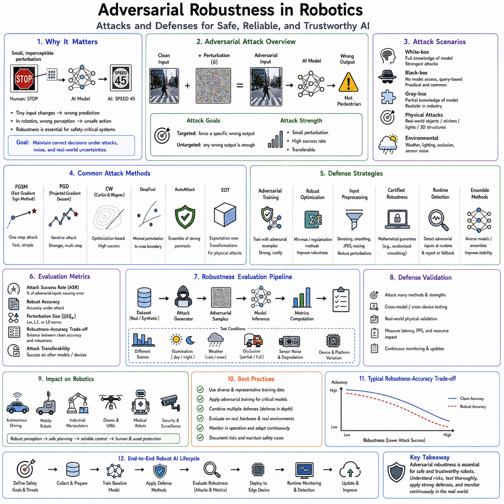{width="7.268055555555556in" height="7.268055555555556in"}

Adversarial robustness is the field of artificial intelligence that studies how machine learning systems behave when confronted with inputs intentionally or unintentionally designed to produce incorrect predictions. Unlike ordinary model errors that arise from insufficient training data or natural environmental variation, adversarial failures occur when small perturbations to the input cause a neural network to generate dramatically different outputs despite the changes being nearly imperceptible to humans. In robotics, autonomous driving, industrial automation, medical robotics, warehouse logistics, and defense systems, adversarial robustness has become one of the central pillars of AI safety because perception errors directly influence planning, control, and physical interaction with the environment. A robust robotic AI system must therefore maintain reliable performance not only under ideal operating conditions but also in the presence of noise, environmental disturbances, sensor degradation, malicious manipulation, and unexpected real-world variations.

The concept of adversarial examples emerged from the surprising observation that deep neural networks often possess decision boundaries that differ significantly from human perception. A carefully designed perturbation added to an image can cause a state-of-the-art classifier to mistake a stop sign for a speed limit sign, classify a pedestrian as background, or recognize completely unrelated objects while the image appears visually unchanged to human observers. This vulnerability reveals an important distinction between statistical pattern recognition and semantic understanding. Neural networks optimize mathematical decision boundaries within high-dimensional feature spaces, whereas humans rely on holistic reasoning, contextual understanding, and prior knowledge. Consequently, neural networks may exploit subtle numerical features that humans never consciously perceive.

The importance of adversarial robustness increases substantially in robotics because AI predictions influence physical actions. A conventional image classifier producing an incorrect label may simply display inaccurate information to a user. A robotic perception system making the same error may cause an autonomous vehicle to ignore traffic signals, a warehouse robot to collide with shelving, a collaborative manipulator to mishandle equipment, or a medical robot to misidentify surgical instruments. The physical consequences of incorrect AI predictions elevate adversarial robustness from an academic research topic to a critical engineering requirement.

Adversarial attacks are generally classified according to the attacker\'s knowledge, capabilities, objectives, and interaction with the target system. Understanding these categories provides the foundation for designing appropriate defensive mechanisms.

White-box attacks assume the attacker possesses complete knowledge of the target model. This includes network architecture, parameters, gradients, training procedures, optimization methods, and preprocessing pipelines. Because all internal information is available, white-box attacks often produce the strongest adversarial examples and serve as the standard benchmark for evaluating robustness. Although complete model access is uncommon in practical robotic deployments, white-box evaluation establishes an upper bound on model vulnerability.

Black-box attacks represent more realistic deployment scenarios. Here the attacker has no direct access to model internals but can observe inputs and outputs. By repeatedly querying the system or constructing substitute models, attackers estimate the target\'s decision boundaries and generate transferable adversarial examples. Since commercial robotic systems rarely expose internal model parameters, black-box robustness receives considerable attention in production environments.

Gray-box attacks occupy an intermediate position. Attackers possess partial knowledge regarding model architecture, deployment hardware, training datasets, preprocessing methods, or optimization strategies but lack complete access to internal parameters. Many practical industrial security analyses assume gray-box threat models because partial implementation details frequently become publicly available.

Targeted attacks seek to force a neural network toward one specific incorrect prediction. An attacker may intentionally attempt to cause a perception system to recognize one traffic sign as another, identify unauthorized personnel as authorized workers, or misclassify dangerous machinery as harmless background. Targeted attacks generally require more optimization than untargeted attacks because they pursue a particular incorrect outcome.

Untargeted attacks simply seek any incorrect prediction regardless of its specific category. Their objective is merely to reduce model accuracy rather than forcing a predetermined classification. These attacks often require smaller perturbations because numerous incorrect predictions satisfy the attack objective.

Digital adversarial attacks manipulate data directly before inference. Images, sensor streams, point clouds, audio signals, or language inputs are modified numerically before entering the neural network. Such attacks commonly appear in academic research because they provide precise experimental control and facilitate reproducible evaluation.

Physical adversarial attacks prove especially relevant for robotics because they manipulate real-world objects rather than digital data. Stickers applied to traffic signs, modified road markings, unusual clothing patterns, specially designed objects, projected light patterns, reflective materials, or three-dimensional structures may influence AI perception while remaining physically realizable. Since robots interact directly with the physical world, robustness against physical attacks represents a critical deployment requirement.

One of the earliest and most influential attack methods is the Fast Gradient Sign Method. This approach computes the gradient of the loss function with respect to the input image and perturbs each pixel slightly in the direction that maximally increases prediction error. Despite its conceptual simplicity, this method demonstrated that neural networks possess surprisingly fragile decision boundaries vulnerable to extremely small perturbations.

Projected Gradient Descent extends this concept through iterative optimization. Rather than applying a single perturbation, multiple gradient updates gradually refine the adversarial example while constraining perturbation magnitude within predefined limits. Projected Gradient Descent remains one of the strongest first-order adversarial attacks and serves as a standard benchmark for robustness evaluation.

Iterative optimization methods generally produce more effective adversarial examples than single-step attacks because repeated gradient updates better approximate optimal perturbations. However, increased computational cost makes them less suitable for real-time attack scenarios.

Optimization-based attacks formulate adversarial example generation as constrained mathematical optimization problems. The objective minimizes perturbation magnitude while maximizing prediction error subject to perceptual similarity constraints. These methods often produce highly effective attacks but require substantially greater computational effort.

Decision-based attacks operate without gradient information. Instead of analyzing internal model derivatives, they observe output predictions and gradually modify inputs until classification changes. Such attacks demonstrate that robustness cannot rely solely upon hiding model parameters.

Transfer attacks exploit the observation that adversarial examples generated for one neural network frequently fool different models trained for the same task. Attackers construct surrogate models locally, generate adversarial examples, and deploy them against unknown target systems. Transferability presents a significant practical concern because production models need not be directly accessible for successful attacks.

Universal adversarial perturbations introduce another remarkable phenomenon. Instead of constructing unique perturbations for individual images, researchers discovered perturbations capable of misleading neural networks across numerous unrelated inputs. Although generating such perturbations remains computationally demanding, they reveal structural vulnerabilities shared across entire datasets.

Adversarial patches represent physically realizable localized perturbations. Rather than modifying every image pixel, small printed patterns placed within camera view may dominate neural network attention and influence predictions. Since these patches remain effective under varying viewing angles and illumination conditions, they demonstrate the practical feasibility of physical adversarial manipulation.

Three-dimensional adversarial objects further extend physical attack concepts. Object geometry, surface texture, reflectance properties, or printed patterns may be optimized so that perception systems consistently misclassify them despite natural viewpoint variation. Autonomous robots interacting with physical environments must therefore consider adversarial object design alongside digital attacks.

Point cloud attacks have become increasingly important as LiDAR-based perception expands throughout autonomous robotics. Rather than modifying image pixels, attackers perturb three-dimensional point distributions by inserting, deleting, moving, or altering points. Such perturbations may influence object detection, localization, mapping, obstacle recognition, or navigation planning.

Sensor-specific attacks extend beyond computer vision. Radar interference, GPS spoofing, ultrasonic signal manipulation, inertial sensor corruption, audio perturbations, electromagnetic interference, and communication attacks all influence AI perception indirectly by modifying sensor observations before inference begins.

Language model attacks represent another emerging research area. Prompt injection, instruction manipulation, adversarial dialogue, context poisoning, retrieval manipulation, and multimodal prompt attacks target increasingly capable language-based robotic systems. Robots integrating vision-language models or foundation models must therefore consider linguistic robustness alongside visual robustness.

Adversarial robustness becomes especially challenging because many attacks exploit legitimate mathematical properties of neural networks rather than software bugs. The models continue operating exactly as designed while producing incorrect predictions because optimization objectives fail to capture all aspects of human semantic understanding. Consequently, robustness improvements generally require modifying learning algorithms rather than simply correcting implementation errors.

Defense strategies may be categorized according to when protection occurs. Some defenses improve model robustness during training, others detect attacks during inference, while additional mechanisms monitor complete robotic systems at runtime.

Adversarial training represents the most widely studied defense approach. During model optimization, adversarial examples generated dynamically become part of the training dataset. The neural network therefore learns to classify both ordinary and adversarial inputs correctly. This procedure significantly improves robustness against attacks similar to those encountered during training.

The central idea behind adversarial training is to transform adversarial perturbations from unexpected inputs into ordinary training examples. Rather than avoiding difficult cases, the optimization process explicitly learns robust decision boundaries capable of resisting small perturbations.

Although adversarial training substantially improves robustness, it introduces tradeoffs. Training becomes computationally expensive because adversarial examples must be generated repeatedly throughout optimization. Robust models also occasionally sacrifice a small amount of clean-data accuracy in exchange for increased stability under attack.

Robust optimization extends adversarial training by directly minimizing worst-case prediction error within specified perturbation bounds. Instead of optimizing average performance alone, robust optimization seeks models maintaining acceptable behavior even under the strongest allowable perturbations.

Data augmentation provides another layer of robustness. Images undergo geometric transformations, illumination variation, weather simulation, blur, noise injection, compression artifacts, sensor distortion, occlusion, and environmental modifications during training. Although standard augmentation does not eliminate adversarial vulnerability, it improves general robustness against naturally occurring disturbances frequently encountered in robotic environments.

Randomized smoothing introduces controlled randomness into inference. Multiple noisy versions of each input are evaluated, and predictions are aggregated statistically. Because adversarial perturbations must remain effective across many random variations, attack difficulty increases substantially. Randomized smoothing additionally provides formal robustness guarantees under certain mathematical assumptions.

Input preprocessing attempts to remove adversarial perturbations before inference. Image denoising, compression, filtering, super-resolution, color normalization, geometric correction, frequency-domain transformation, and feature reconstruction may reduce attack effectiveness. However, adaptive attackers frequently design perturbations surviving these preprocessing operations.

Feature denoising operates within internal neural representations rather than directly on input images. Intermediate feature maps are cleaned using learned denoising mechanisms before subsequent layers process them. This approach targets perturbation propagation throughout the computational hierarchy.

Ensemble learning improves robustness through model diversity. Multiple independently trained neural networks evaluate identical inputs, and predictions are combined using voting or probabilistic aggregation. Successful attacks must therefore deceive several distinct models simultaneously, increasing attack complexity.

Architectural diversity further strengthens ensemble defenses. Combining convolutional networks, transformers, graph neural networks, probabilistic models, and classical computer vision algorithms reduces correlated vulnerabilities because different architectures often exploit different feature representations.

Confidence estimation provides another important defense mechanism. Robust systems evaluate not only predicted classes but also associated uncertainty. Low-confidence predictions may trigger additional sensing, slower robot motion, human supervision, or conservative planning rather than immediate action.

Out-of-distribution detection complements adversarial defense by identifying inputs inconsistent with training distributions. Since many adversarial examples occupy unusual regions of feature space, out-of-distribution detection frequently identifies suspicious observations before unsafe decisions occur.

Runtime anomaly detection continuously monitors prediction consistency, feature statistics, temporal stability, sensor agreement, and decision evolution. Sudden unexplained prediction changes may indicate adversarial manipulation, sensor degradation, or environmental anomalies requiring additional verification.

Sensor fusion naturally improves robustness because independent sensing modalities exhibit different failure characteristics. Cameras may become vulnerable to visual perturbations, while LiDAR continues measuring geometry accurately. Radar remains largely unaffected by optical attacks. Combining multiple sensors substantially increases resilience against modality-specific attacks.

Temporal consistency checking exploits sequential observations. Real-world environments evolve continuously rather than changing arbitrarily between consecutive frames. Predictions violating temporal continuity may indicate adversarial manipulation, sensor malfunction, or inference instability.

World models provide additional semantic verification. Rather than accepting isolated predictions independently, robots maintain internal representations of environmental dynamics. Predictions inconsistent with physical laws, object permanence, or environmental constraints receive reduced confidence or trigger additional validation.

Classical computer vision algorithms remain valuable complements to deep learning. Geometric verification, feature matching, optical flow estimation, simultaneous localization and mapping, and model-based tracking provide independent information sources that frequently resist adversarial perturbations affecting neural networks.

Formal robustness verification seeks mathematical guarantees regarding neural network behavior within specified perturbation limits. Researchers develop algorithms proving that no adversarial examples exist inside bounded input regions. Although currently limited to relatively small models, formal verification continues advancing toward practical deployment.

Certified defenses extend this concept by providing provable robustness guarantees rather than empirical resistance alone. Unlike heuristic defenses evaluated only experimentally, certified methods establish mathematically verified prediction stability under defined perturbation magnitudes.

Benchmarking adversarial robustness requires standardized evaluation protocols. Models should be tested against multiple attack methods, perturbation magnitudes, threat models, physical scenarios, transfer attacks, and adaptive attackers. Evaluating robustness against only one attack frequently produces misleading conclusions because defenses effective against one strategy may fail against others.

Adaptive attacks deserve particular attention. Attackers aware of deployed defenses modify optimization strategies specifically to circumvent protective mechanisms. Robustness evaluation must therefore assume intelligent adversaries rather than static benchmark attacks.

Robotic systems require application-specific robustness evaluation beyond conventional image classification benchmarks. Autonomous navigation, manipulation, collaborative robotics, industrial inspection, healthcare assistance, warehouse automation, and autonomous driving each introduce unique operational risks and attack surfaces.

Industrial robots operating inside factories primarily face accidental perturbations, sensor degradation, illumination changes, dust accumulation, mechanical vibration, and production variability rather than deliberate adversarial attacks. Nevertheless, robustness against natural perturbations significantly improves overall operational reliability.

Autonomous vehicles require protection against both environmental disturbances and intentional manipulation. Road signs, lane markings, traffic signals, pedestrians, vehicles, construction zones, and navigation landmarks all influence safety-critical decisions. Robust perception therefore becomes a central requirement for safe autonomous driving.

Collaborative robots interacting closely with humans require especially conservative robustness strategies. Whenever uncertainty increases or suspicious observations occur, systems should reduce operating speed, expand safety margins, request human confirmation, or temporarily suspend autonomous operation.

Healthcare robots similarly prioritize conservative behavior. Diagnostic uncertainty, instrument recognition ambiguity, patient movement, imaging artifacts, or sensor anomalies should always favor safe intervention rather than confident but potentially incorrect autonomous action.

The emergence of multimodal foundation models introduces additional robustness challenges. Vision-language-action systems integrate images, text, proprioception, force sensing, memory, planning, and reasoning within unified architectures. Adversarial interactions may therefore occur across modalities rather than within individual sensory channels alone.

Future research increasingly focuses on robust embodied intelligence rather than isolated perception models. Robots must remain reliable despite changing environments, novel tasks, evolving sensor configurations, hardware degradation, adversarial manipulation, communication failures, and continual learning. Achieving such robustness requires integrating perception, reasoning, uncertainty estimation, runtime monitoring, sensor fusion, formal verification, and adaptive planning into unified safety architectures.

Ultimately, adversarial robustness is not merely a defensive mechanism against malicious attacks but a comprehensive engineering discipline aimed at ensuring reliable AI behavior under all forms of uncertainty. Every robotic deployment encounters sensor noise, environmental variation, unexpected objects, lighting changes, weather conditions, mechanical wear, calibration drift, and operational anomalies. Techniques originally developed for adversarial defense therefore contribute broadly to building more reliable, trustworthy, and resilient robotic intelligence. As autonomous systems increasingly assume responsibility for transportation, manufacturing, healthcare, infrastructure inspection, logistics, agriculture, and public services, adversarial robustness becomes an essential foundation supporting safe, dependable, and responsible deployment of Physical AI in the real world.

적대적 견고성(adversarial robustness)은 의도적으로든 의도치 않게든 부정확한 예측을 만들어내도록 설계된 입력에 직면했을 때 머신러닝 시스템이 어떻게 행동하는지를 연구하는 인공지능 분야이다. 불충분한 학습 데이터나 자연스러운 환경적 변동으로부터 발생하는 일반적인 모델 오류와 달리, 적대적 실패는 입력에 대한 작은 섭동이 인간에게는 거의 인지되지 않는 변화임에도 불구하고 신경망으로 하여금 극적으로 다른 출력을 만들어내게 할 때 발생한다. 로보틱스, 자율주행, 산업 자동화, 의료 로보틱스, 창고 물류, 방위 시스템에서, 인지 오류가 계획 수립, 제어, 환경과의 물리적 상호작용에 직접적으로 영향을 미치기 때문에 적대적 견고성은 AI 안전성의 핵심적인 기둥 중 하나가 되었다. 따라서 견고한 로봇 AI 시스템은 이상적인 운영 조건 하에서뿐만 아니라 노이즈, 환경적 교란, 센서 저하, 악의적인 조작, 예상치 못한 실제 세계의 변동이 존재하는 상황에서도 신뢰할 수 있는 성능을 유지해야 한다.

적대적 예제(adversarial example)라는 개념은, 심층 신경망이 종종 인간의 지각과 상당히 다른 결정 경계를 지닌다는 놀라운 관찰로부터 등장했다. 이미지에 신중하게 설계되어 추가된 섭동은, 이미지가 인간 관찰자에게는 시각적으로 변하지 않은 것처럼 보임에도 불구하고, 최첨단의 분류기가 정지 신호를 속도 제한 표지판으로 착각하거나, 보행자를 배경으로 분류하거나, 완전히 관련 없는 물체를 인식하게 만들 수 있다. 이러한 취약성은 통계적 패턴 인식과 의미론적 이해 사이의 중요한 차이를 드러낸다. 신경망은 고차원적인 특징 공간 내에서 수학적 결정 경계를 최적화하는 반면, 인간은 전체론적인 추론, 맥락적 이해, 사전 지식에 의존한다. 따라서 신경망은 인간이 결코 의식적으로 인지하지 못하는 미묘한 수치적 특징들을 악용할 수 있다.

AI의 예측이 물리적 행동에 영향을 미치기 때문에 적대적 견고성의 중요성은 로보틱스에서 상당히 커진다. 부정확한 레이블을 만들어내는 일반적인 이미지 분류기는 단순히 사용자에게 부정확한 정보를 표시할 수 있다. 동일한 오류를 만드는 로봇 인지 시스템은 자율주행 차량이 교통 신호를 무시하게 하거나, 창고 로봇이 선반과 충돌하게 하거나, 협동 매니퓰레이터가 장비를 잘못 다루게 하거나, 의료용 로봇이 수술 도구를 잘못 식별하게 만들 수 있다. 부정확한 AI 예측의 물리적 결과는 적대적 견고성을 학술적인 연구 주제에서 중요한 공학적 요구사항으로 격상시킨다.

적대적 공격은 일반적으로 공격자의 지식, 능력, 목표, 대상 시스템과의 상호작용에 따라 분류된다. 이러한 범주들을 이해하는 것은 적절한 방어 메커니즘을 설계하는 데 있어 기초를 제공한다.

화이트박스 공격(white-box attack)은 공격자가 목표 모델에 대한 완전한 지식을 지니고 있다고 가정한다. 여기에는 네트워크 아키텍처, 파라미터, 그래디언트, 학습 절차, 최적화 방법, 전처리 파이프라인이 포함된다. 모든 내부적인 정보가 사용 가능하기 때문에, 화이트박스 공격은 종종 가장 강력한 적대적 예제를 만들어내며 견고성을 평가하기 위한 표준적인 벤치마크 역할을 한다. 완전한 모델 접근은 실용적인 로봇 배치에서는 흔하지 않지만, 화이트박스 평가는 모델 취약성의 상한선을 확립한다.

블랙박스 공격(black-box attack)은 더 현실적인 배치 시나리오를 나타낸다. 여기서 공격자는 모델 내부에 대한 직접적인 접근 권한이 없지만 입력과 출력은 관찰할 수 있다. 시스템을 반복적으로 질의하거나 대체 모델을 구축함으로써, 공격자는 목표 시스템의 결정 경계를 추정하고 전이 가능한 적대적 예제를 생성한다. 상업용 로봇 시스템은 내부 모델 파라미터를 노출하는 경우가 드물기 때문에, 블랙박스 견고성은 프로덕션 환경에서 상당한 주목을 받고 있다.

그레이박스 공격(gray-box attack)은 중간적인 위치를 차지한다. 공격자는 모델 아키텍처, 배치 하드웨어, 학습 데이터셋, 전처리 방법, 또는 최적화 전략에 관한 부분적인 지식을 지니지만 내부 파라미터에 대한 완전한 접근 권한은 부족하다. 많은 실용적인 산업 보안 분석은, 부분적인 구현 세부사항이 자주 공개적으로 사용 가능해지기 때문에 그레이박스 위협 모델을 가정한다.

목표 공격(targeted attack)은 신경망을 하나의 특정한 부정확한 예측을 향해 강제하려고 시도한다. 공격자는 인지 시스템이 하나의 교통 표지판을 다른 것으로 인식하게 하거나, 승인되지 않은 인력을 승인된 작업자로 식별하게 하거나, 위험한 기계를 무해한 배경으로 잘못 분류하도록 의도적으로 시도할 수 있다. 목표 공격은 일반적으로 특정한 잘못된 결과를 추구하기 때문에 목표가 없는 공격보다 더 많은 최적화를 필요로 한다.

목표가 없는 공격(untargeted attack)은 특정한 범주와 무관하게 단순히 어떤 부정확한 예측이든 추구한다. 이들의 목표는 사전에 정해진 분류를 강제하는 것이 아니라 단순히 모델의 정확도를 떨어뜨리는 것이다. 수많은 부정확한 예측들이 공격 목표를 충족하기 때문에 이러한 공격들은 종종 더 작은 섭동을 필요로 한다.

디지털 적대적 공격은 추론 이전에 데이터를 직접 조작한다. 이미지, 센서 스트림, 포인트 클라우드, 오디오 신호, 또는 언어 입력은 신경망에 들어가기 전에 수치적으로 수정된다. 이러한 공격들은 정밀한 실험적 통제를 제공하고 재현 가능한 평가를 용이하게 하기 때문에 학술 연구에서 흔히 나타난다.

물리적 적대적 공격은 디지털 데이터가 아니라 실제 세계의 물체를 조작하기 때문에 로보틱스에 특히 중요한 것으로 입증된다. 교통 표지판에 붙인 스티커, 수정된 도로 표시, 특이한 옷 무늬, 특별히 설계된 물체, 투사된 빛 패턴, 반사성 재료, 또는 3차원 구조는 물리적으로 실현 가능한 상태로 남아 있으면서도 AI 인지에 영향을 미칠 수 있다. 로봇이 물리적 세계와 직접 상호작용하기 때문에, 물리적 공격에 대한 견고성은 핵심적인 배치 요구사항을 나타낸다.

가장 초기의, 가장 영향력 있는 공격 방법 중 하나는 고속 그래디언트 부호 방법(Fast Gradient Sign Method)이다. 이 접근법은 입력 이미지에 대한 손실 함수의 그래디언트를 계산하고, 예측 오류를 최대로 늘리는 방향으로 각각의 픽셀을 약간 섭동시킨다. 개념적으로는 단순함에도 불구하고, 이 방법은 신경망이 극도로 작은 섭동에 취약한, 놀라울 정도로 취약한 결정 경계를 지니고 있다는 것을 보여주었다.

투영 그래디언트 강하법(Projected Gradient Descent)은 반복적인 최적화를 통해 이 개념을 확장한다. 하나의 섭동을 적용하는 대신, 여러 번의 그래디언트 갱신이 사전에 정의된 한계 내에서 섭동의 크기를 제약하면서도 적대적 예제를 점진적으로 정제한다. 투영 그래디언트 강하법은 가장 강력한 1차 적대적 공격 중 하나로 남아 있으며 견고성 평가를 위한 표준적인 벤치마크 역할을 한다.

반복적인 최적화 방법은 일반적으로, 반복되는 그래디언트 갱신이 최적의 섭동을 더 잘 근사하기 때문에 단일 단계 공격보다 더 효과적인 적대적 예제를 만들어낸다. 그러나 늘어난 계산 비용은 이를 실시간 공격 시나리오에는 덜 적합하게 만든다.

최적화 기반 공격은 적대적 예제 생성을, 지각적 유사성 제약을 받는 제약된 수학적 최적화 문제로 공식화한다. 목표는 예측 오류를 최대화하면서도 섭동의 크기를 최소화하는 것이다. 이러한 방법들은 종종 매우 효과적인 공격을 만들어내지만 상당히 더 큰 계산적 노력을 필요로 한다.

결정 기반 공격(decision-based attack)은 그래디언트 정보 없이 작동한다. 내부 모델의 도함수를 분석하는 대신, 이들은 출력 예측을 관찰하고 분류가 바뀔 때까지 입력을 점진적으로 수정한다. 이러한 공격들은 견고성이 단순히 모델 파라미터를 숨기는 것만으로는 확보될 수 없다는 것을 보여준다.

전이 공격(transfer attack)은, 하나의 신경망을 위해 생성된 적대적 예제가 종종 동일한 태스크를 위해 학습된 다른 모델들도 속인다는 관찰을 활용한다. 공격자는 로컬에서 대리 모델을 구성하고, 적대적 예제를 생성하며, 이를 알려지지 않은 목표 시스템에 배치한다. 프로덕션 모델이 성공적인 공격을 위해 직접 접근 가능할 필요가 없기 때문에 전이 가능성은 상당한 실용적 우려를 제기한다.

보편적 적대적 섭동(universal adversarial perturbation)은 또 다른 놀라운 현상을 도입한다. 개별 이미지들을 위한 고유한 섭동을 구성하는 대신, 연구자들은 수많은 관련 없는 입력들에 걸쳐 신경망을 오도할 수 있는 섭동들을 발견했다. 이러한 섭동을 생성하는 것은 계산적으로 여전히 부담스럽지만, 이들은 전체 데이터셋에 걸쳐 공유되는 구조적 취약성을 드러낸다.

적대적 패치(adversarial patch)는 물리적으로 실현 가능한 지역화된 섭동을 나타낸다. 모든 이미지 픽셀을 수정하는 대신, 카메라 시야 내에 배치된 작은 인쇄된 패턴이 신경망의 어텐션을 지배하고 예측에 영향을 미칠 수 있다. 이러한 패치들이 다양한 시야각과 조명 조건 하에서도 효과적인 채로 남아 있기 때문에, 이들은 물리적 적대적 조작의 실용적인 실현 가능성을 보여준다.

3차원 적대적 물체는 물리적 공격 개념을 더욱 확장시킨다. 물체의 형상, 표면 텍스처, 반사율 속성, 또는 인쇄된 패턴은, 자연스러운 시점 변화에도 불구하고 인지 시스템이 이들을 지속적으로 잘못 분류하도록 최적화될 수 있다. 따라서 물리적 환경과 상호작용하는 자율 로봇은 디지털 공격과 함께 적대적 물체 설계도 고려해야 한다.

LiDAR 기반 인지가 자율 로보틱스 전반에 걸쳐 확장됨에 따라 포인트 클라우드 공격은 점점 더 중요해지고 있다. 이미지 픽셀을 수정하는 대신, 공격자는 점을 삽입하고, 삭제하고, 이동시키거나, 변경함으로써 3차원 포인트 분포를 섭동시킨다. 이러한 섭동들은 물체 감지, 위치 추정, 지도 작성, 장애물 인식, 또는 내비게이션 계획 수립에 영향을 미칠 수 있다.

센서별 공격은 컴퓨터 비전을 넘어 확장된다. 레이더 간섭, GPS 스푸핑, 초음파 신호 조작, 관성 센서 손상, 오디오 섭동, 전자기 간섭, 통신 공격은 모두 추론이 시작되기 전에 센서 관측치를 수정함으로써 AI 인지에 간접적으로 영향을 미친다.

언어 모델 공격은 또 다른 새롭게 떠오르는 연구 영역을 나타낸다. 프롬프트 주입, 지시 조작, 적대적 대화, 맥락 오염, 검색 조작, 멀티모달 프롬프트 공격은 점점 더 유능해지는 언어 기반 로봇 시스템을 표적으로 한다. 따라서 시각-언어 모델이나 파운데이션 모델을 통합하는 로봇은 시각적 견고성과 함께 언어적 견고성도 고려해야 한다.

많은 공격들이 소프트웨어 버그가 아니라 신경망의 정당한 수학적 속성을 악용하기 때문에 적대적 견고성은 특히 어려운 과제가 된다. 최적화 목표가 인간의 의미론적 이해의 모든 측면을 포착하지 못하기 때문에, 모델들은 정확히 설계된 대로 계속 작동하면서도 부정확한 예측을 만들어낸다. 따라서 견고성의 개선은 일반적으로 구현 오류를 단순히 수정하는 것이 아니라 학습 알고리즘을 수정하는 것을 필요로 한다.

방어 전략은 보호가 언제 이루어지는지에 따라 분류될 수 있다. 일부 방어는 학습 과정에서 모델의 견고성을 향상시키고, 다른 방어는 추론 과정에서 공격을 감지하며, 추가적인 메커니즘은 런타임에서 완전한 로봇 시스템을 모니터링한다.

적대적 학습(adversarial training)은 가장 광범위하게 연구된 방어 접근법을 나타낸다. 모델 최적화 과정에서, 동적으로 생성된 적대적 예제들이 학습 데이터셋의 일부가 된다. 따라서 신경망은 일반적인 입력과 적대적 입력 모두를 올바르게 분류하는 법을 학습한다. 이 절차는 학습 과정에서 마주친 것과 유사한 공격들에 대한 견고성을 상당히 향상시킨다.

적대적 학습의 핵심적인 아이디어는 적대적 섭동을 예상치 못한 입력에서 일반적인 학습 예제로 전환시키는 것이다. 어려운 사례들을 피하는 대신, 최적화 과정은 작은 섭동에 저항할 수 있는 견고한 결정 경계를 명시적으로 학습한다.

적대적 학습이 견고성을 상당히 향상시키지만, 이는 절충을 도입한다. 최적화 전반에 걸쳐 적대적 예제가 반복적으로 생성되어야 하기 때문에 학습은 계산 비용이 많이 든다. 견고한 모델은 또한 공격 하에서의 늘어난 안정성과 맞바꾸어 때때로 정상 데이터에 대한 정확도를 소량 희생한다.

견고한 최적화(robust optimization)는, 지정된 섭동 한계 내에서 최악의 경우 예측 오류를 직접 최소화함으로써 적대적 학습을 확장한다. 평균 성능만을 최적화하는 대신, 견고한 최적화는 가장 강력하게 허용되는 섭동 하에서도 허용 가능한 행동을 유지하는 모델을 추구한다.

데이터 증강(data augmentation)은 또 다른 계층의 견고성을 제공한다. 학습 과정에서 이미지는 기하학적 변환, 조명 변화, 날씨 시뮬레이션, 흐림, 노이즈 주입, 압축 아티팩트, 센서 왜곡, 가림, 환경적 수정을 거친다. 표준적인 증강이 적대적 취약성을 제거하지는 못하지만, 이는 로봇 환경에서 자주 마주치는 자연적으로 발생하는 교란에 대한 일반적인 견고성을 향상시킨다.

무작위화된 스무딩(randomized smoothing)은 통제된 무작위성을 추론에 도입한다. 각각의 입력의 여러 노이즈가 추가된 버전들이 평가되고, 예측들은 통계적으로 통합된다. 적대적 섭동이 많은 무작위 변형들에 걸쳐 효과적인 채로 남아 있어야 하기 때문에, 공격의 난이도는 상당히 증가한다. 무작위화된 스무딩은 추가적으로 특정한 수학적 가정 하에서 형식적인 견고성 보장을 제공한다.

입력 전처리는 추론 이전에 적대적 섭동을 제거하려고 시도한다. 이미지 노이즈 제거, 압축, 필터링, 초해상도(super-resolution), 색상 정규화, 기하학적 보정, 주파수 영역 변환, 특징 재구성은 공격의 효과성을 줄일 수 있다. 그러나 적응형 공격자는 종종 이러한 전처리 연산들을 견뎌내는 섭동을 설계한다.

특징 노이즈 제거(feature denoising)는 입력 이미지에 직접 작용하는 대신 내부적인 신경망 표현 내에서 작동한다. 이후의 레이어들이 이를 처리하기 전에, 중간 특징 맵은 학습된 노이즈 제거 메커니즘을 사용해 정제된다. 이 접근법은 계산적 계층 구조 전반에 걸친 섭동의 전파를 표적으로 한다.

앙상블 학습(ensemble learning)은 모델의 다양성을 통해 견고성을 향상시킨다. 여러 독립적으로 학습된 신경망이 동일한 입력을 평가하고, 예측들은 투표나 확률적 통합을 사용해 결합된다. 따라서 성공적인 공격은 여러 개의 서로 다른 모델들을 동시에 속여야 하며, 이는 공격의 복잡성을 늘린다.

아키텍처의 다양성은 앙상블 방어를 더욱 강화한다. 합성곱 네트워크, 트랜스포머, 그래프 신경망, 확률적 모델, 고전적인 컴퓨터 비전 알고리즘을 결합하는 것은, 서로 다른 아키텍처들이 종종 서로 다른 특징 표현을 활용하기 때문에 상관관계가 있는 취약성을 줄여준다.

신뢰도 추정(confidence estimation)은 또 다른 중요한 방어 메커니즘을 제공한다. 견고한 시스템은 예측된 클래스뿐만 아니라 관련된 불확실성도 평가한다. 낮은 신뢰도의 예측은 즉각적인 행동이 아니라 추가적인 감지, 더 느린 로봇의 움직임, 인간의 감독, 또는 보수적인 계획 수립을 촉발할 수 있다.

분포 외 감지(out-of-distribution detection)는, 학습 분포와 일치하지 않는 입력을 식별함으로써 적대적 방어를 보완한다. 많은 적대적 예제들이 특징 공간의 특이한 영역을 차지하기 때문에, 분포 외 감지는 안전하지 않은 결정이 발생하기 전에 의심스러운 관측치를 자주 식별한다.

런타임 이상 감지는 예측의 일관성, 특징 통계, 시간적 안정성, 센서 간의 일치, 결정의 진화를 지속적으로 모니터링한다. 갑작스러운 설명할 수 없는 예측 변화는 적대적 조작, 센서 저하, 또는 추가적인 검증이 필요한 환경적 이상을 나타낼 수 있다.

독립적인 감지 양식들이 서로 다른 실패 특성을 보이기 때문에 센서 융합은 자연스럽게 견고성을 향상시킨다. 카메라는 시각적 섭동에 취약해질 수 있는 반면, LiDAR는 기하학을 계속 정확하게 측정한다. 레이더는 광학적 공격에 대체로 영향을 받지 않는다. 여러 센서를 결합하는 것은 양식별 공격에 대한 회복력을 상당히 늘려준다.

시간적 일관성 검사(temporal consistency checking)는 순차적인 관측치를 활용한다. 실제 세계의 환경은 연속적인 프레임들 사이에서 임의적으로 변하는 것이 아니라 지속적으로 진화한다. 시간적 연속성을 위반하는 예측들은 적대적 조작, 센서 오작동, 또는 추론의 불안정성을 나타낼 수 있다.

세계 모델(world model)은 추가적인 의미론적 검증을 제공한다. 고립된 예측들을 독립적으로 받아들이는 대신, 로봇은 환경적 역학에 대한 내부적인 표현을 유지한다. 물리 법칙, 물체 항구성, 또는 환경적 제약과 일치하지 않는 예측들은 줄어든 신뢰도를 받거나 추가적인 검증을 촉발한다.

고전적인 컴퓨터 비전 알고리즘은 딥러닝을 위한 유용한 보완재로 남아 있다. 기하학적 검증, 특징 매칭, 광학 흐름 추정, 동시적 위치 추정 및 지도 작성, 모델 기반 추적은 신경망에 영향을 미치는 적대적 섭동에 자주 저항하는 독립적인 정보 원천을 제공한다.

형식적 견고성 검증(formal robustness verification)은 지정된 섭동 한계 내에서 신경망의 행동에 관한 수학적 보장을 추구한다. 연구자들은 경계가 있는 입력 영역 내에 적대적 예제가 존재하지 않는다는 것을 증명하는 알고리즘들을 개발한다. 현재는 비교적 작은 모델에 국한되어 있지만, 형식적 검증은 실용적인 배치를 향해 계속 발전하고 있다.

인증된 방어(certified defense)는, 경험적 저항성만을 제공하는 것이 아니라 증명 가능한 견고성 보장을 제공함으로써 이 개념을 확장한다. 오직 실험적으로만 평가되는 휴리스틱 방어와 달리, 인증된 방법들은 정의된 섭동 크기 하에서 수학적으로 검증된 예측 안정성을 확립한다.

적대적 견고성을 벤치마킹하는 것은 표준화된 평가 프로토콜을 필요로 한다. 모델들은 여러 공격 방법, 섭동 크기, 위협 모델, 물리적 시나리오, 전이 공격, 적응형 공격자에 대해 테스트되어야 한다. 하나의 전략에 효과적인 방어가 다른 전략에는 실패할 수 있기 때문에, 오직 하나의 공격에 대해서만 견고성을 평가하는 것은 종종 오해의 소지가 있는 결론을 만들어낸다.

적응형 공격은 특별한 주목을 받을 가치가 있다. 배치된 방어를 인식하는 공격자는 보호 메커니즘을 우회하기 위해 특별히 최적화 전략을 수정한다. 따라서 견고성 평가는 정적인 벤치마크 공격이 아니라 지능형 공격자를 가정해야 한다.

로봇 시스템은 전통적인 이미지 분류 벤치마크를 넘어 응용별 견고성 평가를 필요로 한다. 자율 내비게이션, 조작, 협동 로보틱스, 산업 점검, 헬스케어 지원, 창고 자동화, 자율주행은 각각 고유한 운영상의 위험과 공격 표면을 도입한다.

공장 내에서 작동하는 산업용 로봇은 주로 의도적인 적대적 공격보다는 우발적인 섭동, 센서 저하, 조명 변화, 먼지 축적, 기계적 진동, 생산 변동성을 마주한다. 그럼에도 불구하고, 자연적인 섭동에 대한 견고성은 전체적인 운영상의 신뢰성을 상당히 향상시킨다.

자율주행 차량은 환경적 교란과 의도적인 조작 모두에 대한 보호를 필요로 한다. 도로 표지판, 차선 표시, 교통 신호, 보행자, 차량, 건설 구역, 내비게이션 랜드마크는 모두 안전이 중요한 결정에 영향을 미친다. 따라서 견고한 인지는 안전한 자율주행을 위한 핵심적인 요구사항이 된다.

인간과 밀접하게 상호작용하는 협동 로봇은 특히 보수적인 견고성 전략을 필요로 한다. 불확실성이 증가하거나 의심스러운 관측치가 발생할 때마다, 시스템은 작동 속도를 줄이고, 안전 마진을 확장하며, 인간의 확인을 요청하거나, 자율 운영을 일시적으로 중단해야 한다.

헬스케어 로봇도 마찬가지로 보수적인 행동을 우선시한다. 진단의 불확실성, 기구 인식의 모호성, 환자의 움직임, 영상 아티팩트, 또는 센서 이상은 항상 자신감 있지만 잠재적으로 부정확한 자율적인 행동보다 안전한 개입을 선호해야 한다.

멀티모달 파운데이션 모델의 등장은 추가적인 견고성 과제를 도입한다. 시각-언어-행동 시스템은 이미지, 텍스트, 고유수용감각, 힘 감지, 기억, 계획 수립, 추론을 통합된 아키텍처 내에 통합한다. 따라서 적대적 상호작용은 개별적인 감각 채널 내에서만이 아니라 양식들에 걸쳐 발생할 수 있다.

미래의 연구는 고립된 인지 모델이 아니라 견고한 체화 지능에 점점 더 많이 초점을 맞추고 있다. 로봇은 변화하는 환경, 새로운 태스크, 진화하는 센서 구성, 하드웨어 저하, 적대적 조작, 통신 실패, 지속 학습에도 불구하고 신뢰할 수 있는 상태로 남아 있어야 한다. 이러한 견고성을 달성하는 것은 인지, 추론, 불확실성 추정, 런타임 모니터링, 센서 융합, 형식적 검증, 적응형 계획 수립을 통합된 안전 아키텍처로 통합할 것을 필요로 한다.

궁극적으로, 적대적 견고성은 악의적인 공격에 대한 방어 메커니즘일 뿐만 아니라 모든 형태의 불확실성 하에서 신뢰할 수 있는 AI 행동을 보장하는 것을 목표로 하는 포괄적인 공학 분야이다. 모든 로봇 배치는 센서 노이즈, 환경적 변동, 예상치 못한 물체, 조명 변화, 날씨 조건, 기계적 마모, 보정의 드리프트, 운영상의 이상을 마주한다. 따라서 원래 적대적 방어를 위해 개발된 기법들은 더 신뢰할 수 있고, 신뢰할 만하며, 회복력 있는 로봇 지능을 구축하는 데 폭넓게 기여한다. 자율 시스템이 교통, 제조, 헬스케어, 인프라 점검, 물류, 농업, 공공 서비스에 대한 책임을 점점 더 많이 맡게 됨에 따라, 적대적 견고성은 실제 세계에서 Physical AI의 안전하고, 신뢰할 수 있으며, 책임 있는 배치를 뒷받침하는 필수적인 기반이 되고 있다.

##  

## 11.03 Out of Distribution OOD Detection for Robots [w/Code]

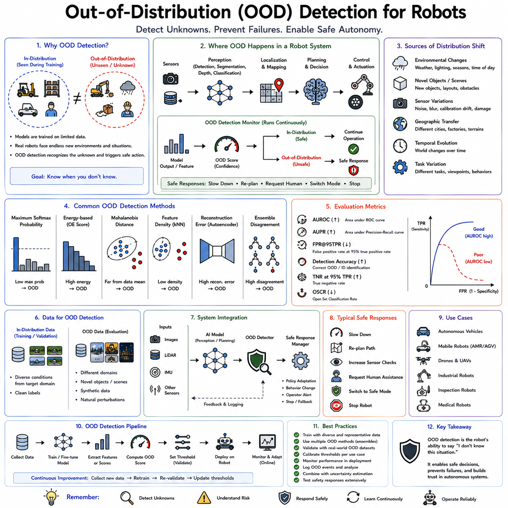{width="7.268055555555556in" height="7.268055555555556in"}

Out-of-Distribution (OOD) detection is a fundamental safety mechanism in modern artificial intelligence that enables a robot to recognize when its current observations differ significantly from the data on which its AI models were trained. Traditional machine learning systems implicitly assume that future inputs originate from the same statistical distribution as the training dataset. In real-world robotics, however, this assumption rarely holds over long periods of operation. Autonomous robots continuously encounter new environments, unfamiliar objects, changing weather conditions, damaged infrastructure, sensor degradation, novel human behaviors, unexpected lighting, and previously unseen task variations. OOD detection provides the capability to recognize these unfamiliar situations and respond safely rather than making highly confident but potentially incorrect predictions. As autonomous robots become increasingly deployed in factories, hospitals, warehouses, public roads, homes, construction sites, agricultural fields, and disaster environments, OOD detection has become one of the most important components of AI safety, reliability, and trustworthy autonomous operation.

The motivation for OOD detection originates from one of the most fundamental limitations of supervised learning. During training, neural networks optimize their parameters using finite datasets collected under specific operating conditions. Although these datasets may contain millions of examples, they can never represent every possible situation encountered during deployment. Consequently, the learned decision boundaries accurately describe only a limited region of the enormous real-world state space. When the robot encounters observations outside this learned region, conventional neural networks often continue producing confident predictions despite having little meaningful knowledge about the situation. OOD detection aims to identify precisely these situations before incorrect predictions propagate into planning and control decisions.

To understand the concept of distribution shift, consider an autonomous warehouse robot trained using images collected inside a modern logistics center. During deployment, the same robot may later operate in older warehouses with different shelf designs, damaged lighting systems, unusual floor markings, seasonal inventory, construction equipment, or emergency evacuation scenarios. Although these environments remain recognizable to humans, they may differ substantially from the statistical properties of the training data. The robot\'s perception system therefore operates outside its intended distribution even though it continues receiving apparently normal camera images.

The distinction between in-distribution and out-of-distribution data forms the conceptual foundation of OOD detection. In-distribution samples resemble the examples observed during training with respect to appearance, sensor characteristics, semantic content, environmental conditions, and statistical properties. Out-of-distribution samples differ sufficiently that the neural network cannot reliably generalize its learned representations. The challenge lies in recognizing these differences automatically before unsafe decisions occur.

OOD conditions arise from numerous sources in robotic systems. Environmental variation represents one of the most common causes. Outdoor robots experience changing weather, snow, rain, fog, dust, seasonal vegetation, nighttime operation, direct sunlight, reflections, and construction activity. Indoor robots encounter furniture rearrangement, temporary obstacles, changing inventory, altered lighting, and dynamic human activity. Even gradual environmental evolution may eventually move observations beyond the model\'s training distribution.

Novel object appearance represents another important source of distribution shift. Industrial robots may encounter newly introduced products, unfamiliar tools, replacement machinery, damaged components, or modified packaging. Service robots operating in homes may observe new household objects, decorations, furniture, pets, or assistive devices never included in their original training datasets.

Sensor variation also contributes significantly to OOD conditions. Camera aging, lens contamination, focus changes, calibration drift, exposure variation, motion blur, dead pixels, compression artifacts, or hardware replacement gradually alter sensor observations. LiDAR sensors accumulate dust, radar performance changes under adverse weather, and inertial measurement units experience calibration drift. Although these changes may appear minor individually, their cumulative effect may substantially alter input distributions.

Geographical transfer presents another common challenge. Autonomous robots trained in one city, factory, hospital, or agricultural region often experience reduced performance when deployed elsewhere. Road markings, building architecture, vegetation, equipment layouts, signage, construction materials, cultural practices, and environmental characteristics vary geographically, producing natural distribution shifts that require detection.

Temporal evolution further complicates deployment. AI models may remain unchanged while the surrounding world evolves continuously. Warehouses reorganize inventory, hospitals renovate facilities, factories introduce new production lines, agricultural fields change throughout growing seasons, and cities undergo infrastructure maintenance. OOD detection enables robots to recognize these gradual environmental changes rather than assuming operational conditions remain constant indefinitely.

Task variation introduces additional uncertainty. A manipulation robot trained to handle specific product categories may later receive unfamiliar objects with different materials, shapes, textures, weights, or mechanical properties. Navigation robots may receive new mission objectives requiring operation within previously unexplored facility regions. These task changes often produce observations outside the original training distribution.

OOD detection differs fundamentally from ordinary classification. Conventional neural networks attempt to assign every input to one of several predefined categories regardless of familiarity. OOD detection introduces an additional capability: recognizing that the current observation does not belong to any familiar category. Instead of forcing uncertain observations into inappropriate classifications, the system explicitly identifies unfamiliarity itself.

One of the simplest approaches relies on prediction confidence. Neural networks frequently produce probability distributions across output classes using the softmax function. Intuitively, highly uncertain predictions should correspond to unfamiliar inputs. Unfortunately, conventional neural networks often remain overconfident even when presented with entirely unrelated data. Consequently, raw confidence scores alone provide unreliable OOD detection.

Confidence calibration attempts to improve this behavior by aligning predicted confidence with actual prediction reliability. Temperature scaling, probability calibration, Bayesian inference, ensemble averaging, and uncertainty estimation reduce excessive confidence while preserving classification accuracy. Better-calibrated confidence estimates improve OOD detection but rarely eliminate the problem entirely.

Maximum Softmax Probability represents one of the earliest practical OOD detection methods. Inputs producing unusually low maximum prediction probabilities are considered potentially out-of-distribution. Although computationally efficient, this approach struggles because neural networks frequently assign extremely high confidence to unfamiliar observations.

Energy-based detection improves upon probability-based methods by evaluating neural network logits before softmax normalization. Energy scores often separate in-distribution and out-of-distribution samples more effectively than normalized probabilities because they preserve richer information regarding model confidence.

Feature-space methods examine internal neural representations rather than final predictions. Deep networks progressively transform raw sensor data into increasingly abstract feature embeddings. In-distribution samples generally occupy well-defined regions of feature space, whereas unfamiliar observations often produce feature representations distant from known clusters. Measuring distances within latent feature space therefore provides an effective mechanism for detecting OOD inputs.

Mahalanobis distance represents one widely used feature-space metric. Rather than measuring simple Euclidean distance, Mahalanobis distance accounts for feature covariance, producing more accurate estimates of how unusual an embedding appears relative to known training distributions. Samples lying far from learned feature clusters receive elevated OOD scores.

Nearest-neighbor approaches similarly evaluate similarity between current observations and stored training representations. If no sufficiently similar examples exist within feature space, the observation is classified as potentially out-of-distribution. Approximate nearest-neighbor algorithms enable efficient implementation even for large datasets.

Density estimation methods attempt to model the probability distribution of training data directly. Inputs assigned extremely low probability under this learned distribution become OOD candidates. Gaussian mixture models, normalizing flows, autoregressive models, and energy-based generative models all support various forms of density estimation.

Autoencoders provide another widely studied approach. During training, autoencoders learn to reconstruct familiar inputs accurately while compressing them into lower-dimensional latent representations. When presented with unfamiliar observations, reconstruction quality often deteriorates because the learned latent space cannot represent novel structures efficiently. Reconstruction error therefore serves as an OOD indicator.

Variational Autoencoders extend this idea through probabilistic latent representations. Instead of learning deterministic encodings, latent variables follow learned probability distributions. Samples producing unlikely latent representations may indicate out-of-distribution conditions while simultaneously providing uncertainty estimates.

Generative Adversarial Networks also contribute to OOD detection. Adversarial training encourages generators to reproduce training distributions accurately. Inputs difficult for the generator or discriminator to explain often correspond to unfamiliar observations requiring additional caution.

Normalizing flows offer exact likelihood estimation through invertible neural network transformations. Unlike approximate generative methods, normalizing flows compute precise probability densities, making them attractive for probabilistic OOD detection despite increased computational complexity.

Bayesian neural networks represent another important family of OOD methods. Instead of learning fixed network parameters, Bayesian approaches estimate probability distributions over parameters themselves. During inference, parameter uncertainty propagates into prediction uncertainty, providing richer information regarding unfamiliar inputs.

Monte Carlo Dropout approximates Bayesian inference using repeated stochastic forward passes. By enabling dropout during inference and evaluating multiple predictions, the model estimates epistemic uncertainty arising from limited knowledge rather than inherent environmental randomness. Elevated epistemic uncertainty frequently indicates out-of-distribution conditions.

Deep ensembles constitute one of the most reliable uncertainty estimation methods. Multiple independently trained neural networks evaluate identical inputs, and prediction disagreement provides an estimate of uncertainty. Since different models typically respond differently to unfamiliar observations, ensemble variance serves as an effective OOD indicator.

Evidential deep learning directly predicts probability distributions over class probabilities rather than single deterministic predictions. This framework distinguishes uncertainty arising from conflicting evidence from uncertainty resulting from insufficient evidence, providing more informative confidence estimates.

Foundation models introduce new opportunities for OOD detection. Large-scale self-supervised pretraining produces rich semantic representations spanning broad visual, linguistic, and multimodal domains. These representations often generalize substantially better than task-specific supervised models, reducing sensitivity to moderate distribution shifts. Nevertheless, even foundation models encounter unfamiliar situations requiring explicit uncertainty estimation.

Vision-language models further improve semantic understanding by integrating textual knowledge with visual perception. A robot encountering unfamiliar objects may recognize semantic relationships through language descriptions even when exact visual appearances differ from training examples. Such multimodal reasoning complements traditional OOD detection rather than replacing it.

Temporal consistency provides another powerful source of information. Robotic systems continuously observe evolving environments rather than isolated images. Consecutive observations should generally change smoothly according to physical dynamics. Abrupt unexplained prediction changes, inconsistent object identities, or discontinuous semantic interpretations often indicate distribution shifts, sensor failures, or unexpected environmental conditions.

Sensor fusion significantly strengthens OOD robustness. Independent sensing modalities exhibit distinct failure characteristics. Cameras suffer under poor illumination, while LiDAR continues measuring geometry accurately. Radar penetrates adverse weather, and inertial sensors provide reliable motion estimates independent of visual conditions. Combining multiple modalities allows robots to distinguish genuine environmental novelty from isolated sensor failures.

World models provide higher-level semantic verification. Rather than evaluating observations independently, robots maintain internal models describing object permanence, physical dynamics, environmental constraints, and causal relationships. Observations violating learned physical consistency may indicate unfamiliar situations requiring additional caution.

Runtime monitoring integrates OOD detection into complete robotic systems. Instead of merely assigning OOD labels, monitoring systems continuously evaluate prediction confidence, feature distributions, sensor consistency, computational anomalies, environmental conditions, and historical operational behavior. Suspicious situations trigger appropriate safety responses according to application requirements.

Safe response strategies are equally important as OOD detection itself. Recognizing unfamiliarity provides little benefit unless the robot responds appropriately. Depending upon operational context, responses may include reducing motion speed, increasing obstacle clearance margins, requesting additional sensor observations, switching to conservative planning algorithms, notifying human supervisors, activating redundant perception systems, or transitioning into predefined safe states.

Autonomous vehicles provide one of the most demanding OOD deployment scenarios. Road construction, emergency vehicles, unusual weather, damaged infrastructure, temporary traffic signs, accidents, pedestrians behaving unexpectedly, and unfamiliar vehicle types all introduce distribution shifts potentially affecting safety-critical perception. OOD detection enables autonomous driving systems to increase caution rather than assuming standard operating conditions.

Industrial robots similarly encounter evolving manufacturing environments. New product designs, altered packaging, modified conveyor systems, maintenance activities, temporary workstations, replacement equipment, and changing lighting conditions all create unfamiliar observations. OOD detection allows production systems to maintain safety despite ongoing process evolution.

Warehouse robots experience continuous inventory turnover. Seasonal products, temporary storage arrangements, pallet variations, packaging redesigns, temporary construction barriers, and varying human traffic patterns naturally produce distribution shifts. Robust OOD detection improves operational reliability while reducing unnecessary interruptions.

Healthcare robotics presents additional challenges because patient populations vary substantially. Anatomical variation, medical equipment updates, unusual clinical presentations, emergency situations, and evolving treatment protocols introduce unfamiliar operating conditions. Conservative OOD detection becomes particularly valuable where patient safety remains paramount.

Agricultural robotics faces naturally changing environments. Plant growth, seasonal weather, disease progression, soil variation, irrigation changes, harvest conditions, and evolving crop appearance continually modify visual observations. OOD detection supports adaptive operation throughout agricultural production cycles.

Benchmarking OOD detection requires carefully designed evaluation protocols. Standard image classification accuracy proves insufficient because models must recognize unfamiliarity rather than simply classify known categories. Benchmarks therefore evaluate true positive detection rates, false positive rates, area under receiver operating characteristic curves, precision-recall relationships, calibration quality, uncertainty estimation accuracy, and computational overhead.

False positive OOD detections reduce operational efficiency because familiar situations become unnecessarily classified as unfamiliar. Excessive false alarms may encourage operators to ignore warnings, reducing overall system effectiveness. Balancing sensitivity against operational practicality therefore represents an important engineering consideration.

False negatives generally pose greater safety risks. Here genuinely unfamiliar observations remain undetected, allowing overconfident predictions to influence robot behavior. Minimizing false negatives therefore receives particular emphasis in safety-critical robotics despite occasional increases in false positive rates.

Computational efficiency also influences deployment practicality. Many sophisticated OOD algorithms require multiple forward passes, ensemble evaluation, or complex probabilistic computations incompatible with strict real-time constraints. Embedded robotic platforms therefore favor methods balancing detection quality with computational cost.

Future research increasingly investigates continual OOD adaptation. Rather than merely detecting unfamiliar observations, robots will gradually incorporate validated experiences into evolving knowledge bases while preserving safety throughout the learning process. This integration of OOD detection with lifelong learning promises robots capable of expanding operational competence without sacrificing reliability.

Multimodal embodied intelligence introduces additional research challenges. Future robots will integrate vision, language, force sensing, audio, tactile perception, proprioception, world models, and long-term memory within unified architectures. OOD detection must therefore evaluate unfamiliarity across multiple interacting modalities rather than treating each sensor independently.

Ultimately, Out-of-Distribution detection represents a fundamental transition from assuming that artificial intelligence always understands its environment to explicitly recognizing the limits of learned knowledge. Rather than forcing every observation into predefined categories, safe robotic systems acknowledge uncertainty, detect unfamiliar situations, and adapt their behavior accordingly. By combining uncertainty estimation, probabilistic modeling, feature-space analysis, generative learning, sensor fusion, temporal consistency, runtime monitoring, and conservative safety policies, OOD detection enables autonomous robots to recognize when they are operating beyond their experience. This capability forms a cornerstone of trustworthy Physical AI, allowing intelligent machines to remain reliable, cautious, and safe while navigating the enormous diversity and unpredictability of the real world.

분포 외(Out-of-Distribution, OOD) 감지는 로봇이 현재의 관측치가 자신의 AI 모델이 학습된 데이터와 상당히 다를 때를 인식할 수 있게 하는, 현대 인공지능의 근본적인 안전 메커니즘이다. 전통적인 머신러닝 시스템은 암묵적으로 미래의 입력이 학습 데이터셋과 동일한 통계적 분포로부터 비롯된다고 가정한다. 그러나 실제 세계의 로보틱스에서, 이러한 가정은 장기간의 운영에 걸쳐 유지되는 경우가 드물다. 자율 로봇은 새로운 환경, 낯선 물체, 변화하는 날씨 조건, 손상된 인프라, 센서 저하, 새로운 인간의 행동, 예상치 못한 조명, 이전에 본 적 없는 태스크 변형을 지속적으로 마주친다. OOD 감지는 이러한 낯선 상황을 인식하고, 매우 자신감 있지만 잠재적으로 부정확한 예측을 만드는 대신 안전하게 대응할 수 있는 능력을 제공한다. 자율 로봇이 공장, 병원, 창고, 공공 도로, 가정, 건설 현장, 농경지, 재난 환경에 점점 더 많이 배치됨에 따라, OOD 감지는 AI 안전성, 신뢰성, 신뢰할 수 있는 자율 운영의 가장 중요한 구성 요소 중 하나가 되었다.

OOD 감지의 동기는 지도학습의 가장 근본적인 한계 중 하나에서 비롯된다. 학습 과정에서, 신경망은 특정한 운영 조건 하에서 수집된 유한한 데이터셋을 사용해 자신의 파라미터를 최적화한다. 이러한 데이터셋들이 수백만 개의 예제를 포함할 수 있지만, 이들은 배치 과정에서 마주치는 모든 가능한 상황을 결코 대표할 수 없다. 따라서 학습된 결정 경계는 방대한 실제 세계의 상태 공간 중 제한된 영역만을 정확하게 기술한다. 로봇이 이 학습된 영역을 벗어난 관측치를 마주칠 때, 전통적인 신경망은 그 상황에 대해 의미 있는 지식을 거의 갖고 있지 않음에도 불구하고 종종 자신감 있는 예측을 계속 만들어낸다. OOD 감지는 부정확한 예측이 계획 수립과 제어 결정으로 전파되기 전에 정확히 이러한 상황들을 식별하는 것을 목표로 한다.

분포 변화(distribution shift)라는 개념을 이해하기 위해, 현대적인 물류 센터 내부에서 수집된 이미지를 사용해 학습된 자율 창고 로봇을 생각해 보자. 배치 과정에서, 동일한 로봇은 이후에 서로 다른 선반 설계, 손상된 조명 시스템, 특이한 바닥 표시, 계절적 재고, 건설 장비, 또는 비상 대피 시나리오를 지닌 더 오래된 창고에서 작동할 수 있다. 이러한 환경들이 인간에게는 여전히 인식 가능한 채로 남아 있지만, 학습 데이터의 통계적 속성과는 상당히 다를 수 있다. 따라서 로봇의 인지 시스템은 겉으로는 정상적인 카메라 이미지를 계속 받고 있음에도 불구하고 자신의 의도된 분포를 벗어나 작동하게 된다.

분포 내(in-distribution) 데이터와 분포 외(out-of-distribution) 데이터 사이의 구분은 OOD 감지의 개념적 기반을 형성한다. 분포 내 샘플은 외관, 센서 특성, 의미론적 내용, 환경 조건, 통계적 속성 측면에서 학습 과정에서 관찰된 예제들과 유사하다. 분포 외 샘플은 신경망이 학습된 표현을 신뢰성 있게 일반화할 수 없을 정도로 충분히 다르다. 과제는 안전하지 않은 결정이 발생하기 전에 이러한 차이들을 자동으로 인식하는 데 있다.

OOD 조건은 로봇 시스템의 수많은 원천으로부터 발생한다. 환경적 변동은 가장 흔한 원인 중 하나를 나타낸다. 실외 로봇은 변화하는 날씨, 눈, 비, 안개, 먼지, 계절적 식생, 야간 작동, 직사광선, 반사, 건설 활동을 경험한다. 실내 로봇은 가구 재배치, 임시 장애물, 변화하는 재고, 변경된 조명, 동적인 인간의 활동을 마주친다. 점진적인 환경적 진화조차도 결국 관측치를 모델의 학습 분포를 벗어나게 만들 수 있다.

새로운 물체의 등장은 분포 변화의 또 다른 중요한 원천을 나타낸다. 산업용 로봇은 새로 도입된 제품, 낯선 도구, 교체된 기계, 손상된 구성 요소, 또는 수정된 포장을 마주칠 수 있다. 가정에서 작동하는 서비스 로봇은 원래의 학습 데이터셋에는 포함되지 않았던 새로운 가정용 물건, 장식품, 가구, 애완동물, 또는 보조 기기를 관찰할 수 있다.

센서 변동도 OOD 조건에 상당히 기여한다. 카메라의 노화, 렌즈 오염, 초점 변화, 보정의 드리프트, 노출 변동, 모션 블러, 데드 픽셀, 압축 아티팩트, 또는 하드웨어 교체는 센서 관측치를 점진적으로 변화시킨다. LiDAR 센서에는 먼지가 축적되고, 레이더의 성능은 악천후 하에서 변하며, 관성 측정 장치는 보정 드리프트를 경험한다. 이러한 변화들이 개별적으로는 미미해 보일 수 있지만, 그 누적된 영향은 입력 분포를 상당히 변화시킬 수 있다.

지리적 이전(geographical transfer)은 또 다른 흔한 과제를 제시한다. 하나의 도시, 공장, 병원, 또는 농경 지역에서 학습된 자율 로봇은 다른 곳에 배치되었을 때 종종 저하된 성능을 경험한다. 도로 표시, 건물의 건축 양식, 식생, 장비 배치, 표지판, 건설 재료, 문화적 관행, 환경적 특성은 지리적으로 다양하여, 감지가 필요한 자연스러운 분포 변화를 만들어낸다.

시간적 진화는 배치를 더욱 복잡하게 만든다. 주변 세계가 지속적으로 진화하는 동안 AI 모델은 변하지 않은 채로 남아 있을 수 있다. 창고는 재고를 재배치하고, 병원은 시설을 리모델링하며, 공장은 새로운 생산 라인을 도입하고, 농경지는 성장 시즌에 걸쳐 변하며, 도시는 인프라 유지보수를 겪는다. OOD 감지는 운영 조건이 무기한 일정하게 유지된다고 가정하는 대신, 로봇이 이러한 점진적인 환경 변화를 인식할 수 있게 한다.

태스크의 변동은 추가적인 불확실성을 도입한다. 특정 제품 범주를 다루도록 학습된 조작 로봇은 나중에 서로 다른 재질, 형태, 텍스처, 무게, 또는 기계적 속성을 지닌 낯선 물체를 받을 수 있다. 내비게이션 로봇은 이전에 탐색되지 않은 시설 영역 내에서의 운영을 필요로 하는 새로운 임무 목표를 받을 수 있다. 이러한 태스크의 변화는 종종 원래의 학습 분포를 벗어나는 관측치를 만들어낸다.

OOD 감지는 일반적인 분류와 근본적으로 다르다. 전통적인 신경망은 친숙함과 무관하게 모든 입력을 여러 사전에 정의된 범주들 중 하나에 할당하려고 시도한다. OOD 감지는 추가적인 능력을 도입한다: 현재의 관측치가 어떤 친숙한 범주에도 속하지 않는다는 것을 인식하는 것이다. 불확실한 관측치를 부적절한 분류로 강제하는 대신, 시스템은 낯섦 자체를 명시적으로 식별한다.

가장 단순한 접근법 중 하나는 예측의 신뢰도에 의존한다. 신경망은 종종 소프트맥스 함수를 사용해 출력 클래스들에 걸친 확률 분포를 만들어낸다. 직관적으로, 매우 불확실한 예측은 낯선 입력에 대응해야 한다. 안타깝게도, 전통적인 신경망은 완전히 관련 없는 데이터가 주어졌을 때도 종종 과도하게 자신감 있는 상태로 남아 있다. 따라서 원시적인 신뢰도 점수만으로는 신뢰할 수 없는 OOD 감지를 제공한다.

신뢰도 보정(confidence calibration)은 예측된 신뢰도를 실제 예측 신뢰성과 정렬시킴으로써 이러한 행동을 개선하려고 시도한다. 온도 스케일링, 확률 보정, 베이지안 추론, 앙상블 평균화, 불확실성 추정은 분류 정확도를 보존하면서도 과도한 신뢰도를 줄인다. 더 잘 보정된 신뢰도 추정치는 OOD 감지를 향상시키지만 문제를 완전히 제거하는 경우는 드물다.

최대 소프트맥스 확률(Maximum Softmax Probability)은 가장 초기의 실용적인 OOD 감지 방법 중 하나를 나타낸다. 비정상적으로 낮은 최대 예측 확률을 만들어내는 입력은 잠재적으로 분포 외인 것으로 간주된다. 계산적으로 효율적이지만, 이 접근법은 신경망이 낯선 관측치에도 극도로 높은 신뢰도를 자주 할당하기 때문에 어려움을 겪는다.

에너지 기반 감지(energy-based detection)는 소프트맥스 정규화 이전에 신경망의 로짓을 평가함으로써 확률 기반 방법들을 개선한다. 에너지 점수는 모델의 신뢰도에 관한 더 풍부한 정보를 보존하기 때문에 정규화된 확률보다 분포 내 샘플과 분포 외 샘플을 종종 더 효과적으로 구분한다.

특징 공간 방법(feature-space method)은 최종 예측이 아니라 내부적인 신경망 표현을 검사한다. 심층 네트워크는 원본 센서 데이터를 점진적으로 더 추상적인 특징 임베딩으로 변환한다. 분포 내 샘플은 일반적으로 특징 공간의 잘 정의된 영역을 차지하는 반면, 낯선 관측치는 종종 알려진 클러스터로부터 멀리 떨어진 특징 표현을 만들어낸다. 따라서 잠재 특징 공간 내의 거리를 측정하는 것은 OOD 입력을 감지하는 효과적인 메커니즘을 제공한다.

마할라노비스 거리(Mahalanobis distance)는 널리 사용되는 특징 공간 지표 중 하나를 나타낸다. 단순한 유클리드 거리를 측정하는 대신, 마할라노비스 거리는 특징 공분산을 고려하여, 임베딩이 알려진 학습 분포에 비해 얼마나 특이한지에 대한 더 정확한 추정치를 만들어낸다. 학습된 특징 클러스터로부터 멀리 떨어져 있는 샘플들은 높아진 OOD 점수를 받는다.

최근접 이웃(nearest-neighbor) 접근법은 마찬가지로 현재의 관측치와 저장된 학습 표현 사이의 유사도를 평가한다. 특징 공간 내에 충분히 유사한 예제가 존재하지 않는다면, 그 관측치는 잠재적으로 분포 외인 것으로 분류된다. 근사 최근접 이웃 알고리즘은 대규모 데이터셋에 대해서도 효율적인 구현을 가능하게 한다.

밀도 추정 방법(density estimation method)은 학습 데이터의 확률 분포를 직접 모델링하려고 시도한다. 이 학습된 분포 하에서 극도로 낮은 확률이 할당된 입력은 OOD 후보가 된다. 가우시안 혼합 모델, 정규화 흐름(normalizing flow), 자기회귀 모델, 에너지 기반 생성 모델은 모두 다양한 형태의 밀도 추정을 지원한다.

오토인코더(autoencoder)는 또 다른 광범위하게 연구된 접근법을 제공한다. 학습 과정에서, 오토인코더는 친숙한 입력들을 더 낮은 차원의 잠재 표현으로 압축하면서도 이를 정확하게 재구성하는 법을 학습한다. 낯선 관측치가 주어지면, 학습된 잠재 공간이 새로운 구조를 효율적으로 표현할 수 없기 때문에 재구성 품질이 종종 저하된다. 따라서 재구성 오류는 OOD 지표 역할을 한다.

변분 오토인코더(Variational Autoencoder)는 확률적 잠재 표현을 통해 이 아이디어를 확장한다. 결정론적인 인코딩을 학습하는 대신, 잠재 변수는 학습된 확률 분포를 따른다. 있을 법하지 않은 잠재 표현을 만들어내는 샘플들은 불확실성 추정치를 동시에 제공하면서도 분포 외 조건을 나타낼 수 있다.

생성적 적대 신경망(Generative Adversarial Network)도 OOD 감지에 기여한다. 적대적 학습은 생성자가 학습 분포를 정확하게 재현하도록 장려한다. 생성자나 판별자가 설명하기 어려운 입력들은 종종 추가적인 주의가 필요한 낯선 관측치에 대응한다.

정규화 흐름(normalizing flow)은 가역적인 신경망 변환을 통해 정확한 가능도(likelihood) 추정을 제공한다. 근사적인 생성 방법들과 달리, 정규화 흐름은 정밀한 확률 밀도를 계산하여, 늘어난 계산적 복잡성에도 불구하고 확률적 OOD 감지에 매력적으로 만든다.

베이지안 신경망(Bayesian neural network)은 또 다른 중요한 OOD 방법군을 나타낸다. 고정된 네트워크 파라미터를 학습하는 대신, 베이지안 접근법은 파라미터 자체에 대한 확률 분포를 추정한다. 추론 과정에서, 파라미터의 불확실성은 예측의 불확실성으로 전파되어, 낯선 입력에 관한 더 풍부한 정보를 제공한다.

몬테카를로 드롭아웃(Monte Carlo Dropout)은 반복적인 확률적 순방향 전달을 사용해 베이지안 추론을 근사한다. 추론 과정에서 드롭아웃을 활성화하고 여러 예측을 평가함으로써, 모델은 본질적인 환경적 무작위성이 아니라 제한된 지식으로부터 비롯되는 인식적 불확실성(epistemic uncertainty)을 추정한다. 높아진 인식적 불확실성은 종종 분포 외 조건을 나타낸다.

딥 앙상블(deep ensemble)은 가장 신뢰할 수 있는 불확실성 추정 방법 중 하나를 이룬다. 여러 독립적으로 학습된 신경망이 동일한 입력을 평가하며, 예측의 불일치는 불확실성의 추정치를 제공한다. 서로 다른 모델들은 일반적으로 낯선 관측치에 서로 다르게 반응하기 때문에, 앙상블의 분산은 효과적인 OOD 지표 역할을 한다.

증거적 딥러닝(evidential deep learning)은 단일한 결정론적 예측이 아니라 클래스 확률에 대한 확률 분포를 직접 예측한다. 이 프레임워크는 상충하는 증거로부터 비롯되는 불확실성을 불충분한 증거로부터 비롯되는 불확실성과 구별하여, 더 유용한 신뢰도 추정치를 제공한다.

파운데이션 모델은 OOD 감지를 위한 새로운 기회를 도입한다. 대규모 자기지도 사전학습은 광범위한 시각적, 언어적, 멀티모달 도메인에 걸친 풍부한 의미론적 표현을 만들어낸다. 이러한 표현들은 종종 태스크별 지도학습 모델보다 상당히 더 잘 일반화되어, 완만한 분포 변화에 대한 민감도를 줄여준다. 그럼에도 불구하고, 파운데이션 모델조차도 명시적인 불확실성 추정이 필요한 낯선 상황들을 마주친다.

시각-언어 모델은 텍스트 지식을 시각적 인지와 통합함으로써 의미론적 이해를 더욱 향상시킨다. 낯선 물체를 마주친 로봇은, 정확한 시각적 외관이 학습 예제들과 다르더라도 언어적 설명을 통해 의미론적 관계를 인식할 수 있다. 이러한 멀티모달 추론은 전통적인 OOD 감지를 대체하는 것이 아니라 보완한다.

시간적 일관성(temporal consistency)은 또 다른 강력한 정보 원천을 제공한다. 로봇 시스템은 고립된 이미지가 아니라 진화하는 환경을 지속적으로 관찰한다. 연속적인 관측치들은 물리적 역학에 따라 일반적으로 부드럽게 변해야 한다. 갑작스러운 설명할 수 없는 예측 변화, 일관되지 않은 물체의 정체성, 또는 불연속적인 의미론적 해석은 종종 분포 변화, 센서 실패, 또는 예상치 못한 환경 조건을 나타낸다.

센서 융합은 OOD 견고성을 상당히 강화한다. 독립적인 감지 양식들은 서로 다른 실패 특성을 보인다. 카메라는 조명이 나쁠 때 어려움을 겪는 반면, LiDAR는 기하학을 계속 정확하게 측정한다. 레이더는 악천후를 뚫고, 관성 센서는 시각적 조건과 무관하게 신뢰할 수 있는 움직임 추정치를 제공한다. 여러 양식을 결합하는 것은 로봇이 진정한 환경적 새로움을 고립된 센서 실패와 구별할 수 있게 한다.

세계 모델(world model)은 더 높은 수준의 의미론적 검증을 제공한다. 관측치를 독립적으로 평가하는 대신, 로봇은 물체의 항구성, 물리적 역학, 환경적 제약, 인과 관계를 기술하는 내부 모델을 유지한다. 학습된 물리적 일관성을 위반하는 관측치는 추가적인 주의가 필요한 낯선 상황을 나타낼 수 있다.

런타임 모니터링은 OOD 감지를 완전한 로봇 시스템에 통합한다. 단순히 OOD 레이블을 할당하는 대신, 모니터링 시스템은 예측 신뢰도, 특징 분포, 센서 간의 일관성, 계산적 이상, 환경 조건, 과거의 운영 행동을 지속적으로 평가한다. 의심스러운 상황은 응용 분야의 요구사항에 따라 적절한 안전 대응을 촉발한다.

안전한 대응 전략은 OOD 감지 자체만큼이나 중요하다. 낯섦을 인식하는 것은 로봇이 적절하게 대응하지 않는 한 거의 이득을 제공하지 못한다. 운영상의 맥락에 따라, 대응에는 움직임 속도 줄이기, 장애물 여유 마진 늘리기, 추가적인 센서 관측치 요청하기, 보수적인 계획 수립 알고리즘으로 전환하기, 인간 감독자에게 알리기, 중복된 인지 시스템 활성화하기, 또는 사전에 정의된 안전 상태로 전환하기가 포함될 수 있다.

자율주행 차량은 가장 까다로운 OOD 배치 시나리오 중 하나를 제공한다. 도로 공사, 긴급 차량, 특이한 날씨, 손상된 인프라, 임시 교통 표지판, 사고, 예상치 못하게 행동하는 보행자, 낯선 차량 유형은 모두 안전이 중요한 인지에 잠재적으로 영향을 미치는 분포 변화를 도입한다. OOD 감지는 자율주행 시스템이 표준적인 운영 조건을 가정하는 대신 주의를 늘릴 수 있게 한다.

산업용 로봇도 마찬가지로 진화하는 제조 환경을 마주친다. 새로운 제품 설계, 변경된 포장, 수정된 컨베이어 시스템, 유지보수 활동, 임시 작업대, 교체 장비, 변화하는 조명 조건은 모두 낯선 관측치를 만들어낸다. OOD 감지는 진행 중인 공정의 진화에도 불구하고 생산 시스템이 안전성을 유지할 수 있게 한다.

창고 로봇은 지속적인 재고 회전을 경험한다. 계절 상품, 임시 보관 배치, 팔레트 변형, 포장 재설계, 임시 공사 장벽, 다양한 인간의 통행 패턴은 자연스럽게 분포 변화를 만들어낸다. 견고한 OOD 감지는 불필요한 중단을 줄이면서도 운영상의 신뢰성을 향상시킨다.

헬스케어 로보틱스는 환자 인구가 상당히 다양하기 때문에 추가적인 과제를 제시한다. 해부학적 변이, 의료 장비 업데이트, 특이한 임상 증상, 응급 상황, 진화하는 치료 프로토콜은 낯선 운영 조건을 도입한다. 환자의 안전이 가장 중요하게 남아 있는 곳에서는 보수적인 OOD 감지가 특히 유용해진다.

농업 로보틱스는 자연스럽게 변화하는 환경을 마주한다. 식물의 성장, 계절적 날씨, 질병의 진행, 토양의 변동, 관개 변화, 수확 조건, 진화하는 작물의 외관은 시각적 관측치를 지속적으로 수정한다. OOD 감지는 농업 생산 주기 전반에 걸친 적응형 운영을 지원한다.

OOD 감지를 벤치마킹하는 것은 신중하게 설계된 평가 프로토콜을 필요로 한다. 모델이 단순히 알려진 범주를 분류하는 것이 아니라 낯섦을 인식해야 하기 때문에 표준적인 이미지 분류 정확도는 불충분한 것으로 입증된다. 따라서 벤치마크는 진짜 양성 감지율, 거짓 양성률, 수신자 조작 특성 곡선 아래 면적, 정밀도-재현율 관계, 보정 품질, 불확실성 추정 정확도, 계산적 오버헤드를 평가한다.

거짓 양성 OOD 감지는 친숙한 상황이 불필요하게 낯선 것으로 분류되기 때문에 운영상의 효율성을 떨어뜨린다. 과도한 오경보는 조작자들이 경고를 무시하도록 장려하여, 전체적인 시스템 효과성을 떨어뜨릴 수 있다. 따라서 민감도와 운영상의 실용성 사이의 균형을 맞추는 것은 중요한 공학적 고려사항을 나타낸다.

거짓 음성은 일반적으로 더 큰 안전상의 위험을 제기한다. 여기서 진정으로 낯선 관측치는 감지되지 않은 채로 남아 있어, 지나치게 자신감 있는 예측이 로봇의 행동에 영향을 미치도록 허용한다. 따라서 안전이 중요한 로보틱스에서는, 거짓 양성률의 때때로의 증가에도 불구하고 거짓 음성을 최소화하는 것에 특별한 강조가 주어진다.

계산 효율성도 배치의 실용성에 영향을 미친다. 많은 정교한 OOD 알고리즘은 엄격한 실시간 제약과 호환되지 않는 여러 번의 순방향 전달, 앙상블 평가, 또는 복잡한 확률적 계산을 필요로 한다. 따라서 임베디드 로봇 플랫폼은 감지 품질을 계산 비용과 균형을 맞추는 방법들을 선호한다.

미래의 연구는 지속적인 OOD 적응을 점점 더 많이 조사하고 있다. 단순히 낯선 관측치를 감지하는 것을 넘어, 로봇은 학습 과정 내내 안전성을 보존하면서도 검증된 경험들을 진화하는 지식 기반에 점진적으로 통합할 것이다. OOD 감지와 평생 학습의 이러한 통합은, 신뢰성을 희생하지 않고도 운영상의 능력을 확장할 수 있는 로봇을 약속한다.

멀티모달 체화 지능은 추가적인 연구 과제를 도입한다. 미래의 로봇은 시각, 언어, 힘 감지, 오디오, 촉각 인지, 고유수용감각, 세계 모델, 장기 기억을 통합된 아키텍처 내에 통합할 것이다. 따라서 OOD 감지는 각각의 센서를 독립적으로 취급하는 것이 아니라 여러 상호작용하는 양식들에 걸쳐 낯섦을 평가해야 한다.

궁극적으로, 분포 외 감지는 인공지능이 항상 자신의 환경을 이해한다고 가정하는 것으로부터 학습된 지식의 한계를 명시적으로 인식하는 것으로의 근본적인 전환을 나타낸다. 모든 관측치를 사전에 정의된 범주로 강제하는 대신, 안전한 로봇 시스템은 불확실성을 인정하고, 낯선 상황을 감지하며, 그에 따라 자신의 행동을 적응시킨다. 불확실성 추정, 확률적 모델링, 특징 공간 분석, 생성적 학습, 센서 융합, 시간적 일관성, 런타임 모니터링, 보수적인 안전 정책을 결합함으로써, OOD 감지는 자율 로봇이 자신의 경험을 넘어 작동하고 있을 때를 인식할 수 있게 한다. 이러한 능력은 신뢰할 수 있는 Physical AI의 초석을 형성하며, 이를 통해 지능형 기계가 실제 세계의 엄청난 다양성과 예측 불가능성을 헤쳐나가면서도 신뢰할 수 있고, 조심스러우며, 안전한 상태를 유지할 수 있게 한다.

##  

## 11.04 Uncertainty Quantification Bayesian Ensemble [w/Code]

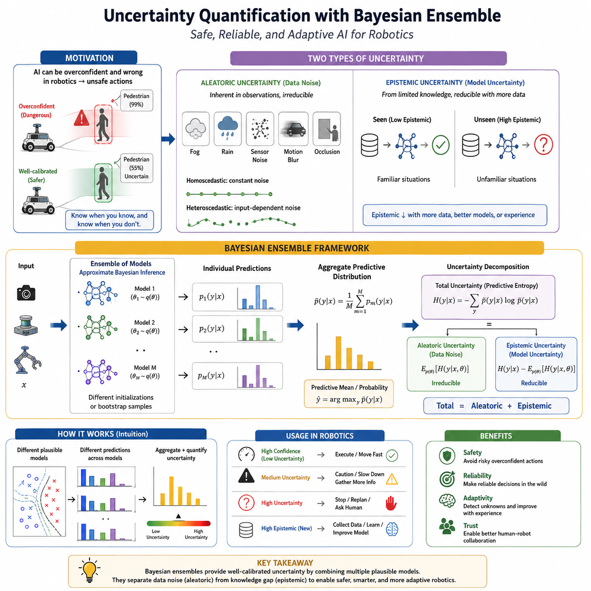{width="7.268055555555556in" height="7.268055555555556in"}

Uncertainty quantification is one of the foundational technologies for safe and trustworthy artificial intelligence in robotics because it enables a robot to estimate not only what it believes but also how confident it should be in those beliefs. Traditional deep neural networks typically produce a single prediction, such as an object category, depth estimate, navigation command, or control action, without explicitly expressing the reliability of that prediction. In many applications this limitation is acceptable, but in autonomous robotics, incorrect predictions made with excessive confidence can lead directly to unsafe physical behavior. An autonomous mobile robot that confidently misidentifies a pedestrian, a medical robot that incorrectly classifies anatomical structures, or an industrial manipulator that overestimates the certainty of object pose estimation may produce hazardous actions. Uncertainty quantification addresses this problem by attaching meaningful confidence estimates to AI predictions, allowing robotic systems to recognize situations in which additional sensing, slower operation, human intervention, or conservative planning becomes necessary.

The motivation for uncertainty quantification arises from the distinction between intelligence and reliability. A highly accurate neural network may still occasionally produce severe errors, particularly when operating outside its training distribution or under unusual environmental conditions. Conventional neural networks often generate extremely confident predictions even when they have never encountered similar inputs during training. This phenomenon, commonly referred to as overconfidence, represents one of the major safety concerns in modern artificial intelligence. Reliable robotic systems must therefore distinguish between predictions supported by strong evidence and predictions based upon limited or uncertain knowledge.

Uncertainty differs fundamentally from prediction accuracy. Accuracy measures how often a model produces correct outputs on benchmark datasets. Uncertainty measures the model\'s own awareness of the limits of its knowledge. An ideal AI system produces high confidence when predictions are reliable and low confidence when uncertainty is substantial. Such calibrated behavior allows downstream planning, control, and human supervision systems to make informed decisions regarding operational safety.

Two primary forms of uncertainty are generally recognized in machine learning: aleatoric uncertainty and epistemic uncertainty. Understanding the distinction between these two uncertainty sources is central to uncertainty-aware robotics because they arise from fundamentally different causes and require different mitigation strategies.

Aleatoric uncertainty represents uncertainty inherent in the observed data itself. It originates from measurement noise, sensor limitations, environmental variability, motion blur, lighting changes, weather conditions, occlusions, communication noise, and other sources of randomness that cannot be eliminated even with unlimited training data. For example, a camera operating in dense fog naturally produces ambiguous images. A LiDAR scanning heavy rain encounters noisy reflections. A force sensor measuring contact during manipulation experiences mechanical vibration. These uncertainties arise from the physical world rather than from deficiencies in the learning algorithm.

Aleatoric uncertainty may be homoscedastic or heteroscedastic. Homoscedastic uncertainty remains approximately constant across all observations. A camera sensor with fixed measurement noise provides one example. Heteroscedastic uncertainty varies depending upon the input itself. Images captured under bright daylight may exhibit low uncertainty, whereas identical scenes observed at night or during heavy rain become substantially more uncertain. Modern neural networks frequently learn to estimate input-dependent uncertainty directly, allowing robots to adapt their behavior according to environmental conditions.

Epistemic uncertainty represents uncertainty arising from incomplete knowledge. Unlike aleatoric uncertainty, epistemic uncertainty can theoretically be reduced by collecting additional training data or improving the model. It reflects the model\'s ignorance regarding regions of the input space insufficiently represented during learning. When a warehouse robot encounters a completely new type of pallet, or an autonomous vehicle observes unfamiliar road infrastructure, epistemic uncertainty becomes high because the model lacks prior experience with similar situations.

The distinction between these uncertainty types has important operational implications. Aleatoric uncertainty generally cannot be eliminated through additional training because it originates from irreducible environmental variability. Epistemic uncertainty, however, identifies opportunities for model improvement through additional data collection, retraining, or continual learning.

Probabilistic machine learning provides the mathematical foundation for uncertainty quantification. Instead of producing only deterministic predictions, probabilistic models estimate probability distributions over possible outcomes. Rather than predicting that an object belongs exclusively to one category, the model estimates probabilities associated with multiple possible interpretations while also expressing uncertainty regarding those probabilities.

Bayesian inference represents one of the most principled approaches to probabilistic reasoning. Classical neural networks optimize fixed parameter values during training and subsequently treat these parameters as certain. Bayesian neural networks instead represent model parameters as probability distributions. Rather than assuming each weight possesses one precise value, Bayesian methods estimate distributions describing plausible parameter values consistent with observed training data.

This probabilistic interpretation fundamentally changes inference. Predictions no longer arise from a single deterministic model but instead integrate over many possible parameter configurations weighted according to their posterior probabilities. The resulting predictive distribution naturally incorporates uncertainty arising from limited knowledge.

Bayes\' theorem provides the mathematical basis for this approach. Prior distributions represent knowledge before observing training data, likelihood functions describe how probable observed data appear under different parameter values, and posterior distributions combine both sources of information into updated beliefs. Bayesian learning therefore continuously refines uncertainty as additional evidence becomes available.

Exact Bayesian inference remains computationally intractable for modern deep neural networks because contemporary models often contain millions or billions of parameters. Calculating complete posterior distributions over such enormous parameter spaces exceeds practical computational capabilities. Consequently, practical Bayesian deep learning relies upon various approximation methods.

Variational Bayesian inference approximates complex posterior distributions using simpler parameterized distributions optimized to resemble the true posterior as closely as possible. Instead of calculating exact probabilities, optimization minimizes divergence between approximate and exact distributions. Variational methods provide tractable Bayesian approximations suitable for large neural networks.

Markov Chain Monte Carlo methods represent another classical Bayesian approximation technique. Rather than explicitly representing the posterior distribution, these algorithms generate samples whose long-term distribution approximates the desired posterior. Although theoretically attractive, MCMC methods generally remain computationally expensive for large-scale deep learning deployment.

Monte Carlo Dropout offers one of the simplest practical approximations to Bayesian inference. Dropout layers, originally introduced as regularization during training, remain active during inference. Multiple stochastic forward passes produce slightly different predictions because different neurons are randomly disabled each time. The resulting prediction variability approximates epistemic uncertainty while requiring only modest architectural modifications.

The elegance of Monte Carlo Dropout lies in its practicality. Existing neural networks often require only minimal modifications, making Bayesian uncertainty estimation accessible without completely redesigning model architectures. Repeated inference produces predictive distributions whose variance reflects uncertainty regarding model knowledge.

Deep ensembles have emerged as one of the most effective uncertainty estimation techniques for practical robotics. Instead of training a single neural network, multiple independently initialized models are trained using identical datasets. Although architectures remain the same, stochastic optimization causes each network to converge toward different local optima within parameter space.

During inference, every ensemble member evaluates the same input independently. Final predictions arise from averaging individual outputs, while disagreement among ensemble members provides a direct estimate of epistemic uncertainty. When all models agree strongly, confidence remains high. When predictions diverge substantially, uncertainty increases because different plausible models interpret the observation differently.

One remarkable property of deep ensembles is that they frequently outperform more theoretically sophisticated Bayesian approximations despite their conceptual simplicity. Independent optimization naturally captures model diversity without requiring complex posterior estimation algorithms. Consequently, deep ensembles have become a practical standard for uncertainty-aware robotics.

Model diversity plays a critical role in ensemble effectiveness. If all ensemble members remain nearly identical, uncertainty estimates become uninformative. Diversity arises naturally through random parameter initialization, shuffled training data, stochastic gradient optimization, data augmentation, or architectural variation. Greater diversity generally improves uncertainty estimation while increasing computational requirements.

Snapshot ensembles reduce computational cost by exploiting different optimization states of a single training process. Instead of training multiple networks independently, parameters are periodically saved during optimization and later combined into an ensemble. Although diversity decreases somewhat compared with independently trained models, computational efficiency improves substantially.

Bootstrap aggregation, commonly known as bagging, further enhances ensemble diversity. Each network trains on a slightly different subset of the available data sampled with replacement. Consequently, models develop distinct representations reflecting different training experiences. Prediction disagreement therefore better captures uncertainty arising from limited data availability.

Bayesian last-layer methods provide another compromise between computational efficiency and uncertainty estimation quality. Rather than modeling uncertainty across all neural network parameters, only the final prediction layer receives Bayesian treatment while earlier feature extraction layers remain deterministic. This significantly reduces computational complexity while preserving meaningful predictive uncertainty.

Probabilistic output layers extend deterministic neural networks by directly predicting probability distributions instead of single numerical values. Regression networks may estimate both predicted values and associated variances. Classification models may predict confidence distributions reflecting uncertainty regarding class membership.

Gaussian processes represent another important probabilistic modeling approach. Unlike neural networks that learn fixed parameterized functions, Gaussian processes define distributions over possible functions themselves. Predictions therefore naturally include uncertainty estimates increasing with distance from observed training data. Although computational complexity limits large-scale deployment, Gaussian processes remain valuable for many robotics applications involving moderate dataset sizes.

Deep Gaussian processes combine neural network representation learning with Gaussian process uncertainty estimation. These hybrid architectures attempt to capture both expressive nonlinear feature extraction and principled probabilistic inference, although computational demands remain significant.

Evidential deep learning introduces an alternative framework inspired by evidence theory. Rather than directly predicting class probabilities, the network estimates evidence supporting each possible class. Total available evidence determines prediction confidence, allowing the model to distinguish between uncertainty arising from conflicting observations and uncertainty resulting from insufficient information.

Dirichlet distributions frequently appear in evidential classification because they naturally represent uncertainty over categorical probability distributions. Instead of producing single probability vectors, predictions become distributions over possible probability vectors, providing substantially richer uncertainty information.

Calibration represents another essential aspect of uncertainty quantification. Well-calibrated models produce confidence values matching empirical prediction accuracy. For example, predictions assigned ninety percent confidence should prove correct approximately ninety percent of the time. Poor calibration undermines operational safety because confidence values become misleading.

Temperature scaling provides one of the simplest calibration techniques. Before applying the softmax function, network logits are divided by a learned temperature parameter optimized using validation data. Proper temperature selection often significantly improves probability calibration without affecting classification accuracy.

Platt scaling and isotonic regression provide additional post-training calibration methods. These techniques transform predicted confidence values into better-calibrated probabilities while preserving model predictions. They prove particularly useful when retraining large production models becomes impractical.

Reliability diagrams visualize calibration quality by comparing predicted confidence with observed accuracy across multiple confidence intervals. Perfect calibration corresponds to agreement between predicted and empirical probabilities. Deviations reveal systematic overconfidence or underconfidence requiring correction.

Expected Calibration Error summarizes calibration quality numerically. Smaller values indicate better correspondence between confidence estimates and actual prediction reliability. Alongside classification accuracy, calibration error has become a standard evaluation metric for safety-critical artificial intelligence.

Uncertainty quantification integrates naturally with Out-of-Distribution detection. Observations differing substantially from training data should generally produce elevated epistemic uncertainty. Consequently, uncertainty estimation often serves as one component of broader OOD detection systems, complementing feature-space analysis, density estimation, and anomaly detection.

Robotic perception systems benefit significantly from uncertainty-aware inference. Object detectors estimate not only object identities but also confidence regarding localization and classification. Semantic segmentation networks assign uncertainty to individual pixels, allowing navigation systems to avoid poorly understood regions. Depth estimation models predict confidence intervals alongside geometric measurements, improving obstacle avoidance and manipulation planning.

Autonomous navigation relies extensively on uncertainty estimates. Localization systems combine sensor observations probabilistically, weighting measurements according to estimated reliability. Path planning algorithms account for environmental uncertainty by maintaining larger safety margins when confidence decreases. Motion controllers reduce operating speed under uncertain conditions rather than executing aggressive maneuvers.

Manipulation systems similarly exploit uncertainty information. Object pose estimation uncertainty influences grasp planning, contact force control, insertion strategies, and manipulation sequencing. Rather than attempting difficult manipulations under uncertain perception, robots may reposition sensors, request human assistance, or select alternative grasp configurations.

Autonomous vehicles represent one of the most demanding applications of uncertainty quantification. Perception uncertainty influences obstacle detection, lane estimation, traffic sign recognition, pedestrian prediction, behavior planning, and collision avoidance. Every major autonomous driving platform incorporates multiple uncertainty estimation mechanisms to support safe decision making.

Medical robotics likewise depends heavily upon reliable uncertainty estimates. Surgical navigation systems, anatomical segmentation models, diagnostic image analysis, and robotic assistance platforms must recognize situations where predictions become unreliable. Conservative behavior under uncertainty protects patient safety while supporting appropriate clinical decision making.

Industrial inspection systems employ uncertainty to identify ambiguous defects requiring human review. Rather than automatically accepting uncertain classifications, manufacturing quality assurance systems forward difficult cases to experienced inspectors while allowing high-confidence predictions to proceed autonomously.

Multi-sensor fusion naturally complements uncertainty quantification. Bayesian filtering, Kalman filters, particle filters, factor graphs, and probabilistic SLAM all integrate observations according to estimated uncertainty. Reliable uncertainty estimates therefore improve overall system performance even when individual sensors remain imperfect.

Decision making under uncertainty often relies upon probabilistic planning algorithms. Rather than assuming perfect environmental knowledge, planners consider multiple possible future states weighted according to estimated probabilities. Such approaches generally produce safer and more robust robot behavior under uncertain operating conditions.

Risk-aware reinforcement learning extends these concepts into autonomous control. Policies optimize not only expected rewards but also uncertainty regarding future outcomes. Robots therefore learn conservative behavior when operating under uncertain environmental conditions while remaining efficient under familiar circumstances.

Benchmarking uncertainty quantification requires specialized evaluation metrics beyond conventional prediction accuracy. Negative log-likelihood measures probabilistic prediction quality, Brier scores evaluate probability estimation, calibration error measures confidence reliability, predictive entropy quantifies uncertainty magnitude, and out-of-distribution detection accuracy assesses unfamiliarity recognition.

Computational efficiency remains an important practical consideration. Bayesian inference, ensemble evaluation, and repeated stochastic forward passes increase computational cost compared with deterministic inference. Embedded robotic systems therefore balance uncertainty estimation quality against latency, memory consumption, power requirements, and real-time constraints.

Recent research increasingly investigates uncertainty estimation for foundation models, vision-language-action architectures, multimodal reasoning systems, world models, and embodied artificial intelligence. As robotic systems become more capable and autonomous, uncertainty estimation must extend beyond individual perception models toward comprehensive reasoning pipelines encompassing language understanding, planning, memory, and long-horizon decision making.

Future robotic systems are expected to integrate uncertainty estimation throughout every layer of intelligent behavior. Perception modules will estimate observation confidence, localization systems will maintain probabilistic maps, planners will reason over uncertain futures, manipulation policies will adapt according to grasp confidence, and language models will recognize ambiguous instructions. Rather than functioning as isolated safety mechanisms, uncertainty estimates will become fundamental information flows supporting every autonomous decision.

Ultimately, uncertainty quantification transforms artificial intelligence from systems that merely generate predictions into systems that understand the limits of their own knowledge. Bayesian inference, probabilistic reasoning, deep ensembles, Monte Carlo methods, evidential learning, calibration techniques, and uncertainty-aware decision making provide robots with the essential capability to distinguish confidence from ignorance. This self-awareness enables safer navigation, more reliable manipulation, better human collaboration, more robust perception, and more trustworthy autonomous behavior. As Physical AI continues advancing toward increasingly capable autonomous systems operating in complex real-world environments, uncertainty quantification will remain one of the indispensable foundations supporting reliable, explainable, and safety-conscious robotic intelligence.

불확실성 정량화(uncertainty quantification)는 로봇이 자신이 믿는 것뿐만 아니라 그러한 믿음에 대해 얼마나 자신감을 가져야 하는지도 추정할 수 있게 하기 때문에, 로보틱스에서 안전하고 신뢰할 수 있는 인공지능을 위한 근본적인 기술 중 하나이다. 전통적인 심층 신경망은 일반적으로 물체 범주, 깊이 추정치, 내비게이션 명령, 또는 제어 행동과 같은 단일한 예측을 만들어내지만, 그 예측의 신뢰성을 명시적으로 표현하지는 않는다. 많은 응용 분야에서 이러한 한계는 용납될 수 있지만, 자율 로보틱스에서는 과도한 신뢰도를 가지고 만들어진 부정확한 예측이 안전하지 않은 물리적 행동으로 직접 이어질 수 있다. 보행자를 자신감 있게 잘못 식별하는 자율 이동 로봇, 해부학적 구조를 부정확하게 분류하는 의료용 로봇, 또는 물체 자세 추정의 확실성을 과대평가하는 산업용 매니퓰레이터는 위험한 행동을 만들어낼 수 있다. 불확실성 정량화는 AI 예측에 의미 있는 신뢰도 추정치를 부여함으로써 이 문제를 해결하며, 이를 통해 로봇 시스템이 추가적인 감지, 더 느린 작동, 인간의 개입, 또는 보수적인 계획 수립이 필요해지는 상황을 인식할 수 있게 한다.

불확실성 정량화의 동기는 지능과 신뢰성 사이의 구분에서 비롯된다. 매우 정확한 신경망이라도 특히 자신의 학습 분포를 벗어나거나 특이한 환경 조건 하에서 작동할 때 때때로 심각한 오류를 만들어낼 수 있다. 전통적인 신경망은 학습 과정에서 유사한 입력을 결코 마주친 적이 없는 경우에도 종종 극도로 자신감 있는 예측을 생성한다. 흔히 과신(overconfidence)이라고 불리는 이러한 현상은 현대 인공지능의 주요한 안전 우려 사항 중 하나를 나타낸다. 따라서 신뢰할 수 있는 로봇 시스템은 강력한 증거로 뒷받침되는 예측과 제한적이거나 불확실한 지식에 기반한 예측을 구별해야 한다.

불확실성은 예측 정확도와 근본적으로 다르다. 정확도는 모델이 벤치마크 데이터셋에서 얼마나 자주 올바른 출력을 만들어내는지를 측정한다. 불확실성은 모델 자신의 지식 한계에 대한 인식을 측정한다. 이상적인 AI 시스템은 예측이 신뢰할 만할 때는 높은 신뢰도를, 불확실성이 상당할 때는 낮은 신뢰도를 만들어낸다. 이러한 보정된 행동은 이후의 계획 수립, 제어, 인간 감독 시스템이 운영상의 안전성에 관해 정보에 입각한 결정을 내릴 수 있게 한다.

머신러닝에서는 일반적으로 두 가지 주요한 형태의 불확실성이 인식된다: 우연적 불확실성(aleatoric uncertainty)과 인식적 불확실성(epistemic uncertainty)이다. 이 두 불확실성 원천 사이의 구분을 이해하는 것은, 이들이 근본적으로 다른 원인으로부터 발생하며 서로 다른 완화 전략을 필요로 하기 때문에 불확실성을 인식하는 로보틱스의 핵심이다.

우연적 불확실성은 관측된 데이터 자체에 내재된 불확실성을 나타낸다. 이는 측정 노이즈, 센서의 한계, 환경적 변동성, 모션 블러, 조명 변화, 날씨 조건, 가림, 통신 노이즈, 그리고 무제한의 학습 데이터로도 제거될 수 없는 그 밖의 무작위성의 원천으로부터 비롯된다. 예를 들어, 짙은 안개 속에서 작동하는 카메라는 자연스럽게 모호한 이미지를 만들어낸다. 강한 비를 스캔하는 LiDAR는 노이즈가 있는 반사를 마주친다. 조작 과정에서 접촉을 측정하는 힘 센서는 기계적 진동을 경험한다. 이러한 불확실성들은 학습 알고리즘의 결함이 아니라 물리적 세계로부터 비롯된다.

우연적 불확실성은 등분산(homoscedastic)이거나 이분산(heteroscedastic)일 수 있다. 등분산 불확실성은 모든 관측치에 걸쳐 대략 일정하게 유지된다. 고정된 측정 노이즈를 지닌 카메라 센서가 한 가지 예시를 제공한다. 이분산 불확실성은 입력 자체에 따라 달라진다. 밝은 대낮에 촬영된 이미지는 낮은 불확실성을 보일 수 있는 반면, 야간이나 폭우 중에 관측된 동일한 장면은 상당히 더 불확실해진다. 현대의 신경망은 입력 의존적인 불확실성을 직접 추정하는 법을 자주 학습하여, 로봇이 환경 조건에 따라 자신의 행동을 적응시킬 수 있게 한다.

인식적 불확실성은 불완전한 지식으로부터 발생하는 불확실성을 나타낸다. 우연적 불확실성과 달리, 인식적 불확실성은 이론적으로 추가적인 학습 데이터를 수집하거나 모델을 향상시킴으로써 줄일 수 있다. 이는 학습 과정에서 불충분하게 대표된 입력 공간의 영역에 관한 모델의 무지를 반영한다. 창고 로봇이 완전히 새로운 유형의 팔레트를 마주치거나, 자율주행 차량이 낯선 도로 인프라를 관찰할 때, 모델이 유사한 상황에 대한 사전 경험이 부족하기 때문에 인식적 불확실성은 높아진다.

이러한 불확실성 유형들 사이의 구분은 중요한 운영상의 함의를 지닌다. 우연적 불확실성은 환원 불가능한 환경적 변동성으로부터 비롯되기 때문에 일반적으로 추가적인 학습을 통해 제거될 수 없다. 그러나 인식적 불확실성은 추가적인 데이터 수집, 재학습, 또는 지속 학습을 통한 모델 개선의 기회를 식별한다.

확률적 머신러닝은 불확실성 정량화를 위한 수학적 기반을 제공한다. 오직 결정론적 예측만을 만들어내는 대신, 확률적 모델은 가능한 결과들에 대한 확률 분포를 추정한다. 물체가 오직 하나의 범주에만 배타적으로 속한다고 예측하는 대신, 모델은 여러 가능한 해석들과 관련된 확률을 추정하면서도 그러한 확률들에 관한 불확실성도 표현한다.

베이지안 추론(Bayesian inference)은 확률적 추론에 대한 가장 원리적인 접근법 중 하나를 나타낸다. 고전적인 신경망은 학습 과정에서 고정된 파라미터 값을 최적화하고 이후 이러한 파라미터를 확실한 것으로 취급한다. 베이지안 신경망은 그 대신 모델 파라미터를 확률 분포로 표현한다. 각각의 가중치가 하나의 정밀한 값을 지닌다고 가정하는 대신, 베이지안 방법은 관측된 학습 데이터와 일치하는 그럴듯한 파라미터 값들을 기술하는 분포를 추정한다.

이러한 확률적 해석은 추론을 근본적으로 변화시킨다. 예측은 더 이상 단일한 결정론적 모델로부터 나오는 것이 아니라, 대신 그것의 사후 확률에 따라 가중치가 부여된 여러 가능한 파라미터 구성들에 걸쳐 통합된다. 그 결과로 만들어진 예측적 분포는 자연스럽게 제한된 지식으로부터 비롯되는 불확실성을 포함한다.

베이즈 정리(Bayes\' theorem)는 이 접근법을 위한 수학적 기반을 제공한다. 사전 분포는 학습 데이터를 관측하기 이전의 지식을 나타내고, 가능도 함수는 서로 다른 파라미터 값 하에서 관측된 데이터가 얼마나 그럴듯한지를 기술하며, 사후 분포는 이 두 정보 원천을 갱신된 믿음으로 결합한다. 따라서 베이지안 학습은 추가적인 증거가 사용 가능해짐에 따라 불확실성을 지속적으로 정제한다.

정확한 베이지안 추론은, 현대의 모델들이 종종 수백만 또는 수십억 개의 파라미터를 포함하기 때문에 현대의 심층 신경망에서는 계산적으로 다루기 어려운 채로 남아 있다. 이렇게 방대한 파라미터 공간에 걸친 완전한 사후 분포를 계산하는 것은 실용적인 계산 능력을 초과한다. 따라서 실용적인 베이지안 딥러닝은 다양한 근사 방법에 의존한다.

변분 베이지안 추론(variational Bayesian inference)은 참된 사후 분포와 가능한 한 유사하도록 최적화된 더 단순한 파라미터화된 분포를 사용해 복잡한 사후 분포를 근사한다. 정확한 확률을 계산하는 대신, 최적화는 근사 분포와 정확한 분포 사이의 발산을 최소화한다. 변분 방법은 대형 신경망에 적합한 다루기 쉬운 베이지안 근사를 제공한다.

마르코프 체인 몬테카를로(Markov Chain Monte Carlo, MCMC) 방법은 또 다른 고전적인 베이지안 근사 기법을 나타낸다. 사후 분포를 명시적으로 표현하는 대신, 이러한 알고리즘들은 그 장기적인 분포가 원하는 사후 분포를 근사하는 샘플들을 생성한다. 이론적으로는 매력적이지만, MCMC 방법은 일반적으로 대규모 딥러닝 배치에는 계산적으로 비용이 많이 드는 채로 남아 있다.

몬테카를로 드롭아웃(Monte Carlo Dropout)은 베이지안 추론에 대한 가장 단순한 실용적 근사 중 하나를 제공한다. 원래 학습 과정에서 정규화로 도입된 드롭아웃 레이어는 추론 과정에서도 활성화된 상태로 유지된다. 매번 서로 다른 뉴런들이 무작위로 비활성화되기 때문에 여러 번의 확률적 순방향 전달은 약간씩 다른 예측을 만들어낸다. 그 결과로 만들어진 예측의 변동성은, 오직 완만한 아키텍처적 수정만을 필요로 하면서도 인식적 불확실성을 근사한다.

몬테카를로 드롭아웃의 우아함은 그 실용성에 있다. 기존의 신경망은 종종 최소한의 수정만을 필요로 하여, 모델 아키텍처를 완전히 재설계하지 않고도 베이지안 불확실성 추정을 사용 가능하게 만든다. 반복적인 추론은, 그 분산이 모델 지식에 관한 불확실성을 반영하는 예측적 분포를 만들어낸다.

딥 앙상블(deep ensemble)은 실용적인 로보틱스를 위한 가장 효과적인 불확실성 추정 기법 중 하나로 떠올랐다. 단일한 신경망을 학습시키는 대신, 여러 개의 독립적으로 초기화된 모델들이 동일한 데이터셋을 사용해 학습된다. 아키텍처는 동일하게 유지되지만, 확률적 최적화는 각각의 네트워크가 파라미터 공간 내에서 서로 다른 지역 최적값을 향해 수렴하게 만든다.

추론 과정에서, 모든 앙상블 구성원은 동일한 입력을 독립적으로 평가한다. 최종 예측은 개별적인 출력들을 평균화하는 것으로부터 나오는 한편, 앙상블 구성원들 사이의 불일치는 인식적 불확실성에 대한 직접적인 추정치를 제공한다. 모든 모델이 강하게 일치할 때, 신뢰도는 높은 채로 유지된다. 예측이 상당히 발산할 때, 서로 다른 그럴듯한 모델들이 관측치를 다르게 해석하기 때문에 불확실성이 증가한다.

딥 앙상블의 놀라운 속성 중 하나는, 개념적인 단순함에도 불구하고 종종 이론적으로 더 정교한 베이지안 근사보다 뛰어난 성능을 보인다는 것이다. 독립적인 최적화는 복잡한 사후 추정 알고리즘을 필요로 하지 않고도 자연스럽게 모델의 다양성을 포착한다. 따라서 딥 앙상블은 불확실성을 인식하는 로보틱스를 위한 실용적인 표준이 되었다.

모델의 다양성은 앙상블의 효과성에서 핵심적인 역할을 한다. 모든 앙상블 구성원들이 거의 동일하게 남아 있다면, 불확실성 추정치는 유용한 정보를 제공하지 못하게 된다. 다양성은 무작위 파라미터 초기화, 섞인 학습 데이터, 확률적 그래디언트 최적화, 데이터 증강, 또는 아키텍처적 변형을 통해 자연스럽게 발생한다. 더 큰 다양성은 일반적으로 계산 요구량을 늘리면서도 불확실성 추정을 향상시킨다.

스냅샷 앙상블(snapshot ensemble)은 단일한 학습 과정의 서로 다른 최적화 상태들을 활용함으로써 계산 비용을 줄여준다. 여러 네트워크를 독립적으로 학습시키는 대신, 파라미터는 최적화 과정에서 주기적으로 저장되고 이후 앙상블로 결합된다. 독립적으로 학습된 모델들에 비해 다양성이 다소 줄어들지만, 계산 효율성은 상당히 향상된다.

일반적으로 배깅(bagging)이라고 알려진 부트스트랩 통합(bootstrap aggregation)은 앙상블의 다양성을 더욱 향상시킨다. 각각의 네트워크는 복원 추출로 샘플링된, 사용 가능한 데이터의 다소 다른 부분집합에서 학습된다. 따라서 모델들은 서로 다른 학습 경험을 반영하는 뚜렷한 표현을 발전시킨다. 따라서 예측의 불일치는 제한된 데이터 가용성으로부터 비롯되는 불확실성을 더 잘 포착한다.

베이지안 마지막 레이어(Bayesian last-layer) 방법은 계산 효율성과 불확실성 추정 품질 사이의 또 다른 절충안을 제공한다. 모든 신경망 파라미터에 걸쳐 불확실성을 모델링하는 대신, 오직 최종 예측 레이어만이 베이지안 처리를 받는 한편, 이전의 특징 추출 레이어들은 결정론적인 채로 남아 있는다. 이는 유용한 예측적 불확실성을 보존하면서도 계산적 복잡성을 상당히 줄여준다.

확률적 출력 레이어(probabilistic output layer)는, 단일한 수치 값 대신 확률 분포를 직접 예측함으로써 결정론적인 신경망을 확장한다. 회귀 네트워크는 예측된 값과 관련된 분산 모두를 추정할 수 있다. 분류 모델은 클래스 소속에 관한 불확실성을 반영하는 신뢰도 분포를 예측할 수 있다.

가우시안 프로세스(Gaussian process)는 또 다른 중요한 확률적 모델링 접근법을 나타낸다. 고정된 파라미터화된 함수를 학습하는 신경망과 달리, 가우시안 프로세스는 가능한 함수 자체에 대한 분포를 정의한다. 따라서 예측은 관측된 학습 데이터로부터의 거리가 늘어남에 따라 증가하는 불확실성 추정치를 자연스럽게 포함한다. 계산적 복잡성이 대규모 배치를 제한하지만, 가우시안 프로세스는 적당한 데이터셋 크기를 수반하는 많은 로보틱스 응용 분야에 여전히 유용하다.

심층 가우시안 프로세스(deep Gaussian process)는 신경망의 표현 학습을 가우시안 프로세스의 불확실성 추정과 결합한다. 이러한 하이브리드 아키텍처는, 계산적 요구가 여전히 상당함에도 불구하고, 표현력이 풍부한 비선형적 특징 추출과 원리적인 확률적 추론 모두를 포착하려고 시도한다.

증거적 딥러닝(evidential deep learning)은 증거 이론에서 영감을 받은 대안적인 프레임워크를 도입한다. 클래스 확률을 직접 예측하는 대신, 네트워크는 각각의 가능한 클래스를 뒷받침하는 증거를 추정한다. 전체적으로 사용 가능한 증거는 예측의 신뢰도를 결정하여, 모델이 상충하는 관측치로부터 비롯되는 불확실성과 불충분한 정보로부터 비롯되는 불확실성을 구별할 수 있게 한다.

디리클레 분포(Dirichlet distribution)는, 범주형 확률 분포에 걸친 불확실성을 자연스럽게 나타내기 때문에 증거적 분류에서 자주 나타난다. 단일한 확률 벡터를 만들어내는 대신, 예측은 가능한 확률 벡터들에 걸친 분포가 되어, 상당히 더 풍부한 불확실성 정보를 제공한다.

보정(calibration)은 불확실성 정량화의 또 다른 필수적인 측면을 나타낸다. 잘 보정된 모델은 경험적인 예측 정확도와 일치하는 신뢰도 값을 만들어낸다. 예를 들어, 90%의 신뢰도가 할당된 예측들은 약 90%의 시간 동안 올바른 것으로 입증되어야 한다. 신뢰도 값이 오해의 소지를 갖게 되기 때문에 부실한 보정은 운영상의 안전성을 훼손한다.

온도 스케일링(temperature scaling)은 가장 단순한 보정 기법 중 하나를 제공한다. 소프트맥스 함수를 적용하기 전에, 네트워크의 로짓은 검증 데이터를 사용해 최적화된 학습된 온도 파라미터로 나누어진다. 적절한 온도 선택은 분류 정확도에 영향을 미치지 않으면서도 확률 보정을 종종 상당히 향상시킨다.

플랫 스케일링(Platt scaling)과 등장 회귀(isotonic regression)는 추가적인 학습 후 보정 방법을 제공한다. 이러한 기법들은 모델의 예측을 보존하면서도 예측된 신뢰도 값을 더 잘 보정된 확률로 변환한다. 이들은 대형 프로덕션 모델을 재학습하는 것이 비현실적일 때 특히 유용한 것으로 입증된다.

신뢰도 다이어그램(reliability diagram)은 여러 신뢰도 구간에 걸쳐 예측된 신뢰도를 관측된 정확도와 비교함으로써 보정 품질을 시각화한다. 완벽한 보정은 예측된 확률과 경험적 확률 사이의 일치에 대응한다. 편차는 수정이 필요한 체계적인 과신이나 과소 신뢰를 드러낸다.

기대 보정 오류(Expected Calibration Error)는 보정 품질을 수치적으로 요약한다. 더 작은 값은 신뢰도 추정치와 실제 예측 신뢰성 사이의 더 나은 대응을 나타낸다. 분류 정확도와 함께, 보정 오류는 안전이 중요한 인공지능을 위한 표준적인 평가 지표가 되었다.

불확실성 정량화는 분포 외(Out-of-Distribution) 감지와 자연스럽게 통합된다. 학습 데이터와 상당히 다른 관측치는 일반적으로 높아진 인식적 불확실성을 만들어내야 한다. 따라서 불확실성 추정은 특징 공간 분석, 밀도 추정, 이상 감지를 보완하는, 더 넓은 OOD 감지 시스템의 한 구성 요소 역할을 자주 한다.

로봇 인지 시스템은 불확실성을 인식하는 추론으로부터 상당한 이득을 얻는다. 물체 감지기는 물체의 정체성뿐만 아니라 위치 추정과 분류에 관한 신뢰도도 추정한다. 의미론적 분할 네트워크는 개별 픽셀에 불확실성을 할당하여, 내비게이션 시스템이 잘 이해되지 않은 영역을 피할 수 있게 한다. 깊이 추정 모델은 기하학적 측정치와 함께 신뢰 구간을 예측하여, 장애물 회피와 조작 계획 수립을 향상시킨다.

자율 내비게이션은 불확실성 추정치에 광범위하게 의존한다. 위치 추정 시스템은 추정된 신뢰성에 따라 측정치에 가중치를 부여하면서 센서 관측치를 확률적으로 결합한다. 경로 계획 알고리즘은 신뢰도가 낮아질 때 더 큰 안전 마진을 유지함으로써 환경적 불확실성을 고려한다. 모션 컨트롤러는 공격적인 동작을 실행하는 대신 불확실한 조건 하에서 작동 속도를 줄인다.

조작 시스템도 마찬가지로 불확실성 정보를 활용한다. 물체 자세 추정의 불확실성은 파지 계획 수립, 접촉력 제어, 삽입 전략, 조작 순서에 영향을 미친다. 불확실한 인지 하에서 어려운 조작을 시도하는 대신, 로봇은 센서를 재배치하거나, 인간의 도움을 요청하거나, 대체 파지 구성을 선택할 수 있다.

자율주행 차량은 불확실성 정량화의 가장 까다로운 응용 분야 중 하나를 나타낸다. 인지의 불확실성은 장애물 감지, 차선 추정, 교통 표지판 인식, 보행자 예측, 행동 계획 수립, 충돌 회피에 영향을 미친다. 모든 주요한 자율주행 플랫폼은 안전한 의사결정을 지원하기 위해 여러 불확실성 추정 메커니즘을 통합한다.

의료용 로보틱스도 마찬가지로 신뢰할 수 있는 불확실성 추정치에 크게 의존한다. 수술 내비게이션 시스템, 해부학적 분할 모델, 진단 영상 분석, 로봇 지원 플랫폼은 예측이 신뢰할 수 없게 되는 상황을 인식해야 한다. 불확실성 하에서의 보수적인 행동은 적절한 임상적 의사결정을 지원하면서도 환자의 안전을 보호한다.

산업용 점검 시스템은 인간의 검토가 필요한 모호한 결함을 식별하기 위해 불확실성을 사용한다. 불확실한 분류를 자동으로 받아들이는 대신, 제조 품질 보증 시스템은 높은 신뢰도의 예측은 자율적으로 진행되도록 허용하면서도 어려운 사례들은 경험 많은 검사원에게 전달한다.

다중 센서 융합(multi-sensor fusion)은 불확실성 정량화를 자연스럽게 보완한다. 베이지안 필터링, 칼만 필터, 파티클 필터, 팩터 그래프, 확률적 SLAM은 모두 추정된 불확실성에 따라 관측치를 통합한다. 따라서 신뢰할 수 있는 불확실성 추정치는 개별 센서들이 불완전한 상태로 남아 있더라도 전체적인 시스템 성능을 향상시킨다.

불확실성 하에서의 의사결정은 종종 확률적 계획 수립 알고리즘에 의존한다. 완벽한 환경적 지식을 가정하는 대신, 플래너는 추정된 확률에 따라 가중치가 부여된 여러 가능한 미래 상태를 고려한다. 이러한 접근법들은 일반적으로 불확실한 운영 조건 하에서 더 안전하고 더 견고한 로봇 행동을 만들어낸다.

위험을 인식하는 강화학습(risk-aware reinforcement learning)은 이러한 개념들을 자율 제어로 확장한다. 정책은 예상되는 보상뿐만 아니라 미래 결과에 관한 불확실성도 최적화한다. 따라서 로봇은 익숙한 상황 하에서는 효율적인 상태를 유지하면서도 불확실한 환경 조건 하에서 작동할 때는 보수적인 행동을 학습한다.

불확실성 정량화를 벤치마킹하는 것은 전통적인 예측 정확도를 넘어서는 전문화된 평가 지표를 필요로 한다. 음의 로그 가능도(negative log-likelihood)는 확률적 예측 품질을 측정하고, 브라이어 점수(Brier score)는 확률 추정을 평가하며, 보정 오류는 신뢰도의 신뢰성을 측정하고, 예측 엔트로피는 불확실성의 크기를 정량화하며, 분포 외 감지 정확도는 낯섦 인식을 평가한다.

계산 효율성은 중요한 실용적 고려사항으로 남아 있다. 베이지안 추론, 앙상블 평가, 반복적인 확률적 순방향 전달은 결정론적 추론에 비해 계산 비용을 늘린다. 따라서 임베디드 로봇 시스템은 불확실성 추정 품질을 지연시간, 메모리 소비, 전력 요구사항, 실시간 제약과 균형을 맞춘다.

최근의 연구는 파운데이션 모델, 시각-언어-행동 아키텍처, 멀티모달 추론 시스템, 세계 모델, 체화 인공지능을 위한 불확실성 추정을 점점 더 많이 조사하고 있다. 로봇 시스템이 더 유능하고 자율적이 됨에 따라, 불확실성 추정은 개별적인 인지 모델을 넘어 언어 이해, 계획 수립, 기억, 장기적인 의사결정을 아우르는 포괄적인 추론 파이프라인으로 확장되어야 한다.

미래의 로봇 시스템은 지능형 행동의 모든 계층 전반에 걸쳐 불확실성 추정을 통합할 것으로 예상된다. 인지 모듈은 관측치의 신뢰도를 추정하고, 위치 추정 시스템은 확률적 지도를 유지하며, 플래너는 불확실한 미래에 대해 추론하고, 조작 정책은 파지 신뢰도에 따라 적응하며, 언어 모델은 모호한 지시를 인식할 것이다. 고립된 안전 메커니즘으로 기능하는 대신, 불확실성 추정치는 모든 자율적인 결정을 뒷받침하는 근본적인 정보 흐름이 될 것이다.

궁극적으로, 불확실성 정량화는 인공지능을 단순히 예측을 생성하는 시스템에서 자신만의 지식의 한계를 이해하는 시스템으로 전환시킨다. 베이지안 추론, 확률적 추론, 딥 앙상블, 몬테카를로 방법, 증거적 학습, 보정 기법, 불확실성을 인식하는 의사결정은 로봇에게 신뢰도를 무지와 구별할 수 있는 필수적인 능력을 제공한다. 이러한 자기 인식은 더 안전한 내비게이션, 더 신뢰할 수 있는 조작, 더 나은 인간과의 협업, 더 견고한 인지, 더 신뢰할 수 있는 자율 행동을 가능하게 한다. Physical AI가 복잡한 실제 세계 환경에서 작동하는 점점 더 유능한 자율 시스템을 향해 계속 발전함에 따라, 불확실성 정량화는 신뢰할 수 있고, 설명 가능하며, 안전을 의식하는 로봇 지능을 뒷받침하는 필수불가결한 기반 중 하나로 남을 것이다.

##  

## 11.05 Certified Robustness for Safety Critical Robot AI [w/Code]

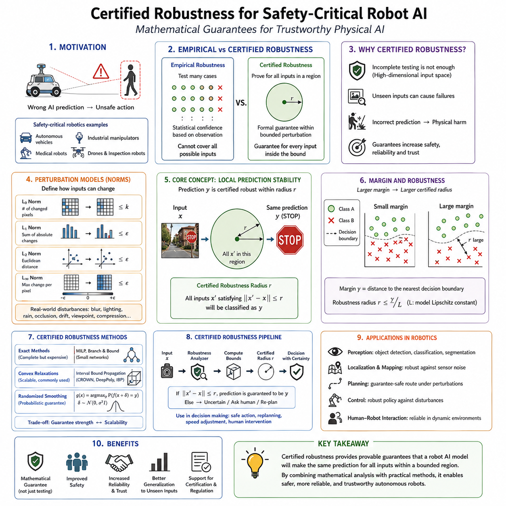{width="7.268055555555556in" height="7.268055555555556in"}

Certified robustness is a branch of trustworthy artificial intelligence that seeks to provide mathematically provable guarantees about the behavior of machine learning models under specified conditions. Unlike empirical robustness, which evaluates a model by testing it against many adversarial examples or benchmark datasets, certified robustness attempts to prove that a neural network will remain stable within well-defined perturbation bounds. In safety-critical robotics, where perception and decision-making directly influence physical actions, such guarantees are highly valuable because they provide confidence that an AI system will behave predictably even when sensor inputs are partially corrupted, noisy, or intentionally manipulated. As autonomous robots become increasingly responsible for transportation, healthcare, industrial automation, infrastructure inspection, collaborative manufacturing, and public services, certified robustness has emerged as one of the foundational technologies for achieving trustworthy Physical AI.

The motivation for certified robustness originates from the limitations of conventional testing. No matter how many test cases engineers evaluate, they can never exhaustively examine every possible input a robot may encounter during years of autonomous operation. Deep neural networks operate within extremely high-dimensional input spaces, making complete empirical validation impossible. A camera image with one million pixels represents an astronomical number of possible input combinations. Even millions of test images explore only a tiny fraction of this space. Consequently, passing benchmark evaluations cannot guarantee safe behavior under unseen conditions. Certified robustness addresses this challenge by replacing exhaustive testing with mathematical reasoning, proving that entire regions of the input space satisfy desired safety properties.

This distinction between empirical robustness and certified robustness is fundamental. Empirical robustness answers the question of whether the model survived a particular collection of attacks or test cases. Certified robustness instead asks whether every possible perturbation inside a mathematically defined region preserves the desired prediction. The first approach provides statistical confidence based on observation, while the second provides formal guarantees derived through mathematical analysis. Although certified guarantees often apply only within bounded perturbation ranges, they eliminate uncertainty inside those bounds and therefore provide a significantly stronger level of assurance.

Safety-critical robotics demands this stronger assurance because incorrect AI predictions may lead to physical harm. An autonomous vehicle misclassifying a traffic sign, a medical robot incorrectly identifying anatomical structures, an industrial manipulator failing to detect a nearby worker, or an autonomous drone misunderstanding environmental obstacles may produce dangerous physical actions. Unlike conventional software applications, robotic AI interacts directly with the physical world. Every perception error has the potential to propagate through planning, motion generation, and control into hazardous behavior. Mathematical guarantees therefore become particularly valuable where human safety depends upon reliable autonomous operation.

Certified robustness is closely related to formal verification, although the two concepts differ slightly. Formal verification generally refers to mathematically proving that a software or hardware system satisfies specified properties. Certified robustness focuses specifically on proving that neural network predictions remain stable under bounded perturbations or environmental uncertainties. In practice, certified robustness forms one specialized branch within the broader discipline of formal verification for intelligent systems.

The fundamental property studied in certified robustness is local prediction stability. Consider an image correctly classified by a robot\'s perception system. Rather than asking whether this individual image is classified correctly, certified robustness asks whether every image sufficiently similar to the original also receives the same classification. If all nearby inputs produce identical outputs, the prediction possesses a certified robustness radius describing the maximum allowable perturbation before classification could change.

Perturbation regions are generally defined using mathematical distance metrics. The most common formulations involve L0, L1, L2, and L∞ norms, each representing different assumptions regarding possible input variation. L0 perturbations count the number of modified elements regardless of magnitude. L1 perturbations constrain the sum of absolute changes. L2 perturbations limit Euclidean distance, while L∞ perturbations restrict the maximum change applied to any individual input dimension. Different norms correspond to different physical assumptions regarding sensor noise, adversarial attacks, or environmental variation.

The L∞ norm has become particularly common in adversarial robustness research because it models small bounded changes applied independently to every pixel. Although mathematically convenient, no single norm perfectly captures every real-world robotic disturbance. Practical robotic systems encounter motion blur, lighting variation, rain, snow, sensor drift, geometric transformations, partial occlusions, compression artifacts, and viewpoint changes that extend beyond simple norm-bounded perturbations. Consequently, certified robustness increasingly investigates more realistic perturbation models tailored to robotic deployment.

Margin theory provides important intuition regarding robustness. A neural network classifies inputs by partitioning feature space into decision regions separated by boundaries. Predictions located far from decision boundaries exhibit greater robustness because substantial perturbations are required before classification changes. Predictions lying close to boundaries become fragile because even small perturbations may cross into neighboring regions. Certified robustness therefore estimates lower bounds on the distance from each input to the nearest decision boundary.

Lipschitz continuity plays a central role in many certification techniques. A function satisfying a Lipschitz condition cannot change arbitrarily rapidly. Specifically, output changes remain bounded relative to input perturbations by a finite constant. Smaller Lipschitz constants correspond to smoother neural network behavior and generally imply improved robustness. Numerous certification algorithms therefore estimate or constrain Lipschitz constants throughout neural network architectures.

Interval Bound Propagation represents one of the simplest certification techniques. Instead of evaluating single numerical inputs, the method propagates intervals representing all possible perturbations simultaneously through every network layer. Each layer computes conservative upper and lower output bounds, ensuring that all possible perturbed inputs remain contained within these intervals. If output intervals remain sufficiently separated, the prediction receives a formal robustness certificate.

The simplicity of interval propagation makes it computationally attractive for large neural networks. However, conservative interval approximations may accumulate excessive uncertainty as network depth increases, reducing certification tightness. Researchers continue developing improved interval arithmetic methods that balance computational efficiency with stronger guarantees.

Linear relaxation techniques provide another important family of certification algorithms. Nonlinear neural network operations such as ReLU activations are approximated using carefully constructed linear upper and lower bounds. These relaxations transform otherwise intractable nonlinear verification problems into linear optimization problems solvable using established mathematical programming techniques.

Convex relaxation extends this concept further by approximating neural network behavior through convex optimization. Convex problems possess globally optimal solutions computable efficiently using modern optimization algorithms. Although relaxations introduce some conservatism, they frequently provide practical certification for networks substantially larger than those amenable to exact verification.

Mixed Integer Linear Programming offers exact verification for many piecewise linear neural networks. Activation functions such as ReLU naturally admit mixed-integer formulations describing their behavior precisely. Optimization algorithms then determine whether adversarial examples exist within specified perturbation regions. While exact verification provides exceptionally strong guarantees, computational complexity grows rapidly with network size, limiting scalability.

Branch-and-bound algorithms improve scalability by recursively partitioning verification problems into smaller subproblems. Regions easily verified are processed efficiently, while computational effort concentrates upon difficult boundary cases. Modern branch-and-bound methods have significantly expanded the size of networks amenable to formal certification.

Satisfiability Modulo Theories solvers represent another verification approach. Neural network computations are translated into logical constraints solved using automated reasoning systems. These methods prove whether safety properties always hold or identify explicit counterexamples violating specified requirements.

Abstract interpretation originates from classical program analysis and has recently become important for neural network verification. Rather than analyzing individual executions, abstract interpretation reasons about entire sets of possible executions simultaneously using conservative mathematical abstractions. This framework naturally extends to uncertainty propagation within neural networks.

Symbolic analysis provides another formal reasoning strategy. Instead of evaluating concrete numerical inputs, symbolic variables represent entire input ranges. Mathematical manipulation of symbolic expressions then derives output constraints guaranteeing robustness under specified perturbations.

Randomized smoothing represents one of the most influential certified robustness methods. Instead of directly verifying neural network behavior, randomized smoothing constructs a new classifier by averaging predictions across numerous noisy input samples. Statistical analysis proves that this smoothed classifier remains robust within calculable perturbation radii. Unlike many verification techniques limited to relatively small models, randomized smoothing scales effectively to modern deep neural networks.

The intuition behind randomized smoothing is straightforward. If predictions remain consistent despite repeated random perturbations, then sufficiently small adversarial perturbations cannot alter the majority vote. Mathematical concentration inequalities translate this empirical consistency into formal robustness certificates.

Certified adversarial training integrates verification objectives directly into model optimization. Rather than training solely for prediction accuracy, optimization explicitly maximizes certifiable robustness. Loss functions incorporate robustness bounds alongside classification objectives, encouraging neural networks to develop smoother decision boundaries supporting stronger certificates.

Regularization techniques similarly improve certifiability. Weight decay, spectral normalization, Lipschitz regularization, Jacobian penalties, and gradient constraints reduce sensitivity to input perturbations while simultaneously facilitating mathematical verification.

Architectural design significantly influences certified robustness. Some neural network structures naturally admit stronger certification than others. Piecewise linear activation functions simplify verification, while certain normalization methods complicate formal analysis. Consequently, safety-critical robotics increasingly considers verifiability during architecture design rather than treating certification as a purely post-training procedure.

Graph neural networks, transformers, recurrent architectures, diffusion models, and foundation models introduce new certification challenges because their computational structures differ substantially from traditional convolutional neural networks. Current research seeks scalable verification techniques suitable for these increasingly sophisticated architectures.

Perception systems represent one of the most important application domains for certified robustness. Object detection, semantic segmentation, lane recognition, traffic sign classification, human detection, defect inspection, and medical image analysis all influence downstream robotic behavior. Formal guarantees regarding perception stability substantially strengthen overall system safety.

Autonomous driving provides particularly demanding certification requirements. Cameras, LiDAR, radar, GPS, inertial sensors, occupancy prediction, behavior prediction, trajectory planning, and control all interact within tightly coupled decision pipelines. Certifying isolated perception models provides only partial assurance. Increasingly, researchers investigate certification across integrated perception-planning-control architectures.

Mobile robot navigation similarly benefits from certified robustness. Obstacle detectors, traversability estimators, localization modules, semantic mapping systems, and path planners all contribute to navigation safety. Mathematical guarantees regarding environmental interpretation reduce collision risk while improving operational reliability.

Industrial robotics presents somewhat different certification priorities. Manufacturing environments remain more structured than public roads but still contain dynamic workers, changing equipment, maintenance activities, and evolving production layouts. Certified robustness supports reliable human detection, object recognition, manipulation planning, and safety monitoring under controlled yet continuously operating conditions.

Medical robotics demands exceptionally strong assurance because patient safety remains paramount. Anatomical segmentation, instrument recognition, surgical navigation, image registration, and diagnostic support systems increasingly incorporate machine learning. Formal robustness guarantees complement conventional medical device validation by reducing uncertainty regarding AI behavior.

Collaborative robots operating alongside humans require certified perception of worker locations, gestures, body posture, protective equipment, and shared workspaces. Verified detection stability supports safe speed control, collision avoidance, and human-robot interaction.

Uncertainty estimation naturally complements certified robustness. Mathematical guarantees typically apply only within explicitly defined perturbation bounds. Outside these certified regions, probabilistic uncertainty estimates provide additional guidance regarding prediction reliability. Combining formal verification with Bayesian uncertainty estimation therefore yields stronger overall safety than either approach independently.

Out-of-distribution detection similarly complements certification. Certified robustness assumes perturbations remain inside predefined regions surrounding familiar observations. Entirely novel environmental conditions lie outside these assumptions. OOD detection identifies such unfamiliar situations, allowing robots to invoke conservative safety behaviors beyond certified operating regions.

Runtime monitoring extends certification beyond static verification. Sensors continually evaluate environmental conditions, prediction confidence, system health, computational timing, and safety constraints. When runtime observations violate certification assumptions, monitoring systems trigger fallback strategies preserving operational safety.

Safe fallback behavior represents an essential component of practical certified AI. Mathematical guarantees alone cannot anticipate every conceivable environmental condition. Robots therefore require deterministic supervisory controllers capable of reducing speed, increasing safety margins, requesting human assistance, switching sensing modalities, or entering predefined safe states whenever certified assumptions no longer hold.

Certification itself introduces computational tradeoffs. Exact verification often becomes prohibitively expensive for large modern neural networks containing millions or billions of parameters. Consequently, practical systems balance certification strength against computational tractability. Conservative approximations may sacrifice tightness while enabling verification of substantially larger models.

Scalability remains one of the central research challenges. Foundation models, vision-language-action systems, world models, multimodal reasoning architectures, and transformer networks dramatically exceed the scale originally considered by verification algorithms. Extending certified robustness toward these emerging architectures represents an active and rapidly evolving research area.

Benchmarking certified robustness differs significantly from conventional AI evaluation. Rather than measuring only prediction accuracy, benchmarks evaluate certified accuracy, average certified radius, verification time, computational cost, memory requirements, scalability, and robustness under realistic perturbation models. These metrics provide objective comparisons among competing certification algorithms.

Certification standards increasingly influence regulatory frameworks for autonomous systems. Safety standards governing automotive systems, medical devices, industrial automation, aviation, railway transportation, and collaborative robotics increasingly recognize formal verification as an important complement to empirical testing. Although comprehensive AI certification standards remain under development, certified robustness aligns naturally with broader trends toward mathematically grounded safety assurance.

Future robotic systems will likely integrate multiple complementary assurance mechanisms rather than relying exclusively on one technique. Certified robustness will provide mathematical guarantees within well-defined operating regions. Bayesian uncertainty estimation will quantify confidence beyond certified boundaries. Out-of-distribution detection will recognize unfamiliar environments. Runtime monitoring will supervise operational behavior continuously. Formal safety controllers will enforce deterministic constraints independently of learned AI components. Together these mechanisms will create layered safety architectures substantially more reliable than any individual approach.

Advances in hardware acceleration may further improve practical certification. Dedicated verification processors, parallel optimization algorithms, symbolic reasoning accelerators, and AI-specific theorem provers could eventually support real-time certification alongside inference itself. Such developments would enable continuous verification as environmental conditions evolve rather than limiting certification to offline analysis.

Certified robustness also encourages a broader philosophical shift within artificial intelligence engineering. Traditional machine learning emphasizes maximizing predictive performance on benchmark datasets. Safety-critical robotics instead prioritizes predictable behavior, mathematically supported reliability, bounded uncertainty, and provable operational guarantees. Intelligence alone becomes insufficient; trustworthy intelligence requires demonstrable evidence that autonomous decisions remain reliable under clearly specified conditions.

Ultimately, certified robustness represents one of the strongest available approaches for building trustworthy AI in safety-critical robotic systems. By replacing purely empirical confidence with mathematically provable guarantees, it establishes rigorous foundations for reliable autonomous operation despite sensor noise, bounded environmental variation, and adversarial perturbations. Although significant research challenges remain regarding scalability, multimodal architectures, transformer verification, and real-world perturbation modeling, certified robustness has already become an indispensable component of modern AI safety. Combined with uncertainty quantification, runtime monitoring, out-of-distribution detection, deterministic safety supervision, and comprehensive systems engineering, certified robustness provides the formal assurance necessary for deploying autonomous robots responsibly in transportation, manufacturing, healthcare, infrastructure inspection, agriculture, public services, and the next generation of Physical AI systems.

인증된 견고성(certified robustness)은 지정된 조건 하에서 머신러닝 모델의 행동에 관해 수학적으로 증명 가능한 보장을 제공하려는 신뢰할 수 있는 인공지능의 한 분야이다. 많은 적대적 예제나 벤치마크 데이터셋에 대해 모델을 테스트함으로써 평가하는 경험적 견고성(empirical robustness)과 달리, 인증된 견고성은 신경망이 잘 정의된 섭동 한계 내에서 안정적인 상태를 유지할 것이라는 것을 증명하려고 시도한다. 인지와 의사결정이 물리적 행동에 직접적으로 영향을 미치는 안전이 중요한 로보틱스에서, 이러한 보장은 센서 입력이 부분적으로 손상되거나, 노이즈가 있거나, 의도적으로 조작되었을 때에도 AI 시스템이 예측 가능하게 행동할 것이라는 확신을 제공하기 때문에 매우 유용하다. 자율 로봇이 교통, 헬스케어, 산업 자동화, 인프라 점검, 협력적 제조, 공공 서비스에 대한 책임을 점점 더 많이 맡게 됨에 따라, 인증된 견고성은 신뢰할 수 있는 Physical AI를 달성하기 위한 핵심적인 기술 중 하나로 떠올랐다.

인증된 견고성의 동기는 전통적인 테스트의 한계에서 비롯된다. 엔지니어들이 아무리 많은 테스트 사례를 평가하더라도, 로봇이 수년간의 자율 운영 과정에서 마주칠 수 있는 모든 가능한 입력을 철저하게 검토할 수는 없다. 심층 신경망은 극도로 고차원적인 입력 공간 내에서 작동하기 때문에 완전한 경험적 검증은 불가능하다. 백만 개의 픽셀을 지닌 카메라 이미지는 천문학적인 수의 가능한 입력 조합들을 나타낸다. 수백만 개의 테스트 이미지조차도 이 공간의 아주 작은 일부만을 탐구한다. 따라서 벤치마크 평가를 통과하는 것만으로는 본 적 없는 조건 하에서의 안전한 행동을 보장할 수 없다. 인증된 견고성은 철저한 테스트를 수학적 추론으로 대체함으로써, 입력 공간의 전체 영역이 원하는 안전 속성들을 만족한다는 것을 증명함으로써 이러한 과제를 해결한다.

경험적 견고성과 인증된 견고성 사이의 이러한 구분은 근본적이다. 경험적 견고성은 모델이 특정한 공격이나 테스트 사례들의 집합에서 살아남았는지에 대한 질문에 답한다. 인증된 견고성은 대신 수학적으로 정의된 영역 내의 모든 가능한 섭동이 원하는 예측을 보존하는지를 묻는다. 첫 번째 접근법은 관측에 기반한 통계적 신뢰를 제공하는 반면, 두 번째는 수학적 분석을 통해 도출된 형식적 보장을 제공한다. 인증된 보장은 종종 경계가 있는 섭동 범위 내에서만 적용되지만, 이는 그러한 한계 내의 불확실성을 제거하기 때문에 상당히 더 강력한 수준의 확신을 제공한다.

안전이 중요한 로보틱스는, 부정확한 AI 예측이 물리적 피해로 이어질 수 있기 때문에 이러한 더 강력한 확신을 필요로 한다. 교통 표지판을 잘못 분류하는 자율주행 차량, 해부학적 구조를 부정확하게 식별하는 의료용 로봇, 근처의 작업자를 감지하지 못하는 산업용 매니퓰레이터, 또는 환경적 장애물을 오해하는 자율 드론은 위험한 물리적 행동을 만들어낼 수 있다. 전통적인 소프트웨어 애플리케이션과 달리, 로봇 AI는 물리적 세계와 직접 상호작용한다. 모든 인지 오류는 계획 수립, 동작 생성, 제어를 통해 위험한 행동으로 전파될 잠재력을 지닌다. 따라서 인간의 안전이 신뢰할 수 있는 자율 운영에 달려 있는 곳에서 수학적 보장은 특히 유용해진다.

인증된 견고성은 형식적 검증(formal verification)과 밀접하게 관련되어 있지만, 이 두 개념은 다소 다르다. 형식적 검증은 일반적으로 소프트웨어나 하드웨어 시스템이 지정된 속성들을 만족한다는 것을 수학적으로 증명하는 것을 지칭한다. 인증된 견고성은 경계가 있는 섭동이나 환경적 불확실성 하에서 신경망 예측이 안정적으로 유지된다는 것을 증명하는 데 특별히 초점을 맞춘다. 실제로, 인증된 견고성은 지능형 시스템을 위한 더 넓은 형식적 검증 분야 내의 하나의 전문화된 분야를 이룬다.

인증된 견고성에서 연구되는 근본적인 속성은 지역적 예측 안정성(local prediction stability)이다. 로봇의 인지 시스템에 의해 올바르게 분류된 이미지를 생각해 보자. 이 개별 이미지가 올바르게 분류되었는지를 묻는 대신, 인증된 견고성은 원본과 충분히 유사한 모든 이미지도 동일한 분류를 받는지를 묻는다. 근처의 모든 입력들이 동일한 출력을 만들어낸다면, 그 예측은 분류가 바뀌기 전까지 허용되는 최대 섭동을 기술하는 인증된 견고성 반경(certified robustness radius)을 지닌다.

섭동 영역은 일반적으로 수학적 거리 지표를 사용해 정의된다. 가장 흔한 공식화는 L0, L1, L2, L∞ 노름(norm)을 수반하며, 각각은 가능한 입력 변동에 관한 서로 다른 가정을 나타낸다. L0 섭동은 크기와 무관하게 수정된 원소의 수를 센다. L1 섭동은 절댓값 변화의 합을 제약한다. L2 섭동은 유클리드 거리를 제한하는 한편, L∞ 섭동은 어떤 개별 입력 차원에 적용되는 최대 변화를 제한한다. 서로 다른 노름들은 센서 노이즈, 적대적 공격, 또는 환경적 변동에 관한 서로 다른 물리적 가정에 대응한다.

L∞ 노름은, 모든 픽셀에 독립적으로 적용되는 작은 경계가 있는 변화를 모델링하기 때문에 적대적 견고성 연구에서 특히 흔해졌다. 수학적으로 편리하지만, 어떤 단일한 노름도 모든 실제 세계의 로봇의 교란을 완벽하게 포착하지 못한다. 실용적인 로봇 시스템은 단순한 노름 경계가 있는 섭동을 넘어 확장되는 모션 블러, 조명 변화, 비, 눈, 센서 드리프트, 기하학적 변환, 부분적인 가림, 압축 아티팩트, 시점 변화를 마주친다. 따라서 인증된 견고성은 로봇의 배치에 맞춰진 더 현실적인 섭동 모델들을 점점 더 많이 조사하고 있다.

마진 이론(margin theory)은 견고성에 관한 중요한 직관을 제공한다. 신경망은 특징 공간을 경계로 분리된 결정 영역들로 분할함으로써 입력을 분류한다. 결정 경계로부터 멀리 위치한 예측들은, 분류가 바뀌기 전에 상당한 섭동이 필요하기 때문에 더 큰 견고성을 보인다. 경계 근처에 위치한 예측들은, 작은 섭동조차도 인접한 영역으로 넘어갈 수 있기 때문에 취약해진다. 따라서 인증된 견고성은 각각의 입력으로부터 가장 가까운 결정 경계까지의 거리에 대한 하한을 추정한다.

립시츠 연속성(Lipschitz continuity)은 많은 인증 기법들에서 핵심적인 역할을 한다. 립시츠 조건을 만족하는 함수는 임의로 빠르게 변할 수 없다. 구체적으로, 출력의 변화는 유한한 상수에 의해 입력의 섭동에 비례하여 경계가 있는 상태로 유지된다. 더 작은 립시츠 상수는 더 부드러운 신경망 행동에 대응하며 일반적으로 향상된 견고성을 의미한다. 따라서 수많은 인증 알고리즘들은 신경망 아키텍처 전반에 걸쳐 립시츠 상수를 추정하거나 제약한다.

구간 경계 전파(Interval Bound Propagation)는 가장 단순한 인증 기법 중 하나를 나타낸다. 단일한 수치적 입력을 평가하는 대신, 이 방법은 모든 가능한 섭동을 나타내는 구간들을 모든 네트워크 레이어를 통해 동시에 전파한다. 각각의 레이어는 보수적인 상한과 하한의 출력 경계를 계산하여, 모든 가능한 섭동된 입력이 이 구간들 내에 포함되도록 보장한다. 출력 구간이 충분히 분리된 채로 유지되면, 그 예측은 형식적인 견고성 인증서를 받는다.

구간 전파의 단순함은 이를 대형 신경망에 있어 계산적으로 매력적으로 만든다. 그러나 보수적인 구간 근사는 네트워크의 깊이가 증가함에 따라 과도한 불확실성을 누적시켜, 인증의 엄격성을 줄일 수 있다. 연구자들은 계산 효율성을 더 강력한 보장과 균형 맞추는 개선된 구간 산술 방법들을 계속 개발하고 있다.

선형 완화(linear relaxation) 기법은 또 다른 중요한 인증 알고리즘군을 제공한다. ReLU 활성화와 같은 비선형적인 신경망 연산은 신중하게 구성된 선형 상한과 하한을 사용해 근사된다. 이러한 완화들은 그렇지 않으면 다루기 어려운 비선형적 검증 문제들을, 확립된 수학적 프로그래밍 기법들을 사용해 풀 수 있는 선형 최적화 문제들로 전환한다.

볼록 완화(convex relaxation)는 볼록 최적화를 통해 신경망의 행동을 근사함으로써 이 개념을 더욱 확장한다. 볼록 문제는 현대의 최적화 알고리즘을 사용해 효율적으로 계산 가능한 전역적으로 최적인 해를 지닌다. 완화가 어느 정도의 보수성을 도입하지만, 이들은 정확한 검증에 적합한 것들보다 상당히 더 큰 네트워크에 대해서도 실용적인 인증을 종종 제공한다.

혼합 정수 선형 계획법(Mixed Integer Linear Programming)은 많은 조각별 선형(piecewise linear) 신경망에 대한 정확한 검증을 제공한다. ReLU와 같은 활성화 함수는 그 행동을 정밀하게 기술하는 혼합 정수 공식화를 자연스럽게 허용한다. 이후 최적화 알고리즘은 지정된 섭동 영역 내에 적대적 예제가 존재하는지를 결정한다. 정확한 검증은 예외적으로 강력한 보장을 제공하지만, 계산적 복잡성은 네트워크의 크기에 따라 빠르게 증가하여, 확장성을 제한한다.

가지치기 탐색(branch-and-bound) 알고리즘은 검증 문제를 더 작은 하위 문제들로 재귀적으로 분할함으로써 확장성을 향상시킨다. 쉽게 검증되는 영역들은 효율적으로 처리되는 한편, 계산적 노력은 어려운 경계 사례에 집중된다. 현대의 가지치기 탐색 방법들은 형식적 인증에 적합한 네트워크의 크기를 상당히 확장시켰다.

충족가능성 모듈로 이론(Satisfiability Modulo Theories) 솔버는 또 다른 검증 접근법을 나타낸다. 신경망 계산은 자동화된 추론 시스템을 사용해 풀리는 논리적 제약으로 번역된다. 이러한 방법들은 안전 속성이 항상 유지되는지를 증명하거나 지정된 요구사항을 위반하는 명시적인 반례들을 식별한다.

추상적 해석(abstract interpretation)은 고전적인 프로그램 분석으로부터 비롯되었으며 최근 신경망 검증에 있어 중요해졌다. 개별적인 실행을 분석하는 대신, 추상적 해석은 보수적인 수학적 추상화를 사용해 가능한 모든 실행 집합에 대해 동시에 추론한다. 이 프레임워크는 신경망 내의 불확실성 전파로 자연스럽게 확장된다.

기호적 분석(symbolic analysis)은 또 다른 형식적 추론 전략을 제공한다. 구체적인 수치적 입력을 평가하는 대신, 기호적 변수들은 전체 입력 범위를 나타낸다. 이후 기호적 표현들에 대한 수학적 조작은 지정된 섭동 하에서의 견고성을 보장하는 출력 제약을 도출한다.

무작위화된 스무딩(randomized smoothing)은 가장 영향력 있는 인증된 견고성 방법 중 하나를 나타낸다. 신경망의 행동을 직접 검증하는 대신, 무작위화된 스무딩은 수많은 노이즈가 추가된 입력 샘플들에 걸쳐 예측을 평균화함으로써 새로운 분류기를 구성한다. 통계적 분석은 이 스무딩된 분류기가 계산 가능한 섭동 반경 내에서 견고하게 유지된다는 것을 증명한다. 비교적 작은 모델에 국한되는 많은 검증 기법들과 달리, 무작위화된 스무딩은 현대의 심층 신경망에도 효과적으로 확장된다.

무작위화된 스무딩 뒤에 있는 직관은 단순하다. 반복적인 무작위 섭동에도 불구하고 예측이 일관된 채로 유지된다면, 충분히 작은 적대적 섭동은 다수결을 바꿀 수 없다. 수학적 집중 부등식(concentration inequality)은 이러한 경험적 일관성을 형식적인 견고성 인증서로 변환한다.

인증된 적대적 학습(certified adversarial training)은 검증 목표를 모델 최적화에 직접 통합한다. 오직 예측 정확도만을 위해 학습하는 대신, 최적화는 인증 가능한 견고성을 명시적으로 최대화한다. 손실 함수는 분류 목표와 함께 견고성 경계를 통합하여, 신경망이 더 강력한 인증서를 지원하는 더 부드러운 결정 경계를 발전시키도록 장려한다.

정규화 기법도 마찬가지로 인증 가능성을 향상시킨다. 가중치 감쇠(weight decay), 스펙트럼 정규화, 립시츠 정규화, 야코비안 페널티, 그래디언트 제약은 수학적 검증을 용이하게 하면서도 입력 섭동에 대한 민감도를 줄인다.

아키텍처의 설계는 인증된 견고성에 상당한 영향을 미친다. 일부 신경망 구조는 다른 것들보다 자연스럽게 더 강력한 인증을 허용한다. 조각별 선형 활성화 함수는 검증을 단순화하는 반면, 특정한 정규화 방법들은 형식적 분석을 복잡하게 만든다. 따라서 안전이 중요한 로보틱스는 인증을 순수하게 학습 후 절차로 취급하는 대신 아키텍처 설계 과정에서 검증 가능성을 점점 더 많이 고려하고 있다.

그래프 신경망, 트랜스포머, 순환 아키텍처, 확산 모델, 파운데이션 모델은 그 계산적 구조가 전통적인 합성곱 신경망과 상당히 다르기 때문에 새로운 인증 과제를 도입한다. 현재의 연구는 이러한 점점 더 정교해지는 아키텍처들에 적합한 확장 가능한 검증 기법들을 추구하고 있다.

인지 시스템은 인증된 견고성을 위한 가장 중요한 응용 도메인 중 하나를 나타낸다. 물체 감지, 의미론적 분할, 차선 인식, 교통 표지판 분류, 인간 감지, 결함 검사, 의료 영상 분석은 모두 이후의 로봇 행동에 영향을 미친다. 인지 안정성에 관한 형식적 보장은 전체적인 시스템의 안전성을 상당히 강화한다.

자율주행은 특히 까다로운 인증 요구사항을 제공한다. 카메라, LiDAR, 레이더, GPS, 관성 센서, 점유 예측, 행동 예측, 궤적 계획 수립, 제어는 모두 긴밀하게 결합된 의사결정 파이프라인 내에서 상호작용한다. 고립된 인지 모델을 인증하는 것은 부분적인 확신만을 제공한다. 연구자들은 통합된 인지-계획-제어 아키텍처 전반에 걸친 인증을 점점 더 많이 조사하고 있다.

이동 로봇의 내비게이션도 마찬가지로 인증된 견고성으로부터 이득을 얻는다. 장애물 감지기, 통행 가능성 추정기, 위치 추정 모듈, 의미론적 지도 작성 시스템, 경로 플래너는 모두 내비게이션의 안전성에 기여한다. 환경적 해석에 관한 수학적 보장은 운영상의 신뢰성을 향상시키면서도 충돌 위험을 줄인다.

산업용 로보틱스는 다소 다른 인증 우선순위를 제시한다. 제조 환경은 공공 도로보다 더 구조화되어 있지만 여전히 동적인 작업자, 변화하는 장비, 유지보수 활동, 진화하는 생산 배치를 포함한다. 인증된 견고성은 통제되면서도 지속적으로 작동하는 조건 하에서 신뢰할 수 있는 인간 감지, 물체 인식, 조작 계획 수립, 안전 모니터링을 지원한다.

의료용 로보틱스는 환자의 안전이 가장 중요하게 남아 있기 때문에 예외적으로 강력한 확신을 요구한다. 해부학적 분할, 기구 인식, 수술 내비게이션, 영상 정합(image registration), 진단 지원 시스템은 머신러닝을 점점 더 많이 통합하고 있다. 형식적 견고성 보장은 AI 행동에 관한 불확실성을 줄임으로써 전통적인 의료 기기 검증을 보완한다.

인간과 나란히 작동하는 협동 로봇은 작업자의 위치, 제스처, 신체 자세, 보호 장비, 공유된 작업 공간에 대한 인증된 인지를 필요로 한다. 검증된 감지 안정성은 안전한 속도 제어, 충돌 회피, 인간-로봇 상호작용을 지원한다.

불확실성 추정은 인증된 견고성을 자연스럽게 보완한다. 수학적 보장은 일반적으로 명시적으로 정의된 섭동 한계 내에서만 적용된다. 이러한 인증된 영역을 벗어나면, 확률적 불확실성 추정치가 예측의 신뢰성에 관한 추가적인 지침을 제공한다. 따라서 형식적 검증을 베이지안 불확실성 추정과 결합하는 것은 어느 한 접근법만으로 얻는 것보다 더 강력한 전체적인 안전성을 만들어낸다.

분포 외 감지도 마찬가지로 인증을 보완한다. 인증된 견고성은 섭동이 친숙한 관측치를 둘러싼 사전에 정의된 영역 내에 남아 있다고 가정한다. 완전히 새로운 환경적 조건은 이러한 가정들 밖에 위치한다. OOD 감지는 이러한 낯선 상황들을 식별하여, 로봇이 인증된 운영 영역을 넘어서는 보수적인 안전 행동을 취할 수 있게 한다.

런타임 모니터링은 인증을 정적인 검증을 넘어 확장시킨다. 센서는 환경 조건, 예측 신뢰도, 시스템의 상태, 계산적 타이밍, 안전 제약을 지속적으로 평가한다. 런타임 관측치가 인증 가정을 위반할 때, 모니터링 시스템은 운영상의 안전성을 보존하는 대체 전략들을 촉발한다.

안전한 대체 행동은 실용적인 인증된 AI의 필수적인 구성 요소를 나타낸다. 수학적 보장만으로는 생각할 수 있는 모든 환경 조건을 예상할 수 없다. 따라서 로봇은, 인증된 가정이 더 이상 유지되지 않을 때마다 속도를 줄이고, 안전 마진을 늘리며, 인간의 도움을 요청하고, 감지 양식을 전환하거나, 사전에 정의된 안전 상태로 진입할 수 있는 결정론적인 감독 컨트롤러를 필요로 한다.

인증 자체는 계산적 절충을 도입한다. 정확한 검증은 수백만 또는 수십억 개의 파라미터를 포함하는 대형의 현대 신경망에게는 종종 비용이 지나치게 많이 든다. 따라서 실용적인 시스템은 인증의 강도를 계산적 다루기 쉬움과 균형을 맞춘다. 보수적인 근사는 상당히 더 큰 모델의 검증을 가능하게 하면서도 엄격성을 희생할 수 있다.

확장성은 핵심적인 연구 과제 중 하나로 남아 있다. 파운데이션 모델, 시각-언어-행동 시스템, 세계 모델, 멀티모달 추론 아키텍처, 트랜스포머 네트워크는 검증 알고리즘이 원래 고려했던 규모를 극적으로 초과한다. 이러한 새롭게 떠오르는 아키텍처들을 향해 인증된 견고성을 확장하는 것은 활발하고 빠르게 진화하는 연구 영역을 나타낸다.

인증된 견고성을 벤치마킹하는 것은 전통적인 AI 평가와 상당히 다르다. 오직 예측 정확도만을 측정하는 대신, 벤치마크는 인증된 정확도, 평균 인증된 반경, 검증 시간, 계산 비용, 메모리 요구량, 확장성, 현실적인 섭동 모델 하에서의 견고성을 평가한다. 이러한 지표들은 경쟁하는 인증 알고리즘들 사이의 객관적인 비교를 제공한다.

인증 표준은 자율 시스템을 위한 규제 프레임워크에 점점 더 많은 영향을 미치고 있다. 자동차 시스템, 의료 기기, 산업 자동화, 항공, 철도 교통, 협동 로보틱스를 규율하는 안전 표준들은 형식적 검증을 경험적 테스트에 대한 중요한 보완재로 점점 더 많이 인식하고 있다. 포괄적인 AI 인증 표준은 여전히 개발 중이지만, 인증된 견고성은 수학적으로 근거한 안전 확신을 향한 더 넓은 추세와 자연스럽게 정렬된다.

미래의 로봇 시스템은 하나의 기법에만 배타적으로 의존하는 대신 여러 상호 보완적인 확신 메커니즘을 통합할 가능성이 높다. 인증된 견고성은 잘 정의된 운영 영역 내에서 수학적 보장을 제공할 것이다. 베이지안 불확실성 추정은 인증된 경계를 넘어서는 신뢰도를 정량화할 것이다. 분포 외 감지는 낯선 환경을 인식할 것이다. 런타임 모니터링은 운영상의 행동을 지속적으로 감독할 것이다. 형식적 안전 컨트롤러는 학습된 AI 구성 요소와 독립적으로 결정론적 제약을 강제할 것이다. 이러한 메커니즘들이 함께 작동하여, 어떤 개별적인 접근법보다도 상당히 더 신뢰할 수 있는 계층화된 안전 아키텍처를 만들어낼 것이다.

하드웨어 가속의 발전은 실용적인 인증을 더욱 향상시킬 수 있다. 전용 검증 프로세서, 병렬 최적화 알고리즘, 기호적 추론 가속기, AI 특화 정리 증명기(theorem prover)는 결국 추론 자체와 함께 실시간 인증을 지원할 수 있을 것이다. 이러한 발전은 인증을 오프라인 분석에만 국한시키는 것이 아니라 환경 조건이 진화함에 따른 지속적인 검증을 가능하게 할 것이다.

인증된 견고성은 또한 인공지능 공학 내의 더 넓은 철학적 전환을 장려한다. 전통적인 머신러닝은 벤치마크 데이터셋에서의 예측 성능을 최대화하는 것을 강조한다. 안전이 중요한 로보틱스는 그 대신 예측 가능한 행동, 수학적으로 뒷받침되는 신뢰성, 경계가 있는 불확실성, 증명 가능한 운영상의 보장을 우선시한다. 지능만으로는 불충분해지며, 신뢰할 수 있는 지능은 명확하게 지정된 조건 하에서 자율적인 결정이 신뢰할 수 있는 상태로 유지된다는 입증 가능한 증거를 필요로 한다.

궁극적으로, 인증된 견고성은 안전이 중요한 로봇 시스템에서 신뢰할 수 있는 AI를 구축하기 위한 가장 강력한 사용 가능한 접근법 중 하나를 나타낸다. 순수하게 경험적인 신뢰를 수학적으로 증명 가능한 보장으로 대체함으로써, 이는 센서 노이즈, 경계가 있는 환경적 변동, 적대적 섭동에도 불구하고 신뢰할 수 있는 자율 운영을 위한 엄격한 기반을 확립한다. 확장성, 멀티모달 아키텍처, 트랜스포머 검증, 실제 세계의 섭동 모델링에 관한 상당한 연구 과제들이 여전히 남아 있지만, 인증된 견고성은 이미 현대 AI 안전성의 필수불가결한 구성 요소가 되었다. 불확실성 정량화, 런타임 모니터링, 분포 외 감지, 결정론적 안전 감독, 포괄적인 시스템 공학과 결합되어, 인증된 견고성은 교통, 제조, 헬스케어, 인프라 점검, 농업, 공공 서비스, 차세대 Physical AI 시스템에 자율 로봇을 책임감 있게 배치하는 데 필요한 형식적 확신을 제공한다.

##  

## 11.06 Dataset Bias Detection and Mitigation [w/Code]

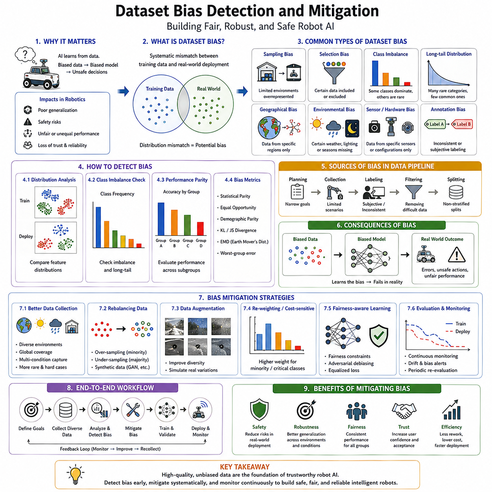{width="7.268055555555556in" height="7.268055555555556in"}

Dataset bias is one of the most significant challenges in modern artificial intelligence because every machine learning model ultimately learns from the data it is provided. Regardless of how sophisticated a neural network architecture may be, its understanding of the world is fundamentally constrained by the quality, diversity, balance, and representativeness of its training dataset. In robotics, autonomous vehicles, industrial automation, medical robotics, warehouse logistics, and intelligent manufacturing, biased datasets can lead to systematic errors that remain hidden during laboratory testing but become critical safety risks during deployment. Dataset bias detection and mitigation therefore form an essential component of AI safety, model reliability, and trustworthy robotic intelligence. Rather than treating bias as merely an ethical concern, robotics engineers increasingly recognize it as an engineering problem directly affecting perception accuracy, navigation reliability, manipulation success, long-term robustness, and operational safety.

The importance of dataset bias originates from the statistical nature of machine learning. Unlike conventional software, which follows explicitly programmed rules, deep learning systems discover patterns from examples. If those examples overrepresent certain environments while underrepresenting others, the resulting model naturally becomes specialized for the dominant conditions and performs poorly elsewhere. The model is not intentionally biased in the human sense; instead, it faithfully learns the statistical structure presented during training. Consequently, improving model reliability requires improving the dataset itself rather than relying solely on more sophisticated neural network architectures.

The concept of dataset bias is broader than simple class imbalance. Any systematic mismatch between the training data distribution and the deployment environment constitutes a potential source of bias. This mismatch may involve object categories, environmental conditions, geographical regions, sensor configurations, weather patterns, illumination, seasonal variation, robot hardware, task diversity, human behavior, operational frequency, or even annotation practices. Every stage of the data lifecycle contributes to the final statistical characteristics learned by the model.

Sampling bias represents one of the earliest and most common forms of dataset bias. It occurs when collected data fail to represent the intended deployment environment adequately. For example, an autonomous warehouse robot trained primarily in modern logistics centers may perform poorly when deployed in older warehouses containing narrower aisles, different shelving systems, lower lighting quality, or unusual storage layouts. Although the robot has learned valid perception strategies, its experience covers only a limited portion of the environments encountered in practice.

Selection bias arises when certain examples are systematically included or excluded during dataset construction. Engineers frequently collect data under convenient conditions because difficult environments require greater effort and expense. Outdoor robots may therefore receive abundant daytime images while relatively few nighttime examples. Medical imaging datasets may contain mostly common diseases while underrepresenting rare conditions. Industrial inspection datasets often emphasize normal products while containing relatively few examples of manufacturing defects. Such imbalances naturally influence the resulting AI model.

Class imbalance represents one of the most familiar manifestations of dataset bias. Some categories appear far more frequently than others, causing optimization algorithms to prioritize dominant classes during training. In robotic perception, common objects such as walls, floors, vehicles, or shelves may dominate datasets, whereas emergency equipment, unusual obstacles, maintenance tools, damaged infrastructure, or rare safety hazards appear infrequently. As a result, models become highly accurate for common categories while exhibiting poor recognition performance precisely for the rare events often most important for operational safety.

Long-tail distributions illustrate this challenge particularly well. Real-world environments naturally contain many frequently occurring objects alongside numerous rare categories. Autonomous vehicles regularly observe roads, buildings, and passenger cars but encounter construction machinery, emergency responders, unusual vehicles, or fallen obstacles relatively infrequently. Warehouse robots repeatedly detect pallets and shelving while only occasionally observing damaged goods, maintenance personnel, or emergency equipment. Effective AI systems must therefore perform reliably across both common and rare situations.

Geographical bias occurs when training data originate primarily from specific locations. Road markings, traffic signs, architectural styles, vegetation, weather conditions, manufacturing equipment, warehouse layouts, hospital designs, agricultural fields, and cultural practices vary substantially across regions. Models trained within one geographical area frequently experience degraded performance elsewhere despite apparently similar tasks. Robots deployed internationally therefore require datasets reflecting global operational diversity rather than local convenience.

Environmental bias constitutes another major concern for robotics. Lighting conditions, seasonal changes, weather phenomena, dust, fog, rain, snow, smoke, reflections, shadows, and background clutter all influence sensor observations. Datasets collected primarily under favorable environmental conditions fail to prepare AI systems for realistic deployment where operating conditions continually evolve. Since robots often function continuously throughout changing environments, environmental diversity becomes essential for robust perception.

Temporal bias emerges because data collection typically occurs over limited time intervals. Factories introduce new equipment, warehouses reorganize inventory, hospitals renovate facilities, roads undergo maintenance, vegetation grows, agricultural fields change seasonally, and urban infrastructure evolves continuously. Models trained using historical datasets gradually become outdated as deployment environments change over time. Continuous dataset maintenance therefore becomes necessary for long-term robotic reliability.

Sensor bias reflects differences among sensing hardware. Camera resolution, lens characteristics, color calibration, exposure settings, dynamic range, LiDAR beam patterns, radar frequency, GPS accuracy, inertial measurement quality, and depth sensing technology all influence collected data. A model trained using one sensor configuration may generalize poorly when deployed using slightly different hardware. Sensor diversity during dataset construction therefore improves deployment robustness across hardware platforms.

Annotation bias represents another critical but often overlooked challenge. Human annotators inevitably introduce subjective interpretation into labeled datasets. Different individuals may disagree regarding object boundaries, semantic categories, action labels, navigation affordances, manipulation success, or environmental interpretation. Inconsistent labeling creates ambiguous supervision signals that limit achievable model accuracy regardless of network architecture.

Label noise further complicates dataset quality. Human fatigue, misunderstanding, annotation software limitations, ambiguous images, difficult environmental conditions, or simple mistakes produce incorrect labels. Since supervised learning assumes labels accurately describe ground truth, label noise directly influences learned decision boundaries. Large datasets often contain thousands of labeling errors that remain unnoticed without systematic quality assurance procedures.

Confirmation bias may also influence annotation processes. Annotators aware of expected outcomes sometimes unconsciously reinforce preconceived assumptions rather than objectively interpreting observations. Blind annotation protocols and independent review processes reduce such effects while improving overall dataset reliability.

Automation bias increasingly affects semi-automatic annotation workflows. Modern labeling systems frequently employ pretrained AI models to accelerate annotation, after which human reviewers correct predicted labels. Although efficient, reviewers often accept incorrect AI suggestions more readily than independently generated annotations, allowing systematic errors to propagate throughout datasets.

Measurement bias originates from imperfections in sensing systems themselves. Camera distortion, calibration errors, synchronization problems, communication latency, motion blur, GPS drift, LiDAR reflection artifacts, and environmental interference influence recorded observations. Unless datasets capture these realistic imperfections, deployed models may fail under practical operating conditions despite excellent laboratory performance.

Simulation bias has become increasingly important as synthetic datasets expand. High-fidelity simulators generate enormous quantities of labeled data for autonomous driving, manipulation, locomotion, warehouse automation, and drone navigation. However, simulated environments inevitably differ from physical reality. Differences in lighting, textures, physics, sensor noise, material properties, human behavior, or environmental complexity create sim-to-real gaps influencing deployment performance.

Task bias occurs when datasets emphasize only a subset of intended operational objectives. A manipulation dataset focusing primarily on grasping rigid objects may provide insufficient experience with deformable materials, transparent containers, articulated mechanisms, flexible cables, or hazardous equipment. Similarly, navigation datasets emphasizing obstacle avoidance may underrepresent long-term planning or human interaction.

Behavioral bias frequently appears in imitation learning. Human demonstrations collected from expert operators may represent only preferred strategies while omitting alternative yet equally valid solutions. Consequently, learned policies inherit demonstration preferences rather than discovering broader behavioral flexibility. Collecting demonstrations from multiple operators with diverse strategies improves policy generalization.

Reinforcement learning datasets introduce additional bias through exploration strategies. Agents naturally encounter states favored by their current policies while rarely exploring unusual or difficult situations. Offline reinforcement learning therefore depends strongly on dataset diversity because unseen state-action combinations cannot be learned after deployment.

Foundation models present new dataset challenges because training data originate from enormous internet-scale collections. Although such datasets provide exceptional diversity, they also contain duplicated content, noisy labels, inconsistent quality, historical artifacts, and domain imbalances. Robotics applications often require additional domain-specific fine-tuning to overcome these broad statistical biases.

Detecting dataset bias begins with comprehensive statistical analysis. Class frequency distributions reveal imbalance among object categories, environmental conditions, task types, and operational scenarios. Simple visualization often exposes substantial disparities requiring correction before model training begins.

Data visualization techniques provide intuitive understanding of dataset composition. Histograms, confusion matrices, embedding projections, clustering analyses, dimensionality reduction methods, and similarity graphs reveal hidden statistical structures difficult to identify through numerical summaries alone. Feature-space visualization frequently uncovers clusters representing underrepresented deployment conditions.

Distribution comparison forms another essential detection strategy. Statistical tests compare training datasets with validation data, operational logs, simulation environments, or deployment observations. Significant distribution differences indicate potential bias requiring further investigation. Distance metrics such as Kullback-Leibler divergence, Jensen-Shannon divergence, Wasserstein distance, and Maximum Mean Discrepancy quantify distribution differences mathematically.

Coverage analysis evaluates how completely datasets represent intended deployment scenarios. Engineers define operational design domains describing expected environmental conditions, sensor configurations, weather patterns, geographic regions, task types, object categories, and human interactions. Dataset coverage is then measured relative to these requirements, identifying underrepresented operational conditions.

Rare-event analysis receives particular attention in safety-critical robotics. Hazardous situations often occur infrequently yet carry severe consequences. Emergency vehicles, equipment failures, damaged infrastructure, medical emergencies, unusual obstacles, construction zones, and extreme weather require explicit representation despite their rarity. Dataset audits therefore examine not only common scenarios but also low-frequency high-consequence events.

Bias detection increasingly incorporates model behavior rather than dataset statistics alone. Performance stratification measures prediction accuracy separately across environmental conditions, object categories, weather, illumination, geographical regions, or operational scenarios. Significant performance variation frequently indicates underlying dataset bias.

Confusion matrix analysis identifies systematic prediction errors associated with specific categories or operating conditions. Repeated misclassification patterns often reveal insufficient representation of particular classes during training.

Feature embedding analysis provides additional insight. Deep neural networks transform raw observations into high-dimensional feature representations. Clustering algorithms applied to these embeddings reveal whether deployment data occupy regions well represented during training or extend into previously unexplored areas.

Mitigating dataset bias generally begins with improved data collection rather than algorithmic modification. The most effective solution often involves acquiring additional examples representing underrepresented environments, object categories, weather conditions, sensor configurations, or operational scenarios. Expanding dataset diversity directly improves model generalization by exposing learning algorithms to broader statistical variation.

Balanced sampling constitutes one of the simplest mitigation techniques. During training, underrepresented classes receive proportionally greater sampling frequency while dominant classes are sampled less aggressively. Balanced mini-batches prevent optimization algorithms from focusing excessively on common categories.

Weighted loss functions further compensate for class imbalance. Prediction errors involving rare classes receive greater optimization weight than errors involving common categories. Consequently, the learning algorithm allocates more capacity toward difficult or underrepresented situations without requiring perfectly balanced datasets.

Data augmentation artificially increases dataset diversity through controlled transformations. Images may undergo rotation, translation, scaling, illumination variation, blur, weather simulation, occlusion, color modification, geometric distortion, or sensor noise injection. Although augmentation cannot replace genuine environmental diversity, it substantially improves robustness against moderate distribution variation.

Domain randomization extends augmentation into simulation environments. Rather than generating visually realistic scenes, simulation parameters vary aggressively across textures, lighting, object placement, physics, weather, sensor characteristics, and environmental appearance. Models trained under extensive randomization often generalize surprisingly well to physical deployment because they learn robust invariant representations.

Synthetic data generation has become increasingly important for robotics. Simulation platforms generate rare hazardous scenarios, unusual environmental conditions, diverse object arrangements, and perfectly labeled sensor observations difficult or expensive to collect physically. Synthetic datasets complement real-world data by filling coverage gaps while reducing annotation costs.

Active learning provides another effective mitigation strategy. Instead of collecting data randomly, active learning identifies observations expected to provide maximum information for improving model performance. Human annotation resources therefore focus specifically on uncertain, rare, or underrepresented examples rather than abundant familiar situations.

Continual learning further addresses evolving dataset bias after deployment. Operational robots continuously encounter new environments and scenarios unavailable during initial training. Carefully validated deployment data may be incorporated into subsequent retraining cycles, gradually expanding model competence while preserving previously acquired knowledge.

Human-in-the-loop systems support ongoing dataset improvement. Operators review uncertain predictions, correct labeling errors, identify novel situations, and validate automatically collected data. This collaborative approach combines autonomous data collection with expert supervision, maintaining dataset quality throughout long-term deployment.

Dataset version control has become increasingly important for production AI systems. Every dataset revision, annotation update, collection procedure, preprocessing step, and quality improvement should be tracked systematically. Version management enables reproducible experiments while supporting regression analysis when unexpected model behavior emerges.

Data governance establishes organizational processes ensuring long-term dataset quality. Collection protocols, annotation standards, validation procedures, metadata management, privacy protection, documentation requirements, and lifecycle maintenance all contribute to sustainable AI development.

Benchmarking dataset quality extends beyond measuring dataset size alone. Diversity, balance, annotation consistency, environmental coverage, sensor variation, geographical representation, temporal stability, rare-event frequency, and operational relevance all influence deployment success. Modern robotics increasingly evaluates datasets according to these multidimensional quality metrics.

Foundation models introduce opportunities for reducing dataset bias through large-scale pretraining. Rich self-supervised representations learned from diverse multimodal datasets often generalize substantially better than task-specific supervised models. Nevertheless, robotics applications still require carefully curated domain-specific datasets capturing operational environments accurately.

Future robotic systems will likely employ continuously evolving datasets maintained throughout operational lifecycles. Autonomous data collection, online validation, continual learning, active sampling, simulation augmentation, foundation model adaptation, and human oversight will cooperate to reduce bias progressively as robots accumulate operational experience.

Ultimately, dataset bias detection and mitigation represent far more than data preprocessing tasks. They constitute fundamental engineering disciplines determining the reliability, safety, robustness, fairness, and long-term operational success of artificial intelligence systems. Every neural network reflects the statistical properties of its training data, making dataset quality inseparable from model quality. By systematically identifying sampling bias, class imbalance, environmental gaps, annotation inconsistencies, sensor variation, temporal drift, and deployment mismatches, robotics engineers create AI systems capable of reliable operation across diverse real-world environments. Combined with uncertainty estimation, out-of-distribution detection, continual learning, adversarial robustness, runtime monitoring, and comprehensive safety engineering, careful dataset bias management provides one of the essential foundations for trustworthy Physical AI and the next generation of intelligent autonomous robotic systems.

데이터셋 편향(dataset bias)은, 모든 머신러닝 모델이 궁극적으로 자신에게 제공된 데이터로부터 학습하기 때문에 현대 인공지능에서 가장 중요한 과제 중 하나이다. 신경망 아키텍처가 아무리 정교하더라도, 세계에 대한 그것의 이해는 근본적으로 학습 데이터셋의 품질, 다양성, 균형, 대표성에 의해 제약을 받는다. 로보틱스, 자율주행 차량, 산업 자동화, 의료 로보틱스, 창고 물류, 지능형 제조 분야에서, 편향된 데이터셋은 실험실 테스트 과정에서는 숨겨져 있다가 배치 과정에서 중대한 안전상의 위험이 되는 체계적인 오류로 이어질 수 있다. 따라서 데이터셋 편향의 감지와 완화는 AI 안전성, 모델의 신뢰성, 신뢰할 수 있는 로봇 지능의 필수적인 구성 요소를 이룬다. 편향을 단순히 윤리적 우려 사항으로 취급하는 대신, 로보틱스 엔지니어들은 이를 인지 정확도, 내비게이션의 신뢰성, 조작의 성공, 장기적인 견고성, 운영상의 안전성에 직접적으로 영향을 미치는 공학적 문제로 점점 더 많이 인식하고 있다.

데이터셋 편향의 중요성은 머신러닝의 통계적 본질에서 비롯된다. 명시적으로 프로그래밍된 규칙을 따르는 전통적인 소프트웨어와 달리, 딥러닝 시스템은 예제들로부터 패턴을 발견한다. 만약 그러한 예제들이 특정 환경들을 과대 대표하면서도 다른 환경들을 과소 대표한다면, 그 결과로 만들어진 모델은 자연스럽게 지배적인 조건에 특화되며 그 외의 곳에서는 부진한 성능을 보인다. 모델이 인간적인 의미에서 의도적으로 편향된 것은 아니며, 대신 학습 과정에서 제시된 통계적 구조를 충실하게 학습한다. 따라서 모델의 신뢰성을 향상시키는 것은 더 정교한 신경망 아키텍처에만 의존하는 것이 아니라 데이터셋 자체를 개선하는 것을 필요로 한다.

데이터셋 편향이라는 개념은 단순한 클래스 불균형보다 더 넓다. 학습 데이터 분포와 배치 환경 사이의 어떤 체계적인 불일치도 잠재적인 편향의 원천을 이룬다. 이러한 불일치는 물체 범주, 환경 조건, 지리적 지역, 센서 구성, 날씨 패턴, 조명, 계절적 변동, 로봇 하드웨어, 태스크의 다양성, 인간의 행동, 운영 빈도, 심지어 주석 관행을 수반할 수 있다. 데이터 생애 주기의 모든 단계는 모델이 학습하는 최종적인 통계적 특성에 기여한다.

샘플링 편향(sampling bias)은 가장 초기의, 가장 흔한 형태의 데이터셋 편향을 나타낸다. 이는 수집된 데이터가 의도된 배치 환경을 적절하게 대표하지 못할 때 발생한다. 예를 들어, 주로 현대적인 물류 센터에서 학습된 자율 창고 로봇은, 더 좁은 통로, 다른 선반 시스템, 낮은 조명 품질, 또는 특이한 보관 배치를 지닌 더 오래된 창고에 배치되었을 때 부진한 성능을 보일 수 있다. 로봇이 유효한 인지 전략을 학습했음에도 불구하고, 그것의 경험은 실제로 마주치는 환경들의 제한된 일부만을 다룬다.

선택 편향(selection bias)은 데이터셋 구축 과정에서 특정한 예제들이 체계적으로 포함되거나 제외될 때 발생한다. 엔지니어들은, 어려운 환경이 더 많은 노력과 비용을 필요로 하기 때문에, 편리한 조건 하에서 데이터를 자주 수집한다. 따라서 실외 로봇은 상대적으로 적은 야간 예제들만을 받으면서도 풍부한 주간 이미지들을 받을 수 있다. 의료 영상 데이터셋은 드문 상태들을 과소 대표하면서도 주로 흔한 질병들을 포함할 수 있다. 산업 검사 데이터셋은 종종 정상 제품을 강조하면서도 제조 결함의 예제들은 상대적으로 적게 포함한다. 이러한 불균형들은 자연스럽게 그 결과로 만들어지는 AI 모델에 영향을 미친다.

클래스 불균형(class imbalance)은 데이터셋 편향의 가장 친숙한 발현 중 하나를 나타낸다. 일부 범주들은 다른 것들보다 훨씬 더 자주 나타나, 최적화 알고리즘이 학습 과정에서 지배적인 클래스들을 우선시하게 만든다. 로봇 인지에서, 벽, 바닥, 차량, 또는 선반과 같은 흔한 물체들은 데이터셋을 지배할 수 있는 반면, 비상 장비, 특이한 장애물, 유지보수 도구, 손상된 인프라, 또는 드문 안전상의 위험은 드물게 나타난다. 그 결과, 모델은 흔한 범주에는 매우 정확해지지만, 운영상의 안전에 종종 가장 중요한 드문 이벤트에 대해서는 정확히 부실한 인식 성능을 보인다.

롱테일(long-tail) 분포는 이 과제를 특히 잘 보여준다. 실제 세계의 환경은 자연스럽게 자주 발생하는 많은 물체들과 함께 수많은 드문 범주들을 포함한다. 자율주행 차량은 도로, 건물, 승용차를 정기적으로 관찰하지만 건설 장비, 응급 대응자, 특이한 차량, 또는 쓰러진 장애물은 비교적 드물게 마주친다. 창고 로봇은 팔레트와 선반을 반복적으로 감지하면서도 손상된 물품, 유지보수 인력, 또는 비상 장비는 때때로만 관찰한다. 따라서 효과적인 AI 시스템은 흔한 상황과 드문 상황 모두에서 신뢰성 있게 작동해야 한다.

지리적 편향(geographical bias)은 학습 데이터가 주로 특정한 위치들로부터 비롯될 때 발생한다. 도로 표시, 교통 표지판, 건축 양식, 식생, 날씨 조건, 제조 장비, 창고 배치, 병원 설계, 농경지, 문화적 관행은 지역에 따라 상당히 다양하다. 하나의 지리적 지역 내에서 학습된 모델들은 겉으로는 유사한 태스크에도 불구하고 다른 곳에서는 저하된 성능을 자주 경험한다. 따라서 국제적으로 배치되는 로봇은 지역적인 편의성이 아니라 전 세계적인 운영상의 다양성을 반영하는 데이터셋을 필요로 한다.

환경적 편향(environmental bias)은 로보틱스에 있어 또 다른 주요한 우려 사항을 이룬다. 조명 조건, 계절적 변화, 날씨 현상, 먼지, 안개, 비, 눈, 연기, 반사, 그림자, 배경의 혼잡함은 모두 센서 관측치에 영향을 미친다. 주로 유리한 환경 조건 하에서 수집된 데이터셋은, 운영 조건이 지속적으로 진화하는 현실적인 배치를 위해 AI 시스템을 준비시키지 못한다. 로봇이 종종 변화하는 환경 전반에 걸쳐 지속적으로 작동하기 때문에, 환경적 다양성은 견고한 인지를 위해 필수적이게 된다.

시간적 편향(temporal bias)은 데이터 수집이 일반적으로 제한된 시간 간격에 걸쳐 이루어지기 때문에 나타난다. 공장은 새로운 장비를 도입하고, 창고는 재고를 재배치하며, 병원은 시설을 리모델링하고, 도로는 유지보수를 거치며, 식생은 자라고, 농경지는 계절에 따라 변하며, 도시 인프라는 지속적으로 진화한다. 과거의 데이터셋을 사용해 학습된 모델들은 배치 환경이 시간이 지남에 따라 변화하면서 점차 오래된 것이 된다. 따라서 지속적인 데이터셋 유지보수는 장기적인 로봇의 신뢰성을 위해 필요해진다.

센서 편향(sensor bias)은 감지 하드웨어들 사이의 차이를 반영한다. 카메라 해상도, 렌즈 특성, 색상 보정, 노출 설정, 동적 범위, LiDAR 빔 패턴, 레이더 주파수, GPS 정확도, 관성 측정 품질, 깊이 감지 기술은 모두 수집된 데이터에 영향을 미친다. 하나의 센서 구성을 사용해 학습된 모델은 다소 다른 하드웨어를 사용해 배치되었을 때 부실하게 일반화될 수 있다. 따라서 데이터셋 구축 과정에서의 센서 다양성은 하드웨어 플랫폼 전반에 걸친 배치 견고성을 향상시킨다.

주석 편향(annotation bias)은 또 다른 중요하지만 종종 간과되는 과제를 나타낸다. 인간 주석자는 필연적으로 레이블이 달린 데이터셋에 주관적인 해석을 도입한다. 서로 다른 개인들은 물체의 경계, 의미론적 범주, 행동 레이블, 내비게이션 어포던스, 조작의 성공, 또는 환경적 해석에 관해 의견이 다를 수 있다. 일관되지 않은 레이블링은, 네트워크 아키텍처와 무관하게 달성 가능한 모델의 정확도를 제한하는 모호한 감독 신호를 만들어낸다.

레이블 노이즈(label noise)는 데이터셋의 품질을 더욱 복잡하게 만든다. 인간의 피로, 오해, 주석 소프트웨어의 한계, 모호한 이미지, 어려운 환경 조건, 또는 단순한 실수는 부정확한 레이블을 만들어낸다. 지도학습이 레이블이 근본적인 사실(ground truth)을 정확하게 기술한다고 가정하기 때문에, 레이블 노이즈는 학습된 결정 경계에 직접적인 영향을 미친다. 대규모 데이터셋은 체계적인 품질 보증 절차 없이는 발견되지 않은 채로 남아 있는 수천 개의 레이블링 오류를 종종 포함한다.

확증 편향(confirmation bias)도 주석 과정에 영향을 미칠 수 있다. 예상되는 결과를 인식하는 주석자들은 때때로 관측치를 객관적으로 해석하는 대신 무의식적으로 선입견을 강화한다. 블라인드 주석 프로토콜과 독립적인 검토 과정은 이러한 효과들을 줄이면서도 전체적인 데이터셋의 신뢰성을 향상시킨다.

자동화 편향(automation bias)은 반자동 주석 워크플로우에 점점 더 많은 영향을 미치고 있다. 현대의 레이블링 시스템은 주석을 가속화하기 위해 사전학습된 AI 모델을 자주 사용하며, 이후 인간 검토자는 예측된 레이블을 수정한다. 효율적이지만, 검토자들은 종종 독립적으로 생성된 주석보다 부정확한 AI의 제안을 더 쉽게 받아들여, 체계적인 오류가 데이터셋 전반에 걸쳐 전파되도록 허용한다.

측정 편향(measurement bias)은 감지 시스템 자체의 불완전함에서 비롯된다. 카메라의 왜곡, 보정 오류, 동기화 문제, 통신 지연, 모션 블러, GPS 드리프트, LiDAR 반사 아티팩트, 환경적 간섭은 기록된 관측치에 영향을 미친다. 데이터셋이 이러한 현실적인 불완전함을 포착하지 않는 한, 배치된 모델은 뛰어난 실험실 성능에도 불구하고 실용적인 운영 조건 하에서 실패할 수 있다.

합성 데이터 편향(simulation bias)은 합성 데이터셋이 확장됨에 따라 점점 더 중요해지고 있다. 고충실도 시뮬레이터는 자율주행, 조작, 이동, 창고 자동화, 드론 내비게이션을 위한 방대한 양의 레이블이 달린 데이터를 생성한다. 그러나 시뮬레이션된 환경은 필연적으로 물리적 현실과 다르다. 조명, 텍스처, 물리, 센서 노이즈, 재료 속성, 인간의 행동, 또는 환경적 복잡성의 차이는 배치 성능에 영향을 미치는 시뮬레이션-현실 간극(sim-to-real gap)을 만들어낸다.

태스크 편향(task bias)은 데이터셋이 의도된 운영 목표의 부분집합만을 강조할 때 발생한다. 주로 강체 물체의 파지에 초점을 맞춘 조작 데이터셋은 변형 가능한 재료, 투명한 용기, 관절이 있는 메커니즘, 유연한 케이블, 또는 위험한 장비에 대한 불충분한 경험만을 제공할 수 있다. 마찬가지로, 장애물 회피를 강조하는 내비게이션 데이터셋은 장기적인 계획 수립이나 인간과의 상호작용을 과소 대표할 수 있다.

행동 편향(behavioral bias)은 모방 학습에서 자주 나타난다. 전문가 조작자로부터 수집된 인간의 시연은, 대안적이면서도 동등하게 유효한 해결책들을 생략하면서도 오직 선호되는 전략들만을 나타낼 수 있다. 따라서 학습된 정책은 더 넓은 행동적 유연성을 발견하는 대신 시연자의 선호도를 물려받는다. 다양한 전략을 지닌 여러 조작자들로부터 시연을 수집하는 것은 정책의 일반화를 향상시킨다.

강화학습 데이터셋은 탐색 전략을 통해 추가적인 편향을 도입한다. 에이전트는 자연스럽게 현재의 정책이 선호하는 상태들을 마주치는 한편, 특이하거나 어려운 상황은 좀처럼 탐색하지 않는다. 따라서 오프라인 강화학습은, 본 적 없는 상태-행동 조합이 배치 이후에는 학습될 수 없기 때문에 데이터셋의 다양성에 크게 의존한다.

파운데이션 모델은, 학습 데이터가 방대한 인터넷 규모의 컬렉션으로부터 비롯되기 때문에 새로운 데이터셋 과제를 제시한다. 이러한 데이터셋들이 예외적인 다양성을 제공하지만, 중복된 콘텐츠, 노이즈가 있는 레이블, 일관되지 않은 품질, 역사적 아티팩트, 도메인 불균형도 포함한다. 로보틱스 응용 분야는 이러한 광범위한 통계적 편향들을 극복하기 위해 종종 추가적인 도메인별 미세조정을 필요로 한다.

데이터셋 편향을 감지하는 것은 포괄적인 통계적 분석으로 시작된다. 클래스 빈도 분포는 물체 범주, 환경 조건, 태스크 유형, 운영 시나리오 사이의 불균형을 드러낸다. 단순한 시각화는 종종 모델 학습이 시작되기 전에 수정이 필요한 상당한 불균형을 노출한다.

데이터 시각화 기법은 데이터셋 구성에 대한 직관적인 이해를 제공한다. 히스토그램, 혼동 행렬, 임베딩 투영, 클러스터링 분석, 차원 축소 방법, 유사도 그래프는 숫자로 된 요약만으로는 식별하기 어려운 숨겨진 통계적 구조를 드러낸다. 특징 공간 시각화는 종종 과소 대표된 배치 조건을 나타내는 클러스터들을 드러낸다.

분포 비교는 또 다른 필수적인 감지 전략을 이룬다. 통계적 테스트는 학습 데이터셋을 검증 데이터, 운영 로그, 시뮬레이션 환경, 또는 배치 관측치와 비교한다. 상당한 분포 차이는 추가적인 조사가 필요한 잠재적 편향을 나타낸다. 쿨백-라이블러 발산, 옌센-섀넌 발산, 바서슈타인 거리, 최대 평균 불일치(Maximum Mean Discrepancy)와 같은 거리 지표는 분포 차이를 수학적으로 정량화한다.

커버리지 분석(coverage analysis)은 데이터셋이 의도된 배치 시나리오를 얼마나 완전하게 대표하는지를 평가한다. 엔지니어는 예상되는 환경 조건, 센서 구성, 날씨 패턴, 지리적 지역, 태스크 유형, 물체 범주, 인간과의 상호작용을 기술하는 운영 설계 도메인(operational design domain)을 정의한다. 이후 데이터셋의 커버리지는 이러한 요구사항에 상대적으로 측정되어, 과소 대표된 운영 조건을 식별한다.

드문 이벤트 분석(rare-event analysis)은 안전이 중요한 로보틱스에서 특별한 주목을 받는다. 위험한 상황은 종종 드물게 발생하지만 심각한 결과를 초래한다. 비상 차량, 장비 고장, 손상된 인프라, 의료 응급 상황, 특이한 장애물, 건설 구역, 극단적인 날씨는 그 드문 발생에도 불구하고 명시적인 대표성을 필요로 한다. 따라서 데이터셋 감사는 흔한 시나리오뿐만 아니라 낮은 빈도의 높은 결과를 지닌 이벤트들도 조사한다.

편향 감지는 데이터셋 통계만이 아니라 모델의 행동도 점점 더 많이 통합하고 있다. 성능 계층화(performance stratification)는 환경 조건, 물체 범주, 날씨, 조명, 지리적 지역, 또는 운영 시나리오에 걸쳐 예측 정확도를 개별적으로 측정한다. 상당한 성능 변동은 종종 근본적인 데이터셋 편향을 나타낸다.

혼동 행렬 분석(confusion matrix analysis)은 특정한 범주나 운영 조건과 관련된 체계적인 예측 오류를 식별한다. 반복되는 오분류 패턴은 종종 학습 과정에서 특정 클래스에 대한 불충분한 대표성을 드러낸다.

특징 임베딩 분석(feature embedding analysis)은 추가적인 통찰을 제공한다. 심층 신경망은 원본 관측치를 고차원적인 특징 표현으로 변환한다. 이러한 임베딩에 적용된 클러스터링 알고리즘은 배치 데이터가 학습 과정에서 잘 대표된 영역을 차지하는지 아니면 이전에 탐색되지 않은 영역으로 확장되는지를 드러낸다.

데이터셋 편향을 완화하는 것은 일반적으로 알고리즘적 수정이 아니라 개선된 데이터 수집으로 시작된다. 가장 효과적인 해결책은 종종 과소 대표된 환경, 물체 범주, 날씨 조건, 센서 구성, 또는 운영 시나리오를 나타내는 추가적인 예제들을 획득하는 것을 수반한다. 데이터셋의 다양성을 확장하는 것은 학습 알고리즘을 더 넓은 통계적 변동에 노출시킴으로써 모델의 일반화를 직접적으로 향상시킨다.

균형 잡힌 샘플링(balanced sampling)은 가장 단순한 완화 기법 중 하나를 이룬다. 학습 과정에서, 과소 대표된 클래스는 비례적으로 더 큰 샘플링 빈도를 받는 한편, 지배적인 클래스는 덜 공격적으로 샘플링된다. 균형 잡힌 미니배치는 최적화 알고리즘이 흔한 범주에 과도하게 집중하는 것을 방지한다.

가중치가 부여된 손실 함수(weighted loss function)는 클래스 불균형을 더욱 보완한다. 드문 클래스를 수반하는 예측 오류는 흔한 범주를 수반하는 오류보다 더 큰 최적화 가중치를 받는다. 따라서 학습 알고리즘은 완벽하게 균형 잡힌 데이터셋을 필요로 하지 않고도 어렵거나 과소 대표된 상황들에 더 많은 용량을 할당한다.

데이터 증강(data augmentation)은 통제된 변환을 통해 인위적으로 데이터셋의 다양성을 늘린다. 이미지는 회전, 이동, 크기 조정, 조명 변화, 흐림, 날씨 시뮬레이션, 가림, 색상 수정, 기하학적 왜곡, 또는 센서 노이즈 주입을 거칠 수 있다. 증강이 진정한 환경적 다양성을 대체할 수는 없지만, 이는 완만한 분포 변동에 대한 견고성을 상당히 향상시킨다.

도메인 무작위화(domain randomization)는 증강을 시뮬레이션 환경으로 확장한다. 시각적으로 사실적인 장면을 생성하는 대신, 시뮬레이션 파라미터는 텍스처, 조명, 물체 배치, 물리, 날씨, 센서 특성, 환경적 외관에 걸쳐 공격적으로 변화한다. 광범위한 무작위화 하에서 학습된 모델은, 견고한 불변 표현을 학습하기 때문에 종종 놀라울 정도로 물리적 배치에 잘 일반화된다.

합성 데이터 생성(synthetic data generation)은 로보틱스에 있어 점점 더 중요해지고 있다. 시뮬레이션 플랫폼은 물리적으로 수집하기 어렵거나 비용이 많이 드는 드문 위험 시나리오, 특이한 환경 조건, 다양한 물체 배치, 완벽하게 레이블이 달린 센서 관측치를 생성한다. 합성 데이터셋은 주석 비용을 줄이면서도 커버리지 격차를 메움으로써 실제 세계의 데이터를 보완한다.

능동 학습(active learning)은 또 다른 효과적인 완화 전략을 제공한다. 무작위로 데이터를 수집하는 대신, 능동 학습은 모델의 성능을 향상시키는 데 있어 최대의 정보를 제공할 것으로 예상되는 관측치를 식별한다. 따라서 인간 주석 자원은 풍부하고 친숙한 상황이 아니라 불확실하고, 드물거나, 과소 대표된 예제들에 특별히 집중한다.

지속 학습(continual learning)은 배치 이후 진화하는 데이터셋 편향을 더욱 다룬다. 운영 중인 로봇은 초기 학습 과정에서는 사용할 수 없었던 새로운 환경과 시나리오를 지속적으로 마주친다. 신중하게 검증된 배치 데이터는 이전에 습득한 지식을 보존하면서도 모델의 능력을 점진적으로 확장하는 이후의 재학습 주기에 통합될 수 있다.

휴먼 인 더 루프(human-in-the-loop) 시스템은 지속적인 데이터셋 개선을 지원한다. 조작자는 불확실한 예측을 검토하고, 레이블링 오류를 수정하며, 새로운 상황을 식별하고, 자동으로 수집된 데이터를 검증한다. 이러한 협력적 접근법은 자율적인 데이터 수집을 전문가의 감독과 결합하여, 장기적인 배치 전반에 걸쳐 데이터셋의 품질을 유지한다.

데이터셋 버전 관리(dataset version control)는 프로덕션 AI 시스템에 있어 점점 더 중요해졌다. 모든 데이터셋 개정, 주석 업데이트, 수집 절차, 전처리 단계, 품질 개선은 체계적으로 추적되어야 한다. 버전 관리는 재현 가능한 실험을 가능하게 하면서도 예상치 못한 모델 행동이 나타났을 때 회귀 분석을 지원한다.

데이터 거버넌스(data governance)는 장기적인 데이터셋 품질을 보장하는 조직적 절차를 확립한다. 수집 프로토콜, 주석 표준, 검증 절차, 메타데이터 관리, 프라이버시 보호, 문서화 요구사항, 생애 주기 유지보수는 모두 지속 가능한 AI 개발에 기여한다.

데이터셋 품질을 벤치마킹하는 것은 단순히 데이터셋의 크기를 측정하는 것을 넘어 확장된다. 다양성, 균형, 주석의 일관성, 환경적 커버리지, 센서의 변동, 지리적 대표성, 시간적 안정성, 드문 이벤트의 빈도, 운영상의 관련성은 모두 배치의 성공에 영향을 미친다. 현대의 로보틱스는 이러한 다차원적인 품질 지표에 따라 데이터셋을 점점 더 많이 평가하고 있다.

파운데이션 모델은 대규모 사전학습을 통해 데이터셋 편향을 줄이는 기회를 도입한다. 다양한 멀티모달 데이터셋으로부터 학습된 풍부한 자기지도 표현은 종종 태스크별 지도학습 모델보다 상당히 더 잘 일반화된다. 그럼에도 불구하고, 로보틱스 응용 분야는 여전히 운영 환경을 정확하게 포착하는 신중하게 큐레이션된 도메인별 데이터셋을 필요로 한다.

미래의 로봇 시스템은 운영 생애 주기 내내 유지되는 지속적으로 진화하는 데이터셋을 사용할 가능성이 높다. 자율적인 데이터 수집, 온라인 검증, 지속 학습, 능동적인 샘플링, 시뮬레이션 증강, 파운데이션 모델 적응, 인간의 감독이 협력하여, 로봇이 운영 경험을 축적함에 따라 편향을 점진적으로 줄여나갈 것이다.

궁극적으로, 데이터셋 편향의 감지와 완화는 단순한 데이터 전처리 태스크보다 훨씬 더 많은 것을 나타낸다. 이들은 인공지능 시스템의 신뢰성, 안전성, 견고성, 공정성, 장기적인 운영상의 성공을 결정하는 근본적인 공학 분야를 이룬다. 모든 신경망은 자신의 학습 데이터의 통계적 속성을 반영하기 때문에, 데이터셋의 품질은 모델의 품질과 분리될 수 없다. 샘플링 편향, 클래스 불균형, 환경적 격차, 주석의 불일치, 센서의 변동, 시간적 드리프트, 배치의 불일치를 체계적으로 식별함으로써, 로보틱스 엔지니어들은 다양한 실제 세계 환경 전반에 걸쳐 신뢰할 수 있게 작동할 수 있는 AI 시스템을 만들어낸다. 불확실성 추정, 분포 외 감지, 지속 학습, 적대적 견고성, 런타임 모니터링, 포괄적인 안전 공학과 결합되어, 신중한 데이터셋 편향 관리는 신뢰할 수 있는 Physical AI와 차세대 지능형 자율 로봇 시스템을 위한 필수적인 기반 중 하나를 제공한다.

##  

## 11.07 AI Model Interpretability GradCAM SHAP [w/Code]

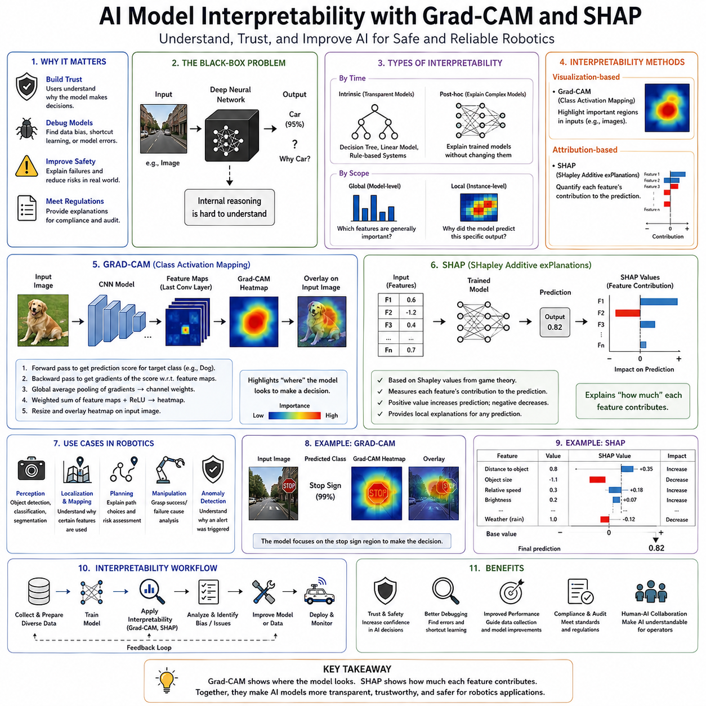{width="7.268055555555556in" height="7.268055555555556in"}

AI model interpretability is the field of artificial intelligence that seeks to explain how and why machine learning models produce their predictions. While modern deep neural networks have achieved remarkable performance across computer vision, natural language processing, robotics, autonomous driving, medical diagnosis, industrial inspection, and scientific discovery, they often operate as highly complex nonlinear systems whose internal reasoning is difficult for humans to understand. In safety-critical robotics, this lack of transparency presents significant challenges because engineers, operators, regulators, and users must trust that autonomous systems make decisions for appropriate reasons rather than relying on accidental correlations or hidden biases. AI model interpretability therefore has become a fundamental component of trustworthy artificial intelligence, complementing model accuracy, robustness, uncertainty estimation, and formal verification by providing insight into the internal decision-making process.

The motivation for interpretability arises from the difference between predictive performance and human understanding. A neural network may consistently classify objects correctly while providing no explanation regarding which image regions influenced its decision. Similarly, a reinforcement learning policy may navigate complex environments successfully without revealing the internal reasoning behind specific motion choices. Although such systems demonstrate impressive capability, engineers cannot easily determine whether the model has learned meaningful semantic concepts or merely exploited statistical shortcuts within the training data. Interpretability provides the tools needed to investigate these internal representations and evaluate whether model behavior aligns with human expectations.

Traditional machine learning algorithms often possess relatively high interpretability. Linear regression models explicitly associate each input variable with a learned coefficient describing its influence on the output. Decision trees reveal hierarchical decision paths that humans can inspect directly. Rule-based expert systems consist of explicit logical statements understandable by domain experts. Deep neural networks, however, may contain millions or even billions of parameters organized across hundreds of nonlinear layers. Their learned representations emerge through optimization rather than manual design, making direct interpretation extremely difficult.

This challenge is commonly described as the "black-box" problem. Inputs enter the model, outputs emerge after complex computation, but the internal transformations remain largely opaque to human observers. Although every mathematical operation inside the network is known precisely, the enormous complexity of modern architectures prevents intuitive understanding. AI interpretability attempts to illuminate these hidden computational processes using visualization, attribution, sensitivity analysis, probabilistic reasoning, and explanatory algorithms.

Interpretability serves several important objectives within robotics. The first is trust. Human operators supervising autonomous robots naturally seek explanations when systems make unexpected decisions. A warehouse robot selecting an unusual route, an autonomous vehicle braking unexpectedly, or a collaborative manipulator rejecting an apparently valid grasp all raise questions requiring understandable explanations. Transparent models increase operator confidence because unusual behavior can be investigated rather than simply accepted.

The second objective is debugging. Neural networks occasionally learn unintended strategies during training. Rather than recognizing meaningful semantic features, they may exploit background textures, lighting artifacts, camera positioning, annotation errors, or dataset biases. Without interpretability tools, these hidden shortcuts remain invisible until deployment failures occur. Visualization techniques allow engineers to identify such undesirable behavior early in development.

Safety represents another major motivation. Autonomous robots interact directly with the physical world through motion, manipulation, navigation, and human collaboration. Understanding why a perception system failed to detect an obstacle or why a planning network selected a risky trajectory enables systematic improvement while reducing future operational risks.

Interpretability also supports regulatory compliance. Medical devices, autonomous vehicles, industrial automation systems, and safety-critical robotics increasingly require evidence that AI decisions remain understandable and auditable. Regulatory authorities often demand explanations supporting automated decisions before approving deployment in high-risk environments.

Interpretability methods are generally categorized into intrinsic interpretability and post-hoc interpretability. Intrinsically interpretable models possess architectures naturally understandable by humans. Linear models, decision trees, sparse rule systems, and generalized additive models belong to this category. Their internal structure directly reveals decision logic without requiring additional explanation algorithms.

Deep learning systems generally require post-hoc interpretability because their internal representations remain too complex for direct inspection. Post-hoc methods analyze trained models after optimization, generating explanations without modifying the underlying architecture. These methods seek to explain model behavior rather than simplifying the model itself.

Interpretability methods may also be categorized according to scope. Global interpretability attempts to explain the overall behavior of an entire model. Engineers investigate which features the model generally considers important, how decision boundaries are organized, or how internal representations evolve across layers. Local interpretability instead explains individual predictions, identifying precisely why one specific decision occurred for one particular input.

Feature attribution constitutes one of the most widely used interpretability approaches. Rather than explaining complete neural computations, attribution methods estimate how strongly each input feature contributes to the final prediction. In computer vision, attribution identifies influential image regions. In robotics, attribution may reveal which LiDAR measurements, camera pixels, force sensor readings, or proprioceptive observations guided autonomous decisions.

Gradient-based methods represent one major family of attribution techniques. Neural networks are differentiable mathematical functions, allowing gradients to describe how sensitive predictions remain to small input changes. Features producing large gradients generally exert greater influence on final predictions than features associated with small gradients.

Saliency maps provide one of the earliest gradient-based visualization methods. The gradient of the predicted class score with respect to every input pixel is calculated, producing an importance map highlighting regions most strongly influencing classification. Bright regions indicate pixels where small modifications significantly alter prediction confidence.

Although conceptually simple, raw saliency maps frequently appear noisy because gradients fluctuate substantially across neighboring pixels. Various smoothing and regularization techniques improve visualization quality while preserving meaningful attribution information.

Guided backpropagation extends ordinary saliency analysis by modifying gradient propagation through activation functions. Negative gradients are selectively suppressed, producing cleaner visualizations emphasizing features positively contributing to predictions. Although visually appealing, guided backpropagation sacrifices certain theoretical properties for improved interpretability.

Integrated Gradients address several limitations of conventional gradient methods. Rather than evaluating gradients only at the observed input, gradients are integrated along a continuous path connecting a baseline reference input to the actual observation. This procedure accumulates feature importance throughout the interpolation trajectory, producing more stable and theoretically grounded attribution scores.

One attractive property of Integrated Gradients is completeness. The sum of all feature attributions equals the difference between the model output for the actual input and the baseline input. This mathematical property improves interpretability by ensuring all contributions collectively explain the prediction.

SmoothGrad further improves gradient visualization through statistical averaging. Multiple noisy versions of the input are generated, gradients are calculated independently, and the results are averaged. Random noise cancels unstable gradient fluctuations while reinforcing consistently important features, producing clearer attribution maps.

Among all interpretability methods developed for convolutional neural networks, Gradient-weighted Class Activation Mapping, commonly known as Grad-CAM, has become one of the most influential and widely adopted techniques. Grad-CAM provides intuitive visual explanations by identifying image regions responsible for specific predictions while preserving the spatial structure of the original image.

The central idea behind Grad-CAM is remarkably elegant. Instead of analyzing gradients with respect to individual input pixels, Grad-CAM examines gradients flowing into the final convolutional feature maps. These feature maps retain rich spatial information describing object locations and semantic structures extracted throughout earlier network layers.

For a given predicted class, Grad-CAM computes gradients of the class score with respect to every feature map in the final convolutional layer. Global average pooling summarizes the importance of each feature map into scalar weights representing their contribution to the prediction. These weights are then used to compute a weighted combination of the feature maps themselves, producing a coarse localization map highlighting regions responsible for the prediction.

The resulting heatmap identifies areas the neural network considered most important when making its decision. Unlike pixel-level gradient methods, Grad-CAM naturally emphasizes semantically meaningful object regions because final convolutional layers encode high-level visual concepts rather than low-level image details.

Grad-CAM possesses several important advantages. It remains architecture independent for convolutional neural networks, requires only gradient computation without model retraining, produces intuitive visualizations understandable by non-experts, and preserves sufficient spatial resolution for practical debugging. Consequently, Grad-CAM has become a standard interpretability tool throughout computer vision research.

Grad-CAM++ extends the original formulation by improving localization when multiple object instances contribute simultaneously to predictions. Modified weighting strategies produce more accurate attribution maps, particularly for images containing several objects of the same category.

Score-CAM eliminates gradient computation entirely by evaluating feature importance through forward inference. Individual activation maps mask the original input, and resulting prediction changes determine feature significance. Although computationally more expensive than Grad-CAM, Score-CAM avoids certain gradient-related artifacts while improving localization quality.

Layer-CAM generalizes class activation mapping across multiple network layers simultaneously. Lower layers contribute fine spatial detail, while deeper layers encode semantic concepts. Combining information across scales produces richer explanations capturing both precise localization and high-level understanding.

Transformer architectures require new interpretability techniques because they replace convolutional feature maps with self-attention mechanisms. Attention visualization displays relationships among image patches or language tokens, revealing how information propagates throughout transformer computations. Although attention weights do not always correspond directly to causal importance, they provide valuable insight into model reasoning.

Attention rollout aggregates attention matrices across transformer layers, tracing information flow throughout deep architectures. This technique reveals long-range dependencies difficult to visualize using individual attention layers independently.

Beyond gradient-based visualization, perturbation methods explain predictions by systematically modifying inputs and observing output changes. Features whose removal significantly alters predictions receive greater importance than features producing little effect.

Occlusion sensitivity exemplifies this approach. Small regions of the input image are masked sequentially while recording prediction confidence. If covering a particular region substantially reduces confidence, that region likely contributes strongly to the prediction. Although computationally intensive, occlusion analysis provides intuitive causal evidence supporting feature importance.

Local Interpretable Model-Agnostic Explanations, commonly abbreviated as LIME, represents one of the most influential model-agnostic interpretability methods. Rather than analyzing neural network internals directly, LIME approximates local model behavior using simple interpretable surrogate models.

The procedure begins by generating numerous perturbed versions of the input through random feature modifications. The original black-box model predicts outputs for each perturbed sample. A weighted linear regression model then approximates the relationship between perturbed inputs and predictions within the local neighborhood surrounding the original observation.

Because linear models remain inherently interpretable, feature coefficients reveal local importance despite the underlying model remaining highly nonlinear. LIME therefore provides explanations applicable to virtually any predictive model regardless of architecture.

Although highly flexible, LIME explanations depend upon perturbation sampling strategies, neighborhood definitions, and surrogate model selection. Different parameter choices occasionally produce different explanations, highlighting the importance of careful experimental design.

SHAP, which stands for SHapley Additive exPlanations, provides one of the most theoretically rigorous interpretability frameworks currently available. SHAP derives feature importance from cooperative game theory, specifically the concept of Shapley values originally developed for allocating rewards among cooperating players.

Within machine learning, each input feature corresponds to a player participating in the prediction game. The overall prediction represents the collective reward generated by feature cooperation. Shapley values quantify the average marginal contribution of every feature across all possible subsets of collaborating features.

The mathematical elegance of SHAP arises from several desirable theoretical properties. Efficiency ensures that feature contributions sum exactly to the model prediction difference relative to a baseline. Symmetry guarantees equal attribution for equally important features. Dummy features receive zero importance, and additivity supports combining explanations across multiple models.

Exact Shapley value computation requires evaluating every possible feature subset, producing exponential computational complexity impractical for high-dimensional neural networks. Consequently, practical SHAP implementations employ approximation algorithms specialized for different model classes.

Kernel SHAP provides a model-agnostic approximation applicable to virtually any predictive system. Sampling strategies estimate Shapley values without requiring exhaustive subset evaluation. Although computationally demanding, Kernel SHAP supports broad applicability across diverse machine learning models.

Deep SHAP combines DeepLIFT with Shapley approximation principles specifically for deep neural networks. Gradient information accelerates computation while preserving many desirable theoretical characteristics.

Tree SHAP exploits decision tree structure to compute exact Shapley values efficiently. Although primarily designed for tree-based models, its success demonstrates the importance of architecture-specific optimization within interpretability research.

SHAP visualizations provide rich insight into model behavior. Summary plots reveal globally important features across entire datasets. Force plots illustrate how individual features push predictions toward different outcomes. Dependence plots show how feature importance varies across different feature values. Decision plots visualize cumulative feature contributions throughout prediction formation.

Robotics applications benefit substantially from SHAP because autonomous decisions frequently depend upon numerous interacting sensor measurements. Camera features, LiDAR returns, inertial observations, force measurements, localization estimates, battery status, environmental variables, and historical context all contribute simultaneously to planning decisions. SHAP decomposes these complex interactions into understandable feature contributions.

Interpretability also supports reinforcement learning. Policy networks mapping observations directly into actions often appear particularly opaque because intermediate reasoning remains implicit. Attribution techniques reveal environmental features influencing policy decisions, enabling engineers to detect undesirable strategies or unintended reward exploitation.

World models and foundation models introduce additional interpretability challenges because they integrate multimodal perception, memory, planning, reasoning, and language understanding. Individual attention maps or feature attributions provide only partial explanations for these highly interconnected architectures. Consequently, research increasingly investigates concept-based explanations representing higher-level semantic reasoning rather than individual feature importance.

Concept Activation Vectors represent one promising direction. Rather than attributing importance to pixels or numerical features, concepts such as doors, humans, obstacles, road boundaries, or graspable objects become interpretable semantic units. This aligns explanations more closely with human reasoning.

Counterfactual explanations provide another complementary approach. Instead of identifying influential features, counterfactual methods answer questions regarding what minimal changes would alter the prediction. For example, an autonomous robot might explain that increasing obstacle distance or improving illumination would change a navigation decision.

Interpretability also assists dataset bias detection. Visualization methods frequently reveal models focusing on irrelevant background textures, camera artifacts, watermarks, timestamps, or annotation inconsistencies rather than meaningful semantic content. Correcting these hidden biases significantly improves generalization.

Model debugging benefits substantially from explanation techniques. Engineers investigate prediction failures by comparing attribution maps across successful and unsuccessful cases. Unexpected feature importance often reveals architectural weaknesses, insufficient training diversity, annotation errors, or preprocessing problems.

Interpretability nevertheless possesses important limitations. Explanations frequently approximate rather than exactly represent internal reasoning. Different interpretability methods occasionally produce inconsistent feature attributions. Human interpretation of visualization results introduces additional subjectivity. Consequently, explanations should complement rather than replace rigorous empirical evaluation.

Computational overhead also influences practical deployment. SHAP, perturbation analysis, occlusion sensitivity, and ensemble explanation methods often require substantially greater computation than ordinary inference. Offline debugging generally tolerates these costs, whereas real-time robotic deployment may require simplified explanation mechanisms.

Future research increasingly emphasizes inherently interpretable foundation models, causal explanations, concept-level reasoning, multimodal interpretability, explanation consistency, uncertainty-aware explanations, and human-centered explanation interfaces. As robotic intelligence becomes increasingly sophisticated, explanations must evolve beyond isolated feature attribution toward comprehensive descriptions of planning, memory, reasoning, and long-term decision processes.

Ultimately, AI model interpretability transforms deep learning from purely predictive systems into systems whose reasoning can be investigated, validated, improved, and trusted. Techniques such as Grad-CAM, SHAP, Integrated Gradients, LIME, attention visualization, perturbation analysis, and concept-based explanations provide complementary perspectives on neural network behavior. Rather than replacing predictive accuracy, interpretability strengthens trustworthy artificial intelligence by enabling engineers to understand why models succeed, diagnose why they fail, identify hidden biases, improve robustness, support regulatory compliance, and establish human confidence in autonomous systems. As Physical AI continues advancing toward increasingly capable robots operating within safety-critical environments, interpretability will remain an indispensable foundation for transparent, explainable, accountable, and reliable intelligent robotic behavior.

AI 모델 해석 가능성(interpretability)은 머신러닝 모델이 어떻게, 왜 자신의 예측을 만들어내는지를 설명하려는 인공지능의 한 분야이다. 현대의 심층 신경망이 컴퓨터 비전, 자연어 처리, 로보틱스, 자율주행, 의료 진단, 산업 검사, 과학적 발견 전반에 걸쳐 놀라운 성능을 달성했지만, 이들은 종종 그 내부적인 추론을 인간이 이해하기 어려운 매우 복잡한 비선형적 시스템으로 작동한다. 안전이 중요한 로보틱스에서, 엔지니어, 조작자, 규제 기관, 사용자는 자율 시스템이 우연한 상관관계나 숨겨진 편향에 의존하는 것이 아니라 적절한 이유로 결정을 내린다는 것을 신뢰해야 하기 때문에 이러한 투명성의 부재는 상당한 과제를 제시한다. 따라서 AI 모델 해석 가능성은, 내부적인 의사결정 과정에 대한 통찰을 제공함으로써 모델의 정확도, 견고성, 불확실성 추정, 형식적 검증을 보완하는 신뢰할 수 있는 인공지능의 근본적인 구성 요소가 되었다.

해석 가능성의 동기는 예측 성능과 인간의 이해 사이의 차이에서 비롯된다. 신경망은 어떤 이미지 영역이 그 결정에 영향을 미쳤는지에 대한 설명 없이 물체를 일관되게 올바르게 분류할 수 있다. 마찬가지로, 강화학습 정책은 특정한 동작 선택 뒤에 있는 내부적인 추론을 드러내지 않고도 복잡한 환경을 성공적으로 내비게이션할 수 있다. 이러한 시스템들이 인상적인 능력을 보여주지만, 엔지니어들은 모델이 의미 있는 의미론적 개념을 학습했는지 아니면 단순히 학습 데이터 내의 통계적 지름길을 악용했는지를 쉽게 판단할 수 없다. 해석 가능성은 이러한 내부적인 표현들을 조사하고 모델의 행동이 인간의 기대와 일치하는지를 평가하는 데 필요한 도구들을 제공한다.

전통적인 머신러닝 알고리즘은 종종 비교적 높은 해석 가능성을 지닌다. 선형 회귀 모델은 각각의 입력 변수를 그것이 출력에 미치는 영향을 기술하는 학습된 계수와 명시적으로 연관짓는다. 결정 트리는 인간이 직접 검사할 수 있는 계층적인 결정 경로를 드러낸다. 규칙 기반 전문가 시스템은 도메인 전문가가 이해할 수 있는 명시적인 논리적 진술들로 구성된다. 그러나 심층 신경망은 수백 개의 비선형 레이어에 걸쳐 조직된 수백만 또는 수십억 개의 파라미터를 포함할 수 있다. 이들이 학습한 표현들은 수작업 설계가 아니라 최적화를 통해 나타나기 때문에, 직접적인 해석이 극도로 어려워진다.

이러한 과제는 흔히 "블랙박스" 문제로 기술된다. 입력이 모델에 들어가고, 복잡한 계산 이후 출력이 나오지만, 내부적인 변환은 인간 관찰자에게는 대체로 불투명한 채로 남아 있다. 네트워크 내부의 모든 수학적 연산이 정밀하게 알려져 있지만, 현대 아키텍처의 엄청난 복잡성은 직관적인 이해를 방해한다. AI 해석 가능성은 시각화, 귀속(attribution), 민감도 분석, 확률적 추론, 설명 알고리즘을 사용해 이러한 숨겨진 계산적 과정들을 밝혀내려고 시도한다.

해석 가능성은 로보틱스 내에서 여러 중요한 목표에 기여한다. 첫 번째는 신뢰(trust)이다. 자율 로봇을 감독하는 인간 조작자는 시스템이 예상치 못한 결정을 내릴 때 자연스럽게 설명을 원한다. 특이한 경로를 선택하는 창고 로봇, 예기치 않게 제동하는 자율주행 차량, 또는 겉으로는 유효해 보이는 파지를 거부하는 협동 매니퓰레이터는 모두 이해 가능한 설명이 필요한 질문들을 제기한다. 투명한 모델은, 특이한 행동을 단순히 받아들이는 것이 아니라 조사할 수 있게 하기 때문에 조작자의 신뢰를 높인다.

두 번째 목표는 디버깅(debugging)이다. 신경망은 때때로 학습 과정에서 의도하지 않은 전략을 학습한다. 의미 있는 의미론적 특징을 인식하는 대신, 이들은 배경 텍스처, 조명 아티팩트, 카메라의 위치, 주석 오류, 또는 데이터셋 편향을 악용할 수 있다. 해석 가능성 도구가 없다면, 이러한 숨겨진 지름길은 배치 실패가 발생할 때까지 보이지 않은 채로 남아 있는다. 시각화 기법은 엔지니어가 개발 초기 단계에서 이러한 바람직하지 않은 행동을 식별할 수 있게 한다.

안전성은 또 다른 주요한 동기를 나타낸다. 자율 로봇은 움직임, 조작, 내비게이션, 인간과의 협업을 통해 물리적 세계와 직접 상호작용한다. 인지 시스템이 장애물을 감지하지 못한 이유나 계획 수립 네트워크가 위험한 궤적을 선택한 이유를 이해하는 것은, 향후의 운영상의 위험을 줄이면서도 체계적인 개선을 가능하게 한다.

해석 가능성은 또한 규제 준수도 지원한다. 의료 기기, 자율주행 차량, 산업 자동화 시스템, 안전이 중요한 로보틱스는 AI 결정이 이해 가능하고 감사 가능한 상태로 남아 있다는 증거를 점점 더 많이 요구하고 있다. 규제 당국은 종종 고위험 환경에서의 배치를 승인하기 전에 자동화된 결정을 뒷받침하는 설명을 요구한다.

해석 가능성 방법은 일반적으로 본질적 해석 가능성(intrinsic interpretability)과 사후 해석 가능성(post-hoc interpretability)으로 분류된다. 본질적으로 해석 가능한 모델은 인간이 자연스럽게 이해할 수 있는 아키텍처를 지닌다. 선형 모델, 결정 트리, 희소 규칙 시스템, 일반화된 가법 모델(generalized additive model)이 이 범주에 속한다. 이들의 내부 구조는 추가적인 설명 알고리즘을 필요로 하지 않고도 결정 논리를 직접 드러낸다.

딥러닝 시스템은, 그 내부적인 표현이 직접적인 검사를 하기에는 너무 복잡한 채로 남아 있기 때문에 일반적으로 사후 해석 가능성을 필요로 한다. 사후 방법들은 최적화 이후 학습된 모델을 분석하여, 기저의 아키텍처를 수정하지 않고도 설명을 생성한다. 이러한 방법들은 모델 자체를 단순화하는 것이 아니라 모델의 행동을 설명하려고 시도한다.

해석 가능성 방법은 또한 범위에 따라 분류될 수도 있다. 전역적 해석 가능성(global interpretability)은 전체 모델의 전반적인 행동을 설명하려고 시도한다. 엔지니어는 모델이 일반적으로 어떤 특징들을 중요하게 여기는지, 결정 경계가 어떻게 조직되는지, 또는 내부적인 표현이 레이어들에 걸쳐 어떻게 진화하는지를 조사한다. 지역적 해석 가능성(local interpretability)은 대신 개별적인 예측을 설명하며, 하나의 특정한 입력에 대해 하나의 특정한 결정이 정확히 왜 일어났는지를 식별한다.

특징 귀속(feature attribution)은 가장 널리 사용되는 해석 가능성 접근법 중 하나를 이룬다. 완전한 신경망 계산을 설명하는 대신, 귀속 방법은 각각의 입력 특징이 최종 예측에 얼마나 강하게 기여하는지를 추정한다. 컴퓨터 비전에서, 귀속은 영향력 있는 이미지 영역을 식별한다. 로보틱스에서, 귀속은 어떤 LiDAR 측정치, 카메라 픽셀, 힘 센서 판독값, 또는 고유수용감각 관측치가 자율적인 결정을 안내했는지를 드러낼 수 있다.

그래디언트 기반 방법은 귀속 기법의 한 주요한 계열을 나타낸다. 신경망은 미분 가능한 수학적 함수이기 때문에, 그래디언트는 예측이 작은 입력 변화에 얼마나 민감한지를 기술할 수 있게 한다. 큰 그래디언트를 만들어내는 특징들은 일반적으로 작은 그래디언트와 관련된 특징들보다 최종 예측에 더 큰 영향을 미친다.

중요도 맵(saliency map)은 가장 초기의 그래디언트 기반 시각화 방법 중 하나를 제공한다. 모든 입력 픽셀에 대한 예측된 클래스 점수의 그래디언트가 계산되어, 분류에 가장 강하게 영향을 미치는 영역들을 강조하는 중요도 맵을 만들어낸다. 밝은 영역은 작은 수정이 예측 신뢰도를 크게 바꾸는 픽셀들을 나타낸다.

개념적으로는 단순하지만, 원시적인 중요도 맵은 그래디언트가 인접한 픽셀들에 걸쳐 상당히 변동하기 때문에 종종 노이즈가 있는 것처럼 보인다. 다양한 스무딩 및 정규화 기법들은 의미 있는 귀속 정보를 보존하면서도 시각화의 품질을 향상시킨다.

가이드 역전파(guided backpropagation)는 활성화 함수를 통한 그래디언트 전파를 수정함으로써 일반적인 중요도 분석을 확장한다. 음의 그래디언트는 선택적으로 억제되어, 예측에 긍정적으로 기여하는 특징들을 강조하는 더 깨끗한 시각화를 만들어낸다. 시각적으로는 매력적이지만, 가이드 역전파는 향상된 해석 가능성을 위해 특정한 이론적 속성들을 희생한다.

통합 그래디언트(Integrated Gradients)는 전통적인 그래디언트 방법의 여러 한계를 다룬다. 관측된 입력에서만 그래디언트를 평가하는 대신, 그래디언트는 기준선 참조 입력을 실제 관측치와 연결하는 연속적인 경로를 따라 통합된다. 이 절차는 보간 궤적 전반에 걸쳐 특징의 중요도를 누적하여, 더 안정적이고 이론적으로 근거가 있는 귀속 점수를 만들어낸다.

통합 그래디언트의 매력적인 속성 중 하나는 완전성(completeness)이다. 모든 특징 귀속의 합은 실제 입력에 대한 모델 출력과 기준선 입력에 대한 모델 출력 사이의 차이와 같다. 이 수학적 속성은 모든 기여가 집단적으로 예측을 설명하도록 보장함으로써 해석 가능성을 향상시킨다.

SmoothGrad는 통계적 평균화를 통해 그래디언트 시각화를 더욱 향상시킨다. 입력의 여러 노이즈가 추가된 버전들이 생성되고, 그래디언트가 독립적으로 계산되며, 결과들이 평균화된다. 무작위 노이즈는 불안정한 그래디언트 변동을 상쇄하면서도 일관되게 중요한 특징들을 강화하여, 더 명확한 귀속 맵을 만들어낸다.

합성곱 신경망을 위해 개발된 모든 해석 가능성 방법들 중에서, 일반적으로 Grad-CAM으로 알려진 그래디언트 가중 클래스 활성화 매핑(Gradient-weighted Class Activation Mapping)은 가장 영향력 있고 널리 채택된 기법 중 하나가 되었다. Grad-CAM은 원본 이미지의 공간적 구조를 보존하면서도 특정한 예측을 담당하는 이미지 영역들을 식별함으로써 직관적인 시각적 설명을 제공한다.

Grad-CAM 뒤에 있는 핵심적인 아이디어는 놀라울 정도로 우아하다. 개별 입력 픽셀에 대한 그래디언트를 분석하는 대신, Grad-CAM은 최종 합성곱 특징 맵으로 흘러 들어가는 그래디언트를 검토한다. 이러한 특징 맵들은 이전 네트워크 레이어들에 걸쳐 추출된 물체의 위치와 의미론적 구조를 기술하는 풍부한 공간적 정보를 유지한다.

주어진 예측된 클래스에 대해, Grad-CAM은 최종 합성곱 레이어의 모든 특징 맵에 대한 클래스 점수의 그래디언트를 계산한다. 전역 평균 풀링(global average pooling)은 각각의 특징 맵의 중요도를, 예측에 대한 그것들의 기여를 나타내는 스칼라 가중치로 요약한다. 이러한 가중치들은 이후 특징 맵 자체의 가중된 조합을 계산하는 데 사용되어, 예측을 담당하는 영역들을 강조하는 조악한 위치 결정 맵(localization map)을 만들어낸다.

그 결과로 만들어진 히트맵은 신경망이 결정을 내릴 때 가장 중요하다고 여긴 영역들을 식별한다. 픽셀 수준의 그래디언트 방법과 달리, 최종 합성곱 레이어들이 저수준의 이미지 세부사항이 아니라 고수준의 시각적 개념을 인코딩하기 때문에 Grad-CAM은 자연스럽게 의미론적으로 의미 있는 물체 영역들을 강조한다.

Grad-CAM은 여러 중요한 이점을 지닌다. 이는 합성곱 신경망에 대해 아키텍처와 무관한 상태로 유지되고, 모델 재학습 없이 그래디언트 계산만을 필요로 하며, 비전문가도 이해할 수 있는 직관적인 시각화를 만들어내고, 실용적인 디버깅을 위한 충분한 공간적 해상도를 보존한다. 따라서 Grad-CAM은 컴퓨터 비전 연구 전반에 걸쳐 표준적인 해석 가능성 도구가 되었다.

Grad-CAM++는 여러 물체 인스턴스가 예측에 동시에 기여할 때 위치 결정을 향상시킴으로써 원래의 공식화를 확장한다. 수정된 가중치 부여 전략은, 특히 동일한 범주의 여러 물체를 포함하는 이미지에 대해 더 정확한 귀속 맵을 만들어낸다.

Score-CAM은 순방향 추론을 통해 특징의 중요도를 평가함으로써 그래디언트 계산을 완전히 제거한다. 개별적인 활성화 맵은 원본 입력을 마스킹하며, 그 결과로 만들어지는 예측의 변화는 특징의 유의성을 결정한다. Grad-CAM보다 계산적으로 더 비용이 많이 들지만, Score-CAM은 위치 결정 품질을 향상시키면서도 특정한 그래디언트 관련 아티팩트를 피한다.

Layer-CAM은 클래스 활성화 매핑을 여러 네트워크 레이어에 걸쳐 동시에 일반화한다. 낮은 레이어는 세밀한 공간적 세부사항에 기여하는 한편, 더 깊은 레이어는 의미론적 개념을 인코딩한다. 여러 스케일에 걸친 정보를 결합하는 것은 정밀한 위치 결정과 고수준의 이해 모두를 포착하는 더 풍부한 설명을 만들어낸다.

트랜스포머 아키텍처는 합성곱 특징 맵을 셀프 어텐션 메커니즘으로 대체하기 때문에 새로운 해석 가능성 기법을 필요로 한다. 어텐션 시각화는 이미지 패치나 언어 토큰들 사이의 관계를 표시하여, 정보가 트랜스포머 계산 전반에 걸쳐 어떻게 전파되는지를 드러낸다. 어텐션 가중치가 항상 인과적 중요도에 직접 대응하는 것은 아니지만, 이들은 모델의 추론에 대한 유용한 통찰을 제공한다.

어텐션 롤아웃(attention rollout)은 트랜스포머 레이어들에 걸쳐 어텐션 행렬을 통합하여, 심층 아키텍처 전반에 걸친 정보 흐름을 추적한다. 이 기법은 개별적인 어텐션 레이어만으로는 시각화하기 어려운 장거리 의존성을 드러낸다.

그래디언트 기반 시각화를 넘어, 섭동 방법(perturbation method)은 입력을 체계적으로 수정하고 출력의 변화를 관찰함으로써 예측을 설명한다. 제거되었을 때 예측을 상당히 바꾸는 특징들은 거의 영향을 미치지 않는 특징들보다 더 큰 중요도를 받는다.

가림 민감도(occlusion sensitivity)는 이 접근법을 잘 보여준다. 입력 이미지의 작은 영역들이 순차적으로 마스킹되는 동안 예측 신뢰도가 기록된다. 특정한 영역을 가리는 것이 신뢰도를 상당히 낮춘다면, 그 영역은 예측에 강하게 기여할 가능성이 높다. 계산적으로 부담스럽지만, 가림 분석은 특징 중요도를 뒷받침하는 직관적인 인과적 증거를 제공한다.

일반적으로 LIME으로 약칭되는 지역적 해석 가능 모델에 구애받지 않는 설명(Local Interpretable Model-Agnostic Explanations)은 가장 영향력 있는 모델에 구애받지 않는 해석 가능성 방법 중 하나를 나타낸다. 신경망 내부를 직접 분석하는 대신, LIME은 단순한 해석 가능한 대리 모델을 사용해 지역적인 모델 행동을 근사한다.

이 절차는 무작위 특징 수정을 통해 입력의 수많은 섭동된 버전들을 생성하는 것으로 시작된다. 원본 블랙박스 모델은 각각의 섭동된 샘플에 대한 출력을 예측한다. 이후 가중치가 부여된 선형 회귀 모델은 원본 관측치를 둘러싼 지역적인 이웃 내에서 섭동된 입력과 예측 사이의 관계를 근사한다.

선형 모델이 본질적으로 해석 가능한 채로 남아 있기 때문에, 기저의 모델이 고도로 비선형적인 채로 남아 있음에도 불구하고 특징 계수는 지역적인 중요도를 드러낸다. 따라서 LIME은 아키텍처와 무관하게 사실상 모든 예측 모델에 적용 가능한 설명을 제공한다.

매우 유연하지만, LIME의 설명은 섭동 샘플링 전략, 이웃의 정의, 대리 모델 선택에 의존한다. 서로 다른 파라미터 선택은 때때로 다른 설명을 만들어내며, 이는 신중한 실험 설계의 중요성을 강조한다.

SHapley Additive exPlanations의 약자인 SHAP은 현재 사용 가능한 가장 이론적으로 엄격한 해석 가능성 프레임워크 중 하나를 제공한다. SHAP은 협력적 게임 이론, 구체적으로는 원래 협력하는 플레이어들 사이에 보상을 할당하기 위해 개발된 섀플리 값(Shapley value)이라는 개념으로부터 특징의 중요도를 도출한다.

머신러닝 내에서, 각각의 입력 특징은 예측 게임에 참여하는 플레이어에 대응한다. 전체적인 예측은 특징들의 협력을 통해 생성되는 집단적인 보상을 나타낸다. 섀플리 값은 협력하는 특징들의 모든 가능한 부분집합에 걸쳐 각각의 특징이 지니는 평균적인 한계 기여도를 정량화한다.

SHAP의 수학적 우아함은 여러 바람직한 이론적 속성들로부터 비롯된다. 효율성(efficiency)은 특징의 기여가 기준선에 대한 모델 예측 차이에 정확히 합산되도록 보장한다. 대칭성(symmetry)은 동등하게 중요한 특징들에 대한 동등한 귀속을 보장한다. 더미 특징들은 0의 중요도를 받으며, 가법성(additivity)은 여러 모델들에 걸친 설명을 결합하는 것을 지원한다.

정확한 섀플리 값 계산은 모든 가능한 특징 부분집합을 평가할 것을 요구하여, 고차원 신경망에는 비현실적인 지수적 계산 복잡성을 만들어낸다. 따라서 실용적인 SHAP 구현은 서로 다른 모델 클래스에 특화된 근사 알고리즘을 사용한다.

커널 SHAP(Kernel SHAP)은 사실상 모든 예측 시스템에 적용 가능한 모델에 구애받지 않는 근사를 제공한다. 샘플링 전략은 철저한 부분집합 평가를 필요로 하지 않고도 섀플리 값을 추정한다. 계산적으로 부담스럽지만, 커널 SHAP은 다양한 머신러닝 모델들에 걸친 폭넓은 적용 가능성을 지원한다.

Deep SHAP은 심층 신경망에 특별히 맞춰진 DeepLIFT를 섀플리 근사 원리와 결합한다. 그래디언트 정보는 많은 바람직한 이론적 특성들을 보존하면서도 계산을 가속화한다.

Tree SHAP은 결정 트리 구조를 활용하여 정확한 섀플리 값을 효율적으로 계산한다. 주로 트리 기반 모델을 위해 설계되었지만, 그 성공은 해석 가능성 연구 내에서 아키텍처별 최적화의 중요성을 보여준다.

SHAP 시각화는 모델 행동에 대한 풍부한 통찰을 제공한다. 요약 도표는 전체 데이터셋에 걸쳐 전역적으로 중요한 특징들을 드러낸다. 포스 플롯(force plot)은 개별적인 특징들이 예측을 서로 다른 결과들을 향해 어떻게 밀어붙이는지를 보여준다. 의존성 플롯(dependence plot)은 특징의 중요도가 서로 다른 특징 값들에 걸쳐 어떻게 변하는지를 보여준다. 결정 플롯(decision plot)은 예측 형성 전반에 걸친 누적적인 특징 기여도를 시각화한다.

자율적인 결정이 종종 수많은 상호작용하는 센서 측정치에 의존하기 때문에 로보틱스 응용 분야는 SHAP으로부터 상당한 이득을 얻는다. 카메라 특징, LiDAR 반향, 관성 관측치, 힘 측정치, 위치 추정치, 배터리 상태, 환경 변수, 과거의 맥락은 모두 계획 수립 결정에 동시에 기여한다. SHAP은 이러한 복잡한 상호작용들을 이해 가능한 특징 기여도로 분해한다.

해석 가능성은 또한 강화학습도 지원한다. 관측치를 행동으로 직접 매핑하는 정책 네트워크는, 중간의 추론이 암묵적인 채로 남아 있기 때문에 종종 특히 불투명해 보인다. 귀속 기법은 정책 결정에 영향을 미치는 환경적 특징들을 드러내어, 엔지니어들이 바람직하지 않은 전략이나 의도하지 않은 보상 악용을 감지할 수 있게 한다.

세계 모델과 파운데이션 모델은, 멀티모달 인지, 기억, 계획 수립, 추론, 언어 이해를 통합하기 때문에 추가적인 해석 가능성 과제를 도입한다. 개별적인 어텐션 맵이나 특징 귀속은 이렇게 고도로 상호 연결된 아키텍처들에 대해 부분적인 설명만을 제공한다. 따라서 연구는 개별적인 특징 중요도가 아니라 더 높은 수준의 의미론적 추론을 나타내는 개념 기반 설명(concept-based explanation)을 점점 더 많이 조사하고 있다.

개념 활성화 벡터(Concept Activation Vector)는 유망한 방향 중 하나를 나타낸다. 픽셀이나 수치적 특징에 중요도를 귀속시키는 대신, 문, 인간, 장애물, 도로 경계, 또는 파지 가능한 물체와 같은 개념들이 해석 가능한 의미론적 단위가 된다. 이는 설명을 인간의 추론과 더 밀접하게 정렬시킨다.

반사실적 설명(counterfactual explanation)은 또 다른 보완적인 접근법을 제공한다. 영향력 있는 특징을 식별하는 대신, 반사실적 방법은 어떤 최소한의 변화가 예측을 바꿀 것인지에 관한 질문에 답한다. 예를 들어, 자율 로봇은 장애물까지의 거리를 늘리거나 조명을 개선하는 것이 내비게이션 결정을 바꿀 것이라고 설명할 수 있다.

해석 가능성은 또한 데이터셋 편향 감지에도 도움이 된다. 시각화 방법은 종종 모델이 의미 있는 의미론적 콘텐츠가 아니라 관련 없는 배경 텍스처, 카메라 아티팩트, 워터마크, 타임스탬프, 또는 주석의 불일치에 초점을 맞추고 있다는 것을 드러낸다. 이러한 숨겨진 편향들을 수정하는 것은 일반화를 상당히 향상시킨다.

모델 디버깅은 설명 기법으로부터 상당한 이득을 얻는다. 엔지니어는 성공한 사례와 성공하지 못한 사례들에 걸쳐 귀속 맵을 비교함으로써 예측 실패를 조사한다. 예상치 못한 특징 중요도는 종종 아키텍처적 약점, 불충분한 학습 다양성, 주석 오류, 또는 전처리 문제를 드러낸다.

그럼에도 불구하고 해석 가능성은 중요한 한계를 지닌다. 설명은 종종 내부적인 추론을 정확하게 나타내는 것이 아니라 근사한다. 서로 다른 해석 가능성 방법들은 때때로 일관되지 않은 특징 귀속을 만들어낸다. 시각화 결과에 대한 인간의 해석은 추가적인 주관성을 도입한다. 따라서 설명은 엄격한 경험적 평가를 대체하는 것이 아니라 보완해야 한다.

계산적 오버헤드도 실용적인 배치에 영향을 미친다. SHAP, 섭동 분석, 가림 민감도, 앙상블 설명 방법은 종종 일반적인 추론보다 상당히 더 많은 계산을 필요로 한다. 오프라인 디버깅은 일반적으로 이러한 비용을 감내하는 반면, 실시간 로봇 배치는 단순화된 설명 메커니즘을 필요로 할 수 있다.

미래의 연구는 본질적으로 해석 가능한 파운데이션 모델, 인과적 설명, 개념 수준의 추론, 멀티모달 해석 가능성, 설명의 일관성, 불확실성을 인식하는 설명, 인간 중심의 설명 인터페이스를 점점 더 많이 강조하고 있다. 로봇의 지능이 점점 더 정교해짐에 따라, 설명은 고립된 특징 귀속을 넘어 계획 수립, 기억, 추론, 장기적인 의사결정 과정에 대한 포괄적인 설명으로 진화해야 한다.

궁극적으로, AI 모델 해석 가능성은 딥러닝을 순수하게 예측적인 시스템에서, 그 추론이 조사되고, 검증되고, 개선되고, 신뢰될 수 있는 시스템으로 전환시킨다. Grad-CAM, SHAP, Integrated Gradients, LIME, 어텐션 시각화, 섭동 분석, 개념 기반 설명과 같은 기법들은 신경망 행동에 대한 상호 보완적인 관점을 제공한다. 예측 정확도를 대체하는 것이 아니라, 해석 가능성은 엔지니어들이 모델이 왜 성공하는지를 이해하고, 왜 실패하는지를 진단하며, 숨겨진 편향을 식별하고, 견고성을 향상시키며, 규제 준수를 지원하고, 자율 시스템에 대한 인간의 신뢰를 확립할 수 있게 함으로써 신뢰할 수 있는 인공지능을 강화한다. Physical AI가 안전이 중요한 환경 내에서 작동하는 점점 더 유능한 로봇을 향해 계속 발전함에 따라, 해석 가능성은 투명하고, 설명 가능하며, 책임 있고, 신뢰할 수 있는 지능형 로봇 행동을 위한 필수불가결한 기반으로 남을 것이다.

##  

## 11.08 Runtime Safety Monitor for AI Outputs [w/Code]

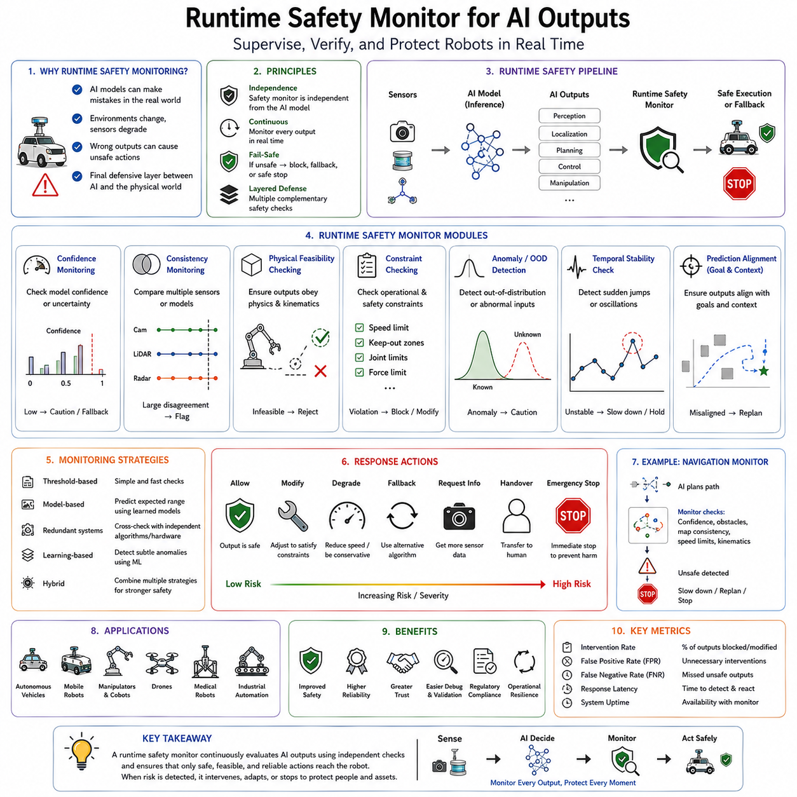{width="7.268055555555556in" height="7.268055555555556in"}

A Runtime Safety Monitor for AI outputs is a supervisory system that continuously observes the predictions, decisions, and actions generated by artificial intelligence models during robot operation and determines whether those outputs remain safe before they are allowed to influence the physical world. Unlike offline validation, model testing, or simulation-based verification performed before deployment, runtime safety monitoring operates continuously while the robot is actively executing tasks. Every perception result, localization estimate, navigation command, manipulation action, trajectory, language instruction, or autonomous decision passes through one or more safety monitors before reaching actuators. This additional supervisory layer acts as the final defensive barrier between intelligent decision-making and physical execution, ensuring that unexpected AI behavior does not immediately translate into hazardous robot actions. As autonomous robots become increasingly capable through deep learning, reinforcement learning, foundation models, vision-language-action architectures, and multimodal reasoning systems, runtime safety monitoring has become one of the most essential components of trustworthy Physical AI.

The need for runtime monitoring arises because no artificial intelligence model can be proven correct for every possible real-world situation. Training datasets inevitably remain incomplete, deployment environments evolve over time, sensors degrade, hardware ages, communication delays occur, and unexpected events continually arise. Even highly accurate AI systems occasionally produce incorrect predictions or unstable decisions when confronted with unfamiliar situations. Since robots operate within dynamic physical environments where incorrect outputs may endanger people, equipment, or infrastructure, every autonomous decision must be evaluated continuously while the robot remains operational.

Traditional robotics relied primarily on deterministic control systems. Engineers designed explicit state machines, rule-based planners, collision detection algorithms, emergency stop circuits, and hardware safety interlocks whose behavior could be analyzed mathematically. Artificial intelligence fundamentally changes this engineering paradigm because learned models generate decisions statistically rather than through explicitly programmed logic. While AI dramatically improves perception, planning, manipulation, and adaptation, it simultaneously introduces uncertainty regarding internal decision processes. Runtime safety monitors compensate for this uncertainty by independently supervising AI outputs rather than trusting them unconditionally.

One of the central principles of runtime safety monitoring is architectural separation. The safety monitor should remain logically independent from the AI model it supervises. If the same neural network both generates and validates decisions, systematic failures may propagate through both functions simultaneously. Instead, deterministic algorithms, independent sensors, redundant perception systems, formally verified controllers, or simplified rule-based safety modules evaluate AI outputs before physical execution occurs. This separation significantly increases system robustness because failures within the primary AI model do not necessarily compromise the safety supervisor.

Runtime monitoring differs fundamentally from ordinary model evaluation. Offline testing examines performance using previously collected datasets under controlled laboratory conditions. Runtime monitoring instead evaluates live operational behavior continuously as environmental conditions evolve. Every sensor update, every navigation command, every manipulation trajectory, and every planning decision becomes an opportunity to detect abnormal behavior before unsafe execution occurs.

The runtime safety pipeline generally begins immediately after AI inference. Sensor data first pass through perception models, localization algorithms, semantic understanding modules, or policy networks. Instead of directly commanding motors or manipulators, these outputs enter one or more monitoring modules responsible for evaluating confidence, consistency, physical feasibility, operational constraints, and safety requirements. Only outputs satisfying predefined safety criteria proceed toward execution. Otherwise, corrective actions, fallback behaviors, or emergency responses become activated.

Confidence monitoring represents one of the simplest runtime safety mechanisms. Modern AI models increasingly estimate confidence alongside predictions. Low-confidence outputs indicate uncertainty regarding the model\'s interpretation of the current situation. Rather than executing uncertain decisions directly, robots may reduce speed, request additional sensor observations, invoke alternative algorithms, or transfer control to human operators. Confidence thresholds therefore provide an initial layer of runtime risk management.

However, confidence alone rarely provides sufficient protection. Deep neural networks frequently produce overconfident predictions, particularly under out-of-distribution conditions. Consequently, runtime monitors combine confidence estimates with numerous additional safety criteria rather than relying upon probability values alone.

Consistency monitoring evaluates agreement among multiple information sources. A robot equipped with cameras, LiDAR, radar, inertial sensors, GPS, wheel encoders, force sensors, and depth cameras receives overlapping descriptions of the environment. Significant disagreement among these sensors often indicates sensor failure, environmental anomalies, calibration drift, or AI prediction errors. Runtime monitors therefore compare independent sensor estimates continuously, detecting inconsistencies requiring further investigation.

Temporal consistency provides another important monitoring mechanism. Physical environments generally evolve continuously rather than changing abruptly between consecutive observations. Object identities, robot position, obstacle locations, and environmental geometry should vary smoothly according to physical motion. Sudden discontinuities in AI predictions frequently indicate perception failures, sensor corruption, or unstable inference rather than genuine environmental change.

Spatial consistency similarly constrains AI outputs. Objects cannot occupy physically impossible positions, penetrate solid surfaces, violate geometric relationships, or disappear instantaneously without explanation. Runtime safety monitors evaluate predictions against known physical constraints before permitting execution. Such reasoning often detects errors that individual neural networks overlook.

Physical feasibility checking extends this principle into robot control. Planned trajectories, manipulator motions, wheel velocities, joint accelerations, actuator torques, battery usage, thermal loads, and dynamic stability must all satisfy physical limitations imposed by the robot itself. Even if an AI planner proposes an apparently reasonable trajectory, deterministic safety controllers verify that actuators can execute it safely within hardware constraints.

Kinematic monitoring evaluates joint positions, velocities, accelerations, singularities, workspace boundaries, collision margins, and reachability constraints. Manipulation systems continuously verify that generated trajectories remain mechanically feasible before commanding actuators. Inverse kinematics failures, excessive joint motion, or workspace violations trigger corrective intervention before execution.

Dynamic monitoring considers forces, torques, momentum, inertia, balance, and contact interactions. Mobile robots evaluate stability margins during navigation, legged robots monitor balance during locomotion, and manipulators estimate contact forces during grasping. Dynamic violations indicate increased operational risk even when geometric constraints remain satisfied.

Collision monitoring constitutes one of the most critical runtime safety functions. AI perception systems identify obstacles, while deterministic collision checking independently evaluates planned trajectories against geometric models of the environment. Safety margins account for localization uncertainty, sensor latency, actuation delays, and environmental unpredictability. If predicted collisions exceed acceptable thresholds, execution halts regardless of AI recommendations.

Constraint monitoring enforces predefined operational boundaries throughout robot operation. Speed limits, workspace restrictions, prohibited zones, human safety distances, battery limits, thermal thresholds, communication availability, payload capacity, and environmental restrictions all define safe operating envelopes. Runtime monitors continuously compare AI outputs against these constraints, overriding unsafe decisions whenever necessary.

Safety envelopes provide a practical implementation of constrained operation. Rather than permitting unrestricted AI behavior, robots operate within dynamically adjustable safe regions determined by environmental conditions, human proximity, operational mode, and system health. Autonomous behavior remains flexible inside these envelopes while deterministic safety mechanisms prevent excursions beyond acceptable boundaries.

Rule-based monitoring complements learning-based intelligence effectively. Simple deterministic rules often capture critical safety requirements more reliably than neural networks. Examples include maintaining minimum distances from humans, avoiding excessive manipulator velocities, prohibiting entry into restricted areas, limiting battery discharge, enforcing communication watchdog timers, and preventing simultaneous conflicting commands. These rules remain understandable, verifiable, and computationally efficient.

Watchdog mechanisms provide another classical runtime monitoring strategy adapted successfully to AI systems. Independent watchdog processes supervise computational timing, communication activity, sensor updates, processor utilization, memory consumption, and inference completion. Delayed or missing outputs frequently indicate software failures requiring immediate intervention before autonomous operation continues.

Heartbeat monitoring extends watchdog concepts across distributed robotic architectures. Perception modules, localization systems, planning algorithms, control software, communication interfaces, and hardware controllers periodically transmit status messages confirming normal operation. Missing heartbeats trigger degraded operating modes or emergency shutdown procedures.

Out-of-distribution detection integrates naturally with runtime safety monitoring. If incoming sensor observations differ substantially from training data, uncertainty increases regardless of prediction confidence. Runtime monitors therefore evaluate OOD scores alongside ordinary AI predictions. Elevated unfamiliarity frequently triggers conservative behavior such as slower motion, increased sensing, or human supervision.

Uncertainty quantification similarly enhances runtime decision making. Bayesian inference, deep ensembles, Monte Carlo dropout, evidential learning, and probabilistic reasoning estimate prediction uncertainty explicitly. Runtime monitors incorporate these uncertainty estimates when deciding whether AI outputs remain sufficiently reliable for physical execution.

Anomaly detection provides another complementary monitoring strategy. Rather than identifying specific failure types, anomaly detectors recognize deviations from expected operational behavior. Unusual sensor patterns, abnormal feature embeddings, unexpected control sequences, or atypical prediction distributions all indicate possible system degradation requiring investigation.

Autoencoder-based anomaly detection reconstructs familiar observations accurately while producing larger reconstruction errors for unfamiliar inputs. Elevated reconstruction error therefore signals operational anomalies potentially affecting AI reliability. Such detectors frequently operate independently from primary perception models, improving overall robustness.

Predictive monitoring compares observed system evolution with predictions generated by internal world models. Robots continuously anticipate future sensor observations, environmental changes, and control outcomes. Significant discrepancies between prediction and observation suggest perception failures, environmental disturbances, or unexpected system dynamics requiring corrective action.

World models therefore become valuable safety supervisors. Instead of evaluating individual predictions independently, internal models reason about physical consistency across time. Predictions violating conservation laws, object permanence, causal relationships, or known environmental dynamics receive reduced confidence or trigger safety interventions.

Human monitoring remains essential for many safety-critical applications. Runtime safety systems frequently include interfaces presenting confidence estimates, anomaly alerts, uncertainty indicators, explanation visualizations, sensor health information, and recommended interventions. Human supervisors retain ultimate authority under exceptional conditions where autonomous reasoning becomes unreliable.

Shared autonomy benefits significantly from runtime monitoring. Rather than choosing exclusively between full autonomy and manual control, monitoring systems dynamically adjust the balance according to operational confidence. High-confidence situations permit autonomous execution, while increasing uncertainty gradually transfers authority toward human operators.

Fallback strategies define robot behavior following detected anomalies. Instead of immediately shutting down upon every irregularity, robots transition through progressively more conservative operating modes. Motion speed decreases, safety margins expand, sensor fusion becomes more conservative, alternative perception systems activate, or navigation simplifies. Graceful degradation preserves useful functionality while maintaining safety.

Safe-state transitions represent an important design principle. Every monitored failure condition corresponds to predefined safe responses appropriate for the application. Industrial manipulators may stop immediately, autonomous vehicles may perform controlled braking, warehouse robots may move toward safe waiting areas, drones may initiate emergency landing, and healthcare robots may request clinician assistance.

Emergency stop systems remain indispensable despite sophisticated AI monitoring. Hardware emergency circuits operate independently from all software components, immediately removing actuator power whenever critical hazards arise. Runtime monitors complement rather than replace these deterministic safety mechanisms.

Redundancy significantly strengthens runtime monitoring architectures. Multiple perception systems, independent localization methods, duplicate processors, diverse sensing modalities, parallel planning algorithms, and redundant communication channels reduce the probability that individual failures compromise overall safety. Diversity among redundant systems further improves robustness because independently developed algorithms rarely fail identically.

Voting mechanisms aggregate outputs from multiple AI models. Majority voting, weighted averaging, confidence fusion, Bayesian combination, and consensus reasoning reduce prediction variance while identifying disagreements requiring additional caution. Ensemble monitoring therefore provides both improved accuracy and increased operational reliability.

Formal safety supervisors integrate mathematical verification with runtime execution. Barrier certificates, control barrier functions, reachability analysis, invariant sets, and formally verified controllers guarantee satisfaction of critical safety properties regardless of AI behavior. Learned policies operate freely within mathematically certified safe regions while formal controllers intervene whenever necessary.

Control Barrier Functions have become particularly influential in autonomous robotics. These mathematical constructs define safe operating regions within state space. If AI-generated control commands threaten to leave certified safe regions, barrier functions minimally modify commands while preserving task performance whenever possible.

Reachability analysis predicts future robot states under current control inputs and environmental uncertainties. Rather than evaluating only immediate actions, runtime monitors estimate whether planned trajectories may eventually violate safety constraints. Early prediction enables smoother intervention than reactive emergency braking.

Runtime verification extends concepts from formal methods into continuous operation. Logical specifications describing acceptable system behavior are evaluated online against actual execution traces. Violations trigger immediate intervention while simultaneously generating diagnostic information supporting post-event analysis.

Logging and traceability constitute another important monitoring function. Every significant AI prediction, confidence estimate, sensor observation, supervisory intervention, and safety decision should be recorded systematically. Operational logs support debugging, certification, accident investigation, regulatory compliance, continual learning, and future system improvement.

Performance monitoring continuously evaluates AI behavior beyond immediate safety. Prediction latency, processor utilization, memory consumption, communication bandwidth, thermal conditions, battery usage, and inference throughput all influence long-term reliability. Performance degradation frequently precedes functional failures, allowing preventive maintenance before critical incidents occur.

Cybersecurity monitoring increasingly integrates with runtime safety systems. Unauthorized software modifications, malicious sensor inputs, communication attacks, adversarial examples, spoofed localization signals, and compromised control commands all threaten AI reliability. Security monitors therefore complement functional safety mechanisms within comprehensive operational supervision.

Industrial robotics presents one of the most mature application domains for runtime monitoring. Collaborative robots continuously supervise worker proximity, manipulator speed, contact forces, workspace occupancy, tool status, emergency signals, and equipment health. AI perception supports flexible automation, while deterministic monitoring preserves human safety.

Autonomous driving similarly employs layered runtime supervision. Independent monitoring systems evaluate perception consistency, localization accuracy, obstacle predictions, vehicle dynamics, driver availability, communication health, and environmental conditions continuously throughout vehicle operation.

Medical robotics requires exceptionally conservative monitoring strategies. Surgical guidance systems supervise anatomical segmentation confidence, instrument tracking reliability, patient movement, force sensing, imaging quality, and hardware health before permitting autonomous assistance.

Future robotic systems will increasingly combine runtime safety monitoring with foundation models, multimodal reasoning, continual learning, and adaptive world models. Rather than supervising isolated neural networks, monitoring architectures will evaluate complete cognitive pipelines including perception, memory, planning, language understanding, reasoning, and long-horizon decision making.

Artificial intelligence will also contribute directly to monitoring itself. Meta-learning systems may recognize emerging failure patterns, predict hardware degradation, identify novel operational anomalies, and recommend adaptive safety strategies while remaining supervised by deterministic safety mechanisms.

Ultimately, runtime safety monitoring represents the final protective layer between intelligent computation and physical action. Regardless of model accuracy, formal verification, simulation testing, or offline validation, autonomous robots must continuously evaluate the safety of every AI output under real-world operating conditions. By integrating confidence estimation, uncertainty quantification, sensor consistency analysis, anomaly detection, physical constraint checking, formal safety verification, runtime monitoring, deterministic supervision, and graceful fallback strategies, runtime safety monitors transform powerful yet imperfect AI models into trustworthy components suitable for deployment within safety-critical robotic systems. As Physical AI expands into transportation, healthcare, manufacturing, infrastructure inspection, logistics, agriculture, and public environments, runtime safety monitoring will remain one of the indispensable engineering foundations ensuring that autonomous intelligence remains reliable, predictable, explainable, and consistently safe throughout long-term real-world operation.

AI 출력을 위한 런타임 안전 모니터(Runtime Safety Monitor)는 로봇 운영 과정에서 인공지능 모델이 생성하는 예측, 결정, 행동을 지속적으로 관찰하고, 그러한 출력들이 물리적 세계에 영향을 미치도록 허용되기 전에 안전한 상태로 남아 있는지를 판단하는 감독 시스템이다. 배치 이전에 수행되는 오프라인 검증, 모델 테스트, 또는 시뮬레이션 기반 검증과 달리, 런타임 안전 모니터링은 로봇이 태스크를 능동적으로 실행하는 동안 지속적으로 작동한다. 모든 인지 결과, 위치 추정치, 내비게이션 명령, 조작 행동, 궤적, 언어 지시, 또는 자율적인 결정은 액추에이터에 도달하기 전에 하나 이상의 안전 모니터를 통과한다. 이 추가적인 감독 계층은 지능형 의사결정과 물리적 실행 사이의 최종적인 방어벽 역할을 하며, 예상치 못한 AI의 행동이 즉시 위험한 로봇의 행동으로 전환되지 않도록 보장한다. 자율 로봇이 딥러닝, 강화학습, 파운데이션 모델, 시각-언어-행동 아키텍처, 멀티모달 추론 시스템을 통해 점점 더 유능해짐에 따라, 런타임 안전 모니터링은 신뢰할 수 있는 Physical AI의 가장 필수적인 구성 요소 중 하나가 되었다.

런타임 모니터링의 필요성은, 어떠한 인공지능 모델도 가능한 모든 실제 세계의 상황에 대해 정확하다고 증명될 수 없기 때문에 발생한다. 학습 데이터셋은 필연적으로 불완전한 채로 남아 있고, 배치 환경은 시간이 지남에 따라 진화하며, 센서는 저하되고, 하드웨어는 노화되며, 통신 지연이 발생하고, 예상치 못한 이벤트가 지속적으로 발생한다. 매우 정확한 AI 시스템이라도 낯선 상황에 직면했을 때 때때로 부정확한 예측이나 불안정한 결정을 만들어낸다. 부정확한 출력이 사람, 장비, 또는 인프라를 위험에 빠뜨릴 수 있는 동적인 물리적 환경 내에서 로봇이 작동하기 때문에, 모든 자율적인 결정은 로봇이 운영 중인 동안 지속적으로 평가되어야 한다.

전통적인 로보틱스는 주로 결정론적 제어 시스템에 의존했다. 엔지니어들은 그 행동이 수학적으로 분석될 수 있는 명시적인 상태 기계, 규칙 기반 플래너, 충돌 감지 알고리즘, 비상 정지 회로, 하드웨어 안전 인터록을 설계했다. 학습된 모델이 명시적으로 프로그래밍된 논리가 아니라 통계적으로 결정을 생성하기 때문에, 인공지능은 이러한 공학적 패러다임을 근본적으로 변화시킨다. AI가 인지, 계획 수립, 조작, 적응을 극적으로 향상시키지만, 동시에 내부적인 의사결정 과정에 관한 불확실성도 도입한다. 런타임 안전 모니터는 AI의 출력을 무조건적으로 신뢰하는 대신 독립적으로 감독함으로써 이러한 불확실성을 보완한다.

런타임 안전 모니터링의 핵심적인 원리 중 하나는 아키텍처적 분리(architectural separation)이다. 안전 모니터는 자신이 감독하는 AI 모델로부터 논리적으로 독립된 상태로 남아 있어야 한다. 동일한 신경망이 결정을 생성하는 동시에 검증한다면, 체계적인 실패가 두 기능 모두를 통해 동시에 전파될 수 있다. 대신, 결정론적 알고리즘, 독립적인 센서, 중복된 인지 시스템, 형식적으로 검증된 컨트롤러, 또는 단순화된 규칙 기반 안전 모듈이 물리적 실행이 발생하기 전에 AI의 출력을 평가한다. 이러한 분리는, 주요 AI 모델 내의 실패가 반드시 안전 감독자를 손상시키지는 않기 때문에 시스템의 견고성을 상당히 향상시킨다.

런타임 모니터링은 일반적인 모델 평가와 근본적으로 다르다. 오프라인 테스트는 통제된 실험실 조건 하에서 이전에 수집된 데이터셋을 사용해 성능을 검사한다. 런타임 모니터링은 그 대신 환경 조건이 진화함에 따라 실제 운영상의 행동을 지속적으로 평가한다. 모든 센서 갱신, 모든 내비게이션 명령, 모든 조작 궤적, 모든 계획 수립 결정은 안전하지 않은 실행이 발생하기 전에 비정상적인 행동을 감지할 기회가 된다.

런타임 안전 파이프라인은 일반적으로 AI 추론 직후에 시작된다. 센서 데이터는 먼저 인지 모델, 위치 추정 알고리즘, 의미론적 이해 모듈, 또는 정책 네트워크를 통과한다. 모터나 매니퓰레이터에 직접 명령을 내리는 대신, 이러한 출력들은 신뢰도, 일관성, 물리적 실현 가능성, 운영상의 제약, 안전 요구사항을 평가하는 하나 이상의 모니터링 모듈로 들어간다. 오직 사전에 정의된 안전 기준을 만족하는 출력만이 실행으로 진행된다. 그렇지 않으면, 시정 조치, 대체 행동, 또는 비상 대응이 활성화된다.

신뢰도 모니터링(confidence monitoring)은 가장 단순한 런타임 안전 메커니즘 중 하나를 나타낸다. 현대의 AI 모델은 예측과 함께 신뢰도를 점점 더 많이 추정하고 있다. 낮은 신뢰도의 출력은 모델이 현재 상황을 해석하는 데 있어서의 불확실성을 나타낸다. 불확실한 결정을 직접 실행하는 대신, 로봇은 속도를 줄이거나, 추가적인 센서 관측치를 요청하거나, 대체 알고리즘을 호출하거나, 인간 조작자에게 제어권을 이전할 수 있다. 따라서 신뢰도 임계값은 런타임 위험 관리의 초기 계층을 제공한다.

그러나 신뢰도만으로는 좀처럼 충분한 보호를 제공하지 못한다. 심층 신경망은 특히 분포 외 조건 하에서 종종 과도하게 자신감 있는 예측을 만들어낸다. 따라서 런타임 모니터는 확률 값에만 의존하는 대신 신뢰도 추정치를 수많은 추가적인 안전 기준들과 결합한다.

일관성 모니터링(consistency monitoring)은 여러 정보 원천들 사이의 일치를 평가한다. 카메라, LiDAR, 레이더, 관성 센서, GPS, 바퀴 엔코더, 힘 센서, 깊이 카메라를 갖춘 로봇은 환경에 대한 중첩되는 설명을 받는다. 이러한 센서들 사이의 상당한 불일치는 종종 센서 실패, 환경적 이상, 보정의 드리프트, 또는 AI 예측 오류를 나타낸다. 따라서 런타임 모니터는 독립적인 센서 추정치를 지속적으로 비교하여 추가적인 조사가 필요한 불일치를 감지한다.

시간적 일관성(temporal consistency)은 또 다른 중요한 모니터링 메커니즘을 제공한다. 물리적 환경은 일반적으로 연속적인 관측치들 사이에서 갑작스럽게 변하는 것이 아니라 지속적으로 진화한다. 물체의 정체성, 로봇의 위치, 장애물의 위치, 환경의 형상은 물리적 움직임에 따라 부드럽게 변해야 한다. AI 예측에서의 갑작스러운 불연속성은 종종 진정한 환경 변화가 아니라 인지 실패, 센서 손상, 또는 불안정한 추론을 나타낸다.

공간적 일관성(spatial consistency)도 마찬가지로 AI의 출력을 제약한다. 물체는 물리적으로 불가능한 위치를 차지하거나, 고체 표면을 관통하거나, 기하학적 관계를 위반하거나, 설명 없이 순간적으로 사라질 수 없다. 런타임 안전 모니터는 실행을 허용하기 전에 알려진 물리적 제약에 비추어 예측을 평가한다. 이러한 추론은 종종 개별 신경망들이 간과하는 오류를 감지한다.

물리적 실현 가능성 검사(physical feasibility checking)는 이 원리를 로봇 제어로 확장한다. 계획된 궤적, 매니퓰레이터 동작, 바퀴 속도, 관절 가속도, 액추에이터 토크, 배터리 사용, 열 부하, 동적 안정성은 모두 로봇 자체에 의해 부과되는 물리적 한계를 만족해야 한다. AI 플래너가 겉으로는 합리적인 궤적을 제안하더라도, 결정론적 안전 컨트롤러는 액추에이터가 하드웨어 제약 내에서 이를 안전하게 실행할 수 있는지를 검증한다.

운동학적 모니터링(kinematic monitoring)은 관절의 위치, 속도, 가속도, 특이점(singularity), 작업 공간의 경계, 충돌 여유, 도달 가능성 제약을 평가한다. 조작 시스템은 액추에이터에 명령을 내리기 전에 생성된 궤적이 기계적으로 실현 가능한 상태로 남아 있는지를 지속적으로 검증한다. 역기구학 실패, 과도한 관절 움직임, 또는 작업 공간 위반은 실행 이전에 시정 개입을 촉발한다.

동적 모니터링(dynamic monitoring)은 힘, 토크, 운동량, 관성, 균형, 접촉 상호작용을 고려한다. 이동 로봇은 내비게이션 과정에서 안정성 마진을 평가하고, 다리가 있는 로봇은 이동 과정에서 균형을 모니터링하며, 매니퓰레이터는 파지 과정에서 접촉력을 추정한다. 동적 위반은 기하학적 제약이 충족된 상태로 남아 있더라도 증가된 운영상의 위험을 나타낸다.

충돌 모니터링(collision monitoring)은 가장 핵심적인 런타임 안전 기능 중 하나를 이룬다. AI 인지 시스템은 장애물을 식별하는 한편, 결정론적 충돌 검사는 환경의 기하학적 모델에 비추어 계획된 궤적을 독립적으로 평가한다. 안전 마진은 위치 추정의 불확실성, 센서 지연, 액추에이션 지연, 환경적 예측 불가능성을 고려한다. 예측된 충돌이 허용 가능한 임계값을 초과하면, AI의 권고와 무관하게 실행이 중단된다.

제약 모니터링(constraint monitoring)은 로봇 운영 전반에 걸쳐 사전에 정의된 운영상의 경계를 강제한다. 속도 제한, 작업 공간 제한, 금지 구역, 인간 안전 거리, 배터리 한계, 열적 임계값, 통신 가용성, 적재 용량, 환경적 제한은 모두 안전한 운영 범위를 정의한다. 런타임 모니터는 AI의 출력을 이러한 제약들과 지속적으로 비교하여, 필요할 때마다 안전하지 않은 결정을 무시한다.

안전 범위(safety envelope)는 제약된 운영에 대한 실용적인 구현을 제공한다. 제약 없는 AI 행동을 허용하는 대신, 로봇은 환경 조건, 인간의 근접성, 운영 모드, 시스템 상태에 의해 결정되는 동적으로 조정 가능한 안전 영역 내에서 작동한다. 결정론적 안전 메커니즘이 허용 가능한 경계를 넘어서는 이탈을 방지하는 동안, 자율적인 행동은 이러한 범위 내에서 유연한 상태를 유지한다.

규칙 기반 모니터링(rule-based monitoring)은 학습 기반 지능을 효과적으로 보완한다. 단순한 결정론적 규칙은 종종 신경망보다 더 신뢰성 있게 핵심적인 안전 요구사항을 포착한다. 예시에는 인간으로부터 최소 거리 유지하기, 과도한 매니퓰레이터 속도 피하기, 제한 구역 진입 금지하기, 배터리 방전 제한하기, 통신 감시 타이머 강제하기, 동시적인 상충하는 명령 방지하기가 포함된다. 이러한 규칙들은 이해 가능하고, 검증 가능하며, 계산적으로 효율적인 채로 남아 있다.

감시(watchdog) 메커니즘은 AI 시스템에 성공적으로 적응된 또 다른 고전적인 런타임 모니터링 전략을 제공한다. 독립적인 감시 프로세스는 계산적 타이밍, 통신 활동, 센서 갱신, 프로세서 활용도, 메모리 소비, 추론 완료를 감독한다. 지연되거나 누락된 출력은 종종 자율 운영이 계속되기 전에 즉각적인 개입이 필요한 소프트웨어 실패를 나타낸다.

하트비트(heartbeat) 모니터링은 감시 개념을 분산된 로봇 아키텍처 전반으로 확장한다. 인지 모듈, 위치 추정 시스템, 계획 수립 알고리즘, 제어 소프트웨어, 통신 인터페이스, 하드웨어 컨트롤러는 정상적인 작동을 확인하는 상태 메시지를 주기적으로 전송한다. 하트비트가 누락되면 저하된 운영 모드나 비상 종료 절차가 촉발된다.

분포 외 감지는 런타임 안전 모니터링과 자연스럽게 통합된다. 들어오는 센서 관측치가 학습 데이터와 상당히 다르다면, 예측 신뢰도와 무관하게 불확실성이 증가한다. 따라서 런타임 모니터는 일반적인 AI 예측과 함께 OOD 점수도 평가한다. 높아진 낯섦은 종종 더 느린 움직임, 늘어난 감지, 또는 인간의 감독과 같은 보수적인 행동을 촉발한다.

불확실성 정량화는 마찬가지로 런타임 의사결정을 향상시킨다. 베이지안 추론, 딥 앙상블, 몬테카를로 드롭아웃, 증거적 학습, 확률적 추론은 예측의 불확실성을 명시적으로 추정한다. 런타임 모니터는 AI의 출력이 물리적 실행을 위해 충분히 신뢰할 수 있는 상태로 남아 있는지를 결정할 때 이러한 불확실성 추정치를 통합한다.

이상 감지(anomaly detection)는 또 다른 보완적인 모니터링 전략을 제공한다. 특정한 실패 유형을 식별하는 대신, 이상 감지기는 예상되는 운영상의 행동으로부터의 편차를 인식한다. 특이한 센서 패턴, 비정상적인 특징 임베딩, 예상치 못한 제어 시퀀스, 또는 비정형적인 예측 분포는 모두 조사가 필요한 가능한 시스템 저하를 나타낸다.

오토인코더 기반 이상 감지는 친숙한 관측치는 정확하게 재구성하면서도 낯선 입력에 대해서는 더 큰 재구성 오류를 만들어낸다. 따라서 높아진 재구성 오류는 AI의 신뢰성에 잠재적으로 영향을 미치는 운영상의 이상을 나타낸다. 이러한 감지기들은 종종 주요 인지 모델과 독립적으로 작동하여, 전체적인 견고성을 향상시킨다.

예측적 모니터링(predictive monitoring)은 관측된 시스템의 진화를 내부 세계 모델이 생성한 예측과 비교한다. 로봇은 미래의 센서 관측치, 환경 변화, 제어 결과를 지속적으로 예상한다. 예측과 관측 사이의 상당한 불일치는 시정 조치가 필요한 인지 실패, 환경적 교란, 또는 예상치 못한 시스템 역학을 시사한다.

따라서 세계 모델은 유용한 안전 감독자가 된다. 개별적인 예측을 독립적으로 평가하는 대신, 내부 모델은 시간에 걸친 물리적 일관성에 대해 추론한다. 보존 법칙, 물체의 항구성, 인과 관계, 또는 알려진 환경적 역학을 위반하는 예측들은 줄어든 신뢰도를 받거나 안전 개입을 촉발한다.

인간의 모니터링은 많은 안전이 중요한 응용 분야에게 여전히 필수적이다. 런타임 안전 시스템은 종종 신뢰도 추정치, 이상 경고, 불확실성 지표, 설명 시각화, 센서 상태 정보, 권장되는 개입을 제시하는 인터페이스를 포함한다. 인간 감독자는 자율적인 추론이 신뢰할 수 없게 되는 예외적인 조건 하에서 궁극적인 권한을 유지한다.

공유된 자율성은 런타임 모니터링으로부터 상당한 이득을 얻는다. 완전한 자율성과 수동 제어 중에서 배타적으로 선택하는 대신, 모니터링 시스템은 운영상의 신뢰도에 따라 균형을 동적으로 조정한다. 높은 신뢰도의 상황은 자율적인 실행을 허용하는 한편, 늘어나는 불확실성은 점진적으로 인간 조작자에게 권한을 이전한다.

대체 전략(fallback strategy)은 감지된 이상 이후의 로봇 행동을 정의한다. 모든 이상마다 즉시 종료하는 대신, 로봇은 점진적으로 더 보수적인 운영 모드로 전환한다. 동작 속도가 줄어들고, 안전 마진이 확장되며, 센서 융합이 더 보수적이 되고, 대체 인지 시스템이 활성화되거나, 내비게이션이 단순화된다. 우아한 성능 저하는 안전성을 유지하면서도 유용한 기능을 보존한다.

안전 상태 전환은 중요한 설계 원리를 나타낸다. 모니터링된 모든 실패 조건은 응용 분야에 적합한 사전에 정의된 안전한 대응에 대응한다. 산업용 매니퓰레이터는 즉시 정지할 수 있고, 자율주행 차량은 통제된 제동을 수행할 수 있으며, 창고 로봇은 안전한 대기 구역으로 이동할 수 있고, 드론은 비상 착륙을 시작할 수 있으며, 헬스케어 로봇은 임상의의 도움을 요청할 수 있다.

정교한 AI 모니터링에도 불구하고 비상 정지 시스템은 필수불가결한 채로 남아 있다. 하드웨어 비상 회로는 모든 소프트웨어 구성 요소와 독립적으로 작동하여, 중요한 위험이 발생할 때마다 즉시 액추에이터의 전력을 제거한다. 런타임 모니터는 이러한 결정론적 안전 메커니즘을 대체하는 것이 아니라 보완한다.

중복성은 런타임 모니터링 아키텍처를 상당히 강화한다. 여러 인지 시스템, 독립적인 위치 추정 방법, 중복된 프로세서, 다양한 감지 양식, 병렬 계획 수립 알고리즘, 중복된 통신 채널은 개별적인 실패가 전체적인 안전성을 손상시킬 확률을 줄인다. 독립적으로 개발된 알고리즘들이 동일하게 실패하는 경우는 드물기 때문에, 중복 시스템들 간의 다양성은 견고성을 더욱 향상시킨다.

투표 메커니즘(voting mechanism)은 여러 AI 모델들로부터의 출력을 통합한다. 다수결 투표, 가중 평균화, 신뢰도 융합, 베이지안 결합, 합의 추론은 추가적인 주의가 필요한 불일치를 식별하면서도 예측의 분산을 줄인다. 따라서 앙상블 모니터링은 향상된 정확도와 늘어난 운영상의 신뢰성 모두를 제공한다.

형식적 안전 감독자(formal safety supervisor)는 수학적 검증을 런타임 실행과 통합한다. 배리어 인증서(barrier certificate), 제어 배리어 함수(control barrier function), 도달 가능성 분석, 불변 집합(invariant set), 형식적으로 검증된 컨트롤러는 AI의 행동과 무관하게 핵심적인 안전 속성들의 충족을 보장한다. 학습된 정책은 수학적으로 인증된 안전한 영역 내에서 자유롭게 작동하는 한편, 형식적 컨트롤러는 필요할 때마다 개입한다.

제어 배리어 함수(Control Barrier Function)는 자율 로보틱스에서 특히 영향력 있는 것이 되었다. 이러한 수학적 구성물들은 상태 공간 내의 안전한 운영 영역을 정의한다. AI가 생성한 제어 명령이 인증된 안전 영역을 벗어날 위협이 있다면, 배리어 함수는 가능한 한 태스크 성능을 보존하면서도 명령을 최소한으로 수정한다.

도달 가능성 분석(reachability analysis)은 현재의 제어 입력과 환경적 불확실성 하에서 미래의 로봇 상태를 예측한다. 오직 즉각적인 행동만을 평가하는 대신, 런타임 모니터는 계획된 궤적이 결국 안전 제약을 위반할 수 있는지를 추정한다. 조기 예측은 반응적인 비상 제동보다 더 부드러운 개입을 가능하게 한다.

런타임 검증(runtime verification)은 형식적 방법으로부터의 개념들을 지속적인 운영으로 확장한다. 허용 가능한 시스템 행동을 기술하는 논리적 명세는 실제 실행 추적에 비추어 온라인으로 평가된다. 위반 사항은 사건 이후 분석을 지원하는 진단 정보를 동시에 생성하면서도 즉각적인 개입을 촉발한다.

로깅과 추적 가능성(logging and traceability)은 또 다른 중요한 모니터링 기능을 이룬다. 모든 중요한 AI 예측, 신뢰도 추정치, 센서 관측치, 감독 개입, 안전 결정은 체계적으로 기록되어야 한다. 운영 로그는 디버깅, 인증, 사고 조사, 규제 준수, 지속 학습, 향후의 시스템 개선을 지원한다.

성능 모니터링은 즉각적인 안전을 넘어 AI의 행동을 지속적으로 평가한다. 예측 지연시간, 프로세서 활용도, 메모리 소비, 통신 대역폭, 열적 조건, 배터리 사용, 추론 처리량은 모두 장기적인 신뢰성에 영향을 미친다. 성능 저하는 종종 기능적 실패에 앞서 나타나, 중요한 사고가 발생하기 전에 예방적인 유지보수를 가능하게 한다.

사이버 보안 모니터링은 런타임 안전 시스템과 점점 더 많이 통합되고 있다. 승인되지 않은 소프트웨어 수정, 악의적인 센서 입력, 통신 공격, 적대적 예제, 스푸핑된 위치 추정 신호, 손상된 제어 명령은 모두 AI의 신뢰성을 위협한다. 따라서 보안 모니터는 포괄적인 운영상의 감독 내에서 기능 안전 메커니즘을 보완한다.

산업용 로보틱스는 런타임 모니터링을 위한 가장 성숙한 응용 도메인 중 하나를 제공한다. 협동 로봇은 작업자의 근접성, 매니퓰레이터의 속도, 접촉력, 작업 공간의 점유, 도구 상태, 비상 신호, 장비 상태를 지속적으로 감독한다. AI 인지는 유연한 자동화를 지원하는 한편, 결정론적 모니터링은 인간의 안전을 보존한다.

자율주행도 마찬가지로 계층화된 런타임 감독을 사용한다. 독립적인 모니터링 시스템은 차량 운영 전반에 걸쳐 인지의 일관성, 위치 추정의 정확도, 장애물 예측, 차량 역학, 운전자의 가용성, 통신 상태, 환경 조건을 지속적으로 평가한다.

의료용 로보틱스는 예외적으로 보수적인 모니터링 전략을 필요로 한다. 수술 안내 시스템은 자율적인 지원을 허용하기 전에 해부학적 분할의 신뢰도, 기구 추적의 신뢰성, 환자의 움직임, 힘 감지, 영상의 품질, 하드웨어 상태를 감독한다.

미래의 로봇 시스템은 런타임 안전 모니터링을 파운데이션 모델, 멀티모달 추론, 지속 학습, 적응형 세계 모델과 점점 더 많이 결합할 것이다. 고립된 신경망을 감독하는 대신, 모니터링 아키텍처는 인지, 기억, 계획 수립, 언어 이해, 추론, 장기적인 의사결정을 포함하는 완전한 인지적 파이프라인을 평가할 것이다.

인공지능은 또한 모니터링 자체에도 직접 기여할 것이다. 메타 학습 시스템은 결정론적 안전 메커니즘에 의해 계속 감독되면서도, 새롭게 나타나는 실패 패턴을 인식하고, 하드웨어 저하를 예측하며, 새로운 운영상의 이상을 식별하고, 적응형 안전 전략을 권장할 수 있다.

궁극적으로, 런타임 안전 모니터링은 지능형 계산과 물리적 행동 사이의 최종적인 보호 계층을 나타낸다. 모델의 정확도, 형식적 검증, 시뮬레이션 테스트, 또는 오프라인 검증과 무관하게, 자율 로봇은 실제 세계의 운영 조건 하에서 모든 AI 출력의 안전성을 지속적으로 평가해야 한다. 신뢰도 추정, 불확실성 정량화, 센서 일관성 분석, 이상 감지, 물리적 제약 검사, 형식적 안전 검증, 런타임 모니터링, 결정론적 감독, 우아한 대체 전략을 통합함으로써, 런타임 안전 모니터는 강력하지만 불완전한 AI 모델을 안전이 중요한 로봇 시스템 내에 배치하기에 적합한 신뢰할 수 있는 구성 요소로 전환시킨다. Physical AI가 교통, 헬스케어, 제조, 인프라 점검, 물류, 농업, 공공 환경으로 확장됨에 따라, 런타임 안전 모니터링은 자율 지능이 장기적인 실제 세계 운영 내내 신뢰할 수 있고, 예측 가능하며, 설명 가능하고, 일관되게 안전한 상태로 남아 있도록 보장하는 필수불가결한 공학적 기반 중 하나로 남을 것이다.

##  

## 11.09 AI Failure Analysis Root Cause and Correction

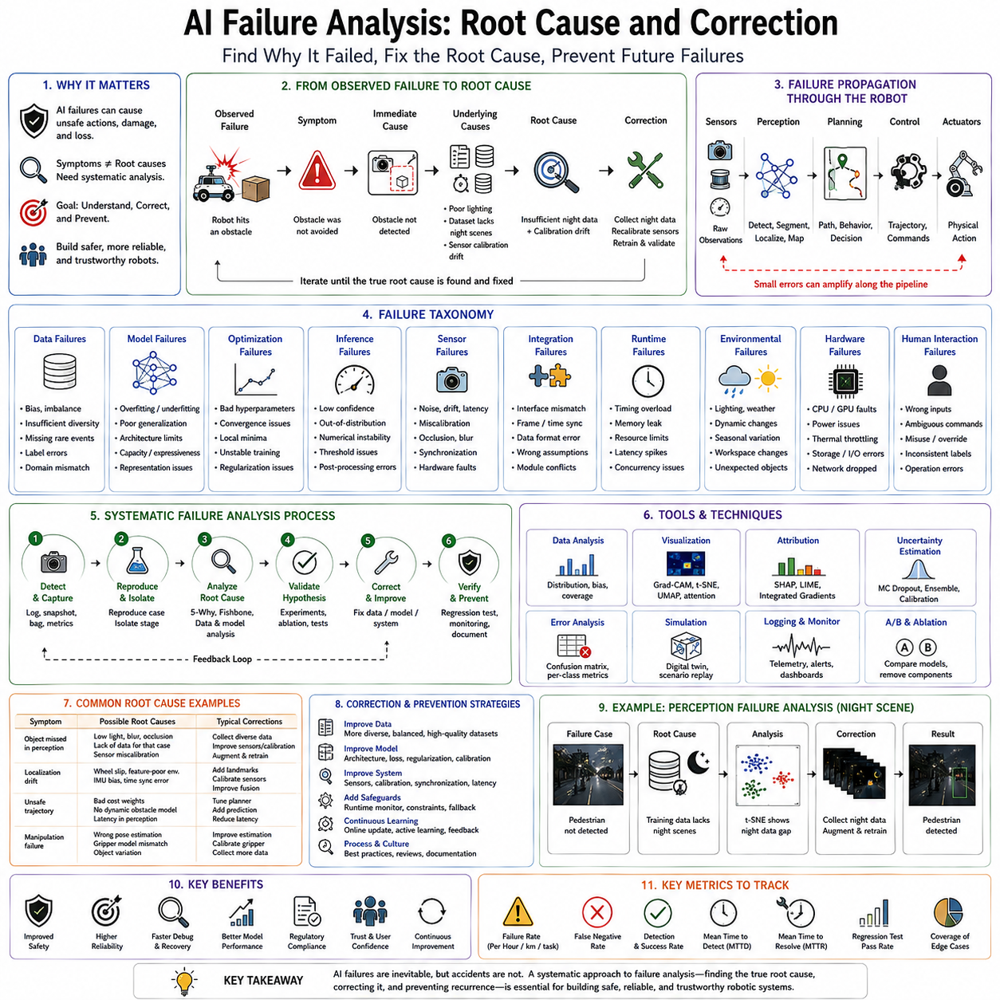{width="7.268055555555556in" height="7.268055555555556in"}

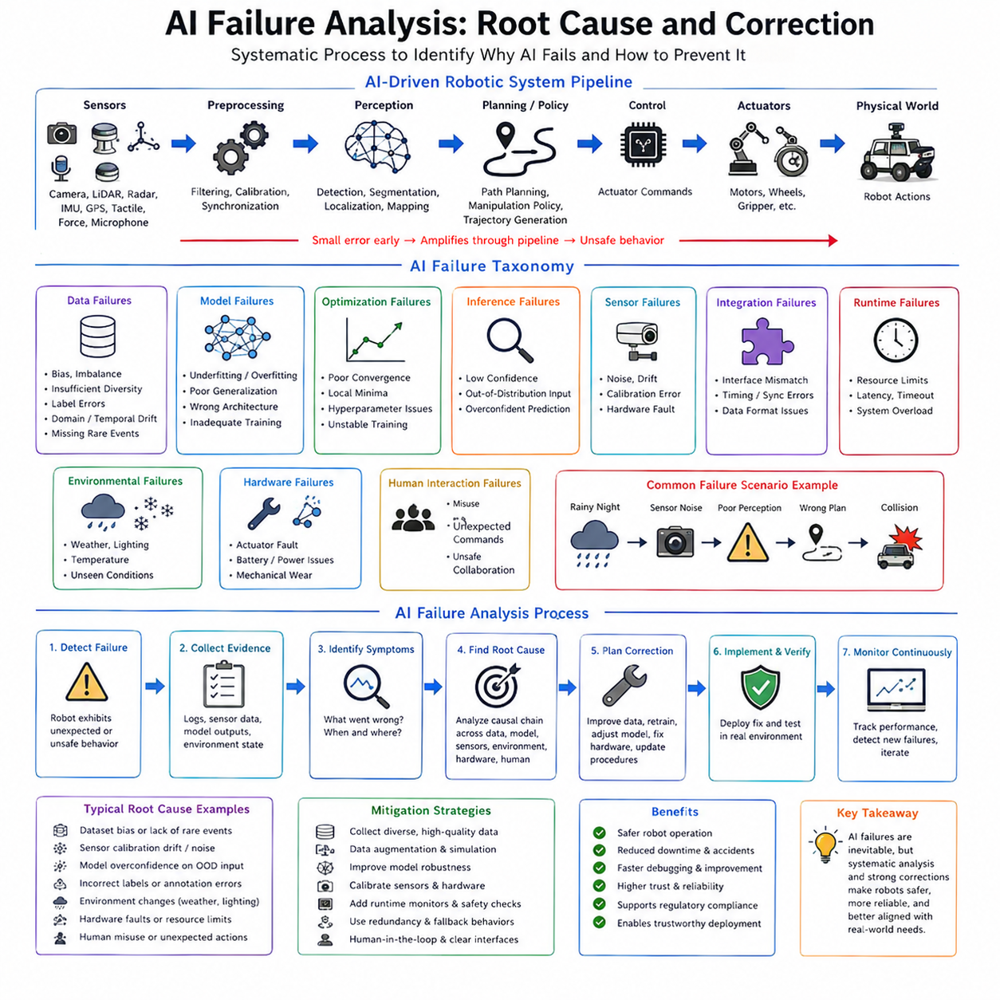{width="7.268055555555556in" height="7.268055555555556in"}

Artificial Intelligence failure analysis is the systematic engineering process of identifying, understanding, explaining, and correcting the causes of unexpected or unsafe behavior produced by AI systems. In robotics, autonomous vehicles, industrial automation, medical robotics, warehouse logistics, and intelligent manufacturing, AI failure analysis extends far beyond simply identifying incorrect predictions. It seeks to determine why a failure occurred, how it propagated through the complete robotic system, what underlying conditions enabled the failure, and how future occurrences can be prevented. Unlike conventional software debugging, where failures often originate from deterministic programming errors, AI failures emerge from complex interactions among datasets, model architectures, optimization processes, sensor systems, environmental conditions, hardware limitations, deployment pipelines, and operational uncertainty. Consequently, effective AI failure analysis requires a multidisciplinary systems engineering approach combining machine learning, robotics, software engineering, control theory, statistics, safety engineering, and human factors.

The importance of AI failure analysis grows directly with the increasing autonomy of robotic systems. Traditional industrial robots followed predefined trajectories generated by deterministic controllers. When failures occurred, engineers could often trace the problem to explicit programming mistakes, mechanical failures, sensor faults, or communication errors. Modern AI-powered robots, however, rely on deep neural networks, reinforcement learning policies, vision-language models, world models, multimodal perception, and autonomous planners whose internal behavior emerges through statistical optimization rather than explicit programming. While these models provide remarkable adaptability, they also introduce new classes of failures that cannot be understood solely through conventional debugging techniques.

One of the most important principles of AI failure analysis is distinguishing symptoms from root causes. The visible failure observed during robot operation rarely represents the true origin of the problem. A mobile robot colliding with an obstacle may appear to have failed because obstacle detection malfunctioned. Detailed investigation may instead reveal that sensor calibration drift degraded perception accuracy, that insufficient nighttime images existed within the training dataset, that preprocessing introduced unexpected artifacts, or that localization errors caused incorrect obstacle association. Effective failure analysis therefore investigates the complete causal chain rather than focusing only on the final incorrect behavior.

A failure in an AI-driven robotic system typically propagates through multiple interconnected components. Raw sensor observations are captured by cameras, LiDAR, radar, inertial measurement units, GPS receivers, tactile sensors, force sensors, or microphones. These observations undergo preprocessing before entering perception networks responsible for object detection, semantic segmentation, localization, mapping, or scene understanding. Perception outputs become inputs for planning algorithms, navigation systems, manipulation policies, trajectory generators, and control loops. Finally, actuator commands influence the physical robot. A small error introduced during early perception stages may amplify through subsequent processing until it eventually produces unsafe physical behavior. Failure analysis therefore examines the entire information pipeline rather than isolated subsystems.

Failure taxonomy provides a structured framework for categorizing AI failures. Broad classification simplifies diagnosis by grouping failures according to common mechanisms and corresponding mitigation strategies. Most AI failures fall into several major categories including data failures, model failures, optimization failures, inference failures, sensor failures, integration failures, runtime failures, environmental failures, hardware failures, and human interaction failures. Although individual incidents frequently involve multiple categories simultaneously, systematic classification accelerates root cause investigation.

Data-related failures represent one of the largest sources of AI performance degradation. Since machine learning systems derive behavior directly from training data, deficiencies within datasets naturally propagate into deployed models. Dataset bias, insufficient diversity, annotation errors, missing rare events, class imbalance, domain mismatch, temporal drift, geographical limitations, sensor inconsistencies, and corrupted samples all contribute to systematic prediction errors. Data failures often remain hidden during laboratory evaluation because benchmark datasets share similar statistical properties with training data while real deployment environments differ substantially.

Dataset coverage analysis frequently reveals previously unnoticed weaknesses. Engineers compare operational failures against training distributions to determine whether problematic situations were adequately represented during model development. If failures consistently occur during rain, nighttime operation, unusual warehouse layouts, or unfamiliar manufacturing conditions, insufficient dataset diversity rather than model architecture may represent the true underlying cause.

Label quality constitutes another common data-related issue. Human annotation errors, inconsistent labeling guidelines, ambiguous object boundaries, incorrect semantic categories, or synchronization mistakes introduce conflicting supervision during optimization. Neural networks faithfully learn these inconsistencies, producing unstable predictions difficult to correct through architectural modification alone. Careful dataset auditing therefore forms an essential component of failure analysis.

Model-related failures originate from limitations of neural network architecture, representational capacity, or learned internal representations. Models may overfit training data, underfit complex tasks, memorize spurious correlations, develop unstable feature representations, or fail to capture important environmental relationships. Such failures often require architectural redesign, additional regularization, modified optimization strategies, or entirely different learning paradigms.

Overfitting represents one of the most familiar model failures. The neural network memorizes training examples rather than learning generalizable concepts. Consequently, excellent benchmark performance coexists with poor real-world reliability. Failure analysis identifies overfitting through validation performance gaps, sensitivity to minor environmental changes, and excessive dependence upon irrelevant background features.

Underfitting produces the opposite behavior. Models lack sufficient representational capacity to capture task complexity, resulting in poor performance across both training and deployment data. Increasing model capacity, improving feature extraction, extending training duration, or modifying optimization procedures generally addresses such failures.

Shortcut learning has become one of the most actively studied failure mechanisms in modern deep learning. Rather than learning intended semantic concepts, neural networks exploit unintended statistical correlations within training datasets. A robot intended to recognize manufacturing defects may instead learn background lighting conditions associated with defective products. An autonomous vehicle may associate road signs with surrounding scenery rather than the signs themselves. Interpretability methods frequently reveal these hidden shortcuts during failure investigation.

Optimization failures arise during model training rather than deployment. Inappropriate learning rates, unstable gradient propagation, poor initialization, inadequate regularization, optimizer selection, batch normalization behavior, numerical instability, or insufficient convergence all influence final model quality. Although optimization problems may remain invisible after training, they significantly affect deployment robustness.

Loss function design also contributes to failure analysis. Training objectives sometimes optimize quantities only loosely related to operational requirements. A perception model minimizing average classification error may still perform poorly on rare but safety-critical events because common examples dominate optimization. Revising objective functions frequently improves operational behavior more effectively than architectural changes.

Inference failures occur during real-time execution despite apparently successful training. Quantization errors, numerical precision reduction, compiler optimizations, hardware-specific implementations, memory corruption, synchronization problems, runtime scheduling, or software integration issues may alter prediction behavior compared with laboratory evaluation. Deployment pipelines therefore require validation independent of training environments.

Sensor failures constitute another major category within robotic AI systems. Cameras may become dirty, scratched, or miscalibrated. LiDAR sensors experience reflection artifacts or reduced performance during heavy rain. GPS signals become unreliable indoors or near tall buildings. Inertial measurement units accumulate drift over time. Even if AI models remain mathematically correct, degraded sensor observations inevitably reduce prediction quality.

Sensor fusion analysis often assists diagnosis because independent sensing modalities provide complementary information. If camera predictions deteriorate while LiDAR remains reliable, investigators focus on optical sensing rather than downstream planning. Conversely, consistent degradation across multiple sensors may indicate environmental changes or computational problems.

Localization failures frequently propagate into seemingly unrelated perception or planning errors. Incorrect robot position estimates distort map alignment, obstacle association, semantic interpretation, and navigation decisions. Root cause analysis therefore considers localization accuracy whenever autonomous behavior becomes inconsistent despite apparently correct perception.

Environmental failures emerge because deployment conditions inevitably differ from laboratory assumptions. Illumination changes, weather, dust, fog, snow, seasonal vegetation, dynamic obstacles, unfamiliar infrastructure, electromagnetic interference, vibrations, temperature variation, or operational wear gradually shift input distributions beyond training conditions. These distribution shifts frequently explain sudden performance degradation despite unchanged software.

Out-of-distribution analysis has become an essential component of modern failure investigation. Engineers determine whether failed observations differ statistically from training data using uncertainty estimation, embedding visualization, feature-space analysis, or density estimation. Elevated OOD scores frequently indicate that failures result from environmental novelty rather than incorrect model implementation.

Adversarial conditions represent another important source of failures. Although deliberate adversarial attacks remain relatively uncommon in industrial robotics, naturally occurring sensor artifacts may resemble adversarial perturbations. Reflections, compression artifacts, repetitive textures, unusual lighting, projected patterns, or unexpected object configurations occasionally exploit hidden vulnerabilities within neural network decision boundaries.

Integration failures arise from interactions among individually correct subsystems. Perception, localization, planning, control, communication, and hardware components may each function correctly when tested independently yet produce failures when combined. Timing mismatches, inconsistent coordinate systems, synchronization delays, incompatible assumptions, interface inconsistencies, or software version conflicts commonly contribute to integration failures.

Time synchronization deserves particular attention in robotics. Cameras, LiDAR, inertial sensors, GPS receivers, wheel encoders, force sensors, and actuators operate at different frequencies. Even small timestamp errors produce inconsistent environmental representations, confusing perception algorithms and degrading downstream planning.

Coordinate transformation errors represent another common integration problem. Sensor observations expressed within different reference frames require precise geometric calibration. Small calibration errors accumulate throughout perception pipelines, eventually producing inaccurate localization, object detection, or manipulation planning.

Communication failures similarly influence AI behavior. Packet loss, delayed sensor updates, network congestion, distributed processing latency, or middleware scheduling irregularities introduce inconsistencies between perception and control. Failure analysis therefore examines communication logs alongside AI predictions.

Human factors contribute significantly to AI failures despite increasing automation. Operators may misunderstand system capabilities, provide incorrect supervisory commands, ignore uncertainty warnings, misinterpret interface displays, or intervene inappropriately during autonomous operation. Human-centered failure analysis therefore investigates interactions between operators and intelligent systems rather than considering AI independently.

Root cause analysis provides the systematic methodology for identifying fundamental failure mechanisms. Rather than stopping once immediate causes become apparent, investigators repeatedly ask why each contributing factor occurred until reaching underlying organizational, technical, procedural, or design limitations. This structured investigation prevents superficial corrections that merely address symptoms without eliminating recurring problems.

The Five Whys methodology illustrates this principle effectively. If an autonomous robot collides with an obstacle, investigators first determine why the collision occurred. The obstacle was not detected. Why was it not detected? The perception model misclassified the object. Why did misclassification occur? Similar objects were absent from training data. Why were they absent? Data collection focused exclusively on daytime operation. Why? Original deployment requirements underestimated nighttime scenarios. The resulting corrective action therefore emphasizes improved operational requirements and dataset expansion rather than merely retraining the existing model.

Fishbone diagrams, also known as Ishikawa diagrams, organize potential failure causes into structured categories including people, processes, hardware, software, environment, measurement, data, algorithms, and communication. This visualization encourages comprehensive investigation rather than prematurely focusing on obvious explanations.

Failure Mode and Effects Analysis extends root cause analysis by systematically evaluating potential failures before deployment. Every subsystem receives structured examination regarding possible failure mechanisms, operational consequences, detection strategies, severity, likelihood, and mitigation procedures. AI-specific FMEA increasingly complements traditional hardware reliability analysis within autonomous robotics.

Fault Tree Analysis examines combinations of contributing events leading to hazardous outcomes. Instead of considering failures independently, fault trees capture interactions among perception errors, localization drift, sensor degradation, communication delays, hardware faults, and environmental conditions. Such systems-level reasoning proves particularly valuable for complex autonomous robots.

Runtime logging forms the foundation of effective failure investigation. Every significant sensor observation, AI prediction, confidence estimate, uncertainty value, localization update, planning decision, control command, hardware status, communication event, and supervisory intervention should be recorded systematically. Without comprehensive operational logs, reconstructing complex AI failures becomes extremely difficult.

Replay systems enable investigators to reproduce operational failures offline using recorded sensor streams. Engineers repeatedly execute identical scenarios while modifying algorithms, visualization settings, interpretability tools, or diagnostic instrumentation. Controlled replay substantially accelerates debugging while avoiding repeated real-world testing.

Interpretability methods greatly enhance failure analysis by revealing internal neural network reasoning. Grad-CAM, SHAP, Integrated Gradients, attention visualization, saliency maps, and feature attribution expose image regions, sensor measurements, or latent representations influencing incorrect predictions. Unexpected attribution frequently reveals hidden dataset biases, shortcut learning, or spurious feature dependence.

Counterfactual analysis further supports diagnosis by identifying minimal changes required to alter incorrect predictions. Understanding what modifications would have prevented failure guides targeted improvements more effectively than simply observing erroneous outputs.

Simulation provides another indispensable diagnostic environment. Engineers reproduce failures under controlled conditions while systematically varying weather, lighting, sensor noise, object placement, communication latency, localization accuracy, and environmental complexity. Such controlled experimentation isolates contributing factors difficult to manipulate safely in physical deployments.

Corrective actions following root cause identification vary according to failure type. Data failures generally require additional data collection, improved annotation, active learning, synthetic augmentation, or continual learning. Model failures may necessitate architectural redesign, revised loss functions, uncertainty estimation, or regularization improvements. Integration failures often require synchronization, calibration, interface standardization, or middleware refinement. Runtime failures may require improved monitoring, safety supervision, redundancy, or fallback strategies.

Verification of corrective actions remains equally important. Simply implementing modifications does not guarantee problem resolution. Engineers repeat validation using original failure scenarios alongside expanded benchmark suites, stress testing, simulation, field trials, uncertainty analysis, adversarial evaluation, and regression testing to ensure corrections eliminate root causes without introducing new weaknesses.

Regression prevention represents one of the most valuable outcomes of systematic failure analysis. Every investigated failure contributes new test cases, improved datasets, refined validation procedures, updated safety requirements, enhanced monitoring rules, and organizational knowledge. Mature AI engineering organizations continuously expand their validation infrastructure based upon accumulated operational experience.

Future AI failure analysis will increasingly incorporate autonomous diagnostic agents capable of monitoring operational behavior, identifying emerging anomalies, explaining causal relationships, recommending corrective actions, and supporting continual improvement. Foundation models may assist engineers by analyzing operational logs, interpreting failure patterns, correlating subsystem interactions, and generating comprehensive diagnostic reports while remaining supervised by human experts.

As robotics advances toward embodied intelligence, multimodal reasoning, lifelong learning, and adaptive autonomy, failure analysis will likewise evolve beyond isolated neural network debugging toward complete cognitive system investigation. Perception, memory, planning, reasoning, language understanding, world modeling, manipulation, navigation, and human interaction will all become integrated components of comprehensive diagnostic frameworks.

Ultimately, AI failure analysis is not merely the process of repairing malfunctioning models but the systematic engineering discipline that transforms operational experience into continually improving intelligent systems. By distinguishing symptoms from root causes, tracing failures across complete robotic architectures, identifying underlying technical and organizational factors, implementing targeted corrective actions, and continuously validating improvements, engineers progressively increase the reliability, robustness, safety, and trustworthiness of autonomous robots. Combined with uncertainty quantification, runtime monitoring, interpretability, formal verification, dataset quality management, and comprehensive systems engineering, AI failure analysis provides one of the essential foundations enabling safe, dependable, and continuously improving Physical AI throughout industrial automation, healthcare, transportation, logistics, infrastructure inspection, agriculture, and future autonomous robotic ecosystems.

인공지능 실패 분석(AI failure analysis)은 AI 시스템이 만들어내는 예상치 못한 또는 안전하지 않은 행동의 원인을 식별하고, 이해하고, 설명하고, 수정하는 체계적인 공학적 과정이다. 로보틱스, 자율주행 차량, 산업 자동화, 의료 로보틱스, 창고 물류, 지능형 제조 분야에서, AI 실패 분석은 단순히 부정확한 예측을 식별하는 것을 훨씬 넘어 확장된다. 이는 실패가 왜 발생했는지, 그것이 전체 로봇 시스템을 통해 어떻게 전파되었는지, 어떤 근본적인 조건들이 그 실패를 가능하게 했는지, 그리고 향후의 발생을 어떻게 방지할 수 있는지를 결정하려고 시도한다. 실패가 종종 결정론적인 프로그래밍 오류로부터 비롯되는 전통적인 소프트웨어 디버깅과 달리, AI 실패는 데이터셋, 모델 아키텍처, 최적화 과정, 센서 시스템, 환경 조건, 하드웨어의 한계, 배치 파이프라인, 운영상의 불확실성 사이의 복잡한 상호작용으로부터 나타난다. 따라서 효과적인 AI 실패 분석은 머신러닝, 로보틱스, 소프트웨어 공학, 제어 이론, 통계학, 안전 공학, 인간 요인을 결합하는 다학제적인 시스템 공학 접근법을 필요로 한다.

AI 실패 분석의 중요성은 로봇 시스템의 자율성이 증가함에 따라 직접적으로 커진다. 전통적인 산업용 로봇은 결정론적 컨트롤러가 생성한 사전에 정의된 궤적을 따랐다. 실패가 발생했을 때, 엔지니어들은 종종 그 문제를 명시적인 프로그래밍 실수, 기계적 고장, 센서 결함, 또는 통신 오류로 추적할 수 있었다. 그러나 현대의 AI 기반 로봇은, 그 내부적인 행동이 명시적인 프로그래밍이 아니라 통계적 최적화를 통해 나타나는 심층 신경망, 강화학습 정책, 시각-언어 모델, 세계 모델, 멀티모달 인지, 자율 플래너에 의존한다. 이러한 모델들이 놀라운 적응력을 제공하지만, 이들은 또한 전통적인 디버깅 기법만으로는 이해될 수 없는 새로운 부류의 실패도 도입한다.

AI 실패 분석의 가장 중요한 원리 중 하나는 증상(symptom)을 근본 원인(root cause)과 구별하는 것이다. 로봇 운영 과정에서 관측되는 눈에 보이는 실패는 좀처럼 문제의 진정한 근원을 나타내지 않는다. 장애물과 충돌하는 이동 로봇은 장애물 감지가 오작동하여 실패한 것처럼 보일 수 있다. 상세한 조사는 그 대신 센서 보정의 드리프트가 인지 정확도를 저하시켰거나, 학습 데이터셋 내에 야간 이미지가 불충분했거나, 전처리가 예상치 못한 아티팩트를 도입했거나, 위치 추정 오류가 부정확한 장애물 연관을 초래했다는 것을 드러낼 수 있다. 따라서 효과적인 실패 분석은 최종적인 부정확한 행동에만 초점을 맞추는 것이 아니라 완전한 인과 사슬을 조사한다.

AI 기반 로봇 시스템에서의 실패는 일반적으로 여러 상호 연결된 구성 요소들을 통해 전파된다. 원본 센서 관측치는 카메라, LiDAR, 레이더, 관성 측정 장치, GPS 수신기, 촉각 센서, 힘 센서, 또는 마이크로폰에 의해 포착된다. 이러한 관측치들은 물체 감지, 의미론적 분할, 위치 추정, 지도 작성, 또는 장면 이해를 담당하는 인지 네트워크에 들어가기 전에 전처리를 거친다. 인지의 출력은 계획 수립 알고리즘, 내비게이션 시스템, 조작 정책, 궤적 생성기, 제어 루프를 위한 입력이 된다. 마지막으로, 액추에이터 명령은 물리적 로봇에 영향을 미친다. 초기 인지 단계에서 도입된 작은 오류는 이후의 처리를 통해 증폭되어 결국 안전하지 않은 물리적 행동을 만들어낼 수 있다. 따라서 실패 분석은 고립된 하위 시스템이 아니라 전체적인 정보 파이프라인을 검토한다.

실패 분류법(failure taxonomy)은 AI 실패들을 범주화하기 위한 구조화된 프레임워크를 제공한다. 광범위한 분류는 공통된 메커니즘과 그에 대응하는 완화 전략에 따라 실패들을 그룹화함으로써 진단을 단순화한다. 대부분의 AI 실패는 데이터 실패, 모델 실패, 최적화 실패, 추론 실패, 센서 실패, 통합 실패, 런타임 실패, 환경적 실패, 하드웨어 실패, 인간 상호작용 실패를 포함한 여러 주요 범주에 속한다. 개별 사건이 종종 여러 범주를 동시에 수반하지만, 체계적인 분류는 근본 원인 조사를 가속화한다.

데이터 관련 실패는 AI 성능 저하의 가장 큰 원천 중 하나를 나타낸다. 머신러닝 시스템이 행동을 학습 데이터로부터 직접 도출하기 때문에, 데이터셋 내의 결함은 자연스럽게 배치된 모델로 전파된다. 데이터셋 편향, 불충분한 다양성, 주석 오류, 누락된 드문 이벤트, 클래스 불균형, 도메인 불일치, 시간적 드리프트, 지리적 한계, 센서의 불일치, 손상된 샘플은 모두 체계적인 예측 오류에 기여한다. 벤치마크 데이터셋이 학습 데이터와 유사한 통계적 속성을 공유하는 반면 실제 배치 환경은 상당히 다르기 때문에, 데이터 실패는 종종 실험실 평가 과정에서는 숨겨진 채로 남아 있다.

데이터셋 커버리지 분석은 종종 이전에 발견되지 않은 약점들을 드러낸다. 엔지니어는 문제가 되는 상황들이 모델 개발 과정에서 적절하게 대표되었는지를 판단하기 위해 운영상의 실패들을 학습 분포와 비교한다. 실패가 비 오는 날, 야간 운영, 특이한 창고 배치, 또는 낯선 제조 조건 하에서 일관되게 발생한다면, 모델 아키텍처가 아니라 불충분한 데이터셋의 다양성이 진정한 근본 원인일 수 있다.

레이블 품질은 또 다른 흔한 데이터 관련 문제를 이룬다. 인간의 주석 오류, 일관되지 않은 레이블링 지침, 모호한 물체 경계, 부정확한 의미론적 범주, 또는 동기화 실수는 최적화 과정에서 상충하는 감독을 도입한다. 신경망은 이러한 불일치들을 충실하게 학습하여, 아키텍처적 수정만으로는 수정하기 어려운 불안정한 예측을 만들어낸다. 따라서 신중한 데이터셋 감사는 실패 분석의 필수적인 구성 요소를 이룬다.

모델 관련 실패는 신경망 아키텍처, 표현 용량, 또는 학습된 내부 표현의 한계로부터 비롯된다. 모델은 학습 데이터를 과적합하거나, 복잡한 태스크를 과소적합하거나, 가짜 상관관계를 암기하거나, 불안정한 특징 표현을 발전시키거나, 중요한 환경적 관계를 포착하지 못할 수 있다. 이러한 실패들은 종종 아키텍처적 재설계, 추가적인 정규화, 수정된 최적화 전략, 또는 완전히 다른 학습 패러다임을 필요로 한다.

과적합(overfitting)은 가장 친숙한 모델 실패 중 하나를 나타낸다. 신경망은 일반화 가능한 개념을 학습하는 대신 학습 예제를 암기한다. 따라서 뛰어난 벤치마크 성능이 부실한 실제 세계의 신뢰성과 공존한다. 실패 분석은 검증 성능의 격차, 사소한 환경 변화에 대한 민감도, 관련 없는 배경 특징에 대한 과도한 의존을 통해 과적합을 식별한다.

과소적합(underfitting)은 반대의 행동을 만들어낸다. 모델은 태스크의 복잡성을 포착하기에 충분한 표현 용량을 갖지 못해, 학습 데이터와 배치 데이터 모두에서 부진한 성능을 초래한다. 모델의 용량을 늘리고, 특징 추출을 향상시키며, 학습 기간을 연장하거나, 최적화 절차를 수정하는 것이 일반적으로 이러한 실패들을 해결한다.

지름길 학습(shortcut learning)은 현대의 딥러닝에서 가장 활발하게 연구되는 실패 메커니즘 중 하나가 되었다. 의도된 의미론적 개념을 학습하는 대신, 신경망은 학습 데이터셋 내의 의도하지 않은 통계적 상관관계를 악용한다. 제조 결함을 인식하도록 의도된 로봇은 대신 결함이 있는 제품과 관련된 배경 조명 조건을 학습할 수 있다. 자율주행 차량은 표지판 자체가 아니라 주변 풍경과 도로 표지판을 연관지을 수 있다. 해석 가능성 방법은 실패 조사 과정에서 이러한 숨겨진 지름길들을 자주 드러낸다.

최적화 실패는 배치가 아니라 모델 학습 과정에서 발생한다. 부적절한 학습률, 불안정한 그래디언트 전파, 부실한 초기화, 불충분한 정규화, 최적화 도구의 선택, 배치 정규화 행동, 수치적 불안정성, 또는 불충분한 수렴은 모두 최종적인 모델의 품질에 영향을 미친다. 최적화 문제는 학습 이후에는 보이지 않은 채로 남아 있을 수 있지만, 이는 배치 견고성에 상당한 영향을 미친다.

손실 함수 설계도 실패 분석에 기여한다. 학습 목표는 때때로 운영상의 요구사항과 느슨하게만 관련된 양을 최적화한다. 평균 분류 오류를 최소화하는 인지 모델은, 흔한 예제들이 최적화를 지배하기 때문에 드물지만 안전이 중요한 이벤트에 대해서는 여전히 부진한 성능을 보일 수 있다. 목표 함수를 수정하는 것은 종종 아키텍처적 변경보다 운영상의 행동을 더 효과적으로 향상시킨다.

추론 실패는 겉으로는 성공적인 학습에도 불구하고 실시간 실행 과정에서 발생한다. 양자화 오류, 수치적 정밀도 감소, 컴파일러 최적화, 하드웨어별 구현, 메모리 손상, 동기화 문제, 런타임 스케줄링, 또는 소프트웨어 통합 문제는 실험실 평가와 비교했을 때 예측 행동을 바꿀 수 있다. 따라서 배치 파이프라인은 학습 환경과는 독립적인 검증을 필요로 한다.

센서 실패는 로봇 AI 시스템 내의 또 다른 주요한 범주를 이룬다. 카메라는 더러워지거나, 긁히거나, 잘못 보정될 수 있다. LiDAR 센서는 반사 아티팩트를 경험하거나 강한 비 속에서 성능이 저하된다. GPS 신호는 실내나 고층 건물 근처에서 신뢰할 수 없게 된다. 관성 측정 장치는 시간이 지남에 따라 드리프트를 축적한다. AI 모델이 수학적으로 정확한 상태로 남아 있더라도, 저하된 센서 관측치는 필연적으로 예측의 품질을 떨어뜨린다.

센서 융합 분석은, 독립적인 감지 양식들이 상호 보완적인 정보를 제공하기 때문에 진단에 자주 도움이 된다. 카메라의 예측이 저하되는 동안 LiDAR가 신뢰할 수 있는 상태로 남아 있다면, 조사자들은 이후의 계획 수립이 아니라 광학 감지에 초점을 맞춘다. 반대로, 여러 센서들에 걸친 일관된 저하는 환경 변화나 계산 문제를 나타낼 수 있다.

위치 추정 실패는 종종 겉으로는 관련이 없어 보이는 인지나 계획 수립 오류로 전파된다. 부정확한 로봇 위치 추정치는 지도 정렬, 장애물 연관, 의미론적 해석, 내비게이션 결정을 왜곡시킨다. 따라서 근본 원인 분석은 겉으로는 정확한 인지에도 불구하고 자율적인 행동이 일관되지 않게 될 때마다 위치 추정의 정확도를 고려한다.

환경적 실패는, 배치 조건이 필연적으로 실험실의 가정과 다르기 때문에 나타난다. 조명 변화, 날씨, 먼지, 안개, 눈, 계절적 식생, 동적인 장애물, 낯선 인프라, 전자기 간섭, 진동, 온도 변동, 또는 운영상의 마모는 입력 분포를 학습 조건을 넘어 점진적으로 이동시킨다. 이러한 분포 변화는 소프트웨어가 변하지 않았음에도 불구하고 종종 갑작스러운 성능 저하를 설명한다.

분포 외 분석은 현대의 실패 조사에 있어 필수적인 구성 요소가 되었다. 엔지니어는 불확실성 추정, 임베딩 시각화, 특징 공간 분석, 또는 밀도 추정을 사용해 실패한 관측치가 학습 데이터와 통계적으로 다른지를 판단한다. 높아진 OOD 점수는 종종 실패가 부정확한 모델 구현이 아니라 환경적 새로움으로부터 비롯된다는 것을 나타낸다.

적대적 조건은 또 다른 중요한 실패 원천을 나타낸다. 의도적인 적대적 공격은 산업용 로보틱스에서는 비교적 드물게 남아 있지만, 자연적으로 발생하는 센서 아티팩트는 적대적 섭동과 유사할 수 있다. 반사, 압축 아티팩트, 반복적인 텍스처, 특이한 조명, 투사된 패턴, 또는 예상치 못한 물체 구성은 때때로 신경망 결정 경계 내의 숨겨진 취약성을 악용한다.

통합 실패는 개별적으로는 올바른 하위 시스템들 사이의 상호작용으로부터 발생한다. 인지, 위치 추정, 계획 수립, 제어, 통신, 하드웨어 구성 요소는 각각 독립적으로 테스트되었을 때는 올바르게 기능할 수 있지만 결합되었을 때는 실패를 만들어낼 수 있다. 타이밍 불일치, 일관되지 않은 좌표 시스템, 동기화 지연, 호환되지 않는 가정, 인터페이스의 불일치, 또는 소프트웨어 버전 충돌은 일반적으로 통합 실패에 기여한다.

시간 동기화는 로보틱스에서 특별한 주목을 받을 가치가 있다. 카메라, LiDAR, 관성 센서, GPS 수신기, 바퀴 엔코더, 힘 센서, 액추에이터는 서로 다른 주파수로 작동한다. 작은 타임스탬프 오류조차도 일관되지 않은 환경적 표현을 만들어내, 인지 알고리즘을 혼란스럽게 만들고 이후의 계획 수립을 저하시킨다.

좌표 변환 오류는 또 다른 흔한 통합 문제를 나타낸다. 서로 다른 참조 프레임 내에서 표현된 센서 관측치는 정밀한 기하학적 보정을 필요로 한다. 작은 보정 오류는 인지 파이프라인 전반에 걸쳐 누적되어, 결국 부정확한 위치 추정, 물체 감지, 또는 조작 계획 수립을 만들어낸다.

통신 실패도 마찬가지로 AI의 행동에 영향을 미친다. 패킷 손실, 지연된 센서 업데이트, 네트워크 혼잡, 분산 처리 지연, 또는 미들웨어 스케줄링의 불규칙성은 인지와 제어 사이의 불일치를 도입한다. 따라서 실패 분석은 AI 예측과 함께 통신 로그도 검토한다.

인간 요인은, 자동화가 증가함에도 불구하고 AI 실패에 상당히 기여한다. 조작자는 시스템의 능력을 오해하거나, 잘못된 감독 명령을 내리거나, 불확실성 경고를 무시하거나, 인터페이스 디스플레이를 잘못 해석하거나, 자율 운영 과정에서 부적절하게 개입할 수 있다. 따라서 인간 중심의 실패 분석은 AI를 독립적으로 고려하는 대신 조작자와 지능형 시스템 사이의 상호작용을 조사한다.

근본 원인 분석(root cause analysis)은 근본적인 실패 메커니즘을 식별하기 위한 체계적인 방법론을 제공한다. 즉각적인 원인이 명백해지면 멈추는 대신, 조사자들은 근본적인 조직적, 기술적, 절차적, 또는 설계상의 한계에 도달할 때까지 각각의 기여 요인이 왜 발생했는지를 반복적으로 묻는다. 이러한 구조화된 조사는 반복되는 문제들을 제거하지 않고 단순히 증상만을 다루는 피상적인 수정을 방지한다.

5가지 왜(Five Whys) 방법론은 이 원리를 효과적으로 보여준다. 자율 로봇이 장애물과 충돌하면, 조사자들은 먼저 왜 충돌이 발생했는지를 판단한다. 장애물이 감지되지 않았다. 왜 감지되지 않았는가? 인지 모델이 물체를 잘못 분류했다. 왜 잘못 분류가 일어났는가? 유사한 물체들이 학습 데이터에 없었다. 왜 없었는가? 데이터 수집이 오직 주간 운영에만 초점을 맞췄다. 왜? 원래의 배치 요구사항이 야간 시나리오를 과소평가했다. 따라서 그 결과로 만들어진 시정 조치는 단순히 기존 모델을 재학습시키는 것이 아니라 향상된 운영 요구사항과 데이터셋 확장을 강조한다.

이시카와 다이어그램(Ishikawa diagram)이라고도 알려진 피시본 다이어그램(fishbone diagram)은 잠재적인 실패 원인들을 사람, 프로세스, 하드웨어, 소프트웨어, 환경, 측정, 데이터, 알고리즘, 통신을 포함한 구조화된 범주로 조직한다. 이 시각화는 명백한 설명에 성급하게 집중하는 대신 포괄적인 조사를 장려한다.

고장 형태 및 영향 분석(Failure Mode and Effects Analysis)은 배치 이전에 잠재적인 실패들을 체계적으로 평가함으로써 근본 원인 분석을 확장한다. 모든 하위 시스템은 가능한 실패 메커니즘, 운영상의 결과, 감지 전략, 심각성, 가능성, 완화 절차에 관한 구조화된 검토를 받는다. AI 특유의 FMEA는 자율 로보틱스 내의 전통적인 하드웨어 신뢰성 분석을 점점 더 많이 보완하고 있다.

결함 트리 분석(Fault Tree Analysis)은 위험한 결과로 이어지는 기여 사건들의 조합을 조사한다. 실패들을 독립적으로 고려하는 대신, 결함 트리는 인지 오류, 위치 추정 드리프트, 센서 저하, 통신 지연, 하드웨어 결함, 환경 조건 사이의 상호작용을 포착한다. 이러한 시스템 수준의 추론은 복잡한 자율 로봇에게 특히 유용한 것으로 입증된다.

런타임 로깅은 효과적인 실패 조사의 기반을 형성한다. 모든 중요한 센서 관측치, AI 예측, 신뢰도 추정치, 불확실성 값, 위치 추정 갱신, 계획 수립 결정, 제어 명령, 하드웨어 상태, 통신 이벤트, 감독 개입은 체계적으로 기록되어야 한다. 포괄적인 운영 로그가 없다면, 복잡한 AI 실패를 재구성하는 것은 극도로 어려워진다.

리플레이 시스템은 조사자들이 기록된 센서 스트림을 사용해 운영상의 실패를 오프라인에서 재현할 수 있게 한다. 엔지니어들은 알고리즘, 시각화 설정, 해석 가능성 도구, 또는 진단 계측을 수정하면서 동일한 시나리오를 반복적으로 실행한다. 통제된 리플레이는 반복적인 실제 세계의 테스트를 피하면서도 디버깅을 상당히 가속화한다.

해석 가능성 방법은 내부적인 신경망 추론을 드러냄으로써 실패 분석을 크게 향상시킨다. Grad-CAM, SHAP, Integrated Gradients, 어텐션 시각화, 중요도 맵, 특징 귀속은 부정확한 예측에 영향을 미치는 이미지 영역, 센서 측정치, 또는 잠재 표현을 드러낸다. 예상치 못한 귀속은 종종 숨겨진 데이터셋 편향, 지름길 학습, 또는 가짜 특징 의존성을 드러낸다.

반사실적 분석(counterfactual analysis)은 부정확한 예측을 바꾸는 데 필요한 최소한의 변화를 식별함으로써 진단을 더욱 지원한다. 어떤 수정이 실패를 방지했을지를 이해하는 것은 단순히 잘못된 출력을 관찰하는 것보다 목표가 있는 개선을 더 효과적으로 안내한다.

시뮬레이션은 또 다른 필수불가결한 진단 환경을 제공한다. 엔지니어들은 날씨, 조명, 센서 노이즈, 물체 배치, 통신 지연, 위치 추정 정확도, 환경적 복잡성을 체계적으로 변화시키면서 통제된 조건 하에서 실패를 재현한다. 이러한 통제된 실험은 물리적 배치에서 안전하게 조작하기 어려운 기여 요인들을 고립시킨다.

근본 원인이 식별된 이후의 시정 조치는 실패의 유형에 따라 다양하다. 데이터 실패는 일반적으로 추가적인 데이터 수집, 향상된 주석, 능동 학습, 합성 증강, 또는 지속 학습을 필요로 한다. 모델 실패는 아키텍처적 재설계, 수정된 손실 함수, 불확실성 추정, 또는 정규화 개선을 필요로 할 수 있다. 통합 실패는 종종 동기화, 보정, 인터페이스 표준화, 또는 미들웨어 정제를 필요로 한다. 런타임 실패는 향상된 모니터링, 안전 감독, 중복성, 또는 대체 전략을 필요로 할 수 있다.

시정 조치의 검증도 마찬가지로 중요하다. 단순히 수정 사항을 구현하는 것만으로는 문제의 해결을 보장하지 못한다. 엔지니어들은 시정 사항이 새로운 약점을 도입하지 않고도 근본 원인을 제거한다는 것을 보장하기 위해, 확장된 벤치마크 스위트, 스트레스 테스트, 시뮬레이션, 현장 시험, 불확실성 분석, 적대적 평가, 회귀 테스트와 함께 원래의 실패 시나리오를 사용해 검증을 반복한다.

회귀 방지(regression prevention)는 체계적인 실패 분석의 가장 유용한 결과 중 하나를 나타낸다. 조사된 모든 실패는 새로운 테스트 사례, 향상된 데이터셋, 정제된 검증 절차, 갱신된 안전 요구사항, 강화된 모니터링 규칙, 조직적 지식에 기여한다. 성숙한 AI 공학 조직은 축적된 운영 경험에 기반하여 자신들의 검증 인프라를 지속적으로 확장한다.

미래의 AI 실패 분석은 운영상의 행동을 모니터링하고, 새롭게 나타나는 이상을 식별하며, 인과 관계를 설명하고, 시정 조치를 권장하며, 지속적인 개선을 지원할 수 있는 자율 진단 에이전트를 점점 더 많이 통합할 것이다. 파운데이션 모델은 인간 전문가의 감독을 계속 받으면서도, 운영 로그를 분석하고, 실패 패턴을 해석하며, 하위 시스템의 상호작용을 연관짓고, 포괄적인 진단 보고서를 생성함으로써 엔지니어들을 도울 수 있다.

로보틱스가 체화 지능, 멀티모달 추론, 평생 학습, 적응형 자율성을 향해 발전함에 따라, 실패 분석도 마찬가지로 고립된 신경망 디버깅을 넘어 완전한 인지 시스템 조사로 진화할 것이다. 인지, 기억, 계획 수립, 추론, 언어 이해, 세계 모델링, 조작, 내비게이션, 인간과의 상호작용은 모두 포괄적인 진단 프레임워크의 통합된 구성 요소가 될 것이다.

궁극적으로, AI 실패 분석은 단순히 오작동하는 모델을 수리하는 과정이 아니라, 운영 경험을 지속적으로 향상되는 지능형 시스템으로 전환시키는 체계적인 공학 분야이다. 증상을 근본 원인과 구별하고, 완전한 로봇 아키텍처 전반에 걸쳐 실패를 추적하며, 근본적인 기술적, 조직적 요인들을 식별하고, 목표가 있는 시정 조치를 구현하며, 개선 사항들을 지속적으로 검증함으로써, 엔지니어들은 자율 로봇의 신뢰성, 견고성, 안전성, 신뢰성을 점진적으로 향상시킨다. 불확실성 정량화, 런타임 모니터링, 해석 가능성, 형식적 검증, 데이터셋 품질 관리, 포괄적인 시스템 공학과 결합되어, AI 실패 분석은 산업 자동화, 헬스케어, 교통, 물류, 인프라 점검, 농업, 그리고 미래의 자율 로봇 생태계 전반에 걸쳐 안전하고, 신뢰할 수 있으며, 지속적으로 개선되는 Physical AI를 가능하게 하는 필수적인 기반 중 하나를 제공한다.

##  

## 11.10 AI Safety Standards ISO IEC 42001 EU AI Act

{width="7.268055555555556in" height="7.268055555555556in"}

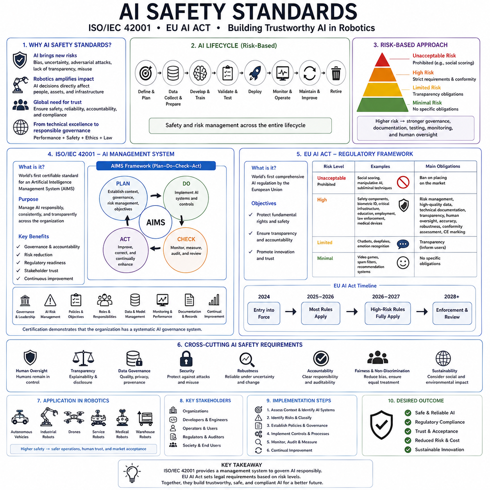{width="7.268055555555556in" height="7.268055555555556in"}

Artificial intelligence safety standards have become one of the most important foundations for the responsible development, deployment, operation, and governance of AI systems in robotics and other safety-critical industries. As AI evolves from research laboratories into autonomous vehicles, collaborative robots, medical devices, industrial automation, financial systems, critical infrastructure, public services, and defense applications, society increasingly requires not only high-performance algorithms but also systematic methods for ensuring safety, reliability, transparency, accountability, cybersecurity, and legal compliance. Technical excellence alone is no longer sufficient. Modern AI systems must also satisfy organizational, regulatory, ethical, and operational requirements that demonstrate responsible development throughout their entire lifecycle. International standards such as ISO/IEC 42001, the European Union AI Act, and numerous complementary standards provide structured frameworks that transform AI safety from an individual engineering effort into a comprehensive organizational management system.

The motivation for AI safety standards originates from the unique characteristics of artificial intelligence compared with conventional software. Traditional software systems generally execute explicitly programmed logic whose behavior can often be analyzed through deterministic verification and testing. Artificial intelligence systems, particularly those based on machine learning, derive behavior from statistical learning rather than direct programming. Their decisions depend upon training data, optimization procedures, neural network architectures, deployment environments, runtime inputs, and continual adaptation. Consequently, AI systems introduce new categories of risk that extend beyond traditional software engineering, including dataset bias, distribution shift, model uncertainty, adversarial vulnerability, explainability limitations, autonomous decision making, and evolving operational behavior.

Robotics amplifies these concerns because intelligent algorithms directly control physical machines interacting with people and infrastructure. A recommendation engine producing an incorrect suggestion may inconvenience users, whereas an autonomous vehicle making an incorrect decision may cause collisions. A collaborative robot misunderstanding human intention may create workplace hazards. A medical robot making an incorrect diagnosis or manipulation decision may directly affect patient safety. Therefore, AI governance for robotics must integrate machine learning quality, functional safety, systems engineering, cybersecurity, regulatory compliance, and organizational management into a unified framework.

One of the central principles underlying modern AI standards is lifecycle thinking. Artificial intelligence safety cannot be achieved by evaluating only the final deployed model. Instead, safety must be considered throughout every stage of development, including problem definition, requirements engineering, data collection, annotation, preprocessing, model development, validation, deployment, monitoring, maintenance, continual improvement, and eventual retirement. Risks introduced during early stages frequently remain hidden until deployment, making proactive lifecycle management essential.

Another foundational principle is risk-based governance. Not every AI application requires identical levels of control. A movie recommendation system presents substantially lower risk than an autonomous surgical robot or railway control system. Modern AI standards therefore classify applications according to potential consequences of failure and apply governance requirements proportionally. High-risk systems receive more extensive documentation, testing, monitoring, traceability, human oversight, and regulatory review than low-risk applications.

The concept of AI governance extends beyond technical implementation. Governance refers to the organizational structures, policies, responsibilities, decision-making processes, accountability mechanisms, documentation practices, and continuous oversight required to ensure responsible AI operation. While engineers develop algorithms, governance ensures that development follows repeatable, auditable, and accountable organizational processes aligned with business objectives, regulatory requirements, and societal expectations.

ISO/IEC 42001 represents one of the most significant milestones in international AI governance. Published jointly by the International Organization for Standardization and the International Electrotechnical Commission, ISO/IEC 42001 establishes the world\'s first certifiable Artificial Intelligence Management System standard. Rather than specifying individual AI algorithms or technical implementations, it defines how organizations should systematically manage AI throughout its lifecycle.

The philosophy of ISO/IEC 42001 resembles other ISO management standards such as ISO 9001 for quality management and ISO/IEC 27001 for information security management. Instead of prescribing detailed engineering solutions, it establishes organizational processes ensuring consistent planning, implementation, monitoring, evaluation, and continual improvement. Consequently, certification demonstrates that an organization possesses systematic AI governance rather than guaranteeing correctness of any individual AI model.

The Artificial Intelligence Management System, often abbreviated as AIMS, serves as the central organizational framework defined by ISO/IEC 42001. An AIMS provides structured procedures governing how AI systems are planned, developed, validated, deployed, monitored, documented, maintained, and improved. It emphasizes organizational responsibility rather than isolated technical excellence.

Leadership commitment represents one of the foundational requirements of ISO/IEC 42001. Executive management must actively support AI governance rather than delegating responsibility exclusively to technical teams. Leadership establishes organizational objectives, allocates resources, defines accountability, approves governance policies, and ensures continual oversight throughout the AI lifecycle.

Organizational context forms another important requirement. Before developing AI systems, organizations should understand internal objectives, external stakeholders, regulatory environments, operational domains, technological constraints, business priorities, ethical considerations, and societal expectations. AI development should therefore align with organizational strategy rather than occurring independently within isolated engineering teams.

Risk management occupies a central role within ISO/IEC 42001. Organizations systematically identify, evaluate, prioritize, mitigate, monitor, and review risks associated with AI systems. Risks include technical failures, cybersecurity vulnerabilities, privacy concerns, bias, discrimination, safety hazards, operational disruptions, regulatory noncompliance, reputational damage, and unintended societal consequences. Continuous risk assessment accompanies every stage of AI development rather than occurring only before deployment.

Documentation requirements significantly enhance organizational traceability. AI models should be accompanied by comprehensive records describing datasets, model architectures, optimization procedures, validation methods, deployment environments, assumptions, limitations, known risks, operational constraints, monitoring procedures, and maintenance plans. Such documentation supports auditing, debugging, regulatory review, incident investigation, and long-term system maintenance.

Data governance receives substantial attention within ISO/IEC 42001 because data quality fundamentally determines AI behavior. Organizations establish policies governing data collection, labeling, validation, privacy protection, storage, version control, access management, retention, and continual improvement. Data lineage should remain traceable throughout development so that every model can be associated with its underlying datasets.

Human oversight represents another essential organizational principle. Autonomous AI systems should not necessarily operate without meaningful human supervision, particularly in high-risk applications. Organizations define responsibilities regarding approval, intervention, monitoring, override authority, incident response, and operational decision making. Human oversight becomes increasingly important as system autonomy increases.

Operational monitoring continues throughout deployment. Organizations collect performance metrics, detect anomalies, monitor drift, evaluate safety, assess cybersecurity, review incidents, and initiate corrective actions whenever operational behavior deviates from expected performance. AI governance therefore extends beyond deployment into continuous operational management.

Continual improvement constitutes another core management principle inherited from broader ISO standards. Organizations periodically review governance effectiveness, update risk assessments, improve operational procedures, revise documentation, retrain models, expand datasets, strengthen monitoring, and incorporate lessons learned from operational experience.

Although ISO/IEC 42001 defines organizational governance, it intentionally avoids prescribing specific machine learning algorithms. Organizations remain free to employ supervised learning, reinforcement learning, foundation models, symbolic reasoning, hybrid AI, or future technologies provided governance principles remain satisfied.

For robotics companies, ISO/IEC 42001 integrates naturally with existing quality management systems. Manufacturers already certified under ISO 9001, ISO 14001, ISO/IEC 27001, or ISO 45001 can extend established management processes toward AI governance while maintaining organizational consistency across engineering disciplines.

Another major regulatory development is the European Union Artificial Intelligence Act, commonly known as the EU AI Act. Unlike ISO standards, which are voluntary management frameworks, the EU AI Act establishes legally binding regulatory requirements governing AI systems placed on or used within the European Union market. It represents the world\'s first comprehensive legal framework regulating artificial intelligence according to risk.

The EU AI Act adopts a risk-based regulatory philosophy. AI applications are classified into several categories according to potential societal impact and operational risk. Regulatory obligations increase with risk level, allowing innovation to continue while ensuring stronger protection for high-risk applications.

The first category includes unacceptable-risk AI systems. These applications are considered fundamentally incompatible with European values because they pose excessive risks to safety, fundamental rights, or democratic institutions. Such systems are generally prohibited from deployment within the European Union.

Limited-risk AI systems receive relatively modest transparency requirements. Examples include conversational agents or systems interacting directly with users. Organizations must ensure that individuals understand when they are interacting with artificial intelligence rather than humans.

Most significant for robotics are high-risk AI systems. These include AI integrated into products already regulated under European safety legislation, such as medical devices, machinery, vehicles, railway systems, aviation equipment, and critical infrastructure. Autonomous robots deployed within these domains frequently fall into the high-risk category because incorrect decisions may directly affect human safety.

High-risk AI systems must satisfy extensive regulatory requirements before deployment. Risk management systems must be implemented throughout the AI lifecycle. Data quality must be carefully controlled. Technical documentation must be comprehensive. Operational logs must support traceability. Transparency measures must assist users in understanding system behavior. Human oversight mechanisms must remain available. Accuracy, robustness, cybersecurity, and reliability must satisfy defined operational expectations.

Technical documentation plays an especially important role under the EU AI Act. Developers must demonstrate how systems operate, which assumptions were made during development, how risks were identified and mitigated, how datasets were collected, what limitations remain, and how ongoing monitoring will occur. Documentation therefore becomes both a technical engineering artifact and a regulatory compliance requirement.

Data governance requirements emphasize relevance, representativeness, completeness, and quality. Training, validation, and testing datasets should adequately reflect intended deployment conditions while minimizing systematic bias. Dataset management therefore becomes both a technical requirement and a legal compliance obligation.

Human oversight receives explicit regulatory attention. High-risk AI systems should support meaningful human intervention whenever necessary. Operators should understand system capabilities, recognize operational limitations, monitor autonomous behavior, and retain authority to override unsafe decisions. Human oversight therefore becomes an integral component of regulatory compliance rather than an optional engineering feature.

Robustness and cybersecurity requirements address operational resilience. AI systems should maintain reliable performance despite environmental variation, hardware faults, communication failures, adversarial attacks, sensor degradation, and evolving operational conditions. Protective mechanisms include runtime monitoring, uncertainty estimation, redundancy, anomaly detection, fallback strategies, and cybersecurity safeguards.

Post-market monitoring extends regulatory responsibility beyond deployment. Organizations continue collecting operational data, reporting serious incidents, monitoring performance degradation, implementing corrective actions, and maintaining regulatory compliance throughout system operation. AI therefore remains subject to continuous oversight rather than one-time certification.

Incident reporting represents another major regulatory requirement. Significant failures affecting safety or fundamental rights must be documented and communicated to appropriate authorities according to established reporting procedures. Organizations therefore require operational monitoring infrastructures capable of detecting, recording, analyzing, and responding to AI-related incidents.

Although ISO/IEC 42001 and the EU AI Act differ substantially in legal status, they complement one another effectively. ISO/IEC 42001 provides organizational management structures supporting systematic AI governance, while the EU AI Act establishes legal obligations governing specific high-risk applications. Organizations implementing robust management systems often find regulatory compliance substantially easier because governance processes already exist.

Robotics companies typically integrate these AI-specific standards with numerous existing engineering standards. Functional safety remains governed by standards such as IEC 61508 for programmable electronic safety systems. Industrial robotics commonly follows ISO 10218, while collaborative robots employ ISO/TS 15066. Automotive systems implement ISO 26262, and intended functionality receives additional guidance through ISO 21448, commonly known as Safety of the Intended Functionality. Medical robotics integrates standards governing medical devices, software lifecycle management, and risk management. AI governance therefore complements rather than replaces traditional safety engineering.

Cybersecurity standards similarly interact closely with AI governance. Connected robots increasingly exchange sensor data, software updates, cloud services, fleet management information, and operational telemetry. Cybersecurity frameworks such as ISO/IEC 27001, IEC 62443 for industrial automation, and automotive cybersecurity standards support protection against malicious attacks capable of compromising AI behavior.

Quality management remains another essential foundation. AI systems ultimately become components within broader engineering organizations responsible for design control, supplier management, configuration management, verification, validation, maintenance, and continual improvement. Existing quality management systems therefore provide valuable organizational infrastructure supporting AI governance.

Model lifecycle management becomes increasingly important under these regulatory frameworks. Organizations maintain complete traceability connecting datasets, preprocessing procedures, model versions, training configurations, validation results, deployment environments, monitoring records, operational incidents, corrective actions, and software updates. Such traceability enables rapid investigation whenever unexpected behavior emerges during deployment.

Explainability and transparency also receive increasing regulatory attention. While not every AI system requires complete interpretability, organizations should understand sufficient aspects of model behavior to support debugging, auditing, user trust, and safety assessment. Techniques including Grad-CAM, SHAP, Integrated Gradients, uncertainty estimation, confidence reporting, and operational logging therefore support broader governance objectives.

Foundation models introduce new governance challenges because they serve multiple downstream applications with capabilities extending beyond their original training objectives. Regulatory frameworks increasingly distinguish between general-purpose AI models and application-specific deployments, recognizing that responsibility may be shared among foundation model developers, system integrators, and final product manufacturers.

Future AI governance will likely continue evolving toward internationally harmonized standards integrating technical robustness, organizational management, cybersecurity, privacy, sustainability, explainability, and ethical considerations within unified engineering frameworks. As autonomous robots become increasingly capable through multimodal reasoning, lifelong learning, world models, and embodied intelligence, governance systems must likewise evolve to supervise increasingly adaptive autonomous behavior.

Ultimately, AI safety standards establish that trustworthy artificial intelligence depends not only upon advanced algorithms but also upon disciplined organizational processes governing the entire AI lifecycle. ISO/IEC 42001 provides a comprehensive management framework ensuring systematic AI governance, while the European Union AI Act establishes legally enforceable requirements proportional to application risk. Together with complementary standards for functional safety, quality management, cybersecurity, medical devices, industrial automation, and autonomous systems, these frameworks transform AI safety from isolated technical optimization into comprehensive organizational responsibility. For robotics, where artificial intelligence directly controls physical machines operating alongside humans, such governance provides the essential foundation for building autonomous systems that are not only intelligent but also safe, reliable, transparent, accountable, legally compliant, and worthy of long-term public trust.

인공지능 안전 표준(AI safety standard)은 로보틱스와 그 밖의 안전이 중요한 산업 분야에서 AI 시스템의 책임 있는 개발, 배치, 운영, 거버넌스를 위한 가장 중요한 기반 중 하나가 되었다. AI가 연구 실험실에서 자율주행 차량, 협동 로봇, 의료 기기, 산업 자동화, 금융 시스템, 핵심 인프라, 공공 서비스, 국방 응용 분야로 발전함에 따라, 사회는 고성능 알고리즘뿐만 아니라 안전성, 신뢰성, 투명성, 책임성, 사이버 보안, 법적 준수를 보장하는 체계적인 방법도 점점 더 많이 요구하고 있다. 기술적 우수성만으로는 더 이상 충분하지 않다. 현대의 AI 시스템은 전체 생애 주기에 걸쳐 책임 있는 개발을 입증하는 조직적, 규제적, 윤리적, 운영상의 요구사항도 만족해야 한다. ISO/IEC 42001, 유럽연합 AI 법(EU AI Act), 그리고 수많은 보완적인 표준들과 같은 국제 표준들은 AI 안전성을 개별적인 공학적 노력에서 포괄적인 조직적 관리 시스템으로 전환시키는 구조화된 프레임워크를 제공한다.

AI 안전 표준의 동기는 전통적인 소프트웨어와 비교했을 때 인공지능의 고유한 특성에서 비롯된다. 전통적인 소프트웨어 시스템은 일반적으로 명시적으로 프로그래밍된 논리를 실행하며, 그 행동은 종종 결정론적인 검증과 테스트를 통해 분석될 수 있다. 특히 머신러닝에 기반한 인공지능 시스템은 직접적인 프로그래밍이 아니라 통계적 학습으로부터 행동을 도출한다. 이들의 결정은 학습 데이터, 최적화 절차, 신경망 아키텍처, 배치 환경, 런타임 입력, 지속적인 적응에 의존한다. 따라서 AI 시스템은 데이터셋 편향, 분포 변화, 모델의 불확실성, 적대적 취약성, 설명 가능성의 한계, 자율적인 의사결정, 진화하는 운영상의 행동을 포함한, 전통적인 소프트웨어 공학을 넘어 확장되는 새로운 범주의 위험을 도입한다.

로보틱스는, 지능형 알고리즘이 사람 및 인프라와 상호작용하는 물리적 기계를 직접 제어하기 때문에 이러한 우려들을 증폭시킨다. 부정확한 제안을 만들어내는 추천 엔진은 사용자에게 불편을 줄 수 있는 반면, 부정확한 결정을 내리는 자율주행 차량은 충돌을 초래할 수 있다. 인간의 의도를 오해하는 협동 로봇은 작업장의 위험을 만들어낼 수 있다. 부정확한 진단이나 조작 결정을 내리는 의료용 로봇은 환자의 안전에 직접적으로 영향을 미칠 수 있다. 따라서 로보틱스를 위한 AI 거버넌스는 머신러닝의 품질, 기능 안전성, 시스템 공학, 사이버 보안, 규제 준수, 조직 관리를 하나의 통합된 프레임워크로 통합해야 한다.

현대 AI 표준의 근저에 있는 핵심적인 원리 중 하나는 생애 주기적 사고(lifecycle thinking)이다. 인공지능의 안전성은 오직 최종적으로 배치된 모델만을 평가하는 것으로는 달성될 수 없다. 대신, 안전성은 문제 정의, 요구사항 공학, 데이터 수집, 주석, 전처리, 모델 개발, 검증, 배치, 모니터링, 유지보수, 지속적인 개선, 최종적인 폐기를 포함한 개발의 모든 단계에 걸쳐 고려되어야 한다. 초기 단계에서 도입된 위험은 종종 배치 이전까지 숨겨진 채로 남아 있어, 능동적인 생애 주기 관리를 필수적으로 만든다.

또 다른 근본적인 원리는 위험 기반 거버넌스(risk-based governance)이다. 모든 AI 응용 분야가 동일한 수준의 통제를 필요로 하는 것은 아니다. 영화 추천 시스템은 자율 수술 로봇이나 철도 제어 시스템보다 상당히 낮은 위험을 제시한다. 따라서 현대의 AI 표준들은 실패의 잠재적 결과에 따라 응용 분야를 분류하고 거버넌스 요구사항을 비례적으로 적용한다. 고위험 시스템은 저위험 응용 분야보다 더 광범위한 문서화, 테스트, 모니터링, 추적 가능성, 인간의 감독, 규제 검토를 받는다.

AI 거버넌스라는 개념은 기술적 구현을 넘어 확장된다. 거버넌스는 책임 있는 AI 운영을 보장하기 위해 필요한 조직적 구조, 정책, 책임, 의사결정 과정, 책임 메커니즘, 문서화 관행, 지속적인 감독을 지칭한다. 엔지니어가 알고리즘을 개발하는 동안, 거버넌스는 개발이 비즈니스 목표, 규제 요구사항, 사회적 기대와 일치하는 반복 가능하고, 감사 가능하며, 책임 있는 조직적 절차를 따르도록 보장한다.

ISO/IEC 42001은 국제적인 AI 거버넌스에 있어 가장 중요한 이정표 중 하나를 나타낸다. 국제표준화기구(ISO)와 국제전기기술위원회(IEC)가 공동으로 발행한 ISO/IEC 42001은 세계 최초의 인증 가능한 인공지능 관리 시스템 표준을 확립한다. 개별적인 AI 알고리즘이나 기술적 구현을 명시하는 대신, 이는 조직이 AI를 생애 주기 전반에 걸쳐 체계적으로 관리하는 방법을 정의한다.

ISO/IEC 42001의 철학은 품질 관리를 위한 ISO 9001이나 정보 보안 관리를 위한 ISO/IEC 27001과 같은 다른 ISO 관리 표준들과 유사하다. 상세한 공학적 해결책을 규정하는 대신, 이는 일관된 계획 수립, 구현, 모니터링, 평가, 지속적인 개선을 보장하는 조직적 절차를 확립한다. 따라서 인증은 어떤 개별적인 AI 모델의 정확성을 보장하는 것이 아니라 조직이 체계적인 AI 거버넌스를 지니고 있다는 것을 보여준다.

흔히 AIMS로 약칭되는 인공지능 관리 시스템(Artificial Intelligence Management System)은 ISO/IEC 42001이 정의하는 핵심적인 조직 프레임워크 역할을 한다. AIMS는 AI 시스템이 어떻게 계획되고, 개발되고, 검증되고, 배치되고, 모니터링되고, 문서화되고, 유지보수되고, 개선되는지를 규율하는 구조화된 절차를 제공한다. 이는 고립된 기술적 우수성이 아니라 조직적 책임을 강조한다.

리더십의 헌신(leadership commitment)은 ISO/IEC 42001의 근본적인 요구사항 중 하나를 나타낸다. 경영진은 책임을 오직 기술 팀에만 위임하는 대신 AI 거버넌스를 적극적으로 지원해야 한다. 리더십은 조직의 목표를 확립하고, 자원을 할당하며, 책임을 정의하고, 거버넌스 정책을 승인하며, AI 생애 주기 전반에 걸쳐 지속적인 감독을 보장한다.

조직적 맥락(organizational context)은 또 다른 중요한 요구사항을 이룬다. AI 시스템을 개발하기 전에, 조직은 내부적인 목표, 외부의 이해관계자, 규제 환경, 운영 도메인, 기술적 제약, 비즈니스 우선순위, 윤리적 고려사항, 사회적 기대를 이해해야 한다. 따라서 AI 개발은 고립된 엔지니어링 팀 내에서 독립적으로 이루어지는 것이 아니라 조직의 전략과 일치해야 한다.

위험 관리(risk management)는 ISO/IEC 42001 내에서 핵심적인 역할을 차지한다. 조직은 AI 시스템과 관련된 위험을 체계적으로 식별하고, 평가하고, 우선순위를 정하고, 완화하고, 모니터링하고, 검토한다. 위험에는 기술적 실패, 사이버 보안 취약성, 프라이버시 우려, 편향, 차별, 안전상의 위험, 운영상의 중단, 규제 미준수, 평판 손상, 의도하지 않은 사회적 결과가 포함된다. 지속적인 위험 평가는 배치 이전에만 이루어지는 것이 아니라 AI 개발의 모든 단계에 동반된다.

문서화 요구사항은 조직적 추적 가능성을 상당히 향상시킨다. AI 모델에는 데이터셋, 모델 아키텍처, 최적화 절차, 검증 방법, 배치 환경, 가정, 한계, 알려진 위험, 운영상의 제약, 모니터링 절차, 유지보수 계획을 기술하는 포괄적인 기록이 동반되어야 한다. 이러한 문서화는 감사, 디버깅, 규제 검토, 사고 조사, 장기적인 시스템 유지보수를 지원한다.

데이터 거버넌스는, 데이터의 품질이 AI의 행동을 근본적으로 결정하기 때문에 ISO/IEC 42001 내에서 상당한 주목을 받는다. 조직은 데이터 수집, 레이블링, 검증, 프라이버시 보호, 저장, 버전 관리, 접근 관리, 보존, 지속적인 개선을 규율하는 정책을 확립한다. 데이터 계보(data lineage)는 모든 모델이 그 기저의 데이터셋과 연관될 수 있도록 개발 전반에 걸쳐 추적 가능한 상태로 남아 있어야 한다.

인간의 감독(human oversight)은 또 다른 필수적인 조직 원리를 나타낸다. 자율 AI 시스템은, 특히 고위험 응용 분야에서, 반드시 유의미한 인간의 감독 없이 작동해서는 안 된다. 조직은 승인, 개입, 모니터링, 무시 권한(override authority), 사고 대응, 운영상의 의사결정에 관한 책임을 정의한다. 시스템의 자율성이 증가함에 따라 인간의 감독은 점점 더 중요해진다.

운영 모니터링(operational monitoring)은 배치 전반에 걸쳐 계속된다. 조직은 성능 지표를 수집하고, 이상을 감지하며, 드리프트를 모니터링하고, 안전성을 평가하며, 사이버 보안을 평가하고, 사고를 검토하며, 운영상의 행동이 예상되는 성능에서 벗어날 때마다 시정 조치를 시작한다. 따라서 AI 거버넌스는 배치를 넘어 지속적인 운영 관리로 확장된다.

지속적인 개선(continual improvement)은 더 넓은 ISO 표준으로부터 물려받은 또 다른 핵심적인 관리 원리를 이룬다. 조직은 거버넌스의 효과성을 주기적으로 검토하고, 위험 평가를 갱신하며, 운영 절차를 개선하고, 문서화를 수정하며, 모델을 재학습시키고, 데이터셋을 확장하며, 모니터링을 강화하고, 운영 경험으로부터 얻은 교훈을 통합한다.

ISO/IEC 42001이 조직적 거버넌스를 정의하지만, 이는 의도적으로 특정한 머신러닝 알고리즘을 규정하는 것을 피한다. 조직은 거버넌스 원리들이 계속 충족되는 한, 지도학습, 강화학습, 파운데이션 모델, 기호적 추론, 하이브리드 AI, 또는 미래의 기술들을 자유롭게 사용할 수 있다.

로보틱스 회사들의 경우, ISO/IEC 42001은 기존의 품질 관리 시스템과 자연스럽게 통합된다. ISO 9001, ISO 14001, ISO/IEC 27001, 또는 ISO 45001 하에서 이미 인증받은 제조사들은 공학적 규율 전반에 걸쳐 조직적 일관성을 유지하면서도 확립된 관리 절차를 AI 거버넌스로 확장할 수 있다.

또 다른 주요한 규제상의 발전은 흔히 EU AI 법(EU AI Act)으로 알려진 유럽연합 인공지능 법이다. 자발적인 관리 프레임워크인 ISO 표준들과 달리, EU AI 법은 유럽연합 시장 내에서 배치되거나 사용되는 AI 시스템을 규율하는 법적으로 구속력 있는 규제 요구사항을 확립한다. 이는 위험에 따라 인공지능을 규제하는 세계 최초의 포괄적인 법적 프레임워크를 나타낸다.

EU AI 법은 위험 기반의 규제 철학을 채택한다. AI 응용 분야는 잠재적인 사회적 영향과 운영상의 위험에 따라 여러 범주로 분류된다. 규제상의 의무는 위험 수준에 따라 증가하여, 고위험 응용 분야에 대한 더 강력한 보호를 보장하면서도 혁신이 계속될 수 있게 한다.

첫 번째 범주는 허용할 수 없는 위험(unacceptable-risk)의 AI 시스템을 포함한다. 이러한 응용 분야는 안전, 기본권, 또는 민주적 제도에 과도한 위험을 제기하기 때문에 유럽의 가치와 근본적으로 양립할 수 없는 것으로 간주된다. 이러한 시스템은 일반적으로 유럽연합 내에서의 배치가 금지된다.

제한된 위험(limited-risk)의 AI 시스템은 비교적 완만한 투명성 요구사항을 받는다. 예시에는 대화형 에이전트나 사용자와 직접 상호작용하는 시스템이 포함된다. 조직은 개인들이 자신이 인간이 아니라 인공지능과 상호작용하고 있다는 것을 이해하도록 보장해야 한다.

로보틱스에게 가장 중요한 것은 고위험(high-risk) AI 시스템이다. 여기에는 의료 기기, 기계, 차량, 철도 시스템, 항공 장비, 핵심 인프라와 같이 이미 유럽의 안전 법률 하에서 규제되고 있는 제품에 통합된 AI가 포함된다. 이러한 도메인 내에 배치되는 자율 로봇은, 부정확한 결정이 인간의 안전에 직접적으로 영향을 미칠 수 있기 때문에 종종 고위험 범주에 속한다.

고위험 AI 시스템은 배치 이전에 광범위한 규제 요구사항을 충족해야 한다. 위험 관리 시스템은 AI 생애 주기 전반에 걸쳐 구현되어야 한다. 데이터의 품질은 신중하게 통제되어야 한다. 기술 문서는 포괄적이어야 한다. 운영 로그는 추적 가능성을 지원해야 한다. 투명성 조치는 사용자가 시스템의 행동을 이해하는 데 도움이 되어야 한다. 인간의 감독 메커니즘은 계속 사용 가능해야 한다. 정확도, 견고성, 사이버 보안, 신뢰성은 정의된 운영상의 기대치를 충족해야 한다.

기술 문서는 EU AI 법 하에서 특히 중요한 역할을 한다. 개발자는 시스템이 어떻게 작동하는지, 개발 과정에서 어떤 가정이 이루어졌는지, 위험이 어떻게 식별되고 완화되었는지, 데이터셋이 어떻게 수집되었는지, 어떤 한계가 남아 있는지, 지속적인 모니터링이 어떻게 이루어질 것인지를 입증해야 한다. 따라서 문서화는 기술적 공학 산출물이자 규제 준수 요구사항 모두가 된다.

데이터 거버넌스 요구사항은 관련성, 대표성, 완전성, 품질을 강조한다. 학습, 검증, 테스트 데이터셋은 체계적인 편향을 최소화하면서도 의도된 배치 조건을 적절하게 반영해야 한다. 따라서 데이터셋 관리는 기술적 요구사항이자 법적 준수 의무 모두가 된다.

인간의 감독은 명시적인 규제상의 주목을 받는다. 고위험 AI 시스템은 필요할 때마다 유의미한 인간의 개입을 지원해야 한다. 조작자는 시스템의 능력을 이해하고, 운영상의 한계를 인식하며, 자율적인 행동을 모니터링하고, 안전하지 않은 결정을 무시할 권한을 유지해야 한다. 따라서 인간의 감독은 선택적인 공학적 기능이 아니라 규제 준수의 필수적인 구성 요소가 된다.

견고성 및 사이버 보안 요구사항은 운영상의 회복력을 다룬다. AI 시스템은 환경적 변동, 하드웨어 결함, 통신 실패, 적대적 공격, 센서 저하, 진화하는 운영 조건에도 불구하고 신뢰할 수 있는 성능을 유지해야 한다. 보호 메커니즘에는 런타임 모니터링, 불확실성 추정, 중복성, 이상 감지, 대체 전략, 사이버 보안 안전장치가 포함된다.

시판 후 모니터링(post-market monitoring)은 규제상의 책임을 배치를 넘어 확장한다. 조직은 시스템 운영 전반에 걸쳐 계속해서 운영 데이터를 수집하고, 심각한 사고를 보고하며, 성능 저하를 모니터링하고, 시정 조치를 구현하며, 규제 준수를 유지한다. 따라서 AI는 일회성 인증이 아니라 지속적인 감독의 대상으로 남아 있는다.

사고 보고(incident reporting)는 또 다른 주요한 규제 요구사항을 나타낸다. 안전이나 기본권에 영향을 미치는 중대한 실패는 확립된 보고 절차에 따라 문서화되고 적절한 당국에 전달되어야 한다. 따라서 조직은 AI 관련 사고를 감지하고, 기록하고, 분석하고, 대응할 수 있는 운영 모니터링 인프라를 필요로 한다.

ISO/IEC 42001과 EU AI 법이 법적 지위 면에서는 상당히 다르지만, 이 둘은 효과적으로 서로를 보완한다. ISO/IEC 42001은 체계적인 AI 거버넌스를 지원하는 조직적 관리 구조를 제공하는 한편, EU AI 법은 특정한 고위험 응용 분야를 규율하는 법적 의무를 확립한다. 강력한 관리 시스템을 구현하는 조직들은 거버넌스 절차가 이미 존재하기 때문에 종종 규제 준수가 상당히 더 쉬워지는 것을 발견한다.

로보틱스 회사들은 일반적으로 이러한 AI 특화 표준들을 수많은 기존의 공학적 표준들과 통합한다. 기능 안전성은 프로그래머블 전자 안전 시스템을 위한 IEC 61508과 같은 표준들에 의해 계속 규율된다. 산업용 로보틱스는 일반적으로 ISO 10218을 따르는 한편, 협동 로봇은 ISO/TS 15066을 사용한다. 자동차 시스템은 ISO 26262를 구현하며, 의도된 기능성은 흔히 의도된 기능의 안전성(Safety of the Intended Functionality)으로 알려진 ISO 21448을 통해 추가적인 지침을 받는다. 의료용 로보틱스는 의료 기기, 소프트웨어 생애 주기 관리, 위험 관리를 규율하는 표준들을 통합한다. 따라서 AI 거버넌스는 전통적인 안전 공학을 대체하는 것이 아니라 보완한다.

사이버 보안 표준도 마찬가지로 AI 거버넌스와 긴밀하게 상호작용한다. 연결된 로봇은 센서 데이터, 소프트웨어 업데이트, 클라우드 서비스, 함대 관리 정보, 운영 원격 측정을 점점 더 많이 교환한다. ISO/IEC 27001, 산업 자동화를 위한 IEC 62443, 자동차 사이버 보안 표준과 같은 사이버 보안 프레임워크는 AI의 행동을 손상시킬 수 있는 악의적인 공격으로부터의 보호를 지원한다.

품질 관리는 또 다른 필수적인 기반으로 남아 있다. AI 시스템은 궁극적으로 설계 통제, 공급업체 관리, 형상 관리, 검증, 검증(validation), 유지보수, 지속적인 개선을 담당하는 더 넓은 공학 조직 내의 구성 요소가 된다. 따라서 기존의 품질 관리 시스템은 AI 거버넌스를 지원하는 유용한 조직적 인프라를 제공한다.

모델 생애 주기 관리는 이러한 규제 프레임워크 하에서 점점 더 중요해지고 있다. 조직은 데이터셋, 전처리 절차, 모델 버전, 학습 구성, 검증 결과, 배치 환경, 모니터링 기록, 운영상의 사고, 시정 조치, 소프트웨어 업데이트를 연결하는 완전한 추적 가능성을 유지한다. 이러한 추적 가능성은 배치 과정에서 예상치 못한 행동이 나타날 때마다 신속한 조사를 가능하게 한다.

설명 가능성과 투명성도 규제상의 주목을 점점 더 많이 받고 있다. 모든 AI 시스템이 완전한 해석 가능성을 필요로 하는 것은 아니지만, 조직은 디버깅, 감사, 사용자의 신뢰, 안전성 평가를 지원하기에 충분한 모델 행동의 측면들을 이해해야 한다. 따라서 Grad-CAM, SHAP, Integrated Gradients, 불확실성 추정, 신뢰도 보고, 운영 로깅과 같은 기법들은 더 넓은 거버넌스 목표를 지원한다.

파운데이션 모델은, 원래의 학습 목표를 넘어 확장되는 능력을 지닌 채로 여러 다운스트림 응용 분야에 기여하기 때문에 새로운 거버넌스 과제를 도입한다. 규제 프레임워크는, 책임이 파운데이션 모델 개발자, 시스템 통합자, 최종 제품 제조사들 사이에서 공유될 수 있다는 것을 인식하면서, 범용 AI 모델과 응용별 배치 사이를 점점 더 많이 구분하고 있다.

미래의 AI 거버넌스는 기술적 견고성, 조직 관리, 사이버 보안, 프라이버시, 지속 가능성, 설명 가능성, 윤리적 고려사항을 통합된 공학적 프레임워크 내에 통합하는 국제적으로 조화된 표준들을 향해 계속 발전할 가능성이 높다. 자율 로봇이 멀티모달 추론, 평생 학습, 세계 모델, 체화 지능을 통해 점점 더 유능해짐에 따라, 거버넌스 시스템도 마찬가지로 점점 더 적응적인 자율 행동을 감독하도록 발전해야 한다.

궁극적으로, AI 안전 표준은 신뢰할 수 있는 인공지능이 고도화된 알고리즘뿐만 아니라 전체 AI 생애 주기를 규율하는 엄격한 조직적 절차에도 달려 있다는 것을 확립한다. ISO/IEC 42001은 체계적인 AI 거버넌스를 보장하는 포괄적인 관리 프레임워크를 제공하는 한편, 유럽연합 AI 법은 응용 분야의 위험에 비례하는 법적으로 강제 가능한 요구사항을 확립한다. 기능 안전성, 품질 관리, 사이버 보안, 의료 기기, 산업 자동화, 자율 시스템을 위한 보완적인 표준들과 함께, 이러한 프레임워크들은 AI 안전성을 고립된 기술적 최적화에서 포괄적인 조직적 책임으로 전환시킨다. 인공지능이 인간과 나란히 작동하는 물리적 기계를 직접 제어하는 로보틱스의 경우, 이러한 거버넌스는 지능적일 뿐만 아니라 안전하고, 신뢰할 수 있으며, 투명하고, 책임 있으며, 법적으로 준수하고, 장기적인 대중의 신뢰를 받을 가치가 있는 자율 시스템을 구축하기 위한 필수적인 기반을 제공한다.
