**Volume 19 Robot Machine Learning and AI**

# 12. Robot AI Case Studies

## 12.01 Indoor AMR AI Perception Model Production Case

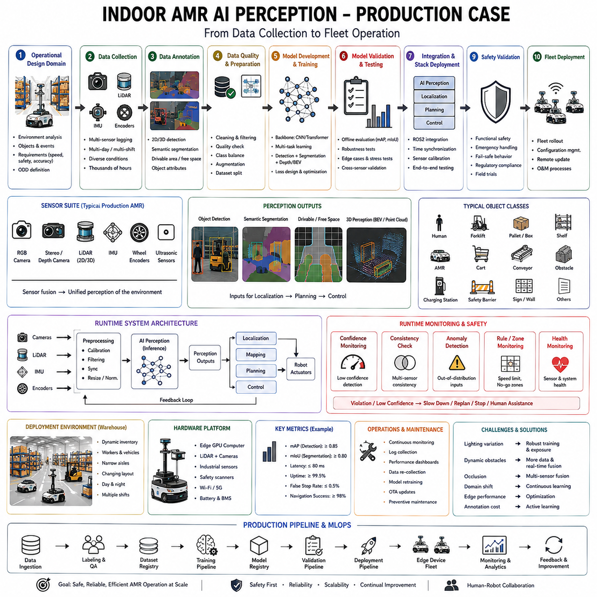{width="7.268055555555556in" height="7.268055555555556in"}

실내 자율 이동 로봇(Autonomous Mobile Robot, AMR)은 로보틱스에서 인공지능이 상업적으로 가장 성공한 응용 분야 중 하나가 되었다. 신중하게 통제된 조건 하에서 작동하는 실험실 연구 플랫폼과 달리, 프로덕션 AMR은 환경 조건이 매일 변화하는 공장, 창고, 병원, 공항, 반도체 시설, 물류 센터, 소매점, 유통 허브 내부에서 지속적으로 작동한다. 이들의 성공은 정확한 인지 알고리즘뿐만 아니라 견고한 공학, 신뢰할 수 있는 배치 파이프라인, 효율적인 하드웨어 활용, 지속적인 모니터링, 장기적인 운영 유지보수에도 달려 있다. 연구용 프로토타입에서 프로덕션 등급의 실내 AMR AI 인지 시스템으로의 전환은 데이터셋, 센서, 신경망 최적화, 실시간 추론, 안전성 검증, 런타임 모니터링, 함대 규모의 배치와 관련된 수많은 공학적 과제를 해결할 것을 필요로 한다. 완전한 프로덕션 사례를 이해하는 것은 현대의 AI 시스템이 실험에서 신뢰할 수 있는 상업적 운영으로 어떻게 이동하는지에 대한 유용한 통찰을 제공한다.

물류 회사가 팔레트, 컨테이너, 재고를 보관 장소, 생산 라인, 포장 스테이션, 배송 부두 사이에서 운반하는 자율 이동 로봇 함대를 대형 창고 내에 배치하는 대표적인 프로덕션 시나리오를 생각해 보자. 이 창고는 수만 제곱미터에 걸쳐 있으며 높은 선반, 좁은 통로, 지게차, 인간 작업자, 컨베이어 시스템, 자동화된 보관 장비, 충전소, 지속적으로 변화하는 재고를 포함한다. 정적인 배치를 지닌 연구 환경과 달리, 창고는 제품이 이동하고, 임시 장애물이 나타나며, 유지보수 활동이 일어나고, 작업자들이 하루 종일 로봇과 상호작용함에 따라 끊임없이 진화한다.

인지 시스템은 로봇이 물리적 세계와 소통하는 주요한 인터페이스 역할을 한다. 모든 내비게이션 결정은 여러 상호 보완적인 감지 양식으로부터 수집된 센서 관측치로 시작된다. 일반적인 프로덕션 AMR은 RGB 카메라, 스테레오 카메라나 깊이 카메라, 2D나 3D LiDAR, 관성 측정 장치, 바퀴 엔코더, 초음파 센서를, 운영상의 요구사항에 따라 때때로 레이더와 함께 통합한다. 각각의 센서는 다른 센서들의 한계를 보완하면서도 서로 다른 정보에 기여한다. 카메라는 풍부한 의미론적 이해를 제공하고, LiDAR는 정확한 기하학적 측정치를 제공하며, IMU는 운동 역학을 추정하고, 바퀴 엔코더는 오도메트리를 지원한다. 센서 융합은 이러한 관측치들을 어떤 개별적인 센서보다도 상당히 더 견고한 통합된 환경적 표현으로 결합한다.

첫 번째 공학적 단계는 운영 설계 도메인(operational design domain)을 정의하는 것을 수반한다. 엔지니어는 로봇이 어디에서 작동할 것인지, 무엇을 인식해야 하는지, 예상되는 환경 조건, 허용되는 속도, 통로의 너비, 선반의 높이, 조명 조건, 작업자와의 상호작용, 바닥재, 무선 연결, 충전 절차, 안전 요구사항을 신중하게 분석한다. 보편적인 인지를 시도하는 대신, AI 모델은 이 특정한 운영 도메인을 위해 특별히 최적화된다. 배치 경계의 명확한 정의는, 학습이 비현실적인 일반화 목표가 아니라 현실적인 프로덕션 조건에 초점을 맞추기 때문에 시스템의 신뢰성을 상당히 향상시킨다.

데이터셋 수집은 이 프로젝트 내에서 가장 큰 공학적 노력 중 하나를 나타낸다. 프로덕션 품질의 인지는 공개적으로 사용 가능한 벤치마크 이미지가 아니라 실제 창고 운영을 반영하는 데이터셋을 필요로 한다. 엔지니어는 수동으로 운전되는 차량이나 초기 로봇 플랫폼에 프로토타입 센서 시스템을 설치하고 정상적인 창고 활동 과정에서 수천 시간의 운영 시간을 기록한다. 데이터 수집은 여러 계절, 주간 및 야간 교대, 서로 다른 재고 구성, 다양한 작업자 밀도, 유지보수 활동, 장비 이동, 비상 상황, 청소 작업에 걸쳐 이루어진다. 오직 이상적인 운영 조건만을 기록하는 것은 실제 배치의 변동성을 다룰 수 없는 인지 시스템을 만들어낼 것이다.

수집된 센서 스트림에는 동기화된 카메라 이미지, LiDAR 스캔, 관성 측정치, 바퀴 오도메트리, 위치 추정 정보, 타임스탬프 동기화, 환경적 메타데이터, 로봇의 속도, 배터리 상태, 운영 로그가 포함된다. 인지 모델이 종종 여러 센서에 걸친 관측치를 융합하기 때문에 하드웨어 동기화는 핵심적이게 된다. 정밀 시각 프로토콜이나 하드웨어 트리거 동기화는 이미지, LiDAR 측정치, 관성 데이터가 동일한 물리적 순간에 대응하도록 보장하여, 학습 과정에서의 불일치를 방지한다.

데이터 주석은 수집 이후에 이루어진다. 인간 주석자들은 보행자, 지게차, 팔레트, 선반, 충전소, 안전 장벽, 컨베이어 시스템, 경고 표지판, 비상구, 하역장, 로봇, 카트, 임시 장애물을 식별한다. 의미론적 분할은 통행 가능한 바닥 영역, 제한 구역, 보관 구역, 충전 위치, 위험 공간에 레이블을 붙인다. 추가적인 주석은 자유 공간의 경계, 통로의 중심선, 팔레트의 방향, 작업자의 위치, 상호작용 구역을 식별한다. 여러 주석 검토 단계는 레이블링 오류를 줄이면서도 일관성을 향상시킨다.

데이터 품질 보증은 일회성 활동이 아니라 지속적인 과정이 된다. 중복된 이미지, 손상된 센서 기록, 동기화 실패, 보정 오류, 누락된 프레임, 흐릿한 이미지, 주석의 불일치는 학습 이전에 자동으로 감지된다. 통계적 분석은 창고 전반에 걸쳐 클래스 균형, 환경적 다양성, 센서의 일관성, 시간적 커버리지, 지리적 대표성을 검증한다. 엔지니어는 쓰러진 팔레트, 비상 장비, 특이한 작업자 행동, 손상된 선반, 유지보수 작업과 같은 과소 대표된 상황들을, 이러한 드문 시나리오들이 종종 운영상의 실패 사례가 되기 때문에 의도적으로 식별한다.

데이터 증강은 환경적 다양성을 상당히 확장시킨다. 이미지는 조명 변화, 색상 조정, 모션 블러 시뮬레이션, 센서 노이즈 주입, 무작위 가림, 시점 변환, 날씨와 무관한 조명 변화, 압축 아티팩트, 카메라 노출 변화를 거친다. LiDAR 데이터는 시뮬레이션된 노이즈, 누락된 반향, 범위 섭동, 부분적인 가림을 받는다. 이러한 증강들은 장기적인 배치 과정에서 마주치는 센서의 불완전함에 대한 견고성을 향상시킨다.

인지 아키텍처 자체는 하나의 단일한 모델이 아니라 협력하는 여러 전문화된 신경망들로 구성된다. 물체 감지는 작업자, 지게차, 카트, 다른 로봇을 포함한 동적 및 정적 장애물을 식별한다. 의미론적 분할은 통행 가능한 바닥 영역을 선반, 벽, 기계, 제한 구역과 구별한다. 자세 추정은 협력적 안전을 위해 인간의 신체 움직임을 추적한다. 인스턴스 분할은 혼잡한 환경 내에서 겹치는 물체들을 분리한다. 자유 공간 추정은 안전한 내비게이션 통로를 예측하는 한편, 이상 감지는 추가적인 주의가 필요한 낯선 상황을 식별한다.

물체 감지는, 내비게이션이 즉각적인 장애물 인식에 의존하기 때문에 일반적으로 실시간 추론을 우선시한다. 최적화된 YOLO 변형들과 같은 아키텍처들은 종종 계산 효율성을 감지 정확도와 균형을 맞춘다. 프로덕션 배치는 최대 벤치마크 정확도보다 결정론적인 지연시간을 강조한다. 다소 덜 정확한 감지기라도 안정적인 초당 30프레임의 추론을 유지한다면, 종종 불규칙한 실행 시간을 만들어내는 더 큰 모델보다 더 유용한 것으로 입증된다.

의미론적 분할은 밀집한 환경적 이해를 제공함으로써 감지를 보완한다. 오직 개별 물체만을 인식하는 대신, 분할은 통행 가능한 표면, 선반의 경계, 바닥 표시, 안전 구역, 운영상의 작업 공간을 예측한다. 내비게이션 플래너는 충돌 없는 궤적을 생성할 때 이러한 의미론적 이해에 크게 의존한다.

위치 추정은 고전적인 로보틱스 알고리즘을 AI로 향상된 인지와 결합한다. LiDAR 기반 동시적 위치 추정 및 지도 작성은 기하학적 일관성을 확립하는 한편, 신경망은 장기적인 위치 추정 안정성을 향상시키는 의미론적 랜드마크를 인식한다. 시각적 위치 추정은 환경 변화가 LiDAR의 신뢰성을 떨어뜨릴 때마다 기하학적 방법을 보완한다. 센서 융합은 바퀴 오도메트리, 관성 측정치, 시각적 특징, 지도 정보를 확률적 자세 추정치로 통합한다.

학습은 인지 모델이 지도학습 최적화를 거치는 대형 GPU 클러스터를 사용해 이루어진다. 엔지니어는 정보 누출을 방지하기 위해 기록 세션들 사이의 시간적 분리를 보장하면서 데이터셋을 학습, 검증, 테스트 부분집합으로 나눈다. 하이퍼파라미터 최적화는 오직 벤치마크 지표만을 최적화하는 것이 아니라 감지 정확도, 추론 속도, 메모리 소비, 일반화 능력의 균형을 맞춘다.

검증은 집계된 정확도를 넘어 확장된다. 성능은 좁은 통로, 교차로, 하역 구역, 충전소, 작업자가 밀집한 지역, 임시 건설 구역에 대해 개별적으로 측정된다. 운영상의 신뢰성이 평균 벤치마크 정확도가 아니라 모든 배치 조건에 걸친 성능에 달려 있기 때문에, 야간 교대, 줄어든 조명, 반사되는 바닥, 혼잡한 환경, 부분적으로 가려진 센서는 전용 평가를 받는다.

모델 최적화는 만족스러운 검증 이후 시작된다. 부동소수점 네트워크는 배치 하드웨어에 따라 FP16이나 INT8로 양자화를 거친다. 구조적 가지치기는 예측 품질을 보존하면서도 중복된 파라미터를 제거한다. 연산자 결합, 그래프 최적화, 커널 자동 튜닝, 메모리 최적화는 학습된 행동을 수정하지 않고도 추론 지연시간을 줄인다. 모델은 목표 하드웨어에 따라 TensorRT나 ONNX Runtime과 같은 최적화된 추론 엔진을 사용해 배치되기 전에 ONNX를 통해 내보내진다.

엣지 컴퓨팅 하드웨어는 일반적으로 임베디드 GPU 시스템, 산업용 엣지 컴퓨터, 또는 전용 AI 가속기로 구성된다. 인지 컴퓨터는 위치 추정, 내비게이션, 통신, 진단, 함대 관리, 안전 감독을 지원하면서도 여러 신경망을 동시에 실행한다. 신중한 자원 스케줄링은 개별 AI 작업 부하가 중요한 실시간 제어 루프를 방해하는 것을 방지한다.

프로덕션 추론 파이프라인은 모든 센서 프레임을 여러 단계를 통해 처리한다. 원본 센서 획득 이후에는 크기 조정, 정규화, 기하학적 보정, 동기화, 텐서 변환을 포함한 전처리가 뒤따른다. 최적화된 추론 엔진은 인지 모델을 실행하며, 이후 후처리는 비최대 억제, 신뢰도 필터링, 시간적 추적, 의미론적 융합, 좌표 변환을 적용한다. 그 결과로 만들어진 환경적 표현은 엄격한 실시간 마감시한 내에서 내비게이션 및 모션 계획 시스템에 사용 가능해진다.

런타임 모니터링은 예측 신뢰도, 센서 상태, 추론 지연시간, 프로세서 활용도, 메모리 사용량, 동기화 품질, 환경적 일관성을 지속적으로 평가한다. 신뢰도 추정치는 모든 인지 결과와 동반된다. 낮은 신뢰도의 감지는 즉각적인 실행이 아니라 줄어든 속도, 확장된 안전 마진, 또는 추가적인 감지를 포함한 보수적인 내비게이션 행동을 촉발한다.

분포 외 감지는 또 다른 운영상의 안전장치를 제공한다. 창고의 배치는 재고가 변하거나, 임시 구조물이 나타나거나, 새로운 장비가 서비스에 들어감에 따라 필연적으로 진화한다. OOD 감지기는 학습 데이터와 상당히 다른 낯선 관측치를 식별하여, 환경적 새로움이 사전에 정의된 임계값을 초과할 때마다 런타임 감독자가 주의를 늘릴 수 있게 한다.

이상 감지는, 신뢰도가 높아 보이는 경우에도 예상치 못한 예측 패턴을 식별함으로써 신뢰도 모니터링을 보완한다. 선반의 갑작스러운 사라짐, 불가능한 장애물 움직임, 일관되지 않은 분할, 센서 간의 불일치, 또는 위치 추정 이상은 안전하지 않은 내비게이션 결정이 발생하기 전에 진단 절차를 촉발한다.

안전 모니터링은 인지 자체와 독립적으로 작동한다. 결정론적 충돌 검사, 비상 정지 회로, 속도 제한, 인간 근접 모니터링, 작업 공간 경계, 안전 인증된 컨트롤러는 AI가 생성한 출력을 지속적으로 감독한다. 매우 자신감 있는 인지 예측이라도 액추에이터 명령이 실행되기 전에는 결정론적 안전 제약을 계속 받는다.

작업자의 안전이 다른 모든 운영상의 목표보다 우선하기 때문에 인간 감지는 특히 보수적인 취급을 받는다. 여러 독립적인 인지 파이프라인이 카메라, LiDAR, 깊이 감지를 동시에 사용해 보행자의 존재를 검증한다. 이러한 시스템들 사이의 어떠한 불일치도 낙관적인 해석이 아니라 보호적인 행동으로 기본 설정된다. 동적인 안전 구역은 로봇의 속도, 환경적 불확실성, 작업자의 밀도에 따라 자동으로 확장된다.

함대 관리는 대부분의 연구 환경에는 없는 또 다른 프로덕션 고려사항을 도입한다. 수백 대의 로봇들은 중앙화된 함대 인프라를 통해 운영 데이터, 소프트웨어 업데이트, 인지 개선, 위치 추정 보정, 진단 정보를 동시에 공유한다. 함대 전반에 걸쳐 수집된 운영 로그는 반복되는 실패 패턴, 새롭게 나타나는 환경 변화, 지속적인 개선의 기회를 식별한다.

지속적 배치 파이프라인은 안전한 소프트웨어 진화를 지원한다. 갱신된 인지 모델은 안정적인 운영상의 행동을 입증한 이후 먼저 시뮬레이션 검증, 실험실 테스트, 통제된 파일럿 배치, 제한된 프로덕션 롤아웃을 거친 뒤 마침내 함대 전체 배치를 받는다. 예상치 못한 저하가 나타나면 자동 롤백 메커니즘이 이전 모델 버전을 즉시 복원한다.

성능 모니터링은 AI의 정확도를 넘어 확장된다. 엔지니어는 추론 지연시간, 프로세서 활용도, 메모리 소비, 배터리 사용량, 네트워크 대역폭, 열적 행동, 센서의 신뢰성, 위치 추정 정확도, 내비게이션 효율성, 임무 완료율, 비상 정지 빈도, 인간 개입 통계를 지속적으로 평가한다. 이러한 운영상의 지표들은 종종 명백한 실패가 발생하기 전에 미묘한 저하를 드러낸다.

실패 분석은 지속적인 공학적 활동이 된다. 모든 운영상의 이상은 기록된 센서 스트림, 런타임 로그, 위치 추정 기록, 해석 가능성 도구, 신뢰도 추정치, 환경적 재구성을 사용한 체계적인 조사를 거친다. 근본 원인 분석은 시정 조치가 구현되기 전에 데이터셋의 결함, 센서 실패, 하드웨어 문제, 환경적 새로움, 알고리즘적 한계, 통합 문제를 구별한다.

데이터셋 확장은 배치 전반에 걸쳐 계속된다. 실패 분석 과정에서 식별된 어려운 운영 시나리오들은 우선순위가 부여된 데이터 수집 목표가 된다. 엔지니어는 새로운 관측치에 주석을 달고, 영향을 받은 인지 모델을 재학습시키며, 개선 사항을 검증하고, 확립된 프로덕션 파이프라인을 통해 갱신된 소프트웨어를 재배치한다. 이러한 지속 학습 주기는 안정적인 프로덕션 성능을 유지하면서도 운영상의 견고성을 점진적으로 향상시킨다.

산업용 유지보수도 인지의 신뢰성에 영향을 미친다. 카메라는 청소가 필요하고, LiDAR 창은 먼지가 축적되며, 센서 보정은 시간이 지남에 따라 드리프트하고, 프로세서는 열적 노화를 경험하며, 기계적 진동은 정렬에 영향을 미친다. 따라서 예방적 유지보수 일정에는 전통적인 기계적 서비스와 함께 센서 검증도 포함된다. 자동화된 자가 진단 루틴은 상당한 인지 저하가 발생하기 전에 보정의 드리프트를 식별한다.

인지 시스템이 클라우드 연결, 함대 관리, 원격 소프트웨어 업데이트를 통합함에 따라 사이버 보안은 점점 더 중요해지고 있다. 보안 부팅 메커니즘, 암호화된 통신, 인증된 소프트웨어 배치, 런타임 무결성 검증, 접근 제어는 로봇의 안전성을 손상시킬 수 있는 승인되지 않은 수정으로부터 AI 인프라를 보호한다.

운영상의 확장성은 프로덕션 시스템을 연구용 프로토타입과 구별짓는다. 초기 배치는 오직 하나의 창고 내의 소수의 로봇만을 수반할 수 있다. 성공적인 상업 시스템은 점차 서로 다른 지리적 지역에 걸쳐 작동하는 여러 시설로 확장된다. 따라서 인지 모델은 일관된 소프트웨어 아키텍처를 유지하면서도 다양한 창고 배치, 지역적 운영 관행, 센서 하드웨어의 개정, 인프라의 차이에 대한 적응을 필요로 한다.

경제적 고려사항은 공학적 결정에 상당한 영향을 미친다. 추가적인 하드웨어가 배치 비용을 상당히 증가시킨다면, 더 높은 벤치마크 정확도만으로는 늘어난 계산 비용을 좀처럼 정당화하지 못한다. 따라서 프로덕션 엔지니어는 AI 성능, 하드웨어 비용, 유지보수 요구사항, 에너지 소비, 운영상의 신뢰성, 장기적인 확장성의 균형을 맞추면서 전체적인 시스템 효율성을 최적화한다.

프로덕션 생애 주기는 배치 이후에도 결코 진정으로 끝나지 않는다. 창고 환경은 계속 진화하고, AI 하드웨어는 향상되며, 규제 요구사항은 변하고, 운영상의 목표는 확장되며, 새로운 인지 기술이 등장한다. 따라서 성공적인 프로덕션 AMR 플랫폼은 일상적인 운영을 방해하지 않고도 점진적인 개선을 가능하게 하는 모듈형 아키텍처를 채택한다. 개별적인 인지 모듈은 위치 추정, 계획 수립, 제어 시스템과의 안정적인 인터페이스를 유지하면서도 독립적으로 업그레이드될 수 있다.

현대의 실내 AMR 인지는 전통적인 물체 감지 및 분할과 함께 파운데이션 모델, 시각-언어 이해, 멀티모달 추론, 의미론적 세계 모델을 점점 더 많이 통합하고 있다. 미래의 프로덕션 시스템은 결정론적 안전 컨트롤러의 감독을 계속 받으면서도, 복잡한 운영상의 지시를 인식하고, 창고의 의미론을 이해하며, 작업자의 의도를 예측하고, 내비게이션 결정을 설명하며, 진화하는 환경에 지속적으로 적응할 것이다.

실험실 AI 연구에서 프로덕션 실내 AMR 배치로의 전환은, 성공적인 자율 로보틱스가 신경망의 정확도보다 훨씬 더 많은 것에 달려 있다는 것을 보여준다. 신뢰할 수 있는 상업 시스템은 포괄적인 데이터셋, 견고한 센서 융합, 최적화된 모델 아키텍처, 효율적인 엣지 추론, 결정론적 안전 감독, 런타임 모니터링, 지속적인 검증, 체계적인 실패 분석, 함대 규모의 배치, 규율 있는 공학적 절차의 통합으로부터 나타난다. 인지 모델은, 데이터 공학, 시스템 통합, 안전 관리, 생애 주기 유지보수, 운영 모니터링이 모두 동등하게 장기적인 성공에 기여하는 훨씬 더 큰 지능형 로봇 생태계 내의 하나의 구성 요소가 된다. 창고 자동화, 지능형 물류, Physical AI가 전 세계적으로 계속 확장됨에 따라, 프로덕션 등급의 AI 인지 시스템은 자율 이동 로봇이 복잡한 실제 세계의 산업 환경 내에서 안전하고, 효율적이며, 지속적으로 작동할 수 있게 하는 핵심적인 기술 중 하나로 남을 것이다.

## 12.02 Outdoor AMR RL Policy for Terrain Navigation Case

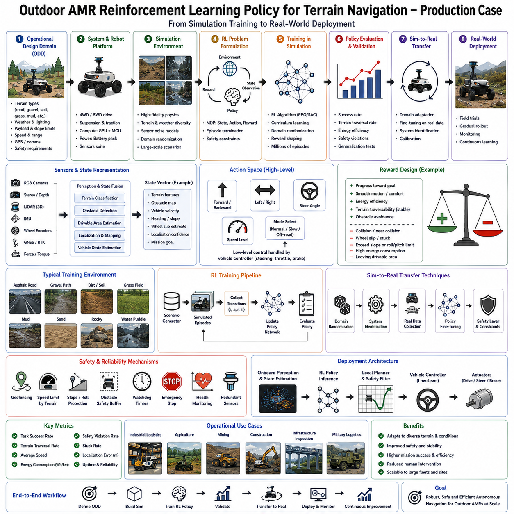{width="7.268055555555556in" height="7.268055555555556in"}

실외 자율 이동 로봇(Outdoor Autonomous Mobile Robot, AMR)은 실내 로봇 시스템보다 근본적으로 더 복잡하고 예측하기 어려운 환경에서 작동한다. 실내 로봇이 안정적인 조명, 잘 정의된 지도, 통제된 통행을 지닌 비교적 구조화된 공간을 내비게이션하는 반면, 실외 AMR은 매우 다양한 지형, 변화하는 날씨 조건, 고르지 않은 지면, 동적인 장애물, 식생, 건설 구역, 진흙, 자갈, 경사, 물웅덩이, 느슨한 흙, 지속적으로 진화하는 환경 조건에 걸쳐 작동해야 한다. 전통적인 규칙 기반 내비게이션과 고전적인 모션 계획 수립은 여전히 유용하지만, 이들은 종종 실외 지형의 엄청난 다양성에 적응하는 데 어려움을 겪는다. 따라서 강화학습(Reinforcement Learning, RL)은 상호작용과 경험을 통해 복잡한 환경에 적응할 수 있는 지형 인식 내비게이션 정책을 학습하기 위한 가장 유망한 접근법 중 하나로 떠올랐다. 실외 지형 내비게이션을 수반하는 프로덕션 사례는 강화학습이 시뮬레이션 연구에서 신뢰할 수 있는 자율 로봇 배치로 어떻게 발전하는지를 보여준다.

산업 물류, 인프라 점검, 스마트 농업, 광산 지원, 군수 물류, 또는 건설 현장 운송을 위해 설계된 상업용 실외 AMR을 생각해 보자. 이 로봇은 수백 킬로그램의 무게가 나가고, 300킬로그램을 초과하는 적재량을 운반하며, 8시간에서 12시간 동안 지속적으로 작동하고, 아스팔트 도로, 자갈길, 다져진 흙, 잔디, 콘크리트 표면, 경사로, 진흙, 얕은 물, 과속 방지턱, 연석, 임시 건설 장애물을 포함한 혼합된 지형에 걸쳐 내비게이션한다. 신중하게 통제된 환경 내에서 이동하는 실험실 로봇과 달리, 이 프로덕션 플랫폼은 안전성, 안정성, 운영 효율성을 유지하면서도 매시간 수천 개의 지형 전환을 마주친다.

핵심적인 공학적 목표는 단순한 장애물 회피가 아니라 지형을 인식하는 자율 내비게이션이다. 모든 내비게이션 결정은 통행 가능성, 차량의 안정성, 에너지 소비, 바퀴의 견인력, 서스펜션 역학, 적재물의 안정성, 승객이나 화물의 안전, 위치 추정의 불확실성, 장기적인 임무 효율성을 동시에 고려해야 한다. 강화학습 정책은 매우 불확실한 환경에 걸쳐 운영상의 위험을 최소화하면서도 임무의 성공을 최대화하는 동작 명령을 선택하는 책임을 맡게 된다.

개발 과정은 흔히 ODD로 약칭되는 운영 설계 도메인(Operational Design Domain)을 정의하는 것으로 시작된다. 엔지니어는 로봇이 어디에서 작동할 것인지, 예상되는 지형 유형, 최대 경사, 허용되는 날씨 조건, 적재량 범위, 운영 속도, 환경 온도, GPS 가용성, 통신 인프라, 예상되는 장애물 범주를 정밀하게 명시한다. 보편적인 실외 내비게이션을 시도하는 대신, 강화학습 시스템은 명확하게 정의된 운영 경계를 위해 최적화된다. 이러한 규율 있는 공학적 접근법은, 학습 문제가 현실적인 상업적 요구사항과 일치하는 상태로 남아 있기 때문에 배치의 신뢰성을 크게 향상시킨다.

레이블이 달린 데이터셋으로부터 학습하는 지도학습 인지 모델과 달리, 강화학습은 환경과의 상호작용을 통해 학습한다. 따라서 적절한 시뮬레이션 환경을 구축하는 것은 가장 중요한 공학적 과제 중 하나가 된다. 고충실도 시뮬레이터는 로봇의 역학, 지형 물리, 타이어-지면 상호작용, 서스펜션 행동, 센서 노이즈, 환경적 조명, 날씨 효과, 마찰 계수, 적재물 변동, 차량의 관성을 재현한다. 내비게이션 성능이 이미지 인식만이 아니라 접촉 역학에 크게 의존하기 때문에, 이 시뮬레이션은 시각적 외관뿐만 아니라 물리적 상호작용도 포착해야 한다.

물리 시뮬레이션의 정확도는 정책의 품질에 직접적인 영향을 미친다. 바퀴의 미끄러짐, 서스펜션의 압축, 구름 저항, 차량의 진동, 무게 중심의 이동, 액추에이터의 지연, 조향 역학은 모두 성공적인 지형 통과에 기여한다. 단순화된 시뮬레이션은 종종 가상에서는 잘 작동하지만 중요한 역학이 모델링되지 않았기 때문에 물리적 배치 과정에서는 실패하는 정책들을 만들어낸다. 따라서 프로덕션 시뮬레이션 환경은 계산 비용이 늘어나더라도 정확한 물리적 행동을 강조한다.

로봇의 관측 공간은 여러 감지 양식으로부터의 정보를 결합한다. RGB 카메라는 의미론적 장면 이해를 제공하고, 스테레오나 깊이 카메라는 지역적인 지형 기하학을 추정하며, LiDAR는 정밀한 3차원 장애물 지도를 생성하고, 관성 측정 장치는 가속도와 각속도를 측정하며, 바퀴 엔코더는 차량의 움직임을 추정하고, GNSS는 사용 가능할 때 전역적인 위치를 제공하며, 힘이나 토크 센서는 구동계의 부하를 모니터링한다. 지형 분류 모듈은 추가적으로 자갈, 아스팔트, 잔디, 진흙, 모래, 또는 느슨한 흙과 같은 표면 속성을 추정한다. 단일한 센서에 의존하는 대신, 정책은 기하학적, 의미론적, 동적 정보를 통합하는 융합된 환경적 표현을 받는다.

상태 표현(state representation)은 강화학습 성능에서 핵심적인 역할을 한다. 원본 센서 데이터는 일반적으로 내비게이션 결정에 필요한 것보다 훨씬 더 많은 정보를 포함한다. 특징 추출 네트워크는 센서 관측치를, 지형 기하학, 장애물 구성, 차량의 상태, 속도, 방향, 경사, 미끄러짐 추정, 위치 추정 신뢰도, 임무 목표를 기술하는 압축된 잠재 표현으로 압축한다. 잘 설계된 상태 표현은, 태스크와 관련된 정보를 강조하면서도 관련 없는 환경적 변동을 억제하기 때문에 정책 학습을 상당히 가속화한다.

행동 공간(action space)은 정책이 무엇을 제어하는지를 정의한다. 프로덕션 실외 AMR은 모터 전류 조절, 조향 서보 제어, 제동, 견인 관리가 결정론적 컨트롤러의 책임으로 남아 있기 때문에 일반적으로 저수준의 액추에이터 제어를 피한다. 대신, 강화학습은 일반적으로 원하는 선속도, 각속도, 조향각, 경로의 곡률, 경유지 선택, 또는 지역적 궤적 수정과 같은 더 높은 수준의 동작 명령을 생성한다. 이러한 계층적 아키텍처는 강화학습의 적응성을 전통적인 제어 공학의 안정성과 결합한다.

보상 공학(reward engineering)은 강화학습 개발의 가장 핵심적인 측면 중 하나를 나타낸다. 원하는 출력이 명시적으로 레이블링되는 지도학습과 달리, 강화학습은 보상 최적화를 통해 행동을 발견한다. 따라서 신중하게 설계된 보상 함수는 학습 과정에서 어떤 내비게이션 전략들이 나타날지를 결정한다.

임무 진행은 일반적으로 주요한 양의 보상을 제공한다. 로봇은 통행 가능한 통로 내에 머물면서 배정된 목적지에 접근함에 따라 늘어나는 보상을 받는다. 그러나 오직 진행만을 최대화하는 것은 종종 안전하지 않은 공격적인 주행 행동을 만들어낸다. 따라서 추가적인 보상 구성 요소들은 부드럽고, 효율적이며, 안정적인 내비게이션을 장려한다.

충돌 회피는 상당한 음의 보상에 기여한다. 정적인 장애물, 움직이는 차량, 보행자, 장벽, 인프라, 식생, 또는 환경적 위험과의 접촉은 즉시 누적 보상을 줄인다. 프로덕션 시스템은 종종 인간이나 안전이 중요한 인프라를 수반하는 충돌에 특히 심각한 페널티를 부여하여, 학습된 정책이 운영 효율성보다 인간의 안전을 자연스럽게 우선시하도록 보장한다.

지형 통행 가능성(terrain traversability)은 또 다른 중요한 보상 구성 요소를 이룬다. 단순히 목적지에 도달하는 것이 아니라, 로봇은 실용적일 때마다 어려운 지형보다 안정적이고 에너지 효율적인 표면을 선호하는 법을 학습한다. 부드러운 아스팔트, 다져진 자갈, 또는 보강된 통로는 일반적으로 진흙, 느슨한 모래, 가파른 경사, 또는 바위투성이 땅보다 더 높은 보상을 받는다. 따라서 학습된 정책은 자연스럽게 이동 거리와 지형의 품질 사이의 균형을 맞춘다.

차량의 안정성은 내비게이션 전반에 걸쳐 지속적인 평가를 받는다. 과도한 롤 각도, 피치 각도, 바퀴의 미끄러짐, 서스펜션의 진동, 갑작스러운 가속, 거친 제동, 또는 공격적인 조향은 누적된 보상을 줄인다. 이는 적재물을 보호하고, 기계적 마모를 최소화하며, 해당하는 경우 승객의 편안함을 향상시키는 부드러운 움직임을 만들어내는 정책들을 장려한다.

에너지 효율성은 상업용 강화학습 목표의 일부가 되고 있다. 실외 로봇은 종종 충전 주기 사이에 여러 시간 동안 작동한다. 효율적인 내비게이션은 배터리 저하를 줄이면서도 운영상의 가용성을 연장한다. 따라서 보상 함수는 불필요한 가속, 과도한 조향 수정, 반복되는 장애물 회피 동작, 또는 비효율적인 경로 선택에 페널티를 준다.

위치 추정 신뢰도도 마찬가지로 의사결정에 영향을 미친다. GPS 수신이 부실하거나, LiDAR 위치 추정이 저하되거나, 시각적 특징이 약하거나, 의미론적 이해가 불확실한 지역은, 임무의 요구사항이 명시적으로 통과를 요구하지 않는 한 줄어든 보상을 받을 수 있다. 따라서 정책은 저하된 환경도 신중하게 내비게이션할 수 있는 능력을 유지하면서도 가능할 때마다 신뢰할 수 있는 위치 추정을 활용하는 법을 학습한다.

커리큘럼 학습(curriculum learning)은 정책 개발을 상당히 향상시킨다. 로봇을 즉시 매우 복잡한 환경에 노출시키는 대신, 학습은 단순한 지형, 드문 장애물, 안정적인 환경 조건으로 시작된다. 학습이 진행됨에 따라 점점 더 어려운 지형, 날씨 변동, 동적 장애물, 적재물 변화, 센서 불확실성이 점진적으로 도입된다. 이러한 단계적인 진행은 정책이 견고한 내비게이션 전략을 점진적으로 발전시킬 수 있게 한다.

도메인 무작위화(domain randomization)는 실외 강화학습에서 특히 중요한 역할을 한다. 시뮬레이션 과정에서, 환경적 파라미터는 조명 조건, 날씨, 마찰 계수, 타이어 속성, 센서 보정, 지형 텍스처, 식생의 밀도, 장애물의 배치, 적재물의 무게, 기계적 특성에 걸쳐 지속적으로 변한다. 하나의 시뮬레이션 환경을 암기하는 대신, 정책은 광범위한 환경적 변동에 걸쳐 견고한 행동을 학습한다. 도메인 무작위화는 물리적 배치 과정에서 마주치는 시뮬레이션-현실 간극을 상당히 줄여준다.

지형의 다양성은 또 다른 필수적인 학습 고려사항이 된다. 시뮬레이션된 환경에는 아스팔트 도로, 흙길, 자갈길, 진흙 구간, 잔디밭, 바위투성이 지형, 건설 잔해, 연석, 경사로, 배수로, 다리, 임시 장애물, 혼합된 표면 전환이 포함된다. 다양한 지형에 대한 노출은 정책이 좁게 특화되는 대신 실제 운영 환경 전반에 걸쳐 효과적으로 일반화될 수 있게 한다.

프로덕션에서 일반적으로 사용되는 현대의 강화학습 알고리즘에는 근접 정책 최적화(Proximal Policy Optimization), 소프트 액터-크리틱(Soft Actor-Critic), 심층 결정론적 정책 그래디언트(Deep Deterministic Policy Gradient), 쌍둥이 지연 심층 결정론적 정책 그래디언트(Twin Delayed Deep Deterministic Policy Gradient), 분포적 강화학습 방법이 포함된다. 이들 중, 근접 정책 최적화는 종종 로봇 내비게이션 태스크를 위한 학습 안정성, 샘플 효율성, 구현의 단순성, 확장성 사이의 매력적인 균형을 제공한다.

계층적 강화학습은 프로덕션 성능을 더욱 향상시킨다. 고수준의 정책은 장거리 내비게이션 목표, 경유지 선택, 지형 선호도, 또는 경로 계획 수립을 결정하는 한편, 저수준의 컨트롤러는 지역적인 장애물 회피, 조향 정제, 속도 조절, 동적 안정화를 관리한다. 서로 다른 계층들이 서로 다른 시간적 규모에서 작동하는 문제들을 해결하기 때문에, 이러한 분해는 학습의 복잡성을 상당히 줄여준다.

모방 학습은 초기 정책 개발 과정에서 강화학습을 자주 보완한다. 경험 많은 인간 조작자는 센서 관측치와 제어 행동이 기록되는 동안 대표적인 지형을 수동으로 내비게이션한다. 행동 복제(behavioral cloning)는 강화학습이 추가적인 최적화를 시작하기 전에 합리적인 운전 행동으로 내비게이션 정책을 초기화한다. 이러한 하이브리드 접근법은 초기 학습 과정에서의 안전하지 않은 탐색을 줄이면서도 수렴을 가속화한다.

인간의 시연은 드문 운영 상황에 대해 특히 유용한 것으로 입증된다. 좁은 다리를 건너는 것, 건설 장비 주변을 조작하는 것, 가파른 경사를 내비게이션하는 것, 또는 복잡한 장애물 상호작용을 처리하는 것은 자율적인 탐색 과정에서는 드물게 발생할 수 있다. 전문가의 시연은 순수한 강화학습만으로는 효율적으로 발견하기 어려운 예제들을 제공한다.

시뮬레이션 학습은 일반적으로 수렴하기 전에 수백만 또는 수십억 개의 상호작용 단계를 필요로 한다. GPU 클러스터에 걸쳐 분산된 병렬 시뮬레이션 환경은 데이터 생성을 극적으로 가속화한다. 수백 또는 수천 대의 가상 로봇들이 다양한 지형을 동시에 탐색하여, 오직 물리적 실험만으로는 얻을 수 없는 방대한 경험 데이터셋을 만들어낸다.

정책 평가는 평균 보상 지표를 훨씬 넘어 확장된다. 엔지니어는 여러 지형 범주, 날씨 조건, 적재물 구성, 장애물 밀도, 통신 품질, 위치 추정 불확실성, 임무 유형에 걸쳐 내비게이션 성공을 평가한다. 안정성, 에너지 소비, 충돌 빈도, 바퀴의 미끄러짐, 복구 능력, 완료 시간은 모두 포괄적인 정책 평가에 기여한다.

물리적 배치 이전에 안전성 검증은 특히 강조된다. 정책은 센서 실패, 액추에이터 저하, GPS 거부, 예상치 못한 장애물, 심각한 날씨, 통신 중단, 적재물 불균형, 운영상의 한계에 근접하는 지형 조건을 포함한 극단적인 조건 하에서 시뮬레이션 내에서 광범위한 스트레스 테스트를 거친다. 런타임 안전 감독자는 학습된 정책이 결정론적 안전 제약과 계속 호환되는지를 검증한다.

시뮬레이션에서 물리적 로봇으로의 전환은 통제된 현장 테스트를 통해 시작된다. 초기 실험은 대표적인 지형을 포함하지만 최소한의 운영상의 위험을 지닌 제한된 시험장 내에서 이루어진다. 엔지니어는 시뮬레이션된 예측을 측정된 물리적 행동과 비교하여, 모델 정제가 필요한 불일치를 식별한다. 서스펜션 특성, 타이어 변형, 액추에이터 지연, 센서 보정은 대규모 배치 이전에 종종 조정을 필요로 한다.

시스템 식별(system identification)은 시뮬레이션-현실 간극을 상당히 줄여준다. 엔지니어는 실제 차량 역학을 실험적으로 측정하여, 마찰 계수, 서스펜션의 강성, 구동계의 효율성, 액추에이터 지연, 조향 반응, 센서 특성을 추정한다. 이러한 측정치들은 시뮬레이션 파라미터를 정제하여, 물리적 로봇으로의 정책 전이를 향상시킨다.

물리적 배치가 시작되면, 강화학습 정책은 전통적인 로보틱스 소프트웨어를 완전히 대체하는 것이 아니라 그것과 나란히 작동한다. 전역 플래너는 결정론적인 지도 작성 알고리즘을 사용해 장거리 경로를 생성하고, 위치 추정 시스템은 확률적 센서 융합을 통해 로봇의 위치를 추정하며, 안전 인증된 컨트롤러는 모든 동작 명령을 감독한다. 강화학습은 이러한 더 넓은 자율 아키텍처 내에서 적응형의 지형을 인식하는 지역적 의사결정에 기여한다.

런타임 모니터링은 정책의 행동을 지속적으로 평가한다. 신뢰도 추정, 불확실성 정량화, 이상 감지, 센서 일관성 분석, 런타임 안전 모니터는 실행 이전에 모든 내비게이션 명령을 감독한다. 정책이 사전에 정의된 안전 제약을 위반하는 행동을 제안한다면, 결정론적 감독자는 운영상의 안전성을 유지하면서도 그러한 명령들을 수정하거나 거부한다.

분포 외 감지는 또 다른 필수적인 배치 안전장치를 제공한다. 실외 환경은 식생이 자라고, 건설이 진행되고, 계절적 날씨가 변하고, 홍수가 발생하거나, 새로운 인프라가 나타남에 따라 지속적으로 진화한다. 관측치가 학습 경험과 상당히 다를 때, 런타임 모니터는 오직 강화학습의 결정에만 의존하는 대신 안전 마진을 늘리고, 속도를 줄이거나, 인간의 감독을 요청한다.

지형 분류는 배치 전반에 걸쳐 계속된다. 신경망은 예상되는 견인력, 미끄러짐 확률, 안정성 마진을 추정하면서도 표면 유형을 식별한다. 시각적으로 유사한 지형이 극적으로 다른 물리적 속성을 보일 수 있기 때문에, 이러한 의미론적 예측들은 기하학적 장애물 감지를 보완한다. 젖은 잔디, 마른 잔디, 느슨한 자갈, 다져진 자갈, 진흙탕은 비슷한 외관에도 불구하고 서로 다른 내비게이션 전략을 필요로 한다.

지속적인 데이터 수집은 장기적인 정책 개선을 지원한다. 운영 중인 로봇은 센서 관측치, 지형 조건, 내비게이션 결과, 안전 개입, 위치 추정 성능, 조작자의 피드백을 기록한다. 배치 과정에서 식별된 어려운 시나리오들은 운영상의 신뢰성을 손상시키지 않고도 정책의 능력을 점진적으로 확장하는 추가적인 시뮬레이션 벤치마크와 재학습 데이터셋이 된다.

함대 학습은 또 다른 프로덕션의 이점을 제공한다. 각각의 로봇을 독립적으로 향상시키는 대신, 전체 함대에 걸쳐 수집된 운영 경험은 중앙화된 정책 정제에 기여한다. 한 로봇이 발견한 성공적인 내비게이션 전략은 검증과 소프트웨어 업데이트 이후 배치된 모든 시스템에서 사용 가능해진다. 따라서 조직적 지식은 개별 로봇의 경험보다 훨씬 더 빠르게 축적된다.

에너지 관리는 지형을 인식하는 강화학습과 긴밀하게 통합된다. 정책은 내비게이션 전략을 선택할 때 배터리 상태, 충전소의 가용성, 예상되는 지형의 난이도, 적재물의 무게, 임무의 긴급성을 점점 더 많이 고려한다. 효율적인 경로 선택은 유지보수 비용과 배터리 저하를 줄이면서도 운영상의 가용성을 연장한다.

강화학습의 본질적으로 복잡한 의사결정 과정에도 불구하고, 산업용 배치는 설명 가능성도 강조한다. 런타임 시각화 도구는 지형 분류, 통행 가능성 추정치, 불확실성 척도, 선택된 행동, 정책의 신뢰도를 표시하여, 엔지니어들이 디버깅과 운영상의 분석 과정에서 내비게이션 결정을 이해할 수 있게 한다.

실패 분석은 배치 전반에 걸쳐 지속적인 공학적 활동으로 남아 있다. 모든 내비게이션 이상은 리플레이 시스템, 시뮬레이션 재구성, 해석 가능성 방법, 센서 분석, 위치 추정 진단, 지형 평가를 사용한 체계적인 조사를 거친다. 근본 원인 분석은 시정 조치가 구현되기 전에 강화학습의 한계를 센서 실패, 위치 추정 오류, 환경적 새로움, 또는 하드웨어 저하와 구별한다.

미래의 실외 AMR 내비게이션은 강화학습을 파운데이션 모델, 시각-언어-행동 시스템, 의미론적 세계 모델, 예측적 환경 시뮬레이션과 점점 더 많이 통합할 것이다. 오직 즉각적인 관측치에만 반응하는 대신, 미래의 정책들은 장기적인 지형의 진화를 예상하고, 자연어 임무 목표를 이해하며, 환경적 의미론에 대해 추론하고, 인간의 행동을 예측하며, 공유된 환경 내에서 작동하는 다른 자율 차량들과 지능적으로 협력할 것이다.

궁극적으로, 실외 지형 내비게이션을 위한 강화학습의 프로덕션 배치는, 성공적인 자율 로보틱스가 고급 학습 알고리즘을 엄격한 시스템 공학과 통합할 것을 필요로 한다는 것을 보여준다. 고충실도 시뮬레이션, 포괄적인 센서 융합, 현실적인 보상 설계, 커리큘럼 학습, 도메인 무작위화, 결정론적 안전 감독, 런타임 모니터링, 지속 학습, 규율 있는 운영상의 검증은 함께 강화학습을 학술적인 최적화 기법에서 신뢰할 수 있는 산업 기술로 전환시킨다. 강화학습 정책은, 인지, 위치 추정, 계획 수립, 제어, 안전 모니터링, 함대 관리, 생애 주기 유지보수가 협력하여 현대의 Physical AI 시스템이 마주치는 다양하고, 예측할 수 없으며, 지속적으로 변화하는 환경 전반에 걸쳐 견고한 실외 이동성을 가능하게 하는 포괄적인 자율 내비게이션 아키텍처 내의 하나의 적응형 구성 요소가 된다.

## 12.03 Mobile Manipulator IL Policy Bin Picking Case

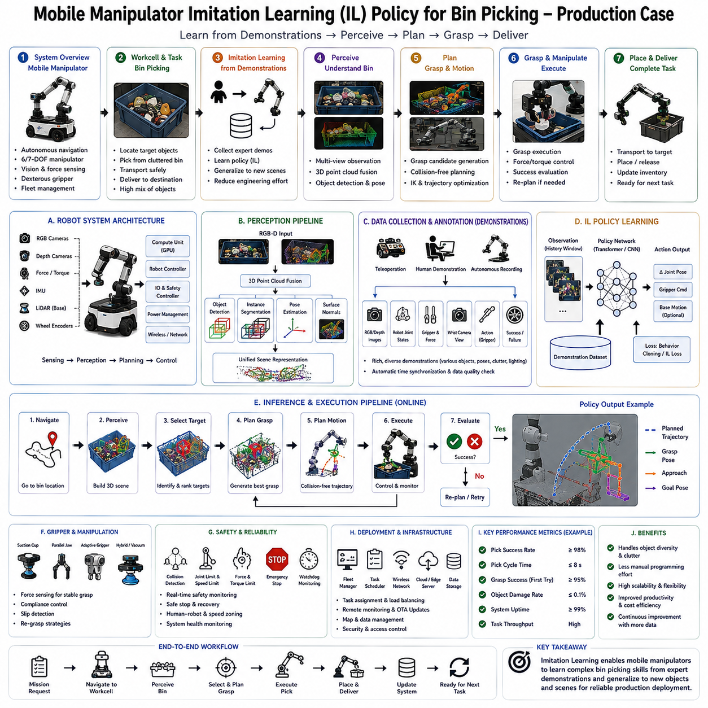{width="7.268055555555556in" height="7.268055555555556in"}

모바일 매니퓰레이터(mobile manipulator)는 자율 이동성과 정교한 조작 능력을 결합함으로써 로봇이 대규모 환경을 자유롭게 이동하면서 물체와 물리적으로 상호작용할 수 있게 해준다는 점에서 현대 로보틱스의 가장 중요한 방향 중 하나로 꼽힌다. 사전에 정의된 작업 공간(workcell) 안에서만 동작하는 고정형 산업용 로봇 팔과 달리, 모바일 매니퓰레이터는 자율이동로봇(AMR)이나 무인운반차(AGV)에 하나 이상의 로봇 팔, 비전 시스템, 힘 센서, 그리고 지능형 파지(grasp) 계획 알고리즘을 통합한다. 이러한 결합은 운용상의 유연성을 극적으로 확장시켜, 로봇이 창고 피킹, 물류 처리, 공장 자동화, 소매 매장 재고 보충, 병원 물품 배송, 재활용, 제조 지원 등의 작업을 수행할 수 있게 한다. 이러한 응용 분야들 중에서도 자율 빈 피킹(autonomous bin picking)은 인식, 물체 인식, 자세 추정, 모션 플래닝, 파지 생성, 힘 제어, 그리고 매우 불확실한 조건 하에서의 조작을 모두 요구하기 때문에 기술적으로 가장 도전적인 문제 중 하나로 자리 잡았다. 모방학습(Imitation Learning, IL)은 모든 가능한 행동을 일일이 수동으로 프로그래밍하는 대신 전문가의 시연(demonstration)으로부터 직접 학습함으로써 로봇에게 이러한 복잡한 조작 기술을 가르치는 가장 실용적인 접근법 중 하나로 부상하였다.

실제 생산 현장에서 운용되는 모바일 매니퓰레이션 시스템은 일반적으로 제품이 플라스틱 용기, 금속 빈, 상자, 선반, 팔레트 안에 보관되어 있는 창고, 제조 시설, 물류센터, 또는 풀필먼트 센터 내부에서 동작한다. 고객 주문이 들어오면 로봇은 원하는 제품을 찾아내고, 보관 위치까지 이동하며, 어수선하게 뒤섞인 빈 안에서 목표 물체를 식별하고, 가려짐(occlusion)에도 불구하고 안정적으로 파지한 뒤, 안전하게 운반하여 지정된 목적지까지 전달해야 한다. 모든 물체의 위치가 정확히 알려져 있는 고도로 구조화된 산업 자동화 환경과 달리, 창고에서의 빈 피킹은 엄청난 불확실성을 수반한다. 물체들은 서로 겹쳐 있고, 무작위로 회전되어 있으며, 부분적으로 서로를 가리고, 재질 특성이 제각각이고, 빛을 다르게 반사하며, 접촉 시 변형되고, 매 파지 시도 후마다 위치가 계속 바뀐다. 전통적인 규칙 기반 조작 방식은 이러한 다양성을 다루는 데 어려움을 겪으며, 이는 경험을 통해 적응할 수 있는 학습 기반 접근법의 필요성을 뒷받침한다.

개발 과정은 머신러닝 알고리즘을 곧바로 선택하는 것이 아니라 운용 요구사항을 정의하는 것에서부터 시작된다. 엔지니어들은 조작 대상 물체의 카테고리, 예상 적재 하중 범위, 최대 물체 치수, 허용 가능한 파지 실패율, 요구되는 사이클 타임, 작업 공간의 기하학적 구조, 조명 환경, 내비게이션 요구사항, 안전 규정, 보관 배치, 그리고 인간과의 상호작용 시나리오를 규정한다. 실제 생산 배치는 실험실 조건에서 최고의 벤치마크 정확도를 달성하는 것보다 반복 가능성과 장기적인 신뢰성을 더 중시한다.

로봇 플랫폼은 일반적으로 긴밀하게 통합된 네 가지 하위 시스템으로 구성된다. 이동 베이스는 동시적 위치추정 및 지도작성(SLAM), 장애물 회피, 그리고 플릿(fleet) 관리를 활용하여 작업 스테이션 간의 자율 내비게이션을 수행한다. 매니퓰레이터는 정교한 물체 취급을 위해 6축 또는 7축의 자유도를 제공한다. 인식 시스템은 RGB 카메라, 깊이(depth) 카메라, 그리고 경우에 따라 손목에 장착된 카메라를 결합하여 여러 시점에서 어수선한 빈의 내부를 관찰한다. 그리퍼는 물체의 다양성에 따라 흡착 컵, 평행 그리퍼(parallel finger), 적응형 그리퍼, 진공 시스템, 또는 하이브리드 엔드 이펙터를 갖춘다. 각 하위 시스템은 독립적으로 기여하지만, 성공적인 조작은 무엇보다도 이들 간의 협응(coordination)에 달려 있다.

인식(perception)은 조작 파이프라인의 첫 단계에 해당한다. 파지 계획이 시작되기 전에, 로봇은 먼저 보관 빈 안에 무엇이 들어 있는지를 이해해야 한다. 여러 대의 RGB-D 카메라가 서로 다른 시점에서 동기화된 색상 및 깊이 정보를 포착한다. 3차원 포인트 클라우드가 생성되어, 물체의 기하학적 구조, 자유 공간, 가려짐 관계, 빈의 경계를 설명하는 통합된 표현으로 융합된다. 밀리미터 단위의 캘리브레이션 오차가 곧바로 파지 실패로 이어지기 때문에 카메라 캘리브레이션은 매우 중요하다. 이런 이유로 산업 현장의 시스템들은 장기적인 인식 정확도를 유지하기 위해 자동 캘리브레이션 검증을 정기적으로 수행한다.

인식 파이프라인은 일반적으로 하나의 통합된 모델이 아니라 여러 개의 특화된 신경망으로 구성된다. 객체 검출(object detection)은 빈 안에 있는 후보 제품들을 식별한다. 시맨틱 분할(semantic segmentation)은 개별 물체를 인접한 물체 및 용기 자체로부터 분리한다. 인스턴스 분할(instance segmentation)은 서로 겹쳐진 제품들을 구분한다. 자세 추정(pose estimation)은 CAD 모델이 존재하는 경우 6자유도 물체 방향을 예측한다. 표면 법선(surface normal) 추정은 안정적으로 파지 가능한 영역을 식별하며, 깊이 완성(depth completion)은 반사성 또는 투명한 재질로 인해 발생하는 측정 누락을 보완한다.

데이터셋 수집은 이 프로젝트 내에서 가장 큰 엔지니어링 노력이 투입되는 부분 중 하나이다. 이미지 분류 작업과 달리, 성공적인 조작은 고립된 제품 사진이 아니라 현실적인 물체 배치를 관찰하는 데 달려 있다. 이 때문에 엔지니어들은 작업자들이 일상적인 피킹 작업을 수행하는 동안 실제 생산 현장의 센서를 이용해 수천 건의 창고 작업을 기록한다. 데이터에는 RGB 이미지, 깊이 지도, 포인트 클라우드, 로봇 관절 위치, 그리퍼 상태, 힘 측정값, 손목 카메라 관측값, 내비게이션 정보, 그리고 완전한 조작 궤적이 포함된다. 성공한 파지뿐만 아니라 실패한 파지 역시 모두 유용한 학습 정보를 제공한다.

주석 작업(annotation)은 일반적인 물체 라벨링을 넘어선다. 개별 물체의 아이덴티티, 분할 마스크, 6자유도 자세, 파지 접촉 위치, 성공적인 파지 영역, 실패한 파지 시도, 충돌 지점, 물체의 안정성, 그리고 파지 이후의 결과가 체계적으로 기록된다. 이러한 더 풍부한 지도(supervision) 정보는 인식, 파지 예측, 조작 계획, 정책 학습 등 여러 학습 목표를 동시에 지원한다.

강화학습(reinforcement learning)이 연구 실험실에서 인상적인 성과를 거두어 왔지만, 산업용 빈 피킹에서는 모방학습이 실무적으로 더 적합한 경우가 많다. 이는 전문가 시연이 방대한 양의 시행착오식 탐색 없이도 효율적인 가이드를 제공하기 때문이다. 실제 창고 로봇은 손상된 재고, 장비 마모, 운용 중단으로 인한 상당한 경제적 비용 때문에 학습 과정에서 수백만 번의 파지 실패를 감당할 여유가 없다. 대신 모방학습은 수년간의 실무 경험을 통해 축적된 인간 전문성을 활용한다.

시연 단계는 숙련된 작업자가 대표적인 조작 작업을 수행하는 것으로 시작된다. 애플리케이션 요구사항에 따라 여러 시연 방법이 사용될 수 있다. 직접 원격조작(teleoperation)은 작업자가 햅틱 장치, 조이스틱, 또는 6자유도 입력 컨트롤러를 이용해 로봇을 조작할 수 있게 한다. 운동감각 교시(kinesthetic teaching)는 경량 협동 매니퓰레이터를 물리적으로 원하는 궤적을 따라 직접 안내한다. 가상현실(VR) 인터페이스는 실제 로봇으로 지식을 전달하기 전에 몰입형 시뮬레이션 환경 안에서 자연스러운 시연을 가능하게 한다. 모션 캡처 시스템은 수작업 피킹 과정에서 사람 팔의 움직임을 기록한 뒤, 그 궤적을 로봇의 기구학(kinematics)에 매핑한다.

각각의 시연은 단순히 엔드 이펙터의 위치만 기록하는 것이 아니라 풍부한 다중모달(multimodal) 데이터를 생성한다. 카메라 관측값, 깊이 정보, 로봇 관절 각도, 그리퍼 상태, 힘 측정값, 접촉 타이밍, 물체 이동, 환경 맥락, 조작 성공 여부, 작업자의 수정 입력 등이 모두 동기화되어 완전한 시연 궤적을 구성한다. 이렇게 만들어진 데이터셋은 성공적인 행동뿐만 아니라 전문가의 행동 속에 암묵적으로 내재된 추론 과정까지도 포착한다.

행동 복제(behavioral cloning)는 대부분의 실전 모방학습 시스템의 기반을 이룬다. 신경망은 지도학습(supervised learning)을 통해 관측된 환경 상태로부터 시연된 제어 행동으로의 직접적인 매핑을 학습한다. 현재 빈의 구성을 나타내는 센서 관측값이 주어지면, 네트워크는 전문가 조작자가 수행한 것과 유사한 매니퓰레이터 동작을 예측한다. 이 단순한 정식화는 안정적인 최적화와 비교적 간단한 구현을 제공하면서도 많은 산업용 작업에서 인상적인 실무 성능을 달성한다.

그러나 일반적인 행동 복제는 분포 이동(distribution shift)이라는 중요한 한계를 지닌다. 배포 과정에서는 작은 예측 오차조차도 로봇을 점차 시연 과정에서 관측된 적 없는 상태로 이동시킨다. 모델이 자신의 실수로부터 회복하는 경험을 거의 갖고 있지 않기 때문에, 오차는 시간이 지남에 따라 누적된다. 이 때문에 실전 시스템에서는 이러한 현상을 완화하기 위한 추가적인 기법을 채택한다.

데이터셋 어그리게이션(Dataset Aggregation), 흔히 DAgger라고 불리는 방법이 널리 채택된 해결책 중 하나이다. 행동 복제를 통해 생성된 초기 정책이 자율적으로 조작을 수행하는 동안, 전문가 조작자가 그 행동을 모니터링한다. 정책의 행동이 바람직한 행동에서 벗어날 때마다, 조작자는 해당 특정 상황에 대한 수정 시연(corrective demonstration)을 제공한다. 새롭게 수집된 예시들은 학습 데이터셋에 통합되어, 처음에는 시연 데이터에 존재하지 않았던 영역까지 정책의 역량을 점차 확장시킨다.

정책 아키텍처 자체는 인식과 행동 생성을 하나의 통합된 학습 프레임워크 안에 결합한다. 비전 인코더는 RGB-D 관측값을 물체의 기하학적 구조, 공간적 관계, 자유 공간 분포, 의미론적 정보를 포착하는 압축된 잠재 표현(latent representation)으로 처리한다. 로봇 관절 위치, 그리퍼 상태, 이동 베이스 위치, 작업 목표를 설명하는 추가적인 입력들도 함께 사용된다. 어텐션(attention) 메커니즘이 어수선한 환경 내 여러 물체 간의 상호작용을 자연스럽게 모델링할 수 있기 때문에, 트랜스포머 아키텍처가 전통적인 합성곱 신경망을 점점 대체하고 있다.

조작은 개별적으로 고립된 결정이 아니라 여러 개의 연속적인 행동에 걸쳐 이루어지기 때문에 시간적 모델링(temporal modeling)이 중요한 역할을 한다. 순환 신경망(RNN), 시간적 트랜스포머, 또는 시퀀스 모델은 이전의 관측값, 파지 시도, 물체 이동, 그리고 환경 변화에 대한 내부 메모리를 유지한다. 이러한 시간적 인식(temporal awareness) 능력은 실행 중 물체가 일시적으로 가려질 때에도 더 견고한 조작을 가능하게 한다.

행동 표현(action representation)은 시스템 아키텍처에 따라 달라진다. 저수준 정책은 관절 속도, 엔드 이펙터 자세, 또는 데카르트 좌표계 상의 모션 증분을 직접 예측한다. 반면 고수준 정책은 파지 후보, 중간 조작 목표, 또는 이후 기존 모션 플래너가 실행할 작업 시퀀스를 생성한다. 결정론적인 모션 플래닝이 충돌 없는 실행을 보장하는 동시에 모방학습이 적응적인 의사결정에 기여하기 때문에, 실전 시스템은 종종 계층적(hierarchical) 아키텍처를 선호한다.

파지 생성(grasp generation)은 자율 빈 피킹의 가장 도전적인 구성 요소 중 하나이다. 최신 신경망은 단일 파지 위치를 예측하는 대신, 3차원 공간 전체에 분포된 수많은 후보 파지 자세에 대해 파지 품질을 추정한다. 각 후보에는 현재 환경 조건 하에서 예상되는 성공 확률이 부여된다. 이후 충돌 검사, 기구학적 실현 가능성, 매니퓰레이터의 도달 가능성, 그리고 작업 제약 조건이 최종 파지를 선택하기 전에 이러한 후보들을 필터링한다.

깊이 정보는 물체의 기하학적 구조가 안정적인 접촉에 강한 영향을 미치기 때문에 파지 예측을 획기적으로 개선한다. 포인트 클라우드 처리 네트워크는 표면 곡률, 모서리 구조, 접근 가능한 접촉 영역, 가려짐 경계, 자유 공간의 가용성을 분석한다. 기하학적 추론은 학습된 시각적 표현을 보완하여, 다양한 물체 카테고리에 걸쳐 견고한 파지 후보를 생성한다.

시뮬레이션은 정책 개발 과정에서 중요한 보조적 역할을 수행한다. 고정밀 물리 시뮬레이터는 로봇 동역학, 접촉 역학, 물체 마찰, 파지 상호작용, 충돌 행동, 그리고 센서 특성을 재현한다. 형태, 텍스처, 재질, 질량, 마찰, 배치가 무작위화된 수천 개의 가상 물체는 물리적으로 수집하기 어려운 방대한 합성 조작 경험을 생성한다. 도메인 무작위화(domain randomization)는 시뮬레이션 전반에 걸쳐 조명, 카메라 캘리브레이션, 센서 노이즈, 물체 외관, 환경 배치를 변화시킴으로써 정책의 견고성을 한층 더 향상시킨다.

순수한 강화학습과 달리, 시뮬레이션은 실제 시연을 대체하기보다는 주로 이를 보완하는 역할을 한다. 합성 경험은 전문가 조작자가 제공하는 고품질의 행동 지침을 그대로 유지하면서도, 드문 상황, 특이한 물체 배치, 그리고 어려운 파지 시나리오에 대한 커버리지를 확장한다. 이러한 하이브리드 전략은 실제 물리적 데이터 수집 비용을 상당히 절감한다.

커리큘럼 학습(curriculum learning) 또한 학습 효율성을 더욱 향상시킨다. 정책은 처음에는 어수선하지 않은 빈 안에서 고립된 물체를 조작한다. 점차 혼잡도(clutter)가 증가함에 따라 겹쳐진 물체, 부분적인 가려짐, 좁은 자유 공간 영역, 불안정한 물체 더미, 변형 가능한 재질, 투명한 용기, 그리고 혼합 제품 빈이 도입된다. 점진적인 작업 난이도 증가는 정책이 매우 어려운 시나리오에 직면하기 전에 안정적인 조작 능력을 먼저 발전시킬 수 있게 해준다.

정책 평가는 단순한 파지 성공률을 훨씬 넘어선다. 엔지니어들은 사이클 타임, 동작의 부드러움, 충돌 빈도, 물체 손상, 회복 능력, 힘 제어의 안정성, 내비게이션 효율성, 계산 지연 시간, 에너지 소비, 그리고 장기적인 운용 신뢰성을 평가한다. 평균 벤치마크 성능이 실제 생산 현장에서의 성공을 정확히 예측하는 경우가 드물기 때문에, 서로 다른 물체 카테고리, 포장 재질, 조명 조건, 빈의 형태, 혼잡도에 대해 별도의 평가가 이루어진다.

힘 감지(force sensing)는 또 다른 핵심적인 실전 역량을 제공한다. 시각적 인식만으로는 파지 실행 중의 접촉 품질을 신뢰성 있게 판단할 수 없다. 손목에 장착된 힘-토크 센서는 접촉력을 지속적으로 측정하여, 순응 제어(compliant motion control), 미끄러짐 감지, 물체 검증, 삽입 안내, 그리고 적응적 파지 조정을 가능하게 한다. 학습된 정책들은 점점 더 힘 정보를 관측 공간에 직접 통합함으로써 조작의 견고성을 크게 향상시키고 있다.

폐루프 시각 서보(closed-loop visual servoing)는 실행 과정에서 모방학습을 보완한다. 시연된 궤적을 경직되게 따르는 대신, 손목에 장착된 카메라가 물체의 움직임을 지속적으로 관찰하고 시각적 피드백이 실시간으로 매니퓰레이터의 궤적을 보정한다. 이러한 피드백은 개루프(open-loop) 계획만으로는 완전히 제거할 수 없는 위치추정 불확실성, 물체 이동, 기계적 오차를 보상한다.

런타임 안전 모니터링은 모든 조작 명령이 실행되기 전에 이를 감독한다. 결정론적 충돌 감지, 관절 한계 검증, 특이점(singularity) 회피, 작업 공간 제약, 적재 하중 모니터링, 힘 한계, 그리고 비상 정지 시스템은 학습된 정책과는 독립적으로 작동한다. 매우 높은 신뢰도를 보이는 모방학습 출력이라 하더라도, 액추에이터가 명령을 수신하기 전에는 여전히 전통적인 로봇 안전 감독의 대상이 된다.

분포 외(out-of-distribution) 탐지는 추가적인 운용상의 보호 수단을 제공한다. 창고에는 새로운 제품, 포장 재질, 보관 용기, 재고 배치가 지속적으로 도입된다. 관측값이 학습 경험과 크게 다를 경우, 불확실성 추정치가 증가하고 런타임 감독 시스템은 인간의 개입을 요청하거나, 추가적인 시점을 확보하거나, 사전에 정의된 회복 절차로 전환하는 등의 보수적인 행동을 실행한다.

실패 회복(failure recovery)은 실전 시스템을 많은 연구용 시연들과 구별짓는 요소이다. 아무리 정교한 학습 알고리즘이라 하더라도 파지 실패는 불가피하게 발생한다. 실전 로봇은 실행을 중단하는 대신, 힘 감지, 비전 피드백, 물체 추적을 통해 실패한 파지를 인식한다. 회복 정책은 후속 파지를 시도하기 전에 카메라 위치를 재조정하거나, 파지 후보를 조정하거나, 조작 순서를 재배열하거나, 일시적으로 혼잡한 물체를 재배치한다. 견고한 회복 능력은 개별적인 실패가 이따금 발생하더라도 전체 시스템의 처리량을 크게 향상시킨다.

배포 이후에는 지속적인 데이터 수집이 장기적인 정책 개선을 뒷받침한다. 모든 조작 시도는 성공한 파지, 실패한 파지, 환경 관측값, 힘 측정값, 회복 행동, 그리고 작업자 개입을 포함하는 귀중한 운용 데이터를 생성한다. 엔지니어들은 이러한 실제 운용 경험을 정기적으로 업데이트된 모방학습 데이터셋에 통합함으로써, 진행 중인 생산을 방해하지 않으면서도 정책의 견고성을 점차 확장시킨다.

플릿 학습(fleet learning)은 개선 속도를 한층 더 가속화한다. 여러 창고에 걸쳐 운용되는 다수의 모바일 매니퓰레이터가 운용 경험을 집합적으로 중앙화된 모델 개선에 기여한다. 한 로봇이 마주친 어려운 조작 시나리오는 검증과 통제된 소프트웨어 롤아웃을 거친 뒤, 배포된 모든 시스템에 도움이 되는 학습 예시가 된다.

소프트웨어 배포는 체계적인 MLOps 절차를 따른다. 업데이트된 인식 네트워크, 모방학습 정책, 그리고 파지 플래너는 시뮬레이션 검증, 실험실 테스트, 파일럿 배포, 제한적인 생산 롤아웃을 거쳐, 안정적인 운용 성능이 입증된 이후에야 비로소 플릿 전체에 배포된다. 예상치 못한 성능 저하가 나타날 경우 자동 롤백 메커니즘이 즉시 이전 소프트웨어 버전으로 복원한다.

산업 현장 배포에서는 유지보수 가능성 또한 중시된다. 카메라 캘리브레이션, 그리퍼 마모, 센서 청소, 기계적 백래시(backlash), 관절 마찰, 엔드 이펙터 교체는 모두 조작 품질에 영향을 미친다. 자동화된 진단 루틴은 캘리브레이션 정확도, 힘 센서의 상태, 액추에이터 성능, 그리고 인식 일관성을 지속적으로 모니터링하여, 심각한 성능 저하가 발생하기 전에 예방적 유지보수 일정을 수립한다.

현대의 모바일 매니퓰레이션은 파운데이션 모델과 비전-언어-행동(vision-language-action) 아키텍처를 전통적인 모방학습과 점점 더 통합하고 있다. 미래의 로봇은 고립된 피킹 정책만을 학습하는 것이 아니라, 자연어 지시를 이해하고, 물체의 의미론(semantics)에 대해 추론하며, 다단계 조작 전략을 계획하고, 이전에 본 적 없는 제품들에 대해서도 일반화하며, 통합된 다중모달 아키텍처 안에서 이동 내비게이션과 정교한 조작을 조율하게 될 것이다.

세계 모델(world model)은 물리적 상호작용이 일어나기 전에 물체의 동역학을 예측함으로써 조작 능력을 한층 더 확장시킨다. 현재의 관측값에만 반응하는 대신, 로봇은 여러 가능한 파지 결과를 내부적으로 시뮬레이션하여, 물체의 교란과 조작상의 불확실성을 최소화하면서 장기적인 작업 성공을 극대화할 것으로 예상되는 행동을 선택한다.

궁극적으로, 모바일 매니퓰레이터의 빈 피킹을 위한 모방학습의 실전 배포는 성공적인 자율 조작이 정확한 신경망 예측만으로는 이루어지지 않는다는 것을 보여준다. 신뢰할 수 있는 상용 시스템은 포괄적인 다중모달 데이터셋, 전문가 시연, 견고한 인식, 힘 감지, 시뮬레이션, 도메인 무작위화, 런타임 안전 감독, 지속적 학습, 체계적인 실패 분석, 그리고 체계적인 엔지니어링 프로세스의 통합을 통해 탄생한다. 모방학습은 로봇이 인간의 조작 전문성을 효율적으로 습득할 수 있게 하는 적응적 의사결정 능력을 제공하며, 전통적인 로보틱스 엔지니어링은 안전하고, 반복 가능하며, 확장 가능한 운용을 보장한다. 이러한 기술들이 함께 작용함으로써, 자율 모바일 매니퓰레이터는 실험실 프로토타입에서 벗어나 신뢰할 수 있는 창고 자동화, 지능형 물류, 유연한 제조, 그리고 복잡한 실제 환경에서의 차세대 피지컬 AI(Physical AI) 기반 조작 작업을 수행할 수 있는 실용적인 산업 시스템으로 거듭나고 있다.

## 12.04 Quadruped RL Locomotion Policy Field Deployment Case

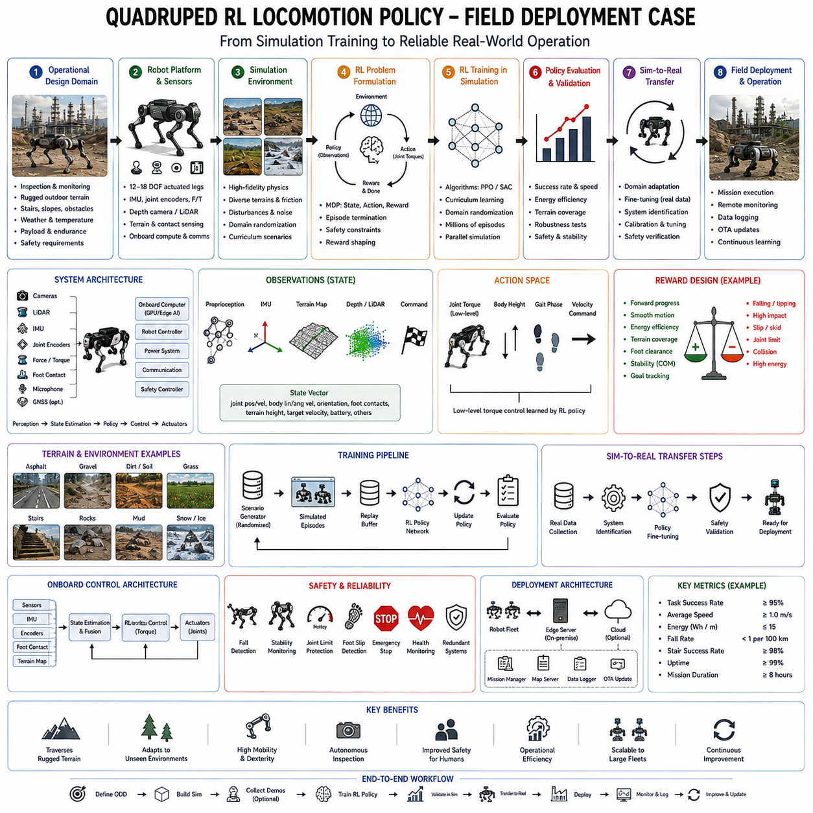{width="7.268055555555556in" height="7.268055555555556in"}

사족 보행 로봇은 생물학적 동물의 이동성과 첨단 인공지능의 컴퓨팅 능력을 결합하기 때문에 현대 물리적 AI의 가장 중요한 구현체 중 하나로 부상했습니다. 구조화된 바닥과 포장된 도로에서 탁월한 성능을 발휘하는 바퀴형 자율 이동 로봇(AMR)과 달리, 사족 보행 로봇은 울퉁불퉁한 지형을 통과하고, 계단을 오르며, 장애물을 넘고, 바위를 건너고, 숲을 걸으며, 공사 현장을 탐색하고, 바퀴가 흔히 무용지물이 되는 재난 환경에서 작동할 수 있습니다. 이러한 기능은 사족 보행 로봇을 산업 점검, 군사 물류, 수색 및 구조, 인프라 유지보수, 광업, 농업, 에너지 시설 및 과학 탐사에 가치 있게 만듭니다. 고전 로봇 공학은 수동으로 설계된 걸음걸이 제어기에 의존했던 반면, 현대의 사족 보행은 점점 더 강화학습(RL)에 의존하여 로봇이 명시적인 프로그래밍 대신 경험을 통해 매우 적 적응력 높은 보행 전략을 발견할 수 있도록 합니다. 완전한 프로덕션 배포 사례는 강화학습이 시뮬레이션 실험에서 실제 조건 하에서 지속적으로 작동할 수 있는 신뢰할 수 있는 현장 준비 완료된 보행 시스템으로 어떻게 진화하는지 보여줍니다.

정유 공장, 석유 화학 공장, 변전소, 광산 작업, 태양광 발전소, 해상 플랫폼, 철도 인프라 또는 원자력 시설과 같은 대규모 산업 시설 내에 배포된 상용 사족 보행 점검 로봇을 고려해 보십시오. 로봇은 카메라, 열 센서, LiDAR, 가스 탐지기, 마이크, 통신 장비 및 온보드 에지 AI 컴퓨터를 휴대하면서 매일 수 차례 자율 점검 임무를 수행합니다. 실험실 내부에서 수행되는 연구 시연과 달리, 프로덕션 배포는 비, 눈, 먼지, 극심한 온도, 변화하는 조명, 불규칙한 지형, 금속 계단, 자갈길, 진흙, 식생 및 지속적으로 진화하는 산업 환경에서 작동해야 합니다. 따라서 보행 정책은 모든 상위 수준의 자율 기능을 지원하는 토대가 됩니다.

엔지니어링 프로세스는 강화학습 알고리즘을 즉시 설계하는 대신 운영 설계 도메인을 정의하는 것으로 시작됩니다. 엔지니어는 최대 허용 지형 경사, 계단 기하학, 장애물 높이, 페이로드 무게, 보행 속도, 임무 기간, 작동 온도, 예상 기상 조건, 통신 가용성, 배터리 용량 및 필요한 안전 마진을 결정합니다. 정유 공장 점검을 위한 로봇은 산악 구조나 농업 모니터링을 위해 설계된 로봇과 다른 지형 특성에 직면합니다. 배포 경계를 명확하게 정의하면 최적화가 비현실적인 보편적 보행이 아니라 현실적인 운영 요구 사항에 집중되기 때문에 강화학습 효율성이 크게 향상됩니다.

사족 보행의 주요 과제 중 하나는 전신 역학의 복잡성에 있습니다. 네 발 달린 로봇은 엉덩이 관절, 무릎 관절, 신체 방향, 관성, 접촉력, 마찰, 액추에이터 역학, 서스펜션 효과 및 페이로드 변화와 관련된 수십 개의 상호 작용하는 자유도를 가집니다. 모든 움직임은 안정성을 지속적으로 변경하면서 로봇 전체의 힘 분배를 변경합니다. 가능한 모든 지형 구성을 처리할 수 있는 명시적인 수학적 제어기를 설계하는 것은 대단히 어렵습니다. 강화학습은 대신 시뮬레이션된 환경과의 반복적인 상호 작용을 통해 효과적인 보행 전략을 자동으로 발견합니다.

따라서 시뮬레이션은 첫 번째 주요 엔지니어링 단계가 됩니다. 고충실도 물리 시뮬레이터는 강체 역학, 관절 마찰, 액추에이터 특성, 접촉 역학, 발-지면 상호 작용, 충돌 거동, 센서 노이즈, 배터리 효과, 페이로드 관성 및 환경 교란을 재현합니다. 기존의 애니메이션과 달리 로봇 공학 시뮬레이션은 물리적 리얼리즘을 강조합니다. 접촉 모델링의 작은 부정확성조차 물리적 배포 중에 실패하는 학습된 거동을 생성할 수 있기 때문입니다. 따라서 엔지니어는 대규모 정책 학습이 시작되기 전에 시뮬레이션 정확도를 검증하는 데 상당한 노력을 투자합니다.

정확한 접촉 모델링은 사족 보행 시뮬레이션의 가장 중요한 측면 중 하나를 나타냅니다. 모든 보행 주기는 발 위치, 지면 반발력, 마찰 계수, 충격 역학, 미끄러짐 거동, 순응성 및 지형 변형에 의존합니다. 콘크리트 위를 걷는 것은 자갈, 진흙, 젖은 풀, 눈, 모래 또는 느슨한 바위 위를 걷는 것과 근본적으로 다릅니다. 따라서 프로덕션 시뮬레이션은 이상적인 단단한 지면을 가정하는 대신 다양한 마찰, 순응성, 거칠기 및 안정성을 가진 다양한 지형 모델을 포함합니다.

로봇의 관측 공간은 여러 감지 시스템의 정보를 통합합니다. 관절 위치, 관절 속도, 액추에이터 토크, 관성 측정 장치, 신체 방향, 각속도, 발 접촉 센서, 지형 고도 지도, 깊이 카메라, LiDAR, 고유 감각 감지, 배터리 상태, 페이로드 추정 및 명령된 내비게이션 목표가 로봇의 현재 상태를 집합적으로 설명합니다. 관측이 주로 픽셀로 구성되는 이미지 분류 작업과 달리, 사족 보행은 신체 역학이 보행 안정성을 직접 결정하기 때문에 고유 감각에 크게 의존합니다.

상태 표현은 정보의 풍부함과 컴퓨팅 효율성 사이에서 신중하게 균형을 맞춥니다. 원시 센서 측정값은 로봇 자세, 발 위치, 신체 속도, 지형 경사, 접촉 상태, 안정성 마진 및 내비게이션 목표를 설명하는 콤팩트한 특징 벡터로 변환됩니다. 잘 설계된 상태 표현은 강화학습 알고리즘이 중복된 센서 정보 대신 물리적으로 의미 있는 변수에 집중하기 때문에 학습을 가속화합니다.

행동 공간은 정책이 보행의 어떤 측면을 제어할지 결정합니다. 초기 강화학습 연구는 로우 레벨 액추에이터 토크를 직접 생성하는 경우가 많았습니다. 이 접근 방식은 최대의 유연성을 제공하지만 어려운 최적화 문제를 만들고 불안정한 거동을 생성할 수 있습니다. 프로덕션 시스템은 점점 더 계층적 제어 아키텍처를 채택하고 있습니다. 하이 레벨 강화학습 정책은 원하는 발 궤적, 신체 속도, 걸음걸이 파라미터 또는 관절 위치 목표를 생성하는 반면, 결정론적 로우 레벨 제어기는 정밀한 모터 조절을 수행합니다. 이 조합은 수십 년간의 고전 제어 공학의 이점을 누리는 동시에 강화학습 적응성을 보존합니다.

보상 엔지니어링은 보행 품질에 결정적인 역할을 합니다. 지도 학습과 달리 강화학습은 올바른 보행 거동을 설명하는 명시적인 예시를 받지 못합니다. 대신 엔지니어는 안전하지 않거나 비효율적인 움직임을 낙담시키면서 바람직한 특성을 장려하는 보상 함수를 설계합니다. 학습된 정책은 궁극적으로 이러한 경쟁 목표 간의 균형을 반영합니다.

전진은 일반적으로 주요 긍정적 보상을 제공합니다. 로봇은 할당된 목적지를 향해 효율적으로 이동함에 따라 증가하는 보상을 받습니다. 그러나 속도만 극대화하면 흔히 불안정한 달리기 거동, 과도한 에너지 소비 또는 위험한 낙상이 발생합니다. 결과적으로 수많은 추가 보상 구성 요소가 보행을 실용적인 산업 성능으로 형성합니다.

안정성은 최우선 과제 중 하나를 나타냅니다. 과도한 신체 롤, 피치 진동, 요 불안정성, 미끄러짐, 걸려 넘어짐 또는 낙상은 상당한 패널티를 받습니다. 강화학습 정책은 도전적인 지형에서 균형을 유지하면서 불필요한 신체 움직임을 최소화하는 부드러운 보행 패턴을 점진적으로 발견합니다.

에너지 효율성도 명시적으로 고려됩니다. 산업용 사족 보행 로봇은 배터리 용량이 운영 생산성을 제한하는 수 시간의 점검 임무를 자주 수행합니다. 따라서 보상 함수는 불필요한 관절 움직임, 과도한 액추에이터 토크, 반복적인 가속 및 비효율적인 걸음걸이 전환을 낙담시킵니다. 효율적인 보행은 임무 기간을 연장할 뿐만 아니라 액추에이터 가열 및 기계적 마모를 줄입니다.

발 미끄러짐은 안전한 보행을 위해 안정적인 견인력이 필수적이기 때문에 상당한 패널티를 받습니다. 시뮬레이션 동안 접촉 모델은 지면 표면에 대한 상대적인 접선 운동을 추정합니다. 정책은 자연스럽게 신체 무게를 적절하게 분배하고, 불필요한 측면 힘을 줄이며, 지면 마찰에 따라 발 배치를 적응시키는 법을 배웁니다.

부드러운 모션은 운영 안전과 센서 품질 모두에 기여합니다. 점검 페이로드에는 열화상 카메라, 광학 줌 카메라, LiDAR 스캐너, 음향 센서 및 가스 탐지 장비가 자주 포함됩니다. 과도한 진동은 감지 성능을 저하시킵니다. 결과적으로 보상 함수는 갑작스러운 신체 가속, 급격한 걸음걸이 전환 및 불필요한 진동을 penalize하여 인지 시스템에 유익한 안정적인 보행을 장려합니다.

발 여유량은 또 다른 중요한 최적화 목표가 됩니다. 발을 너무 낮게 들면 흔히 장애물과 충돌하는 반면, 과도하게 높은 다리 움직임은 에너지를 낭비하고 보행 효율성을 줄입니다. 강화학습은 장애물 회피와 에너지 보존의 균형을 맞추는 효율적인 스윙 궤적을 자연스럽게 발견합니다.

커리큘럼 학습은 정책 수렴을 크게 가속화합니다. 초기 학습은 방해물이 없는 완벽하게 평평한 지형에서 발생합니다. 안정적인 보행이 나타나면 점점 더 어려운 환경이 점진적으로 도입됩니다. 지형 거칠기, 경사 변화, 계단, 바위, 진흙, 외부 푸시, 페이로드 변경, 액추에이터 지연, 센서 노이즈 및 날씨 시뮬레이션이 학습 전반에 걸쳐 점진적으로 증가합니다. 이 단계적 진행은 처음부터 과도한 복잡성으로 최적화를 압도하는 대신 보행 기술이 체계적으로 개발될 수 있도록 합니다.

도메인 랜덤화는 또 다른 필수 프로덕션 기술을 나타냅니다. 시뮬레이션 동안 환경 속성은 지속적으로 변경됩니다. 지면 마찰, 액추에이터 특성, 페이로드 질량, 관절 댐핑, 센서 캘리브레이션, 지형 기하학, 조명 조건, 접촉 순응성, 통신 지연 및 기계적 허용 오차는 모두 에피소드 간에 무작위로 변경됩니다. 하나의 시뮬레이션 환경을 암기하는 대신, 강화학습 정책은 광범위한 환경 불확실성에 걸쳐 강력한 거동을 배웁니다. 도메인 랜덤화는 배포 중에 발생하는 시뮬레이션-현실 격차를 크게 줄입니다.

교란 주입은 견고성을 더욱 향상시킵니다. 외부 힘이 학습 중에 로봇을 예기치 않게 밀어 바람, 우발적인 인간 접촉, 불균일한 하중, 지형 붕괴 또는 예기치 않은 충격을 시뮬레이션합니다. 낙상을 통해 에피소드를 종료하는 대신 균형을 되찾는 법을 배우는 장기 보상을 극대화하는 정책으로 인해 회복 거동이 자연스럽게 나타납니다.

사족 보행에 일반적으로 채택되는 현대 강화학습 알고리즘에는 Proximal Policy Optimization, Soft Actor-Critic, Twin Delayed Deep Deterministic Policy Gradient, Advantage Actor-Critic 및 모델 기반 강화학습 접근 방식이 포함됩니다. 이 중에서 Proximal Policy Optimization은 학습 안정성, 구현 단순성, 컴퓨팅 효율성 및 다양한 로봇 플랫폼에서의 우수한 보행 성능의 균형을 맞추기 때문에 특히 인기를 얻었습니다.

대규모 병렬 시뮬레이션은 학습 시간을 크게 줄입니다. 수천 대의 가상 사족 보행 로봇이 GPU 클러스터에서 동시에 보행을 실행합니다 병렬 경험 생성은 수년간의 물리적 실험 대신 며칠 내에 수십억 개의 상호 작용 단계를 허용합니다. 액추에이터 마모, 배터리 충전, 유지보수 및 안전 제약이 실제 데이터 수집을 심각하게 제한하기 때문에 물리적 로봇만 사용하는 경우 이러한 확장성은 불가능합니다.

시뮬레이션 내에서 수렴한 후, 엔지니어는 체계적인 시뮬레이션-현실 전이를 시작합니다. 매우 정확한 시뮬레이터조차도 물리적 하드웨어를 완벽하게 재현할 수 없기 때문에 직접 배포가 성공하는 경우는 드뭅니다. 따라서 엔지니어는 액추에이터 역학, 관절 마찰, 센서 지연, 배터리 전압 효과, 페이로드 관성, 접촉 역학 및 구조적 유연성을 측정하는 상세한 시스템 식별 실험을 수행합니다. 이러한 측정은 정책을 재학습하거나 미세 조정하기 전에 시뮬레이션 충실도를 향상시킵니다.

물리적 배포는 운영 시설에 즉시 진입하는 대신 통제된 테스트 환경 내에서 시작됩니다. 실내 실험실, 실외 시험장, 인공 지형 코스, 계단, 경사로, 자갈길 및 장애물 필드를 통해 엔지니어는 시뮬레이션된 예측과 측정된 로봇 거동을 안전하게 비교할 수 있습니다. 보행 안정성, 회복 능력, 에너지 소비, 발 궤적, 액추에이터 부하 및 신체 움직임은 더 광범위한 배포 전에 광범위한 검증을 거칩니다.

런타임 안전 감독은 강화학습의 성공에도 불구하고 여전히 필수적입니다. 학습된 정책은 감독 없이 액추에이터를 직접 명령하지 않습니다. 독립적인 안전 제어기는 신체 방향, 관절 한계, 액추에이터 온도, 배터리 전압, 통신 상태, 센서 무결성 및 충돌 위험을 지속적으로 모니터링합니다. 강화학습 출력이 사전 정의된 안전 제약을 위반할 때마다 결정론적 감독자는 실행 전에 명령을 수정하거나 오버라이드합니다.

Control Barrier Functions는 점점 더 학습된 정책을 둘러싼 수학적으로 보장된 안전 엔벨로프를 제공합니다. 강화학습은 인증된 안전 지역 내에서 보행을 자유롭게 최적화할 수 있는 반면, 장벽 함수는 불안정성, 자가 충돌, 과도한 관절 부하 또는 위험한 신체 방향으로 이어질 수 있는 거동을 방지합니다. 이 하이브리드 아키텍처는 강화학습 유연성과 공식적인 안전 보장을 결합합니다.

지형 인지는 배포 중에 지속적으로 작동합니다. 깊이 카메라와 LiDAR는 다가오는 지형 기하학을 설명하는 로컬 고도 지도를 생성합니다. 시맨틱 세그멘테이션은 잔디, 콘크리트, 자갈, 계단, 진흙, 식생, 웅덩이, 바위 및 산업 인프라를 식별합니다. 고유 감각을 통해서만 반응하는 대신, 로봇은 물리적 접촉이 발생하기 전에 지형 변화를 예측하여 걸음걸이를 선제적으로 조정합니다.

고도 지도는 발디딤 계획에 특히 가치 있게 됩니다. 3차원 지형 표현은 통과 가능성, 장애물 높이, 경사 및 로컬 거칠기를 추정합니다. 강화학습 정책은 이러한 고도 지도를 관측 공간에 직접 통합하여 즉각적인 접촉 피드백에만 의존하는 대신 다가오는 지형에 따라 적응형 발 배치를 가능하게 합니다.

고유 감각은 똑같이 중요하게 유지됩니다. 관절 인코더, 힘 센서, 관성 측정 및 접촉 탐지기는 신체 역학에 대한 즉각적인 피드백을 제공합니다. 예기치 않은 발 미끄러짐, 부드러운 지면, 불안정한 바위 또는 숨겨진 장애물은 시각적 인지가 인식하기 전에도 고유 감각 감지를 통해 분명해집니다. 외반 감각과 고유 감각 정보를 통합하면 보행 견고성이 크게 향상됩니다.

운영 배포는 빈번하게 동적 걸음걸이 적응을 요구합니다. 걷기, 트롯, 페이싱, 바운딩, 계단 오르기, 웅크리기 및 장애물 디딤은 다른 지형 조건에 최적화된 고유한 보행 모드를 나타냅니다. 수동으로 설계된 걸음걸이 제어기 간을 전환하는 대신, 강화학습은 환경 요구 사항 및 임무 목표에 따라 부드러운 전환을 자동으로 배웁니다.

에너지 관리는 상업적 생존 가능성에 상당한 영향을 미칩니다. 강화학습 정책은 보행 전략을 선택할 때 배터리 상태, 임무 기간, 지형 난이도, 페이로드 무게 및 예상 이동 거리를 고려합니다. 보수적인 에너지 효율적인 걸음걸이는 점검 임무를 연장하는 반면, 고에너지의 공격적인 보행은 운영상 정당화될 때만 가용합니다.

플리트 배포는 또 다른 중요한 엔지니어링 고려 사항을 도입합니다. 대규모 산업 조직은 지리적으로 분산된 시설 전체에서 수십 또는 수백 대의 사족 보행 로봇을 동시에 운영할 수 있습니다. 플리트 전체에서 수집된 운영 로그는 신흥 실패 패턴, 특이한 지형 조건, 액추에이터 저하, 배터리 노화 및 정책 개선 기회를 식별합니다. 플리트 러닝은 한 로봇이 수집한 운영 경험이 검증 후 배포된 모든 플랫폼에 이익이 되도록 합니다.

런타임 모니터링은 보행 품질을 지속적으로 감독합니다. 신뢰도 추정, 이상 탐지, 분포 외 탐지, 센서 일관성 모니터링, 액추에이터 진단, 열 관리, 통신 무결성, 위치 추정 품질 및 지형 불확실성은 모두 운영 안전에 기여합니다. 높은 불확실성은 학습된 정책에만 독점적으로 의존하는 대신 감소된 보행 속도, 확장된 안정성 마진 또는 인간 감독 요청을 트리거합니다.

실패 분석은 지속적인 엔지니어링 활동으로 남아 있습니다. 모든 걸려 넘어짐, 미끄러짐, 회복 기동, 액추에이터 이상, 위치 추정 실패 또는 예기치 않은 지형 상호 작용은 리플레이 시스템, 센서 로그, 시뮬레이션 재구성, 정책 시각화 및 근본 원인 분석을 사용하여 체계적인 조사를 거칩니다. 엔지니어는 시정 개선 사항을 구현하기 전에 하드웨어 결함, 환경적 신규성, 센서 저하 또는 통합 문제와 강화학습 한계를 구별합니다.

지속적인 학습은 안전을 타협하지 않으면서 장기적인 운영 개선을 지원합니다. 배포 중에 직면한 어려운 지형은 추가 시뮬레이션 시나리오가 되는 반면, 검증된 운영 데이터는 미래 정책 개선에 기여합니다. 그러나 통제되지 않은 정책 수정은 용납할 수 없는 안전 위험을 도입하기 때문에 온라인 학습은 일반적으로 현장 운영 중에 직접 발생하기보다 신중하게 통제된 개발 환경 내에서 오프라인으로 발생합니다.

상위 수준 자율성과의 통합은 보행을 완전한 로봇 지능의 한 구성 요소로 변환합니다. 미션 플래너는 점검 목표를 할당하고, 위치 추정 시스템은 로봇 위치를 추정하며, 시맨틱 매핑은 인프라를 식별하고, 인지 모델은 이상을 탐지하며, 통신 시스템은 플리트 운영을 조정하고, 강화학습은 어려운 지형에서 적응형 이동성을 제공합니다. 따라서 성공적인 현장 배포는 보행 단독이 아니라 수많은 지능형 하위 시스템 간의 협력에 의존합니다.

미래의 사족 보행 로봇은 강화학습을 파운데이션 모델, 월드 모델, 비전-언어-행동 아키텍처, 예측 지형 시뮬레이션 및 장기 호라이즌 계획과 점점 더 통합할 것입니다. 단순히 안정적인 걷기를 배우는 대신, 미래 시스템은 지형 시맨틱에 대해 추론하고, 환경 진화를 예측하며, 자연어 미션 목표를 이해하고, 인간 작업자와 협력하며, 점검, 조작 및 자율 의사 결정과 보행을 공동으로 최적화할 것입니다.

궁극적으로 사족 보행을 위한 강화학습의 프로덕션 배포는 성공적인 현장 로봇 공학이 시뮬레이션 내에서 효과적인 보행 정책을 발견하는 것보다 훨씬 더 많은 것을 요구한다는 것을 증명합니다. 견고한 상용 시스템은 고충실도 물리 시뮬레이션, 커리큘럼 학습, 도메인 랜덤화, 계층적 제어, 지형 인지, 결정론적 안전 감독, 런타임 모니터링, 지속적인 검증, 플리트 러닝 및 규율 있는 시스템 엔지니어링의 통합을 통해 나타납니다. 강화학습은 사족 보행 로봇이 다양한 실제 지형을 가로지를 수 있도록 하는 적응형 지능을 제공하는 반면, 전통적인 로봇 공학 엔지니어링은 신뢰성, 안전성, 유지보수성 및 장기적인 운영 성능을 보장합니다. 이 기술들은 함께 사족 보행 로봇을 인상적인 실험실 시연에서 물리적 AI의 미래를 정의하는 어려운 환경 전반에서 지속적인 자율 운영이 가능한 실용적인 산업 플랫폼으로 변환합니다.

## 12.05 Humanoid Physical AI Multi Task Learning Case

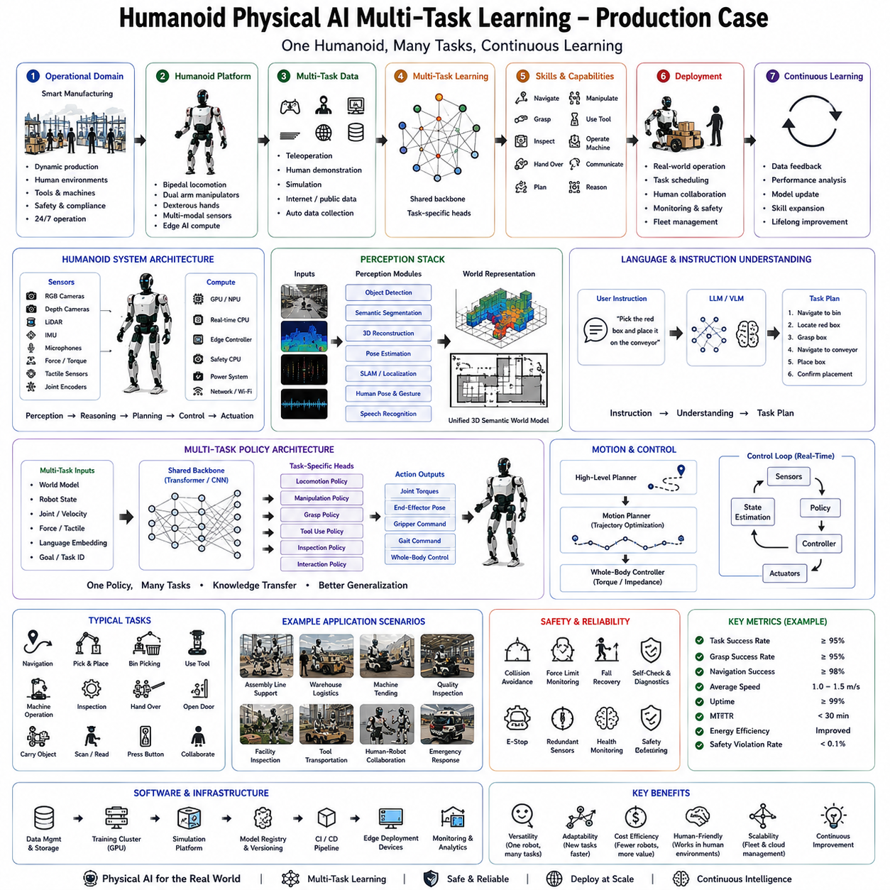{width="7.268055555555556in" height="7.268055555555556in"}

휴머노이드 로봇은 인간과 유사한 형태에 더해 다양한 작업 전반에 걸쳐 이해하고, 추론하며, 인지하고, 조작하며, 소통하고, 행동할 수 있는 인공지능을 결합하기 때문에 현대 로봇 공학에서 가장 야심 찬 목표 중 하나를 나타냅니다. 고도로 전문화된 반복 작업을 실행하는 전통적인 산업용 로봇과 달리, 휴머노이드 로봇은 원래 인간을 위해 설계된 환경에서 기능할 것으로 기대됩니다. 로봇은 건물을 통과해 걷고, 계단을 오르며, 문을 열고, 다양한 물체를 조작하고, 일반적인 도구를 사용하며, 작업자와 협력하고, 구두 지침을 이해하며, 변화하는 환경에 지속적으로 적응해야 합니다. 이러한 다재다능함을 달성하려면 탁월한 보행이나 정밀한 조작 훨씬 그 이상의 것이 필요합니다. 인지, 언어, 계획, 메모리, 추론 및 모터 제어를 통합된 의사 결정 아키텍처로 통합할 수 있는 물리적 AI가 필요합니다. 이러한 전환을 가능하게 하는 가장 중요한 기술 중 하나는 개별 작업마다 별도의 모델을 학습시키는 대신 단일 AI 시스템이 여러 물리적 기술을 동시에 획득하고 일반화할 수 있도록 하는 멀티 태스크 학습입니다.

가전제품과 산업 장비를 생산하는 현대적인 제조 시설 내부에서 작동하는 범용 휴머노이드 로봇이 포함된 프로덕션 배포 사례를 고려해 보십시오. 운송, 점검, 자재 취급, 기계 작동, 재고 관리 및 품질 관리에 서로 다른 로봇을 할당하는 대신, 단일 휴머노이드 플랫폼이 운영 요구 사항에 따라 이러한 활동 중 많은 부분을 수행합니다. 한 작업 교대 근무 동안 로봇은 워크스테이션 간에 부품을 운송하고, 생산 장비를 점검하며, 기계 부품을 조립하고, 산업 기계를 작동하며, 도구를 조작하고, 보관 선반을 정리하며, 인간 기술자와 협력하고, 구두 지침에 응답하며, 정기 유지보수 점검을 수행할 수 있습니다. 생산이 변경될 때마다 광범위한 재프로그래밍이 필요한 전통적인 자동화 시스템과 달리, 휴머노이드는 학습된 지식을 여러 관련 활동 전반에 걸쳐 적응시킵니다.

엔지니어링 목표는 단순히 하나의 벤치마크 작업에서 성능을 극대화하는 것이 아니라 작업 간에 경험을 전이할 수 있는 통합된 지능을 개발하는 것입니다. 도구를 쥐는 방법을 학습한 로봇은 조립 부품을 조작하는 데 훨씬 적은 추가 학습을 필요로 해야 합니다. 두 기술 모두 물체 기하학, 손-눈 배조, 힘 제어 및 모션 계획의 공통된 표현에 의존하기 때문입니다. 따라서 멀티 태스크 학습은 엔지니어링 노력을 줄이는 동시에 데이터 효율성, 일반화 능력 및 운영 유연성을 향상시킵니다.

프로젝트는 운영 설계 도메인을 정의하는 것으로 시작됩니다. 엔지니어는 휴머노이드가 수행해야 하는 전체 작업 모음, 환경 조건, 작업 공간 기하학, 인간 상호 작용 요구 사항, 페이로드 제한, 안전 제약, 작동 일정, 통신 인프라, 규제 표준 및 예상되는 장기적 확장을 식별합니다. 각 활동에 대해 독립적으로 최적화하는 대신, 엔지니어는 모든 작업에서 공유되는 공통적인 컴퓨팅 구조를 검색합니다. 이러한 시스템 수준의 관점은 물리적 AI를 기존의 작업 특정적 로봇 공학과 구별합니다.

휴머노이드 플랫폼 자체는 밀접하게 통합된 수많은 하위 시스템으로 구성됩니다. 보행 시스템은 안정적인 이족 보행, 계단 오르기, 회전, 균형 잡기 및 외부 교란으로부터의 회복을 제공합니다. 듀얼 매니퓰레이터 암은 여러 자유도로 정밀한 물체 취급을 제공합니다. 다지 로봇 손은 정밀 파지, 도구 조작 및 순응적 상호 작용을 지원합니다. 비전 시스템은 RGB 카메라, 스테레오 카메라, 깊이 카메라, LiDAR 및 때로는 열화상을 결합합니다. 오디오 시스템은 음성 인식과 환경 인식을 지원합니다. 힘-토크 센서, 촉각 감지, 관성 측정 장치, 관절 인코더 및 고유 감각 감지는 신체 역학과 물리적 상호 작용에 대한 지속적인 피드백을 제공합니다. 에지 컴퓨팅 하드웨어는 고성능 GPU, 전용 AI 가속기 및 여러 신경망을 동시에 실행할 수 있는 실시간 제어 프로세서를 통합합니다.

인지는 모든 후속 기능의 토대를 형성합니다. 로봇은 멀티모달 감지를 사용하여 환경을 지속적으로 관찰합니다. 물체 탐지는 도구, 기계, 작업물, 용기, 가구, 안전 장비 및 인간 동료를 식별합니다. 시맨틱 세그멘테이션은 바닥 영역, 워크스테이션, 보관 구역, 경로, 위험 구역 및 운영 장비를 분류합니다. 포즈 추정은 인간의 신체 자세, 손 움직임 및 협력적 상호 작용 기회를 식별합니다. 3차원 재구성은 작업 공간에 대한 기하학적 이해를 생성하는 반면, 동시적 위치 추정 및 지도 작성은 시설 내에서 로봇 위치를 지속적으로 추정합니다. 내비게이션이나 조작에만 집중하는 전문 로봇과 달리, 휴머노이드는 모든 물리적 활동을 지원하는 포괄적인 장면 이해를 필요로 합니다.

인지 아키텍처는 대규모 멀티모달 데이터셋을 사용하여 사전 학습된 파운데이션 비전 모델에 점점 더 의존하고 있습니다. 각 산업 애플리케이션에 대해 별도의 인지 시스템을 학습시키는 대신, 대형 비전 인코더는 내비게이션, 조작, 점검 및 인간 상호 작용 작업 전반에 걸쳐 적응할 수 있는 일반화된 시각적 표현을 배웁니다. 미세 조정은 일반화를 희생하지 않으면서 이러한 표현을 특정 운영 요구 사항에 맞게 전문화합니다.

언어 이해는 또 다른 필수 기능을 제공합니다. 작업자는 재고 운송, 장비 점검, 도구 회수, 조립 보조 또는 생산 품질 검증과 같은 구두 또는 서면 지침을 사용하여 자연스럽게 소통합니다. 대형 언어 모델은 진행 중인 활동, 운영 우선순위, 환경 제약 및 이전 상호 작용에 관한 맥락적 메모리를 유지하면서 인간의 지침을 구조화된 작업 표현으로 변환합니다. 명시적인 작업 시퀀스를 프로그래밍하는 대신, 엔지니어는 물리적 실행과 통합된 자연어 인터페이스를 통해 목표를 점점 더 정의하고 있습니다.

월드 모델은 인지와 행동을 연결하는 내부 추론 엔진 역할을 합니다. 즉각적인 센서 관측에만 반응하는 대신, 로봇은 물체 위치, 작업 공간 조직, 인간 활동, 작업 진행 상황, 사용 가능한 도구, 운영 제약 및 예상되는 미래 이벤트를 포함하여 주변 환경의 진화하는 내부 표현을 유지합니다. 이 예측적 표현은 즉각적인 반응적 제어를 훨씬 넘어서는 장기 호라이즌 계획을 지원합니다.

멀티 태스크 학습은 겉보기에 관련이 없어 보이는 활동 전반에서 공유되는 표현을 식별하는 것으로 시작됩니다. 공장을 걷고, 물체를 운반하고, 문을 열고, 기계를 작동하고, 선반을 정리하고, 조립을 보조하는 것은 모두 공통적인 지각적 이해, 신체 조화, 힘 조절 및 공간 추론을 필요로 합니다. 별도의 신경망을 독립적으로 학습시키는 대신, 통합된 백본 네트워크가 이러한 공통 표현을 배우는 한편 전문화된 출력 헤드가 작업 특정적 예측을 수행합니다.

멀티 태스크 학습의 기초가 되는 중심 가설은 여러 관련 작업을 동시에 학습하는 것이 각 작업을 독립적으로 최적화하는 것보다 더 풍부한 내부 표현을 생성한다는 것입니다. 물체 인식에 유용한 특징은 흔히 파지 계획을 향상시킵니다. 신체 위치 지정이 팔의 도달 가능성에 영향을 미치기 때문에 내비게이션 경험은 조작을 향상시킵니다. 인간 포즈 추정은 장애물 회피뿐만 아니라 협력적 조립을 지원합니다. 따라서 공유된 지식은 학습 효율성과 운영 견고성을 모두 향상시킵니다.

학습 데이터는 수많은 상호 보완적인 소스에서 기원합니다. 인간 원격 조작은 복잡한 조작과 보행의 데모를 제공합니다. 모션 캡처 시스템은 대표적인 산업 활동 중 전신 움직임을 기록합니다. 시뮬레이션 환경은 물리적으로 수집하기 불가능한 수십억 개의 상호 작용을 생성합니다. 기존의 산업용 로봇 프로그램은 구조화된 작업 지식을 기여합니다. 가상 현실 인터페이스를 사용한 인간 데모는 추가적인 멀티모달 행동 데이터를 생성합니다. 배포 중에 수집된 운영 생산 로그는 시간이 지남에 따라 학습 데이터셋을 지속적으로 확장합니다.

데이터 다양성은 가장 중요한 엔지니어링 고려 사항 중 하나를 나타냅니다. 휴머노이드는 학습 중에 수많은 작업 공간 레이아웃, 조명 조건, 물체 카테고리, 작업자 행동, 기계 구성, 생산 일정 및 환경 교란을 마주해야 합니다. 다양한 운영 상황에 대한 노출은 좁은 시나리오의 암기 대신 새로운 작업 전반에 걸친 강력한 전이를 가능하게 합니다.

시뮬레이션은 개발 비용을 줄이면서 막대한 양의 학습 경험을 제공합니다. 고충실도 디지털 트윈은 공장 기하학, 기계, 인간 작업자, 조명 조건, 물체 속성, 로봇 역학, 접촉 역학 및 센서 거동을 재현합니다. 도메인 랜덤화는 텍스처, 조명, 물체 배치, 페이로드 무게, 마찰 계수, 센서 캘리브레이션, 통신 지연 및 기계적 파라미터를 지속적으로 변경합니다. 하나의 공장 구성을 암기하는 대신, 로봇은 수많은 산업 환경 전반에 걸쳐 전이 가능한 강력한 정책을 개발합니다.

커리큘럼 학습은 최적화를 크게 향상시킵니다. 초기 학습은 서 있는 균형, 걷기, 도달하기, 쥐기 및 시각적 인지를 포함한 격리된 기능에 초점을 맞춥니다. 중간 단계는 보행과 조작, 내비게이션과 물체 인식, 언어 이해와 간단한 행동을 결합합니다. 고급 단계는 순차적 추론, 도구 사용, 협력적 조작 및 장시간 임무를 포함하는 복잡한 산업 워크플로우로 여러 기능을 통합합니다. 점진적인 작업 복잡성은 최적화 붕괴를 피하면서 안정적인 학습을 가능하게 합니다.

학습 아키텍처는 일반적으로 계층적 조직을 따릅니다. 파운데이션 인지 모델은 시맨틱 시각 표현을 추출합니다. 언어 인코더는 작업 지침을 프로세스합니다. 월드 모델은 미래의 환경 진화를 예측합니다. 작업 플래너는 장기 호라이즌 행동 목표를 생성합니다. 모션 정책은 조화된 전신 움직임을 결정합니다. 로우 레벨 제어기는 동적 제약을 만족하면서 안정적인 관절 궤적을 실행합니다. 각 레이어는 서로 다른 시간적 및 공간적 스케일에서 작동하는 동시에 학습된 잠재 표현을 통해 정보를 교환합니다.

트랜스포머 아키텍처는 어텐션 메커니즘이 비전, 언어, 고유 감각, 메모리 및 시간적 맥락 전반에서 정보를 자연스럽게 통합하기 때문에 이러한 시스템을 점점 더 지배하고 있습니다. 인지, 계획 및 제어가 대체로 독립적으로 유지되는 전통적인 모듈식 로봇 파이프라인과 달리, 트랜스포머 기반 물리적 AI는 정보가 여러 인지 프로세스 전반에 걸쳐 동시에 동적으로 흐르도록 합니다.

메모리는 멀티 태스크 학습에서 점점 더 중요한 역할을 합니다. 장기 메모리는 절차적 지식, 이전 작업 경험, 작업 공간 조직, 작업자 선호도, 도구 위치 및 역사적 운영 맥락을 저장합니다. 단기 작업 메모리는 진행 중인 조작 시퀀스, 최근 관측 및 중간 계획 상태를 추적합니다. 일화적 메모리는 이전의 성공과 실패로부터의 학습을 가능하게 하여 향후 작업 실행을 점진적으로 향상시킵니다.

행동 생성은 격리된 관절 명령을 넘어 확장됩니다. 로우 레벨 액추에이터 토크를 직접 예측하는 대신, 상위 수준 정책은 워크스테이션 접근, 부품 위치 파악, 도구 파지, 패스너 조이기, 표면 점검, 완제품 배치 또는 장비 반납과 같은 시맨틱 행동 시퀀스를 생성합니다. 모션 플래너는 후속적으로 이러한 시맨틱 목표를 동적으로 실현 가능한 전신 궤적으로 변환합니다.

전신 조화는 휴머노이드 로봇 공학을 격리된 조작 시스템과 구별합니다. 모든 팔 움직임은 신체 균형, 질량 중심, 발 배치 및 보행 안정성에 영향을 미칩니다. 무거운 부품을 운반하는 것은 로봇 전체의 동적 하중을 변경합니다. 문을 여는 것은 안정적인 자세를 유지하면서 조화된 힘 적용을 필요로 합니다. 따라서 멀티 태스크 정책은 독립적인 하위 시스템 대신 완전한 신체를 최적화합니다.

힘 제어는 또 다른 필수 기능을 나타냅니다. 산업 작업은 커넥터 삽입, 스위치 작동, 볼트 조이기, 도구 조작, 카트 밀기, 캐비닛 열기 또는 인간에게 물체 건네기를 포함하여 물리적 상호 작용을 자주 포함합니다. 시각적 인지만으로는 성공적인 상호 작용을 보장할 수 없습니다. 힘-토크 센싱, 촉각 피드백 및 순응 제어는 위치 지정 불확실성과 환경 변화에 대해 강력한 적응형 접촉 거동을 가능하게 합니다.

인간-로봇 협업은 추가적인 복잡성을 도입합니다. 휴머노이드는 주변 작업자를 지속적으로 관찰하고, 인간의 모션을 예측하며, 제스처를 해석하고, 구두 지침을 이해하며, 안전한 상호 작용 거리를 유지합니다. 멀티 태스크 학습은 내비게이션 중에 개발된 인지 지식이 협력적 조작을 지원하도록 하는 한편, 언어 이해는 명시적인 프로그래밍 없이 작업 조화를 향상시킵니다.

안전은 배포 전반에 걸쳐 가장 높은 엔지니어링 우선순위로 유지됩니다. 정교한 학습 알고리즘에도 불구하고, 결정론적 안전 감독자는 균형 안정성, 관절 한계, 충돌 위험, 인간 근접성, 힘 임계값, 열 조건, 배터리 상태, 통신 무결성 및 컴퓨팅 건전성을 지속적으로 모니터링합니다. 런타임 안전 모니터는 액추에이터 실행 전에 생성된 모든 행동을 독립적으로 검증합니다. 학습된 정책이 불안전한 거동을 제안하면, 인증된 안전 제어기가 즉시 개입합니다.

분포 외 탐지는 또 다른 운영상의 안전장치를 제공합니다. 제조 환경은 생산 라인이 변경되고, 새로운 장비가 나타나며, 작업 공간 레이아웃이 수정되고, 제품 변형이 증가함에 따라 지속적으로 진화합니다. 관측이 학습 경험과 실질적으로 다를 때, 불확실성 추정치가 증가하고 런타임 감독자는 더 느린 모션, 추가 감지 또는 인간 지원 요청과 같은 보수적인 거동을 활성화합니다.

불확실성 정량화는 운영 견고성을 더욱 향상시킵니다. 모든 인지 예측, 조작 계획, 내비게이션 결정 및 언어 해석은 관련된 신뢰도 추정치를 포함합니다. 신뢰도가 낮은 상황은 즉각적인 실행 대신 추가적인 추론, 반복적인 관측 또는 폴백 절차를 트리거합니다. 이러한 불확실성 인식은 장기 배포 신뢰성을 크게 향상시킵니다.

플리트 배포는 집단 학습의 기회를 도입합니다. 서로 다른 공장에서 작동하는 여러 휴머노이드 로봇은 중앙 집중식 모델 개선을 향해 운영 경험을 기여합니다. 한 로봇이 발견한 성공적인 조작 전략, 효율적인 내비게이션 행동, 향상된 언어 이해 및 회복 절차는 검증 및 통제된 소프트웨어 업데이트 후에 배포된 모든 시스템에서 가용해집니다. 따라서 조직적 지식은 분산된 운영 경험을 통해 지속적으로 성장합니다.

성능 평가는 벤치마크 정확도를 훨씬 넘어 확장됩니다. 엔지니어는 작업 완료율, 보행 안정성, 조작 정밀도, 에너지 효율성, 사이클 타임, 협업 품질, 언어 이해 정확도, 런타임 지연, 실패 회복 능력, 인간 개입 빈도, 안전 이벤트, 하드웨어 활용도 및 장기 신뢰성을 측정합니다. 개별 작업은 별도의 평가를 받는 반면 통합된 워크플로우는 전반적인 운영 생산성을 평가합니다.

실패는 여러 인지 시스템 간의 상호 작용에서 나타날 수 있기 때문에 실패 분석은 점점 더 정교해집니다. 성공하지 못한 조작 작업은 인지 오류, 언어 오해, 부정확한 월드 모델링, 조작 불안정성 또는 계획 실패에서 기원할 수 있습니다. 포괄적인 로깅은 센서 관측, 내부 모델 상태, 추론 체인, 신뢰도 추정치, 행동 시퀀스 및 런타임 개입을 기록하여 체계적인 근본 원인 분석을 가능하게 합니다.

지속적인 학습은 운영 안정성을 보존하면서 배포 후 점진적인 개선을 지원합니다. 생산 중에 직면한 어려운 상황은 검증 및 주석 추가 후에 추가 학습 데이터가 됩니다. 그러나 산업 안전 요구 사항은 배포 전에 예측 가능하고 철저히 검증된 거동을 요구하기 때문에 정책 업데이트는 제한 없는 온라인 적응 대신 통제된 오프라인 재학습을 통해 발생합니다.

파운데이션 모델은 휴머노이드 물리적 AI를 계속해서 변환하고 있습니다. 격리된 산업 작업을 독립적으로 학습하는 대신, 미래의 시스템은 공장, 창고, 병원, 공사 현장, 소매 환경 및 가정 환경 전반에 걸쳐 전이 가능한 일반화된 물리적 지능을 개발할 것입니다. 기계를 조립하면서 획득한 경험은 가구 조작, 도구 사용, 유지보수 작업 또는 의료 보조를 향상시킬 수 있습니다. 모두 공유된 물리적 추론에 의존하기 때문입니다.

미래의 휴머노이드 시스템은 통합된 인지 아키텍처 내에서 강화학습, 모방 학습, 자기 지도 학습, 언어 모델링, 월드 모델, 인과 추론 및 평생 학습을 점점 더 통합할 것입니다. 인지, 계획, 조작 및 소통을 구별하는 대신, 이러한 기능은 물리적 환경 전반에서 유연한 일반 지능을 지원하는 공유된 표현에서 나타날 것입니다.

궁극적으로 멀티 태스크 학습을 통한 휴머노이드 물리적 AI의 프로덕션 배포는 전문화된 자동화에서 범용 체화된 지능을 향한 로봇 공학의 근본적인 전환을 증명합니다. 보행, 조작, 내비게이션, 점검, 언어 이해 및 협업을 위한 독립적인 솔루션을 엔지니어링하는 대신, 엔지니어는 공유된 표현과 지속적인 경험을 통해 다양한 기술을 획득할 수 있는 통합된 학습 아키텍처를 점점 더 개발하고 있습니다. 성공적인 배포는 첨단 신경망뿐만 아니라 포괄적인 데이터셋, 현실적인 시뮬레이션, 계층적 계획, 결정론적 안전 감독, 런타임 모니터링, 불확실성 추정, 지속적인 검증 및 규율 있는 시스템 엔지니어링에 의존합니다. 멀티 태스크 학습은 휴머노이드 로봇을 격리된 기능의 모음에서 실제 산업 활동의 엄청난 다양성 전반에 걸쳐 유연하게 적응할 수 있는 통합된 지능형 에이전트로 변환합니다. 물리적 AI가 점점 더 유능한 체화된 지능을 향해 계속 발전함에 따라, 멀티 태스크 학습은 휴머노이드 로봇이 제조, 물류, 의료, 인프라 및 수많은 미래 애플리케이션 도메인 전반에서 인간과 함께 유용하고 신뢰할 수 있으며 안전한 작업을 수행할 수 있도록 하는 기초 기술 중 하나로 남을 것입니다.

## 12.06 Cargo UAV AI Based Obstacle Avoidance Case

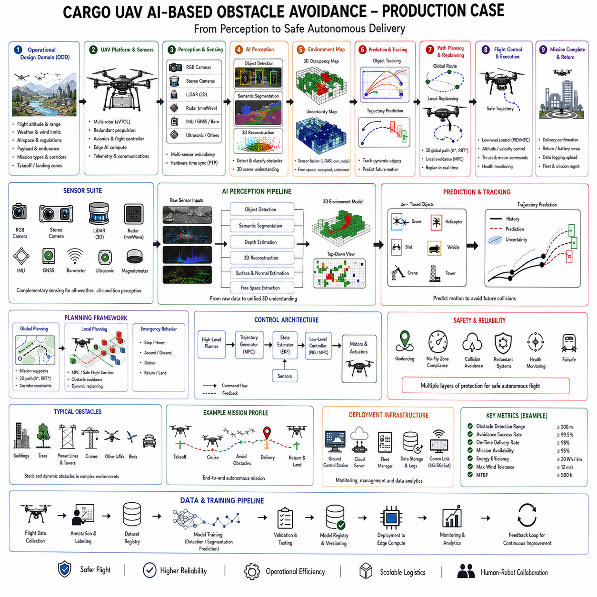{width="7.268055555555556in" height="7.268055555555556in"}

자율 물류의 급격한 성장은 화물 무인 항공기(Cargo UAV)의 역할을 실험적인 연구 플랫폼에서 의료 물품, 산업 부품, 농산물, 비상 장비 및 상업용 제품을 기존의 지상 운송이 비효율적이거나 불가능한 환경 전체로 배송할 수 있는 실용적인 운송 시스템으로 확장했습니다. 도로와 공장 바닥에서 작동하는 실내 로봇이나 자율 이동 로봇과 달리, 화물 무인 항공기는 차량 앞뿐만 아니라 위, 아래 및 주변에도 장애물이 존재하는 완전한 3차원 환경 내에서 기능합니다. 나무, 건물, 전신주, 통신 탑, 송전선, 이동 중인 항공기, 새, 건설 크레인, 기상 현상 및 동적인 공역 제한은 안전한 비행에 지속적으로 영향을 미칩니다. 결과적으로 AI 기반 장애물 회피는 신뢰할 수 있는 자율 화물 운송을 가능하게 하는 가장 중요한 기술 중 하나가 되었습니다. 프로덕션 배포 사례는 인공지능, 인지 시스템, 예측 계획 및 안전 공학이 어떻게 협력하여 무인 항공기 연구를 상업적으로 배포 가능한 자율 물류 플랫폼으로 변환하는지 보여줍니다.

제조 단지, 창고, 병원, 항만, 해상 시설, 스마트 시티 또는 원격 인프라를 지원하는 산업 물류용으로 설계된 중형 화물 무인 항공기를 고려해 보십시오. 항공기는 임무 요구 사항에 따라 수 킬로그램에서 100킬로그램 이상의 페이로드를 운반하며 중복성과 정밀한 비행 제어를 위해 여러 개의 전기 추진 장치를 채택합니다. 주로 인간 조종사에 의존하는 레크리에이션용 드론과 달리, 이 화물 플랫폼은 인간의 개입을 최소화하면서 이륙, 내비게이션, 장애물 회피, 패키지 배송, 복귀 비행 및 충전을 포함한 완전한 자율 임무를 수행합니다. 일일 운영은 엄격한 항공 안전 요구 사항을 만족하는 동시에 변화하는 기상 조건 하에서 다양한 환경을 통과하는 수백 번의 자율 비행을 포함합니다.

엔지니어링 프로세스는 운영 설계 도메인을 정의하는 것으로 시작됩니다. 엔지니어는 허용 비행 고도, 운영 기상 조건, 최대 풍속, 페이로드 제한, 통신 인프라, 비행 회랑, 비상 착륙 위치, 공역 분류, 장애물 밀도, 도시 또는 농촌 배포 환경, 규제 제한 및 예상 임무 기간을 결정합니다. 모든 곳에서 제한 없는 자율 비행을 시도하는 대신, 프로덕션 시스템은 명확하게 정의된 운영 경계에 맞춰 구체적으로 AI 모델을 최적화합니다. 이 규율 있는 엔지니어링 접근 방식은 인공지능이 실제 상업 운영을 대표하는 조건을 사용하여 학습되고 검증되기 때문에 배포 신뢰성을 크게 향상시킵니다.

장애물 회피는 일반적인 내비게이션과 근본적으로 다릅니다. 전통적인 웨이포인트 내비게이션은 임무 계획 후 경로가 유효하게 유지되는 정적인 환경을 가정합니다. 실제 화물 무인 항공기는 대신 지속적으로 변화하는 공역 내에서 작동합니다. 건설 크레인이 예기치 않게 움직이고, 새가 비행 궤적을 바꾸며, 헬리콥터가 운영 회랑에 진입하고, 날씨가 급격히 진화하며, 임시 비행 금지 구역이 나타나고, 통신 품질이 변동합니다. 따라서 장애물 회피 시스템은 모든 비행 전반에 걸쳐 지속적으로 인지하고, 예측하며, 추론하고, 반응해야 합니다.

인지 아키텍처는 모든 작동 조건 하에서 단일 센서가 독점적으로 신뢰할 수 상태를 유지할 수 없기 때문에 여러 상호 보완적인 감지 모달리티를 통합합니다. 고해상도 RGB 카메라는 시맨틱 장면 이해와 물체 인식을 제공합니다. 스테레오 카메라는 쌍안 비전을 통해 깊이를 추정합니다. LiDAR는 주변 조명과 독립적으로 정밀한 3차원 기하학적 측정을 생성합니다. 밀리미터파 레이더는 광학 시스템이 신뢰할 수 없게 되는 안개, 비 또는 먼지 속에서 장애물을 탐지합니다. 초음파 센서는 착륙 중에 보조하는 반면, 관성 측정 장치, GNSS 수신기, 기압계, 자력계 및 대기 속도 센서는 차량 상태를 지속적으로 추정합니다. 센서 다양성은 각 모달리티가 다른 모달리티의 한계를 보완하기 때문에 견고성을 실질적으로 향상시킵니다.

센서 동기화는 중요한 엔지니어링 과제를 나타냅니다. 카메라 프레임, LiDAR 포인트 클라우드, 레이더 리턴, 관성 측정 및 GPS 업데이트는 서로 다른 레이턴시와 서로 다른 주파수로 도착합니다. Precision Time Protocol 또는 전용 트리거 시스템을 사용한 하드웨어 동기화는 관측치가 동일한 물리적 순간에 대응하도록 보장하여 센서 퓨전 중 불일치를 방지합니다. 무인 항공기가 위치와 방향을 지속적으로 변경하기 때문에 작은 동기화 오류조차 고속 비행 중에 부정확한 장애물 위치 파악을 생성할 수 있습니다.

AI 프로세싱의 첫 번째 단계는 인지를 포함합니다. 물체 탐지 네트워크는 건물, 나무, 전신주, 송전탑, 통신 마스트, 크레인, 다리, 차량, 새, 헬리콥터, 드론, 풍선 및 기타 공중 물체를 식별합니다. 시맨틱 세그멘테이션은 지형, 식생, 도로, 수면, 옥상, 제한 구역 및 잠재적 착륙 구역을 분류합니다. 인스턴스 세그멘테이션은 겹치는 장애물을 분리하는 반면, 깊이 추정은 3차원 장면 기하학을 재구성합니다. 기존의 컴퓨터 비전 벤치마크와 달리, 무인 항공기 인지는 회피 결정이 충돌 위험이 심각해지기 전에 충분한 반응 시간을 요구하기 때문에 장거리 탐지를 강조합니다.

3차원 환경 재구성은 내비게이션을 위한 기하학적 토대를 제공합니다. 센서 퓨전은 LiDAR, 스테레오 비전, 레이더, 관성 측정 및 위치 추정치를 빈 공간, 점유된 영역 및 불확실성을 표현하는 지속적으로 업데이트되는 점유 지도에 결합합니다. 이러한 지도는 새로운 관측치가 가용해짐에 따라 비행 전반에 걸쳐 진화합니다. 동적 물체는 정적인 위치 대신 예측된 궤적을 유지하므로, 계획 알고리즘은 장애물이 접근한 후에만 반응하는 대신 미래의 충돌을 예상할 수 있습니다.

데이터셋 수집은 개발 중 가장 큰 엔지니어링 노력 중 하나를 나타냅니다. 프로덕션 센서가 장착된 프로토타입 무인 항공기는 도시, 교외, 산업, 농업, 해안, 산악 및 농촌 환경 전반에서 수천 비행 시간을 기록합니다. 데이터 수집은 서로 다른 계절, 기상 조건, 조명 변화, 풍속, 페이로드 구성 및 비행 고도에 걸쳐 있습니다. 모든 비행은 동기화된 RGB 이미지, 깊이 정보, LiDAR 스캔, 레이더 리턴, GPS 측정, 관성 데이터, 액추에이터 명령, 기상 정보, 통신 품질, 배터리 상태 및 운영 로그를 기록합니다.

데이터 주석 추가는 일반적인 물체 라벨링을 넘어 확장됩니다. 엔지니어는 장애물 카테고리, 3차원 바운딩 볼륨, 모션 궤적, 충돌 위험 수준, 시맨틱 공역 영역, 비행 회랑 경계, 안전한 착륙 위치, 환경적 위험, 기상 조건 및 회피 기동을 식별합니다. 움직이는 장애물은 격리된 프레임별 인식 대신 궤적 예측을 요구하기 때문에 시간적 일관성이 특히 중요하게 유지됩니다.

데이터 품질 보증은 모델 학습 전에 손상된 기록, 동기화 실패, GPS 아노말리, 센서 캘리브레이션 오류, 통신 중단 및 불완전한 비행 세그먼트를 제거합니다. 통계 분석은 장애물 카테고리, 환경 조건, 지리적 지역, 비행 고도, 기상 시나리오, 그리고 비상 헬리콥터, 크레인, 예기치 않은 새 또는 임시 건설 활동과 같은 드물지만 안전에 중요한 상황 전반에 걸쳐 충분한 표현을 검증합니다.

파운데이션 비전 모델은 인지 백본을 점점 더 제공하고 있습니다. 대규모 자기 지도 사전 학습은 수많은 항공 인지 작업 전반에 걸쳐 전이 가능한 일반화된 시각적 표현을 생성합니다. 미세 조정은 이러한 표현을 화물 무인 항공기 환경 내의 장애물 탐지, 시맨틱 세그멘테이션, 깊이 추정 및 장면 이해에 맞게 적응시킵니다. 처음부터 개별 모델을 학습시키는 것과 비교하여, 파운데이션 모델은 데이터 요구 사항을 줄이면서 일반화를 향상시킵니다.

충돌 위험이 물체 위치뿐만 아니라 미래 모션에도 의존하기 때문에 장애물 탐지 자체만으로는 안전한 내비게이션에 불충분합니다. 따라서 예측 궤적 추정은 AI 파이프라인의 필수 구성 요소가 됩니다. 순환 신경망, 트랜스포머, 그래프 신경망 또는 월드 모델은 역사적 관측, 환경적 맥락 및 모션 역학을 기반으로 동적 장애물에 대한 가능성 있는 미래 궤적을 추정합니다. 새, 헬리콥터, 이웃 드론 및 건설 장비는 모두 다른 예측 전략을 요구하는 고유한 움직임 패턴을 보입니다.

내부 월드 모델은 인지를 시간적 추론과 지속적으로 통합합니다. 현재 관측치만 저장하는 대신, 무인 항공기는 장애물 모션, 환경적 불확실성, 날씨 진화, 통신 품질 및 임무 진행 상황을 설명하는 주변 공역의 예측적 표현을 유지합니다. 이 월드 모델은 계획 시스템이 회피 기동을 선택하기 전에 여러 가능한 미래 시나리오를 평가할 수 있도록 합니다.

계획 알고리즘은 계층적으로 작동합니다. 상위 수준 미션 플래너는 규제 공역 제한을 준수하면서 출발지와 목적지를 연결하는 전략적 경로를 결정합니다. 로컬 플래너는 새로 인지된 장애물에 따라 이러한 경로를 지속적으로 수정합니다. 강화학습, 최적화 기반 궤적 생성, 샘플링 기반 계획 및 모델 예측 제어가 이 계층적 아키텍처 내에서 협력합니다. 인공지능은 적응형 의사 결정을 기여하는 반면, 결정론적 계획은 동적 실현 가능성과 비행 제약 조건 준수를 보장합니다.

장애물 회피 정책은 일반적으로 여러 목표를 동시에 최적화합니다. 임무 완료도 중요하게 유지되지만, 장애물과의 안전 분리는 실질적으로 훨씬 더 높은 우선순위를 받습니다. 추가 목표에는 비행 시간 최소화, 에너지 소비 감소, 승객 또는 화물 안정성 유지, 통신 품질 보존, 비행 금지 규정 만족, 악천후 회피, 필요한 경우 비상 착륙을 위한 충분한 배터리 예비 전력 확보가 포함됩니다. 따라서 다목적 최적화는 안전과 운영 효율성의 균형을 맞춥니다.

실제 충돌 시나리오를 수집하는 것은 금지될 정도로 위험하고 비용이 많이 들기 때문에 시뮬레이션은 개발 전반에 걸쳐 중심적인 역할을 합니다. 고충실도 디지털 트윈은 지형, 건물, 식생, 날씨, 공기역학, 센서 특성, 통신 레이턴시, 장애물 모션 및 무인 항공기 역학을 재현합니다. 도메인 랜덤화는 조명, 바람, 난류, 센서 캘리브레이션, 장애물 밀도 및 환경 외관을 지속적으로 변경하여 다양한 배포 조건 전반에 걸쳐 강력한 정책을 장려합니다.

물리 시뮬레이션은 지상 로봇에는 없는 공기역학적 효과를 포함합니다. 돌풍, 난류, 프로펠러 상호 작용, 페이로드 진동, 항력 변화, 배터리 전압 변화, 액추에이터 포화 및 대기 교란은 비행 역학에 실질적으로 영향을 미칩니다. 이러한 현상의 정확한 시뮬레이션은 가상 환경에서 실제 무인 항공기 운영으로의 전이를 향상시킵니다.

커리큘럼 학습은 정책 개발을 크게 가속화합니다. 초기 학습은 이상적인 기상 조건 하에서 희소한 정적 장애물에 무인 항공기를 노출시킵니다. 후속 단계는 더 밀집된 환경, 움직이는 장애물, 가변적인 바람, 센서 노이즈, 통신 저하 및 점점 더 복잡한 도시 공역을 도입합니다. 이 점진적인 학습 전략은 초기 단계 동안 최적화를 압도하지 않으면서 안정적인 정책 수렴을 가능하게 합니다.

신뢰할 수 있는 장애물 회피가 클라우드 연결에만 독점적으로 의존할 수 없기 때문에 런타임 추론은 전적으로 온보드에서 발생합니다. 임베디드 GPU 또는 전용 AI 가속기가 장착된 고성능 에지 컴퓨팅 플랫폼은 엄격한 실시간 제약 하에서 인지, 예측, 계획, 위치 추정 및 제어를 동시에 실행합니다. TensorRT, ONNX Runtime, 양자화, 그래프 최적화 및 연산자 퓨전을 통한 하드웨어 최적화는 예측 정확도를 보존하면서 추론 레이턴시를 최소화합니다.

런타임 안전 모니터링은 모든 AI 생성 비행 명령을 감독합니다. 신뢰도 추정이 인지 예측과 동반되는 한편, 불확실성 정량화는 모델 신뢰성을 지속적으로 평가합니다. 분포 외 탐지는 학습 경험과 실질적으로 다른 환경 상황을 식별합니다. 런타임 감독자는 제어 명령이 비행 제어기에 도달하기 전에 계획된 궤적을 결정론적 안전 제약 조건과 비교합니다. 학습된 정책이 불안전한 기동을 제안하면, 인증된 안전 제어기가 해당 행동을 즉시 수정하거나 거부합니다.

지오펜싱은 결정론적 보호의 추가 레이어를 제공합니다. 가상 경계는 공항, 민감한 인프라, 인구 밀집 지역 또는 제한 시설을 둘러싼 금지 지역을 정의합니다. AI 권장 사항과 관계없이 무인 항공기는 지오펜싱이 학습 알고리즘과 독립적으로 작동하기 때문에 이러한 경계를 위반할 수 없습니다. 동적 지오펜스는 추가적으로 비상 운영이나 공공 행사로 인해 도입된 임시 제한을 수용합니다.

중복 인지는 운영 안전을 크게 향상시킵니다. 카메라, LiDAR, 레이더 및 관성 감지가 장애물 위치를 독립적으로 추정합니다. 센서 불일치는 낙관적인 해석 대신 증가된 주의를 트리거합니다. 폭우나 안개 속에서 광학 센서가 신뢰할 수 없게 되더라도 레이더와 LiDAR는 조건이 개선될 때까지 보수적인 내비게이션을 지원하기에 충분한 상황 인식을 유지합니다.

날씨 인식은 많은 실험실 시연에는 없는 또 다른 필수 기능을 나타냅니다. 풍속 추정, 강수 탐지, 가시성 평가, 난류 예측, 착빙 위험 추정 및 번개 회피는 모두 안전한 비행 계획에 기여합니다. AI 모델은 기상 관측을 온보드 센서 데이터와 통합하여 환경 조건이 위험해지기 전에 선제적인 경로 수정을 가능하게 합니다.

통신 모니터링은 자율 인지를 보완합니다. 셀룰러 네트워크, 위성 통신, 전용 산업용 무선 인프라 및 메쉬 네트워킹은 명령, 원격 측정 및 플리트 조율을 제공합니다. 비상 절차가 가용한 연결성에 의존하기 때문에 통신 저하는 내비게이션 전략에 영향을 미칩니다. 무인 항공기는 신호 품질을 지속적으로 평가하여 실용적일 때마다 통신을 보존하는 경로를 선택합니다.

플리트 관리는 여러 화물 무인 항공기 간의 조화된 운영을 가능하게 합니다. 중앙 집중식 시스템은 배송 임무를 할당하고, 항공기 건전성을 모니터링하며, 공역 사용을 조율하고, 충전을 예약하며, 소프트웨어 업데이트를 배포하고, 운영 데이터를 수집합니다. 개별 장애물 회피 정책은 자율적으로 유지되는 반면, 플리트 지능은 수많은 동시 비행 전반에 걸쳐 전반적인 물류 성능을 최적화합니다.

지속적인 운영 데이터 수집은 장기적인 개선을 지원합니다. 모든 비행은 센서 관측, AI 예측, 장애물 조우, 회회 기동, 기상 조건, 통신 품질, 배터리 성능 및 안전 개입을 기록합니다. 엔지니어는 운영 로그를 체계적으로 분석하여 반복되는 실패 패턴, 신흥 환경 변화 및 인지 모델이나 계획 알고리즘 개선 기회를 식별합니다.

실패 분석은 인지 실패, 위치 추정 오류, 통신 중단, 날씨 효과, 하드웨어 저하, 소프트웨어 통합 문제 및 예기치 않은 환경적 신규성을 구별합니다. 리플레이 시스템은 동기화된 센서 기록을 사용하여 완전한 임무를 재구성하므로, 엔지니어는 오프라인에서 시각화, 해석 가능성 방법 및 근본 원인 분석을 적용하면서 사고를 재현할 수 있습니다. 시정 조치에는 데이터셋 확장, 모델 재학습, 센서 재캘리브레이션, 알고리즘 개선 또는 업데이트된 안전 제약 조건이 포함될 수 있습니다.

화물 무인 항공기가 통제 공역 내에서 작동하기 때문에 인증 및 규제 준수는 특히 중요한 역할을 합니다. 문서화는 데이터셋, AI 모델, 소프트웨어 버전, 운영 로그, 검증 절차, 런타임 모니터링, 유지보수 일정, 사이버 보안 보호 및 안전 분석을 다룹니다. AI 라이프사이클 전반에 걸친 추적 가능성은 규제 검토와 장기 시스템 유지보수를 모두 지원합니다.

자율 항공기가 통신, 내비게이션 및 소프트웨어 무결성에 크게 의존하기 때문에 사이버 보안은 증가하는 관심을 받고 있습니다. 보안 부트, 암호화된 통신, 인증된 소프트웨어 업데이트, 침입 탐지, GNSS 스푸핑 방지, 센서 인증 및 런타임 무결성 모니터링은 비행 안전을 손상시킬 수 있는 악의적인 간섭을 방지합니다.

미래의 화물 무인 항공기는 비전-언어-행동 모델, 파운데이션 월드 모델, 멀티모달 추론 및 협력적 군집 지능을 점점 더 통합할 것입니다. 단순히 반응적으로 장애물을 피하는 대신, 미래 시스템은 임무 목표에 대해 추론하고, 장기적인 공역 진화를 예측하며, 이웃 항공기와 협력 비행 경로를 협상하고, 자연어 지침을 해석하며, 진화하는 물류 네트워크에 자율적으로 적응할 것입니다.

궁극적으로 화물 무인 항공기를 위한 AI 기반 장애물 회피의 프로덕션 배포는 성공적인 자율 항공 물류가 첨단 인지, 예측 월드 모델링, 지능형 계획, 센서 퓨전, 런타임 안전 감독, 결정론적 비행 제어, 지속적인 학습, 포괄적인 검증 및 규율 있는 시스템 엔지니어링의 통합에 의존한다는 것을 증명합니다. 인공지능은 전통적인 프로그래밍만으로는 불가능한 적응형 인지 및 의사 결정 기능을 제공하는 반면, 확립된 항공우주 공학은 안전성, 신뢰성, 중복성, 인증 및 운영 견고성을 보장합니다. 이 기술들은 함께 화물 무인 항공기를 실험적인 비행 로봇에서 산업 물류, 비상 대응, 인프라 점검, 의료 배송 및 물리적 AI 가능 항공 모빌리티의 급격히 확장되는 생태계를 지원할 수 있는 실용적인 자율 운송 플랫폼으로 변환합니다.

## 12.07 Edge AI Optimization Latency 50pct Reduction Case

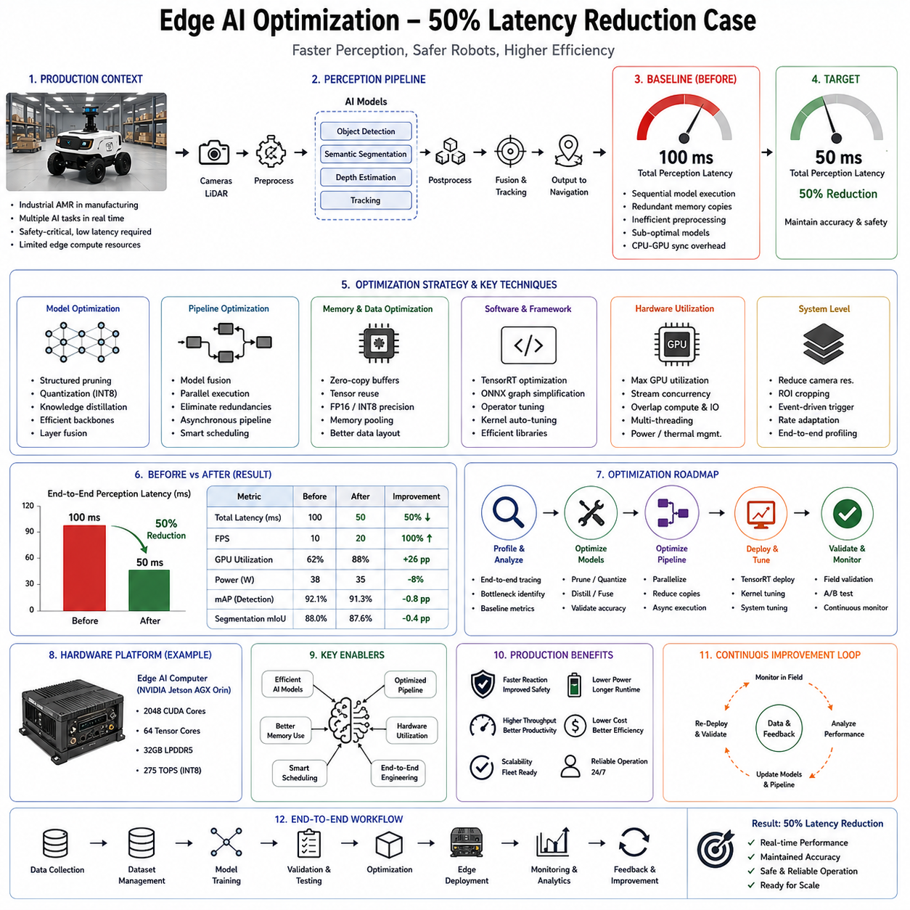{width="7.268055555555556in" height="7.268055555555556in"}

에지 인공지능(Edge AI)은 현대의 자율 로봇이 실제 환경에서 안전하고 효율적으로 작동할 수 있도록 지원하는 가장 중요한 기술 중 하나가 되었습니다. 클라우드 컴퓨팅은 거대한 컴퓨팅 자원을 제공하지만, 많은 로봇 애플리케이션은 통신 지연, 네트워크 불안정성, 대역폭 제한, 개인정보 보호 우려, 그리고 운영 안전상의 이유로 즉각적인 로컬 의사 결정을 필요로 하기 때문에 원격 서버에 의존할 수 없습니다. 자율 이동 로봇(AMR), 휴머노이드 로봇, 산업용 매니퓰레이터, 사족 보행 점검 로봇, 자율주행 차량, 화물 UAV는 모두 실시간으로 인지, 위치 추정, 계획, 조작 및 제어를 실행하기 위해 온보드 에지 컴퓨팅 플랫폼에 크게 의존합니다. 그러나 딥러닝 모델이 점점 더 정교해짐에 따라, 컴퓨팅 요구량은 임베디드 하드웨어 성능보다 훨씬 빠르게 증가합니다. 벤치마크 정확도가 뛰어난 모델이라도 추론 지연으로 인해 로봇의 적시 반응이 방해받는다면 실용성이 떨어질 수 있습니다. 결과적으로 에지 AI 최적화는 예측 품질을 보존하면서 추론 효율성을 극대화하는 데 초점을 맞춘 필수적인 엔지니어링 분야가 되었습니다. 본 프로덕션 사례는 한 상용 로봇 플랫폼이 체계적인 최적화를 통해 운영 정확도를 크게 희생하지 않으면서 엔드투엔드(end-to-end) AI 추론 지연을 약 50% 성공적으로 감소시킨 방법을 살펴봅니다.

고려 중인 프로덕션 시스템은 생산 라인, 창고, 점검 스테이션, 조립 구역 간에 자재를 운송하는 역할을 담당하는 대형 제조 시설 내에 배포된 산업용 자율 이동 로봇입니다. 이 로봇은 여러 작업 교대 근무 동안 지속적으로 작동하면서 동시적 위치 추정 및 지도 작성(SLAM), 물체 탐지, 시맨틱 세그멘테이션, 장애물 회피, 인간 탐지, 자유 공간(free-space) 추정, 경로 계획 및 플리트 통신을 수행합니다. 인지 하위 시스템은 처음에 임베디드 GPU 플랫폼에서 순차적으로 실행되는 여러 개의 독립적으로 학습된 심층 신경망에 의존했습니다. 실험실 평가에서는 우수한 탐지 정확도를 보여주었지만, 배포 결과 소프트웨어 스택에 추가적인 AI 기능이 통합됨에 따라 전체 인지 지연이 점차 증가한 것으로 나타났습니다. 누적된 추론 파이프라인은 각 센서 프레임을 처리하는 데 약 100밀리초를 필요로 하여, 실질적인 주행 속도를 제한하고 동적 장애물이 나타났을 때 가용한 반응 시간을 감소시켰습니다.

엔지니어링 목표는 단순히 하나의 신경망을 가속화하는 것을 넘어 확장되었습니다. 프로덕션 로봇은 센서 획득, 이미지 전처리, 신경망 추론, 후처리, 좌표 변환, 센서 퓨전, 장애물 추적 및 메시지 통신을 포함하는 완전한 인지 파이프라인을 실행합니다. 따라서 전체 지연을 최적화하려면 모델 실행에만 배독적으로 집중하기보다 모든 컴퓨팅 단계에 대한 면밀한 분석이 필요했습니다. 엔지니어들은 동등한 주행 안전성, 탐지 정확도 및 운영 신뢰성을 유지하면서 전체 인지 지연을 약 50% 줄이는 목표를 설정했습니다.

최적화 프로젝트는 포괄적인 성능 프로파일링으로 시작되었습니다. 엔지니어들은 신경망이 지배적인 컴퓨팅 병목 구간이라고 가정하는 대신, 고해상도 타이밍 측정 기술을 사용하여 모든 소프트웨어 구성 요소를 계측했습니다. 카메라 획득 지연, 이미지 디코딩, 메모리 전송, 전처리 연산, 추론 실행, 후처리, 통신 오버헤드, GPU 활용도, CPU 스케줄링, 동기화 지연 및 미들웨어 메시지 전달이 독립적으로 측정되었습니다. 상세한 프로파일링 결과 추론은 전체 실행 시간의 일부만 소비하는 것으로 밝혀졌습니다. 상당한 지연은 반복적인 메모리 할당, 이미지 포맷 변환, 불필요한 텐서 복사, 순차적 파이프라인 실행, 그리고 CPU-GPU 동기화 오버헤드에서도 기인했습니다.

이러한 관찰은 최적화 전략을 근본적으로 바꾸었습니다. 엔지니어들은 신경망을 즉시 교체하는 대신, 지연을 완전한 인지 아키텍처의 창발적 특성으로 바라보는 시스템 엔지니어링 관점을 채택했습니다. 불필요한 메모리 전송, 소프트웨어 추상화 레이어, 동기화 장벽 또는 중복 컴퓨팅의 모든 요소가 엔드투엔드 지연에 기여했습니다. 결과적으로 의미 있는 개선을 달성하려면 하드웨어, 소프트웨어, 모델 아키텍처 및 배포 인프라 전반에 걸친 조화로운 최적화가 필요했습니다.

인지 파이프라인은 연속적으로 실행되는 여러 신경망으로 구성되었습니다. 물체 탐지 모델은 작업자, 지게차, 팔레트, 선반, 로봇 및 장비를 식별했습니다. 시맨틱 세그멘테이션은 통행 가능한 바닥 영역을 장애물 및 제한 구역과 구별했습니다. 가벼운 깊이 추정 네트워크는 자유 공간 분석을 위한 기하학적 이해를 향상시켰습니다. 추가적인 추적 알고리즘은 연속된 프레임 간의 탐지 결과를 연관시켰고, 위치 추정 소프트웨어는 시각 정보를 LiDAR 관측치와 융합했습니다. 각 구성 요소는 개별적으로 잘 작동했지만, 순차적 실행으로 인해 상당한 지연이 누적되었습니다.

첫 번째 최적화 단계는 컴퓨팅 그래프 분석에 중점을 두었습니다. 엔지니어들은 모든 신경망 레이어를 검사하여 실행 시간에 불균형적으로 기여하는 연산을 식별했습니다. 극도로 큰 특징 맵(feature maps)을 가진 컨볼루션 레이어, 중복된 활성화 함수, 비효율적인 텐서 형태 변형(reshape) 연산, 불사용 층 정규화 레이어가 최적화 후보가 되었습니다. 현대의 딥러닝 프레임워크가 많은 컴퓨팅 그래프를 자동으로 최적화하지만, 프로덕션 배포에는 수년간의 점진적 개발 동안 누적된 레거시 구성 요소가 종종 포함되어 있습니다. 따라서 그래프 단순화는 더 정교한 최적화 기술이 도입되기 전에 즉각적인 성능 향상을 이끌어냈습니다.

모델 아키텍처 정제는 다음 단계를 나타냈습니다. 원래의 물체 탐지기는 주로 벤치마크 정확도에 최적화된 비교적 큰 백본을 채택했습니다. 프로덕션 데이터셋을 분석한 결과, 공개 컴퓨터 비전 벤치마크에서 중요한 많은 카테고리가 공장 환경 내에서는 전혀 나타나지 않는 것으로 밝혀졌습니다. 따라서 엔지니어들은 운영상 유의미한 물체 클래스에 대한 탐지 능력을 보존하면서 더 콤팩트한 특징 추출기를 사용하여 네트워크를 재설계했습니다. 지식 증류(Knowledge distillation)는 원래의 고용량 교사(teacher) 모델로부터 얻은 시맨틱 이해를 가벼운 학생(student) 네트워크로 전이했습니다. 이 접근 방식은 대부분의 탐지 정확도를 보존하면서 컴퓨팅 복잡성을 실질적으로 줄였습니다.

구조화된 가지치기(Structured pruning)는 모델 크기를 더욱 감소시켰습니다. 엔지니어들은 개별 가중치를 무작위로 제거하는 대신, 예측 품질에 대한 기여도가 최소인 완전한 채널, 필터 및 컨볼루션 블록을 제거했습니다. 최적화된 라이브러리가 축소된 네트워크 차원을 자연스럽게 활용하기 때문에 구조화된 가지치기는 효율적인 GPU 실행을 보존했습니다. 비구조화된 희소성(Unstructured sparsity)은 수학적으로 파라미터 수를 줄여주지만, 불규칙한 메모리 액세스가 하드웨어 효율성을 제한하기 때문에 실질적인 추론 속도를 향상시키는 데 실패하는 경우가 많았습니다.

양자화(Quantization)는 또 다른 주요 최적화 기회를 제공했습니다. 원래 모델들은 혼합 정밀도 연산에 최적화된 하드웨어에 배포되었음에도 불구하고 FP32 부동 소수점 정밀도를 사용하여 작동했습니다. 광범위한 캘리브레이션을 통해 FP16 실행이 컴퓨팅 비용과 메모리 대역폭을 크게 줄이면서 거의 동일한 탐지 정확도를 생성함을 증명했습니다. INT8 양자화를 지원하는 특정 모델들은 대표적인 캘리브레이션 데이터셋이 허용 가능한 예측 안정성을 확인한 후 추가 최적화를 거쳤습니다. 서로 다른 신경망은 축소된 수치 정밀도에 대해 서로 다른 민감도를 보이기 때문에 엔지니어들은 모든 양자화된 모델을 별도로 평가했습니다.

TensorRT는 원래의 범용 딥러닝 프레임워크를 대체하는 주요 추론 엔진이 되었습니다. 모델들은 TensorRT 최적화를 거치기 전에 ONNX를 통해 내보내졌으며, 여기에는 레이어 융합, 커널 자동 튜닝, 정밀도 캘리브레이션, 메모리 최적화 및 실행 그래프 단순화가 포함되었습니다. TensorRT는 범용 프레임워크 구현에 의존하는 대신 임베디드 GPU 아키텍처에 직접 최적화된 하드웨어 특정적 실행 엔진을 생성했습니다. 엔진 생성 후 개별 추론 지연이 실질적으로 감소한 동시에 메모리 소비도 감소했습니다.

배치(Batch) 처리는 신중하게 재고되었습니다. 전통적인 딥러닝은 종종 GPU 처리량을 극대화하는 큰 추론 배치의 이점을 누립니다. 그러나 자율 로봇은 최대 처리량보다 즉각적인 응답이 더 중요시되는 스트리밍 센서 데이터를 처리합니다. 따라서 프로덕션 엔지니어들은 인지 모델에 대해 배치 크기 1을 선택하여 실행 전 대기 시간을 최소화하는 동시에 결정론적인 지연 특성을 보존했습니다. 이 최적화는 오프라인 AI 벤치마킹과 실시간 로봇 배포 간의 중요한 차이점을 잘 보여줍니다.

이미지 전처리는 처음에 텐서를 GPU로 전송하기 전에 CPU에서 실행되었습니다. 프로파일링 결과 반복적인 이미지 크기 조정, 정규화, 색상 변환 및 텐서 포맷팅이 전체 지연에 유의미하게 기여하는 것으로 나타났습니다. 엔지니어들은 CUDA 가속을 사용하여 전처리를 GPU 커널로 마이그레이션하여 반복적인 CPU-GPU 메모리 전송을 제거했습니다. 카메라 드라이버는 추가적으로 추론 파이프라인과 호환되는 포맷으로 이미지를 직접 전달하여 불필요한 데이터 변환을 줄였습니다.

메모리 최적화는 또 다른 주요 엔지니어링 중점이 되었습니다. 임시 텐서의 반복적인 할당 및 해제는 메모리를 단편화하고 예측 불가능한 실행 지연을 도입했습니다. 애플리케이션 시작 시 할당되는 영구 메모리 풀(Persistent memory pools)은 런타임 전반에 걸친 동적 할당을 제거했습니다. 중간 버퍼는 가용한 한 재사용되어, 캐시 활용도를 향상시키는 동시에 메모리 관리 오버헤드를 줄였습니다.

파이프라인 병렬성(Pipeline parallelism)은 인지를 더욱 가속화했습니다. 기존에는 카메라 획득이 다음 프레임을 캡처하기 전에 추론이 완료될 때까지 대기했습니다. 엔지니어들은 센서 획득, 전처리, 추론, 후처리 및 통신이 독립적인 스레드 전반에서 동시에 작동하는 비동기 실행을 사용하여 아키텍처를 재설계했습니다. 한 프레임이 추론을 거치는 동안, 다음 프레임은 전처리에 진입하고 또 다른 프레임은 후처리를 완료했습니다. 이 파이프라인은 신경망 아키텍처를 수정하지 않고도 하드웨어 활용도를 크게 증가시켰습니다.

CUDA 스트림은 동시 GPU 실행을 가능하게 했습니다. 전처리, 추론 및 후처리와 관련된 독립적인 커널들이 하드웨어 자원이 허용할 때마다 비동기적으로 실행되었습니다. 적절한 스트림 동기화는 로봇 안전에 필요한 결정론적 실행 순서를 보존하면서 불필요한 블로킹을 방지했습니다. 엔지니어들은 자원 경합을 면밀히 분석하여 동시 실행이 예측 불가능한 스케줄링 거동을 도입하는 대신 지연을 개선하도록 보장했습니다.

CPU 최적화도 똑같이 중요함이 입증되었습니다. 비최대 억제(NMS), 추적 연관, 좌표 변환 및 메시지 직렬화를 포함한 특정 후처리 연산은 원래 단일 스레드 구현을 사용하여 실행되었습니다. 여러 CPU 코어 전반에 걸친 병렬화는 이러한 단계들을 실질적으로 감소시켰습니다. 컴파일러 최적화 플래그, 벡터화된 지시어, 캐시 인식 메모리 레이아웃 및 알고리즘 정제는 컴퓨팅 효율성을 더욱 향상시켰습니다.

통신 미들웨어 역시 최적화를 거쳤습니다. 과도한 직렬화, 불필요한 메시지 복사 및 고주파 로깅은 회피 가능한 지연을 도입했습니다. 제로 카피(Zero-copy) 통신 메커니즘은 인지 결과가 반복적인 메모리 중복 없이 소프트웨어 모듈 간에 직접 전달되도록 했습니다. 로깅 주파수는 일정한 대신 적응형으로 변경되어, 일반 운영 중에 컴퓨팅 자원을 불필요하게 소비하지 않으면서 진단 정보를 보존했습니다.

모델 융합(Model fusion)은 또 다른 중요한 아키텍처 개선을 나타냈습니다. 기존에 독립적이었던 인지 모델들은 상당한 특징 추출 컴퓨팅을 공유했습니다. 엔지니어들은 공통 백본 네트워크가 물체 탐지, 시맨틱 세그멘테이션 및 자유 공간 추정을 동시에 지원하는 멀티 태스크 아키텍처를 개발했습니다. 공유된 특징 표현은 중복된 컨볼루션 연산을 제거하는 동시에 캐시 지역성을 향상시키고 전체 추론 시간을 줄였습니다.

센서 퓨전 알고리즘 유사하게 더 효율적으로 변했습니다. 이전 구현들은 카메라 관측치와 통합하기 전에 좌표계 간에 포인트 클라우드를 반복적으로 변환했습니다. 통합된 기하학적 표현은 감지 모달리티 전반에서 수치적 일관성을 향상시키는 동시에 변환 오버헤드를 줄였습니다. 위치 추정 업데이트 또한 센서 변화와 독립적으로 불필요하게 높은 주파수에서 실행되는 대신 이벤트 구동형으로 변경되었습니다.

위치 추정 주파수 자체도 최적화를 거쳤습니다. 로봇이 느리게 움직이는 동안에는 높은 비율의 위치 추정 업데이트가 불필요함이 입증되었습니다. 적응형 스케줄링은 차량 속도, 환경 복잡성 및 주행 요구 사항에 따라 위치 추정 컴퓨팅을 조정했습니다. 개방된 회랑을 통한 직선 이동 중에는 컴퓨팅 자원이 인지 쪽으로 이동한 반면, 복잡한 교차로에서는 일시적으로 위치 추정 업데이트 주파수를 증가시켰습니다.

전력 관리 역시 최적화에 영향을 미쳤습니다. 임베디드 GPU는 컴퓨팅 요구량에 따라 운영 주파수를 동적으로 조정했습니다. 엔지니어들은 예측 불가능한 지연 변동을 도입하는 공격적인 절전 전환을 허용하는 대신, 자율 운영 중에 안정적인 최대 GPU 주파수를 보장하는 성능 모드를 구성했습니다. 열 관리 개선은 장시간 운영 중에 주파수 스로틀링(throttling)이 발생하는 것을 방지하여 전체 작업 교대 근무 동안 일관된 추론 성능을 유지했습니다.

런타임 모니터링은 배포 후 최적화 유효성을 지속적으로 검증했습니다. 추론 지연, GPU 활용도, CPU 활용도, 메모리 소비, 열 조건, 통신 지연, 센서 동기화 품질 및 프레임 처리 속도가 운영 전반에 걸쳐 기록되었습니다. 엔지니어들은 실험실 벤치마크에만 독점적으로 의존하는 대신, 혼잡한 환경, 장시간 운영 및 동시 플리트 통신을 포함한 현실적인 프로덕션 워크로드 하에서 성능을 평가했습니다.

정확도 검증은 똑같이 중요하게 유지되었습니다. 지연 개선이 탐지 품질을 저하시키지 않도록 모든 최적화는 광범위한 회귀 테스트를 거쳤습니다. 물체 탐지 정밀도, 시맨틱 세그멘테이션 정확도, 장애물 회피 성능, 위치 추정 일관성, 주행 성공률 및 비상 정지 거동이 원래 시스템과 비교되었습니다. 작업자 탐지, 예기치 않은 장애물, 부분적으로 가려진 팔레트 및 좁은 주행 회랑을 포함하여 드물지만 안전에 중요한 상황에 특별한 주의를 기울였습니다.

엔지니어들은 벤치마크 정확도의 작은 감소가 실질적인 지연 개선을 가능하게 하면서도 운영상의 영향은 무시할 수 있는 경우가 가끔 있음을 관찰했습니다. 예를 들어, 먼 선반에 대한 세그멘테이션 정밀도의 미미한 감소는 계획이 주로 가까운 장애물에 의존했기 때문에 주행에 사실상 아무런 영향을 미치지 않았습니다. 이러한 작업 인식 평가는 프로덕션 요구 사항과 단절된 추상적인 벤치마크 지표를 최적화하는 대신 정보에 기반한 엔지니어링 트레이드오프를 가능하게 했습니다.

최적화 프로세스는 불확실성 추정도 통합했습니다. 양자화되고 압축된 모델은 원래 네트워크와 비교하여 약간 다른 신뢰도 분포를 가끔 생성했습니다. 캘리브레이션 절차는 신뢰도 임계값을 조정하여 변경된 수치 표현에도 불구하고 신뢰할 수 있는 불확실성 추정을 보존했습니다. 런타임 안전 모니터는 분포 외 탐지 및 이상 모니터링과 함께 캘리브레이션된 신뢰도 값을 사용하여 예측을 지속적으로 감독했습니다.

실패 분석은 배포 후 추가적인 최적화 기회를 식별했습니다. 뛰어난 평균 성능에도 불구하고 운영 로그에서 일시적인 지연 스파이크(spikes)가 가끔 나타났습니다. 상세한 조사 결과 이러한 스파이크는 AI 추론 자체보다는 운영체제 스케줄링, 백그라운드 통신 작업, 스토리지 동기화 및 유지보수 진단과 관련이 있는 것으로 밝혀졌습니다. 실시간 처리 스레드를 격리하고, 중요한 작업에 우선순위를 부여하며, 유휴 시간 동안 유지보수 활동을 스케줄링함으로써 대부분의 남은 지연 가변성을 제거했습니다.

최종 최적화된 인지 시스템은 원래의 프로덕션 배포와 비교하여 엔드투엔드 지연에서 약 50% 감소를 달성했습니다. 전체 처리 시간은 인지 사이클당 대략 100밀리초에서 약 50밀리초로 감소한 동시에 동등한 탐지 정확도, 시맨틱 이해, 위치 추정 품질 및 주행 신뢰성을 보존했습니다. 더 중요하게는, 지연 가변성 역시 실질적으로 감소하여 실시간 자율 운영에 적합한 고도의 결정론적 실행을 생성했습니다.

운영상의 개선은 단순한 컴퓨팅 속도를 훨씬 넘어 확장되었습니다. 장애물 정보가 더 일찍 가용해졌기 때문에 더 빠른 인지는 더 높은 안전 주행 속도를 가능하게 했습니다. 감소된 인지 지연 덕분에 비상 정지 거리가 감소했습니다. 물체 위치가 더 자주 업데이트되었기 때문에 동적 장애물 추적이 더 부드러워졌습니다. 더 빠른 작업자 탐지와 더 반응성 높은 회피 거동을 통해 인간-로봇 협업이 향상되었습니다. 더 낮은 컴퓨팅 부하는 GPU 온도와 에너지 소비도 줄여 하드웨어 수명을 연장하는 동시에 전반적인 시스템 신뢰성을 증가시켰습니다.

플리트 전반의 배포는 추가적인 조직적 이점을 보여주었습니다. 최적화된 추론이 더 적은 컴퓨팅 자원을 소비했기 때문에, 즉각적인 하드웨어 업그레이드를 요구하지 않으면서 이상 탐지, 예측 유지보수, 언어 인터페이스 및 첨단 조작 계획과 같은 미래의 AI 기능을 통합할 수 있었습니다. 따라서 소프트웨어 최적화는 비용이 많이 드는 하드웨어 교체를 지연시키는 동시에 플랫폼 확장성을 연장했습니다.

본 프로덕션 사례는 AI 개발 중에 자주 간과되는 중요한 엔지니어링 교훈을 강조합니다. 유의미한 성능 향상은 하나의 혁신적인 최적화 기술로 인해 발생하는 경우가 드뭅니다. 대신 모델 아키텍처, 그래프 최적화, 양자화, 추론 엔진, 메모리 관리, 파이프라인 병렬성, 전처리 가속, 통신 최적화, 런타임 스케줄링 및 시스템 엔지니어링을 포함하는 수많은 조화로운 개선의 누적을 통해 상당한 지연 감소가 나타났습니다. 각 개별 최적화는 완만한 이득을 기여했지만, 이들의 결합된 효과는 운영 성능을 변화시켰습니다.

미래의 에지 AI 최적화는 하드웨어-소프트웨어 공동 설계, 신경 아키텍처 탐색, 컴파일러 보조 최적화, 적응형 추론, 조건부 컴퓨팅, 희소 활성화, 전용 AI 가속기, 이종 컴퓨팅, 그리고 효율적인 에지 배포를 위해 특별히 설계된 파운데이션 모델을 점점 더 활용할 것입니다. 학습 후 모델을 최적화하는 대신, 미래의 AI 시스템은 배포 제약 조건을 학습 프로세스에 직접 통합하여 임베디드 로봇 플랫폼에 본질적으로 최적화된 아키텍처를 점점 더 생성할 것입니다.

궁극적으로 본 프로덕션 배포는 에지 AI 최적화가 단순히 신경망 크기를 줄이는 문제가 아니라 인공지능, 임베디드 컴퓨팅, 실시간 시스템, 소프트웨어 아키텍처, 하드웨어 가속 및 로봇 공학을 통합하는 종합적인 엔지니어링 분야임을 증명합니다. 인지 파이프라인의 모든 단계를 체계적으로 분석하고, 컴퓨팅 비효율성을 제거하며, 하드웨어 기능을 활용하고, 현실적인 운영 조건 하에서 모든 최적화를 검증함으로써 엔지니어들은 지속적인 산업 배포에 요구되는 안전성, 신뢰성 및 정확도를 유지하면서 추론 지연을 약 50% 성공적으로 감소시켰습니다. 이러한 총체적 최적화 방법론은 현대 물리적 AI 시스템이 실질적인 에지 로봇 공학의 컴퓨팅 제약 내에서 점점 더 정교한 자율 기능을 제공할 수 있도록 지원하는 필수적인 토대 중 하나를 나타냅니다.

## 12.08 Lifelong Learning Warehouse AMR Long Run Case

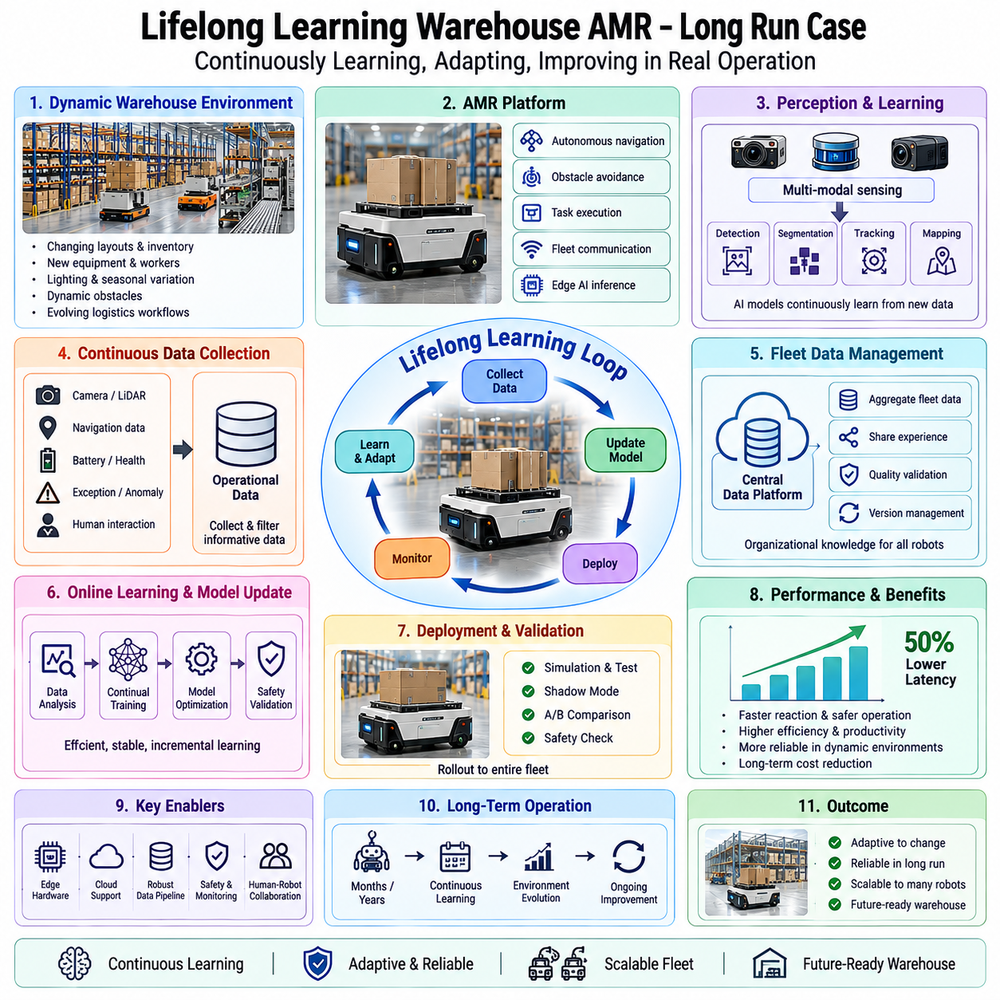{width="7.268055555555556in" height="7.268055555555556in"}

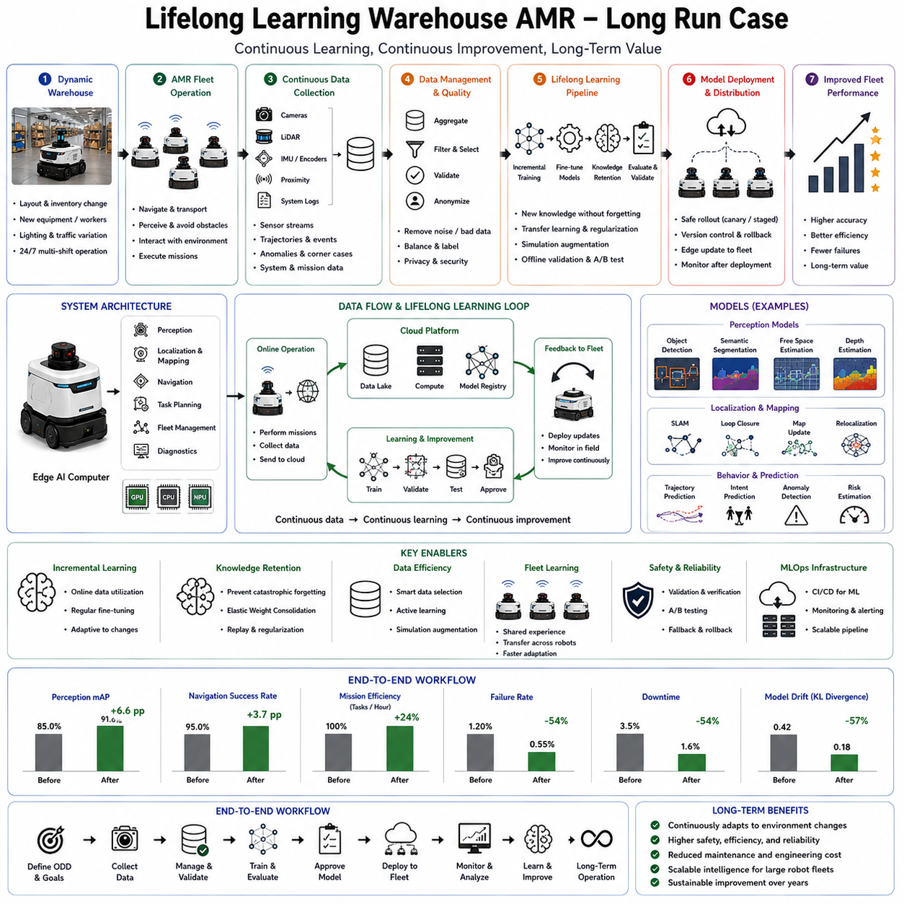{width="7.268055555555556in" height="7.268055555555556in"}

평생 학습(Lifelong learning)은 차세대 지능형 자율 이동 로봇(AMR)에 요구되는 결정적인 기능 중 하나가 되었습니다. 전통적인 로봇 시스템은 데이터를 한 번 수집하고, 모델을 오프라인으로 학습시키며, 광범위한 검증을 수행한 후, 결과 소프트웨어를 프로덕션에 배포하는 정적인 학습 패러다임에 따라 개발됩니다. 이러한 워크플로우가 많은 성공적인 산업 자동화 시스템을 지원해 왔지만, 이는 로봇의 수명 주기 동안 운영 환경이 비교적 안정적으로 유지된다고 가정합니다. 그러나 현대의 창고는 매우 동적인 생태계입니다. 보관 레이아웃이 변경되고, 재고가 지속적으로 순환하며, 선반이 재배치되고, 새로운 기계가 설치되며, 조명 조건이 진화하고, 인간의 워크플로우가 적응하며, 계절별 비즈니스 변동이 새로운 운영 패턴을 도입합니다. 배포 당일에 예외적으로 잘 작동하던 인지 또는 주행 모델도 환경이 원래의 학습 데이터와 달라짐에 따라 점차 효과가 떨어질 수 있습니다. 평생 학습은 자율 로봇이 이전에 획득한 기능을 보존하면서 수개월 또는 수년간의 운영 전반에 걸쳐 지식을 지속적으로 축적할 수 있도록 함으로써 이 과제를 해결합니다. 평생 학습은 배포를 모델 개발의 끝으로 취급하는 대신, 배포를 진행 중인 학습 프로세스의 시작으로 변환합니다.

본 프로덕션 사례는 하루 24시간 작동하는 대규모 이커머스 물류센터 내에 배포된 창고 자율 이동 로봇 플리트(fleet)를 고려합니다. 수백 대의 로봇이 자동화 보관 시스템, 피킹 스테이션, 포장 구역, 품질 점검 셀, 하역장 및 충전 스테이션 간에 재고 컨테이너를 운송합니다. 창고에는 수천 개의 보관 선반, 지속적으로 변경되는 재고, 수백 명의 작업자, 지게차, 컨베이어 시스템, 자동 엘리베이터, 임시 대기 구역, 유지보수 구역 및 여러 생산 교대 근무가 포함되어 있습니다. 학계 연구에 사용되는 벤치마크 환경과 달리, 이 창고는 매일의 운영 전반에 걸쳐 지속적으로 진화합니다. 중심적인 엔지니어링 목표는 완전한 재학습이나 반복적인 수동 데이터 수집 캠페인을 요구하지 않으면서, 로봇 플리트가 수년에 걸쳐 주행, 인지, 장애물 회피 및 운영 효율성을 향상시킬 수 있도록 하는 것입니다.

평생 학습의 첫 번째 엔지니어링 원칙은 환경 변화를 예외적인 것이 아니라 불가피한 것으로 인식하는 것입니다. 창고 운영자는 새로운 제품 카테고리를 빈번하게 도입하고, 보관 용량을 확장하며, 통로 레이아웃을 수정하고, 추가 컨베이어 시스템을 설치하며, 조명 기구를 교체하고, 교통 패턴을 변경하며, 물류 워크플로우를 최적화합니다. 이러한 수정은 원래의 학습 데이터셋과 운영 환경 사이에 통계적 분포 변화(distribution shifts)를 점진적으로 발생시킵니다. 이러한 차이를 실패로 간주하는 대신, 학습 아키텍처는 이러한 변화를 식별하고, 측정하며, 이에 적응하도록 명시적으로 설계됩니다.

개발 프로세스는 운영 설계 도메인을 고정된 환경이 아니라 진화하는 운영 공간으로 정의하는 것으로 시작됩니다. 엔지니어는 예상되는 환경 변화율, 계절별 재고 변동, 조명 수정, 인프라 확장, 로봇 플리트 성장, 센서 노화, 통신 업그레이드 및 소프트웨어 진화를 특징짓습니다. 이러한 장기적인 관점은 데이터 관리, 모델 아키텍처, 배포 파이프라인, 검증 절차, 런타임 모니터링 및 플리트 관리 인프라를 포함하여 시스템 설계의 모든 측면에 영향을 미칩니다.

로봇 플랫폼은 인지, 위치 추정, 지도 작성, 주행, 장애물 회피, 작업 계획, 플리트 조율, 진단, 통신 및 에지 AI 추론을 포함한 여러 통합된 하위 시스템으로 구성됩니다. 각 하위 시스템은 평생 학습에 기여하는 가치 있는 운영 정보를 생성합니다. RGB 카메라, 깊이 카메라, LiDAR, 관성 측정 장치, 휠 인코더, 근접 센서, 배터리 모니터, 열 센서 및 통신 모듈은 창고와 로봇 자체를 모두 설명하는 멀티모달 관측치를 지속적으로 생성합니다. 시스템은 즉각적인 주행 후에 이 정보를 폐기하는 대신, 미래의 학습을 위해 선택된 관측치를 저장합니다.

데이터 수집은 전용 개발 단계가 아니라 지속적인 운영 프로세스가 됩니다. 모든 로봇은 대표적인 센서 관측치, 주행 궤적, 위치 추정치, 장애물 조우, 비상 정지, 임무 완료 통계, 작업자 개입, 환경 아노말리 및 런타임 신뢰도 추정치를 기록합니다. 지능형 필터링은 모든 센서 프레임을 보존하는 대신 정보량이 많은 이벤트를 선택함으로써 과도한 스토리지 요구 사항을 방지합니다. 드문 장애물, 불확실한 예측, 특이한 환경 조건, 어려운 주행 시나리오 및 회복 거동은 일반적인 반복 운영보다 더 높은 기록 우선순위를 받습니다.

중앙 집중식 데이터 관리 플랫폼은 전체 플리트에서 수집된 정보를 집계합니다. 각 로봇을 독립적으로 취급하는 대신, 한 로봇이 수집한 운영 경험은 배포된 모든 플랫폼이 가용할 수 있는 조직적 지식이 됩니다. 한 로봇이 새로 설치된 선반 구성이나 낯선 장애물을 마주하면, 해당 관측치는 검증 후 전체 플리트에 이익이 되는 미래의 모델 업데이트에 기여합니다. 따라서 플리트 규모의 학습은 격리된 개인 학습과 비교하여 적응을 실질적으로 가속화합니다.

지속적인 수집에도 불구하고 데이터 품질은 필수적으로 유지됩니다. 자동화된 검증 파이프라인은 새로운 데이터가 학습 리포지토리에 진입하기 전에 손상된 센서 기록, 동기화 실패, 불완전한 궤적, 통신 중단, 캘리브레이션 드리프트, 타임스탬프 불일치 및 주석 오류를 식별합니다. 통계적 모니터링은 축적된 데이터셋 전반에서 환경 다양성, 클래스 균형, 지리적 커버리지, 시간적 변동 및 센서 일관성을 평가합니다. 체계적인 품질 보증이 없다면, 지속적인 학습은 모델 성능을 향상시키는 대신 저하시킬 위험이 있습니다.

평생 학습이 해결하는 주요 과제 중 하나는 개념 드리프트(concept drift)입니다. 개념 드리프트는 관측치와 원하는 예측 사이의 통계적 관계가 시간이 지남에 따라 변할 때 발생합니다. 창고 환경에서 개념 드리프트는 새로운 팔레트 디자인이 나타나거나, 선반 배치가 변경되거나, 바닥 마킹이 지워지거나, 조명 시스템이 업그레이드되거나, 작업자가 다른 운영 절차를 채택하거나, 계절별 재고가 낯선 포장을 도입하기 때문에 발생할 수 있습니다. 역사적 데이터로만 학습된 AI 모델은 현재의 운영 조건에 대한 대표성이 점차 떨어지게 됩니다. 개념 드리프트를 조기에 탐지하면 엔지니어는 운영 성능이 심각하게 저하되기 전에 모델을 업데이트할 수 있습니다.

드리프트 탐지는 통계 분석과 런타임 성능 모니터링을 결합합니다. 인지 네트워크에 의해 추출된 특징 분포는 역사적 학습 분포와 지속적으로 비교됩니다. 임베딩 공간 시각화, 확률 밀도 추정, 클러스터링 분석, 최대 평균 편차(MMD), 와서스타인(Wasserstein) 거리 및 통계적 가설 검정은 점진적인 환경 변화를 식별합니다. 동시에 탐지 신뢰도, 위치 추정 일관성, 주행 성공률, 장애물 회피 빈도 및 인간 개입률과 같은 운영 지표는 모델 저하의 실질적인 지표를 제공합니다. 통계적 증거와 거동적 증거의 결합은 소모적인 수동 검사를 요구하지 않으면서 신뢰할 수 있는 드리프트 탐지를 가능하게 합니다.

인지 시스템 자체는 점진적인 개선을 지원하는 모듈식 아키텍처를 따릅니다. 물체 탐지는 작업자, 지게차, 팔레트, 선반, 로봇, 유지보수 장비, 임시 장벽 및 안전 장치를 인식합니다. 시맨틱 세그멘테이션은 통행 가능한 바닥 영역, 제한 구역, 하역 영역, 충전 스테이션 및 운영 작업 공간을 식별합니다. 위치 추정은 LiDAR 매핑을 시각적 이표(landmarks)와 결합하는 반면, 자유 공간 추정은 안전한 주행 회랑을 식별합니다. 개별 인지 모듈은 상위 수준 주행 시스템과의 안정적인 인터페이스를 보존하면서 독립적으로 업데이트될 수 있어, 지속적인 개선 중 배포 리스크를 줄입니다.

파운데이션 모델은 평생 학습을 위한 점점 더 중요한 출발점을 제공합니다. 다양한 이미지 컬렉션에서 사전 학습된 대규모 자기 지도 비전 인코더는 창고 환경이 진화하더라도 유용하게 유지되는 일반화된 특징 표현을 생성합니다. 지속적으로 수집된 운영 데이터를 사용하여 이러한 사전 학습된 표현을 미세 조정하는 것은 처음부터 완전한 인지 시스템을 학습시키는 것보다 실질적으로 더 적은 라벨링된 예시를 필요로 합니다. 결과적으로 적응은 더 빨라지고 컴퓨팅 효율성도 높아집니다.

능동 학습(Active learning)은 데이터 효율성을 더욱 향상시킵니다. 새로 수집된 모든 관측치에 대해 수동 주석을 요청하는 대신, 불확실성 추정은 최대의 학습 가치를 기여할 것으로 예상되는 샘플을 식별합니다. 낯선 장애물, 모호한 세그멘테이션 경계, 새로운 포장, 특이한 작업자 거동 또는 저하된 센서 조건을 포함하는 이미지가 주석 우선순위를 받습니다. 따라서 인간의 라벨링 자원은 주석 비용을 최소화하면서 가장 정보량이 많은 운영 예시에 집중됩니다.

인간 참여형(Human-in-the-loop) 학습은 배포 전반에 걸쳐 필수적으로 유지됩니다. 창고 운영자, 유지보수 인력 및 AI 엔지니어는 프로덕션 배포 전에 불확실한 예측을 검토하고, 아노말리 탐지를 검증하며, 라벨링 품질을 확인하고, 모델 업데이트를 승인합니다. 인간의 감독은 잘못된 운영 데이터가 학습 데이터셋을 오염시키는 것을 방지하는 동시에 조직의 전문 지식이 로봇 거동에 계속 영향을 미치도록 보장합니다.

지속 학습(Continual learning) 알고리즘은 평생 적응과 관련된 가장 중요한 기술적 과제 중 하나인 파멸적 망각(catastrophic forgetting)을 해결합니다. 전통적인 신경망은 새로운 데이터셋으로 재학습될 때 이전에 획득한 지식을 종종 잃어버립니다. 최근 수집된 창고 관측치로만 업데이트된 로봇은 빈번하게 조우하지는 않지만 여전히 운영상 중요한 환경에서의 성능을 의도치 않게 저하시킬 수 있습니다. 파멸적 망각은 모델이 수년에 걸쳐 수많은 점진적 업데이트를 거치는 장기 배포에서 특히 문제가 됩니다.

여러 상호 보완적인 전략이 파멸적 망각을 완화합니다. 리플레이(Replay) 메커니즘은 미래 최적화 중에 가용한 상태로 유지되는 대표적인 역사적 학습 예시를 보존합니다. 새로운 운영 데이터로만 학습하는 대신, 각 업데이트는 이전 운영 조건 전반에 걸친 커버리지를 유지하는 신중하게 선택된 역사적 경험과 최근 관측치를 결합합니다. 균형 잡힌 리플레이는 적응 기능을 보존하면서 망각을 실질적으로 줄입니다.

규제 기반(Regularization-based) 지속 학습은 지식 보유를 더욱 안정화합니다. 최적화 알고리즘은 이전에 학습된 작업에 특히 중요한 파라미터를 식별하고 미래 학습 중에 불사용 수정을 억제합니다. 탄성 가중치 통합(EWC), 시냅스 지능(Synaptic Intelligence) 및 관련 방법들은 진화하는 환경에 대한 적응을 위한 충분한 유연성을 허용하면서 필수적인 표현을 보존합니다.

지식 증류는 또 다른 효과적인 접근 방식을 제공합니다. 새로 학습된 모델은 업데이트된 운영 데이터셋뿐만 아니라 이전 프로덕션 모델에 의해 생성된 예측으로부터도 배웁니다. 증류는 연속적인 소프트웨어 버전 간의 연속성을 장려하여, 점진적인 성능 향상을 허용하면서 예기치 않은 거동 변화를 줄입니다.

메모리 시스템은 장기 배포 동안 점점 더 정교해집니다. 일화적 메모리(Episodic memory)는 특이한 주행 시나리오, 회복 거동, 드문 장애물 조우 및 예외적인 환경 조건을 포함한 대표적인 운영 경험을 저장합니다. 시맨틱 메모리(Semantic memory)는 창고 레이아웃, 물체 카테고리, 교통 패턴 및 운영 절차에 관한 일반화된 지식을 축적합니다. 작업 메모리는 진행 중인 주행 작업을 지원하는 반면, 장기 리포지토리는 수년에 걸친 조직적 학습을 가능하게 합니다.

위치 추정 하위 시스템은 평생 학습으로부터 실질적인 이득을 얻습니다. 창고 지도는 선반 배치, 보관 구역, 임시 작업 공간 및 인프라가 시간이 지남에 따라 변하기 때문에 지속적으로 진화합니다. 지도를 매번 처음부터 반복해서 재구성하는 대신, 매핑 알고리즘은 환경의 안정적인 부분을 보존하면서 로컬 영역을 점진적으로 업데이트합니다. 동적 매핑은 영구적인 구조 변화를 임시 장애물과 구별하여, 지속적인 환경 진화에도 불구하고 신뢰할 수 있는 위치 추정을 유지합니다.

주행 정책 역시 지속적으로 향상됩니다. 수천 시간에 걸쳐 기록된 운영 궤적은 효율적인 이동 경로, 혼잡 패턴, 빈번하게 막히는 통로, 교통량이 많은 교차로, 충전 거동 및 작업자 이동 통계를 드러냅니다. 학습 알고리즘은 사전 정의된 비용 함수에만 의존하는 대신 실제 운영 경험에 따라 경로 계획을 점진적으로 최적화합니다. 따라서 주행은 플리트가 실질적인 지식을 축적함에 따라 점점 더 효율적으로 변합니다.

장장애물 회피 또한 경험을 통해 진화합니다. 새로 도입된 운송 카트, 임시 유지보수 장비, 계절별 포장 또는 자율 청소 기계와 같이 초기에는 낯설었던 장애물들이 점차 인지 모델에 통합됩니다. 이러한 물체와 관련된 런타임 불확실성은 추가 관측치가 축적됨에 따라 감소하여, 안전을 타협하지 않으면서 주행 신뢰성을 향상시킵니다.

플리트 조율은 평생 학습의 또 다른 중요한 애플리케이션을 나타냅니다. 교통 관리 알고리즘은 창고 전체에서 동시에 작동하는 수백 대의 로봇 간의 상호 작용을 관찰합니다. 운영 로그는 혼잡, 병목 구간, 비효율적인 작업 할당, 충전 스테이션 충돌 및 통신 패턴을 식별합니다. 플리트 최적화 알고리즘은 후속적으로 축적된 운영 통계를 사용하여 스케줄링, 라우팅, 충전 및 워크로드 분배를 정제합니다.

에지 AI 하드웨어는 실시간 성능을 유지하면서 지속적인 배포를 지원합니다. 인지 모델은 TensorRT 또는 ONNX Runtime과 같은 최적화된 추론 엔진을 사용하여 로컬에서 실행됩니다. 그러나 모델 재학습은 더 큰 컴퓨팅 자원이 효율적인 최적화를 가능하게 하는 중앙 집중식 컴퓨팅 인프라 내에서 발생합니다. 업데이트된 모델은 안전한 소프트웨어 배포 파이프라인을 통해 에지 디바이스로 다시 배포되기 전에 포괄적인 검증을 거칩니다.

모델 버전 관리는 지속적인 개선 동안 필수적이 됩니다. 배포된 모든 AI 모델은 대응하는 데이터셋, 학습 구성, 검증 결과, 소프트웨어 의존성, 하드웨어 호환성 및 배포 이력과 연관된 고유한 버전 식별자를 받습니다. 완전한 추적 가능성은 업데이트 후 예기치 않은 운영 문제가 발생할 경우 신속한 롤백을 가능하게 합니다. 모델을 영구적으로 교체하는 대신, 이전 버전들이 비교, 회귀 테스트 및 비상 회복을 위해 가용한 상태로 유지됩니다.

지속적 통합 및 지속적 배포(CI/CD) 파이프라인은 학습 라이프사이클의 상당 부분을 자동화합니다. 새로 수집된 운영 데이터는 전처리, 품질 검증, 능동 학습 선택, 주석 워크플로우, 재학습, 시뮬레이션 평가, 회귀 테스트, 안전 검증, 파일럿 배포 및 점진적인 플리트 롤아웃을 트리거합니다. 자동화된 파이프라인은 엔지니어링 노력을 줄이는 동시에 모든 모델 업데이트 전반에서 일관된 배포 절차를 보장합니다.

시뮬레이션은 프로덕션 배포 후에도 평생 학습을 계속 지원합니다. 플리트 로그를 통해 식별된 어려운 운영 시나리오가 고충실도 디지털 트윈 내에서 재구성됩니다. 엔지니어는 업데이트된 소프트웨어를 실제 창고에 배포하기 전에 특이한 주행 상황을 재현하고, 후보 모델 개선 사항을 평가하며, 스트레스 테스트를 수행하고, 안전을 검증합니다. 따라서 시뮬레이션은 개발 전용 도구가 아니라 지속적인 검증 환경이 됩니다.

런타임 안전 모니터링은 적응형 학습 메커니즘과 독립적으로 유지됩니다. 결정론적 안전 제어기는 진행 중인 모델 진화와 관계없이 장애물 회피, 비상 정지, 속도 조절, 작업 공간 경계, 인간 근접성, 배터리 관리, 통신 상태 및 컴퓨팅 무결성을 감독합니다. 업데이트된 모든 AI 모델은 물리적 로봇 거동에 영향을 미치기 전에 동일한 인증된 안전 감독을 받아야 합니다.

불확실성 추정은 평생 학습 전반에서 중심적인 역할을 합니다. 모든 예측에는 모델 확신도를 반영하는 연관된 신뢰도 측정치가 포함됩니다. 높은 불확실성은 추가적인 데이터 수집이나 향후 재학습을 가치 있게 만드는 낯선 상황을 자주 나타냅니다. 따라서 런타임 모니터는 운영상의 불확실성을 단순히 잠재적 실패로 보고하는 대신 가치 있는 학습 기회로 변환합니다.

실패 분석은 지속적인 개선의 또 다른 소스를 제공합니다. 모든 주행 아노말리, 위치 추정 실패, 인지 오류, 통신 중단 또는 예기치 않은 회복 기동은 동기화된 센서 로그, 리플레이 시스템, 해석 가능성 도구, 근본 원인 분석 및 운영 진단을 사용하여 체계적인 조사를 거칩니다. 학습된 교훈은 후속 소프트웨어 버전에 통합되는 추가 학습 예시, 검증 시나리오, 안전 규칙 또는 엔지니어링 개선 사항이 됩니다.

사이버 보안은 평생 학습이 지속적인 소프트웨어 업데이트와 중앙 집중식 데이터 교환에 크게 의존하기 때문에 점점 더 중요해집니다. 안전한 통신, 인증된 모델 배포, 암호화된 운영 로그, 액세스 제어, 디지털 서명 및 무결성 검증은 권한 없는 수정으로부터 학습 인프라를 보호합니다. 강력한 사이버 보안이 없다면, 적응형 학습 메커니즘 자체가 운영 안전을 손상시키는 공격 벡터가 될 수 있습니다.

성능 평가는 일반적인 벤치마크 정확도를 넘어 확장됩니다. 엔지니어는 임무 완료율, 주행 효율성, 장애물 회피 빈도, 위치 추정 정밀도, 에너지 소비, 배터리 수명, 통신 품질, 추론 지연, 하드웨어 활용도, 작업자 개입 빈도, 유지보수 요구 사항 및 장기 생산성을 모니터링합니다. 수개월 또는 수년에 걸친 추세 분석은 지속적인 적응으로 인한 점진적인 개선을 드러냅니다.

장기 배포에서 나타나는 중요한 관찰은 운영 지식이 비선형적으로 축적된다는 점입니다. 초기 배포는 주로 낯선 장애물이나 위치 추정 불일치와 같은 명백한 결함을 수정합니다. 나중의 개선 사항은 점점 더 미묘해져, 에너지 최적화, 경로 효율성, 협력 거동, 유지보수 예측 및 드문 환경 상황에 초점을 맞춥니다. 따라서 평생 학습은 조직적 경험이 성숙함에 따라 반응적 수정에서 선제적 최적화로 진화합니다.

미래의 창고 AMR은 평생 학습을 파운데이션 모델, 월드 모델, 멀티모달 추론, 자연어 인터페이스, 예측 계획 및 플리트 규모의 협력 지능과 점점 더 통합할 것입니다. 격리된 인지 모듈을 독립적으로 업데이트하는 대신, 미래의 시스템은 인지, 메모리, 추론, 계획, 조작, 통신 및 인간 협업을 포함한 완전한 인지 아키텍처를 지속적으로 정제할 것입니다. 글로벌 창고 네트워크 전반에 걸쳐 축적된 조직적 지식은 이전에 획득한 운영 전문 지식을 보존하면서 새로운 시설에 대한 신속한 적응을 가능하게 할 것입니다.

궁극적으로 본 장기 프로덕션 배포는 평생 학습이 자율 로봇을 정적인 소프트웨어 시스템에서 지속적으로 향상되는 지능형 에이전트로 변환함을 증명합니다. 창고 AMR은 운영 환경이 변경될 때마다 완전한 재개발을 요구하는 대신, 이전에 획득한 지식을 유지하면서 축적된 경험을 통해 기능을 점진적으로 확장합니다. 성공적인 평생 학습은 첨단 머신러닝 알고리즘뿐만 아니라 규율 있는 데이터 엔지니어링, 강력한 MLOps 인프라, 지속적인 검증, 런타임 안전 모니터링, 불확실성 추정, 플리트 관리, 사이버 보안 및 시스템 엔지니어링에 의존합니다. 이 기술들은 함께 지속적으로 진화하는 환경에도 불구하고 자율 로봇이 수년간의 배포 동안 효과적으로 유지되는 지속 가능한 프레임워크를 구축합니다. 물리적 AI가 점점 더 일반적이고 적응력 있는 지능을 향해 계속 발전함에 따라, 평생 학습은 로봇이 운영 수명 주기 전반에 걸쳐 배울 수 있도록 지원하는 토대 기술 중 하나가 되어, 완료된 모든 임무를 미래 개선을 위한 기회로 변환할 것입니다.

41.12.08 창고 AMR을 위한 평생 학습: 장기 프로덕션 배포 사례

## 12.09 AI Safety OOD Failure Detection Production Case

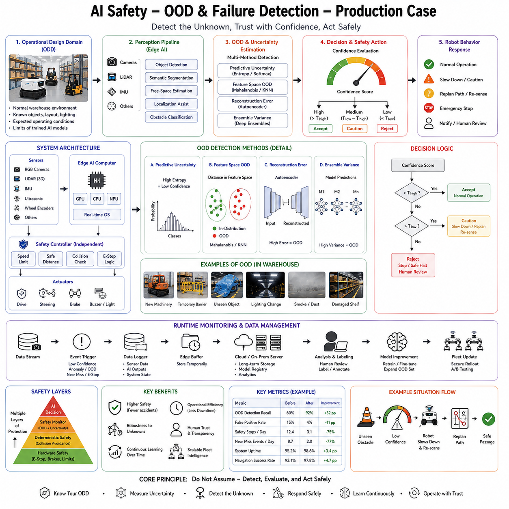{width="7.268055555555556in" height="7.268055555555556in"}

인공지능은 자율 로봇이 인지, 주행, 조작, 계획 및 의사 결정에서 놀라운 능력을 달성할 수 있도록 해주었습니다. 그러나 어떤 AI 모델도 실제 배포 중에 직면하는 모든 상황을 완벽하게 예측할 수는 없습니다. 산업용 로봇, 자율 이동 로봇(AMR), 휴머노이드, 자율주행 차량, 사족 보행 점검 로봇 및 화물 UAV는 필연적으로 원래의 학습 데이터와 다른 환경에서 작동합니다. 예기치 않은 장애물이 나타나고, 조명 조건이 변경되며, 센서가 저하되고, 인프라가 진화하며, 날씨가 새로운 시각적 특성을 도입하고, 인간의 행동이 지속적으로 변화합니다. 전통적인 소프트웨어는 일반적으로 사전에 정의된 작동 조건 하에서 예측 가능하게 거동하지만, AI 시스템은 역사적 데이터로부터 통계적 패턴을 학습하므로 낯선 상황에 노출될 때 신뢰할 수 없게 될 수 있습니다. 결과적으로 현대의 프로덕션 로봇 공학은 분포 외(Out-of-Distribution, OOD) 탐지와 AI 실패 탐지를 선택적인 성능 향상이 아니라 필수적인 안전 메커니즘으로 점점 더 취급하고 있습니다. 신경망이 생성하는 모든 예측이 신뢰할 수 있다고 가정하는 대신, 프로덕션 시스템은 현재 상황이 이전 경험과 유사한지, 그리고 AI 출력이 물리적 로봇 거동에 영향을 미치기 전에 수용, 의문 제기 또는 거부되어야 하는지를 지속적으로 평가합니다.

본 프로덕션 사례는 자동화 보관 시스템, 피킹 스테이션, 포장 라인, 품질 점검 셀 및 출하 하역장 간에 재고를 운송하는 역할을 담당하는 글로벌 물류 창고 내에서 지속적으로 작동하는 대규모 산업용 자율 이동 로봇 플리트를 고려합니다. 수백 대의 로봇이 작업자, 지게차, 컨베이어 시스템, 자율 장비, 임시 보관 구역, 유지보수 인력 및 변경되는 창고 레이아웃과 상호 작용하면서 매일 수천 개의 임무를 수행합니다. 로봇은 물체 탐지, 시맨틱 세그멘테이션, 자유 공간 추정, 위치 추정 보조 및 장애물 분류를 위해 딥러닝에 의존합니다. 실험실 검증 동안 이러한 모델은 우수한 벤치마크 정확도를 달성했습니다. 그러나 엔지니어들은 배포 환경이 원래의 학습 데이터셋에 표현된 조건을 넘어 필연적으로 진화할 것임을 인식했습니다. 더 큰 데이터셋만으로 가능한 모든 예측 오류를 제거하려고 시도하는 대신, 엔지니어링 목표는 AI 신뢰도가 감소하고 적절한 안전 조치가 자동으로 트리거되어야 하는 상황을 식별하는 것이 되었습니다.

시스템 아키텍처는 계층화된 안전 철학을 따릅니다. 인공지능은 인지와 상위 수준의 이해를 수행하는 반면, 독립적인 런타임 안전 모니터는 주행 결정이 물리적 액추에이터에 영향을 미치기 전에 예측 신뢰성을 평가합니다. 결정론적 안전 제어기는 AI 신뢰도와 관계없이 차량 모션을 감독하여, 예기치 않은 모델 거동이 안전하지 않은 로봇 행동을 직접적으로 생성할 수 없도록 보장합니다. 따라서 분포 외 탐지는 불확실성 추정, 이상 탐지, 런타임 검증, 결정론적 충돌 회피, 비상 정지 시스템 및 포괄적인 운영 모니터링도 포함하는 더 광범위한 AI 안전 아키텍처 내의 한 구성 요소가 됩니다.

개발 프로세스는 운영 설계 도메인을 정의하는 것으로 시작됩니다. 엔지니어는 인지 시스템이 신뢰할 수 있게 작동할 것으로 기대되는 환경 조건을 신중하게 지정합니다. 창고에는 표준 선반, 팔레트, 지게차, 승인된 안전 장비를 착용한 작업자, 지정된 보행자 통로, 충전 스테이션, 보관 랙, 컨베이어 시스템 및 알려진 조명 조건이 포함되어 있습니다. 학습 데이터셋은 여러 교대 근무, 계절별 재고 변화 및 운영 구성 전반에 걸쳐 이러한 환경의 대표적인 예시를 캡처합니다. 그러나 엔지니어들은 향후 배포에 이 운영 도메인을 벗어나는 상황이 필연적으로 포함될 것임을 명시적으로 인정합니다. 완벽한 일반화를 가정하는 대신, AI 시스템은 낯섬을 인지 파이프라인의 명시적인 출력으로 인식하도록 설계됩니다.

첫 번째 엔지니어링 과제는 무엇이 분포 외 관측을 구성하는지 정의하는 것을 포함합니다. 올바른 정답이 학습된 카테고리 중 하나에 속하는 일반적인 분류 오류와 달리, OOD 상황은 종종 모델 개발 중에 조우한 그 어떤 것과도 근본적으로 다른 관측을 포함합니다. 예시로는 새로 설치된 산업용 기계, 임시 건설 장벽, 특이한 포장 자재, 손상된 선반, 반사형 비상 담요, 청소 장비, 예기치 않은 유지보수 차량, 심각한 연기 조건, 부분적으로 붕괴된 보관 랙, 비상 운영 중에 생성된 특이한 조명 또는 배포 후 도입된 완전히 새로운 물체 카테고리가 포함됩니다. 미묘한 환경 변화조차도 신경망 신뢰도에 영향을 미치기에 충분할 정도로 통계적 분포를 점진적으로 변화시킬 수 있습니다.

인지 시스템은 여러 상호 연결된 신경망으로 구성됩니다. 물체 탐지 모델은 작업자, 지게차, 팔레트, 카트, 로봇, 안전 장벽 및 산업 장비를 인식합니다. 시맨틱 세그멘테이션은 통행 가능한 바닥 영역, 선반 구조, 보관 구역, 제한 영역 및 충전 위치를 식별합니다. 자유 공간 추정 네트워크는 주행 가능한 영역을 예측하는 반면, 시각적 위치 추정은 시맨틱 이표 인식을 통해 기하학적 매핑을 보조합니다. 각 모델은 심층 신경망 레이어에서 추출된 내부 특징 표현과 함께 예측 확률을 생성합니다. 최종 클래스 확률만 고려하는 대신, OOD 탐지는 이러한 잠재 특징 분포를 분석하여 현재 관측이 이전 학습 경험과 유사한지 여부를 결정합니다.

첫 번째 프로덕션 구현은 신뢰도 모니터링을 기본 안전 메커니즘으로 채택합니다. 모든 예측에는 신경망에 의해 생성된 확률 추정치가 포함됩니다. 신뢰도가 낮은 탐지는 감소된 주행 속도, 확장된 장애물 안전 마진, 추가 센서 검증 또는 인간 감독 요청을 포함하여 즉각적으로 증가된 주의를 트리거합니다. 그러나 엔지니어들은 현대 신경망이 낯선 관측에 대해서도 종종 고도로 확신하는 예측을 생성하기 때문에 신뢰도 자체만으로는 불충분한 보호를 제공한다는 것을 신속하게 발견합니다. 결과적으로 추가적인 OOD 탐지 메커니즘이 필수적이 됩니다.

특징 공간 분석은 다음 레이어의 보호를 제공합니다. 모델 개발 동안 엔지니어는 수백만 개의 학습 샘플에 대해 중간 신경망 레이어에 의해 생성된 잠재 특징 표현을 기록합니다. 이러한 특징 임베딩은 익숙한 운영 조건을 표현하는 통계적 다양체를 정의합니다. 배포 중에 들어오는 관측은 동일한 특징 공간으로 투영됩니다. 거리 지표는 마할라노비스(Mahalanobis) 거리, 코사인 유사도, 유클리드 거리, 커널 밀도 추정 및 확률적 클러스터링을 사용하여 현재 임베딩을 역사적 학습 분포와 비교합니다. 익숙한 특징 클러스터로부터 멀리 위치한 관측은 분류 신뢰도가 높게 유지되더라도 상승된 OOD 점수를 받습니다.

에너지 기반 OOD 탐지는 신뢰성을 더욱 향상시킵니다. 확률 분포에만 의존하는 대신, 엔지니어는 신경망이 각 예측을 내부적으로 얼마나 강력하게 지원하는지 설명하는 에너지 점수를 계산합니다. 익숙한 관측은 일반적으로 안정적인 학습된 개념에 대응하는 낮은 에너지 표현을 생성하는 반면, 낯선 관측은 감소된 모델 확실성을 나타내는 더 높은 에너지를 보입니다. 에너지 기반 방법은 최종 소프트맥스 확률뿐만 아니라 내부 네트워크 거동을 활용하기 때문에 특히 강력함이 입증되었습니다.

몬테카를로 드롭아웃(Monte Carlo dropout)은 불확실성 추정의 또 다른 소스를 기여합니다. 추론 중에 드롭아웃 레이어가 활성 상태로 유지되어 동일한 센서 관측에 대해 여러 개의 약간 다른 예측을 생성합니다. 예측 분산은 낯선 환경과 연관된 인식론적 불확실성을 추정합니다. 높은 분산은 일반적인 분류 모호성이 아니라 불충분한 모델 지식을 나타냅니다. 런타임 안전 모니터는 적절한 운영 반응을 결정하기 전에 몬테카를로 불확실성을 OOD 점수, 신뢰도 추정치 및 센서 일관성 분석과 결합합니다.

심층 앙상블(Deep ensemble) 방법은 추가적인 견고성을 제공합니다. 하나의 인지 모델을 배포하는 대신, 프로덕션 시스템은 서로 다른 무작위 시드 또는 학습 서브셋을 사용하여 초기화되고 독립적으로 학습된 여러 네트워크를 유지합니다. 앙상블 멤버 간의 일치는 신뢰할 수 있는 예측을 나타내는 반면, 불일치는 낯선 상황을 자주 신호합니다. 앙상블이 추가적인 컴퓨팅 자원을 요구하지만, 최적화된 에지 추론 하드웨어는 안전이 컴퓨팅 비용보다 중요한 중요한 인지 작업에 대해 실질적인 배포를 허용합니다.

오토인코더 기반 이상 탐지는 지도 인지를 보완합니다. 오토인코더는 익숙한 창고 이미지를 정확하게 재구성할 수 있는 콤팩트한 표현을 배웁니다. 배포 중에 잠재 표현이 특이한 환경 구조를 더 이상 효과적으로 캡처하지 못하기 때문에 낯선 관측은 실질적으로 더 큰 재구성 오류를 생성합니다. 따라서 재구성 오류는 분류 신뢰도와 분리된 독립적인 이상 점수를 제공합니다. 이 접근 방식은 단순히 새로운 물체 카테고리보다는 예기치 않은 환경 변화를 탐지하는 데 특히 유용함이 입증되었습니다.

자기 지도 표현 학습은 이상 탐지를 더욱 향상시킵니다. 대조 학습(Contrastive learning) 방법은 소모적인 수동 주석을 요구하지 않으면서 시맨틱 유사성을 강조하는 특징 임베딩을 생성합니다. 이러한 표현은 좁은 분류 목표보다는 광범위한 환경 구조를 캡처하기 때문에 낯선 상황을 작업 특정적 분류기보다 종종 더 신뢰할 수 있게 탐지합니다. 따라서 프로덕션 엔지니어는 OOD 견고성을 향상시키기 위해 지도 인지를 자기 지도 임베딩과 결합합니다.

센서 퓨전은 실패 탐지를 실질적으로 강화합니다. 카메라, LiDAR, 깊이 센서, 관성 측정 장치, 휠 인코더 및 위치 추정 시스템이 환경을 독립적으로 관찰합니다. 감지 모달리티 간의 상당한 불일치는 AI 실패나 환경 아노말리를 자주 나타냅니다. 예를 들어, 시각적 인지는 어떤 영역을 자유 공간으로 분류하는 반면 LiDAR는 실질적인 기하학적 장애물을 탐지할 수 있습니다. 이러한 불일치는 주행이 진행되기 전에 런타임 조사를 트리거합니다. 따라서 다중 센서 일치는 신경망 신뢰도와 독립적인 중요한 안전 지표 역할을 합니다.

시간적 일관성 분석은 또 다른 프로덕션 안전장치를 제공합니다. 창고 환경은 순간적이 아니라 지속적으로 진화합니다. 물체 식별성, 선반 위치, 로봇 궤적, 작업자 모션 및 자유 공간 경계는 부드러운 시간적 진화를 보여야 합니다. 거대 구조물의 갑작스러운 나타남이나 사라짐, 연속된 프레임 전반에서 불일치하는 물체 식별성 또는 급격한 위치 추정 변화는 진짜 환경적 이벤트라기보다는 인지 실패를 나타내는 경우가 많습니다. 런타임 모니터링은 현재 예측을 최근 관측 이력과 비교하여 추가 검증을 요구하는 확률이 낮은 불연속성을 식별합니다.

월드 모델은 예측 일관성을 통해 실패 탐지를 더욱 향상시킵니다. 로봇은 현재의 환경 이해와 계획된 모션을 기반으로 미래의 센서 관측을 지속적으로 예측합니다. 실제 센서 측정값은 내부 월드 모델에 의해 생성된 예측 관측치와 비교됩니다. 큰 예측 오류는 예기치 않은 환경 변화 또는 인지, 위치 추정, 계획 하위 시스템 내의 실패를 나타냅니다. 따라서 예측 잔차(residuals)는 이상 탐지와 운영 안전을 지원하는 가치 있는 지표가 됩니다.

런타임 안전 아키텍처는 이러한 다양한 지표를 통합된 의사 결정 프레임워크로 조직합니다. 모든 인지 사이클은 물체 탐지, 세그멘테이션 맵, 위치 추정치, 신뢰도 값, 불확실성 측정치, OOD 점수, 재구성 오류, 센서 일관성 지표, 시간적 일관성 평가 및 월드 모델 예측 잔차를 생성합니다. 단일 지표를 독립적으로 고려하는 대신, 감독 안전 모듈이 모든 증거를 결합하여 전반적인 운영 신뢰성을 추정합니다. 다요소 평가는 탐지 민감도를 향상시키는 동시에 오탐을 실질적으로 줄입니다.

서로 다른 OOD 심각도 수준은 서로 다른 운영 반응에 대응합니다. 약간 낯선 포장으로 인해 발생하는 가벼운 불확실성은 단순히 주행 속도를 완만하게 감소시킬 수 있습니다. 새로 설치된 장비로 인해 발생하는 중간 수준의 불확실성은 추가 감지, 대안 주행 경로 또는 임시 작업자 알림을 트리거할 수 있습니다. 센서 실패, 환경적 붕괴, 짙은 연기 또는 알 수 없는 장애물을 포함하는 심각한 OOD 조건은 즉각적으로 비상 정지 절차를 활성화하고 인간의 개입이 뒤따릅니다. 이 단계적 반응 전략은 보수적인 안전 관리와 운영 생산성의 균형을 맞춥니다.

인간 탐지는 특히 보수적인 처리를 받습니다. 여러 독립적인 인지 파이프라인이 RGB 카메라, 깊이 감지, LiDAR 클러스터링 및 모션 분석을 사용하여 작업자 존재를 동시에 검증합니다. 어떠한 불일치라도 추가 증거가 가용해질 때까지 인간이 존재하는 것으로 가정을 기본값으로 합니다. 오탐은 운영 효율성을 일시적으로 감소시킬 수 있지만, 미탐은 용납할 수 없는 안전 위험을 나타냅니다. 결과적으로 런타임 안전은 불확실성에 주변 인력이 포함될 때마다 의도적으로 주의를 우선시합니다.

창고 환경은 장기 배포 전반에 걸쳐 점진적으로 진화합니다. 엔지니어는 OOD 탐지 성능을 평가하기 위해 통제된 변화를 의도적으로 도입합니다. 새로운 선반 디자인, 업데이트된 팔레트 구성, 수정된 바닥 마킹, 임시 유지보수 장비, 계절별 장식, 자율 청소 로봇 및 개정된 작업자 유니폼이 현실적인 운영 드리프트를 제공합니다. 안전 시스템은 보수적인 운영 거동을 통해 신뢰할 수 있는 주행을 유지함에도 불구하고 이러한 낯선 조건을 성공적으로 식별합니다. 수집된 관측치는 후속적으로 인간 검증 후 미래 모델 재학습을 위한 후보가 됩니다.

운영 데이터 수집은 지속적인 개선을 지원합니다. 탐지된 모든 OOD 이벤트는 동기화된 센서 스트림, 특징 임베딩, 불확실성 추정치, 런타임 의사 결정, 환경적 맥락 및 후속 작업자 피드백을 기록합니다. 엔지니어는 탐지된 이벤트를 진짜 새로운 물체, 환경 변화, 센서 저하, 오탐, 조명 아노말리, 위치 추정 실패 및 임시 운영 교란을 포함하는 카테고리로 분류합니다. 이 지속적으로 확장되는 리포지토리는 시간이 지남에 따라 OOD 탐지 정확도를 향상시키는 동시에 미래의 모델 정제를 지원합니다.

능동 학습은 OOD 파이프라인과 자연스럽게 통합됩니다. 기록된 모든 관측치를 수동으로 검토하는 대신, 주석 자원은 높은 불확실성 또는 높은 OOD 이벤트에 구체적으로 집중합니다. 인간 전문가는 낯선 물체를 분류하고, 이상 탐지를 검증하며, 운영 반응을 확인합니다. 새로 라벨링된 예시는 학습 데이터셋을 체계적으로 확장하여, 인지 모델이 이전에 낯설었던 환경 조건을 향후 프로덕션 버전에 점진적으로 통합할 수 있도록 합니다.

실패 분석은 또 다른 주요 엔지니어링 활동을 형성합니다. 모든 중요한 OOD 이벤트는 리플레이 시스템, 동기화된 센서 로그, 특징 시각화, Grad-CAM 설명, SHAP 분석, 위치 추정 진단, 통신 로그 및 하드웨어 상태 모니터링을 사용하여 포괄적인 조사를 거칩니다. 엔지니어는 진짜 환경적 신규성, 데이터셋 한계, 센서 저하, 캘리브레이션 드리프트, 소프트웨어 통합 문제, 하드웨어 결함, 통신 지연 및 모델 아키텍처 약점을 구별합니다. 근본 원인 분석은 향후 엔지니어링 우선순위를 안내하는 동시에 반복되는 운영 실패를 방지합니다.

모델 업데이트 절차는 지속 학습 기능에도 불구하고 의도적으로 보수적으로 유지됩니다. 새로 수집된 운영 데이터는 플리트 전반의 롤아웃 전에 전처리, 품질 검증, 주석, 시뮬레이션 평가, 회귀 테스트, 안전 검증 및 파일럿 배포를 거칩니다. 엔지니어는 통제되지 않은 적응이 운영 안전을 손상시키는 예기치 않은 거동을 도입할 수 있기 때문에 제한 없는 온라인 학습을 회피합니다. 대신 신중하게 검증된 오프라인 업데이트가 점진적인 개선을 여전히 가능하게 하면서도 조직적 통제를 보존합니다.

런타임 성능 모니터링은 탐지 정확도 그 이상을 평가합니다. 엔지니어는 OOD 탐지 정밀도, 오탐률, 미탐률, 불확실성 캘리브레이션, 반응 레이턴시, 비상 개입 빈도, 작업자 업무 부하, 컴퓨팅 오버헤드 및 플리트 전반의 운영 생산성을 측정합니다. 장기 통계 분석은 OOD 탐지가 주행 사고를 실질적으로 감소시키는 동시에 낯선 상황 동안 운영 처리량에는 완만한 감소만을 도입함을 확인합니다.

OOD 탐지가 임베디드 에지 하드웨어에서 지속적으로 실행되기 때문에 컴퓨팅 효율성은 중요하게 유지됩니다. 엔지니어는 TensorRT, 혼합 정밀도 컴퓨팅, 특징 캐싱, 비동기 실행 및 공유 백본 아키텍처를 사용하여 추론을 최적화합니다. 모든 안전 기능에 대해 별도의 신경망을 배포하는 대신, 공유된 잠재 표현이 인지, 불확실성 추정, 이상 탐지 및 OOD 평가를 동시에 지원합니다. 이 통합된 아키텍처는 실시간 성능을 보존하면서 컴퓨팅 오버헤드를 최소화합니다.

사이버 보안 고려 사항은 OOD 탐지로 자연스럽게 확장됩니다. 적대적 공격, 센서 스푸핑, 악의적인 시각 패턴, 통신 변조 및 GNSS 간섭은 일반적인 운영 데이터와 통계적으로 다른 관측을 자주 생성합니다. OOD 탐지가 전용 사이버 보안 시스템을 대체하지는 않지만, 상승된 이상 점수는 잠재적인 악의적 간섭에 관한 조기 경고를 자주 제공합니다. 따라서 침입 탐지 시스템과의 통합은 전반적인 운영 회복탄력성을 강화합니다.

규제 준수는 런타임 모니터링과 설명 가능성을 점점 더 강조합니다. 포괄적인 운영 로그는 배포 전반에 걸쳐 OOD 점수, 신뢰도 값, 감독 의사 결정, 비상 개입, 작업자 행동, 소프트웨어 버전 및 환경 조건을 기록합니다. 완전한 추적 가능성은 책임감 있는 AI 거버넌스를 입증하는 동시에 인증, 사고 조사, 규제 보고 및 지속적인 프로세스 개선을 지원합니다.

미래의 프로덕션 로봇 공학은 파운데이션 모델, 멀티모달 월드 모델, 인과 추론, 예측 시뮬레이션 및 자기 지도 표현 학습을 포괄적인 안전 아키텍처에 점점 더 통합할 것입니다. 통계적 거리 지표를 통해서만 낯선 관측을 탐지하는 대신, 미래의 시스템은 인과적 일관성, 물리적 타당성, 시맨틱 이해 및 장기적인 환경 진화에 대해 동시에 추론할 것입니다. 협력적 플리트 지능은 한 로봇이 마주한 새로운 상황이 검증 직후 거의 즉각적으로 전 세계 모든 배포 전반에서 안전을 향상시킬 수 있도록 할 것입니다.

궁극적으로 본 프로덕션 배포는 AI 안전이 예측 정확도를 향상시키는 것뿐만 아니라 학습된 모델의 한계를 인식하는 것에도 의존함을 증명합니다. 분포 외 탐지는 인공지능을 항상 확신하는 답변을 생성하려고 시도하는 시스템에서 자신의 지식이 신뢰할 수 없게 되는 상황을 식별할 수 있는 시스템으로 변환합니다. 불확실성 추정, 이상 탐지, 센서 퓨전, 런타임 안전 모니터링, 결정론적 제어, 지속 학습 및 체계적인 실패 분석과 결합되어, OOD 탐지는 자율 로봇이 지속적으로 변화하는 실제 환경 내에서 안전하게 작동할 수 있도록 지원하는 필수적인 엔지니어링 토대 중 하나를 제공합니다. 물리적 AI 시스템이 물류, 제조, 의료, 운송, 인프라 및 공공 공간 전반에서 점점 더 자율적이고 적응력 있으며 광범위해짐에 따라, 프로덕션 등급의 OOD 탐지는 지능형 로봇이 자신이 무엇을 아는지뿐만 아니라 언제 미지를 마주하는지도 이해하도록 보장하는 중요한 구성 요소로 남을 것입니다.

## 12.10 Future Robot ML AI Architecture Roadmap

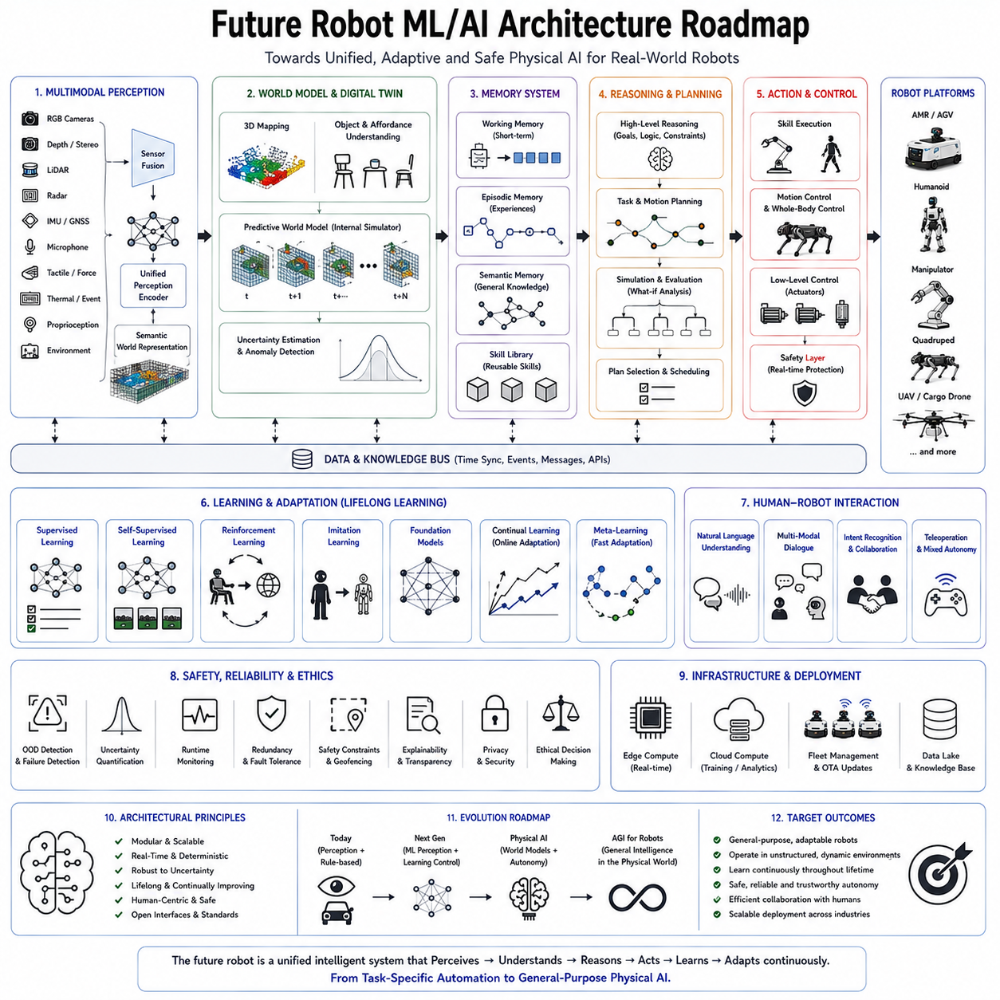{width="7.268055555555556in" height="7.268055555555556in"}

로봇 공학의 미래는 개별 머신러닝 알고리즘의 점진적인 개선이 아니라 인지, 추론, 메모리, 계획, 학습, 조작, 이동성, 언어 이해 및 자율적 의사 결정을 지속적으로 진화하는 하나의 인지 시스템으로 통합하는 통일된 지능형 아키텍처의 출현에 의해 정의될 것입니다. 산업용 로봇 공학의 첫 번째 세대 동안, 로봇은 고도로 구조화된 환경 내에서 신중하게 프로그래밍된 궤적을 실행하는 본질적으로 결정론적인 기계였습니다. 두 번째 세대는 머신러닝을 도입하여 로봇이 데이터 기반 접근 방식을 통해 물체를 인식하고, 이미지를 분류하며, 포즈를 추정하고, 특정 행동을 최적화할 수 있도록 했습니다. 물리적 AI(Physical AI) 또는 체화된 AI(Embodied AI)로 흔히 설명되는 다음 세대는 격리된 지능형 모듈에서 벗어나 물리적 세계를 이해하고, 경험으로부터 지속적으로 학습하며, 여러 모달리티에 걸쳐 추론하고, 장기 배포 전반에 걸쳐 안전하게 적응할 수 있는 완전한 자율 인지 시스템을 향한 근본적인 전환을 나타냅니다. 따라서 미래의 로봇 AI 아키텍처는 독립적인 신경망들의 모음으로 볼 수 없습니다. 대신, 인지, 메모리, 추론, 계획, 행동 및 지속적인 학습 전반에서 구성 요소들이 동적으로 협력하는 통합 지능 플랫폼으로 기능해야 합니다.

미래의 아키텍처를 형성하는 가장 중요한 관찰 중 하나는 단 하나의 학습 패러다임만으로는 일반적인 로봇 지능을 달성할 수 없다는 점입니다. 지도 학습은 인지와 인식에 탁월하지만 라벨링된 데이터셋에 크게 의존합니다. 자기 지도 학습은 방대한 양의 라벨링되지 않은 데이터에서 일반화된 표현을 추출합니다. 강화학습은 환경과의 상호 작용을 통해 순차적인 의사 결정을 가능하게 합니다. 모방 학습은 인간의 전문 지식을 로봇 정책으로 효율적으로 전이합니다. 파운데이션 모델은 광범위한 멀티모달 지식을 제공하는 반면, 월드 모델은 예측과 시뮬레이션을 지원합니다. 미래의 로봇 지능은 하나의 패러다임이 다른 패러다임을 대체하는 것이 아니라, 이러한 상호 보완적인 학습 패러다임들의 조화로운 상호 작용으로부터 출현할 것입니다.

아키텍처의 토대는 멀티모달 인지로부터 시작됩니다. 미래의 로봇은 RGB 카메라, 깊이 센서, 스테레오 비전, 이벤트 카메라, LiDAR, 레이더, 열화상, 하이퍼스펙트럴 센서, 촉각 어레이, 힘-토크 센서, 관성 측정 장치, GNSS, 마이크, 진동 센서, 환경 센서, 고유 감각 및 착용형 인간 인터페이스의 정보를 지속적으로 통합할 것입니다. 각 감지 모달리티를 독립적으로 처리하는 대신, 통합된 인지 모델은 이기종의 관측치를 일관된 시맨틱 월드 표현으로 융합할 것입니다. 교차 모달 어텐션(Cross-modal attention) 메커니즘은 환경 조건과 현재 임무 목표에 따라 어떤 감각 정보가 우선순위를 받아야 하는지 동적으로 결정할 것입니다. 예를 들어, 일반적인 주간 운영 중에는 시각 감지가 지배적일 수 있는 반면, 연기, 어둠 또는 악천후 속에서는 레이더와 열 감지가 더 큰 영향을 미치게 됩니다.

대규모 멀티모달 파운데이션 모델은 개별 작업마다 독립적으로 학습된 전문 인지 네트워크를 점점 더 대체할 것입니다. 별도의 물체 탐지기, 시맨틱 세그멘테이션 네트워크, 포즈 추정기, 장면 분류기 및 행동 인식 시스템을 유지하는 대신, 미래의 아키텍처는 수많은 다운스트림 애플리케이션을 동시에 지원하는 일반화된 표현을 추출할 수 있는 통합된 인코더를 채택할 것입니다. 인터넷 규모의 이미지 컬렉션, 비디오 시퀀스, 시뮬레이션 환경, 로봇 데이터셋 및 멀티모달 상호 작용을 사용한 대규모 사전 학습은 산업 자동화, 물류, 의료, 농업, 인프라 점검, 제조업, 서비스 로봇 공학 및 가정 환경 전반에 걸쳐 전이 가능한 풍부한 시맨틱 이해를 제공할 것입니다. 일반화된 표현이 이미 광범위한 시각적 및 물리적 지식을 캡처하고 있기 때문에, 작업 특정적 적응은 비교적 적은 양의 추가 도메인 데이터를 필요로 할 것입니다.

인지를 넘어 시맨틱 월드 이해가 존재합니다. 현대의 로봇은 주로 물체를 탐지하고, 환경을 분류하며, 기하학적 구조를 추정합니다. 미래의 아키텍처는 대신 물리적 물체, 공간적 관계, 기능적 어포던스(affordances), 인과적 상호 작용, 인간의 의도, 시간적 진화 및 예측된 미래 상태를 표현하며 지속적으로 진화하는 월드 모델을 구축할 것입니다. 격리된 센서 측정값을 관찰하는 대신, 로봇은 주변 환경의 내부 디지털 트윈을 유지할 것입니다. 모든 인지 업데이트는 이 내부 월드 모델을 수정하여, 추론이 즉각적인 관측을 넘어 장기 호라이즌 예측 및 반사실적(counterfactual) 시뮬레이션으로 확장되도록 합니다.

월드 모델은 향후 10년 동안 기대되는 가장 변혁적인 아키텍처 혁신 중 하나를 나타냅니다. 월드 모델은 현재의 관측, 계획된 행동 및 축적된 지식을 기반으로 환경 진화를 지속적으로 예측하는 내부 시뮬레이터 역할을 합니다. 물리적 행동을 실행하기 전에, 로봇은 여러 가능한 미래를 정신적으로 시뮬레이션하고, 예측된 결과를 평가하며, 대안 전략을 비교하고, 불확실성을 추정하며, 장기 목표를 극대화하는 행동을 선택할 것입니다. 내부 시뮬레이션은 위험한 시행착오 탐색에 대한 의존도를 줄이는 동시에 계획 효율성을 드라마틱하게 향상시킵니다. 나아가 예측 오류는 가치 있는 학습 신호가 되어, 배포 전반에 걸쳐 환경 이해를 지속적으로 정제할 수 있도록 합니다.

메모리 아키텍처는 전통적인 순환 신경망을 넘어 실질적으로 진화할 것입니다. 미래의 로봇 지능은 동시에 작동하는 여러 상호 보완적인 형태의 메모리를 필요로 합니다. 작업 메모리(Working memory)는 진행 중인 조작 시퀀스, 대화 맥락, 주행 목표 및 즉각적인 환경 관측을 포함하여 현재 작업과 관련된 정보를 일시적으로 저장합니다. 일화적 메모리(Episodic memory)는 이전 임무, 성공, 실패, 인간 상호 작용, 특이한 상황 및 운영 사고를 설명하는 완전한 경험을 기록합니다. 시맨틱 메모(Semantic memory)는 물체 속성, 도구 사용, 환경 구조 및 절차적 개념을 포함하여 반복된 경험에서 추출된 일반화된 지식을 축적합니다. 절차적 메모리(Procedural memory)는 보행, 파지, 조작, 주행 및 협력 행동을 포함하여 학습된 운동 기술을 표현합니다. 이러한 메모리 시스템들은 함께 로봇이 단순히 반응하는 것을 넘어 축적된 경험을 바탕으로 회상하고, 비교하며, 일반화하고, 적응할 수 있도록 합니다.

대형 언어 모델은 단순히 대화형 인터페이스에 그치지 않고 추론 엔진으로서 점점 더 많은 역할을 할 것입니다. 자연어는 목표, 계획, 설명, 지침, 제약 조건 및 추상적 개념을 표현하기 위한 유연한 상징적 매체를 제공합니다. 미래의 로봇은 언어 매개 추론을 사용하여 복잡한 목표를 실행 가능한 하위 작업으로 분해하고, 내부 결정을 인간 작업자에게 설명하며, 협력 활동을 조율하고, 불완전한 지침을 해석하며, 실패 후 회복 전략을 생성하고, 운영 상태를 자연스럽게 전달할 것입니다. 따라서 언어는 외부 소통만큼이나 계획과 추론을 지원하는 내부 인지 표현이 됩니다.

그러나 물리적 상호 작용은 센서모터(sensorimotor) 경험에 기반한 이해를 요구하기 때문에 언어 추론만으로는 물리적 AI에 불충분합니다. 결과적으로 미래의 아키텍처는 상징적 추론을 체화된 월드 모델과 결합하여, 추상적인 개념이 물리적 관측 및 행동과 직접 연결된 상태를 유지하도록 할 것입니다. "바쁜 통로를 피하면서 깨지기 쉬운 컨테이너를 점검 스테이션으로 이동하라"와 같은 명령은 언어 이해, 물체 인식, 조작 계획, 주행 추론, 인간 행동 예측 및 안전 평가를 동시에 요구합니다. 통합된 인지 아키텍처는 공유된 잠재 표현을 통해 이러한 멀티모달 추론을 자연스럽게 수행할 것입니다.

계획 시스템도 이와 유사하게 결정론적 경로 계획에서 계층적 인지 계획으로 진화할 것입니다. 전략 플래너는 수분 또는 수시간에 걸치는 장기 임무 목표를 결정합니다. 전술 플래너는 주행, 조작, 소통 및 자원 할당을 조율하는 작업 시퀀스를 생성합니다. 반응형 플래너는 변화하는 환경 조건에 따라 즉각적인 행동을 지속적으로 적응시킵니다. 강화학습은 적응형 의사 결정을 기여하는 반면, 상징적 계획은 해석 가능한 작업 분해와 논리적 제약 조건 만족을 제공합니다. 따라서 계층적 계획은 유연성과 예측 가능성의 균형을 맞추어, 로봇이 동적인 환경에 반응성을 유지하면서도 복잡한 목표를 추구할 수 있도록 합니다.

조작 아키텍처는 격리된 파지 계획 알고리즘을 대체하는 비전-언어-행동(vision-language-action) 모델을 점점 더 통합할 것입니다. 미래의 로봇은 통합된 멀티모달 표현을 통해 물체 어포던스를 이해하고, 인간의 의도된 사용법을 추론하며, 물체 역학을 예측하고, 접촉력을 추정하며, 전신 조작을 조율할 것입니다. 정교한 조작은 수동으로 엔지니어링된 파지 라이브러리에 덜 의존하고, 새로운 물체, 도구, 재료 및 환경 조건 전반에 걸쳐 지속적으로 적응할 수 있는 일반화된 정책에 더 많이 의존할 것입니다. 고밀도 촉각 감지, 힘 피드백 및 적응형 제어가 장착된 다지 로봇 손은 막대한 양의 인간 데모 데이터와 시뮬레이션된 조작 경험을 사용하여 학습된 파운데이션 모델과 협력할 것입니다.

보행 시스템 역시 통일된 전신 제어를 향해 전환될 것입니다. 다리, 팔, 몸통, 머리 및 센서를 독립적으로 제어하는 대신, 미래의 아키텍처는 안정성, 에너지 효율성, 조작 요구 사항, 환경적 상호 작용 및 인간 협업에 따라 전신 모션을 공동으로 최적화할 것입니다. 강화학습, 모델 예측 제어 및 미분 가능한 물리학이 계층적 아키텍처 내에서 협력할 것이며, 상위 수준 지능이 거동 목표를 결정하는 반면 로우 레벨 제어기는 동적 안정성과 안전을 보장할 것입니다.

에지 AI 컴퓨팅은 점점 더 이종(heterogeneous)화될 것입니다. 미래의 로봇 플랫폼은 CPU, GPU, NPU, 전용 AI 가속기, 프로그래머블 로직, 뉴로모픽 프로세서, 이벤트 기반 비전 하드웨어 및 고속 메모리 시스템을 하나의 통합된 컴퓨팅 패브릭으로 통합할 것입니다. 모든 워크로드를 동일하게 실행하는 대신, 지능형 스케줄러는 레이턴시 요구 사항, 에너지 제약, 열 조건 및 작업 우선순위에 따라 컴퓨팅을 동적으로 할당할 것입니다. 실시간 인지는 전용 AI 가속기에서 실행될 수 있는 반면, 장기 호라이즌 추론은 강력한 GPU를 활용하고 결정론적 안전 제어기는 실시간 프로세서에서 독립적으로 작동합니다. 따라서 AI 워크로드가 계속 확장됨에 따라 하드웨어-소프트웨어 공동 설계가 점점 더 중요해질 것입니다.

클라우드-에지 협업 또한 유의미하게 진화할 것입니다. 통신 레이턴시와 네트워크 신뢰성이 적시 반응을 보장할 수 없기 때문에 즉각적인 인지, 안전 감독, 제어 및 미션 크리티컬 추론은 온보드에 반드시 유지되어야 합니다. 그러나 대규모 모델 재학습, 플리트 학습, 디지털 트윈 시뮬레이션, 지식 공유, 소프트웨어 배포 및 조직적 분석은 중앙 집중식 클라우드 인프라로부터 큰 이득을 얻습니다. 따라서 미래의 아키텍처는 컴퓨팅 요구 사항과 운영 제약에 따라 에지 디바이스와 클라우드 플랫폼 간에 지능을 동적으로 분배할 것입니다.

디지털 트윈은 로봇 지능의 기본 구성 요소가 될 것입니다. 배포된 모든 로봇은 현재의 하드웨어 상태, 환경 상태, 운영 이력, 유지보수 기록, 학습된 지식 및 예측된 미래 거동을 표현하며 지속적으로 동기화되는 가상의 대응물을 가질 것입니다. 디지털 트윈은 시뮬레이션, 예측 유지보수, 소프트웨어 검증, 정책 평가, 작업자 교육, 임무 리허설 및 실패 분석을 지원합니다. 고위험 작업을 실행하기 전에, 로봇은 자신의 디지털 트윈 내에서 후보 전략을 점점 더 평가하여 예측 시뮬레이션을 통해 운영 리스크를 줄일 것입니다.

평생 학습은 또 다른 결정적인 아키텍처 기능을 나타냅니다. 운영 환경이 지속적으로 진화하기 때문에 미래의 로봇은 배포 후 정적인 상태로 유지될 수 없습니다. 창고는 새로운 재고를 도입하고, 공장은 생산 라인을 수정하며, 병원은 새로운 절차를 채택하고, 도시는 새로운 인프라를 건설하며, 농지는 계절에 따라 변합니다. 주기적으로 완전한 AI 시스템을 교체하는 대신, 미래의 아키텍처는 이전 역량을 보존하면서 지식을 점진적으로 축적할 것입니다. 리플레이 메커니즘, 지속 학습 알고리즘, 지식 증류, 능동 학습, 불확실성 추정 및 인간 검증이 협력하여 파멸적 망각 없이 안전한 장기 적응을 지원할 것입니다.

플리트 지능은 학습을 드라마틱하게 가속화할 것입니다. 모든 로봇이 독립적으로 학습하는 대신, 전 세계 배포 전반에서 수집된 운영 경험이 중앙 집중식 조직 지식에 기여할 것입니다. 한 공장에서 마주한 어려운 조작 시나리오, 한 사족 보행 로봇이 주행한 특이한 지형 또는 한 창고 로봇이 탐지한 드문 장애물 구성은 검증 후 전체 플리트에게 즉시 가치 있는 학습 자원이 됩니다. 연합 학습(Federated learning)과 개인정보 보호 분산 최적화는 민감한 운영 데이터를 불사용하게 노출하지 않으면서 협력적인 개선을 가능하게 할 것입니다.

AI 안전은 미래의 로봇 지능과 분리될 수 없는 상태로 유지될 것입니다. 자율성이 증가함에 따라 런타임 모니터링, 불확실성 정량화, 분포 외 탐지, 이상 탐지, 설명 가능성, 결정론적 안전 감독, 사이버 보안 및 형식 검증이 점점 더 중요해집니다. 미래의 아키텍처는 환경 조건뿐만 아니라 자체 내부 신뢰도와 운영 한계도 지속적으로 평가할 것입니다. 지능형 시스템은 자신의 역량을 넘어서는 상황을 인식하고, 적절할 때 인간의 지원을 요청하며, 불확실성 하에서 운영 공격성을 줄이고, 작업자에게 추론을 투명하게 설명할 것입니다. 역량 한계에 대한 자기 인식은 역량 자체를 키우는 것만큼이나 중요해집니다.

설명 가능성 역시 Grad-CAM이나 SHAP와 같은 격리된 시각화 기술을 넘어 진화할 것입니다. 미래의 로봇은 월드 모델과 계획 프로세스에 기반한 시맨틱 설명을 생성할 것입니다. 단순히 예측에 영향을 미치는 이미지 영역을 강조하는 대신, 로봇은 왜 해당 행동이 선택되었는지, 어떤 환경적 가정이 계획을 가이드했는지, 어떤 불확실성이 해결되지 않은 채 남아 있는지, 어떤 대안 전략이 고려되었는지, 그리고 왜 특정 안전 제약 조건이 선호되는 목표보다 우선했는지를 설명할 것입니다. 이러한 설명은 작업자의 신뢰, 규제 준수, 디버깅 효율성 및 협력적인 인간-로봇 상호 작용을 실질적으로 향상시킵니다.

사이버 보안은 독립적인 하위 시스템으로 존재하는 대신 AI 아키텍처와 깊이 통합될 것입니다. 보안 부트 메커니즘, 인증된 소프트웨어 업데이트, 암호화된 통신, 하드웨어 신뢰 루트, 적대적 견고성, 런타임 무결성 모니터링, 거동 아노말리 탐지 및 분산 인증은 점점 더 자율화되는 로봇 시스템을 악의적인 간섭으로부터 보호할 것입니다. AI 자체는 지능형 침입 탐지 및 적응형 방어 전략을 통해 사이버 보안에 기여하는 동시에 결정론적 보안 메커니즘에 의해 감독될 것입니다.

인간-로봇 협업은 명령-반응 상호 작용에서 공유된 인지 파트너십을 향해 전환될 것입니다. 로봇은 인간의 의도, 업무 부하, 전문 지식, 선호도, 감정 상태 및 협력 목표에 대한 모델을 유지할 것입니다. 자연어 대화, 제스처 인식, 시선 추적, 착용형 감지, 증강 현실 및 맥락적 추론이 직관적인 협력을 지원할 것입니다. 로봇은 명시적인 명령을 수동적으로 기다리는 대신, 의도를 투명하게 유지하고 인간의 권위를 존중하면서 선제적으로 지원 기회를 예상할 것입니다.

에너지 최적화는 아키텍처 설계에 점점 더 많은 영향을 미칠 것입니다. 대형 파운데이션 모델은 상당한 컴퓨팅 자원을 요구하지만, 이동 로봇은 배터리 용량에 의해 제약을 받습니다. 따라서 미래의 AI 아키텍처는 적응형 추론, 조건부 컴퓨팅, 희소 활성화, 모델 압축, 양자화, 동적 신경 라우팅 및 계층적 추론을 채택할 것입니다. 간단한 상황은 가벼운 인지 모델만을 요구할 수 있는 반면, 고도로 복잡한 시나리오는 점진적으로 더 큰 추론 시스템을 활성화합니다. 적응형 컴퓨팅은 역량을 희생하지 않으면서 운영 효율성을 실질적으로 향상시킵니다.

시뮬레이션과 물리적 배포 간의 경계는 계속해서 사라질 것입니다. 로봇은 가상 경험과 물리적 경험 모두로부터 지속적으로 학습할 것입니다. 광학 현실적 시뮬레이션, 생성형 월드 모델 및 절차적 환경 생성을 통해 생성된 합성 데이터는 배포 중에 수집된 운영 관측치를 보완할 것입니다. Sim-to-real 및 real-to-sim 피드백 루프는 비용이 많이 드는 물리적 실험을 최소화하면서 점점 더 빠른 정책 개선을 가능하게 할 것입니다.

범용 로봇 파운데이션 모델은 결국 많은 작업 특정적 아키텍처를 대체할 것입니다. 주행, 조작, 점검, 언어 이해, 계획 및 협업을 위한 독립적인 모델을 유지하는 대신, 통합된 인지 아키텍처는 광범위한 물리적 지능을 지원하는 공유된 내부 표현을 개발할 것입니다. 제조업, 물류, 의료, 농업, 인프라 점검 또는 가사 보조와 같은 특정 산업을 위한 미세 조정은 비교적 완만한 적응만을 필요로 할 것입니다. 일반화된 지식이 사전 학습된 체화된 파운데이션 모델 내에 이미 존재하기 때문입니다.

장기 로드맵은 물리적 체화와 통합된 인공 일반 지능(AGI)을 향해 확장됩니다. 가상 환경 내에서 작동하는 순수 디지털 AGI 시스템과 달리, 체화된 지능은 물리학, 인과 관계, 불확실성, 인간 상호 작용, 기계적 제약, 에너지 관리 및 실제 결과를 이해해야 합니다. 따라서 물리적 AI는 추상적인 상징적 추론에만 의존하는 대신 물리적 세계와의 지속적인 상호 작용을 통해 인지가 기반을 두게(grounded) 되므로 더 일반적인 지능을 향한 필수적인 경로를 제공합니다.

궁극적으로 미래의 로봇 머신러닝 및 인공지능 아키텍처는 격리된 인지 네트워크나 개별 계획 알고리즘으로 구성되는 것이 아니라, 멀티모달 인지, 월드 모델, 메모리, 언어 추론, 계층적 계획, 적응형 학습, 에지 컴퓨팅, 클라우드 협업, 디지털 트윈, 플리트 지능, 안전 감독 및 지속적인 자기 개선을 통합하는 통일된 인지 생태계로 구성될 것입니다. 배포된 모든 로봇은 자율 작업자, 학습 에이전트, 협력 파트너인 동시에 집단적인 조직 지식의 기여자로서 동시에 기능할 것입니다. 인공지능은 작업 특정적 예측에서 벗어나 다양한 물리적 환경 전반에서 안전하게 이해하고, 추론하며, 학습하고, 소통하며, 행동할 수 있는 종합적인 체화된 인지를 향해 진화할 것입니다. 이러한 아키텍처적 진화는 미래의 물리적 AI, 지능형 자율 로봇, 그리고 궁극적으로 인간 수준의 체화된 인공지능이 구축될 토대를 나타냅니다.

41.12.10 미래 로봇 머신러닝/인공지능 아키텍처 로드맵
